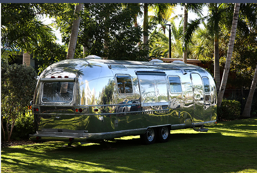
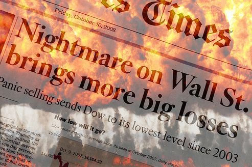

# Management Planning: Silver Bullet Restorations

You are co-owner of Silver Bullet Restorations, a vintage RV restoration
business that specializes in vintage aluminum travel trailers. The
economy has been very unpredictable the last few years, and between
soaring inflation and customer reluctance to sink money into vintage
restorations, you are not sure what the future will bring for your
business. You have some options that might help, but there is risk
involved with each one. What should you do to keep your business on
the road? Let's find out!

# Management Planning
## Silver Bullet Restorations

## Activity Description

You are co-owner of Silver Bullet Restorations, a vintage RV restoration business that specializes in vintage aluminum travel trailers. The economy has been very unpredictable the last few years, and between soaring inflation and customer reluctance to sink money into vintage restorations, you are not sure what the future will bring for your business. You have some options that might help, but there is risk involved with each one. What should you do to keep your business on the road? Let's find out!

## Learning Objectives

After completing this activity you will be able to:

- Understand the fundamentals of management. (60% of overall score)
- Understand planning and decision making. (40% of overall score)

## Evaluation and Scoring

You will be asked to respond to a variety of questions as you complete the activity, and your responses may impact both your score and what happens next.

You will not have the ability to go back and change your answer, so consider each answer option carefully.

Scoring is calculated as follows:

1. Points are received based on the answer you select for each question, and questions are tied to multiple scoring categories associated with the learning objectives.
2. Your scores for each category are based on the total number of points you earn for the associated questions.
3. You will receive one final activity score at the end of the activity that combines your results from each category.

## Characters

**AC**  
Co-founder and co-owner of Silver Bullet Restoration

**Kelly**  
Lead interior designer and sales representative at Silver Bullet Restoration

**Richard**  
Consultant at Belding Consulting Group

# Contex

**AC:**
Hi Raydel Castro Guerra, how's it going?

**Raydel Castro Guerra:**  
All is fine here. I finished up everything on that 1965 Airstream yesterday, and the customer picked it up.

**AC:**  
That is great! They were super happy with it! You and Kelly knocked that restoration out of the park. The inside and outside looked like new!

**Raydel Castro Guerra:**  
Yes, that '65 model is so cool! It really is a classic "silver bullet!"

**AC:**
It sure is! Problem is we don't have another one to restore at the moment.  
We had a couple possibilities, but neither one of them committed.  
This economic downturn and higher inflation are really hurting us!

**Kelly:**  
Ughh! I know. Sales have been so slow.  
We had a few people call last week asking if we restored all types of RVs  
and not just aluminum ones.  
Why is it we don't expand out to different makes and models?

**Raydel Castro Guerra:**
Kelly has a point here. Maybe we should branch out into other makes and models or maybe even into making and selling our interior designs that Kelly creates or maybe we could make and sell our custom bicycle carrier mounts that go on the back of RVs. Those have been a very popular add-on to our restorations.

**AC:**  
But our company name is Silver Bullet Restoration, so even our name defines what we do. If we start doing all these other things, I don’t know how we would manage it all. And we would have to probably hire more people to do all that, so how would that work in a sluggish economy?

**Raydel Castro Guerra:**  
I have thought about bringing in a consultant to help us figure out a way forward. I know a guy who works for Belding Consulting Firm, and I’m pretty sure they specialize in small businesses, like ours.

**AC:**
Well, alright. Maybe we need a set of new eyes on the business.  
I'm confused about what to do, so let's give them a call.

*Two weeks later, a business consultant named Richard shows up to evaluate the business.*

**Richard:**
Hi Raydel Castro Guerra and AC, I'm excited to help you all out.  
I have a method to my madness, so let's start from the beginning.  
Time is money, so let's get going.

I know this might sound too elementary, but I want to go right to the fundamentals.  
Let me ask you: what are the four functions of management?

## Answer

**Planning, organizing, leading, and controlling**

### Explanation

These are the four fundamental functions of management according to classical management theory, introduced by Henri Fayol and still widely used today.

The other options are incorrect because:

- *Planning, managing, leading, and accounting* — "Managing" is a general term, not a specific function, and "accounting" is an operational function, not a management function.
- *Management, marketing, accounting, and finance* — These are functional areas or departments of a business, not the functions of management.

**Raydel Castro Guerra:**
Planning, organizing, leading, and controlling.

**Richard:**  
Exactly! Good!

And which function of management pertains to analyzing your situation  
and determining how to be successful now and in the future?

## Answer

**A:** Planning

### Explanation

Planning is the management function that involves:

- Analyzing the current situation
- Setting goals and objectives
- Developing strategies to achieve success
- Determining actions for both the present and the future

The other options are incorrect because:

- **Leading** — Involves motivating, directing, and influencing employees to achieve organizational goals.
- **Organizing** — Involves arranging resources and tasks to implement the plan.
- **Controlling** — Involves monitoring performance and making corrections as needed.

**Richard:**
Yes, that is right. Planning is used to analyze the current situation,  
anticipate trends, and create a strategy to achieve the organization’s goals.

So, the next question I need to ask you is this:  
Why is it that you two started Silver Bullet Restoration?

**AC:**  
We started it because we love camping and old aluminum campers, and we just loved working on them to get them back on the road again.  
We also love vintage Americana, and we want to do what we can to help bring back that classic American summer vacation for families.

*Observe new image on the right.*

**Richard:**
So, I'm hearing that you are committed to restoring vintage items  
that pertain to camping, and that you have deep knowledge of  
working on and creating these types of products so families can have  
a fun, enjoyable classic vacation.

**Richard:**  
It sounds like you are declaring your intentions for the business,  
so what is this type of over‑arching, fundamental statement called?

## Answer

**A:** Mission statement

### Explanation

A **mission statement** is an overarching, fundamental statement that declares:

- The purpose of the organization
- Why the business exists
- What the business intends to accomplish
- The values and principles that guide the organization

In this case, AC's declaration — *"We started it because we love camping and old aluminum campers... we want to do what we can to help bring back that classic American summer vacation for families"* — is a clear example of a mission statement.

The other options are incorrect because:

- **Strategy** — A plan of action designed to achieve long-term goals, not a statement of purpose.
- **Goal statement** — A specific, measurable target or objective, not an overarching declaration of purpose.

**Raydel Castro Guerra:**
Mission statement.

**Richard:**  
That is right! The mission statement is a declaration of the reasons why  
you started the business.

**Raydel Castro Guerra:**
So, our mission statement is really telling us that we have a purpose of  
helping to create that classic, vintage Americana vacation for people?

**AC:**  
Yes, you know, that sure does sound like what we have been trying to do,  
although we might have limited ourselves on how to do it.

**Richard:**  
Possibly so. Let's dive in a bit more to uncover a plan forward.  
Where do you see Silver Bullet Restoration in five years from now?

*Observe new image on the right.*

**Raydel Castro Guerra:**
Hmmm … well, that is a tough question.  
We have been in business for just over five years now, and we are pretty  
much doing the same thing we set out to do … restoring vintage aluminum  
campers. I imagine we will keep on doing this in the next five years too.

**Richard:**  
True, but you mentioned that sales have really slumped the past year  
due to the economy, inflation, and global uncertainty.

By the mere fact that you and AC hesitated with your answer about  
the next five years, I am pretty certain you do not have defined  
goals with policies and strategies mapped out to accomplish those goals.  
Do you know what this process is called?

## Answer

**A:** Strategic planning

### Explanation

**Strategic planning** is the process of:

- Defining long-term goals and objectives (typically 3-5 years or more)
- Developing policies and strategies to achieve those goals
- Allocating resources to implement the strategies
- Determining the direction and scope of the organization

In this case, Richard points out that Raydel Castro Guerra and AC hesitated when asked where they see the business in five years, indicating they lack defined goals and mapped-out strategies — meaning they have not engaged in strategic planning.

The other options are incorrect because:

- **Tactical planning** — Shorter-term planning (usually less than one year) that focuses on implementing specific actions and tasks to support the strategic plan.
- **Goal definition** — This is only one component of planning (setting specific, measurable objectives), not the comprehensive process of mapping out policies and strategies to accomplish those goals.

**Richard:**
Yes, that is right on the money! You do not really know for certain where  
you are headed in the future.

**Raydel Castro Guerra:**  
Yes! We need a clear strategy for our business moving forward so we don't  
constantly wonder what we should be doing. But … how do we figure out a  
strategy?

**Richard:**  
I thought you'd never ask! Haha!

There is an analyzation tool that is used to help people assess what the  
business is good at, what they are bad at, what they could be doing, and  
what is trying to prevent them from succeeding.  
What is this technique called?

## Answer

**A:** SWOT analysis

### Explanation

**SWOT analysis** is a strategic planning tool that examines four key elements:

- **S**trengths — What the business is good at (internal positive factors)
- **W**eaknesses — What the business is bad at (internal negative factors)
- **O**pportunities — What the business could be doing (external positive factors)
- **T**hreats — What is trying to prevent the business from succeeding (external negative factors)

This tool helps organizations assess their current position and develop strategies for future success.

The other options are incorrect because:

- **Decision-making model** — A structured process for making choices among alternatives, not specifically a tool for analyzing internal and external factors.
- **Contingency planning** — A process of preparing alternative plans to respond to unexpected events or emergencies, not an analytical assessment tool.

**Raydel Castro Guerra:**
SWOT analysis.

**Richard:**  
Good!

**Raydel Castro Guerra:**  
Believe it or not, but I actually remembered this from a business  
class I took a while back.

**Richard:**  
What does SWOT stand for?

## Answer

**A:** Strengths, Weaknesses, Opportunities, and Threats

### Explanation

**SWOT** is an acronym that represents the four key elements of this strategic planning tool:

- **S**trengths — Internal positive factors (what the business is good at)
- **W**eaknesses — Internal negative factors (what the business is bad at)
- **O**pportunities — External positive factors (what the business could be doing)
- **T**hreats — External negative factors (what is trying to prevent success)

The other options are incorrect because:

- **Sales, Weakness, Obligations, and Threats** — "Sales" and "Obligations" are not part of the SWOT framework.
- **Strengths, Worries, Opportunities, and Tactics** — "Worries" and "Tactics" are not the correct terms; the correct terms are Weaknesses and Threats.

**Raydel Castro Guerra:**
Strengths, Weaknesses, Opportunities, and Threats.

**Richard:**  
Yes! Good!

**Richard:**  
Since the economy is one of your major problems,  
what category of the SWOT analysis does it fit into?

*Observe new image on the right.*

## Answer

**A:** Threats

### Explanation

In a SWOT analysis, **Threats** are external negative factors that could harm the business. The economy, inflation, and economic downturns are external forces outside the company's control that pose risks to success.

The other options are incorrect because:

- **Strengths** — Internal positive factors (what the business is good at). The economy is external, not internal.
- **Opportunities** — External positive factors (what the business could be doing). The economy is currently a problem, not a positive opportunity.
- **Weaknesses** — Internal negative factors (what the business is bad at). The economy is an external factor, not an internal weakness of the business.

**Raydel Castro Guerra:**
Threats.

**Richard:**  
Yes, it is an external threat that you have little to no control over.

The next step in my process of consulting is to have you create your own  
SWOT analysis. In the next two weeks, I want you and AC and Kelly to all  
sit down and make a list of the **STRENGTHS** of Silver Bullet Restoration,  
the **WEAKNESSES**, the **OPPORTUNITIES**, and the **THREATS**.

**AC:**  
Alright, that would be a great idea. Let's make up our own list for each  
category, email them to me, and then we can meet next week to hash them out  
into one singular SWOT analysis.  

Richard, we will meet back with you in two weeks.

*You meet the following week with AC and Kelly to discuss the SWOT analysis.*

**AC:**  
Hi Raydel Castro Guerra and Kelly. I received your SWOTs, and I merged  
them into this unified list. Check it out.

*Observe new image on the right.*

**Kelly:**
Very good! I was surprised to see the internal strengths we have going for us.  
I think we are a pretty talented bunch, if I do say so myself!

**Raydel Castro Guerra:**  
Exactly! That stood out to me too, but so did the list of opportunities and the  
threats. But what do we do with this list? How do we figure out what to do?

*Materials on the right have been updated →*

## SWOT Analysis

| **Strengths** | **Weaknesses** |
|--------------|----------------|
| Knowledgeable, skilled workers at SBR | Lack of management plan for the future |
| Creative, unique designs | Lack of camper variety being restored |
| Leading aluminum camper restorer in region | Lack of product variety overall at SBR |
| Ability to adapt to customization of products | |
| Valuable tools and assets | |
| Large building to house production | |
| Unique and recognized brand name & image | |
| Five‑year longevity | |
| Profitable since the first year of operation | |

| **Opportunities** | **Threats** |
|------------------|-------------|
| Restoring other types of vintage campers | Worsening economy |
| Selling unique interior design plans | Higher inflation |
| Making & selling custom camper door signs | Increased costs of supplies |
| Hiring more employees to expand | Competition from local competitors |
| Cutting employees to save money | Higher gas prices – fewer campers towing |

**AC:**
Hmmm … I wondered that too.  
Let's meet back with Richard, and he can help guide us.

*The following week, Richard returns to meet with the three of you.*

**Richard:**
Hello again! Good to be back. I have been reviewing the SWOT you sent me.

**AC:**  
Great, but we are not sure what we do now.

**Richard:**  
I understand. This is a tough decision, but what you need to do now is to  
analyze your internal strengths and weaknesses, and then try to minimize  
your weaknesses the best you can.  

You also need to think about how you can react or plan for the threats you  
are faced with from the outside.

I've created three different strategic plan options for you to select from,  
but the challenge is that you only have the money and resources to pursue one.

I make it a policy **not** to tell my clients exactly what to do, since there  
are so many uncontrollable variables involved—and, after all, it’s your business.

**Richard:**
Check out these options and select the one that you believe will be the most successful.

## Answer

**A:** Restore aluminum campers only, sell unique interior design plans, and sell custom bike racks. 2 additional employees must be hired.

### Explanation

This option is the most balanced and strategic because:

**Alignment with Mission Statement:**
- The company's mission focuses on vintage camping and classic Americana. Restoring aluminum campers (the core business) stays true to this mission, while adding interior design plans and bike racks complements it without diluting the brand.

**Leverages Strengths:**
- Knowledgeable, skilled workers
- Creative, unique designs (Kelly's expertise)
- Leading aluminum camper restorer in the region
- Ability to adapt to customization
- Unique and recognized brand name ("Silver Bullet")

**Addresses Weaknesses:**
- Lack of product variety overall — adding interior design plans and bike racks diversifies revenue streams
- Does not add the risk of restoring unknown makes/models (lack of camper variety is partially addressed, but stays within aluminum expertise)

**Capitalizes on Opportunities:**
- Selling unique interior design plans
- Making & selling custom products (bike racks, door signs, etc.)

**Minimizes Threats:**
- Does not over-hire (only 2 additional employees instead of 4)
- Less exposure to worsening economy and inflation compared to expanding into unknown RV types
- Maintains focus on core competency (aluminum campers)

**Why the other options are less optimal:**

| Option | Why it's not the best |
|--------|----------------------|
| Restore additional types of vintage campers, sell interior design plans, and sell custom bike racks. Four additional employees must be hired. | Too much risk in a sluggish economy. Expanding into unknown RV types requires new skills, tools, and knowledge. Hiring 4 employees increases fixed costs significantly. |
| Continue with same operation: restoring aluminum campers only. No additional employees must be hired. | Does not address the lack of product variety or the need to diversify revenue streams. Sales have slumped, and doing nothing will not solve the problem. |

**Raydel Castro Guerra:**
Restore aluminum campers only, sell unique interior design plans, and sell  
custom bike racks. Two additional employees must be hired.

**Richard:**  
Interesting choice. You are splitting the growth of the business a little bit.

**Raydel Castro Guerra:**  
True. I think it's best to continue to restore aluminum campers only, since  
that is our area of expertise, but we also need to branch out and sell new  
products, such as the interior design plans and custom door signs.

**AC:**  
We will need to hire another fabricator to make the customer door signs, and  
then get Kelly going on selling interior design plans. That means we will  
have to hire a sales rep in her place. I'm so nervous!

**Richard:**  
Remember, I cannot predict the future, and I am not sure what the economy  
will do. If it continues to slump, then you may or may not be successful  
in your new strategy. But if the economy improves, then I think you have a  
good chance to make quite a bit more money than before.

*One year has now passed, and the economy is still sluggish and inflation has remained high.*

**AC:**
Hi Raydel Castro Guerra, Richard is on his way over to check in with us  
since it's been one year. Can you believe the economy just continued  
to get worse and worse?

**Raydel Castro Guerra:**  
No, this is terrible! There is no way we can sustain this, and we are  
going to have to make some serious cuts or changes.

**Richard:**  
Hi Raydel Castro Guerra and AC. Good to see you, although I certainly  
wish we were talking about something better than this economy.  

Your decision to not expand into restoring various models has proven  
detrimental due to limiting your market, and the fact that not as many  
people have been wanting to sink money into camper restorations.

*Observe new image on the right.*

**Raydel Castro Guerra:**
True. We took a risk, and it has not turned out the best, but we are almost  
breaking even. The added sales of the interior design plans and custom bike  
racks have actually helped out. It’s not ideal, but we might be able to hold  
off one more year if things don’t improve.

Yes, and we have no money to expand the business to add the ability to  
restore different makes of campers.

**Richard:**  
You made a strategic plan decision that is sound, but threats come in all  
sorts of forms. They are largely uncontrollable, but you are doing your best  
to minimize them.

Good job—and let’s hope next year improves!

## ✅ Activity Complete

### 📘 Fundamentals of Management  
**Score:** 100%  
**Status:** Excellent  

Good job! You demonstrated an understanding of the fundamental concepts of management, including:
- The four major functions of management  
- The creation of a mission and vision statement  
- The concept of goal creation  

---

### 🧠 Planning and Decision Making  
**Score:** 100%  
**Status:** Excellent  

Good job! You have demonstrated an understanding of the planning function of management, including:
- Decision making  
- Planning for the future  
- Strategic planning  
- SWOT Analysis  

---

### 🎯 Point Totals  
**Overall Performance:** Outstanding

## Point Totals

| Learning Objectives              | Points Earned | Points Available | Percent Correct | Objective Weight | Weighted Score |
|---------------------------------|---------------|------------------|-----------------|------------------|----------------|
| Fundamentals of Management      | 17            | 17               | 100%            | 60%              | 60.0%          |
| Planning and Decision Making    | 20            | 20               | 100%            | 40%              | 40.0%          |
| —                               | —             | —                | —               | —                | —              |
| **Total**                       | —             | —                | —               | **100%**         | **100%**       |