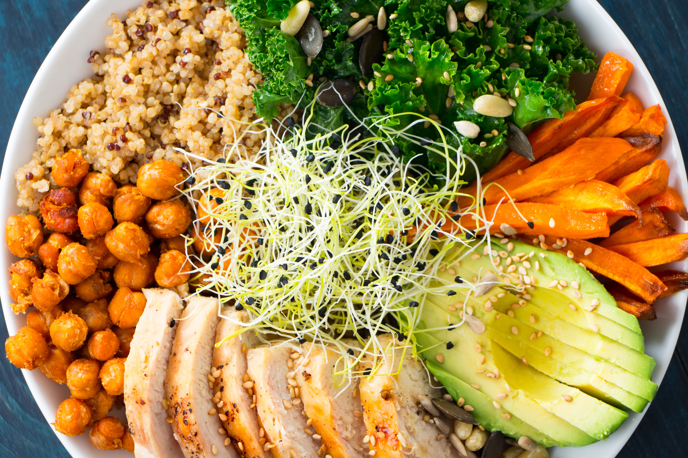
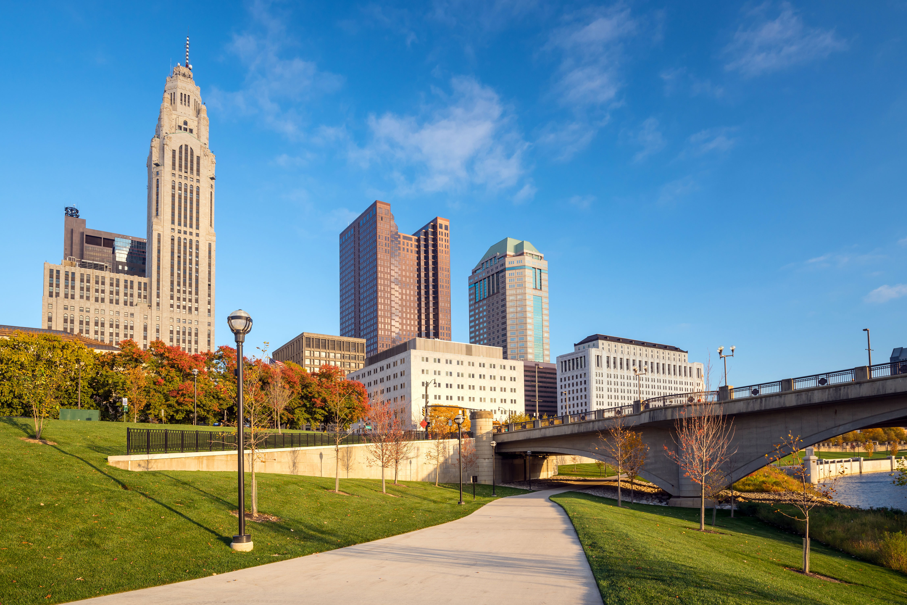
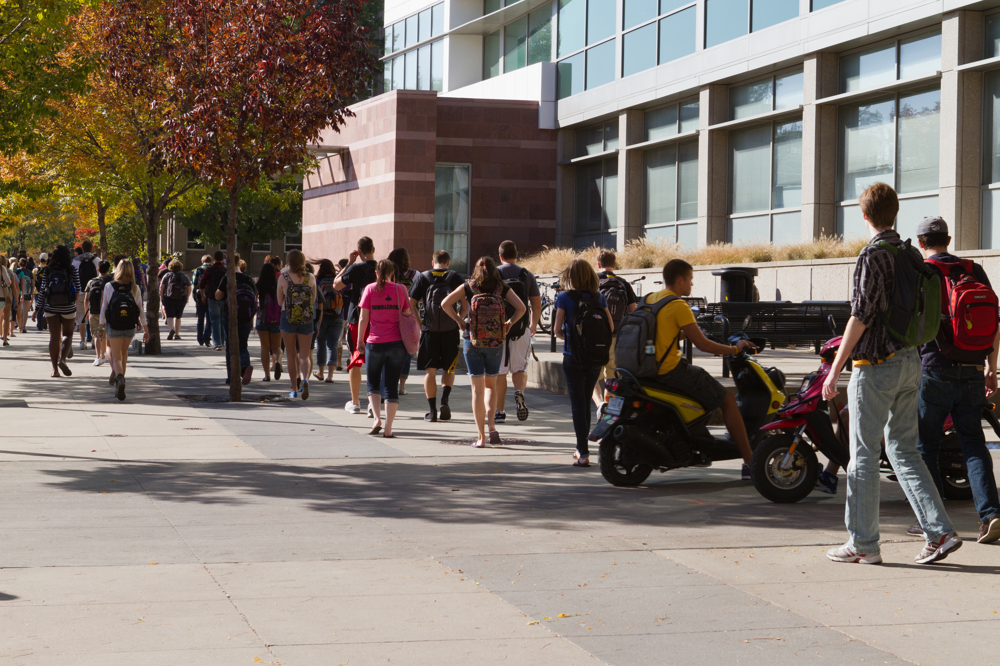
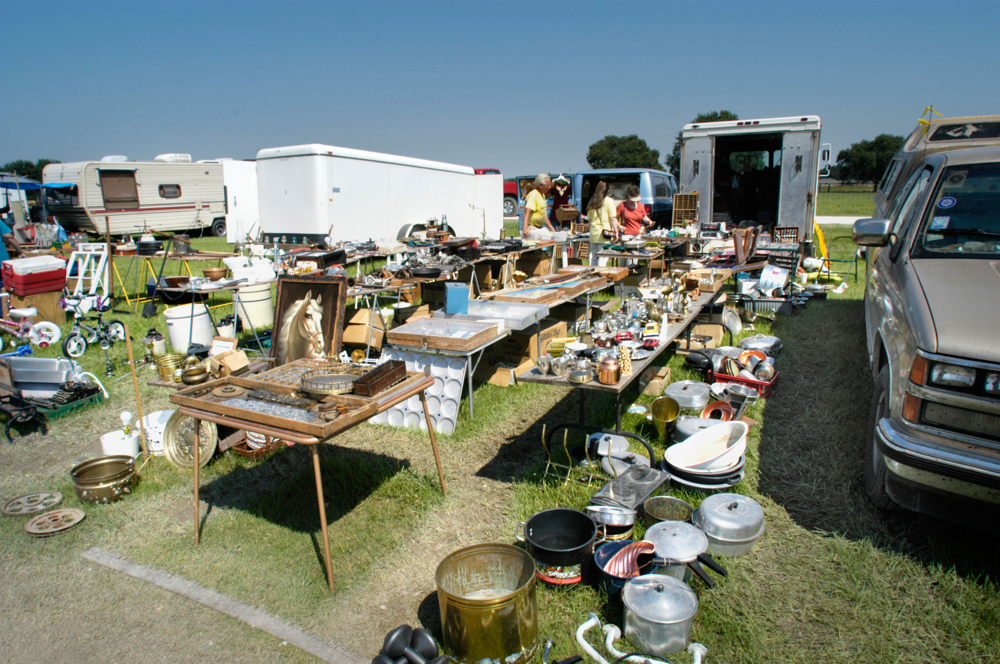
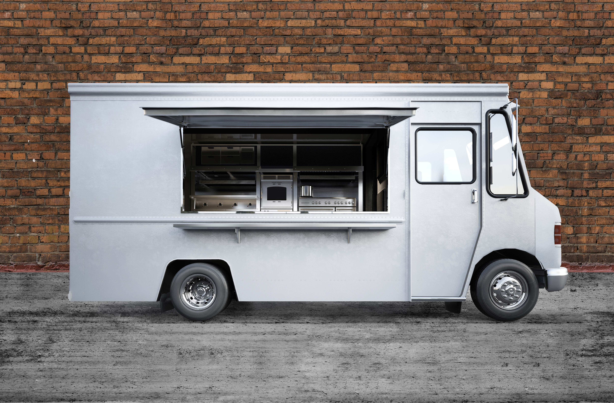
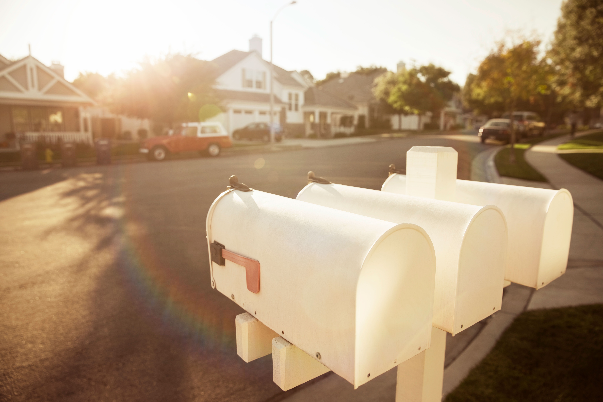
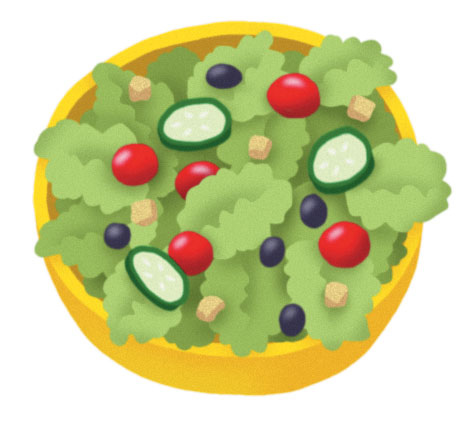

# The 4 Ps of Marketing: Frondescence Food Truck

After completing this activity, you'll be able to:

1. Identify which of the 4 Ps — product, place, promotion, and price — is affected by a marketing decision.
2. Determine the best overall marketing strategy based on the type of business and available customer information.
3. Maximize company sales revenue.

### Scenario

Jump into an internship with a food truck entrepreneur to make critical marketing decisions. Identify which of the 4 Ps each decision affects and guide the marketing strategy to maximize sales.

## Activity Description

You've been hired as a marketing intern to help Frondescence make decisions for its new food truck enterprise that it launched over the summer. "Frondescence" means foliage or vegetation. The food truck provides unique, fresh greens in a bowl with a multitude of toppings for health-conscious customers looking for an alternative lunch choice.

Using a modular service efficiency format, Frondescence offers a bowl filled with a layer of fresh mixed greens that can be customized with over 30 different toppings including one protein source and eight choices of dressings. Currently, customers may customize each dish upon ordering. Frondescence charges a standard price of $12.00 per meal, which includes a bottle of spring water.

As part of your internship, you'll have to make decisions related to:

1. Identifying the 4 Ps in the context of business decisions.
2. Using provided information to guide marketing strategy.
3. Maximizing sales revenue.

## Evaluation and Scoring

When you are asked a question, answer as you see fit; be aware, however, that your answers may impact both your activity score and what happens next, so consider your options carefully.

You'll be scored on three categories: **4 Ps**, **Marketing Strategy**, and **Cumulative Sales Revenue**.

- Points accrue based on the answer you select for each question.
- Categorical percentages are based on total points to which you are exposed.
- These scores will roll up via associated weights:
  - 40% from 4 Ps
  - 40% from Marketing Strategy
  - 20% from Cumulative Sales Revenue (based on revenue ranges)
- → into one overall score.

You can review these scores and feedback at the end of the activity, but categorical scores will be available at the top of the screen as you progress.

Additional information will be presented on the right side of the screen. Once a tab has been populated there, you can explore the content yourself, returning to it at any time you wish by clicking on the **Materials** button in the bottom, right-hand corner of the screen.

## General Help

This activity is screen reader accessible and may consist of text elements, images with alt text, videos with close captioning, audio recordings, tables, and a mix of media. Please use appropriate keyboard navigation to work through menus and advance the activity.

Some questions may be images, in which case alt text is provided and you should be able to move back and forth between the images before selecting the correct answer.

Generally speaking, these activities should be thought of as a conversation where you are playing a role. Please answer the responses as best you can with the information provided.

## Score Weights

### Learning Objective Weights

| Learning Objective | Percent of Grade |
|--------------------|------------------|
| Four Ps | 40% |
| Marketing Strategy | 40% |
| Real Cumulative Sales Revenue | 20% |

## Current Scores

- **Four Ps:** 100%
- **Marketing Strategy:** 100%
- **Marketing Budget:** $1,200

## Cast

**Ariel Harper**

Ariel is the owner of "Frondescence" and started the venture a year ago operating only during the summer time. Now she is ready to operate and promote the truck year round.

**Silas Lee**

Silas is Ariel's only full-time employee. He oversees the truck's daily operation and the part-time employees. He is an avid vegan and fell in love with her idea.

## Context

**Ariel Harper**

Welcome to Frondescence, Raydel Castro Guerra! We are excited to have you join the team and help us make our marketing decisions.

**Silas Lee**

Yes, definitely! Good to meet you! Ariel and I know we can grow our sales. We have some options, but we need your expertise to make the best choices for our little venture!

> Please review the current food truck offerings below side of the screen.

> **Materials on below have been updated**

## Frondescence Food Truck

### Basic Information

- Standard salad bowl size with leafy green base and unlimited individual toppings
- 30 choices of toppings including:
  - Grilled chicken, pork, tofu, or black beans
  - Eight choices of dressings
- Bottle of spring water

**Price:** $12.00

---

## Context

**Ariel Harper**

We have set aside a $1,200 budget to cover our marketing expenses over the next couple of months. We'll have to use this to pay for all marketing expenses including the site permits required to sell the product. Because we are a new business, that's all that we can allocate at this time.

**Silas Lee**

This summer we have been taking the truck to different local community events. This involves a great deal of driving every day, but sometimes they are not well attended. Should we look at other options?

> **Which of the 4 Ps does Silas think they need to change?**

---
## Question

**Which of the 4 Ps does Silas think they need to change?**

## Answer

**Place**
</img>

## Explanation

The 4 Ps of Marketing are:

| P | Definition | Example |
|---|------------|---------|
| **Product** | What you are selling | Salad bowls, toppings, water |
| **Price** | How much customers pay | $12.00 per meal |
| **Place** | Where and how you sell/distribute the product | Food truck locations, events, permits |
| **Promotion** | How you communicate with customers | Advertising, social media, signage |

Silas is concerned about:
- Driving to different community events
- Events not being well attended

This directly relates to **Place** — the location and distribution channels where the product is sold. He is questioning whether they should change where they sell (look for other options) to find better locations with more customers.

---

## Context

## Context

> **Perfect! Ariel and Silas want to explore new places to take the truck.**

**Ariel Harper**

We need to find better places to sell our product. I have three ideas we could pursue, but each one requires a six month commitment. We also have our $1,200 budget constraint, which must cover any required location permits.

> Review the location choices to your right. Remember the cost for any permits will be deducted from the $1,200 marketing budget.

# City Center Park

**Cost:** $600 for a six-month permit

## Considerations

- Downtown city center park within walking distance of many large corporate office buildings.
- This is a very popular park. When the weather is good many business people tend to congregate and eat lunch here.
- Several other food trucks do frequent this area.

# Community College

**Cost:** $575 for a six-month permit

## Considerations

- Urban community college with over 20,000 students.
- Only two food trucks are allowed on campus in addition to the student cafeteria.
- No fast food restaurants are within walking distance.

# Local Flea Market

**Cost:** $450 for a six-month permit

## Considerations

- Local flea market located on a main highway 40 miles outside of city center.
- Averages 500 customers per day and no other food trucks are allowed.
- Some flea market vendors also sell food items.

**Silas Lee**

Great ideas Ariel, but I'm not sure which one would be best. What do you think, Raydel Castro Guerra?

## Question

**Which question would you like to ask before making your decision?**

## Answer

**How would you and Ariel describe the demographics of our past customers?**

## Explanation

This is the better question to ask because:

| Criterion | "How would you describe the demographics..." | "Which community events generated the most sales...?" |
|-----------|----------------------------------------------|--------------------------------------------------------|
| **Focus** | Understands WHO buys the product | Understands WHERE past sales occurred |
| **Strategic value** | High — helps match location to customer profile | Limited — past events may not reflect new locations |
| **Applicability to options** | Helps decide which location aligns best with target customers (students, professionals, or flea market shoppers) | Less relevant because the new locations are different from past community events |

Asking about **demographics** allows you to:
- Determine which customer segment is most likely to buy Frondescence's healthy bowls
- Match that segment to the best location:
  - **City Center Park** → Corporate professionals
  - **Community College** → Students (20,000+)
  - **Local Flea Market** → Value-conscious shoppers
- Make a data-informed decision rather than guessing

In contrast, asking about past community events provides limited insight since the new location options are fundamentally different types of venues.

## Context

**Raydel Castro Guerra**

How would you and Ariel describe the demographics of our past customers?

**Ariel Harper**

This summer, which was our first time serving customers, they tended to be indicative of the type of event we attended. It's rather difficult to categorize our past customers as having commonalities except that they preferred healthier foods and were willing to spend a little more for it.

**Silas Lee**

I agree Ariel. For example, the county fair had a lot of families and mostly people from outlying rural areas. They seem to like our product, but sales were pretty slow compared to the fried food stands.

**Ariel Harper**

Yes, they do like that kind of food at the fair! I honestly think our best event was the couple of role-playing events that we attended; especially the medieval-themed one. It was mostly a younger single crowd there — Millennials and Generation Z.

Silas Lee

Oh yeah! Those live action role plays are crazy! The participants spend lots of money and tended to like our vegan options.

## Question

Based on this information, which location choice would you like to recommend to Ariel and Silas?

## Answer

**A community college**

## Explanation

The customer information revealed that:

- The best sales came from **role-playing events** (especially the medieval-themed one)
- That crowd was **mostly younger** — **Millennials and Generation Z**
- They **spent lots of money** and **liked vegan options**

The **Community College** has over 20,000 students, who are predominantly Millennials and Gen Z — exactly the demographic that generated the best sales.

| Location | Demographic Match | Why |
|----------|------------------|-----|
| City Center Park | Corporate professionals | Different demographic than the successful role-playing events |
| **Community College** | **Millennials & Gen Z students** | Matches the younger crowd that spent money and liked vegan options |
| Local Flea Market | Rural families / value shoppers | Similar to the county fair, where sales were slow compared to fried food stands |

## Context

**Raydel Castro Guerra**

A community college

**Silas Lee**

I agree. I think community college students will love our product!

**Ariel Harper**

Okay — let's do it! Raydel Castro Guerra, please contact the location and complete our application. Hopefully, we can start soon.

**Silas Lee**

Now that we will be in the same location for the next six months, how do we figure out the best way to let people know where to find us? We have been going somewhere different almost every day this summer.

**Ariel Harper**

Yes, you're right Silas. We need to let our customers know where we are located.

## Question

To which of the 4 Ps is Ariel referring?

## Answer

**Promotion**

## Explanation

Ariel says: *"We need to let our customers know where we are located."*

This refers to **Promotion** — the element of the 4 Ps that deals with:
- Communicating with customers
- Informing them about the product and where to find it
- Advertising and publicizing the business

| P | Definition | Does it apply? |
|---|------------|----------------|
| **Product** | What you are selling (salad bowls, toppings) | No — she isn't changing the product |
| **Price** | How much customers pay ($12.00) | No — she isn't changing the price |
| **Place** | Where you sell (the location itself) | No — they already chose the community college location |
| **Promotion** | How you communicate with customers | **Yes** — she wants to let customers know where they are located |

## Context

> **Exactly! Ariel & Silas need to promote the new location to potential customers.**

**Silas Lee**

Promoting the new location change will be important to drive customers, especially the ones that have already experienced our product and would like to know where we are. The branding on our truck certainly makes an impact, but we can do more.

**Raydel Castro Guerra**

Review the promotional choices. Your remaining marketing budget is listed at the top of the screen. Remember, total cost needs to be within the remaining budget.

> **Materials below have been updated**

## Social Media

Promoting the company on social media with pictures of product selections, memes and daily updates.

**Cost:** Approximately $300 over six months to pay for time to create and publish posts on free sites.

## Food Truck Website

Website allows user to update location and post announcements or menu specials. Website has high traffic analytics and is well established.

**Cost:** $600 for six-month membership.

## Weekly Coupon Distribution

Create coupons to be distributed weekly to potential customers.

Delivered by local mail carriers with other weekly ads.

**Cost:** $800 for six month contract.

## Context

**Ariel Harper**

We have considered ways to promote the truck in the past but didn't have the time to act on them. With your help, I think we can do this now! Which promotional technique do you think will work best?

## Question

**Which question would you like to ask before making your decision?**

## Answer

**When you thought about promoting the truck in the past, what criteria was important?**

## Explanation

This is the better question to ask because:

| Criterion | "What criteria was important?" | "Why did you consider these promotion options?" |
|-----------|-------------------------------|--------------------------------------------------|
| **Focus** | Identifies what matters for success (reach, cost, targeting, etc.) | Asks about past reasoning, which may no longer be relevant |
| **Strategic value** | High — helps evaluate which option best meets their needs | Low — past considerations may not apply to the current situation |
| **Actionable insight** | Provides specific metrics or priorities to guide the decision | Provides historical context without clear application |

Asking about **criteria** allows you to:
- Understand what Ariel values most (e.g., cost, reach, targeting specific demographics)
- Align the recommendation with her priorities
- Make a data-informed decision based on their business goals

The other question focuses on past reasoning, which may not reflect their current needs or the new location at the community college.

## Context

**Raydel Castro Guerra**

When you thought about promoting the truck in the past, what criteria was important?

**Ariel Harper**

These ideas were suggested by our customers. After considering them, we felt there was no need to promote the truck at that time. These ideas either seemed too expensive or very time consuming — both of which we couldn't afford. Do you agree, Silas?

**Silas Lee**

Yes, at the events, we had a captive audience — they were there to attend the event and our product stood for itself against other vendors. Now, it'll be a bit different. We need to develop a following of customers.

**Ariel Harper**

Right! We want to get our name recognized and have people looking for us. I think it's important that the type of promotion we select relates well to the customer demographics of our new location.

## Question

**Which promotion choice would you like to recommend to Ariel and Silas?**

## Answer

**Create a presence on social media.**

## Explanation

### Remaining Budget Calculation

| Expense | Cost |
|---------|------|
| Initial marketing budget | $1,200 |
| Community College permit | -$575 |
| **Remaining budget** | **$625** |

### Promotional Options Comparison

| Option | Cost | Within Budget? | Matches Student Demographics? | Time/Cost Efficient? |
|--------|------|----------------|------------------------------|----------------------|
| **Social Media** | **$300** | ✅ Yes | ✅ Yes (Millennials/Gen Z spend time on social media) | ✅ Lower cost, moderate time |
| Food Truck Website | $600 | ✅ Yes (tight) | ⚠️ Partially | ⚠️ Higher cost |
| Weekly Coupon Distribution | $800 | ❌ No | ❌ No (less effective for students) | ❌ Too expensive |

### Why Social Media is the best choice:

1. **Budget compliant** — $300 is well within the $625 remaining budget
2. **Demographic alignment** — Community college students (Millennials/Gen Z) are active on social media and respond well to memes and daily updates
3. **Addresses Ariel's criteria** — Not too expensive ($300 vs $600 or $800) and less time-consuming than other options
4. **Builds a following** — Social media is ideal for developing a loyal customer base who will seek out the truck
5. **Location awareness** — Perfect for letting customers know where the truck is located each day

The Food Truck Website is a second option but costs twice as much. Weekly Coupon Distribution exceeds the budget and does not align with the student demographic.

## Context

**Raydel Castro Guerra**

Create a presence on social media.

**Silas Lee**

Social media is a less expensive route. I think we can make some interesting posts, too!

**Ariel Harper**

That sounds like a great plan! Let's revisit our sales in a month to see how we perform.

---

*The first month has now ended, and you are meeting with Ariel and Silas to re-assess the marketing plan.*

**Ariel Harper**

How did our final sales for the month turn out, Raydel Castro Guerra and Silas?

**Silas Lee**

Take a look.

> **Materials on below have been updated**

## Sales Data

### Month One Sales

**Frondescence Sales Revenue**

| | Month One | Month Two | Cumulative Sales |
|--|-----------|-----------|------------------|
| **Sales Revenue** | $42,000 | $0 | $42,000 |

## Context

**Silas Lee**

I also checked out some sites to find a benchmark for sales. I was trying to figure out whether our sales are considered good or not based on food truck averages. Of course, it is difficult to judge as it seems food truck sales run the gamut depending on whether you are selling hot dogs or a full meal.

> Review the new benchmark information on the right hand side of your screen.

> **Materials on below have been updated**

## Sales Data

### Standard Sales for Food Trucks

## Average Food Truck Sales
*Standard Sales for Food Trucks*

| Location Type           | Product Type                         | Sales Range (per month) |
|-------------------------|--------------------------------------|-------------------------|
| Mid-Sized City          | Traditional-Style Offerings          | $5,000 – $16,000        |
| Major, High-Traffic Metro City | Specialty Based, High-End, Gourmet | $20,000 – $50,000       |
| Top-Ten Metro City      | Pop Culture Based Following          | Over $80,000            |

*Source: https://www.mr-trailers.com/2015/09/29/food-truck-salary/*

## Context

**Ariel Harper**

Interesting information, Silas. Can you tell me more about it? I am not sure how it compares to our food truck venture.

**Silas Lee**

Sure, I thought this blogger's site provided the best overview. Using the information on his blog, I would consider our city to be in the "Major, High-Traffic, Metro City" category. We also offer a specialty based product, therefore, I would conclude we should earn sales between $20,000 and $50,000 per month.

**Ariel Harper**

Wow! That really shows our sales potential! What do you think, Raydel Castro Guerra?

## Question

**What do you think, Raydel Castro Guerra?**

## Answer

**That is great information to judge how we are doing. I would also like to know if we have any feedback from our customers?**

## Explanation

This is the better response because:

| Criterion | "Feedback from customers?" | "We can improve sales over time..." |
|-----------|---------------------------|-------------------------------------|
| **Focus** | Seeks qualitative data for improvement | Assumes improvement without data |
| **Strategic value** | High — customer feedback identifies strengths and areas for change | Low — speculation without evidence |
| **Actionable insight** | Provides specific information to guide future decisions (menu, service, etc.) | Provides no specific direction for improvement |

Asking about **customer feedback** allows you to:
- Understand what customers like or dislike about the product
- Identify opportunities to improve the product or service
- Make data-informed decisions for the next marketing or product changes
- Potentially increase sales by addressing customer needs

Simply assuming sales will improve over time without gathering customer insights is a missed opportunity for strategic growth.

## Context

**Raydel Castro Guerra**

That is great information to judge how we are doing. I would also like to know if we have any feedback from our customers?

**Silas Lee**

I was able to collect some anecdotal comments from the staff. These include their viewpoints and what they heard from our customers informally.

**Raydel Castro Guerra**

Review the staff and customer feedback.

> **Materials on below have been updated**

## Customer and Staff Quotes

### Customer Quotes

> "I love your healthy add-on choices!"

> "Why do you only offer water?"

> "Do you have any flavored waters or drinks?"

> "Your chicken is so good!"

### Staff Quotes

> "A lot of people ask for other drinks such as soda or juice."

> "People love our wide variety of toppings!"

> "Some customers have asked for chips or bread."

## Context

**Ariel Harper**

Considering these customer and staff comments in particular, what would you suggest we do next, Raydel Castro Guerra?

## Question

**Which of the 4 Ps should the team pursue next?**

## Answer

**Product**

## Explanation

Based on the customer and staff feedback, the most common complaints and requests relate to:

| Quote | Source | Implication |
|-------|--------|-------------|
| "Why do you only offer water?" | Customer | Limited drink options |
| "Do you have any flavored waters or drinks?" | Customer | Desire for beverage variety |
| "A lot of people ask for other drinks such as soda or juice." | Staff | Missing drink options |
| "Some customers have asked for chips or bread." | Staff | Missing side items |

### Why Product is the correct answer:

| P | Does it apply? | Why |
|---|----------------|-----|
| **Price** | No | No feedback suggests the $12 price is an issue |
| **Place** | No | They already secured the community college location |
| **Promotion** | No | They already implemented social media promotion |
| **Product** | **Yes** | Customers are asking for additional drink options (flavored water, soda, juice) and side items (chips, bread) |

The feedback clearly indicates that customers are satisfied with the core product (healthy add-ons, variety of toppings, good chicken) but want **product expansion** — specifically more beverage choices and complementary side items.

## Context

**Product**

> Great! Changes to the product is the best choice!

**Ariel Harper**

Making a product change is a big decision. We could consider some changes, but I am somewhat hesitant. I don't want to do anything drastic.

> **Materials on below have been updated**

## Frondescence Food Truck

</img>

### Basic Information

- Standard salad bowl size with leafy green base and unlimited individual toppings
- 30 choices of toppings including:
  - Grilled chicken, pork, tofu, or black beans
- Eight choices of dressings
- Bottle of spring water

**Price:** $12.00

## Question

**What product change would you suggest to Ariel and Silas?**

## Answer

**We should add other cold beverage choices such as iced teas, juices, or flavored waters.**

## Explanation

### Customer Feedback Analysis

| Customer Quote | Need Identified |
|----------------|-----------------|
| "Why do you only offer water?" | Desire for beverage variety |
| "Do you have any flavored waters or drinks?" | Specifically wants flavored or alternative beverages |
| "A lot of people ask for other drinks such as soda or juice." | Demand for juice and other drinks |

### Why this is the best choice:

| Option | Alignment with Feedback | Health-Conscious Brand | Risk Level |
|--------|------------------------|------------------------|------------|
| **Iced teas, juices, flavored waters** | ✅ Directly matches "flavored waters" and "juice" requests | ✅ Maintains healthy brand image | Low |
| Carbonated energy drinks (Red Bull, Monster) | ❌ Not mentioned by customers | ❌ Contradicts health-conscious positioning | High |
| Carbonated sodas (Pepsi, Coca-Cola) | ⚠️ Partially matches "soda" request | ❌ Unhealthy, contradicts brand | Moderate |

### Key Considerations:

1. **Brand alignment** — Frondescence means "foliage or vegetation" and offers healthy greens. Iced teas, juices, and flavored waters align with this health-conscious brand image.

2. **Direct customer request** — Customers specifically asked for "flavored waters or drinks" and "juice"

3. **Ariel's hesitation** — She doesn't want to do anything "drastic." Adding healthy beverages is a minor, logical expansion that complements the existing product.

4. **Demographic fit** — Community college students appreciate variety but also value health-conscious options.

Adding energy drinks or full-sugar sodas would contradict the brand's healthy positioning and potentially alienate the core customer base.

## Context

**Raydel Castro Guerra**

We should add other cold beverage choices such as iced teas, juices, or flavored waters.

**Silas Lee**

I think that makes a lot of sense. We do need to offer other drinks besides water but we should stick to healthy choices. The only problem is teas, juices and flavored waters are very expensive.

**Ariel Harper**

What could we do that would maintain our overall profit margins but still allow us to offer more expensive beverage choices?

## Question

**Which of the 4 Ps should the team pursue?**

## Answer

**Price**

## Explanation

Ariel's question focuses on how to **maintain overall profit margins** while offering more expensive beverage choices.

| P | Does it apply? | Why |
|---|----------------|-----|
| **Promotion** | No | The issue is not about communicating with customers |
| **Place** | No | The location (community college) is already secured |
| **Product** | No | They already decided to add new beverages (iced teas, juices, flavored waters) |
| **Price** | **Yes** | Ariel is asking how to adjust pricing to maintain profit margins despite higher product costs |

### The core issue:

- New beverages (teas, juices, flavored waters) are **more expensive** for Frondescence to purchase
- To maintain profit margins, the team needs to consider:
  - Raising the price of the meal bundle
  - Charging extra for beverages (unbundling)
  - Adjusting the pricing strategy

This is fundamentally a **Price** decision — determining how much to charge customers to cover costs while preserving profitability.

## Context

> **Great! A price change is the best choice to maintain profit margins.**

**Ariel Harper**

Currently we are considering $10.00 of our price for the main dish and $2.00 for the drink. Personally, I don't think we can raise our main price over $12.00 without losing sales.

**Silas Lee**

Yes, $12.00 for a salad and drink is about the going rate in our city. Our pricing objective has never been to be the lowest cost. We do need to be careful not to price higher than our competition. I'm afraid we would sacrifice sales if we did that.

## Question

**Which pricing change would you suggest to Ariel and Silas?**

## Answer

**Unbundle the pricing structure to price each item separately. The salad bowl with toppings could be $10.00, and the beverages could range from $2.00 for water to $3.50 for the larger selection of beverages.**

## Explanation

### Current Pricing Structure
- Salad bowl + bottle of water = **$12.00** ($10.00 salad / $2.00 water)

### Pricing Options Analysis

| Option | Description | Customer Choice | Profit Margin | Risk Level |
|--------|-------------|----------------|---------------|------------|
| **Unbundle** | Salad $10 + beverages $2.00-$3.50 | Customers choose what they pay for | Maintained or improved | Low |
| Increase overall price | Flat $13.50 for salad + any drink | No choice; forced to pay more for any drink | Increased temporarily | High (customer resistance) |
| Make no change | Add drinks, keep $12.00 price | Free upgrade for customers | Decreased (higher costs, same revenue) | High (profit loss) |

### Why Unbundling is the best choice:

1. **Maintains profit margins** — Customers pay extra for premium beverages (iced teas, juices, flavored waters at $3.50) while water remains $2.00

2. **Customer choice** — Health-conscious customers can still get water at $2.00; those wanting variety pay accordingly

3. **Price sensitivity respected** — The salad bowl price actually decreases from effective $10 to $10 (same) or increases only if customer chooses premium drink

4. **Competitive positioning** — Base price of $10 for salad is below competitors' $12 bundled meal, attracting price-sensitive students

5. **Revenue opportunity** — Premium beverages generate additional revenue per transaction

The other options have significant drawbacks:
- **Increase to $13.50** — Risks losing customers who only want water and don't want to pay more
- **Make no change** — Erodes profit margins as customers choose expensive drinks while paying the same $12

## Context

**Raydel Castro Guerra**

Unbundle the pricing structure to price each item separately. The salad bowl with toppings could be $10.00, and the beverages could range from $2.00 for water to $3.50 for the larger selection of beverages.

**Ariel Harper**

Awesome! I am excited to see our sales returns after the second month of changes!

**Raydel Castro Guerra**

Take a look at the second month and the final cumulative sales to your right.

> **Materials on below have been updated**

## Frondescence Sales Revenue
### Month Two

|                      | Month One | Month Two | Cumulative Sales |
|----------------------|-----------|-----------|------------------|
| **Sales Revenue**    | $42,000   | $54,600   | $96,600          |

## Context

**Ariel Harper**

We have made some good progress compared to our $15,000 a month sales this past summer. Thanks for your advice Raydel Castro Guerra! I am looking forward to continuing to improve our sales based on your suggestions.

## **Scoring values for each response have been added to the conversation history.**

## Activity Complete

### Overall Performance
- **Overall Score:** 100%  
- **Rating:** Excellent  

### Assessment Breakdown

- **Four Ps:** 100%  
  - Good work! You have a great understanding of the 4 Ps of marketing—**Product, Place, Price, and Promotion**—and which types of decisions are affected by each one.

- **Marketing Strategy:** 100%  
  - Great job considering the advantages and disadvantages of each marketing decision and its alignment to create a cohesive marketing strategy that optimizes sales revenue.

### Sales Results

- **Cumulative Sales Revenue:** $96,600  
- **Rating:** Excellent
