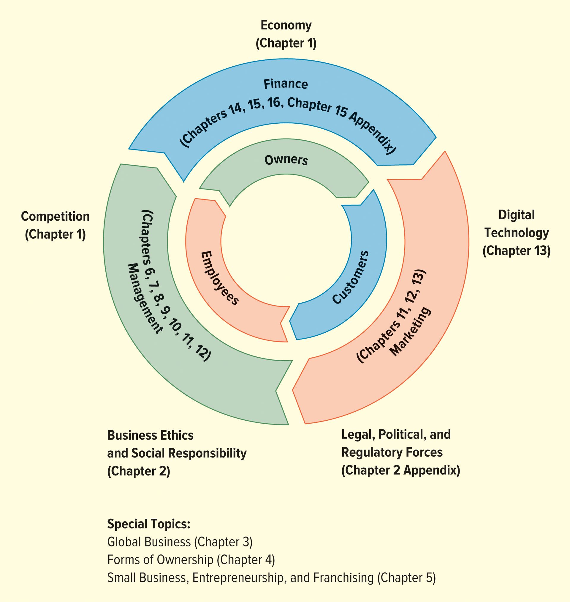

# Principles_of_Business

### FIGURE 1.6 The Organization of This Book
</img>

git add .

git commit -m "Subiendo todo el contenido inicial del curso"

git push

venv\Scripts\activate

deactivate

py -m jupyter nbconvert --to markdown "prueba/prueba.ipynb"

#activate 
CTRL + SHIFT + V

