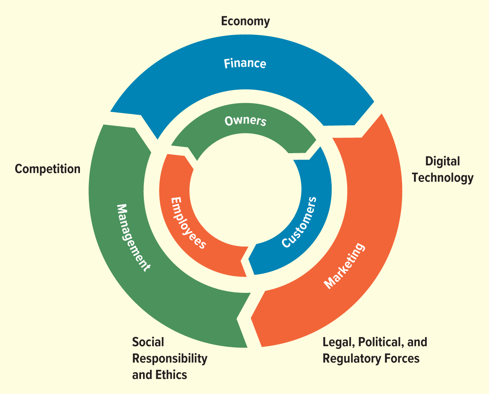
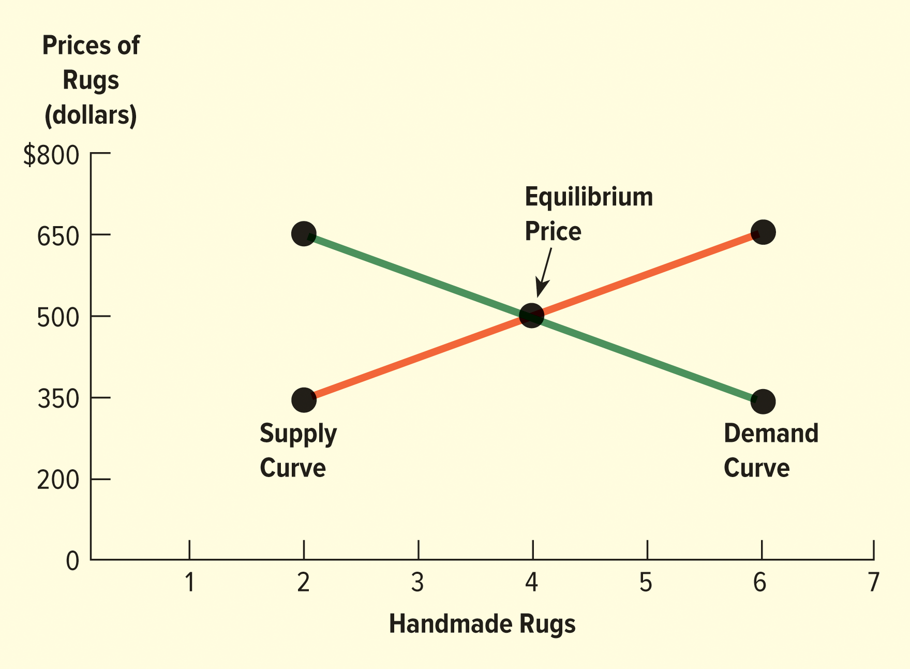
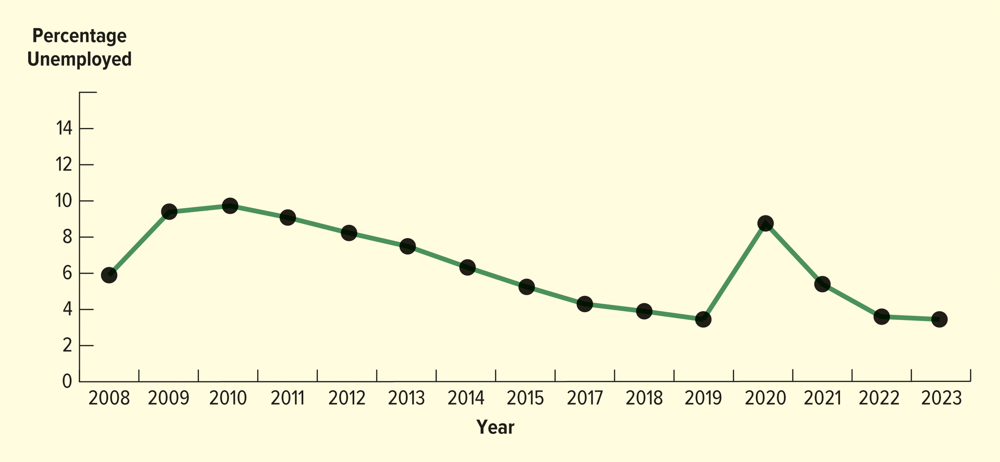
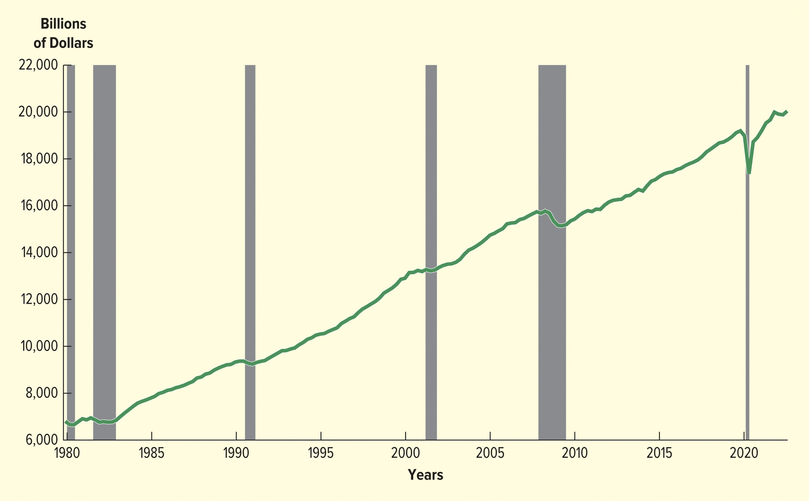

<h1 id="Chapter_1._The_Dynamics_of_Business_and_Economics" style="color:#42A5F5;">Indice</h1>

##### [Capitulo 📘 Study Guide – LO 1-1 Basic Concepts: Business, Product, Profit, and Economics](#386289)

##### [Capitulo 📘 LO 1-2 Study Guide The People and Activities of Business](#648063)

##### [Capitulo 📘 LO 1-3 Study Guide Why Study Business?](#281665)

##### [Capitulo 📘 LO 1-4 Study Guide Comparing the Four Types of Economic Systems](#888571)

##### [Capitulo 📘 LO 1-5 Study Guide The Forces of Supply and Demand](#954898)

##### [Capitulo 📘 LO 1-6 Measuring the Economy](#492167)

##### [Capitulo LO 1-7 THE AMERICAN ECONOMY ](#615083)

##### [Capitulo LO 1-8 The Role of the Entrepreneur](#480752)

<h1 id="386289" style="color:#E65100;">
  <a href="#Chapter_1._The_Dynamics_of_Business_and_Economics" style="color:inherit; text-decoration:none;">
📘 Guía de estudio - LO 1-1
  </a>
</h1>

Conceptos básicos: negocios, productos, ganancias y economía.

🔹 Negocios

Una empresa es una organización o actividad que intenta obtener ganancias proporcionando productos que satisfagan las necesidades y deseos de las personas.

Una empresa identifica lo que la gente necesita o quiere y ofrece productos de una manera que crea valor y genera ganancias.

🔹 Producto

Un producto es el resultado de los esfuerzos de una empresa. Los productos tienen características tanto tangibles como intangibles que brindan valor y beneficios a los clientes.

Cuando compras un producto, no estás simplemente comprando un objeto: estás comprando el valor y los beneficios que esperas que te proporcione el producto.

Examples:

- Se podrá comprar una pizza de Domino's para saciar el hambre.
- Se podrá adquirir una Ford F-150 para satisfacer las necesidades de transporte y el deseo de proyectar una determinada imagen.

🔹 Tipos de Productos
1. Bienes tangibles

These are physical products that can be seen and touched.
Ejemplos: automóviles, teléfonos inteligentes, ropa.

2. Servicios

A service occurs when people or machines provide or process something of value for customers.

Los ejemplos incluyen:

- Limpieza en seco
- Visitas de telemedicina
- Películas
- Eventos deportivos
- A ride with Uber, which satisfies the need for transportation

3.Ideas

Un producto también puede ser una idea.
Profesionales como contadores y abogados brindan ideas y soluciones para ayudar a resolver problemas.

🔹 Beneficio

La ganancia es el dinero que gana una empresa después de restar los costos de los ingresos.

📌Fórmula básica:
Beneficio = Ingresos - Costos

Obtener ganancias permite a las empresas sobrevivir, crecer e innovar.

🔹 Economía

La economía es el estudio de cómo los individuos y las empresas utilizan recursos limitados para producir bienes y servicios y distribuirlos entre la sociedad.

La economía ayuda a responder preguntas clave:

- ¿Qué se debe producir?
- ¿Cómo se debe producir?
- ¿Para quién debería producirse?

📝 Resumen rápido

- Negocios: Obtiene ganancias satisfaciendo necesidades y deseos.
- Producto: Un bien, servicio o idea que aporta valor.
- Beneficio: Ingresos menos costos.
- Economía: Estudio de la asignación de recursos.

🔹 El objetivo de los negocios

El objetivo principal de una empresa es obtener ganancias manteniendo al mismo tiempo la responsabilidad social.

La ganancia es la diferencia entre:

- El costo de fabricar y vender un producto.
- El precio que paga un cliente por ello.

📌 Ejemplo:
Si una empresa gasta $8 en producción, financiamiento, marketing y otros gastos, y vende el producto por $12, la ganancia es $4.

Las ganancias están sujetas a impuestos federales, estatales y locales. Las empresas tienen el derecho legal de conservar y utilizar sus ganancias porque las ganancias son la recompensa por asumir riesgos y proporcionar valor.

🔹 Por qué las ganancias son importantes para la sociedad

La obtención de beneficios beneficia a la sociedad al:

- Apoyar a las instituciones sociales y al gobierno a través de impuestos.
- Creando empleos
- Proporcionar recursos para el crecimiento económico.

Las empresas que obtienen ganancias, pagan impuestos y crean empleos son la base de la economía.

Sin embargo, los beneficios deben obtenerse de forma ética y socialmente responsable. Muchas empresas retribuyen a sus comunidades apoyando causas sociales y económicas.

🔹 Organizaciones sin fines de lucro

No todas las organizaciones son empresas.

Nonprofit organizations do not have the primary goal of earning profits, although they may provide goods or services and raise funds.

Examples include:

- Alimentando a América
- Camino Unido

Aunque las organizaciones sin fines de lucro no se centran en las ganancias, aún utilizan habilidades de gestión, marketing y finanzas para lograr sus objetivos.

🔹 Habilidades necesarias para obtener ganancias

Para obtener ganancias, las empresas requieren varias habilidades clave:

1. Gestión

Los gerentes deben:

- Planificar, organizar y controlar las actividades empresariales.
- Contratar, capacitar y desarrollar empleados.
- Garantizar que la empresa produzca productos que los consumidores quieran comprar.

2. Comercialización

Las actividades de marketing incluyen:

- Identificar las necesidades y deseos del cliente.
- Desarrollar, fijar precios, promocionar y distribuir productos.

3. Finanzas

Las finanzas implican:

- Obtención de fondos
- Gestión de gastos
- Ampliar y mantener operaciones.

Las empresas deben pagar por la mano de obra, las instalaciones, los impuestos y la gestión.

🔹 Partes interesadas

Para mantener la rentabilidad, las empresas deben operar de manera eficiente, producir productos de calidad y comportarse éticamente con sus partes interesadas.

Las partes interesadas son grupos que tienen interés en el éxito de una empresa.

Partes interesadas primarias

Esencial para la supervivencia:

- Clientes
- Empleados
- Proveedores
- Inversores

Partes interesadas secundarias

Relación indirecta:

- Medios
- Asociaciones comerciales
- Grupos de intereses especiales

📝 Resumen rápido

- El objetivo de la empresa es obtener beneficios de forma responsable.
- Las ganancias recompensan la toma de riesgos y apoyan a la sociedad.
- Tanto las empresas como las organizaciones sin fines de lucro dependen de la gestión, el marketing y las finanzas.
- El comportamiento ético y la responsabilidad social son esenciales
- Las partes interesadas influyen en el éxito empresarial.

<h1 id="648063" style="color:#E65100;">
  <a href="#Chapter_1._The_Dynamics_of_Business_and_Economics" style="color:inherit; text-decoration:none;">
📘 Guía de estudio LO 1-2
  </a>
</h1>

Las personas y las actividades de los negocios

🔹 Principales participantes en los negocios

Los negocios involucran a varios participantes clave que trabajan juntos para producir bienes y servicios y satisfacer las necesidades de los clientes.

1. Propietarios

Los propietarios son las personas que inician el negocio y proporcionan:

- Tiempo y esfuerzo
- Recursos financieros
- Recursos humanos

Los propietarios pueden administrar el negocio ellos mismos o contratar empleados para administrar las operaciones.

En las empresas que cotizan en bolsa, los propietarios son los inversores (accionistas), no los administradores.

2. Empleados

Los empleados son responsables de realizar el trabajo dentro de una empresa.
Realizan operaciones diarias y ayudan a producir bienes o prestar servicios.

En muchas empresas, los propietarios contratan empleados para administrar y operar la empresa.

3. Directores ejecutivos (CEO)

En las empresas que cotizan en bolsa, los directores ejecutivos (CEO):

- Son empleados, no propietarios.
- Gestionar toda la organización.
- Trabajar para obtener beneficios para los inversores, que son los verdaderos propietarios.

4. Clientes

Los clientes son los participantes más importantes en los negocios.
La función principal de una empresa es satisfacer a los clientes proporcionándoles bienes y servicios que están dispuestos a comprar.

Sin clientes, una empresa no puede sobrevivir.

🔹 Principales actividades comerciales

Las principales actividades comerciales forman el círculo exterior de operaciones comerciales:

1. Gestión

La gestión implica:

- Planificación
- Organizar
- Principal
- Controlar las actividades empresariales.

Los gerentes coordinan los recursos y los empleados para lograr los objetivos comerciales.

2. Comercialización

El marketing se centra en:

- Identificar las necesidades y deseos del cliente.
- Desarrollar productos
- Fijación de precios, promoción y distribución de productos.

El objetivo del marketing es crear valor para los clientes.

3. Finanzas

Las finanzas se ocupan de:

- Obtención de recursos financieros
- Administrar el dinero
- Operaciones de financiación y crecimiento.

Las finanzas garantizan que la empresa pueda pagar gastos, invertir y expandirse.

🔹 Fuerzas externas que afectan a las empresas

Las empresas también se ven influenciadas por fuerzas que escapan a su control, entre ellas:

- Fuerzas legales y regulatorias.
- Condiciones económicas
- Competencia
- Tecnología
- Entorno político
- Preocupaciones éticas y sociales.

Estas fuerzas externas afectan las operaciones comerciales diarias y la toma de decisiones.

📝 Resumen rápido

- Los propietarios, empleados y clientes están en el centro del negocio.
- La gestión, el marketing y las finanzas son las principales actividades empresariales.
- Los directores ejecutivos gestionan empresas para inversores en empresas públicas.
- Los clientes son los participantes más importantes.
- Las fuerzas externas influyen en el funcionamiento de las empresas.

<h2>
Gestión
</h2>

🔹 ¿Qué es la gestión?

La gestión es el proceso de planificar, organizar, dirigir y controlar los recursos de una empresa para lograr sus objetivos de manera eficiente y efectiva.

En la figura 1.1, la gerencia y los empleados se muestran en el mismo segmento porque la gerencia se enfoca en coordinar las acciones de los empleados para lograr los objetivos comerciales.

🔹 Funciones de Gestión

La gestión implica cuatro funciones principales:

1.Planificación
> Establecer objetivos y decidir cómo alcanzarlos.

1.Organizar
> Organizar recursos y tareas para que el trabajo se pueda realizar de manera eficiente.

1.Liderando
> Motivating and guiding employees to work toward business goals.

1.Controlar
> Monitorear el desempeño y realizar ajustes cuando sea necesario.

Los gerentes eficaces demuestran fuertes habilidades de liderazgo, toma de decisiones y delegación.

🔹 Gestión efectiva

Según Jeff Bezos, fundador y ex director ejecutivo de Amazon, una gestión eficaz implica:

- Tomar un pequeño número de decisiones de alta calidad.
- Delegar las decisiones operativas del día a día a otros.

Este enfoque permite a los gerentes centrarse en objetivos estratégicos y al mismo tiempo empoderar a los empleados.

🔹 Gestión de recursos

La dirección también es responsable de:

- Adquirir recursos
- Desarrollar recursos
- Utilizar los recursos de manera eficiente.

Los recursos incluyen personas, tiempo, dinero, equipos e información.

🔹Organización y Trabajo en Equipo

La gerencia enfatiza:

- Organización
- Trabajo en equipo
- Comunicación

Los gerentes deben coordinar diferentes departamentos y asegurarse de que todos trabajen para lograr los mismos objetivos.

🔹 Operaciones y Recursos Humanos

Las áreas de gestión importantes incluyen:

- Gestión de operaciones
- Gestión de la cadena de suministro
- Gestión de recursos humanos

Motivar a los empleados y gestionar los recursos humanos son fundamentales para el éxito empresarial.

🔹 Ejemplo: Gestión de Servicios

En Ritz-Carlton, los directivos se centran en transformar:

- Acciones de los empleados
- Servicios del hotel

en una experiencia de servicio al cliente de alta calidad.

Esto muestra cómo la gestión convierte los recursos en valor para el cliente.

🔹 Gestión en todas las organizaciones

Gerentes tanto de empresas como de organizaciones sin fines de lucro:

- Plan
- Organizar
- Personal
- Control

Estas tareas son necesarias para llevar a cabo con éxito el trabajo de la organización.

📝 Resumen rápido

- La dirección coordina a los empleados para lograr los objetivos.
- Cuatro funciones: planificar, organizar, dirigir y controlar.
- Los gerentes efectivos delegan y toman decisiones sólidas.
- La gestión de recursos y la motivación son esenciales
- La gestión se aplica tanto a empresas como a organizaciones sin fines de lucro.

<h2>
Marketing
</h2>

🔹 ¿Qué es el marketing?

El marketing y los clientes están en el mismo segmento de la figura 1.1 porque el objetivo principal de todas las actividades de marketing es satisfacer a los clientes.

El marketing incluye todas las actividades diseñadas para proporcionar bienes y servicios que satisfagan las necesidades y deseos de los consumidores.

🔹 Investigación y planificación de mercados

Comercializadores:

- Recopilar información sobre los clientes.
- Realizar investigaciones de marketing para comprender las necesidades y preferencias de los consumidores.
- Utilizar los resultados de la investigación para:
    - Planificar y desarrollar productos.
    - Decidir cuánto cobrar por los productos.
    - Decidir cuándo y dónde deberían estar disponibles los productos.

Los especialistas en marketing también analizan el entorno de marketing para comprender los cambios en:

- Competencia
- Comportamiento del consumidor

Ejemplo:
Muchos restaurantes de comida rápida están reduciendo o eliminando los comedores y cambiando al servicio de autoservicio, mientras que otros exigen que los clientes hagan sus pedidos a través de quioscos. Estos cambios reflejan la evolución de las preferencias de los consumidores.

<h2>
🔹 La ​​mezcla de marketing (las cuatro P)
</h2></h4>

Las actividades de marketing se centran en las cuatro P, también conocidas como marketing mix:

1. Producto

La gestión de productos implica decisiones sobre:

- Adopción de productos
- Desarrollo de productos
- Marca
- Posicionamiento del producto

El objetivo es ofrecer productos que aporten valor y satisfagan las necesidades del cliente.

2. Precio

El precio es fundamental porque afecta directamente la rentabilidad.
Los especialistas en marketing deben fijar precios que:

- Los clientes están dispuestos a pagar.
- Cubrir costos
- Apoyar los objetivos comerciales.

3. Lugar (Distribución)

La distribución, también llamada lugar, asegura que los productos sean:

- Disponible en la ubicación correcta
- Disponible en el momento adecuado

La distribución también incluye la cadena de suministro, que es una red de:

- Materiales
- Componentes
- Procesos
- Información

Se utiliza para fabricar y entregar productos a los clientes.

4. Promoción

La promoción comunica los beneficios del producto y anima a los clientes a comprar.

La promoción incluye:

- Publicidad
- Venta personal
- Promoción de ventas (cupones, juegos, sorteos)
- Publicidad

Ejemplo:
Texas Pete utiliza la publicidad para atraer a los operadores de restaurantes destacando la variedad de tamaños y sabores de productos que ofrece.

📝 Resumen rápido

- El marketing se centra en satisfacer las necesidades y deseos del cliente.
- Los especialistas en marketing utilizan la investigación para guiar las decisiones.
- Las cuatro P son producto, precio, plaza y promoción.
- Las cadenas de distribución y suministro son clave para la disponibilidad.
- La promoción comunica valor y aumenta las ventas.

<h2>
Finanzas
</h2>

🔹 ¿Qué son las finanzas?

Las finanzas se centran en cómo las empresas obtienen, gestionan y utilizan los recursos financieros.

En la Figura 1.1, las finanzas están adyacentes a los propietarios porque es principalmente responsabilidad de los propietarios proporcionar recursos financieros en forma de capital de los propietarios, a menudo representado por acciones ordinarias.

🔹 Recursos financieros y propiedad

Los propietarios proporcionan financiación mediante:

- Invertir fondos personales
- Emisión de acciones en empresas que cotizan en bolsa.

La gestión de grandes corporaciones se basa en:

- Inversores
- Préstamos de instituciones financieras
- Emitir acciones y bonos para obtener capital.

Los propietarios de pequeñas empresas, en particular, a menudo dependen de préstamos bancarios para financiarse.

🔹 Conocimiento Financiero y el Sistema Financiero

Comprender las finanzas requiere conocimiento de:

- Contabilidad
- Dinero y mercados financieros
- El sistema financiero
- El mercado de valores

Estos elementos son esenciales para tomar decisiones financieras informadas y garantizar el éxito empresarial a largo plazo.

🔹 Carreras en Finanzas

Muchos profesionales forman parte del mundo financiero, entre ellos:

- Contadores
- Analistas financieros
- Asesores de inversiones
- banqueros

Estas personas ayudan a las empresas a administrar fondos, analizar el desempeño y asegurar el financiamiento.

🔹 Finanzas y actividades comerciales

Aunque la gestión y el marketing deben considerar cuestiones financieras, las finanzas son la principal función empresarial responsable de asegurar y gestionar los fondos.

La gestión financiera garantiza que una empresa pueda:

- Operar diariamente
- Invertir en crecimiento
- Cumplir con las obligaciones financieras.

📝 Resumen rápido

- Finanzas gestiona el dinero y los recursos financieros de una empresa.
- Los propietarios aportan capital a través de la propiedad de acciones.
- Las grandes empresas utilizan inversores, acciones y bonos.
- Las pequeñas empresas suelen depender de préstamos bancarios.
- El conocimiento financiero es esencial para el éxito.

<h1 id="281665" style="color:#E65100;">
  <a href="#Chapter_1._The_Dynamics_of_Business_and_Economics" style="color:inherit; text-decoration:none;">
📘 Guía de estudio LO 1-3
  </a>
</h1>

<h2>
¿Por qué estudiar negocios?
</h2>

🔹 Importancia de estudiar Negocios

Estudiar negocios ayuda a las personas a desarrollar habilidades y adquirir conocimientos que las preparen para carreras futuras, independientemente de si planean:

- Trabajar para una gran corporación.
- Iniciar su propio negocio.
- Trabajar para una agencia gubernamental.
- Gestionar o ser voluntario en una organización sin fines de lucro.

El conocimiento empresarial es útil en casi todo tipo de organización.

🔹 Oportunidades profesionales en negocios

El campo de los negocios ofrece una amplia variedad de carreras interesantes y desafiantes, que incluyen roles en:

- Marketing
- Gestión de recursos humanos
- Tecnologías de la información
- Finanzas
- Producción y operaciones
- Contabilidad
- Análisis de datos

🔹 Títulos de trabajo comerciales comunes

Ejemplos de carreras relacionadas con los negocios incluyen:

- Contador y auditor
- Analista financiero
- Especialista en recursos humanos
- Analista de gestión
- Analista de investigación de mercados
- Gerente de proyecto
- Responsable de compras
- Especialista en formación y desarrollo.

Estas son sólo algunas de las muchas opciones profesionales disponibles en los negocios.

🔹 Educación empresarial y potencial de ingresos

Un título universitario en negocios aumenta significativamente las oportunidades profesionales.

Las investigaciones muestran que:

- Los graduados universitarios generalmente tienen un mayor potencial de ingresos.
- Sus ingresos son significativamente más altos que los de los no graduados.

Esto hace que estudiar negocios sea una fuerte inversión en el futuro.

🔹 Comprensión de las actividades comerciales

Estudiar negocios le ayuda a comprender las numerosas actividades necesarias para proporcionar bienes y servicios satisfactorios.

La mayoría de las empresas cobran precios razonables por:

- Cubrir los costos de producción.
- Pagar a los empleados
- Proporcionar a los propietarios un retorno de su inversión.
- Apoyar a las comunidades locales y a la sociedad.

Comprender estas actividades ayuda a explicar cómo operan las empresas de manera sostenible.

🔹 Responsabilidad social y retribución

Muchas empresas exitosas practican la responsabilidad social retribuyendo a las comunidades y apoyando causas sociales.

Los ejemplos incluyen:

- todos los pájaros
- bombas
-Cisco
- Dr. Bronner
- Molinos generales
- HP
-Merck
-Microsoft
- Instrumentos de Texas
-Warby Parker

Aprender sobre negocios muestra cómo las empresas pueden ser rentables mientras actúan de manera ética y socialmente responsable.

🔹 Convertirse en un consumidor y ciudadano informado

La educación empresarial ayuda a las personas a convertirse en:

- Consumidores mejor informados
- Miembros más conocedores de la sociedad.

Al comprender los precios, los costos y las ganancias, los consumidores pueden tomar decisiones de compra más inteligentes.

🔹 Costos comerciales y empleo

La mano de obra a menudo representa un porcentaje significativo de los costos totales del negocio.

Estudiar negocios explica:

- Por qué son importantes los salarios
- Cómo los costos laborales afectan los precios
- Cómo las decisiones de empleo afectan a las empresas y a la economía

🔹 Negocios y Calidad de Vida

Las actividades empresariales generan:

- Beneficios que apoyan a las empresas y las economías locales.
- Productos y servicios que mejoran la calidad de vida del público.

Comprender los negocios ayuda a las personas a ver la conexión entre la actividad económica y los niveles de vida cotidianos.

🔹 Comprensión del sistema de libre empresa

Estudiar negocios ayuda a las personas a comprender cómo el sistema económico de libre empresa:

- Asigna recursos
- Proporciona incentivos para empresas y trabajadores.
- Fomenta la innovación y la productividad.

Este conocimiento es importante para cualquiera que participe en la economía.

📝 Resumen rápido

- Los estudios empresariales preparan a los estudiantes para muchas carreras profesionales.
- Las habilidades comerciales se aplican a corporaciones, gobiernos y organizaciones sin fines de lucro.
- Existen muchas oportunidades laborales en múltiples campos.
- Los graduados universitarios ganan más en promedio que los no graduados.
- Estudiar negocios explica cómo se crean los bienes y servicios.
- Las empresas equilibran costos, ganancias y responsabilidad social.
- Muchas empresas retribuyen a la sociedad.
- El conocimiento empresarial crea consumidores y ciudadanos informados.
- Comprender el sistema de libre empresa beneficia a todos

<h1 id="888571" style="color:#E65100;">
  <a href="#Chapter_1._The_Dynamics_of_Business_and_Economics" style="color:inherit; text-decoration:none;">
📘 Guía de estudio LO 1-4

  </a>
</h1>

Comparación de los cuatro tipos de sistemas económicos

🔹 ¿Qué es la economía?

La economía es el estudio de cómo se distribuyen los recursos para la producción de bienes y servicios dentro de una sociedad.

Los recursos utilizados para producir bienes y servicios se denominan factores de producción:

- Tierra: recursos naturales (tierra, agua, minerales, bosques)
- Trabajo: esfuerzo humano físico y mental.
- Capital: recursos financieros y herramientas utilizadas en la producción.
- Enterprise (Emprendimiento): capacidad de organizar recursos y asumir riesgos

Las empresas también dependen de recursos intangibles, como la reputación y la responsabilidad social, para obtener una ventaja competitiva.

🔹 ¿Qué es un sistema económico?

Un sistema económico describe cómo una sociedad asigna recursos limitados para satisfacer necesidades ilimitadas.

Todo sistema económico debe responder a tres preguntas básicas:

1. ¿Qué bienes y servicios se producirán y en qué cantidad?
1. ¿Cómo se producirán y con qué recursos?
1. ¿Para quién se producirán bienes y servicios?

<h2>
🔹 Los cuatro tipos de sistemas económicos
</h2>

| **Característica** | **Comunismo** | **Socialismo** | **Capitalismo** |
| -------------------------------- | ------------------------------------------------------------------------------------------ | --------------------------------------------------------------------------------------------------------------- | ------------------------------------------------------------------------------------------------------- |
| **Propiedad del negocio** | La mayoría de las empresas son propiedad del **gobierno** y están operadas por él. | El **gobierno posee y opera industrias básicas**; los individuos también poseen empresas. | **Los individuos poseen y operan** todos los negocios. |
| **Competencia** | **Controlado por el gobierno**; poca o ninguna competencia. | **Restringido** en industrias básicas; **alentado** en otros negocios. | **Fomentado** por las fuerzas del mercado y las regulaciones gubernamentales. |
| **Beneficios** | El exceso de ingresos va al **gobierno**, que apoya a las instituciones sociales y económicas. | Las ganancias pueden **reinvertirse** en empresas; las ganancias de las industrias propiedad del gobierno van al **gobierno**. | Los individuos y las empresas **mantienen las ganancias** después de pagar impuestos. |
| **Disponibilidad y precio del producto** | **Elección limitada** de bienes y servicios; Los precios suelen ser **altos**. | Los consumidores tienen una **elección** de bienes y servicios; los precios están determinados por **oferta y demanda**. | Los consumidores tienen una **amplia variedad** de bienes y servicios; los precios están determinados por **oferta y demanda**. |
| **Opciones de empleo** | **Pocas opciones** de carreras; la mayoría de la gente trabaja para industrias o granjas de propiedad gubernamental. | **Más opciones profesionales**; Mucha gente trabaja en puestos gubernamentales. | **Opciones profesionales ilimitadas**; la gente elige libremente sus trabajos. |

📝 Conclusiones clave

- Comunismo: el gobierno controla la propiedad, la competencia y las ganancias; elección limitada de consumidores y carreras.
- Socialismo: Mezcla de propiedad gubernamental y privada; la competencia existe fuera de las industrias básicas.
- Capitalismo: propiedad privada, fuerte competencia, incentivos para obtener ganancias y máxima elección de consumidores y empleos.

Comunismo

El comunismo fue descrito por primera vez por Karl Marx como un sistema económico en el que todas las personas, independientemente de su clase, poseen colectivamente los recursos de una nación. En este sistema ideal, los individuos contribuyen según sus capacidades y reciben beneficios según sus necesidades. El gobierno posee y opera todas las empresas y factores de producción, y la planificación central decide qué bienes y servicios se producen, cómo se fabrican y cómo se distribuyen. Aunque el comunismo parece justo e igualitario en teoría, en la práctica a menudo ha resultado en bajos niveles de vida, escasez de bienes de consumo, corrupción y libertad limitada. Muchos países, como Rusia, Polonia y Hungría, se han alejado del comunismo hacia sistemas basados ​​en el mercado. Otros, incluidos Venezuela y Cuba, han luchado por mantener los principios comunistas. China logró el crecimiento económico combinando el control gubernamental con prácticas capitalistas a través del capitalismo de Estado. En general, debido a los desafíos económicos, el comunismo está en declive y su futuro como sistema económico dominante sigue siendo incierto.

Capitalismo

El capitalismo, también conocido como sistema de libre empresa, es un sistema económico en el que los individuos poseen y operan la mayoría de las empresas que producen bienes y servicios. En el capitalismo, la competencia, la oferta y la demanda determinan qué se produce, cómo se produce y cómo se distribuyen los bienes y servicios. Países como Estados Unidos, Canadá, Japón y Australia tienen sistemas económicos basados ​​en gran medida en el capitalismo. Hay dos formas de capitalismo: capitalismo puro y capitalismo modificado. El capitalismo puro, o sistema de libre mercado, implica poca o ninguna participación del gobierno y fue descrito por primera vez por Adam Smith, quien creía que la economía está guiada por la “mano invisible” de la competencia. El capitalismo modificado, que existe en la mayoría de los países modernos, permite al gobierno regular los negocios a través de leyes para proteger a los consumidores, promover la competencia justa y abordar las preocupaciones sociales, al mismo tiempo que fomenta la propiedad privada y las ganancias.

Economías mixtas

Las economías mixtas combinan elementos del comunismo, el socialismo y el capitalismo, y ningún país sigue hoy un sistema económico puramente único. La mayoría de las naciones favorecen un sistema pero incluyen características de otros. Por ejemplo, Suecia es considerada socialista, pero la mayoría de las empresas son de propiedad privada, mientras que Estados Unidos, una nación capitalista, tiene participación gubernamental en áreas como el servicio postal. Países como Alemania, Hungría y Polonia han adoptado prácticas capitalistas como la propiedad privada. Las relaciones económicas entre diferentes sistemas pueden crear conflictos, como se ve en las tensiones comerciales que involucran a China y Rusia. Muchas economías mixtas utilizan el capitalismo de estado, donde el gobierno dirige la economía mientras utiliza herramientas capitalistas como los mercados de valores y la globalización. Grandes empresas influenciadas por el Estado, como Gazprom, Alibaba y Tencent, muestran cómo los gobiernos pueden combinar el control con estrategias basadas en el mercado para promover el crecimiento económico.

El sistema de libre empresa

El sistema de libre empresa es un sistema económico en el que las empresas pueden tener éxito o fracasar en función de la demanda del mercado. Países como Estados Unidos, Canadá y Japón se basan en la libre empresa, mientras que países como China y Rusia han adoptado algunos principios de libre empresa. En este sistema, las empresas que producen de manera eficiente los bienes y servicios que los consumidores desean tienen probabilidades de tener éxito, mientras que las empresas ineficientes o las que ofrecen productos no deseados tienden a fracasar. La libre empresa depende de derechos clave, incluido el derecho a poseer propiedades, obtener y utilizar ganancias, tomar decisiones comerciales dentro de los límites legales y elegir carreras y compras libremente. Estos derechos motivan a las personas y las empresas a trabajar más duro, innovar y competir. Como resultado, los sistemas de libre empresa fomentan el espíritu empresarial y la productividad. Muchos empresarios exitosos, como Bill Gates, Rihanna, Walt Disney y Anne Wojcicki, crearon empresas innovadoras aprovechando los incentivos personales y financieros que ofrece la libre empresa.

<h1 id="954898" style="color:#E65100;">
  <a href="#Chapter_1._The_Dynamics_of_Business_and_Economics" style="color:inherit; text-decoration:none;">
📘 Guía de estudio LO 1-5 Las fuerzas de la oferta y la demanda
  </a>
</h1>

En sistemas de libre empresa como el de Estados Unidos, la distribución de recursos y productos está determinada por la oferta y la demanda. La demanda se refiere a la cantidad de bienes o servicios que los consumidores están dispuestos y pueden comprar a diferentes precios durante un período de tiempo específico. En general, cuando el precio de un producto disminuye, los consumidores están dispuestos a comprar más y, cuando el precio aumenta, compran menos. Por ejemplo, los consumidores pueden comprar más alfombras hechas a mano cuando el precio es bajo y menos alfombras cuando el precio es alto. Esta relación entre precio y cantidad demandada se muestra mediante una curva de demanda, que tiene pendiente descendente para reflejar que precios más bajos conducen a una demanda más alta. La oferta y la demanda juntas ayudan a determinar qué productos se venden, cuántos se venden y a qué precio, lo que las convierte en fuerzas esenciales en un sistema de libre empresa.

Imaginemos alfombras hechas a mano que se venden en un mercado:

| **Precio por alfombra** | **Cantidad que comprarán los consumidores** |
| ----------------- | ------------------------------- |
| $350 | 6 alfombras |
| $500 | 4 alfombras |
| $650 | 2 alfombras |

<h2>
FIGURA 1.2 Precio de equilibrio de las alfombras hechas a mano
</h2>

En un sistema de libre empresa, el precio de equilibrio es el precio al que la cantidad ofrecida por las empresas iguala la cantidad demandada por los consumidores en un momento específico. Usando el ejemplo de las alfombras, la empresa está dispuesta a suministrar 4 alfombras a $500 cada una, y los consumidores están dispuestos a comprar 4 alfombras a $500 cada una. Por lo tanto, $500 es el precio de equilibrio.

- Si una empresa cobra más de 500 dólares, se venderán menos alfombras y las ganancias pueden caer.

- Si una empresa cobra menos de $500, vende más pero obtiene menos ganancias por alfombra.

El precio de equilibrio cambia constantemente a medida que la oferta y la demanda responden a las condiciones económicas, la disponibilidad de recursos y la competencia. Por ejemplo, el precio del petróleo ha fluctuado ampliamente en los últimos 10 años debido a cambios en la oferta y la demanda mundial, llegando incluso a caer por debajo de 0 dólares durante la pandemia de COVID-19.

En general, la oferta y la demanda son las fuerzas clave que determinan los precios, la distribución de recursos y los niveles de producción en una economía de libre empresa. La intersección de las curvas de oferta y demanda en un gráfico muestra visualmente el precio de equilibrio.

<h2>
LAS GRANDES TECNOLOGÍAS ESTÁN BAJO UN GRAN ESCRUTINIO - Resumen
</h2>

Las cinco mayores empresas tecnológicas de Estados Unidos (Alphabet, Amazon, Apple, Meta y Microsoft) están siendo examinadas de cerca por reguladores y legisladores de todo el mundo. En Estados Unidos, la Comisión Federal de Comercio (FTC) y el Departamento de Justicia (DOJ) hacen cumplir las leyes antimonopolio para impedir los monopolios y mantener una competencia justa.

Las preocupaciones sobre las grandes tecnologías incluyen:

Competencia limitada, que puede aumentar los precios y reducir las opciones de los consumidores.

Adquisiciones que puedan perjudicar a la competencia (por ejemplo, Microsoft y Activision Blizzard).

Prácticas comerciales, como el dominio publicitario de Google, la promoción de Amazon de sus propios productos y Meta que obliga a los usuarios a aceptar anuncios dirigidos.

Los reguladores consideran medidas como el intercambio obligatorio de datos y reglas más estrictas similares a las aplicadas a los bancos y las telecomunicaciones. Los partidarios dicen que esto puede fomentar la competencia y ayudar a los empresarios, mientras que los críticos advierten que puede reducir la innovación y dañar la privacidad.

<h2>
Preguntas de pensamiento crítico – Respuestas
</h2>

1. ¿Por qué los monopolios son generalmente malos para los consumidores?

Los monopolios limitan la competencia, permitiendo a las empresas aumentar los precios, reducir las opciones y reducir el incentivo para mejorar los productos, lo que perjudica a los consumidores.

2. ¿Cuál es el objetivo de la legislación antimonopolio?

El objetivo de las leyes antimonopolio es prevenir los monopolios, promover la competencia leal y proteger a los consumidores de prácticas comerciales desleales.

3. ¿Por qué las grandes empresas tecnológicas están bajo escrutinio?

Las grandes empresas tecnológicas están bajo escrutinio porque su tamaño y sus prácticas comerciales pueden sofocar la competencia, manipular los mercados o dañar a los consumidores. Los reguladores están revisando adquisiciones, prácticas de datos y dominio en las plataformas en línea para garantizar una competencia justa.

<h2>
La naturaleza de la competencia
</h2>

Concepto clave

- Competencia: La rivalidad entre empresas para atraer el dinero de los consumidores.
- Según Adam Smith, la competencia mejora la eficiencia, reduce los precios y anima a las empresas a ofrecer productos de alta calidad.
- La competencia permite abrir mercados y brinda oportunidades de innovación, reducción de costos y mejor servicio.
- Ejemplo: SpaceX (Elon Musk), Virgin Galactic (Richard Branson) y Blue Origin (Jeff Bezos) compiten en el mercado del turismo espacial.

<h2>
Cuatro tipos de entornos competitivos
</h2>

1. Competencia pura

- Muchas pequeñas empresas que venden un producto estandarizado.
- Los precios los fijan enteramente la oferta y la demanda.
- Ninguna empresa por sí sola puede influir en el precio de mercado.
- Ejemplo: productos agrícolas como el trigo, el maíz y el algodón.

2. Competencia monopolística

- Muchas empresas compiten, pero los productos están ligeramente diferenciados.
- Las diferencias pueden incluir embalaje, marca, garantía o características.
- Las empresas tienen cierto control sobre los precios porque los consumidores reconocen las diferencias entre los productos.
- Ejemplos: aspirinas, refrescos, jeans.
- Ejemplo premium: el secador de pelo Dyson Supersonic ($400+), ofrece características únicas.

3. Oligopolio

- Pocas empresas dominan el mercado.
- Cada empresa tiene control parcial sobre los precios, pero los precios se mantienen cercanos porque las empresas responden a las acciones de los competidores.
- Las altas barreras de entrada impiden la entrada fácil de nuevas empresas.
- Ejemplos: aerolíneas, automóviles, productos farmacéuticos.
- Ejemplo de comportamiento: una aerolínea reduce las tarifas → otras hacen lo mismo para seguir siendo competitivas.

4. Monopolio

- Una sola empresa ofrece un producto o servicio en un mercado.
- A menudo lo permite el gobierno debido a los altos costos de producción o la protección de patentes.
- Los precios pueden estar regulados por el gobierno.
- Ejemplo: empresas de servicios públicos (electricidad, gas, agua).
- Los productos patentados (por ejemplo, el medicamento Alimta de Eli Lilly) permiten recuperar los costos de I+D; Después de 20 años, los genéricos pueden entrar al mercado.

Conclusiones clave

- La competencia impulsa la innovación, la calidad y la eficiencia.
- El tipo de mercado afecta el poder de fijación de precios, las barreras de entrada y la diferenciación de productos.
- Los emprendedores y las empresas pueden tener éxito aprovechando la innovación, la gestión de costos y las características únicas de los productos.

<h2>
Ciclos económicos y productividad – Guía de estudio
</h2>

Conceptos clave

- Las economías son dinámicas: se expanden y contraen con el tiempo.
- Los ciclos económicos describen estas fluctuaciones en la actividad económica.

Expansión económica

- Ocurre cuando la economía está creciendo.
- La gente gasta más dinero, aumentando la demanda de bienes y servicios.
- Las empresas responden produciendo más y contratando más trabajadores.
- El nivel de vida aumenta porque más personas están empleadas y obtienen ingresos.
- Riesgo de inflación: las expansiones rápidas pueden generar inflación, es decir, un aumento de los precios.
    - Inflation reduces purchasing power if incomes do not increase at the same pace.
    - Ejemplo: Después del COVID-19, Estados Unidos experimentó la inflación más alta en cuatro décadas.

Contracción económica

- Ocurre cuando el gasto disminuye.
- Las empresas reducen la producción y pueden despedir empleados.
- La economía se desacelera, lo que podría conducir a una recesión.
    - Recesión: disminución de la producción, el empleo y los ingresos.
    - Se caracteriza por un aumento del desempleo (porcentaje de personas que quieren trabajar pero no encuentran empleo).
- Riesgo de deflación: Los precios pueden caer debido a la reducción de la demanda.
    - La deflación puede ser perjudicial porque los consumidores pueden retrasar las compras, esperando precios aún más bajos.
    - Este retraso puede desacelerar aún más la actividad económica y profundizar la recesión.

Puntos importantes

- Las tendencias del desempleo a lo largo del tiempo reflejan la salud de la economía.
- Las autoridades monitorean la inflación, la deflación y las tasas de empleo para mantener la estabilidad económica.
- Los ciclos económicos son naturales en una economía de mercado y afectan a las empresas, los consumidores y las políticas gubernamentales.

<h2>
Recesiones y ciclos económicos en Estados Unidos
</h2>

La economía estadounidense ha experimentado varias recesiones, incluidas las de 1990–1991, 2002–2003, 2008–2011 y 2020. La Gran Recesión (2008–2011) fue desencadenada por el colapso de los precios de la vivienda y los impagos generalizados de hipotecas y tarjetas de crédito, lo que provocó una crisis bancaria. El gobierno intervino para evitar quiebras bancarias, pero el gasto de los consumidores se desaceleró y el desempleo alcanzó el 10%.

Durante la pandemia de COVID-19 en 2020, el desempleo se disparó al 14,7%, el más alto desde la Gran Depresión, cuando las empresas cerraron y muchos trabajadores fueron despedidos. Las ventas en línea y fuera de las tiendas aumentaron, pero las ventas minoristas generales cayeron un 21,6%. Para 2022, el desempleo había disminuido al 3,6%, aunque persistía la escasez de mano de obra ya que algunos trabajadores no regresaron.

Los ciclos económicos implican expansiones y contracciones influenciadas por el gasto de los consumidores, las empresas y el gobierno. Las guerras también pueden impactar la economía, a veces impulsándola (por ejemplo, la Primera y Segunda Guerra Mundial) o obstaculizándola (por ejemplo, Vietnam, el Golfo Pérsico, Irak). Las recesiones graves pueden convertirse en depresiones, marcadas por un alto desempleo, un bajo gasto de los consumidores y una marcada reducción de la producción empresarial, como se vio en la Gran Depresión de los años treinta.

Conclusión clave: las fluctuaciones económicas son inevitables y afectan la inflación, el empleo y los niveles de vida en general, por lo que los gobiernos intentan minimizar su impacto.

<h1 id="492167" style="color:#E65100;">
  <a href="#Chapter_1._The_Dynamics_of_Business_and_Economics" style="color:inherit; text-decoration:none;">
📘 Medición de la economía
  </a>
</h1>

Los países hacen un seguimiento de su salud económica para ver si la economía se está expandiendo o contrayendo y si se necesitan intervenciones para reducir los efectos negativos.

Una medida común es el Producto Interno Bruto (PIB):

- El PIB es el valor total de todos los bienes y servicios producidos dentro de un país en un año.
- Incluye las ganancias obtenidas por empresas extranjeras que operan en el país, pero excluye las ganancias de las operaciones de las empresas nacionales en el extranjero.
- El PIB por sí solo no representa el tamaño de la población; para eso, los economistas utilizan el PIB per cápita, que muestra la producción económica promedio por persona.

Monitorear el PIB a lo largo del tiempo ayuda a gobiernos, empresas e individuos a comprender el desempeño económico general y tomar decisiones informadas.

<h2>
La fórmula del Producto Interno Bruto (PIB)
</h2>

La fórmula para el Producto Interno Bruto (PIB) depende del enfoque utilizado, pero el más común es el enfoque del gasto, que calcula el PIB sumando todo el gasto en bienes y servicios finales de una economía:

$$PIB = C + I + G + (X - M)$$

- **C** = Consumo (gasto de los hogares en bienes y servicios)
- **I** = Inversión (gasto en bienes de capital, construcción residencial e inventarios)
- **G** = Gasto Gubernamental (gasto en bienes y servicios públicos)
- **X** = Exportaciones (bienes y servicios vendidos a otros países)
- **M** = Importaciones (bienes y servicios comprados de otros países)

Entonces, (X − M) representa las exportaciones netas.

💡 Ejemplo:

Si un país tiene:
- C = 10 billones de dólares
- I = 3 billones de dólares
- G = 4 billones de dólares
- Exportaciones = 2 billones de dólares
- Importaciones = 1 billón de dólares

Entonces:

$$
PIB = 10 + 3 + 4 + (2 - 1) = 18\ \text{billones de dólares}
$$

<h2>
GRÁFICO 1.4 Producto Interno Bruto de Estados Unidos
</h2>

Ciclos económicos y acontecimientos clave en EE.UU.
1. Recesiones y desempleo

- Estados Unidos se ha enfrentado a múltiples recesiones:
    - 1990–1991
    - 2002-2003
    - 2008-2011 (Gran Recesión)
    - 2020 (pandemia de COVID-19)
- Gran Recesión (2008-2011):
    - Provocado por el colapso de los precios de la vivienda y las hipotecas y deudas de tarjetas de crédito impagas.
    - La crisis bancaria provocó rescates gubernamentales.
    - Resultó en una disminución del gasto de los consumidores y un mayor desempleo (~10%).
- COVID-19 pandemic (2020):
    - El desempleo se disparó hasta el 14,7%, el nivel más alto desde la Gran Depresión.
    - Se cerraron negocios no esenciales y se despidió a muchos empleados.
    - Las ventas en línea y fuera de tienda aumentaron un 21,2%, pero las ventas minoristas generales cayeron un 21,6%.
    - Para 2022, el desempleo cayó al 3,6%, pero persistió la escasez de mano de obra.

2. Recuperación económica

- Los ciclos económicos muestran expansión y contracción en respuesta a:
    - Gasto del consumidor
    - Inversión empresarial
    - Actividad gubernamental
- El consumo personal representa aproximadamente el 70% del PIB, por lo que la participación del consumidor es crucial.

3. Graves crisis económicas

- Una recesión: disminución de la producción, el empleo y los ingresos.
- Una depresión: recesión grave y prolongada con alto desempleo, bajo gasto y producción empresarial muy reducida (por ejemplo, en los Estados Unidos de la década de 1930).

4. Otros factores que afectan la economía

- Wars can either stimulate (WWI, WWII) or stifle (Vietnam, Persian Gulf, Iraq) economic activity.
- Los gobiernos intentan minimizar los efectos perturbadores de la inflación y el desempleo, aunque las fluctuaciones son inevitables.

<h2>
Cuadro 1.2: ¿Cómo evaluamos la economía de nuestra nación?
</h2>

Medidas económicas clave

| **Unidad de medida** | **Lo que nos dice** |
| ------------------------------ | ---------------------------------------------------------------------------------------------------------- |
| **Balanza comercial** | Diferencia entre exportaciones e importaciones. Una balanza negativa (déficit comercial) generalmente se considera nociva. |
| **Índice de Precios al Consumidor (IPC)** | Realiza un seguimiento de los cambios en los precios de los bienes y servicios adquiridos por los hogares urbanos típicos. |
| **Ingreso per cápita** | Muestra los ingresos de un estadounidense "promedio". Ayuda a determinar el gasto de los consumidores y los ingresos generales. |
| **Tasa de desempleo** | Mide cuántos estadounidenses en edad laboral quieren trabajar pero no están empleados. |
| **Inflación** | Supervisa los aumentos de precios de bienes/servicios a lo largo del tiempo. Comprueba si los precios aumentan más rápido que los salarios. |
| **Productividad del trabajador** | Cantidad de bienes/servicios producidos por hora de trabajo. |

<h1 id="615083" style="color:#E65100;">
  <a href="#Chapter_1._The_Dynamics_of_Business_and_Economics" style="color:inherit; text-decoration:none;">
OA 1-7 LA ECONOMÍA AMERICANA
  </a>
</h1>

La economía estadounidense es un sistema capitalista mixto, donde la oferta, la demanda y la competencia determinan principalmente las decisiones económicas, aunque el gobierno interviene en algunas áreas como la seguridad y viabilidad de las aerolíneas. El nivel de vida refleja riqueza y comodidad; Estados Unidos tiene un alto nivel de vida similar al de Alemania, Australia y Noruega, pero un PIB per cápita más alto no siempre significa una vida mejor debido a las diferencias de costos. Los países con bajos niveles de vida a menudo enfrentan pobreza, desempleo y menor educación. Comprender la historia de la economía estadounidense, junto con el papel de los empresarios y el gobierno, ayuda a explicar las prácticas comerciales actuales.

<h2>
La importancia de la economía estadounidense
</h2>

La economía estadounidense es una economía abierta, que prospera gracias al comercio internacional, que impulsa la eficiencia, la productividad y el acceso a la tecnología. El crecimiento del PIB y el empleo son indicadores clave de la salud económica, ya que las empresas más productivas y rentables contratan más trabajadores, lo que impulsa la economía. El gobierno influye en la economía a través de políticas, creación de empleo e impuestos, como se vio con la Ley CARES durante el COVID-19. Los impuestos de individuos y empresas financian los servicios públicos, y las reformas de 2017 redujeron las tasas impositivas corporativas e individuales máximas, aunque continúan los debates sobre aumentar los impuestos para los tramos de ingresos altos.

La revolución industrial

El siglo XIX y la Revolución Industrial introdujeron nuevas tecnologías y fábricas, reuniendo materiales, máquinas y trabajadores. El trabajo se especializó, aumentando la eficiencia y la productividad, lo que hizo que los bienes fueran más asequibles. Los ferrocarriles transformaron los mercados y permitieron a los agricultores enviar productos a todo el país. Innovaciones como la maquinaria agrícola de John Deere mejoraron la producción agrícola y redujeron el número de agricultores necesarios, mientras que la línea de montaje de Henry Ford revolucionó la fabricación de automóviles, haciendo que los automóviles fueran asequibles y fomentando la migración urbana en busca de empleos en las fábricas y un mayor nivel de vida.

The Manufacturing and Marketing Economies

Industrialization shifted the U.S. toward a manufacturing and service economy, focused on producing consumer goods. Businesses responded to consumer needs, giving rise to the marketing economy. Innovations such as department stores by Alexander Turney Stewart and mail-order catalogs by Aaron Montgomery Ward expanded access to products. Advertising informed consumers about products, features, and prices. In this free-enterprise system, consumers determined which goods and services were produced through their purchases, contributing to national prosperity and a high standard of living.

El servicio y la nueva economía digital

Después de la Segunda Guerra Mundial, el aumento del nivel de vida dio a los estadounidenses más dinero y tiempo, lo que los llevó a pagar por servicios que simplificaron la vida diaria. A partir de la década de 1960, más mujeres ingresaron a la fuerza laboral, el crecimiento demográfico se desaceleró y las estructuras familiares cambiaron, con más hogares monoparentales y familias con doble ingreso. Estas tendencias ayudaron a que Estados Unidos se volviera hacia una economía de servicios, centrada en industrias como restaurantes, banca, atención médica, cuidado infantil, reparación de automóviles, ocio y educación, que ahora representan una gran parte de la economía. La tecnología avanzada y los medios digitales impulsaron aún más la economía, creando nuevos productos de servicios e impulsando el comercio electrónico, dando lugar a empresas como eBay, Shopify, Etsy y Amazon.

The COVID-19 pandemic in 2020 caused major disruptions: travel bans, business closures, remote work, online schooling, and event cancellations created a “new normal.” Companies reassessed office needs, boosting online grocery ordering, telemedicine, and online shopping. Many retailers, including J.C. Penney, Brooks Brothers, and Neiman Marcus, filed for bankruptcy due to changing consumer behavior. Even post-pandemic, remote work continued for some, while technology adoption accelerated with cloud computing, artificial intelligence, and robotics. By 2023, air travel nearly returned to pre-pandemic levels, reflecting recovery and adaptation in the service and digital economy.

<h2>
Carreras Zoom para mantenerse a la cabeza del resto
</h2>

Fundada en 2011 por Eric Yuan, Zoom tenía como objetivo proporcionar una herramienta de videoconferencia fácil de usar y de alta calidad que funcionara incluso con conexiones a Internet lentas. La pandemia de COVID-19 en 2020 provocó un aumento en la demanda de comunicaciones por video, aumentando drásticamente la base de usuarios de Zoom e impulsándola a una valoración de más de 20 mil millones de dólares. El diseño fácil de usar y las características modernas de la plataforma ayudaron a que fuera ampliamente adoptada tanto por consumidores como por empresas. Zoom utiliza un modelo de precios freemium, atrayendo usuarios a su cuenta Básica gratuita y convirtiendo a algunos en clientes de pago. Si bien este modelo es eficaz para el crecimiento, puede resultar costoso si los usuarios cancelan después de la prueba gratuita. Después de la pandemia, Zoom enfrenta el desafío de mantener el crecimiento reteniendo usuarios, atrayendo nuevos clientes y convirtiendo usuarios gratuitos en clientes de pago.

<h2>
Preguntas de pensamiento crítico
</h2>

1. ¿Cómo contribuyó la pandemia de COVID-19 al éxito de Zoom?

La pandemia provocó distanciamiento social y trabajo remoto, lo que aumentó drásticamente la demanda de comunicación por video. La plataforma de Zoom se volvió esencial para el trabajo, la escuela y las interacciones sociales, lo que generó un crecimiento sin precedentes en usuarios e ingresos.

2. ¿De qué manera Zoom satisface las necesidades y deseos de los consumidores?

Zoom offers a reliable, easy-to-use, and feature-rich platform that works on slow internet connections. It provides value by enabling communication for work, education, and social interaction, meeting both functional and convenience needs.

3. What are the advantages and disadvantages of a freemium pricing model?

Ventajas: atrae rápidamente una gran base de usuarios, permite a los clientes probar el producto antes de pagar y puede convertir a los usuarios gratuitos en suscriptores de pago.
Desventajas: Es costoso adquirir y mantener usuarios gratuitos, los ingresos dependen de convertir a los usuarios gratuitos en clientes de pago y algunos usuarios pueden abandonar después de la prueba gratuita.

<h2>
Technology and the Economy
</h2>

Technology is rapidly transforming business by creating new methods, processes, and applications to solve problems, perform tasks, and support decision-making. Advances in artificial intelligence (AI), big data, and advanced computing are driving disruptive technologies such as smart buildings, digital wallets, drones, robotics, and machines capable of human-like communication and decision-making. These innovations open opportunities for new business models and job creation. AI enables computers to perform tasks traditionally requiring human intelligence, including decision-making, visual perception, and speech recognition. Although AI may disrupt an estimated 25 percent of U.S. jobs, it is expected to create more jobs than it eliminates, including roles that do not yet exist. To adapt, educational institutions and businesses must equip workers with the soft skills needed to collaborate effectively with AI and other emerging technologies.

<h1 id="480752" style="color:#E65100;">
  <a href="#Chapter_1._The_Dynamics_of_Business_and_Economics" style="color:inherit; text-decoration:none;">
OA 1-8 El papel del emprendedor
  </a>
</h1>

En un sistema de libre empresa, los emprendedores son personas que arriesgan dinero, tiempo y esfuerzo para desarrollar productos innovadores o formas de hacer negocios con fines de lucro. Históricamente, empresarios como Thomas Edison y Henry Ford introdujeron inventos y métodos de producción en masa que transformaron las industrias. Los llamados capitanes de la industria, como John D. Rockefeller, Andrew Carnegie, Andrew Mellon y J. P. Morgan, invirtieron en el crecimiento de la nación a través de industrias como la del petróleo, el acero, el aluminio, los ferrocarriles y las finanzas. Sus legados continúan en empresas que aún operan en la actualidad. Otro ejemplo es Eli Lilly, quien fundó su compañía farmacéutica para producir medicamentos de alta calidad, fue pionero en la producción en masa de penicilina y convirtió a Eli Lilly and Company en una de las firmas farmacéuticas más grandes del mundo. Los emprendedores modernos, como Dan Fleyshman, continúan esta tradición innovando, haciendo crecer empresas y apoyando nuevas empresas, lo que muestra el impacto continuo del espíritu empresarial en la economía estadounidense.

Los empresarios transforman continuamente las empresas estadounidenses a través de nuevas tecnologías y una gestión innovadora. Por ejemplo, Bill Gates convirtió a Microsoft en una empresa de software multimillonaria con productos como Word y Windows. Frederick Smith fundó FedEx, revolucionando la entrega de paquetes al día siguiente en todo el mundo. Steve Jobs cofundó Apple, creando un gigante de la electrónica de consumo que transformó múltiples industrias. Otros empresarios estadounidenses notables incluyen a los fundadores de Walt Disney, Spanx, Tesla, McDonald's, SpaceX, Google, Facebook y Walmart. Sus innovaciones demuestran cómo el espíritu empresarial impulsa la evolución empresarial, el crecimiento económico y la influencia global.

<h2>
El papel del gobierno en la economía estadounidense
</h2>

El sistema económico estadounidense se considera capitalismo modificado, ya que el gobierno regula las empresas para preservar la competencia y proteger a los consumidores, los empleados y el medio ambiente. Los gobiernos federal, estatal y local utilizan leyes y regulaciones para promover prácticas comerciales justas. Agencias como el Departamento de Comercio de Estados Unidos rastrean la salud económica a través de indicadores como el PIB y la productividad, y el gobierno toma medidas para minimizar los efectos de las fluctuaciones económicas y reducir el desempleo. Durante las desaceleraciones económicas, la Reserva Federal puede reducir las tasas de interés o aumentar el gasto para fomentar el gasto de los consumidores y la contratación empresarial. Por el contrario, cuando la economía crece demasiado rápido y la inflación aumenta, el gobierno puede desacelerar el crecimiento elevando las tasas de interés para reducir el gasto, como se vio durante la recuperación posterior a la COVID-19. La intervención gubernamental ayuda a estabilizar la economía manteniendo al mismo tiempo la competencia justa y protegiendo los intereses públicos.

<h2>
Otro mañana: diseño para la responsabilidad social
</h2>

Another Tomorrow es una empresa de ropa sostenible fundada por la emprendedora Vanessa Barboni Hallik, enfocada en crear moda socialmente responsable, educar a los consumidores y promover el activismo social. Sus operaciones priorizan el bienestar ambiental, animal y humano, y la empresa demuestra responsabilidad y transparencia a través de la certificación B Corporation (B Corp), un programa voluntario que mide el impacto social y ambiental de una empresa.

La empresa hace hincapié en el abastecimiento sostenible y ético, utilizando algodón, lana, lino y materiales reciclados orgánicos, al tiempo que cumple con estándares químicos responsables. Su cadena de suministro es delicada; Los patrones climáticos extremos han amenazado la disponibilidad de lana de origen ético, lo que ha obligado a la empresa a diversificar sus proveedores y al mismo tiempo mantener altos estándares para el bienestar de los trabajadores y los animales.

Another Tomorrow opera como una marca de ropa de lujo, con productos con precios entre $95 y $1,900. Este precio superior permite a la empresa mantener altos estándares éticos y de calidad, en contraste con las marcas de moda rápida que priorizan los bajos costos y el consumo impulsado por las tendencias. La empresa también apoya una economía circular basada en la tecnología, alentando a los clientes a revender ropa por dinero en efectivo o crédito en la tienda, reduciendo así el desperdicio y promoviendo la sostenibilidad.

<h2>
Preguntas de pensamiento crítico
</h2>

1. ¿Cuáles son los beneficios de convertirse en una Empresa B?

La certificación B Corp demuestra el compromiso de una empresa con altos estándares sociales, ambientales y éticos, aumenta la transparencia y la responsabilidad y puede mejorar la reputación de la marca entre los consumidores con conciencia social.

2. ¿Cómo ha afectado el clima a la cadena de suministro de Otro Mañana?

Los patrones climáticos extremos han alterado la disponibilidad de lana de origen ético, lo que dificulta mantener una cadena de suministro ética y coherente.

3. ¿Por qué podría ser más fácil para una marca de lujo priorizar la ética y la sostenibilidad que para una marca de moda rápida?
Las marcas de lujo pueden cobrar precios superiores, lo que les permite invertir en materiales de mayor calidad, trabajo ético y procesos sostenibles. Las marcas de moda rápida se centran en artículos de moda y de bajo costo, lo que dificulta mantener prácticas éticas y sostenibles sin dejar de ser rentables.

<h2>
El papel de la ética y la responsabilidad social en los negocios
</h2>

El comportamiento ético y socialmente responsable en los negocios beneficia tanto a las partes interesadas como al desempeño financiero. Empresas como 3M, Hasbro, Salesforce y Xcel Energy demuestran que priorizar la ética y la responsabilidad social puede mejorar el valor a largo plazo y generar retornos financieros superiores. Las empresas pueden promover un comportamiento ético monitoreando las tendencias sociales, prediciendo los efectos a largo plazo de las decisiones y equilibrando los intereses de las partes interesadas, incluidos clientes, empleados, inversores, reguladores, comunidades y el medio ambiente.

La ética empresarial se refiere a los estándares y principios que definen la conducta apropiada en el lugar de trabajo, a menudo codificados en leyes. Si bien la mala conducta de los individuos puede dañar a los empleados, los inversores y la confianza del público, una cultura ética sólida genera confianza y una reputación sólida. La diversidad en el liderazgo y la fuerza laboral no sólo cumple con la responsabilidad social sino que también mejora la satisfacción de los empleados, la toma de decisiones y el desempeño financiero. En general, las prácticas éticas se reconocen cada vez más como esenciales tanto para el bien social como para la rentabilidad corporativa.
