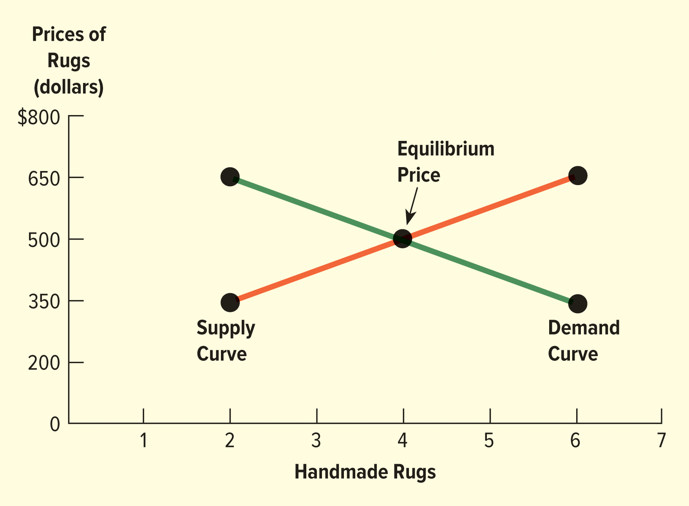
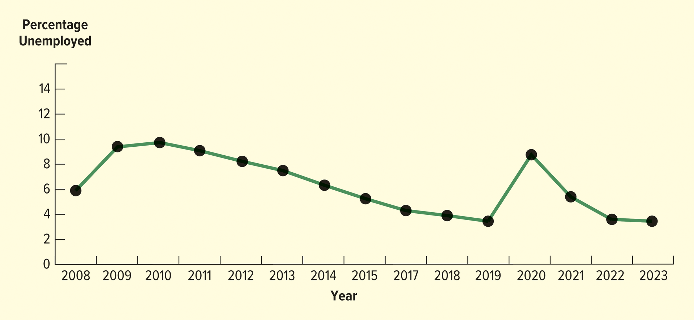

<h1 id="Chapter_1._The_Dynamics_of_Business_and_Economics" style="color:#42A5F5;">Indice</h1>

##### [Capitulo 📘 Study Guide – LO 1-1 Basic Concepts: Business, Product, Profit, and Economics](#386289)

##### [Capitulo 📘 LO 1-2 Study Guide The People and Activities of Business](#648063)

##### [Capitulo 📘 LO 1-3 Study Guide Why Study Business?](#281665)

##### [Capitulo 📘 LO 1-4 Study Guide Comparing the Four Types of Economic Systems](#888571)

##### [Capitulo 📘 LO 1-5 Study Guide The Forces of Supply and Demand](#954898)

##### [Capitulo 📘 LO 1-6 Measuring the Economy](#492167)

<h1 id="386289" style="color:#E65100;">
  <a href="#Chapter_1._The_Dynamics_of_Business_and_Economics" style="color:inherit; text-decoration:none;">
    📘 Study Guide – LO 1-1
  </a>
</h1>

Basic Concepts: Business, Product, Profit, and Economics

🔹 Business

A business is an organization or activity that tries to earn a profit by providing products that satisfy people’s needs and wants.

A business identifies what people need or want and offers products in a way that creates value and generates profit.

🔹 Product

A product is the outcome of a business’s efforts. Products have both tangible and intangible characteristics that provide value and benefits to customers.

When you buy a product, you are not just buying an object—you are buying the value and benefits you expect the product to provide.

Examples:

- A pizza from Domino's may be purchased to satisfy hunger.
- A Ford F-150 may be purchased to satisfy transportation needs and the desire to project a certain image.

🔹 Types of Products
1. Tangible Goods

These are physical products that can be seen and touched.
Examples: automobiles, smartphones, clothing.

2. Services

A service occurs when people or machines provide or process something of value for customers.

Examples include:

- Dry cleaning
- Telemedicine visits
- Movies
- Sports events
- A ride with Uber, which satisfies the need for transportation

3. Ideas

A product can also be an idea.
Professionals such as accountants and attorneys provide ideas and solutions to help solve problems.

🔹 Profit

Profit is the money a business earns after subtracting costs from revenues.

📌 Basic formula:
Profit = Revenue − Costs

Earning profit allows businesses to survive, grow, and innovate.

🔹 Economics

Economics is the study of how individuals and businesses use limited resources to produce goods and services and distribute them among society.

Economics helps answer key questions:

- What should be produced?
- How should it be produced?
- For whom should it be produced?

📝 Quick Summary

- Business: Earns profit by satisfying needs and wants.
- Product: A good, service, or idea that provides value.
- Profit: Revenue minus costs.
- Economics: Study of resource allocation.

🔹 The Goal of Business

The primary goal of business is to earn a profit while maintaining social responsibility.

Profit is the difference between:

- The cost to make and sell a product
- The price a customer pays for it

📌 Example:
If a business spends $8 on production, financing, marketing, and other expenses, and sells the product for $12, the profit is $4.

Profits are subject to federal, state, and local taxes. Businesses have the legal right to keep and use their profits because profit is the reward for taking risks and providing value.

🔹 Why Profit Is Important to Society

Earning profits benefits society by:

- Supporting social institutions and government through taxes
- Creating jobs
- Providing resources for economic growth

Businesses that earn profits, pay taxes, and create jobs are the foundation of the economy.

However, profits must be earned in an ethical and socially responsible way. Many businesses give back to their communities by supporting social and economic causes.

🔹 Nonprofit Organizations

Not all organizations are businesses.

Nonprofit organizations do not have the primary goal of earning profits, although they may provide goods or services and raise funds.

Examples include:

- Feeding America
- United Way

Even though nonprofits do not focus on profit, they still use management, marketing, and finance skills to achieve their goals.

🔹 Skills Needed to Earn a Profit

To earn a profit, businesses require several key skills:

1. Management

Managers must:

- Plan, organize, and control business activities
- Hire, train, and develop employees
- Ensure the business produces products consumers want to buy

2. Marketing

Marketing activities include:

- Identifying customer needs and wants
- Developing, pricing, promoting, and distributing products

3. Finance

Finance involves:

- Obtaining funds
- Managing expenses
- Expanding and maintaining operations

Businesses must pay for labor, facilities, taxes, and management.

🔹 Stakeholders

To maintain profitability, businesses must operate efficiently, produce quality products, and behave ethically toward their stakeholders.

Stakeholders are groups that have an interest in the success of a business.

Primary Stakeholders

Essential for survival:

- Customers
- Employees
- Suppliers
- Investors

Secondary Stakeholders

Indirect relationship:

- Media
- Trade associations
- Special-interest groups

📝 Quick Summary

- The goal of business is to earn profit responsibly
- Profit rewards risk-taking and supports society
- Businesses and nonprofits both rely on management, marketing, and finance
- Ethical behavior and social responsibility are essential
- Stakeholders influence business success

<h1 id="648063" style="color:#E65100;">
  <a href="#Chapter_1._The_Dynamics_of_Business_and_Economics" style="color:inherit; text-decoration:none;">
    📘 LO 1-2 Study Guide
  </a>
</h1>

The People and Activities of Business

🔹 Main Participants in Business

Business involves several key participants who work together to produce goods and services and satisfy customer needs.

1. Owners

Owners are the individuals who start the business and provide:

- Time and effort
- Financial resources
- Human resources

Owners may manage the business themselves or hire employees to manage operations.

In publicly traded companies, the owners are investors (shareholders), not the managers.

2. Employees

Employees are responsible for performing the work within a business.
They carry out daily operations and help produce goods or deliver services.

In many businesses, owners hire employees to manage and operate the company.

3. Chief Executive Officers (CEOs)

In publicly traded companies, chief executive officers (CEOs):

- Are employees, not owners
- Manage the entire organization
- Work to earn profits for investors, who are the real owners

4. Customers

Customers are the most important participants in business.
The main role of a business is to satisfy customers by providing goods and services they are willing to buy.

Without customers, a business cannot survive.

🔹 Major Business Activities

The primary activities of business form the outer circle of business operations:

1. Management

Management involves:

- Planning
- Organizing
- Leading
- Controlling business activities

Managers coordinate resources and employees to achieve business goals.

2. Marketing

Marketing focuses on:

- Identifying customer needs and wants
- Developing products
- Pricing, promoting, and distributing products

The goal of marketing is to create value for customers.

3. Finance

Finance deals with:

- Obtaining financial resources
- Managing money
- Funding operations and growth

Finance ensures the business can pay expenses, invest, and expand.

🔹 External Forces Affecting Business

Businesses are also influenced by forces beyond their control, including:

- Legal and regulatory forces
- Economic conditions
- Competition
- Technology
- Political environment
- Ethical and social concerns

These external forces affect daily business operations and decision-making.

📝 Quick Summary

- Owners, employees, and customers are at the center of business
- Management, marketing, and finance are the main business activities
- CEOs manage companies for investors in public firms
- Customers are the most important participants
- External forces influence how businesses operate

<h4>
Management

🔹 What Is Management?

Management is the process of planning, organizing, leading, and controlling a firm’s resources to achieve its goals efficiently and effectively.

In Figure 1.1, management and employees are shown in the same segment because management focuses on coordinating employees’ actions to accomplish business objectives.

🔹 Functions of Management

Management involves four main functions:

1.Planning
> Setting goals and deciding how to achieve them.

1.Organizing
> Arranging resources and tasks so work can be done efficiently.

1.Leading
> Motivating and guiding employees to work toward business goals.

1.Controlling
> Monitoring performance and making adjustments when needed.

Effective managers demonstrate strong leadership, decision-making, and delegation skills.

🔹 Effective Management

According to Jeff Bezos, founder and former CEO of Amazon, effective management involves:

- Making a small number of high-quality decisions
- Delegating day-to-day operational decisions to others

This approach allows managers to focus on strategic goals while empowering employees.

🔹 Managing Resources

Management is also responsible for:

- Acquiring resources
- Developing resources
- Using resources efficiently

Resources include people, time, money, equipment, and information.

🔹 Organization and Teamwork

Management emphasizes:

- Organization
- Teamwork
- Communication

Managers must coordinate different departments and ensure everyone works toward the same goals.

🔹 Operations and Human Resources

Important management areas include:

- Operations management
- Supply chain management
- Human resource management

Motivating employees and managing human resources are critical for business success.

🔹 Example: Service Management

At Ritz-Carlton, managers focus on transforming:

- Employee actions
- Hotel amenities

into a high-quality customer service experience.

This shows how management turns resources into customer value.

🔹 Management in All Organizations

Managers in both businesses and nonprofit organizations:

- Plan
- Organize
- Staff
- Control

These tasks are required to carry out the work of the organization successfully.

📝 Quick Summary

- Management coordinates employees to achieve goals
- Four functions: planning, organizing, leading, controlling
- Effective managers delegate and make strong decisions
- Resource management and motivation are essential
- Management applies to both businesses and nonprofits

<h4>
Marketing

🔹 What Is Marketing?

Marketing and customers are in the same segment of Figure 1.1 because the main focus of all marketing activities is satisfying customers.

Marketing includes all activities designed to provide goods and services that satisfy consumers’ needs and wants.

🔹 Marketing Research and Planning

Marketers:

- Gather information about customers
- Conduct marketing research to understand consumer needs and preferences
- Use research results to:
    - Plan and develop products
    - Decide how much to charge for products
    - Decide when and where products should be available

Marketers also analyze the marketing environment to understand changes in:

- Competition
- Consumer behavior

Example:
Many fast-food restaurants are reducing or eliminating dining rooms and shifting to drive-through-only service, while others require customers to order through kiosks. These changes reflect evolving consumer preferences.

<h4>
🔹 The Marketing Mix (The Four P’s)
</h4>

Marketing activities focus on the four P’s, also known as the marketing mix:

1. Product

Product management involves decisions about:

- Product adoption
- Product development
- Branding
- Product positioning

The goal is to offer products that provide value and meet customer needs.

2. Price

Price is critical because it directly affects profitability.
Marketers must set prices that:

- Customers are willing to pay
- Cover costs
- Support business goals

3. Place (Distribution)

Distribution, also called place, ensures that products are:

- Available in the right location
- Available at the right time

Distribution also includes the supply chain, which is a network of:

- Materials
- Components
- Processes
- Information

used to make and deliver products to customers.

4. Promotion

Promotion communicates product benefits and encourages customers to buy.

Promotion includes:

- Advertising
- Personal selling
- Sales promotion (coupons, games, sweepstakes)
- Publicity

Example:
Texas Pete uses advertising to appeal to restaurant operators by highlighting the variety of product sizes and flavors it offers.

📝 Quick Summary

- Marketing focuses on satisfying customer needs and wants
- Marketers use research to guide decisions
- The four P’s are product, price, place, and promotion
- Distribution and supply chains are key to availability
- Promotion communicates value and increases sales

<h4>
Finance

🔹 What Is Finance?

Finance focuses on how businesses obtain, manage, and use financial resources.

In Figure 1.1, finance is adjacent to owners because it is primarily the owners’ responsibility to provide financial resources in the form of owners’ equity, often represented by common stock.

🔹 Financial Resources and Ownership

Owners provide funding by:

- Investing personal funds
- Issuing stock in publicly traded companies

Management of large corporations relies on:

- Investors
- Loans from financial institutions
- Issuing stocks and bonds to raise capital

Owners of small businesses, in particular, often depend on bank loans for funding.

🔹 Financial Knowledge and the Financial System

Understanding finance requires knowledge of:

- Accounting
- Money and financial markets
- The financial system
- The securities market

These elements are essential for making informed financial decisions and ensuring long-term business success.

🔹 Careers in Finance

Many professionals are part of the financial world, including:

- Accountants
- Financial analysts
- Investment advisors
- Bankers

These individuals help businesses manage funds, analyze performance, and secure financing.

🔹 Finance and Business Activities

Although management and marketing must consider financial issues, finance is the primary business function responsible for securing and managing funds.

Financial management ensures that a business can:

- Operate daily
- Invest in growth
- Meet financial obligations

📝 Quick Summary

- Finance manages a firm’s money and financial resources
- Owners supply equity through stock ownership
- Large firms use investors, stocks, and bonds
- Small businesses often rely on bank loans
- Financial knowledge is essential for success

<h1 id="281665" style="color:#E65100;">
  <a href="#Chapter_1._The_Dynamics_of_Business_and_Economics" style="color:inherit; text-decoration:none;">
    📘 LO 1-3 Study Guide
  </a>
</h1>

<h4>
Why Study Business?

🔹 Importance of Studying Business

Studying business helps individuals develop skills and acquire knowledge that prepare them for future careers, regardless of whether they plan to:

- Work for a large corporation
- Start their own business
- Work for a government agency
- Manage or volunteer in a nonprofit organization

Business knowledge is useful in almost every type of organization.

🔹 Career Opportunities in Business

The field of business offers a wide variety of interesting and challenging careers, including roles in:

- Marketing
- Human resources management
- Information technology
- Finance
- Production and operations
- Accounting
- Data analytics

🔹 Common Business Job Titles

Examples of business-related careers include:

- Accountant and auditor
- Financial analyst
- Human resources specialist
- Management analyst
- Market research analyst
- Project manager
- Purchasing manager
- Training and development specialist

These are only a few of the many career options available in business.

🔹 Business Education and Earning Potential

A college degree in business significantly increases career opportunities.

Research shows that:

- College graduates generally have higher earning potential
- Their earnings are significantly higher than those of nongraduates

This makes studying business a strong investment in one’s future.

🔹 Understanding Business Activities

Studying business helps you understand the many activities required to provide satisfying goods and services.

Most businesses charge reasonable prices to:

- Cover production costs
- Pay employees
- Provide owners with a return on their investment
- Support local communities and society

Understanding these activities helps explain how businesses operate sustainably.

🔹 Social Responsibility and Giving Back

Many successful companies practice social responsibility by giving back to communities and supporting social causes.

Examples include:

- Allbirds
- Bombas
- Cisco
- Dr. Bronner's
- General Mills
- HP
- Merck
- Microsoft
- Texas Instruments
- Warby Parker

Learning about business shows how companies can be profitable while acting ethically and socially responsible.

🔹 Becoming an Informed Consumer and Citizen

Business education helps individuals become:

- Better-informed consumers
- More knowledgeable members of society

By understanding pricing, costs, and profits, consumers can make smarter purchasing decisions.

🔹 Business Costs and Employment

Labor often represents a significant percentage of total business costs.

Studying business explains:

- Why wages matter
- How labor costs affect pricing
- How employment decisions impact businesses and the economy

🔹 Business and Quality of Life

Business activities generate:

- Profits that support businesses and local economies
- Products and services that improve the public’s quality of life

Understanding business helps people see the connection between economic activity and everyday living standards.

🔹 Understanding the Free-Enterprise System

Studying business helps individuals understand how the free-enterprise economic system:

- Allocates resources
- Provides incentives for businesses and workers
- Encourages innovation and productivity

This knowledge is important for anyone participating in the economy.

📝 Quick Summary

- Business studies prepare students for many career paths
- Business skills apply to corporations, government, and nonprofits
- Many job opportunities exist in multiple fields
- College graduates earn more on average than nongraduates
- Studying business explains how goods and services are created
- Businesses balance costs, profits, and social responsibility
- Many companies give back to society
- Business knowledge creates informed consumers and citizens
- Understanding the free-enterprise system benefits everyone

<h1 id="888571" style="color:#E65100;">
  <a href="#Chapter_1._The_Dynamics_of_Business_and_Economics" style="color:inherit; text-decoration:none;">
    📘 LO 1-4 Study Guide

  </a>
</h1>

Comparing the Four Types of Economic Systems

🔹 What Is Economics?

Economics is the study of how resources are distributed for the production of goods and services within a society.

Resources used to produce goods and services are called the factors of production:

- Land: natural resources (land, water, minerals, forests)
- Labor: human physical and mental effort
- Capital: financial resources and tools used in production
- Enterprise (Entrepreneurship): ability to organize resources and take risks

Businesses also rely on intangible resources, such as reputation and social responsibility, to gain a competitive advantage.

🔹 What Is an Economic System?

An economic system describes how a society allocates limited resources to satisfy unlimited wants.

All economic systems must answer three basic questions:

1. What goods and services will be produced, and how much?
1. How will they be produced, and with what resources?
1. For whom will goods and services be produced?

<h4>
🔹 The Four Types of Economic Systems

| **Feature**                      | **Communism**                                                                              | **Socialism**                                                                                                   | **Capitalism**                                                                                          |
| -------------------------------- | ------------------------------------------------------------------------------------------ | --------------------------------------------------------------------------------------------------------------- | ------------------------------------------------------------------------------------------------------- |
| **Business Ownership**           | Most businesses are owned and operated by the **government**.                              | The **government owns and operates basic industries**; individuals also own businesses.                         | **Individuals own and operate** all businesses.                                                         |
| **Competition**                  | **Controlled by the government**; little or no competition.                                | **Restricted** in basic industries; **encouraged** in other businesses.                                         | **Encouraged** by market forces and government regulations.                                             |
| **Profits**                      | Excess income goes to the **government**, which supports social and economic institutions. | Profits may be **reinvested** in businesses; profits from government-owned industries go to the **government**. | Individuals and businesses **keep profits** after paying taxes.                                         |
| **Product Availability & Price** | **Limited choice** of goods and services; prices are usually **high**.                     | Consumers have a **choice** of goods and services; prices are determined by **supply and demand**.              | Consumers have a **wide choice** of goods and services; prices are determined by **supply and demand**. |
| **Employment Options**           | **Little choice** of careers; most people work for government-owned industries or farms.   | **More career choices**; many people work in government jobs.                                                   | **Unlimited career choices**; people choose jobs freely.                                                |

📝 Key Takeaways

- Communism: Government controls ownership, competition, and profits; limited consumer and career choice.
- Socialism: Mix of government and private ownership; competition exists outside basic industries.
- Capitalism: Private ownership, strong competition, profit incentives, and maximum consumer and job choice.

Communism

Communism was first described by Karl Marx as an economic system in which all people, regardless of class, collectively own a nation’s resources. In this ideal system, individuals contribute according to their abilities and receive benefits according to their needs. The government owns and operates all businesses and factors of production, and central planning decides what goods and services are produced, how they are made, and how they are distributed. Although communism appears fair and equal in theory, in practice it has often resulted in low standards of living, shortages of consumer goods, corruption, and limited freedom. Many countries, such as Russia, Poland, and Hungary, have moved away from communism toward market-based systems. Others, including Venezuela and Cuba, have struggled to maintain communist principles. China achieved economic growth by combining government control with capitalist practices through state capitalism. Overall, due to economic challenges, communism is declining and its future as a dominant economic system remains uncertain.

Capitalism

Capitalism, also known as the free-enterprise system, is an economic system in which individuals own and operate most businesses that produce goods and services. In capitalism, competition, supply, and demand determine what is produced, how it is produced, and how goods and services are distributed. Countries such as United States, Canada, Japan, and Australia have economic systems based largely on capitalism. There are two forms of capitalism: pure capitalism and modified capitalism. Pure capitalism, or the free-market system, involves little to no government involvement and was first described by Adam Smith, who believed the economy is guided by the “invisible hand” of competition. Modified capitalism, which exists in most modern countries, allows the government to regulate business through laws to protect consumers, promote fair competition, and address social concerns, while still encouraging private ownership and profit.

Mixed economies

Mixed economies combine elements of communism, socialism, and capitalism, and no country today follows a purely single economic system. Most nations favor one system but include features of others. For example, Sweden is considered socialist, yet most businesses are privately owned, while the United States, a capitalist nation, has government involvement in areas such as the postal service. Countries like Germany, Hungary, and Poland have adopted capitalist practices such as private ownership. Economic relationships between different systems can create conflict, as seen in trade tensions involving China and Russia. Many mixed economies use state capitalism, where the government leads the economy while using capitalist tools like stock markets and globalization. Large state-influenced companies such as Gazprom, Alibaba, and Tencent show how governments can combine control with market-based strategies to promote economic growth.

The Free-Enterprise System

The free-enterprise system is an economic system in which businesses are allowed to succeed or fail based on market demand. Countries such as the United States, Canada, and Japan are based on free enterprise, while countries like China and Russia have adopted some free-enterprise principles. In this system, businesses that efficiently produce goods and services consumers want are likely to succeed, while inefficient businesses or those offering unwanted products tend to fail. Free enterprise depends on key rights, including the right to own property, earn and use profits, make business decisions within legal limits, and choose careers and purchases freely. These rights motivate individuals and businesses to work harder, innovate, and compete. As a result, free-enterprise systems encourage entrepreneurship and productivity. Many successful entrepreneurs, such as Bill Gates, Rihanna, Walt Disney, and Anne Wojcicki, built innovative companies by taking advantage of the personal and financial incentives offered by free enterprise.

<h1 id="954898" style="color:#E65100;">
  <a href="#Chapter_1._The_Dynamics_of_Business_and_Economics" style="color:inherit; text-decoration:none;">
    📘 LO 1-5 Study Guide The Forces of Supply and Demand
  </a>
</h1>

In free-enterprise systems such as the United States, the distribution of resources and products is determined by supply and demand. Demand refers to the amount of goods or services that consumers are willing and able to buy at different prices during a specific period of time. In general, as the price of a product decreases, consumers are willing to buy more of it, and as the price increases, they buy less. For example, consumers may buy more handmade rugs when the price is low and fewer rugs when the price is high. This relationship between price and quantity demanded is shown by a demand curve, which slopes downward to reflect that lower prices lead to higher demand. Supply and demand together help determine what products are sold, how many are sold, and at what price, making them essential forces in a free-enterprise system.

Imagine handmade rugs being sold in a market:

| **Price per Rug** | **Quantity Consumers Will Buy** |
| ----------------- | ------------------------------- |
| $350              | 6 rugs                          |
| $500              | 4 rugs                          |
| $650              | 2 rugs                          |

<h4>
FIGURE 1.2 Equilibrium Price of Handmade Rugs

In a free-enterprise system, the equilibrium price is the price at which the quantity supplied by businesses equals the quantity demanded by consumers at a specific point in time. Using the rug example, the company is willing to supply 4 rugs at $500 each, and consumers are willing to buy 4 rugs at $500 each. Therefore, $500 is the equilibrium price.

- If a business charges more than $500, fewer rugs will be sold, and profits may drop.

- If a business charges less than $500, it sells more but earns less profit per rug.

The equilibrium price changes constantly as supply and demand respond to economic conditions, resource availability, and competition. For example, the price of oil has fluctuated widely in the last 10 years due to changes in global supply and demand, even dropping below $0 during the COVID-19 pandemic.

Overall, supply and demand are the key forces that determine prices, resource distribution, and production levels in a free-enterprise economy. The intersection of the supply and demand curves in a graph shows the equilibrium price visually.

<h4>
BIG TECH IS UNDER BIG SCRUTINY – Summary

The five largest U.S. tech companies—Alphabet, Amazon, Apple, Meta, and Microsoft—are being closely examined by regulators and lawmakers worldwide. In the U.S., the Federal Trade Commission (FTC) and the Department of Justice (DOJ) enforce antitrust laws to prevent monopolies and maintain fair competition.

Concerns about Big Tech include:

Limited competition, which can increase prices and reduce consumer choices.

Acquisitions that may harm competition (e.g., Microsoft and Activision Blizzard).

Business practices, such as Google’s advertising dominance, Amazon promoting its own products, and Meta forcing users to accept targeted ads.

Regulators consider measures like mandated data sharing and stricter rules similar to those applied to banks and telecoms. Supporters say this can encourage competition and help entrepreneurs, while critics warn it may reduce innovation and harm privacy.

<h4>
Critical Thinking Questions – Answers

1. Why are monopolies generally bad for consumers?

Monopolies limit competition, allowing companies to raise prices, reduce choices, and lower the incentive to improve products, which hurts consumers.

2. What is the objective of antitrust legislation?

The goal of antitrust laws is to prevent monopolies, promote fair competition, and protect consumers from unfair business practices.

3. Why is Big Tech under scrutiny?

Big Tech is under scrutiny because their size and business practices may stifle competition, manipulate markets, or harm consumers. Regulators are reviewing acquisitions, data practices, and dominance in online platforms to ensure fair competition.

<h4>
The Nature of Competition

Key Concept

- Competition: The rivalry among businesses to attract consumers’ money.
- According to Adam Smith, competition improves efficiency, reduces prices, and encourages businesses to offer high-quality products.
- Competition enables open markets and provides opportunities for innovation, cost reduction, and better service.
- Example: SpaceX (Elon Musk), Virgin Galactic (Richard Branson), and Blue Origin (Jeff Bezos) are competing in the space tourism market.

<h4>
Four Types of Competitive Environments

1. Pure Competition

- Many small businesses selling a standardized product.
- Prices are set entirely by supply and demand.
- No single business can influence the market price.
- Example: agricultural commodities such as wheat, corn, and cotton.

2. Monopolistic Competition

- Many businesses competing, but products are slightly differentiated.
- Differences can include packaging, brand, warranty, or features.
- Businesses have some control over prices because consumers recognize product differences.
- Examples: aspirin, soft drinks, jeans.
- Premium example: Dyson Supersonic Hair Dryer ($400+), offers unique features.

3. Oligopoly

- Few businesses dominate the market.
- Each company has partial control over prices, but prices stay close because firms respond to competitors’ actions.
- High barriers to entry prevent new companies from easily entering.
- Examples: airlines, automobiles, pharmaceuticals.
- Example behavior: one airline cuts fares → others follow to remain competitive.

4. Monopoly

- Single company provides a product or service in a market.
- Often allowed by the government due to high production costs or patent protection.
- Prices may be regulated by the government.
- Example: utility companies (electricity, gas, water).
- Patented products (e.g., Eli Lilly’s Alimta drug) allow recovery of R&D costs; after 20 years, generics can enter the market.

Key Takeaways

- Competition drives innovation, quality, and efficiency.
- The type of market affects pricing power, entry barriers, and product differentiation.
- Entrepreneurs and businesses can succeed by leveraging innovation, cost management, and unique product features.

<h4>
Economic Cycles and Productivity – Study Guide

Key Concepts

- Economies are dynamic—they expand and contract over time.
- Economic cycles describe these fluctuations in economic activity.

Economic Expansion

- Occurs when the economy is growing.
- People spend more money, increasing demand for goods and services.
- Businesses respond by producing more and hiring more workers.
- Standard of living rises because more people are employed and earning income.
- Inflation risk: Rapid expansions can lead to inflation—rising prices.
    - Inflation reduces purchasing power if incomes do not increase at the same pace.
    - Example: Following COVID-19, the U.S. experienced the highest inflation in four decades.

Economic Contraction

- Occurs when spending declines.
- Businesses cut production and may lay off employees.
- The economy slows down, potentially leading to a recession.
    - Recession: a decline in production, employment, and income.
    - Characterized by rising unemployment (percentage of people who want to work but cannot find jobs).
- Deflation risk: Prices may fall due to reduced demand.
    - Deflation can be harmful because consumers may delay purchases, expecting even lower prices.
    - This delay can further slow economic activity and deepen a recession.

Important Points

- Unemployment trends over time reflect the health of the economy.
- Policymakers monitor inflation, deflation, and employment rates to maintain economic stability.
- Economic cycles are natural in a market-based economy and affect businesses, consumers, and government policy.

<h4>
Economic Recessions and Cycles in the United States

The U.S. economy has experienced several recessions, including 1990–1991, 2002–2003, 2008–2011, and 2020. The Great Recession (2008–2011) was triggered by the collapse in housing prices and widespread defaults on mortgages and credit cards, causing a banking crisis. The government intervened to prevent bank failures, but consumer spending slowed and unemployment reached 10%.

During the COVID-19 pandemic in 2020, unemployment spiked to 14.7%, the highest since the Great Depression, as businesses closed and many workers were laid off. Online and nonstore sales rose, but overall retail sales dropped 21.6%. By 2022, unemployment had decreased to 3.6%, though labor shortages persisted as some workers did not return.

Economic cycles involve expansions and contractions influenced by consumer, business, and government spending. Wars can also impact the economy, sometimes boosting it (e.g., World Wars I and II) or hindering it (e.g., Vietnam, Persian Gulf, Iraq). Severe recessions can turn into depressions, marked by high unemployment, low consumer spending, and sharply reduced business output, as seen in the 1930s Great Depression.

Key takeaway: Economic fluctuations are inevitable, affecting inflation, employment, and overall standards of living, so governments attempt to minimize their impact.

<h1 id="492167" style="color:#E65100;">
  <a href="#Chapter_1._The_Dynamics_of_Business_and_Economics" style="color:inherit; text-decoration:none;">
    📘 Measuring the Economy
  </a>
</h1>

Countries track their economic health to see if the economy is expanding or contracting and whether interventions are needed to reduce negative effects.

A common measure is Gross Domestic Product (GDP):

- GDP is the total value of all goods and services produced within a country in a year.
- It includes profits earned by foreign companies operating domestically but excludes profits from domestic companies’ overseas operations.
- GDP alone does not account for population size; for that, economists use GDP per capita, which shows average economic output per person.

Monitoring GDP over time helps governments, businesses, and individuals understand the overall economic performance and make informed decisions.

<h4>
The formula for Gross Domestic Product (GDP)

The formula for Gross Domestic Product (GDP) depends on the approach used, but the most common is the expenditure approach, which calculates GDP by adding up all spending on final goods and services in an economy:

$$GDP = C + I + G + (X - M)$$

- **C** = Consumption (spending by households on goods and services)
- **I** = Investment (spending on capital goods, residential construction, and inventories)
- **G** = Government Spending (expenditures on public goods and services)
- **X** = Exports (goods and services sold to other countries)
- **M** = Imports (goods and services bought from other countries)

So, (X − M) represents net exports.

💡 Example:

If a country has:
- C = $10 trillion
- I = $3 trillion
- G = $4 trillion
- Exports = $2 trillion
- Imports = $1 trillion

Then:

$
GDP \;=\; 10 \;+\; 3 \;+\; 4 \;+\; (2 - 1) \;=\; 18\ \text{trillion dollars}
$

