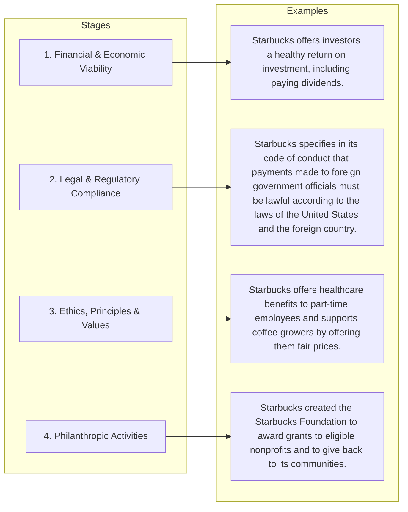
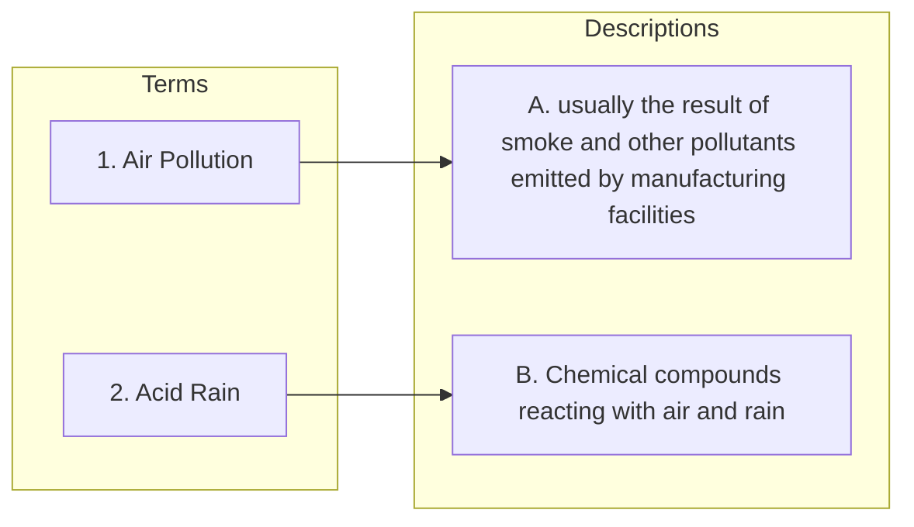

 
---
1. **Question:**
 
An individual's values, principles, and standards of conduct are referred to as:  

A. Ethical norms  
B. Personal responsibility  
C. A moral compass  
D. Personal ethics ✅  

**Answer:** D. Personal ethics  

**Explanation:** Personal ethics represent an individual's own values, principles, and standards that guide behavior and decision-making. Other options refer to societal standards, accountability, or metaphorical guidance rather than personal values.

 
---
2. **Question:**
 
An identifiable problem, situation, or opportunity that requires a person to choose between actions that may be evaluated as ethical or unethical is referred to as:  

A. A social dilemma  
B. A conflict of interest  
C. A conflict of expectations  
D. An ethical issue ✅  

**Answer:** D. An ethical issue  

**Explanation:** An ethical issue arises when a person must make a decision that can be judged as right or wrong. It involves a situation where ethical principles are relevant in evaluating the possible actions. Other options describe specific types of problems but do not capture the general concept of a moral decision point.

 
---
3. **Question:**
 
What is one of the principal causes of unethical behavior in an organization?  

A. A flat leadership structure  
B. Downward communication trends that increase isolation  
C. The increase in supply and demand  
D. The rewards associated with overly aggressive financial objectives ✅  

**Answer:** D. The rewards associated with overly aggressive financial objectives  

**Explanation:** When organizations set overly aggressive financial goals, employees may feel pressured to achieve results at any cost, which can lead to unethical behavior such as falsifying reports or cutting corners. Incentive structures that reward results without considering ethical practices are a common driver of misconduct.

 
---
4. **Question:**
 
Payments, gifts, or special favors intended to influence the outcome of a decision are considered:  

A. To be a routine, ethical practice  
B. Ethical by all countries  
C. Bribery and are unethical ✅  
D. To be socially responsible  

**Answer:** C. Bribery and are unethical  

**Explanation:** Offering payments, gifts, or favors to influence a decision is considered **bribery**, which is generally illegal and unethical because it undermines fairness, transparency, and trust in decision-making processes.

 
---
5. **Question:**
 
Theft of time is a common area of misconduct observed in the workplace.

**Answer:** True ✅  

**Explanation:** Theft of time occurs when employees are paid for time they do not actually work (e.g., excessive personal activities during work hours, falsifying timesheets). It is considered a common form of workplace misconduct.

 
---
6. **Question:**
 
__________ is/are principles and standards that determine acceptable conduct in business.

A. Corporate citizenship  
B. Ethical issues  
C. Personal ethics  
D. Business ethics ✅  

**Answer:** D. Business ethics  

**Explanation:** **Business ethics** refers to the principles and standards that guide behavior in the world of business. These standards help determine what is considered acceptable or unacceptable conduct in business activities.

 
---
7. **Question:**
 
Physical threats, false accusations, use of profanity, and yelling at others all fall under which category of organizational misconduct?

A. Lying to stakeholders  
B. Conflict of interest  
C. Abusive behavior ✅  
D. Retaliation by employees  

**Answer:** C. Abusive behavior  

**Explanation:** **Abusive behavior** includes actions such as physical threats, intimidation, yelling, profanity, and false accusations directed toward others in the workplace. These behaviors create a hostile work environment and are considered misconduct.

 
---
8. **Question:**
 
Jarek is short of his sales goal this month. He knows if he adds small items to his customer's orders, they most likely won't notice the small increase and then he would be able to make his goal. His only other choice is to accept he hasn't met the goal and will lose some of his commission. This exemplifies a(n):

A. Sustainable practice  
B. Clever maneuver  
C. Ethical issue ✅  
D. Reasonable sales tactic  

**Answer:** C. Ethical issue  

**Explanation:** An **ethical issue** arises when a person must choose between actions that can be judged as right or wrong. In this case, Jarek is considering adding items to customer orders without their knowledge to meet his sales goal, which raises ethical concerns.

 
---
9. **Question:**
 
What type of behavior creates a hostile workplace environment but has little legal recourse?

A. Unwarranted promotions  
B. Overt flattery  
C. Bullying ✅  
D. Favoritism  

**Answer:** C. Bullying  

**Explanation:** **Bullying** involves repeated mistreatment such as intimidation, humiliation, or verbal abuse that creates a hostile work environment. Although harmful, workplace bullying often has limited legal remedies compared to other forms of misconduct.

 
---
10. **Question:**
 
During the 2020 pandemic shutdown, many companies were forced to move to a remote working situation. In terms of unethical behavior, this likely reduced incidents of:

A. Fairness  
B. Honesty  
C. Misuse of resources  
D. Bullying ✅  

**Answer:** D. Bullying  

**Explanation:** Remote work reduced direct, in-person interaction among employees, which likely decreased **bullying**, a type of misconduct that often occurs through face-to-face intimidation, harassment, or hostile workplace behavior.

 
---
11. **Question:**
 
From the following list, select all the options that are true of stealing office supplies.

- ☐ It is abusive behavior.  
- ☑ It is a misuse of company time.  ✅
- ☐ It represents conflict of interest.  
- ☑ It is a misuse of company resources. ✅  

**Correct Answer:** 
- It is a misuse of company time. 
- It is a misuse of company resources.  

**Explanation:** Stealing office supplies involves taking company property for personal use, which is considered **misuse of company resources**. It is not abusive behavior, misuse of time, or a conflict of interest.

 
---
12. **Question:**
 
Which type of industry is especially susceptible to employee internal theft?

- A. Banking  
- B. Retail ✅  
- C. Education  
- D. Healthcare  

**Answer:** B. Retail  

**Explanation:** Retail industries often handle large volumes of cash, merchandise, and inventory, making them more vulnerable to employee theft. Items can be easily misappropriated or stolen without immediate detection, and employees have frequent access to stock and cash registers. This risk is higher than in sectors like education or healthcare, where assets are less liquid and closely monitored.

 
---
14. **Question:**
 
Money given in exchange for a special favor is called a _______ and it benefits an individual or a company at the expense of other stakeholders.

- A. Bribe ✅  
- B. Gift  
- C. Contribution  
- D. Tariff  

**Answer:** A. Bribe  

**Explanation:** A bribe is an illegal or unethical payment made to influence a decision or gain an advantage. It benefits the person or company offering or receiving the bribe, often at the expense of other stakeholders, competitors, or the public. Unlike gifts or contributions, bribes are intended to manipulate outcomes in ways that are unfair or unlawful.

 
---
15. **Question:**
 
When it comes to fairness and honesty, which two actions are expected of businesses?  

- A. To justify unethical practices to the firm's stakeholders  
- B. To follow applicable laws and regulations ✅  
- C. To exercise caution in using coercive or deceptive practices ✅  
- D. To avoid harming customers, employees, clients, or competitors ✅  

**Answer:** B, D  

- B. To follow applicable laws and regulations ✅   
- D. To avoid harming customers, employees, clients, or competitors ✅ 

**Explanation:** Businesses are expected to operate with fairness and honesty. This includes following all applicable laws and regulations (B), avoiding coercive or deceptive practices in dealings with stakeholders (C), and taking care not to harm customers, employees, clients, or competitors (D). Justifying unethical practices (A) is contrary to ethical business conduct.

 
---
16. **Question:**
 
Rachel spends an hour or more each day at work checking her Facebook feed, watching YouTube videos, and scrolling through TikTok. Rachel is guilty of which form of misconduct?

- A. Abusive and intimidating behavior  
- B. Violating safety regulations  
- C. Conflict of interest  
- D. Plagiarism  
- E. Misuse of company time ✅  

**Answer:** E. Misuse of company time  

**Explanation:** Spending work hours on personal activities such as social media or streaming videos is considered a misuse of company time. It reduces productivity and violates the employee's obligation to perform their duties during work hours.

 
---
17. **Question:**
 
Jacinta has high individual moral standards and values but the opportunity still exists for her to engage in misconduct in her company. What is one of the three key factors influencing ethical decisions that will affect Jacinta's actions?

- A. The behavior of her managers and co-workers ✅  
- B. The absence of a company code of ethics  
- C. How well the company compensates her  
- D. How she behaved at previous jobs  

**Answer:** A. The behavior of her managers and co-workers  

**Explanation:** Ethical behavior in a workplace is influenced not only by an individual's personal values but also by the organizational environment. Observing managers and colleagues engaging in ethical or unethical practices strongly affects an employee’s decisions, as social and professional norms shape acceptable behavior.

 
---
18. **Question:**
 
Which behavior is the most common ethical problem for employees?

- A. Abusive behavior  
- B. Theft of time ✅  
- C. Fairness and honesty  
- D. Bribery  

**Answer:** 
- A. Abusive behavior 
 
---
19.  **Question:**
 
Although sexual harassment has legal recourse, ______ has little recourse at this time.

- A. unwarranted promotions  
- B. favoritism  
- C. bullying ✅  
- D. overt flattery  

**Answer:** C. bullying  

**Explanation:** Bullying in the workplace, unlike sexual harassment, often does not have clear legal protections. While it can create a hostile work environment, current laws provide limited recourse for employees facing bullying, making it a challenging issue to address legally.

 
---
20. **Question:**
 
Select all that apply

What are the four categories of social responsibility?

- A. Ethics ✅  
- B. Legal ✅  
- C. Economic ✅  
- D. Environmental  
- E. Philanthropy ✅  
- F. Cultural  

**Answer:** A. Ethics, B. Legal, C. Economic, E. Philanthropy  

**Explanation:** Social responsibility involves a company's duty to act in ways that benefit society. The four main categories are:  
1. **Ethical responsibility** – Acting fairly and morally.  
2. **Legal responsibility** – Complying with laws and regulations.  
3. **Economic responsibility** – Being profitable while considering societal impacts.  
4. **Philanthropic responsibility** – Voluntarily giving back to the community, such as through donations or community programs.  
Environmental and cultural considerations can be part of broader CSR initiatives but are not among the four primary categories.

 
---
21. **Question:**
 
Fairness and honesty are at the heart of business **ethics** and relate to the general values of decision makers.

**Answer:** ethics

**Explanation:** Business ethics refers to the principles and standards that guide behavior in the business world. Fairness and honesty are central to ethical decision-making, ensuring that actions taken by a company or its employees reflect integrity and respect for stakeholders.

 
---
22. **Question:**
 
Identify the three factors that influence business ethics.  

**Answer:**  
- Individual standards and values  
- The influence of managers and co-workers  
- Codes and compliance requirements  

**Explanation:**  
Business ethics are shaped by a combination of personal morality, the behavior and expectations of peers and managers, and the formal guidelines set by the organization, such as codes of conduct and compliance programs. These factors together determine how employees make ethical decisions in the workplace.

 
---
23. **Question:**
 
What do studies show about the relationship between social responsibility and profitability?  

- A) Social responsibility is associated with improved business performance.  
- B) Social responsibility has no effect on business performance.  
- C) Social responsibility initiatives reduce business performance.  
- D) Social responsibility initiatives reduce both business performance and profitability.  

**Answer:**  
- A) Social responsibility is associated with improved business performance.  

**Explanation:**  
Research indicates that companies engaging in socially responsible practices—such as ethical behavior, environmental sustainability, and community involvement—often experience better financial performance. Positive public perception, increased customer loyalty, and higher employee morale contribute to enhanced profitability.

 
---
24. **Question:**
 
Physical threats, false accusations, use of profanity, and yelling at others all fall under which category of organizational misconduct?  

- A) Abusive behavior  
- B) Retaliation by employees  
- C) Lying to stakeholders  
- D) Conflict of interest  

**Answer:**  
- A) Abusive behavior  

**Explanation:**  
- Abusive behavior in the workplace includes actions that intimidate, threaten, or harm others, either verbally or physically.  
- This type of misconduct creates a hostile environment and can negatively affect employee morale, productivity, and overall workplace culture.

 
---
25. **Question:**
 
A business's primary obligation to its owners and investors is to:  

- A) Expand the firm as rapidly as possible  
- B) Minimize the amount of negative publicity the firm receives  
- C) Maximize the owners' investments in the firm  
- D) Inform shareholders of all business decisions  

**Answer:**  
- C) Maximize the owners' investments in the firm  

 
---
26. **Question:**
 
Match the stages of social responsibility with the appropriate example:  

 
---
27. **Question:**
 
Knowing the importance of employee relations, what is the likely result of a company that listens to employees' grievances and treats them fairly?  

**Answer:** Higher morale among employees  

**Explanation:**  
When a company actively listens to its employees and addresses their concerns fairly, it fosters a positive work environment. This leads to higher morale, increased job satisfaction, greater loyalty, and often improved productivity, all of which benefit both the employees and the organization.

 
---
28. **Question:**
 
Which type of industry is especially susceptible to employee internal theft?  

**Answer:** Retail  

**Explanation:**  
Retail industries handle a large volume of inventory and cash transactions, making them more vulnerable to internal theft. Employees may take merchandise, manipulate sales records, or engage in cash skimming. Strong internal controls, monitoring systems, and employee training are crucial to minimizing such risks.

 
---
29. **Question:**
 
The activities that independent individuals, groups, and organizations undertake to protect their rights as consumers is called  

**Answer:** Consumerism  

**Explanation:**  
Consumerism refers to efforts by individuals and organizations to ensure that businesses provide safe, fair, and honest products and services. It includes advocating for consumer rights, monitoring corporate practices, and influencing policies to protect buyers from unfair, unsafe, or deceptive business practices.

 
---
30. **Question:**
 
Sustainability can be defined as  

**Answer:**  
  - Conducting activities in such a way as to provide for the long-term well-being of the natural environment  

**Explanation:**  
Sustainability focuses on using resources responsibly and managing business practices to ensure that natural, social, and economic systems remain healthy and viable for future generations. It is about balancing present needs without compromising the ability of future generations to meet their own needs.

 
---
31. **Question:**
 
A number of studies have found a direct relationship between social responsibility and customer loyalty, as well as a link that exists between employee commitment and  

**Answer:**  
  - Profitability  

**Explanation:**  
Research shows that businesses that actively practice social responsibility tend to earn higher customer loyalty and greater employee commitment. Loyal customers and engaged employees contribute to higher efficiency, better performance, and ultimately increased profitability for the company.

 
---
32. **Question:**
 
Match the description to the pollution term it represents:  

- **Air pollution** → usually the result of smoke and other pollutants emitted by manufacturing facilities  
- **Acid rain** → chemical compounds that react with air and rain  

**Explanation:**  
Air pollution occurs when harmful substances such as smoke, soot, and chemicals are released into the atmosphere, primarily from industrial or vehicular sources. Acid rain forms when sulfur dioxide (SO₂) and nitrogen oxides (NOₓ) in the air react with water, oxygen, and other chemicals to produce rain with a lower pH, which can harm ecosystems and man-made structures.

 
---
33. **Question:**
 
Businesses must first be responsible to their owners, who are primarily concerned with:  

- A) avoiding any form of taxation  
- B) earning a profit ✅  
- C) employee satisfaction  
- D) business expansion opportunities  

**Answer:**  
- earning a profit 

**Explanation:**  
The primary obligation of a business is to its owners or shareholders, whose main interest is in earning a return on their investment. Profits ensure that owners see financial benefits and can reinvest or withdraw capital. While employee satisfaction, expansion, and tax considerations are important, they are secondary to the goal of profitability.

 
---
34. **Question:**
 
Which issue resulting from factory closures can be considered an ethical issue because of the repercussions it has on other businesses—mainly in the loss of sales?  

- A) Employee strikes  
- B) Unemployment ✅  
- C) Consumerism  
- D) Whistleblowing  

**Answer:**  
  - Unemployment

- **Explanation:**  
  Factory closures often result in unemployment, which not only affects the workers but also has ripple effects on other local businesses that rely on consumer spending. This creates an ethical issue because decisions to close factories can harm communities economically, raising questions about the responsibility of businesses to consider the broader social impact of their actions.

 
---
35. **Question:**
 
Employees expect businesses to:

- A) Place being profitable before employee grievances  
- B) Pay them adequately for their work ✅  
- C) Keep them informed of what is happening in their company ✅  
- D) Provide a safe workplace ✅  

**Answer:**  
  - Pay them adequately for their work  
  - Keep them informed of what is happening in their company  
  - Provide a safe workplace  

- **Explanation:**  
  Employees expect fair compensation, clear communication about company matters, and a safe working environment. These expectations contribute to trust, job satisfaction, and productivity. Prioritizing profit over employee concerns is not considered an ethical or responsible practice toward employees.

 
---
36. **Question:**
 
The legal rules and regulations that govern the conduct of business is referred to as  

- A) Business ethics  
- B) Corporate citizenship  
- C) Social responsibility  
- D) Business law ✅  

**Answer:**  
  - Business law

- **Explanation:**  
  **Business law** refers to the set of legal rules and regulations that control how businesses operate. These laws govern areas such as contracts, employment, consumer protection, and corporate behavior to ensure that businesses act within the legal framework established by governments.

 
---
37. **Question:**
 
What are two typical forms of consumerism?

- A) Writing letters to companies ✅  
- B) Boycotting companies ✅  
- C) Using physical force to stop customers  
- D) Ignoring a company's Facebook posts  

**Answer:**  
  - Writing letters to companies  
  - Boycotting companies  

- **Explanation:**  
  Consumerism involves actions taken by individuals or groups to protect consumer rights and influence business practices. Common methods include contacting companies directly (such as writing letters or complaints) and organizing boycotts to pressure businesses to change unethical or unfair practices.

 
---
38. **Question:**
 
When a business is accused of mail fraud and members of the staff face possible imprisonment, it is an example of:

- A) Criminal law ✅  
- B) Mediation  
- C) Civil law  
- D) Arbitration  

**Answer:**  
  - Criminal law  

- **Explanation:**  
  **Criminal law** deals with offenses against the public or society and can result in penalties such as fines or imprisonment. Mail fraud is considered a criminal offense, and individuals involved may face criminal prosecution and possible jail time.

 
---
39. **Question:**
 
Conducting activities in such a way as to provide for the long-term well-being of the natural environment is referred to as **______**.

**Answer:**  
  - Sustainability  

- **Explanation:**  
  **Sustainability** refers to business practices and activities that protect natural resources and the environment so that future generations can meet their needs. It emphasizes long-term environmental balance and responsible use of resources.

 
---
40. **Question:**
 
When one individual or organization takes another to court using civil laws, that individual or organization is attempting to resolve a conflict through a(n):

- A) Contract  
- B) Arbitration  
- C) Mediation  
- D) Lawsuit ✅  

**Answer:**  
  - Lawsuit  

- **Explanation:**  
  A **lawsuit** is a legal action brought in court under civil law to resolve a dispute between individuals or organizations. The court reviews the case and makes a decision, which may involve compensation or other legal remedies.

 
---
41. **Question:**
 
When some chemical compounds emitted by manufacturing facilities react with air and rain, the resulting type of air pollution is called **______ ______**.

**Answer:**  
  - Acid rain  

- **Explanation:**  
  **Acid rain** forms when pollutants such as sulfur dioxide (SO₂) and nitrogen oxides (NOₓ) released from factories react with water vapor and oxygen in the atmosphere. These reactions produce acidic compounds that fall to the ground with rain, snow, or fog, harming ecosystems, buildings, and water sources.

 
---
42. **Question:**
 
When a court has the legal power to interpret and apply the law and make a binding decision in a case, it is said to have:

- A) Authority  
- B) Mediation  
- C) Jurisdiction ✅  
- D) Arbitration  

**Answer:**  
  - Jurisdiction  

- **Explanation:**  
  **Jurisdiction** refers to the legal authority of a court to hear a case, interpret the law, and make binding decisions. It determines which court has the power to handle a particular legal matter based on factors such as location or subject matter.

 
---
43. **Question:**
 
When a court has the legal power to interpret and apply the law and make a binding decision in a case it is said to have_______________:

- A) Authority  
- B) Mediation  
- C) Jurisdiction ✅  
- D) Arbitration  

**Answer:**  
  - Jurisdiction  

- **Explanation:**  
  **Jurisdiction** is the legal power or authority of a court to hear a case and make decisions that are legally binding. It determines whether a particular court has the right to handle a specific legal matter.

 
---
44. **Question:**
 
Unemployment becomes a(n) ______ issue when an employer notices that the job applicants for openings at the company lack many of the basic skills needed to do the job. The employer is concerned that the quality of education in his country is declining.

- A) Personal  
- B) Physiological  
- C) Social ✅  
- D) Diversity  

**Answer:**  
  - Social  

- **Explanation:**  
  When unemployment is linked to broader problems such as declining education quality and lack of workforce skills, it becomes a **social issue**. Social issues affect society as a whole and often require solutions involving education systems, government policy, and community efforts.

 
---
45. **Question:**
 
Which organization allocates a large portion of its resources to curbing false advertising, misleading pricing, and deceptive packaging and labeling?  

- A) Environmental Protection Agency  
- B) Food and Drug Administration  
- C) Federal Trade Commission ✅  
- D) Consumer Product Safety Commission  

**Answer:**  
  - Federal Trade Commission  

- **Explanation:**  
The **Federal Trade Commission (FTC)** is responsible for protecting consumers by preventing unfair, deceptive, or fraudulent business practices. This includes monitoring advertising claims, pricing strategies, and product labeling to ensure businesses provide accurate information and do not mislead consumers.

 
---
46. **Question:**
 
_____ refers to the rules and regulations that govern the conduct of business.  

- A) Civil law  
- B) Social responsibility  
- C) Business ethics  
- D) Business law ✅  

**Answer:**  
  - Business law  

- **Explanation:**  
**Business law** encompasses the legal rules and regulations that govern how businesses operate. It includes contracts, property rights, employment laws, and other regulations that ensure businesses act within the legal framework and protect the rights of all parties involved.

 
---
47. **Question:**
 
The Uniform Commercial Code is a set of statutory laws covering several business law topics. ✅  

**Answer:**  
  - True  

- **Explanation:**  
The **Uniform Commercial Code (UCC)** is a standardized set of laws that governs commercial transactions in the United States. It covers topics such as sales of goods, negotiable instruments, secured transactions, and other aspects of business law to ensure consistency across states.

 
---
48. **Question:**
 
Laws are classified as either criminal or civil. ________ law not only prohibits a specific kind of action, such as unfair competition or mail fraud, but also imposes a fine or imprisonment for violating the law.__________ law specifies the rights and duties of individuals and organizations; violations may result in fines but not imprisonment.  

**Answer:**  
  - **Criminal**   
  - **Civil**   

- **Explanation:**  
**Criminal law** deals with offenses against society and can result in punishment such as fines, imprisonment, or both. **Civil law** deals with disputes between individuals or organizations and typically involves compensation or specific performance rather than incarceration.

 
---
49. **Question:**
 
What is a purposefully unlawful act to deceive or manipulate in order to damage others?  

- A) Fraud ✅  
- B) Tort  
- C) Arbitration  
- D) Product liability  

**Answer:**  
- Fraud  

- **Explanation:**  
Fraud involves intentional deception or misrepresentation with the aim of causing harm or obtaining an unfair advantage. Unlike a tort, which may arise from negligence, fraud requires deliberate intent to mislead.

 
---
50. **Question:**
 
The primary method of resolving conflicts and business disputes using civil law is through  

- A) Contracts  
- B) Lawsuits ✅  
- C) Regulations  
- D) Mediation  

**Answer:**  
- Lawsuits  

- **Explanation:**  
Civil law disputes are typically resolved in court through lawsuits, where one party seeks a legal remedy against another. Contracts and regulations provide the framework, while mediation is an alternative dispute resolution method outside of court.

 
---
51. **Question:**
 
__________ is a mutual agreement between two or more parties that can be enforced in a court if one party chooses not to comply.  

**Answer:**  
- Contract  

- **Explanation:**  
A contract is a legally binding agreement between parties that creates obligations enforceable by law. If any party fails to fulfill their part of the agreement, the other party can seek enforcement through the courts.

 
---
52. **Question:**
 
The legal power of a court, through a judge, to interpret and apply the law and make a binding decision in a particular case is referred to as ________.  

**Answer:**  
- Jurisdiction  

- **Explanation:**  
Jurisdiction is the authority granted to a court to hear a case, interpret the law, and issue a legally binding decision. Without jurisdiction, any ruling by the court would be invalid.

 
---
53. **Question:**
 
Two parties are involved in an agency relationship: The ________ is the one who wishes to have a specific task accomplished; the ________ is the one who acts on behalf of the person to accomplish the task.  

- A) defendant; plaintiff  
- B) plaintiff; defendant  
- C) principal; agent ✅  
- D) agent; principal  

**Answer:**  
- Principal; agent  

- **Explanation:**  
In an agency relationship, the **principal** is the person who authorizes another to act on their behalf, while the **agent** is the person who performs the task for the principal. This relationship is based on mutual agreement and trust.

 
---
54. **Question:**
 
What tool can the Federal Trade Commission use when it believes a firm is violating the law and continues to violate the law even after the FTC issues a complaint?  

- A) cease-and-desist order ✅  
- B) quid pro quo agreement  
- C) writ of habeas corpus  

**Answer:**  
- Cease-and-desist order  

- **Explanation:**  
A **cease-and-desist order** is a legal tool the FTC can issue to a company that is engaging in unfair or deceptive business practices. If the company continues to violate the law after the order is issued, the FTC can take further legal action to enforce compliance. This ensures that companies stop illegal activities promptly and protects consumers from ongoing harm.

 
---
55. **Question:**
 
Which type of property consists of real estate and anything permanently attached to it?  

- A) Criminal property  
- B) Real property ✅  
- C) Personal property  
- D) Intellectual property  

**Answer:**  
- Real property  

- **Explanation:**  
**Real property** refers to land and anything permanently attached to it, such as buildings or other structures. This is distinct from **personal property**, which includes movable items, and **intellectual property**, which covers creations of the mind like inventions, artistic works, or trademarks.

 
---
56. **Question:**
 
What is a set of statutory laws enacted in every state (except Louisiana) intended to simplify commerce?  

- A) Sarbanes-Oxley Act  
- B) Consumer Rights Act  
- C) Code of Ethics  
- D) Uniform Commercial Code ✅  

**Answer:**  
- Uniform Commercial Code  

- **Explanation:**  
The **Uniform Commercial Code (UCC)** is a comprehensive set of laws governing commercial transactions in the United States. Its purpose is to standardize and simplify business laws across states (except Louisiana, which follows a civil law system). The UCC covers areas such as sales, leases, negotiable instruments, and secured transactions.

 
---
57. **Question:**
 
If a business cannot meet its financial obligations, it must sometimes file for  

- A) Capacity  
- B) Bankruptcy ✅  
- C) Legality  
- D) Consideration  

**Answer:**  
- Bankruptcy  

- **Explanation:**  
When a business or individual is unable to pay debts as they come due, **bankruptcy** is a legal process that allows them to reorganize or liquidate assets under court supervision. This provides a “fresh start” for debtors while ensuring creditors are paid to the extent possible.

 
---
58. **Question:**
 
If the driver of Quick Eats, a grocery delivery service, loses control of the car and damages property or injures a person when making a delivery, a resulting lawsuit would be an example of a  

- A) Tort ✅  
- B) Consideration  
- C) Express warranty  
- D) Fraud  

**Answer:**  
- Tort  

- **Explanation:**  
A **tort** is a civil wrong in which one party’s actions cause harm or injury to another person or their property. In this case, the delivery driver’s negligence resulting in property damage or personal injury gives the harmed party the right to sue for compensation under civil law.

 
---
59. **Question:**
 
Which act was passed to prevent businesses from restraining trade and monopolizing markets, and condemns "every contract, combination, or conspiracy in restraint of trade"?  

- A) Sherman Antitrust Act ✅  
- B) Dodd-Frank Act  
- C) Clayton Act  
- D) Sarbanes-Oxley Act  

**Answer:**  
- Sherman Antitrust Act  

- **Explanation:**  
The **Sherman Antitrust Act**, passed in 1890, was designed to prohibit monopolistic practices and promote fair competition. It makes illegal any contract, combination, or conspiracy that restrains trade, such as price-fixing or dividing markets. It laid the foundation for future antitrust laws, including the Clayton Act.

 
---
60. **Question:**
 
When you rent an apartment, the business transaction is carried out by means of  

- A) an agency  
- B) the Uniform Commercial Code  
- C) a contract ✅  
- D) a voluntary agreement  

**Answer:**  
- a contract  

- **Explanation:**  
Renting an apartment involves a **contract**, which is a legally enforceable agreement between the landlord and the tenant. The contract specifies the terms of rent, duration, responsibilities, and obligations of both parties. While voluntary agreements are informal, a contract provides legal protection and enforceability.

 
---
61. **Question:**
 
COPPA was enacted in 2000 to protect which aspect of Internet activity?  

- A) Banking online activities  
- B) Pop-up advertising in the auto industry  
- C) Sale of illegal firearms  
- D) Children's online activities ✅  

**Answer:**  
- Children's online activities  

- **Explanation:**  
The **Children's Online Privacy Protection Act (COPPA)** was designed to protect the privacy of children under the age of 13 online. It requires websites and online services to obtain parental consent before collecting personal information from children, helping prevent misuse of data and safeguarding young users on the Internet.

 
---
62. **Question:**
 
In an agency relationship, the _______ is the one who wishes to have a specific task accomplished.  

- A) Mediator  
- B) Litigator  
- C) Principal ✅  
- D) Agency  

**Answer:**  
- Principal  

- **Explanation:**  
In an **agency relationship**, the **principal** is the person who authorizes another (the agent) to act on their behalf to accomplish a specific task. The agent carries out the task under the direction and control of the principal.

 
---
63. **Question:**
 
Which act criminalized securities fraud, strengthened penalties for corporate fraud, and created an accounting oversight board?  

- A) Sherman Act  
- B) Morgan Stanley Act  
- C) Dodd-Frank Act  
- D) Sarbanes-Oxley Act ✅  

**Answer:**  
- Sarbanes-Oxley Act  

- **Explanation:**  
The **Sarbanes-Oxley Act (2002)** was enacted in response to major corporate scandals in the early 2000s. It **criminalized securities fraud**, imposed **stricter penalties for corporate fraud**, and established the **Public Company Accounting Oversight Board (PCAOB)** to oversee accounting firms and ensure accurate financial reporting.

 
---
64. **Question:**
 
What are the two subsets of personal property?  

- A) Former and latter  
- B) Tangible and intangible ✅  
- C) Owned and rented  
- D) Direct and indirect  

**Answer:**  
- Tangible and intangible  

- **Explanation:**  
Personal property is divided into **tangible property**, which has a physical form (like vehicles or furniture), and **intangible property**, which represents rights or claims that may be documented, such as **stocks, accounts receivable, or trademarks**.

 
---
65. **Question:**
 
Bankruptcy is sometimes called _____ insolvency.

- a) legal  
- b) primary  
- c) patent  
- d) secondary ✅  

**Answer:**  
- legal  

- **Explanation:**  
Bankruptcy is often referred to as **legal insolvency** because it is the formal, legal process through which a person or business is declared unable to pay their debts.

 
---
66. **Question:**
 
The _______ Antitrust Act, passed in 1890, was put in place to prevent businesses from restraining trade and monopolizing markets. (Enter one word in the blank.)

**Answer:**  
- Sherman  

- **Explanation:**  
The **Sherman Antitrust Act** of 1890 was the first federal legislation aimed at limiting monopolies and promoting competition. It prohibits contracts, combinations, or conspiracies that restrain trade and makes monopolizing any part of trade a federal offense.

 
---
67. **Question:**
 
What is the focus for future legislative efforts regarding business conducted on the Internet?  

- A) Personal privacy protection ✅  
- B) Duplicate advertising  
- C) Bait and switch programs  
- D) Corporate monopolies  

**Answer:**  
- Personal privacy protection  

- **Explanation:**  
Future legislation on Internet business is primarily aimed at **protecting personal privacy**. As companies collect and use consumer data online, lawmakers are focusing on ensuring that individuals’ personal information is safeguarded, following examples like the California Consumer Privacy Act (CCPA) and the California Privacy Rights Act (CPRA).

 
---
68. **Question:**
 
Which act, passed almost unanimously by Congress in the early 2000s, criminalized securities fraud and strengthened penalties for corporate fraud?  

- A) The Clayton Act  
- B) Dodd-Frank  
- C) Sherman Antitrust  
- D) Sarbanes-Oxley ✅  

**Answer:**  
- Sarbanes-Oxley  

- **Explanation:**  
The **Sarbanes-Oxley Act** (2002) was enacted in response to corporate scandals such as Enron and WorldCom. It **criminalized securities fraud, increased penalties for corporate misconduct**, and created mechanisms for better **accounting oversight**, including the establishment of the Public Company Accounting Oversight Board (PCAOB). It also requires CEOs and CFOs to certify the accuracy of financial statements.

 
---
69. **Question:**
 
If a business cannot meet its financial obligations it must sometimes file for  

- A) Bankruptcy ✅  
- B) Capacity  
- C) Consideration  
- D) Legality  

**Answer:**  
- Bankruptcy  

- **Explanation:**  
**Bankruptcy** is a legal process that allows individuals or businesses unable to pay their debts to **reorganize or liquidate assets** under court supervision. It provides a structured way to resolve debts and can offer a "fresh start" for the debtor while ensuring creditors receive some repayment.

