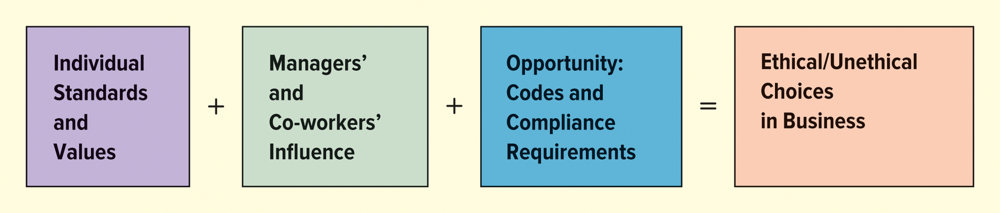
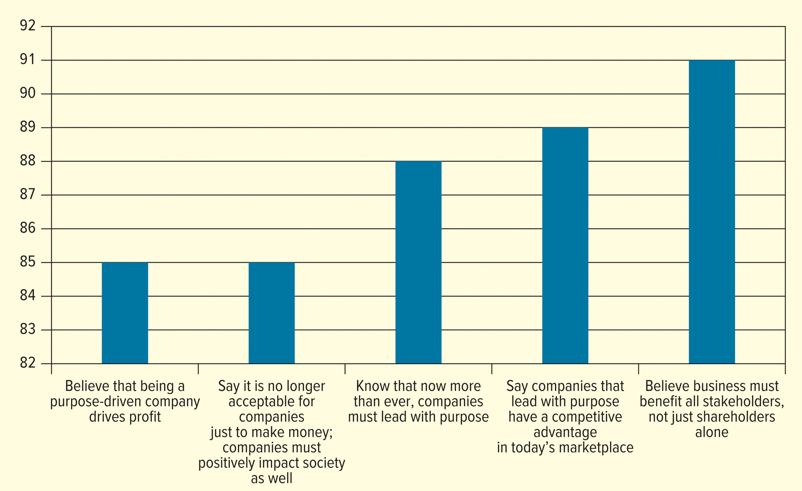

<h1 id="Chapter_2._Business_Ethics_and_Social_Responsibility" style="color:#42A5F5;">Indice</h1>

##### [Capitulo LO 2-1 Business Ethics and Social Responsibility](#624601)

##### [Capitulo LO 2-2 Recognizing Ethical Issues in Business](#909533)

##### [Capitulo LO 2-3 Improving Ethical Behavior in Business](#471101)

##### [Capitulo LO 2-4 THE NATURE OF SOCIAL RESPONSIBILITY](#096872)

##### [Capitulo LO 2-5 Social Responsibility Issues](#734474)

##### [Capitulo Sources of Law](#722658)

##### [Capitulo Courts and the Resolution of Disputes](#387287)

##### [Capitulo Regulatory Administrative Agencies](#834137)

##### [Capitulo Important Elements of Business Law](#194515)

##### [Capitulo Laws Affecting Business Practices](#628488)

##### [Capitulo The Internet: Legal and Regulatory Issues](#881528)

##### [Capitulo Legal Pressure for Responsible Business Conduct](#157036)

<h1 id="624601" style="color:#E65100;">
  <a href="#Chapter_2._Business_Ethics_and_Social_Responsibility" style="color:inherit; text-decoration:none;">
    LO 2-1 Business Ethics and Social Responsibility
  </a>
</h1>

Toda organización, incluidas las sin fines de lucro, debe gestionar el comportamiento ético de los empleados y participantes en sus operaciones. Las empresas que mantienen altos estándares éticos tienden a ser más rentables y a tener empleados y clientes más satisfechos. El comportamiento poco ético puede perjudicar las ganancias, como se ve en casos que involucran a empresas como Credit Suisse, Luckin Coffee y Activision Blizzard. Sin embargo, la mayoría de las empresas se esfuerzan por mantener una cultura ética para prevenir malas conductas.

Este capítulo examina el papel de la ética y la responsabilidad social en la toma de decisiones empresariales. Define la ética empresarial, explica su importancia y explora cuestiones éticas comunes para que los lectores puedan reconocerlas en la práctica. El capítulo también proporciona medidas que las empresas pueden tomar para mejorar el comportamiento ético. La segunda mitad se centra en la responsabilidad social y el desempleo, destacando cuestiones clave y cómo las empresas responden a ellas.

<h2>
Ética empresarial
</h2>

La ética empresarial se refiere a los principios y estándares que determinan la conducta aceptable en las organizaciones. La ética personal se relaciona con los valores y estándares de comportamiento de un individuo. El comportamiento aceptable en los negocios está influenciado no sólo por la organización sino también por las partes interesadas, incluidos empleados, clientes, competidores, reguladores gubernamentales, grupos de interés y el público.

La importancia de la ética empresarial se destaca por la publicidad y los debates sobre cuestiones legales y éticas en empresas reconocidas. Por ejemplo, Activision Blizzard enfrentó demandas por acoso sexual y discriminación de género. Se informaron más de 700 incidentes y los empleados protestaron por el manejo de estos problemas por parte de la empresa. Una demanda citó la cultura y la gestión de la empresa como factores contribuyentes.

Las actividades poco éticas a menudo surgen de una cultura organizacional que fomenta el incumplimiento de las reglas. Por el contrario, la confianza en las empresas es crucial para mantener las relaciones. Según encuestas (ver Figura 2.1), la confianza en industrias como la de servicios financieros es menor que en otras, lo que refleja el impacto de la mala conducta corporativa y la cobertura de los medios.

> Key takeaway: Integrating ethics and social responsibility into all business decisions is essential for maintaining trust, protecting the organization’s reputation, and ensuring long-term success.

<h2>
FIGURE 2.1 Global Trust in Different Industries
</h2>

</img>

Organizations with a strong ethical culture encourage employees to act with integrity and follow the company’s values. For example, Colgate-Palmolive requires all employees to complete a mandatory ethics course to unify staff under the organization’s guiding principles. Ethical leadership, clearly communicated values, and compliance programs are critical to fostering good business ethics.

Para establecer una verdadera cultura ética, los gerentes deben demostrar un “tono en la cima”, que incluye:

- Apoyar personalmente la ética y el cumplimiento.
- Comunicar claramente las expectativas éticas a todos los empleados.
- Educar a los gerentes y supervisores sobre las políticas de la empresa.
- Capacitar a los empleados sobre cómo responder durante una crisis ética.

Las empresas deben aspirar no sólo a obtener ganancias sino también a considerar el impacto ético y social de sus actividades. Por ejemplo, Walmart y Sam's Club han donado más de 7 mil millones de libras de alimentos a los bancos de alimentos locales de Feeding America. Las ganancias permiten a las empresas contribuir a la sociedad, y las empresas con fuertes contribuciones sociales tienden a ser más rentables.

La responsabilidad social se define como la obligación de una empresa de maximizar el impacto positivo y minimizar el impacto negativo en la sociedad. Si bien están estrechamente relacionadas, la ética y la responsabilidad social no son lo mismo:

- La ética empresarial se ocupa de las decisiones correctas e incorrectas de individuos o grupos de trabajo.
- La responsabilidad social se refiere al impacto más amplio de las actividades de la empresa en la sociedad.

> Ejemplo: Desde una perspectiva ética, cobrar de más a Medicare está mal. Desde una perspectiva de responsabilidad social, la preocupación es cómo esto afecta el acceso a la atención médica para todos los ciudadanos.

<h2>
Omaze: reinventando el modelo benéfico
</h2>

Omaze es una plataforma global de sorteos en línea que recauda dinero para organizaciones benéficas ofreciendo experiencias exclusivas y premios de lujo. Desde su lanzamiento en 2012, Omaze, una empresa con fines de lucro, ha recaudado más de 150 millones de dólares para más de 600 organizaciones benéficas.

En el modelo de negocio de Omaze:

- La empresa normalmente se queda con el 20% de las donaciones para gastos operativos, marketing y ganancias.
- El 80% restante se destina a los costos de experiencia y a la organización sin fines de lucro.
- Las campañas están impulsadas por celebridades o por premios. Inicialmente, Omaze se centró principalmente en las experiencias de las celebridades, pero cambió de estrategia después de que un sorteo de McLaren de 233.000 dólares recaudó 1,9 millones de dólares para la Fundación Movember. Ahora, realizan menos campañas de celebridades y se centran en combinar artículos de alta demanda con causas que resuenan entre los participantes.

El equipo de marketing de Omaze destaca las organizaciones benéficas y colabora con personas influyentes para promover campañas. Al combinar el impacto impulsado por un propósito con el crecimiento empresarial, Omaze demuestra que las empresas pueden escalar el impacto social y las ganancias simultáneamente.

Aspectos destacados del pensamiento crítico:

1. ¿Cómo gana dinero Omaze?
   - Mantiene ~20% de las donaciones para costos operativos y ganancias.
2. Fortalezas en las alianzas:
    - Marketing sólido, conexiones con celebridades, campañas dirigidas y enfoque en premios de alta demanda.
3. ¿Impulsado por las ganancias, por un propósito o ambos?
   - Ambos; Omaze equilibra la rentabilidad con el impacto social.

<h2>
Ética empresarial, responsabilidad social y derecho empresarial
</h2>

Las preocupaciones éticas y de responsabilidad social más básicas suelen estar codificadas en leyes y regulaciones que alientan a las empresas a seguir los estándares, valores y actitudes de la sociedad. Estas reglas tienen como objetivo institucionalizar la conducta ética y prevenir daños a los clientes, el medio ambiente y otras partes interesadas.

El derecho empresarial rige la conducta empresarial y ayuda a los propietarios, gerentes y empleados a evitar problemas o conflictos. Los profesionales de contabilidad, finanzas y marketing deben comprender las leyes relevantes para su trabajo. Por ejemplo, la Ley Dodd-Frank se aprobó para reformar la industria financiera y proteger a los consumidores de productos financieros complejos o engañosos.

Se espera que los gerentes obedezcan todas las leyes y regulaciones, aunque no todas las acciones poco éticas son ilegales. Las preocupaciones recientes, como el robo de identidad, muestran que las empresas también tienen la responsabilidad ética de proteger los datos de los clientes.

Juntas, la ética empresarial, la responsabilidad social y las leyes actúan como un sistema de cumplimiento que guía a las empresas y a los empleados a actuar responsablemente en la sociedad. La ética puede servir para:

- Un amortiguador para prevenir conductas ilegales

- Una fuerza positiva para construir clientes y empleados leales.

> Las preocupaciones legales y éticas evolucionan con el tiempo, por lo que las empresas deben estar conscientes de las expectativas sociales cambiantes.

<h2>
TABLA 2.1 Cronograma de actividades éticas y socialmente responsables
</h2>

| década de 1960 | década de 1970 | década de 1980 | década de 1990 |
| ----------------------- | -------------------------------- | ----------------------------- | ------------------------------------- |
| Cuestiones sociales | Ética empresarial | Estándares de conducta ética | Programas de ética corporativa |
| Declaración de derechos del consumidor | Responsabilidad social | Mala conducta financiera | Regulación para apoyar la ética empresarial |
| Consumidor desfavorecido | Diversidad | Autorregulación | Problemas de salud |
| Cuestiones ambientales | Soborno | Códigos de conducta | Condiciones de trabajo seguras |
| Seguridad del producto | Discriminación | Formación en ética | Detección de malas conductas |
|                         | Identificación de cuestiones éticas. |                               |                                       |

<h2>
TABLA 2.1 Cronograma de actividades éticas y socialmente responsables
</h2>

| 2000 | década de 2010 | 2020 |
| ------------------------------------ | ------------------------- | ----------------------------------------------- |
| Transparencia en los mercados financieros | Sostenibilidad | Salud y seguridad |
| Ciberseguridad | Transparencia de la cadena de suministro | Diversidad, equidad, inclusión y accesibilidad |
| Propiedad intelectual | Mala conducta sexual | Privacidad de datos |
| Regulación de contabilidad y finanzas. | Protección de datos | Ética de la inteligencia artificial (IA) |
| Compensación ejecutiva | Tecnologías disruptivas |                                                 |
| robo de identidad |                           |                                                 |

<h2>
El papel de la ética en los negocios
</4>

### Key Points on Business Ethics

#### 1. Public Awareness of Ethics
- Medios como *The Wall Street Journal* y *USA Today* destacan las crecientes preocupaciones sobre cuestiones legales y éticas en los negocios.
- Ejemplo: **Nikki Pope** de NVIDIA hace hincapié en la creación de **IA responsable y confiable**.
- El juicio social sobre el comportamiento poco ético afecta la capacidad de una empresa para alcanzar sus objetivos, independientemente de las opiniones personales.

#### 2. Recognition for Ethical Conduct
- Empresas como **3M** ven la ética como una ventaja competitiva y aparecen constantemente en la lista de las *Compañías más éticas del mundo*.
- La percepción pública a menudo exagera la mala conducta porque las acciones éticas positivas se reportan menos.

#### 3. Ethical Conflicts and Legal Issues
- La mala conducta a menudo comienza como **conflictos éticos** pero puede derivar en disputas legales.
- Las **áreas grises éticas** ocurren en situaciones nuevas, ambiguas o no reguladas, por ejemplo, plataformas de economía colaborativa como Uber, Lyft, Airbnb.
- Ejemplos de mala conducta: explotación de trabajadores, cuestiones de seguridad, acoso, robo de secretos comerciales, violaciones reglamentarias.

#### 4. Ethics Beyond the Law
- La conducta ética genera **confianza** en las relaciones, algo esencial para el éxito empresarial.
- La falta de confianza (por ejemplo, engañar a empleados o colegas) daña las relaciones y la reputación de la organización.

#### 5. Ethics in All Sectors
- Las cuestiones éticas ocurren en **el gobierno, los deportes, las organizaciones sin fines de lucro y la ciencia**, no solo en los negocios.
- La mala conducta puede dañar las relaciones con **clientes, proveedores, inversores** y la retención de empleados.

#### 6. Learning and Judgment
- Los individuos son juzgados por sus superiores, compañeros y familiares por su comportamiento ético.
- Reconocer y resolver cuestiones éticas es crucial para **una buena toma de decisiones en los negocios**.

<h1 id="909533" style="color:#E65100;">
  <a href="#Chapter_2._Business_Ethics_and_Social_Responsibility" style="color:inherit; text-decoration:none;">
OA 2-2 Reconocimiento de cuestiones éticas en los negocios
  </a>
</h1>

#### Purpose
- Detectar y comprender las cuestiones éticas que puedan surgir en los negocios.

#### What is an Ethical Issue?
- Una **cuestión ética** es un problema, situación u oportunidad que requiere una elección entre acciones que pueden ser **correctas o incorrectas, éticas o no éticas**.
- La toma de decisiones requiere:
  - Buenos valores personales
  - Conocimiento y competencia en el área de negocio relevante.
  - Conciencia de las políticas organizacionales y códigos de ética.
  - Consulta con compañeros de trabajo o gerentes cuando sea necesario.
- Los dilemas éticos suelen tener **áreas grises**, por ejemplo:
  - Denunciar a un compañero de trabajo involucrado en robo de tiempo.
  - Denunciar a un amigo haciendo trampa en un examen.
  - Omitir cuestiones de seguridad del producto al presentarlo a un cliente.

#### Causes of Unethical Behavior
- Recompensas por objetivos financieros o comerciales demasiado agresivos.

#### Categories of Ethical Issues
| Categoría | Ejemplo |
|----------|---------|
| Comportamiento abusivo o intimidante. | Intimidación o acoso en el lugar de trabajo |
| Conflictos de intereses | Favorecer a amigos o familiares en las decisiones comerciales |
| Justicia y honestidad | Manipular información para beneficio personal. |
| Comunicaciones | Ocultar información crítica a empleados o clientes. |
| Mal uso de los recursos de la empresa. | Usar propiedad de la empresa para fines personales |
| Asociaciones empresariales | Soborno, fraude o competencia desleal |

#### Observations from the Workplace
- El trabajo remoto (COVID-19) puede reducir el acoso y la intimidación, pero dificulta el seguimiento de las malas conductas
- Las empresas deben **adaptar los programas de seguimiento** para detectar violaciones de cumplimiento
- Los empleados a veces se sienten presionados a **comprometer estándares éticos**

# Table 2.2 – Organizational Misconduct in the United States

| Tipo de mala conducta | Tasa de prevalencia (%) |
|------------------------------------|------------------|
| Favoritismo hacia ciertos empleados | 35 |
| La dirección miente a los empleados | 25 |
| Conflictos de intereses | 23 |
| Prácticas de contratación inadecuadas | 22 |
| Comportamiento abusivo | 22 |
| Violaciones de salud | 22 |

**Source:** Ethics & Compliance Initiative, 2021 Global Business Ethics Survey, [www.ethics.org/global-business-ethics-survey](https://www.ethics.org/global-business-ethics-survey/) (accessed January 12, 2023)

<h2>
Cuestiones éticas modernas en los negocios
</h2>

- Las cuestiones éticas actuales pueden ser más **complejas** que en el pasado.
- **La mayor conciencia** sobre la mala conducta organizacional proviene de:
  - Programas de investigación en formato noticia.
  - Canales de cable
  - Recursos de Internet
- Tanto **consumidores como empleados** están más informados sobre los problemas éticos, lo que aumenta la presión sobre las empresas para que actúen de manera responsable.

<h2>
Soborno
</h2>

### Overview
- Muchas cuestiones éticas en los negocios parecen simples pero en realidad son **complejas**.
- Comprender lo que es ético a menudo requiere **años de experiencia empresarial**.

### What Is Bribery?
- **Soborno** implica pagos, obsequios o favores especiales destinados a **influir en una decisión**.
- Un soborno beneficia a una persona o empresa **a expensas de otras partes interesadas**.
- El soborno se considera **poco ético e inadecuado**.

### Legal Implications
- El soborno es **ilegal en muchos países**.
- En los **Estados Unidos**, la **Ley de Prácticas Corruptas en el Extranjero (FCPA)** impone sanciones severas a las empresas que sobornan a funcionarios de gobiernos extranjeros.
- Las empresas que operan a nivel internacional deben tener especial cautela.

### Cultural Differences
- La ética está influenciada por la **cultura**:
  - En **Estados Unidos**, dar un obsequio elaborado durante una primera reunión de negocios puede considerarse un soborno.
  - En **Japón**, no traer un regalo puede considerarse descortés.
- Comprender la cultura local es esencial para determinar qué es ético.
- Las empresas deben seguir **valores y políticas comerciales globales**.

### Gray Areas and Transparency
- Existen zonas grises éticas con:
  - Regalos de empresa
  - Comidas
  - Entretenimiento
  - Incentivos financieros
- Ejemplo:
  - Los representantes farmacéuticos pueden ofrecer incentivos a los médicos, pero deben **informarlos públicamente** debido a conflictos de intereses pasados.
- La falta de **transparencia** puede crear problemas éticos.
- Las investigaciones muestran que proporcionar comidas puede aumentar la prescripción de **medicamentos de marca** por parte de los médicos.

<h2>
Mal uso del tiempo de la empresa (robo de tiempo)
</h2>

### Overview
- **El robo de tiempo** es una forma común de mala conducta en el lugar de trabajo.
- Ocurre cuando los empleados realizan actividades **no necesarias para su trabajo** durante el horario laboral.

### Examples of Time Theft
- Llegadas tardías o salidas anticipadas.
- pausas largas para el almuerzo
- Uso inadecuado de los días de enfermedad.
- Socialización excesiva
- Actividades personales durante el horario laboral, tales como:
  - Compras en línea
  - Ver deportes
  - Navegación por las redes sociales.

### Misuse of Company Resources
- El robo de tiempo a menudo incluye el uso indebido de **recursos de la empresa**, como computadoras y acceso a Internet.
- Algunas empresas bloquean sitios y aplicaciones como:
  - Facebook
  - YouTube
  -TikTok
  -Reddit

### Economic Impact
- El robo de tiempo es difícil de medir, pero se estima que cuesta a las empresas **cientos de miles de millones de dólares al año**.
- Se cree que el empleado promedio "roba" aproximadamente **4,5 horas por semana**.

### Notable Example
- El **Cyber ​​Monday**, casi el **25% de los empleados** afirman haber comprado en línea mientras están en el trabajo.

### Ethical Implications
- Estos comportamientos resultan en **pérdida de productividad y ganancias**.
- El robo de tiempo representa una cuestión ética relacionada con la **honestidad, la equidad y el uso adecuado de los recursos de la empresa**.

<h2>
Comportamiento abusivo e intimidante
</h2>

### Overview
- **El comportamiento abusivo o intimidante** es el problema ético más común al que se enfrentan los empleados.
- Abarca desde distracciones menores hasta perturbaciones graves en el lugar de trabajo.
- Los ejemplos incluyen:
  - Amenazas físicas
  - Acusaciones falsas
  - Blasfemias e insultos.
  - Gritos, dureza o comportamiento irrazonable.
  - Ignorar a los compañeros de trabajo o molestia persistente.
- Las percepciones varían: lo que una persona ve como un grito, otra puede verlo como un habla normal.

### Civility and Productivity
- La decadencia del civismo en la sociedad afecta al lugar de trabajo.
- Las organizaciones pierden productividad debido al tiempo dedicado a resolver relaciones abusivas.

### Cultural and Communication Challenges
- El comportamiento abusivo es difícil de evaluar debido a:
  - Diferencias culturales
  - Diversidad lingüística y de estilos de vida.
  - Diferencias de edad y normas sociales.
- Palabras o expresiones normales en una cultura pueden resultar ofensivas en otra.
- **La intención importa**:
  - Un comentario que pretende ser un cumplido aún puede percibirse como abusivo.
  - El tono y la inflexión de la voz juegan un papel importante.

### Bullying in the Workplace
- **El acoso** implica atacar a un individuo o grupo a través de:
  - Amenazas
  - Acoso
  - Menospreciar
  - Abuso verbal
  - Críticas excesivas
- El acoso contribuye a un **ambiente de trabajo hostil**, un concepto a menudo vinculado al acoso sexual.

### Sexual Harassment and Awareness
- El acoso sexual atrajo la atención pública gracias al **movimiento#MeToo**.
- Los **EE.UU. La Comisión para la Igualdad de Oportunidades en el Empleo (EEOC)** informó de un aumento en los cargos de acoso sexual durante el ascenso del movimiento, seguido de una disminución.
- El acoso sexual tiene recurso legal; **El acoso actualmente tiene una protección legal limitada**.

### Organizational Responses
- La intimidación y el acoso amenazan la **salud, la seguridad y la cultura organizacional** de los empleados.
- Empresas como:
  - Expresar
  - La fábrica de tartas de queso
  -McKinsey
  -Nike
  - Chevrón
  - Marte
  -Uber
- han introducido **programas de defensa del pueblo** para proporcionar una resolución de quejas confidencial e independiente.

### Impact and Persistence
- El acoso laboral está aumentando en **Estados Unidos**.
- Puede provocar graves daños psicológicos y de salud.
- El acoso persiste en parte porque los agresores a menudo **superan en rango a sus víctimas**, lo que desalienta la denuncia.

<h2>
Tabla 2.3 – Acciones asociadas con los acosadores
</h2>

| No. | Acción |
|----:|--------|
| 1 | Difundir rumores para dañar a otros. |
| 2 | Bloquear la comunicación de otros en el lugar de trabajo |
| 3 | Hacer alarde de estatus o autoridad para aprovecharse de los demás |
| 4 | Desacreditar las ideas y opiniones de los demás. |
| 5 | Usar el correo electrónico para degradar a otros |
| 6 | No comunicarse o devolver la comunicación |
| 7 | Lanzar insultos, gritar y chillar |
| 8 | Usar terminología para discriminar por género, raza o edad |
| 9 | Usar el contacto visual o el lenguaje corporal para herir a otros o su reputación. |
| 10 | Tomar crédito por el trabajo o las ideas de otros |

<h2>
Mal uso de los recursos de la empresa
</h2>

### Overview
- El mal uso de los recursos de la empresa incluye **el uso de activos del empleador para beneficio personal**.
- Dicho abuso puede provocar **la rescisión** y, en algunos casos, **consecuencias legales**.
- El **Centro de recursos de ética** identifica esto como una **forma principal de mala conducta organizacional**.

### Employee Internal Theft
- El robo por parte de empleados representa una **pérdida importante de recursos**, especialmente para los minoristas.
- Los ejemplos comunes incluyen:
  - Ocultar artículos de la empresa en bolsos, mochilas o maletines.
  - Cobrar de más a los clientes y quedarse con el dinero extra.
  - Envío de artículos personales utilizando la cuenta de la empresa.
  - Trabajadores subcontratados que roban materiales o equipos de oficina.
  - Empleados del servicio de alimentación que dan comida o bebida gratis a amigos o clientes.
  - Los estilistas retienen los pagos en efectivo sin reportarlos.

### Other Forms of Resource Misuse
- Presentación de gastos personales en los informes de gastos de la empresa.
- Utilizar vehículos de la empresa para fines personales.
- Robar material de oficina.
- Mal uso de fondos corporativos para:
  - Viajes personales
  - Entretenimiento
  - Donaciones caritativas

### Real-World Example
- Un ex ejecutivo de **Acacia Research Corporation** supuestamente hizo un mal uso de fondos corporativos para gastos personales.

### Prevention and Control
- Las empresas necesitan:
  - **Sistemas de seguimiento eficaces**
  - **Formación de empleados** sobre estándares éticos
- Estas medidas ayudan a prevenir el robo y mal uso de los recursos organizacionales.

<h2>
Políticas para prevenir el mal uso de los recursos de la empresa
</h2>

### Overview
- Las empresas deben contar con **políticas establecidas** para evitar el abuso de los recursos de la empresa.
- El mal uso de los recursos es un problema generalizado que puede costar a las empresas **millones de dólares** y **miles de horas de productividad**.

### Real-World Example
- **Coca-Cola** tiene una política oficial que describe el **uso aceptable de los recursos de la empresa**:
  - Los activos de la empresa **no deben utilizarse para beneficio personal** ni para fines comerciales externos.
  - Los recursos de la empresa **no deben utilizarse para actividades ilegales o poco éticas**.
- Este tipo de políticas son comunes en **grandes empresas** para protegerse contra pérdidas financieras y de productividad.

<h2>
Incompatibilidad
</h2>

### Overview
- Un **conflicto de intereses** ocurre cuando un individuo debe elegir entre promover **intereses personales** o los **intereses de otros**, como la empresa o las partes interesadas.
- Ejemplo:
  - Un directivo corporativo debe tomar decisiones para garantizar que la empresa sea rentable para sus accionistas.
  - Si el directivo toma decisiones que le benefician personalmente (dinero, poder) a costa de la empresa, existe un **conflicto de intereses**.

### Preventing Conflicts
- Los empleados deben **separar los intereses financieros personales de los negocios**.
- Las organizaciones pueden implementar **políticas de conflictos de intereses**.
- Ejemplo:
  - La **Administración Federal de Vivienda (FHA)** establece que los aseguradores, tasadores, inspectores e ingenieros no pueden tener múltiples funciones o fuentes de compensación de una sola transacción asegurada por la FHA.

### Examples of Conflicts of Interest
- **Utilización de información privilegiada**: compra o venta de acciones utilizando información material no pública.
- **Soborno**: puede considerarse un conflicto de intereses y es más frecuente en algunos países que en otros.

### Global Context
- **Transparencia Internacional** publica el **Índice de Percepción de la Corrupción** para medir la corrupción percibida a nivel mundial.
- Países percibidos como más corruptos:
  - Yemen, Siria, Venezuela, Sudán del Sur, Somalia
- **Estados Unidos** ocupa el puesto 27 (no se muestra en la tabla).

### Legal Implications
- Los conflictos de intereses graves pueden tener **repercusiones legales**.
<h2>
Tabla 2.4 – Países menos corruptos
</h2>

| Rango | País |
|-----:|---------------|
| 1 | Nueva Zelanda |
| 1 | Dinamarca |
| 1 | Finlandia |
| 4 | Noruega |
| 4 | Singapur |
| 4 | Suecia |
| 7 | Suiza |
| 8 | Países Bajos |
| 9 | Luxemburgo |
| 10 | Alemania |

**Nota:** Estados Unidos, que no se muestra, ocupa el puesto 27.
**Source:** Transparency International, *Corruption Perceptions Index*, 2021, [www.transparency.org/en/cpi/2021](https://www.transparency.org/en/cpi/2021) (accessed January 13, 2023)

<h2>
Justicia y honestidad
</h2>

### Definition
- **Equidad** significa tratar a todas las partes interesadas (clientes, empleados, clientes, competidores) **de manera justa e imparcial**.
- **Honestidad** significa **veracidad, transparencia e integridad** en todos los tratos comerciales.
- Estos valores son fundamentales para la ética empresarial y guían la toma de decisiones más allá del mero cumplimiento legal.

### Overview
- Se espera que los empresarios:
  - Siga todas las leyes y regulaciones aplicables.
  - Evite dañar deliberadamente a las partes interesadas mediante **engaño, tergiversación, coerción o discriminación**.
- La equidad y la honestidad también se relacionan con el **uso adecuado de los recursos de la empresa**.

### Dishonesty
- La deshonestidad implica **falta de integridad, no divulgación y mentira**.
- Ejemplos comunes:
  - Robo de material de oficina (por ejemplo, lápices, notas adhesivas)
  - Robar artículos o equipos costosos (por ejemplo, computadoras, software)
- Los empleados deben comprender las políticas de la empresa sobre robo y comportamiento ético.

### Fair Competition
- La equidad implica mantener **prácticas de competencia** éticas:
  - Ejemplo: un ex empleado de **General Electric** robó secretos comerciales para beneficiar a socios comerciales en China.
  - Cuestiones antimonopolio: **U.S. El Departamento de Justicia** presentó cargos contra **Google** por presunto comportamiento anticompetitivo en la publicidad online. Google posee aproximadamente el 90% del mercado mundial de motores de búsqueda.

### Disclosure and Product Safety
- Las empresas deben revelar los posibles daños causados ​​por los productos:
  - Ejemplo: **Core Health & Fitness** pagó una multa civil de $6,5 millones al **Estado de EE.UU. Comisión de Seguridad de Productos de Consumo** por no informar lesiones graves relacionadas con equipos de ejercicio defectuosos.
  - La empresa también implementó un programa mejorado de cumplimiento de seguridad del consumidor.

### High-Profile Dishonesty Cases
- **Houston Astros**: multado con 5 millones de dólares por utilizar videovigilancia para robar señales de los equipos contrarios.
- **Operación Varsity Blues**: Philip Esformes sobornó al entrenador de baloncesto de la Universidad de Pensilvania para ayudar a su hijo a ser admitido; parte de un escándalo nacional de admisión a universidades orquestado por **William Rick Singer**, que involucra a más de 50 personas.

### Key Takeaways
- La equidad y la honestidad van más allá del cumplimiento legal; requieren una **toma de decisiones ética** que proteja a las partes interesadas, promueva la confianza y garantice la transparencia.

<h2>
Comunicaciones
</h2>

### Definition
- **Las comunicaciones** en los negocios se refieren a la forma en que las empresas transmiten información a **consumidores, inversores y otras partes interesadas**.
- Las comunicaciones éticas requieren **veracidad, transparencia y exactitud**, evitando mensajes engañosos o engañosos.

### Overview
- La publicidad falsa o engañosa y las tácticas engañosas de venta personal pueden:
  - Consumidores enojados
  - Dañar la reputación de una empresa.
  - Conducir a consecuencias financieras o legales.

### Real-World Examples
- **Nikola Motor Company**:
  - Una nueva empresa de camiones de emisiones cero montó un vídeo que muestra un camión en funcionamiento.
  - La empresa admitió más tarde que el camión fue rodado cuesta abajo.
  - Pagó **125 millones de dólares** en cargos de la SEC por engañar a los inversores.
- **Etiquetado de cigarrillos**:
  - La FDA advirtió a los fabricantes que no utilicen términos como **“libre de aditivos”** o **“natural”** sin la divulgación adecuada, para evitar engañar a los consumidores.
  - Las etiquetas deben indicar que los productos **no son más seguros** que otros a pesar de estas afirmaciones.
  - Los productos con sustancias peligrosas tienen **requisitos de etiquetado más estrictos** para la protección del consumidor.

### Truthful Product Claims
- Afirmaciones como **“natural”** a menudo son impugnadas o litigadas.
- Las pautas de la FDA establecen que para que un producto sea etiquetado como natural:
  - Los ingredientes deben ser **derivados de la naturaleza**
  - Los ingredientes deben tener **procesamiento mínimo**
- Las empresas a veces utilizan **afirmaciones calificadas** como “sabores totalmente naturales” o “sin conservantes artificiales” para cumplir con las regulaciones.

### Key Takeaways
- Las comunicaciones éticas garantizan la **confianza con los consumidores y las partes interesadas**.
- Las empresas deben proporcionar **información precisa, clara y transparente** sobre productos, servicios y prácticas corporativas.

<h2>
Relaciones comerciales
</h2>

### Definition
- **Relaciones comerciales** se refieren a las interacciones y conducta de los empresarios con **clientes, proveedores, empleados y otras partes interesadas**.
- Las relaciones comerciales éticas requieren **honestidad, justicia, respeto y responsabilidad**, evitando al mismo tiempo acciones que presionen a otros a adoptar comportamientos poco éticos.

### Overview
- El comportamiento ético en los negocios incluye:
  - Mantener **secretos de la empresa**
  - Cumplir **obligaciones y responsabilidades**
  - Evitar **presiones indebidas** sobre otros para que actúen de manera poco ética.
- Los directivos tienen una responsabilidad especial debido a su **autoridad**:
  - Influyen en el comportamiento de los empleados.
  - Debe crear un entorno que respalde los objetivos organizacionales **sin comprometer los derechos de los empleados**

### Ethical Risks and Pressures
- Las presiones organizacionales pueden fomentar acciones poco éticas, tales como:
  - Invadir la privacidad
  - Robar secretos de la competencia.
  - Manipulación o deshonestidad
- La falta de orientación ética por parte de los directivos crea oportunidades de mala conducta.

### Real-World Example
- **Wells Fargo**:
  - Creé **3,5 millones de cuentas falsas**, lo que perjudicó las calificaciones crediticias de los clientes.
  - La **Reserva Federal** restringió el crecimiento del banco hasta que mejoraron la supervisión y la gestión de riesgos.

### Plagiarism in Business
- **Plagio**: tomar el trabajo o las ideas de otra persona y presentarlas como propias sin el debido reconocimiento.
- Ejemplos:
  - Copiar informes o documentos comerciales sin atribución.
  - Los gerentes se atribuyen el mérito de las ideas de un subordinado.

### Key Takeaways
- Las relaciones comerciales éticas generan **confianza, lealtad e integridad organizacional**.
- Los directivos desempeñan un papel crucial a la hora de guiar el comportamiento ético y prevenir malas conductas.
- El plagio y la apropiación indebida de ideas socavan la credibilidad tanto individual como organizacional.

<h2>
Preguntas a considerar para determinar si una acción es ética
</h2>

### Definition
- Tomar decisiones sobre cuestiones éticas implica **reconocer posibles dilemas éticos** y evaluar acciones en términos de legalidad, políticas de la empresa, normas de la industria y valores personales.
- Los gerentes y empleados pueden pasar por alto cuestiones éticas debido a **centrarse en preocupaciones inmediatas o personales**, pero la discusión abierta ayuda a identificar y resolver estas cuestiones.

### Overview
- Las cuestiones éticas a menudo pasan desapercibidas o reciben un escrutinio limitado.
- Los gerentes a veces toman **decisiones intuitivas** sin darse cuenta de las dimensiones éticas involucradas.
- Discutir abiertamente cuestiones éticas **promueve la confianza y el aprendizaje** en las organizaciones.

<h2>
Preguntas clave (Tabla 2.5)
</h2>

| Pregunta |
|----------|
| ¿Existen posibles restricciones o violaciones legales que podrían resultar de la acción? |
| ¿Su empresa tiene un código ético o una política específica sobre la actuación? |
| ¿Es esta actividad habitual en su industria? ¿Existen grupos comerciales de la industria que proporcionen directrices o códigos de conducta que aborden este tema? |
| ¿Esta actividad sería aceptada por sus compañeros de trabajo? ¿Su decisión o acción resistirá la discusión abierta con compañeros de trabajo y gerentes y sobrevivirá intacta? |
| ¿Cómo encaja esta actividad con sus propias creencias y valores? |

### Key Takeaways
- El reconocimiento de las cuestiones éticas es el **primer paso hacia la resolución**.
- La discusión abierta y la evaluación utilizando estas preguntas ayudan a garantizar la **toma de decisiones ética** y la alineación con los valores personales y organizacionales.

<h1 id="471101" style="color:#E65100;">
  <a href="#Chapter_2._Business_Ethics_and_Social_Responsibility" style="color:inherit; text-decoration:none;">
OA 2-3 Mejorar el comportamiento ético en los negocios
  </a>
</h1>

### Learning Objective 
- Specify how businesses can **promote ethical behavior** among employees and managers.

<h2>
Tres factores que influyen en la ética empresarial
</h2>

</img>

### Definition
- Mejorar el comportamiento ético implica crear un entorno en el que los empleados tomen **decisiones éticas de forma coherente**.
- Las decisiones éticas están influenciadas por:
1. **Normas y valores morales individuales**
2. **Influencia de directivos y compañeros de trabajo**
3. **Oportunidad de cometer una mala conducta**

### Factors Influencing Ethical Behavior
- **Estándares y valores individuales**: La ética personal guía las acciones y la responsabilidad de los empleados.
- **Influencia de los gerentes y compañeros de trabajo**: la autoridad y el ejemplo de los pares y supervisores afectan significativamente las decisiones en el lugar de trabajo.
- **Oportunidad**:
  - La disponibilidad de recompensas o la ausencia de barreras puede fomentar un comportamiento poco ético.
  - Las recompensas incluyen **bonificaciones o aumentos salariales**; Las sanciones incluyen **descensos o despidos**.

### Causes of Ethical Conflict
- Los empleados a menudo enfrentan tensión entre la **ética personal** y las **obligaciones organizacionales**.
- El conflicto aumenta cuando una empresa:
  - Fomenta conductas poco éticas.
  - Ejerce presión para romper las reglas.
- Los empleados pueden confiar en el **comportamiento de sus compañeros** para guiar sus decisiones si las políticas no son claras.

### Codes of Ethics
- **Los códigos de ética profesional** son reglas formalizadas que describen lo que la empresa espera de los empleados.
- Características:
  - Proporcionar **directrices y principios**, no todos los escenarios detallados.
  - Ayudar a los empleados a cumplir **objetivos organizacionales de manera ética**
  - Incluir aportaciones de **ejecutivos, miembros de la junta directiva, personal jurídico y empleados** de todos los departamentos.

### Key Takeaways
- El comportamiento ético depende de la **interacción entre valores personales, influencia social y oportunidades**.
- Establecer **políticas y códigos de ética claros** ayuda a reducir los conflictos y guiar a los empleados hacia acciones responsables.
- Organizaciones que priorizan la ética **generan confianza, previenen malas conductas y mejoran el desempeño a largo plazo**.

<h2>
Tabla 2.6 – Por qué es importante un código de ética
</h2>

| Propósito de un Código de Ética |
|-----------------------------|
| Alerta a los empleados sobre problemas y riesgos importantes que deben abordarse. |
| Proporciona valores como **integridad, transparencia, honestidad y equidad** que forman la base de una cultura ética. |
| Brinda orientación a los empleados cuando enfrentan **situaciones grises o ambiguas** o problemas éticos que nunca han encontrado. |
| Alerta a los empleados sobre **sistemas de presentación de informes** o lugares a los que acudir en busca de asesoramiento cuando se enfrentan a un problema ético. |
| Ayuda a establecer **conductas y valores éticos uniformes**, proporcionando un enfoque compartido para la toma de decisiones éticas. |
| Sirve como un documento importante para comunicar al **público, proveedores y autoridades reguladoras** sobre los valores y el cumplimiento de la empresa. |
| Proporciona la base para **evaluar y mejorar** la toma de decisiones éticas. |

<h2>
Promoción del comportamiento ético a través de códigos, políticas y capacitación
</h2>

### How Codes and Policies Advance Ethical Behavior
- Códigos de ética, políticas de ética y **programas de formación en ética**:
  - Prescribir actividades aceptables e inaceptables.
  - Limitar las oportunidades de mala conducta estableciendo **castigos por violaciones**
  - Fomentar la creación de una **cultura ética** dentro de la organización.
- Los requisitos de cumplimiento ayudan a establecer un **comportamiento uniforme** entre los empleados.
- Las organizaciones con **códigos escritos, capacitación en ética, funcionarios de ética, líneas directas y sistemas de denuncia** tienen más probabilidades de que los empleados denuncien las malas conductas observadas.

### Enforcement and Reporting
- La aplicación mediante **recompensas y castigos** aumenta la aceptación de los estándares éticos por parte de los empleados.
- **Los informes anónimos** ayudan a proteger a los empleados de represalias.
- **Denuncia de irregularidades**: los empleados exponen las irregularidades del empleador a personas externas (medios de comunicación, reguladores gubernamentales).
- La **Ley Dodd-Frank** incluye un programa de recompensas para los denunciantes:
  - Los empleados pueden recibir **entre el 10 % y el 30 % de sanciones monetarias superiores a 1 millón de dólares** por denunciar malas conductas corporativas.
- Ejemplo: La Comisión de Bolsa y Valores de EE. UU. ha otorgado **más de mil millones de dólares a denunciantes**.

### Cultural and Integrity-Based Initiatives
- Las organizaciones están pasando de programas de ética puramente legales a **iniciativas basadas en la cultura o la integridad**.
- La integración de la ética en los **valores organizacionales fundamentales** mejora el desempeño empresarial.
- Los resultados positivos de los programas éticos incluyen:
  - Mayor **confianza**, eficiencia y eficacia
  - Protección de la **reputación de la empresa y la imagen del producto**
  - Mejora de **rentabilidad, contratación, satisfacción de los empleados y lealtad del cliente**

### Consequences of Weak Ethical Culture
- Las organizaciones sin programas éticos sólidos pueden experimentar:
  - Menos empleados se adhieren a los valores organizacionales.
  - Falta de preparación para manejar riesgos clave
  - Menos denuncias de presuntas irregularidades
  - Mayores niveles de mala conducta

**Información clave:** Una cultura ética sólida es el **mayor determinante de mala conducta organizacional en el futuro**.

<h1 id="096872" style="color:#E65100;">
  <a href="#Chapter_2._Business_Ethics_and_Social_Responsibility" style="color:inherit; text-decoration:none;">
OA 2-4 LA NATURALEZA DE LA RESPONSABILIDAD SOCIAL
  </a>
</h1>

Explicar las cuatro dimensiones de la responsabilidad social.

### Explain the Four Dimensions of Social Responsibility

Para nuestros propósitos, clasificamos cuatro etapas de responsabilidad social: **financiera, cumplimiento legal, ética y filantropía**. Estas cuatro dimensiones de la responsabilidad social incluyen **económica, legal, ética y voluntaria (incluida la filantrópica)**.

- **Fundamento económico**: Obtener beneficios es el primer paso de la responsabilidad social.
- **Cumplimiento legal**: Cumplir con la ley es el siguiente paso. Es menos probable que una empresa cuyo único objetivo sea maximizar las ganancias considere su responsabilidad social, aunque sus actividades probablemente serán legales.
- **Responsabilidades éticas**: más allá de los deberes económicos y legales, se espera que las empresas actúen éticamente (como se analizó anteriormente en este capítulo).
- **Responsabilidades voluntarias**: son actividades adicionales que pueden no ser necesarias pero que promueven el bienestar o la buena voluntad humana y social.

Las preocupaciones legales y económicas han sido reconocidas desde hace mucho tiempo en los negocios, y la mayoría de las empresas ahora están abordando cuestiones voluntarias y éticas.

*(Referencia: Tabla 2.7)*

<h2>
Cuadro 2.7: Cuatro etapas de la responsabilidad social
</h2>

| Escenario | Requisito de responsabilidad social | Ejemplos |
|-------|---------------------------------|---------|
| **Etapa 1: Viabilidad financiera y económica** | Garantizar la estabilidad financiera y la rentabilidad. | Starbucks ofrece a los inversores un saludable retorno de la inversión, incluido el pago de dividendos. |
| **Etapa 2: Cumplimiento de requisitos legales y reglamentarios** | Siga todas las leyes y regulaciones aplicables | Starbucks especifica en su código de conducta que los pagos realizados a funcionarios de gobiernos extranjeros deben ser legales de acuerdo con las leyes estadounidenses y extranjeras. |
| **Etapa 3: Ética, principios y valores** | Promover la cultura y el liderazgo ético. | La misión y los valores de Starbucks crean una cultura ética con líderes éticos. |
| **Etapa 4: Actividades filantrópicas** | Actividades de voluntariado que benefician a la sociedad. | Starbucks creó el Starbucks College Achievement Plan que ofrece a los empleados elegibles matrícula completa para obtener una licenciatura en asociación con la Universidad Estatal de Arizona. |

<h2>
Ciudadanía corporativa
</h2>

**Definición:** La ciudadanía corporativa es el grado en que las empresas cumplen con las responsabilidades legales, éticas, económicas y voluntarias que les imponen sus partes interesadas. Implica las actividades y procesos organizativos adoptados por las empresas para cumplir con sus responsabilidades sociales.

Un compromiso con la ciudadanía corporativa indica un **enfoque estratégico** en el cumplimiento de estas responsabilidades sociales.

**Ejemplos:**
- **Ford** se ha comprometido a invertir miles de millones en vehículos de cero emisiones, desde la camioneta F-150 hasta el Mustang Mach-E.
- Más del **60 % de los consumidores** compran o defienden marcas basándose en creencias y valores personales.
- Casi el **70% de los empleados** espera un impacto social al considerar un trabajo.

La ciudadanía corporativa implica **acción y medición**, evaluando qué tan bien una empresa implementa iniciativas de ciudadanía y responsabilidad social.

---

### Major Corporate Citizenship Issues

1. **Preservación del Medio Ambiente**
   - Casi dos tercios de los encuestados de las Naciones Unidas consideran el cambio climático una emergencia global.
   - Los problemas incluyen la contaminación, las energías alternativas, la gestión de residuos y el reciclaje.

2. **Derechos de los animales**
   - Muchas partes interesadas están preocupadas por el bienestar animal.
   - Ejemplo: **Tyson Foods** ha lanzado productos proteicos de origen vegetal.

3. **Problemas sociales**
   - Incluir igualdad salarial, políticas LGBTQ+, relaciones comunitarias y más.

4. **Problemas de gobernanza**
   - Incluya cumplimiento normativo, compensación ejecutiva, independencia de la junta directiva, supervisión y más.

---

### ESG Framework

El marco **Ambiental, Social y de Gobernanza (ESG)** evalúa los esfuerzos de una empresa para:
- Operar de forma sostenible
- Contribuir a causas sociales.
- Participar en una conducta responsable y ética.

**Propósito:** ESG permite a las organizaciones y partes interesadas evaluar las empresas en función de:
- Sus compañeros
- Estándares de la industria
- Intereses de los accionistas y partes interesadas

**Pros y contras de ESG:**
- **Pros:** Mide e informa el progreso de la responsabilidad social corporativa; utilizado por la industria financiera para las decisiones de inversión.
- **Contras:** Los informes y las mediciones no están estandarizados; riesgo de lavado verde; debate sobre los mejores métodos de medición.

Los reguladores están trabajando para estandarizar los informes ESG.

---

### Recognition of Ethical Companies

El **Ethisphere Institute** selecciona anualmente las empresas más éticas del mundo basándose en criterios como:
- Ciudadanía y responsabilidad corporativa
- Gobierno corporativo
- Innovación en beneficio del bienestar público.
- Liderazgo en la industria
- Liderazgo ejecutivo y tono desde arriba.
- Historial legal, regulatorio y de reputación.
- Sistemas internos de ética/cumplimiento.

**La Tabla 2.8** enumera 26 empresas reconocidas en esta lista.

<h2>
Tabla 2.8: Una selección de las empresas más éticas del mundo
</h2>

| nombre de empresa |
|--------------|
| L'Oréal |
| sony |
| microsoft |
| Empresa 3M |
| Canon |
| PepsiCo |
| Grupo Manpower |
| Compañía Colgate-Palmolive |
| Compañía Internacional de Papel. |
| Visa Inc. |
| Corporación VF |
| acento |
| Voya financiera, Inc. |
| Hasbro Inc. |
| Intel |
| Energía Xcel |
| motores generales |
| Cummins Inc. |
| John Deere |
| LinkedIn |
| Prudential Financial, Inc. |
| financieramente próspera |
| Digital occidental |
| Compañía Kellogg |
| Aflac Incorporada |
| Tecnologías Dell |

<h2>
Cuadro 2.9: Argumentos a favor y en contra de la responsabilidad social
</h2>

| **Por Responsabilidad Social** | **Contra la Responsabilidad Social** |
|-------------------------------|---------------------------------|
| 1. La responsabilidad social se basa en el compromiso de las partes interesadas y genera beneficios para la sociedad y un mejor desempeño de la empresa. | 1. Desvía a los gerentes del objetivo principal del negocio: obtener ganancias. La responsabilidad de las empresas ante la sociedad es obtener beneficios y crear puestos de trabajo. |
| 2. Businesses are responsible because they have the financial and technical resources to address sustainability, health, and education. | 2. La participación en programas sociales otorga a las empresas un mayor poder, quizás a expensas de las partes interesadas. |
| 3. Como miembros de la sociedad, las empresas y sus empleados deben apoyar a la sociedad mediante impuestos y contribuciones a causas sociales. | 3. ¿Tienen las empresas la experiencia necesaria para evaluar y tomar decisiones sobre cuestiones sociales, ambientales y económicas? |
| 4. La toma de decisiones socialmente responsable por parte de las empresas puede impedir una mayor regulación gubernamental. | 4. Los problemas sociales son responsabilidad de las agencias y funcionarios gubernamentales, a quienes los votantes pueden exigir responsabilidades. |
| 5. La responsabilidad social es necesaria para garantizar la supervivencia económica: si las empresas quieren empleados educados y saludables, clientes con dinero para gastar y proveedores con bienes y servicios de calidad en los años venideros, deben tomar medidas para ayudar a resolver los problemas sociales y ambientales que existen hoy. | 5. La creación de organizaciones sin fines de lucro y las contribuciones a ellas son las mejores formas de implementar la responsabilidad social. |

<h1 id="734474" style="color:#E65100;">
  <a href="#Chapter_2._Business_Ethics_and_Social_Responsibility" style="color:inherit; text-decoration:none;">
OA 2-5 Cuestiones de Responsabilidad Social
  </a>
</h1>

**Evaluar las responsabilidades sociales de una organización hacia los propietarios, empleados, consumidores, el medio ambiente y la comunidad.**

### Social Responsibility Issues

Los gerentes consideran y toman decisiones de responsabilidad social a diario. Entre los muchos temas sociales que los gerentes deben considerar están las relaciones de sus empresas con las partes interesadas, incluidos propietarios y accionistas, empleados, consumidores, reguladores, comunidades y defensores ambientales y sociales.

La responsabilidad social es un área dinámica en la que las cuestiones cambian constantemente en respuesta a las demandas de la sociedad. Hay mucha evidencia de que la responsabilidad social está asociada con un mejor desempeño empresarial. Tanto los consumidores como los líderes empresariales reconocen la necesidad de abordar cuestiones de responsabilidad social y esperan que las empresas tomen medidas.

Como se muestra en la Figura 2.3, **85 por ciento de los líderes empresariales creen que obtener ganancias no puede ser el único propósito del negocio; las empresas también deben afectar positivamente a la sociedad.** Varios estudios han encontrado una relación directa entre la responsabilidad social y la rentabilidad, así como un vínculo que existe entre el compromiso de los empleados y la lealtad del cliente, dos preocupaciones importantes de cualquier empresa que intente aumentar las ganancias.

Esta sección destaca algunos de los muchos problemas de responsabilidad social que enfrentan los gerentes.

<h2>
GRÁFICO 2.3 Opiniones de los líderes empresariales sobre las empresas impulsadas por un propósito
</h2>

</img>

<h2>
Resumen: Relaciones con propietarios y accionistas
</h2>

Las empresas deben ser responsables ante sus **propietarios y accionistas**, quienes esperan obtener **ganancias o retorno de su inversión**.

En las **pequeñas empresas**, esta responsabilidad es más fácil porque los propietarios suelen administrar la empresa ellos mismos o supervisar de cerca a los gerentes. En las **grandes corporaciones**, donde miles de accionistas pueden poseer acciones, mantener esta responsabilidad es más complejo.

Las obligaciones clave de las empresas para con los propietarios e inversores incluyen:
- Mantener **procedimientos contables precisos**
- Proporcionar **información relevante sobre el rendimiento actual y futuro**
- **Protección de los derechos e inversiones** de los propietarios
- Trabajando para **maximizar el valor de las inversiones de los propietarios**

<h2>
Resumen: Relaciones con los empleados
</h2>

Businesses also have important **responsibilities to their employees**. Employees are essential because a company cannot achieve its goals without them.

Los empleados esperan que las empresas:
- Proporcionar un **lugar de trabajo seguro**
- Oferta **pago justo**
- Mantenlos **informados sobre las actividades de la empresa**
- **Escuche las inquietudes y quejas de los empleados**
- **Tratar a los empleados de manera justa**

La seguridad en el lugar de trabajo está respaldada por leyes aplicadas por la **Administración de Salud y Seguridad Ocupacional (OSHA)**, y los sindicatos han ayudado a mejorar **salarios, beneficios y condiciones laborales**.

Las organizaciones modernas reconocen que **la satisfacción y la seguridad de los empleados contribuyen al éxito empresarial**. Muchas empresas también alientan las **aportaciones de los empleados**, incluso de los trabajadores de nivel inferior, para ayudar a alcanzar los objetivos de la empresa.

### Diversity, Equity, and Inclusion (DEI)

Muchas empresas ahora se centran en **diversidad, equidad e inclusión (DEI)**:

- **Diversidad:** Diferencias entre empleados como raza, género, religión, edad, nacionalidad, habilidades y otras características. Las investigaciones muestran que diversas empresas a menudo logran **mayor rentabilidad**.
- **Equidad:** Proporcionar **igualdad de oportunidades y trato justo** para todos los empleados, especialmente para los grupos históricamente subrepresentados.
- **Inclusión:** Garantizar que los empleados **se sientan valorados, respetados y que pertenecen** dentro de la organización.

Algunas empresas invierten mucho en estas iniciativas. Por ejemplo, **Apple** creó una **Iniciativa de justicia y equidad racial de 100 millones de dólares** para ampliar las oportunidades para las comunidades de color. Otro ejemplo es **Merck & Co.**, que ofrece **capacitación sobre prejuicios inconscientes** a gerentes para ayudar a reducir la discriminación y mejorar la inclusión en el lugar de trabajo.

En general, las empresas tienen la responsabilidad de **crear lugares de trabajo seguros, justos e inclusivos donde los empleados puedan contribuir y tener éxito**.

<h2>
Resumen: Relaciones con el Consumidor
</h2>

Una responsabilidad clave de las empresas es su **relación con los consumidores**. Los clientes esperan que las empresas proporcionen **productos seguros, confiables y satisfactorios** respetando al mismo tiempo sus **derechos como consumidores**.

Las acciones tomadas por individuos y grupos para proteger los derechos de los consumidores se conocen como **consumismo**. Los defensores del consumidor pueden:
- Escribir cartas a empresas.
- Hacer lobby con agencias gubernamentales
- Crear anuncios de servicio público.
- Boicotear a las empresas que consideran irresponsables

### Consumer Bill of Rights

En 1962, John F. Kennedy presentó la **Declaración de Derechos del Consumidor**, que identificaba cuatro derechos básicos del consumidor:

1. **Derecho a la seguridad**
Las empresas no deben vender productos que puedan causar daños o lesiones. Las empresas también deben proporcionar entornos seguros para los clientes cuando compren.

2. **Derecho a ser informado**
   Consumers must receive **complete and accurate information** about products, including instructions, risks, and warnings on labels and packaging.

3. **Derecho a elegir**
Los consumidores deberían tener acceso a **una variedad de productos y servicios a precios competitivos**, además de buena calidad y un servicio justo.

4. **Derecho a ser escuchado**
Los consumidores tienen derecho a **expresar quejas e inquietudes**, y las empresas y los gobiernos deben considerar estas inquietudes al formular políticas.

Overall, businesses must ensure that they **protect consumer rights, provide safe products, and respond fairly to customer concerns**.

<h2>
Resumen del caso: Dedos pegajosos: dentro de la oleada de hurtos en tiendas
</h2>

El robo en tiendas es un **problema multimillonario** que ha ido aumentando y afectando significativamente a minoristas como Target, Walgreens, Home Depot, Kroger, Best Buy, CVS y Walmart. El robo en comercios minoristas reduce las ganancias de las empresas y afecta no solo a las empresas sino también a **empleados y consumidores**.

Algunos robos son cometidos por individuos, mientras que una gran parte está vinculado al **crimen minorista organizado**. En casos graves, las tiendas se han visto obligadas a cerrar lugares donde las pérdidas eran demasiado elevadas para mantener las operaciones.

Una explicación para el hurto en tiendas es el **egoísmo ético**, una filosofía que afirma que las personas actúan principalmente por su **propio interés**. Si las personas creen que el **riesgo de ser descubierto es bajo** y los **beneficios son altos**, es más probable que roben. Otros justifican el hurto en las tiendas porque creen que las grandes corporaciones ya son muy rentables.

Las empresas minoristas suelen seguir un **enfoque de partes interesadas**, lo que significa que consideran los intereses de múltiples grupos, como por ejemplo:
- Accionistas
- Empleados
- Clientes
- Proveedores
- Comunidades locales

Cuando aumentan los hurtos y las tiendas cierran, los efectos se extienden entre estas partes interesadas. Los empleados pueden perder sus empleos, los clientes perder el acceso a las tiendas, las comunidades perder ingresos fiscales, los proveedores perder negocios y los accionistas ver reducidas sus ganancias.

Para reducir los hurtos, los minoristas utilizan varias estrategias de prevención:
- Colocar artículos vulnerables más profundamente en la tienda.
- Bloquear mercancías caras en cajas seguras.
- Instalación de **cámaras de seguridad, espejos y señales de advertencia**
- Capacitar a los empleados para reconocer comportamientos sospechosos.

El aumento de los robos en las tiendas está empujando a los minoristas a reconsiderar cómo **las tiendas físicas operan y protegen sus mercancías**.

---

<h2>
Preguntas de pensamiento crítico
</h2>

1. **¿Qué es el egoísmo ético?**
El egoísmo ético es la idea de que los individuos actúan principalmente en su **propio interés**, tomando decisiones que los benefician.

2. **En su opinión, ¿por qué están aumentando los hurtos en las tiendas?**
Las posibles razones incluyen **el bajo riesgo percibido de ser atrapado, las presiones económicas, el crimen minorista organizado y la creencia de que las grandes corporaciones pueden permitirse las pérdidas**.

3. **¿Cómo afecta negativamente el hurto a las partes interesadas de un minorista?**
El robo en tiendas puede provocar **cierres de tiendas, pérdida de empleos, precios más altos para los consumidores, menores ganancias para los accionistas, pérdida de negocios para los proveedores y menores ingresos fiscales para las comunidades**.

<h2>
Divisiones de la Oficina de Protección al Consumidor de la Comisión Federal de Comercio
</h2>

| División | Descripción general |
|---|---|
| División de Privacidad y Protección de Identidad | Supervisa cuestiones relacionadas con la privacidad del consumidor, informes crediticios, robo de identidad y seguridad de la información. |
| División de Prácticas Publicitarias | Protege a los consumidores de prácticas publicitarias y de marketing injustas o engañosas que puedan afectar la salud, la seguridad o causar daños económicos. |
| División de Educación para Consumidores y Empresas | Proporciona herramientas e información para ayudar a los consumidores a tomar decisiones informadas y ayuda a las empresas a cumplir con la ley. |
| División de Cumplimiento | Hace cumplir las órdenes judiciales y administrativas de los tribunales federales en casos de protección al consumidor, incluidas sanciones civiles y acciones por desacato. |
| División de Prácticas de Marketing | Responde al fraude al consumidor en el mercado y hace cumplir la Ley FTC y otras leyes de protección al consumidor. |
| División de Operaciones y Respuesta al Consumidor | Recopila y analiza datos para respaldar las acciones policiales, la educación del consumidor y la evaluación de los esfuerzos de protección del consumidor de la FTC. |
| División de Prácticas Financieras | Promueve la justicia y la honestidad en los servicios financieros para que los consumidores puedan tomar decisiones financieras informadas. |
| División de Tecnología y Análisis de Litigios | Supports investigations and legal cases by managing technological tools used in consumer protection litigation and investigations. |
| Oficina de Investigación e Investigación Tecnológica | Estudia cómo la tecnología afecta a los consumidores, evalúa nuevas prácticas de marketing y ayuda a investigadores y abogados con experiencia técnica. |

<h2>
Resumen: Cuestiones de sostenibilidad
</h2>

Tradicionalmente, el **medio ambiente** se consideraba principalmente como recursos naturales como bosques, océanos, vida silvestre y tierras que los humanos podían utilizar como alimento, refugio, transporte y recreación. A medida que la población mundial aumentó durante el siglo XX, la gente comenzó a utilizar estos recursos de manera más intensiva, especialmente con los avances tecnológicos. Si bien esto mejoró los niveles de vida, también creó problemas ambientales. Hoy en día, alrededor de **un millón de especies de plantas y animales están amenazadas de extinción**.

Desde una **perspectiva empresarial**, **sostenibilidad** significa realizar actividades comerciales de manera que protejan y apoyen la **salud a largo plazo del medio ambiente natural**. Implica equilibrar la actividad económica con la protección del medio ambiente.

La sostenibilidad incluye:
- Evaluar y mejorar **estrategias de negocio**
- Desarrollar **prácticas y tecnologías laborales** responsables.
- Gestionar **sectores económicos y estilos de vida** de manera que se protejan los recursos naturales.

Las principales preocupaciones ambientales incluyen:
- **Contaminación**
- **Uso excesivo de recursos naturales**
- **El crecimiento demográfico aumenta la presión sobre los recursos**

Muchas empresas ahora incorporan la sostenibilidad en sus **estrategias comerciales** para reducir el daño ambiental y apoyar la salud ecológica a largo plazo.

Las organizaciones sin fines de lucro también promueven prácticas sostenibles. Un ejemplo es el **Pacto Mundial de las Naciones Unidas**, la iniciativa de sostenibilidad corporativa más grande del mundo, que promueve **10 principios relacionados con los derechos humanos, el trabajo, el medio ambiente y la anticorrupción** para fomentar la cooperación entre las empresas, los gobiernos y la sociedad.

<h2>
HERSHEY ENCUENTRA EL PUNTO DULCE CON RESPONSABILIDAD SOCIAL
</h2>

### Summary
The Hershey Company, con más de 9 mil millones de dólares en ingresos anuales, es uno de los mayores productores de chocolate y dulces del mundo y vende productos en más de 70 países, incluidos **Hershey's Kisses**, **Hershey's Milk Chocolate Bars**, **Reese's**, **Whoppers**, **Almond Joy** y **Twizzlers**. Hershey se centra en la filantropía, la responsabilidad social y la sostenibilidad ambiental.

Fundada por Milton Hershey, la empresa opera bajo el principio de **"hacer el bien mientras se hace el bien"** y se considera un ciudadano corporativo con responsabilidades para con las personas y el planeta. Su **código de conducta** aborda los conflictos de intereses, la antimonopolio, el comercio justo, las cadenas de suministro sostenibles y la diversidad en el lugar de trabajo. Hershey fomenta la presentación de informes éticos a través de la gerencia, RR.HH., ejecutivos y canales de terceros. Todos los empleados reciben **capacitación en ética** y certifican su cumplimiento anualmente.

La estrategia de RSC de Hershey, **Bondad Compartida**, enfatiza la participación de las partes interesadas y la mejora continua. Las iniciativas medioambientales incluyen **envases reciclables**, **abastecimiento responsable de aceite de palma** y **operaciones de cero residuos en vertederos**.

La transparencia de la cadena de suministro es un desafío importante, particularmente en **Côte d'Ivoire** y **Ghana**. Hershey implementa un **Sistema de Monitoreo y Remediación del Trabajo Infantil (CLMRS)** para identificar y apoyar a los niños en riesgo de explotación laboral, ayudando a las familias y comunidades mientras genera conciencia.

A pesar de los desafíos, Hershey apunta a mejorar las condiciones laborales en la industria del cacao a través de varias iniciativas, demostrando su compromiso con las prácticas comerciales éticas y la sostenibilidad.

---

<h2>
Critical Thinking Questions
</h2>

**1. ¿Cómo implementa Hershey su programa de ética?**
Hershey implements its ethics program through a **code of conduct**, **annual employee ethics training**, **certification of adherence**, and **multiple reporting channels** for ethical concerns.

**2. ¿Qué desafíos éticos enfrentan las empresas en la industria del cacao?**
Los desafíos éticos incluyen el **trabajo infantil**, las **malas condiciones laborales** y la **falta de transparencia en la cadena de suministro**, especialmente en regiones productoras de cacao como Costa de Marfil y Ghana.

**3. ¿Cómo demuestra Hershey un compromiso con la sostenibilidad?**
Hershey demuestra sostenibilidad a través de **abastecimiento responsable de ingredientes**, **envases reciclables**, **instalaciones sin residuos en vertederos** e iniciativas como el CLMRS para **monitorear y reducir el trabajo infantil** en su cadena de suministro.

<h2>
Contaminación: una cuestión de responsabilidad ambiental
</h2>

Pollution is a major concern in environmental responsibility, affecting **water, air, and land**.

### Water Pollution
La contaminación del agua surge de:
- Verter productos químicos tóxicos y aguas residuales sin tratar en ríos y océanos.
- Derrames de petróleo
- Entierro de residuos industriales que se filtran a aguas subterráneas.
- Escurrimientos de fertilizantes e insecticidas procedentes de la agricultura y el paisajismo.

Las zonas fuertemente industrializadas se ven particularmente afectadas. La sociedad exige agua limpia y segura para reducir los riesgos para la salud.

### Air Pollution
La contaminación del aire es causada por:
- Humo y emisiones químicas de las fábricas.
- Monóxido de carbono e hidrocarburos procedentes de vehículos de motor.

Las consecuencias de la contaminación del aire incluyen:
- Riesgos para la salud de los seres humanos.
- Formación de **lluvia ácida**, que daña bosques y lagos
- Contribución al **cambio climático** al atrapar el calor debido a la acumulación de dióxido de carbono

La industrialización y el aumento de la propiedad de vehículos en países como **China** e **India** aceleran el cambio climático. Controlar las emisiones de carbono, como reducir el consumo máximo de electricidad, es fundamental para mitigar estos efectos.

### Land Pollution
La contaminación del suelo está estrechamente relacionada con la contaminación del agua porque los productos químicos vertidos en la tierra acaban llegando a las fuentes de agua. Las causas incluyen:
- Residuos residenciales e industriales.
- Minería a cielo abierto
- Incendios forestales y mala gestión forestal

Consecuencias:
- Contaminación de vías fluviales con medicamentos recetados, jabones y otros productos químicos.
- Aumento de los **niveles de CO2**, con niveles actuales de CO2 atmosférico en niveles no vistos en 4 millones de años.
- Accelerated warming of the Arctic, contributing to climate change  

### Waste Disposal
La eliminación adecuada de los residuos es fundamental para combatir la contaminación del suelo. Los desafíos incluyen:
- **Bolsas de plástico:** Los estadounidenses utilizan 100 mil millones al año; una familia promedio utiliza 1.500 al año
- Las bolsas de plástico tardan **más de 500 años** en degradarse en los vertederos
- Muchos estados y países están eliminando gradualmente las bolsas de plástico livianas.

### Key Facts
- La temperatura de la superficie global está aumentando
- El calentamiento del Ártico se produce **dos veces más rápido** que el resto del mundo
- Más del **80 % de las personas** cree que los directores ejecutivos deberían abordar públicamente el cambio climático.
- Anualmente se generan alrededor de **63 millones de toneladas de desechos electrónicos**, incluidos portátiles, teléfonos y televisores.

<h2>
Energía alternativa y cambio climático
</h2>

### Overview
Las energías alternativas son parte de la solución al cambio climático, ofreciendo fuentes más limpias y renovables en comparación con los combustibles fósiles. Los tipos comunes incluyen:
- **Energía solar**
- **Energía eólica**
- **Biofuels** (e.g., ethanol from corn)  
- **Energía hidroeléctrica**
- **Energía geotérmica**
- **Electric vehicles**  

### Issues with Traditional Fossil Fuels
Los combustibles fósiles son problemáticos debido a:
- **Carbon emissions** contributing to climate change  
- **Depletion of resources**  
- **Dependencia de regiones política y económicamente inestables** para las importaciones

Estados Unidos ha ampliado la **extracción de gas natural de las reservas de esquisto**, avanzando hacia la independencia energética, aunque algunos métodos de perforación plantean preocupaciones ambientales.

### Challenges of Alternative Fuels
- El etanol a base de maíz puede **incrementar los precios de los alimentos** y crear **escasez de alimentos**
- No se ha adoptado universalmente ninguna fuente de energía alternativa para sustituir a la gasolina.

### Government and Industry Response
- El gobierno de Estados Unidos apoya las energías alternativas para combustible y electricidad.
- Los fabricantes de automóviles están planeando un **futuro eléctrico**; por ejemplo, **General Motors planea eliminar gradualmente los motores de combustión interna para 2035**

Alternative energy is increasingly recognized as essential for **reducing carbon emissions** and **preventing global climate change**.

<h2>
Respuesta a cuestiones ambientales
</h2>

### Consumer Expectations
Los consumidores esperan cada vez más que las empresas **aborden cuestiones sociales, ambientales y políticas**. Las empresas están respondiendo:
- Eliminar **prácticas derrochadoras**
- Reducir **emisiones contaminantes**
- Evitar **productos químicos nocivos** en la fabricación

Por ejemplo:
- **McDonald's** probó **pajitas de papel** en respuesta a la prohibición de las pajitas de plástico en Seattle
- Las empresas de servicios públicos están añadiendo fuentes de **energía alternativa** como la solar, la eólica y la geotérmica.

### Greenwashing Concern
Algunas empresas practican el **lavado verde**, creando una imagen positiva engañosa sobre la responsabilidad ambiental sin un impacto significativo.

### Adoption of Green Practices
- Las empresas y los consumidores eligen cada vez más **fuentes de energía verdes**
- Los principales compradores de energía eólica en EE. UU. incluyen **Google, Facebook, Walmart, AT&T y Microsoft**
- **El reciclaje y reprocesamiento** de aluminio, papel, vidrio y algunos plásticos son una práctica generalizada.
- Los productos, envases y procesos que reducen el impacto ambiental son etiquetados como **"verdes"** por el público y los medios de comunicación.

### Trade-offs and Costs
La responsabilidad ambiental implica **concesiones**:
- Limitar la contaminación puede ser **costoso para las empresas y la sociedad**
- Los gerentes deben **equilibrar las metas ambientales** con otros objetivos sociales y económicos.

<h2>
Relaciones Comunitarias
</h2>

Las empresas tienen responsabilidades hacia las **comunidades y sociedades** en las que operan. Su objetivo suele ser hacer de las comunidades mejores lugares para **vivir y trabajar**.

### Common Practices
- **Donaciones caritativas**: muchas empresas realizan donaciones a organizaciones locales y nacionales.
  - Ejemplo: **General Electric** y sus empleados realizan eventos para recaudar fondos para **United Way**
- **Programas de desarrollo comunitario y sostenibilidad**: las empresas invierten en iniciativas para mejorar las condiciones locales
  - Ejemplo: **Adobe** invierte el 1% de sus ganancias antes de impuestos en la **Fundación Adobe**, asociándose con empleados para mejorar las comunidades locales.
  - Adobe también **dona software** a más de 15.000 organizaciones sin fines de lucro.

<h2>
Ejercicio en equipo: estrategia de "precio de apertura" de Sam Walton
</h2>

### Background
Sam Walton, fundador de **Walmart**, desarrolló la estrategia **"Punto de precio de apertura" (OPP)** para hacer crecer su negocio. La estrategia implicó:
- Ofrecer el **producto de lanzamiento** en una línea al **precio más bajo del mercado**
- Crear una percepción de que **todos los productos de la línea tienen buenos precios**
- Alentar a los consumidores a **cambiar** por modelos con más funciones

Ejemplo: un microondas con equipamiento mínimo se vendió por menos que los modelos de la competencia, lo que atrajo la atención y aumentó las ventas generales.

---

### Team Roles

#### Option 1: Defending the Strategy
- **Valor para los consumidores**: ofrece a los consumidores un acceso asequible a los productos y fomenta mejores decisiones de compra.
- **Competencia de mercado**: Reduce los precios, empujando a los competidores a mejorar la eficiencia y el valor.
- **Crecimiento empresarial**: anima a los clientes a realizar cambios, aumentando las ventas generales y la adopción de productos.
- **Perspectiva ética**: Precios transparentes; los clientes saben exactamente lo que están comprando y las opciones de intercambio disponibles.

#### Option 2: Casting the Strategy as Unethical
- **Manipulación potencial**: puede crear una percepción de valor que **engaña a los consumidores** haciéndoles pensar que todos los productos son baratos.
- **Presión del mercado**: obliga a los competidores a bajar los precios de manera insostenible, lo que podría perjudicar a las pequeñas empresas.
- **Explotación de ganancias**: fomenta los intercambios, lo que podría verse como un impulso para que los clientes gasten más de lo necesario.
- **Preocupación ética**: la estrategia podría priorizar **el crecimiento empresarial sobre el mejor interés del consumidor** al influir sutilmente en el comportamiento de compra.

---

### Team Exercise Instructions
1. Formar equipos.
2. Asigne miembros para **defender** u **oponerse** a la estrategia.
3. Elaborar argumentos con ejemplos y razonamientos.
4. Presente su posición al grupo, destacando **consideraciones éticas** y **resultados comerciales**.

<h2>
Desempleo y consideraciones éticas
</h2>

### Definition
**Desempleo** – La condición en la que una persona que desea y puede trabajar no puede encontrar trabajo. Tiene implicaciones económicas, éticas y sociales.

### Economic and Social Implications
- **Las brechas de habilidades** en la fuerza laboral resaltan las preocupaciones sobre la calidad de la educación
- **El cierre de fábricas** afecta a los empleados y a las comunidades locales.
  - Ejemplo: Tesla cerró temporalmente su fábrica de Fremont pero proporcionó una semana completa de pago a los empleados afectados.

### Hiring Standards and Workforce Challenges
- Algunos empleadores enfrentan críticas por **estándares de contratación irrazonables**, dejando puestos de trabajo sin cubrir
- Las empresas argumentan que **los solicitantes a menudo carecen de las habilidades necesarias**
- Los requisitos de educación y conocimientos especializados aumentan la **competencia laboral**

### Technology and Automation
- La IA y la automatización pueden **reducir la cantidad de empleados necesarios** para ciertas tareas
- Las nuevas tecnologías también crean **oportunidades laborales emergentes**
- Las instituciones educativas y las empresas necesitan **enseñar habilidades interpersonales** para trabajar junto con la IA.

### Programs to Reduce Unemployment
- Las empresas y organizaciones ayudan a los **desempleados incondicionales**, aquellos con larga experiencia laboral o sin experiencia laboral.
  - Ejemplo: **Alianza Nacional de Empresarios** brinda programas de capacitación
- JPMorgan Chase invirtió más de **$7 millones** para reducir las barreras laborales para personas con antecedentes criminales.

### Green Business Opportunities
- "El verde es el nuevo negro": la sostenibilidad crea **nuevas oportunidades de empleo**
- Los empleos en energías renovables podrían aumentar a **42 millones para 2050**
- Las iniciativas de comercio de emisiones de carbono, reciclaje, conservación y eficiencia abren nuevas trayectorias profesionales.

### Ethics and Social Responsibility Careers
- Las empresas están invirtiendo en **departamentos de ética y cumplimiento**
- Roles de nivel inicial: especialista en comunicación o formador en programas de ética.
- Funciones de alto nivel: **funcionario de ética** que supervisa los códigos de conducta, la capacitación de los empleados y el cumplimiento.
- Las oportunidades en **responsabilidad social corporativa** incluyen:
  - Coordinación de programas filantrópicos.
  - Desarrollar iniciativas de voluntariado comunitario.
  - Apoyar los programas de calidad de vida de los empleados.

### Summary
La responsabilidad social, la ética y la sostenibilidad son **integrales de los negocios modernos** y benefician tanto al **resultado final** como a la sociedad. Industrias nuevas y en evolución están creando empleos que combinan **beneficios con propósito**.

<h1 id="722658" style="color:#E65100;">
  <a href="#Chapter_2._Business_Ethics_and_Social_Responsibility" style="color:inherit; text-decoration:none;">
Fuentes del Derecho

  </a>
</h1>

### Definitions
- **Derecho penal**: leyes que prohíben acciones específicas (por ejemplo, fraude postal, competencia desleal) e imponen castigos como multas o prisión. Las violaciones se denominan **delitos**.
- **Derecho Civil** – Leyes que definen los derechos y deberes de individuos y organizaciones (incluidas las empresas). Las infracciones pueden dar lugar a multas u otras soluciones, pero **no a prisión**.

**Diferencia clave:**
- Las leyes penales las aplica el **estado o la nación**.
- Las leyes civiles se aplican a través del **sistema judicial** por parte de individuos u organizaciones.

### Four Primary Sources of Law
1. **Ley Constitucional** – Leyes derivadas de la **Ley Constitucional de EE.UU. Constitución**, que establece el marco jurídico fundamental.
2. **Common Law** – Leyes creadas por **precedentes judiciales**, basadas en sentencias judiciales anteriores.
3. **Ley estatutaria**: leyes promulgadas por **legislaturas federales o estatales**.
4. **Ley Administrativa**: leyes creadas y aplicadas por **agencias administrativas federales y estatales** para regular las prácticas comerciales, proteger a los consumidores, los empleados y el medio ambiente.

**Notas adicionales:**
- Las agencias administrativas federales establecidas por el **Congreso** influyen en los negocios al hacer cumplir las regulaciones.
- La **Tribunal Suprema** actúa como la máxima autoridad en decisiones legales y regulatorias relacionadas con la conducta empresarial adecuada.

<h1 id="387287" style="color:#E65100;">
  <a href="#Chapter_2._Business_Ethics_and_Social_Responsibility" style="color:inherit; text-decoration:none;">
Los tribunales y la resolución de disputas
  </a>
</h1>

### Definitions
- **Demanda**: acción legal en la que un individuo u organización lleva a otra a los tribunales para resolver un conflicto, generalmente bajo el **derecho civil**.
- **Sentencia**: decisión oficial de un tribunal en una demanda, que puede requerir que la parte perdedora pague **daños monetarios** o tome acciones específicas.
- **Daños monetarios** – Dinero otorgado por el tribunal para compensar el daño o pérdida causado por la parte perdedora.
- **Desempeño específico**: una orden judicial que requiere que una parte **realice o se abstenga de realizar un acto en particular**.

### Key Points
- Los tribunales proporcionan un **foro** para resolver disputas basadas en leyes penales y civiles.
- Las decisiones se interpretan según el **sistema legal y regulatorio**.
- Ganar una demanda **no garantiza el cobro** de daños monetarios si la parte perdedora carece de recursos financieros (por ejemplo, quiebra).
- Las demandas comerciales pueden buscar **restitución financiera** o **acciones específicas** para corregir irregularidades.

<h2>
El sistema judicial
</h2>

### Definitions
- **Jurisdicción** – La autoridad legal de un tribunal para **interpretar y aplicar la ley** y tomar una **decisión vinculante** en un caso específico.
- **Tribunal de Jurisdicción General** – Un tribunal autorizado para conocer **todo tipo de casos**.
- **Tribunal de Jurisdicción Limitada**: un tribunal autorizado para escuchar **solo tipos específicos de casos** (por ejemplo, el Tribunal Federal de Quiebras se encarga de los casos de quiebra).
- **Tribunal de primera instancia**: un tribunal donde **se determinan los hechos del caso** y se aplican las **leyes** pertinentes para resolver la disputa.
- **Tribunal de Apelaciones** – Un tribunal que revisa la **interpretación de la ley** en las decisiones del tribunal de primera instancia. **No escucha a testigos** ni determina hechos.
- **Apelación**: una solicitud para que un tribunal superior revise la decisión de un tribunal de primera instancia en busca de **errores legales**.
- **Nuevo juicio/Devolución**: cuando un tribunal de apelaciones devuelve un caso al tribunal de primera instancia para **corregir errores** que podrían haber afectado el resultado.

### Key Points
- Los tribunales federales reciben jurisdicción de la **Constitución o el Congreso**, mientras que los tribunales estatales son establecidos por **las legislaturas y constituciones estatales**.
- Los tribunales de primera instancia resuelven **cuestiones de hecho y de derecho**; Los tribunales de apelación revisan únicamente **interpretaciones legales**.
- Si un tribunal de apelaciones no encuentra errores legales significativos, la decisión del tribunal de primera instancia **se mantiene**.
- Los tribunales de apelación pueden **devolver el caso** para su corrección u ocasionalmente **modificar el veredicto** ellos mismos.

<h2>
Métodos alternativos de resolución de disputas (ADR)
</h2>

### Definitions
- **Resolución alternativa de disputas (ADR)**: métodos para resolver disputas comerciales **fuera de los litigios judiciales tradicionales** para ahorrar tiempo y dinero.
- **Mediación**: un proceso voluntario en el que **uno o más mediadores externos** ayudan a las partes en disputa a **negociar un acuerdo**. Los mediadores **sugieren soluciones**, pero sus recomendaciones **no son vinculantes**.
- **Arbitraje**: un proceso en el que un **árbitro neutral** escucha el caso y emite una **decisión vinculante**. El arbitraje puede ser **obligatorio** si así lo exige un contrato.
- **Minijuicio**: **presentación resumida** de una disputa ante un asesor independiente, quien luego brinda orientación sobre el resultado probable, ayudando a las partes a **negociar un acuerdo** antes de acudir a los tribunales.
- **Tribunal privado**: un **tribunal no gubernamental** donde las disputas las resuelve un tercero independiente; Los procedimientos pueden ser **informales o formales**, según el acuerdo.

### Key Points
- Los métodos ADR son **más rápidos y menos costosos** que las demandas tradicionales.
- **La mediación** se basa en un acuerdo voluntario; **arbitraje** da como resultado una decisión obligatoria.
- Los **minijuicios** y los **tribunales privados** ayudan a las empresas a identificar las debilidades de un caso y fomentan un acuerdo **antes de un litigio completo**.
- Las partes a menudo pueden **elegir mediadores o árbitros** con experiencia en el área comercial específica de la disputa.

<h1 id="834137" style="color:#E65100;">
  <a href="#Chapter_2._Business_Ethics_and_Social_Responsibility" style="color:inherit; text-decoration:none;">
Agencias Administrativas Reguladoras
  </a>
</h1>

### Definition
- **Agencia Administrativa Reguladora**: una agencia federal o estatal facultada para **crear, hacer cumplir e interpretar regulaciones** dentro de un área específica de la ley. Algunas agencias también tienen **poderes judiciales** para resolver disputas relacionadas con sus regulaciones.

### Key Points
- Agencias como la **Comisión Federal de Comercio (FTC)** pueden **decidir disputas** bajo su autoridad regulatoria.
- El **proceso de resolución** en estos casos generalmente se denomina **audiencia**, en lugar de juicio.
- Un **Juez de Derecho Administrativo (ALJ)** preside estas audiencias y **decide todos los asuntos** relacionados con la disputa.
- Estas agencias garantizan el cumplimiento de leyes y regulaciones en áreas como **protección del consumidor, derecho ambiental, laboral y financiero**.

<h2>
Principales organismos reguladores (cuadro A.1)
</h2>

| Agencia | Principales áreas de responsabilidad |
|--------|------------------------------|
| **Comisión Federal de Comercio (FTC)** | Hace cumplir las leyes y directrices relativas a las prácticas comerciales; toma medidas para detener la publicidad y el etiquetado falsos y engañosos. |
| **Administración de Alimentos y Medicamentos (FDA)** | Hace cumplir las leyes y regulaciones para prevenir la distribución de alimentos, medicamentos, dispositivos médicos, cosméticos, productos veterinarios y productos de consumo particularmente peligrosos adulterados o mal etiquetados. |
| **Comisión de Seguridad de Productos de Consumo (CPSC)** | Garantiza el cumplimiento de la Ley de Seguridad de Productos de Consumo; protege al público de riesgos irrazonables de lesiones por cualquier producto de consumo no cubierto por otras agencias reguladoras. |
| **Comisión de Comercio Interestatal (ICC)** | Regula las franquicias, tarifas y finanzas de los transportistas interestatales de ferrocarriles, autobuses, camiones y agua. |
| **Comisión Federal de Comunicaciones (FCC)** | Regula las comunicaciones por cable, radio y televisión en el comercio interestatal y exterior. |
| **Agencia de Protección Ambiental (EPA)** | Desarrolla y hace cumplir normas de protección ambiental y realiza investigaciones sobre los efectos adversos de la contaminación. |
| **Comisión Federal Reguladora de Energía (FERC)** | Regula las tarifas y ventas de productos de gas natural, afectando con ello el suministro y precio del gas disponible para los consumidores; También regula las tarifas mayoristas de electricidad y gas, la construcción de gasoductos y las importaciones y exportaciones estadounidenses de gas natural y electricidad. |
| **Comisión de Igualdad de Oportunidades en el Empleo (EEOC)** | Investiga y resuelve la discriminación en las prácticas laborales. |
| **Administración Federal de Aviación (FAA)** | Supervisa las políticas y regulaciones de la industria aérea. |
| **Administración Federal de Carreteras (FHWA)** | Regula los requisitos de seguridad de los vehículos. |
| **Administración de Salud y Seguridad Ocupacional (OSHA)** | Desarrolla políticas para promover la seguridad y la salud de los trabajadores e investiga las infracciones. |
| **Comisión de Bolsa y Valores (SEC)** | Regula el comercio de valores corporativos y desarrolla protección contra fraude y otros abusos; proporciona una junta de supervisión contable. |
| **Oficina de Protección Financiera del Consumidor (CFPB)** | Regula los productos e instituciones financieras para garantizar la protección del consumidor. |

<h2>
Agencias reguladoras federales y su influencia en las empresas
</h2>

Las agencias reguladoras federales supervisan una amplia gama de actividades comerciales, incluida la responsabilidad del producto, la seguridad y la regulación o desregulación de los servicios públicos. Estas agencias tienen el poder de hacer cumplir leyes específicas, como la **Ley de la Comisión Federal de Comercio**, y también ejercen discreción al establecer reglas y regulaciones para guiar las prácticas de la industria. Debido a la superposición de responsabilidades, es común la confusión o el conflicto sobre qué agencia tiene jurisdicción sobre ciertas actividades.

### The Federal Trade Commission (FTC)
- La FTC desempeña un papel importante en la regulación de prácticas comerciales que podrían dañar a los consumidores o crear disputas entre las empresas y sus clientes.
- Las áreas de enfoque incluyen **publicidad engañosa, precios engañosos y empaques y etiquetado engañosos**.
- **Herramientas de aplicación de la ley:**
  - **Queja:** Se emite cuando se cree que una empresa está violando la ley.
  - **Orden de cese y desistimiento:** Ordena a la empresa detener la práctica objetable.
  - **Sanciones civiles:** Hasta $10,000 por día por infracciones.
  - **Decretos de consentimiento:** Abordar los intentos de fijación de precios o colusión, incluso si los competidores rechazan las invitaciones.
  - **Publicidad correctiva:** Requiere que las empresas rectifiquen los anuncios engañosos.
  - Ejemplo: Epic Games recibió una multa de 520 millones de dólares por supuestamente engañar a los jugadores para que realizaran compras no intencionadas.
- **Asistencia a las empresas:** La FTC evalúa nuevos métodos de marketing, fomenta las prácticas comerciales voluntarias de la industria y, en ocasiones, patrocina conferencias para la cooperación entre la industria y los consumidores.

### Other Federal Regulatory Agencies
- **Administración de Alimentos y Medicamentos (FDA):** Hace cumplir las regulaciones para prevenir la distribución de alimentos y medicamentos adulterados, mal etiquetados o peligrosos. Ejemplo: Advertencias emitidas durante la pandemia de COVID-19 contra reclamaciones fraudulentas.
- **Agencia de Protección Ambiental (EPA):** Desarrolla y hace cumplir estándares de protección ambiental y realiza investigaciones sobre la contaminación.
- **Comisión de Seguridad de Productos de Consumo (CPSC):** Retira aproximadamente 300 productos al año, desde juguetes hasta electrodomésticos. Actualmente está abordando las preocupaciones de seguridad de los consumidores respecto de los productos de inteligencia artificial y aprendizaje automático.

Estas agencias garantizan que las empresas operen de manera justa, segura y responsable mientras protegen a los consumidores y el medio ambiente.

<h1 id="194515" style="color:#E65100;">
  <a href="#Chapter_2._Business_Ethics_and_Social_Responsibility" style="color:inherit; text-decoration:none;">
Elementos importantes del derecho empresarial
  </a>
</h1>

El derecho empresarial proporciona el marco legal dentro del cual operan las empresas. Comprender estas leyes ayuda a los empresarios a **evitar violaciones de estatutos penales y civiles** y a **minimizar el riesgo de demandas** por parte de consumidores, empleados, proveedores y otras partes interesadas. Los elementos clave incluyen:

- **Cumplimiento de leyes penales:** Previene acciones como fraude, robo o competencia desleal que podrían resultar en multas o prisión.
- **Cumplimiento de las leyes civiles:** Garantiza que se respeten los contratos, los derechos de propiedad y las obligaciones comerciales, lo que reduce las disputas y los posibles daños monetarios.
- **Conciencia de los requisitos regulatorios:** Seguir las reglas establecidas por agencias federales y estatales, incluida la seguridad del producto, los estándares ambientales y las regulaciones laborales.
- **Gestión proactiva de riesgos:** Implementar políticas internas, capacitación de empleados y programas de ética para prevenir violaciones y promover conductas comerciales legales.

Al integrar el conocimiento de estos elementos legales en las operaciones diarias, las empresas pueden operar de manera ética, reducir la exposición legal y generar confianza con las partes interesadas.

<h2>
El Código Comercial Uniforme (UCC)
</h2>

El **Código Comercial Uniforme (UCC)** se creó para estandarizar y simplificar las transacciones comerciales en todos los estados. Antes de su promulgación, cada estado tenía sus propias leyes que regulaban el comercio, lo que hacía que los negocios interestatales fueran complejos e inconsistentes. Hoy en día, todos los estados excepto Luisiana han adoptado plenamente la UCC (Luisiana ha adoptado partes de ella).

La UCC es un conjunto de **leyes estatutarias** que cubren diversos aspectos del derecho comercial, incluidos contratos, ventas y papel comercial. Uno de sus componentes más importantes es el **Artículo II**, que regula la **venta de bienes**. Este artículo establece reglas uniformes para contratos, obligaciones y recursos relacionados con la compra y venta de productos, proporcionando así coherencia jurídica y reduciendo las disputas en el comercio.

<h2>
Acuerdos de venta según el artículo II de la UCC
</h2>

**Alcance:** El artículo II rige los **acuerdos de venta de bienes**, incluidos bienes con servicios como instalación. **No** cubre acciones, bonos, servicios personales o bienes raíces.

**Disposiciones clave:**
- Un acuerdo de venta se puede hacer cumplir incluso si **no especifica precio, hora o lugar de entrega**.
- Si no se acuerda el precio, el comprador deberá pagar un **precio razonable en el momento de la entrega**.
- Aborda **derechos de compradores y vendedores**, **transferencia de propiedad**, **garantías** y **asignación de riesgos** durante la fabricación y entrega.

**Garantías:**
- **Garantía expresa:** Términos específicos que el vendedor promete respetar. Ejemplo: los fabricantes de automóviles suelen ofrecer una garantía de 3 años/36 000 millas para reparar defectos específicos.
- **Garantía implícita:** Impuesta automáticamente por ley incluso si no está escrita. Incluye garantías de que el producto:
  - Tiene un **título claro** (no es robado)
  - Cumplirá con el propósito previsto**
  - **Funcionará como se anuncia**

<h2>
Ley de Daños y Fraude
</h2>

## 1. Tort
- **Definición:** Un mal privado o civil, distinto de un incumplimiento de contrato, que causa daño o lesión a otra persona o propiedad.
- **Ejemplo:** Un repartidor de Domino's Pizza pierde el control del vehículo, dañando la propiedad o hiriendo a alguien. Tanto el conductor como la empresa pueden ser demandados.
- **Importancia:** Permite a las víctimas buscar compensación por los daños causados ​​por acciones negligentes de otros.

## 2. Fraud
- **Definición:** Un acto ilegal intencional para engañar o manipular a otros para causar daño u obtener un beneficio. El fraude puede ser una infracción tanto civil como penal.
- **Ejemplo:** Fraude en atención médica, como presentar reclamos falsos para recibir pagos indebidos de compañías de seguros.
- **Importancia:** Protege a personas y organizaciones del engaño deliberado que podría causar daños financieros o personales.

## 3. Product Liability
- **Definición:** La responsabilidad legal de una empresa por negligencia en el diseño, producción, venta o uso de sus productos.
- **Ejemplo:** Productos defectuosos como aislamiento de asbesto, pesticidas domésticos o pintura con plomo en juguetes.
- **Tipos:**
  - **Strict Product Liability:** The consumer only needs to prove the product was defective, the defect caused injury, and that the product was unreasonably dangerous. No need to prove manufacturer negligence.  
- **Importancia:** Garantiza que los fabricantes y vendedores sean responsables de la seguridad de sus productos.

## 4. Tort Reform
- **Definición:** Cambios legales destinados a limitar grandes indemnizaciones monetarias en juicios civiles, reduciendo la carga financiera de las empresas.
- **Ejemplo:** Leyes que limitan los montos de compensación en demandas por responsabilidad del producto o accidentes.
- **Importancia:** Protege a las empresas de juicios excesivos mientras mantiene la protección del consumidor.

## 5. Context and Relevance
- El derecho de daños, especialmente en lo que respecta a la responsabilidad por productos, es una cuestión política y económica importante porque las demandas multimillonarias afectan las finanzas de las empresas y los precios de los productos.
- Si bien muchas demandas están justificadas, otras no; Las reformas en materia de responsabilidad extracontractual apuntan a reducir el abuso y al mismo tiempo proteger a los consumidores.

<h2>
Reputación de los sistemas judiciales estatales para apoyar a las empresas
</h2>

| Rango | Most Friendly to Business | Menos amigable para las empresas |
|------|--------------------------|---------------------------|
| 1 | Delaware | Georgia |
| 2 | Maine | Alabama |
| 3 | Connecticut | Nueva Jersey |
| 4 | Wyoming | Misuri |
| 5 | Alaska | Virginia Occidental |
| 6 | Dakota del Norte | Florida |
| 7 | Montana | Misisipí |
| 8 | Nebraska | California |
| 9 | Idaho | Luisiana |
| 10 | Dakota del Sur | Illinois |

**Definiciones clave:**

- **Más amigable para las empresas:** Estados que brindan un entorno legal con juicios justos, jueces competentes y resultados predecibles para las empresas.
- **Menos favorables para las empresas:** Estados donde las empresas pueden enfrentar mayores riesgos legales, fallos impredecibles o jurados menos favorables a los intereses corporativos.
- **Clima legal:** El entorno general del sistema judicial de un estado, incluida la equidad, la eficiencia y el grado en que las empresas están protegidas contra litigios excesivos.

**Fuente:** Instituto de Reforma Jurídica de la Cámara de Estados Unidos, "State Legal Climate Ranking", 2019.

<h2>
La Ley de Contratos
</h2> 

## Definition
Un **contrato** es un acuerdo mutuo entre dos o más partes que puede hacerse cumplir en un tribunal si una de las partes no cumple con sus términos. Los contratos rigen la mayoría de las transacciones comerciales, desde arrendamientos hasta préstamos y acuerdos de venta.

## Types of Contracts
- **Contrato verbal/apretón de manos:** Un acuerdo hablado que generalmente es tan vinculante como un contrato escrito.
- **Contrato escrito:** Requerido por ley en ciertos casos, tales como:
  - Venta de terrenos o participación en terrenos.
  - Promesa de pagar la deuda de otra persona.
  - Acuerdos que no pueden cumplirse en el plazo de un año.
  - Venta de bienes superiores a $500 (requisito del Código de Comercio Uniforme)

## Elements of a Legal Contract
Para que un contrato sea ejecutable, debe incluir los siguientes elementos:

1. **Acuerdo voluntario**
   - Un acuerdo realizado libre y conscientemente por todas las partes.
   - Debe implicar una **oferta** válida y una **aceptación**.
   - El fraude, la coacción o la fuerza invalidan el acuerdo.

2. **Consideración**
   - Algo de valor intercambiado entre partes.
   - Puede ser dinero, bienes, servicios o promesas.
   - Sin consideración, una promesa generalmente no se puede cumplir.

3. **Capacidad Contractual**
   - The legal ability to enter a contract.  
   - Limitado o ausente para menores (menores de 18 años), personas mentalmente inestables, intelectualmente discapacitadas, dementes o intoxicadas.

4. **Legalidad**
   - El objeto y contraprestación del contrato deben ser lícitos.
   - Los contratos ilegales, como los préstamos usurarios, son inaplicables.
   - La realización de un acto ilegal en virtud de un contrato que de otro modo sería legal no convierte al contrato en sí en ilegal.

## Breach of Contract
- Se produce cuando una de las partes incumple sus obligaciones contractuales.
- Ejemplo: No pagar el alquiler de un piso arrendado.
- La parte infractora puede ser responsable de **daños monetarios** a la otra parte.

---

**Términos clave:**
- **Contrato:** Acuerdo legalmente exigible entre las partes.
- **Acuerdo Voluntario:** Oferta realizada libremente y aceptación sin fraude ni coacción.
- **Contraprestación:** Valor intercambiado en un contrato.
- **Capacidad Contractual:** Capacidad legal para celebrar un contrato.
- **Legalidad:** Cumplimiento de la ley; El contrato debe tener un objeto lícito.
- **Incumplimiento de contrato:** Incumplimiento de las promesas contractuales, lo que puede provocar daños.

<h2>
La ley de agencia
</h2>

## Definition
Una **agencia** es una relación comercial en la que una persona (el **agente**) actúa en nombre de otra persona (el **principal**) y bajo su control.

- **Director:** La persona que desea que se realice una tarea específica.
- **Agente:** La persona que actúa en nombre del principal para realizar la tarea.

**Ejemplos:** Los autores, las estrellas de cine y los atletas suelen emplear agentes para negociar contratos u obtener oportunidades.

## Creation of an Agency Relationship
- Normalmente se crea mediante **acuerdo mutuo** entre el principal y el agente.
- No siempre es necesario que se haga por escrito, pero **se recomiendan acuerdos escritos**.
- Puede rescindirse por:
  - Acuerdo mutuo
  - Cumplimiento del objeto de la agencia
  - Negativa de cualquiera de las partes a continuar
  - Muerte del mandante o agente

- **Poder:** Un documento legal que otorga autoridad para actuar como agente. Los usos comunes incluyen:
  - Transacciones inmobiliarias
  - Transacciones financieras de empresas contables.
  - Asuntos legales (no limitado a abogados)

## Duties of Agents (Fiduciary Responsibilities)
Los agentes, especialmente los funcionarios y directores corporativos, se consideran **fiduciarios**: personas a las que se les confían responsabilidades que requieren confianza, cuidado y lealtad.

1. **Deber de Diligencia (Deber de Diligencia):**
   - Tomar decisiones informadas, cuidadosas y reflexivas.
   - Los agentes no son responsables de los resultados negativos si actúan con la debida diligencia.

2. **Deber de Lealtad:**
   - Todas las decisiones deben priorizar los intereses del mandante y de las partes interesadas.
   - Deben evitarse los conflictos de intereses.

**Ejemplo:**
McDonald's agregó nuevos miembros a la junta directiva con experiencia en áreas que la compañía quería fortalecer, como atención médica global y franquicias/hotelería.

---

**Términos clave:**
- **Agencia:** Una relación en la que un agente actúa en nombre de un principal.
- **Director:** La persona que solicita que se realice una tarea.
- **Agente:** La persona que realiza la tarea en nombre del principal.
- **Poder:** Autorización legal para actuar como agente de otra persona.
- **Fiduciario:** Persona de confianza para actuar en el mejor interés de otra.
- **Deber de Diligencia:** Obligación de tomar decisiones informadas y cuidadosas.
- **Deber de Lealtad:** Obligación de actuar en el mejor interés del mandante.

<h2>
La ley de propiedad
</h2>

## Definition
**La ley de propiedad** rige la propiedad y transferencia de todo tipo de propiedad, incluida la propiedad real, personal e intelectual.

### Types of Property
1. **Bienes inmuebles**
   - Terreno y todo lo que esté permanentemente adherido a él.
   - Ejemplo: Edificios, viviendas y enseres fijos.

2. **Propiedad personal**
   - Todo lo demás que sea de su propiedad.
   - **Propiedad Tangible:** Objetos físicos con existencia.
     - Ejemplos: Automóviles, inventario de negocios, ropa.
   - **Propiedad Intangible:** Derechos y deberes, muchas veces representados por un documento.
     - Ejemplos: Cuentas por cobrar, acciones de una sociedad anónima, marcas, fondo de comercio.

3. **Propiedad intelectual (PI)**
   - Creaciones generadas por las actividades creativas de una persona.
   - Ejemplos: Obras musicales, libros, obras de arte, programas informáticos.

---

## Protection of Property

### Copyrights
- Protege los derechos de propiedad de la propiedad intelectual como libros, música, vídeos, fotografías y software.
- Duración: Vida del creador + 50 años (normalmente).
- Garantiza derechos exclusivos para publicar, reproducir o distribuir obras.

### Patents
- Proporcionar a los inventores derechos exclusivos sobre sus invenciones.
- Duración: 20 años.
- Particularmente competitivo en industrias como la farmacéutica.
- Normalmente tarda 18 meses en conseguirlo.
- Anualmente se presentan entre 3.000 y 4.000 demandas de patentes en los EE. UU.

### Trademarks
- Una marca, símbolo o marca registrada legalmente en **U.S. Oficina de Patentes y Marcas**.
- Protege contra el uso no autorizado por parte de otras empresas.
- Ejemplos: arcos dorados de McDonald's.
- **Trade Dress:** Apariencia visual de un producto o embalaje.
  - Ejemplo: botella contorneada de Coca-Cola, paneles de barra de chocolate de Hershey.
  - Se concede protección si los consumidores asocian fuertemente la forma/diseño con el producto.

---

## Challenges in Intellectual Property
- **Comercio global:** Obtener protección en el extranjero puede resultar difícil.
- Las leyes varían según el país; Es posible que algunos países no apliquen las leyes de propiedad intelectual de EE. UU.
- La falsificación perjudica las ventas y la reputación.
- Ejemplos:
  - Pacific Mall, Markham, Ontario, Canadá
  - Mercado de la Seda, Pekín
  - Mercados al aire libre, Ciudad de México

**Nota:** Las empresas que comercian a nivel internacional pueden necesitar medidas adicionales para proteger los derechos de propiedad intelectual debido a leyes locales insuficientes.

---

**Términos clave:**
- **Ley de Propiedad:** Regula la propiedad y transferencia de propiedad real, personal e intelectual.
- **Bienes inmuebles:** Terrenos y anexos permanentes.
- **Propiedad personal:** Artículos de propiedad distintos de bienes raíces; tangibles o intangibles.
- **Bienes tangibles:** Bienes físicos con presencia real.
- **Propiedad Intangible:** Derechos o deberes representados en un documento o símbolo.
- **Propiedad intelectual:** Creaciones de la mente, como arte, software o invenciones.
- **Copyright:** Protección legal de las obras creativas.
- **Patente:** Protección jurídica de las invenciones.
- **Marca:** Protección legal de una marca o símbolo.
- **Trade Dress:** Apariencia visual de un producto que identifica su origen.
- **Falsificación:** Imitación no autorizada de un producto o marca.

<h2>
La ley de quiebras
</h2>

## Definition
**Quiebra** es un proceso legal en el que una persona o empresa que no puede pagar sus deudas puede buscar alivio de algunas o todas las obligaciones financieras. A veces se le llama "un nuevo comienzo".

---

## Causes of Bankruptcy
1. **Individuos:**
   - Cobrar bienes y servicios más allá de su capacidad de pago.
2. **Empresas:**
   - Endeudarse excesivamente para financiar el crecimiento.
   - Experimentar eventos comerciales inesperados, como aumentos de precios de productos básicos o crisis económicas.
   - Ejemplos de empresas que se declaran en quiebra: Revlon, Hertz, JCPenney, Guitar Center, California Pizza Kitchen, Brooks Brothers, Cirque du Soleil (impacto de la pandemia de COVID-19).

---

## Bankruptcy Process
- Las personas o empresas solicitan a un **tribunal de quiebras** que los declare incapaces de pagar sus deudas.
- Los **activos** del deudor pueden venderse para pagar a los acreedores.
- La quiebra personal proporciona un borrón y cuenta nueva, pero obtener crédito después es un desafío.
- Las leyes restringen quién puede declararse en quiebra para evitar abusos, lo que dificulta que algunos consumidores salden sus deudas.

---

## Types of Bankruptcy (Overview)
- **Capítulo 7 de Bancarrota:**
  - La forma más común de quiebra personal.
  - Permite a personas físicas o jurídicas eliminar deudas tras liquidar activos.
- **Otros tipos:**
  - Varían según el nivel de protección y si el deudor se reorganiza o liquida.
  - Tanto los particulares como los acreedores pueden iniciar un procedimiento de quiebra.

---

## Key Terms
- **Quiebra:** Proceso legal para personas físicas o jurídicas que no pueden pagar sus deudas.
- **Deudor:** Persona u organización que debe dinero.
- **Acreedor:** Persona o entidad a quien se le debe dinero.
- **Liquidación:** Venta de activos para pagar deudas.
- **Nuevo comienzo:** El principio que permite a los deudores liberarse de sus obligaciones para comenzar de nuevo.
- **Capítulo 7 de Quiebra:** Una forma de quiebra que permite la condonación de la deuda después de la liquidación de activos.

<h2>
Tipos de quiebra
</h2>

| Capítulo | Definición | Puntos clave |
|---------|------------|------------|
| **Chapter 7** | Requires that the business be dissolved and its assets liquidated, or sold, to pay off debts. | - Individuals may retain a limited amount of exempt assets (varies by state/federal law). - Exempt assets often include: automobile, some household goods, clothing, furnishings, and part of the residence. - All nonexempt assets are sold to pay debts. |
| **Chapter 11** | Temporarily frees a business from its financial obligations while it reorganizes and works out a payment plan with creditors. | - The business continues operating during bankruptcy proceedings. - Often involves selling off assets and less-profitable subsidiaries to pay immediate obligations. - Commonly used by corporations. |
| **Chapter 13** | Similar to Chapter 11 but limited to individuals. | - Allows an individual to establish a 3- to 5-year repayment plan. - The individual may ultimately repay as little as 10% of the debt. - Provides a structured way to manage debt without liquidation of most assets. |

<h1 id="628488" style="color:#E65100;">
  <a href="#Chapter_2._Business_Ethics_and_Social_Responsibility" style="color:inherit; text-decoration:none;">
Leyes que afectan las prácticas comerciales
  </a>
</h1>

Una de las funciones del gobierno es actuar como organismo de control para garantizar que las empresas se comporten de acuerdo con las expectativas de la sociedad. El Congreso ha promulgado una serie de leyes que afectan las prácticas comerciales. Muchas legislaturas estatales también han aprobado leyes similares que rigen las empresas dentro de estados específicos.

<h2>
TABLA A.4 Principales leyes federales que afectan las prácticas comerciales
</h2>

| Ley (Fecha de promulgación) | Objetivo |
|-------------------|---------|
| Ley Sherman Antimonopolio (1890) | Prohíbe contratos, combinaciones o conspiraciones para restringir el comercio; establece como delito menor el monopolio o el intento de monopolio. |
| Ley Clayton (1914) | Prohíbe prácticas específicas como la discriminación de precios, acuerdos de distribuidores exclusivos y adquisiciones de acciones que puedan disminuir la competencia o crear un monopolio. |
| Ley de la Comisión Federal de Comercio (1914) | Creó la Comisión Federal de Comercio (FTC); otorga a la FTC poderes de investigación para prevenir métodos de competencia desleal. |
| Ley Robinson-Patman (1936) | Prohíbe la discriminación de precios que reduzca la competencia entre mayoristas o minoristas; restringe servicios o instalaciones desproporcionadas a grandes compradores. |
| Ley Wheeler-Lea (1938) | Prohíbe actos y prácticas desleales y engañosas independientemente de si se lesiona la competencia; coloca la publicidad de alimentos y medicamentos bajo la jurisdicción de la FTC. |
| Ley Lanham (1946) | Provides protections and regulation of brand names, brand marks, trade names, and trademarks. |
| Ley Celler-Kefauver (1950) | Prohíbe a las corporaciones adquirir acciones o activos de capital de otra corporación si esto reduce sustancialmente la competencia o tiende a crear un monopolio. |
| Ley de embalaje y etiquetado justo (1966) | Hace ilegal el embalaje o etiquetado injusto o engañoso de productos de consumo. |
| Ley de Garantía Magnuson-Moss (FTC) (1975) | Proporciona estándares mínimos de divulgación para garantías escritas de productos de consumo; permite a la FTC emitir normas sobre prácticas desleales o engañosas. |
| Ley de fijación de precios de bienes de consumo (1975) | Prohíbe el uso de acuerdos de mantenimiento de precios entre fabricantes y revendedores en el comercio interestatal. |
| Antitrust Improvements Act (1976) | Requiere que las grandes corporaciones informen a los reguladores federales sobre posibles fusiones o adquisiciones para revisar posibles violaciones. |
| Ley de falsificación de marcas (1980) | Establece sanciones civiles y penales contra quienes comercian con bienes de consumo falsificados o bienes que puedan amenazar la salud o la seguridad. |
| Ley de revisión de la Ley de Marcas (1988) | Modifica la Ley Lanham para permitir que las marcas aún no introducidas estén protegidas mediante el registro en la Oficina de Patentes y Marcas. |
| Ley de educación y etiquetado nutricional (1990) | Prohíbe las declaraciones de propiedades saludables exageradas y exige que todos los alimentos procesados ​​incluyan etiquetas con información nutricional. |
| Ley de protección del consumidor telefónico (1991) | Establece procedimientos para evitar solicitaciones telefónicas no deseadas; prohíbe el uso de sistemas de marcación automatizada o voces pregrabadas en determinadas líneas. |
| Ley Federal de Dilución de Marcas (1995) | Proporciona a los propietarios de marcas comerciales el derecho a protegerlas y exige la renuncia de nombres que entren en conflicto con las marcas comerciales existentes. |

<h2>
Leyes federales que afectan las prácticas comerciales
</h2>

## Sherman Antitrust Act (1890)
**Definición:** Impide que las empresas restrinjan el comercio o monopolicen los mercados.
**Propósito:** Condena "todo contrato, combinación o conspiración para restringir el comercio".
**Ejemplo:** Un acuerdo con un competidor para fijar precios o dividir mercados viola esta ley.
**Caso notable:** Syngenta Crop Protection y Corteva, Inc. enfrentaron demandas antimonopolio por programas de lealtad que limitaban los negocios de los distribuidores con los competidores.
**Notas:** Sigue siendo relevante hoy en día y sirve como modelo para las leyes de competencia justa en todo el mundo.

## Clayton Act (1914)
**Definición:** Limita prácticas comerciales específicas que reducen la competencia.
**Propósito:** Prohíbe la discriminación de precios, acuerdos vinculantes y exclusivos, adquisiciones de acciones que disminuyan la competencia y membresía dual en juntas directivas de empresas competidoras.
**Exenciones:** Las cooperativas agrícolas y las organizaciones laborales están exentas de las restricciones antimonopolio.
**Notas:** Diseñado para aclarar y fortalecer las disposiciones de la Ley Sherman Antimonopolio.
**Implicaciones prácticas:** Ayuda a determinar niveles de competencia aceptables y restringe el comportamiento monopolístico, aunque la interpretación puede variar según el juez o tribunal.

<h2>
Estudio de caso: Cineworld se declara en quiebra
</h2>

## Background
**Grupo Cineworld**: Una de las cadenas de cines más grandes del mundo, con sede en Londres, que opera:
- Regal Cinemas (EE.UU.)
- Picturehouse (Reino Unido e Irlanda)
- Planeta (Israel)
- Cinema City (Europa central y oriental)

**Tipo de Bancarrota**: **Capítulo 11 de Bancarrota**
- **Definición**: Un proceso legal que permite que una empresa continúe operando mientras se libera temporalmente de obligaciones financieras.
- **Objetivo**: Permite a una empresa reorganizarse y desarrollar un plan de pagos con acreedores para reducir deuda y reestructurar operaciones.

**Estado financiero al momento de la presentación**:
- Deuda: ~9.000 millones de dólares (en gran parte procedente de los confinamientos por la pandemia de COVID-19)
- Efectivo disponible: <$4 millones
- Financiamiento asegurado: ~$2 mil millones para apoyar la reorganización

## Challenges Facing Movie Theaters
1. **COVID-19 Pandemic Impacts**: Lockdowns caused revenue loss; vacilación del público para asistir a los teatros.
2. **Competencia de servicios de streaming**: Netflix, Disney+ y HBO Max ofrecen alternativas en casa.
3. **Estrenos retrasados ​​u omitidos**: los estudios lanzaron menos éxitos de taquilla en los cines durante la pandemia.
4. **Éxitos de taquilla de bajo rendimiento**: Ni siquiera las películas más importantes están atrayendo al público internacional esperado.
5. **Cambios en los hábitos del consumidor**: Preferencia por entretenimiento en el hogar, conveniencia y opciones de visualización flexibles.

## Strategies Cineworld Has Explored
- Paquetes de membresía
- Venta de alcohol.
- Pedidos móviles de comida
- Venta potencial de negocio.

**Impacto en el empleo**: 28.000 empleados afectados en 9.000 pantallas en 10 países.

## Critical Thinking Questions
1. **Desafíos para las salas de cine**: cierres relacionados con la pandemia, competencia de streaming, estrenos retrasados, cambio en el comportamiento del consumidor.
2. **Por qué no ha regresado la venta de entradas**: Preocupaciones de salud, transmisión en casa, reducción del número de éxitos de taquilla, cambios en los hábitos de consumo de entretenimiento.
3. **Perspectivas futuras**: Las opiniones varían; Los cines pueden recuperarse si innovan y ofrecen experiencias que el streaming no puede replicar (por ejemplo, IMAX, asientos de lujo, eventos sociales), pero la recuperación es incierta.

<h1 id="881528" style="color:#E65100;">
  <a href="#Chapter_2._Business_Ethics_and_Social_Responsibility" style="color:inherit; text-decoration:none;">
Internet: cuestiones legales y regulatorias
  </a>
</h1>

## Overview
El crecimiento de Internet crea **desafíos legales para las empresas**, principalmente en relación con:
- Privacidad del consumidor
- Uso competitivo adecuado de los datos en línea.
- Cumplimiento de las regulaciones federales y estatales.

Las empresas deben aplicar **estándares legales tradicionales** (por ejemplo, veracidad en la publicidad, derecho contractual) a las actividades en Internet.

---

## Key Concepts and Definitions

### Cookies
- **Definición**: Pequeños fragmentos de datos almacenados en el dispositivo de un usuario por un sitio web para rastrear la actividad de los visitantes para volver a contactarlos o analizarlos.
- **Controversia**: Algunos ven el seguimiento como invasivo; otros lo ven como similar a la recopilación de datos tradicional por parte de empresas fuera de línea.

### Personal Privacy Protection
- **Base actual**: Constitución de los EE. UU., fallos de la Corte Suprema y leyes de privacidad como:
  - **Ley de informes crediticios justos (1971)**
  - **Ley de Derecho a la Privacidad Financiera (1978)**
  - **Privacy Act (1974)**  

- **State-Level Example**:  
  - **Ley de Privacidad del Consumidor de California (CCPA)**
  - **Ley de Derechos de Privacidad de California (CPRA)**
  - **Propósito**: Brinda a los consumidores control sobre los datos, limita la retención y protege la seguridad.

- **Comparación**: Estados Unidos actualmente carece de una ley de privacidad federal integral como el **Reglamento General de Protección de Datos (GDPR)** de la UE.

### Children's Online Privacy
- **Ley de Protección de la Privacidad Infantil en Línea (COPPA, 2000)**:
  - Prohíbe que los sitios web y los servicios en línea recopilen información personal de niños menores de 13 años sin el consentimiento de los padres.
  - **Caso de ejemplo**: Google y YouTube pagaron 170 millones de dólares por violar la COPPA al recopilar datos de niños sin consentimiento.

### FTC Rules for Online Advertising
- La publicidad online sigue **las mismas reglas que la publicidad tradicional**:
  - Debe ser sincero
  - No puede engañar a los consumidores.
  - Las reclamaciones deben estar fundamentadas.

- **Requisitos de marketing de influencers**:
  - Divulgar todas las conexiones materiales con marcas (productos pagos o gratuitos)
  - Casos presentados contra Teami Blends, Lord & Taylor, Warner Bros. Home Entertainment, Machinima, ADT

---

## Key Takeaways
1. Las empresas deben **respetar la privacidad del consumidor** y cumplir con las leyes de privacidad tanto a nivel federal como estatal.
2. **Los datos de los niños requieren una protección especial** según COPPA.
3. La publicidad online debe **mantener la transparencia** y la veracidad.
4. **Los influencers** son legalmente responsables de revelar patrocinios o obsequios para evitar afirmaciones publicitarias engañosas.

<h1 id="157036" style="color:#E65100;">
  <a href="#Chapter_2._Business_Ethics_and_Social_Responsibility" style="color:inherit; text-decoration:none;">
Presión legal para una conducta empresarial responsable
  </a>
</h1>

## Overview
Los gobiernos, tanto a nivel federal como estatal, responsabilizan cada vez más a **organizaciones** por malas conductas, no solo a empleados individuales.

Antes de 1991:
- Las leyes castigaban principalmente a los empleados directamente responsables de actos ilegales.

Según las Pautas federales de sentencias para organizaciones (FSGO):
- Tanto los **empleados responsables** como las **empresas empleadoras** pueden ser considerados responsables por violaciones de la ley federal.
- La responsabilidad de **controlar y prevenir las malas conductas** recae en la **alta dirección**.

---

## Federal Sentencing Guidelines for Organizations (FSGO)

### Objectives
1. Capacitar a los empleados
2. Autocontrol y supervisión de la conducta de los empleados
3. Disuadir actos poco éticos
4. Sancionar a los miembros de la organización que incurran en actos ilegales

### 2010 Amendment Highlights
- Los funcionarios de ética reportan directamente a la **junta directiva**, no solo al abogado general o a los altos funcionarios.
- La **junta directiva** deberá:
  - Asignar un gerente de alto rango responsable de la supervisión diaria de los programas de ética.
  - Proporcionar autoridad, recursos y acceso a la junta o sus subcomités.
  - Mantener **mecanismos de denuncia confidencial** para que los empleados denuncien malas conductas sin represalias.
  - Supervisar el descubrimiento de riesgos e implementar enfoques para gestionar esos riesgos.

---

## Importance of Organizational Ethics
- Las organizaciones que **no cumplan** con los requisitos mínimos de FSGO pueden enfrentar:
  - Sanciones legales
  - Pérdida de confianza del cliente y del público.
  - Pérdida de activos intangibles

- Un **enfoque legalista por sí solo es insuficiente**. Las organizaciones deben cultivar **altos estándares éticos** para prevenir conductas ilegales.

- La ética y el cumplimiento se han convertido en las principales prioridades para los abogados corporativos debido a:
  - Ley Sarbanes-Oxley
  - Ley Dodd-Frank
  - Pautas federales de sentencia

---

## Key Definitions

- **Responsabilidad Fiduciaria**: El deber de la alta dirección de actuar en el mejor interés de la organización, asegurando operaciones éticas y legales.
- **Oficial de Ética**: Un gerente responsable de supervisar el cumplimiento de los estándares éticos y reportar malas conductas directamente a la junta.
- **Programa de Cumplimiento**: Políticas y procedimientos organizacionales diseñados para garantizar el cumplimiento de las leyes, regulaciones y estándares éticos.
- **Mecanismo de denuncia confidencial**: un sistema que permite a los empleados denunciar conductas ilegales o poco éticas de forma anónima y sin temor a represalias.

<h2>
Siete pasos hacia el cumplimiento (FSGO) – Tabla A.5
</h2>

Para garantizar la responsabilidad organizacional y reducir la mala conducta, las **Pautas federales de sentencias para organizaciones (FSGO)** describen siete pasos clave:

| Paso | Acción |
|------|--------|
| 1 | Desarrollar normas y procedimientos para reducir la propensión a conductas delictivas. |
| 2 | Designar un gerente de cumplimiento de alto nivel o un funcionario de ética para supervisar el programa de cumplimiento. |
| 3 | Evite delegar autoridad a personas que se sabe que tienen propensión a cometer malas conductas. |
| 4 | Comunicar estándares y procedimientos a empleados, agentes y contratistas a través de capacitación y publicaciones. |
| 5 | Establecer sistemas para monitorear y auditar las malas conductas, incluidos mecanismos de denuncia para empleados y agentes. |
| 6 | Hacer cumplir las normas y castigos de manera consistente entre todos los empleados de la organización. |
| 7 | Responder inmediatamente a la mala conducta y tomar medidas razonables para evitar futuras conductas delictivas. |

## Compliance Programs

Las pautas federales exigen que las empresas desarrollen programas que **detecten y disuadan la mala conducta de los empleados**. Para que un programa de cumplimiento sea eficaz, debe incluir:

- **Divulgación de irregularidades**: los empleados y agentes pueden denunciar comportamientos ilegales o poco éticos.
- **Cooperación con autoridades gubernamentales**: las organizaciones deben ayudar en las investigaciones o acciones de cumplimiento.
- **Aceptación de responsabilidad**: La organización reconoce la mala conducta y toma medidas correctivas.

### Typical Components of Compliance Programs

- **Códigos de ética**: Estándares escritos de comportamiento ético y legal.
- **Capacitación en ética de los empleados**: Educación periódica sobre conducta ética y requisitos de cumplimiento.
- **Líneas directas**: canales de denuncia confidenciales, por ejemplo, números de teléfono directos 800.
- **Directores de cumplimiento**: gerentes de alto nivel que supervisan el cumplimiento de los estándares legales y éticos.
- **Herramientas de comunicación**: Newsletters, folletos y otros métodos para reforzar el cumplimiento.

**Propósito:** El componente de ética actúa como un **amortiguador**, ayudando a las empresas a evitar cruzar la línea entre conductas ilegales y no éticas.

---

## Sarbanes-Oxley Act (SOX) Overview

- **Aprobada:** Principios de la década de 2000, en respuesta a escándalos de ética corporativa.
- **Objetivo:** Penaliza el fraude de valores y fortalece las penas por fraude corporativo.
- **Disposiciones clave:**
  - Creación de una **junta de control contable**.
  - Requiere que las corporaciones establezcan **códigos de ética para la presentación de informes financieros**.
  - Promueve **mayor transparencia** en los estados financieros para los inversores y otras partes interesadas.
  - Los altos ejecutivos deben **aprobar los informes financieros** y enfrentarse a multas o cárcel si los informes son falsos.

**Importancia:** SOX aumenta la responsabilidad y refuerza el cumplimiento y la conducta ética en los niveles más altos de liderazgo corporativo.

<h2>
Cuadro A.6 – Principales disposiciones de la Ley Sarbanes-Oxley
</h2>

| No. | Disposición | Descripción |
|-----|-----------|-------------|
| 1 | Junta de Supervisión Contable de Empresas Públicas | Requiere el establecimiento de una junta para supervisar las regulaciones administradas por la SEC. |
| 2 | Certificación de CEO y CFO | Los directores ejecutivos y directores financieros deben certificar que los estados financieros son precisos y no engañosos. |
| 3 | Comités de Auditoría Independientes | Los comités de auditoría de los directorios corporativos deben tener miembros independientes sin intereses materiales en la empresa. |
| 4 | Restricciones a los préstamos | Las corporaciones no pueden otorgar ni ofrecer préstamos a funcionarios y miembros de la junta directiva. |
| 5 | Códigos de ética | Los altos funcionarios financieros deben tener códigos de ética registrados en la SEC. |
| 6 | Separación de Auditoría y Consultoría | Las empresas de contabilidad no pueden proporcionar servicios de auditoría y consultoría al mismo cliente sin la aprobación del comité de auditoría. |
| 7 | Obligaciones de informes de abogados | Los abogados deben denunciar las irregularidades a los altos directivos o a la junta directiva; si se ignoran, deben dejar de representar a la empresa. |
| 8 | Protección de denunciantes | Protege de represalias a las personas que denuncian irregularidades a las autoridades. |
| 9 | Certificación de Analistas Financieros | Los analistas de valores deben certificar que sus recomendaciones se basan en informes objetivos. |
| 10 | Divulgación de representación de fondos mutuos | Los administradores de fondos mutuos deben revelar cómo votan los representantes de los accionistas. |
| 11 | Sanción por fraude postal o electrónico | Establece una multa de 10 años por violaciones de fraude postal o electrónico. |
| 12 | Rotación de auditores | Los auditores superiores no pueden trabajar en la misma cuenta durante más de cinco años; otros auditores por más de 7 años, requiriendo rotación. |

<h2>
Leyes regulatorias corporativas: Sarbanes-Oxley y Dodd-Frank
</h2>

## Sarbanes-Oxley Act (SOX)
- **Propósito:** Mejorar el gobierno corporativo, la rendición de cuentas y la transparencia en la presentación de informes financieros.
- **Preocupaciones:**
  - Considerado gravoso y costoso para las corporaciones.
  - Las grandes corporaciones pueden gastar más de 2 millones de dólares al año para cumplir.
  - No evitó malas conductas financieras que condujeron a la Gran Recesión de 2008.
- **Beneficios:**
  - Mayor responsabilidad de los altos directivos y consejos de administración.
  - Mejora la confianza de los inversores.
  - Protege a los empleados, especialmente los planes de jubilación.
  - Las juntas directivas mejor informadas pueden conducir a una mayor eficiencia y ahorro de costos (por ejemplo, Cisco, Pitney Bowes).

## Dodd-Frank Wall Street Reform and Consumer Protection Act (2010)
- **Objetivo:** Reformar Wall Street y la industria financiera tras la crisis financiera de 2008.
- **Disposiciones clave:**
  - Mayor protección del consumidor.
  - Mayor transparencia y rendición de cuentas en el sector financiero.
  - Creé nuevas agencias financieras:
1. **Oficina de Protección Financiera del Consumidor (CFPB)**: protege a los consumidores de productos financieros complejos o engañosos.
2. **Oficina de Investigación Financiera** – monitorea la estabilidad financiera.
3. **Consejo de Supervisión de la Estabilidad Financiera** – trabaja para prevenir futuras crisis sistémicas.
- **Protecciones para denunciantes:**
  - Ofrece incentivos económicos por denunciar faltas de conducta.
  - Si una infracción denunciada da lugar a sanciones superiores a 1 millón de dólares, el denunciante recibe un porcentaje del acuerdo.
- **Transparencia financiera:**
  - Los instrumentos financieros complejos deben divulgarse más claramente a los consumidores.
- **Relación con SOX:**
  - Se basa en las disposiciones de Sarbanes-Oxley.
  - Fortalece las protecciones y la responsabilidad más allá de SOX.
- **Impacto actual:** Sigue evolucionando; Es demasiado pronto para evaluar plenamente la eficacia a largo plazo, pero ya está dando lugar a importantes cambios regulatorios en Wall Street.
