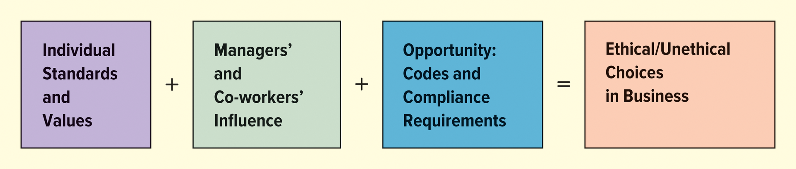
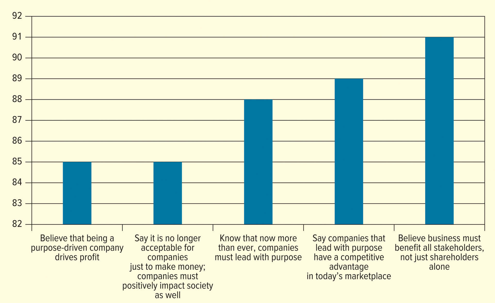

<h1 id="Chapter_2._Business_Ethics_and_Social_Responsibility" style="color:#42A5F5;">Indice</h1>

##### [Capitulo LO 2-1 Business Ethics and Social Responsibility](#624601)

##### [Capitulo LO 2-2 Recognizing Ethical Issues in Business](#909533)

##### [Capitulo LO 2-3 Improving Ethical Behavior in Business](#471101)

##### [Capitulo LO 2-4 THE NATURE OF SOCIAL RESPONSIBILITY](#096872)

##### [Capitulo LO 2-5 Social Responsibility Issues](#734474)

<h1 id="624601" style="color:#E65100;">
  <a href="#Chapter_2._Business_Ethics_and_Social_Responsibility" style="color:inherit; text-decoration:none;">
    LO 2-1 Business Ethics and Social Responsibility
  </a>
</h1>

Every organization, including nonprofits, must manage the ethical behavior of employees and participants in its operations. Firms that maintain high ethical standards tend to be more profitable and have more satisfied employees and customers. Unethical behavior can harm profits, as seen in cases involving companies like Credit Suisse, Luckin Coffee, and Activision Blizzard. Most firms, however, strive to maintain an ethical culture to prevent misconduct.

This chapter examines the role of ethics and social responsibility in business decision-making. It defines business ethics, explains its importance, and explores common ethics issues so readers can recognize them in practice. The chapter also provides steps companies can take to improve ethical behavior. The second half focuses on social responsibility and unemployment, highlighting key issues and how companies respond to them.

<h2>
Business ethics
</h2>

Business ethics refers to the principles and standards that determine acceptable conduct in organizations. Personal ethics relates to an individual's values and standards of behavior. Acceptable behavior in business is influenced not only by the organization but also by stakeholders, including employees, customers, competitors, government regulators, interest groups, and the public.

The importance of business ethics is highlighted by publicity and debates over legal and ethical issues at well-known firms. For example, Activision Blizzard faced lawsuits alleging sexual harassment and gender discrimination. Over 700 incidents were reported, and employees protested the company’s handling of these issues. One lawsuit cited the company’s culture and management as contributing factors.

Unethical activities often stem from an organizational culture that encourages bending the rules. Conversely, trust in business is crucial for maintaining relationships. According to surveys (see Figure 2.1), trust in industries like financial services is lower than in others, reflecting the impact of corporate misconduct and media coverage.

> Key takeaway: Integrating ethics and social responsibility into all business decisions is essential for maintaining trust, protecting the organization’s reputation, and ensuring long-term success.

<h2>
FIGURE 2.1 Global Trust in Different Industries
</h2>

</img>

Organizations with a strong ethical culture encourage employees to act with integrity and follow the company’s values. For example, Colgate-Palmolive requires all employees to complete a mandatory ethics course to unify staff under the organization’s guiding principles. Ethical leadership, clearly communicated values, and compliance programs are critical to fostering good business ethics.

To establish a true ethical culture, managers must demonstrate a “tone at the top”, which includes:

- Supporting ethics and compliance personally
- Clearly communicating ethical expectations to all employees
- Educating managers and supervisors about company policies
- Training employees on how to respond during an ethics crisis

Businesses should aim not only to make a profit but also to consider the ethical and social impact of their activities. For instance, Walmart and Sam’s Club have donated over 7 billion pounds of food to local Feeding America food banks. Profits enable companies to contribute to society, and firms with strong social contributions tend to be more profitable.

Social responsibility is defined as a business’s obligation to maximize positive impact and minimize negative impact on society. While closely related, ethics and social responsibility are not the same:

- Business ethics deals with right and wrong decisions of individuals or workgroups.
- Social responsibility concerns the broader impact of the company’s activities on society.

> Example: From an ethical perspective, overcharging Medicare is wrong. From a social responsibility perspective, the concern is how this affects access to healthcare for all citizens.

<h2>
Omaze: Reinventing the Charity Model
</h2>

Omaze is an online global sweepstakes platform that raises money for charities by offering exclusive experiences and luxury prizes. Since its launch in 2012, Omaze, a for-profit company, has raised over $150 million for more than 600 charities.

In Omaze’s business model:

- The company typically keeps 20% of donations for operational costs, marketing, and profit.
- The remaining 80% goes toward the experience costs and the nonprofit.
- Campaigns are either celebrity-driven or prize-driven. Omaze initially focused heavily on celebrity experiences but shifted strategy after a $233,000 McLaren sweepstakes raised $1.9 million for the Movember Foundation. Now, they run fewer celebrity campaigns and focus on pairing high-demand items with causes that resonate with entrants.

Omaze’s marketing team highlights charities and collaborates with influencers to promote campaigns. By combining purpose-driven impact with business growth, Omaze demonstrates that companies can scale social impact and profits simultaneously.

Critical Thinking Highlights:

1. How does Omaze make money? 
   - Keeps ~20% of donations for operational costs and profit.
2. Strengths in partnerships: 
    - Strong marketing, celebrity connections, targeted campaigns, and focus on high-demand prizes.
3. Profit-driven, purpose-driven, or both? 
   - Both; Omaze balances profitability with social impact.

<h2>
Business Ethics, Social Responsibility, and Business Law
</h2>

The most basic ethical and social responsibility concerns are often codified in laws and regulations that encourage businesses to follow society’s standards, values, and attitudes. These rules aim to institutionalize ethical conduct and prevent harm to customers, the environment, and other stakeholders.

Business law governs the conduct of business and helps owners, managers, and employees avoid problems or conflicts. Professionals in accounting, finance, and marketing must understand laws relevant to their work. For example, the Dodd-Frank Act was passed to reform the financial industry and protect consumers from complex or deceptive financial products.

Managers are expected to obey all laws and regulations, though not all unethical actions are illegal. Recent concerns, such as identity theft, show that companies also have an ethical responsibility to protect customer data.

Together, business ethics, social responsibility, and laws act as a compliance system, guiding businesses and employees to act responsibly in society. Ethics can serve as both:

- A buffer to prevent illegal conduct

- A positive force to build loyal customers and employees

> Legal and ethical concerns evolve over time, so businesses must stay aware of changing societal expectations.

<h2>
TABLE 2.1 Timeline of Ethical and Socially Responsible Activities
</h2>

| 1960s                   | 1970s                            | 1980s                         | 1990s                                 |
| ----------------------- | -------------------------------- | ----------------------------- | ------------------------------------- |
| Social issues           | Business ethics                  | Standards for ethical conduct | Corporate ethics programs             |
| Consumer Bill of Rights | Social responsibility            | Financial misconduct          | Regulation to support business ethics |
| Disadvantaged consumer  | Diversity                        | Self-regulation               | Health issues                         |
| Environmental issues    | Bribery                          | Codes of conduct              | Safe working conditions               |
| Product safety          | Discrimination                   | Ethics training               | Detection of misconduct               |
|                         | Identification of ethical issues |                               |                                       |

<h2>
TABLE 2.1 Timeline of Ethical and Socially Responsible Activities
</h2>

| 2000s                                | 2010s                     | 2020s                                           |
| ------------------------------------ | ------------------------- | ----------------------------------------------- |
| Transparency in financial markets    | Sustainability            | Health and safety                               |
| Cybersecurity                        | Supply chain transparency | Diversity, equity, inclusion, and accessibility |
| Intellectual property                | Sexual misconduct         | Data privacy                                    |
| Regulation of accounting and finance | Data protection           | Artificial intelligence (AI) ethics             |
| Executive compensation               | Disruptive technologies   |                                                 |
| Identity theft                       |                           |                                                 |

<h2>
The Role of Ethics in Business
</4>

### Key Points on Business Ethics

#### 1. Public Awareness of Ethics
- Media like *The Wall Street Journal* and *USA Today* highlight growing concerns over legal and ethical issues in business.
- Example: **Nikki Pope** at NVIDIA emphasizes building **trustworthy and responsible AI**.
- Societal judgment of unethical behavior affects a company’s ability to meet its goals, regardless of personal opinions.

#### 2. Recognition for Ethical Conduct
- Firms like **3M** view ethics as a competitive advantage and consistently appear on the *World’s Most Ethical Companies* list.
- Public perception often exaggerates misconduct because positive ethical actions are less reported.

#### 3. Ethical Conflicts and Legal Issues
- Misconduct often begins as **ethical conflicts** but can escalate to legal disputes.
- **Ethical gray areas** occur in new, ambiguous, or unregulated situations, e.g., sharing economy platforms like Uber, Lyft, Airbnb.
- Examples of misconduct: exploitation of workers, safety issues, harassment, stealing trade secrets, regulatory violations.

#### 4. Ethics Beyond the Law
- Ethical conduct builds **trust** in relationships, essential for business success.
- Lack of trust (e.g., misleading employees or colleagues) damages relationships and organizational reputation.

#### 5. Ethics in All Sectors
- Ethical issues occur in **government, sports, nonprofits, and science**, not just business.
- Misconduct can harm relationships with **customers, suppliers, investors**, and employee retention.

#### 6. Learning and Judgment
- Individuals are judged by superiors, peers, and family for ethical behavior.
- Recognizing and resolving ethical issues is crucial for **sound decision-making in business**.

<h1 id="909533" style="color:#E65100;">
  <a href="#Chapter_2._Business_Ethics_and_Social_Responsibility" style="color:inherit; text-decoration:none;">
    LO 2-2 Recognizing Ethical Issues in Business
  </a>
</h1>

#### Purpose
- Detect and understand ethical issues that may arise in business.

#### What is an Ethical Issue?
- An **ethical issue** is a problem, situation, or opportunity requiring a choice among actions that may be **right or wrong, ethical or unethical**.
- Decision-making requires:
  - Good personal values
  - Knowledge and competence in the relevant business area
  - Awareness of organizational policies and codes of ethics
  - Consultation with coworkers or managers when needed
- Ethical dilemmas often have **gray areas**, e.g.:
  - Reporting a coworker engaging in time theft
  - Reporting a friend cheating on a test
  - Omitting product safety issues when presenting to a customer

#### Causes of Unethical Behavior
- Rewards for overly aggressive financial or business objectives

#### Categories of Ethical Issues
| Category | Example |
|----------|---------|
| Abusive or intimidating behavior | Workplace bullying or harassment |
| Conflicts of interest | Favoring friends or family in business decisions |
| Fairness and honesty | Manipulating information for personal gain |
| Communications | Hiding critical information from employees or customers |
| Misuse of company resources | Using company property for personal purposes |
| Business associations | Bribery, fraud, or unfair competition |

#### Observations from the Workplace
- Remote work (COVID-19) may reduce bullying and harassment but makes monitoring misconduct more difficult
- Companies must **adapt monitoring programs** to detect compliance violations
- Employees sometimes feel pressured to **compromise ethical standards**

# Table 2.2 – Organizational Misconduct in the United States

| Type of Misconduct                  | Prevalence Rate (%) |
|------------------------------------|------------------|
| Favoritism toward certain employees | 35               |
| Management lying to employees       | 25               |
| Conflicts of interest               | 23               |
| Improper hiring practices           | 22               |
| Abusive behavior                    | 22               |
| Health violations                   | 22               |

**Source:** Ethics & Compliance Initiative, 2021 Global Business Ethics Survey, [www.ethics.org/global-business-ethics-survey](https://www.ethics.org/global-business-ethics-survey/) (accessed January 12, 2023)

<h2>
Modern Ethical Issues in Business
</h2>

- Ethical issues today can be more **complex** than in the past.
- **Increased awareness** of organizational misconduct comes from:
  - News-format investigative programs
  - Cable channels
  - Internet resources
- Both **consumers and employees** are more informed about ethical problems, increasing pressure on businesses to act responsibly.

<h2>
Bribery
</h2>

### Overview
- Many ethical issues in business appear simple but are actually **complex**.
- Understanding what is ethical often requires **years of business experience**.

### What Is Bribery?
- **Bribery** involves payments, gifts, or special favors intended to **influence a decision**.
- A bribe benefits an individual or company **at the expense of other stakeholders**.
- Bribery is considered **unethical and improper**.

### Legal Implications
- Bribery is **illegal in many countries**.
- In the **United States**, the **Foreign Corrupt Practices Act (FCPA)** imposes severe penalties on companies that bribe foreign government officials.
- Companies operating internationally must be especially cautious.

### Cultural Differences
- Ethics are influenced by **culture**:
  - In the **United States**, giving an elaborate gift during a first business meeting may be seen as a bribe.
  - In **Japan**, not bringing a gift can be considered impolite.
- Understanding local culture is essential to determining what is ethical.
- Firms must follow **global business values and policies**.

### Gray Areas and Transparency
- Ethical gray areas exist with:
  - Business gifts
  - Meals
  - Entertainment
  - Financial incentives
- Example:
  - Pharmaceutical representatives may provide incentives to physicians but must **publicly report them** due to past conflicts of interest.
- Lack of **transparency** can create ethical issues.
- Research shows that providing meals can increase physicians’ prescribing of **brand-name drugs**.

<h2>
Misuse of Company Time (Time Theft)
</h2>

### Overview
- **Time theft** is a common form of workplace misconduct.
- It occurs when employees engage in activities **not necessary for their job** during work hours.

### Examples of Time Theft
- Late arrivals or leaving early
- Long lunch breaks
- Inappropriate use of sick days
- Excessive socializing
- Personal activities during work hours, such as:
  - Online shopping
  - Watching sports
  - Browsing social media

### Misuse of Company Resources
- Time theft often includes misuse of **company resources**, such as computers and internet access.
- Some companies block sites and apps like:
  - Facebook
  - YouTube
  - TikTok
  - Reddit

### Economic Impact
- Time theft is difficult to measure but is estimated to cost companies **hundreds of billions of dollars annually**.
- The average employee is believed to "steal" about **4.5 hours per week**.

### Notable Example
- On **Cyber Monday**, nearly **25% of employees** report shopping online while at work.

### Ethical Implications
- These behaviors result in **lost productivity and profits**.
- Time theft represents an ethical issue related to **honesty, fairness, and proper use of company resources**.

<h2>
Abusive and Intimidating Behavior
</h2>

### Overview
- **Abusive or intimidating behavior** is the most common ethical problem faced by employees.
- It ranges from minor distractions to serious workplace disruptions.
- Examples include:
  - Physical threats
  - False accusations
  - Profanity and insults
  - Yelling, harshness, or unreasonable behavior
  - Ignoring coworkers or persistent annoyance
- Perceptions vary: what one person sees as yelling, another may see as normal speech.

### Civility and Productivity
- Declining civility in society affects the workplace.
- Organizations lose productivity due to time spent resolving abusive relationships.

### Cultural and Communication Challenges
- Abusive behavior is difficult to assess due to:
  - Cultural differences
  - Language and lifestyle diversity
  - Differences in age and social norms
- Words or expressions normal in one culture may be offensive in another.
- **Intent matters**:
  - A comment meant as a compliment may still be perceived as abusive.
  - Tone and voice inflection play a significant role.

### Bullying in the Workplace
- **Bullying** involves targeting an individual or group through:
  - Threats
  - Harassment
  - Belittling
  - Verbal abuse
  - Excessive criticism
- Bullying contributes to a **hostile work environment**, a concept often linked to sexual harassment.

### Sexual Harassment and Awareness
- Sexual harassment gained public attention through the **#MeToo movement**.
- The **U.S. Equal Employment Opportunity Commission (EEOC)** reported a spike in sexual harassment charges during the movement’s rise, followed by a decline.
- Sexual harassment has legal recourse; **bullying currently has limited legal protection**.

### Organizational Responses
- Bullying and harassment threaten employee **health, safety, and organizational culture**.
- Companies such as:
  - Express
  - The Cheesecake Factory
  - McKinsey
  - Nike
  - Chevron
  - Mars
  - Uber
- have introduced **ombuds programs** to provide confidential and independent complaint resolution.

### Impact and Persistence
- Workplace bullying is increasing in the **United States**.
- It can cause serious psychological and health-related harm.
- Bullying persists partly because bullies often **outrank their victims**, discouraging reporting.

<h2>
Table 2.3 – Actions Associated with Bullies
</h2>

| No. | Action |
|----:|--------|
| 1 | Spreading rumors to damage others |
| 2 | Blocking others' communication in the workplace |
| 3 | Flaunting status or authority to take advantage of others |
| 4 | Discrediting others' ideas and opinions |
| 5 | Using email to demean others |
| 6 | Failing to communicate or return communication |
| 7 | Spouting insults, yelling, and shouting |
| 8 | Using terminology to discriminate by gender, race, or age |
| 9 | Using eye contact or body language to hurt others or their reputation |
| 10 | Taking credit for others' work or ideas |

<h2>
Misuse of Company Resources
</h2>

### Overview
- Misuse of company resources includes **using employer assets for personal benefit**.
- Such abuse can lead to **termination** and, in some cases, **legal consequences**.
- The **Ethics Resource Center** identifies this as a **leading form of organizational misconduct**.

### Employee Internal Theft
- Employee theft represents a **major loss of resources**, especially for retailers.
- Common examples include:
  - Hiding company items in handbags, backpacks, or briefcases
  - Overcharging customers and keeping the extra money
  - Shipping personal items using the company’s account
  - Contract workers stealing materials or office equipment
  - Food service employees giving free food or drinks to friends or customers
  - Hair stylists keeping cash payments without reporting them

### Other Forms of Resource Misuse
- Submitting personal expenses on company expense reports
- Using company vehicles for personal purposes
- Stealing office supplies
- Misusing corporate funds for:
  - Personal travel
  - Entertainment
  - Charitable donations

### Real-World Example
- A former executive at **Acacia Research Corporation** allegedly misused corporate funds for personal expenses.

### Prevention and Control
- Companies need:
  - Effective **monitoring systems**
  - **Employee training** on ethical standards
- These measures help prevent theft and misuse of organizational resources.

<h2>
Policies to Prevent Misuse of Company Resources
</h2>

### Overview
- Businesses must have **policies in place** to prevent the abuse of company resources.
- Misuse of resources is a widespread problem that can cost companies **millions of dollars** and **thousands of hours of productivity**.

### Real-World Example
- **Coca-Cola** has an official policy outlining **acceptable use of company resources**:
  - Company assets **should not be used for personal gain** or outside business purposes.
  - Company resources **should not be used for illegal or unethical activities**.
- Such policies are common in **large companies** to protect against financial and productivity losses.

<h2>
Conflict of Interest
</h2>

### Overview
- A **conflict of interest** occurs when an individual must choose between advancing **personal interests** or the **interests of others**, such as the company or stakeholders.
- Example:
  - A corporate manager should make decisions to ensure the company is profitable for its shareholders.
  - If the manager makes decisions that benefit themselves personally (money, power) at the company’s expense, a **conflict of interest** exists.

### Preventing Conflicts
- Employees must **separate personal financial interests from business dealings**.
- Organizations can implement **conflicts of interest policies**.  
- Example:
  - The **Federal Housing Administration (FHA)** states that underwriters, appraisers, inspectors, and engineers cannot have multiple roles or compensation sources from a single FHA-insured transaction.

### Examples of Conflicts of Interest
- **Insider trading**: buying or selling stocks using non-public material information.
- **Bribery**: can be considered a conflict of interest and is more prevalent in some countries than others.

### Global Context
- **Transparency International** publishes the **Corruption Perceptions Index** to measure perceived corruption globally.
- Countries perceived as most corrupt:  
  - Yemen, Syria, Venezuela, South Sudan, Somalia
- The **United States** ranks 27th (not shown in the table).

### Legal Implications
- Severe conflicts of interest can lead to **legal repercussions**.
<h2>
Table 2.4 – Least Corrupt Countries
</h2>

| Rank | Country       |
|-----:|---------------|
| 1    | New Zealand   |
| 1    | Denmark       |
| 1    | Finland       |
| 4    | Norway        |
| 4    | Singapore     |
| 4    | Sweden        |
| 7    | Switzerland   |
| 8    | Netherlands   |
| 9    | Luxembourg    |
| 10   | Germany       |

**Note:** The United States, not shown, is ranked 27.  
**Source:** Transparency International, *Corruption Perceptions Index*, 2021, [www.transparency.org/en/cpi/2021](https://www.transparency.org/en/cpi/2021) (accessed January 13, 2023)

<h2>
Fairness and Honesty
</h2>

### Definition
- **Fairness** means treating all stakeholders (customers, employees, clients, competitors) **justly and impartially**.  
- **Honesty** means **truthfulness, transparency, and integrity** in all business dealings.  
- These values are central to business ethics and guide decision-making beyond mere legal compliance.

### Overview
- Businesspersons are expected to:
  - Follow all applicable laws and regulations.
  - Avoid knowingly harming stakeholders through **deception, misrepresentation, coercion, or discrimination**.
- Fairness and honesty also relate to **proper use of company resources**.

### Dishonesty
- Dishonesty involves **lack of integrity, nondisclosure, and lying**.
- Common examples:
  - Theft of office supplies (e.g., pencils, Post-it notes)
  - Stealing expensive items or equipment (e.g., computers, software)
- Employees must understand company policies on theft and ethical behavior.

### Fair Competition
- Fairness involves maintaining ethical **competition practices**:
  - Example: A former **General Electric** employee stole trade secrets to benefit business partners in China.  
  - Antitrust issues: The **U.S. Justice Department** filed charges against **Google** for alleged anticompetitive behavior in online advertising. Google holds ~90% of the global search engine market.

### Disclosure and Product Safety
- Companies must disclose potential harm caused by products:
  - Example: **Core Health & Fitness** paid a $6.5 million civil penalty to the **U.S. Consumer Product Safety Commission** for failing to report serious injuries related to defective exercise equipment.
  - The company also implemented an improved consumer safety compliance program.

### High-Profile Dishonesty Cases
- **Houston Astros**: fined $5 million for using video surveillance to steal opposing teams’ signals.  
- **Operation Varsity Blues**: Philip Esformes bribed the University of Pennsylvania’s basketball coach to help his son gain admission; part of a nationwide college admissions scandal orchestrated by **William Rick Singer**, involving over 50 people.  

### Key Takeaways
- Fairness and honesty go beyond legal compliance; they require **ethical decision-making** that protects stakeholders, promotes trust, and ensures transparency.

<h2>
Communications
</h2>

### Definition
- **Communications** in business refers to the way companies convey information to **consumers, investors, and other stakeholders**.  
- Ethical communications require **truthfulness, transparency, and accuracy**, avoiding misleading or deceptive messages.

### Overview
- False or misleading advertising and deceptive personal-selling tactics can:
  - Anger consumers
  - Harm a company's reputation
  - Lead to financial or legal consequences

### Real-World Examples
- **Nikola Motor Company**:  
  - A startup zero-emission truck company staged a video showing a truck in operation.  
  - The company later admitted the truck was rolled down a hill.  
  - Paid **$125 million** in SEC charges for misleading investors.
- **Cigarette labeling**:  
  - The FDA warned manufacturers against using terms like **“additive-free”** or **“natural”** without proper disclosure, to prevent misleading consumers.  
  - Labels must indicate that products are **not safer** than others despite these claims.  
  - Products with hazardous substances have **stricter labeling requirements** for consumer protection.

### Truthful Product Claims
- Claims such as **“natural”** are often contested or litigated.  
- FDA guidelines state that for a product to be labeled natural:
  - Ingredients must be **derived from nature**
  - Ingredients must have **minimal processing**  
- Companies sometimes use **qualified claims** like “all natural flavors” or “no artificial preservatives” to comply with regulations.

### Key Takeaways
- Ethical communications ensure **trust with consumers and stakeholders**.  
- Companies must provide **accurate, clear, and transparent information** about products, services, and corporate practices.

<h2>
Business Relationships
</h2>

### Definition
- **Business relationships** refer to the interactions and conduct of businesspersons with **customers, suppliers, employees, and other stakeholders**.  
- Ethical business relationships require **honesty, fairness, respect, and responsibility**, while avoiding actions that pressure others into unethical behavior.

### Overview
- Ethical behavior in business includes:
  - Keeping **company secrets**
  - Meeting **obligations and responsibilities**
  - Avoiding **undue pressure** on others to act unethically
- Managers have a special responsibility due to their **authority**:
  - They influence employee behavior
  - Must create an environment that supports organizational objectives **without compromising employee rights**

### Ethical Risks and Pressures
- Organizational pressures may encourage unethical actions, such as:
  - Invading privacy
  - Stealing competitor secrets
  - Manipulation or dishonesty
- Lack of ethical guidance from managers creates opportunities for misconduct.

### Real-World Example
- **Wells Fargo**:
  - Created **3.5 million fake accounts**, harming customers’ credit ratings.  
  - The **Federal Reserve** restricted the bank’s growth until oversight and risk management improved.

### Plagiarism in Business
- **Plagiarism**: taking someone else's work or ideas and presenting them as your own without proper acknowledgment.  
- Examples:
  - Copying reports or business documents without attribution
  - Managers claiming credit for a subordinate’s ideas

### Key Takeaways
- Ethical business relationships build **trust, loyalty, and organizational integrity**.  
- Managers play a crucial role in guiding ethical behavior and preventing misconduct.  
- Plagiarism and misappropriation of ideas undermine both individual and organizational credibility.

<h2>
Questions to Consider in Determining Whether an Action Is Ethical
</h2>

### Definition
- Making decisions about ethical issues involves **recognizing potential ethical dilemmas** and evaluating actions in terms of legality, company policies, industry norms, and personal values.  
- Managers and employees may overlook ethical issues due to **focus on immediate or personal concerns**, but open discussion helps identify and resolve these issues.

### Overview
- Ethical issues often go unnoticed or receive limited scrutiny.  
- Managers sometimes make **intuitive decisions** without realizing the ethical dimensions involved.  
- Discussing ethical questions openly **promotes trust and learning** in organizations.  

<h2>
Key Questions (Table 2.5)
</h2>

| Question |
|----------|
| Are there any potential legal restrictions or violations that could result from the action? |
| Does your company have a specific code of ethics or policy on the action? |
| Is this activity customary in your industry? Are there any industry trade groups that provide guidelines or codes of conduct that address this issue? |
| Would this activity be accepted by your co-workers? Will your decision or action withstand open discussion with co-workers and managers and survive untarnished? |
| How does this activity fit with your own beliefs and values? |

### Key Takeaways
- Recognition of ethical issues is the **first step toward resolution**.  
- Open discussion and evaluation using these questions help ensure **ethical decision-making** and alignment with both organizational and personal values.  

<h1 id="471101" style="color:#E65100;">
  <a href="#Chapter_2._Business_Ethics_and_Social_Responsibility" style="color:inherit; text-decoration:none;">
    LO 2-3 Improving Ethical Behavior in Business
  </a>
</h1>

### Learning Objective 
- Specify how businesses can **promote ethical behavior** among employees and managers.

<h2>
Three Factors That Influence Business Ethics
</h2>

</img>

### Definition
- Improving ethical behavior involves creating an environment where employees make **ethical decisions consistently**.  
- Ethical decisions are influenced by:  
  1. **Individual moral standards and values**  
  2. **Influence of managers and co-workers**  
  3. **Opportunity to engage in misconduct**  

### Factors Influencing Ethical Behavior
- **Individual Standards and Values**: Personal ethics guide employees’ actions and responsibility.  
- **Managers’ and Co-Workers’ Influence**: Authority and example of peers and supervisors significantly affect workplace decisions.  
- **Opportunity**:  
  - Availability of rewards or absence of barriers may encourage unethical behavior.  
  - Rewards include **bonuses or pay raises**; penalties include **demotions or termination**.  

### Causes of Ethical Conflict
- Employees often face tension between **personal ethics** and **organizational obligations**.  
- Conflict increases when a company:  
  - Encourages unethical conduct  
  - Exerts pressure to break rules  
- Employees may rely on **peer behavior** to guide decisions if policies are unclear.

### Codes of Ethics
- **Professional codes of ethics** are formalized rules describing what the company expects from employees.  
- Characteristics:  
  - Provide **guidelines and principles**, not every detailed scenario  
  - Help employees meet **organizational objectives ethically**  
  - Include input from **executives, board members, legal staff, and employees** across departments  

### Key Takeaways
- Ethical behavior depends on the **interplay between personal values, social influence, and opportunity**.  
- Establishing **clear ethics policies and codes** helps reduce conflicts and guide employees toward responsible actions.  
- Organizations that prioritize ethics **build trust, prevent misconduct, and improve long-term performance**.

<h2>
Table 2.6 – Why a Code of Ethics Is Important
</h2>

| Purpose of a Code of Ethics |
|-----------------------------|
| Alerts employees about important issues and risks to address. |
| Provides values such as **integrity, transparency, honesty, and fairness** that form the foundation for an ethical culture. |
| Gives guidance to employees when facing **gray or ambiguous situations** or ethical issues they have never encountered. |
| Alerts employees to **systems for reporting** or places to go for advice when facing an ethical issue. |
| Helps establish **uniform ethical conduct and values**, providing a shared approach to ethical decision-making. |
| Serves as an important document for communicating to the **public, suppliers, and regulatory authorities** about the company's values and compliance. |
| Provides the foundation for **evaluation and improvement** of ethical decision-making. |

<h2>
Promoting Ethical Behavior Through Codes, Policies, and Training
</h2>

### How Codes and Policies Advance Ethical Behavior
- Codes of ethics, policies on ethics, and **ethics training programs**:
  - Prescribe acceptable and unacceptable activities  
  - Limit opportunities for misconduct by establishing **punishments for violations**  
  - Encourage the creation of an **ethical culture** within the organization  
- Compliance requirements help establish **uniform behavior** among employees.  
- Organizations with **written codes, ethics training, ethics officers, hotlines, and reporting systems** are more likely to have employees report observed misconduct.  

### Enforcement and Reporting
- Enforcement through **rewards and punishments** increases employee acceptance of ethical standards.  
- **Anonymous reporting** helps protect employees from retaliation.  
- **Whistleblowing**: Employees expose employer wrongdoing to outsiders (media, government regulators).  
- The **Dodd-Frank Act** includes a whistleblower bounty program:
  - Employees can receive **10–30% of monetary sanctions over $1 million** for reporting corporate misconduct.  
- Example: The U.S. Securities and Exchange Commission has awarded **more than $1 billion to whistleblowers**.

### Cultural and Integrity-Based Initiatives
- Organizations are shifting from purely legal ethics programs to **cultural- or integrity-based initiatives**.  
- Integrating ethics into **core organizational values** improves business performance.  
- Positive outcomes of ethical programs include:
  - Increased **trust**, efficiency, and effectiveness  
  - Protection of **company reputation and product image**  
  - Improved **profitability, hiring, employee satisfaction, and customer loyalty**  

### Consequences of Weak Ethical Culture
- Organizations without strong ethics programs may experience:
  - Fewer employees adhering to organizational values  
  - Lack of preparedness to handle key risks  
  - Lower reporting of suspected wrongdoing  
  - Higher levels of misconduct  

**Key Insight:** A strong ethical culture is the **greatest determinant of future organizational misconduct**.

<h1 id="096872" style="color:#E65100;">
  <a href="#Chapter_2._Business_Ethics_and_Social_Responsibility" style="color:inherit; text-decoration:none;">
    LO 2-4 THE NATURE OF SOCIAL RESPONSIBILITY
  </a>
</h1>

Explain the four dimensions of social responsibility.

### Explain the Four Dimensions of Social Responsibility

For our purposes, we classify four stages of social responsibility: **financial, legal compliance, ethics, and philanthropy**. These four dimensions of social responsibility include **economic, legal, ethical, and voluntary (including philanthropic)**.

- **Economic foundation**: Earning profits is the first step in social responsibility.  
- **Legal compliance**: Complying with the law is the next step. A business whose sole objective is to maximize profits is less likely to consider its social responsibility, although its activities will probably be legal.  
- **Ethical responsibilities**: Beyond economic and legal duties, firms are expected to act ethically (as discussed earlier in the chapter).  
- **Voluntary responsibilities**: These are additional activities that may not be required but promote human and societal welfare or goodwill.  

Legal and economic concerns have long been acknowledged in business, and voluntary and ethical issues are now being addressed by most firms.

*(Reference: Table 2.7)*

<h2>
Table 2.7: Four Stages of Social Responsibility
</h2>

| Stage | Social Responsibility Requirement | Examples |
|-------|---------------------------------|---------|
| **Stage 1: Financial and economic viability** | Ensure financial stability and profitability | Starbucks offers investors a healthy return on investment, including paying dividends. |
| **Stage 2: Compliance with legal and regulatory requirements** | Follow all applicable laws and regulations | Starbucks specifies in its code of conduct that payments made to foreign government officials must be lawful according to U.S. and foreign laws. |
| **Stage 3: Ethics, principles, and values** | Promote ethical culture and leadership | Starbucks' mission and values create an ethical culture with ethical leaders. |
| **Stage 4: Philanthropic activities** | Voluntary activities that benefit society | Starbucks created the Starbucks College Achievement Plan that offers eligible employees full tuition to earn a bachelor's degree in partnership with Arizona State University. |

<h2>
Corporate Citizenship
</h2>

**Definition:** Corporate citizenship is the extent to which businesses meet the legal, ethical, economic, and voluntary responsibilities placed on them by their stakeholders. It involves the activities and organizational processes adopted by businesses to meet their social responsibilities.  

A commitment to corporate citizenship indicates a **strategic focus** on fulfilling these social responsibilities.  

**Examples:**
- **Ford** has committed to investing billions in zero-emission vehicles, from the F-150 truck to the Mustang Mach-E.  
- More than **60% of consumers** purchase from or advocate for brands based on personal beliefs and values.  
- Nearly **70% of employees** expect a societal impact when considering a job.  

Corporate citizenship involves **action and measurement**, assessing how well a firm implements citizenship and social responsibility initiatives.  

---

### Major Corporate Citizenship Issues

1. **Environmental Preservation**  
   - Nearly two-thirds of respondents in a United Nations survey consider climate change a global emergency.  
   - Issues include pollution, alternative energy, waste management, and recycling.  

2. **Animal Rights**  
   - Many stakeholders are concerned about animal welfare.  
   - Example: **Tyson Foods** has released plant-based protein products.  

3. **Social Issues**  
   - Include equal pay, LGBTQ+ policies, community relations, and more.  

4. **Governance Issues**  
   - Include regulatory compliance, executive compensation, board independence, oversight, and more.  

---

### ESG Framework

The **Environmental, Social, and Governance (ESG)** framework evaluates a firm's efforts to:  
- Operate sustainably  
- Contribute to social causes  
- Engage in responsible and ethical conduct  

**Purpose:** ESG allows organizations and stakeholders to evaluate firms against:  
- Their peers  
- Industry standards  
- Shareholder and stakeholder interests  

**Pros and Cons of ESG:**
- **Pros:** Measures and reports corporate social responsibility progress; used by the financial industry for investment decisions.  
- **Cons:** Reporting and measurements are not standardized; risk of greenwashing; debate over the best measurement methods.  

Regulators are working to standardize ESG reporting.  

---

### Recognition of Ethical Companies

The **Ethisphere Institute** annually selects the world's most ethical companies based on criteria such as:  
- Corporate citizenship and responsibility  
- Corporate governance  
- Innovation benefiting public well-being  
- Industry leadership  
- Executive leadership and tone from the top  
- Legal, regulatory, and reputation track record  
- Internal ethics/compliance systems  

**Table 2.8** lists 26 companies recognized on this list.  

<h2>
Table 2.8: A Selection of the World's Most Ethical Companies
</h2>

| Company Name |
|--------------|
| L'Oréal |
| Sony |
| Microsoft |
| 3M Company |
| Canon |
| PepsiCo |
| ManpowerGroup |
| Colgate-Palmolive Company |
| International Paper Co. |
| Visa Inc. |
| VF Corporation |
| Accenture |
| Voya Financial, Inc. |
| Hasbro Inc. |
| Intel |
| Xcel Energy |
| General Motors |
| Cummins Inc. |
| John Deere |
| LinkedIn |
| Prudential Financial, Inc. |
| Thrivent Financial |
| Western Digital |
| Kellogg Company |
| Aflac Incorporated |
| Dell Technologies |

<h2>
Table 2.9: Arguments For and Against Social Responsibility
</h2>

| **For Social Responsibility** | **Against Social Responsibility** |
|-------------------------------|---------------------------------|
| 1. Social responsibility rests on stakeholder engagement and results in benefits to society and improved firm performance. | 1. It sidetracks managers from the primary goal of business—earning profit. The responsibility of business to society is to earn profits and create jobs. |
| 2. Businesses are responsible because they have the financial and technical resources to address sustainability, health, and education. | 2. Participation in social programs gives businesses greater power, perhaps at the expense of concerned stakeholders. |
| 3. As members of society, businesses and their employees should support society through taxes and contributions to social causes. | 3. Does business have the expertise needed to assess and make decisions about social, environmental, and economic issues? |
| 4. Socially responsible decision making by businesses can prevent increased government regulation. | 4. Social problems are the responsibility of government agencies and officials, who can be held accountable by voters. |
| 5. Social responsibility is necessary to ensure economic survival: If businesses want educated and healthy employees, customers with money to spend, and suppliers with quality goods and services in years to come, they must take steps to help solve the social and environmental problems that exist today. | 5. Creation of nonprofits and contributions to them are the best ways to implement social responsibility. |

<h1 id="734474" style="color:#E65100;">
  <a href="#Chapter_2._Business_Ethics_and_Social_Responsibility" style="color:inherit; text-decoration:none;">
    LO 2-5 Social Responsibility Issues
  </a>
</h1>

**Evaluate an organization's social responsibilities to owners, employees, consumers, the environment, and the community.**

### Social Responsibility Issues

Managers consider and make social responsibility decisions on a daily basis. Among the many social issues that managers must consider are their firms' relations with stakeholders, including owners and stockholders, employees, consumers, regulators, communities, and environmental and social advocates.

Social responsibility is a dynamic area with issues changing constantly in response to society's demands. There is much evidence that social responsibility is associated with improved business performance. Both consumers and business leaders recognize the need to address social responsibility issues and expect companies to take action. 

As shown in Figure 2.3, **85 percent of business leaders believe earning a profit cannot be the sole purpose of business; companies must positively affect society as well.** A number of studies have found a direct relationship between social responsibility and profitability, as well as a link that exists between employee commitment and customer loyalty—two major concerns of any firm trying to increase profits.  

This section highlights a few of the many social responsibility issues that managers face.

<h2>
FIGURE 2.3 Business Leaders' Views on Purpose-Driven Companies
</h2>

</img>