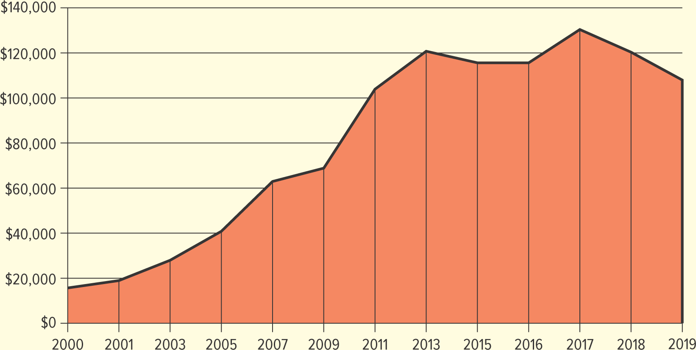

<h1 id="Chapter_3._Business_in_a_Borderless_World" style="color:#42A5F5;">Indice</h1>

---
##### [Capitulo LO 3-1 THE ROLE OF INTERNATIONAL BUSINESS](#669639)

##### [Capitulo LO 3-2 INTERNATIONAL TRADE BARRIERS](#924122)

##### [Capitulo LO 3-3 Trade Agreements, Alliances, and Organizations](#193478)

##### [Capitulo LO 3-4 Getting Involved in International Business](#661277)

##### [Capitulo LO 3-5 International Business Strategies](#906443)
---

<h1 id="669639" style="color:#E65100;">
  <a href="#Chapter_3._Business_in_a_Borderless_World" style="color:inherit; text-decoration:none;">
OA 3-1 EL PAPEL DE LOS NEGOCIOS INTERNACIONALES

  </a>
</h1>

Explore algunos de los factores dentro del entorno comercial internacional que influyen en los negocios.

## Summary

**Negocios internacionales** se refiere a la **compra, venta y comercialización de bienes y servicios a través de fronteras nacionales**.

La caída de las **barreras comerciales** y los avances en la **tecnología** han hecho posible que muchas empresas vendan sus productos tanto **a nivel nacional como internacional**. A medida que disminuyen las diferencias entre las naciones, la **globalización de los negocios** sigue ganando importancia.

Las empresas que **exportan productos** suelen:
- Crecer más rápido
- Tienen menos probabilidades de cerrar el negocio.

**Internet** y el desarrollo de **aplicaciones móviles** también han facilitado que las empresas ingresen a **mercados globales** sin abrir tiendas físicas.

Por ejemplo, **Amazon** tiene centros de distribución desde **Nevada hasta Alemania** que envían millones de pedidos todos los días a clientes de todo el mundo.

Otro hecho importante es que **la mayor parte de la población mundial y dos tercios de su poder adquisitivo se encuentran fuera de Estados Unidos**, lo que hace que los mercados internacionales sean muy importantes para las empresas.

El **marketing global** requiere equilibrar la **marca global** de una empresa con las **necesidades de los consumidores locales**. Por ejemplo, fuera de Estados Unidos, **China y Europa son los mercados más grandes de Apple**.

Las ventas internacionales también influyen en las **economías de los países involucrados**. Por ejemplo:
- **Taco Bell** vendiendo un burrito en **Sri Lanka**
- **Sony** vende un televisor en **Tokio**

Además, **Estados Unidos representa solo alrededor del 4,2% de la población mundial**, lo que significa que las empresas deben considerar los mercados globales al planificar sus estrategias de marketing.

Para comprender los negocios internacionales, también es importante estudiar varios conceptos económicos clave:

- **Por qué las naciones comercian**
- **Exportando**
- **Importando**
- **Balanza comercial**

# Why Nations Trade

Las naciones y las empresas participan en **comercio internacional** para obtener materias primas y bienes que no están disponibles en su país o que se pueden comprar a un **menor costo** en otros países.

Los países venden **materiales, bienes y servicios** para comprar los productos, servicios e ideas que su gente necesita.

Por ejemplo, países como **Etiopía, Camerún y Kenia** comercian con naciones occidentales para obtener **tecnología y técnicas** que ayuden a mejorar y desarrollar sus economías.

Los bienes y servicios que vende un país dependen de:
- Los **recursos** que tiene disponibles
- Su capacidad para **competir en los mercados globales**

---

## Absolute Advantage

Existe una **ventaja absoluta** cuando un país es el **productor más eficiente de un producto específico**.

Ejemplo:
- **Tequila** se produce principalmente en **Jalisco, México**, lo que le da a México una ventaja en su producción.

---

## Comparative Advantage

La mayor parte del comercio internacional se basa en la **ventaja comparativa**.

Una **ventaja comparativa** ocurre cuando un país se especializa en producir bienes o servicios que puede producir **de manera más eficiente o a un costo menor** que otros productos.

Ejemplos:

- **Francia** tiene una ventaja comparativa en la **producción de vino** debido a su agricultura, reputación y enólogos experimentados.
- **Arabia Saudita** tiene una ventaja comparativa en **producción de petróleo** porque se necesita **1 hora** para producir un barril de petróleo, mientras que en Estados Unidos se necesitan **2 horas**.

Algunos países como **India e Irlanda** están obteniendo una ventaja comparativa en servicios como:

- Atención al cliente
- Ingeniería
- Programación de software

---

## Outsourcing

Debido a los costos más bajos en otros países, muchas empresas practican la **subcontratación**, lo que significa transferir manufactura o servicios a países donde **la mano de obra y los suministros son más baratos**.

La subcontratación se ha vuelto controvertida en Estados Unidos porque muchos empleos se han trasladado al extranjero.

Ejemplo:
- **Nike** subcontrata la producción a **casi 500 fábricas en 38 países**, incluidas:
  - Porcelana
  - Tailandia
  - Corea del Sur
  -Vietnam
  - India

# Trade Between Countries

Para obtener los bienes y servicios necesarios, las naciones comercian **exportando** e **importando**.

## Exporting
**Exportar** es la **venta de bienes y servicios a mercados extranjeros**.

Las empresas estadounidenses exportan muchos productos y servicios, especialmente:
- **Productos agrícolas**
- **Entretenimiento** (películas, programas de televisión, etc.)
- **Productos tecnológicos**

## Importing
**Importar** es la **compra de bienes y servicios de fuentes extranjeras**.

Muchos de los productos que la gente compra en **Estados Unidos** son importados o contienen **componentes importados**. A veces, es posible que los consumidores ni siquiera se den cuenta de que los productos que compran proceden de otros países.

## U.S. Trade Activity
- **Estados Unidos exporta más de 2,5 billones de dólares** en bienes y servicios cada año.
- Estados Unidos importa más de 3,4 billones de dólares** en bienes y servicios anualmente.

---

## Did You Know?

Las **empresas más grandes del mundo por ingresos** incluyen:

1. Walmart (Estados Unidos)
2. Amazonas (Estados Unidos)
3. Red estatal (China)
4. Petróleo Nacional de China (China)
5. Grupo Sinopec (China)

# Balance of Trade

$$
\text{Balanza comercial} = \text{Exportaciones} - \text{Importaciones}
$$

## Definition

La **balanza comercial** de una nación es la **diferencia de valor entre sus exportaciones e importaciones**.

- Cuando un país **importa más de lo que exporta**, tiene una **balanza comercial negativa**, también llamada **déficit comercial**.
- Cuando un país **exporta más de lo que importa**, tiene una **balanza comercial favorable**, también llamada **superávit comercial**.

---

## U.S. Trade Deficit

**Estados Unidos tiene un déficit comercial** porque importa más productos de los que exporta.
Aunque las exportaciones estadounidenses a países como **China** han aumentado, las importaciones desde China son aún mayores.

El déficit comercial cambia con el tiempo dependiendo de factores como:

- La salud de Estados Unidos y las economías globales.
- Productividad
- Calidad del producto
- Tipos de cambio

Los déficits comerciales pueden ser perjudiciales porque pueden conducir a:

- Fracasos empresariales
- Pérdidas de empleo
- Un nivel de vida más bajo

---

## U.S. Trade Deficit Over Time (Billions of Dollars)

|        | 2010 | 2015 | 2016 | 2017 | 2018 | 2019 | 2020 | 2021 |
|--------|--------|--------|--------|--------|--------|--------|--------|--------|
| Exportaciones | 1.853,0 | 2.266,7 | 2.215,8 | 2.352,5 | 2.508,8 | 2.498,0 | 2.131,9 | 2.556,6 |
| Importaciones | 2.348,3 | 2.765,2 | 2.718,8 | 2.902,7 | 3.129,0 | 3.114,5 | 2.810,6 | 3.401,7 |
| Superávit/déficit comercial | -495,2 | -498,5 | -503.0 | -550,1 | -627,7 | -616,4 | -678,7 | -845.0 |
---

$$
\text{Balanza comercial} = \text{Exportaciones} - \text{Importaciones}
$$

## Top Countries with U.S. Trade Deficits

1.China
2. México
3.Vietnam
4. Canadá
5. Alemania
6. Japón
7. Irlanda
8. Taiwán
9. Tailandia
10. Corea del Sur

---

## Countries with U.S. Trade Surpluses

1. Países Bajos
2.Hong Kong
3. Brasil
4. Singapur
5.Australia
6. Emiratos Árabes Unidos
7. Reino Unido
8. Panamá
9. Bélgica
10.Chile

---

## Balance of Payments

La **balanza de pagos** es la **diferencia entre el flujo de dinero que entra y sale de un país**.

Incluye:

- Balanza comercial
- Inversiones extranjeras
- Ayuda exterior
- Préstamos
- Gasto militar
- Dinero gastado por los turistas.

Un país con un **superávit comercial** generalmente tiene una **balanza de pagos favorable** porque ingresa más dinero al país.

Si un país tiene un **déficit comercial**, más dinero fluye **fuera del país**, lo que puede llevar a:

- Menor producción
- Mayor desempleo
- Menos dinero disponible para gastar.

<h2>
Exportaciones de Estados Unidos a China (millones de dólares estadounidenses)

</h2>
</img>

<h1 id="924122" style="color:#E65100;">
  <a href="#Chapter_3._Business_in_a_Borderless_World" style="color:inherit; text-decoration:none;">
OA 3-2 BARRERAS AL COMERCIO INTERNACIONAL

  </a>
</h1>

**Evaluar algunas de las barreras económicas, éticas, legales, políticas, sociales, culturales y tecnológicas para los negocios internacionales.**

Rara vez existe un comercio completamente libre. Cuando una empresa decide hacer negocios fuera de su propio país, encontrará una serie de **barreras al comercio internacional**.

Cualquier empresa que esté considerando hacer negocios internacionales debe investigar las del otro país:

- Factores económicos
- Estándares éticos
- Normas legales
- Entorno político
- Estructura social
- Normas culturales
- Capacidades tecnológicas

Esta investigación ayuda a una empresa a elegir un **nivel de participación** y unas **estrategias operativas** adecuadas.

---

## Economic Barriers

Los gerentes deben considerar factores económicos básicos como:

- **Desarrollo económico**
- **Infraestructura**
- **Tipos de cambio**

---

### Economic Development

- No todos los países son tan avanzados económicamente como las naciones industrializadas como **Estados Unidos, Japón, el Reino Unido y Canadá**.
- Muchos países de **África, Asia y América del Sur** son menos avanzados económicamente y a menudo se les llama **países menos desarrollados (PMA)**.
- Los PMA se caracterizan por tener un **bajo ingreso per cápita**, lo que significa que es menos probable que los consumidores compren productos no esenciales.
- A pesar de esto, los PMA representan un **mercado potencialmente enorme y rentable**, especialmente para productos que mejoran **la infraestructura, la salud y la tecnología**.
- Ejemplos de PMA: **Afganistán, Bután, Camboya, Haití, Madagascar, Sierra Leona, Uganda**.

El nivel de desarrollo de un país está determinado en parte por su **infraestructura**:

- Sistemas de comunicación
- Redes de transporte
- Sistemas educativos y sanitarios.
- Utilidades

Al hacer negocios en los PMA, es posible que las empresas necesiten **adaptarse a sistemas rudimentarios de distribución y comunicación** o **falta de tecnología**.

---

### Exchange Rates

- El **tipo de cambio** es la relación en la que la moneda de un país se puede cambiar por otra.
- Los tipos de cambio fluctúan diariamente y afectan el **costo de las importaciones y exportaciones**.

**Ejemplo:**

- Si el dólar estadounidense disminuye en relación con el euro (de 1,30 dólares por euro a 1,10 dólares por euro):
  - **Las importaciones procedentes de Europa** se vuelven más baratas para los consumidores estadounidenses
  - **A NOSOTROS. Las exportaciones** se vuelven más caras para los compradores internacionales.

- Los **EE.UU. El dólar** es la moneda más utilizada en el comercio internacional; **el 90% del comercio de divisas** involucra el dólar.

Los gobiernos pueden **alterar intencionalmente el valor de su moneda** a través de la política fiscal:

- **La devaluación** reduce el valor de una moneda en relación con otras.
- La devaluación fomenta:
  - Venta de bienes nacionales al exterior.
  - Turismo

**Ejemplo:**
- El **Banco Central de Sudán** devaluó su moneda para superar la crisis económica y acceder al alivio de la deuda.

## Ethical, Legal, and Political Barriers

Las empresas que ingresan al mercado internacional deben navegar **relaciones complejas** entre:

- Leyes internas
- Leyes internacionales
- Leyes del país anfitrión.

También se enfrentan a:

- Restricciones comerciales
- Climas políticos cambiantes
- Diferentes valores éticos

**Ejemplo:**
Después de **la invasión rusa de Ucrania**, muchas empresas estadounidenses abandonaron Rusia indefinidamente, entre ellas:

-Krispy Kreme
- Año
-Aerolíneas americanas
- Roca Negra
- Carnaval
-Ford

Los **requisitos legales y éticos** globales para las empresas están aumentando.

---

### Laws and Regulations

- Los **Estados Unidos** tienen leyes y regulaciones que rigen a las empresas estadounidenses que participan en el comercio internacional.
- Los tratados de comercio y navegación con otras naciones permiten transacciones comerciales entre **EE.UU. empresas** y **ciudadanos extranjeros**.

---

### Case Study: Spotify – Streaming Everywhere

**Spotify**, el servicio de transmisión de audio más popular del mundo, tiene como objetivo **apoyar la creatividad humana** brindando a los artistas una forma de ganar dinero y a los fanáticos acceso a la música.

- **Más de 500 millones de usuarios** en **180 mercados**
- Posee aproximadamente **un tercio del mercado mundial de transmisión de música**
- Compite con **Pandora, Apple Music, YouTube Music, Amazon Music**

**Estrategia de crecimiento:**

- Atraiga **usuarios gratuitos con publicidad** y conviértalos en **suscriptores premium**
- Expandirse internacionalmente, ingresando a mercados como **Rusia, Albania, Bielorrusia, Bosnia y Herzegovina, Croacia, Kazajstán, Kosovo, Moldavia, Montenegro, Macedonia del Norte, Serbia, Eslovenia, Ucrania**
- Trabajar con **distribuidores locales y asociaciones regionales** para actuar **más local** manteniendo el **alcance global**

**Desafíos políticos y legales:**

- Suspendió y finalmente **cesó sus operaciones en Rusia** debido a la legislación que restringe la información y la libertad de expresión.
- En mercados maduros, Spotify **aumenta los precios de suscripción** y ofrece **contenido exclusivo** para mantener los ingresos y el liderazgo en el mercado.

---

### Critical Thinking Answers – Spotify Case Study

1. **¿Cómo intenta Spotify actuar como una empresa local?**
   - Spotify se asocia con **distribuidores locales** en cada mercado.
   - Establece **asociaciones regionales** para comprender las preferencias locales.
   - Ofrece contenido y promociones adaptadas a **países específicos**, lo que lo hace sentir más **local** para los usuarios y al mismo tiempo mantiene la coherencia global.

2. **¿Qué problemas legales y políticos ha enfrentado Spotify?**
   - **Operaciones suspendidas en Rusia** debido a legislación gubernamental que restringe el acceso a la información y la libertad de expresión.
   - Debe cumplir con **las leyes nacionales, las leyes internacionales y las regulaciones del país anfitrión** en cada mercado.
   - Explora **restricciones comerciales, tensiones políticas y expectativas éticas** en varios países.

3. **¿Cuáles son los puntos fuertes de Spotify a medida que se expande globalmente?**
   - **Gran base de usuarios** de más de 500 millones en 180 mercados.
   - Posee **alrededor de un tercio del mercado mundial de transmisión de música**.
   - Fuerte **reconocimiento de marca** y experiencia en convertir usuarios gratuitos en **suscriptores premium**.
   - Capacidad de equilibrar la **escala global** con la **personalización local**, aprovechando asociaciones y contenido exclusivo.
   - Continúa **innovando y adaptando estrategias de precios** en mercados maduros para aumentar los ingresos.

## Legal Challenges in International Business

Al hacer negocios fuera de los Estados Unidos, las empresas enfrentan **leyes y sistemas legales diferentes**. Algunos puntos clave incluyen:

---

### Differences in Legal Rights

- Muchos derechos legales que los estadounidenses dan por sentados pueden **no existir en otros países**.
- Las empresas deben **comprender y obedecer las leyes del país anfitrión**.
- Ejemplos de restricciones legales:
  - Límites en la cantidad de **moneda local** que se puede sacar o traer al país
  - Restricciones sobre **cómo pueden operar las empresas extranjeras** dentro del país

- Ejemplo de diferencias regulatorias:
  - Estados Unidos ha tardado en adoptar **regulaciones sobre drones para uso comercial**, mientras que países como **Australia, Singapur y Gran Bretaña** tienen regulaciones que permiten que las entregas con drones crezcan rápidamente.

---

### Intellectual Property and Counterfeiting

- **Las leyes de derechos de autor y patentes** varían mucho entre países.
- Algunos países **hacen cumplir estrictamente las leyes de propiedad intelectual**, como China, pero controlar los productos falsificados aún puede ser un gran desafío.

**Impacto global de la falsificación:**

- Los productos falsificados le cuestan a la economía global **más de 500 mil millones de dólares al año** (Cámara de Comercio de Estados Unidos).
- Las falsificaciones dañan:
  - **Ventas de productos legítimos**
  - **Reputación de la empresa**, especialmente si las imitaciones son de mala calidad.
- Casi **la mitad de todo el software instalado en computadoras personales en todo el mundo** **no tiene la licencia adecuada**.

- En algunos países, **las leyes contra la falsificación pueden no aplicarse lo suficiente**, por lo que es posible que las empresas deban tomar **medidas adicionales** para proteger sus productos.

---

**Conclusión clave:**
Las empresas que participan en el comercio internacional deben **adaptarse a diferentes sistemas legales**, proteger la propiedad intelectual de manera proactiva y comprender que la aplicación de la ley puede variar según el país.

## Tariffs and Trade Restrictions

### Definition

**Los aranceles y las restricciones comerciales** son parte de la estructura legal de un país, pero también pueden verse influenciados por **razones políticas**.

---

### Tariffs

- **Arancel de importación:** Impuesto sobre bienes importados a un país.
  - **Tarifa fija:** Una cantidad fija por unidad de producto
  - **Arancel ad valorem:** Basado en el valor del producto

- Los ciudadanos pueden traer una cantidad limitada de mercancías **libres de impuestos** a su país; todo lo anterior está sujeto a impuestos.
  - Ejemplo (EE.UU.): $200, $800 o $1600 dependiendo del país visitado

- Los **aranceles protectores** se utilizan a menudo para **proteger las industrias nacionales** aumentando el costo de los bienes importados.
  - Ejemplo: aranceles estadounidenses sobre el acero para proteger las acerías nacionales
  - **Controvertido:** Puede entrar en conflicto con el libre comercio y afectar a los consumidores.

- Los aranceles también pueden ser **herramientas políticas**, utilizadas como sanciones contra países.

---

### Trade Wars

- Ejemplo: guerra comercial entre Estados Unidos y China
  - Estados Unidos impuso aranceles a productos de alta tecnología.
  - China tomó represalias con un **arancel del 25%** sobre productos estadounidenses (aviones, soja)
  - Dio lugar a un desplazamiento del comercio hacia países vecinos como **Vietnam**

- Críticos: Los aranceles **inhiben el libre comercio y la competencia**
- Partidarios: Proteger las industrias y los empleos nacionales, mantener **salarios más altos**

---

### Exchange Controls

- Restringir la cantidad de moneda que se puede **comprar o vender**
- Los gobiernos pueden exigir a las empresas que vendan moneda extranjera a **bancos centrales**
- Ayuda a los países a gestionar la **escasez de divisas**, especialmente en los **PMA**

---

### Quotas

- Limitar el **número de unidades** de un producto que se puede importar
- Puede establecerse mediante **decreto gubernamental o acuerdo voluntario**
- Proteger las industrias y los empleos nacionales, pero conducir a **precios al consumidor más altos**
- Ejemplo: cuotas estadounidenses sobre prendas de vestir procedentes de Vietnam y China

---

### Embargoes

- Prohibir el comercio de un producto en particular o con un país específico.
- Puede imponerse por **razones políticas, económicas, de salud o religiosas**
- Ejemplo: embargo comercial de Estados Unidos con Cuba (las restricciones han variado según la administración)
- Los embargos sanitarios restringen **productos farmacéuticos, plantas, animales**, etc.
- Los embargos religiosos pueden prohibir productos como **bebidas alcohólicas**

---

### Dumping

- Ocurre cuando una empresa vende productos **por debajo del costo de producción** en mercados extranjeros.
- Razones del dumping:
  - Entrada rápida al mercado
  - El mercado interno es demasiado pequeño para ser eficiente.
  - Venta de productos tecnológicamente obsoletos.

- Ejemplo: paneles solares chinos y colchones en EE.UU.
  - Estados Unidos impuso aranceles de hasta **1.731%** a los colchones objeto de dumping.

- Efecto: **Precios más altos para los consumidores** debido a cuotas, aranceles o medidas antidumping

## Political Barriers to International Business

Cuando las empresas se expanden más allá de su país de origen, las **barreras políticas** desempeñan un papel importante y, a menudo, son impredecibles y no escritas. Estas barreras surgen de acciones gubernamentales, cambios de política, inestabilidad y tensiones geopolíticas que pueden afectar significativamente las operaciones en el extranjero.

---

### Unwritten and Rapidly Changing Political Rules

A diferencia de las leyes formales, las **consideraciones políticas** suelen ser informales y pueden cambiar repentinamente. Los gobiernos pueden:

- Imponer **sanciones** a otras naciones por razones políticas.
  - Los ejemplos incluyen naciones como **Cuba, Irán, Siria y Corea del Norte** que enfrentan sanciones económicas debido a conflictos geopolíticos.
- Promulgar restricciones comerciales como **aranceles, embargos o cuotas** en respuesta a acontecimientos políticos.

Estas medidas se utilizan no sólo por razones económicas sino también como **herramientas políticas** para presionar o castigar a otros países.

---

### Political Instability and Risk

La inestabilidad política puede crear un entorno desfavorable para los negocios internacionales. Esto incluye:

- Disturbios civiles, protestas y cambios de régimen.
- Conflictos y guerras
- Gobernanza débil y corrupción.
- Acciones gubernamentales que afecten derechos de propiedad o contratos

Los países con agitación política constante, como **Irak, Ucrania, Venezuela, Pakistán, Somalia y la República Democrática del Congo**, pueden presentar **entornos hostiles o peligrosos para las empresas extranjeras**.

La inestabilidad hace que a las empresas les resulte más difícil planificar, pronosticar y asegurar inversiones porque los gobiernos pueden cambiar repentinamente sus políticas, restringir la propiedad extranjera o imponer nuevos controles comerciales.

---

### Government Debt and Economic Pressure

Los países con alto riesgo de incumplir el pago de su deuda externa (incluidos **Argentina, Ucrania, Túnez, Ghana, Egipto y Ecuador**) también pueden crear barreras políticas. Una posición fiscal débil a menudo conduce a cambios de política impredecibles que impactan las operaciones comerciales en el extranjero.

---

### Natural Disasters and Political Shocks

Los desastres naturales pueden debilitar la capacidad del gobierno y contribuir a la inestabilidad. Los cambios inesperados en el poder político o las crisis generalizadas pueden generar actitudes hostiles hacia la inversión extranjera.

Estos shocks repentinos generan **riesgo político**, que puede perjudicar la rentabilidad y la continuidad del negocio.

---

### Cartels and Political Alliances

Las barreras políticas también pueden surgir a través de acciones colectivas de grupos de naciones.

- Los **cárteles** son alianzas de países o empresas que actúan como un **monopolio**, limitando la competencia para influir en los mercados mundiales.
- Uno de los cárteles más famosos es la **OPEP (Organización de Países Exportadores de Petróleo)**, que fue fundada para **estabilizar y elevar los precios mundiales del petróleo**, beneficiando económica y políticamente a sus países miembros.

Los cárteles pueden crear barreras políticas al controlar la oferta y los precios, lo que afecta directamente los flujos comerciales y las condiciones del mercado global.

---

### Summary

Las barreras políticas a los negocios internacionales incluyen una variedad de factores tales como:

- Sanciones gubernamentales y restricciones comerciales.
- Inestabilidad política y cambios de régimen.
- Presión económica de las crisis de deuda
- Riesgos derivados de conflictos, violencia y disturbios.
- Cárteles y alianzas que influyen en los mercados globales.

Comprender estas barreras ayuda a las empresas a evaluar el **riesgo político** y planificar estrategias para ingresar y operar en los mercados internacionales con éxito.

# Social and Cultural Barriers

Las diferencias sociales y culturales pueden afectar significativamente los negocios internacionales. Ignorar estas diferencias puede descarrilar transacciones importantes o dañar la reputación de una empresa.

---

### Cultural Sensitivity

- Los empresarios deben respetar **normas culturales**, que a menudo **no están escritas o están documentadas de manera inexacta**.
- Ejemplo: **BMW** sacó un anuncio en los Emiratos Árabes Unidos que mostraba a un equipo de fútbol deteniendo el himno nacional a mitad de la canción, lo que se consideró ofensivo.

---

### Language Differences

- Cada país tiene **idiomas hablados y escritos únicos** y leyes de etiquetado de productos.
  - Ejemplo: **Canadá** requiere etiquetas en **inglés y francés**.
- Las traducciones literales pueden fallar y dar lugar a malentendidos:
  - Escandinavo **Electrolux**: "Nada apesta tanto como un Electrolux"
  - **Coca-Cola** en China: "Ke-kou-ke-la", que significa "muerde el renacuajo de cera"
  - **Agua tónica Schweppes** en Italia: traducida como "agua de tocador Schweppes"

- Empresas como **Netflix** se asocian con **proveedores locales** para garantizar que las traducciones respeten el contexto cultural.

---

### Body Language, Gestures, and Personal Space

- El espacio personal varía según la región:
  - Sudamérica, Medio Oriente, Sur de Europa → acércate
  - Norte de Europa, América del Norte, Asia → están más separados
- Los gestos varían y pueden resultar ofensivos en diferentes culturas:

| Gesto | País |
|------------------------|------------------|
| Pulgares hacia arriba | Irán |
| Signo de la paz al revés | Reino Unido |
| Señalando con el dedo índice | Malasia |
| signo "OK" | Brasil |
| Cartel de "Cuelgue suelto" | Italia y España |

- El lenguaje corporal mal interpretado puede crear **malentendidos** durante las negociaciones.

---

### Social Norms and Advertising

- Los roles familiares y las expectativas sociales influyen en el marketing:
  - Algunos países **prohiben la aparición de niños en los anuncios**
  - Los roles sociales no tradicionales pueden ser mal recibidos.
- Las empresas deben evitar reforzar **estereotipos negativos**
  - Ejemplo: **Dolce & Gabbana** retiró anuncios en China después de que un anuncio en el que aparecía una modelo asiática comiendo comida italiana con palillos se considerara irrespetuoso y racista.

---

### Key Takeaways

- Comprender las **barreras sociales y culturales** es esencial para el éxito global.
- Las empresas deben respetar **el lenguaje, los gestos, los roles familiares y las normas sociales** para evitar ofensas y proteger la reputación de la marca.
- La sensibilidad cultural fortalece **la confianza, la comunicación y la aceptación del mercado**.

# McDonald's Slow Growth in Vietnam

En 2014, McDonald's entró en Vietnam cuando el país abrió el comercio a empresas extranjeras. Inicialmente, la medida pareció un éxito: más de **400.000 clientes nos visitaron en el primer mes**. McDonald's planeaba abrir más de **100 tiendas en 10 años**, pero casi una década después, tiene **menos de 30 restaurantes** en todo el país.

El lento crecimiento se debe en gran medida a **diferencias sociales, culturales y de mercado** que hicieron que el modelo de comida rápida estadounidense fuera menos efectivo en Vietnam.

---

## Reasons for Slow Growth

### 1. Local Competition and Food Culture

- Los establecimientos de comida tradicional vietnamita existen desde hace mucho tiempo y **a menudo son más rápidos que McDonald's**.
- Los proveedores locales dominan el mercado debido a factores históricos (por ejemplo, la guerra de Vietnam limitó el acceso extranjero).
- Los clientes vietnamitas están acostumbrados a **comida fresca, local y económica**.

---

### 2. Pricing Strategy

- McDonald's utilizó un **modelo de precios occidental**, que es barato en Estados Unidos pero **caro en Vietnam** en relación con el ingreso mensual promedio.
- Los restaurantes locales ofrecen **opciones más diversas y asequibles**, lo que hace que McDonald's parezca una **marca de lujo**.

---

### 3. Menu and Dining Style

- La cultura vietnamita prefiere las **comidas de estilo familiar**, donde la comida se comparte entre los comensales en lugar de porciones individuales.
- El menú tradicional de McDonald's se centra en **comidas individuales**, lo que no se alinea con los hábitos gastronómicos locales.
- Los elementos limitados del menú, como hamburguesas y papas fritas, son menos atractivos que los **platos para compartir**, particularmente las comidas a base de pollo o arroz.

- McDonald's ha tratado de adaptarse con productos como **arroz con cerdo a la parrilla y huevo**, pero en general, **la comida rápida sigue siendo menos atractiva que los vendedores locales**.

---

## Critical Thinking Questions

1. **¿Por qué la velocidad del servicio no ha sido una ventaja competitiva en Vietnam?**
   - Los establecimientos de comida locales ya son **más rápidos que McDonald's**, por lo que el servicio rápido no diferencia a McDonald's de las opciones existentes.

2. **¿Por qué la estrategia de precios de McDonald's no ha funcionado en Vietnam?**
   - La **estrategia de precios occidental** encarece las comidas para el consumidor vietnamita medio, posicionando a McDonald's como una **marca de lujo** en lugar de una opción cotidiana.

3. **Describe las comidas de estilo familiar y por qué el menú de McDonald's entra en conflicto con ellas.**
   - **Cenas de estilo familiar:** Las comidas se comparten entre todos los comensales, con platos colocados en el centro para que todos se sirvan ellos mismos.
   - **Conflicto:** McDonald's sirve **porciones individuales** en lugar de comidas para compartir, lo que va en contra de las preferencias alimentarias locales.

## Social and Cultural Considerations in International Business

Comprender las normas culturales y sociales es crucial para las empresas que operan a nivel internacional. No comprender estas normas puede provocar **errores costosos** y relaciones tensas.

---

### Time Perception

- Los **estadounidenses** valoran la puntualidad; Las reuniones rara vez comienzan tarde.
- **México y España** pueden iniciar las reuniones **30 minutos o más tarde**, lo que puede frustrar a los extranjeros que no estén familiarizados con esta costumbre.
- Las empresas deben adaptarse a las **percepciones locales del tiempo** para evitar malentendidos.

---

### Observing Holidays and Religious Customs

- Las empresas deben respetar los **festivos nacionales y religiosos**.
- Ejemplo: **Tesco en Londres** se disculpó por exhibir Pringles con sabor a tocino durante el **Ramadán**, ofendiendo a los clientes musulmanes.
- La publicidad también debe ser culturalmente sensible:
  - En **Tailandia**, las muestras públicas de afecto son inapropiadas.
  - En **países de Medio Oriente**, mostrar las plantas de los pies se considera una falta de respeto.
  - En **Rusia**, sonreír está reservado para entornos privados, no para interacciones comerciales.

---

### Measurement Systems

- La mayoría de los países utilizan el **sistema métrico**, mientras que EE. UU. utiliza **unidades inglesas**.
- Los vendedores deben **convertir embalajes, herramientas y medidas** para mercados extranjeros:
  - Los productos americanos pueden necesitar **litros o metros** para exportarse.
  - Los productos japoneses deben convertirse a **unidades inglesas** para el mercado estadounidense.
- Ejemplo: **Los técnicos de Hyundai y Honda** requieren herramientas métricas para reparaciones de vehículos.

---

### Minimizing Cultural Mistakes

- Los malentendidos culturales y sociales pueden ser **divertidos pero costosos**.
- Las empresas deben **investigar las normas, costumbres y comportamiento social locales** antes de ingresar a un mercado.
- El conocimiento de estas diferencias ayuda a **generar confianza, evitar ofensas y mejorar los resultados comerciales**.

## Technological Barriers in International Business

La infraestructura tecnológica varía ampliamente entre países, lo que crea **oportunidades y desafíos** para las empresas internacionales.

---

### Limited Infrastructure

- Muchos países carecen de la **infraestructura tecnológica avanzada** que se encuentra en Estados Unidos.
- Por ejemplo, países como **India, China y algunas naciones africanas** tienen líneas telefónicas privadas limitadas.
- Los ciudadanos suelen depender de **comunicaciones inalámbricas** a través de teléfonos móviles en lugar de teléfonos fijos.

---

### Opportunities from Technology Gaps

- Los especialistas en marketing pueden **apuntar a mercados con infraestructura limitada** utilizando soluciones innovadoras como tecnologías móviles e inalámbricas.
- Las brechas tecnológicas crean **nuevas vías para el marketing global** y la entrega de productos.

---

### Competition in Technology

- Las tecnologías cambiantes aumentan la **competencia**, especialmente de países con industrias tecnológicas sólidas.
- Las empresas tecnológicas asiáticas representan el **52% del crecimiento global de los ingresos tecnológicos**.
- Ejemplo: **Al menos el 90% de los teléfonos inteligentes se fabrican en Asia**, lo que destaca la ventaja competitiva de las regiones con una infraestructura tecnológica sólida.

---

### Key Takeaways

- Las empresas deben **adaptarse a las capacidades tecnológicas locales**.
- **La innovación y la flexibilidad** son esenciales para ingresar a mercados con infraestructura limitada.
- Comprender las barreras tecnológicas permite a las empresas **aprovechar las oportunidades sin dejar de ser competitivas a nivel mundial**.

<h1 id="193478" style="color:#E65100;">
  <a href="#Chapter_3._Business_in_a_Borderless_World" style="color:inherit; text-decoration:none;">
OA 3-3 Acuerdos comerciales, alianzas y organizaciones
  </a>
</h1>

El comercio internacional puede ser un desafío debido a barreras económicas, políticas, legales y socioculturales. Sin embargo, los **acuerdos comerciales, alianzas y organizaciones** ayudan a facilitar los negocios globales y crear oportunidades para que las empresas tengan éxito en los mercados internacionales.

---

## Global Trade Organizations

- **Acuerdo General sobre Aranceles Aduaneros y Comercio (GATT)**
  - Promueve el comercio internacional **reduciendo aranceles y barreras comerciales**.

- **Banco Mundial**
  - Proporciona **asistencia financiera y técnica** a los países en desarrollo para apoyar el crecimiento económico y el comercio.

- **Fondo Monetario Internacional (FMI)**
  - Ofrece **estabilidad financiera, asesoramiento sobre políticas y préstamos** a los países miembros para fomentar la cooperación comercial y económica.

---

## Regional Trade Agreements

- **Acuerdo Estados Unidos-México-Canadá (T-MEC)**
  - Elimina muchos aranceles y restricciones comerciales entre los países miembros, facilitando el **comercio transfronterizo**.

- **Unión Europea (UE)**
  - Promueve el comercio entre los países miembros al permitir **la libre circulación de bienes, servicios y mano de obra**, creando un gran mercado integrado.

---

## Key Takeaways

- Los acuerdos comerciales y las organizaciones internacionales **reducen barreras y riesgos** para los negocios globales.
- Proporcionan marcos que **fomentan la inversión, estabilizan las economías y apoyan la cooperación económica**.
- Las empresas pueden aprovechar estas alianzas para **entrar en nuevos mercados de forma más fácil y eficiente**.

## General Agreement on Tariffs and Trade (GATT) and the World Trade Organization (WTO)

El comercio internacional cuenta con el respaldo de organizaciones globales que establecen reglas, resuelven disputas y reducen las barreras al comercio. Dos instituciones clave son el **GATT** y la **OMC**.

---

### General Agreement on Tariffs and Trade (GATT)

- **Establecido:** 1947 por 23 naciones.
- **Propósito:** Proporcionar un foro para **negociaciones arancelarias** y resolver cuestiones de comercio internacional.
- **Logros clave:**
  - Patrocinó **rondas de negociación** para reducir las restricciones comerciales.
  - **Ronda Uruguay (1988-1994):**
    - Reducción adicional de las barreras comerciales para la mayoría de los productos.
    - Se introdujeron nuevas reglas para evitar el **dumping**.
    - Los aranceles cayeron del **22% en 1947 al 5%** después de la Ronda Uruguay.

---

### World Trade Organization (WTO)

- **Establecido:** 1995, tras la Ronda Uruguay.
- **Propósito:** Tratar con las **reglas de comercio entre naciones**.
- **Funciones:**
  - Administra **acuerdos de la OMC**, que son la base legal para el comercio internacional.
  - Proporciona un **foro para negociaciones comerciales**.
  - Monitorea **políticas comerciales nacionales**.
  - Ofrece **asistencia técnica y capacitación** para países en desarrollo.
  - Coopera con otras organizaciones internacionales.
- **Membresía:** 164 países miembros.
- **Sede:** Ginebra, Suiza.
- **Desafíos:**
  - Gestionar **disputas comerciales**, especialmente entre economías importantes como China y Estados Unidos.
  - Abordar cuestiones globales como las **crisis sanitarias** y el **desarrollo económico**, incluido el acceso a las vacunas durante la pandemia de COVID-19.

---

### Key Takeaways

- El GATT y la OMC tienen como objetivo **reducir las barreras comerciales** y facilitar el comercio internacional justo.
- Proporcionan **marcos legales, foros de negociación y soporte técnico** para el comercio global.
- Comprender estas organizaciones es esencial para las empresas que buscan **participar con éxito en los mercados internacionales**.

## The United States-Mexico-Canada Agreement (USMCA)

El **USMCA** es el sucesor moderno del **TLCAN**, diseñado para fortalecer el comercio entre Estados Unidos, México y Canadá y al mismo tiempo actualizar las políticas para reflejar las necesidades económicas actuales.

---

### Background: NAFTA

- **Fecha de vigencia del TLCAN:** ​​1 de enero de 1994
- **Propósito:** Fusionar los EE. UU., Canadá y México en un **mercado único** de casi 450 millones de consumidores.
- **Logros clave:**
  - Se eliminó la mayoría de los **aranceles** sobre bienes comercializados entre los tres países.
  - Facilitado **EE.UU. inversión empresarial** en México y Canadá.
  - Proporcionó **protecciones de propiedad intelectual**, especialmente para las industrias de tecnología y entretenimiento.
  - Ampliación del comercio al garantizar **trato igualitario a las empresas estadounidenses**.
  - **Reglas de país de origen** simplificadas.

---

### Transition to USMCA

- **USMCA** actualizó el TLCAN para incluir:
  - **Reglas de fabricación de automóviles** y estándares laborales.
  - **Protecciones ambientales** mejoradas.
  - Fortalecimiento de **disposiciones sobre propiedad intelectual y comercio digital**.
  - Exenciones de aranceles y cuotas para los productos calificados exportados entre los tres países.
  - Acuerdos laborales que exigen que los trabajadores que ganen **al menos $16 por hora** produzcan más piezas de vehículos.

---

### Trade Highlights

- **Canadá:**
  - Población: 38 millones
  - PIB per cápita: 43.936 dólares
  - Exportaciones estadounidenses: 307 mil millones de dólares.
  - Importaciones estadounidenses: 357 mil millones de dólares.
  - Canadá es el **mayor socio comercial de Estados Unidos**.

- **México:**
  - Población: 127 millones
  - PIB per cápita: 19.086 dólares
  - Exportaciones estadounidenses: 276 mil millones de dólares anuales
  - **Vínculos patrimoniales** significativos con la población mexicano-estadounidense de Estados Unidos.
  - Economía de mercado con compromisos con el **estado de derecho, los derechos humanos y el desarrollo sostenible**.
  - Atrae a empresas estadounidenses con **bajos costos laborales** y proximidad; alberga industrias como **electrónica, software y aeroespacial**.

---

### Goals and Benefits of USMCA

- Incrementar la producción de **repuestos para automóviles y camiones en Norteamérica**.
- Garantizar que **el 75 % de los componentes de los vehículos** se fabriquen en Canadá, México o EE. UU. sin aranceles.
- Mejorar **regulaciones ambientales y laborales**, beneficiando particularmente a México.
- Modernizar el comercio de **productos agrícolas, propiedad intelectual, derechos de autor y comercio digital**.

---

### Key Takeaways

- El T-MEC fortalece el **comercio regional y la integración económica**.
- Proporciona **reglas y protecciones predecibles** para empresas en toda América del Norte.
- Fomenta la inversión y la cooperación al tiempo que aborda cuestiones comerciales modernas como las normas laborales, la protección ambiental y el comercio digital.

## The European Union (EU)

La **Unión Europea (UE)**, también conocida como **Comunidad Europea** o **Mercado Común**, se estableció en 1958 para promover el comercio entre sus países miembros.

---

### Member and Candidate Countries

- **Miembros originales:** Bélgica, Francia, Italia, Alemania Occidental, Luxemburgo, Países Bajos
- **Miembros actuales:** España, Dinamarca, Grecia, Portugal, Irlanda, Austria, Finlandia, Suecia, Chipre, Polonia, Hungría, República Checa, Eslovenia, Estonia, Letonia, Lituania, Eslovaquia, Malta, Rumanía, Bulgaria, Bélgica, Francia, Alemania, Italia, Luxemburgo, Países Bajos, Croacia
- **Países candidatos:** Albania, Bosnia y Herzegovina, Moldavia, Montenegro, Macedonia del Norte, Serbia, Turquía, Ucrania

En 1993, los miembros de la UE se unificaron oficialmente en un **mercado único** con:
- **Más de 500 millones de consumidores**
- **PIB superior a 17 billones de dólares**

---

### Facilitating Free Trade

La UE promueve el comercio entre sus miembros a través de:
- Estandarización de **regulaciones y requisitos comerciales**
- Armonización de **derechos de importación** e **impuestos al valor agregado (IVA)**
- **Eliminación de controles aduaneros**
- Creación de una **moneda común (euro)** para muchos miembros

**Nota:** No todos los países de la UE utilizan el euro, lo que obliga a algunas empresas a ajustar sus estrategias de precios. Una moneda única simplifica el comercio al evitar cálculos complejos de tipos de cambio.

---

### Long-Term Goals

La UE tiene como objetivo:
- Eliminar todas las barreras comerciales dentro de los países miembros.
- Mejorar la **eficiencia económica** y estimular el crecimiento.
- Fortalecer la competitividad en **mercados globales**, especialmente frente a Japón, las naciones de la Cuenca del Pacífico y América del Norte.

Los desafíos persisten debido a las disputas entre los miembros y las barreras residuales para la desregulación total.

---

### Laws and Regulations

- La UE aplica estrictas leyes **antimonopolio** y de **privacidad de datos**
  - Google se ha enfrentado a múltiples multas por comportamiento anticompetitivo
  - **Reglamento General de Protección de Datos (GDPR)** protege los datos personales como un derecho fundamental
    - Requiere **consentimiento inequívoco** para recopilar o utilizar datos
    - Las personas pueden solicitar **acceso, eliminación y transferencia de datos**

---

### United Kingdom Exit (Brexit)

- El **Reino Unido abandonó la UE en 2020**
- El Reino Unido prioriza los acuerdos comerciales con miembros de la UE
- En 2021 entró en vigor un acuerdo comercial con **Canadá**
- Los **Estados Unidos** siguen siendo el mayor socio comercial del Reino Unido.
- Continúan las negociaciones para potenciales acuerdos de libre comercio con EE.UU.

---

### Summary

La UE representa uno de los **mercados únicos más grandes del mundo** y promueve la integración económica, la facilitación del comercio y las normas regulatorias. Si bien la unión enfrenta desafíos como disputas internas, cumplimiento del RGPD e incertidumbres relacionadas con el Brexit, continúa dando forma a la política comercial y económica global.

## Asia-Pacific Economic Cooperation (APEC)

La **Cooperación Económica Asia-Pacífico (APEC)**, establecida en 1989, promueve el **comercio abierto**, la cooperación económica y técnica entre sus economías miembros.

---

### Member Economies

- **Miembros originales:** Australia, Brunei Darussalam, Canadá, Indonesia, Japón, Corea del Sur, Malasia, Nueva Zelanda, Filipinas, Singapur, Tailandia, Estados Unidos
- **Miembros actuales (21 en total):** Chile, China, Hong Kong (China), México, Papua Nueva Guinea, Perú, Rusia, Taipei Chino, Vietnam

APEC representa:
- **38% de la población mundial**
- **60% del PIB mundial**
- **Casi el 47% del comercio mundial**

APEC es único al permitir la **participación empresarial y del sector privado** en sus actividades, mejorando la facilitación práctica del comercio.

---

### Economic Impact and Competitiveness

- Japón y Corea del Sur se han convertido en **líderes mundiales** en vehículos, maquinaria y electrónica a través de empresas como **Toyota, Sony, Samsung, Mitsubishi, Daewoo, Suzuki, Lenovo**
- **China**, con una población de más de 1.400 millones de habitantes, ha reformado su economía mediante:
  - Privatizar industrias
  - Reestructuración de bancos
  - Invertir en infraestructura (ferrocarriles, telecomunicaciones)
- China sigue siendo la **segunda economía más grande del mundo**, detrás de Estados Unidos, y es una potencia manufacturera mundial.
- **Alibaba** es un minorista de Internet líder a nivel mundial originario de China

---

### Environmental and Policy Challenges

- China es el **mayor emisor de gases de efecto invernadero** y el **mayor importador de petróleo**
- Se están realizando esfuerzos para liderar **iniciativas verdes y energía renovable**
- El capitalismo dirigido por el Estado en China permite una rápida toma de decisiones, pero la **falta de competencia** en las empresas respaldadas por el Estado puede aumentar los costos.
- Los crecientes pasivos de deuda han generado preocupación entre los inversores extranjeros.
- La actual **guerra comercial entre Estados Unidos y China** afecta el crecimiento económico y la equidad comercial entre las dos naciones.

---

### Other Pacific Rim Economies

- **Tailandia, Singapur, Taiwán, Vietnam y Hong Kong** se han convertido en importantes **centros financieros y de fabricación**.
- **Vietnam** tiene una economía abierta y una fuerte competitividad internacional debido a:
  - Productividad agrícola ("milagro agrícola")
  - Crecimiento de las empresas privadas a pesar de la burocracia, la corrupción y la infraestructura limitada
  - Mayor atención por parte de las empresas extranjeras a medida que aumentan los costos laborales chinos

---

### Summary

APEC ha facilitado la cooperación comercial y económica en toda la región de Asia y el Pacífico, ayudando a las economías miembros a crecer competitivamente en el escenario mundial. Las tendencias clave incluyen:
- Fuerte industrialización en Japón, Corea del Sur y China.
- Vietnam emerge como un centro agrícola y manufacturero mundial.
- Desafíos ambientales, políticos y comerciales que configuran la dinámica económica regional

## Association of Southeast Asian Nations (ASEAN)

La **Asociación de Naciones del Sudeste Asiático (ASEAN)**, establecida en 1967, promueve el **comercio y la integración económica** entre los países del Sudeste Asiático.

---

### Member Nations

La ASEAN incluye:
- Malasia, Filipinas, Singapur, Tailandia, Brunei Darussalam, Vietnam, Laos, Indonesia, Myanmar, Camboya

La alianza representa:
- **Casi 650 millones de personas**
- **PIB de 2,9 billones de dólares**

---

### Goals of ASEAN

- Promover el **libre comercio** entre los miembros
- Mantener **la paz y la estabilidad política**
- Fomentar la **colaboración y el desarrollo económico**

---

### Challenges

- **Diversos sistemas económicos**: democracias (Filipinas, Malasia), monarquías constitucionales (Camboya) y comunismo (Vietnam)
- **Han surgido conflictos políticos** entre los miembros.
- **Sin moneda común**
- La **movilidad laboral** no es totalmente gratuita entre países.
- A diferencia de la Unión Europea, la ASEAN **no es un bloque comercial totalmente unificado**

## World Bank

El **Banco Mundial**, formalmente llamado **Banco Internacional de Reconstrucción y Desarrollo**, fue establecido en 1946 por naciones industrializadas, incluido Estados Unidos, para **brindar apoyo financiero a los países subdesarrollados y en desarrollo**.

---

### Functions

- **Préstamos**: Proporciona fondos directamente o pide prestado a los países miembros para financiar proyectos.
- **Proyectos financiados**: infraestructura (carreteras, fábricas), instalaciones médicas e instituciones educativas.
- **Apoyo al Sector Privado**: A través de entidades asociadas como la Asociación Internacional de Fomento y la Corporación Financiera Internacional

---

### Role in Global Development

- La mayor fuente de **asesoramiento y asistencia** para los países en desarrollo
- Respondió al **COVID-19** apoyando la suspensión de la deuda, la distribución de vacunas y los programas de desarrollo económico.

## International Monetary Fund (IMF)

El **Fondo Monetario Internacional (FMI)**, establecido en 1947, tiene como objetivo **promover la cooperación comercial y financiera entre los países miembros** y ayudar a mantener la estabilidad económica global.

---

### Key Functions

- **Cooperación comercial y financiera**: trabaja para reducir las barreras comerciales y fomentar la colaboración financiera.
- **Préstamos a corto plazo**: Proporciona fondos a países con **déficit de balanza de pagos**
- **Apoyo de moneda extranjera**: suministra monedas extranjeras a los países miembros para facilitar el comercio.
- **Prevención de Crisis**: Alerta a la comunidad internacional sobre países en riesgo de impago de deudas

---

### Role in Global Economy

- Actúa como la **entidad más cercana a un banco central internacional**
- Responde a las **crisis financieras globales** aumentando los préstamos tanto a las economías emergentes como a las desarrolladas
- Proporciona **datos y análisis** sobre las perspectivas económicas mundiales, las tendencias regionales y la deuda global.
- Respondimos al **COVID-19** ofreciendo asistencia financiera, asesoramiento sobre políticas y herramientas especiales para los países miembros.

<h1 id="661277" style="color:#E65100;">
  <a href="#Chapter_3._Business_in_a_Borderless_World" style="color:inherit; text-decoration:none;">
OA 3-4 Involucrarse en negocios internacionales
  </a>
</h1>

Las empresas pueden participar en el comercio internacional en **varios niveles**, desde exportaciones ocasionales hasta operaciones multinacionales a gran escala. El **nivel de compromiso y recursos necesarios aumenta** con cada paso.

---

## Levels of Involvement

- **Exportación e Importación**:
Vender bienes y servicios a mercados extranjeros (exportación) o comprar de fuentes extranjeras (importación). Este suele ser el primer paso para las empresas que ingresan al comercio internacional.

- **Empresas comerciales**:
Empresas que **compran y venden productos a nivel internacional** en nombre de otras empresas, ayudando a empresas más pequeñas a llegar a mercados extranjeros sin establecer sus propias operaciones en el extranjero.

- **Licencias y Franquicias**:
  - **Licencias**: Una empresa permite a una empresa extranjera **producir sus productos** a cambio de honorarios o regalías.
  - **Franquicia**: una empresa permite a una empresa extranjera **usar su marca y modelo de negocio** para operar localmente, generalmente a cambio de una tarifa de franquicia y regalías continuas.

- **Fabricación por contrato**:
Una empresa **subcontrata la producción** a una empresa extranjera mientras mantiene el control sobre el diseño y la calidad del producto. Esto reduce los costos y aprovecha la experiencia local.

- **Empresas conjuntas**:
Dos o más empresas de diferentes países **se asocian para compartir recursos, riesgos y ganancias** en una nueva entidad comercial.

- **Inversión Directa**:
Una empresa **establece o adquiere operaciones** en un país extranjero, asumiendo pleno control y responsabilidad de sus activos y operaciones.

- **Corporaciones Multinacionales (EMN)**:
Grandes empresas que **operan en varios países** con filiales totalmente integradas, y a menudo gestionan la producción, el marketing y la I+D a escala global.

---

Cada nivel de participación permite a las empresas **expandirse internacionalmente**, pero también conlleva una **complejidad de riesgo, inversión y gestión** cada vez mayor.

## Exporting and Importing

Muchas empresas **comienzan sus actividades de comercio internacional** importando bienes para reventa o exportando productos a mercados extranjeros.

- **Importación**: Las empresas traen productos de otros países para venderlos en el país.
  - Ejemplo: Cadenas de abarrotes que importan banano de Honduras o café de Colombia.

- **Exportación**: Las empresas venden productos a empresas o mercados extranjeros.
  - Ejemplo: Estados Unidos se ha convertido en un **exportador neto de petróleo** y Cadillac ha experimentado ventas récord en China.

---

### Top U.S. Trading Partners (2021)

| Rango | País | Exportaciones ($miles de millones) | Importaciones ($B) | Comercio total ($B) | % del comercio total |
|------|----------------|--------------|--------------|----------------|----------------|
| 1 | Canadá | 307.6 | 357,2 | 664,8 | 14,5% |
| 2 | México | 376,5 | 384,7 | 661.2 | 14,4% |
| 3 | Porcelana | 151.1 | 506.4 | 657,4 | 14,3% |
| 4 | Japón | 75.0 | 135.1 | 210.1 | 4,6% |
| 5 | Alemania | 65.2 | 135.2 | 200,4 | 4,47% |
| 6 | Corea del Sur | 65,8 | 95.0 | 160,7 | 3,5% |
| 7 | Reino Unido | 61,5 | 56,4 | 117,8 | 2,6% |
| 8 | Taiwán | 36,9 | 77.1 | 114.1 | 2,5% |
| 9 | India | 40.1 | 73.3 | 113.4 | 2,5% |
| 10 | Vietnam | 10.9 | 101.9 | 112,9 | 2,5% |

---

$$
\% = \frac{\text{Comercio total con el país}}{\text{Comercio total de todos los países}} \times 100
$$

### Countertrade

- El **comercio de compensación** implica **el trueque de bienes por otros bienes** en lugar de utilizar moneda.
- Común en el comercio internacional, especialmente entre empresas occidentales y naciones de Europa del Este.
- Alrededor del **40% o más de los acuerdos comerciales internacionales** contienen disposiciones de comercio compensatorio.

---

### Role of Export Agents

- Los agentes exportadores actúan como **intermediarios** para el comercio internacional.
- **No producir productos** ellos mismos; manejan transacciones para otras empresas.
- Los servicios prestados incluyen:
  - Almacenamiento y transporte
  - Mantener el control u ocasionalmente tomar posesión de bienes.
  - Actuar como comerciantes para vender productos con fines de lucro.
  - Ganar una comisión por los servicios.

## Summary – Brewing a Global Supply Chain with illycaffè

illycaffè, fundada en 1933 por Francesco Illy en Italia, se basa en **innovación, calidad y sostenibilidad**. La empresa se convirtió en la primera marca de café italiana en obtener la **Certificación de Corporación B**, lo que refleja altos estándares sociales y ambientales. Sus innovaciones incluyen un **sistema de presurización para mantener el café fresco**, la **máquina de espresso de alta presión Illetta** y las **primeras cápsulas de café monodosis**, que respaldaron la expansión global. illycaffè también desarrolló **sólidas relaciones con los productores de granos de café**, pagando primas para mejorar la producción y la sostenibilidad. Hoy en día, la empresa se centra en **agricultura regenerativa, energía renovable y neutralidad de carbono**, y vende 8 millones de tazas de café diariamente en todo el mundo mientras se expande a nuevos mercados como Estados Unidos y canales digitales.

---

### Answers to Critical Thinking Questions

**1. ¿Cómo ha fortalecido illycaffè su cadena de suministro global?**
illycaffè fortaleció su cadena de suministro estableciendo **asociaciones a largo plazo con productores de café**, pagando primas por encima del precio de mercado y ayudando a mejorar las prácticas de cultivo y procesamiento. Esto garantiza un **suministro confiable de granos de alta calidad** y respalda la producción sostenible en todo el mundo.

**2. Describe cómo la innovación ha contribuido al crecimiento de illycaffè.**
La innovación permitió a illycaffè diferenciarse a nivel mundial. El **sistema de presurización** conservó la frescura del café, la **máquina Illetta** revolucionó la preparación de espresso y las **cápsulas individuales** ampliaron el alcance del mercado. Estas innovaciones respaldaron la **expansión geográfica y la calidad del producto**, impulsando el éxito internacional.

**3. ¿Cómo ha demostrado illycaffè su compromiso con la calidad?**
illycaffè demuestra calidad a través de su **Certificación B Corp**, **rigurosa selección y procesamiento de granos** y prácticas sustentables como **energía renovable y reducción de emisiones**. Estas medidas mantienen **productos de café consistentes y de alta calidad** en todo el mundo.

## Trading Companies

Las empresas comerciales actúan como intermediarias en el comercio internacional **comprando bienes en un país y vendiéndolos en otro**. Gestionan todos los pasos necesarios para mover productos a través de fronteras, incluyendo:

- Consultoría e investigación de mercados.
- Publicidad y promoción de productos.
- Servicios de seguros y cambio de divisas.
- Investigación y diseño de producto.
- Almacenamiento y logística

Las empresas comerciales pueden **fabricar productos ellos mismos** o comprar productos terminados de productores nacionales para exportarlos y obtener ganancias. Al conectar a vendedores y compradores en diferentes países, estas empresas **facilitan el comercio global**.

**Ejemplo:** American Trading International, Inc. exporta alimentos y bebidas estadounidenses a más de 80 países y trabaja con marcas como **Blue Diamond Almonds, Bob's Red Mill, Jif y Folgers**.

## Licensing and Franchising

Las licencias y franquicias permiten a las empresas **ingresar a los mercados internacionales sin grandes inversiones** en operaciones o personal en el extranjero. Estos arreglos ayudan:

- Reducir los problemas relacionados con **costos de envío, aranceles y restricciones comerciales**
- Establecer **buena voluntad de marca** en los mercados extranjeros
- Sentar las bases para **futuras operaciones directas**

Sin embargo, si el **licenciatario o franquiciado no mantiene la calidad**, la reputación de la marca puede verse afectada. Es esencial monitorear y hacer cumplir las normas.

---

### Licensing

La concesión de licencias es un acuerdo comercial en el que un **licenciante** permite que un **licenciatario** utilice su:

- Nombre y logotipo de la empresa.
- Productos y patentes
- Marcas y nombres comerciales
- Materias primas o procesos de producción.

a cambio de una **tarifa o regalía**. La concesión de licencias es ideal cuando la **inestabilidad política** o los recursos limitados hacen que la inversión directa sea riesgosa. Los **pequeños fabricantes** suelen utilizarlo para lanzar marcas conocidas a nivel internacional.

**Ejemplos:** The Walt Disney Company, Warner Bros., Pokemon Company International, Hasbro, Mattel y Yoplait (con licencia para producción en EE. UU.).

---

### Franchising

La franquicia es un tipo de licencia en la que un **franquiciador** proporciona al **franquiciado**:

- Nombre de la marca y logotipo.
- Métodos de operación
- Estrategias publicitarias
- Productos y otros elementos comerciales.

A cambio, el franquiciado **paga tarifas** y acepta operar de acuerdo con los estándares del franquiciador.

**Ejemplos:** Dunkin’, Hampton by Hilton, Anytime Fitness.

---

### Top 10 Global Franchises (2022)

1. **KFC**
2. **7-Eleven**
3. **McDonald's**
4. **Marriott Internacional**
5. **Burger King**
6. **Pizza Hut**
7. **Taco Bell**
8. **Dominó**
9. **Corporación Ace Hardware**
10. **Siglo 21**

## Contract Manufacturing

La fabricación por contrato ocurre cuando una empresa **contrata a una empresa extranjera para producir sus productos** de acuerdo con estándares específicos, mientras que los **productos terminados llevan la marca de la empresa nacional**.

Este enfoque permite a las empresas:

- Reducir los costos de producción.
- Centrarse en marketing, ventas y diseño de productos.
- Ingresar a mercados extranjeros sin poseer instalaciones de fabricación.

**Ejemplo:** Foxconn Technology Group en Taiwán, el mayor fabricante por contrato de productos electrónicos del mundo, produce para empresas como **Sony, Apple y Nintendo**.

## Outsourcing

La subcontratación implica **transferir tareas de fabricación u otras tareas comerciales** (como operaciones de TI, servicio al cliente o procesamiento de impuestos) a empresas en países donde **la mano de obra y los materiales son más baratos**.

- Los destinos comunes de subcontratación incluyen **India, Irlanda, México y Filipinas**, que ofrecen **mano de obra bien capacitada a costos más bajos**.
- Con frecuencia se subcontratan servicios como atención al cliente, procesamiento de impuestos y gestión de TI.

A pesar de las controversias sobre la pérdida de empleos en los países de origen, las empresas extranjeras a menudo **contratan tareas a empresas estadounidenses** más de lo que las empresas estadounidenses subcontratan en el extranjero.

**Ejemplo de tendencia:** Debido a la escasez mundial de semiconductores, empresas como **Apple** y **Ford** están trayendo parte de la producción de chips subcontratada **de nuevo internamente** para asegurar las cadenas de suministro.

## Offshoring

**La deslocalización** es la reubicación de un proceso u operación comercial a otro país **manteniendo el control** del proceso, a diferencia de la subcontratación donde se utiliza una empresa de terceros.

### Key Points:
- Empresas offshore para **reducir costos**, acceder a **mano de obra calificada** o aprovechar **diferencias de zona horaria** para operaciones 24 horas al día, 7 días a la semana.
- Ejemplo: **Shell** trasladó sus trabajos de TI globales a un centro de entrega en India, manteniendo el control directo sobre las operaciones.
- Algunos bancos prefieren la deslocalización por **razones de seguridad de los datos**, en lugar de la subcontratación.

### Reshoring:
- Devolver la producción o las operaciones comerciales al país de origen se denomina **reshoring**.
- Las razones para la relocalización incluyen **gestión de costos, resiliencia de la cadena de suministro y sostenibilidad**.
- Ejemplo: Empresas como **General Motors, Intel y U.S. Steel** están ampliando la fabricación en Estados Unidos tras desafíos como la pandemia, la guerra comercial entre Estados Unidos y China y los conflictos geopolíticos.

## Joint Ventures and Alliances

Cuando una empresa no puede invertir directamente en un país extranjero o carece de recursos suficientes, puede formar **empresas conjuntas** o **alianzas estratégicas** para ingresar al mercado internacional.

### Joint Ventures
- Una **empresa conjunta** es una asociación comercial con una empresa o gobierno local en otro país para **compartir costos, recursos y operaciones**.
- Ejemplo: **Ford** se asoció con **Mahindra & Mahindra Ltd.** en India para desarrollar SUV de bajo costo.

### Strategic Alliances
- Una **alianza estratégica** es una asociación entre empresas para **crear una ventaja competitiva a nivel mundial** sin fusiones ni adquisiciones totales.
- Común en industrias como **automóviles y computadoras** debido a los altos costos de la competencia global.
- Ejemplo: **LinkedIn** y **Ernst & Young** formaron una alianza para ayudar a las empresas a aprovechar la tecnología, las redes sociales y las ventas de manera efectiva.

## Direct Investment and Multinational Corporations

### Direct Investment
La inversión directa ocurre cuando una empresa **posee u opera instalaciones en otro país**, lo que le otorga más control sobre la producción, las operaciones y la estrategia. Esto puede implicar la creación de nuevas instalaciones o la compra de operaciones existentes.
- Ejemplo: **Tesla** abrió una fábrica en Berlín, Alemania, apuntando a su mayor mercado europeo.

### Multinational Corporations (MNCs)
- Las **EMN** operan a **escala mundial**, a menudo con activos mayores que algunos países.
- Representan el nivel más alto de implicación empresarial internacional.
- Los ejemplos incluyen **Nestlé, Royal Dutch/Shell, BASF, British Petroleum, Siemens, Toyota, Mitsubishi, Matsushita y Unilever**.
- Las multinacionales venden productos y operan filiales en varios países, lo que requiere importantes recursos y gestión.

### Table 3.6 – Large Multinational Companies

| Compañía | Descripción | País |
|----------------|----------------------------------------------------------------------------------------------|----------------|
| Concha Real Holandesa | Petróleo y gas; empresa más grande del mundo por ingresos | Países Bajos/Reino Unido |
| toyota | El mayor fabricante de automóviles del mundo. | Japón |
| Walmart | El minorista más grande del mundo; mayor empleador privado | Estados Unidos |
| siemens | Ingeniería y electrónica; mayor empresa de ingeniería de Europa | Alemania |
| Estar protegido | Bienes de consumo nutricionales, snacks y relacionados con la salud | Suiza |
| Samsung | Filiales especializadas en electrónica, componentes electrónicos, telecomunicaciones, equipos médicos. | Corea del Sur |
| Unilever | Bienes de consumo que incluyen limpieza y cuidado personal, alimentos, bebidas. | Reino Unido |
| boeing | Aeroespacial y defensa; mayor exportador estadounidense | Estados Unidos |
| lenovo | Tecnología informática; mayor participación en el mercado de PC | Porcelana |
| Spotify | Gigante del streaming de música, podcasts y vídeos | Suecia |

<h1 id="906443" style="color:#E65100;">
  <a href="#Chapter_3._Business_in_a_Borderless_World" style="color:inherit; text-decoration:none;">
OA 3-5 Estrategias de Negocios Internacionales
  </a>
</h1>

## Global Strategy
Una **estrategia global** implica tratar al mundo como un **mercado único**. Las empresas ofrecen productos y servicios estandarizados con **mínima adaptación** a los mercados locales. Esta estrategia enfatiza:
- **Eficiencia** a través de economías de escala
- Marca consistente en todo el mundo
- Toma de decisiones centralizada
- Ejemplo: **Apple** vende prácticamente los mismos productos en la mayoría de los países con una personalización mínima.

## Multinational (or Local) Strategy
Una **estrategia multinacional** enfatiza **adaptar productos y operaciones a cada mercado local**. Las empresas se centran en cumplir con las preferencias y regulaciones locales, lo que puede implicar:
- Personalización de productos, marketing y servicios.
- Toma de decisiones descentralizada para responder a las necesidades locales.
- Mayores costos pero mayor aceptación local.
- Ejemplo: **McDonald's** adapta su menú en diferentes países, como ofrecer opciones vegetarianas en India o sabores locales en Vietnam.

## Developing Strategies

Las empresas dedicadas a negocios internacionales tradicionalmente se han basado en una **estrategia multinacional**, que enfatiza la **personalización de productos, promoción y distribución** para adaptarse a las diferencias culturales, tecnológicas, regionales y nacionales de cada mercado. Por ejemplo:
- **El detergente líquido para ropa** es popular en los Estados Unidos, pero el detergente en polvo es más común en los países en desarrollo. Los fabricantes adaptan sus productos a las condiciones del agua, al equipo de lavado y a los hábitos locales.
- **Mars**, una empresa con sede en EE. UU., compite en China con marcas de alimentos para mascotas como Royal Canin, Whiskies y Pedigree, aprovechando las preocupaciones de los consumidores sobre la seguridad de los productos locales.

Recientemente, muchas empresas han adoptado una **estrategia global** (globalización), que **estandariza los productos, la promoción y la distribución** en todo el mundo. Los ejemplos incluyen:
- marcas de ropa americanas
- Películas, música y cosméticos.
- Plataformas de redes sociales como **Facebook**, que permiten a las empresas llegar a consumidores globales de manera eficiente.

Antes de expandirse internacionalmente, las empresas realizan **análisis ambientales** para evaluar el potencial y los desafíos del mercado. Esto ayuda a determinar si una estrategia multinacional o global es la más apropiada. Algunas empresas confían en **gerentes locales** para obtener información y una respuesta más rápida a los cambios, lo que incorpora el principio:
**“Pensar globalmente, actuar localmente”** – equilibrar una perspectiva global con la adaptación local.

## Managing the Challenges of Global Business

Muchas barreras políticas al comercio han disminuido con el tiempo, abriendo nuevas oportunidades en los mercados internacionales. Los gerentes que puedan **desarrollar e implementar estrategias efectivas y culturalmente sensibles** son cruciales para guiar a las empresas hacia el éxito global.

Las organizaciones pueden ayudar a las empresas, especialmente a las pequeñas y medianas empresas, brindándoles **conocimiento sobre el proceso de internacionalización** y apoyo práctico. Los ejemplos incluyen:

### U.S. Commercial Service
- Unidad de soluciones empresariales globales de **U.S. Ministerio de comercio**
- Ofrece experiencia en **mercados e industrias internacionales**
- Proporciona una **red global** y un **uso innovador de la tecnología de la información**
- Se centra en ayudar a **pequeñas y medianas empresas**

### CIBERs (Centers for International Business Education and Research)
- Red de contactos líderes en **EE.UU. escuelas de negocios**
- Financiado por **EE.UU. gobierno**
- Comparar las mejores prácticas internacionales.
- Ayuda a las empresas estadounidenses a **volverse más competitivas a nivel mundial**

Estas organizaciones equipan a las empresas con las herramientas, los conocimientos y las redes necesarias para **superar los desafíos comerciales globales** y expandirse con éxito en los mercados extranjeros.

## Building Your Soft Skills by Understanding Cultural Differences

Comprender las diferencias culturales es clave para mejorar las **habilidades interpersonales** y trabajar eficazmente en entornos internacionales. Los empleados y gerentes que tienen conciencia cultural pueden navegar las interacciones en el lugar de trabajo con mayor fluidez y evitar malentendidos.

### Steps to Apply Cultural Awareness
1. **Investigue un país**: elija un país que le interese y conozca sus costumbres, estilos de comunicación, ética laboral y normas sociales.
2. **Compare con su propia cultura**: identifique diferencias en comportamiento, valores y expectativas.
3. **Adapte su interacción**: ajuste su estilo de comunicación, toma de decisiones y trabajo en equipo para respetar la otra cultura. Por ejemplo:
   - En culturas de alto contexto (por ejemplo, Japón), las señales y relaciones no verbales pueden importar más que las declaraciones directas.
   - En culturas de bajo contexto (por ejemplo, EE. UU.), a menudo se prefiere la comunicación clara y directa.

### Benefits for Managers and Employees
- Ayuda a **las pequeñas empresas a tener éxito** en los mercados extranjeros
- Mejora la **colaboración en equipo** entre culturas
- Prepara a los gerentes para el **entorno empresarial global**

### Team Exercise
- Visit [Transparency International’s Country Corruption Index](https://www.transparency.org/en/cpi)  
- Forme grupos y seleccione **dos países**: uno con alta percepción de corrupción (puntuación baja) y otro con baja corrupción (puntuación alta)
- Investigación de **barreras económicas, éticas, legales, regulatorias y políticas** que afectan el comercio internacional.
- Presenta tus hallazgos a la clase.

**Consejo:** Participe en **ejercicios de juego de roles** para practicar el trabajo en equipo intercultural y la toma de decisiones. Esto fortalece tanto las habilidades interpersonales como la visión para los negocios globales.
