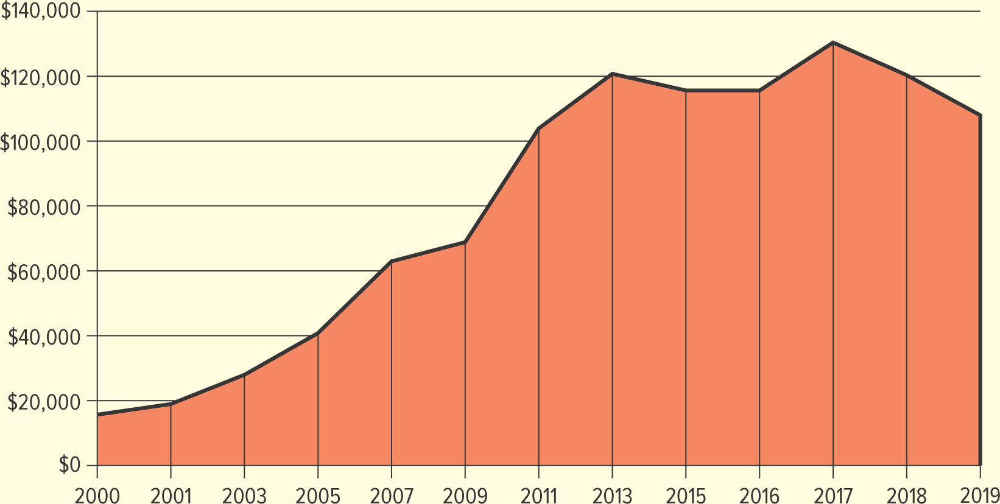

<h1 id="Chapter_3._Business_in_a_Borderless_World" style="color:#42A5F5;">Indice</h1>

---
##### [Capitulo LO 3-1 THE ROLE OF INTERNATIONAL BUSINESS](#669639)

##### [Capitulo LO 3-2 INTERNATIONAL TRADE BARRIERS](#924122)
---

<h1 id="669639" style="color:#E65100;">
  <a href="#Chapter_3._Business_in_a_Borderless_World" style="color:inherit; text-decoration:none;">
    LO 3-1 THE ROLE OF INTERNATIONAL BUSINESS

  </a>
</h1>

Explore some of the factors within the international trade environment that influence business.

## Summary

**International business** refers to the **buying, selling, and trading of goods and services across national boundaries**.

Falling **trade barriers** and advances in **technology** have made it possible for many companies to sell their products both **domestically and internationally**. As differences among nations decrease, the **globalization of business** continues to grow in importance.

Companies that **export products** usually:
- Grow faster  
- Are less likely to go out of business  

The **internet** and the development of **mobile applications** have also made it easier for companies to enter **global markets** without opening physical stores.

For example, **Amazon** has distribution centers from **Nevada to Germany** that ship millions of orders every day to customers around the world.

Another important fact is that **most of the world’s population and two-thirds of its purchasing power are outside the United States**, which makes international markets very important for businesses.

**Global marketing** requires balancing a company’s **global brand** with the **needs of local consumers**. For instance, outside the United States, **China and Europe are Apple’s largest markets**.

International sales also influence the **economies of the countries involved**. For example:
- **Taco Bell** selling a burrito in **Sri Lanka**
- **Sony** selling a television in **Tokyo**

Additionally, the **United States represents only about 4.2% of the world’s population**, which means companies must consider global markets when planning their marketing strategies.

To understand international business, it is also important to study several key economic concepts:

- **Why nations trade**
- **Exporting**
- **Importing**
- **Balance of trade**

# Why Nations Trade

Nations and businesses engage in **international trade** to obtain raw materials and goods that are not available in their country or that can be purchased at a **lower cost** from other countries.

Countries sell **materials, goods, and services** in order to buy the products, services, and ideas their people need.

For example, countries like **Ethiopia, Cameroon, and Kenya** trade with Western nations to obtain **technology and techniques** that help improve and develop their economies.

The goods and services a country sells depend on:
- The **resources** it has available
- Its ability to **compete in global markets**

---

## Absolute Advantage

An **absolute advantage** exists when a country is the **most efficient producer of a specific product**.

Example:
- **Tequila** is produced mainly in **Jalisco, Mexico**, giving Mexico an advantage in its production.

---

## Comparative Advantage

Most international trade is based on **comparative advantage**.

A **comparative advantage** occurs when a country specializes in producing goods or services that it can produce **more efficiently or at a lower cost** than other products.

Examples:

- **France** has a comparative advantage in **wine production** due to its agriculture, reputation, and experienced winemakers.
- **Saudi Arabia** has a comparative advantage in **oil production** because it takes **1 hour** to produce a barrel of oil, while it takes **2 hours** in the United States.

Some countries such as **India and Ireland** are gaining a comparative advantage in services like:

- Customer support
- Engineering
- Software programming

---

## Outsourcing

Because of lower costs in other countries, many companies practice **outsourcing**, which means transferring manufacturing or services to countries where **labor and supplies are cheaper**.

Outsourcing has become controversial in the United States because many jobs have moved overseas.

Example:
- **Nike** outsources production to **nearly 500 factories in 38 countries**, including:
  - China
  - Thailand
  - South Korea
  - Vietnam
  - India

# Trade Between Countries

To obtain needed goods and services, nations trade by **exporting** and **importing**.

## Exporting
**Exporting** is the **sale of goods and services to foreign markets**.

U.S. businesses export many products and services, especially:
- **Agricultural products**
- **Entertainment** (movies, television shows, etc.)
- **Technological products**

## Importing
**Importing** is the **purchase of goods and services from foreign sources**.

Many of the products people buy in the **United States** are imported or contain **imported components**. Sometimes consumers may not even realize that the products they buy come from other countries.

## U.S. Trade Activity
- The **United States exports more than $2.5 trillion** in goods and services each year.
- The **United States imports more than $3.4 trillion** in goods and services annually.

---

## Did You Know?

The **largest companies in the world by revenue** include:

1. Walmart (United States)
2. Amazon (United States)
3. State Grid (China)
4. China National Petroleum (China)
5. Sinopec Group (China)

# Balance of Trade

## Definition

A nation's **balance of trade** is the **difference in value between its exports and imports**.

- When a country **imports more than it exports**, it has a **negative balance of trade**, also called a **trade deficit**.
- When a country **exports more than it imports**, it has a **favorable balance of trade**, also called a **trade surplus**.

---

## U.S. Trade Deficit

The **United States has a trade deficit** because it imports more products than it exports.  
Although U.S. exports to countries like **China** have increased, imports from China are still higher.

The trade deficit changes over time depending on factors such as:

- The health of the U.S. and global economies
- Productivity
- Product quality
- Exchange rates

Trade deficits can be harmful because they may lead to:

- Business failures
- Job losses
- A lower standard of living

---

## U.S. Trade Deficit Over Time (Billions of Dollars)

| Year | Exports | Imports | Trade Surplus / Deficit |
|-----|--------|--------|-------------------------|
| 2010 | 1,853.0 | 2,348.3 | -495.2 |
| 2015 | 2,266.7 | 2,765.2 | -498.5 |
| 2016 | 2,215.8 | 2,718.8 | -503.0 |
| 2017 | 2,352.5 | 2,902.7 | -550.1 |
| 2018 | 2,508.8 | 3,129.0 | -627.7 |
| 2019 | 2,498.0 | 3,114.5 | -616.4 |
| 2020 | 2,131.9 | 2,810.6 | -678.7 |
| 2021 | 2,556.6 | 3,401.7 | -845.0 |

---

## Top Countries with U.S. Trade Deficits

1. China  
2. Mexico  
3. Vietnam  
4. Canada  
5. Germany  
6. Japan  
7. Ireland  
8. Taiwan  
9. Thailand  
10. South Korea  

---

## Countries with U.S. Trade Surpluses

1. Netherlands  
2. Hong Kong  
3. Brazil  
4. Singapore  
5. Australia  
6. United Arab Emirates  
7. United Kingdom  
8. Panama  
9. Belgium  
10. Chile  

---

## Balance of Payments

The **balance of payments** is the **difference between the flow of money coming into and leaving a country**.

It includes:

- Balance of trade
- Foreign investments
- Foreign aid
- Loans
- Military spending
- Money spent by tourists

A country with a **trade surplus** usually has a **favorable balance of payments** because more money is coming into the country.

If a country has a **trade deficit**, more money flows **out of the country**, which may lead to:

- Lower production
- Higher unemployment
- Less money available for spending

<h2>
US Exports to China(millons of US dollars)

</h2>
</img>

<h1 id="924122" style="color:#E65100;">
  <a href="#Chapter_3._Business_in_a_Borderless_World" style="color:inherit; text-decoration:none;">
    LO 3-2 INTERNATIONAL TRADE BARRIERS

  </a>
</h1>

**Assess some of the economic, ethical, legal, political, social, cultural, and technological barriers to international business.**

Completely free trade seldom exists. When a company decides to do business outside its own country, it will encounter a number of **barriers to international trade**.  

Any firm considering international business must research the other country's:

- Economic factors  
- Ethical standards  
- Legal regulations  
- Political environment  
- Social structure  
- Cultural norms  
- Technological capabilities  

This research helps a company choose an appropriate **level of involvement** and **operating strategies**.

---

## Economic Barriers

Managers must consider basic economic factors such as:

- **Economic development**  
- **Infrastructure**  
- **Exchange rates**

---

### Economic Development

- Not all countries are as economically advanced as industrialized nations like **the United States, Japan, the United Kingdom, and Canada**.  
- Many countries in **Africa, Asia, and South America** are less economically advanced and are often called **least-developed countries (LDCs)**.  
- LDCs are characterized by **low per-capita income**, meaning consumers are less likely to purchase nonessential products.  
- Despite this, LDCs represent a **potentially huge and profitable market**, especially for products that improve **infrastructure, health, and technology**.  
- Examples of LDCs: **Afghanistan, Bhutan, Cambodia, Haiti, Madagascar, Sierra Leone, Uganda**.

A country’s development level is partly determined by its **infrastructure**:

- Communication systems  
- Transportation networks  
- Education and healthcare systems  
- Utilities  

When doing business in LDCs, companies may need to **adapt to rudimentary distribution and communication systems** or **lack of technology**.

---

### Exchange Rates

- The **exchange rate** is the ratio at which one nation’s currency can be exchanged for another.  
- Exchange rates fluctuate daily and affect the **cost of imports and exports**.  

**Example:**

- If the U.S. dollar declines relative to the euro (from $1.30 per euro to $1.10 per euro):
  - **Imports from Europe** become cheaper for U.S. consumers  
  - **U.S. exports** become more expensive for international buyers  

- The **U.S. dollar** is the most frequently used currency in international trade, with **90% of foreign exchange trading** involving the dollar.  

Governments may intentionally **alter the value of their currency** through fiscal policy:

- **Devaluation** lowers the value of a currency relative to others.  
- Devaluation encourages:
  - Sale of domestic goods abroad  
  - Tourism  

**Example:**  
- The **Central Bank of Sudan** devalued its currency to overcome economic crisis and access debt relief.

## Ethical, Legal, and Political Barriers

Companies entering the international marketplace must navigate **complex relationships** among:

- Domestic laws  
- International laws  
- Laws of the host country  

They also face:

- Trade restrictions  
- Changing political climates  
- Different ethical values  

**Example:**  
Following **Russia's invasion of Ukraine**, many U.S. companies exited Russia indefinitely, including:

- Krispy Kreme  
- Roku  
- American Airlines  
- BlackRock  
- Carnival  
- Ford  

Global **legal and ethical requirements** for business are increasing.

---

### Laws and Regulations

- The **United States** has laws and regulations governing U.S. firms engaged in international trade.  
- Commerce and navigation treaties with other nations allow business transactions between **U.S. companies** and **foreign citizens**.  

---

### Case Study: Spotify – Streaming Everywhere

**Spotify**, the world's most popular audio streaming service, aims to **support human creativity** by giving artists a way to earn money and fans access to music.  

- **500+ million users** in **180 markets**  
- Holds about **one-third of the global music streaming market**  
- Competes with **Pandora, Apple Music, YouTube Music, Amazon Music**

**Strategy for Growth:**

- Attract **free, ad-supported users** and convert them to **premium subscribers**  
- Expand internationally, entering markets such as **Russia, Albania, Belarus, Bosnia and Herzegovina, Croatia, Kazakhstan, Kosovo, Moldova, Montenegro, North Macedonia, Serbia, Slovenia, Ukraine**  
- Work with **local distributors and regional partnerships** to act **more local** while maintaining **global reach**

**Political and Legal Challenges:**

- Suspended and eventually **ceased operations in Russia** due to legislation restricting information and freedom of expression  
- In mature markets, Spotify **raises subscription prices** and provides **exclusive content** to maintain revenue and market leadership  

---

### Critical Thinking Answers – Spotify Case Study

1. **How does Spotify attempt to act like a local business?**  
   - Spotify partners with **local distributors** in each market.  
   - Establishes **regional partnerships** to understand local preferences.  
   - Offers content and promotions tailored to **specific countries**, making it feel more **local** to users while maintaining global consistency.

2. **What legal and political issues has Spotify faced?**  
   - **Suspended operations in Russia** due to government legislation restricting access to information and freedom of expression.  
   - Must comply with **domestic laws, international laws, and host country regulations** in every market.  
   - Navigates **trade restrictions, political tensions, and ethical expectations** in various countries.

3. **What are Spotify's strengths as it expands globally?**  
   - **Large user base** of over 500 million across 180 markets.  
   - Holds **about one-third of the global music streaming market**.  
   - Strong **brand recognition** and experience in converting free users to **premium subscribers**.  
   - Ability to balance **global scale** with **local customization**, leveraging partnerships and exclusive content.  
   - Continues to **innovate and adapt pricing strategies** in mature markets to increase revenue.

## Legal Challenges in International Business

When doing business outside the United States, companies face **different laws and legal systems**. Some key points include:

---

### Differences in Legal Rights

- Many legal rights that Americans take for granted may **not exist in other countries**.  
- Firms must **understand and obey the laws of the host country**.  
- Examples of legal restrictions:
  - Limits on the amount of **local currency** that can be taken out or brought into the country  
  - Restrictions on **how foreign companies can operate** within the country  

- Example of regulatory differences:  
  - The U.S. has been slow to adopt **drone regulations for commercial use**, while countries like **Australia, Singapore, and Britain** have regulations that allow drone deliveries to grow quickly.

---

### Intellectual Property and Counterfeiting

- **Copyright and patent laws** vary greatly between countries.  
- Some countries **enforce intellectual property laws strictly**, like China, but controlling counterfeit products can still be very challenging.  

**Global Impact of Counterfeiting:**

- Counterfeit goods cost the global economy **over $500 billion annually** (U.S. Chamber of Commerce).  
- Counterfeits harm:
  - **Sales of legitimate products**  
  - **Company reputations**, especially if the knock-offs are poor quality  
- Nearly **half of all software installed on personal computers worldwide** is **not properly licensed**.  

- In some countries, **laws against counterfeiting may not be enforced sufficiently**, so companies may need to take **extra steps** to protect their products.

---

**Key Takeaway:**  
Businesses engaging in international trade must **adapt to different legal systems**, protect intellectual property proactively, and understand that enforcement may vary by country.

## Tariffs and Trade Restrictions

### Definition

**Tariffs and trade restrictions** are part of a country’s legal structure but can also be influenced by **political reasons**.

---

### Tariffs

- **Import tariff:** A tax on goods imported into a country.  
  - **Fixed tariff:** A set amount per unit of product  
  - **Ad valorem tariff:** Based on the value of the product  

- Citizens may bring a limited amount of merchandise **duty-free** into their country; anything above is taxed.  
  - Example (U.S.): $200, $800, or $1,600 depending on the country visited  

- **Protective tariffs** are often used to **protect domestic industries** by raising the cost of imported goods.  
  - Example: U.S. tariffs on steel to protect domestic steelworks  
  - **Controversial:** Can conflict with free trade and affect consumers

- Tariffs can also be **political tools**, used as sanctions against countries.  

---

### Trade Wars

- Example: U.S.-China trade war  
  - U.S. imposed tariffs on high-tech products  
  - China retaliated with a **25% tariff** on U.S. goods (airplanes, soybeans)  
  - Resulted in shifting trade to neighboring countries like **Vietnam**

- Critics: Tariffs **inhibit free trade and competition**  
- Supporters: Protect domestic industries and jobs, maintain **higher wages**

---

### Exchange Controls

- Restrict the amount of currency that can be **bought or sold**  
- Governments may require businesses to sell foreign currency to **central banks**  
- Helps countries manage **foreign exchange shortages**, especially in **LDCs**

---

### Quotas

- Limit the **number of units** of a product that can be imported  
- Can be established by **government decree or voluntary agreement**  
- Protect domestic industries and jobs but lead to **higher consumer prices**  
- Example: U.S. quotas on garments from Vietnam and China

---

### Embargoes

- Prohibit trade in a particular product or with a specific country  
- Can be imposed for **political, economic, health, or religious reasons**  
- Example: U.S. trade embargo with Cuba (restrictions have varied by administration)  
- Health embargoes restrict **pharmaceuticals, plants, animals**, etc.  
- Religious embargoes may ban products like **alcoholic beverages**

---

### Dumping

- Occurs when a company sells products **below production cost** in foreign markets  
- Reasons for dumping:
  - Quick market entry  
  - Domestic market too small to be efficient  
  - Selling technologically obsolete products  

- Example: Chinese solar panels and mattresses in the U.S.  
  - U.S. imposed duties as high as **1,731%** on dumped mattresses  

- Effect: **Higher prices for consumers** due to quotas, tariffs, or antidumping measures

## Political Barriers to International Business

When firms expand beyond their home country, **political barriers** play a major role and are often unpredictable and unwritten. These barriers arise from government actions, changes in policy, instability, and geopolitical tensions that can significantly affect foreign operations.

---

### Unwritten and Rapidly Changing Political Rules

Unlike formal laws, **political considerations** are often informal and can change suddenly. Governments may:

- Impose **sanctions** on other nations for political reasons  
  - Examples include nations like **Cuba, Iran, Syria, and North Korea** facing economic sanctions due to geopolitical conflicts.
- Enact trade restrictions such as **tariffs, embargoes, or quotas** in response to political events.

These measures are used not just for economic reasons but also as **political tools** to pressure or punish other countries.

---

### Political Instability and Risk

Political instability can create an unfavorable environment for international business. This includes:

- Civil unrest, protests, and regime changes  
- Conflicts and wars  
- Weak governance and corruption  
- Government actions that affect property rights or contracts

Countries with ongoing political turmoil, such as **Iraq, Ukraine, Venezuela, Pakistan, Somalia, and the Democratic Republic of the Congo**, may present **hostile or dangerous environments for foreign firms**.

Instability makes it harder for companies to plan, forecast, and secure investments because governments may suddenly change policies, restrict foreign ownership, or impose new trade controls.

---

### Government Debt and Economic Pressure

Countries at high risk of defaulting on foreign debt — including **Argentina, Ukraine, Tunisia, Ghana, Egypt, and Ecuador** — can also create political barriers. A weak fiscal position often leads to unpredictable policy changes that impact foreign business operations.

---

### Natural Disasters and Political Shocks

Natural disasters can weaken government capacity and contribute to instability. Unexpected changes in political power or widespread crises may lead to hostile attitudes toward foreign investment.

These sudden shocks raise **political risk**, which can harm profitability and business continuity.

---

### Cartels and Political Alliances

Political barriers can also arise through collective actions by groups of nations.

- **Cartels** are alliances of countries or firms that act like a **monopoly**, limiting competition to influence world markets.  
- One of the most famous cartels is **OPEC (Organization of the Petroleum Exporting Countries)**, which was founded to **stabilize and raise global oil prices**, benefiting its member nations economically and politically.

Cartels can create political barriers by controlling supply and pricing, which directly affects trade flows and global market conditions.

---

### Summary

Political barriers to international business include a variety of factors such as:

- Government sanctions and trade restrictions  
- Political instability and regime changes  
- Economic pressure from debt crises  
- Risks from conflicts, violence, and unrest  
- Cartels and alliances that influence global markets

Understanding these barriers helps companies assess **political risk** and plan strategies to enter and operate in international markets successfully.

# Social and Cultural Barriers

Social and cultural differences can significantly affect international business. Ignoring these differences may derail important transactions or harm a company's reputation.

---

### Cultural Sensitivity

- Businesspeople must respect **cultural norms**, which are often **unwritten or inaccurately documented**.  
- Example: **BMW** pulled an ad in the UAE depicting a soccer team stopping their national anthem mid-song, which was considered offensive.  

---

### Language Differences

- Every country has **unique spoken and written languages** and product labeling laws.  
  - Example: **Canada** requires labels in both **English and French**.  
- Literal translations may fail, leading to misunderstandings:  
  - Scandinavian **Electrolux**: "Nothing sucks like an Electrolux"  
  - **Coca-Cola** in China: "Ke-kou-ke-la," meaning "bite the wax tadpole"  
  - **Schweppes Tonic Water** in Italy: translated as "Schweppes Toilet Water"  

- Companies like **Netflix** partner with **local vendors** to ensure translations respect cultural context.

---

### Body Language, Gestures, and Personal Space

- Personal space varies by region:  
  - South America, Middle East, Southern Europe → stand closer  
  - Northern Europe, North America, Asia → stand farther apart  
- Gestures vary and may be offensive in different cultures:  

| Gesture                | Country             |
|------------------------|------------------|
| Thumbs-up              | Iran               |
| Backwards peace sign   | United Kingdom    |
| Pointing with index finger | Malaysia      |
| "OK" sign              | Brazil             |
| "Hang loose" sign      | Italy and Spain   |

- Misinterpreted body language can create **misunderstandings** during negotiations.

---

### Social Norms and Advertising

- Family roles and social expectations influence marketing:  
  - Some countries **prohibit children in ads**  
  - Nontraditional social roles may be poorly received  
- Companies must avoid reinforcing **negative stereotypes**  
  - Example: **Dolce & Gabbana** pulled ads in China after an ad featuring an Asian model eating Italian food with chopsticks was deemed disrespectful and racist

---

### Key Takeaways

- Understanding **social and cultural barriers** is essential for global success.  
- Companies must respect **language, gestures, family roles, and social norms** to avoid offense and protect brand reputation.  
- Cultural sensitivity strengthens **trust, communication, and market acceptance**.

# McDonald's Slow Growth in Vietnam

In 2014, McDonald's entered Vietnam when the country opened trade to foreign companies. Initially, the move seemed successful, with over **400,000 customers visiting in the first month**. McDonald's planned to open more than **100 stores in 10 years**, but nearly a decade later, it has **fewer than 30 restaurants** nationwide.  

The slow growth is largely due to **social, cultural, and market differences** that made the U.S. fast-food model less effective in Vietnam.

---

## Reasons for Slow Growth

### 1. Local Competition and Food Culture

- Traditional Vietnamese food outlets have existed for a long time and are **often faster than McDonald's**.  
- Local vendors dominate the market due to historical factors (e.g., Vietnam War limited foreign access).  
- Vietnamese customers are accustomed to **fresh, local, and inexpensive food**.  

---

### 2. Pricing Strategy

- McDonald's used a **Western pricing model**, which is cheap in the U.S. but **expensive in Vietnam** relative to average monthly income.  
- Local restaurants offer **more diverse and affordable options**, making McDonald's seem like a **luxury brand**.

---

### 3. Menu and Dining Style

- Vietnamese culture favors **family-style meals**, where food is shared among diners rather than individual portions.  
- McDonald's traditional menu focuses on **individual meals**, which does not align with local dining habits.  
- Limited menu items like burgers and fries are less appealing than **shareable dishes**, particularly chicken or rice-based meals.  

- McDonald's has tried to adapt with items like **grilled pork rice with egg**, but overall, **fast food remains less attractive than local vendors**.

---

## Critical Thinking Questions

1. **Why has speed of service not been a competitive advantage in Vietnam?**  
   - Local food outlets are already **faster than McDonald's**, so quick service does not differentiate McDonald's from existing options.

2. **Why has McDonald's pricing strategy not worked in Vietnam?**  
   - The **Western pricing strategy** makes meals expensive for the average Vietnamese consumer, positioning McDonald's as a **luxury brand** instead of an everyday option.

3. **Describe family-style dining and why McDonald's menu conflicts with it.**  
   - **Family-style dining:** Meals are shared among all diners, with dishes placed in the center for everyone to serve themselves.  
   - **Conflict:** McDonald's serves **individual portions** rather than shareable meals, which goes against local eating preferences.

## Social and Cultural Considerations in International Business

Understanding cultural and social norms is crucial for businesses operating internationally. Misunderstanding these norms can lead to **costly mistakes** and strained relationships.

---

### Time Perception

- **Americans** value punctuality; meetings rarely start late.  
- **Mexico and Spain** may start meetings **30 minutes or more late**, which can frustrate foreigners unfamiliar with this custom.  
- Companies must adapt to **local perceptions of time** to avoid misunderstandings.

---

### Observing Holidays and Religious Customs

- Businesses must respect **national and religious holidays**.  
- Example: **Tesco in London** apologized for displaying bacon-flavored Pringles during **Ramadan**, offending Muslim customers.  
- Advertising must also be culturally sensitive:  
  - In **Thailand**, public displays of affection are inappropriate.  
  - In **Middle Eastern countries**, showing the soles of feet is considered disrespectful.  
  - In **Russia**, smiling is reserved for private settings, not business interactions.

---

### Measurement Systems

- Most countries use the **metric system**, while the U.S. uses **English units**.  
- Sellers must **convert packaging, tools, and measurements** for foreign markets:  
  - American products may need **liters or meters** for export.  
  - Japanese products must be converted to **English units** for the U.S. market.  
- Example: **Hyundai and Honda technicians** require metric tools for vehicle repairs.

---

### Minimizing Cultural Mistakes

- Cultural and social misunderstandings can be **humorous but costly**.  
- Businesses should **research local norms, customs, and social behavior** before entering a market.  
- Awareness of these differences helps **build trust, avoid offense, and improve business outcomes**.

## Technological Barriers in International Business

Technological infrastructure varies widely across countries, creating both **opportunities and challenges** for international businesses.

---

### Limited Infrastructure

- Many countries lack the **advanced technological infrastructure** found in the United States.  
- For example, countries like **India, China, and some African nations** have limited private phone lines.  
- Citizens often rely on **wireless communication** through cell phones instead of landlines.

---

### Opportunities from Technology Gaps

- Marketers can **target markets with limited infrastructure** using innovative solutions such as mobile and wireless technologies.  
- Technological gaps create **new avenues for global marketing** and product delivery.

---

### Competition in Technology

- Changing technologies increase **competition**, especially from countries with strong tech industries.  
- Asian technology companies account for **52% of global tech revenue growth**.  
- Example: **At least 90% of smartphones are manufactured in Asia**, highlighting the competitive advantage of regions with robust tech infrastructure.

---

### Key Takeaways

- Businesses must **adapt to local technological capabilities**.  
- **Innovation and flexibility** are essential for entering markets with limited infrastructure.  
- Understanding technological barriers allows companies to **leverage opportunities while staying competitive globally**.

