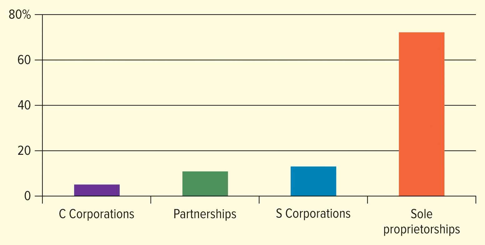

<h1 id="Chapter_4._Options_for_Organizing_Business" style="color:#42A5F5;">Indice</h1>

##### [Capitulo LO 4-1 Sole Proprietorships](#554665)

##### [Capitulo LO 4-2 Partnerships](#850641)

##### [Capitulo LO 4-3 Corporate Form of Organization](#364508)

##### [Capitulo LO 4-4 Other Types of Ownership](#987948)

##### [Capitulo LO 4-5 TRENDS IN BUSINESS OWNERSHIP: MERGERS AND ACQUISITIONS](#624255)

# Chapter 4: Options for Organizing Business

## Introduction
Las empresas deben decidir cómo organizar sus operaciones. La estructura organizacional afecta los impuestos, la responsabilidad, la gestión y la capacidad de reunir capital.

---

La forma jurídica de propiedad que adopta una empresa rara vez preocupa mucho a los clientes.
Por ejemplo, cuando comes en un restaurante, probablemente no te importa si es propiedad de una persona (una empresa unipersonal), de dos o más personas (una sociedad) o de muchos accionistas (una corporación). Lo que más les importa a los clientes es el producto o servicio que reciben.

Sin embargo, para los dueños de negocios, la **forma legal de propiedad es muy importante**. Afecta:

- Cómo opera el negocio.
- Cuánto paga en impuestos
- La responsabilidad de los propietarios.
- ¿Cuánto control tienen los propietarios sobre el negocio?

Este capítulo examina las **tres formas principales de propiedad empresarial**:

1. Empresa unipersonal
2. Asociación
3. Corporación

También introduce otras formas como:

- Corporaciones S
- Sociedades de Responsabilidad Limitada (LLC)
- Cooperativas
- Organizaciones sin fines de lucro

---

# Table 4.1: Various Forms of Business Ownership

| Estructura | Propiedad | Responsabilidad | Impuestos | Usar |
|-----------|-----------|-----------|----------|-----|
| **Propietario único** | un dueño | Responsabilidad ilimitada | Renta individual gravada | Propiedad de una sola persona y es la forma más fácil de realizar negocios. |
| **Asociación** | Dos o más propietarios | Ilimitado (socios generales) | Renta de propietarios individuales gravada | Una forma sencilla para que dos o más personas realicen negocios |
| **Corporación** | Cualquier número de accionistas | Responsabilidad limitada | Sociedad y accionistas gravados (doble imposición) | Una persona jurídica con accionistas o accionistas. |
| **Corporación S** | Hasta 100 accionistas | Responsabilidad limitada | Gravado como sociedad | Una persona jurídica con ventajas fiscales para un número restringido de accionistas |
| **Sociedad de Responsabilidad Limitada (LLC)** | Número ilimitado de miembros | Responsabilidad limitada | Gravado como sociedad | Evita demandas personales y proporciona flexibilidad |

---

# Key Idea

Todas las empresas deben seleccionar la **forma de organización que mejor se adapte a sus necesidades**.
La elección afecta:

- Impuestos
- Responsabilidad jurídica
- Estructura de gestión
- Capacidad de reunir capital.

<h1 id="554665" style="color:#E65100;">
  <a href="#Chapter_4._Options_for_Organizing_Business" style="color:inherit; text-decoration:none;">
LO 4-1 Empresas unipersonales
  </a>
</h1>

Describa las ventajas y desventajas de la forma de organización de propiedad única.

### Sole Proprietorship – Definition
Una **empresa unipersonal** es una empresa propiedad y operada por una persona que recibe todas las ganancias y es responsable de todas las pérdidas y deudas.
Es la **forma de organización empresarial más común en los Estados Unidos**.

### Examples of Sole Proprietorships
Las pequeñas empresas comunes incluyen:

- Restaurantes
- Peluquerías
- Florerías
- casetas para perros
- Tiendas de comestibles independientes.

Muchas grandes corporaciones comenzaron como empresas unipersonales, como por ejemplo:

- Coca-Cola
-Ebay
-Walmart

### Independent Contractor – Definition
Un **contratista independiente** es una persona que realiza un trabajo para otra organización pero **no se considera un empleado**.

Los ejemplos incluyen:

- Conductores de Uber
- Conductores de Lyft
- Anfitriones de Airbnb
- Vendedores directos para empresas como Amway, Mary Kay o Avon

### Service-Based Sole Proprietorships
La mayoría de los propietarios únicos operan **negocios de servicios** en lugar de negocios de manufactura porque la fabricación generalmente requiere grandes cantidades de capital.

Ejemplos:

- Asesoramiento financiero
- Reparación de automóviles
- cuidado de niños
- Pequeñas tiendas minoristas

### Online Opportunities
Plataformas como **Etsy** permiten a los pequeños propietarios abrir tiendas online y vender productos.
Etsy brinda servicios a vendedores y se lleva un porcentaje de cada venta.

### Characteristics of Sole Proprietorships

- Generalmente pequeñas empresas.
- Normalmente emplean a menos de 50 personas.
- Representan alrededor de tres cuartas partes de todas las empresas en los Estados Unidos.

### Recent Trends
Las pequeñas empresas y las empresas unipersonales han aumentado debido a:

- La pandemia de COVID-19
- Despidos de empleo
- La gran renuncia

### Great Resignation – Definition
La **Gran Renuncia** se refiere a un período en el que muchos trabajadores dejaron voluntariamente sus trabajos para buscar otras oportunidades o iniciar sus propios negocios.

</img>

## Advantages of Sole Proprietorships

- Fácil y económico para empezar.
- Control total por parte del propietario.
- El propietario se queda con todas las ganancias.
- Pocas regulaciones gubernamentales

## Disadvantages of Sole Proprietorships

### Unlimited Liability – Definition
El propietario es **personalmente responsable de todas las deudas y obligaciones legales del negocio**.

Otras desventajas:

- Recursos financieros limitados
- Habilidades gerenciales limitadas.
- Vida empresarial ligada al propietario.

Ventajas de las empresas unipersonales
Las empresas unipersonales generalmente están administradas por sus propietarios. Debido a esta sencilla estructura de gestión, el propietario/administrador puede hacer
decisiones rápidamente. Esta es sólo una de las muchas ventajas de la forma de negocio de propiedad única.

## Advantages of Sole Proprietorships

Las empresas unipersonales generalmente están **administradas por sus propietarios**. Gracias a esta sencilla estructura de gestión, el propietario o administrador puede **tomar decisiones rápidamente**. Esta es una de las principales ventajas de la forma de negocio unipersonal.

### Ease and Cost of Formation

Formar una **empresa unipersonal** es relativamente **fácil y económico**. En la mayoría de los casos, las personas pueden establecer una empresa unipersonal **sin presentar documentos legales complejos**.

Es posible que algunas empresas deban presentar un **DBA (Doing Business As)** para registrar el nombre comercial si es **diferente del nombre del propietario**. Otros negocios, como **peluquerías y restaurantes**, pueden requerir **licencias y permisos estatales o locales** debido a la naturaleza de sus operaciones. Estos permisos pueden costar **entre $25 y $100**.

Por lo general, **no se requiere** abogados para iniciar una empresa unipersonal, y el propietario a menudo puede completar la documentación necesaria de forma independiente.

Los emprendedores también deben encontrar un lugar adecuado para operar su negocio, incluso si se trata de un **negocio en línea**. Algunos propietarios inician sus negocios **desde casa**. Muchas empresas famosas comenzaron de esta manera, entre ellas:

- Amazonas
-Microsoft
- Google
-Disney
- Bajo Armadura

Programas como el **programa de vendedores externos de Amazon** permiten a los propietarios independientes vender y enviar productos fácilmente. Muchos contratistas independientes pueden realizar su trabajo utilizando **teléfonos inteligentes o tabletas** mientras viajan.

El correo electrónico y las redes sociales han hecho posible que muchas empresas unipersonales crezcan en el **sector de servicios**. Los propietarios también pueden utilizar muchas herramientas y servicios digitales, como:

- **Zoom** o **Cisco Webex** para videoconferencias
- **Asana** o **Trello** para gestión de proyectos

Estas herramientas ayudan a las pequeñas empresas a operar de manera más eficiente.

### Secrecy

Las empresas unipersonales permiten el **mayor grado de secreto**. El propietario no tiene que discutir públicamente los planes operativos, lo que reduce el riesgo de que los competidores obtengan **secretos comerciales**.

Además, **los informes financieros no tienen que divulgarse públicamente**, a diferencia de los de las corporaciones de propiedad pública.

### Distribution and Use of Profits

Todas las ganancias de una **empresa unipersonal** pertenecen **exclusivamente al propietario**. El propietario no necesita compartir las ganancias con socios o accionistas.

El propietario decide cómo utilizar las ganancias, tales como:

- Ampliar el negocio.
- aumento de salario
- Viajar para comprar inventario adicional
- Invertir en marketing para encontrar nuevos clientes.

### Flexibility and Control of the Business

El **propietario único tiene control total** sobre el negocio y puede tomar decisiones **inmediatamente sin la aprobación de nadie más**. Este control permite al propietario responder rápidamente a **condiciones competitivas o cambios económicos**.

Por ejemplo, el propietario puede rápidamente:

- Cambiar precios
- Modificar productos o servicios
- Adaptarse a la demanda del cliente.

Esta flexibilidad puede darle a la empresa una **ventaja competitiva**. Los servicios de soporte como **FedEx, UPS y otros proveedores externos** se pueden utilizar solo cuando se produce una venta.

### Government Regulation

Las empresas unipersonales generalmente tienen **la mayor libertad respecto de la regulación gubernamental**. Muchas regulaciones a nivel **federal, estatal y local** se aplican solo a empresas con una cierta cantidad de empleados. Además, **las leyes de valores se aplican principalmente a las corporaciones que emiten acciones**.

Sin embargo, los propietarios únicos aún deben seguir todas las leyes que se aplican a su negocio, incluidas:

- Leyes de protección de los empleados.
- Leyes de protección al consumidor.

### Taxation

Seguir **las leyes contables y fiscales** es esencial para los propietarios únicos.

Las ganancias de una empresa unipersonal se tratan como **ingresos personales** y se gravan a la **tasa del impuesto sobre la renta individual**. Esto significa que el propietario paga **un impuesto sobre la renta que incluye tanto los ingresos personales como los comerciales**.

Otra ventaja es que los propietarios únicos pueden establecer **cuentas de jubilación exentas de impuestos o cuentas de participación en las ganancias**. Estas cuentas **no están sujetas a impuestos durante el año en curso**, pero el dinero sí está sujeto a impuestos cuando se retira después de la jubilación.

### Closing the Business

Una empresa unipersonal se puede **cerrar o disolver fácilmente**. El propietario no necesita aprobación de socios o copropietarios.

El único requisito legal es que **todas las obligaciones financieras deben pagarse o liquidarse**. Si el propietario realiza una **venta por cierre del negocio**, la mayoría de los estados exigen que el negocio cierre después.

## Disadvantages of Sole Proprietorships

Lo que una persona puede considerar una ventaja puede resultar una desventaja para otra. Para empresas rentables administradas por propietarios capaces, es posible que muchos de los siguientes factores no causen problemas. Sin embargo, los propietarios que comienzan con **poca experiencia en gestión o recursos financieros limitados** tienen más probabilidades de enfrentar estas desventajas.

### Unlimited Liability

El propietario único tiene **responsabilidad ilimitada** por las deudas de la empresa. Esto significa que si la empresa no puede pagar a sus acreedores, es posible que se le exija al propietario que utilice **bienes personales** (como un automóvil, una casa u otra propiedad) para pagar las deudas.

En la mayoría de los estados, los acreedores pueden reclamar bienes personales incluso si el propietario se declara **en bancarrota**. Cuanta más riqueza personal tenga un individuo, mayor será el riesgo potencial asociado con la responsabilidad ilimitada.

### Limited Sources of Funds

Las empresas unipersonales suelen tener **menos fuentes de financiación** en comparación con otras estructuras empresariales. Las fuentes comunes de fondos incluyen:

- Bancos
- Amigos y familiares
- La **Administración de Pequeñas Empresas (SBA)**
- Los ahorros personales del propietario.

La situación financiera personal del propietario determina su **solvencia crediticia**. Debido a que las pequeñas empresas se consideran de **mayor riesgo**, los bancos pueden cobrar **tasas de interés más altas** que las que se ofrecen a las grandes corporaciones.

Algunos propietarios también utilizan **instituciones financieras no bancarias**, como compañías de microcréditos, que pueden cobrar tasas de interés aún más altas.

En muchos casos, un propietario único debe **promover bienes personales** (como un automóvil, una casa o bienes raíces) como garantía para obtener un préstamo.

El crowdfunding también se ha convertido en una opción popular. Las plataformas incluyen:

- **GoFundMe**
- **Pedal de arranque**
- **Indiegogo**
- **Nuestra multitud**

### Limited Skills

Un propietario único a menudo debe desempeñar **muchas funciones diferentes** en el negocio. Esto requiere habilidades en varias áreas, que incluyen:

- Gestión
- Marketing
- Finanzas
- Contabilidad y teneduría de libros
- Gestión de personal

Si bien los dueños de negocios pueden contratar profesionales como **contadores o abogados** para recibir asesoramiento, las decisiones finales siguen siendo responsabilidad del propietario.

Algunas empresas brindan servicios especializados para ayudar a las pequeñas empresas. Por ejemplo, **Network Solutions** ofrece alojamiento de sitios web, herramientas de creación de sitios web y servicios de marketing online para ayudar a las empresas a crear una presencia online.

### Lack of Continuity

La **esperanza de vida de una empresa unipersonal** está estrechamente relacionada con la **vida del propietario y su capacidad para trabajar**. Si el propietario enferma gravemente o muere, la empresa puede fracasar si no se puede encontrar una gestión competente.

También es difícil **vender una empresa unipersonal** y al mismo tiempo garantizar a los clientes que la empresa seguirá satisfaciendo sus necesidades. Por ejemplo, una **práctica veterinaria** depende en gran medida de la relación entre el veterinario y los pacientes. Si el veterinario muere repentinamente, es posible que se venda el equipo, pero es posible que los clientes no permanezcan leales a la práctica.

Sin embargo, un veterinario que planea jubilarse podría contratar a un **socio más joven** y vender gradualmente la práctica. Este enfoque suele ser más fácil en una **sociedad**, donde los clientes pueden permanecer en la empresa incluso si cambia la propiedad.

### Lack of Qualified Employees

Las pequeñas empresas unipersonales pueden tener dificultades para **atraer y retener empleados calificados**. A menudo no pueden igualar los **salarios y beneficios** que ofrecen las corporaciones más grandes.

Además, puede haber **menos oportunidades de ascenso o avance**, lo que hace que el negocio sea menos atractivo para los empleados potenciales.

Por otro lado, tendencias como la **reducción de personal empresarial y la subcontratación** han creado nuevas oportunidades para que las pequeñas empresas contraten **trabajadores experimentados y bien capacitados**.

### Taxation

Aunque los impuestos pueden ser una ventaja para las empresas unipersonales, también pueden ser una **desventaja dependiendo del nivel de ingresos del propietario**.

Los propietarios únicos deben pagar:

- **Impuesto sobre la renta personal** basado en las ganancias de la empresa y la categoría impositiva del propietario
- **Impuesto sobre el trabajo por cuenta propia** (aproximadamente **15,3%**)
- Otros impuestos posibles, como **impuestos sobre nómina, propiedad, ventas o impuestos especiales**

Sin embargo, las empresas unipersonales **evitan la doble imposición**, que ocurre cuando las ganancias corporativas y los ingresos de los accionistas están sujetos a impuestos en las corporaciones.

En muchos casos, el **impacto fiscal** influye en si un propietario único decide **constituir la empresa**.

<h1 id="850641" style="color:#E65100;">
  <a href="#Chapter_4._Options_for_Organizing_Business" style="color:inherit; text-decoration:none;">
OA 4-2 Asociaciones
  </a>
</h1>
 
Describe los **dos tipos de asociación comercial** y sus **ventajas y desventajas**.

Una forma de reducir las desventajas de una **empresa unipersonal** y aumentar sus ventajas es tener **más de un propietario**.

La mayoría de los estados siguen una ley modelo llamada **Ley Uniforme de Sociedades**, que rige las sociedades. Esta ley define una **sociedad** como:

**Definición:**
Una **sociedad** es *una asociación de dos o más personas que actúan como copropietarios de un negocio con fines de lucro.*

Las asociaciones son la **forma de propiedad empresarial menos utilizada**. Por lo general, son **más grandes que las empresas unipersonales pero más pequeñas que las corporaciones**. Cuando se gestionan bien, las asociaciones pueden ser una forma muy **eficaz y productiva de organización empresarial**.

### Keys to Success in Business Partnerships

Las asociaciones exitosas suelen seguir varios principios importantes:

1. Mantenga una **participación en las ganancias justa y equitativa** según la contribución de cada socio.
2. Los socios deben tener **habilidades o recursos diferentes** que se complementen entre sí.
3. Mantener un **comportamiento ético y cumplimiento legal**.
4. Desarrollar **una comunicación sólida** entre socios.
5. Mantener **transparencia con las partes interesadas**.
6. Sea **realista en cuanto a la gestión financiera y de recursos**.
7. La **experiencia empresarial** previa es útil.
8. Mantenga un **equilibrio saludable entre vida personal y laboral**.
9. Céntrese en **la satisfacción del cliente y la calidad del producto**.
10. Gestionar **recursos según la planificación y el crecimiento de las ventas**.

## Types of Partnership

Hay **dos tipos básicos de sociedad**: **sociedad general** y **sociedad limitada**.

### General Partnership
En una **sociedad general**, todos los socios:

- Participación en la **gestión del negocio**
- Tener **responsabilidad ilimitada** por las deudas del negocio.

**Ejemplos:** Profesionales como abogados, contadores y arquitectos suelen formar sociedades generales.
**Estudio de caso:** Red Bike Capital, un fondo de capital de riesgo liderado por mujeres latinas, está dirigido por dos socios generales, **Rachel ten Brink** y **Herman Goihman**.

### Limited Partnership
Una **sociedad limitada** consta de:

- **Al menos un socio colectivo**, que tenga responsabilidad ilimitada
- **Al menos un socio comanditario**, cuya responsabilidad está **limitada a su inversión**

Puntos clave:

- Las sociedades limitadas se utilizan para **proyectos de inversión riesgosos** donde el potencial de pérdida es alto
- **Los socios colectivos** aceptan el riesgo de pérdida
- **Las pérdidas de los socios comanditarios** tienen un límite de su inversión inicial
- Los socios comanditarios **no administran** el negocio
- Las ganancias se comparten según el **acuerdo de asociación**
- Por lo general, los socios generales reciben una **participación mayor de las ganancias** después de que los socios comanditarios recuperan su inversión inicial.

Una **Sociedad limitada maestra (MLP)** es una **sociedad limitada negociada en bolsas de valores**.
Las MLP combinan **beneficios fiscales de una sociedad limitada** con la **liquidez de una corporación**.

**Ejemplos de MLP:** Compañías de petróleo y gas y operadores de oleoductos

## Articles of Partnership

**Definición:** Los artículos de sociedad son **documentos legales que describen el acuerdo básico entre socios**.

La mayoría de los estados exigen **artículos de sociedad**, pero incluso si no son un requisito legal, es **aconsejable que los socios los creen**.

El contenido típico de los artículos de sociedad incluye:

- **Capital de sociedad** – el dinero o activos aportados por cada socio
- **Roles de gestión**: deberes y responsabilidades individuales de cada socio
- **Distribución de pérdidas y ganancias**: cómo se repartirán las ganancias y pérdidas entre los socios
- **Términos de retiro o salida**: cómo un socio puede abandonar la sociedad
- **Otras restricciones o acuerdos**: cualquier regla o condición adicional que se aplique a la asociación

Estos artículos ayudan a garantizar **claridad, equidad y protección legal** para todos los socios involucrados.

### Issues and Provisions in Articles of Partnership

La Tabla 4.3 describe los elementos clave que **deben incluirse en los estatutos**:

1. **Nombre, Propósito, Ubicación** – El nombre oficial de la sociedad, su propósito comercial y ubicación de operaciones.
2. **Duración del Acuerdo** – Cuánto durará la asociación
3. **Autoridad y Responsabilidad de Cada Socio** – Funciones y deberes de gestión de cada socio
4. **Carácter de los Socios** – Socios colectivos o comanditarios; socios activos o silenciosos
5. **Cantidad de contribución de cada socio** – Capital, activos o recursos aportados
6. **División de ganancias o pérdidas**: cómo se repartirán las ganancias y pérdidas
7. **Salarios de Cada Socio** – Compensación por el trabajo realizado
8. **Retiros**: cuánto puede retirar cada socio del negocio.
9. **Muerte del Socio** – Trámites si un socio fallece
10. **Venta de intereses de la sociedad** – Reglas para vender la participación de un socio
11. **Arbitraje de Disputas** – Proceso para resolver desacuerdos
12. **Acciones requeridas y prohibidas** – Lo que los socios deben o no deben hacer
13. **Ausencia e Incapacidad** – Procedimientos por incapacidad temporal o permanente
14. **Convenios restrictivos**: acuerdos que restringen ciertas acciones, por ejemplo, cláusulas de no competencia
15. **Acuerdos de compra y venta**: términos para comprar o vender intereses de sociedad

Estas disposiciones garantizan **claridad, equidad y protección legal** para todos los socios.

## Entrepreneur Case Study: Shizu Okusa

Shizu Okusa es **fundador y director ejecutivo de Apothekary**, una empresa de salud y bienestar basada en plantas que vende alternativas naturales y de origen ético a los productos farmacéuticos, incluidas hierbas, especias y tés. Nacida en **Vancouver, Columbia Británica**, Okusa comenzó a trabajar en el restaurante de sushi de sus padres y luego siguió una carrera en **finanzas** antes de convertirse en empresaria.

Okusa cofundó **JRINK**, una empresa de jugos prensados ​​en frío, en 2014 con **Jennifer Ngai**. La empresa comenzó como un **servicio de entrega de jugos** y luego se expandió a **tiendas físicas**. Se beneficiaron de las ventajas de una **asociación**, que combinaba **dinero, conocimientos y habilidades**, pero enfrentaron desafíos cuando Ngai abandonó la asociación, lo que provocó que Okusa perdiera un valioso **socio de pensamiento**.

Durante la **pandemia de COVID-19**, JRINK enfrentó cierres de tiendas y cambió su enfoque a la **entrega en línea**, mientras Okusa ampliaba su segundo negocio, **Boticario**. Recaudó millones de dólares de **inversores** para financiar:

- **Expansión global** (operando en más de 20 países)
- **Adquisición de talento** (profesionales de marketing, asesores, creadores de contenido, pasantes, etc.)
- **Innovación y desarrollo de productos**

Okusa se centra en el **crecimiento sostenible** y cree que **hacer crecer un negocio es un maratón, no una carrera corta**. Su experiencia como fundadora por segunda vez fortaleció sus **habilidades de liderazgo**, incluidas **delegar, tomar decisiones y recopilar comentarios**.

### Critical Thinking Questions

1. **Ventajas y desventajas de la asociación**
   - **Ventajas:** Combinar recursos, habilidades y conocimientos con un socio; responsabilidad y carga de trabajo compartidas.
   - **Desventajas:** Perder un socio (Ngai salió) puede resultar en la pérdida de un valioso socio de pensamiento y apoyo en la toma de decisiones.

2. **Uso de fondos de inversores**
   - **Expansión global** a más de 20 países
   - **Contratación de empleados** en funciones de marketing, creación de contenido y asesoramiento.
   - **Financiación de la innovación y el desarrollo de productos**

3. **Crecimiento empresarial**
   - Fortalecimiento de **habilidades de liderazgo** como delegación, toma de decisiones y recopilación de comentarios.
   - Aprendí a centrarme en el **crecimiento sostenible** en lugar de la rápida expansión.
   - Adquirí experiencia en la gestión de **operaciones de comercio electrónico y minoristas**

## Advantages of Partnerships

Las asociaciones ofrecen varias ventajas en comparación con otras formas de organización empresarial, aunque no todas las ventajas se aplican a todas las asociaciones.

### Ease of Organization
Iniciar una asociación es relativamente sencillo. El requisito principal es **redactar estatutos**. No se necesitan estatutos legales, pero el **nombre comercial debe estar registrado** en el estado.

### Availability of Capital and Credit
Con múltiples socios, una empresa se beneficia de:

- **Recursos financieros combinados**
- **Diversos talentos y habilidades**
- **Mayor potencial de ingresos** y **mejores calificaciones crediticias**

Si bien algunas sociedades se forman principalmente con fines fiscales, las sociedades profesionales como las de abogados, contabilidad y empresas de inversión pueden generar **ganancias significativas**.
**Ejemplo:** Kirkland & Ellis, un bufete de abogados de Chicago, gana más de **4.800 millones de dólares al año**, lo que proporciona grandes ingresos a sus socios.

### Combined Knowledge and Skills
Las asociaciones exitosas aprovechan la **experiencia especializada** de cada socio, evitando confusión y conflicto. Las áreas de especialización pueden incluir:

- Marketing
- Producción
- Contabilidad
- Servicio

Esto permite que el negocio sea administrado por un **equipo de especialistas** en lugar de un solo generalista.
**Ejemplo:** Latham & Watkins, una firma de abogados con más de 3200 abogados en todo el mundo, comenzó como una sociedad entre Dana Latham (derecho fiscal) y Paul Watkins (derecho laboral).

Los clientes a menudo perciben que **equipos diversos y especializados** brindan **servicios de mayor calidad** en comparación con un propietario único.

### Decision Making
- **Las asociaciones pequeñas** pueden reaccionar rápidamente a los cambios porque los socios están **involucrados en las operaciones diarias**.
- **Las asociaciones grandes** pueden experimentar una toma de decisiones más lenta debido a la cantidad de socios, pero algunas aun así tienen éxito.
**Ejemplo:** Ernst & Young, una de las firmas de contabilidad más grandes de EE. UU., tiene casi 4000 socios y sigue teniendo un gran éxito.

### Regulatory Controls
Las asociaciones enfrentan **menos controles regulatorios** que las corporaciones:

- No es necesario presentar **estados financieros públicos** ni enviar **informes trimestrales** a miles de accionistas.
- Debe cumplir con **leyes específicas de la industria**, así como con **regulaciones estatales y federales** relacionadas con:
  - Informes financieros
  - Protección de los empleados
  - Protección al consumidor
  - Normativas medioambientales

Esto hace que las asociaciones sean **más simples de operar** en comparación con grandes corporaciones como Intel o Ford Motor Co.

## Disadvantages of Partnerships

Aunque las asociaciones ofrecen muchas ventajas, también conllevan varias desventajas que pueden afectar la estabilidad y el éxito del negocio.

### Unlimited Liability
En las **sociedades generales**, todos los socios generales tienen **responsabilidad ilimitada** por las deudas comerciales. Esto significa:

- Los bienes personales pueden utilizarse para satisfacer obligaciones comerciales.
- Un socio con mayor riqueza personal puede enfrentar un riesgo mayor
- Los socios comanditarios no se ven afectados, ya que sus pérdidas se limitan a su inversión inicial.

### Responsibilities and Conflicts
- Todos los socios son **responsables de las acciones** realizadas por cualquier socio
- Un solo socio puede comprometer la asociación a celebrar contratos, poniendo potencialmente a otros en riesgo.
- Los problemas personales, como el divorcio, pueden afectar los recursos financieros de la pareja y debilitar la sociedad.
- Las diferencias en **estilo, compromiso y habilidades de gestión** pueden crear conflictos que dañan el negocio.

### Life of the Partnership
- Una sociedad **termina cuando un socio muere o se retira**
- El socio restante puede enfrentarse a perturbaciones, pérdida de habilidades de gestión y reducción de financiación.
- Las asociaciones grandes pueden tener **disposiciones en los estatutos** para minimizar el impacto
- Vender una participación social puede tener efectos similares; determinar un **valor razonable** puede ser difícil sin métodos predefinidos

### Distribution of Profits
- Las ganancias se distribuyen de acuerdo con el **estatuto social**
- Si la participación en las ganancias no refleja la contribución de cada socio, puede causar **tensión o insatisfacción**
- Los socios descontentos pueden afectar negativamente la **rentabilidad y las operaciones** del negocio.

### Limited Sources of Funds
- Las asociaciones pueden enfrentar **limitaciones de financiación**, similares a las de las empresas unipersonales.
- Las acciones de la sociedad no se pueden vender fácilmente en los mercados públicos, lo que puede desalentar a los inversores potenciales.
- Recaudar suficiente capital para operaciones a gran escala o inversiones costosas puede resultar difícil
- Los bancos pueden cobrar **tasas de interés más altas** porque las sociedades se consideran **más riesgosas** que las corporaciones

## Taxation of Partnerships

Las asociaciones se consideran **organizaciones cuasi sujetas a impuestos**, lo que significa:

- **La sociedad en sí no paga impuestos sobre la renta** al presentar una declaración de impuestos ante el IRS
- La declaración de impuestos **reporta la rentabilidad** y la **distribución de ganancias entre socios**
- Cada socio **declara su participación en las ganancias** en su **declaración de impuestos individual** y paga impuestos a la **tasa del impuesto sobre la renta personal**

**Nota:** Las Master Limited Partnerships (MLP) tienen requisitos adicionales y deben presentar **informes financieros similares a los de las corporaciones**.

<h1 id="364508" style="color:#E65100;">
  <a href="#Chapter_4._Options_for_Organizing_Business" style="color:inherit; text-decoration:none;">
OA 4-3 Forma corporativa de organización
  </a>
</h1>

Una **corporación** es una **entidad legal creada por el estado** cuyos activos y pasivos están **separados de sus propietarios**. Como entidad legal, una corporación tiene muchos de los derechos, deberes y poderes de una persona, incluyendo:

- El derecho a **poseer, recibir y transferir propiedades**
- La capacidad de **celebrar contratos** con individuos u otras entidades
- La capacidad de **demandar y ser demandado ante los tribunales**

Las corporaciones representan la **mayoría de todas las ventas e ingresos de Estados Unidos**, por lo que la mayor parte del dinero de los consumidores se destina a empresas constituidas. Las corporaciones pueden ser **grandes empresas multinacionales** (por ejemplo, General Electric, Procter & Gamble) o **empresas más pequeñas** que se constituyen como **Corporaciones S** para mayor flexibilidad.

### Ownership and Stockholders
- Las corporaciones son **propiedad de muchos accionistas**, quienes poseen **acciones**
- Los accionistas pueden **comprar, vender, donar o heredar acciones**
- Los accionistas tienen derecho a **ganancias después de pagar las obligaciones**, generalmente distribuidas como **dividendos**
- Las corporaciones también pueden **retener ganancias** para expandir el negocio

**Ejemplo de distribución de dividendos:**
Si una corporación gana $100 millones después de impuestos y gastos y paga $40 millones en dividendos, los accionistas reciben **40% de las ganancias como dividendos en efectivo**.

**Los mayores pagadores de dividendos del mundo (2022)**

| Rango | Compañía |
|------|---------|
| 1 | Grupo BHP |
| 2 | Microsoft Corp. |
| 3 | Riotinto plc |
| 4 | Electrónica Samsung |
| 5 | AT&T, Inc. |
| 6 | Exxon Mobil Corp. |
| 7 | manzana inc. |
| 9 | Vale S.A. |
| 10 | Banco de Construcción de China Corp. |
| 11 | Fortescue Metals Group Ltd. |

Algunas empresas, como **AutoZone, Biogen y VeriSign**, **retienen ganancias** en lugar de pagar dividendos para financiar la expansión.

## Creating a Corporation

Una corporación se **crea (constituye) según la ley estatal**. Las personas que forman la corporación se denominan **incorporadores**. Cada estado tiene procedimientos específicos, a menudo denominados **constitución de la corporación**.

- **Incorporadores mínimos:** La mayoría de los estados requieren al menos tres
- **Nombre corporativo:** Debe ser único y generalmente terminar con **“Compañía”, “Corporación”, “Constituida” o “Limitada”** para indicar responsabilidad limitada.

### Articles of Incorporation
Los incorporadores presentan **artículos de incorporación** ante el estado (generalmente el Secretario de Estado), que incluyen:

1. Nombre y dirección de la sociedad
2. Objetivos de la corporación
3. Clases de acciones (comunes, preferentes, con derecho a voto, sin derecho a voto) y número de acciones
4. Vida esperada de la corporación (típicamente indefinida)
5. Capital financiero requerido al momento de la constitución
6. Disposiciones para la transferencia de acciones entre propietarios
7. Reglamento de asuntos internos corporativos
8. Dirección del domicilio social
9. Nombres y direcciones de la junta directiva inicial
10. Nombres y direcciones de los incorporadores

### Corporate Charter and Bylaws
- Después de la presentación, el estado emite un **estatuto corporativo**
- Los propietarios realizan una **reunión organizativa** para:
  - Establecer **estatutos corporativos**
  - Elegir una **junta directiva**
  - Formar **comités** y definir reglas para las operaciones corporativas.

## Types of Corporations

Las corporaciones se pueden clasificar según **dónde operan** y **estructura de propiedad**:

### Based on Location
- **Corporación nacional:** Opera en el estado donde está constituida
- **Corporación extranjera:** Opera en estados distintos a donde está constituida
- **Corporación extranjera:** Opera fuera del país en el que está constituida.

### Based on Ownership
- **Corporación Privada:**
  - Propiedad de uno o varios individuos, a menudo una familia.
  - Los propietarios participan estrechamente en la gestión del negocio.
  - Las acciones **no se venden públicamente**
  - Las corporaciones de propiedad privada pueden ser grandes (por ejemplo, Publix Super Markets, la tercera empresa privada más grande de EE. UU. con ingresos de 48 mil millones de dólares).
  - No está obligado a revelar públicamente información financiera, pero debe pagar impuestos.

### America's Largest Private Companies by Revenue (2022)

| Rango | Compañía | Ingresos (en miles de millones) | Empleados | Industria |
|------|---------------------------------|--------------------|-----------|---------------------------------------|
| 1 | Cargill | $165 | 155.000 | comida y bebida |
| 2 | Industrias Koch | $125 | 120.000 | multiempresa |
| 3 | Supermercados Publix | $48 | 230.000 | Mercados de alimentos |
| 4 | Marte | $45 | 140.000 | comida y bebida |
| 5 | Empresa piloto | $42 | 30.000 | Tiendas de conveniencia y gasolineras. |
| 6 | HEB | $39 | 145.000 | Mercados de alimentos |
| 7 | Reyes Holdings | $35 | 33.000 | Comida, bebida y tabaco. |
| 8 | Tiendas de comestibles mayoristas de C&S | $33 | 14.000 | Comida, bebida y tabaco. |
| 9 | Participaciones empresariales | $30 | 80.000 | Servicios |
| 10 | Paradas de viaje del amor y tiendas rurales | $26 | 38.000 | Tiendas de conveniencia y gasolineras. |

*Fuente: Andrea Murphy, "America's Largest Private Companies", Forbes, 2022, www.forbes.com/lists/largest-private-companies/?sh=ac71de4bac44 (consultado el 25 de enero de 2023)*

### Public Corporations

Una corporación pública es una empresa cuyas acciones pueden ser compradas, vendidas o comercializadas por cualquier persona. Miles de empresas multinacionales influyen significativamente en los mercados globales. Por ejemplo, empresas como **IBM, McDonald's, Caterpillar y Yum! Las marcas** obtienen más de la mitad de sus ingresos de operaciones internacionales.

- Muchas corporaciones públicas más pequeñas en los EE. UU. tienen ventas anuales inferiores a 10 millones de dólares.
- En grandes corporaciones públicas como **AT&T**, los accionistas pueden estar muy alejados de la gestión de la empresa.
- En los demás casos, los fundadores o los accionistas mayoritarios podrán seguir administrando la empresa. Por ejemplo, **el director ejecutivo de Tesla, Elon Musk**, posee el 13,4% del total de acciones de Tesla.

Las corporaciones de propiedad pública están obligadas a revelar información financiera al público según las leyes que regulan el comercio de acciones y otros valores.

### American Companies with More Than Half of Their Revenues from Outside the United States

| Compañía | Descripción |
|------------------|--------------------------------------------------------------------------------------------------|
| Caterpillar Inc. | Diseña, fabrica, comercializa y vende maquinaria, motores y productos financieros. |
| Química Dow | Fabrica productos químicos, con productos que incluyen plásticos, petróleo y tecnología agrícola. |
| electricidad general | Opera en infraestructura tecnológica, energía, financiación de capital y campos de consumo/industriales; Los productos incluyen electrodomésticos, locomotoras, armas, iluminación y gas. |
| motores generales | Vende automóviles con marcas que incluyen Chevrolet, Buick, Cadillac e Isuzu. |
| IBM | Realiza investigaciones tecnológicas, desarrolla propiedad intelectual, incluido software y hardware, y ofrece servicios de consultoría. |
| Intel | Fabrica y desarrolla chips semiconductores y microprocesadores. |
| McDonald's | Opera la segunda cadena de restaurantes de comida rápida más grande del mundo después de Subway. |
| Nike | Diseña, desarrolla, comercializa y vende calzado y ropa deportivos. |
| Procter & Gamble | Vende bienes de consumo con marcas que incluyen Tide, Bounty, Crest e Iams. |
| ¡Mmm! Marcas | Opera y otorga licencias para restaurantes, incluidos Taco Bell, Kentucky Fried Chicken y Pizza Hut. |

### Private Corporations Going Public and Taking Private

**Salir a bolsa (IPO):**
- Una corporación privada puede necesitar más capital para expansión u oportunidades.
- La empresa puede vender acciones a través de una **Oferta Pública Inicial (IPO)**, convirtiéndose en una corporación pública.
- Ejemplo: Después de la muerte de Adolph Coors, su familia vendió acciones públicamente para pagar impuestos sobre el patrimonio.

**Hacer privada una corporación:**
- Las corporaciones públicas pueden convertirse en privadas cuando los individuos (a menudo la administración) compran todas las acciones en circulación.
- Beneficios: Más control, flexibilidad para reestructurar, evitar presiones de los precios de las acciones.
- Ejemplo: Michael Dell hizo que Dell fuera privado para redirigir la empresa y luego volvió a cotizar en bolsa.
- Esto también puede evitar adquisiciones no deseadas.

### Quasi-Public Corporations
- Propiedad y operación de entidades gubernamentales (federal, estatal o local).
- Objetivo principal: Proporcionar servicios a los ciudadanos en lugar de obtener beneficios.
- A menudo operan con pérdidas.
- Ejemplos:
  - **NASA** (Administración Nacional de Aeronáutica y del Espacio)
  - **A NOSOTROS. Servicio Postal**

### Nonprofit Corporations
- Centrarse en el servicio más que en las ganancias, no ser propiedad del gobierno.
- Financiado por donaciones, subvenciones y honorarios por servicios.
- Todas las ganancias se reinvierten en la misión de la organización.
- Ejemplos:
  - **Taller Sésamo**
  - **Cruz Roja Americana**
  - **Feeding America** (más de $4 mil millones en donaciones privadas y $4,2 mil millones de ingresos totales)
  - **Habitat for Humanity** (financiado por ubicaciones de ReStore que venden productos con descuento)
- La mayoría son organizaciones **501(c)(3)**, que:
  - Recibir exenciones de impuestos.
  - Permitir a los donantes reducir las contribuciones sujetas a impuestos.
  - Debe presentar formularios de impuestos federales para rendir cuentas.
- Tipos de organizaciones 501(c)(3):
  - Organizaciones benéficas públicas (por ejemplo, Leukemia & Lymphoma Society)
  - Fundaciones privadas (por ejemplo, Daniels Fund)
  - Fundaciones operativas privadas (por ejemplo, campamentos diurnos para niños desfavorecidos)

## Elements of a Corporation: 

### The Board of Directors

#### Role and Responsibilities
- Elegido por **accionistas** para supervisar las operaciones de la corporación.
- Establecer **objetivos a largo plazo** y garantizar que se cumplan a tiempo.
- Contratar **funcionarios corporativos** (por ejemplo, presidente, director ejecutivo) que gestionen las operaciones diarias.
- Garantizar que la gestión evite el mal uso de los fondos.
- Tener un **deber de diligencia** (tomar decisiones informadas) y un **deber de lealtad** (actuar en el mejor interés de la corporación).

#### Historical Context
- El papel ganó importancia después de los **escándalos contables** de principios de la década de 2000.
- La **Ley Sarbanes-Oxley** aumentó las expectativas de supervisión.
- Las corporaciones han reestructurado la **compensación** de los directores para atraer experiencia.

#### Director Compensation
- Salario medio: **$245.000 anuales**.
- Algunas empresas imponen **límites de compensación anual**.
- Existe la preocupación de que los salarios excesivos puedan reducir la eficacia de la gobernanza.

#### Types of Directors
- **Directores internos:** Empleados de la empresa, generalmente funcionarios corporativos que dirigen las operaciones diarias.
- **Directores Externos:** No afiliados a la empresa; puede incluir ejecutivos de otras firmas, abogados, banqueros o profesores.
  - Aportar **independencia** y perspectivas diversas.
  - Ayudar a prevenir conflictos de intereses.
  - Puede mejorar el seguimiento y prevenir escándalos corporativos.

#### Challenges in Board Composition
- Escasez de **miembros calificados de la junta directiva**.
- Los directores ejecutivos están cada vez más **centrados en su propia empresa**, lo que reduce la participación en juntas directivas externas.
  - El CEO promedio ahora forma parte de **menos de una junta directiva externa**, en comparación con dos hace una década.
- Estrategias para mantener los tableros de calidad:
  - Aumentar la **edad de jubilación obligatoria** a 72-75+.
  - Limitar la superposición entre directores en múltiples juntas directivas para reducir los conflictos de intereses.

### Elements of a Corporation: Stock Ownership

Las corporaciones emiten **dos tipos de acciones**: **acciones preferentes** y **acciones ordinarias**.

---

#### Preferred Stock
- Los propietarios son una **clase especial de accionistas**.
- **Sin derecho a voto** en la gestión corporativa.
- **Reclamo de prioridad sobre utilidades** ante los accionistas comunes.
- **Dividendos**:
  - Generalmente un porcentaje fijo del precio de emisión inicial.
  - Pagado trimestralmente.
  - Ejemplo: acción de 100 dólares con dividendo del 5% → 5 dólares al año.
  - Las acciones más preferentes conllevan **dividendos acumulativos**:
    - Si los dividendos no se pagan en un año debido a pérdidas, se **acumulan** para pago futuro.
- A los accionistas preferentes se les debe pagar **antes de que los accionistas comunes** reciban dividendos.

---

#### Common Stock
- **Propietarios con derecho a voto** de la corporación.
- **Derecho a votar** en:
  - Miembros del consejo de administración.
  - Otras decisiones corporativas importantes.
- Los dividendos varían con la rentabilidad; algunas corporaciones **reinvierten ganancias** en lugar de emitir dividendos.
- **Detalles de votación**:
  - Generalmente **un voto por acción**.
  - Puede votar **por poder** (autorizar a otra persona a votar).
  - Ejemplo: el consejo de administración de Procter & Gamble en 2023 tenía como directores a ejecutivos de grandes empresas.
- **Derechos de preferencia**:
  - Los accionistas comunes a menudo tienen el **primer derecho a comprar nuevas acciones** para mantener su porcentaje de propiedad.
  - Importante cuando se emiten nuevas acciones para preservar la propiedad proporcional.
- Los accionistas comunes tienen **más influencia en las operaciones corporativas** en comparación con los accionistas preferentes debido a los derechos de voto y de preferencia.

---

#### Summary Comparison

| Característica | Acciones preferentes | Acciones ordinarias |
|-------------------------------|----------------------------|-----------------------------|
| Derechos de voto | No | Sí |
| Prioridad de dividendos | Pagado primero | Pagado después de preferido |
| Monto del dividendo | Fijo, a menudo acumulativo | Variable, depende de las ganancias. |
| Derechos de preferencia | No | Sí |
| Influencia en la gestión | Mínimo | Significativo |

## Advantages of Corporations

### 1. Limited Liability
- La corporación es una **entidad legal separada**.
- Los accionistas **no son personalmente responsables** de las deudas corporativas.
- Las pérdidas generalmente **se limitan al monto invertido** en la corporación.
- Los acreedores no pueden reclamar los bienes personales de los accionistas, incluso si la corporación quiebra.
- Raras excepciones: los propietarios privados pueden pignorar activos personales para garantizar préstamos corporativos.

### 2. Ease of Transfer of Ownership
- Los accionistas pueden **comprar, vender o intercambiar acciones** sin afectar la existencia de la corporación.
- Las transferencias de propiedad **no requieren aprobación** de otros accionistas (a menos que se trate de una participación mayoritaria).
- Las operaciones diarias y de largo plazo **continúan ininterrumpidamente** a pesar de los cambios de propiedad.

### 3. Perpetual Life
- Las corporaciones están **constituidas para existir indefinidamente**, a menos que los estatutos establezcan lo contrario.
- La muerte o retiro de los accionistas **no afecta a la sociedad**.
- La sociedad continúa hasta que se **vende, se liquida o quiebra**.
- La quiebra ocurre cuando una empresa **no puede operar de manera rentable** y puede buscar protección o reorganización en los tribunales.

### 4. External Sources of Funds
- Las corporaciones públicas **pueden recaudar dinero más fácilmente** que otras formas de negocios.
- Pueden **vender acciones adicionales** o emitir **bonos** para atraer inversiones de fuentes nacionales e internacionales.
- Las corporaciones más grandes tienen **más opciones de financiación** disponibles.

### 5. Expansion Potential
- Las corporaciones pueden **expandirse a nivel nacional o internacional** gracias al acceso a financiamiento a largo plazo.
- Como entidad jurídica separada, una corporación puede **celebrar contratos fácilmente**, lo que facilita el crecimiento y las asociaciones.

## Disadvantages of Corporations

### 1. Double Taxation
- Las corporaciones pagan **impuestos como entidades legales** sobre sus ganancias (21% en los EE. UU., ~24% en promedio global).
- Cuando las ganancias se pagan como **dividendos**, los accionistas pagan **impuesto sobre la renta nuevamente**, lo que resulta en una doble imposición.
- Otras formas comerciales como sociedades o empresas unipersonales **no enfrentan doble imposición**.

### 2. Cost of Forming a Corporation
- Crear una corporación puede resultar **caro**:
  - Requiere un estatuto corporativo, honorarios de abogados y tasas de presentación estatales ($25–$150).
  - Algunos estados exigen una **tarifa anual** para mantener la carta.
- Los servicios en línea (por ejemplo, LegalZoom.com) simplifican la constitución pero pueden **aumentar el riesgo de elegir la forma comercial incorrecta**.

### 3. Disclosure of Information
- Las corporaciones deben proporcionar información a los accionistas a través de **informes anuales**.
  - Los informes incluyen ganancias, ventas, deudas, operaciones, productos y planes futuros.
- **Las corporaciones públicas** deben presentar informes ante la **SEC**, haciendo que los datos sean accesibles a los competidores.
- Cumplir con estas leyes de divulgación **requiere tiempo y recursos**.

### Employee-Owner Separation

- En muchas corporaciones, **los empleados no son accionistas**, lo que crea una separación entre propiedad y trabajo.
- Esto puede llevar a los empleados a sentir que su trabajo **beneficia sólo a los propietarios**, lo que reduce la motivación o el compromiso.
- Es posible que los empleados sin propiedad no comprendan la **importancia de las ganancias** para la salud de la empresa.
- Cuando los gerentes **son copropietarios** pero otros empleados no, se puede crear **tensión en las relaciones entre la dirección y los trabajadores**.
- **Los planes de propiedad de acciones para empleados (ESOP)** pueden mitigar este problema:
  - Los empleados reciben acciones de la empresa.
  - Crea una **asociación entre empleados y propietarios**.
  - Puede **aumentar la productividad** ya que los empleados están motivados tanto por los salarios como por los dividendos potenciales.

<h1 id="987948" style="color:#E65100;">
  <a href="#Chapter_4._Options_for_Organizing_Business" style="color:inherit; text-decoration:none;">
LO 4-4 Otros tipos de propiedad
  </a>
</h1>

Describa otros tipos de propiedad, incluidas empresas conjuntas, corporaciones S, compañías de responsabilidad limitada y cooperativas.

Esta sección cubre las empresas constituidas con fines especiales:

# AT&T and BlackRock Fiber-Optic Joint Venture

## Summary
AT&T Inc. se asoció con BlackRock Inc. para formar **Gigapower LLC**, una empresa conjunta destinada a expandir los servicios de banda ancha de fibra óptica a estados en los que AT&T no prestaba servicios anteriormente. La empresa llegará inicialmente a **1,5 millones de ubicaciones de clientes**.

- Empresas de servicios inalámbricos como **T-Mobile y Verizon** están invirtiendo en **servicios de Internet residencial**.
- Los operadores de cable como **Comcast y Charter Communications** están ingresando a los **servicios de telefonía celular**.
- AT&T vendió sus activos de medios para **centrarse en servicios básicos**, incluida la banda ancha de fibra óptica.

La **Ley Bipartidista de Infraestructura** proporciona **$42.5 mil millones** en fondos federales para conectar áreas desatendidas, lo que motiva a AT&T a expandir su red. La expansión de la fibra óptica es costosa, por lo que AT&T se asoció con **BlackRock**, que aporta recursos financieros y experiencia en inversiones. Gigapower prestará servicios a **ISP y empresas de todo el país**, compitiendo con importantes empresas de tecnología como Alphabet y Microsoft.

---

## Critical Thinking Questions & Answers

1. **¿Cómo intentan crecer las empresas de servicios inalámbricos y los operadores de cable?**
   - Las empresas de servicios inalámbricos están invirtiendo en **servicios de Internet residencial**.
   - Los operadores de cable se están expandiendo hacia **servicios de telefonía celular**.
   - Ambos están **cruzando los mercados del otro** para aumentar los clientes y los ingresos.

2. **¿Por qué AT&T está invirtiendo en fibra óptica?**
   - Lograr un **crecimiento a largo plazo** en Internet de alta velocidad.
   - Ampliarse a **áreas desatendidas** con apoyo federal.
   - Proporcionar **conectividad rápida y confiable** y competir con otros proveedores.

3. **¿Por qué AT&T estableció una empresa conjunta?**
   - **Compartir los altos costos iniciales** de la implementación de fibra con BlackRock.
   - Aprovechar **experiencia y recursos financieros**.
   - Para **expandirnos más rápido y más eficientemente**.
   - **gobernar conjuntamente** el emprendimiento, reduciendo el riesgo y maximizando el potencial de crecimiento.

# Other Types of Ownership

## Joint Ventures
Una **empresa conjunta (JV)** es una asociación creada para un **proyecto específico** o por un **tiempo limitado**.
- Los socios pueden ser **individuos u organizaciones**.
- El control puede ser **compartido equitativamente** o dominado por un socio.
- Común en situaciones que requieren **grandes inversiones**, como la extracción de recursos naturales o el desarrollo de nuevos productos.
- Puede ocurrir entre **empresas y gobiernos**.
- Ejemplo: JPMorgan Chase & Co. se asoció con Haven Realty Capital para desarrollar **mil millones de dólares en viviendas de alquiler en los suburbios**.

---

## S Corporations
Una **corporación S** es una estructura empresarial **que se grava como una sociedad**.
- **Las ganancias o pérdidas netas** pasan a los propietarios, evitando la doble imposición.
- Los propietarios conservan **responsabilidad limitada**.
- Popular entre los empresarios; casi **la mitad de todas las presentaciones corporativas** son corporaciones S.

**Ventajas:**
- Impuestos simples
- Responsabilidad limitada para los accionistas.
- vida perpetua
- Capacidad para transferir ingresos y apreciación.

**Desventajas:**
- Limitado a **100 accionistas**
- Los accionistas deben ser personas físicas, sucesiones o ciertos fideicomisos.
- Más difícil de constituir y operar en comparación con otras pequeñas empresas

---

## Limited Liability Companies (LLCs)
Una **LLC** proporciona **responsabilidad limitada** como una corporación, pero **paga impuestos como una sociedad**.
- Puede ser **unimiembro** o **multimiembro**.
- Popular entre los profesionales (abogados, médicos, ingenieros).
- Combina beneficios de **corporaciones, sociedades y empresas unipersonales**.

**Ventajas:**
- Protege los bienes personales de los miembros en caso de demandas
- Flexible y simple de operar
- No hay necesidad de reuniones formales, actas o resoluciones.

**Ejemplo:** Venmo es una LLC.

## Cooperatives (Co-ops)

Una **cooperativa** es una organización formada por **individuos o pequeñas empresas** que se unen para obtener los beneficios de una organización más grande.

### Key Features
- Las cooperativas existen **para beneficiar a los miembros**, no principalmente para obtener ganancias.
- Las ganancias suelen ser mínimas y destinadas únicamente al mantenimiento de la cooperativa.
- Los miembros pueden ser **consumidores, agricultores o pequeñas empresas**.

### Examples
- **Berkshire Co-op Market** – cooperativa de tiendas de comestibles en Massachusetts
- **Ocean Spray** – cooperativa de productores de arándanos
- **REI** – propiedad de consumidores en lugar de productores

### Benefits of Cooperatives
- Compre suministros en **grandes cantidades** para ahorrar costos
- **Distribuir eficientemente los productos de los miembros**
- Proporcionar **apoyo de publicidad y marketing**
- Reducir costes y aumentar la **eficiencia** mediante la gestión colectiva

**Ejemplo:** Ace Hardware permite a las ferreterías independientes agrupar recursos, compartir ahorros y acceder a publicidad que tal vez no podrían permitirse individualmente.

<h1 id="624255" style="color:#E65100;">
  <a href="#Chapter_4._Options_for_Organizing_Business" style="color:inherit; text-decoration:none;">
OA 4-5 TENDENCIAS EN PROPIEDAD DE EMPRESAS: FUSIONES Y
ADQUISICIONES
  </a>
</h1>

Evalúe las **ventajas y desventajas** de fusiones, adquisiciones y compras apalancadas.

### Growth Through Mergers and Acquisitions
- Las empresas crecen no sólo vendiendo nuevos productos o entrando en nuevos mercados sino también combinándose o comprando otras empresas.

### Mergers
- **Definición:** Dos empresas se combinan para formar una **nueva empresa**.
- **Ejemplo:** Discovery y WarnerMedia de AT&T se fusionaron para formar **Warner Bros. Discovery** (acuerdo por 43 mil millones de dólares).

### Acquisitions
- **Definición:** Una empresa **compra otra**, generalmente comprando la mayor parte de sus acciones.
- La sociedad adquirida podrá:
  - Convertirse en una **subsidiaria** del comprador, o
  - Que sus operaciones **fusionen** con las del comprador.
- **Ejemplo:** Amazon adquirió **Zoox**, una empresa de robotaxi autónomo, como filial.

### Government Regulation
- Las fusiones y adquisiciones pueden ser **escrutadas** para evitar monopolios.
- **Ejemplo:** La FTC bloqueó la adquisición de Within Unlimited por parte de Meta para proteger la competencia.

### Risks of Acquisitions
- Las **culturas organizacionales** desalineadas pueden causar una integración deficiente.
- Algunas adquisiciones pueden involucrar solo **una división o parte** de una empresa.
- **Ejemplos de adquisiciones desafiantes:** Amazon y Whole Foods, Google y Nest.

### Additional Notes
- Las fusiones crean una **nueva entidad**, mientras que las adquisiciones integran una empresa existente en otra.
- Las fusiones y adquisiciones cuidadosamente planificadas pueden mejorar **la rentabilidad y el alcance del mercado**, pero una mala ejecución puede perjudicar a la empresa adquirente.

**Tabla 4.7** (Las fusiones más grandes de todos los tiempos) – Referencia para cifras detalladas.

## Table 4.7: The Largest Mergers of All Time

| Rango | Adquiridor | Objetivo | Valor de transacción (en miles de millones) |
|------|-----------------------|------------------|--------------------------------|
| 1 | Vodafone | Mannesmann AG | $180 |
| 2 | América en línea (AOL) | TimeWarner | $165 |
| 3 | Comunicaciones de Verizon | Vodafone | $130 |
| 4 | Química Dow | DuPont | $130 |
| 5 | Tecnologías Unidas | Raytheon | $121 |

## Mergers and Acquisitions Activity Accelerates

Las empresas pueden crecer no sólo desarrollando nuevos productos o vendiendo productos existentes a nuevos clientes, sino también fusionándose o adquiriendo otras empresas. La actividad de fusiones y adquisiciones (M&A) ha alcanzado más de 5 billones de dólares en los últimos años, impulsada por una mayor confianza económica y la presión de los inversores por el crecimiento.

Las cinco empresas tecnológicas más grandes de Estados Unidos (Amazon, Alphabet, Microsoft, Apple y Meta (las cinco grandes)) invierten mucho en la adquisición de empresas más pequeñas y de nuevas empresas. Las adquisiciones permiten a estas empresas obtener activos valiosos, reducir costos y aumentar la participación de mercado más rápidamente que la creación de equipos internos. Las adquisiciones recientes incluyen:

- **Amazon**: Selz (startup de comercio electrónico)
- **Google/Alphabet**: Pointy (inicio de hardware)
- **Meta**: GIPHY (motor de búsqueda de GIF)
- **Apple**: múltiples startups, incluida una aplicación meteorológica, reconocimiento de voz y realidad virtual
- **Microsoft**: startups de ciberseguridad IoT y nube 5G

Los Cinco Grandes se centran en tecnologías emergentes como la IA, blockchain, robótica, realidad virtual, realidad aumentada y 5G.

La actividad de fusiones y adquisiciones puede aumentar los precios de las acciones y el valor de mercado, beneficiando a los accionistas y mejorando la competitividad global. Sin embargo, no todas las adquisiciones tienen éxito. Un mal ajuste estratégico o cultural puede llevar a desinversiones o cierres, como el cierre de Amazon de Diapers.com después de que no logró volverse rentable rápidamente.

### Critical Thinking Questions and Answers

1. **¿Por qué empresas como las Cinco Grandes adquieren otras empresas?**
Adquieren otras empresas para obtener activos valiosos, reducir costos, aumentar la participación de mercado y acceder a tecnologías emergentes más rápidamente que si las desarrollaran internamente.

2. **¿Qué ha impulsado las fusiones y adquisiciones en los últimos años?**
El aumento de la confianza económica y la presión de los inversores por el crecimiento han impulsado una mayor actividad de fusiones y adquisiciones.

3. **¿Por qué a veces fracasan las adquisiciones? Proporcione un ejemplo.**
Las adquisiciones fracasan cuando las empresas no encajan estratégica o culturalmente. Ejemplo: Amazon cerró Diapers.com porque no se volvió rentable con la suficiente rapidez.

## Types of Mergers and Acquisitions

### Horizontal Merger
- Ocurre cuando se fusionan empresas que fabrican y venden productos similares a los mismos clientes.
- Ejemplo: **Martin Marietta** y **Lockheed** se fusionaron para formar **Lockheed Martin**.
- Reduce la competencia en la industria, por lo que los reguladores federales revisan cuidadosamente estas fusiones.

### Vertical Merger
- Ocurre cuando se fusionan empresas de niveles diferentes pero relacionados de una industria.
- A menudo implica la fusión de una corporación con un proveedor o cliente.
- Ejemplo: si **Burger King** comprara una gran granja de patatas en Idaho para asegurar el suministro de patatas fritas, sería una fusión vertical.

### Conglomerate Merger
- Implica la fusión de empresas de industrias no relacionadas.
- Ejemplo: **Berkshire Hathaway** posee **GEICO** (seguros), **Dairy Queen** (alimentos), **BNSF Railway** (ferrocarril) y **Benjamin Moore** (pintura).

### Takeovers and Tender Offers
- Un **invasor corporativo** puede intentar adquirir otra empresa ofreciendo comprar sus acciones con una prima (**oferta pública**).
- Puede ser **amistoso** (ambas partes están de acuerdo) u **hostil** (la empresa objetivo se resiste).
- Las estrategias de defensa contra adquisiciones hostiles incluyen:
  - Pedir a los accionistas que no vendan
  - Presentación de demandas
  - Usar una **píldora venenosa** (que permite a los accionistas comprar acciones a un precio inferior al de mercado)
  - Repelentes de tiburones (requieren la aprobación de una gran mayoría de accionistas)
  - Buscando un **caballero blanco** (un adquirente más amigable)
  - Hacer privada la empresa o aumentar la deuda para disuadir al asaltante.

### Leveraged Buyout (LBO)
- Un grupo de inversores pide dinero prestado para adquirir una empresa o división, utilizando los activos de la empresa adquirida para garantizar el préstamo.
- Hasta el 95% del precio de compra se puede financiar mediante fondos prestados.
- Ejemplo: **Elon Musk** adquirió Twitter mediante una LBO.

### Motivations for Mergers and Acquisitions
- Obtener una mayor **cuota de mercado**
- Adquirir **activos valiosos** como productos, plantas o equipos.
- Menores **costos operativos**
- Beneficios de **empresas infravaloradas**
- Aprovechar la **desregulación** para consolidar industrias (por ejemplo, banca y aerolíneas)

**Nota histórica:**
- Las décadas de 1980 y 1990 presenciaron una explosión de fusiones, adquisiciones y LBO, lo que llevó a los periodistas financieros a acuñar el término **“manía por las fusiones”.**

## Building Your Soft Skills: Handling Conflict

La gestión de conflictos es una habilidad blanda fundamental, especialmente en asociaciones y entornos de equipos. La resolución eficaz de conflictos puede mejorar la comunicación, la colaboración y la productividad general.

### Five Guidelines for Handling Conflict
1. **Mantenga la calma y escuche activamente**
   - Concéntrese en comprender todas las perspectivas antes de responder.
   - Evite reaccionar emocionalmente, lo que puede agravar el conflicto.

2. **Comunícate de forma clara y respetuosa**
   - Utilice declaraciones en primera persona en lugar de lenguaje de culpa.
   - Sea conciso y evite suposiciones sobre los motivos de la otra parte.

3. **Identifique la causa raíz**
   - Comprender los problemas subyacentes en lugar de centrarse sólo en los desacuerdos superficiales.
   - Hacer preguntas y aclarar inquietudes para encontrar puntos en común.

4. **Busque soluciones beneficiosas para todos**
   - Buscar compromisos o soluciones creativas que satisfagan a ambas partes.
   - Evite el pensamiento de suma cero que sólo beneficia a una de las partes.

5. **Acuerde un plan y realice un seguimiento**
   - Documentar cualquier resolución o acuerdo para garantizar la rendición de cuentas.
   - Revisar el tema si es necesario para evitar conflictos recurrentes.

---

## Mergers and Acquisitions: Soft Skills and Considerations

### Benefits of Mergers and Acquisitions
- Puede **impulsar los precios de las acciones** y aumentar el valor para los accionistas.
- Mejorar la capacidad de una empresa para **competir globalmente**.
- Optimice las operaciones, **reduzca el personal innecesario** y reduzca costos.

### Risks and Criticisms
- La dirección puede centrarse en evitar adquisiciones en lugar de gestionar el negocio.
- Las pesadas cargas de deuda para evitar adquisiciones pueden llevar a la **quiebra** durante las crisis económicas.
- Las fusiones pueden perjudicar **la moral de los empleados, la productividad y la calidad del producto**.

### Industry Trends
- Los objetivos probables para fusiones y adquisiciones incluyen:
  - Utilidades
  - Telecomunicaciones
  - Servicios financieros
  - Recursos naturales
  - Hardware y software informático
  - Juegos
  - Atención sanitaria gestionada
  - Tecnología

---

### Team Exercise
- Formar grupos e investigar ejemplos de fusiones y adquisiciones.
- Incluir:
  - Tipo de fusión: tradicional, horizontal o conglomerado
  - Duración de la fusión/adquisición
  - Requisitos de aprobación gubernamental
  - Fusiones fallidas o bloqueadas
  - Metas y resultados esperados de las empresas.
- Presentar los hallazgos a la clase, destacando lo que las empresas esperaban obtener.
- Practicar la colaboración y la negociación mediante ejercicios de role-play.

# Are You Ready to Start a Business?

El espíritu empresarial está creciendo rápidamente en los Estados Unidos. Los emprendedores buscan oportunidades y formas creativas de obtener ganancias. Las empresas pueden adoptar varias formas organizativas, cada una con sus propias ventajas y desventajas.

---

## Sole Proprietorships
- **Definición:** Una empresa propiedad y administrada por una sola persona.
- **Ejemplos:** Peluquerías, tiendas de buceo, proveedores de productos orgánicos, asesores financieros.
  - Fácil de gestionar: el propietario-gerente toma decisiones rápidamente.
  - Fácil y económico de configurar; normalmente sólo se necesita una licencia estatal.
- **Desventajas:**
  - Responsabilidad personal ilimitada por deudas empresariales.
  - El negocio termina si el propietario fallece.

---

## Partnerships
- **Definición:** Un negocio propiedad de dos o más personas.
- **Tipos:**
  - **Sociedad General:** Todos los socios administran el negocio, comparten ganancias y deudas, con responsabilidad ilimitada.
  - **Sociedad en Comandita:** Al menos un socio general administra el negocio; Los socios comanditarios invierten sin administrar, limitando su riesgo al monto invertido.
- **Ventajas:**
  - Combina habilidades y recursos de múltiples propietarios.
  - Utilidades compartidas entre los socios.
- **Desventajas:**
  - Los socios son responsables de las acciones de los demás.
  - La empresa puede disolverse por muerte de un socio.
- **Mejores prácticas:**
  - Redacción de estatutos para definir responsabilidades y reducir conflictos.

---

## Corporations
- **Definición:** Una entidad jurídica separada de sus propietarios. Puede ser pequeño (familiar) o grande.
- **Propiedad:** Los accionistas poseen la corporación a través de acciones.
- **Ventajas:**
  - Responsabilidad limitada: los fondos personales de los propietarios están protegidos.
  - Vida perpetua: la corporación continúa incluso si los propietarios cambian.
  - Puede recaudar dinero más fácilmente vendiendo acciones.
- **Desventajas:**
  - La formación es compleja: debe presentarla ante el estado.
  - Doble imposición: beneficios gravados tanto a nivel empresarial como individual.
- **Tipos:**
  - **Corporación Privada:** Acciones en poder de unos pocos individuos; no cotiza en bolsa.
  - **Corporación Pública:** Acciones vendidas al público y negociadas en mercados.

---

No importa qué forma de organización se adapte a su idea, existen muchas opciones para explorar y experimentar con el emprendimiento.
