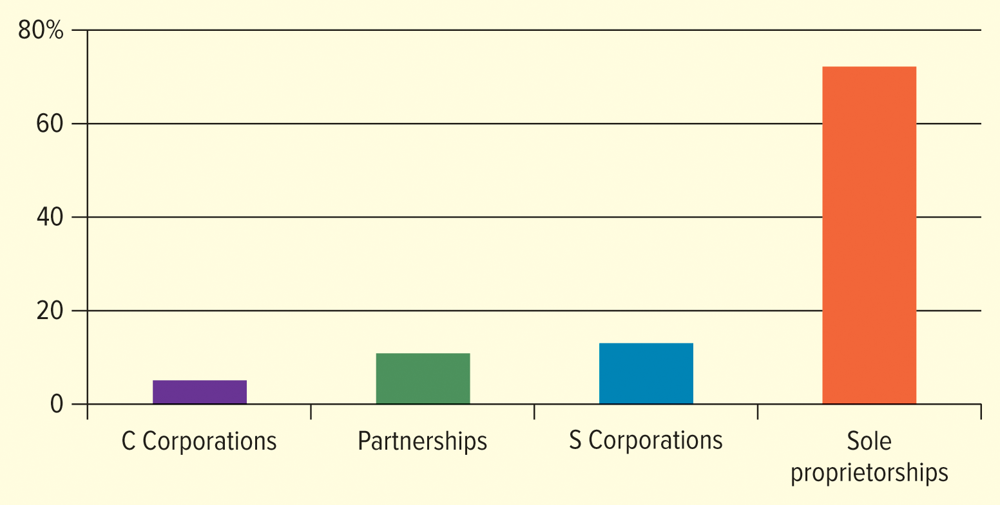

<h1 id="Chapter_4._Options_for_Organizing_Business" style="color:#42A5F5;">Indice</h1>

##### [Capitulo LO 4-1 Sole Proprietorships](#554665)

##### [Capitulo LO 4-2 Partnerships](#850641)

##### [Capitulo LO 4-3 Corporate Form of Organization](#364508)

##### [Capitulo LO 4-4 Other Types of Ownership](#987948)

##### [Capitulo LO 4-5 TRENDS IN BUSINESS OWNERSHIP: MERGERS AND ACQUISITIONS](#624255)

# Chapter 4: Options for Organizing Business

## Introduction
Businesses must decide how to organize their operations. The organizational structure affects taxation, liability, management, and the ability to raise capital.

---

The legal form of ownership taken by a business is seldom of great concern to customers.  
For example, when you eat at a restaurant, you probably don't care whether it is owned by one person (a sole proprietorship), by two or more people (a partnership), or by many shareholders (a corporation). What matters most to customers is the product or service they receive.

However, for business owners, the **legal form of ownership is very important**. It affects:

- How the business operates
- How much it pays in taxes
- The liability of the owners
- How much control owners have over the business

This chapter examines the **three primary forms of business ownership**:

1. Sole Proprietorship  
2. Partnership  
3. Corporation  

It also introduces other forms such as:

- S Corporations  
- Limited Liability Companies (LLCs)  
- Cooperatives  
- Nonprofit organizations  

---

# Table 4.1: Various Forms of Business Ownership

| Structure | Ownership | Liability | Taxation | Use |
|-----------|-----------|-----------|----------|-----|
| **Sole Proprietorship** | One owner | Unlimited liability | Individual income taxed | Owned by a single individual and is the easiest way to conduct business |
| **Partnership** | Two or more owners | Unlimited (general partners) | Individual owners' income taxed | Easy way for two or more individuals to conduct business |
| **Corporation** | Any number of shareholders | Limited liability | Corporation and shareholders taxed (double taxation) | A legal entity with shareholders or stockholders |
| **S Corporation** | Up to 100 shareholders | Limited liability | Taxed as a partnership | A legal entity with tax advantages for a restricted number of shareholders |
| **Limited Liability Company (LLC)** | Unlimited number of members | Limited liability | Taxed as a partnership | Avoids personal lawsuits and provides flexibility |

---

# Key Idea

All businesses must select the **form of organization that best fits their needs**.  
The choice affects:

- Taxes  
- Legal responsibility  
- Management structure  
- Ability to raise capital  

<h1 id="554665" style="color:#E65100;">
  <a href="#Chapter_4._Options_for_Organizing_Business" style="color:inherit; text-decoration:none;">
    LO 4-1 Sole Proprietorships
  </a>
</h1>

Describe the advantages and disadvantages of the sole proprietorship form of organization.

### Sole Proprietorship – Definition
A **sole proprietorship** is a business owned and operated by one individual who receives all profits and is responsible for all losses and debts.  
It is the **most common form of business organization in the United States**.

### Examples of Sole Proprietorships
Common small businesses include:

- Restaurants
- Hair salons
- Flower shops
- Dog kennels
- Independent grocery stores

Many large corporations started as sole proprietorships, such as:

- Coca-Cola  
- eBay  
- Walmart  

### Independent Contractor – Definition
An **independent contractor** is a person who performs work for another organization but is **not considered an employee**.

Examples include:

- Uber drivers  
- Lyft drivers  
- Airbnb hosts  
- Direct sellers for companies such as Amway, Mary Kay, or Avon  

### Service-Based Sole Proprietorships
Most sole proprietors operate **service businesses** rather than manufacturing businesses because manufacturing usually requires large amounts of capital.

Examples:

- Financial counseling  
- Automobile repair  
- Child care  
- Small retail stores  

### Online Opportunities
Platforms such as **Etsy** allow small proprietors to open online stores and sell products.  
Etsy provides services to sellers and takes a percentage of each sale.

### Characteristics of Sole Proprietorships

- Usually small businesses  
- Typically employ fewer than 50 people  
- Represent about three-fourths of all businesses in the United States  

### Recent Trends
Small businesses and sole proprietorships have increased due to:

- The COVID-19 pandemic  
- Job layoffs  
- The Great Resignation  

### Great Resignation – Definition
The **Great Resignation** refers to a period when many workers voluntarily left their jobs to pursue other opportunities or start their own businesses.

</img>

## Advantages of Sole Proprietorships

- Easy and inexpensive to start  
- Full control by the owner  
- Owner keeps all profits  
- Few government regulations  

## Disadvantages of Sole Proprietorships

### Unlimited Liability – Definition
The owner is **personally responsible for all debts and legal obligations of the business**.

Other disadvantages:

- Limited financial resources  
- Limited managerial skills  
- Business life tied to the owner  

Advantages of Sole Proprietorships
Sole proprictorships are generally managed by their owners. Because of this simple management structure, the owner/ manager can make
decisions quickly. This is just one of many advantages of the sole proprictorship form of business.

## Advantages of Sole Proprietorships

Sole proprietorships are generally **managed by their owners**. Because of this simple management structure, the owner or manager can **make decisions quickly**. This is one of the main advantages of the sole proprietorship form of business.

### Ease and Cost of Formation

Forming a **sole proprietorship** is relatively **easy and inexpensive**. In most cases, individuals can establish a sole proprietorship **without filing complex legal documents**.

Some proprietorships may need to file a **DBA (Doing Business As)** to register the business name if it is **different from the owner's name**. Other businesses, such as **barber shops and restaurants**, may require **state or local licenses and permits** because of the nature of their operations. These permits may cost **between $25 and $100**.

Lawyers are usually **not required** to start a sole proprietorship, and the owner can often complete the necessary paperwork independently.

Entrepreneurs must also find a suitable place to operate their business, even if it is an **online business**. Some proprietors start their businesses **from home**. Many famous companies began this way, including:

- Amazon  
- Microsoft  
- Google  
- Disney  
- Under Armour  

Programs such as **Amazon’s third-party seller program** allow independent proprietors to sell and ship products easily. Many independent contractors can perform their work using **smartphones or tablets** while traveling.

Email and social networks have made it possible for many sole proprietorships to grow in the **service sector**. Proprietors can also use many digital tools and services, such as:

- **Zoom** or **Cisco Webex** for videoconferencing  
- **Asana** or **Trello** for project management  

These tools help small businesses operate more efficiently.

### Secrecy

Sole proprietorships allow the **greatest degree of secrecy**. The owner does not have to publicly discuss operating plans, reducing the risk that competitors might obtain **trade secrets**.

In addition, **financial reports do not have to be publicly disclosed**, unlike those of publicly owned corporations.

### Distribution and Use of Profits

All profits from a **sole proprietorship** belong **exclusively to the owner**. The owner does not need to share profits with partners or shareholders.

The owner decides how to use the profits, such as:

- Expanding the business  
- Increasing salary  
- Traveling to purchase additional inventory  
- Investing in marketing to find new customers  

### Flexibility and Control of the Business

The **sole proprietor has complete control** over the business and can make decisions **immediately without anyone else's approval**. This control allows the owner to respond quickly to **competitive conditions or economic changes**.

For example, the owner can quickly:

- Change prices
- Modify products or services
- Adapt to customer demand

This flexibility can give the business a **competitive advantage**. Supporting services such as **FedEx, UPS, and other third-party providers** may be used only when a sale occurs.

### Government Regulation

Sole proprietorships generally have the **most freedom from government regulation**. Many regulations at the **federal, state, and local levels** apply only to businesses with a certain number of employees. Additionally, **securities laws apply mainly to corporations that issue stock**.

However, sole proprietors must still follow all laws that apply to their business, including:

- Employee protection laws  
- Consumer protection laws  

### Taxation

Following **accounting and tax laws** is essential for sole proprietors.

Profits from a sole proprietorship are treated as **personal income** and are taxed at the **individual income tax rate**. This means the owner pays **one income tax that includes both personal and business income**.

Another advantage is that sole proprietors may establish **tax-exempt retirement accounts or profit-sharing accounts**. These accounts are **not taxed in the current year**, but the money is taxed when it is withdrawn after retirement.

### Closing the Business

A sole proprietorship can be **closed or dissolved easily**. The owner does not need approval from partners or co-owners.

The only legal requirement is that **all financial obligations must be paid or settled**. If the owner holds a **going-out-of-business sale**, most states require that the business actually close afterward.

## Disadvantages of Sole Proprietorships

What may be seen as an advantage by one person may turn out to be a disadvantage to another. For profitable businesses managed by capable owners, many of the following factors may not cause problems. However, proprietors who start with **little management experience or limited financial resources** are more likely to face these disadvantages.

### Unlimited Liability

The sole proprietor has **unlimited liability** for the debts of the business. This means that if the business cannot pay its creditors, the owner may be required to use **personal assets**—such as a car, home, or other property—to pay the debts.

In most states, creditors can claim personal property even if the owner declares **bankruptcy**. The more personal wealth an individual has, the greater the potential risk associated with unlimited liability.

### Limited Sources of Funds

Sole proprietorships usually have **fewer sources of funding** compared with other business structures. Common sources of funds include:

- Banks  
- Friends and family  
- The **Small Business Administration (SBA)**  
- The owner's personal savings  

The owner's personal financial situation determines their **creditworthiness**. Because small businesses are considered **higher risk**, banks may charge **higher interest rates** than those offered to large corporations.

Some proprietors also use **nonbank financial institutions**, such as microloan companies, which may charge even higher interest rates.

In many cases, a sole proprietor must **pledge personal assets**—such as a car, house, or real estate—as collateral to obtain a loan.

Crowdfunding has also become a popular option. Platforms include:

- **GoFundMe**  
- **Kickstarter**  
- **Indiegogo**  
- **OurCrowd**

### Limited Skills

A sole proprietor must often perform **many different roles** in the business. This requires skills in several areas, including:

- Management  
- Marketing  
- Finance  
- Accounting and bookkeeping  
- Personnel management  

While business owners can hire professionals such as **accountants or attorneys** for advice, the final decisions remain the responsibility of the owner.

Some companies provide specialized services to help small businesses. For example, **Network Solutions** offers website hosting, website-building tools, and online marketing services to help businesses build an online presence.

### Lack of Continuity

The **life expectancy of a sole proprietorship** is closely tied to the **owner’s life and ability to work**. If the owner becomes seriously ill or dies, the business may fail if competent management cannot be found.

It is also difficult to **sell a sole proprietorship** while assuring customers that the business will continue to meet their needs. For example, a **veterinary practice** depends heavily on the relationship between the veterinarian and the patients. If the veterinarian dies suddenly, the equipment may be sold, but customers may not remain loyal to the practice.

However, a veterinarian planning to retire could bring in a **younger partner** and gradually sell the practice. This approach is often easier in a **partnership**, where customers may remain with the business even if ownership changes.

### Lack of Qualified Employees

Small sole proprietorships may find it difficult to **attract and retain qualified employees**. They often cannot match the **wages and benefits** offered by larger corporations.

In addition, there may be **fewer opportunities for promotion or advancement**, making the business less attractive to potential employees.

On the other hand, trends such as **corporate downsizing and outsourcing** have created new opportunities for small businesses to hire **experienced and well-trained workers**.

### Taxation

Although taxation can be an advantage for sole proprietorships, it can also be a **disadvantage depending on the owner's income level**.

Sole proprietors must pay:

- **Personal income tax** based on the business’s profit and the owner’s tax bracket  
- **Self-employment tax** (about **15.3%**)  
- Other possible taxes such as **payroll, property, sales, or excise taxes**

However, sole proprietorships **avoid double taxation**, which occurs when corporate profits and shareholder income are both taxed in corporations.

In many cases, the **tax impact** influences whether a sole proprietor decides to **incorporate the business**.

<h1 id="850641" style="color:#E65100;">
  <a href="#Chapter_4._Options_for_Organizing_Business" style="color:inherit; text-decoration:none;">
    LO 4-2 Partnerships
  </a>
</h1>
 
Describe the **two types of business partnership** and their **advantages and disadvantages**.

A way to reduce the disadvantages of a **sole proprietorship** and increase its advantages is to have **more than one owner**.

Most states follow a model law called the **Uniform Partnership Act**, which governs partnerships. This law defines a **partnership** as:

**Definition:**  
A **partnership** is *an association of two or more persons who carry on as co-owners of a business for profit.*

Partnerships are the **least used form of business ownership**. They are usually **larger than sole proprietorships but smaller than corporations**. When managed well, partnerships can be a very **effective and productive form of business organization**.

### Keys to Success in Business Partnerships

Successful partnerships often follow several important principles:

1. Keep **profit sharing fair and equitable** based on each partner’s contribution.  
2. Partners should have **different skills or resources** that complement each other.  
3. Maintain **ethical behavior and legal compliance**.  
4. Develop **strong communication** between partners.  
5. Maintain **transparency with stakeholders**.  
6. Be **realistic about financial and resource management**.  
7. Previous **business experience** is helpful.  
8. Maintain a **healthy work–life balance**.  
9. Focus on **customer satisfaction and product quality**.  
10. Manage **resources according to sales growth and planning**.

## Types of Partnership

There are **two basic types of partnership**: **general partnership** and **limited partnership**.

### General Partnership
In a **general partnership**, all partners:

- Share in the **management of the business**  
- Have **unlimited liability** for the debts of the business  

**Examples:** Professionals such as lawyers, accountants, and architects often form general partnerships.  
**Case Study:** Red Bike Capital, a Latino and woman-led venture capital fund, is run by two general partners, **Rachel ten Brink** and **Herman Goihman**.

### Limited Partnership
A **limited partnership** consists of:

- **At least one general partner**, who has unlimited liability  
- **At least one limited partner**, whose liability is **limited to their investment**  

Key points:

- Limited partnerships are used for **risky investment projects** where the potential for loss is high  
- **General partners** accept the risk of loss  
- **Limited partners’ losses** are capped at their initial investment  
- Limited partners **do not manage** the business  
- Profits are shared according to the **partnership agreement**  
- Usually, general partners receive a **larger share of profits** after limited partners recover their initial investment  

A **Master Limited Partnership (MLP)** is a **limited partnership traded on securities exchanges**.  
MLPs combine **tax benefits of a limited partnership** with the **liquidity of a corporation**.  

**Examples of MLPs:** Oil and gas companies and pipeline operators

## Articles of Partnership

**Definition:** Articles of partnership are **legal documents that outline the basic agreement between partners**.  

Most states require **articles of partnership**, but even if not legally required, it is **advisable for partners to create them**.  

Typical contents of articles of partnership include:

- **Partnership Capital** – the money or assets contributed by each partner  
- **Management Roles** – each partner’s individual duties and responsibilities  
- **Profit and Loss Distribution** – how profits and losses will be shared among partners  
- **Withdrawal or Exit Terms** – how a partner may leave the partnership  
- **Other Restrictions or Agreements** – any additional rules or conditions that apply to the partnership  

These articles help ensure **clarity, fairness, and legal protection** for all partners involved.

### Issues and Provisions in Articles of Partnership

Table 4.3 outlines the key elements that **should be included in articles of partnership**:

1. **Name, Purpose, Location** – The official name of the partnership, its business purpose, and location of operations  
2. **Duration of the Agreement** – How long the partnership will last  
3. **Authority and Responsibility of Each Partner** – Roles and management duties of each partner  
4. **Character of Partners** – General or limited partners; active or silent partners  
5. **Amount of Contribution from Each Partner** – Capital, assets, or resources contributed  
6. **Division of Profits or Losses** – How profits and losses will be shared  
7. **Salaries of Each Partner** – Compensation for work performed  
8. **Withdrawals** – How much each partner is allowed to take from the business  
9. **Death of Partner** – Procedures if a partner dies  
10. **Sale of Partnership Interest** – Rules for selling a partner’s share  
11. **Arbitration of Disputes** – Process for resolving disagreements  
12. **Required and Prohibited Actions** – What partners must or must not do  
13. **Absence and Disability** – Procedures for temporary or permanent incapacity  
14. **Restrictive Covenants** – Agreements that restrict certain actions, e.g., non-compete clauses  
15. **Buying and Selling Agreements** – Terms for purchasing or selling partnership interests  

These provisions ensure **clarity, fairness, and legal protection** for all partners.

## Entrepreneur Case Study: Shizu Okusa

Shizu Okusa is the **founder and CEO of Apothekary**, a plant-based health and wellness company that sells natural and ethically sourced alternatives to pharmaceuticals, including herbs, spices, and teas. Born in **Vancouver, British Columbia**, Okusa started working at her parents' sushi restaurant and later pursued a career in **finance** before becoming an entrepreneur.

Okusa co-founded **JRINK**, a cold-pressed juice company, in 2014 with **Jennifer Ngai**. The company started as a **juice delivery service** and later expanded into **brick-and-mortar stores**. They benefited from the advantages of a **partnership**, combining **money, knowledge, and skills**, but faced challenges when Ngai exited the partnership, causing Okusa to lose a valuable **thought partner**.

During the **COVID-19 pandemic**, JRINK faced store closures and shifted focus to **online delivery**, while Okusa scaled her second business, **Apothekary**. She raised millions of dollars from **investors** to fund:

- **Global expansion** (operating in over 20 countries)  
- **Talent acquisition** (marketing professionals, advisors, content creators, interns, etc.)  
- **Product innovation and development**  

Okusa focuses on **sustainable growth** and believes that **growing a business is a marathon, not a sprint**. Her experience as a second-time founder strengthened her **leadership skills**, including **delegating, decision-making, and collecting feedback**.

### Critical Thinking Questions

1. **Advantages and Disadvantages of Partnership**  
   - **Advantages:** Combining resources, skills, and knowledge with a partner; shared responsibility and workload.  
   - **Disadvantages:** Losing a partner (Ngai exited) can result in losing a valuable thought partner and support in decision-making.

2. **Use of Investor Funds**  
   - **Global expansion** to over 20 countries  
   - **Hiring employees** across marketing, content creation, and advisory roles  
   - **Funding product innovation and development**  

3. **Entrepreneurial Growth**  
   - Strengthened **leadership skills** such as delegation, decision-making, and feedback collection  
   - Learned to focus on **sustainable growth** rather than rapid expansion  
   - Gained experience in managing both **e-commerce and retail operations**

## Advantages of Partnerships

Partnerships provide several advantages compared with other forms of business organization, though not all advantages apply to every partnership.

### Ease of Organization
Starting a partnership is relatively simple. The main requirement is to **draw up articles of partnership**. No legal charters are needed, but the **business name should be registered** with the state.

### Availability of Capital and Credit
With multiple partners, a business benefits from:

- **Combined financial resources**  
- **Diverse talents and skills**  
- **Greater earning potential** and **better credit ratings**  

While some partnerships are formed mainly for tax purposes, professional partnerships such as law, accounting, and investment firms can generate **significant profits**.  
**Example:** Kirkland & Ellis, a law firm in Chicago, earns over **$4.8 billion annually**, providing large incomes to its partners.

### Combined Knowledge and Skills
Successful partnerships leverage each partner’s **specialized expertise**, avoiding confusion and conflict. Areas of specialization may include:

- Marketing  
- Production  
- Accounting  
- Service  

This allows the business to be managed by a **team of specialists** rather than a single generalist.  
**Example:** Latham & Watkins, a law firm with over 3,200 lawyers worldwide, started as a partnership between Dana Latham (tax law) and Paul Watkins (labor law).  

Clients often perceive **diverse, specialized teams** as providing **higher-quality service** compared to a sole proprietor.

### Decision Making
- **Small partnerships** can react quickly to changes because partners are **involved in daily operations**.  
- **Large partnerships** may experience slower decision-making due to the number of partners, but some still succeed.  
**Example:** Ernst & Young, one of the largest accounting firms in the U.S., has nearly 4,000 partners and remains highly successful.

### Regulatory Controls
Partnerships face **fewer regulatory controls** than corporations:

- No need to file **public financial statements** or send **quarterly reports** to thousands of shareholders  
- Must comply with **industry-specific laws**, as well as **state and federal regulations** related to:  
  - Financial reporting  
  - Employee protection  
  - Consumer protection  
  - Environmental regulations  

This makes partnerships **simpler to operate** compared to large corporations like Intel or Ford Motor Co.

## Disadvantages of Partnerships

Although partnerships offer many advantages, they also come with several disadvantages that can affect the stability and success of the business.

### Unlimited Liability
In **general partnerships**, all general partners have **unlimited liability** for business debts. This means:

- Personal assets can be used to satisfy business obligations  
- One partner with greater personal wealth may face a larger risk  
- Limited partners are not affected, as their losses are limited to their initial investment  

### Responsibilities and Conflicts
- All partners are **responsible for actions** taken by any partner  
- A single partner can commit the partnership to contracts, potentially putting others at risk  
- Personal issues, such as divorce, can affect a partner’s financial resources and weaken the partnership  
- Differences in **management style, commitment, and skills** can create conflicts that harm the business  

### Life of the Partnership
- A partnership **ends when a partner dies or withdraws**  
- The remaining partner may face disruption, loss of management skills, and reduced financing  
- Large partnerships may have **provisions in the articles of partnership** to minimize impact  
- Selling a partnership interest can have similar effects; determining a **fair value** can be difficult without pre-defined methods  

### Distribution of Profits
- Profits are distributed according to the **articles of partnership**  
- If profit sharing does not reflect each partner’s contribution, it may cause **tension or dissatisfaction**  
- Unhappy partners can negatively affect the **profitability and operations** of the business  

### Limited Sources of Funds
- Partnerships may face **funding limitations**, similar to sole proprietorships  
- Partnership shares cannot easily be sold in public markets, which may discourage potential investors  
- Raising enough capital for large-scale operations or costly investments can be difficult  
- Banks may charge **higher interest rates** because partnerships are considered **riskier** than corporations

## Taxation of Partnerships

Partnerships are considered **quasi-taxable organizations**, meaning:

- **The partnership itself does not pay income taxes** when filing a tax return with the IRS  
- The tax return **reports profitability** and the **distribution of profits among partners**  
- Each partner **reports their share of profits** on their **individual tax return** and pays taxes at the **personal income tax rate**  

**Note:** Master Limited Partnerships (MLPs) have additional requirements and must submit **financial reports similar to corporations**.

<h1 id="364508" style="color:#E65100;">
  <a href="#Chapter_4._Options_for_Organizing_Business" style="color:inherit; text-decoration:none;">
    LO 4-3 Corporate Form of Organization
  </a>
</h1>

A **corporation** is a **legal entity created by the state** whose assets and liabilities are **separate from its owners**. As a legal entity, a corporation has many of the rights, duties, and powers of a person, including:

- The right to **own, receive, and transfer property**  
- The ability to **enter into contracts** with individuals or other entities  
- The capacity to **sue and be sued in court**  

Corporations account for the **majority of all U.S. sales and income**, so most consumer dollars go to incorporated businesses. Corporations can be **large multinational companies** (e.g., General Electric, Procter & Gamble) or **smaller firms** that incorporate as **S Corporations** for flexibility.  

### Ownership and Stockholders
- Corporations are **owned by many shareholders**, who own **shares of stock**  
- Stockholders can **buy, sell, gift, or inherit shares**  
- Stockholders are entitled to **profits after obligations are paid**, usually distributed as **dividends**  
- Corporations may also **retain profits** to expand the business  

**Example of dividend distribution:**  
If a corporation earns $100 million after taxes and expenses and pays $40 million in dividends, shareholders receive **40% of profits as cash dividends**.  

**World’s Biggest Dividend Payers (2022)**  

| Rank | Company |
|------|---------|
| 1    | BHP Group |
| 2    | Microsoft Corp. |
| 3    | Rio Tinto plc |
| 4    | Samsung Electronics |
| 5    | AT&T, Inc. |
| 6    | Exxon Mobil Corp. |
| 7    | Apple Inc. |
| 9    | Vale S.A. |
| 10   | China Construction Bank Corp. |
| 11   | Fortescue Metals Group Ltd. |

Some companies, such as **AutoZone, Biogen, and VeriSign**, **retain earnings** instead of paying dividends to fund expansion.  

## Creating a Corporation

A corporation is **created (incorporated) under state law**. The individuals forming the corporation are called **incorporators**. Each state has specific procedures, often referred to as **chartering the corporation**.

- **Minimum incorporators:** Most states require at least three  
- **Corporate name:** Must be unique and usually end with **“Company,” “Corporation,” “Incorporated,” or “Limited”** to indicate limited liability  

### Articles of Incorporation
Incorporators file **articles of incorporation** with the state (usually the Secretary of State), which include:

1. Name and address of the corporation  
2. Objectives of the corporation  
3. Classes of stock (common, preferred, voting, nonvoting) and the number of shares  
4. Expected life of the corporation (typically indefinite)  
5. Financial capital required at incorporation  
6. Provisions for transferring stock between owners  
7. Regulations for internal corporate affairs  
8. Address of the registered business office  
9. Names and addresses of the initial board of directors  
10. Names and addresses of the incorporators  

### Corporate Charter and Bylaws
- After filing, the state issues a **corporate charter**  
- The owners hold an **organizational meeting** to:  
  - Establish **corporation bylaws**  
  - Elect a **board of directors**  
  - Form **committees** and define rules for corporate operations

## Types of Corporations

Corporations can be classified based on **where they operate** and **ownership structure**:

### Based on Location
- **Domestic corporation:** Operates in the state where it is chartered  
- **Foreign corporation:** Operates in states other than where it is chartered  
- **Alien corporation:** Operates outside the country in which it is incorporated  

### Based on Ownership
- **Private Corporation:**  
  - Owned by one or a few individuals, often a family  
  - Owners are closely involved in managing the business  
  - Stock is **not sold publicly**  
  - Privately owned corporations can be large (e.g., Publix Super Markets, the 3rd largest private U.S. company with $48B revenue)  
  - Not required to publicly disclose financial information, but must pay taxes  

### America's Largest Private Companies by Revenue (2022)

| Rank | Company                          | Revenue (in billions) | Employees | Industry                               |
|------|---------------------------------|--------------------|-----------|---------------------------------------|
| 1    | Cargill                          | $165               | 155,000   | Food and drink                         |
| 2    | Koch Industries                  | $125               | 120,000   | Multicompany                           |
| 3    | Publix Super Markets             | $48                | 230,000   | Food markets                            |
| 4    | Mars                             | $45                | 140,000   | Food and drink                         |
| 5    | Pilot Company                    | $42                | 30,000    | Convenience stores and gas stations    |
| 6    | H-E-B                            | $39                | 145,000   | Food markets                            |
| 7    | Reyes Holdings                   | $35                | 33,000    | Food, drink, and tobacco               |
| 8    | C&S Wholesale Grocers            | $33                | 14,000    | Food, drink, and tobacco               |
| 9    | Enterprise Holdings              | $30                | 80,000    | Services                               |
| 10   | Love's Travel Stops & Country Stores | $26           | 38,000    | Convenience stores and gas stations    |

*Source: Andrea Murphy, "America's Largest Private Companies," Forbes, 2022, www.forbes.com/lists/largest-private-companies/?sh=ac71de4bac44 (accessed January 25, 2023)*

### Public Corporations

A public corporation is a company whose stock can be bought, sold, or traded by anyone. Thousands of multinational firms significantly influence global markets. For example, companies like **IBM, McDonald's, Caterpillar, and Yum! Brands** earn more than half of their revenue from international operations. 

- Many smaller public corporations in the U.S. have annual sales under $10 million.  
- In large public corporations such as **AT&T**, stockholders may be far removed from the company's management.  
- In other cases, founders or major shareholders may still manage the company. For instance, **Tesla CEO Elon Musk** owns 13.4% of Tesla’s total shares.  

Publicly owned corporations are required to disclose financial information to the public under laws that regulate the trade of stocks and other securities.

### American Companies with More Than Half of Their Revenues from Outside the United States

| Company           | Description                                                                                      |
|------------------|--------------------------------------------------------------------------------------------------|
| Caterpillar Inc.  | Designs, manufactures, markets, and sells machinery, engines, and financial products            |
| Dow Chemical      | Manufactures chemicals, with products including plastics, oil, and crop technology               |
| General Electric  | Operates in technology infrastructure, energy, capital finance, and consumer/industrial fields; products include appliances, locomotives, weapons, lighting, and gas |
| General Motors    | Sells automobiles with brands including Chevrolet, Buick, Cadillac, and Isuzu                    |
| IBM               | Conducts technological research, develops intellectual property including software and hardware, and offers consulting services |
| Intel             | Manufactures and develops semiconductor chips and microprocessors                                 |
| McDonald's        | Operates the second largest chain of fast-food restaurants worldwide after Subway                |
| Nike              | Designs, develops, markets, and sells athletic shoes and clothing                                 |
| Procter & Gamble  | Sells consumer goods with brands including Tide, Bounty, Crest, and Iams                          |
| Yum! Brands       | Operates and licenses restaurants including Taco Bell, Kentucky Fried Chicken, and Pizza Hut      |

### Private Corporations Going Public and Taking Private

**Going Public (IPO):**  
- A private corporation may need more capital for expansion or opportunities.  
- The company can sell stock through an **Initial Public Offering (IPO)**, becoming a public corporation.  
- Example: After Adolph Coors died, his family sold shares publicly to pay estate taxes.  

**Taking a Corporation Private:**  
- Public corporations can be taken private when individuals (often management) buy all outstanding shares.  
- Benefits: More control, flexibility to restructure, avoid pressure from stock prices.  
- Example: Michael Dell took Dell private to redirect the company, then later went public again.  
- This can also prevent unwanted takeovers.

### Quasi-Public Corporations
- Owned and operated by government entities (federal, state, or local).  
- Main goal: Provide services to citizens rather than profit.  
- Often operate at a loss.  
- Examples:  
  - **NASA** (National Aeronautics and Space Administration)  
  - **U.S. Postal Service**  

### Nonprofit Corporations
- Focus on service rather than profit, not owned by the government.  
- Funded by donations, grants, and fees for services.  
- All earnings are reinvested into the organization’s mission.  
- Examples:  
  - **Sesame Workshop**  
  - **American Red Cross**  
  - **Feeding America** (over $4 billion in private donations and $4.2 billion total revenue)  
  - **Habitat for Humanity** (funded by ReStore locations selling discounted goods)  
- Most are **501(c)(3) organizations**, which:  
  - Receive tax exemptions.  
  - Allow donors to reduce taxable contributions.  
  - Must file federal tax forms for accountability.  
- Types of 501(c)(3) organizations:  
  - Public charities (e.g., Leukemia & Lymphoma Society)  
  - Private foundations (e.g., Daniels Fund)  
  - Private operating foundations (e.g., day camps for underprivileged children)

## Elements of a Corporation: 

### The Board of Directors

#### Role and Responsibilities
- Elected by **stockholders** to oversee the corporation’s operations.
- Set **long-range objectives** and ensure they are met on schedule.
- Hire **corporate officers** (e.g., President, CEO) who manage daily operations.
- Ensure management avoids misuse of funds.
- Have a **duty of care** (make informed decisions) and **duty of loyalty** (act in the best interest of the corporation).

#### Historical Context
- The role gained importance after the early 2000s **accounting scandals**.
- **Sarbanes-Oxley Act** increased expectations for oversight.
- Corporations have restructured **compensation** for directors to attract expertise.

#### Director Compensation
- Average pay: **$245,000 annually**.
- Some companies impose **annual compensation limits**.
- Concerns exist that excessive pay may reduce effectiveness in governance.

#### Types of Directors
- **Inside Directors:** Employees of the company, usually corporate officers running daily operations.
- **Outside Directors:** Not affiliated with the company; may include executives from other firms, lawyers, bankers, or professors.
  - Bring **independence** and diverse perspectives.
  - Help prevent conflicts of interest.
  - Can improve monitoring and prevent corporate scandals.

#### Challenges in Board Composition
- Shortage of **qualified board members**.
- CEOs are increasingly **focused on their own company**, reducing participation on outside boards.
  - Average CEO now sits on **less than one outside board**, down from two a decade ago.
- Strategies to maintain quality boards:
  - Increase **mandatory retirement age** to 72–75+.
  - Limit overlap between directors on multiple boards to reduce conflicts of interest.

### Elements of a Corporation: Stock Ownership

Corporations issue **two types of stock**: **preferred stock** and **common stock**.

---

#### Preferred Stock
- Owners are a **special class of stockholders**.
- **No voting rights** in corporate management.
- **Priority claim on profits** before common stockholders.
- **Dividends**:
  - Usually a fixed percentage of the initial issuing price.
  - Paid quarterly.
  - Example: $100 share at 5% dividend → $5 per year.
  - Most preferred stock carries **cumulative dividends**:
    - If dividends are not paid in one year due to losses, they **accumulate** for future payment.
- Preferred stockholders must be paid **before any common stockholders** receive dividends.

---

#### Common Stock
- **Voting owners** of the corporation.
- **Right to vote** on:
  - Members of the board of directors.
  - Other major corporate decisions.
- Dividends vary with profitability; some corporations **reinvest profits** instead of issuing dividends.
- **Voting details**:
  - Usually **one vote per share**.
  - Can vote **by proxy** (authorize someone else to vote).
  - Example: Procter & Gamble’s 2023 board had executives from major companies as directors.
- **Preemptive Rights**:
  - Common stockholders often have the **first right to buy new shares** to maintain their ownership percentage.
  - Important when new shares are issued to preserve proportionate ownership.
- Common stockholders have **more influence on corporate operations** compared to preferred stockholders due to voting rights and preemptive rights.

---

#### Summary Comparison

| Feature                     | Preferred Stock             | Common Stock                |
|-------------------------------|----------------------------|-----------------------------|
| Voting Rights                | No                         | Yes                        |
| Dividend Priority            | Paid first                 | Paid after preferred       |
| Dividend Amount              | Fixed, often cumulative    | Variable, depends on profits |
| Preemptive Rights            | No                         | Yes                        |
| Influence on Management      | Minimal                    | Significant                |

## Advantages of Corporations

### 1. Limited Liability
- The corporation is a **separate legal entity**.
- Stockholders are **not personally responsible** for corporate debts.
- Losses are generally **limited to the amount invested** in the corporation.
- Creditors cannot claim stockholders’ personal assets, even if the corporation goes bankrupt.
- Rare exceptions: private owners might pledge personal assets to secure corporate loans.

### 2. Ease of Transfer of Ownership
- Shareholders can **buy, sell, or trade shares** without affecting the corporation’s existence.
- Ownership transfers **do not require approval** from other shareholders (unless it involves a majority stake).
- Daily and long-term operations **continue uninterrupted** despite ownership changes.

### 3. Perpetual Life
- Corporations are **chartered to exist indefinitely**, unless articles of incorporation state otherwise.
- The death or withdrawal of stockholders **does not affect the corporation**.
- The corporation continues until it is **sold, liquidated, or goes bankrupt**.
- Bankruptcy occurs when a company **cannot operate profitably** and may seek protection or reorganization in court.

### 4. External Sources of Funds
- Public corporations **can raise money more easily** than other business forms.
- They can **sell additional stock** or issue **bonds** to attract investment from domestic and international sources.
- Larger corporations have **more financing options** available.

### 5. Expansion Potential
- Corporations can **expand nationally or internationally** due to access to long-term financing.
- As a separate legal entity, a corporation can **enter contracts easily**, facilitating growth and partnerships.

## Disadvantages of Corporations

### 1. Double Taxation
- Corporations are **taxed as legal entities** on their profits (21% in the U.S., ~24% global average).
- When profits are paid out as **dividends**, stockholders pay **income tax again**, resulting in double taxation.
- Other business forms like partnerships or sole proprietorships **do not face double taxation**.

### 2. Cost of Forming a Corporation
- Creating a corporation can be **expensive**:
  - Requires a corporate charter, attorney fees, and state filing fees ($25–$150).
  - Some states require an **annual fee** to maintain the charter.
- Online services (e.g., LegalZoom.com) simplify incorporation but may **increase the risk of choosing the wrong business form**.

### 3. Disclosure of Information
- Corporations must provide information to stockholders via **annual reports**.
  - Reports include profits, sales, debts, operations, products, and future plans.
- **Public corporations** must file reports with the **SEC**, making the data accessible to competitors.
- Complying with these disclosure laws **requires time and resources**.

### Employee-Owner Separation

- In many corporations, **employees are not stockholders**, creating a separation between ownership and labor.
- This can lead employees to feel that their work **benefits only the owners**, reducing motivation or engagement.
- Employees without ownership may not understand the **importance of profits** for the company’s health.
- When managers **are part-owners** but other employees are not, it can create **tension in management-labor relations**.
- **Employee Stock Ownership Plans (ESOPs)** can mitigate this issue:
  - Employees receive shares of the company.
  - Builds a **partnership between employees and owners**.
  - Can **increase productivity** as employees are motivated by both wages and potential dividends.

<h1 id="987948" style="color:#E65100;">
  <a href="#Chapter_4._Options_for_Organizing_Business" style="color:inherit; text-decoration:none;">
    LO 4-4 Other Types of Ownership
  </a>
</h1>

Describe other types of ownership, including joint ventures, S corporations, limited liability companies, and cooperatives.

This section covers businesses formed for special purposes:

# AT&T and BlackRock Fiber-Optic Joint Venture

## Summary
AT&T Inc. partnered with BlackRock Inc. to form **Gigapower LLC**, a joint venture aimed at expanding fiber-optic broadband services into states AT&T did not previously serve. The venture will initially reach **1.5 million customer locations**.

- Wireless companies like **T-Mobile and Verizon** are investing in **home internet services**.  
- Cable operators like **Comcast and Charter Communications** are entering **cell phone services**.  
- AT&T sold its media assets to **focus on core services**, including fiber-optic broadband.  

The **Bipartisan Infrastructure Law** provides **$42.5 billion** in federal funds to connect underserved areas, motivating AT&T to expand its network. Fiber-optic expansion is costly, so AT&T partnered with **BlackRock**, which brings financial resources and investment expertise. Gigapower will service **ISPs and businesses nationwide**, competing with major tech companies like Alphabet and Microsoft.

---

## Critical Thinking Questions & Answers

1. **How are wireless companies and cable operators trying to grow?**  
   - Wireless companies are investing in **home internet services**.  
   - Cable operators are expanding into **cell phone services**.  
   - Both are **crossing into each other's markets** to increase customers and revenue.  

2. **Why is AT&T investing in fiber optics?**  
   - To achieve **long-term growth** in high-speed internet.  
   - To expand into **underserved areas** with federal support.  
   - To provide **reliable, fast connectivity** and compete with other providers.  

3. **Why did AT&T establish a joint venture?**  
   - To **share high upfront costs** of fiber deployment with BlackRock.  
   - To leverage **financial expertise and resources**.  
   - To **expand faster and more efficiently**.  
   - To **jointly govern** the venture, reducing risk and maximizing growth potential.

# Other Types of Ownership

## Joint Ventures
A **joint venture (JV)** is a partnership created for a **specific project** or a **limited time**.  
- Partners can be **individuals or organizations**.  
- Control may be **shared equally** or dominated by one partner.  
- Common in situations requiring **large investments**, such as natural resource extraction or new product development.  
- Can occur between **businesses and governments**.  
- Example: JPMorgan Chase & Co. partnered with Haven Realty Capital to develop **$1 billion in suburban rental homes**.

---

## S Corporations
An **S corporation** is a business structure **taxed like a partnership**.  
- **Net profits or losses** pass to owners, avoiding double taxation.  
- Owners retain **limited liability**.  
- Popular among entrepreneurs; almost **half of all corporate filings** are S corporations.  

**Advantages:**  
- Simple taxation  
- Limited liability for shareholders  
- Perpetual life  
- Ability to shift income and appreciation  

**Disadvantages:**  
- Limited to **100 shareholders**  
- Shareholders must be individuals, estates, or certain trusts  
- More difficult to form and operate compared to other small businesses  

---

## Limited Liability Companies (LLCs)
An **LLC** provides **limited liability** like a corporation but is **taxed like a partnership**.  
- Can be **single-member** or **multi-member**.  
- Popular among professionals (lawyers, doctors, engineers).  
- Combines benefits of **corporations, partnerships, and sole proprietorships**.  

**Advantages:**  
- Protects members’ personal assets in case of lawsuits  
- Flexible and simple to operate  
- No need for formal meetings, minutes, or resolutions  

**Example:** Venmo is an LLC.

## Cooperatives (Co-ops)

A **cooperative (co-op)** is an organization made up of **individuals or small businesses** that join together to gain the benefits of a larger organization.  

### Key Features
- Co-ops exist **to benefit members**, not primarily to make a profit.  
- Profits are usually minimal and intended only to maintain the cooperative.  
- Members can be **consumers, farmers, or small businesses**.  

### Examples
- **Berkshire Co-op Market** – grocery store cooperative in Massachusetts  
- **Ocean Spray** – cooperative of cranberry farmers  
- **REI** – owned by consumers rather than producers  

### Benefits of Cooperatives
- Purchase supplies in **large quantities** to save costs  
- Efficiently **distribute members’ products**  
- Provide **advertising and marketing support**  
- Reduce costs and increase **efficiency** through collective management  

**Example:** Ace Hardware allows independent hardware stores to pool resources, share savings, and access advertising that they might not afford individually.

<h1 id="624255" style="color:#E65100;">
  <a href="#Chapter_4._Options_for_Organizing_Business" style="color:inherit; text-decoration:none;">
    LO 4-5 TRENDS IN BUSINESS OWNERSHIP: MERGERS AND
ACQUISITIONS
  </a>
</h1>

Assess the **advantages and disadvantages** of mergers, acquisitions, and leveraged buyouts.

### Growth Through Mergers and Acquisitions
- Companies grow not only by selling new products or entering new markets but also by combining with or purchasing other companies.  

### Mergers
- **Definition:** Two companies combine to form a **new company**.  
- **Example:** Discovery and AT&T's WarnerMedia merged to form **Warner Bros. Discovery** ($43 billion deal).  

### Acquisitions
- **Definition:** One company **purchases another**, usually by buying most of its stock.  
- The acquired company may:
  - Become a **subsidiary** of the buyer, or  
  - Have its operations **merged** with the buyer’s.  
- **Example:** Amazon acquired **Zoox**, an autonomous robotaxi company, as a subsidiary.  

### Government Regulation
- Mergers and acquisitions may be **scrutinized** to prevent monopolies.  
- **Example:** The FTC blocked Meta’s acquisition of Within Unlimited to protect competition.  

### Risks of Acquisitions
- Misaligned **organizational cultures** can cause poor integration.  
- Some acquisitions may involve only **a division or part** of a company.  
- **Examples of challenging acquisitions:** Amazon & Whole Foods, Google & Nest.  

### Additional Notes
- Mergers create a **new entity**, while acquisitions integrate an existing company into another.  
- Carefully planned mergers and acquisitions can enhance **profitability and market reach**, but poor execution can harm the acquiring company.  

**Table 4.7** (Largest mergers of all time) – Reference for detailed figures.

## Table 4.7: The Largest Mergers of All Time

| Rank | Acquirer               | Target             | Transaction Value (in billions) |
|------|-----------------------|------------------|--------------------------------|
| 1    | Vodafone              | Mannesmann AG    | $180                           |
| 2    | America Online (AOL)  | Time Warner      | $165                           |
| 3    | Verizon Communications| Vodafone         | $130                           |
| 4    | Dow Chemical           | DuPont           | $130                           |
| 5    | United Technologies    | Raytheon         | $121                           |

## Mergers and Acquisitions Activity Accelerates

Companies can grow not only by developing new products or selling existing products to new customers but also by merging with or acquiring other companies. Mergers and acquisitions (M&A) activity has reached over $5 trillion in recent years, driven by increased economic confidence and pressure from investors for growth.

The five largest U.S. tech companies—Amazon, Alphabet, Microsoft, Apple, and Meta (the Big Five)—invest heavily in acquiring smaller businesses and startups. Acquisitions allow these companies to gain valuable assets, reduce costs, and increase market share more quickly than building internal teams. Recent acquisitions include:

- **Amazon**: Selz (e-commerce startup)  
- **Google/Alphabet**: Pointy (hardware startup)  
- **Meta**: GIPHY (GIF search engine)  
- **Apple**: multiple startups, including a weather app, speech recognition, and virtual reality  
- **Microsoft**: 5G cloud and IoT cybersecurity startups  

The Big Five focus on emerging technologies such as AI, blockchain, robotics, virtual reality, augmented reality, and 5G.

M&A activity can increase stock prices and market value, benefiting stockholders, and improve global competitiveness. However, not all acquisitions succeed. Poor strategic or cultural fit can lead to divestitures or shutdowns, such as Amazon closing Diapers.com after it failed to become profitable quickly.

### Critical Thinking Questions and Answers

1. **Why do companies such as the Big Five acquire other companies?**  
   They acquire other companies to gain valuable assets, reduce costs, increase market share, and access emerging technologies more quickly than developing them internally.

2. **What has fueled mergers and acquisitions in recent years?**  
   The rise in economic confidence and pressure from investors for growth have driven increased M&A activity.

3. **Why do acquisitions sometimes fail? Provide an example.**  
   Acquisitions fail when the companies are not a strategic or cultural fit. Example: Amazon shut down Diapers.com because it did not become profitable quickly enough.

## Types of Mergers and Acquisitions

### Horizontal Merger
- Occurs when firms that make and sell similar products to the same customers merge.  
- Example: **Martin Marietta** and **Lockheed** merged to form **Lockheed Martin**.  
- Reduces competition in the industry, so federal regulators carefully review these mergers.

### Vertical Merger
- Happens when companies at different but related levels of an industry merge.  
- Often involves a corporation merging with a supplier or customer.  
- Example: If **Burger King** bought a large Idaho potato farm to secure fries supply, it would be a vertical merger.

### Conglomerate Merger
- Involves the merger of companies in unrelated industries.  
- Example: **Berkshire Hathaway** owns **GEICO** (insurance), **Dairy Queen** (food), **BNSF Railway** (railroad), and **Benjamin Moore** (paint).

### Takeovers and Tender Offers
- A **corporate raider** may attempt to acquire another company by offering to buy its stock at a premium (**tender offer**).  
- Can be **friendly** (both parties agree) or **hostile** (target company resists).  
- Defense strategies against hostile takeovers include:  
  - Asking shareholders not to sell  
  - Filing lawsuits  
  - Using a **poison pill** (allowing stockholders to buy shares at below market price)  
  - Shark repellents (require large majority shareholder approval)  
  - Seeking a **white knight** (a friendlier acquirer)  
  - Taking the company private or increasing debt to deter the raider

### Leveraged Buyout (LBO)
- A group of investors borrows money to acquire a company or division, using the acquired company’s assets to secure the loan.  
- Up to 95% of the purchase price can be financed through borrowed funds.  
- Example: **Elon Musk** acquired Twitter using an LBO.

### Motivations for Mergers and Acquisitions
- Gain larger **market share**  
- Acquire **valuable assets** such as products, plants, or equipment  
- Lower **operating costs**  
- Profit from **undervalued companies**  
- Take advantage of **deregulation** to consolidate industries (e.g., banking and airlines)

**Historical Note:**  
- The 1980s and 1990s saw an explosion of mergers, acquisitions, and LBOs, leading financial journalists to coin the term **“merger mania.”**

## Building Your Soft Skills: Handling Conflict

Conflict management is a critical soft skill, especially in partnerships and team settings. Effective conflict resolution can improve communication, collaboration, and overall productivity.

### Five Guidelines for Handling Conflict
1. **Stay Calm and Listen Actively**  
   - Focus on understanding all perspectives before responding.  
   - Avoid reacting emotionally, which can escalate the conflict.

2. **Communicate Clearly and Respectfully**  
   - Use “I” statements instead of blaming language.  
   - Be concise and avoid assumptions about the other party’s motives.

3. **Identify the Root Cause**  
   - Understand the underlying issues rather than focusing only on surface disagreements.  
   - Ask questions and clarify concerns to find common ground.

4. **Seek Win-Win Solutions**  
   - Look for compromises or creative solutions that satisfy both parties.  
   - Avoid zero-sum thinking that only benefits one side.

5. **Agree on a Plan and Follow Up**  
   - Document any resolutions or agreements to ensure accountability.  
   - Revisit the issue if necessary to prevent recurring conflicts.

---

## Mergers and Acquisitions: Soft Skills and Considerations

### Benefits of Mergers and Acquisitions
- Can **boost stock prices** and increase shareholder value.  
- Enhance a company’s ability to **compete globally**.  
- Streamline operations, **reduce unnecessary staff**, and cut costs.  

### Risks and Criticisms
- Management may focus on avoiding takeovers instead of running the business.  
- Heavy debt burdens to prevent takeovers can lead to **bankruptcy** during economic downturns.  
- Mergers may hurt **employee morale, productivity, and product quality**.  

### Industry Trends
- Likely targets for mergers and acquisitions include:  
  - Utilities  
  - Telecommunications  
  - Financial services  
  - Natural resources  
  - Computer hardware and software  
  - Gaming  
  - Managed health care  
  - Technology  

---

### Team Exercise
- Form groups and research examples of mergers and acquisitions.  
- Include:  
  - Type of merger: traditional, horizontal, or conglomerate  
  - Duration of merger/acquisition  
  - Government approval requirements  
  - Failed or blocked mergers  
  - Goals and expected outcomes for the companies  
- Present findings to the class, highlighting what companies hoped to gain.  
- Practice collaboration and negotiation through role-play exercises.

# Are You Ready to Start a Business?

Entrepreneurship is growing rapidly in the United States. Entrepreneurs look for opportunities and creative ways to make profits. Businesses can take several organizational forms, each with its own advantages and disadvantages.

---

## Sole Proprietorships
- **Definition:** A business owned and managed by one person.  
- **Examples:** Hair salons, scuba shops, organic produce providers, financial advisors.  
- **Advantages:**  
  - Simple to manage – decisions are made quickly by the owner-manager.  
  - Easy and inexpensive to set up – usually only a state license is needed.  
- **Disadvantages:**  
  - Unlimited personal liability for business debts.  
  - Business ends if the owner dies.  

---

## Partnerships
- **Definition:** A business owned by two or more people.  
- **Types:**  
  - **General Partnership:** All partners manage the business, share profits and debts, with unlimited liability.  
  - **Limited Partnership:** At least one general partner manages the business; limited partners invest without managing, limiting their risk to the amount invested.  
- **Advantages:**  
  - Combines skills and resources of multiple owners.  
  - Profits shared among partners.  
- **Disadvantages:**  
  - Partners are responsible for each other’s actions.  
  - Business may dissolve upon the death of a partner.  
- **Best Practice:**  
  - Draft articles of partnership to define responsibilities and reduce conflicts.  

---

## Corporations
- **Definition:** A legal entity separate from its owners. Can be small (family-owned) or large.  
- **Ownership:** Shareholders own the corporation through stock.  
- **Advantages:**  
  - Limited liability – owners’ personal funds are protected.  
  - Perpetual life – the corporation continues even if owners change.  
  - Can raise money more easily by selling stock.  
- **Disadvantages:**  
  - Formation is complex – must file with the state.  
  - Double taxation – profits taxed at both corporate and individual levels.  
- **Types:**  
  - **Private Corporation:** Stock held by a few individuals; not publicly traded.  
  - **Public Corporation:** Stock sold to the public and traded on markets.  

---

No matter what form of organization suits your idea, there are many options to explore and experiment with entrepreneurship.
