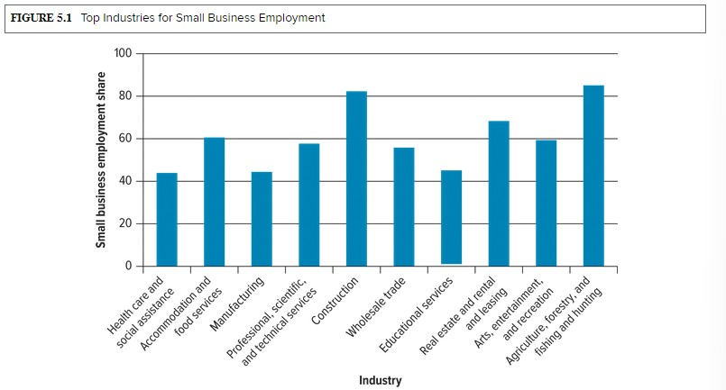

<h1 id="Chapter_5._Small_Business,_Entrepreneurship,_and_Franchising" style="color:#42A5F5;">Indice</h1>

---
##### [Capitulo LO 5-1: The Nature of Entrepreneurship and Small Business](#358293)

##### [Capitulo LO 5-2: Importance of Small Business in the U.S. Economy](#018914)

##### [Capitulo LO 5-3 Advantages of Small-Business Ownership](#657568)

##### [Capitulo LO 5-4 Disadvantages of Small-Business Ownership ](#365514)

##### [Capitulo LO 5-5 Starting a Small Business](#461983)

##### [Capitulo LO 5-6 The Future for Small Business](#402038)

##### [Capitulo LO 5-7 Making Big Businesses Act "Small"](#060128)
---
<h1 id="358293" style="color:#E65100;">
  <a href="#Chapter_5._Small_Business,_Entrepreneurship,_and_Franchising" style="color:inherit; text-decoration:none;">
    LO 5-1: The Nature of Entrepreneurship and Small Business
  </a>
</h1>

##  Define Entrepreneurship and Small Business

### Definition of Entrepreneurship
An **entrepreneur** is a person who risks money, time, and effort to develop, for profit, an innovative product or way of doing something.  

**Entrepreneurship** is the process of creating and managing a business to achieve desired objectives.

> Many large businesses you may recognize (such as Mattel, YouTube, or Spanx) all began as **small businesses** based on the visions of their founders.

---

### Characteristics of Entrepreneurs
- Ability to see **emerging trends** and respond with innovative products or services.
- Creativity and **innovation**, even without inventing new technology.
- Focus on providing products or services that **meet customer needs** in a unique way.
- Independent thinking and continual skill development.

---

### Examples of Innovative Entrepreneurship
1. **Amazon**: Uses technology to create new markets rather than inventing major new technologies.  
2. **Starbucks**: Offers a familiar product (coffee) in a unique retail environment.  
3. **Porch**: A home improvement platform connecting homeowners with licensed contractors.
   - Founded by **Matt Ehrlichman** after facing problems building his own house.
   - Facilitates over **$2 billion** in services yearly.
   - Provides a more transparent way to link homeowners and professionals.

---

### Key Insights
- Success in entrepreneurship requires **creativity, innovation, and independent thinking**.
- Formal education is **not always necessary**; many successful entrepreneurs dropped out of college:
  - **Steve Jobs** (Apple)  
  - **Richard Branson** (Virgin Group)  
  - **Larry Ellison** (Oracle)  
  - **Mary Kay Ash** (Mary Kay)  
  - **Michael Dell** (Dell)  
  - **Mark Zuckerberg** (Facebook)  
  - **Bill Gates** (Microsoft)

> Note: Smaller businesses do not need to become globally recognized to succeed, but entrepreneurial efforts that grow rapidly often gain visibility and success.

---

### Table 5.1: Successful Companies and Their Entrepreneurs

| Company                   | Entrepreneur(s)                   |
|----------------------------|---------------------------------|
| Hewlett-Packard            | Bill Hewlett, David Packard      |
| Walt Disney Productions    | Walt Disney                      |
| Starbucks                  | Howard Schultz                   |
| Amazon                     | Jeff Bezos                        |
| Dell                       | Michael Dell                     |
| Microsoft                  | Bill Gates                        |
| 23andMe                    | Anne Wojcicki                     |
| Goodr                      | Jasmine Crowe                     |
| Google                     | Larry Page, Sergey Brin           |
| Pampered Chef              | Doris Christopher                 |
| FUBU                       | Daymond John                       |
| General Electric           | Thomas Edison                     |

---

### Microentrepreneurs (Micropreneurs)
- Entrepreneurs with **five or fewer employees**.
- Leverage technology and digital tools once available only to large firms:
  - Websites, podcasts, online videos
  - Social media and smartphones
  - Expedited delivery services
- Can form **alliances with other companies** to compete in domestic and global markets.

---

### Social Entrepreneurship
- **Social entrepreneurs** use business principles to address social problems.
- Operate similarly to traditional entrepreneurs but aim to **create social change**.
- Can operate as **nonprofit or for-profit organizations**.
- **Example:** Karissa Bodnar, founder of **Thrive Causemetics**.
  - For each product purchased, Thrive distributes products and financial support to nonprofit partners like:
    - Ronald McDonald House Charities
    - Make-A-Wish Foundation

## What Is a Small Business?

Defining a **small business** can be tricky because "smallness" is relative. Generally, a small business is:

- **Independently owned and operated**
- **Not dominant** in its competitive area
- Employs **no more than 500 people**

> Example: A local Mexican restaurant may be the most popular in your community, but because it does not dominate the restaurant industry as a whole, it is still considered a small business.

### Reference: U.S. Small Business Administration (SBA)
- An independent federal agency that provides **managerial and financial assistance** to small businesses.
- Offers guidance on:
  - **First steps** in starting a small business
  - Resources for **current and potential small-business owners**
- Website contains a **wealth of information** for entrepreneurs.

<h1 id="018914" style="color:#E65100;">
  <a href="#Chapter_5._Small_Business,_Entrepreneurship,_and_Franchising" style="color:inherit; text-decoration:none;">
    LO 5-2: Importance of Small Business in the U.S. Economy
  </a>
</h1>

### Role of Small Business in the American Economy
Small businesses are **vital to the U.S. economy**, regardless of how "small" is defined:

- **More than 99%** of all U.S. firms are small businesses.
- Employ about **half of all private-sector workers**.
- Account for **97% of U.S. exporters of goods**.
- Drive **job creation and innovation**.
- Provide opportunities for **historically underrepresented groups**:
  - **Women**: Own over **11 million businesses** nationwide, excelling in professional services, retail, communication, and administrative services.
  - **Racial and ethnic minorities**: Own over **9 million small businesses**.
  - **Veterans**: Nearly **2 million small businesses** owned by veterans.

> **Example:** Jose de Jesus Legaspi, a Mexican-born entrepreneur, focused on real estate in inner-city areas with high Hispanic populations. By transforming struggling malls into cultural centers (e.g., **La Gran Plaza**), occupancy rose from 20% to 80%.

---

### Fields That Attract Small Businesses
Small businesses often thrive in sectors that allow for:

- Targeting **specific market niches**
- Providing **personalized services**
- Innovating with **limited resources**
- Serving **underrepresented communities**

---

### Table 5.2: Importance of Small Businesses to the U.S. Economy

| Key Statistic                                                                 | Value |
|-------------------------------------------------------------------------------|-------|
| Small firms as percent of all employer firms                                   | 99.9% |
| Small firms create **millions of new jobs** each year                          | —     |
| Employment in **real estate, rental, and leasing** by small businesses        | 66.9% |
| Small firms with fewer than 100 employees have largest share of employment    | —     |
| **Women ownership** of small businesses                                       | 43.2% |
| Employment of **construction workers** by small firms                          | >80%  |

**Source:** U.S. Small Business Administration Office of Advocacy, *2022 Small Business Profile*, [link](https://cdn.advocacy.sba.gov/wp-content/uploads/2022/08/30121338/Small-Business-Economic-Profile-US.pdf) (accessed January 30, 2023).

### Job Creation by Small Businesses

Small businesses play a **critical role in creating jobs** in the U.S.:

- The **energy, creativity, and innovation** of small-business owners generate about **1.6 million net new jobs annually**.
- **Top industries for small-business employment** include:
  - Agriculture
  - Forestry
  - Fishing and hunting
  - Other sectors with high small-business participation (see Figure 5.1 in textbook for detailed data)

> Small businesses not only provide jobs but also drive **economic diversity** and **opportunities for entrepreneurship** across various industries.

</img>

## Case Study: Business Heats Up for Beauty Bakerie

Cashmere Nicole founded **Beauty Bakerie**, a makeup and skin care company, in **2011**. Her battle with **breast cancer** made her more passionate about using **high-quality and healthy ingredients** in her beauty products. The cosmetics she develops are **vegan, cruelty-free, nontoxic, inclusive, and locally manufactured**.

Nicole, a young mother, paid to put herself through **college and nursing school**, starting Beauty Bakerie as a **side project**. With a desire to have a **social impact**, she used the company to raise awareness and support for breast cancer **before she was even diagnosed herself**. She used **Indiegogo**, a crowdfunding website, to share her story and raise funds for her company. Though she only brought in **$570 from 20 supporters**, the campaign earned the attention of singer **Beyoncé**, who featured the brand on her website during **Breast Cancer Awareness Month**.

The publicity helped boost her profile, but Nicole struggled for years to build her **direct-to-consumer business** in the crowded beauty market. She turned to **Instagram advertising** to spread the word about her longwearing lipstick called **“lip whip.”** After nearly **five years** in business, the sudden success allowed her to **quit her day job and hire her first employee**.

As a Black businessowner, Nicole prides herself on **inclusivity, representation, and transparency**. The company's executive team is **75 percent Black**, and its board of directors is **60 percent Black**. Nicole has used her platform to bring attention to **Juneteenth**, a federal holiday on June 19 that commemorates the end of slavery in the United States.

Today, Beauty Bakerie, based in **San Diego, California**, has **30 employees**, and its products are sold in **more than 2,000 locations in over 130 countries**. After Beauty Bakerie received a **$3 million seed investment** from **Unilever's venture capital and private equity arm**, Nicole said the company was worth **$40 million**. Unilever, the consumer packaged goods company behind more than 400 household brands, invests in forward-thinking businesses such as **Curlsmith, Frank Body, Kopari, and Grown Alchemist**. Beauty Bakerie has also caught the eye of individual investors such as **Kenneth Chennault, CEO of American Express**. Nicole plans to use the seed money to **fuel retail expansion and marketing**.

---

### Critical Thinking Questions – Beauty Bakerie

**1. How has Nicole contributed to the American economy?**  
- **Job creation:** Beauty Bakerie emplea actualmente 30 personas, generando empleo local en San Diego, California.  
- **Economic activity:** Sus productos se venden en más de 2,000 ubicaciones en más de 130 países, contribuyendo al comercio nacional e internacional.  
- **Innovation and entrepreneurship:** Al crear un negocio inclusivo, saludable y sostenible, Nicole impulsa la innovación en la industria cosmética.  
- **Representation of underrepresented groups:** Como mujer y empresaria negra, promueve diversidad e inclusión en los negocios.  

**2. Describe the struggles Nicole faced as a small-business owner.**  
- **Financing challenges:** Comenzó con recursos limitados, recibiendo solo $570 de 20 personas mediante crowdfunding.  
- **Market competition:** Ingresó a un mercado de belleza muy competitivo con muchas marcas establecidas.  
- **Building a customer base:** Pasaron casi cinco años antes de que su negocio despegara y pudiera contratar empleados.  
- **Managing growth:** Tuvo que equilibrar su rol como madre, estudiante y empresaria mientras expandía la empresa y mantenía la calidad de los productos.  

**3. What financial resources have been obtained by Nicole for her business?**  
- **Crowdfunding inicial:** $570 a través de Indiegogo.  
- **Seed investment:** $3 millones de Unilever Ventures (capital de riesgo y private equity).  
- **Individual investors:** Incluyendo Kenneth Chennault, CEO de American Express.  
- Las inversiones han financiado **expansión de retail, marketing y crecimiento general de la empresa**.

## Innovation in Small Business

### Importance of Innovation
- One of the **most significant strengths** of small businesses is their **ability to innovate**, providing substantial benefits to customers.  
- Successful startups are often **acquired by larger companies** seeking to expand capabilities.  
  - Example: **Sonantic**, an AI platform, was acquired by **Spotify** to enhance audio technology.  

---

### Contributions of Small Firms
- Small firms produce **more than half of all innovations**.  
- Important 20th-century innovations by U.S. small firms include:
  - Airplane, audio tape recorder, fiber-optic examining equipment  
  - Heart valve, optical scanner, pacemaker  
  - Personal computer, soft contact lenses, the internet, zipper  

- **Artificial intelligence** will create new opportunities for innovation:  
  - Computers performing tasks requiring human intelligence  
  - Facial recognition, speech recognition, decision-making, robot control  

---

### Competitive Advantage
- Small businesses can **compete more effectively with large firms** due to technology becoming **more available and affordable**.  
- Technology enhances efficiency in:
  - Customer service  
  - Marketing  
  - Human resources  
  - Supply chain management  
  - Manufacturing  

- Early-stage companies can be **highly independent** and maximize elements that **create value**.  
- **Barriers to entry** for new businesses are becoming lower.

---

### Examples of Innovation Success
- **Franchises:** Over 500,000 establishments employing nearly 10 million people.  
- Many **large companies started as small firms** using innovation:  
  - **Huffington Post (HuffPost):** Founded by Arianna Huffington, brought ~$45 million in revenue/year, sold to AOL for **$315 million** after six years.  
- Entrepreneurs provide **fresh ideas** and **greater flexibility** to adapt than large companies.

## Industries That Attract Small Business

Small businesses are found in nearly every industry, but the following sectors are **especially attractive to entrepreneurs**:  
- **Retailing and wholesaling**  
- **Services**  
- **Manufacturing**  
- **High technology**  

### Why These Industries Are Attractive
- **Relatively easy to enter**  
- Require **low initial financing**  
- Easier to focus on **specific consumer groups**  
- New firms face **less competition initially** than established firms  

---

### Retailing
- Retailers **acquire goods from producers or wholesalers** and sell them to consumers.  
- Common examples include:  
  - Independent sporting goods stores  
  - Dry cleaners  
  - Boutiques  
  - Drugstores  
  - Restaurants and caterers  
  - Hardware stores  

- Retailing is **rapidly shifting online**, allowing small businesses to sell:  
  - Through their **own website**  
  - As a third party on platforms such as **Amazon**  

- Why retailing attracts entrepreneurs:  
  - **Experience and exposure** can be gained relatively easily  
  - Opening a new retail store or website **requires less capital** than manufacturing  
  - Success depends on **understanding the market** and providing products that satisfy customer needs  

- **Funding options:** Some entrepreneurs use **crowdfunding platforms** such as **Kickstarter**  
  - Investors may receive **insight into the business** or the **product being developed**  
  - Investors are **not financially rewarded**, making it a low-risk way to launch  

### Wholesaling
- **Role:** Provide goods and services to producers and retailers, assisting with almost every business function.  
- **Functions include:**  
  - Planning and negotiating for supplies  
  - Promoting and distributing products  
  - Warehousing and transportation  
  - Management and merchandising support  

- **Importance:**  
  - Especially critical for consumer goods due to marketing activities.  
  - Even if wholesalers are eliminated, their functions must be performed by other organizations (producers or intermediaries, often small businesses).  
  - Small businesses often have **closer contact with final customers** and understand how to keep them satisfied.  

- **Example:**  
  - Salons and spas sell professional hair and skin care products from other companies at a **markup**, purchasing at wholesale rates.  

---

### Services
- **Definition:** Businesses that provide **intangible products**, performance, or efforts that cannot be physically possessed.  
- **Scope:**  
  - Can be part of the wholesale market (products that cannot be touched).  
  - Accounts for **80% of U.S. jobs** (excluding farmworkers).  

- **Examples of service businesses:**  
  - Dry cleaners, accounting firms, banks, real estate agencies, insurance agencies, hair salons, television and computer repair shops.  
  - Skilled professionals such as morticians, jewelers, doctors, and veterinarians often operate small businesses.  

- **Home-based opportunities:**  
  - Some services can be run from home, reducing startup costs.  
  - Example: **Carla Eason**, massage therapist in Evanston, Illinois, ran *Body Works by Carla* from home for 20+ years before moving to a commercial location.  

---

### Manufacturing
- **Opportunities:** Small businesses can **customize products** to meet specific customer needs.  
- **Examples of customizable products:**  
  - Custom artwork, jewelry, clothing, furniture  

- **Technology support:**  
  - Affordable 3D printers, computer-controlled cutting machines, and other technologies support **on-demand manufacturing**.  
  - Companies like HP foresee **commercial 3D printing** as an integral part of future supply chains.  

- **Advantage of small firms:**  
  - Flexibility to **adapt quickly** to customer preferences  
  - Lower barriers to **personalized or niche manufacturing** compared to large firms  

### High Technology
- **Definition:** Businesses that rely heavily on **advanced scientific and engineering knowledge**.  
- **Examples of fields:**  
  - Computers  
  - Biotechnology  
  - Genetic engineering  
  - Robotics  
  - Cybersecurity  

- **Notable startups:**  
  - **Randori** – Cybersecurity startup in Boston, Massachusetts, cofounded by Brian Hazzard and David Wolpoff; eventually acquired by **IBM**.  
  - **Oculus Rift** – Virtual gaming headset invented by a teenager, later sold to **Facebook (now Meta)** for $2 billion.  

- **Characteristics:**  
  - Require **greater capital** and **higher initial startup costs** than other small businesses.  
  - Many successful high-tech businesses started in **garages, basements, kitchens, or dorm rooms**, emphasizing innovation and flexibility.  

- **Takeaway:** High-tech small businesses can grow rapidly, attract significant investment, and eventually be acquired by large corporations, making them key drivers of innovation and economic growth.

### Sharing Economy and Gig Economy

#### Sharing Economy
- **Definition:** An economic model involving the **sharing of underutilized resources**.  
- Entrepreneurs earn income by **renting out resources** such as lodging or vehicles.  
- **Example:** **Airbnb** – connects people needing lodging with hosts offering accommodations.  
- Enables individuals to **be their own entrepreneurs** or earn **additional income** alongside another job.  

---

#### Gig Economy
- **Definition:** Economic model where **independent contractors sell their services on-demand**.  
- **Example:** **Uber** – connects passengers with drivers through a mobile app; drivers act as **independent contractors**.  
- Contractors control when and where they work but must manage their own **taxes and benefits**.  

---

#### Opportunities and Impact
- Technology has **transformed connections** between buyers and sellers.  
- Disrupted established industries: hospitality (Airbnb) and taxi services (Uber).  
- **Example:** Ilise Benun started **Marketing Mentor** after losing her second job to help creatives find clients with large budgets.  
- Pew Research Center: **16% of Americans** have earned money in the gig economy, mostly as a **side job**.  

---

#### Challenges
- Classification of workers as **independent contractors vs. employees** can cause legal conflicts.  
  - U.S. Department of Labor: Uber drivers are contractors.  
  - Some states, like California, challenge this classification.  
- Companies may face **conflicts with local regulations**.  
- Despite challenges, the global **sharing economy is growing** and could reach **$335 billion** in the coming years.

<h1 id="657568" style="color:#E65100;">
  <a href="#Chapter_5._Small_Business,_Entrepreneurship,_and_Franchising" style="color:inherit; text-decoration:none;">
    LO 5-3 Advantages of Small-Business Ownership
  </a>
</h1>

There are many advantages to establishing and running a small business. These advantages can be categorized into:  
- **Personal advantages**  
- **Business advantages**  

### Successful Traits of Young Entrepreneurs

| Trait        | Definition                                                                                   |
|--------------|----------------------------------------------------------------------------------------------|
| Intuitive    | Using one's intuition to derive what's true without conscious reasoning                       |
| Productive   | Being able to produce large amounts of something during a specific time period               |
| Resourceful  | Understanding how to use and spend resources wisely                                          |
| Charismatic  | Having the ability to inspire others behind a central vision                                  |
| Innovative   | Being able to come up with new and creative ideas                                            |
| Risk-taker   | Having the ability to pursue risky endeavors despite the possibility of failure              |
| Persistent   | Continuing in a certain action in spite of obstacles                                         |
| Friendly     | Being able to have mutually beneficial interactions with people                               |

### Independence
- One of the main reasons entrepreneurs start their own business is **being their own boss**.  
- Motivations include:  
  - Belief they will **do better for themselves** than staying with an employer.  
  - Feeling **stuck in the corporate ladder** or not fitting the "corporate mold."  
  - Desire for **freedom to choose whom to work with**, where and when to work, and possibly working in a **family setting**.  
- Internet tools like **websites, social media, and other online resources** make it easier to **start a business from home**.  

---

### Costs
- **Lower startup and operating costs** compared to large firms.  
- Statistics:  
  - **64% of top entrepreneurs** used personal savings to start their business.  
  - **9%** used a credit card.  
- Small businesses spend less on: wages, rent, utilities, and other expenses.  
- Often outsource services like accounting, advertising, or legal support **as needed**, sometimes hiring other small businesses.  
- Family and friends can sometimes assist, as seen in **family-owned restaurants and local businesses**.  

---

### Flexibility
- Small businesses usually have **only one layer of management—the owner**.  
- Advantages:  
  - **Decisions can be made and executed quickly**.  
  - Can adapt **rapidly to changing market demands**.  
  - **Social listening** allows monitoring of trends on social media to respond faster than larger firms.  

- Example:  
  - A small snack shop can **introduce a new product** in response to a customer request in a **much shorter time** than a large company like Taco Bell, which takes **years** to research, develop, test, and launch a new product nationwide.

### Focus
- Small firms can **concentrate on a precisely defined market niche**—a specific group of customers.  
- Advantages of niche focus:  
  - Can develop products for **particular customer groups**  
  - Satisfy **needs that other companies have not addressed**  
  - Sometimes **avoid competition from larger firms**, enabling growth  

- **Example:**  
  - **Evereve** – Boutiques targeted to young mothers, founded by Megan Tamte  
    - Stores feature double-wide aisles for strollers, large dressing rooms, and play areas for children  
    - Opened over **100 retail stores in 30 states**  

---

### Reputation
- Reputation refers to **how a firm is perceived by stakeholders**.  
- Small firms can develop **strong reputations for quality and service** due to their focus on narrow niches.  
- **Example:**  
  - **W. Atlee Burpee and Co.** – Premier bulb and seed catalog in the U.S.  
    - Offers **unqualified returns policy** (satisfaction guaranteed or money back)  
    - Demonstrates strong commitment to **customer satisfaction**

<h1 id="365514" style="color:#E65100;">
  <a href="#Chapter_5._Small_Business,_Entrepreneurship,_and_Franchising" style="color:inherit; text-decoration:none;">
    LO 5-4 Disadvantages of Small-Business Ownership 
  </a>
</h1>

- Running a small business can be **very rewarding**, which is why many people dream of it.  
- However, small-business ownership also comes with **disadvantages and risks** that must be carefully considered.  

### High Stress Level
- Small businesses can provide a living for the owner, but often **not much more**.  
- Owners face ongoing worries about:  
  - Competition  
  - Employee issues  
  - Equipment needs  
  - Inventory expansion  
  - Rent increases  
  - Changing market demand  

- Many small-business owners wear **multiple hats**: owner, manager, sales, shipping/receiving, bookkeeping, custodian.  
- Multitasking leads to **long hours** and both **physical and psychological stress**.  
- Fear of failure affects **39% of new business owners**.  
- Environmental and economic changes can exacerbate stress:  
  - Example: During the **COVID-19 pandemic**, many small retail businesses failed due to closures or restrictions.  
- About **20% of small businesses fail in the first year**.  

---

### High Failure Rate
- Despite their economic importance, **small businesses are not guaranteed success**.  
- Statistics:  
  - **Half of all businesses fail within the first five years**.  
  - Restaurants are especially vulnerable: about **11% of independent restaurants closed during the COVID-19 pandemic**, while chains like Chipotle, Arby's, McDonald's, and Burger King had advantages due to **adaptable business models**.  

- Common reasons small businesses fail include:  
  - Poor business concept (e.g., products without a real market need)  
  - Government regulations and compliance burdens  
  - Insufficient funds to withstand slow sales  
  - Vulnerability to competition from larger companies  

---

### Three Major Causes of Small-Business Failure
1. **Undercapitalization** – Not enough funds to cover startup costs or sustain operations during slow periods.  
2. **Managerial inexperience or incompetence** – Lack of knowledge or skills to manage finances, employees, and operations.  
3. **Inability to cope with growth** – Rapid expansion can overwhelm owners who are unprepared for scaling challenges.  

- **Example:** A hobby expanded into a business without a genuine market niche often fails.  
- Table 5.4 (not shown) lists additional **causes of small-business failure**.

### Table 5.4 – Challenges in Starting a New Business

1. **Underfunded** – Not providing adequate startup capital  
2. **Not understanding your competitive niche**  
3. **Lack of effective utilization of websites and social media**  
4. **Lack of a marketing and business plan**  
5. **Poor site selection** – If operating a retail store  
6. **Pricing mistakes** – Setting prices too high or too low  
7. **Underestimating the time commitment** required for success  
8. **Not finding complementary partners** to bring in additional experience  
9. **Not hiring the right employees** and/or not training them properly  
10. **Not understanding legal and ethical responsibilities**

### Undercapitalization
- **Definition:** Lack of sufficient funds to operate a business normally.  
- Many entrepreneurs think initial startup money is enough and that cash from sales will sustain the business.  
- Challenges:  
  - Seasonal variations in sales can make cash flow tight  
  - Few businesses make money immediately  
  - Rapid growth or expansion can strain finances  
  - Loss of key customers or economic downturn can lead to failure  

- **Example:** An independent candle maker invests heavily in inventory but may lack funds for rent, utilities, web hosting, and shipping, risking business failure.  

---

### Managerial Inexperience or Incompetence
- Poor management is a major cause of business failure.  
- Having a brilliant product idea or vision **does not guarantee effective management**.  
- Entrepreneurs may lack skills in:  
  - Hiring  
  - Negotiating  
  - Finance  
  - Operational control  
- Neglecting areas they know little about can jeopardize the **success of the business**.  

### Inability to Cope with Growth
- Advantages of a small business can become disadvantages during growth.  
- Challenges of growth:  
  - Owners may need to **give up direct authority**, which can be difficult for those used to controlling all decisions.  
  - Growth requires **specialized management skills** (e.g., credit analysis, promotion) that the founder may lack or not have time to apply.  
  - Bringing in **experienced managers** is often necessary to handle growing pains (example: Dell Computers).  

- **Example:**  
  - **Peloton**, an exercise equipment and media company, expanded too quickly and had to **lay off hundreds of employees**.  

- Risks of poorly managed growth:  
  - Damage to **company reputation**  
  - Delayed or poorly made products  
  - Financial threats such as rising inflation, supply shortages, or high household/corporate debt  

- Some entrepreneurs choose to **stay small**, operating as **micropreneurs** (businesses with ≤5 employees).  
  - **92% of small businesses** are microbusinesses.

<h1 id="461983" style="color:#E65100;">
  <a href="#Chapter_5._Small_Business,_Entrepreneurship,_and_Franchising" style="color:inherit; text-decoration:none;">
    LO 5-5 Starting a Small Business 
  </a>
</h1>

### How to Start a Small Business
To start a business, entrepreneurs typically follow these key steps:

1. **Develop a business idea**
   - Every business begins with a **general idea**.
   - Example: Eric Yuan moved to the U.S. during the internet boom and later created **Zoom**, inspired by the difficulty of traveling long distances to see a friend.

2. **Create a strategy**
   - Develop a plan to guide **business planning and development**.

3. **Make key decisions**
   - Choose the **form of ownership**  
   - Determine **financial resources needed**  
   - Decide whether to:
     - Start a new business  
     - Buy an existing business  
     - Purchase a franchise  

---

## Case Study: Granville Island Provides a Platform for Small Businesses

- **Location:** Vancouver, British Columbia  
- A public market similar to Pike Place Market in Seattle.  
- Includes:
  - **50+ food vendors**
  - **300+ total vendors**, each representing a small business  
- Attracts over **10 million visitors per year**.  

### Key Features
- Combines **food, culture, art, and entertainment**.  
- Provides a **year-round marketplace** for small businesses.  
- Vendors sell directly to consumers without needing:
  - Expensive retail space  
  - Heavy advertising costs  

### Mission
- Support **local businesses and culture**  
- Maintain public land  
- Foster relationships with **Indigenous communities**  
- Welcome visitors  

### Examples of Businesses
- Fresh food vendors (fruit, seafood, baked goods)  
- Handmade crafts (e.g., dolls, silk products)  
- **Lee’s Donuts** (operating since 1979, now expanding through franchising)

### Additional Attractions
- Kid’s Market (toys, clothing, play areas)  
- Adventure Zone, arcade, virtual reality experiences  
- Water park, comedy shows, boat rentals  
- 17-mile waterfront path  

---

### Benefits for Small Businesses
- Lower **startup and operating costs**  
- Built-in **customer traffic**  
- Opportunity to focus on:
  - Product quality  
  - Presentation  
  - Personal selling  

---

### Critical Thinking Questions
1. How do small businesses benefit from venues such as the **Granville Island Public Market**?  
2. How does the Market support **Granville Island's mission**?  
3. What are the advantages of becoming a **franchisee** of a company such as Lee's Donuts versus opening a competing business?  

## The Business Plan

- A **business plan** is a precise statement of:
  - The **rationale** for the business  
  - A **step-by-step explanation** of how it will achieve its goals  

### What a Business Plan Includes
- Description of the business  
- Analysis of the **competition**  
- Estimates of **income and expenses**  
- Strategy for obtaining **financial resources**  

- The **U.S. Small Business Administration (SBA)** provides guidance for creating business plans to secure financing.  
- Many financial institutions decide whether to **grant loans** based on the business plan.  

### Importance of a Business Plan
- Acts as a **guide and reference**, not a restriction  
- Must be **updated regularly** to adapt to environmental changes  
- Helps businesses:
  - Assess **market potential**  
  - Determine **pricing and production needs**  
  - Identify **distribution channels**  
  - Refine **product selection**  

- **Example:**  
  - **Netflix** started as a DVD-by-mail service and successfully transitioned to **streaming and original content**, adapting its business plan over time.  

---

## Forms of Business Ownership
After creating a business plan, entrepreneurs must choose a legal structure:

- **Sole proprietorship**  
- **Partnership**  
- **Corporation**  

- The choice depends on factors such as **control, liability, and financing needs**.

---

## Financial Resources

- Starting a business requires **capital** (“it takes money to make money”).  
- Funds are needed for:
  - Rent  
  - Equipment and furnishings  
  - Inventory  
  - Working capital  

### Startup Cost Insights
- A small retail store may need **$50,000+** to start.  
- However:
  - ~60% of small businesses start with **less than $25,000**  
  - ~33% start with **less than $5,000**  

### Sources of Funding
- **Personal savings**  
- **Credit cards**  
- **Small-business loans**  
- **Crowdfunding**  
- **Venture capital** (used by <1% of U.S. businesses)  

- **Example:**  
  - **Kevin Plank (Under Armour)** used his life savings and **$40,000 in credit card debt** to start his company.  

---

### Key Takeaway
- A strong **business plan + adequate financial resources** are essential for starting and sustaining a successful small business.

## Equity Financing

- **Equity financing** involves using **personal assets or selling ownership (stock)** in the business to raise funds, rather than borrowing money.

---

### Owner as the Primary Source of Funds
- The **most important source of funding** for a new business is the owner.  
- Common personal resources include:
  - Home equity  
  - Life insurance value  
  - Savings accounts  

- Owners may:
  - **Sell or borrow against assets**  
  - Contribute personal items such as:
    - Computers  
    - Furniture  
    - Vehicles  
    - Tools and equipment  

- Owners can also:
  - Reinvest **profits back into the business**  
  - Take a **reduced salary** to provide working capital  

---

### External Equity Financing
Small businesses can also raise funds by **bringing in investors**:

- Sell ownership (stock) to:
  - Family and friends  
  - Employees  
  - Other private investors  

---

### Venture Capital
- **Venture capitalists** are individuals or organizations that invest in new businesses in exchange for **ownership (equity)**.  
- Goal: Buy shares at a **low price** and sell them later for a **profit**.  

- **Example:**  
  - **FreightWaves** (data platform for freight markets) raised **$90+ million** from venture capital investors.  

- Popular example in media:  
  - **Shark Tank** – Entrepreneurs pitch ideas to investors such as:
    - Mark Cuban  
    - Daymond John  
    - Barbara Corcoran  
    - Lori Greiner  

---

### Advantages and Disadvantages
**Advantages:**
- No need to repay loans  
- Access to additional expertise from investors  

**Disadvantages:**
- Must **share profits**  
- May have to **give up some control** of the business  

---

### Key Takeaway
Equity financing is essential for many startups, but it often requires entrepreneurs to **trade ownership and control for funding**.

### Table 5.5 – Successful Shark Tank Products

| Product               | Investor           | Investment                     | Description                                                                 |
|----------------------|-------------------|--------------------------------|-----------------------------------------------------------------------------|
| Scrub Daddy          | Lori Greiner      | $200,000 for 20% equity        | Cleaning sponge that changes texture (soft in hot water, firm in cold)     |
| Squatty Potty        | Lori Greiner      | $350,000 for 10% equity        | Toilet stool designed for easier bowel movements                            |
| The Original Comfy   | Barbara Corcoran  | $50,000 for 30% equity         | Wearable blanket with hood                                                  |
| Simply Fit Board     | Lori Greiner      | $125,000 for 20% equity        | Exercise balance board                                                      |
| Bombas               | Daymond John      | $200,000 for 17.5% equity      | Socially responsible sock company                                           |

## Debt Financing

- **Debt financing** involves borrowing money that must be **repaid with interest**.  
- As businesses become more established, they are often able to **borrow larger amounts**.

---

### Main Sources of Debt Financing
- **Banks** – Primary source of external financing for small businesses  
- **Small Business Administration (SBA)** – Provides financial assistance and loan programs  
- **Family and friends** – May offer loans or assets with flexible repayment terms  

- ⚠️ Important:
  - Agreements with family/friends should be **clearly written** to avoid conflicts  
  - Emotional risks can be significant if the business fails  

---

### Loan Requirements
- Lenders evaluate:
  - Likelihood of **business success**  
  - Entrepreneur’s ability to **repay the loan**  

- Often require **collateral**:
  - Property or business assets used to guarantee repayment  
  - Personal assets (e.g., home → **mortgage**)  

- If the business fails to repay:
  - The lender may **seize and sell collateral**  

---

### Additional Financing Options

#### Line of Credit
- Agreement allowing a business to borrow up to a **predetermined limit on demand**  
- Helps entrepreneurs take advantage of **unexpected opportunities**  

#### Trade Credit
- Suppliers provide goods/services now and allow payment **later**  
- Common in small business operations  

#### Bartering
- Exchange of goods/services without money  
- Example: An accountant trades services for office supplies  

---

### Other Sources
- **Community loan funds** – Support specific types of businesses  
- **State and local programs** – May guarantee loans, especially for:
  - Underrepresented entrepreneurs  
  - Economic development areas  

---

### Example
- **Handshake** (career platform):
  - Started by students who struggled to find jobs  
  - Raised funding through **seed capital and investment rounds (Series A & B)**  
  - Now serves:
    - 1,400 schools  
    - 12 million students  
    - 750,000 employers  

---

### Key Takeaway
Debt financing provides access to capital but requires **repayment, interest, and risk of losing assets** if the business fails.

## Approaches to Starting a Small Business

### Starting from Scratch versus Buying an Existing Business

Although entrepreneurs often start new small businesses from scratch, they may choose instead to **buy an existing business**.

#### Advantages of Buying an Existing Business
- Provides a **built-in network** of:
  - Customers  
  - Suppliers  
  - Distributors  
- Reduces some of the **uncertainty and guesswork** involved in starting a business from the ground up  

#### Disadvantages
- The entrepreneur may also **inherit existing problems** within the business  

#### Example
Actor **Sarah Michelle Gellar** co-founded *Foodstirs*, a startup baking brand, after being dismissed by many investors. She leveraged her public image by promoting the brand through media appearances. Their one-minute mug cake was later sold in **8,000 Starbucks stores**.

---

### Franchising

Many small-business owners enter the business world through **franchising**.

- A **franchise** is a license to:
  - Sell another company’s products  
  - Use another company’s name (or both)  

- **Franchiser:** The company that sells the franchise  
- **Franchisee:** The individual who purchases and operates the franchise  

#### Examples of Franchisers
- Dunkin’  
- Subway  
- Jiffy Lube  

---

### How Franchising Works

The franchisee receives:
- Rights to:
  - Brand name  
  - Logo  
  - Methods of operation  
  - National advertising  
  - Products and services  

In return, the franchisee must:
- Pay an **initial fee** (varies widely)  
- Purchase equipment  
- Pay for training  
- Obtain a lease or mortgage  
- Pay **ongoing fees** (percentage of sales or profits)  
- Follow the franchiser’s **standards of operation**  

---

### Benefits Provided by the Franchiser
- Building specifications and store design  
- Site selection recommendations  
- Management and accounting support  
- **Immediate name recognition**  

---

### Key Insight
Franchising offers a **lower-risk entry** into business ownership but requires:
- Financial commitment  
- Reduced independence due to standardized operations  

## Case Study: Subway Finds Its Way

- **Subway** is the largest fast-food chain in the world, with:
  - **42,000+ locations**
  - Presence in **100+ countries**  

- The company redefined fast food by:
  - Using **fresh, visible ingredients**  
  - Promoting a **healthier alternative**  

---

### Factors That Contributed to Growth
- **Low franchise cost** (~$200,000 vs. ~$2.2 million for McDonald’s)  
- Successful marketing campaigns:
  - “Subway guy” (weight loss campaign)  
  - “Five Dollar Footlong” promotion  
- Strong positioning during:
  - **Obesity awareness trends**  
  - **Great Recession** (affordable meals)  

---

### Challenges and Decline
- Sales began to decline around **2014**  
- Increased competition:
  - Other fast-food chains offering healthier options  
- **Overexpansion**:
  - Too many franchises located close together  
  - Led to **self-competition (cannibalization)**  

---

### Current Strategies
- Improving **store placement**  
- Supporting **store remodels**  
- Investing **$80 million in menu development**  
- Introducing major menu changes for the first time in decades  

---

## Critical Thinking Questions (with Answers)

### 1. Describe the factors that contribute to Subway's growth.
- Low cost of entry for franchisees  
- Strong and memorable marketing campaigns  
- Focus on healthier fast-food options  
- Affordable pricing strategies  

---

### 2. What makes Subway an attractive investment for franchisees?
- Lower startup cost compared to competitors  
- Established global brand  
- Proven business model  
- Strong marketing support  

---

### 3. What factors have contributed to Subway's struggles?
- Increased competition offering similar healthy options  
- Overexpansion leading to franchise saturation  
- Declining sales and brand fatigue  
- Need for modernization (stores and menu)  

---

## History of Franchising
- Began in the U.S. in the **19th century**  
- First used by **Singer** to sell sewing machines  
- Later expanded to:
  - Automobile industry  
  - Gasoline stations  
  - Soft drinks  
  - Hotels  

- Rapid growth occurred during the **1960s**, expanding into many industries  

---

### Key Takeaway
Franchising can drive rapid growth, but **poor control over expansion and competition** can lead to long-term challenges.

### Table 5.6 – Top 10 Fastest Growing Franchises

1. 7-Eleven  
2. Century 21 Real Estate  
3. KFC  
4. Stratus Building Solutions  
5. McDonald’s  
6. RE/MAX  
7. Jan-Pro Cleaning and Disinfecting  
8. Sign Gypsies  
9. Goosehead Insurance  
10. F45 Training  

---

## Advantages and Disadvantages of Franchising

### Advantages of Franchising
Franchisees commonly report the following benefits:

- **Management training and support**  
- **Brand-name recognition**  
- **Standardized quality** of goods and services  
- **National and local advertising programs**  
- **Financial assistance**  
- **Proven products and business models**  
- **Centralized buying power**  
- **Site selection and territorial protection**  
- **Higher chance of success** compared to independent startups  

---

### Disadvantages of Franchising
Franchisees may experience several limitations:

- **Franchise fees** and profit sharing with the franchiser  
- **Strict adherence** to standardized operations  
- **Restrictions on purchasing**  
- **Limited product line**  
- **Market saturation** (too many locations)  
- **Less freedom in decision-making**  

---

### Key Insight
- Franchising offers **lower risk and structured support**, but requires giving up **independence and flexibility**.  
- Entrepreneurs who want full control may find franchise restrictions **frustrating**.

## Help for Small-Business Managers

Because of the important role small businesses play in the U.S. economy, many organizations offer **programs and resources** to help entrepreneurs succeed.

---

### Training and Education
- Entrepreneurs can develop skills through:
  - **Seminars**
  - **College courses**
- Key areas:
  - Marketing  
  - Management  
  - Finance  

- Important factors for success:
  - **Knowledge** (can be taught)  
  - **Experience** (can be partially simulated)  
  - **Judgment** (developed over time by the entrepreneur)  

---

### Government and Local Support
- **Local chambers of commerce**  
- **U.S. Department of Commerce**  
- Provide:
  - Information  
  - Guidance  
  - Business support resources  

---

### Publications and Media
- National publications:
  - *Inc.*  
  - *Entrepreneur*  
- Provide:
  - Statistics  
  - Advice and tips  
  - Success and failure stories  

- Local business journals:
  - Focus on **local businesses and strategies**  

---

### Small Business Administration (SBA)
- Offers:
  - Counseling for struggling businesses  
  - Consulting to improve operations  
  - Training for owners, managers, and employees  

#### Small Business Development Centers (SBDCs)
- Located mainly on **college campuses**  
- Provide:
  - **Free counseling**  
  - Low-cost training  
- Serve as a primary way the SBA supports small businesses  

---

### Mentorship Programs

#### SCORE (Service Corps of Retired Executives)
- Volunteer organization funded by the SBA  
- Provides **expert advice from experienced professionals**  
- 10,000+ volunteers across 250+ locations  

#### ACE (Active Corps of Executives)
- Also provides guidance from experienced business leaders  

---

### Networking and Other Support
- Entrepreneurs can learn from:
  - Other business owners  
  - Suppliers  
  - Customers  

- Benefits of networking:
  - Sharing ideas  
  - Solving problems  
  - Improving processes  
  - Understanding regulations  

---

### Business Incubators
- Organizations designed to **support startup growth**  
- Provide:
  - Networking opportunities  
  - Access to funding  
  - Business development support  

---

### Technology and Networking
- Modern tools (e.g., **virtual conferencing**) make it easier to:
  - Connect with others  
  - Share knowledge  
  - Build professional relationships  

---

### Key Takeaway
Success in small business is not achieved alone—**training, mentorship, networking, and institutional support** play a critical role in helping entrepreneurs grow and succeed.

<h1 id="402038" style="color:#E65100;">
  <a href="#Chapter_5._Small_Business,_Entrepreneurship,_and_Franchising" style="color:inherit; text-decoration:none;">
    LO 5-6 The Future for Small Business
  </a>
</h1>

## The Future for Small Business

Small businesses are vital to the U.S. economy but are **more vulnerable** to market changes due to their size and limited resources. Key trends affecting small businesses include **demographic, technological, and economic factors**.

---

### Demographic Trends
1. **Baby Boomers** (born 1946–1964, 72 million)
   - Wealthy and influential consumers  
   - Growing demand in **travel, financial planning, and health care**  
   - Examples:
     - Gold Violin: designer canes  
     - LifeSpring Nutrition: meal delivery  

2. **Generation X** (born 1965–1980)
   - Smaller cohort  
   - Key market for specialized products/services  

3. **Millennials / Generation Y** (born 1981–1996, 72 million)
   - Value advancement, recognition, and skill development  
   - Respond well to **direct feedback, encouragement, and entertaining learning**  
   - Seek meaningful work experiences, not only high pay  

4. **Generation Z** (born 1996–2010, 67 million)
   - Entering the workforce  
   - Prefer **fun, flexible work environments**  
   - Comfortable with **remote work and virtual communication**  

5. **Immigrant Workforce**
   - Over **17% of the U.S. workforce (28.4 million)**  
   - Largest employment in **retail, educational services, and nonhospital health care**  
   - Opportunity for small businesses offering **ethnic products** or **bilingual services**  

---

### Most Business-Friendly States (Table 5.7)
| Rank | State |
|------|-------|
| 1    | North Carolina |
| 2    | Texas |
| 3    | Utah |
| 4    | Virginia |
| 5    | Florida |
| 6    | Georgia |
| 7    | Tennessee |
| 8    | Washington |
| 9    | Colorado |
| 10   | Idaho |

*Source: Forbes, “Best States for Business,” accessed Jan 31, 2023.*

---

### Key Takeaways
- Small businesses must adapt to **changing demographics**.  
- Millennials and Gen Z value **flexible, meaningful work** and **virtual connectivity**.  
- Immigrants provide **untapped market opportunities**.  
- Certain states offer **supportive environments** for startups and small businesses.

## Technological and Economic Trends

Advances in technology have opened many new markets to small businesses. The internet continues to provide opportunities for small-business growth.  

- **Artificial Intelligence (AI)**
  - OpenAI, a nonprofit AI research laboratory, provides AI applications to small businesses  
  - Examples:
    - **ChatGPT**: a chatbot that answers questions across a wide range of business topics  
    - **DALL-E**: generates images based on text descriptions  
  - Benefits: content generation, research assistance, and other operational support  

- **Home-Based Businesses**
  - Many entrepreneurs operate from home; approximately **50% of small businesses** are home-based  
  - Examples of large companies that started at home: Mary Kay, Ford, Apple  
  - Technology allows home-based businesses to **interact effectively with customers**  

- **E-commerce Platforms**
  - Small businesses can take their operations online using platforms like **Shopify, Wix, Squarespace**  
  - Increases market reach and customer accessibility  

- **International Expansion**
  - Technology and service exports create opportunities for small businesses abroad  
  - Benefits:
    - Customization of services for international clients  
    - Support from **free trade agreements** and alliances  
  - Challenges:
    - Tariffs and trade restrictions may increase costs  

- **Economic Opportunities and Threats**
  - Opportunities:
    - Lower internet rates and more affordable technology  
    - Platforms like **eBay** and **Etsy** allow niche sellers to reach customers  
    - Deregulation and interest in alternative energy create new business niches  
      - Example: Southwest Windpower Inc. manufactures small wind turbines for homes and telecommunications  
  - Threats:
    - Competition and changing consumer demands  
    - Volatility in international and local markets  

- **Flexibility Advantage**
  - Small businesses can adapt quickly to changing environments, unlike large companies such as Walmart  
  - Creativity and entrepreneurship allow small firms to serve customers in innovative ways  

**Key Takeaways**  
- Technological advancements empower small businesses to operate efficiently, both at home and online  
- AI and digital platforms provide tools for content, marketing, and research  
- International trade offers growth opportunities but comes with challenges like tariffs  
- Small businesses benefit from agility and innovation compared to larger competitors

<h1 id="060128" style="color:#E65100;">
  <a href="#Chapter_5._Small_Business,_Entrepreneurship,_and_Franchising" style="color:inherit; text-decoration:none;">
    LO 5-7 Making Big Businesses Act "Small"
  </a>
</h1>

# LO 5-7 Making Big Businesses Act "Small"

Many large businesses are trying to **"think small"** to remain competitive. The ongoing success of small businesses in rapidly changing markets has inspired larger firms to study and emulate their strategies.  

- **Downsizing / Right-sizing**  
  - Began in the 1980s and continues today  
  - Reduces management layers, corporate staff, and work tasks  
  - Goal: make the company more **flexible, resourceful, and innovative**  

- **Examples of Large Companies Emulating Small Businesses**  
  - **U.S. Companies**: IBM, Ford, Apple, General Electric, Coca-Cola, 3M  
  - **International Firms**: German, British, and Japanese corporations  
  - Methods include restructuring operating units to act like independent small businesses, each responsible for **profits, losses, and resources**  

- **Fostering Entrepreneurship in Large Firms**  
  - Companies introduce an **intrapreneurial spirit**, encouraging employees to innovate internally  
  - **Intrapreneurs** champion new ideas and innovations within the larger organization  
  - Small businesses provide a **role model for innovation**  

---

## Building Your Soft Skills

Starting your own business requires strong **soft skills**, such as:  
- Communication  
- Leadership  
- Self-management  
- Time management  
- People skills  

**Exercise:** Imagine launching your dream business:  
1. Identify the three most critical soft skills you need to succeed and explain why  
2. Develop a plan to build these skills if you don’t already have them  

---

## Team Exercise: Exploring Franchises

1. Research **three global franchises** via their websites  
2. Compare the responsibilities of the **franchisee** and the support provided by the **franchisor**  

**Example: Subway**  
- **Franchisee Responsibilities**:  
  - Initial franchise fee  
  - Finding locations  
  - Leasehold improvements and equipment  
  - Hiring employees and operating restaurants  
  - Paying 12.5% weekly royalty and advertising fees  
- **Company Support**:  
  - Access to formulas and operational systems  
  - Store design and equipment guidance  
  - Training program and operations manual  
  - On-site representative during opening  
  - Periodic evaluations and ongoing support  

**Tip:** Ask your instructor about **role-play exercises** to practice teamwork and business decision-making.  

---

## Key Takeaways
- Large companies emulate small-business flexibility and innovation to stay competitive  
- Downsizing and restructuring can make big firms operate like small, independent units  
- Developing intrapreneurship encourages internal innovation  
- Soft skills are essential for starting and running a business successfully  
- Understanding franchise systems helps compare business responsibilities and support

## Are You Ready to Be an Entrepreneur or Small-Business Owner?

Entrepreneurship can be an effective way to find employment, especially when jobs are scarce. As long as there are **unfulfilled consumer needs**, there will be a demand for entrepreneurs and small businesses.  

Small-business owners play a vital role in the **U.S. economy**, whether in:  
- Retailing  
- Wholesaling  
- Manufacturing  
- Technology  
- Services  

---

### Advantages of Starting Your Own Business

- **Independence**: Make your own decisions and control your work environment  
- **Lower startup costs**: Smaller businesses require less investment in salaries, infrastructure, and equipment  
- **Flexibility**: Small businesses can adapt quickly to changing consumer demands  

---

### Challenges for Small Businesses

- **High failure rate**: Turning an idea into a successful business is difficult, even in a good economy  
- **Resource limitations**: Fewer financial and material resources make small businesses more vulnerable to:  
  - Rising material costs  
  - Reduced revenues  
  - Changes in consumer spending due to economic pressures  

---

### Techniques to Survive and Thrive

1. **Set clear payment schedules**  
   - Ensure cash flow by collecting payments promptly, even from acquaintances  

2. **Learn about tax breaks**  
   - Claim deductions on items like equipment and health insurance  

3. **Focus on existing customers**  
   - Retaining customers is less expensive than acquiring new ones  

4. **Charge appropriately**  
   - Maintain friendships with customers but avoid giving away products or services for free  
   - Clearly communicate base prices and extra charges for additional services  

5. **Provide workplace conveniences**  
   - Coffee, drinks, and snacks can improve employee satisfaction and productivity  

6. **Lead by example**  
   - Demonstrate cost-conscious behaviors, like taking public transport or bringing lunch  

7. **Increase productivity, not just cut costs**  
   - Focus on growing sales and efficiency while managing expenses  

---

### Key Takeaways

- Small businesses offer **independence, flexibility, and lower startup costs**  
- They are vulnerable to **economic fluctuations** and resource constraints  
- Effective management on a **shoestring budget** helps maintain lean, efficient operations  
- Prioritizing cash flow, customer retention, and employee satisfaction is essential for survival

