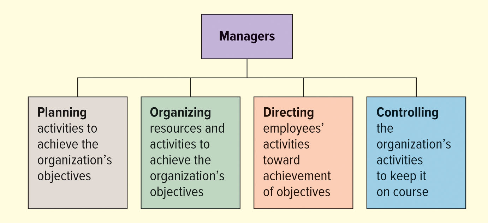
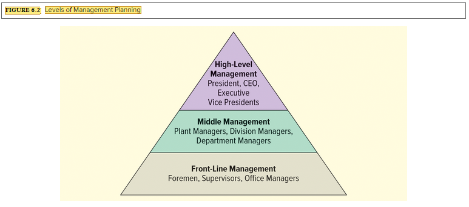
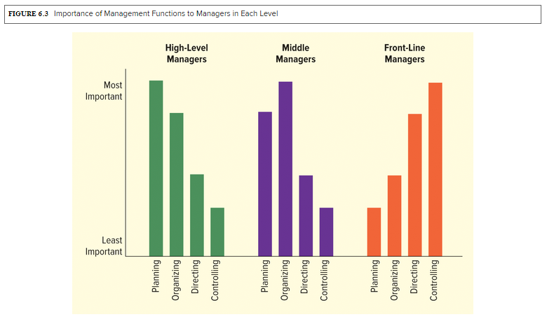
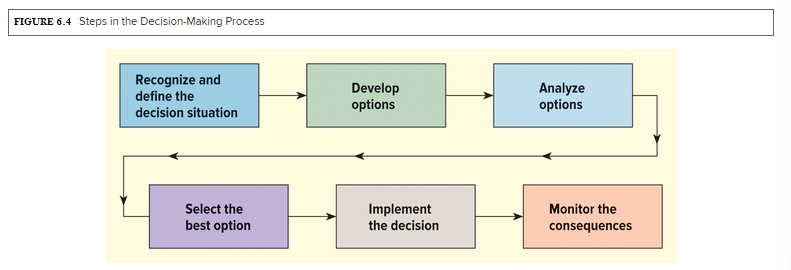

<h1 id="Chapter_6._The_Nature_of_Management_" style="color:#42A5F5;">Indice</h1>

---
##### [Chapter LO 6-1: The Importance of Management](#508096)

##### [Chapter LO 6-2: Management Functions](#006536)

##### [Chapter LO 6-3 Types of Management](#783797)

##### [Chapter LO 6-4 Skills Needed by Managers](#739767)

##### [Chapter LO 6-5 Leadership](#531757)

##### [Chapter LO 6-6 Decision Making](#156586)
---

<h1 id="508096" style="color:#E65100;">
  <a href="#Chapter_6._The_Nature_of_Management_" style="color:inherit; text-decoration:none;">
LO 6-1: The Importance of Management
  </a>
</h1>

## Introduction
- **management** is a process designed to achieve the objectives of an organization using resources **effectively** and **efficiently**.
  - **Effective:** achieve the desired result.
  - **Efficient:** achieve objectives with a minimum of resources.
- **Managers** make decisions about the use of resources and are responsible for:
  - Plan
  - Organize
  - Lead
  - Control the activities of the organization

- Management is **universal**: it is applied in business, government, military, unions, hospitals, schools and religious groups.

---

## 1. Human resources administration
- Organizations must acquire and coordinate resources: **people, services, materials, equipment, finances and information**.
- **employees** are one of the most important resources.
- **Staffing (Hiring):**
  - Recruit people for jobs.
  - Determine necessary skills.
  - Motivate and train employees.
  - Establish salaries and benefits.
  - Prepare employees for higher level roles.
- **Bonuses or benefits** are sometimes granted instead of salary increases for:
  - Immediate gratification to employees.
  - Reduce risks in economic recessions.
- **Downsizing:** eliminate employees when necessary (e.g. COVID-19).
  - Effective managers promote **optimism and positive thinking** after staff reductions.

---

## 2. Supplier and operations management
- Companies must acquire **reliable suppliers** to ensure product availability.
- Ejemplos: **Hershey, General Mills, Mondelez International**.
- A good supplier:
  - Maximizes efficiency.
  - Offers creative solutions to reduce costs and achieve objectives.

---

## 3. Financial management
- Managers need **adequate financial resources** for essential activities.
- Financing sources:
  - Owners and shareholders
  - Banks and financial institutions

---

## 4. Coordination and control
- All resources must be **coordinated and controlled** to:
  - Achieve the organization's objectives
  - Generate profits
- Proper management of **people, suppliers and finances** is key to success.

---

## Practical example
- **Unilever**: its executive team includes CEO, Chief Digital Officer, Chief People Officer and more, coordinating resources globally.

- **Main objective of the manager:** ensure that all resources (human, material and financial) are used efficiently to meet organizational objectives.

<h1 id="006536" style="color:#E65100;">
  <a href="#Chapter_6._The_Nature_of_Management_" style="color:inherit; text-decoration:none;">
LO 6-2: Management Functions
  </a>
</h1>

## Introduction
- Managers coordinate resources so that the company can **develop, produce and sell products**.
- This is achieved through **four main functions**:

---

</img>

---

## 1. Planning
- Determine **objectives** and the **methods** to achieve them.
- Allows you to anticipate problems and organize resources effectively.

---

## 2. Organizing
- **Group resources and activities** to achieve objectives.
- Involves assignment of tasks, establishment of departments, hierarchies and lines of authority.

---

## 3.Directing
- Guide and supervise employees to **achieve objectives**.
- Includes motivation, leadership, communication and daily decision making.

---

## 4. Controlling (Control)
- **Monitor and evaluate** progress towards objectives.
- Allows adjustments to be made when results do not meet planned standards.

---

## Important note
- Although these functions are described separately, **they are interrelated**:
  - A manager can be planning and organizing at the same time.
  - You can also direct and control simultaneously.

---

## 1. Planning
- **Definition:** Process of determining the organization's objectives and deciding how to achieve them.
- It is the **first function of management** and serves as a **map for the other functions**.
- Includes:
  - **Event forecast**
  - **Selection of the best course of action** among several options
  - Specify **what to do, who does it, where, when and how**

- **Written plan:** document that serves as a **blueprint** of the mission, objectives and activities necessary to achieve results.
- A **strategic plan**:
  - Defines the sequence of decisions
  - Organize resources and business functions
  - Guides the company towards the market and profits

---

## 2. Mission
- **Definition:** Statement of the fundamental purpose and basic philosophy of the organization.
- Answers the question: "**What business are we in?**"
- **Characteristics of a good mission:** clear, concise and answers five key questions:
1. Who are we?
2. Who are our clients?
3. What is our operating philosophy? (beliefs, values, ethics)
4. What are our competencies and competitive advantages?
5. What are our responsibilities as managers of environmental, financial and human resources?

- **Example:**
  - **Walt Disney Company:**
    > "Entertain, inform and inspire people around the world through unparalleled storytelling, reflecting the iconic brands, creative minds and innovative technologies that make Disney the world's leading entertainment company."

---

## 3. Goals
- **Definition:** General statements of what the organization aspires to achieve.
- Features:
  - They do not contain specific metrics
  - They are aspirational and long-term
  - They must be **consistent and realistic** according to the current position of the company

- **Examples of objectives:**
  - Best product in quantity and quality
  - More trained and creative employees
  - Corporate culture with high integrity
  - **Beyond Meat:** educate consumers about the environmental benefits of plant-based meat

---

> **Summary:**
> Planning establishes **mission, objectives and goals** as the basis for all other management functions. It is essential for aligning resources, making strategic decisions, and guiding the organization to success.

## Objectives
- **Objectives** are **measurable references** that derive from the mission and goals of the organization.
- They can be **elaborate or simple**, depending on the company.
- Common examples of objectives:
  - Increase sales by 50% during a specific period
  - Improve operational efficiency
  - Expand market share

### Objective characteristics:
- **Measurable and specific** (unlike goals, which are more general)
- **Short term**, generally more immediate than the goals
- Types of objectives:
1. **Profit Objectives**: Generate money and assets after covering expenses
2. **Competitive advantage objectives**: increase percentage of sales and market share
3. **Efficiency goals**: make the best possible use of resources
4. **Growth objectives**: adaptability and timely launch of new products

> Objectives provide **direction for all management decisions** and **criteria for evaluating performance**.

---

## Key Performance Indicators (KPIs) – Key Performance Indicators
- After establishing objectives, **specific and quantitative metrics** called KPIs are defined.
- **KPIs** are **measured, tracked and analyzed** to evaluate progress towards objectives.

### KPI functions:
- Measure progress towards goals
- Reveal trends and warn when a goal should be adjusted

### Key differences:
| Concept | Definition |
|---------------|------------|
| **Goal (Meta)** | Broad and long-term aspiration |
| **Objective** | Short-term measurable reference |
| **KPI** | Specific and continuous metrics to monitor progress |

### Example:
- **Objective:** Increase sales by 50% in a given period
- **Possible KPIs:**
  - Average Order Value
  - Conversion Rate
  - Retention Rate
  - Customer Acquisition Cost
  - Total Sales

> Managers must identify relevant KPIs for each objective and **monitor them continuously**, not just at the beginning or end of a process.

## 📊 SPLUNK: KPIs at the Front

**Splunk** is a software company based in San Francisco, with more than 7,500 employees, 2,400 applications and 1,020 patents. The company helps clients:

- Use data to **track performance**
- Make **decisions in real time**
- Increase **security**

Splunk understands the importance of **planning and controlling** and focuses on **meeting objectives and measuring performance through KPIs**.

---

### Personnel Cuts and Strategic Measures
- Splunk cut **4% of its workforce**, like many other tech companies (Amazon, Salesforce, PayPal) in the face of a slower economy.
- Although layoffs seek to **save costs**, they can be costly in the short term. Splunk's restructuring plan has an estimated cost of **$28 million**.
- Additional control measures:
  - Reduction of **outsourcing** and dependence on external agencies
  - Investment in **innovation and engagement with customers**

**CEO Gary Steele** leads the changes to stabilize the company, scale operations and increase revenue, following a **comprehensive strategic plan**.

---

### KPIs a Splunk
Splunk monitors a variety of **Key Performance Indicators (KPIs)**:

- **Customer Success:**
  - Net Retention Rate
  - Other possible KPIs:
    - Monthly Recurring Revenue (MRR)
    - Customer Lifetime Value (CLV)
    - Customer Satisfaction (CSAT)

> **Retention and growth of existing customers** can be more profitable than attracting new customers.
> Splunk has a **Net Retention Rate of 127%** for its cloud services, indicating growth potential.

- **Importance of KPIs:**
  - They allow you to set goals, develop plans and measure performance
  - They help balance **growth and profitability**
  - Fundamental for **strategic decisions** during the reorganization

---

### Critical Thinking

### Answers: Critical Thinking about Splunk

#### 1. What factors do you think have contributed to technology companies laying off employees?

- **Economic slowdown or market uncertainty:** Companies reduce staff due to slower growth.
- **Reduction of operating costs:** Layoffs reduce salary expenses and optimize resources.
- **Restructuring and internal efficiency:** Duplicate or less strategic roles are eliminated.
- **Pressure from investors or financial results:** Adjustments to meet profitability expectations.

> Example: Splunk eliminated **4% of its workforce** to prepare for the economy and adjust its structure.

---

#### 2. Why do you think Splunk reduced outsourcing?

- **Greater control over strategic processes:** Less dependence on third parties allows direct supervision.
- **Long-term cost reduction:** Internalizing key functions can be more efficient.
- **Focus on innovation and customer retention:** Internal teams aligned with strategic objectives.
- **Stability and consistency:** Maintain quality standards and streamline decisions.

---

#### 3. How does Splunk use KPIs to measure success?

- **Customer success measurement:**
  - Net Retention Rate
  - Monthly Recurring Revenue (MRR)
  - Customer Lifetime Value (CLV)
  - Customer Satisfaction (CSAT)

- **Guide for strategic decisions:** KPIs indicate when to adjust plans or objectives.
- **Continuous evaluation:** Existing and new clients are monitored for retention and expansion.
- **Growth and profitability:** Example: Net Retention Rate of 127% demonstrates growth potential within current customers.

> KPIs allow Splunk to **monitor progress, evaluate results and make informed decisions** to achieve organizational and strategic objectives.

## 📝 Types of Plans in Business Management

---

### 1. Strategic Plans
- Developed by the **senior managers** of the company.
- They establish **long-term objectives** and the **general strategy** to fulfill the mission.
- They normally cover periods of **one year or more**.
- They include plans such as:
  - Add new products
  - Buy companies
  - Sell unprofitable segments
  - Issue shares
  - Expand to international markets

> Example: **Credit Suisse** implemented a multi-year strategic plan to create value for shareholders through restructuring and downsizing.

- They must consider:
  - Capacities and resources of the organization
  - Changes in the business environment
  - Organization objectives
- They must be **market-oriented**, aligning customer demand with operational capabilities, processes and human resources.

---

### 2. Tactical Plans
- They are **short-term plans**, designed to implement the objectives of the strategic plan.
- They normally cover **one year or less**.
- They allow the organization to **react to changes in the environment** while maintaining the overall strategy.
- They require **periodic review and updating**.

#### Examples:
- Credit Suisse: accelerate **cost reduction** to support the long-term strategic plan.
- A retail company:
  - Strategic plan: store closures and sales restructuring for 5 years.
  - Tactical plan: decide **which stores to close, how to improve online presence and handle layoffs**.

- They allow the general strategy to be executed and are **easier to adjust** to changes in the environment or company performance.

---

### 3. Operational Plans
- They are **very short plans**, which specify **concrete actions of individuals, teams or departments** to fulfill the tactical and strategic plans.
- They apply to daily, weekly or monthly activities.

#### Examples:
- Assign **weekly production quotas** to meet tactical and strategic goals.
- Retail:
  - Open a new store
  - Hire and train employees
  - Get merchandise
  - Start operations

---

### 4. Crisis Management / Contingency Plans
- They focus on **potential disasters**, such as:
  - Product contamination
  - Oil spills
  - Fires or earthquakes
  - Computer viruses or pandemics
  - Reputation problems due to unethical behavior

- Many companies lack updated contingency plans; According to FEMA, **40% of small businesses do not reopen after a disaster**.
- Companies with well-designed plans **respond more effectively**.

#### Examples of crisis practices:
- **Dedicated teams**: Ashland Oil, H.J. Heinz, Johnson & Johnson
- **Periodic drills** to train employees
- **COVID-19**: supply chain reassessment and detailed operations mapping

#### Key elements of crisis plans:
- Maintain operations during the crisis
- Communicate clear information to:
  - Public
  - Employees
  - Authorities
- Quick and public communication minimizes rumors and demonstrates control.

#### Case study: KFC UK
- Reduced its logistics network to save costs → two thirds of its stores were **without chicken for several days**.
- Media apology campaign helped **maintain reputation**.
- Highlights the importance of **planning and publicly reacting to disasters**.

## 1. Organizing

- **organization** is the structuring of resources and activities to achieve objectives in an **efficient and effective** manner.
- Managers organize by reviewing plans and determining what activities are necessary, dividing work into **small units** and assigning them to individuals, groups or departments.
- Many companies reorganize work into **key process teams**, such as new product development, instead of relying on traditional departments (marketing, production).
- Organization occurs **continuously**, because change is inevitable.

### Importance of Organization
- Creates **synergy**: the effect of the whole is greater than the sum of its parts.
- Establish **lines of authority**
- Improves **communication**
- Avoid **duplication of resources**
- Improves **competitiveness** by accelerating decision making

### Examples:
- **Coinbase Global Inc.:** reorganized product, engineering and design teams to focus on core products and improve productivity.
- **Ford:** eliminated thousands of jobs in North America and made significant changes to operations and leadership.

### Business Models
- A **business model** describes how a company creates, delivers and organizes value for stakeholders.
- It works as a **concept map** of the company's operations and structure.

#### Examples of business models:
- Franchise: Subway
- Direct sales: Avon
- Direct marketing and ecommerce: Amazon
- Subscription: Netflix
- Sharing economy: Uber, Airbnb

> The future will bring business models related to the digital economy, autonomous vehicles, robotics, drones and artificial intelligence, including **subscription pricing** and advanced control through AI.

---

## 2.Directing

- **Directing** involves motivating and leading employees to achieve the organization's objectives.
- Includes **telling employees what to do and when to do it**, implementing deadlines and **stimulating their work**.

### Address Examples:
- A **sales manager**: motivates the sales team, leads, teaches how to respond to customer needs and evaluates results.
- A **production line supervisor (Frito-Lay)**: ensures that employees use the equipment correctly, have the necessary resources and are motivated to achieve the expected production.

### Motivation and Recognition
- Employees need more than money: they want their **opinion and contribution** to be valued.
- Smart managers:
  - They delegate **decision authority** to young employees
  - They request **ideas to reduce costs, improve efficiency, customer service or new products**
- Recognition and appreciation are effective motivators.
- Understanding how employee actions affect the **financial success of the company** increases productivity.

> Employee motivation is discussed in more detail in the "Motivating the Workforce" chapter.

## 3. Controlling (Control)

- **Controlling** is the process of evaluating and correcting activities to keep the organization on track toward its objectives.
- It is closely linked to **planning**, since plans establish objectives and standards that must be met.

### Control Activities
1. **Measure performance**
2. **Compare current performance with standards or objectives**
3. **Identify deviations** from standards
4. **Investigate the causes of deviations**
5. **Take corrective action** when necessary

### Relationship with Planning
- Planning establishes **objectives and standards**.
- Control allows **monitoring performance and comparing with standards**.
- If performance is less than expected, management determines the cause and takes action to **course correct**.

> Example: In an academic course, if you don't get good grades on the first few exams, control could involve **increasing study time or using online resources** to achieve the ultimate goal of getting an A or B.

### Forms of Control
- Visual inspections
- Tests and evaluations
- Statistical models

- The main idea is to ensure that **operations meet requirements** and are satisfactory to achieve objectives.

### External Application
- Control also helps manage **external problems**, such as negative publicity.
- Allows you to **identify the cause of the problem** and guide the company's response.

## 📌 Case Study: Toshiba and Corporate Management

**Toshiba Corporation**, a multinational Japanese conglomerate, faced **corporate governance scandals** and pressure from activist investors after years of mismanagement.

### Key issues:
- **Accounting scandals:** The company overstated its value by approximately **$2 billion over 7 years**.
- **Problems in the nuclear business:** Excessive costs and projections of **$6.3 billion in losses**.
- **Westinghouse Electric:** The subsidiary filed **bankruptcy under Chapter 11**.
- **Sale of Toshiba Memory:** Legal problems and disputes with joint venture partners.
- **Risk of delisting:** The company was close to being delisted from the stock market.
- **Voting scandal:** Directors proposed by activist investors were rejected, undermining the **credibility of the voting process** and **shareholder trust**.
- **Collusion with the Japanese Ministry of Commerce:** An attempt was made to prevent foreign investors from gaining power.

### Measures taken:
- **Senior managers** conducted a strategic review and proposed **splitting the company** moving forward.
- The initial proposal was rejected by the shareholders, forcing the company to **rethink the plan**.
- Eventually, Toshiba agreed to a **$15 billion deal with Japan Industrial Partners**, proving that **planning is a continuous process**.

### Comparisons:
- **General Electric:** separation plan into three public companies.
- **Johnson & Johnson:** separation of consumer products and pharmaceutical businesses.

---

## Critical Thinking

1. **To what extent did poor planning and control contribute to Toshiba's problems?**
   - The lack of control allowed **accounting overestimations and financial deviations**.
   - Inadequate planning and insufficient oversight affected strategic decisions, such as the acquisition of Westinghouse and the management of nuclear assets.

2. **How ​​did the voting scandal undermine shareholder confidence?**
   - **Lack of transparency and collusion** showed that investors could not influence key decisions.
   - Generated **distrust about corporate governance** and equity in voting processes.

3. **Why is Toshiba under intense shareholder scrutiny?**
   - History of **financial and governance scandals**.
   - Need to **regain trust** through more effective transparency, planning and control.
   - Pressure from activist investors to implement **strategic and structural changes**.

<h1 id="783797" style="color:#E65100;">
  <a href="#Chapter_6._The_Nature_of_Management_" style="color:inherit; text-decoration:none;">
LO 6-3 Types of Management
  </a>
</h1>

### 
**Distinguish between the three levels of management and the responsibilities of managers at each level.**

---

## Introduction
- All managers—from the owner of a small jewelry store to the hundreds of managers at large companies like Home Depot—perform the **four functions of management**:
  - Planning
  - Organizing
  - Directing
  - Controlling (Control)

- In a **small company**, a single person can be in charge of all these functions.
- In a **large company**, the responsibilities should be:
  - **Divided**
  - **Delegates**

---

## Division of Management Labor
- The division of responsibilities is achieved through:
  - **Management levels**
  - **Areas of specialization**, such as:
    - Finance
    - Marketing
    - Operations

- This allows the organization to function in a more **efficient and structured** manner.

---

## Idea Clave
> As an organization grows, management becomes more complex, requiring **different levels of managers** with specific responsibilities.

## 📊 Levels of Management

- Many organizations have **multiple levels of management**:
  - **High-level management**
  - **Middle management** (Gerencia media)
  - **Front-line / Supervisory management** (First-line management or supervisors)

- These levels form a **pyramid-shaped structure**:
  - Fewer managers in **top management**
  - More managers at the **middle level**
  - Even more at the **operational or supervisory level**

---

## Level Characteristics

- In **small organizations**:
  - There can be **only one manager** (usually the owner)
  - This assumes responsibilities of the **three levels**

- In **large organizations**:
  - There are **many managers at each level**
  - They are responsible for coordinating the use of company resources

---

## Funciones de los Gerentes

- All managers, regardless of level, perform the **four functions of management**:
  - Planning
  - Organizing
  - Directing
  - Controlling (Control)

- However:
  - **The time dedicated to each function varies depending on the management level**

---

## Idea Clave
> As you move up the hierarchy, the manager's responsibilities and focus change, although everyone still applies the same basic management functions.

</img>

</img>

### 💡 DID YOU KNOW?
- The average annual salary of **CEO** is **$213,020**.
- However, in large corporations they can earn **millions** in:
  - Wages
  - Bonuses
  - Actions
  - Options
  - Additional benefits

---

### 🏢 High-Level Management

#### Definition
- Includes main executives such as:
  - CEO (Chief Executive Officer)
  - CFO (Chief Financial Officer)
  - COO (Chief Operating Officer)
  - President

- They have **total responsibility for the organization**.

#### Roles
- **CEO:** directs the general strategy and represents the company
- **COO:** manages daily operations (second in command)
- The CEO responds to the **board of directors**

#### Examples in other sectors
- Government: president, governor, mayor
- Education: rector, superintendent

---

#### Main Functions
- They focus mainly on **planning**
- They make strategic decisions such as:
  - Launch products
  - Acquire companies
  - Sell unprofitable units
  - Expand internationally

- They represent the company before:
  - Public
  - Regulators

---

#### 💰 Executive Compensation
- Includes:
  - Salary
  - Bonuses
  - Long-term incentives
  - Stocks and options

- Many companies seek to **align pay with performance**:
  - Good performance → higher compensation
  - Poor performance → lower compensation

---

#### 📊 Examples of CEO compensation

| CEO | Enterprise | Compensation |
|------------------|-------------------|--------------|
| Elon Musk | Tesla | $10 billion |
| Robert Scaringe | Rivian | $2.3 billion |
| Tim Cook | Apple | $853 million |
| Peter Rawlinson | Lucid | $575 million |
| Tom Siebel | C3.ai | $343 million |

---

#### ⚖️ Use
- Some executives receive criticism for high salaries.
- Example:
  - **Warren Buffett** earns $100,000 a year (≈ $375,000 total).

---

### 🌍 Diversity, Equity and Inclusion (DEI)

- **Diversity** improves:
  - Decision making
  - Innovation
  - Financial results

- **inclusion** creates an environment where:
  - All employees are treated with respect
  - There are equal opportunities

- Example:
  - **Mastercard** has been recognized for promoting inclusion

- Importance:
  - Improved connection with diverse markets (Hispanics, African Americans, Asians, etc.)

---

### 📋 Rules for Diversity Recruitment

1. **Involve employees**
2. **Communicate the benefits of diversity**
3. **Support diversity initiatives**
4. **Assign resources**
5. **Actively promote initiatives**

---

### 📋 TABLE 6.2: Five Rules of Successful Diversity Recruiting

| Rule | Action |
|------|--------|
| 1. Involve employees | Educate all employees about the tangible benefits of diverse recruiting to generate support and enthusiasm. |
| 2. Communicate diversity | Candidates need to see real evidence of diversity; It is not enough to say that the company is inclusive. |
| 3. Support diversity initiatives and activities | Supporting diverse community organizations generates positive publicity and attracts qualified candidates. |
| 4. Delegate resources | Invest resources to communicate the diversity message in the right places. |
| 5. Promote your diversity initiatives | Present the company in an attractive and convincing way to diverse candidates. |

---

### ⚖️ Gender Equality
- Current problems:
  - Less representation of women in senior positions
  - Salary gaps

- Data:
  - Only **12%** of board positions are held by women

- Positive example:
  - **Starbucks** has achieved equal pay and opportunities

---

### ✅ Idea Clave
> Senior management makes key strategic decisions, but also faces important challenges such as **executive compensation, diversity and inclusion**, and **stakeholder trust**.

### 🏢 Middle Management (Gerencia Media)

- Middle managers do not make global strategic decisions, but rather focus on:
  - **Tactical and operational plans**
  - Implement the guidelines established by senior management

- Their responsibility is **more specific and limited** than that of senior managers.
- They are involved in the **daily operations** of the organization.
- They dedicate more time to the **organizing** function.

#### Examples of Middle Managers:
- Plant managers
- Division managers
- Department managers
- Product manager (ej. detergente)
- Head of university department
- State public health director

> Note: The number of middle managers has decreased due to **downsizing** in many companies.

---

### 👷 Front-Line Management

- They are the **direct supervisors** of the employees.
- They represent the **first level of management experience** for many people.

#### Responsibilities:
- Implement middle management plans
- Supervise the daily work of employees
- Ensure compliance with tasks and objectives

- They dedicate most of their time to:
  - **Directing (direction)**
  - **Controlling (control)**

#### Common titles:
- Supervisor
- Foreman
- Office manager

---

### ✅ Idea Clave
> The three levels of management have different focuses:
- **Senior management:** strategic planning
- **Middle management:** organization and implementation
- **First line:** direction and control of daily operations

## 📊 Areas of Management

- At each level of management there are managers who specialize in **key functional areas** of the business:
  - Finance
  - Production and operations
  - Human resources
  - Marketing
  - Supply chain
  - Information technology (IT)
  - Administration

---

### 🧩 Importance of Areas
- All areas are essential for business success.
- Examples:
  - Without **finance**, there are no economic resources
  - Without **human resources**, there is no staff
  - Without **operations**, there are no products or services

- In large companies:
  - Each area has **specialized managers**

- In small companies:
  - The owner or a few employees perform **multiple functions**

---

### ⚙️ Key Responsibilities
Every company should ensure that someone is responsible for:
- Obtain financial resources
- Transform resources into products or services
- Manage employees
- Market goods and services
- Manage technology
- Manage the business in general

---

### 📋 TABLE 6.3: Types of Managers by Area

| Manager | Function |
|--------|--------|
| Financial manager | Obtains and manages financial resources according to the organization's objectives |
| Production and operations manager | Supervises the transformation of resources into products, services or ideas |
| Human resources manager | Manage personnel and labor relations |
| Marketing manager | Plan, price, promote and distribute products |
| IT manager | Implements, maintains and controls technological systems |
| Administrative manager | Manage the entire business or a significant part without specializing in a specific area |

---

### 💡 Note on IT
- **IT managers** are responsible for:
  - Computer networks
  - Technological systems
  - Business applications

---

### ✅ Idea Clave
> Management areas represent the **essential functions of any company**, and each one contributes directly to the achievement of organizational objectives.

<h1 id="739767" style="color:#E65100;">
  <a href="#Chapter_6._The_Nature_of_Management_" style="color:inherit; text-decoration:none;">
LO 6-4 Skills Needed by Managers
  </a>
</h1>

### 
**Specify the skills managers need to be successful.**

- Managers are evaluated by:
  - **Effectiveness** (achieving objectives)
  - **Efficiency** (use resources well)

- To achieve this, they need several key skills:
  - Technical expertise
  - Conceptual skills
  - Analytical skills
  - Human relations skills
  - Leadership

---

### 🛠️ Technical Expertise

- Specialized knowledge necessary to perform specific tasks.
- Examples:
  - Accounting managers → knowledge in accounting
  - Production managers → knowledge in production processes

- Importance:
  - Allows you to train employees
  - Solve problems
  - Give guidance

- 🔑 Most important in:
  - **Front-line managers**
- 🔻 Less important in:
  - **High-level managers**

---

### 🧩 Conceptual Skills

- Capacity of:
  - Think abstractly
  - See the big picture
  - Understand how the parts make up a whole

- Importance:
  - Fundamental for **senior management**
  - Allows you to evaluate the direction of the company

- Includes:
  - **Creative thinking**
  - Development of innovative ideas

---

### 🔍 Analytical Skills

- Capacity for:
  - Identify relevant problems
  - Understand relationships between variables
  - Detect causes of situations

- Allows:
  - Make informed decisions
  - Evaluate multiple options

- Importance:
  - Key in complex situations
  - Very important in **senior management**

> Example: analyze large volumes of data to solve business problems.

---

### 🤝 Human Relations Skills

- Ability to work with people:
  - Effective communication
  - Empathy
  - Understanding of needs
  - Teamwork

- Importance:
  - Essential in service companies
  - Improves performance and work environment

- Example:
  - **Southwest Airlines** trains its employees in:
    - Leadership
    - Communication
    - Change management

---

### ⭐ Leadership (Liderazgo)

- Capacity of:
  - Guide and motivate employees
  - Positively influence performance
  - Direct towards achieving objectives

- Related to:
  - Motivation
  - Decision making
  - Organizational culture

---

### ✅ Idea Clave
> A successful manager combines **technical, analytical, conceptual and human skills**, adapting them according to their level within the organization.

<h1 id="531757" style="color:#E65100;">
  <a href="#Chapter_6._The_Nature_of_Management_" style="color:inherit; text-decoration:none;">
LO 6-5 Leadership
  </a>
</h1>

###
 
**Describe the different leadership styles.**

- **Leadership** is the ability to influence employees to work toward organizational goals.
- Effective leaders:
  - They address **organizational culture**
  - They consider the **needs of employees**

---

### 📋 Requirements for Successful Leadership (Table 6.4)

- Communicate goals and expectations
- Gain respect and trust
- Develop shared values
- Acquire and share knowledge
- Empower employees
- Be a role model
- Provide rewards and take corrective actions

---

### 🎯 Leadership Styles

#### 🔴 Autocratic Leadership (Autocrático)
- The manager makes **all decisions**
- Employees only carry out instructions
- Use of authority and rewards

- ✔️ Useful when:
  - Employees are not trained or motivated
  - Quick decisions are required

- Example:
  - **Martha Stewart**

---

#### 🔵 Democratic Leadership (Democrático)
- The manager **involves employees** in decisions
- It is encouraged:
  - Stake
  - Ideas
  - Opinions

- ✔️ Advantages:
  - Greater commitment
  - Less supervision needed

- Example:
  - **Carol B. Tomé (UPS)**

---

#### 🟢 Free-Rein Leadership (Laissez-Faire)
- The manager gives **total freedom** to the employees
- Sets goals, but does not interfere

- ✔️ Requires:
  - Trained employees
  - High motivation

- ✔️ Benefit:
  - Promotes creativity and confidence

- Example:
  - **Warren Buffett**

---

### ⚖️ Which style is better?

Depends on:
- Type of employees
- Situation
- Manager skills

- Example:
  - Quick decisions → **autocratic** style
  - Expert teams → **democratic or free** style

> Effective managers **adapt their style depending on the situation**.

---

### 🌟 Other Leadership Styles

#### 🔶 Authentic Leadership (Auténtico)
- Passion for the mission
- Act according to values
- Build long-term relationships

#### 🤝 Servant Leadership (Servidor)
- Prioritize **employee needs**
- Focused on relationships

- Key difference:
  - Authentic → lead by example
  - Server → puts others first

- Example:
  - **Hamdi Ulukaya (Chobani)**

---

## 🚀 Employee Empowerment

- Occurs when employees:
  - They have **responsibility**
  - They can **make decisions**

- Benefits:
  - Greater motivation
  - Greater productivity
  - Better organizational performance

- Does not eliminate the manager:
  - The manager continues to guide and make key decisions

---

### 🤝 Participative Decision Making
- Involves:
  - Managers + employees

- It is encouraged through:
  - Training
  - Communication
  - Teamwork

- Example:
  - **Tim Cook (Apple)** listens to employee opinions

---

### 👥 Team Leadership

- Teamwork:
  - Promotes innovation
  - Improve decisions

- Example:
  - **Zappos** promotes team decisions

- Straight:
  - Domain of some members
  - **Groupthink**

- Solutions:
  - Rotate leaders
  - Encourage participation
  - Train in communication

---

### ✅ Idea Clave
> There is no single ideal leadership style. Effective leaders **adapt their style, empower their employees and align the team with a common vision**.

<h1 id="156586" style="color:#E65100;">
  <a href="#Chapter_6._The_Nature_of_Management_" style="color:inherit; text-decoration:none;">
LO 6-6 Decision Making
  </a>
</h1>

###
 
**Summarize the systematic approach to decision making used by many managers.**

- Managers make decisions about:
  - Working hours
  - Hiring employees
  - Product introduction
  - Product prices

- Decision making is **important in all management functions** and at all levels (strategic, tactical and operational).

---

### 🔹 6-Step Systematic Approach

1. **Recognize and define the decision situation**
2. **Develop options to resolve the situation**
3. **Analyze the options**
4. **Select the best option**
5. **Implement the decision**
6. **Monitor the consequences of the decision**

> This systematic approach generally leads to more effective decisions and reduces errors.

---

### 📊 Figure 6.4
**Steps in the Decision Making Process**
_(See figure in the book for a visual diagram of the 6 steps)_

</img>

## 
**Summarize the systematic approach to decision making used by many managers.**

Managers make decisions about:
- Working hours
- Hiring employees
- Product introduction
- Product prices

Decision making is **important in all management functions** and at all levels (strategic, tactical and operational).

---

## 1. Recognizing and Defining the Decision Situation
- The first stage consists of recognizing and defining the situation.
- The situation can be **negative** (large losses on a product) or **positive** (opportunity to increase sales).
- Small problems can appear without warning; Big problems usually show early signs (declining profits, inventory buildup, retailers rejecting a product).
- Correctly defining the problem is key: different definitions lead to very different solutions (example: quality problem vs change in consumer preference).

## 2. Developing Options
- Create a list of possible courses of action.
- Must include **standard and creative plans**.
- **Brainstorming** is useful to encourage creativity and diversity of ideas.
- The time and resources dedicated depend on the importance of the decision.
- Options can arise from individuals, teams or analysis of similar situations.

## 3. Analyzing Options (Analizar opciones)
- Evaluate the **practicality and appropriateness** of each option.
- Limiting factors: financial resources, legal restrictions, ethics, authority, technology, economics, information or experience.
- Consider the **impact on the situation and the organization**.
- Example: analyze how a price cut will affect cash flow and customer reaction.

## 4. Selecting the Best Option
- Select the most appropriate option.
- It can be subjective; analyze **risks and benefits** of each alternative.
- A single option is not always chosen; Sometimes several options are combined.
- Example: Amazon decides how to use Alexa for payments with associated risks.

## 5. Implementing the Decision
- Put the selected option into action.
- It can be simple or complex depending on the decision.
- Example: launching a new product requires cross-functional teams (Coca-Cola, Procter & Gamble).
- Prepare for **unexpected consequences** during implementation.

## 6. Monitoring the Consequences
- Evaluate whether the decision achieved the desired results.
- Allows efficient changes to be made if the results are not as expected.
- Example: Walmart monitors food recalls to protect consumers.
- If the situation was poorly defined or the implementation failed, it may be necessary to restart the decision-making process.

# Stripe CEO Rethinks Decision Making

Stripe, an Irish-American technology company that provides payment processing software and applications for e-commerce websites and mobile apps, was founded in 2011 by brothers Patrick and John Collison. With two headquarters, one in San Francisco and one in Dublin, Patrick Collison has been creative about **effective decision making**. Managers make many decisions related to various areas of business: hiring, distribution, marketing, and implementing new technologies. While many managers follow a systematic approach, Stripe's CEO embraces **lateral thinking**.

## Lateral Thinking
The term was coined by **Edward de Bono**, psychologist, inventor and creative thinking expert. It refers to the ability to solve problems using an indirect and creative approach to find original solutions to complex questions. According to Patrick Collison:
- Traditional decision-making approaches are **overrated**.
- Few decisions are binary (yes/no, right/wrong).
- Instead of asking “What decision should I make?”, you should ask: “How can I make better decisions?”
- Instead of debating between options A and B, people should make sure that both options are as optimal as possible and consider that there could be more options.

## Lateral Thinking y Stripe
Lateral thinking inspired the creation of Stripe. The Collison brothers noticed that accepting payments online was very complicated. They understood that software engineers would be the most important group to attract, rather than finance professionals. So they built Stripe to **attract engineers**, and it worked. Stripe products simplify complex payment processing tasks, which makes engineers love them.

Today, the company is valued at more than $63 billion, employs more than 8,000 people across 23 global offices, and serves millions of Stripe users.

## Critical Thinking Questions

1. **What is lateral thinking?**
   **Answer:** Lateral thinking is the ability to solve problems in a **creative and indirect** way, seeking original solutions instead of following traditional or linear approaches.

2. **How ​​is creativity important in decision making?**
   **Answer:** Creativity allows us to generate **more options and better solutions**, explore alternatives that would not be evident with traditional methods, and adapt to complex or novel situations.

3. **Why did the Collison brothers want Stripe to attract software engineers?**
   **Answer:** Because they understood that **engineers would be the key users** who would value and use their payment processing software, ensuring that Stripe was widely adopted and simplified complex online payment tasks.

# Management in Practice

Management is not exact or calculated. There is no mathematical formula for managing an organization and achieving organizational goals, although many managers wish there was. Managers plan, organize, direct and control, but management expert John P. Kotter says that even these functions can be boiled down to two basic activities:

1. Determine what to do despite uncertainty, great diversity, and enormous amounts of potentially relevant information.
2. Getting things done through a large, diverse set of people, despite having little direct control over most of them.

Managers spend up to 75% of their time working with others—not just subordinates, but also bosses, people outside their work hierarchy, and people outside the organization. In these interactions, they discuss anything and everything remotely related to their business.

Managers spend a lot of time establishing and updating an agenda of objectives and plans to carry out their responsibilities. An agenda contains both specific and vague elements, covering short-term goals and long-term objectives. Like a calendar, the agenda helps the manager determine what needs to be done and how to do it to meet the goals set by the organization. Technology tools like smartphones can help managers manage their agendas, contacts, communications, and time.

Managers also spend a lot of time networking—building relationships and sharing information with colleagues who can help them accomplish their agenda items. They spend much of their time communicating with various people and participating in activities that, on the surface, don't seem to have much to do with their organization's goals. However, these activities are crucial to getting the job done. Networks are not limited to immediate subordinates and bosses; They also include other people in the company, as well as clients, suppliers and friends. These contacts provide managers with information and advice on various topics. Managers question, persuade, and motivate members of their network to obtain information and get things done. Networking helps managers fulfill their responsibilities.

Social networking sites have increased the ability of both managers and subordinates to network. Internal networks like Yammer allow employees to connect with each other, while networks like Facebook or Twitter allow managers to connect with customers. Sales managers even use social media to communicate with their distributors. LinkedIn has been used for professional networking and is gaining popularity among the younger generation as an alternative to traditional job searching. Some speculate that social media could eventually replace traditional resumes and job boards.

Finally, managers spend a lot of time dealing with the complex and difficult challenges of today's business world. Some of these challenges are related to rapid technological evolution (especially in information production and processing), increased scrutiny of individual and corporate ethics and social responsibility, the impact of social media, the changing nature of the workforce, new laws and regulations, increasing global competition and more challenging foreign markets, declining educational standards (which may limit the skills and knowledge of the future workforce and customers), and time itself—that is, making the best use of it.

But such diverse questions cannot simply be entered into a computer program that provides correct and easy-to-apply solutions. Only through creativity and imagination can managers make effective decisions that benefit their organizations.

# Team Exercise

Form groups and assign responsibility for locating crisis management implementation examples for companies facing natural disasters (explosions, fires, earthquakes, etc.), technological disasters (viruses, plane crashes, compromised customer data, etc.), health crises (pandemics, etc.), or ethical or legal disasters. How did these companies communicate with key stakeholders? What measures did the company take to provide support to those involved in the crisis? Present your findings to the class.

Ask your instructor about the simulation exercises available in this book to practice business teamwork.

# Developing your Soft Skills

## Becoming a Better Leader

Leadership is an important soft skill for many managers. But can you learn to be a better leader? Many people think so. Research online how to become a better leader. What are five tips from reliable sources? Choose one and mention a concrete way to implement it to improve your leadership skills.

# Are You Ready to Be a Manager?

Managers are needed in a wide variety of organizations. Experts suggest that employment will increase by millions of jobs in the coming years. However, the requirements for these jobs become more demanding with each passing year, with the speed of technology and communication increasing by the day, and the pressure of global trade increasing performance demands.

If you like a challenge and have the right type of personality, management is still a viable field. Even as companies are forced to restructure, management remains a vital role in business. For example, the Bureau of Labor Statistics projects that demand for financial managers will grow 17% between 2021 and 2031, much faster than average.

Salaries for management positions remain strong overall. Research has shown that internships and certifications increase a job seeker's chance of landing a job in their area of ​​interest with a higher salary. Although pay can vary significantly depending on experience level, the company you work for, and the region of the country you live in, below is a list of national average earnings for different types of managers:

- Information and computer systems managers: $159,010
- Advertising, promotions and marketing managers: $133,380
- Financial managers: $131,710
- Sales managers: $127,490
- Human resources managers: $126,230

In short, if you want to be a manager, there are opportunities in almost every field. There may be fewer middle management positions available in companies, but managers are still a vital part of most industries and will continue to be so in the future, especially as navigating global business becomes increasingly complex.
