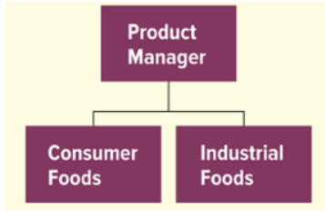
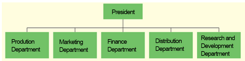

 
---
# **Question:** 1

**Question:**  

Every organization, regardless of size, organizational type, product, or profit objective, has a corporate culture.  

**Answer:**  

**True**  

**Reason:**  

Corporate culture is the set of shared values, beliefs, and behaviors that shape how employees interact and make decisions. Every organization develops its own culture, whether intentionally or organically, based on its history, leadership, work environment, and goals. Even small businesses or nonprofits have a culture that guides how work gets done and how people relate to one another.

 
---
# **Question:** 2

**Question:**  

The arrangement or relationship of positions within an organization is referred to as:  

- O job design  
- O specialization  
- ✅ the organizational structure  
- O the organizational culture  

**Answer:**  

**the organizational structure**  

**Reason:**  

Organizational structure defines how tasks, responsibilities, and authority are formally arranged within an organization. It shows the hierarchy, reporting relationships, and how different positions are connected to achieve organizational goals. Job design focuses on the content of individual jobs, specialization refers to dividing work into specific tasks, and organizational culture relates to shared values and behaviors, not the formal arrangement of positions.

 
---
# **Question:** 3

**Question:**  

A(n) _____ chart is a visual representation of how the organization is set up—showing relationships among people, who is accountable for specific work, and who reports to whom.  

- O statistical  
- O vision  
- ✅ organizational  
- O mission  

**Answer:**  

**organizational**  

**Reason:**  

An organizational chart visually depicts the structure of an organization, including the hierarchy, reporting relationships, and responsibilities. It helps employees understand who they report to and how different roles connect. Statistical charts show numerical data, a vision chart is not a standard term in management, and a mission chart would relate to goals, not structural relationships.

 
---
# **Question:** 4

**Question:**  

Dividing specific tasks into smaller jobs based on employee skill is called:  

- O layering  
- O centralization  
- ✅ specialization  
- O accountability  

**Answer:**  

**specialization**  

**Reason:**  

Specialization (or division of labor) involves breaking down work into smaller, specific tasks that employees perform based on their skills or expertise. This approach increases efficiency and allows employees to become highly skilled in a particular area. Layering refers to levels of management, centralization is about decision-making authority, and accountability refers to being responsible for completing tasks.

 
---
# **Question:** 5

**Question:**  

What word reflects the rationale for specialization in the workplace?  

- O Creativity  
- O Accountability  
- O Responsibility  
- ✅ Efficiency  

**Answer:**  

**Efficiency**  

**Reason:**  

Specialization allows employees to focus on specific tasks where they have skill or expertise, which reduces time spent switching between tasks and increases overall productivity. The main rationale is to improve efficiency, not creativity, accountability, or general responsibility.

 
---
# **Question:** 6

**Question:**  

_____ outlines a company's widely shared values, beliefs, traditions, philosophies, rules, and role models for behavior.  

- O achievements  
- O atmosphere  
- O goals  
- ✅ culture  

**Answer:**  

**culture**  

**Reason:**  

Organizational culture represents the collective values, beliefs, norms, and behaviors that shape how employees interact and make decisions. It provides guidance on expected behavior and establishes a shared identity within the organization. Achievements, atmosphere, and goals do not encompass the full set of guiding principles and behavioral norms like culture does.

 
---
# **Question:** 7

**Question:**  

The grouping of jobs into working units, usually called departments, units, groups, or divisions, is called:  

- ✅ departmentalization  
- O structuring  
- O team consolidation  
- O job analysis  

**Answer:**  

**departmentalization**  

**Reason:**  

Departmentalization is the process of organizing jobs into separate units or departments based on function, product, geography, or other criteria. This helps coordinate work, clarify responsibilities, and improve efficiency. Structuring is a broader term for overall organizational design, team consolidation is not a standard management term, and job analysis focuses on studying individual job duties rather than grouping them.

 
---
# **Question:** 8

**Question:**  

If Pete was tasked with developing an organizational structure for his company, he would______ 

- O delineate the steps necessary to manufacture the company's product  
- O outline the company's shared values, beliefs, traditions, and ways of doing things  
- O create a job description for each person in the firm  
- ✅ define the various positions in the company and their relationship to one another  

**Answer:**  

**define the various positions in the company and their relationship to one another**  

**Reason:**  

Developing an organizational structure involves establishing the hierarchy of positions, reporting relationships, and how tasks are divided and coordinated across the company. While job descriptions, manufacturing steps, and organizational culture are important, they do not define the formal arrangement of positions and authority within the organization.

 
---
# **Question:** 9

**Question:**  

The functional approach to departmentalization is common in _____ organizations.  

- O nonprofit  
- O large  
- ✅ small  

**Answer:**  

**small**  

**Reason:**  

In small organizations, functional departmentalization is often used because the company has fewer employees and needs to group similar tasks together for efficiency. Each function—like marketing, finance, or operations—may be handled by a small team or even a single person. Large organizations often require more complex departmentalization, such as divisional or matrix structures, to manage multiple products, regions, or business units.

 
---
# **Question:** 10

**Question:**  

To find out the chain of command in a company, one should consult the company's:  

- O roster  
- ✅ organizational chart  
- O ethics code  
- O organizational culture  

**Answer:**  

**organizational chart**  

**Reason:**  

An organizational chart visually shows the hierarchy of positions, reporting relationships, and the chain of command within a company. A roster lists employees but does not show relationships, an ethics code outlines rules and values, and organizational culture refers to shared beliefs and behaviors rather than formal reporting structures.

 
---
# **Question:** 11

**Question:**  

If a book seller was to separate its organization according to the types of books it sells, such as mystery, fiction, cookbooks, and textbooks, it would be an example of departmentalization by:  

- O geographic location  
- O customer group  
- O function  
- ✅ product  

**Answer:**  

**product**  

**Reason:**  

Product departmentalization organizes jobs and departments based on the specific products or product lines a company offers. In this case, separating the organization by types of books—mystery, fiction, cookbooks, and textbooks—is grouping by product. Geographic departmentalization is based on location, customer group is based on types of customers, and function is based on activities like marketing or finance.

 
---
# **Question:** 12

**Question:**  

The owner of a flower shop has three employees. Two employees are better at arranging flowers in a vase while the third is skilled at preparing the flowers to be arranged. Separating the employees by these skills is called:  

- ✅ specialization  
- O job rotation  
- O staffing  
- O layering  

**Answer:**  

**specialization**  

**Reason:**  

Specialization involves assigning tasks based on an employee’s skills or expertise to increase efficiency and productivity. In this example, employees are grouped according to their ability to arrange or prepare flowers. Job rotation involves moving employees between different tasks, staffing refers to hiring and placing employees, and layering refers to levels of management.

 
---
# **Question:** 13

**Question:**  

Because of vast differences between different regions, multinational corporations often use _____ departmentalization.  

- O function  
- O customer  
- O product  
- ✅ geographic  

**Answer:**  

**geographic**  

**Reason:**  

Geographic departmentalization organizes a company’s activities based on regions, countries, or territories. This approach is common in multinational corporations because it allows the company to tailor operations, marketing, and management to the specific needs and conditions of each region. Functional, customer, and product departmentalization do not directly address regional differences.

 
---
# **Question:** 14

**Question:**  

At its core, the reason companies divide labor and specialize is because:  

- O it reduces workers' responsibilities  
- O they want workers to be held accountable  
- ✅ they want to be as efficient as possible  
- O it allows them to manage employees more effectively  

**Answer:**  

**they want to be as efficient as possible**  

**Reason:**  

Dividing labor and assigning specialized tasks allows employees to focus on areas where they are most skilled, reducing time spent switching tasks and improving productivity. The main goal of specialization is efficiency. While accountability and management may be affected, efficiency is the primary rationale.

 
---
# **Question:** 15

**Question:**  

What type of departmentalization is shown in this example? 

</img>

- O Product departmentalization  
- ✅ Customer departmentalization  
- O Functional departmentalization  
- O Geographic departmentalization  

**Answer:**  

**Customer departmentalization**  

**Reason:**  

Customer departmentalization groups organizational units based on **the type of customer being served** rather than the product itself. In this example, the company has separate managers for **Consumer Foods** and **Industrial Foods**, meaning the focus is on different customer segments. Product departmentalization would group by the actual product lines, not by the type of customer. Functional and geographic departmentalization do not apply here.

 
---
# **Question:** 16

**Question:**  

Select all that apply: What are the four ways in which departments are commonly organized?  

- ✅ By customer  
- ✅ By geographic region  
- O By gender  
- O By skill level  
- ✅ By product  
- ✅ By function  

**Answer:**  

**By customer, By geographic region, By product, By function**  

**Reason:**  

Departments are commonly organized using these four methods:  

1. **Customer departmentalization** – grouping by types of customers served.  
2. **Geographic departmentalization** – grouping by location, region, or territory.  
3. **Product departmentalization** – grouping by product lines or services offered.  
4. **Functional departmentalization** – grouping by similar activities or business functions (e.g., marketing, finance, HR).  

Gender and skill level are not standard ways of organizing departments in management.

 
---
# **Question:** 17

**Question:**  

Delegation of _____ means not only giving tasks to employees but also empowering them to make commitments, use resources, and take whatever actions are necessary to carry out those tasks.  

**Answer:**  

**authority**  

**Reason:**  

Delegation of authority involves transferring decision-making power along with responsibility for completing tasks. It allows employees to act independently within their assigned roles while being accountable for results. Simply assigning tasks without authority would prevent employees from effectively completing them.

 
---
# **Question:** 18

**Question:**  

The form of departmentalization that groups jobs that perform similar activities, like finance or marketing, is called _____ departmentalization.  

- O product  
- O divisional  
- O geographic  
- ✅ functional  

**Answer:**  

**functional**  

**Reason:**  

Functional departmentalization organizes jobs based on similar activities or business functions, such as marketing, finance, human resources, or production. This allows specialization within functions and efficient use of resources. Product, divisional, and geographic departmentalization group jobs differently—by product lines, divisions, or regions, respectively.

 
---
# **Question:** 19

**Question:**  

What type of departmentalization is shown in this example?  

</img>

- ✅ functional departmentalization  
- O geographic departmentalization  
- O customer departmentalization  
- O process departmentalization  

**Answer:**  

**functional departmentalization**  

**Reason:**  

The organization is grouped by **similar activities or functions**, such as Production, Marketing, Finance, Distribution, and Research & Development. Functional departmentalization allows each department to focus on its area of expertise. Geographic departmentalization groups by location, customer departmentalization groups by type of customer, and process departmentalization groups by stages of production or work processes.

 
---
# **Question:** 20

**Question:**  

Cybill's manager wanted her to design the ad campaign for the firm's new product. She was given all the necessary resources to complete the task. Cybill understands that her manager is going to hold her accountable to make sure the ad campaign is executed successfully. This exemplifies the concept of:  

- O leadership  
- O overspecialization  
- O departmentalization  
- ✅ responsibility  

**Answer:**  

**responsibility**  

**Reason:**  

Responsibility refers to an employee being **accountable for completing assigned tasks** and using the resources provided to achieve desired results. In this example, Cybill is responsible for designing and executing the ad campaign. Leadership, overspecialization, and departmentalization are related concepts but do not specifically capture the accountability for a task.

 
---
# **Question:** 21

**Question:**  

When a company looks to departmentalize by areas of business like Japan, America, and Australia, it is exemplifying departmentalization by:  

- O customer group  
- ✅ geographic location  
- O function  
- O product  

**Answer:**  

**geographic location**  

**Reason:**  

Geographic departmentalization organizes a company based on **physical regions or territories**. This approach is useful for multinational companies to address regional market differences, local regulations, and customer preferences. Customer group departmentalization focuses on types of customers, function groups by business activities, and product groups by specific product lines.

 
---
# **Question:** 22

**Question:**  

What are two characteristics of centralized organizations?  

- ✅ Authority is concentrated at the top levels of the organization  
- ✅ Most daily and routine procedures are delegated to the lowest levels  
- O Very little decision-making authority is delegated to top levels  
- O Authority is mostly given to mid-level managers  
- O Authority is concentrated at the top levels of the organization while decisions are made at the lower levels  

**Answer:**  

**Authority is concentrated at the top levels of the organization** and **most daily and routine procedures are delegated to the lowest levels**  

**Reason:**  

Centralized organizations keep **strategic and major decision-making authority at the top**, while allowing **routine and operational tasks to be handled by lower-level employees**. This ensures consistency and control at the top, while still allowing the organization to function efficiently at lower levels. Other options either misstate where authority lies or confuse decentralization with centralization.

 
---
# **Question:** 23

**Question:**  

The arrangement of jobs around the needs of various types of customers is known as:  

- O departmentalization by function  
- ✅ departmentalization by customer  
- O departmentalization by product  
- O departmentalization by geographic location  

**Answer:**  

**departmentalization by customer**  

**Reason:**  

Customer departmentalization organizes jobs and departments based on the **type of customer being served**, such as retail vs. corporate clients or consumer vs. industrial markets. This approach allows the organization to better meet the specific needs and preferences of each customer segment. Function groups by activities, product groups by product lines, and geographic groups by location.

 
---
# **Question:** 24

