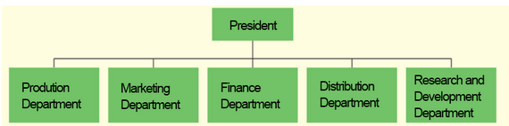

 
---
# **Question:** 1

**Question:**  

Every organization, regardless of size, organizational type, product, or profit objective, has a corporate culture.  

**Answer:**  

**True**  

**Reason:**  

Corporate culture is the set of shared values, beliefs, and behaviors that shape how employees interact and make decisions. Every organization develops its own culture, whether intentionally or organically, based on its history, leadership, work environment, and goals. Even small businesses or nonprofits have a culture that guides how work gets done and how people relate to one another.

 
---
# **Question:** 2

**Question:**  

The arrangement or relationship of positions within an organization is referred to as:  

- O job design  
- O specialization  
- ✅ the organizational structure  
- O the organizational culture  

**Answer:**  

**the organizational structure**  

**Reason:**  

Organizational structure defines how tasks, responsibilities, and authority are formally arranged within an organization. It shows the hierarchy, reporting relationships, and how different positions are connected to achieve organizational goals. Job design focuses on the content of individual jobs, specialization refers to dividing work into specific tasks, and organizational culture relates to shared values and behaviors, not the formal arrangement of positions.

 
---
# **Question:** 3

**Question:**  

A(n) _____ chart is a visual representation of how the organization is set up—showing relationships among people, who is accountable for specific work, and who reports to whom.  

- O statistical  
- O vision  
- ✅ organizational  
- O mission  

**Answer:**  

**organizational**  

**Reason:**  

An organizational chart visually depicts the structure of an organization, including the hierarchy, reporting relationships, and responsibilities. It helps employees understand who they report to and how different roles connect. Statistical charts show numerical data, a vision chart is not a standard term in management, and a mission chart would relate to goals, not structural relationships.

 
---
# **Question:** 4

**Question:**  

Dividing specific tasks into smaller jobs based on employee skill is called:  

- O layering  
- O centralization  
- ✅ specialization  
- O accountability  

**Answer:**  

**specialization**  

**Reason:**  

Specialization (or division of labor) involves breaking down work into smaller, specific tasks that employees perform based on their skills or expertise. This approach increases efficiency and allows employees to become highly skilled in a particular area. Layering refers to levels of management, centralization is about decision-making authority, and accountability refers to being responsible for completing tasks.

 
---
# **Question:** 5

**Question:**  

What word reflects the rationale for specialization in the workplace?  

- O Creativity  
- O Accountability  
- O Responsibility  
- ✅ Efficiency  

**Answer:**  

**Efficiency**  

**Reason:**  

Specialization allows employees to focus on specific tasks where they have skill or expertise, which reduces time spent switching between tasks and increases overall productivity. The main rationale is to improve efficiency, not creativity, accountability, or general responsibility.

 
---
# **Question:** 6

**Question:**  

_____ outlines a company's widely shared values, beliefs, traditions, philosophies, rules, and role models for behavior.  

- O achievements  
- O atmosphere  
- O goals  
- ✅ culture  

**Answer:**  

**culture**  

**Reason:**  

Organizational culture represents the collective values, beliefs, norms, and behaviors that shape how employees interact and make decisions. It provides guidance on expected behavior and establishes a shared identity within the organization. Achievements, atmosphere, and goals do not encompass the full set of guiding principles and behavioral norms like culture does.

 
---
# **Question:** 7

**Question:**  

The grouping of jobs into working units, usually called departments, units, groups, or divisions, is called:  

- ✅ departmentalization  
- O structuring  
- O team consolidation  
- O job analysis  

**Answer:**  

**departmentalization**  

**Reason:**  

Departmentalization is the process of organizing jobs into separate units or departments based on function, product, geography, or other criteria. This helps coordinate work, clarify responsibilities, and improve efficiency. Structuring is a broader term for overall organizational design, team consolidation is not a standard management term, and job analysis focuses on studying individual job duties rather than grouping them.

 
---
# **Question:** 8

**Question:**  

If Pete was tasked with developing an organizational structure for his company, he would______ 

- O delineate the steps necessary to manufacture the company's product  
- O outline the company's shared values, beliefs, traditions, and ways of doing things  
- O create a job description for each person in the firm  
- ✅ define the various positions in the company and their relationship to one another  

**Answer:**  

**define the various positions in the company and their relationship to one another**  

**Reason:**  

Developing an organizational structure involves establishing the hierarchy of positions, reporting relationships, and how tasks are divided and coordinated across the company. While job descriptions, manufacturing steps, and organizational culture are important, they do not define the formal arrangement of positions and authority within the organization.

 
---
# **Question:** 9

**Question:**  

The functional approach to departmentalization is common in _____ organizations.  

- O nonprofit  
- O large  
- ✅ small  

**Answer:**  

**small**  

**Reason:**  

In small organizations, functional departmentalization is often used because the company has fewer employees and needs to group similar tasks together for efficiency. Each function—like marketing, finance, or operations—may be handled by a small team or even a single person. Large organizations often require more complex departmentalization, such as divisional or matrix structures, to manage multiple products, regions, or business units.

 
---
# **Question:** 10

**Question:**  

To find out the chain of command in a company, one should consult the company's:  

- O roster  
- ✅ organizational chart  
- O ethics code  
- O organizational culture  

**Answer:**  

**organizational chart**  

**Reason:**  

An organizational chart visually shows the hierarchy of positions, reporting relationships, and the chain of command within a company. A roster lists employees but does not show relationships, an ethics code outlines rules and values, and organizational culture refers to shared beliefs and behaviors rather than formal reporting structures.

 
---
# **Question:** 11

**Question:**  

If a book seller was to separate its organization according to the types of books it sells, such as mystery, fiction, cookbooks, and textbooks, it would be an example of departmentalization by:  

- O geographic location  
- O customer group  
- O function  
- ✅ product  

**Answer:**  

**product**  

**Reason:**  

Product departmentalization organizes jobs and departments based on the specific products or product lines a company offers. In this case, separating the organization by types of books—mystery, fiction, cookbooks, and textbooks—is grouping by product. Geographic departmentalization is based on location, customer group is based on types of customers, and function is based on activities like marketing or finance.

 
---
# **Question:** 12

**Question:**  

The owner of a flower shop has three employees. Two employees are better at arranging flowers in a vase while the third is skilled at preparing the flowers to be arranged. Separating the employees by these skills is called:  

- ✅ specialization  
- O job rotation  
- O staffing  
- O layering  

**Answer:**  

**specialization**  

**Reason:**  

Specialization involves assigning tasks based on an employee’s skills or expertise to increase efficiency and productivity. In this example, employees are grouped according to their ability to arrange or prepare flowers. Job rotation involves moving employees between different tasks, staffing refers to hiring and placing employees, and layering refers to levels of management.

 
---
# **Question:** 13

**Question:**  

Because of vast differences between different regions, multinational corporations often use _____ departmentalization.  

- O function  
- O customer  
- O product  
- ✅ geographic  

**Answer:**  

**geographic**  

**Reason:**  

Geographic departmentalization organizes a company’s activities based on regions, countries, or territories. This approach is common in multinational corporations because it allows the company to tailor operations, marketing, and management to the specific needs and conditions of each region. Functional, customer, and product departmentalization do not directly address regional differences.

 
---
# **Question:** 14

**Question:**  

At its core, the reason companies divide labor and specialize is because:  

- O it reduces workers' responsibilities  
- O they want workers to be held accountable  
- ✅ they want to be as efficient as possible  
- O it allows them to manage employees more effectively  

**Answer:**  

**they want to be as efficient as possible**  

**Reason:**  

Dividing labor and assigning specialized tasks allows employees to focus on areas where they are most skilled, reducing time spent switching tasks and improving productivity. The main goal of specialization is efficiency. While accountability and management may be affected, efficiency is the primary rationale.

 
---
# **Question:** 15

**Question:**  

What type of departmentalization is shown in this example? 

</img>

- O Product departmentalization  
- ✅ Customer departmentalization  
- O Functional departmentalization  
- O Geographic departmentalization  

**Answer:**  

**Customer departmentalization**  

**Reason:**  

Customer departmentalization groups organizational units based on **the type of customer being served** rather than the product itself. In this example, the company has separate managers for **Consumer Foods** and **Industrial Foods**, meaning the focus is on different customer segments. Product departmentalization would group by the actual product lines, not by the type of customer. Functional and geographic departmentalization do not apply here.

 
---
# **Question:** 16

**Question:**  

Select all that apply: What are the four ways in which departments are commonly organized?  

- ✅ By customer  
- ✅ By geographic region  
- O By gender  
- O By skill level  
- ✅ By product  
- ✅ By function  

**Answer:**  

**By customer, By geographic region, By product, By function**  

**Reason:**  

Departments are commonly organized using these four methods:  

1. **Customer departmentalization** – grouping by types of customers served.  
2. **Geographic departmentalization** – grouping by location, region, or territory.  
3. **Product departmentalization** – grouping by product lines or services offered.  
4. **Functional departmentalization** – grouping by similar activities or business functions (e.g., marketing, finance, HR).  

Gender and skill level are not standard ways of organizing departments in management.

 
---
# **Question:** 17

**Question:**  

Delegation of _____ means not only giving tasks to employees but also empowering them to make commitments, use resources, and take whatever actions are necessary to carry out those tasks.  

**Answer:**  

**authority**  

**Reason:**  

Delegation of authority involves transferring decision-making power along with responsibility for completing tasks. It allows employees to act independently within their assigned roles while being accountable for results. Simply assigning tasks without authority would prevent employees from effectively completing them.

 
---
# **Question:** 18

**Question:**  

The form of departmentalization that groups jobs that perform similar activities, like finance or marketing, is called _____ departmentalization.  

- O product  
- O divisional  
- O geographic  
- ✅ functional  

**Answer:**  

**functional**  

**Reason:**  

Functional departmentalization organizes jobs based on similar activities or business functions, such as marketing, finance, human resources, or production. This allows specialization within functions and efficient use of resources. Product, divisional, and geographic departmentalization group jobs differently—by product lines, divisions, or regions, respectively.

 
---
# **Question:** 19

**Question:**  

What type of departmentalization is shown in this example?  

</img>

- ✅ functional departmentalization  
- O geographic departmentalization  
- O customer departmentalization  
- O process departmentalization  

**Answer:**  

**functional departmentalization**  

**Reason:**  

The organization is grouped by **similar activities or functions**, such as Production, Marketing, Finance, Distribution, and Research & Development. Functional departmentalization allows each department to focus on its area of expertise. Geographic departmentalization groups by location, customer departmentalization groups by type of customer, and process departmentalization groups by stages of production or work processes.

 
---
# **Question:** 20

**Question:**  

Cybill's manager wanted her to design the ad campaign for the firm's new product. She was given all the necessary resources to complete the task. Cybill understands that her manager is going to hold her accountable to make sure the ad campaign is executed successfully. This exemplifies the concept of:  

- O leadership  
- O overspecialization  
- O departmentalization  
- ✅ responsibility  

**Answer:**  

**responsibility**  

**Reason:**  

Responsibility refers to an employee being **accountable for completing assigned tasks** and using the resources provided to achieve desired results. In this example, Cybill is responsible for designing and executing the ad campaign. Leadership, overspecialization, and departmentalization are related concepts but do not specifically capture the accountability for a task.

 
---
# **Question:** 21

**Question:**  

When a company looks to departmentalize by areas of business like Japan, America, and Australia, it is exemplifying departmentalization by:  

- O customer group  
- ✅ geographic location  
- O function  
- O product  

**Answer:**  

**geographic location**  

**Reason:**  

Geographic departmentalization organizes a company based on **physical regions or territories**. This approach is useful for multinational companies to address regional market differences, local regulations, and customer preferences. Customer group departmentalization focuses on types of customers, function groups by business activities, and product groups by specific product lines.

 
---
# **Question:** 22

**Question:**  

What are two characteristics of centralized organizations?  

- ✅ Authority is concentrated at the top levels of the organization  
- ✅ Most daily and routine procedures are delegated to the lowest levels  
- O Very little decision-making authority is delegated to top levels  
- O Authority is mostly given to mid-level managers  
- O Authority is concentrated at the top levels of the organization while decisions are made at the lower levels  

**Answer:**  

**Authority is concentrated at the top levels of the organization** and **most daily and routine procedures are delegated to the lowest levels**  

**Reason:**  

Centralized organizations keep **strategic and major decision-making authority at the top**, while allowing **routine and operational tasks to be handled by lower-level employees**. This ensures consistency and control at the top, while still allowing the organization to function efficiently at lower levels. Other options either misstate where authority lies or confuse decentralization with centralization.

 
---
# **Question:** 23

**Question:**  

The arrangement of jobs around the needs of various types of customers is known as:  

- O departmentalization by function  
- ✅ departmentalization by customer  
- O departmentalization by product  
- O departmentalization by geographic location  

**Answer:**  

**departmentalization by customer**  

**Reason:**  

Customer departmentalization organizes jobs and departments based on the **type of customer being served**, such as retail vs. corporate clients or consumer vs. industrial markets. This approach allows the organization to better meet the specific needs and preferences of each customer segment. Function groups by activities, product groups by product lines, and geographic groups by location.

 
---
# **Question:** 24

**Question:**  

Giving employees not only tasks but also the power to make commitments, use resources, and take whatever actions are necessary to carry out those tasks is the definition of:  

- O responsibility  
- ✅ delegation of authority  
- O accountability of actions  
- O departmentalization  

**Answer:**  

**delegation of authority**  

**Reason:**  

Delegation of authority means assigning tasks **along with the power and resources needed** to complete them. It allows employees to make decisions and take action independently. Responsibility is about being accountable for tasks, accountability refers to being answerable for results, and departmentalization is about grouping jobs, not empowering employees.

 
---
# **Question:** 25

**Question:**  

Select all that apply: Which two factors would lead to a business being more centralized in its organization?  

- O The business does not have a clearly defined top level of management.  
- O The decisions to be made are fairly routine.  
- ✅ Decisions to be made are risky.  
- ✅ Low-level managers are not highly skilled in decision making.  

**Answer:**  

**Decisions to be made are risky** and **Low-level managers are not highly skilled in decision making**  

**Reason:**  

Organizations tend to centralize authority when **important or risky decisions** need tight control from top management. Centralization is also preferred when **lower-level managers lack experience or decision-making skills**, ensuring better-quality decisions. Routine decisions are typically delegated in decentralized organizations, and lack of clear top management does not support centralization.

 
---
# **Question:** 26

**Question:**  

The type of departmentalization shown in this example is:  

</img>

- O customer departmentalization  
- O geographic departmentalization  
- ✅ functional departmentalization  
- O product departmentalization  

**Answer:**  

**functional departmentalization**  

**Reason:**  

Functional departmentalization groups jobs based on **similar activities or functions**, such as marketing, finance, operations, or human resources. This structure allows employees to specialize in specific areas of expertise. Customer, geographic, and product departmentalization group work based on different criteria, not by function.

 
---
# **Question:** 27

**Question:**  

Rather than have the top level of management make all the decisions, Jake's company gives all lower-level managers the authority to make decisions for his or her department. Jake's company operates as a(n) _____ organization.  

- ✅ decentralized  
- O balanced  
- O overcentralized  
- O centralized  

**Answer:**  

**decentralized**  

**Reason:**  

A decentralized organization distributes decision-making authority to **lower-level managers**, allowing them to make decisions within their departments. This increases flexibility, responsiveness, and employee involvement. In contrast, centralized organizations keep most decision-making power at the top.

 
---
# **Question:** 28

**Question:**  

The obligation, placed on employees through delegation, to perform assigned tasks satisfactorily and be held accountable for the proper execution of work is the definition of:  

- O departmentalization  
- ✅ responsibility  
- O specialization  
- O leadership  

**Answer:**  

**responsibility**  

**Reason:**  

Responsibility is the obligation given to employees to **perform assigned tasks and be accountable for their outcomes**. It comes with delegation, meaning when tasks are assigned, employees are expected to complete them properly. Departmentalization is about grouping jobs, specialization is about dividing tasks, and leadership is about guiding and influencing others.

 
---
# **Question:** 29

**Question:**  

A _____ span of management exists when a manager directly supervises only a few subordinates.  

- O broad  
- O wide  
- ✅ narrow  
- O flat  

**Answer:**  

**narrow**  

**Reason:**  

A narrow span of management means a manager supervises **a small number of employees**, allowing for closer supervision and more direct control. In contrast, a wide (or broad) span involves supervising many employees, and a flat structure refers to fewer levels of management, not the number of subordinates per manager.

 
---
# **Question:** 30

**Question:**  

An organizational structure in which decision-making authority is maintained at the top level of management is called a(n) _____ organization.  

- O overcentralized  
- O executive  
- O decentralized  
- ✅ centralized  

**Answer:**  

**centralized**  

**Reason:**  

A centralized organization keeps **decision-making authority at the top levels of management**, where senior leaders make most of the important decisions. In contrast, decentralized organizations distribute decision-making power to lower-level managers.

 
---
# **Question:** 31

**Question:**  

A _____ (line or multidivisional?) structure has a clear chain of command, which enables managers to make decisions quickly. A mid-level manager facing a decision must consult only one person, his or her immediate supervisor.  

**Answer:**  

**line**  

**Reason:**  

A line structure has a **simple and direct chain of command**, where authority flows from top to bottom. Each employee reports to only one supervisor, which allows for quick decision-making. A multidivisional structure is more complex and involves multiple divisions, not a single clear reporting line.

 
---
# **Question:** 32

**Question:**  

When the decisions to be made by a business are risky, and low-level managers are not highly skilled in decision making, the company tends to be more:  

- O independent  
- ✅ centralized  
- O decentralized  
- O dependent  

**Answer:**  

**centralized**  

**Reason:**  

When decisions are **risky** and lower-level managers lack experience or skill, organizations prefer to keep decision-making authority at the **top levels**. This ensures better control, consistency, and higher-quality decisions, which is characteristic of a centralized structure.

 
---
# **Question:** 33

**Question:**  

A structure having a traditional line relationship between superiors and subordinates and also specialized managers — called staff managers — who are available to assist line managers is known as:  

- O line structure  
- O multidivisional structure  
- O matrix structure  
- ✅ line-and-staff structure  

**Answer:**  

**line-and-staff structure**  

**Reason:**  

A line-and-staff structure combines a **direct chain of command** (line managers) with **specialized staff managers** who provide advice, support, and expertise. Line managers have authority over subordinates, while staff managers assist with specialized functions like HR, legal, or finance. Line structure lacks staff advisors, multidivisional groups by product/division, and matrix structure blends functional and project-based reporting.

 
---
# **Question:** 34

**Question:**  

In a(n) _____ organization, the decision-making authority is delegated as far down the chain of command as possible.  

- ✅ decentralized  
- O centralized  
- O balanced  
- O overcentralized  

**Answer:**  

**decentralized**  

**Reason:**  

In a decentralized organization, **decision-making authority is pushed down to lower-level managers and employees**, allowing them to make decisions relevant to their roles. This increases responsiveness, flexibility, and employee involvement. Centralized organizations retain authority at the top, while balanced and overcentralized are not standard terms in this context.

 
---
# **Question:** 35

**Question:**  

A firm is looking to restructure its organization into larger groups. It is deciding whether to organize its departments on the basis of geography, customer type, or product. Either way, structuring the firm in this way is utilizing the _____ structure.  

- O matrix  
- O line  
- ✅ multidivisional  
- O line-and-staff  

**Answer:**  

**multidivisional**  

**Reason:**  

A **multidivisional (M-form) structure** organizes a company into **semi-autonomous divisions** based on products, geographic regions, or customer types. Each division operates like its own unit with its own resources and management. This allows large firms to manage complexity and focus on specific markets or products effectively. Line and line-and-staff structures are more centralized and do not divide by these criteria, and matrix structures combine functional and project-based reporting.

 
---
# **Question:** 36

**Question:**  

A _____ span of management exists when a manager directly supervises a very large number of employees.  

- O tall  
- ✅ wide  
- O thin  
- O narrow  

**Answer:**  

**wide**  

**Reason:**  

A **wide (or broad) span of management** occurs when a manager supervises many subordinates directly. This can lead to less direct supervision per employee but encourages delegation and independence. A narrow span involves few subordinates, tall refers to many levels of management, and thin is not a standard term for span of management.

 
---
# **Question:** 37

**Question:**  

A matrix structure is also referred to as a(n) _____ structure.  

- O intersecting  
- O divisional  
- O labor intensive  
- ✅ project management  

**Answer:**  

**project management**  

**Reason:**  

A **matrix (or project management) structure** combines **functional and project-based reporting**, where employees report to both a functional manager and a project manager. This structure is often used in organizations that manage multiple projects simultaneously, allowing for flexibility and resource sharing. It is not strictly divisional, intersecting, or labor intensive.

 
---
# **Question:** 38

**Question:**  

Select all that apply: What are two characteristics of centralized organizations?  

- O Authority is concentrated at the top levels of the organization while decisions are made at the lower levels  
- O Authority is mostly given to mid-level managers  
- ✅ Most daily and routine procedures is delegated to the lowest levels  
- ✅ Authority is concentrated at the top levels of the organization  
- O Very little decision-making authority is delegated to top levels  

**Answer:**  

**Authority is concentrated at the top levels of the organization** and **most daily and routine procedures are delegated to the lowest levels**  

**Reason:**  

Centralized organizations maintain **major decision-making authority at the top** while allowing **routine, everyday tasks to be handled at lower levels**. This provides control over critical decisions while keeping operations efficient. Authority is not mostly with mid-level managers, and decisions are not left to the top only for minor tasks.

 
---
# **Question:** 39

**Question:**  

What term is defined as two or more individuals who communicate with one another, share a common identity, and have a common goal?  

- O Task force  
- O Matrix  
- O Committee  
- ✅ Group  

**Answer:**  

**Group**  

**Reason:**  

A **group** consists of two or more people who interact, share a sense of identity, and work toward a common goal. While a task force or committee is a type of group formed for a specific purpose, the general definition of individuals working together toward shared objectives fits **group**. A matrix refers to an organizational structure, not a social unit.

 
---
# **Question:** 40

**Question:**  

An organization that has direct two-way lines of responsibility, authority, and communication running from the top to the bottom of the organization, with all people reporting to only one supervisor, is called a(n) _____ structure.  

- O multidivisional  
- O matrix  
- O line-and-staff  
- ✅ line  

**Answer:**  

**line**  

**Reason:**  

A **line structure** features a **clear chain of command** where each employee reports to only **one supervisor**, creating direct lines of authority and communication. Multidivisional, matrix, and line-and-staff structures involve additional layers or dual reporting relationships, making them more complex than the simple line structure.

 
---
# **Question:** 41

**Question:**  

Dante works at a manufacturing plant. He has been asked by upper management to be part of a formal group that will specifically work with union laborers to address all concerns and draft company policy regarding union benefits. Dante has been asked to be part of a:  

- O project team  
- O division  
- O ✅ committee  
- O task force  

**Answer:**  

**committee**  

**Reason:**  

A **committee** is a formal group of individuals assigned to **consider, investigate, and make recommendations or decisions** on specific matters, such as union policies in this case. A project team is typically formed to complete a specific project, a division is a larger organizational unit, and a task force is a temporary group created for urgent or specialized problems.

 
---
# **Question:** 42

**Question:**  

In a line-and-staff structure, those managers that provide advice and support to line departments on specialized matters such as finance, engineering, and human resources are called _____ managers. (Choose between line or staff.)  

**Answer:**  

**staff**  

**Reason:**  

In a **line-and-staff structure**, **staff managers** provide specialized expertise, advice, and support to assist **line managers**, who have direct authority over production and operations. Staff managers do not have direct authority over subordinates in the line departments but help improve efficiency and decision-making in their specialized areas.

 
---
# **Question:** 43

**Question:**  

Nelson Dairy Supply has organized a group of people from across all of the company's departments to address an internal issue related to paid time off for certain holidays. This group will be responsible for bringing about change related to this issue and it is expected to accomplish this task within six months. What type of group does this represent?  

- O Quality-assurance  
- O Committee  
- ✅ Task force  
- O Self-directed  

**Answer:**  

**Task force**  

**Reason:**  

A **task force** is a temporary group of individuals from various departments assembled to **solve a specific problem or accomplish a particular objective** within a set timeframe. Unlike committees, which may be ongoing, task forces are focused on short-term goals and disband after the task is completed. Quality-assurance groups focus on ongoing quality processes, and self-directed teams manage their own work without a traditional supervisor.

 
---
# **Question:** 44

**Question:**  

A _____ structure organizes departments into larger groups called divisions.  

- ✅ multidivisional  
- O line  
- O matrix  
- O line-and-staff  

**Answer:**  

**multidivisional**  

**Reason:**  

A **multidivisional (M-form) structure** groups departments into **semi-autonomous divisions**, each responsible for its own products, services, or regions. This allows large organizations to manage complexity by dividing operations into manageable units. Line, matrix, and line-and-staff structures do not organize departments into divisions in this way.

 
---
# **Question:** 45

**Question:**  

A team that runs their own operation and has total control of a specific work project is called a:  

- O virtual team  
- ✅ project team  
- O task force  
- O committee  

**Answer:**  

**project team**  

**Reason:**  

A **project team** is formed to **complete a specific project** and is given full responsibility and authority over that project. They manage all aspects of the work until the project is finished. A task force is temporary and problem-focused, a committee is generally advisory, and a virtual team works remotely but isn’t necessarily in full control of a project.

 
---
# **Question:** 46

**Question:**  

A(n) _____ structure, also called a project management structure, sets up teams from different departments, thereby creating two or more intersecting lines of authority.  

**Answer:**  

**matrix**  

**Reason:**  

A **matrix structure** combines **functional and project-based reporting**, so employees report to both a **functional manager** and a **project manager**. This creates intersecting lines of authority, allowing resources and expertise from multiple departments to be used efficiently for specific projects. It is often called a **project management structure** for this reason.

 
---
# **Question:** 47

**Question:**  

A special type of team formed to devise, design, and implement a new product is a:  

- ✅ product-development team  
- O quality-assurance team  
- O project team  
- O task force  

**Answer:**  

**product-development team**  

**Reason:**  

A **product-development team** is specifically tasked with **creating and implementing new products**. They focus on innovation, design, and bringing products to market. While project teams and task forces handle specific objectives or problems, and quality-assurance teams focus on maintaining standards, product-development teams are dedicated to **new product creation**.

 
---
# **Question:** 48

**Question:**  

Your text defines a _____ as two or more individuals who communicate with one another, share a common identity, and have a common goal.  

- ✅ group  
- O team  
- O staff  
- O matrix  

**Answer:**  

**group**  

**Reason:**  

A **group** is defined as **two or more people who interact, share a common identity, and work toward a common goal**. While a team is a specialized type of group with coordinated efforts, the general definition of individuals working together fits **group**. Staff refers to employees collectively, and matrix refers to an organizational structure.

 
---
# **Question:** 49

**Question:**  

Henderson Plumbing Mfg. brought together a small group of employees to address the production problem that caused L-shaped pipes to flatten at one end. This issue is creating many unhappy customers and must be fixed. What type of team does this represent?  

- O committee  
- ✅ quality-assurance  
- O self-directed  
- O matrix  

**Answer:**  

**quality-assurance**  

**Reason:**  

A **quality-assurance team** is formed to **identify, analyze, and solve problems related to product quality**. In this case, the team is addressing a production defect that affects customer satisfaction. Committees are more advisory, self-directed teams manage their own operations, and a matrix is an organizational structure, not a problem-focused team.

 
---
# **Question:** 50

**Question:**  

A permanent, formal group that performs a specific task is called a:  

- O division  
- ✅ committee  
- O project team  
- O task force  

**Answer:**  

**committee**  

**Reason:**  

A **committee** is a **formal and often permanent group** established to handle specific tasks, make recommendations, or oversee ongoing matters. In contrast, a **project team** or **task force** is usually temporary, created for a particular project or problem. A division is a large organizational unit, not a formal task-specific group.

 
---
# **Question:** 51

**Question:**  

Mario is on a team at work that is responsible for attaching six component parts to the lawn mowers that are being manufactured. If there is a breakdown in the system, it is up to the team members to fix it and adjust the system if necessary. In other words, the employees have "ownership" of the job. What type of team does this represent?  

- O Joint committee  
- O Virtual  
- O Quality-assurance  
- ✅ Self-directed  

**Answer:**  

**Self-directed**  

**Reason:**  

A **self-directed team** is responsible for **managing its own tasks and processes**, including problem-solving and adjusting workflows as needed. Team members have ownership of the job and make decisions without direct supervision. In contrast, quality-assurance teams focus on quality monitoring, committees are formal and often advisory, and virtual teams operate remotely.

 
---
# **Question:** 52

**Question:**  

_____ is a group of employees, selected for their expertise, who come together on a temporary basis to bring about a particular change in an organization.  

- O project team  
- O committee  
- ✅ task force  
- O group  

**Answer:**  

**task force**  

**Reason:**  

A **task force** is a **temporary group** of employees chosen for their expertise to address a specific problem or implement a change. Unlike committees, which may be permanent, or project teams, which focus on completing projects, task forces are formed for a **specific issue or change initiative** and disband once the objective is achieved.

 
---
# **Question:** 53

**Question:**  

Cloud computing has created significant advancements in the way organizations communicate. It is estimated that nearly ______ of organizations use cloud technology such as Slack and Microsoft Teams.  

- O 20%  
- O 90%  
- O 65%  
- O 45%  

**Answer:**  

**90%**  

**Reason:**  

Cloud‑based collaboration tools like Slack and Microsoft Teams are widely adopted across organizations for communication and teamwork, with estimates suggesting that **nearly 90% of organizations** use such technologies to support communication and collaboration.

 
---
# **Question:** 54

**Question:**  

_______________(enter one word in the blank)  teams are similar to task forces, but normally they run their operation and have total control of a specific work project.  

**Answer:**  

**project**  

**Reason:**  

**Project teams** are established to **complete a specific work project** and are given **full responsibility and authority** over the project’s operations. They differ from task forces, which are typically temporary and focused on solving a particular problem, while project teams manage the project from start to finish.

 
---
# **Question:** 55

**Question:**  

Channels of communication that are intentionally defined and designed by the organization are designated as _____ communication channels.  

- O primary  
- ✅ formal  
- O informal  
- O secondary  

**Answer:**  

**formal**  

**Reason:**  

**Formal communication channels** are **officially established by an organization** to transmit information, directives, and policies. They follow the organizational hierarchy and structure. In contrast, informal channels arise naturally through personal interactions and social networks within the workplace.

 
---
# **Question:** 56

**Question:**  

With its current Zip-Quick bikes being sold in a saturated and mature market, Uphill Bike Company wants to develop a new mountain bike that will put the company at the forefront of emerging technology. It has assembled a team to devise, design, and implement this new bike. What type of team has Uphill Bike Company created?  

- O Project team  
- ✅ Product-development team  
- O Task force  
- O Quality-assurance team  

**Answer:**  

**Product-development team**  

**Reason:**  

A **product-development team** is specifically formed to **create and implement new products**, such as a new mountain bike in this case. They focus on innovation, design, and bringing products to market. Project teams and task forces may handle specific objectives or problems, and quality-assurance teams focus on maintaining standards rather than developing new products.

 
---
# **Question:** 57

**Question:**  

What are two ways companies can use the grapevine to their advantage?  

- ✅ using it to float ideas  
- ✅ soliciting feedback and reacting accordingly  
- O making employees fall in line with management  
- O listening in on competitors  

**Answer:**  

**Using it to float ideas** and **soliciting feedback and reacting accordingly**  

**Reason:**  

The **grapevine** is an informal communication network within a company. Companies can leverage it by:  

1. **Floating ideas:** Introducing concepts informally to see how employees react before formal implementation.  
2. **Soliciting feedback:** Listening to the grapevine helps management gauge employee sentiment and adjust strategies accordingly.  

It is **not intended** for enforcing control (making employees comply) or for spying on competitors.

 
---
# **Question:** 58

**Question:**  

Which type of team is defined as small groups of workers brought together from throughout the organization to solve specific quality, productivity, or service problems?  

- O Self-directed work teams  
- O Project teams  
- O Product-development teams  
- ✅ Quality-assurance teams  

**Answer:**  

**Quality-assurance teams**  

**Reason:**  

A **quality-assurance team** is specifically formed to **address and solve problems related to quality, productivity, or service**. These teams are typically **small, cross-functional groups** that analyze processes, identify issues, and implement improvements.  

 
---
# **Question:** 59

**Question:**  
Artificial Intelligence is having a significant impact on workplace monitoring.

**Answer:**  
True

**Explanation:**  
Artificial Intelligence (AI) enables companies to monitor employee activities more efficiently and in real-time. It can track productivity, analyze communication patterns, detect anomalies, and even predict potential issues. While this improves operational oversight, it also raises concerns about privacy and ethical use of employee data.

 
---
# **Question:** 60

**Question:**  
If a team is empowered to make decisions without management approval first, then it is said to be:

**Answer:**  
self-directed

**Explanation:**  
A self-directed team operates with a high level of autonomy, allowing members to make decisions and manage their own work without needing prior approval from management. This structure promotes accountability, motivation, and faster decision-making compared to centralized or restricted teams.

 
---
# **Question:** 61

**Question:**  
Tammie was communicating to her employees the proper way to handle abuse in the workplace. One individual kept interjecting comments while Tammie was speaking. This behavior is known ______ and can be a serious barrier to effective communication.

**Answer:**  
an interruption

**Explanation:**  
An interruption occurs when someone breaks in while another person is speaking, which can disrupt the flow of communication and prevent the message from being effectively received. Unlike feedback, retaliation, or the grapevine, interruptions directly interfere with the speaker’s ability to convey information clearly.

 
---
# **Question:** 62

**Question:**  
Marvin Hardware Sales used to meet with all of its clients face-to-face at least once a month. Today, the company uses email and video conferencing to accomplish those same tasks. This demonstrates how changes in ______ affect an organization.

**Answer:**  
communication

**Explanation:**  
The shift from in-person meetings to email and video conferencing illustrates how advances in communication technology can impact the way an organization operates. Improved communication methods can increase efficiency, reduce costs, and allow employees to connect with clients or colleagues more effectively across distances.

 
---
# **Question:** 63

**Question:**  
The flow of communication within the formal organizational structure is called:

**Options:**  
- A) Decentralized communication  
- B) Informal communication  
- C) Formal communication  
- D) Centralized communication  

**Answer:**  
C) Formal communication ✅  

**Explanation:**  
Formal communication is the flow of information that follows the officially established channels within an organization’s hierarchy, such as memos, reports, emails, and official meetings. It ensures that messages are properly directed according to organizational roles and policies.

 
---
# **Question:** 64

**Question:**  
The most significant informal communication occurs through the ________, an informal channel of communication, separate from management's formal, official communication channels.  

**Answer:**  
grapevine ✅  

**Explanation:**  
The **grapevine** is the informal communication network within an organization. It operates outside the formal communication channels and allows employees to share information quickly, often through rumors, conversations, or social interactions. Despite being informal, it can significantly influence employee perceptions and organizational culture.

 
---
# **Question:** 65

**Question:**  
Employees at the Mercury Group have been using work-time as personal time by playing video games on their computers and checking their social media. The company has decided to implement a policy in which employees must sign an agreement that states they will limit their personal time on their computers to their lunch hours. This agreement represents how this company is:

**Options:**  
- A) Identifying the formal communication channel  
- B) Monitoring employee communications  
- C) Identifying the informal communication channel  
- D) Benefiting from the grapevine  

**Answer:**  
B) Monitoring employee communications ✅  

**Explanation:**  
By implementing a signed agreement to limit personal computer use, the company is actively **monitoring and controlling employee communications and activities**. This ensures that employees follow the policy and that work-time is used appropriately, which is a form of oversight rather than merely identifying communication channels or leveraging informal networks.

 
---
# **Question:** 66

**Question:**  
In order for communication to be effective in the workplace, managers need to solicit comments and criticism from employees regarding their communication messages. This input from employees is referred to as:

**Options:**  
- A) Feedback  
- B) Solicitation  
- C) Employee evaluation  
- D) Retaliation  

**Answer:**  
A) Feedback ✅  

**Explanation:**  
**Feedback** is the response or reaction from employees that indicates whether a message has been understood as intended. Effective workplace communication relies on feedback to ensure clarity, correct misunderstandings, and improve future communication.

 
---

