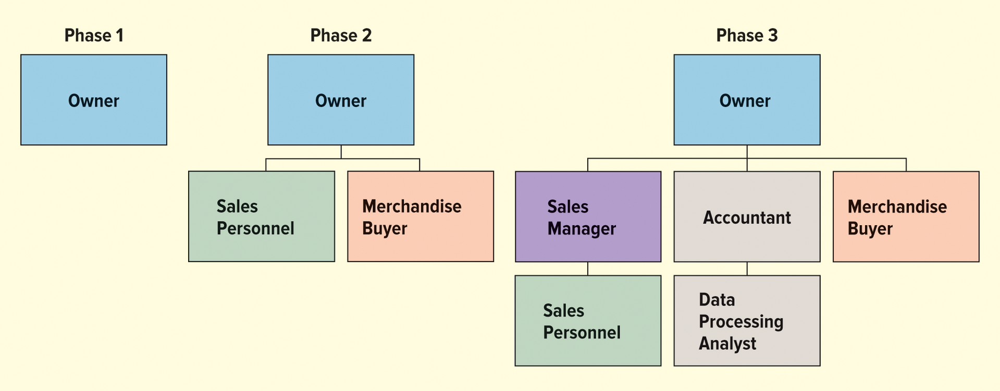
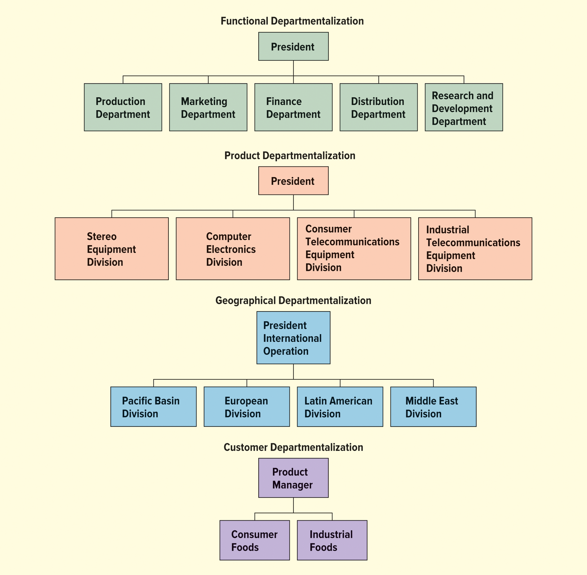
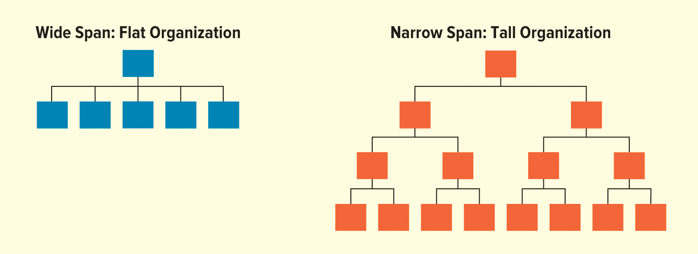
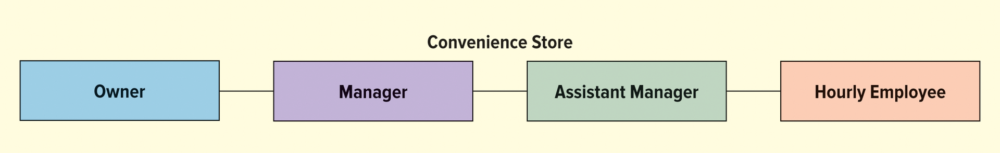
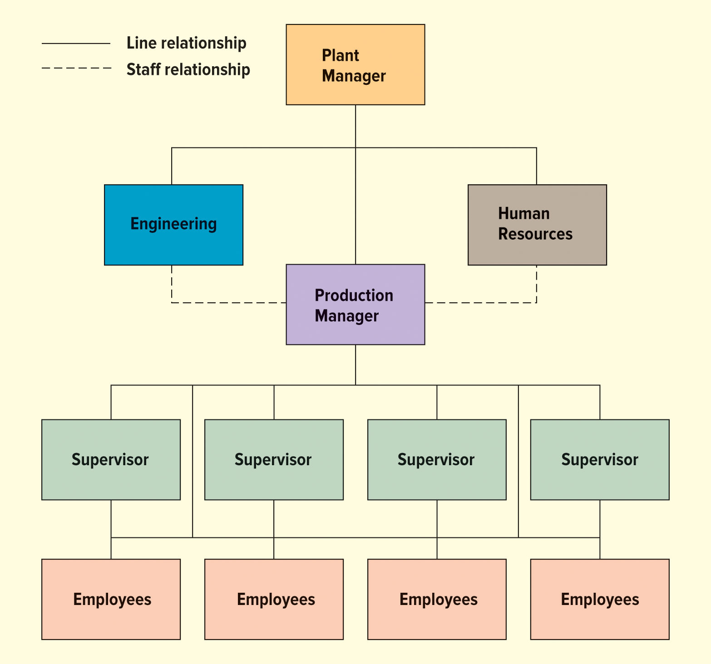
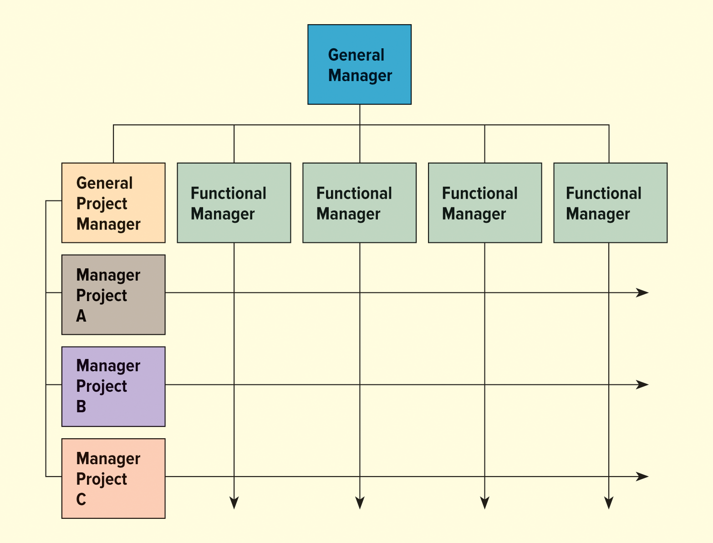
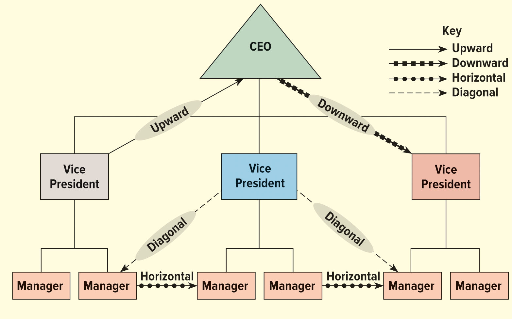

<h1 id="Chapter_7._Organization,_Teamwork,_and_Communication_" style="color:#42A5F5;">Indice</h1>

##### [Capitulo LO 7-1 Organizational Culture](#936668)

##### [Capitulo LO 7-2 Developing Organizational Structure](#791916)

##### [Capitulo LO 7-3 Assigning Tasks ](#394316)

##### [Capitulo LO 7-4 Assigning Responsibility](#121405)

##### [Capitulo LO 7-5 Formas de Estructura Organizacional](#409672)

##### [Capitulo LO 7-6 THE ROLE OF GROUPS AND TEAMS IN ORGANIZATIONS](#270622)

##### [Capitulo LO 7-7 COMMUNICATING IN ORGANIZATIONS](#229048)
---

<h1 id="936668" style="color:#E65100;">
  <a href="#Chapter_7._Organization,_Teamwork,_and_Communication_" style="color:inherit; text-decoration:none;">
    LO 7-1 Organizational Culture
  </a>
</h1>

### 🧩 ¿Qué es la cultura organizacional?
**Cultura organizacional (organizational culture):**  
Conjunto de **valores, creencias, tradiciones, principios, reglas y modelos de comportamiento** que comparten los miembros de una empresa.  
También se conoce como **cultura corporativa**.

---

### ⭐ Importancia de la cultura organizacional
- Define **cómo actúan y piensan** los empleados.
- Influye en la **toma de decisiones**.
- Afecta la **relación con clientes y stakeholders**.
- Ayuda a crear una **identidad empresarial sólida**.
- Establece el **ambiente de trabajo**.

---

### 🧱 Aspectos clave de la cultura organizacional

#### 1. Valores
Principios fundamentales que guían el comportamiento de la empresa (ej: honestidad, respeto, calidad).

#### 2. Creencias
Ideas compartidas sobre lo que es correcto o importante dentro de la organización.

#### 3. Tradiciones
Prácticas o costumbres repetidas a lo largo del tiempo (ej: eventos, celebraciones internas).

#### 4. Principios
Reglas básicas que orientan las decisiones y acciones dentro de la empresa.

#### 5. Reglas
Normas explícitas o implícitas que indican cómo deben comportarse los empleados.

#### 6. Modelos de comportamiento (Role models)
Ejemplos de conducta a seguir, generalmente representados por líderes o empleados destacados.

---

### 🏢 Expresión de la cultura organizacional

#### 📄 Formal
Se expresa de manera oficial a través de:
- Misión
- Visión
- Objetivos
- Códigos de ética
- Manuales
- Políticas internas

#### 💬 Informal
Se refleja en la práctica diaria:
- Código de vestimenta
- Hábitos de trabajo
- Historias y anécdotas
- Relaciones entre empleados
- Actividades sociales

---

### 🤝 Relación con los clientes
- La cultura influye en **cómo se trata al cliente**.
- Valores compartidos → mejor experiencia del cliente.
- Refleja la imagen de la empresa.

---

### ⚠️ Cultura organizacional negativa
Ocurre cuando:
- No se respetan los valores de los clientes.
- Hay discriminación o falta de inclusión.
- No existen mecanismos para reportar problemas.

**Consecuencia:** rechazo por parte de empleados y clientes.

---

### 🎯 Funciones de la cultura organizacional
- Unifica a los empleados bajo **valores comunes**.
- Define **cómo resolver problemas**.
- Mejora la **coordinación interna**.
- Ayuda a cumplir los objetivos organizacionales.
- Facilita la **satisfacción de stakeholders**.

---

### 🚀 Cultura organizacional y éxito
Una cultura positiva:
- Motiva a los empleados
- Aumenta la productividad
- Mejora la reputación
- Facilita una estructura organizacional eficiente

### 🏆 Companies with the Best Workplace Culture (Table 7.1)

**Note:** Rankings include companies with more than 500 employees, as rated by employees.

---

### 📊 Lista de empresas

1. Microsoft  
2. IBM  
3. Google  
4. HubSpot  
5. Elsevier  
6. Chegg  
7. Concentrix  
8. RingCentral  
9. Experian  
10. Estée Lauder Companies  

---

### 📌 Idea clave
Estas empresas destacan por tener una **cultura organizacional positiva**, lo que significa:
- Buen ambiente laboral  
- Valores compartidos  
- Enfoque en empleados y clientes  
- Oportunidades de crecimiento  

Una fuerte cultura organizacional contribuye al **éxito y satisfacción de los empleados**.

### 📖 Contexto del Caso: PIMCO's Organizational Culture Goes Bankrupt

#### 🏢 Contexto general
Pacific Investment Management Co. (PIMCO) es una empresa global de gestión de inversiones que ha enfrentado **problemas relacionados con su cultura organizacional**. Estos problemas surgieron principalmente a partir de **demandas legales presentadas por empleados actuales y anteriores**.

#### ⚖️ Situación principal
El caso se centra en acusaciones de que la empresa tenía una cultura:

- **Altamente competitiva y agresiva** (cutthroat)
- Con un ambiente laboral **poco amigable**
- Percibida como **excluyente y desigual**

Varios empleados alegaron:
- **Discriminación**
- **Acoso**
- **Represalias**
- Falta de oportunidades de:
  - Mentoría  
  - Promoción  
  - Evaluaciones justas  

También se mencionó que la empresa tenía una cultura tipo **“fraternity-like”**, favoreciendo a ciertos grupos.

#### 🧾 Respuesta de la empresa
PIMCO negó las acusaciones, pero tomó acciones importantes:

- Contrató una **empresa externa** para investigar.
- Realizó **encuestas anónimas** a empleados.
- Implementó mejoras en:
  - Evaluaciones de desempeño  
  - Capacitación de gerentes  
  - Diversidad e inclusión  

Aunque la investigación no encontró evidencia concluyente de discriminación, sí señaló que la empresa mantiene **estándares muy altos**, lo que puede dificultar que todos los empleados se adapten.

#### 📢 Señales de problemas culturales
- Cartas de empleados denunciando:
  - Falta de equidad salarial  
  - Pocas oportunidades de crecimiento  
- Percepción de esfuerzos de diversidad como **superficiales**
- Cultura laboral exigente con:
  - **Largas horas de trabajo**
  - **Altas demandas**

#### 👥 Cambio generacional
El caso también refleja un cambio importante en el mundo laboral:

- Generaciones anteriores:
  - Veían el trabajo duro extremo como normal  
- Generaciones actuales:
  - Buscan **balance vida-trabajo**
  - Valoran la **inclusión y el bienestar**

#### 🌎 Acciones recientes
Para adaptarse, la empresa:
- Expandió oficinas a:
  - Nueva York  
  - Austin, Texas  
- Busca atraer empleados:
  - Más jóvenes  
  - Más diversos  

#### 📌 Idea clave del caso
Este caso ilustra cómo una **cultura organizacional negativa o desactualizada** puede generar:
- Conflictos legales  
- Insatisfacción de empleados  
- Necesidad de cambio para mantenerse competitiva  

Además, muestra la importancia de adaptar la cultura a las **expectativas de nuevas generaciones**.

### 📝 Critical Thinking Questions – Respuestas

#### 1. Describe Pimco's organizational culture.
La cultura organizacional de Pimco se caracteriza por ser:
- **Altamente competitiva y agresiva** (cutthroat).
- Con un ambiente de trabajo **exigente y de alta presión**.
- Percibida por algunos empleados como **excluyente** y con favoritismo.
- Asociada a problemas como:
  - Discriminación
  - Falta de equidad en promociones y evaluaciones
- Descrita como una cultura tipo **“fraternity-like”**, donde ciertos grupos tenían más ventajas.

---

#### 2. What has Pimco done to improve its culture?
Pimco ha implementado varias acciones para mejorar su cultura:

- Contrató una **empresa externa** para investigar las acusaciones.
- Realizó **encuestas anónimas** a empleados.
- Mejoró:
  - **Evaluaciones de desempeño**
  - **Capacitación de gerentes**
  - **Iniciativas de diversidad e inclusión**
- Expandió sus operaciones (Nueva York y Austin) para atraer talento más diverso y joven.
- Intentó adaptarse a nuevas expectativas laborales.

---

#### 3. Why do you think younger employees are less willing to accept these working conditions?
Los empleados más jóvenes son menos tolerantes porque:

- Valoran el **equilibrio entre vida personal y trabajo**.
- Buscan ambientes **inclusivos y justos**.
- No consideran las largas jornadas como necesarias para el éxito.
- Priorizan:
  - **Bienestar mental**
  - **Cultura positiva**
  - **Igualdad de oportunidades**
- Tienen más opciones laborales, lo que les permite evitar culturas negativas.

<h1 id="791916" style="color:#E65100;">
  <a href="#Chapter_7._Organization,_Teamwork,_and_Communication_" style="color:inherit; text-decoration:none;">
    LO 7-2 Developing Organizational Structure
  </a>
</h1>

### 🧩 ¿Qué es la estructura organizacional?
La **estructura organizacional** es la **disposición o relación de los puestos dentro de una organización**.  
Permite que las personas trabajen juntas para alcanzar objetivos comunes de manera eficiente.

---

### ⭐ Importancia de la estructura organizacional
- Permite **coordinar actividades**.
- Facilita el **trabajo en equipo**.
- Ayuda a lograr los **objetivos organizacionales**.
- Define **responsabilidades y roles**.
- Mejora la **eficiencia operativa**.

---

### 🏗️ ¿Cómo se desarrolla la estructura organizacional?

La estructura se desarrolla cuando los gerentes:

- **Asignan tareas** a individuos o grupos.
- **Agrupan actividades** en departamentos.
- **Coordinan esfuerzos** para lograr objetivos.
- **Definen responsabilidades** específicas.

---

### 🔄 Proceso de desarrollo

1. **Asignación de tareas**
   - Se divide el trabajo en actividades específicas.

2. **Delegación de responsabilidades**
   - Cada persona o grupo recibe funciones claras.

3. **Coordinación de actividades**
   - Se sincronizan las tareas entre departamentos.

4. **Supervisión y ajuste**
   - Se evalúa la eficiencia y se realizan cambios si es necesario.

---

### 🏪 Ejemplo: Evolución de un negocio

#### Fase 1: Inicio
- El dueño hace todo:
  - Ventas
  - Compras
  - Contabilidad

#### Fase 2: Crecimiento inicial
- Se contratan empleados:
  - Vendedores
  - Compradores

#### Fase 3: Expansión
- Se agregan:
  - Gerentes
  - Departamentos
- El dueño delega responsabilidades.

---

### 📈 Relación entre crecimiento y estructura
- A mayor crecimiento:
  - Más empleados
  - Más especialización
- Se necesita una **estructura formal** para funcionar eficientemente.

---

### 🧠 Conceptos clave

- **Especialización:** Personas enfocadas en tareas específicas.
- **Coordinación:** Integración de actividades para lograr objetivos.
- **Organización:** Uso eficiente de recursos humanos, físicos y financieros.
- **Cambio estructural:** Ajustes cuando la estructura actual ya no funciona.

---

### 📌 Idea clave
El desarrollo de la estructura organizacional es esencial para que una empresa crezca y funcione de manera eficiente, permitiendo que todos trabajen de forma coordinada hacia los mismos objetivos.

</img>

<h1 id="394316" style="color:#E65100;">
  <a href="#Chapter_7._Organization,_Teamwork,_and_Communication_" style="color:inherit; text-decoration:none;">
    LO 7-3 Assigning Tasks 
  </a>
</h1>

### 🧩 ¿Qué es la asignación de tareas?
La **asignación de tareas** consiste en identificar todas las actividades necesarias para operar un negocio y **distribuirlas entre empleados o grupos de trabajo** para alcanzar los objetivos organizacionales.

---

### ⭐ Importancia de asignar tareas
- Permite que la empresa funcione de manera organizada.
- Facilita la **coordinación del trabajo**.
- Mejora la **eficiencia y productividad**.
- Asegura que todas las actividades necesarias se realicen.

---

### 🏭 Ejemplo de actividades en una empresa
En una empresa como Celestial Seasonings, las tareas incluyen:

- Comprar materias primas (hierbas)
- Procesar y producir el producto
- Empacar y etiquetar
- Distribuir a tiendas
- Negociar con minoristas
- Desarrollar nuevos productos
- Publicidad y marketing
- Finanzas
- Gestión de empleados

---

## 🔑 Conceptos clave en la asignación de tareas

### 1. Especialización (Specialization)
La **especialización** consiste en dividir el trabajo en tareas pequeñas y asignarlas a personas específicas.

#### ✅ Beneficios:
- Mayor eficiencia
- Desarrollo de habilidades específicas
- Mayor rapidez en el trabajo

#### ⚠️ Desventajas:
- Puede generar aburrimiento
- Trabajo repetitivo

---

### 2. Departamentalización (Departmentalization)
La **departamentalización** es el proceso de **agrupar trabajos y actividades similares en unidades o departamentos**.

#### 📂 Tipos comunes:
- Por función (marketing, finanzas, producción)
- Por producto
- Por cliente
- Por ubicación geográfica

#### ✅ Beneficios:
- Mejora la organización
- Facilita la supervisión
- Permite mejor coordinación

---

### 🎯 Relación con los objetivos organizacionales
La especialización y la departamentalización ayudan a:

- Organizar el trabajo de manera eficiente
- Coordinar actividades complejas
- Utilizar mejor los recursos
- Lograr metas de forma más rápida y efectiva

---

### 📌 Idea clave
Para que una organización tenga éxito, es fundamental dividir el trabajo (**especialización**) y agruparlo de manera lógica (**departamentalización**) para operar de forma eficiente y alcanzar sus objetivos.

## 📚 Specialization and Departmentalization

### 🔹 Specialization

**Definición:**  
La **especialización** es la división del trabajo en tareas pequeñas y específicas, asignadas a empleados individuales para que se enfoquen en un solo tipo de actividad.

**Objetivo principal:**  
- Incrementar la **eficiencia**.  
- Reducir el tiempo perdido al cambiar de tareas.  
- Facilitar la **capacitación** y el dominio de una habilidad específica.

**Ejemplo histórico:**  
Adam Smith, en *The Wealth of Nations*, mostró que 10 trabajadores produciendo pines de manera independiente producían 200 pines/día, pero al especializarse en pasos específicos (cortar, enderezar, punzar), podían producir **48,000 pines/día**.

**Ventajas de la especialización:**
- Mayor eficiencia
- Entrenamiento más sencillo
- Productividad incrementada
- Permite contratar trabajadores externos o temporales con habilidades específicas

**Desventajas o riesgos:**
- **Sobreespecialización** puede causar:
  - Aburrimiento
  - Insatisfacción laboral
  - Trabajo de baja calidad
  - Mayor rotación de empleados
  - Relaciones laborales pobres en entornos muy especializados

**Estrategias para mitigar riesgos:**
- **Rotación de puestos**: cambia a los empleados de tareas periódicamente.
- Supervisión de condiciones laborales especialmente en cadenas de suministro globales.

---

### 🔹 Departmentalization (Departamentalización)

**Definición:**  
La **departamentalización** consiste en **agrupar empleados que realizan tareas similares en unidades o departamentos**, facilitando la coordinación y eficiencia de la organización.

**Tipos comunes de departamentalización:**
1. **Por función** – marketing, finanzas, producción, legal
2. **Por producto** – líneas de productos específicas
3. **Por región geográfica** – oficinas en distintas ciudades o países
4. **Por cliente** – departamentos enfocados en distintos tipos de clientes

**Ejemplo práctico:**  
- Empresas de bienes de consumo:
  - Departamentos de bebidas, comidas congeladas, productos enlatados
  - Departamentos funcionales: legal, compras, finanzas, recursos humanos
- Gobiernos locales:
  - Servicios: policía, bomberos, recolección de basura
  - Funciones: legal, recursos humanos, finanzas

**Ventajas:**
- Facilita la organización y coordinación
- Permite especialización por área
- Mejora el control y la supervisión

**Nota:**  
Muchas organizaciones combinan **más de un tipo de departamentalización** para mejorar la eficiencia y lograr sus objetivos.

---

### 📌 Idea clave
La **especialización** aumenta la eficiencia individual, mientras que la **departamentalización** organiza estas tareas especializadas en unidades que trabajan juntas para alcanzar los objetivos de la organización de manera eficiente.

</img>

## 📚 Departmentalization – Tipos

### 🔹 Functional Departmentalization (Departamentalización Funcional)
**Definición:**  
Agrupa trabajos que realizan actividades **similares por función**, como finanzas, manufactura, marketing y recursos humanos.

**Características:**
- Cada departamento es supervisado por un experto:
  - Ingeniero supervisa producción
  - Ejecutivo financiero supervisa finanzas
- Común en **organizaciones pequeñas**
- Ejemplo: **PopSockets** tiene departamentos de Creative, Design & Development, Finance, Human Resources, IT, Marketing, Operations y Ops Engineering

**Ventajas:**
- Permite **especialización por función**
- Mejora el control dentro de cada departamento

**Desventajas:**
- La toma de decisiones entre departamentos puede ser **lenta**
- Requiere **mayor coordinación** para alcanzar objetivos generales

---

### 🔹 Product Departmentalization (Departamentalización por Producto)
**Definición:**  
Organiza trabajos alrededor de los **productos de la empresa**.

**Características:**
- Cada división desarrolla sus **planes de producto**, monitorea resultados y toma acciones correctivas.
- Incluye funciones como producción, finanzas y marketing dentro de cada división.
- Ejemplo: **Unilever**:
  - Food & Refreshment  
  - Beauty & Personal Care  
  - Home Care
- Ejemplo: **PepsiCo** combina departamentalización por producto y geográfica

**Ventajas:**
- Simplifica la **toma de decisiones**
- Coordina todas las actividades relacionadas con un producto o grupo de productos

**Desventajas:**
- Duplica funciones y recursos
- Puede enfocarse más en el producto que en los objetivos globales de la organización

---

### 🔹 Geographical Departmentalization (Departamentalización Geográfica)
**Definición:**  
Agrupa trabajos según **ubicación geográfica**, como estado, región, país o continente.

**Características:**
- Permite acercarse a los clientes y responder rápidamente a competidores regionales
- Ejemplos: **Coca-Cola** (segmentos: Norteamérica, Latinoamérica, Europa/Medio Oriente/África, Asia Pacífico)
- Empresas multinacionales como **McDonald's, General Motors, Caterpillar** usan esta estructura

**Ventajas:**
- Mejora la **adaptación a culturas y mercados locales**
- Responde rápido a necesidades regionales

**Desventajas:**
- Requiere **gran personal administrativo**
- Duplica tareas entre regiones

---

### 🔹 Customer Departmentalization (Departamentalización por Cliente)
**Definición:**  
Organiza trabajos alrededor de **tipos de clientes** y sus necesidades específicas.

**Características:**
- Permite atender requerimientos únicos de cada grupo de clientes
- Ejemplo: Aerolíneas como **British Airways y Southwest Airlines**
  - Clientes frecuentes / de negocios
  - Clientes esporádicos / de ocio

**Ventajas:**
- Atención personalizada al cliente
- Permite ofrecer servicios y precios específicos para cada segmento

**Desventajas:**
- No se enfoca en la organización como un todo
- Requiere **gran coordinación administrativa** entre segmentos

---

### 📌 Idea clave
La **departamentalización** permite organizar los trabajos de manera lógica según **función, producto, ubicación o cliente**, ayudando a la empresa a coordinar tareas y responder a las necesidades específicas mientras busca eficiencia y efectividad.

<h1 id="121405" style="color:#E65100;">
  <a href="#Chapter_7._Organization,_Teamwork,_and_Communication_" style="color:inherit; text-decoration:none;">
    LO 7-4 Assigning Responsibility 
  </a>
</h1>

### 🧩 ¿Qué significa asignar responsabilidad?
Una vez que los empleados tienen **tareas asignadas**, deben recibir la **responsabilidad** de ejecutarlas. Esto implica que cada trabajador:

- Sepa **qué se espera** de él
- Tenga **autoridad suficiente** para cumplir con sus tareas
- Sea **responsable** de los resultados

---

### ⭐ Importancia de la asignación de responsabilidad
- Garantiza que las tareas se **realicen correctamente**
- Facilita la **rendición de cuentas**
- Permite a los gerentes **delegar autoridad** sin perder control
- Mejora la **eficiencia organizacional**

---

### 🔹 Delegación de autoridad
- La **delegación** es el proceso de **asignar autoridad** a empleados para que tomen decisiones y actúen en nombre del gerente.
- Determina **cuánto control mantiene la gerencia** y cuántos empleados reportan a cada gerente.

#### Consideraciones clave:
1. **Nivel de autonomía**: cuánto poder tiene el empleado para actuar sin aprobación.
2. **Número de subordinados**: cuántos empleados reportan a un gerente (span of control).
3. **Capacidad del empleado**: habilidades y experiencia para tomar decisiones.
4. **Riesgo de la tarea**: tareas críticas pueden requerir más supervisión.

---

### 📌 Idea clave
Asignar **responsabilidad y autoridad** de manera adecuada asegura que los empleados puedan ejecutar sus tareas eficientemente, mientras que los gerentes mantienen la coordinación y el control necesarios para cumplir los objetivos organizacionales.

## Delegación de Autoridad

La **delegación de autoridad** significa no solo asignar tareas a los empleados, sino también **empoderarlos** para que puedan tomar compromisos, usar recursos y realizar las acciones necesarias para cumplir con esas tareas.  

**Ejemplo:**  
Un gerente de marketing de **Nestlé** asigna a un empleado el diseño de un nuevo empaque más responsable con el medio ambiente para uno de los alimentos congelados de la empresa.  
Para realizar la tarea, el empleado necesita:  
- Acceso a información relevante  
- Autoridad para tomar decisiones sobre materiales, costos y diseño  

> Sin esta autoridad, el empleado tendría que solicitar aprobación para cada decisión y cada solicitud de materiales.

---

### Importancia de la Delegación

A medida que una empresa crece:  
- Aumenta la **cantidad y complejidad de las decisiones**  
- Ningún gerente puede manejar todas las decisiones solo  

**Ejemplo: 3M**  
- Fomenta que sus empleados compartan ideas y tomen decisiones  
- Permite dedicar **15% del tiempo laboral** a ideas innovadoras personales (**“15% Culture”**)  
- Esto genera **colaboración e innovación**  

**Ejemplo: Twitter**  
- El CEO **Jack Dorsey** delega incluso decisiones importantes a sus subordinados para concentrarse en sus pasiones personales.

---

### Responsabilidad y Rendición de Cuentas

Delegar autoridad también implica **responsabilidad**:  
- Los empleados deben cumplir con las tareas asignadas satisfactoriamente  
- Son **responsables ante un superior** por los resultados  
- El gerente que delega **sigue siendo responsable** de supervisar el resultado final  

**Ejemplo (Nestlé):**  
- Si el diseño del empaque es inadecuado o llega tarde → el empleado asume la culpa  
- Si el diseño es innovador, atractivo, económico, ambientalmente responsable o se entrega antes de tiempo → el empleado recibe el crédito

---

### Jerarquía de Delegación

La delegación establece un **patrón de relaciones y responsabilidad**:  

1. **Presidente** → delega todas las actividades de marketing → **Vicepresidente de Marketing**  
2. **Vicepresidente de Marketing** → tiene autoridad para obtener información, tomar decisiones y delegar actividades → **Gerente de Publicidad, Gerente de Ventas, etc.**  
3. Los gerentes delegan tareas específicas → **sus subordinados**

> **Nota:** Delegar autoridad **no libera** al superior de responsabilidad. El Vicepresidente de Marketing sigue siendo responsable ante el Presidente por todas las actividades de marketing.

---

## Grado de Centralización

El **grado de centralización** de una organización se determina por la extensión en que se delega la autoridad a lo largo de la empresa.

---

### Organizaciones Centralizadas

En una organización centralizada, la **autoridad se concentra en la cima**, y muy poca autoridad para la toma de decisiones se delega a niveles inferiores.  

- Aunque la autoridad de decisión recae en la alta gerencia, gran parte de la **responsabilidad de los procedimientos diarios y rutinarios** se delega incluso a los niveles más bajos.  
- Muchos organismos gubernamentales, como el **Ejército de EE. UU., el Servicio Postal y el IRS**, son centralizados.

**Cuándo ocurre la centralización:**  
- Las decisiones son **arriesgadas**  
- Los gerentes de bajo nivel no están altamente capacitados en la toma de decisiones  

**Ejemplo en la banca:**  
- Autoridad para préstamos rutinarios → todos los gerentes de préstamos  
- Autoridad para préstamos de alto riesgo (como grandes desarrollos residenciales) → solo oficiales de alto nivel  

**Problemas de la sobrecentralización:**  
- Puede **demorar la implementación** de decisiones y la respuesta a cambios a nivel regional o nacional  
- Limita que los empleados de primera línea **propongan mejoras** o solucionen problemas rápidamente  

**Ejemplo de prueba regional:**  
- **Taco Bell** probó nuevas versiones de su pizza mexicana en **Oklahoma City, OK** y **Omaha, NE** antes del lanzamiento nacional.

---

### Organizaciones Descentralizadas

Una organización descentralizada es aquella en la que la **autoridad de decisión se delega lo más abajo posible** en la cadena de mando.  

- Característica de organizaciones que operan en **entornos complejos e impredecibles**  
- Las empresas que enfrentan **alta competencia** descentralizan para mejorar la **capacidad de respuesta** y fomentar la **creatividad**  
- Los gerentes de niveles bajos, que interactúan con el entorno externo, **entienden mejor el contexto y reaccionan rápido**  

**Ejemplos:**  
- **Johnson & Johnson** tiene una estructura muy descentralizada y plana  
- **Ritz Carlton** empodera a empleados con un **presupuesto discrecional de hasta $2,000 por huésped** para resolver problemas sin pasar por la alta gerencia  

**Tendencias actuales:**  
- Mayor descentralización en empresas grandes y exitosas: **GE, IBM, Google, Nike**  
- Mejora la eficiencia y la capacidad de respuesta, no solo el tamaño  
- **Hyundai Motor Group** aplanó su estructura de gestión para ser más eficiente  
- Las organizaciones sin fines de lucro también pueden beneficiarse de la descentralización

## Tesla Adopta una Estructura Plana para Comunicación Rápida

**Tesla**, fabricante de vehículos eléctricos (EVs) y productos de generación de energía, implementó una **estructura organizacional plana** para mejorar la comunicación.  

- El CEO **Elon Musk** cree que la cadena de mando tradicional dificulta la comunicación eficiente.  
- Prefiere **menos jerarquía** y una comunicación más libre y directa.

---

### Contexto

- Tesla enfrentó durante años problemas en la **cadena de suministro** y retrasos importantes en la entrega de sus vehículos.  
- Su primer modelo, el **Roadster**, casi no llegó a producirse.  
- Musk asumió el liderazgo para implementar mejoras a largo plazo.  
- Aunque la resiliencia de la cadena de suministro mejoró, la comunicación interna seguía siendo ineficiente.  

Para resolverlo, Musk decidió **implementar una estructura plana**.

---

### Diferencias entre estructuras organizacionales

- **Organización alta (tall)**:  
  - Los gerentes de nivel superior toman la mayoría de decisiones.  
  - La comunicación fluye más lentamente a través de múltiples niveles jerárquicos.  

- **Organización plana (flat)**:  
  - Menos niveles de gestión y decisiones más distribuidas.  
  - En Tesla, más de **20 personas reportan directamente a Musk**, mucho más que en la mayoría de las empresas.  

**Beneficios de la gestión plana:**  
- Comunicación más rápida  
- Reducción de costos  
- Eliminación de redundancias según Musk  

**Críticas:**  
- Algunos opinan que la estructura plana de Tesla existe porque Musk **no delega suficientemente**.  
- La delegación puede mejorar la eficiencia, empoderar empleados y acelerar operaciones.

---

### Resultados

- La reorganización ha resultado positiva:  
  - Tesla tiene **la fábrica de autos más productiva de Norteamérica** (según Bloomberg)  
  - En 2020, durante la pandemia de COVID-19, Tesla **expandió su producción global** mientras la industria automotriz enfrentaba escasez de suministros  
  - Tesla se volvió **rentable**, logrando cifras récord de ventas

---

### Preguntas de Pensamiento Crítico y Respuestas

1. **¿Qué es una estructura organizacional plana? ¿Y una estructura alta (tall)?**  
   **Respuesta:**  
   - Una **estructura plana** tiene pocos niveles jerárquicos y la toma de decisiones está más distribuida entre los empleados.  
   - Una **estructura alta (tall)** tiene muchos niveles jerárquicos y la mayoría de las decisiones se concentran en la alta gerencia.

2. **¿Cómo se ha beneficiado Tesla de implementar una estructura plana?**  
   **Respuesta:**  
   - Ha mejorado la **comunicación interna**, haciéndola más rápida.  
   - Ha permitido **eliminar redundancias** y tomar decisiones más ágiles.  
   - Ha contribuido a que la fábrica sea **más productiva** y la empresa **rentable**, incluso durante la pandemia.

3. **¿De qué manera podría Elon Musk beneficiarse al delegar tareas?**  
   **Respuesta:**  
   - Podría **liberar tiempo** para enfocarse en proyectos estratégicos y visión a largo plazo.  
   - Empoderaría a los empleados, aumentando su motivación y eficiencia.  
   - Agilizaría operaciones y resolvería problemas más rápido sin que todo dependa directamente de él.

## Span of Management (Alcance de la Gestión)

**¿Cuántos subordinados debe supervisar un gerente?**  
No hay una respuesta simple, pero los expertos coinciden en lo siguiente:  

- **Gerentes de nivel superior:** no deberían supervisar directamente a más de **4 a 8 personas**.  
- **Gerentes de nivel inferior:** que supervisan tareas rutinarias, pueden manejar un **mayor número de subordinados**.  

**Ejemplo:**  
- Gerente del departamento de finanzas → puede supervisar **25 empleados**  
- Vicepresidente de finanzas → supervisa solo **5 gerentes**

---

### Definición

**Span of management** (también llamado **span of control**) se refiere al **número de subordinados que reportan a un gerente en particular**.  

- **Amplio (wide) span of management:** el gerente supervisa un **gran número de empleados** directamente → organización plana  
- **Estrecho (narrow) span of management:** el gerente supervisa **pocos subordinados** → organización alta  

**Ejemplo de la U.S. Postal Service:**  
- Supervisores de operaciones de distribución → **1:12** (1 supervisor por cada 12 empleados)  
- Supervisores de centros de servicio internacional → **1:25**  

---

### Factores para decidir el span de gestión

Un **span amplio** o estrecho depende de varias condiciones:  

**Cuando conviene un span estrecho (narrow):**  
- Superiores y subordinados **no están cerca físicamente**  
- El gerente tiene **muchas responsabilidades** además de la supervisión  
- La interacción entre superiores y subordinados es **frecuente**  
- Surgen problemas con regularidad  

**Cuando conviene un span amplio (wide):**  
- Superiores y subordinados **están cerca físicamente**  
- El gerente tiene **pocas responsabilidades** aparte de la supervisión  
- La interacción es **baja**  
- Pocos problemas ocurren  
- Los subordinados son **altamente competentes**  
- Existen **procedimientos operativos específicos** que guían las actividades  

**Tendencias:**  
- Span estrecho → típico en **organizaciones centralizadas**  
- Span amplio → más común en **organizaciones descentralizadas**

</img>

## Estructura Organizacional

Complementando el concepto de **span of management**, la **estructura organizacional** se refiere a los **niveles de gestión** dentro de una organización.  

- La estructura organizacional describe los **niveles y el número de niveles** en la empresa.  
- El **span of management** indica el número de subordinados, funciones o personas que un gerente necesita supervisar.

---

### Organizaciones Altas (Tall)

- Una empresa con **muchos niveles de gerentes** se considera **alta o jerárquica**.  
- En una organización alta:  
  - El span de gestión es **estrecho** (cada gerente supervisa pocos subordinados)  
  - Se requieren muchos niveles para operar la empresa  
- **Ejemplo:** CVS  
  - Niveles incluyen: gerentes de sucursal, líderes de distrito, gerentes de distrito, gerentes de operaciones, gerentes de tiendas minoristas, etc.  
- Características:  
  - Mayor cantidad de gerentes → **costos administrativos más altos**  
  - Comunicación **más lenta**, ya que la información pasa por muchos niveles

---

### Organizaciones Planas (Flat)

- Organizaciones con **pocos niveles de gerentes** y spans de gestión **amplios**  
- Cuando un gerente supervisa a muchos empleados:  
  - Se necesitan **menos niveles de gestión** para realizar las actividades de la empresa  
- **Ejemplo:** Meta  
  - Anunció 11,000 despidos para **aplanar la estructura** y eliminar capas de gerencia media  
- Características de los gerentes en organizaciones planas:  
  - Realizan **más tareas administrativas**  
  - Pasan más tiempo supervisando y trabajando directamente con subordinados

---

### Tendencias

- Muchas empresas descentralizadas también han **aplanado sus estructuras** y **ampliado su span of management**  
- Esto a menudo se logra **eliminando niveles de gerencia media**  
- **Ejemplo:** Johnson & Johnson  
  - Estructura **descentralizada y plana**

<h1 id="409672" style="color:#E65100;">
  <a href="#Chapter_7._Organization,_Teamwork,_and_Communication_" style="color:inherit; text-decoration:none;">
    LO 7-5 Formas de Estructura Organizacional
  </a>
</h1>

 Comparar y contrastar algunas formas comunes de estructura organizacional.

---

### Introducción

Además de asignar tareas y responsabilidades, los gerentes deben considerar **cómo estructurar las relaciones de autoridad**, es decir:  

- Qué estructura tendrá la organización  
- Cómo se verá reflejada en el **organigrama**

---

### Formas Comunes de Estructura Organizacional

1. **Estructura Lineal (Line Structure)**  
   - La autoridad fluye de manera **directa y vertical** desde la alta dirección hasta los empleados de menor rango  
   - Cada subordinado reporta **a un solo superior**  
   - Simplicidad y claridad en la cadena de mando  

2. **Estructura Línea y Staff (Line-and-Staff Structure)**  
   - Combina la **estructura lineal** con **departamentos de asesoramiento o staff**  
   - Los gerentes lineales toman decisiones; los staff **proporcionan apoyo, asesoría y servicios especializados**  
   - Mejora la eficiencia y reduce la carga de trabajo de la gerencia  

3. **Estructura Multidivisional (Multidivisional Structure)**  
   - Organiza la empresa en **divisiones semi-independientes**, cada una responsable de productos, mercados o regiones  
   - Cada división tiene su **propia gerencia funcional**  
   - Facilita la **adaptación a mercados diversos** y la evaluación del desempeño por división  

4. **Estructura Matricial (Matrix Structure)**  
   - Combina **estructuras funcionales y de proyecto**  
   - Los empleados reportan **a dos gerentes**: funcional y de proyecto  
   - Fomenta la **colaboración entre departamentos**  
   - Puede generar **conflictos de autoridad** si no se gestiona adecuadamente

### Estructura Lineal (Line Structure)

La **estructura lineal** es la forma más simple de organización:  

- Tiene **líneas de autoridad directas** que se extienden desde el gerente superior hasta los empleados de menor nivel.  
- Cada empleado reporta **a un solo superior inmediato**, lo que asegura una **cadena de mando clara**.  

**Ejemplo:** Tienda de conveniencia 7-Eleven  
- Empleado horario → **asistente del gerente**  
- Asistente del gerente → **gerente de tienda**  
- Gerente de tienda → **gerente regional**  
- En tiendas independientes, puede reportar **directamente al propietario**

**Ventajas:**  
- Permite que los gerentes **tomen decisiones rápidamente**  
- Cada gerente intermedio solo necesita consultar **a un supervisor inmediato**  

**Consideraciones:**  
- Los gerentes deben tener un **amplio conocimiento y habilidades**, ya que supervisan una variedad de actividades  
- Es más común en **pequeñas empresas**

### FIGURE 7.4 Line Structure

</img>

### Estructura Línea y Staff (Line-and-Staff Structure)

La **estructura línea y staff** combina la **relación tradicional de autoridad lineal** con **gerentes especializados** llamados **staff managers**:  

- **Gerentes lineales:** se enfocan en su área de experiencia y operación del negocio  
- **Gerentes staff:** proporcionan **asesoría y apoyo especializado** en áreas como:  
  - Finanzas  
  - Ingeniería  
  - Recursos Humanos  
  - Aspectos legales  

**Autoridad:**  
- Los **staff managers** no tienen autoridad directa sobre los gerentes lineales ni sobre sus subordinados  
- Sí tienen autoridad directa sobre los subordinados dentro de sus **propios departamentos**  

**Ventajas:**  
- Permite a los gerentes lineales **concentrarse en su especialidad**  
- Los staff managers ofrecen **apoyo especializado y asesoría**  

**Desventajas / Retos:**  
- Puede haber **exceso de personal (overstaffing)**  
- **Líneas de comunicación ambiguas**  
- Los empleados pueden sentirse **frustrados** al no tener autoridad para tomar ciertas decisiones

### FIGURE 7.5 Line-and-Staff Structure

</img>

### Estructura Multidivisional (Multidivisional Structure)

A medida que las empresas crecen y se diversifican, las **estructuras lineales tradicionales** se vuelven difíciles de coordinar, haciendo que:  
- La comunicación sea más complicada  
- La toma de decisiones sea más lenta  

Cuando las debilidades de la estructura (conflictos, mala comunicación, "turf wars") superan los beneficios, las empresas en crecimiento tienden a **reestructurarse en forma divisional**.

---

### Características de la Estructura Multidivisional

- Organiza **departamentos en grupos más grandes llamados divisiones**  
- Las divisiones pueden formarse según:  
  - **Geografía**  
  - **Cliente**  
  - **Producto**  
  - O una combinación de los anteriores  

**Ejemplo:** Procter & Gamble (P&G)  
- Cinco divisiones organizadas por producto:  
  1. Cuidado de bebés, femenino y familiar  
  2. Belleza  
  3. Salud  
  4. Aseo personal  
  5. Tela y cuidado del hogar  

---

### Ventajas

- Permite **delegar la autoridad de toma de decisiones**  
- Los gerentes de división y departamento pueden **especializarse**  
- Los que están más cerca de la acción pueden tomar decisiones **más rápidas e innovadoras**  
- Cada división se enfoca en un **producto, región o cliente específico**, aumentando la probabilidad de **satisfacer las necesidades de sus clientes**

### Desventajas

- Puede generar **duplicación de trabajo**  
- Más difícil lograr **economías de escala** al agrupar funciones

### Estructura Matricial (Matrix Structure)

La **estructura matricial**, también llamada **estructura de gestión de proyectos**, se utiliza para abordar problemas de crecimiento, diversificación, productividad y competitividad.  

- Se forman **equipos con especialistas de diferentes departamentos**, creando **dos o más líneas de autoridad que se cruzan**  
- Superpone **departamentos basados en proyectos** sobre los **departamentos tradicionales funcionales**  

**Ejemplo histórico:**  
- NASA implementó una estructura matricial para coordinar **múltiples proyectos espaciales** simultáneamente  

**Características principales:**  
- Los **miembros del equipo** provienen de distintas áreas para trabajar en **un solo proyecto** (por ejemplo, desarrollar un nuevo avión de combate)  
- Cada empleado **reporta a dos gerentes**:  
  - Gerente funcional  
  - Gerente de proyecto  
- Las estructuras matriciales suelen ser **temporales**, pero algunas empresas las hacen **permanentes**, creando y disolviendo equipos según sea necesario  
- Usos actuales: industria aeroespacial, universidades, firmas contables, bancos y otras organizaciones  

---

### Ventajas

- Flexibilidad  
- Mayor cooperación y creatividad  
- Permite **responder rápidamente a cambios** del entorno  
- Atención especial a proyectos o problemas específicos  

### Desventajas

- Costosa  
- Compleja de gestionar  
- Los empleados pueden confundirse sobre **cuál autoridad tiene prioridad**: gerente de proyecto o supervisor inmediato

### FIGURE 7.6 Matrix Structure

</img>

### Coca-Cola Agita su Organización (Coca-Cola Shakes Up Its Organization)

**Contexto:**  
- Coca-Cola tiene más de 85,000 empleados y cientos de marcas en más de 200 países  
- Su portafolio incluye Fanta, Fairlife, Dasani, Minute Maid, Smartwater y Topo Chico  
- La compañía ha enfrentado **caídas en ventas de refrescos** debido a consumidores más conscientes de la salud y el impacto de la **pandemia COVID-19**

**Acciones tomadas por Coca-Cola:**  
- Reformulación de cerca de 1,000 bebidas para reducir azúcar añadida  
- Introducción de opciones con bajo o sin azúcar  
- Paquetes más pequeños  
- Eliminación de marcas con bajo desempeño (ej. Tab, Zico, Odwalla)  
- Reducción de más de 500 marcas a aproximadamente 200 “master brands”  

**Reestructuración organizacional:**  
- Creación de nuevas unidades operativas enfocadas en ejecución regional y local  
- Coordinación con cinco equipos de liderazgo de marketing a nivel global  
- Reducción de 17 unidades de negocio a 9 divisiones  
- Eliminación de duplicación de recursos  
- Reasignación de personas y recursos, incluyendo **reducciones voluntarias e involuntarias de empleados**

---

### Preguntas de Pensamiento Crítico

1. **¿Qué factores han contribuido a la disminución de ventas de Coca-Cola?**  
   - Mayor conciencia de los consumidores sobre los efectos del azúcar  
   - Preferencia por bebidas dietéticas o sin azúcar  
   - Impacto de la **pandemia COVID-19** que afectó teatros, restaurantes y eventos deportivos  

2. **¿Cómo beneficiará a Coca-Cola la nueva estructura organizacional?**  
   - Permite **ejecución más rápida de ideas**  
   - Facilita la **coordinación regional y global**  
   - Reduce la **duplicación de recursos** y la complejidad  
   - Agiliza **lanzamiento de nuevos productos** y adaptación al mercado  

3. **¿Cómo afecta la reestructuración a los empleados de Coca-Cola?**  
   - Reasignación de personal y recursos  
   - Reducciones voluntarias e involuntarias  
   - Esperanza de que las separaciones voluntarias reduzcan despidos forzosos  
   - Cambios en roles, responsabilidades y reportes debido a la nueva estructura

<h1 id="270622" style="color:#E65100;">
  <a href="#Chapter_7._Organization,_Teamwork,_and_Communication_" style="color:inherit; text-decoration:none;">
    LO 7-6 THE ROLE OF GROUPS AND TEAMS IN ORGANIZATIONS
  </a>
</h1>

### El Papel de los Grupos y Equipos en las Organizaciones (The Role of Groups and Teams in Organizations)

Comprender el papel de los grupos y equipos en las organizaciones.

---

### Conceptos Clave

- Gran parte del trabajo esencial en las empresas se realiza en **grupos de trabajo y equipos**  
- Ha habido un **cambio gradual hacia el énfasis en equipos** para mejorar el éxito individual y organizacional  
- Algunos expertos creen que la **máxima productividad se alcanza solo cuando los grupos se convierten en equipos**

---

### Diferencia entre Grupo y Equipo

- **Grupo:** Dos o más individuos que se comunican, comparten identidad y objetivos comunes  
- **Equipo:** Un grupo pequeño cuyos miembros tienen habilidades complementarias, propósito común, objetivos compartidos y se responsabilizan mutuamente  

**Analogía:** Un equipo de baloncesto  
- Los miembros tienen habilidades distintas  
- Trabajan juntos para marcar puntos y ganar  
- Todos los equipos son grupos, pero no todos los grupos son equipos  

**Importante:**  
- Los miembros deben **retener su individualidad** y evitar ser "solo un rostro más en la multitud"  
- El propósito debe ser la **colaboración, no el colectivismo**  

---

### Tabla 7.2: Diferencias entre Grupos y Equipos

| Característica | Grupo de Trabajo (Working Group) | Equipo (Team) |
|----------------|---------------------------------|---------------|
| Liderazgo | Fuerte, claramente enfocado | Compartido |
| Responsabilidad | Individual | Individual y grupal |
| Propósito | Misión organizacional más amplia | Propósito específico que el equipo entrega |
| Productos de trabajo | Individuales | Colectivos |
| Reuniones | Eficientes | Discusión abierta y resolución activa de problemas |
| Medición de desempeño | Indirecta, por efecto en otros (ej. rendimiento financiero) | Directa, evaluando productos colectivos |
| Toma de decisiones | Discute y delega | Discute, decide y realiza trabajo juntos |

---

### Tipos de Grupos y Equipos

- Comités  
- Fuerzas de tarea (Task Forces)  
- Equipos de proyecto  
- Equipos de desarrollo de productos  
- Equipos de aseguramiento de calidad  
- Equipos autodirigidos  

**Equipos virtuales:**  
- Empleados en diferentes ubicaciones  
- Uso de herramientas de colaboración: email, videoconferencia (Zoom), Slack, Google Drive, Trello  
- Ejemplo: El equipo de marketing de Trello trabaja completamente virtual, reuniéndose tres veces por semana mediante videoconferencia  

**Tendencia:**  
- La adopción de equipos virtuales se aceleró por la **pandemia** y es probable que continúe

### Comités, Fuerzas de Tarea y Equipos (Committees, Task Forces, and Teams)

---

### Comités (Committees)

- **Definición:** Grupo generalmente **permanente y formal** que realiza una tarea específica  
- **Ejemplos:**  
  - Comité de compensación o finanzas: Evalúa la efectividad de estas áreas y propone cambios  
  - Comité de ética: Desarrolla y revisa códigos de ética, sugiere métodos de implementación y revisa problemas específicos  

---

### Fuerzas de Tarea (Task Forces)

- **Definición:** Grupo **temporal** de empleados responsable de lograr un cambio particular  
- **Características:**  
  - Miembros de distintos departamentos y niveles  
  - Selección basada en **expertise**, no en posición organizacional  
  - Puede incluir personas externas a la empresa  
- **Ejemplo real:**  
  - **Ransomware Task Force:** 19 empresas, incluidas Microsoft, McAfee y Citrix, desarrollaron un marco estandarizado para responder a ataques de ransomware  
- **Otras compañías que usan task forces:** IBM, Walmart, Prudential, General Electric  

---

### Equipos (Teams)

- **Importancia:** Comunes en EE. UU. para aumentar productividad y competitividad global  
- **Beneficios:**  
  - Combinan conocimientos y habilidades de los miembros  
  - Permiten mayor creatividad y soluciones más variadas que los individuos solos  
  - Incrementan aceptación, comprensión y compromiso con los objetivos del equipo  
  - Motivan a los empleados mediante recompensas internas (sentido de logro) y externas (reconocimiento y beneficios)  
  - Mejoran innovación, productividad y rentabilidad  

- **Requisitos para el éxito del equipo:**  
  - Armonía  
  - Cooperación  
  - Esfuerzo sincronizado  
  - Flexibilidad  

- **Tamaño óptimo:**  
  - Según Ivan Steiner: productividad máxima con **aprox. 5 miembros**  
  - Jeff Bezos (“regla de las dos pizzas”): si un equipo no puede alimentarse con dos pizzas, es demasiado grande  

---

### Equipos (Teams)

---

#### Equipos de Proyecto (Project Teams)

- Similares a las **fuerzas de tarea**, pero normalmente **gestionan su operación** y tienen **control total sobre un proyecto específico**.  
- **Miembros:** Pueden provenir de distintos niveles jerárquicos y áreas funcionales de la empresa.  
- **Duración:** Usualmente temporales, aunque proyectos grandes pueden durar años.  
- **Ejemplo:** Boeing: diseño y construcción de un nuevo avión.

---

#### Equipos de Desarrollo de Producto (Product Development Teams)

- Tipo especial de **equipo de proyecto** formado para **idear, diseñar e implementar un nuevo producto**.  
- **Características:**  
  - Antes podían existir dentro de un área funcional (I+D)  
  - Ahora incluyen miembros de múltiples áreas funcionales  
  - A veces incluyen clientes para asegurar que el producto final cumpla con sus necesidades  
- **Ejemplo:** Harley-Davidson: centro de desarrollo de producto para optimizar nuevos productos y software  

> Nota: Más del 80% de los trabajadores remotos utilizan videollamadas o conferencias en línea para comunicarse.

---

#### Equipos de Aseguramiento de Calidad (Quality-Assurance Teams / Quality Circles)

- Grupos pequeños de empleados reunidos para resolver problemas específicos de **calidad, productividad o servicio**.  
- **Objetivo:** Promover una cultura participativa y mejorar la calidad.  
- **Ejemplos de empresas:** AxoGen, IBM, Xerox, Toyota (pionera del concepto de quality circle)  

---

#### Equipos Autodirigidos (Self-Directed Teams, SDTs)

- Grupo responsable de **un proceso completo de trabajo** o segmento que entrega un producto a clientes internos o externos.  
- **Características:**  
  - Flexibilidad para adaptarse rápidamente a cambios o necesidades del cliente  
  - Empoderamiento para tomar decisiones y ejecutar su trabajo  
  - Promueve sensación de “propiedad” del trabajo  
  - Miembros con tareas más amplias y entrenamiento cruzado  
- **Ejemplos de empresas:** FedEx, AT&T  

---

<h1 id="229048" style="color:#E65100;">
  <a href="#Chapter_7._Organization,_Teamwork,_and_Communication_" style="color:inherit; text-decoration:none;">
    LO 7-7 COMMUNICATING IN ORGANIZATIONS
  </a>
</h1>

### Comunicación en las Organizaciones (Communicating in Organizations)

---

**Objetivo de aprendizaje:** Describir cómo ocurre la comunicación en las organizaciones.

---

#### Flujo de la Comunicación

- La comunicación dentro de una organización puede fluir en **varias direcciones** y provenir de **diferentes fuentes**.  
- Puede ser **oral** o **escrita**.  
- El éxito de los sistemas de comunicación tiene un **efecto enorme** en el éxito general de la empresa.  
- Los errores en la comunicación pueden **reducir la productividad y la moral**.

---

#### Alternativas a la Comunicación Presencial

- La tecnología ha impulsado **alternativas a reuniones cara a cara**, incluyendo:  
  - Software de colaboración en equipo  
  - Herramientas de gestión de proyectos en línea  
  - Videoconferencias  
- Muchas empresas usan **intranets** para compartir información con empleados:  
  - Mejoran la comunicación entre departamentos y niveles de gestión  
  - Ayudan en el flujo de actividades diarias  
  - Pueden integrar aspectos de **redes sociales**, permitiendo:  
    - Publicar comentarios y fotos  
    - Participar en encuestas  
    - Crear calendarios grupales  
- **Computación en la nube** ha cambiado la manera de comunicarse:  
  - Plataformas populares: Slack, Asana, Trello, Basecamp, Microsoft Teams  
  - Se estima que casi **90% de las organizaciones** usan tecnología en la nube

---

#### Problemas de la Comunicación Digital

- El mayor acceso a internet en el trabajo genera **problemas**, como:  
  - Abuso del correo electrónico y acceso a internet por empleados  
  - Sobrecarga de mensajes vía correo, chat, SMS, y otras herramientas  
  - Mayor facilidad de **pasar por alto comunicaciones individuales**  
- Según Wired, las personas envían y reciben **aproximadamente 126 correos electrónicos al día**  
- Conclusión: La comunicación en línea **es conveniente**, pero **no siempre la mejor solución**

### Comunicación Formal e Informal (Formal and Informal Communication)

---

#### Canales Formales de Comunicación

- Los canales formales están **intencionalmente definidos y diseñados** por la organización.  
- Representan el flujo de comunicación dentro de la **estructura organizacional formal**, como se muestra en los organigramas.  
- Tradicionalmente, los patrones de comunicación formal se clasifican como **vertical** y **horizontal**, pero con el uso de **equipos y estructuras matriciales**, la comunicación formal puede seguir varios patrones.

---

#### Tipos de Comunicación Formal

| Tipo       | Definición | Ejemplos |
|-----------|------------|----------|
| **Ascendente (Upward)** | Flujo de información desde niveles bajos hacia niveles altos de la organización | Informes de progreso, sugerencias de mejora, consultas, quejas |
| **Descendente (Downward)** | Flujo tradicional de comunicación desde niveles altos hacia niveles bajos | Instrucciones, asignación de tareas y responsabilidades, retroalimentación sobre desempeño, estrategias y objetivos, discursos, manuales de empleados, descripciones de puestos |
| **Horizontal** | Intercambio de información entre colegas o pares en el mismo nivel organizacional, dentro o entre departamentos | Coordinación de actividades, soporte entre departamentos |
| **Diagonal** | Comunicación entre individuos de diferentes niveles y departamentos | Ej.: Un gerente de finanzas comunica a un gerente de marketing de nivel inferior sobre presupuestos |

---

#### Comunicación Informal

- Todas las empresas también comunican **informalmente**.  
- La comunicación entre amigos y relaciones sociales no laborales **corta departamentos y divisiones**, creando la **organización informal**.  
- El canal informal más importante es **la red de chismes o grapevine**, separada de los canales formales oficiales.  
- La información del grapevine puede estar relacionada con el trabajo o ser **rumores y chismes**.  
- Los gerentes pueden usar el grapevine a su favor:  
  - Como **dispositivo de prueba** para nuevas políticas  
  - Para obtener información valiosa que mejore la **toma de decisiones**  
  - Alimentando el grapevine con **hechos verdaderos** para detener rumores  
- Estrategia: Pedir ayuda a empleados que difunden rumores para **terminar con la información falsa**, convirtiéndolos en **defensores de la información veraz**.

</img>

### Monitoreo de Comunicaciones (Monitoring Communications)

---

#### Importancia del Monitoreo

- Los avances tecnológicos y el mayor uso de la comunicación electrónica en el trabajo **hacen necesario monitorear su uso**.  
- No monitorear el correo electrónico, redes sociales e internet de los empleados puede ser **costoso**.  
- Muchas empresas requieren que los empleados **firmen y cumplan una política de uso adecuado de internet**.  
  - Normalmente, solo se permite el uso de computadoras corporativas para **actividades laborales**.  
- El **tiempo perdido** es un tema ético que puede afectar la productividad.  
  - Los empleados pueden pasar muchas horas en smartphones durante la jornada laboral.  

---

#### Herramientas y Prácticas de Monitoreo

- Algunas empresas usan **software y aplicaciones de vigilancia** para controlar el uso de computadoras.  
- Las cámaras pueden ayudar a **reducir el uso excesivo de smartphones**.  
- Es importante **respetar la privacidad de los empleados**, sin abdicar la responsabilidad del empleador.  
  - Ejemplo: **Merck** incluye un apartado sobre privacidad en su código de conducta, garantizando que la información se use solo para fines legítimos.

---

#### Inteligencia Artificial en el Monitoreo

- La **IA** impacta el monitoreo laboral, benchmarking y entendimiento de la satisfacción de los empleados.  
- Más del 35% de los empleadores a nivel global han implementado procesos de IA en sus organizaciones (IBM).  
- Ejemplo: **Hitachi** utiliza IA para:  
  - Incrementar la felicidad de los empleados  
  - Mejorar productividad  
  - Reducir costos  
- La IA permite tomar decisiones de recursos humanos rutinarias (contrataciones, despidos, aumentos), pero existen preocupaciones sobre **sesgos y discriminación**.  

---

#### Conclusión

- A pesar de la automatización, **siempre será necesario el control humano** para supervisar y validar las decisiones en el lugar de trabajo.

### Mejorando la Efectividad de la Comunicación (Improving Communication Effectiveness)

---

#### Importancia de la Comunicación

- Sin comunicación efectiva, **la productividad de proyectos, grupos, equipos e individuos se ve disminuida**.  
- Ejemplo: un operador de una planta de energía en Taiwán provocó un **apagón generalizado**, inicialmente atribuido a hackers, pero el informe determinó que fue por **diseño defectuoso y comunicación pobre**.  
- La comunicación es esencial en **todos los niveles de la administración**.

---

#### Retroalimentación (Feedback)

- Obtener retroalimentación es un **factor clave para la comunicación efectiva**.  
- La ausencia de feedback puede **reducir el desempeño general**.  
- Los gerentes deben **fomentar la retroalimentación**, incluyendo preocupaciones y desafíos.  
- Escuchar es más que oír; la **escucha activa** es fundamental.  
- Los empleados frecuentemente perciben **la falta de atención a sus preocupaciones** como una de las principales quejas.  
- El feedback permite **identificar fortalezas y debilidades**, realizar ajustes y **empoderar a los empleados**.

---

#### Interrupciones

- Las interrupciones afectan la efectividad de la comunicación.  
  - Ejemplo: interrumpir con un comentario puede **interrumpir el flujo del mensaje**.  
- Se recomienda **dar espacio al comunicador** para expresar sus ideas antes de responder.  
- La escucha activa con espacio para que el interlocutor complete su pensamiento proporciona **insights valiosos**.

---

#### Canales de Comunicación

- Los canales fuertes son necesarios para **distribuir información en diferentes niveles** de la organización.  
- **Tipos de canales:**  
  - Cara a cara  
  - Correo electrónico  
  - Teléfono  
  - Comunicación escrita  
- Cada canal tiene **ventajas y desventajas**:  
  - Tareas pequeñas y simples → email  
  - Tareas complejas → teléfono, videoconferencia, o cara a cara  
- El correo electrónico requiere **uso responsable**:  
  - Evitar contenido ofensivo  
  - Considerar el tono del mensaje  
  - Cumplir políticas de uso corporativo  
  - Recordar que los correos corporativos son **propiedad de la empresa**

---

#### Videoconferencia y Trabajo Remoto

- Plataformas como **Zoom y Webex** están cambiando el entorno laboral.  
- Durante la pandemia de COVID-19:  
  - Se aceleró el trabajo desde casa  
  - Los empleados desarrollaron **nuevas habilidades de comunicación**  
  - Muchas habilidades resultaron más **efectivas que el correo electrónico tradicional**  

### Desarrollando Habilidades Blandas (Building Your Soft Skills)

#### Dar y Recibir Retroalimentación

- La comunicación efectiva incluye **dar y recibir retroalimentación y críticas constructivas**.  

---

#### Directrices para Dar Retroalimentación Negativa

1. **Sé específico y objetivo**  
   - Enfócate en el comportamiento o el desempeño, no en la persona.  
   - Evita generalizaciones; proporciona ejemplos claros.  

2. **Ofrece soluciones o apoyo**  
   - No solo señales errores; sugiere formas de mejorar.  
   - Esto muestra compromiso con el desarrollo del colega.  

3. **Mantén un tono respetuoso y empático**  
   - Evita confrontaciones o ataques personales.  
   - Escoge el momento y lugar apropiados para la conversación.  

---

#### Directrices para Recibir Retroalimentación Negativa

1. **Escucha activamente**  
   - Presta atención sin interrumpir.  
   - Comprende los puntos antes de responder o defenderte.  

2. **Mantén la mente abierta**  
   - Evita reaccionar a la defensiva.  
   - Considera la retroalimentación como una oportunidad para mejorar.  

3. **Pide claridad y seguimiento**  
   - Solicita ejemplos o detalles si algo no está claro.  
   - Define pasos de acción para aplicar los cambios sugeridos.  

---

#### Uso de Tecnología en la Comunicación

- Los empleados deben ser entrenados en **uso adecuado de comunicación digital**.  
- Revisar emails cada seis minutos puede ser **una distracción**.  
- Los profesionales deben **integrar la tecnología de comunicación de manera efectiva** en sus flujos de trabajo.  

---

#### Ejercicio en Equipo

- Asignar a un miembro del equipo la **responsabilidad de describir la estructura organizacional** de una empresa donde haya trabajado.  
- Preguntas a considerar:  
  - ¿La organización era centralizada o descentralizada en la toma de decisiones?  
  - ¿El span of control era amplio o estrecho?  
  - ¿Se utilizaban equipos, comités o task forces?  
- Presentar los hallazgos al resto de la clase.  

---

#### Importancia de la Comunicación en la Organización

- La comunicación ayuda a que **cada miembro entienda lo que se espera de él o ella**.  
- Problemas de negocio se pueden evitar con **comunicación clara**.  
- Las mejores estrategias de negocio **no sirven si los responsables no las entienden**.  
- La comunicación puede ser **tan crítica como finanzas, recursos humanos y marketing** para el éxito de la empresa.

### Trabajos en Cultura Organizacional, Trabajo en Equipo y Comunicación

#### Niveles Organizacionales

- Los trabajos relacionados con **cultura organizacional y estructura** suelen encontrarse en los **niveles altos de la organización**, como CEO o gerentes de alto rango.  
- Los emprendedores y dueños de pequeñas empresas también deben tomar decisiones sobre:  
  - **Asignación de tareas**  
  - **Departamentalización**  
  - **Asignación de responsabilidad**  
  - **Descentralización**  
  - **Span of management**  
  - **Formas de estructura organizacional**  
- Incluso microemprendedores (≤5 empleados) deben decidir si trabajan como **grupo o equipo**.

---

#### Posiciones Específicas

- **Mejorar la cultura organizacional**:  
  - Puestos en **ética y cumplimiento**  
  - Gestión de **memorias, manuales y políticas** que establezcan la cultura  
  - Ubicados en **comunicaciones**, **recursos humanos**, o asistiendo a gerentes de alto nivel  

- **Trabajo en equipo**:  
  - Miembro de **equipos de desarrollo de productos**  
  - Miembro de **equipos de aseguramiento de calidad**  
  - Recursos humanos que fomentan **entrenamiento en trabajo en equipo**

- **Comunicación corporativa**:  
  - Diseñar y gestionar **sistemas de comunicación internos**  
  - Publicación de **boletines internos**, intranets y redes corporativas para aumentar la colaboración  

---

#### Tecnología y Monitoreo

- Nuevas posiciones derivadas del uso de **tecnologías de comunicación**:  
  - Monitoreo del **correo electrónico** y **acceso a internet**  
  - Asegurar que la empresa cumpla con **copyrights** y estándares internos  
  - Uso de habilidades tecnológicas para **mantener normas apropiadas de comunicación**

---

#### Diferencias según el tamaño de la empresa

- **Grandes empresas**: múltiples posiciones especializadas en cultura, equipos y comunicación  
- **Pequeñas empresas**: un mismo empleado puede asumir muchas de estas tareas  

---

#### Recomendación

- La **flexibilidad organizacional** requiere **flexibilidad individual**.  
- Los empleados dispuestos a asumir **nuevos dominios y desafíos** son los que prosperarán en el futuro.
