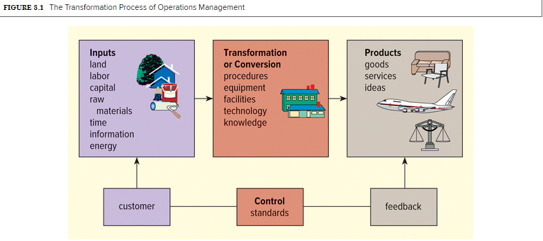
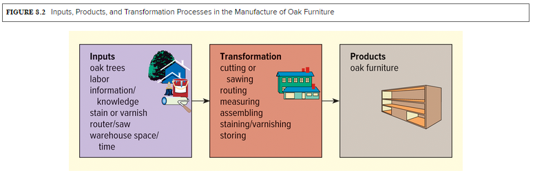
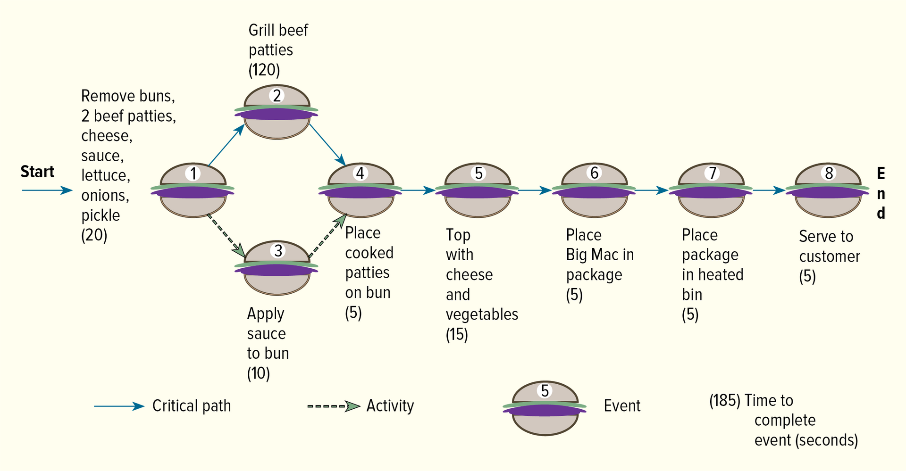

<h1 id="Chapter_8._Managing_Service_and_Manufacturing_Operations_" style="color:#42A5F5;">Indice</h1>

##### [Capitulo (LO 8-1) LA NATURALEZA DE LA ADMINISTRACIÓN DE OPERACIONES ](#897026)

##### [Capitulo (LO 8-2) ADMINISTRACIÓN DE OPERACIONES EN EMPRESAS DE SERVICIOS](#201693)

##### [Capitulo (LO 8-3) PLANNING AND DESIGNING OPERATIONS SYSTEMS](#450336)

##### [Capitulo (LO 8-5) Managing Quality](#459925)
---

<h1 id="897026" style="color:#E65100;">
  <a href="#Chapter_8._Managing_Service_and_Manufacturing_Operations_" style="color:inherit; text-decoration:none;">
    (LO 8-1) LA NATURALEZA DE LA ADMINISTRACIÓN DE OPERACIONES 
  </a>
</h1>

## LA NATURALEZA DE LA ADMINISTRACIÓN DE OPERACIONES (LO 8-1)

### 📌 Definición
La **Administración de Operaciones (OM)** es el desarrollo y la gestión de las actividades involucradas en la transformación de recursos en bienes y servicios.

---

### 🎯 Funciones Principales de la Administración de Operaciones
- Supervisa el **proceso de transformación** (insumos → productos)
- Planifica y diseña los **sistemas de operaciones**
- Gestiona:
  - Logística
  - Calidad
  - Productividad

---

### ⭐ Importancia de OM
- Es el **núcleo de la mayoría de las organizaciones**
- Garantiza que los productos o servicios cumplan con la **calidad esperada por los clientes**
- Permite usar los recursos de forma **eficiente y efectiva**
- Sin una buena OM, la empresa **no puede mantenerse en el mercado**

---

### 🏭 Manufactura vs. Operaciones
- **Manufactura / Producción**
  - Se enfoca en **bienes tangibles**
  - Ejemplo: productos físicos

- **Operaciones**
  - Concepto más amplio
  - Incluye **bienes y servicios (tangibles e intangibles)**

---

### 🔄 Evolución Histórica
- Antes se conocía como **producción** o **manufactura**
- Se enfocaba en la **eficiencia de las fábricas**
- Evolucionó a **operaciones** para incluir:
  - Servicios
  - Ideas
  - Procesos completos de la organización

---

### 🌎 Alcance Actual de OM
Hoy en día, la OM se aplica en muchas industrias:
- Salud
- Restaurantes
- Bancos
- Entretenimiento
- Educación
- Transporte
- Organizaciones sin fines de lucro

---

### 🧾 Idea Clave
La Administración de Operaciones es fundamental porque **crea los bienes y servicios** que ofrecen las organizaciones, siendo una de las funciones más importantes en cualquier empresa.

## EL PROCESO DE TRANSFORMACIÓN

### 📌 Definición
En el centro de la Administración de Operaciones se encuentra el **proceso de transformación**, mediante el cual los **insumos** (como trabajo, dinero, materiales y energía) se convierten en **productos** (bienes, servicios e ideas).

---

### 🔄 ¿Cómo funciona?
El proceso de transformación:
- Combina los insumos de manera planificada  
- Utiliza:
  - Equipos  
  - Procedimientos administrativos  
  - Tecnología  

El objetivo es crear un producto que satisfaga las necesidades del cliente.

---

### 🖼️ Figura 8.1: Proceso de Transformación
</img>
---

### 🎯 Control y mejora del proceso
Los gerentes de operaciones aseguran la calidad y eficiencia mediante:
- Medición del desempeño (**feedback**)  
- Comparación con **estándares establecidos**  
- Aplicación de **acciones correctivas** si hay desviaciones  

📍 **Ejemplo:**  
Si una aerolínea espera que el 90% de sus vuelos salgan a tiempo, pero solo el 80% lo logra, existe una desviación negativa del 10%, lo que requiere correcciones.

---

### ⚙️ Importancia del proceso
Todas las acciones necesarias para producir un bien o servicio de calidad forman parte del proceso de transformación.

---

### 🏭 Ejemplo: Fabricación de muebles de roble
El proceso incluye varias etapas:

1. Quitar la corteza y cortar la madera  
2. Secar la madera  
3. Dar forma y alisar  
4. Ensamblar y tratar las piezas  
5. Barnizar o teñir  
6. Almacenar el producto terminado  

---

### 🖼️ Figura 8.2: Proceso de fabricación de muebles
</img>
---

### 🔗 Estrategias empresariales
Algunas empresas pueden:
- Comprar materiales ya procesados  
- Subcontratar (outsourcing) ciertas etapas a otras empresas especializadas  

---

### 🧾 Idea Clave
El proceso de transformación convierte insumos en productos finales mediante una serie de pasos controlados, asegurando **calidad, eficiencia y satisfacción del cliente**.

<h1 id="201693" style="color:#E65100;">
  <a href="#Chapter_8._Managing_Service_and_Manufacturing_Operations_" style="color:inherit; text-decoration:none;">
    (LO 8-2) ADMINISTRACIÓN DE OPERACIONES EN EMPRESAS DE SERVICIOS 
  </a>
</h1>

## 📌 Idea General
La Administración de Operaciones también se aplica a las **empresas de servicios**, pero sus procesos de transformación son diferentes a los de manufactura.

---

## 🔄 Proceso de transformación en servicios
Las organizaciones de servicios transforman insumos en resultados mediante diversas actividades:

- **Ejemplo: Aerolínea**
  - Insumos: empleados, tiempo, dinero, equipos  
  - Procesos: reservas, vuelos, mantenimiento, entrenamiento  
  - Resultado: transporte de pasajeros o paquetes  

- **Ejemplo: Organización sin fines de lucro**
  - Insumos: dinero, alimentos, voluntarios  
  - Procesos: recaudación de fondos, preparación de comida, servicio  
  - Resultado: comidas para personas necesitadas  

---

## 🎯 Objetivo principal
- El producto final debe tener **mayor valor que el costo de los insumos**

---

## ⚖️ Naturaleza de los servicios
A diferencia de los bienes:
- Los servicios son **acciones o desempeños**
- Se dirigen directamente al **cliente**
- Requieren **alto contacto con el cliente**

---

## 🤝 Tipos de servicios según contacto

- **Alto contacto:**
  - Salud  
  - Bienes raíces  
  - Preparación de impuestos  
  - Restaurantes  

- **Bajo contacto:**
  - Servicios en línea (ej: subastas o compras online)  

---

## ⭐ Características de los servicios

| Característica | Descripción |
|--------------|------------|
| **Intangibilidad** | No se pueden tocar |
| **Inseparabilidad** | Producción y consumo ocurren al mismo tiempo |
| **Perecibilidad** | No se pueden almacenar |
| **Personalización** | Se adaptan al cliente |
| **Contacto con el cliente** | Interacción directa |

---

## 📊 Ejemplos de servicios

- Asistir a conciertos o eventos deportivos  
- Servicios médicos o veterinarios  
- Viajes en avión  
- Cortes de cabello  
- Servicios legales o fiscales  
- Restaurantes y tiendas  

---

## 🤖 Tecnología en servicios
Muchos servicios modernos:
- Incorporan **alta tecnología**
- Buscan equilibrio entre:
  - **High-tech (tecnología)**
  - **High-touch (trato humano)**

---

## 🤖 Tecnología y estandarización
Independientemente del nivel de contacto con el cliente, las empresas de servicios buscan:
- Proporcionar **procesos estandarizados**
- Utilizar la **tecnología** para crear respuestas automáticas y estructuradas  

📌 El proveedor ideal combina:
- **High-tech (alta tecnología)**  
- **High-touch (trato humano)**  

---

## 🌐 Ejemplo
Empresas como Amazon:
- Invierten fuertemente en tecnología  
- Utilizan:
  - Chatbots automatizados  
  - Agentes humanos  

Esto mejora la eficiencia y la experiencia del cliente.

---

## 🎯 Claves para el éxito en servicios
Las organizaciones deben enfocarse en:
- Contratar y capacitar empleados excelentes  
- Desarrollar sistemas flexibles  
- Personalizar servicios  
- Ajustar la capacidad según la demanda  

---

## ⚠️ Desafíos en los servicios

### 1. Intangibilidad
- Los servicios no se pueden tocar ni almacenar  

### 2. Perecibilidad
- No se pueden guardar para uso futuro  
- Ejemplo:
  - Asiento vacío en un avión  
  - Mesa vacía en un restaurante  

---

## 📉 Problemas de estimación de demanda
- **Sobreestimación:**
  - Recursos desperdiciados  
  - Costos altos  

- **Subestimación:**
  - Precios más altos  
  - Clientes insatisfechos  
  - Sobreventa (overbooking)  

📍 **Ejemplo:**  
Una aerolínea puede volar con asientos vacíos (pérdida) o vender más boletos de los disponibles (problemas con clientes).

---

## ⚖️ Comparación general

| Aspecto | Bienes | Servicios |
|--------|-------|----------|
| Producción | Antes de la compra | Durante o después de la compra |
| Naturaleza | Tangible | Intangible |
| Almacenamiento | Posible | No posible |
| Contacto con cliente | Bajo | Alto |

---

## 🧾 Idea Clave
Las empresas de servicios deben equilibrar **tecnología, contacto humano y flexibilidad**, enfrentando desafíos como la **demanda variable** y la **imposibilidad de almacenar sus productos**.

## SERVICIOS VS PRODUCTOS TANGIBLES

### ⚖️ Diferencias principales
Fabricantes y proveedores de servicios se diferencian principalmente en **la naturaleza y el consumo de sus productos**:

- **Manufactura:** produce bienes tangibles  
  - Ejemplo: automóviles, relojes, muebles  
  - La producción puede realizarse **aisladamente**, lejos del cliente  

- **Servicios:** producen bienes intangibles  
  - Ejemplo: entrega de correo prioritario (U.S. Postal Service), estadía en un hotel Westin  
  - Requieren **mayor contacto con el cliente**  
  - La prestación del servicio ocurre generalmente **en el punto de consumo**  

---

### 🏨 Ejemplos de servicios
- En un hotel Westin:
  - Amenidades de bienestar  
  - Camas Heaventy Bed  
  - Programa de recompensas Marriott Bonvoy  

- Automóviles:
  - La producción se separa del uso real  
  - No requiere contacto directo con el consumidor  

---

### 👥 Contacto con el cliente y operaciones
- Los proveedores de servicios tienen **limitaciones** en:
  - Métodos de trabajo  
  - Asignación de tareas  
  - Programación de trabajo  
  - Control de operaciones  

- **Ejemplo:** Starbucks utiliza **inteligencia artificial (IA)** para:
  - Predecir necesidades de personal  
  - Crear horarios de trabajo eficientes  

---

### 🏥 Mejora de la calidad en servicios
Algunos hospitales aplican **procesos de manufactura y control de calidad** del sector automotriz para mejorar la atención al paciente:

- Eliminación de pasos innecesarios  
- Uso de equipos para resolver problemas rápidamente  
- Reducción de tiempos de espera  
- Menores inventarios (ej: sillas de ruedas)  
- Preparación más rápida de quirófanos  
- Menos errores y menores costos  

---

### 🧾 Idea Clave
Los servicios requieren **interacción directa con el cliente**, se consumen al mismo tiempo que se producen y necesitan enfoques específicos para garantizar calidad y eficiencia, a diferencia de los productos tangibles que pueden fabricarse de manera más aislada.

## DIFERENCIAS ADICIONALES ENTRE SERVICIOS Y MANUFACTURA

### 1️⃣ Uniformidad de insumos
- Los **fabricantes** controlan mejor la variabilidad de los recursos.  
  - Ejemplo: Cada Ford Focus requiere procesos similares para su producción.  
- Los **servicios** son más **personalizados**.  
  - Ejemplo: Cada llamada a Fidelity Investments puede requerir soluciones distintas.  
  - Otro ejemplo: Un corte de cabello es más personalizado que una botella de shampoo.  

---

### 2️⃣ Uniformidad de productos finales
- Los servicios tienden a variar debido al **elemento humano**.  
  - Ejemplo: No todos los cajeros o barberos trabajan de la misma manera.  
  - Incluso cadenas como McDonald's o Burger King presentan pequeñas variaciones.  
  - Salud: cada diagnóstico y tratamiento es único.  
- La manufactura permite **productos uniformes** gracias a la **automatización**.  
  - Ejemplo: Bicicletas de lujo como la Giant TCR Advanced SL Disc mantienen estándares muy altos de calidad.  

---

### 3️⃣ Mano de obra requerida
- Los servicios son más **intensivos en mano de obra** debido a:
  - Contacto directo con el cliente  
  - Perecibilidad del producto  
  - Personalización de insumos y productos  
  - Ejemplo: Adecco depende de la calidad del trabajo de cada trabajador temporal  
- La manufactura es más **intensiva en capital** por el uso de maquinaria y tecnología  
  - Ejemplo: Ford requiere gran inversión para producir autos eléctricos con baterías de larga duración  

---

### 4️⃣ Medición de productividad
- En manufactura, la productividad se mide fácilmente gracias a:
  - Tangibilidad de los productos  
  - Uniformidad en la producción  
  - Ejemplo: Producción de procesadores Intel  
- En servicios, la productividad es más difícil de medir debido a:
  - Variaciones en la demanda (ej: temporada alta de vuelos)  
  - Diferencias en los requerimientos de servicio  
  - Intangibilidad del producto  
  - Ejemplo: Servidores de clientes en Prudential Securities  

---

### 5️⃣ Realidad combinada
- Muchas organizaciones combinan **productos tangibles e intangibles**:  
  - Samsung: ofrece productos físicos y servicios como chat 24/7 y garantía  
  - Bancos: venden cheques (tangibles) y servicios financieros (intangibles)  

📌 **Idea clave:**  
El nivel de tangibilidad del producto principal influye en cómo la empresa clasifica sus operaciones y define sus procesos y procedimientos operativos.

<h1 id="450336" style="color:#E65100;">
  <a href="#Chapter_8._Managing_Service_and_Manufacturing_Operations_" style="color:inherit; text-decoration:none;">
    (LO 8-3) PLANNING AND DESIGNING OPERATIONS SYSTEMS
  </a>
</h1>

### 📌 Idea general
Antes de producir cualquier producto, una empresa debe tomar decisiones estratégicas sobre:

1. **Qué producir**  
   - Determinar los productos o servicios que ofrecerá.  
   - Definir **para qué grupo de clientes** se diseñan estos productos.  

2. **Cómo producirlo**  
   - Seleccionar los **procesos** necesarios para fabricar los productos o entregar los servicios.  

3. **Dónde producirlo**  
   - Determinar las **instalaciones** y la infraestructura necesarias para la producción.  

Estas decisiones forman parte de la **planificación de operaciones**.

---

### 🏢 Planificación integral
- Originalmente, la planificación era responsabilidad exclusiva del departamento de **producción y operaciones**.  
- Hoy en día, empresas exitosas incluyen **todos los departamentos**, especialmente:  
  - Marketing  
  - Investigación y Desarrollo (I+D)  

Esto asegura que los productos sean adecuados para el mercado y se produzcan de manera eficiente.  

---

### 🧾 Idea clave
Planificar y diseñar un sistema de operaciones no solo involucra procesos y instalaciones, sino también la **coordinación interdepartamental** para garantizar que los productos cumplan con las expectativas de los clientes y los objetivos de la empresa.

## 📌 Planning the Product

Antes de fabricar cualquier producto, una empresa debe **determinar lo que los consumidores quieren** y luego **diseñar un producto que satisfaga esa necesidad**.

### 🔍 Investigación de mercado
- La mayoría de las empresas utiliza **marketing research** para:  
  - Identificar los tipos de bienes y servicios que ofrecer  
  - Definir las **características que deben poseer**  
- Herramientas modernas incluyen:  
  - **Redes sociales** (ej. Facebook)  
  - **Social listening tools** para capturar inteligencia de consumidores en tiempo real  
  - **Inteligencia artificial (IA)** que mide expresiones faciales durante eventos o experiencias  
- La investigación de mercado también ayuda a estimar:  
  - La **demanda** de un producto  
  - Cuánto están dispuestos a pagar los consumidores  

📌 **Nota:** Cuando el entorno del mercado cambia, las empresas deben ser **flexibles** y adaptarse rápidamente.

---

### 💰 Desarrollo de productos
- Desarrollar un producto puede ser **lento y costoso**.  
  - Ejemplo: **Pfizer** invierte más de $13 mil millones al año en I+D, con más de 100 productos en su pipeline.  
- Las empresas buscan **reducir costos y tiempos**:  
  - **Alianzas y joint ventures** para compartir recursos  
  - Ejemplo: United, Tallgrass y Green Plains Inc. colaboran en **combustible de aviación sostenible**

---

### 🏗️ Diseño del producto
- El departamento de **ingeniería o I+D** convierte la idea del producto en un **diseño funcional y económicamente viable**.  
- En empresas pequeñas, una sola persona (como el dueño) puede encargarse de esta tarea.  
- La planificación no termina con el diseño; también incluye la **producción eficiente** para satisfacer la demanda.

---

### ⚙️ Operaciones y transformación
Un gerente de operaciones debe planificar:  
1. **Tipos y cantidades de materiales** necesarios para producir el producto  
2. **Habilidades y cantidad de personal** requeridas  
3. **Procesos de transformación** de insumos a productos finales  

💡 **Ejemplo:** Snapper transforma acero, aluminio y otros materiales en un diseño de cortacésped que cumpla con los **requisitos del consumidor y ambientales**.

---

### 🧾 Idea clave
El éxito en la planificación de operaciones no depende solo del diseño del producto, sino también de **asegurar procesos eficientes, personal capacitado y materiales adecuados** para producir en cantidad suficiente y con calidad.

## 🏗️ Designing the Operations Processes

Antes de iniciar la producción, una empresa debe determinar el **método apropiado para transformar los recursos en el producto deseado**.  
- Las necesidades y deseos de los consumidores pueden dictar el proceso.  
  - Ejemplo: Peajes en autopistas → procesos estructurados y estandarizados  
  - Ejemplo: Construcción de puentes → procesos personalizados, construcción en sitio  

Los productos generalmente se diseñan siguiendo uno de **tres procesos**: **estandarización, diseño modular o personalización**.

---

### 1️⃣ Standardization (Estandarización)
- Consiste en fabricar **componentes o productos completos idénticos e intercambiables**.  
- Ventajas:  
  - Menor costo  
  - Producción más rápida  
  - Control de calidad más eficiente  
  - Consistencia en el producto  
- Ejemplos: televisores, bolígrafos, chips de tortilla  
- Escala global: requiere cumplir **estándares internacionales de calidad** (ISO)  

---

### 2️⃣ Modular Design (Diseño modular)
- Construcción de un producto con **unidades auto-contenidas o módulos** que se pueden combinar.  
- Ventajas:  
  - Permite **personalización mediante mezcla de componentes**  
  - Reparaciones rápidas (aunque los módulos pueden ser costosos)  
- Ejemplos:  
  - The Container Store → soluciones de almacenamiento modulares  
  - Casas prefabricadas → se construyen secciones en fábrica y se transportan al sitio  
  - Automóviles y hogares modulares  

---

### 3️⃣ Customization (Personalización)
- Fabricación de productos **para satisfacer necesidades o deseos específicos del cliente**.  
- Productos únicos: reparaciones, arte, joyería, muebles, puentes, barcos, software  
- **Mass customization**: personalización en masa para muchos clientes  
  - Ejemplos:  
    - Dell → computadoras configurables según el cliente  
    - Programas de fitness y paquetes de viaje personalizados  

---

### 🔗 Blockchain en procesos operativos
- Blockchain permite **registrar todas las transacciones de manera segura y transparente**, útil en:  
  - Cadena de suministro  
  - Salud  
  - Publicidad online  
- Características:  
  - Almacena datos en bloques encadenados cronológicamente  
  - Rastrea el movimiento de productos en la cadena de suministro  
  - Reduce fraudes y aumenta la eficiencia  
- Ejemplo: Microsoft utiliza blockchain para **contratos digitales de Xbox**, rastreando derechos y regalías  
- Proyección: Para 2030, se espera que blockchain genere **$1.76 billones en valor de negocios**  

---

### 🧾 Idea Clave
El **diseño del proceso operativo** depende del tipo de producto y de la demanda del cliente:  
- Productos masivos → estandarización  
- Componentes combinables → diseño modular  
- Productos únicos o configurables → personalización o personalización en masa  
- Tecnologías emergentes como blockchain pueden transformar **la eficiencia y transparencia de los procesos**.

## 📊 Planning Capacity

La planificación de los procesos operativos incluye dos áreas importantes: **capacidad** y **planificación de instalaciones**.  

### 1️⃣ ¿Qué es capacidad?
- Capacidad: **carga máxima que una unidad organizativa puede manejar o producir**  
- Unidad de medida: trabajador, máquina, departamento, sucursal o planta completa  
- Ejemplos:  
  - Planta eléctrica → kilovatios-hora producidos sin causar apagones  
  - Restaurante → número máximo de clientes que pueden ser atendidos cómodamente y con cortesía  

---

### 2️⃣ Importancia de planificar la capacidad
- Capacidad insuficiente → **demanda no satisfecha y pérdida de clientes**  
- Capacidad excesiva → **costos operativos innecesarios** por recursos no usados  
- Solución: **pronosticar la demanda** y planificar la capacidad en función de estos pronósticos  

---

### 3️⃣ Consideraciones a largo plazo
- Las decisiones de capacidad suelen implicar **compromisos de recursos a largo plazo**  
  - Ejemplo: Tamaño de una fábrica → difícil de modificar sin costos importantes  
- A corto plazo, se pueden hacer **alianzas estratégicas** para cubrir la demanda  
  - Ejemplo: Merck y Johnson & Johnson colaboraron para producir la vacuna COVID-19  

---

### 4️⃣ Capacidad y sostenibilidad
- Las empresas modernas también consideran el **impacto ambiental** en la planificación de capacidad  
  - Ejemplo: Toyota y subsidiarias → certificación ISO 14001 en gestión ambiental  
  - Ayuda a monitorear y reducir el impacto ambiental de las operaciones  

---

### 5️⃣ Ejemplo práctico
- Mondelez International (Canadá) produce **Sour Patch Kids, Swedish Fish y otros caramelos**  
- Capacidad de producción: **11 millones de piezas de caramelo por día**  

---

### 🧾 Idea Clave
La planificación de capacidad busca **equilibrar recursos disponibles con la demanda esperada**, minimizando costos, evitando pérdida de clientes y considerando compromisos a largo plazo y sostenibilidad ambiental.

## 🏭 Planning Facilities and Technology 

Una vez que una empresa conoce el proceso para producir sus productos, debe **diseñar y construir la instalación adecuada**.  
No todos los productos se fabrican en fábricas; algunos se producen en tiendas, hogares o directamente donde se usarán.  
Muchas empresas combinan **organizaciones tradicionales** (contacto directo con clientes) con **organizaciones virtuales** (servicios en línea).  
Ejemplo: Charles Schwab Corporation permite a sus clientes operar inversiones desde internet o teléfono sin visitar sus oficinas.  

---

### 1️⃣ Facility Location (Ubicación de la instalación)
- La **ubicación es crítica** debido a los altos costos y la dificultad de cambios posteriores.  
- Factores a considerar:  
  - Proximidad al mercado  
  - Disponibilidad de materias primas  
  - Transporte y energía  
  - Condiciones climáticas  
  - Mano de obra disponible  
  - Calidad de vida y comunidad  
  - Impuestos e incentivos (ej.: incentivos fiscales para empresas solares)  
- Ejemplos de empresas con instalaciones internacionales: Apple, Samsung, GoPro, Nintendo, Hasbro → China, Vietnam, Taiwán, México  

---

### 2️⃣ Facility Layout (Distribución de la instalación)
Tres diseños principales:

1. **Fixed-position layout (Proyecto)**  
   - Todos los recursos se llevan al producto (ej.: puente, edificio, casa, planta hidroeléctrica)  
   - Pocos productos únicos, alta habilidad requerida, alto costo por unidad  

2. **Process layout (Intermitente)**  
   - Organiza la producción en departamentos con procesos relacionados (ej.: metalurgia, hospitales, imprentas)  
   - Productos a medida, cantidades limitadas, alto costo por unidad  

3. **Product layout (Producción continua / línea de ensamblaje)**  
   - Trabajadores permanecen en un lugar; el producto se mueve a lo largo de la línea  
   - Producción masiva, productos estandarizados, bajo costo por unidad (ej.: autos, aspiradoras, comidas en cafeterías)  

- **Combinación de layouts:** muchas empresas mezclan layouts según necesidad (ej.: automotrices usan línea de ensamblaje y proceso para piezas).  

---

### 3️⃣ Technology (Tecnología en operaciones)
- Cada industria tiene **tecnología básica** que dicta el proceso de transformación.  
- Tecnologías que transforman los modelos de negocio hoy en día: **blockchain, inteligencia artificial (AI), sistemas integrados por computadora (CIM)**  

**Computers and CAD/CAM**
- Computadoras: introducidas por IBM en los años 50, esenciales en todas las fases de operaciones  
- **CAD (Computer-Aided Design):** diseño de componentes y productos en 3D en computadora → impresión de modelos físicos  
  - Ejemplos: SolidWorks, Revit → industrias: aeroespacial, defensa, productos de consumo, dispositivos médicos  
- **CAM (Computer-Aided Manufacturing):** controla y guía procesos de transformación  
  - Monitorea maquinaria y producto en tiempo real  
  - Permite acción correctiva por operador o automática en sistemas altamente automatizados  
  - AI puede integrarse tanto en CAD como CAM para mayor eficiencia  

**Drones**
- Vehículos aéreos no tripulados que pueden inspeccionar materiales, equipos o inventario  
- Ejemplo: Amazon Prime Air → entrega de paquetes en 30 minutos en áreas selectas  
- FAA regula vuelos más allá de la línea visual de vista  
- Aplicaciones: inspección, logística, monitoreo de inventario, eficiencia operacional  

**Robotics**
- Robots realizan tareas repetitivas y peligrosas (ej.: ensamblaje de autos, electrónica, química)  
- "Steel-collar" workers en industrias de alto riesgo: nuclear, desechos peligrosos, investigación oceánica, construcción espacial  
- Ventajas: mayor seguridad, eficiencia, reducción de costos y energía, reubicación de manufactura  
- US, China y Japón controlan ~59% de instalaciones globales de robots industriales  

**Artificial Intelligence (AI)**
- Permite que máquinas realicen tareas que requieren inteligencia humana: decisiones, percepción visual, reconocimiento de voz  
- **Generative AI**: creación de contenido de texto, imágenes, audio, video (ej.: ChatGPT, DALL-E)  
- Aplicaciones: atención al cliente, análisis de datos, automatización de tareas, traducción, generación de contenido  

**Flexible Manufacturing**
- Computadoras dirigen maquinaria para producir versiones diferentes de productos similares sin detener la línea de producción  
- Ejemplo: una máquina puede fabricar distintas versiones de un motor con simples ajustes de programación  

**Computer-Integrated Manufacturing (CIM)**
- Integración de CAD/CAM, robótica, drones, AI y manufactura flexible  
- Sistema completo que diseña productos, gestiona máquinas y materiales, controla operaciones  
- Beneficios: mayor productividad, calidad consistente, reducción de costos  
- Requiere que los **gerentes de operaciones sean competentes en tecnología y alfabetización digital**  

---

### 🧾 Idea Clave
La tecnología avanzada permite **optimizar operaciones, mejorar calidad, reducir costos y adaptarse a cambios en la demanda**.  
Las decisiones sobre tecnología deben integrarse con layout, ubicación y procesos para maximizar eficiencia y competitividad.

## 🌱 Sustainability and Manufacturing 

La manufactura y los sistemas de operaciones se están moviendo rápidamente hacia la **sostenibilidad ambiental** y la **minimización del impacto negativo** en el medio ambiente natural.  

---

### 1️⃣ ¿Qué es sostenibilidad?
- Conducir actividades de manera que se **garantice el bienestar a largo plazo del medio ambiente**, incluyendo todos los organismos biológicos.  
- Temas clave:  
  - Contaminación de suelo, agua y aire  
  - Cambio climático  
  - Gestión de residuos  
  - Deforestación  
  - Expansión urbana  
  - Protección de biodiversidad  
  - Alimentos modificados genéticamente  

- Ejemplo: **The Hershey Company** → iniciativa "Cocoa for Good" para garantizar un suministro de cacao sostenible y proteger el medio ambiente.  

---

### 2️⃣ Beneficios de las operaciones verdes
- Mejoran la **reputación de la empresa**  
- Aumentan la **lealtad de clientes y empleados**  
- Contribuyen a **mayores ganancias**  

---

### 3️⃣ Sostenibilidad en la práctica
- Cambio climático: ~40% de emisiones de CO₂ en EE. UU. provienen de edificios y construcción  
- Edificios **LEED-certificados**:  
  - 34% menos emisiones  
  - 25% menos consumo de energía  
  - 11% menos agua  
  - Reducción de residuos > 80 millones de toneladas  

- Ejemplos de empresas sostenibles:  
  - **General Motors, Ford, Tesla** → énfasis en vehículos eléctricos  
  - Tesla: fábricas con paneles solares y energías renovables  

- Ciudades líderes en sostenibilidad:  
  - **Portland, Oregon** → parques, transporte masivo, alimentación sostenible, estacionamientos para bicicletas, máquinas de ejercicio que producen electricidad  

- **Apoyo gubernamental**: programas que facilitan la innovación en operaciones y manufactura verdes  

---

### 🧾 Idea clave
La sostenibilidad ya no es opcional. Incorporar **operaciones verdes** es estratégico: protege el planeta, reduce costos, mejora la imagen corporativa y fortalece la lealtad de stakeholders.

<h1 id="713523" style="color:#E65100;">
  <a href="#Chapter_8._Managing_Service_and_Manufacturing_Operations_" style="color:inherit; text-decoration:none;">
    (LO 8-4) Gestión de la Cadena de Suministro
  </a>
</h1>

La **gestión de la cadena de suministro (SCM, por sus siglas en inglés)** es el proceso de conectar e integrar a todas las partes involucradas en el sistema de distribución para satisfacer eficientemente las necesidades del cliente. Implica coordinar actividades como logística, adquisición de insumos, gestión de inventarios, subcontratación, rutas y programación. La SCM asegura que los productos se muevan de manera fluida desde los proveedores ("aguas arriba") hasta los fabricantes, mayoristas, minoristas y, finalmente, los clientes ("aguas abajo"), creando una ventaja competitiva para la organización.  

Es útil pensar en las empresas de un sistema de distribución como una línea conceptual, cuyo impacto combinado resulta en una cadena de suministro efectiva. Las empresas "aguas arriba" (por ejemplo, proveedores) y "aguas abajo" (por ejemplo, mayoristas y minoristas) deben trabajar juntas para servir a los clientes y generar ventaja competitiva. La SCM requiere que los gerentes de marketing colaboren con otros gerentes de operaciones, logística y adquisiciones.

## Tecnología en la cadena de suministro

Las cadenas de suministro modernas están cada vez más apoyadas por la tecnología:

- **Inteligencia Artificial (IA):** permite pronosticar la oferta y la demanda, optimizar inventarios y automatizar tareas repetitivas. Puede aplicarse en transporte, operaciones y compras mediante algoritmos inteligentes.
- **Drones:** ayudan con inspecciones, monitoreo de inventarios y entregas. Se estima que los servicios de drones representan más de $127 mil millones globalmente, con $23 mil millones solo en transporte.
- **Blockchain:** es un registro distribuido que rastrea productos desde su origen hasta el consumidor final de manera segura y transparente, eliminando la asimetría de información entre los miembros de la cadena.
- **Robótica y automatización:** mejoran la eficiencia en manufactura y logística, reducen riesgos y facilitan operaciones repetitivas o peligrosas.
- **Vehículos autónomos:** como camiones sin conductor, que pueden hacer transporte de manera más eficiente, confiable y económica.

Estas tecnologías hacen que la SCM sea el centro de coordinación de operaciones, adquisiciones y logística. Por ejemplo, Walmart rastrea todos los productos agrícolas desde el campo hasta la tienda, y Carrefour permite a los clientes escanear productos para conocer su origen, uso de hormonas u otros datos de calidad.

## Impacto ético y sostenible

La gestión efectiva de la cadena de suministro no solo asegura eficiencia operativa y entrega a tiempo, sino que también respalda prácticas éticas y sostenibles. Las empresas deben considerar el comercio justo, productos orgánicos, condiciones laborales, trabajo infantil, externalización de empleos y regulaciones. El uso responsable de materiales, optimización logística y adopción de tecnología avanzada permiten generar valor financiero y de marca.

## Elementos clave de la SCM

Los elementos fundamentales de la cadena de suministro incluyen:

- **Logística:** transporte, almacenamiento y distribución de productos.  
- **Procurement (adquisiciones):** obtención de materias primas y servicios necesarios.  
- **Gestión de inventarios:** controlar niveles de stock para satisfacer la demanda sin excesos.  
- **Subcontratación (outsourcing):** delegar partes del proceso a terceros para eficiencia o especialización.  
- **Programación (scheduling):** planificación de actividades para asegurar flujo continuo de producción y distribución.

### Ejemplo ilustrativo

Consideremos una empresa ficticia, **Rushing Water Canoes Inc.**, que fabrica canoas de aluminio vendidas a tiendas deportivas y expediciones de rafting. También produce remos y cascos, pero el foco está en la logística y manufactura de canoas de alta calidad, mostrando cómo se aplican los principios de SCM en la transformación de materias primas en productos terminados.

# Attabotics: Startup se centra en la automatización de la cadena de suministro

La **automatización robótica** está revolucionando la manufactura y la gestión de la cadena de suministro. **Attabotics**, una startup canadiense, se especializa en utilizar robots para mejorar los sistemas de gestión de inventarios. La compañía ha recaudado más de $165 millones en financiamiento de capital de riesgo debido a la creciente demanda de soluciones que hagan la distribución más eficiente.

La tecnología de Attabotics, utilizada en sectores como **retail, alimentos y bebidas, y suministros médicos**, reemplaza los almacenes tradicionales con filas y pasillos por **estructuras de almacenamiento verticales**. Estas estructuras, ubicadas dentro de los almacenes, emplean **robots shuttles** para mover los productos a los trabajadores, quienes luego los empacan y envían. Según la empresa, almacenar productos de esta manera requiere **hasta un 85 % menos de espacio**.

La estructura de almacenamiento vertical, inspirada en **colonias de hormigas**, reduce el espacio necesario, permitiendo a las empresas operar **almacenes más pequeños cerca de áreas urbanas de alta densidad**. Esto también ayuda a **reducir la huella de carbono**. Por ejemplo, Nordstrom construyó un almacén de **340,000 pies cuadrados**, mucho más pequeño que sus instalaciones típicas de 1,5 millones de pies cuadrados. Los clientes pagan una **suscripción** por el uso de los robots y servicios de fulfillment de la empresa.

Attabotics también se ha asociado con **FoodX Technologies**, una plataforma de software para e-commerce de alimentos, para crear una **solución de micro-fulfillment** para el mercado de e-grocery. El sistema de fulfillment de Attabotics se integrará con la plataforma de FoodX para gestionar **comercio electrónico, rutas de entrega, gestión de inventario, fulfillment y logística inversa**, ofreciendo a los minoristas una solución que mejora los márgenes de ganancia y aumenta la productividad. Esto llega en un momento clave, cuando la **compra y entrega de comestibles en línea** está en auge. Se espera que Attabotics lleve eficiencia a muchos más negocios a medida que crece.

---

## Preguntas de pensamiento crítico con respuestas

1. **¿Cómo afecta Attabotics el diseño del layout de las instalaciones?**  
   **Respuesta:** Attabotics transforma el layout tradicional de almacenes (filas y pasillos) en **estructuras verticales compactas**, optimizando el uso del espacio y permitiendo almacenes más pequeños y cercanos a los clientes, lo que mejora la eficiencia y la rapidez en la preparación de pedidos.  

2. **¿Cuál es el beneficio del almacenamiento vertical?**  
   **Respuesta:** Permite **ahorrar hasta un 85 % de espacio**, acercar los centros de fulfillment a áreas urbanas, **reducir la huella de carbono**, y operar de manera más ágil, eficiente y sostenible.  

3. **¿De qué otras maneras crees que la robótica afectará la gestión de la cadena de suministro?**  
   **Respuesta:**  
   - Automatización de tareas repetitivas como picking, empaquetado y traslado de productos.  
   - Mayor precisión en el inventario y reducción de errores humanos.  
   - Optimización de rutas de entrega y logística.  
   - Mejora de la velocidad de respuesta ante cambios en la demanda del cliente.  
   - Reducción de costos operativos y aumento de la eficiencia general de la cadena de suministro.  
   - Posible integración con IA y blockchain para un control más inteligente y seguro de inventarios.

## Logística

La logística se refiere a la **distribución física y a la selección de los modos de transporte**. Las redes digitales que integran el movimiento de productos proporcionan información para mejorar el servicio y reducir costos. Existen tres áreas clave:

1. **Logística de entrada (Inbound Logistics):** Movimiento de materias primas, empaques, información y otros bienes desde los proveedores hacia los productores.  
2. **Logística de salida (Outbound Logistics):** Movimiento de productos terminados e información desde la empresa hacia los clientes y consumidores finales.  
3. **Logística de terceros (Third-Party Logistics, 3PL):** Contratar empresas externas para mover productos de manera más eficiente que la propia empresa. Un ejemplo es **Old Dominion Freight Line**, que ofrece servicios de transporte terrestre, marítimo y aéreo, además de consultoría en la cadena de suministro.

Con el uso de **analítica predictiva y AI**, las decisiones de transporte se pueden tomar en función de los requisitos del cliente, costos y opciones de servicio. Además, los fabricantes, distribuidores y minoristas deben **comunicarse en tiempo real** con sus socios de la cadena de suministro, lo que permite mejorar la eficiencia y capacidades. Las interrupciones logísticas pueden afectar gravemente la satisfacción del cliente y la viabilidad de la empresa.

---

## Adquisiciones (Procurement)

La adquisición de recursos busca **crear valor mediante la obtención, compra y reciclaje de materiales e información**. Aunque comúnmente se asocia con "comprar", la adquisición incluye mucho más que solo la compra:

- **Fuente de suministro:** Decidir de dónde provienen los insumos y evaluar la integridad del proveedor, no solo el precio.  
- **Impacto ambiental:** Considerar el reciclaje y el impacto ambiental de los materiales después de su uso.  
- **Digitalización:** Crear plataformas digitales que conecten la producción con el consumidor, utilizando sensores, dispositivos móviles, cámaras y otros sistemas para capturar información relevante.

El **departamento de compras** se encarga de adquirir los materiales necesarios para la organización, asegurando calidad, cantidad y costo adecuado. Por ejemplo, **Rushing Water Canoes** debe adquirir aluminio, componentes de canoas, maquinaria, suministros de manufactura y materiales de oficina. El personal de compras evalúa proveedores, busca materiales nuevos que puedan mejorar el producto o reducir costos y utiliza **avances tecnológicos**, como AI avanzada, para identificar oportunidades de ahorro y aumentar la rentabilidad.

---

## Tecnología en la SCM

Las cadenas de suministro modernas están cada vez más apoyadas por la tecnología:

- **IA:** Pronostica oferta y demanda, optimiza inventarios y automatiza tareas repetitivas.  
- **Drones:** Inspección, monitoreo de inventario y entregas.  
- **Blockchain:** Registro seguro y transparente que rastrea productos desde su origen hasta el consumidor.  
- **Robótica y automatización:** Mejoran eficiencia y reducen riesgos en manufactura y logística.  

La gestión efectiva de la SCM asegura **entregas a tiempo, eficiencia operativa y prácticas éticas y sostenibles**, abordando comercio justo, impacto ambiental y condiciones laborales.

## Gestión de Inventarios

Una vez que los elementos necesarios para crear un producto han sido adquiridos, se debe prever un **almacenamiento adecuado** hasta que sean necesarios. Todos los materiales, componentes, productos terminados o parcialmente terminados, y equipos que una empresa utiliza —su inventario— deben ser contabilizados y controlados.

### Tipos de Inventario
Existen tres tipos básicos de inventario:

1. **Inventario de productos terminados:** Productos listos para la venta, como un automóvil completamente ensamblado listo para enviar a un concesionario.  
2. **Inventario en proceso (Work-in-Process):** Productos parcialmente completados o en alguna etapa del proceso de transformación. Por ejemplo, en McDonald's, una hamburguesa en cocción representa inventario en proceso porque debe pasar por varias etapas antes de ser vendida.  
3. **Inventario de materias primas:** Todos los materiales comprados para ser utilizados en la producción de otros productos. Ejemplos incluyen tornillos y tuercas para un fabricante de automóviles, o hamburguesas, vegetales y panes para un restaurante de comida rápida.

El **control de inventario** es el proceso de determinar cuántos suministros y bienes son necesarios, registrar las cantidades disponibles, ubicar cada artículo y asignar responsabilidades. La **gestión de operaciones** debe coordinarse estrechamente con el control de inventario, ya que la producción no puede planificarse sin conocer la disponibilidad de los materiales necesarios. Además, mantener inventario implica costos, como espacio, seguros y almacenamiento.

---

### Determinación del Nivel de Inventario

Los gerentes de inventario deben decidir cuántas unidades de cada artículo mantener. Esto depende de:

- La tasa de uso del artículo.  
- El costo de mantenerlo en inventario.  
- Costos futuros y procedimientos asociados con la adquisición o producción del artículo.  
- Costo del artículo en sí.

**Tecnología aplicada:**  
- **RFID (Identificación por radiofrecuencia):** Sistema inalámbrico de etiquetas y lectores que comunican información a lo largo de todas las fases de manejo del inventario. Mejora el seguimiento de envíos y reduce los tiempos del ciclo.  
- Ayuda a controlar inventarios y prevenir la distribución de productos falsificados, como medicamentos o dispositivos médicos.

---

### Técnicas de Gestión de Inventarios

#### Modelo de Cantidad Económica de Pedido (EOQ)
Determina la **cantidad óptima de unidades a pedir** para minimizar los costos de gestión, almacenamiento y uso del inventario.

#### Gestión de Inventario Justo a Tiempo (JIT)
El JIT elimina el desperdicio usando **cantidades menores de materiales que llegan "justo a tiempo"** para la producción, reduciendo espacio de almacenamiento y costos de inventario.  

- Ejemplo: Rushing Water Canoes utiliza 20 unidades de aluminio por día. Tradicionalmente, se pedirían 440 unidades para un mes. Con JIT, se podrían pedir 20 unidades diarias, reduciendo costos de almacenamiento, seguros y registro.  
- Requiere proveedores **confiables y cercanos** a la planta de producción.  

**Desventaja:** En casos de crisis globales, como la pandemia de COVID-19, un inventario demasiado ajustado puede causar retrasos en la producción.

#### Planificación de Requerimientos de Materiales (MRP)
MRP es un sistema de planificación que **programa la cantidad precisa de materiales necesarios** para producir un producto. Sus componentes básicos son:

1. **Programa maestro de producción (Master Production Schedule).**  
2. **Lista de materiales (Bill of Materials).**  
3. **Archivo de estado de inventario (Inventory Status File).**  

- Ejemplo: El gerente de inventario de Rushing Water Canoes revisa el programa de producción para determinar cuántas canoas se fabricarán, prepara la lista de materiales necesarios, verifica lo que ya hay en inventario y luego programa la orden y entrega de los materiales faltantes.  
- Debido a la gran cantidad de piezas y materiales, **MRP se realiza mediante computadora** y a menudo se combina con JIT para mayor eficiencia.

## Subcontratación (Outsourcing)

La **subcontratación** se ha convertido cada vez más en un componente clave de la gestión de la cadena de suministro en operaciones. Como se mencionó en el capítulo "Negocios en un Mundo sin Fronteras", la subcontratación consiste en **contratar a empresas independientes** para que realicen tareas de manufactura u otros servicios. Estas empresas externas, llamadas **terceros**, a menudo se encargan de servicios logísticos.  

Muchas compañías optan por subcontratar ciertas áreas de sus operaciones a empresas que pueden **proporcionar estos productos de manera más eficiente, a menor costo y con mayor satisfacción del cliente**. La globalización ha presionado a los gerentes de la cadena de suministro a mejorar la rapidez y equilibrar recursos frente a la competencia.  

- **Desafíos de subcontratar a China:** regulaciones estrictas, altos costos de transporte, instalaciones inadecuadas y ejecución de la cadena de suministro impredecible. Por lo tanto, los proveedores deben proporcionar información útil, precisa y oportuna sobre calidad, horarios y soluciones a problemas.  
- Las empresas que contratan proveedores deben asegurarse de que estos sigan los estándares corporativos, ya que cualquier falla podría afectar la reputación de la empresa matriz.

### Ejemplos de subcontratación global
- Muchas empresas de alta tecnología han subcontratado la producción de **chips, computadoras y equipos de telecomunicaciones** a compañías asiáticas.  
- Países como China, India y Vietnam ofrecen **costos laborales más bajos** y han mejorado su infraestructura, capacidades de manufactura y habilidades técnicas y empresariales, haciéndolos atractivos para la subcontratación global.  
- Por ejemplo, **Nike** no posee fábricas propias y subcontrata casi toda su producción a países asiáticos como China y Vietnam.  

### Consideraciones y beneficios
- Aunque la subcontratación global implica costos de transporte y logística, permite liberar tiempo y recursos para que las empresas se enfoquen en sus competencias principales.  
- Originalmente usada como una táctica para **reducir costos**, hoy se asocia también con **ventaja competitiva**: mejora de la calidad del producto, rapidez en la entrega al cliente y mayor eficiencia de la cadena de suministro.  
- Funciones que se pueden subcontratar: tecnología de la información, transporte, recursos humanos, servicios e incluso marketing.  
- Riesgos: conflicto con los trabajadores locales y percepción negativa del público cuando se reemplaza a empleados estadounidenses por trabajadores de menor costo en otros países.

### Ejemplos de proveedores líderes en outsourcing (2022)
| Empresa | Servicios |
|---------|-----------|
| KPMG | Auditoría, impuestos y servicios de consultoría |
| Accenture | Consultoría de gestión, tecnología y outsourcing |
| Canon Business Process Services | Servicios de procesos empresariales, gestión de documentos y fuerza laboral administrada |
| CBRE | Servicios de bienes raíces comerciales |
| Xceed | Servicios financieros |

## Secuenciación y Programación (Routing and Scheduling)

Después de que todos los materiales han sido adquiridos y se ha determinado su uso, los gerentes deben considerar la **secuencia de operaciones** o **routing**, es decir, el orden por el cual el producto debe pasar durante su fabricación. Por ello, **routing y scheduling** son partes importantes de las operaciones en la cadena de suministro.  

**Ejemplo:**  
En **Rushing Water Canoes**, antes de que los empleados puedan formar las láminas de aluminio en un bote, el aluminio debe ser cortado a la medida. De igual manera, el material de flotación del bote debe instalarse antes de que los trabajadores puedan asegurar los asientos de madera. La secuencia depende de las especificaciones del producto desarrolladas por el departamento de ingeniería.  

### Programación (Scheduling)
Una vez definido el routing, se puede programar el trabajo real. La **programación** asigna las tareas a departamentos, máquinas, trabajadores o equipos específicos.  
- Por ejemplo, en Rushing Water Canoes, el corte del aluminio podría programarse para realizarse en el departamento de “corte y acabado” utilizando máquinas diseñadas específicamente para esa tarea.  

Existen muchos enfoques para la programación, desde métodos simples de prueba y error hasta programas de computadora altamente sofisticados.  
- Un método popular es el **PERT (Program Evaluation and Review Technique)**, que:  
  1. Identifica todas las actividades principales necesarias para completar un proyecto.  
  2. Las organiza en una secuencia o ruta.  
  3. Determina la **ruta crítica**.  
  4. Estima el tiempo requerido para cada actividad.  

**Ejemplo de PERT en la práctica:**  
Producir un **Big Mac de McDonald's** implica:  
1. Sacar la carne, el queso, la salsa y los vegetales del refrigerador.  
2. Cocinar las hamburguesas.  
3. Montar los ingredientes.  
4. Empacar el Big Mac completo.  
5. Servir al cliente.  

- Algunos pasos dependen de otros; por ejemplo, el queso, los pepinillos, la cebolla y la salsa **no se pueden colocar antes de que la hamburguesa esté completamente cocida y colocada en el pan**.  
- La **ruta que requiere más tiempo desde el inicio hasta el final** se llama **ruta crítica**, ya que determina el tiempo mínimo para completar el proceso.  
- Si alguna actividad en la ruta crítica se retrasa, el producto final se entregará tarde, afectando la satisfacción del cliente.

**Figura 8.3:** Diagrama PERT hipotético para un Big Mac de McDonald's.

</img>

# ATTABOTICS STARTUP SETS ITS SIGHTS ON SUPPLY CHAIN AUTOMATION

**Context:**  
Attabotics, startup canadiense, utiliza robots para mejorar los sistemas de gestión de inventarios. La empresa ha recaudado más de $165 millones en financiamiento de capital de riesgo y trabaja con sectores como retail, alimentos y bebidas, y suministros médicos. Su tecnología convierte los almacenes tradicionales en **estructuras de almacenamiento vertical** con shuttles robóticos que transportan productos a los trabajadores para empaquetar y enviar.

Nordstrom, por ejemplo, construyó un almacén de 340,000 pies cuadrados usando esta tecnología, mucho más pequeño que sus instalaciones típicas de 1.5 millones de pies cuadrados. Attabotics también se ha asociado con FoodX Technologies para crear soluciones de **microfulfillment** para e-grocery, integrando gestión de inventario, rutas de entrega y logística inversa.

---

## Ejercicio de Pensamiento Crítico

**1. How does Attabotics affect facility layout?**  
**Respuesta:** Attabotics permite **almacenes más compactos y verticales**, lo que cambia el diseño tradicional de filas y pasillos por estructuras que aprovechan el espacio en altura, optimizando el flujo de materiales y reduciendo la necesidad de espacio horizontal.

**2. What is the benefit of vertical storage?**  
**Respuesta:**  
- Reduce hasta un **85% del espacio necesario** para almacenar productos.  
- Permite **ubicaciones de almacenes más cercanas a áreas urbanas de alta densidad**, reduciendo tiempos de entrega y huella de carbono.  
- Facilita la operación de **centros de fulfillment más pequeños y eficientes**.

**3. In what other ways do you think robotics will affect supply chain management?**  
**Respuesta:**  
- Automatización de tareas repetitivas como empaquetado, picking y transporte interno.  
- Mejora en la **velocidad y precisión de la gestión de inventarios**.  
- Integración con sistemas de **inteligencia artificial para pronóstico de demanda**.  
- Reducción de errores humanos y costos laborales a largo plazo.  
- Posible uso de drones y vehículos autónomos para entregas más rápidas y confiables.

# SCENTSY: EL AROMA DEL ÉXITO

**Contexto:**  
Scentsy, fundada en 2004, es una empresa de venta directa que distribuye velas sin mecha, difusores, productos de limpieza y otros artículos aromáticos. Sus productos se venden a consumidores finales mediante presentaciones personales en hogares, fiestas, eventos, lugares de trabajo o en línea. La empresa cuenta con más de 250,000 consultores independientes en más de 14 países y centros de distribución en Estados Unidos, Australia, México, Países Bajos y Reino Unido.

Durante la pandemia de COVID-19 en 2020, Scentsy tuvo que actuar rápidamente. Fue clasificada como negocio esencial en los estados donde opera, implementando estrictas medidas de seguridad para proteger a los trabajadores de almacén, distribución y manufactura que no podían trabajar desde casa.

---

## Filosofía de Gestión de Inventarios

La filosofía de Scentsy se basa en que **el costo de tener inventario insuficiente es mucho mayor que el de tener exceso de inventario**, especialmente para apoyar el crecimiento potencial de sus consultores independientes. Esto permitió que la empresa estuviera preparada para la pandemia y pudiera satisfacer la demanda sin interrupciones.

---

## Medidas Temporales Durante la Pandemia

Para mantener las operaciones, Scentsy implementó:  
- Redistribución del personal según habilidades y experiencia.  
- Programa de voluntariado fuera del horario laboral y fines de semana.  
- Contratación y capacitación de más de 800 nuevos empleados, duplicando su equipo de operaciones y soporte a consultores.  
- Inversión en adquisición de inventario adicional (materias primas y productos terminados).  
- Pago por riesgo (hazard pay) para trabajadores esenciales.  
- Planes de bonos adicionales para empleados.  
- Implementación de medidas de distanciamiento y provisión de equipo de protección personal (PPE).  
- Identificación de proveedores alternativos nacionales e internacionales y ajustes en empaques para mantener la disponibilidad de productos.

---

## Resultados

Estas acciones permitieron que Scentsy:  
- Cumpliera con los requisitos de seguridad y salud del gobierno.  
- Evitara brotes que podrían haber reducido drásticamente la producción o forzado cierres.  
- Mantuviera el suministro de productos durante escasez en el comercio minorista.  
- Lograra uno de sus años más exitosos a pesar de la pandemia.

---

## Ejercicio de Pensamiento Crítico

**1. Describe Scentsy's inventory management philosophy.**  
**Respuesta:** Prioriza **mantener suficiente inventario** para satisfacer la demanda de sus consultores y consumidores, considerando que el costo de quedarse corto supera al de tener exceso.

**2. What temporary measures did Scentsy put in place to support manufacturing and shipping operations?**  
**Respuesta:** Redistribución del personal, voluntariado fuera del horario, contratación de 800 empleados adicionales, pago por riesgo y planes de bonos.

**3. Why do you think Scentsy sales spiked amid the pandemic?**  
**Respuesta:** Mantuvieron inventario suficiente, implementaron medidas de seguridad, comunicaron eficazmente con consultores y la demanda de productos para el hogar aumentó durante la pandemia.

<h1 id="459925" style="color:#E65100;">
  <a href="#Chapter_8._Managing_Service_and_Manufacturing_Operations_" style="color:inherit; text-decoration:none;">
    (LO 8-5) Managing Quality
  </a>
</h1>

### Importancia de la Calidad en la Gestión de Operaciones

* La calidad es crítica porque los productos o servicios defectuosos pueden dañar la reputación y la rentabilidad.
* Refleja qué tan bien un producto o servicio cumple con los requisitos y expectativas del cliente.

---

### Percepción de Calidad del Cliente

* **Subjetiva:** Depende de la experiencia individual del cliente.
* **Objetiva:** Se mide con métricas como llegadas a tiempo, vuelos cancelados, equipaje mal manejado, frecuencia de reparaciones.
* Los clientes aún pueden elegir basándose en precio, conveniencia o programas de fidelidad, incluso si la calidad es menor.

---

### Ejemplos de Medición de Calidad

#### Calidad en Aerolíneas (Tabla 8.3)

| Airline   | Overall Rank | On-Time Arrivals | Canceled Flights | Extreme Delays | 2-Hour Tarmac Delays | Mishandled Baggage | Involuntary Bumping | Complaints |
|-----------|--------------|------------------|-------------------|----------------|-----------------------|---------------------|----------------------|------------|
| Delta     | 1            | 1                | 1                 | 2              | 2                     | 5                   | 1                    | 2          |
| Alaska    | 2            | 2                | 2                 | 1              | 3                     | 8                   | 5                    | 3          |
| Southwest | 3            | 6                | 7                 | 4              | 1                     | 3                   | 8                    | 1          |
| United    | 4            | 3                | 3                 | 3              | 8                     | 6                   | 3                    | 5          |
| Allegiant | 5            | 9                | 9                 | 7              | 4                     | 1                   | 1                    | 6          |
| American  | 6            | 4                | 5                 | 6              | 7                     | 9                   | 7                    | 4          |
| Spirit    | 7            | 5                | 4                 | 5              | 6                     | 4                   | 6                    | 8          |
| Frontier  | 8            | 7                | 8                 | 8              | 5                     | 2                   | 9                    | 9          |
| JetBlue   | 9            | 8                | 6                 | 9              | 9                     | 7                   | 4                    | 7          |

#### Calidad en Automóviles (Tabla 8.4 – Estudio de Calidad Inicial J.D. Power)

| Clasificación | Marca     |
| ------------- | --------- |
| 1             | Buick     |
| 2             | Dodge     |
| 3             | Chevrolet |
| 4             | Genesis   |
| 5             | Kia       |
| 6             | Lexus     |
| 7             | GMC       |
| 8             | Cadillac  |
| 9             | BMW       |
| 10            | Ford      |

#### Conclusiones Clave

* La gestión de calidad es esencial para la satisfacción del cliente y la eficiencia operativa.
* Tanto los datos objetivos como la retroalimentación subjetiva son importantes.
* Operaciones de alta calidad fortalecen la ventaja competitiva y la reputación de la marca.

---

### Desafíos para Medir la Calidad del Servicio

* Es más difícil de medir que los productos físicos.
* Las empresas deben definir las características importantes y medibles del servicio.
* Servicios de alto contacto (peluquería, educación, servicios legales, baristas) dependen fuertemente de los empleados como parte del producto.
* La inseparabilidad de producción y consumo hace que la medición de la calidad del servicio sea compleja.

---

### Premio Nacional a la Calidad Malcolm Baldrige

* Reconoce a empresas que cumplen estándares rigurosos de calidad.
* **Criterios:**

  1. Liderazgo
  2. Información y análisis
  3. Planificación estratégica
  4. Desarrollo y gestión de recursos humanos
  5. Gestión de procesos
  6. Resultados empresariales
  7. Enfoque en el cliente y satisfacción
* Proporciona un marco global para la mejora empresarial.
* Ganadores recientes: Charter School of San Diego (educación), Mid-America Transplant (sin fines de lucro), MidwayUSA (minorista en línea).

---

### Control de Calidad y Gestión de Calidad Total (TQM)

* **Control de calidad:** Procesos para mantener los estándares establecidos.
* **TQM:** Filosofía de que el compromiso con la calidad en todas las áreas crea una cultura que cumple las expectativas del cliente.
* **TQM incluye:**

  * Mejorar la satisfacción del cliente
  * Incrementar la participación de los empleados
  * Fortalecer la relación con proveedores
  * Promover la mejora continua
  * Empoderamiento de los empleados

---

### Mejora Continua y Benchmarking

* **Mejora continua:** La calidad es gratuita; la mala calidad es costosa.
* **Benchmarking:** Mide el desempeño contra los líderes de la industria para establecer objetivos competitivos.
* Las herramientas digitales permiten monitorear y comparar el desempeño en línea (por ejemplo, tráfico en sitios web).

---

### Integración del Control de Calidad en Operaciones

* TQM incorpora la calidad desde la planificación hasta el diseño y producción.
* Producir correctamente desde el inicio elimina retrabajos, ahorra tiempo y optimiza recursos.
* **Control Estadístico de Procesos (SPC):** La gerencia recopila y analiza datos de producción para identificar y resolver problemas de calidad.

---

## Organización Internacional de Normalización (ISO)

---

### Importancia de los Estándares de Calidad

* Independientemente de un programa TQM, la empresa debe determinar primero el estándar de calidad deseado.
* Los productos deben cumplir con estos estándares para competir en el mercado.
* Ejemplo: Rushing Water Canoes especifica:

  * Paredes de aluminio de grosor uniforme
  * Refuerzos de acero en la parte delantera y trasera
  * Cantidad específica de material de flotación para seguridad
* Las instalaciones de producción deben poder fabricar productos según estas especificaciones.

---

### Estándares de Calidad en Servicios

* Los negocios de servicios también pueden implementar estándares de calidad.
* Ejemplo: Una cadena de hamburguesas puede estandarizar:

  * Tiempo de cocción y servicio por pedido
  * Cantidad de papas fritas por orden
  * Grosor de las hamburguesas
  * Número aceptable de quejas de clientes
* Las especificaciones medibles permiten la inspección adecuada.

---

### Estándares de Gestión de Calidad ISO

* La Organización Internacional de Normalización (ISO) creó la serie **ISO 9000** para la gestión de calidad.
* Asegura que se cumplan los estándares de calidad del cliente.
* Proporciona un marco para:

  * Documentar registros empresariales
  * Capacitar a empleados
  * Probar productos
  * Corregir defectos

#### Certificación ISO 9001

* Un auditor independiente verifica el cumplimiento en fábrica, laboratorio u oficina.
* La certificación puede requerir una inversión significativa.
* Muchas empresas, como General Electric Analytical Instruments, están certificadas.
* ISO 9002: Establecido para proveedores de servicios.

---

### Estándares Ambientales y de Cumplimiento

* **ISO 14000:** Conjunto de estándares ambientales para operaciones más limpias y seguras.

  * Aborda variaciones globales en regulaciones ambientales.
  * Promueve la gestión ambiental uniforme y mejoras medibles.
* **ISO 19600:** Guía para sistemas de gestión de cumplimiento.

  * Aplicable a todo tipo de organizaciones.
  * La extensión depende del tamaño, estructura, naturaleza y complejidad de la organización.
  * Basada en principios de buena gobernanza, transparencia y sostenibilidad.

---

## Inspección

---

### Propósito de la Inspección

* Determina si un producto cumple con los estándares de calidad.
* **Técnicas de inspección simples:**

  * Pesando cajas de cereales
  * Midiendo el tiempo que tarda en servirse una hamburguesa
* **Técnicas de inspección elaboradas:**

  * Hershey Foods: se revisan todos los Hershey Kisses envueltos y se rechazan los imperfectos
  * Automóviles: máquinas automatizadas abren y cierran puertas para probar la durabilidad de pestillos y bisagras
  * Industrias alimentaria y farmacéutica: pruebas químicas determinan la calidad del producto
  * Rushing Water Canoes: dispositivos especiales miden el grosor de la pared del canoa para cumplir especificaciones

---

### Tipos de Inspección

* **Artículos comprados y productos terminados:** Inspeccionados después de la producción para determinar calidad.
* **Artículos en proceso de producción:** Inspeccionados durante la producción para prevenir defectos antes de completarlos.

  * Ejemplo: Un automóvil en la línea de ensamblaje o un canoa siendo armado es inspeccionado para encontrar defectos antes de finalizar el producto.

---

### Muestreo

* Determina **cuántos artículos deben ser inspeccionados**.
* Consideraciones:

  * Costo del proceso de inspección
  * Destructividad de la inspección (algunas pruebas destruyen el producto)
  * Potencial costo de fallas del producto (por ejemplo, seguridad humana)
* **Cuándo se usa el muestreo:**

  * Pruebas costosas o destructivas
  * Ejemplo: Determinar la vida útil de bombillas encendiéndolas hasta que se quemen destruiría los productos, por lo que se prueba solo una muestra
* **Principios de inferencia estadística:**

  * Si la muestra pasa, se asume que el lote cumple los estándares
  * El riesgo permanece:

    * Aceptar un lote que no cumple los estándares (falso positivo)
    * Rechazar un lote que sí cumple los estándares (falso negativo)
* **Excepciones:**

  * Para artículos críticos de seguridad (por ejemplo, sistemas de navegación de aviones), se requiere **inspección del 100%** pese a los costos

---

### Desarrollo de Habilidades Blandas: Mejorando las Habilidades Organizacionales

* Los empleados en gestión de operaciones necesitan **habilidades organizacionales**.
* Herramientas utilizadas incluyen:

  * Horarios complejos
  * Listas de tareas
  * Software de gestión
* Ejercicio de autoevaluación:

  1. Evalúa tus propias habilidades organizacionales
  2. Investiga aplicaciones de gestión del tiempo u organización
  3. Elige una y úsala por un día
  4. Reflexiona sobre lo que te gustó o no y por qué

---

## INTEGRACIÓN DE LA GESTIÓN DE OPERACIONES Y CADENAS DE SUMINISTRO

### Complejidad de la Gestión de Operaciones y Cadenas de Suministro
- Gestionar operaciones y cadenas de suministro puede ser **complejo y desafiante** debido al número de organizaciones independientes que deben cumplir con sus responsabilidades para garantizar la calidad del producto.
- Requiere **vigilancia constante** y la capacidad de realizar **cambios tácticos rápidos**.
- Ejemplo: Cuando surgieron acusaciones de que mariscos vendidos en Estados Unidos podrían provenir de **trabajo forzado en barcos alrededor de Tailandia**, las empresas tuvieron que investigar inmediatamente.
- Es crucial **gestionar a los diferentes socios involucrados** porque muchos interesados responsabilizan a la empresa por la conducta apropiada relacionada con la calidad del producto.
- Esto requiere **supervisión sobre todos los proveedores** involucrados en la producción de un producto.

### Comunicación y Prevención de Problemas
- Se debe **fomentar que los proveedores informen problemas o incidencias** mediante sistemas de comunicación eficientes.
- Idealmente, los proveedores **reportan problemas potenciales antes de que lleguen al siguiente nivel de la cadena de suministro**, reduciendo el daño.
- Con los avances tecnológicos, la **gestión de la cadena de suministro** se ha convertido en una de las áreas más importantes del marketing.
- Integrar a todos los miembros del sistema de distribución mediante **transporte y tecnología** impulsa el cambio.
- La cadena de suministro abarca contabilidad, producción, gestión de inventarios, almacenamiento, TI, transporte y otras funciones, además de alianzas con miembros del canal de marketing, por lo que tiene **importancia estratégica**.

### Gestión de Riesgos y Ética
- A pesar de los desafíos globales, hay pasos para gestionar los riesgos:
  - Adoptar un **Código de Conducta para Proveedores Globales** y comunicarlo efectivamente.
  - Fomentar que los empleados de **cumplimiento y adquisiciones** trabajen juntos para encontrar **proveedores éticos a costos razonables**.
- Los gerentes de cadena de suministro y adquisiciones deben **colaborar en decisiones operativas** para seleccionar los mejores proveedores desde un punto de vista ético y económico.
- Es importante que las **cadenas de suministro sean diversas**, ya que depender de pocos proveedores puede interrumpir operaciones ante desastres.
- Ejemplo: Durante la **pandemia de COVID-19**, los cambios rápidos en los patrones de consumo interrumpieron las cadenas de suministro:
  - Comida destinada a restaurantes no era necesaria.
  - Tiendas de abarrotes tenían escasez.
  - Fue difícil **ajustar operaciones, suministros, empaques y transporte** rápidamente para atender ambos mercados.
- Esto demuestra la **importancia de la planificación de contingencias**.

### Auditorías y Cumplimiento
- Las empresas deben realizar **auditorías regulares a sus proveedores**.
- Se deben tomar medidas contra aquellos que **violen los estándares de la empresa**.
- Ejemplo: **Kellogg's** publica su Código de Conducta para Proveedores Globales en **13 idiomas**, mostrando la importancia de acceso a las normas en toda la cadena de suministro.

## Ejercicio en Equipo

### Instrucciones
1. Formen grupos y asignen la **responsabilidad de identificar empresas** que subcontratan su producción a otros países.
2. Analicen las **ventajas clave** de esta decisión de subcontratación.
3. Consideren también los **desventajas o debilidades** de este enfoque.
4. Reflexionen sobre por qué una empresa **no optaría por subcontratar**, incluso cuando esta táctica podría reducir costos de fabricación.
5. Preparar un **informe de hallazgos** para presentar a la clase.

---

### Respuestas Sugeridas

#### Ejemplos de empresas que subcontratan producción
- **Apple:** Fabrica la mayoría de sus productos en Asia, especialmente en China.
- **Nike:** Fabrica zapatos y ropa deportiva en países como Vietnam e Indonesia.
- **General Motors:** Algunos componentes de automóviles se producen en México y Corea del Sur.
- **Dell:** Ensamblaje de computadoras y componentes en Asia.

#### Ventajas de la subcontratación
- **Reducción de costos de fabricación:** Mano de obra más barata en otros países.
- **Acceso a habilidades especializadas:** Algunos países tienen experiencia específica en ciertos procesos de manufactura.
- **Flexibilidad:** Capacidad de ajustar la producción sin incurrir en grandes costos fijos.
- **Expansión global:** Facilita entrada a nuevos mercados y logística internacional.

#### Desventajas o debilidades
- **Riesgos de calidad:** Dificultad para supervisar estándares de producción.
- **Dependencia de proveedores extranjeros:** Problemas de retrasos o interrupciones (por ejemplo, desastres naturales, conflictos políticos, pandemias).
- **Costos ocultos:** Transporte, aduanas, aranceles, y coordinación logística.
- **Impacto en la imagen de marca:** Posibles críticas por explotación laboral o prácticas poco éticas.

#### Razones para no subcontratar
- **Control de calidad más estricto:** Empresas con productos muy sensibles (aeronáutica, farmacéutica) prefieren fabricar internamente.
- **Protección de propiedad intelectual:** Evitar filtración de diseños o tecnologías.
- **Responsabilidad social corporativa:** Mantener empleos locales y cumplir regulaciones ambientales.
- **Riesgo de interrupciones globales:** Pandemias o conflictos pueden paralizar la cadena de suministro.

---

### Nota
- Pregunten al instructor sobre los **ejercicios de role-play** disponibles en el libro para practicar el trabajo en equipo empresarial.

## ¿ESTÁS LISTO PARA UN TRABAJO EN GESTIÓN DE OPERACIONES?

Aunque puede que no estuvieras familiarizado con términos como **cadena de suministro**, **logística** o **gestión de calidad total** antes de tomar este curso, existen muchas oportunidades profesionales en el campo de la gestión de operaciones. Estas carreras se encuentran en una amplia variedad de organizaciones:

- Fabricantes  
- Minoristas  
- Compañías de transporte  
- Empresas de logística de terceros  
- Agencias gubernamentales  
- Empresas de servicios  

Según algunas estimaciones, se gastan **entre $8 y $12 billones** anualmente en la industria global de logística. Gestionar de cerca cómo fluyen los **insumos y productos de la empresa desde las materias primas hasta el consumidor final** es vital para el éxito de la empresa. Las empresas exitosas también deben asegurar que **la calidad se mida y gestione activamente** en cada paso.

---

### Gerentes de Cadena de Suministro

Los gerentes de cadena de suministro tienen un **impacto enorme** en el éxito de una organización. Estos gerentes participan en todos los aspectos del proceso empresarial, incluyendo:

- Planificación  
- Compras  
- Producción  
- Transporte  
- Almacenamiento y distribución  
- Servicio al cliente  

Su desempeño ayuda a las organizaciones a **controlar gastos, aumentar ventas y maximizar ganancias**.

---

### Gerentes de Almacén

Los gerentes de almacén son una parte vital de las operaciones de manufactura. Sus responsabilidades típicas incluyen:

- Supervisar y registrar entregas y recogidas  
- Mantener registros de inventario y sistemas de seguimiento de productos  
- Ajustar niveles de inventario para reflejar entradas y salidas  
- Considerar el servicio al cliente y los problemas con los empleados  

En algunos casos, los gerentes de almacén pueden ganar hasta **$60,000**.

---

### Gestión de Operaciones en Empresas de Servicios

La gestión de operaciones también es esencial en empresas de servicios. Con más del **80 por ciento de la economía de EE. UU.** dedicada a los servicios, existen empleos en **operaciones de servicios**. Muchas operaciones de primera línea requieren:

- **Procesos estandarizados**  
- Uso de tecnología para proporcionar una interfaz que asegure **rendimiento automático de calidad**  

Ejemplos de industrias de servicios con roles en gestión de operaciones:

- Atención médica  
- Industria de viajes  
- Comida rápida  
- Entretenimiento  
- Comercio en línea (por ejemplo, Amazon: incluye TI y actividades humanas para facilitar transacciones)  

Estos servicios pueden **evaluarse en función del nivel de calidad alcanzado**.

---

### Gestión de Calidad Total (TQM)

La gestión de calidad total se está convirtiendo en un **atributo clave** para las empresas, asegurando que la calidad permea todos los aspectos de la organización.  

- **Gerentes de Aseguramiento de Calidad:**  
  - Salario medio: **$122,066**  
  - Supervisan y asesoran sobre el sistema de gestión de calidad de la empresa  
  - Publican datos e informes sobre el desempeño de la empresa en **industrias de manufactura y servicios**

