<h1 id="Chapter_10._Managing_Human_Resources" style="color:#42A5F5;">Indice</h1>

##### [Capitulo LO 10-1 – La naturaleza de la gestión de recursos humanos](#844972)

##### [Capitulo LO 10-2 RECRUITING AND SELECTING NEW EMPLOYEES](#176136)

##### [Capitulo LO 10-3 DEVELOPING THE WORKFORCE](#022324)

##### [Capitulo LO 10-4 Turnover](#305167)

##### [Capitulo LO 10-5 Explain why turnover is an important issue](#795518)

##### [Capitulo LO 10-6 COMPENSATING THE WORKFORCE](#960905)

##### [Capitulo LO 10-7 MANAGING UNIONIZED EMPLOYEES](#317813)

##### [Capitulo LO 10-8 THE IMPORTANCE OF WORKFORCE DIVERSITY, EQUITY, AND INCLUSION](#937727)

---

<h1 id="844972" style="color:#E65100;">
  <a href="#Chapter_10._Managing_Human_Resources" style="color:inherit; text-decoration:none;">
    LO 10-1 – La naturaleza de la gestión de recursos humanos
  </a>
</h1>

## Objetivo de aprendizaje
**Explicar la importancia de la gestión de recursos humanos (HRM).**

---

## 1. Definiciones fundamentales

| Concepto | Definición |
| :--- | :--- |
| **Recursos humanos** | La fuerza laboral; es decir, las habilidades físicas y mentales que las personas utilizan para producir bienes y servicios. |
| **Gestión de Recursos Humanos (HRM)** | Conjunto de actividades para determinar las necesidades de personal de una organización, así como para **adquirir, capacitar y compensar** a las personas que cubrirán esas necesidades. |

---

## 2. Propósito central del HRM

Los gerentes de recursos humanos buscan:

- **Maximizar la satisfacción** de los empleados.
- **Motivarlos** para que cumplan los objetivos organizacionales de manera **productiva**.

---

## 3. Responsabilidades principales de los gerentes de RRHH

1. **Definir y diseñar** el trabajo.
2. **Evaluar el rendimiento**.
3. **Retener** a los empleados.

---

## 4. Roles y puestos en HRM

| Nivel | Ejemplos de cargos |
| :--- | :--- |
| **Nivel inicial y medio** | Coordinador de contratación, asistente de RRHH, gerente de personal. |
| **Alta dirección** | Director de RRHH, Director Principal de Recursos Humanos (CHRO). |
| **Roles especializados** | Reclutamiento, staffing, capacitación, retención, beneficios, diversidad y seguridad. |

---

## 5. ¿Por qué ha aumentado la importancia del HRM?

- Los **entornos laborales** se han vuelto más **complejos**.
- El **desarrollo de los empleados** es ahora más relevante.
- La **tecnología** mejora la comunicación, el rendimiento y la evaluación.
- El **comportamiento de la organización** influye en las actitudes y comportamientos de los consumidores.

> **Dato clave (Qualtrics):** Más de la mitad de los empleados en EE. UU. aceptaría un salario más bajo si la empresa comparte **valores similares a los suyos**.

---

## 6. Cambios en la fuerza laboral actual

Los empleados de hoy no solo se preocupan por el salario, sino también por:

- Satisfacción laboral
- Desempeño personal
- Recreación
- Beneficios
- Ambiente de trabajo
- Oportunidades de avance

### Diversidad creciente

> La fuerza laboral actual incluye significativamente más:
> - Mujeres
> - Personas negras
> - Hispanos
> - Miembros de otros grupos históricamente subrepresentados
> - Personas con discapacidades
> - Trabajadores de mayor edad

---

## 7. Implicación para los gerentes

> **Todo gerente practica algunas funciones de HRM en todo momento.**

Por lo tanto, deben:

- Estar **conscientes de los cambios positivos** en la fuerza laboral.
- **Aprovechar la diversidad** para aumentar la productividad.
- Alinear los valores de la empresa con los de los empleados.

---

## Resumen visual (para repaso rápido)

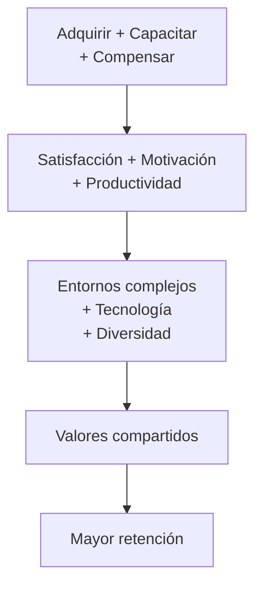
```mermaid
graph TD
    A["Adquirir + Capacitar<br>+ Compensar"] --> B["Satisfacción + Motivación<br>+ Productividad"]
    B --> C["Entornos complejos<br> + Tecnología<br>+ Diversidad"]
    C --> D["Valores compartidos"]
    D --> E["Mayor retención"]
```

---

## Pregunta de reflexión (para autoevaluación)

> ¿Cómo podría un gerente usar la diversidad de la fuerza laboral para mejorar la productividad, además de cumplir con un objetivo ético?

## PLANIFICACIÓN DE LAS NECESIDADES DE RECURSOS HUMANOS

### Introducción

Cuando una empresa planea y desarrolla estrategias para alcanzar sus objetivos generales, debe considerar si dispondrá de los recursos humanos necesarios para ejecutar dichos planes. En otras palabras, no basta con tener una buena estrategia de negocio; también se requiere el personal adecuado para llevarla a cabo.

---

### 1. Determinación de las necesidades de personal

El primer paso en la planificación de recursos humanos consiste en determinar cuántos empleados y qué habilidades se necesitan para cumplir con los planes generales de la organización. Una vez que se tiene claro esto, el departamento de recursos humanos —que puede ir desde el propio dueño en una pequeña empresa hasta cientos de personas en una gran corporación— debe averiguar:

- Cuántos empleados tiene actualmente la compañía.
- Cuántos de ellos se jubilarán o dejarán la organización durante el período planificado.

Con esta información, el gerente de recursos humanos puede:

- **Pronosticar cuántos empleados adicionales** serán necesarios contratar.
- **Definir qué calificaciones** deben tener esos nuevos empleados.
- **Determinar si se requieren despidos** para ajustar la oferta de personal a la demanda de manera más eficiente.

> **Argumento clave:** La planificación de RRHH no solo evita la escasez o el exceso de personal, sino que también mejora la eficiencia operativa al alinear la fuerza laboral con los objetivos estratégicos.

---

### 2. Pronóstico de disponibilidad externa

La planificación de recursos humanos también requiere **pronosticar la disponibilidad de personas en el mercado laboral** que posean las calificaciones necesarias para satisfacer las necesidades futuras de la organización. No basta con saber qué necesita la empresa; también hay que saber si existe oferta de ese talento en el exterior.

Con base en este pronóstico, el gerente de recursos humanos desarrolla una **estrategia** para satisfacer las necesidades de personal.

#### Factores que cambian las necesidades de contratación

A medida que las organizaciones buscan aumentar su eficiencia mediante:

- **Subcontratación (outsourcing)** : contratar externamente ciertas funciones.
- **Automatización**: reemplazar tareas humanas con máquinas o software.
- **Uso efectivo de trabajadores temporales**: flexibilidad sin compromiso de contratación fija.

…las necesidades de contratación pueden cambiar drásticamente.

> **Argumento:** La planificación de RRHH debe ser dinámica y adaptarse a las tendencias de eficiencia operativa, no solo a las necesidades actuales.

---

### 3. Análisis de puestos (Job Analysis)

Una vez definidas las necesidades generales, los gerentes deben **analizar los puestos dentro de la organización** para poder asignar los recursos humanos a las tareas disponibles.

#### Definición de análisis de puesto

> **Análisis de puesto** es el proceso mediante el cual, a través de la observación y el estudio, se determina información pertinente sobre un puesto. Esto incluye:
> - Las tareas específicas que lo componen.
> - Los conocimientos, habilidades y capacidades necesarias para desempeñarlo.
> - El entorno en el que se realizará el trabajo.

#### Propósito del análisis de puesto

Los gerentes utilizan la información obtenida a través del análisis de puesto para desarrollar dos documentos fundamentales:

| Documento | Definición | Contenido típico |
|-----------|------------|------------------|
| **Descripción del puesto** (Job Description) | Explicación formal y escrita de un puesto específico. | Título del puesto, tareas a realizar (ej. atender clientes), relación con otros puestos, habilidades físicas y mentales requeridas (ej. levantar cajas pesadas o calcular datos), deberes, responsabilidades y condiciones de trabajo. |
| **Especificación del puesto** (Job Specification) | Describe las calificaciones necesarias para un puesto específico. | Nivel educativo (algunos puestos requieren título universitario), experiencia, características personales (los anuncios frecuentemente solicitan personas extrovertidas y trabajadoras) y características físicas. |

#### Fuentes de consulta para descripciones de puesto

Los buscadores de empleo pueden recurrir a sitios web o bases de datos en línea para encontrar descripciones de puestos para ocupaciones específicas. Por ejemplo:

> **El Occupational Outlook Handbook** de la Oficina de Estadísticas Laborales de EE.UU. (Bureau of Labor Statistics) proporciona resúmenes de puestos, deberes y datos de salario medio para una amplia gama de ocupaciones.

#### Aplicación final

Tanto la **descripción del puesto** como la **especificación del puesto** se utilizan para desarrollar **materiales de reclutamiento**, tales como:

- Listados de empleo en línea.
- Anuncios en publicaciones especializadas (trade publications).

---

### 4. Conclusión general del proceso

La planificación de recursos humanos es un ciclo que conecta los objetivos estratégicos de la empresa con la contratación y retención de personal. Sin una adecuada planificación, una organización puede enfrentarse a:

- **Falta de personal** → incapacidad para cumplir metas.
- **Exceso de personal** → ineficiencia y mayores costos.
- **Desajuste de habilidades** → baja productividad.

Por ello, el análisis de puestos, la descripción y especificación de los mismos son herramientas esenciales para traducir las necesidades del negocio en perfiles de contratación concretos y accionables.

---

### 5. Términos clave definidos en el texto

| Término | Definición |
|---------|------------|
| **Análisis de puesto** | Proceso de observación y estudio para determinar tareas, habilidades y entorno de un puesto. |
| **Descripción del puesto** | Documento formal que explica título, tareas, relaciones, habilidades, deberes, responsabilidades y condiciones de trabajo. |
| **Especificación del puesto** | Documento que detalla la educación, experiencia, características personales y físicas necesarias para un puesto. |
| **Outsourcing** | Subcontratación de funciones externas para aumentar eficiencia. |
| **Automatización** | Uso de máquinas o software para reemplazar tareas humanas. |
| **Trabajadores temporales** | Personal contratado por un período limitado para dar flexibilidad a la organización. |

---

### 6. Preguntas de repaso (opcional)

#### 1. ¿Qué dos preguntas clave debe responder una empresa al planificar sus necesidades de RRHH?

Una empresa, al planificar sus necesidades de recursos humanos, debe responder dos preguntas fundamentales:

- **¿Cuántos empleados se necesitarán?**
- **¿Qué habilidades deben tener esos empleados?**

Estas preguntas surgen directamente de los objetivos estratégicos de la organización, ya que el personal debe estar alineado en cantidad y capacidades para poder ejecutar los planes de negocio.

---

#### 2. ¿Qué factores externos (outsourcing, automatización, temporales) afectan las necesidades de contratación?

Tres factores externos modifican drásticamente las necesidades de contratación:

| Factor | Efecto en la contratación |
|--------|----------------------------|
| **Subcontratación (outsourcing)** | Reduce la necesidad de empleados fijos, porque ciertas funciones se contratan externamente. |
| **Automatización** | Cambia los perfiles requeridos, ya que máquinas o software reemplazan tareas humanas. |
| **Trabajadores temporales** | Permite flexibilidad sin compromiso de contratación fija, lo que reduce la necesidad de personal permanente. |

> **Conclusión:** Las organizaciones que buscan mayor eficiencia a través de estos medios verán cómo sus necesidades de contratación cambian de manera significativa en comparación con un modelo tradicional de empleo fijo.

---

#### 3. ¿Cuál es la diferencia entre **descripción del puesto** y **especificación del puesto**?

La diferencia fundamental es que:

| Documento | Enfoque | Contenido principal |
|-----------|---------|----------------------|
| **Descripción del puesto** | Se enfoca en **el puesto en sí mismo** (qué tareas se realizan). | Título, tareas, relaciones con otros puestos, habilidades requeridas, deberes, responsabilidades y condiciones de trabajo. |
| **Especificación del puesto** | Se enfoca en **la persona que ocupará el puesto** (qué cualidades debe tener). | Educación, experiencia, características personales (ej. extrovertido, trabajador) y características físicas. |

> **Ejemplo práctico:** Para un puesto de cajero, la descripción dirá "manejar transacciones con clientes", mientras que la especificación dirá "requiere secundaria completa y habilidad para trabajar bajo presión".

Ambos documentos se elaboran a partir del **análisis de puesto** y se utilizan juntos para crear materiales de reclutamiento.

---

#### 4. ¿Dónde pueden los buscadores de empleo encontrar descripciones confiables de puestos?

Los buscadores de empleo pueden recurrir a:

- **Sitios web y bases de datos en línea** especializadas en descripciones de ocupaciones.
- **El Occupational Outlook Handbook** de la Oficina de Estadísticas Laborales de EE.UU. (Bureau of Labor Statistics).

Este manual proporciona específicamente:
- Resúmenes de puestos.
- Deberes típicos de cada ocupación.
- Datos de salario medio para una amplia gama de ocupaciones.

> **Nota:** Estas fuentes son confiables porque provienen de entidades gubernamentales oficiales y se actualizan periódicamente con datos del mercado laboral real.

---

#### 5. ¿Por qué es importante el análisis de puesto dentro del proceso de planificación?

El análisis de puesto es importante porque constituye la **base técnica** para toda la planificación de recursos humanos. Sin él, no se puede avanzar correctamente.

### Razones de su importancia:

1. **Permite conocer a fondo cada puesto**: mediante observación y estudio, se determinan las tareas específicas, los conocimientos necesarios y el entorno de trabajo.

2. **Sirve como fuente para documentos clave**: proporciona la información necesaria para elaborar tanto la **descripción del puesto** como la **especificación del puesto**.

3. **Facilita el emparejamiento (matching)** : permite asignar los recursos humanos disponibles a las tareas que deben realizarse, evitando desajustes.

4. **Base para el reclutamiento**: los materiales de reclutamiento (listados en línea, anuncios en publicaciones especializadas) se desarrollan a partir de la descripción y especificación, que a su vez provienen del análisis de puesto.

> **Argumento final:** Sin un análisis de puesto riguroso, la empresa contrataría "a ciegas", sin saber realmente qué necesita ni qué perfil debe buscar. Por eso, el análisis de puesto es el cimiento de toda la planificación de recursos humanos.

<h1 id="176136" style="color:#E65100;">
  <a href="#Chapter_10._Managing_Human_Resources" style="color:inherit; text-decoration:none;">
    LO 10-2 RECRUITING AND SELECTING NEW EMPLOYEES
  </a>
</h1>

### Summarize the processes of recruiting and selecting human resources for a company.

Después de pronosticar las necesidades de recursos humanos de la empresa y compararlas con los recursos humanos existentes, el gerente de recursos humanos debería tener una idea general de cuántos empleados nuevos necesita contratar la empresa. Con la ayuda de los análisis de puestos, la dirección puede entonces reclutar y seleccionar empleados calificados para cubrir puestos vacantes específicos.

---

### Recruiting (Reclutamiento)

**Reclutamiento** significa formar un conjunto (pool) de solicitantes calificados a partir del cual la dirección pueda seleccionar empleados. Existen dos fuentes para desarrollar este conjunto de solicitantes: **interna y externa**.

#### Fuentes internas de solicitantes

Las fuentes internas incluyen a los **empleados actuales** de la organización. Muchas empresas tienen la política de dar primera consideración a sus propios empleados, lo que se conoce como **promover desde dentro (promoting from within)** .

**Ventajas de la contratación interna:**

- Bajo costo en comparación con la contratación externa.
- Mejora la moral de los empleados.

**Desventaja:**

- Crea otra vacante que debe ser cubierta.

> **Ejemplos de empresas conocidas por promover desde dentro:** Procter & Gamble, Gap y Whole Foods.

#### Fuentes externas de solicitantes

Las fuentes externas incluyen:

- Agencias de empleo.
- Universidades y escuelas vocacionales.
- Recomendaciones de empleados actuales.
- Empresas de la competencia.
- Solicitudes no solicitadas (currículos espontáneos).
- Sitios web en línea.
- Redes sociales como LinkedIn.

#### Internados (Internships)

Las pasantías o internados también son una buena forma de buscar empleados potenciales. Muchas empresas contratan estudiantes universitarios o recién graduados para pasantías de baja remuneración que les brindan la oportunidad de adquirir experiencia práctica en el trabajo.

> **Proceso:** Si el pasante demuestra ser una buena opción, la organización puede contratarlo como trabajador de tiempo completo.

> **Ejemplo:** SAP, una empresa multinacional de software, contrata más de 2,000 pasantes anualmente en 22 países. La empresa a menudo contrata a sus pasantes a tiempo completo después de que finaliza su programa.

#### Sitios web de reclutamiento

Existen cientos de sitios web donde los empleadores pueden publicar ofertas de trabajo y los buscadores pueden publicar sus currículos. Algunos ejemplos incluyen:

| Sitio web | Enfoque |
|-----------|---------|
| Indeed | Generalista |
| Monster | Generalista |
| Glassdoor | Generalista + opiniones de empleados |
| FlexJobs | Trabajos flexibles y remotos |
| **TheLadders.com** | Profesionales orientados a la carrera con salarios de $100,000 o más |
| ComputerWork | Trabajos especializados en carreras técnicas |

#### Reclutamiento a través de sitios web propios

Cada vez más, las empresas pueden recurrir a sus propios sitios web para buscar candidatos potenciales.

> **Dato clave:** Casi todas las empresas de la lista Fortune 500 proporcionan sitios web de carrera donde reclutan, ofrecen información de empleo y reciben solicitudes.

---

### Resumen del proceso de reclutamiento

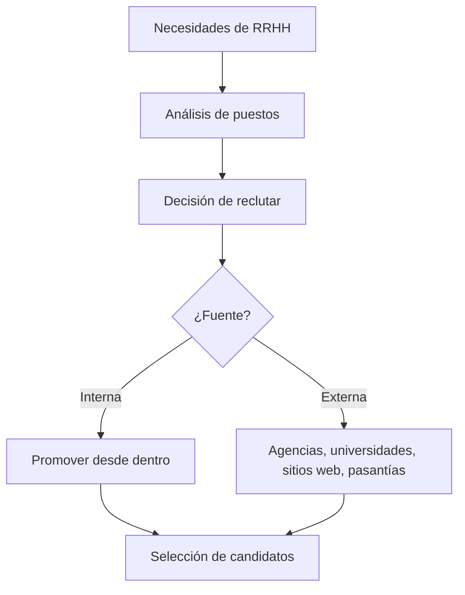
```mermaid
graph TD
    A[Necesidades de RRHH] --> B[Análisis de puestos]
    B --> C[Decisión de reclutar]
    C --> D{¿Fuente?}
    D -->|Interna| E[Promover desde dentro]
    D -->|Externa| F[Agencias, universidades, sitios web, pasantías]
    E --> G[Selección de candidatos]
    F --> G
```

---

### Términos clave definidos en el texto

| Término | Definición |
|---------|------------|
| **Reclutamiento (Recruiting)** | Formar un conjunto de solicitantes calificados a partir del cual la dirección pueda seleccionar empleados. |
| **Fuentes internas** | Empleados actuales de la organización. |
| **Promover desde dentro (promoting from within)** | Política de dar primera consideración a los empleados actuales para cubrir vacantes. |
| **Fuentes externas** | Agencias de empleo, universidades, recomendaciones, competencia, solicitudes espontáneas, sitios web y redes sociales. |
| **Internship (pasantía)** | Programa de baja remuneración para estudiantes o recién graduados que ofrece experiencia práctica. |

---

### Preguntas de repaso (basadas en LO 10-2)

#### 1. ¿Cuál es la definición de reclutamiento según el texto?
> **Reclutamiento significa formar un conjunto (pool) de solicitantes calificados a partir del cual la dirección pueda seleccionar empleados.**

#### 2. ¿Cuáles son las dos fuentes principales para formar un conjunto de solicitantes?
- **Fuentes internas:** empleados actuales de la organización.
- **Fuentes externas:** agencias de empleo, universidades, escuelas vocacionales, recomendaciones, empresas competidoras, solicitudes no solicitadas, sitios web y redes sociales como LinkedIn.

#### 3. Menciona dos ventajas y una desventaja de contratar desde dentro.

| Ventajas | Desventaja |
|----------|-------------|
| Bajo costo en comparación con fuentes externas | Crea otra vacante que debe ser cubierta |
| Mejora la moral de los empleados | |

#### 4. ¿Qué empresas se mencionan como ejemplos de promoción interna?
- **Procter & Gamble**
- **Gap**
- **Whole Foods**

#### 5. ¿Cómo funciona el proceso de pasantías (internships) como estrategia de reclutamiento? Da un ejemplo real.
Las empresas contratan estudiantes universitarios o recién graduados para pasantías de baja remuneración, dándoles experiencia práctica. Si el pasante demuestra ser una buena opción, la organización lo contrata como trabajador de tiempo completo.

> **Ejemplo real:** SAP, una multinacional de software, contrata más de 2,000 pasantes anualmente en 22 países y a menudo los contrata a tiempo completo al finalizar el programa.

#### 6. ¿Qué tipo de candidatos busca específicamente TheLadders.com?
> Profesionales orientados a la carrera que ganan salarios de **$100,000 o más**.

#### 7. ¿Qué porcentaje o tipo de empresas de la lista Fortune 500 utilizan sus propios sitios web para reclutar?
> **Casi todas (Nearly all)** las empresas de la lista Fortune 500 proporcionan sitios web de carrera donde reclutan, ofrecen información de empleo y reciben solicitudes.

### Selection

**Selection** es el proceso de recopilar información sobre los solicitantes y utilizar esa información para decidir a cuáles de ellos contratar. Incluye la propia solicitud, así como entrevistas, pruebas y verificación de referencias. Este proceso puede ser bastante largo y costoso, y cada vez se realiza más en línea. Las solicitudes de empleo en línea tardan desde 1 minuto hasta 52 minutos en completarse, con un tiempo medio de finalización de 13 minutos. Cuanto más largo es el proceso de solicitud, más solicitantes abandonan y no completan la solicitud. *Business News Daily* encontró que el 30 por ciento de los candidatos y el 57 por ciento de aquellos que ganan más de $100,000 no invertirán más de 15 minutos en una solicitud. Con esto en mente, AT&T rediseñó sus solicitudes en línea, reduciendo el número de pantallas en un 50 por ciento. Su tasa de abandono cayó un 55 por ciento y generó 100,000 solicitantes más deseables y de calidad.

Las empresas están trabajando para mejorar el proceso de solicitud en línea con el fin de atraer al mejor grupo de candidatos para el puesto. A veces, las empresas hacen intencionalmente que el proceso de solicitud sea más largo para asegurarse de que solo los individuos más dedicados apliquen. Un escrutinio riguroso es necesario para encontrar a aquellos solicitantes que puedan realizar el trabajo esperado y encajar en la estructura y cultura de la empresa. Si una organización encuentra a los empleados "correctos" a través de su proceso de reclutamiento y selección, no tendrá que gastar tanto dinero más adelante en reclutar, seleccionar y capacitar a empleados de reemplazo.

Muchas empresas han recurrido a la inteligencia artificial (IA) para apoyar el proceso de reclutamiento y contratación. La IA tiene la capacidad de realizar tareas repetitivas, tales como escanear currículos en busca de calificaciones mínimas. Algunos expertos están preocupados de que las herramientas de IA puedan generar sesgos no intencionados, por lo que es importante monitorear los algoritmos. McDonald's invirtió en una plataforma de contratación habilitada con IA llamada McHire para acortar el proceso de solicitud, aumentar el número de solicitudes y reducir el tiempo de contratación. Un asistente de IA responde preguntas de los solicitantes, examina candidatos y automatiza la programación de entrevistas.

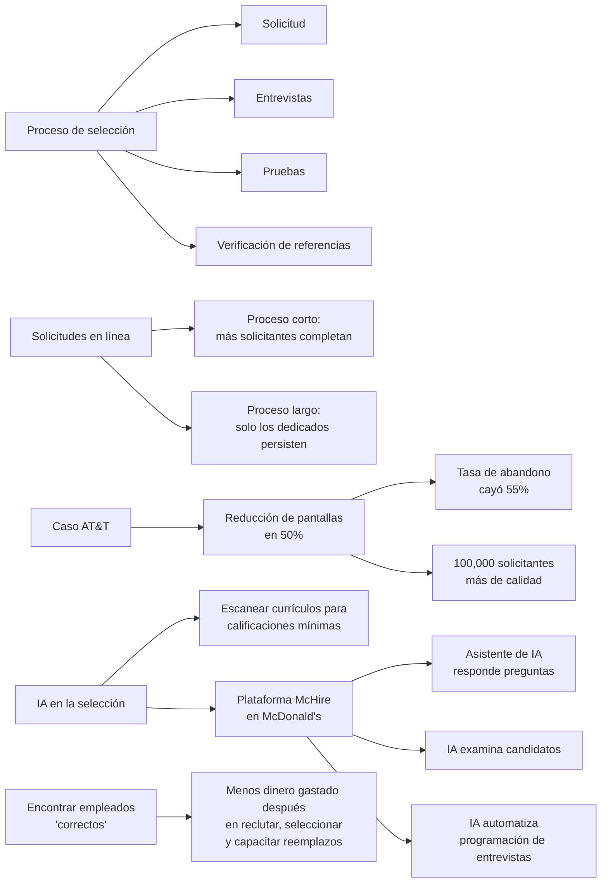
```mermaid
graph LR
    A[Proceso de selección] --> B[Solicitud]
    A --> C[Entrevistas]
    A --> D[Pruebas]
    A --> E[Verificación de referencias]
    
    F[Solicitudes en línea] --> G["Proceso corto:<br>más solicitantes completan"]
    F --> H["Proceso largo:<br>solo los dedicados persisten"]
    
    I[Caso AT&T] --> J["Reducción de pantallas<br>en 50%"]
    J --> K["Tasa de abandono<br>cayó 55%"]
    J --> L["100,000 solicitantes<br>más de calidad"]
    
    M[IA en la selección] --> N["Escanear currículos para<br>calificaciones mínimas"]
    M --> O["Plataforma McHire<br>en McDonald's"]
    O --> P["Asistente de IA<br>responde preguntas"]
    O --> Q["IA examina candidatos"]
    O --> R["IA automatiza<br>programación de entrevistas"]
    
    S["Encontrar empleados<br>'correctos'"] --> T["Menos dinero gastado después<br>en reclutar, seleccionar<br>y capacitar reemplazos"]
```

#### The Application

En la primera etapa del proceso de selección, el individuo completa un formulario de solicitud y quizás tiene una breve entrevista. El formulario de solicitud solicita el nombre del solicitante, dirección, número de teléfono, educación y experiencia laboral previa. Algunos empleadores aceptan o requieren un currículo en video, un video corto que permite al candidato complementar o reemplazar una solicitud escrita. Las solicitudes en video pueden servir para mostrar las habilidades técnicas, la creatividad y la personalidad del empleado. El objetivo de esta etapa del proceso de selección es familiarizarse con los solicitantes y eliminar a aquellos que obviamente no están calificados para el trabajo. Para empleados con experiencia laboral, la mayoría de las empresas solicitan la siguiente información antes de contactar a un candidato potencial: salario actual, razón para buscar un nuevo empleo, años de experiencia, disponibilidad y nivel de interés en el puesto. Además de identificar calificaciones obvias, la solicitud puede proporcionar pistas sutiles sobre si una persona es apropiada para un trabajo en particular. Por ejemplo, un solicitante que da respuestas inusualmente creativas puede ser perfecto para un puesto en una agencia de publicidad; una persona que entrega una solicitud con oraciones incompletas o errores probablemente no sería apropiada para un trabajo técnico que requiere ajustes precisos. La mayoría de las empresas aceptan exclusivamente solicitudes en línea. Para obtener una mejor visión del ajuste entre el solicitante y la empresa, la solicitud en línea contiene un cuestionario que hace preguntas más específicas a los solicitantes, desde cómo podrían reaccionar en cierta situación hasta atributos de personalidad como la autoestima o la capacidad para interactuar con las personas.

#### The Interview

La siguiente fase del proceso de selección implica entrevistar a los solicitantes. El entrevistador puede responder las preguntas del solicitante sobre los requisitos del trabajo, compensación, condiciones de trabajo, políticas de la empresa, cultura organizacional, etc. Los solicitantes actuales podrían sorprenderse de que un entrevistador les pregunte sobre su actividad en las redes sociales. Actualmente, estas son preguntas legales para que un entrevistador las haga, aunque algunos estados han aprobado leyes que prohíben a los empleadores pedir a los solicitantes que divulguen sus nombres de usuario y contraseñas de sus cuentas privadas. Aproximadamente el 10 por ciento de los reclutadores utilizan sitios de redes sociales para evaluar a los candidatos a un puesto. También es legal y común que las empresas monitoreen los correos electrónicos y el trabajo de los empleados. Si bien esto puede ser importante para monitorear amenazas externas como hackeos o filtraciones de información, los empleados podrían ver esto como la forma que tiene la empresa de decir que no confía en ellos.

**Preguntas Comunes Realizadas Durante la Entrevista**

1. ¿Podría hablarme de usted mismo y describir brevemente sus antecedentes?
2. ¿Cómo se enteró de este puesto?
3. ¿Qué tipo de ambiente laboral le gusta?
4. ¿Cómo maneja la presión?
5. ¿Prefiere trabajar solo o en equipo?
6. Cuando tiene múltiples proyectos, ¿cómo se mantiene organizado?
7. ¿Qué hizo en el último año para mejorar sus conocimientos o habilidades profesionales?
8. ¿Cuáles son sus expectativas salariales para este trabajo?
9. ¿Está solicitando otros trabajos?
10. ¿Le gustaría decirnos por qué hay un vacío en el empleo en su currículo?

*Fuente: Adaptado de Vicky Oliver, "10 Common Job Interview Questions and How to Answer Them" Harvard Business Review, 11 de noviembre de 2021.*

#### Testing

Otro paso en el proceso de selección son las pruebas. Las evaluaciones previas al empleo son pruebas administradas a los candidatos a un puesto por empleadores potenciales antes de la contratación para determinar si un solicitante tiene las habilidades necesarias para el trabajo. Se pueden utilizar pruebas de aptitud, coeficiente intelectual, habilidades o personalidad para evaluar el potencial de un solicitante para cierto tipo de trabajo, así como su capacidad para encajar en la cultura de la organización. Una prueba de evaluación previa al empleo es el Indicador de Tipo Myers-Briggs. La prueba del Indicador de Tipo Myers-Briggs es utilizada en todo el mundo por millones de personas cada año. Aunque las pruebas de polígrafo ("detector de mentiras") fueron una vez una técnica común para evaluar la honestidad de los solicitantes, en 1988 su uso se restringió a trabajos gubernamentales específicos y aquellos que involucran seguridad o acceso a drogas. Los solicitantes también pueden someterse a exámenes físicos para determinar su idoneidad para algunos trabajos, y muchas empresas requieren que los solicitantes sean examinados para detectar el uso de drogas ilegales. El abuso de drogas y alcohol puede ser particularmente dañino para los negocios. Por ejemplo, la epidemia de opioides ha creado muchos desafíos. Si bien un empleador puede sentirse justificado al despedir a un empleado por abuso de medicamentos recetados, la Ley de Estadounidenses con Discapacidades, que se analiza más adelante en este capítulo, protege a los trabajadores con trastorno por uso de opioides que están en tratamiento o recuperación. El costo para las empresas por lidiar con el consumo de drogas y alcohol es asombroso; solo el uso indebido de analgésicos recetados se estima que cuesta a las empresas $81 mil millones debido al ausentismo, costos de atención médica y pérdida de productividad. Las pequeñas empresas pueden tener un porcentaje más alto de estos empleados porque no realizan pruebas de detección de drogas sistemáticas. Las pruebas de detección de drogas para la marihuana se han complicado porque el cannabis es legal en algunos estados pero no es legal a nivel federal. Además, las leyes estatales varían en cuanto a establecer límites a las pruebas de detección de drogas o proteger a los empleados contra la discriminación.

#### Reference Checking

Antes de hacer una oferta de trabajo, la empresa siempre debe verificar las referencias de un solicitante. La verificación de referencias generalmente implica verificar los antecedentes educativos y la experiencia laboral previa. A menudo se realiza una búsqueda en Internet para determinar las actividades en las redes sociales u otras actividades públicas. Algunas de las tendencias de empleo relacionadas con las verificaciones de antecedentes incluyen el hecho de que las verificaciones de antecedentes penales se están retrasando cada vez más hasta después de la entrevista o de que se haya extendido una oferta. Las herramientas de selección con IA pueden hacer que la contratación sea más eficiente y efectiva. La plataforma de inteligencia de talento Eightfold AI afirma encontrar candidatos más calificados más rápido e incluye objetivos de diversidad y otros objetivos de contratación. Con el crecimiento de las economías colaborativas y de trabajos por encargo, habrá más verificaciones de antecedentes para trabajadores eventuales. Más empresas participarán en verificaciones de antecedentes continuas o permanentes para mantener el lugar de trabajo seguro. La evaluación de redes sociales continuará, ya que casi la mitad de los que utilizan esta técnica encuentran información que muestra al candidato bajo una luz negativa. Es probable que las empresas públicas realicen búsquedas de antecedentes más exhaustivas para asegurarse de que los solicitantes no se estén presentando falsamente.

La verificación de antecedentes es importante porque los solicitantes pueden presentarse falsamente en sus solicitudes o currículos. Las mentiras pueden incluir afirmaciones falsas, omisión de detalles importantes o embellecimiento. Las investigaciones han demostrado que aquellos que están dispuestos a exagerar o mentir en sus currículos son más propensos a involucrarse en comportamientos poco éticos. Los individuos que mienten en sus currículos podrían ser responsables por daños civiles. Como ilustra la Tabla 10.2, muchas personas mienten sobre sus habilidades blandas y técnicas.

**Tabla 10.2 - Mentiras Comunes en el Currículo**

1. Historial de empleo previo
2. Habilidades blandas
3. Educación universitaria
4. Detalles personales (ej. ubicación o nombre)
5. Educación secundaria
6. Información salarial
7. Habilidades técnicas
8. Referencias

La verificación de referencias es una etapa vital, aunque a menudo pasada por alto, en el proceso de selección. Los gerentes encargados de contratar deben ser conscientes, sin embargo, de que muchas organizaciones solo confirmarán que un solicitante es un ex empleado, quizás con fechas de inicio y finalización del trabajo, y no revelarán detalles sobre la calidad del trabajo del empleado.

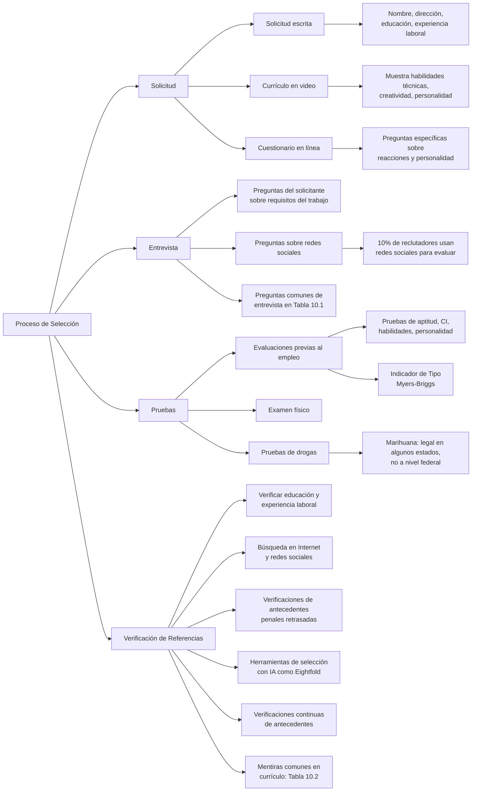
```mermaid
graph LR
    A[Proceso de Selección] --> B[Solicitud]
    A --> C[Entrevista]
    A --> D[Pruebas]
    A --> E[Verificación de Referencias]
    
    B --> B1[Solicitud escrita]
    B --> B2[Currículo en video]
    B --> B3[Cuestionario en línea]
    B1 --> B4["Nombre, dirección,<br>educación, experiencia laboral"]
    B2 --> B5["Muestra habilidades técnicas,<br>creatividad, personalidad"]
    B3 --> B6["Preguntas específicas sobre<br>reacciones y personalidad"]
    
    C --> C1["Preguntas del solicitante<br>sobre requisitos del trabajo"]
    C --> C2[Preguntas sobre redes sociales]
    C2 --> C3["10% de reclutadores usan<br>redes sociales para evaluar"]
    C --> C4["Preguntas comunes de<br>entrevista en Tabla 10.1"]
    
    D --> D1[Evaluaciones previas al empleo]
    D1 --> D2["Pruebas de aptitud, CI,<br>habilidades, personalidad"]
    D1 --> D3["Indicador de Tipo<br>Myers-Briggs"]
    D --> D4[Examen físico]
    D --> D5[Pruebas de drogas]
    D5 --> D6["Marihuana: legal en algunos estados,<br>no a nivel federal"]
    
    E --> E1["Verificar educación y<br>experiencia laboral"]
    E --> E2["Búsqueda en Internet<br>y redes sociales"]
    E --> E3["Verificaciones de antecedentes<br>penales retrasadas"]
    E --> E4["Herramientas de selección<br>con IA como Eightfold"]
    E --> E5["Verificaciones continuas<br>de antecedentes"]
    E --> E6["Mentiras comunes en<br>currículo: Tabla 10.2"]
```

#### Preguntas de Repaso

**1. ¿Qué información solicita típicamente un formulario de solicitud de empleo?**
El formulario de solicitud solicita el nombre del solicitante, dirección, número de teléfono, educación y experiencia laboral previa.

**2. ¿Qué es un currículo en video y para qué sirve?**
Un currículo en video es un video corto que permite al candidato complementar o reemplazar una solicitud escrita. Sirve para mostrar las habilidades técnicas, la creatividad y la personalidad del empleado.

**3. ¿Qué información adicional solicitan la mayoría de las empresas para empleados con experiencia laboral?**
La mayoría de las empresas solicitan: salario actual, razón para buscar un nuevo empleo, años de experiencia, disponibilidad y nivel de interés en el puesto.

**4. ¿Qué porcentaje de reclutadores utiliza redes sociales para evaluar candidatos?**
Aproximadamente el 10 por ciento de los reclutadores utilizan sitios de redes sociales para evaluar a los candidatos.

**5. ¿Es legal que las empresas monitoreen los correos electrónicos de los empleados?**
Sí, es legal y común que las empresas monitoreen los correos electrónicos y el trabajo de los empleados.

**6. ¿Qué son las evaluaciones previas al empleo?**
Son pruebas administradas a los candidatos por empleadores potenciales antes de la contratación para determinar si un solicitante tiene las habilidades necesarias para el trabajo.

**7. ¿Qué restricciones se aplicaron a las pruebas de polígrafo en 1988?**
En 1988, su uso se restringió a trabajos gubernamentales específicos y aquellos que involucran seguridad o acceso a drogas.

**8. ¿Cuál es el costo estimado para las empresas por el uso indebido de analgésicos recetados?**
Se estima que cuesta a las empresas $81 mil millones debido al ausentismo, costos de atención médica y pérdida de productividad.

**9. ¿Por qué es complicada la prueba de detección de marihuana?**
Porque el cannabis es legal en algunos estados pero no es legal a nivel federal, y las leyes estatales varían en cuanto a establecer límites a las pruebas de detección de drogas.

**10. ¿Qué implica la verificación de referencias?**
Generalmente implica verificar los antecedentes educativos y la experiencia laboral previa, así como realizar búsquedas en Internet para determinar actividades en redes sociales u otras actividades públicas.

**11. ¿Qué tendencia existe actualmente con respecto a las verificaciones de antecedentes penales?**
Las verificaciones de antecedentes penales se están retrasando cada vez más hasta después de la entrevista o de que se haya extendido una oferta.

**12. ¿Qué plataforma de IA se menciona para encontrar candidatos calificados?**
La plataforma de inteligencia de talento Eightfold AI.

**13. ¿Por qué es importante la verificación de antecedentes?**
Porque los solicitantes pueden presentarse falsamente en sus solicitudes o currículos, y las investigaciones han demostrado que aquellos que mienten en sus currículos son más propensos a involucrarse en comportamientos poco éticos.

**14. Mencione tres tipos de mentiras comunes en los currículos según la Tabla 10.2.**
Tres mentiras comunes son: historial de empleo previo, habilidades blandas, educación universitaria, detalles personales, educación secundaria, información salarial, habilidades técnicas o referencias (cualquiera de estas).

**15. ¿Qué limitación tienen los gerentes al verificar referencias de empleadores anteriores?**
Muchas organizaciones solo confirmarán que un solicitante es un ex empleado, quizás con fechas de inicio y finalización del trabajo, y no revelarán detalles sobre la calidad del trabajo del empleado.

### Legal Issues in Recruiting and Selecting

Las restricciones y regulaciones legales están presentes en casi todas las fases del proceso de reclutamiento y selección, y una violación de estas regulaciones puede resultar en demandas y multas. Por lo tanto, los gerentes deben conocer estas restricciones para evitar problemas legales. Algunas de las leyes que afectan la gestión de recursos humanos se discuten aquí.

Debido a que una ley prevalece en todas las áreas de la gestión de recursos humanos, la examinaremos rápidamente ahora. El **Título VII de la Ley de Derechos Civiles de 1964** prohíbe la discriminación en el empleo basada en raza, color, religión, sexo y origen nacional. También creó la **Comisión de Igualdad de Oportunidades en el Empleo (EEOC)** , una agencia federal dedicada a aumentar las oportunidades de trabajo para mujeres y grupos raciales y étnicos subrepresentados, y a eliminar la discriminación laboral basada en raza, religión, color, identidad de género, orientación sexual, origen nacional o discapacidad. Como resultado del Título VII, los empleadores no deben imponer distinciones de género en las especificaciones de trabajo, descripciones de trabajo o anuncios en periódicos. Los cinco tipos principales de discriminación presentados ante la EEOC incluyen represalias, raza, discapacidad, género y edad. La Ley de Derechos Civiles de 1964 también prohíbe el uso de pruebas discriminatorias para los solicitantes. Las pruebas de empleo, como pruebas cognitivas, pruebas de habilidad física y pruebas de rendimiento, pueden usarse siempre que no discriminen intencionalmente por motivos de raza, color, religión, sexo u origen nacional. Los empleadores tampoco pueden ajustar puntuaciones o usar diferentes puntajes de corte basados en estos factores. La diversidad, discutida más adelante en este capítulo, tiene margen de mejora, particularmente en la gestión. Solo el 10 por ciento de las empresas Fortune 500 tienen una mujer CEO, y el 1 por ciento tiene un CEO negro.

El **Departamento de Trabajo de EE.UU.** tiene supervisión sobre la seguridad en el lugar de trabajo, salarios y horas de trabajo, beneficios de desempleo y más. A menudo presenta demandas contra empresas que cree que están tratando a los trabajadores injustamente y violando las leyes laborales.

Otras leyes que afectan la gestión de recursos humanos incluyen la **Ley de Estadounidenses con Discapacidades (ADA)** , que previene la discriminación contra personas con discapacidades. La ADA aplica al empleo, transporte, lugares públicos, comunicaciones y más. El **Título I de la ADA** aplica al empleo y protege los derechos de los empleados y aquellos que buscan empleo. También clasifica a las personas con SIDA como tener una discapacidad y, en consecuencia, prohíbe usar un resultado positivo en la prueba del SIDA como razón para negar el empleo a un solicitante. Los empleadores deben hacer **adaptaciones razonables** , tales como ajustes en el proceso de solicitud de empleo, cambios en el entorno físico de trabajo y modificaciones que permitan a los empleados con discapacidades disfrutar de beneficios en el lugar de trabajo como acceso a cafeterías y transporte proporcionado por la empresa.

La **Ley de Discriminación por Edad en el Empleo (ADEA)** prohíbe específicamente la discriminación basada en la edad. Su enfoque es prohibir prácticas de contratación que discriminen contra personas de 40 años o más. Generalmente, cuando las empresas necesitan empleados, los reclutadores se dirigen a los campus universitarios, y cuando es necesario reducir el personal, a muchos trabajadores mayores se les ofrece jubilación anticipada. Sin embargo, la jubilación forzada basada en la edad generalmente se considera ilegal en los Estados Unidos, aunque aún abundan las reclamaciones de jubilación forzada. De hecho, hay muchos beneficios que las empresas están obteniendo al contratar trabajadores mayores. Algunos de estos beneficios incluyen el hecho de que muchos trabajadores mayores son dedicados, puntuales, honestos, orientados a los detalles, son buenos oyentes, se enorgullecen de su trabajo, exhiben buenas habilidades organizacionales, son eficientes y seguros, son maduros, pueden ser vistos como modelos a seguir, tienen buenas habilidades de comunicación y ofrecen una oportunidad de reducir el costo laboral porque ya tienen planes de seguro.

La **Ley de Igualdad Salarial** es una ley laboral que prohíbe la discriminación salarial basada en el sexo. Las diferencias salariales son aceptables solo si se atribuyen a antigüedad, rendimiento o calificaciones. Se estima que las mujeres ganan 80 centavos por cada dólar que ganan sus homólogos masculinos. La brecha salarial aumenta para las mujeres afroamericanas e hispanas, que ganan 62.5 por ciento y 54.4 por ciento respectivamente de lo que ganan sus homólogos masculinos. La Unión Europea ha aprobado legislación para regular la igualdad salarial, y los empleados tienen derecho a emprender acciones legales si hay discriminación. Según un informe de Glassdoor, los trabajos en EE.UU. con la mayor brecha salarial son en su mayoría campos de alta remuneración, tradicionalmente dominados por hombres, incluyendo piloto, chef, ejecutivo de C-suite, programador informático y director de proyecto. Los pilotos masculinos, por ejemplo, ganan casi un 27 por ciento más que sus contrapartes femeninas. Los trabajos con la menor brecha salarial son comerciante, asistente de investigación, trabajador social, oficial militar y especialista ambiental. Sin embargo, a pesar de las desigualdades salariales que aún existen, la representación de mujeres en roles de liderazgo está creciendo lentamente.

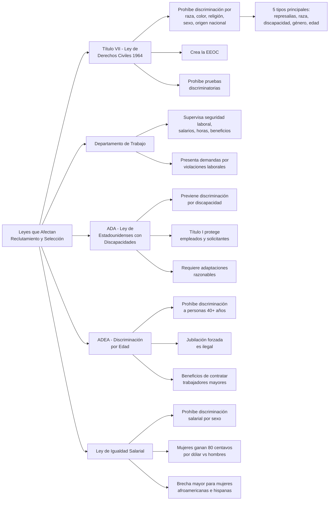
```mermaid
graph LR
    A[Leyes que Afectan<br>Reclutamiento y Selección] --> B[Título VII - Ley de<br>Derechos Civiles 1964]
    A --> C[Departamento de Trabajo]
    A --> D[ADA - Ley de<br>Estadounidenses con<br>Discapacidades]
    A --> E[ADEA - Discriminación<br>por Edad]
    A --> F[Ley de Igualdad Salarial]
    
    B --> B1["Prohíbe discriminación por<br>raza, color, religión,<br>sexo, origen nacional"]
    B --> B2["Crea la EEOC"]
    B --> B3["Prohíbe pruebas<br>discriminatorias"]
    B1 --> B4["5 tipos principales:<br>represalias, raza,<br>discapacidad, género, edad"]
    
    C --> C1["Supervisa seguridad laboral,<br>salarios, horas, beneficios"]
    C --> C2["Presenta demandas por<br>violaciones laborales"]
    
    D --> D1["Previene discriminación<br>por discapacidad"]
    D --> D2["Título I protege<br>empleados y solicitantes"]
    D --> D3["Requiere adaptaciones<br>razonables"]
    
    E --> E1["Prohíbe discriminación<br>a personas 40+ años"]
    E --> E2["Jubilación forzada<br>es ilegal"]
    E --> E3["Beneficios de contratar<br>trabajadores mayores"]
    
    F --> F1["Prohíbe discriminación<br>salarial por sexo"]
    F --> F2["Mujeres ganan 80 centavos<br>por dólar vs hombres"]
    F --> F3["Brecha mayor para mujeres<br>afroamericanas e hispanas"]
```

### Preguntas y Respuestas de Repaso

**1. ¿Qué prohíbe el Título VII de la Ley de Derechos Civiles de 1964?**
Prohíbe la discriminación en el empleo basada en raza, color, religión, sexo y origen nacional.

**2. ¿Qué agencia creó el Título VII y cuál es su propósito?**
Creó la Comisión de Igualdad de Oportunidades en el Empleo (EEOC), una agencia federal dedicada a aumentar las oportunidades de trabajo para mujeres y grupos raciales y étnicos subrepresentados, y a eliminar la discriminación laboral.

**3. ¿Cuáles son los cinco tipos principales de discriminación presentados ante la EEOC?**
Los cinco tipos principales son: represalias, raza, discapacidad, género y edad.

**4. ¿Pueden los empleadores usar pruebas de empleo? ¿Bajo qué condición?**
Sí, pueden usarse siempre que no discriminen intencionalmente por motivos de raza, color, religión, sexo u origen nacional.

**5. ¿Qué porcentaje de empresas Fortune 500 tienen una mujer CEO?**
Solo el 10 por ciento de las empresas Fortune 500 tienen una mujer CEO.

**6. ¿Qué supervisa el Departamento de Trabajo de EE.UU.?**
Supervisa la seguridad en el lugar de trabajo, salarios y horas de trabajo, beneficios de desempleo y más.

**7. ¿Qué es la Ley de Estadounidenses con Discapacidades (ADA)?**
Es una ley que previene la discriminación contra personas con discapacidades en áreas como empleo, transporte, lugares públicos y comunicaciones.

**8. ¿Qué son las "adaptaciones razonables" según la ADA?**
Son ajustes como cambios en el proceso de solicitud de empleo, cambios en el entorno físico de trabajo y modificaciones que permiten a empleados con discapacidades disfrutar de beneficios laborales.

**9. ¿Qué protege la Ley de Discriminación por Edad en el Empleo (ADEA)?**
Prohíbe prácticas de contratación que discriminen contra personas de 40 años o más.

**10. ¿Es legal la jubilación forzada basada en edad en Estados Unidos?**
Generalmente se considera ilegal, aunque aún existen reclamaciones de jubilación forzada.

**11. Mencione tres beneficios de contratar trabajadores mayores.**
Tres beneficios son: son dedicados y puntuales, tienen buenas habilidades de comunicación, y ofrecen una oportunidad de reducir el costo laboral porque ya tienen planes de seguro.

**12. ¿Qué prohíbe la Ley de Igualdad Salarial?**
Prohíbe la discriminación salarial basada en el sexo.

**13. ¿Cuál es la brecha salarial actual entre mujeres y hombres en EE.UU.?**
Las mujeres ganan 80 centavos por cada dólar que ganan sus homólogos masculinos.

**14. ¿Cuál es la brecha salarial para las mujeres afroamericanas e hispanas?**
Las mujeres afroamericanas ganan 62.5 por ciento y las mujeres hispanas ganan 54.4 por ciento de lo que ganan sus homólogos masculinos.

**15. ¿Qué ha hecho la Unión Europea respecto a la igualdad salarial?**
Ha aprobado legislación para regular la igualdad salarial, y los empleados tienen derecho a emprender acciones legales si hay discriminación.

## HR TRANSFORMS THE HIRING PROCESS WITH AI

La inteligencia artificial (IA) está creciendo, con muchos empleadores en todo el mundo utilizando IA en alguna capacidad. Hoy en día, el reclutamiento y la selección de nuevos empleados es en gran medida un proceso en línea con sitios web de carrera y sistemas de seguimiento de solicitantes. Muchas empresas de software venden tecnología de gestión de capital humano utilizando IA para ayudar a las organizaciones a gestionar recursos humanos (RRHH), nóminas y talento.

Los gerentes de recursos humanos pueden utilizar sistemas de seguimiento de solicitantes para gestionar el proceso de contratación, incluyendo la creación de listados de empleo, la recolección de solicitudes, la programación de entrevistas y la extensión de ofertas de trabajo. Agregar funcionalidad de IA al software de seguimiento de solicitantes tiene el potencial de acelerar el proceso de reclutamiento elevando a los candidatos que mejor coinciden con la descripción del trabajo y filtrando a aquellos que no cumplen con los requisitos mínimos de la descripción. Algunos programas de software incluso pueden clasificar candidatos utilizando algoritmos. Otros software pueden leer texto y asignar emociones como felicidad y ansiedad. Con el aprendizaje automático, los algoritmos pueden mejorar con el tiempo.

Si bien la IA puede mejorar el reclutamiento, también tiene sus desventajas. En primer lugar, existen muchas preocupaciones éticas sobre la implementación de la IA en el proceso de contratación. Los algoritmos detrás de la IA son creados por personas y a menudo se alimentan de datos y patrones históricos. Por esta razón, el sesgo puede infiltrarse en los algoritmos y empeorar la discriminación. Amazon abandonó una de sus herramientas de reclutamiento con IA porque descubrió que la herramienta, que fue entrenada con datos históricos, favorecía a los solicitantes masculinos. Cuando se trata de IA en funciones de RRHH, algunos reguladores están pidiendo controles y una supervisión más estrecha. Por ejemplo, si se utilizan tecnologías de IA-RRHH para residentes de la ciudad de Nueva York, una ley requiere que las tecnologías se sometan a auditorías de sesgo.

Muchos profesionales son optimistas sobre el uso de la IA en el proceso de contratación, a pesar de estos dolores de crecimiento. Se estima que más del 50 por ciento de las empresas utilizarán algún tipo de herramienta de contratación impulsada por IA en la próxima década. La IA no reemplaza el elemento humano de RRHH sino que complementa el proceso de toma de decisiones humano.

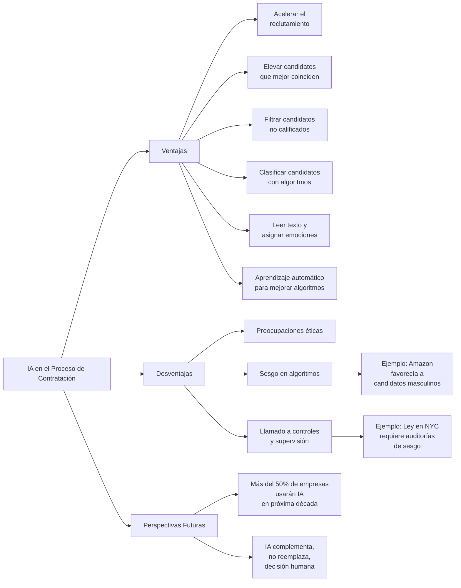
```mermaid
graph LR
    A[IA en el Proceso de Contratación] --> B[Ventajas]
    A --> C[Desventajas]
    A --> D[Perspectivas Futuras]
    
    B --> B1[Acelerar el<br> reclutamiento]
    B --> B2[Elevar candidatos<br> que mejor coinciden]
    B --> B3[Filtrar candidatos<br> no calificados]
    B --> B4[Clasificar candidatos<br> con algoritmos]
    B --> B5[Leer texto y <br>asignar emociones]
    B --> B6[Aprendizaje automático<br> para mejorar algoritmos]
    
    C --> C1[Preocupaciones éticas]
    C --> C2[Sesgo en algoritmos]
    C2 --> C3[Ejemplo: Amazon <br>favorecía a <br>candidatos masculinos]
    C --> C4[Llamado a controles<br> y supervisión]
    C4 --> C5[Ejemplo: Ley en NYC<br> requiere auditorías<br> de sesgo]
    
    D --> D1[Más del 50% de empresas<br> usarán IA <br>en próxima década]
    D --> D2[IA complementa,<br> no reemplaza,<br> decisión humana]
```

### Preguntas de Pensamiento Crítico y Respuestas

**1. ¿Cómo puede la IA mejorar el proceso de contratación?**

La IA puede mejorar el proceso de contratación de varias maneras: acelerando el reclutamiento al elevar a los candidatos que mejor coinciden con la descripción del trabajo, filtrando a aquellos que no cumplen con los requisitos mínimos, clasificando candidatos mediante algoritmos, leyendo texto para asignar emociones como felicidad y ansiedad, y utilizando aprendizaje automático para que los algoritmos mejoren con el tiempo. Además, los sistemas de seguimiento de solicitantes con IA ayudan a gestionar listados de empleo, recolección de solicitudes, programación de entrevistas y extensión de ofertas.

**2. ¿Cuáles son algunas de las preocupaciones relacionadas con la IA en los procesos de RRHH?**

Las principales preocupaciones incluyen cuestiones éticas sobre la implementación de la IA, la posibilidad de que los sesgos se infiltren en los algoritmos (ya que son creados por personas y alimentados con datos históricos), y el riesgo de que la discriminación empeore. Un ejemplo concreto es el caso de Amazon, que abandonó una herramienta de reclutamiento con IA porque favorecía a los solicitantes masculinos debido al entrenamiento con datos históricos. Por esta razón, algunos reguladores están pidiendo controles y supervisión más estrecha, como la ley en la ciudad de Nueva York que requiere auditorías de sesgo para las tecnologías de IA-RRHH.

**3. En su opinión, ¿la tecnología de IA en RRHH debería ser regulada? ¿Por qué sí o por qué no?**

Sí, la tecnología de IA en RRHH debería ser regulada. Las razones incluyen: primero, porque los algoritmos son creados por humanos y entrenados con datos históricos que pueden contener sesgos inconscientes, lo que puede perpetuar o incluso empeorar la discriminación existente. Segundo, como se vio con el caso de Amazon, sin regulación las empresas pueden implementar herramientas que discriminen sin darse cuenta. Tercero, la regulación, como las auditorías de sesgo requeridas en Nueva York, proporciona transparencia y responsabilidad, protegiendo tanto a los solicitantes como a las empresas de prácticas injustas. Finalmente, dado que se estima que más del 50% de las empresas usarán IA en la próxima década, es necesario establecer estándares éticos claros para garantizar que la IA complemente la toma de decisiones humana de manera justa y no discriminatoria.

<h1 id="022324" style="color:#E65100;">
  <a href="#Chapter_10._Managing_Human_Resources" style="color:inherit; text-decoration:none;">
    LO 10-3 DEVELOPING THE WORKFORCE
  </a>
</h1>

Una vez que los solicitantes más calificados han sido seleccionados, se les han ofrecido puestos y han aceptado sus ofertas, deben ser formalmente introducidos a la organización y capacitados para que puedan comenzar a ser miembros productivos de la fuerza laboral. La orientación familiariza a los empleados recién contratados con sus compañeros de trabajo, los procedimientos de la empresa y las propiedades físicas de la compañía. Generalmente incluye un recorrido por el edificio; introducción a supervisores, compañeros de trabajo y subordinados; y la distribución de manuales organizacionales que describen las políticas de la empresa sobre vacaciones, ausentismo, pausas para el almuerzo, beneficios de la empresa, etc. La orientación también implica socializar al nuevo empleado en la ética y cultura de la nueva empresa. Muchas empresas grandes ahora usan videos sobre procedimientos, instalaciones y personal clave en la organización para ayudar a acelerar el proceso de adaptación.

### Training and Development

Describir cómo se capacita a los trabajadores y cómo se evalúa su desempeño.

Aunque el reclutamiento y la selección están diseñados para encontrar empleados que tengan el conocimiento, las habilidades y las capacidades que la empresa necesita, los nuevos empleados aún deben someterse a capacitación para aprender cómo realizar sus tareas laborales específicas. La capacitación en el trabajo (on-the-job training) permite a los trabajadores aprender realizando realmente las tareas del puesto, mientras que la capacitación fuera del trabajo (off-the-job training) enseña a los empleados con conferencias, clases, videos, casos de estudio y capacitación basada en web. McDonald's siempre ha tenido una fuerte presencia de capacitación en la Universidad de la Hamburguesa. La compañía invirtió en capacitación virtual a través de tecnología basada en la nube para apoyar el aprendizaje, desarrollo y capacidades de liderazgo de sus empleados y operadores globales.

Algunas empresas van incluso más allá y designan a un individuo más experimentado dentro de la organización para que sea mentor de un nuevo empleado. La mentoría implica apoyar, enseñar y guiar el desarrollo profesional de un empleado. La mentoría proporciona a los empleados una interacción más uno a uno con alguien en la organización que no solo les enseña sino que también actúa como su apoyo a medida que avanzan en sus trabajos. Otro beneficio de la mentoría es que las empresas pueden usar este proceso para atraer talento de áreas subrepresentadas. Por ejemplo, la mentoría ha sido sugerida como una forma de atraer a más mujeres a industrias dominadas por hombres. El desarrollo es una capacitación que aumenta las habilidades y el conocimiento de gerentes y profesionales. La capacitación y el desarrollo también se utilizan para mejorar las habilidades de los empleados en sus posiciones actuales y para prepararlos para una mayor responsabilidad y promociones. La capacitación es, por lo tanto, una función vital de la gestión de recursos humanos. En The Container Store, por ejemplo, el personal de ventas de primer año recibe más de 240 horas de capacitación formal sobre los productos de la empresa, en comparación con un promedio industrial de ocho horas. Las empresas están participando en ejercicios de capacitación más experienciales y orientados a la participación para los empleados. Los juegos de roles en vivo, las simulaciones y los métodos de capacitación en línea son cada vez más populares en la capacitación de empleados.

### Assessing Performance

Evaluar el desempeño de los empleados (sus fortalezas y debilidades en el trabajo) es una de las tareas más difíciles para los gerentes. Sin embargo, la evaluación del desempeño es crucial porque proporciona a los empleados retroalimentación sobre cómo lo están haciendo y qué necesitan hacer para mejorar. También proporciona una base para determinar cómo compensar y recompensar a los empleados, y genera información sobre la calidad de las actividades de reclutamiento, capacitación y desarrollo de la empresa. La mayoría de las empresas realizan revisiones de desempeño de empleados al menos una vez al año.

Las evaluaciones de desempeño pueden ser objetivas o subjetivas. Una medición objetiva es cuantificable. Un agente de bienes raíces de RE/MAX podría ser juzgado por el número de listados que el agente ha mostrado o el número de ventas que el agente ha cerrado. Una empresa también puede usar pruebas como un método objetivo de medición. Cualquiera sea el método que utilicen, los gerentes deben tener en cuenta el entorno laboral cuando evalúan el desempeño objetivamente.

Cuando los trabajos no se prestan para una evaluación objetiva, el gerente debe relacionar el desempeño del empleado con algún otro estándar. Una herramienta popular utilizada en la evaluación subjetiva es el sistema de clasificación (ranking), que enumera varios factores de desempeño en los cuales el gerente clasifica a los empleados entre sí. Aunque son utilizados por muchas grandes empresas, los sistemas de clasificación son impopulares entre muchos empleados. Los criterios cualitativos, como el trabajo en equipo y las habilidades de comunicación, utilizados para evaluar a los empleados son generalmente difíciles de medir. Tales sistemas de calificación han provocado demandas de empleados que alegan discriminación en la asignación de calificaciones/clasificaciones. Por ejemplo, un gerente puede calificar a los empleados de una empresa de una manera, mientras que otro gerente califica a un grupo de manera más severa dependiendo del estilo de calificación del gerente. Si ocurren despidos, entonces los empleados calificados por el segundo gerente pueden tener más probabilidades de perder sus trabajos. Otras críticas a los sistemas de calificación incluyen redacción poco clara o palabras inapropiadas que un gerente puede escribir sin querer en una evaluación de desempeño, como "juvenil" o "atractiva" para describir la apariencia de un empleado. Estas acciones pueden contribuir a demandas si los empleados alegan que fueron tratados injustamente. Por lo tanto, es crucial que los gerentes utilicen un lenguaje claro en las evaluaciones de desempeño y sean consistentes con todos los empleados.

Otro método de evaluación del desempeño utilizado por muchas empresas es el sistema de retroalimentación de 360 grados, que proporciona retroalimentación de un panel que típicamente incluye superiores, pares y subordinados. Debido a las tensiones que puede causar, la evaluación por pares parece ser difícil para muchos. Sin embargo, las empresas que tienen éxito con la evaluación de 360 grados tienden a estar abiertas al aprendizaje y dispuestas a experimentar, y están lideradas por ejecutivos que son directos sobre los beneficios esperados, así como sobre los desafíos. Los gerentes y líderes con alta inteligencia emocional (sensibilidad a sus propias emociones así como a las de los demás) miden y reflexionan sobre sus interacciones con los colegas a diario. Además, realizan análisis de seguimiento sobre sus proyectos, haciendo las preguntas correctas y escuchando cuidadosamente las respuestas sin ponerse a la defensiva sobre sus acciones.

Otra tendencia que ocurre en algunas empresas es la disminución de la retroalimentación negativa a los empleados. Los ejecutivos han comenzado a reconocer que las tácticas duras pueden dañar la confianza de los empleados. La retroalimentación negativa tiende a eclipsar la retroalimentación positiva, por lo que los empleados pueden desanimarse si las revisiones de desempeño están formuladas de manera demasiado negativa. Al mismo tiempo, es importante que los gerentes proporcionen críticas constructivas sobre las debilidades de los empleados además de sus fortalezas para que los trabajadores sepan qué esperar y cómo son vistos.

Ya sea que la evaluación sea objetiva o subjetiva, es vital que los gerentes discutan los resultados con sus empleados para que sepan qué tan bien están haciendo sus trabajos. Los resultados de una evaluación de desempeño se vuelven útiles solo cuando se comunican con tacto a los empleados y se presentan como una herramienta para permitir que los empleados crezcan y mejoren en sus posiciones y más allá. Las evaluaciones de desempeño también se utilizan para determinar si un empleado debe ser promovido, transferido o despedido de la organización.

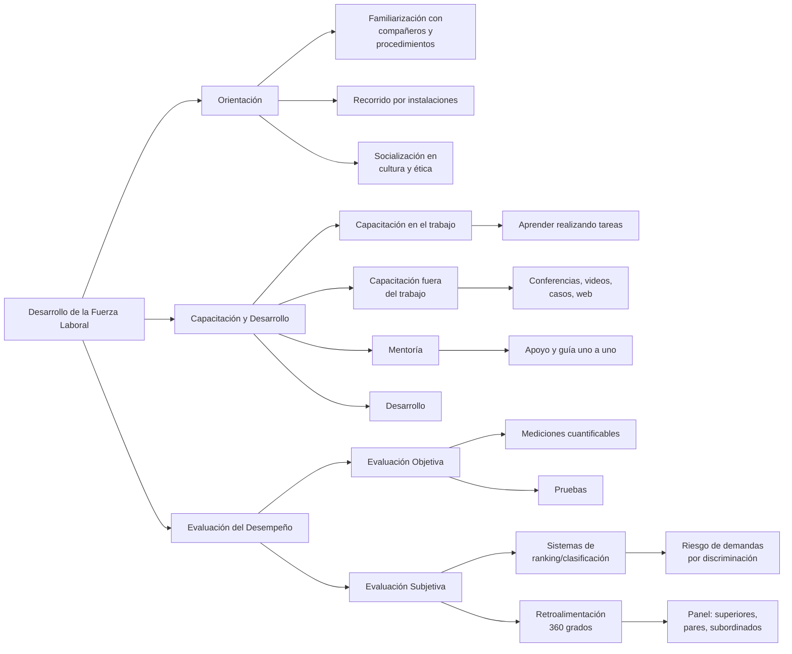
```mermaid
graph LR
    A[Desarrollo de la Fuerza Laboral] --> B[Orientación]
    A --> C[Capacitación y Desarrollo]
    A --> D[Evaluación del Desempeño]
    
    B --> B1[Familiarización con<br> compañeros y procedimientos]
    B --> B2[Recorrido por instalaciones]
    B --> B3[Socialización en <br>cultura y ética]
    
    C --> C1[Capacitación en el trabajo]
    C --> C2[Capacitación fuera<br> del trabajo]
    C --> C3[Mentoría]
    C --> C4[Desarrollo]
    C1 --> C5[Aprender realizando tareas]
    C2 --> C6[Conferencias, videos,<br> casos, web]
    C3 --> C7[Apoyo y guía uno a uno]
    
    D --> D1[Evaluación Objetiva]
    D --> D2[Evaluación Subjetiva]
    D1 --> D3[Mediciones cuantificables]
    D1 --> D4[Pruebas]
    D2 --> D5[Sistemas de <br>ranking/clasificación]
    D2 --> D6[Retroalimentación<br> 360 grados]
    D5 --> D7[Riesgo de demandas<br> por discriminación]
    D6 --> D8[Panel: superiores,<br> pares, subordinados]
```

### Preguntas y Respuestas de Repaso

**1. ¿Qué es la orientación y qué incluye típicamente?**
La orientación es el proceso que familiariza a los empleados recién contratados con sus compañeros de trabajo, los procedimientos de la empresa y las propiedades físicas de la compañía. Generalmente incluye un recorrido por el edificio, introducción a supervisores y compañeros, y la distribución de manuales organizacionales sobre políticas de vacaciones, ausentismo, beneficios, etc. También implica socializar al nuevo empleado en la ética y cultura de la empresa.

**2. ¿Cuál es la diferencia entre capacitación en el trabajo y capacitación fuera del trabajo?**
La capacitación en el trabajo (on-the-job training) permite a los trabajadores aprender realizando realmente las tareas del puesto, mientras que la capacitación fuera del trabajo (off-the-job training) enseña a los empleados con conferencias, clases, videos, casos de estudio y capacitación basada en web.

**3. ¿Qué es la mentoría y cuáles son sus beneficios?**
La mentoría implica apoyar, enseñar y guiar el desarrollo profesional de un empleado mediante la interacción uno a uno con alguien más experimentado. Los beneficios incluyen proporcionar apoyo personalizado y la capacidad de atraer talento de áreas subrepresentadas, como atraer más mujeres a industrias dominadas por hombres.

**4. ¿Por qué es importante la evaluación del desempeño?**
Es crucial porque proporciona a los empleados retroalimentación sobre su desempeño y qué necesitan mejorar, proporciona una base para determinar compensaciones y recompensas, y genera información sobre la calidad de las actividades de reclutamiento, capacitación y desarrollo de la empresa.

**5. ¿Cuál es la diferencia entre una evaluación objetiva y una subjetiva?**
Una evaluación objetiva es cuantificable (ej. número de ventas cerradas), mientras que una evaluación subjetiva relaciona el desempeño del empleado con algún otro estándar cualitativo (ej. trabajo en equipo y habilidades de comunicación).

**6. ¿Qué problemas pueden surgir con los sistemas de ranking o clasificación?**
Los sistemas de ranking son impopulares entre muchos empleados, pueden provocar demandas por discriminación en la asignación de calificaciones, y pueden verse afectados por el estilo de calificación de cada gerente. También pueden incluir redacción poco clara o palabras inapropiadas que contribuyan a demandas.

**7. ¿Qué es el sistema de retroalimentación de 360 grados?**
Es un método de evaluación del desempeño que proporciona retroalimentación de un panel que típicamente incluye superiores, pares y subordinados.

**8. ¿Qué tendencia existe actualmente respecto a la retroalimentación negativa?**
Los ejecutivos han comenzado a reconocer que las tácticas duras pueden dañar la confianza de los empleados, por lo que hay una tendencia a disminuir la retroalimentación negativa. Sin embargo, sigue siendo importante proporcionar críticas constructivas sobre las debilidades además de las fortalezas.

**9. ¿Para qué más se utilizan las evaluaciones de desempeño además de la retroalimentación?**
También se utilizan para determinar si un empleado debe ser promovido, transferido o despedido de la organización.

**10. ¿Qué ejemplo se menciona sobre capacitación intensiva en una empresa?**
En The Container Store, el personal de ventas de primer año recibe más de 240 horas de capacitación formal sobre los productos de la empresa, en comparación con un promedio industrial de ocho horas.

<h1 id="305167" style="color:#E65100;">
  <a href="#Chapter_10._Managing_Human_Resources" style="color:inherit; text-decoration:none;">
    LO 10-4 Turnover
  </a>
</h1>

Identify the types of turnover companies may experience.

El **turnover** (rotación de personal) ocurre cuando los empleados renuncian o son despedidos y deben ser reemplazados por nuevos empleados. Como resultado, hay pérdidas en productividad por la vacante, costos para reclutar empleados de reemplazo, tiempo de gestión dedicado a entrevistas, capacitación y gastos de socialización para los nuevos empleados. Como se discutió en el capítulo "Motivando la Fuerza Laboral", muchas personas renunciaron voluntariamente a sus trabajos o buscaron nuevas oportunidades durante la Gran Renuncia, una tendencia laboral posterior a la pandemia. Las personas renunciaron por diversas razones, incluyendo salarios bajos, falta de oportunidades de avance, falta de respeto en el lugar de trabajo, problemas de cuidado infantil y falta de horarios flexibles. El turnover voluntario cuesta a las empresas $1 billón anuales. Por lo tanto, las empresas pueden impactar significativamente las tasas de rotación. Por supuesto, el turnover no siempre es un evento desafortunado cuando toma la forma de un ascenso o transferencia.

Un **ascenso (promotion)** es un avance a un puesto de mayor nivel con mayor autoridad, responsabilidad y salario. En algunas empresas y en la mayoría de los sindicatos laborales, la antigüedad (seniority) (el tiempo que una persona ha estado en la empresa o en una clasificación laboral particular) es el factor clave para determinar quién debe ser ascendido. La mayoría de los gerentes basan los ascensos en la antigüedad solo cuando tienen candidatos con calificaciones iguales. Los gerentes prefieren basar los ascensos en el mérito.

Una **transferencia (transfer)** es un movimiento a otro trabajo dentro de la empresa en esencialmente el mismo nivel y salario. Las transferencias permiten a los trabajadores obtener nuevas habilidades o encontrar una nueva posición dentro de una organización cuando su puesto antiguo ha sido eliminado debido a la automatización, la inteligencia artificial o la reducción de personal.

Las **separaciones (separations)** ocurren cuando los empleados renuncian, se jubilan, son despedidos o son suspendidos temporalmente (laid off). Los empleados pueden ser **despedidos (terminated o fired)** por mal desempeño, violación de las reglas de trabajo, ausentismo, etc. Las empresas en los Estados Unidos generalmente pueden despedir empleados a voluntad (at will), es decir, por cualquier razón, excepto por raza, religión, género, edad o porque un empleado es organizador sindical. Sin embargo, algunos estados y acuerdos laborales requieren que las empresas despidan empleados de manera justa, solo por causa justificada (just cause). Los gerentes deben tener cuidado de advertir a los empleados cuando su desempeño es inaceptable y puede llevar al despido, elevando la importancia de las evaluaciones de desempeño. También deben documentar todos los problemas y advertencias en los registros de trabajo de los empleados. Para evitar la posibilidad de demandas de personas que puedan sentir que fueron despedidas injustamente, los empleadores deben proporcionar razones claras y relacionadas con el negocio para cualquier despido, respaldadas por documentación escrita cuando sea posible. Los procedimientos disciplinarios para empleados deben explicarse cuidadosamente a todos los empleados y deben establecerse en los manuales del empleado. La Tabla 10.3 ilustra qué hacer y qué no hacer cuando eres despedido.

**Tabla 10.3 - Acciones que Debes y No Debes Tomar Cuando Eres Despedido**

1. No critiques a tu jefe que te despidió.
2. No tomes archivos o propiedad que no sea tuya.
3. Trata de obtener una carta de referencia.
4. No critiques a tu empleador anterior durante las entrevistas de trabajo.
5. Mira hacia el futuro y sé positivo sobre las nuevas oportunidades laborales.

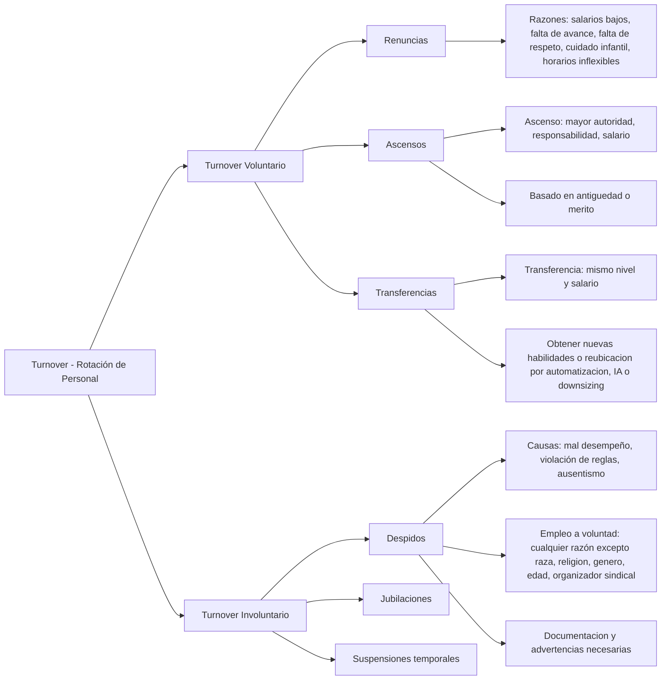
```mermaid
graph LR
    A[Turnover - Rotación de Personal] --> B[Turnover Voluntario]
    A --> C[Turnover Involuntario]
    
    B --> B1[Renuncias]
    B1 --> B2[Razones: salarios bajos, falta de avance, falta de respeto, cuidado infantil, horarios inflexibles]
    B --> B3[Ascensos]
    B --> B4[Transferencias]
    
    C --> C1[Despidos]
    C --> C2[Jubilaciones]
    C --> C3[Suspensiones temporales]
    C1 --> C4[Causas: mal desempeño, violación de reglas, ausentismo]
    C1 --> C5[Empleo a voluntad: cualquier razón excepto raza, religion, genero, edad, organizador sindical]
    C1 --> C6[Documentacion y advertencias necesarias]
    
    B3 --> D1[Ascenso: mayor autoridad, responsabilidad, salario]
    B3 --> D2[Basado en antiguedad o merito]
    
    B4 --> E1[Transferencia: mismo nivel y salario]
    B4 --> E2[Obtener nuevas habilidades o reubicacion por automatizacion, IA o downsizing]
```

### Preguntas y Respuestas de Repaso

**1. ¿Qué es el turnover (rotación de personal) y cuáles son sus consecuencias?**
El turnover ocurre cuando los empleados renuncian o son despedidos y deben ser reemplazados por nuevos empleados. Las consecuencias incluyen pérdidas en productividad por la vacante, costos para reclutar empleados de reemplazo, tiempo de gestión dedicado a entrevistas, y gastos de capacitación y socialización para los nuevos empleados.

**2. ¿Cuáles fueron las principales razones de la Gran Renuncia mencionadas en el texto?**
Las personas renunciaron por salarios bajos, falta de oportunidades de avance, falta de respeto en el lugar de trabajo, problemas de cuidado infantil y falta de horarios flexibles.

**3. ¿Cuánto cuesta el turnover voluntario a las empresas anualmente?**
El turnover voluntario cuesta a las empresas $1 billón anuales.

**4. ¿Qué es un ascenso (promotion)?**
Un ascenso es un avance a un puesto de mayor nivel con mayor autoridad, responsabilidad y salario.

**5. ¿En qué se basa la mayoría de los gerentes para decidir ascensos?**
La mayoría de los gerentes basan los ascensos en el mérito. Solo usan la antigüedad (seniority) cuando tienen candidatos con calificaciones iguales.

**6. ¿Qué es una transferencia (transfer) y para qué sirve?**
Una transferencia es un movimiento a otro trabajo dentro de la empresa en el mismo nivel y salario. Sirve para que los trabajadores obtengan nuevas habilidades o encuentren una nueva posición cuando su puesto antiguo ha sido eliminado por automatización, inteligencia artificial o reducción de personal.

**7. ¿Qué son las separaciones (separations)?**
Las separaciones ocurren cuando los empleados renuncian, se jubilan, son despedidos (terminated) o son suspendidos temporalmente (laid off).

**8. ¿Qué significa que las empresas en EE.UU. pueden despedir empleados "a voluntad" (at will)?**
Significa que pueden despedir empleados por cualquier razón, excepto por raza, religión, género, edad o porque un empleado es organizador sindical.

**9. ¿Qué deben hacer los gerentes para evitar demandas por despido injusto?**
Deben advertir a los empleados cuando su desempeño es inaceptable, documentar todos los problemas y advertencias en los registros de trabajo, proporcionar razones claras y relacionadas con el negocio respaldadas por documentación escrita, y explicar los procedimientos disciplinarios en los manuales del empleado.

**10. Según la Tabla 10.3, mencione tres acciones que se deben tomar cuando eres despedido.**
Tres acciones son: tratar de obtener una carta de referencia, mirar hacia el futuro y ser positivo sobre las nuevas oportunidades laborales, y no criticar al jefe que te despidió ni al empleador anterior durante entrevistas.

<h1 id="795518" style="color:#E65100;">
  <a href="#Chapter_10._Managing_Human_Resources" style="color:inherit; text-decoration:none;">
    LO 10-5 Explain why turnover is an important issue.
  </a>
</h1>

Muchas empresas han reducido su tamaño (downsized) en los últimos años, despidiendo a decenas de miles de empleados en su esfuerzo por volverse más productivas y competitivas. Los despidos temporales (layoffs) son a veces temporales: los empleados pueden ser reincorporados cuando las condiciones del negocio mejoren. Cuando los despidos son permanentes, los empleadores a menudo ayudan a los empleados a encontrar otros trabajos y pueden extender los beneficios mientras los empleados buscan un nuevo empleo. Tales acciones ayudan a disminuir el trauma de los despidos. No todas las industrias han experimentado una reducción significativa de personal.

Un departamento de recursos humanos bien organizado se esfuerza por minimizar las pérdidas debidas a separaciones y transferencias porque reclutar y capacitar a nuevos empleados es muy costoso. Tenga en cuenta que una alta tasa de rotación en una empresa puede señalar problemas con el proceso de selección y capacitación, el programa de compensación o incluso el tipo de empresa. Para ayudar a reducir la rotación, las empresas han probado varias estrategias, que incluyen dar a los empleados responsabilidades laborales más interesantes (enriquecimiento del trabajo), permitir una mayor flexibilidad laboral y proporcionar más beneficios a los empleados. Cuando los empleados deciden dejar la organización, la empresa a menudo les pide que participen en una entrevista de salida (exit interview). Una entrevista de salida es una encuesta utilizada para determinar por qué el empleado está dejando la organización. La empresa espera que esta retroalimentación la alertará sobre los procesos que puede mejorar para evitar que los empleados valiosos se vayan.

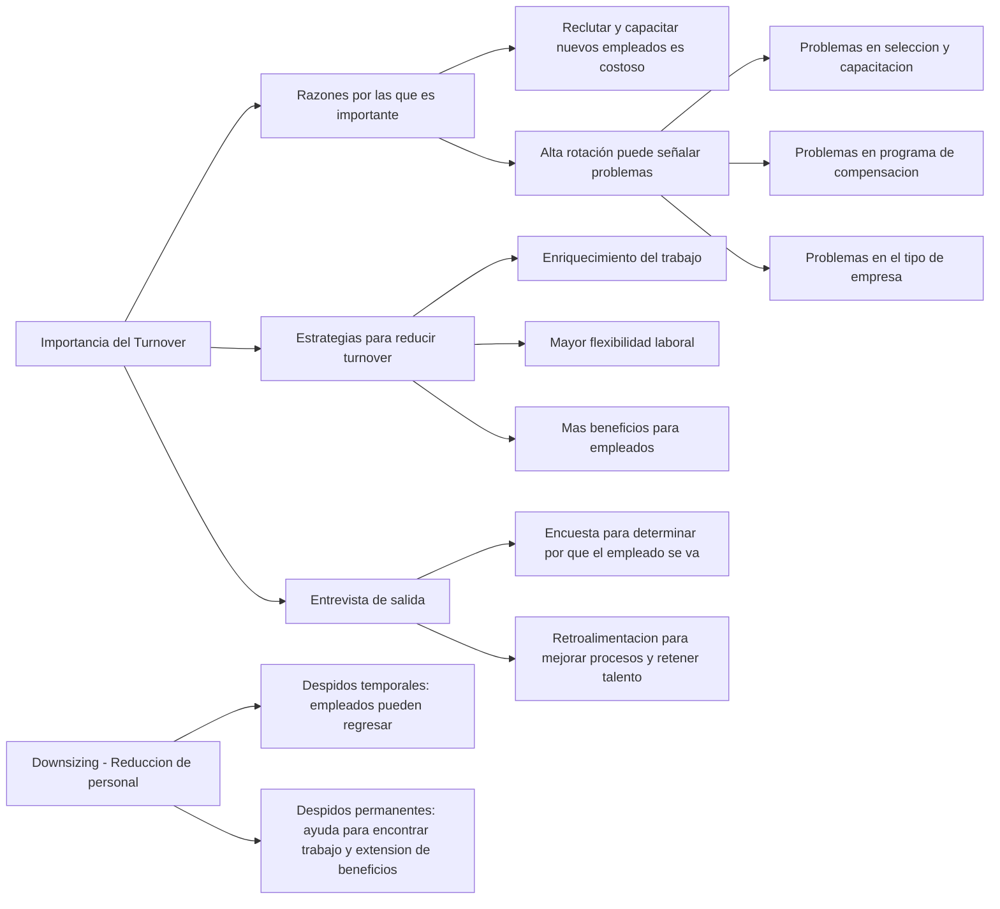
```mermaid
graph LR
    A[Importancia del Turnover] --> B[Razones por las que es importante]
    A --> C[Estrategias para reducir turnover]
    A --> D[Entrevista de salida]
    
    B --> B1[Reclutar y capacitar nuevos empleados es costoso]
    B --> B2[Alta rotación puede señalar problemas]
    B2 --> B3[Problemas en seleccion y capacitacion]
    B2 --> B4[Problemas en programa de compensacion]
    B2 --> B5[Problemas en el tipo de empresa]
    
    C --> C1[Enriquecimiento del trabajo]
    C --> C2[Mayor flexibilidad laboral]
    C --> C3[Mas beneficios para empleados]
    
    D --> D1[Encuesta para determinar por que el empleado se va]
    D --> D2[Retroalimentacion para mejorar procesos y retener talento]
    
    E[Downsizing - Reduccion de personal] --> E1[Despidos temporales: empleados pueden regresar]
    E --> E2[Despidos permanentes: ayuda para encontrar trabajo y extension de beneficios]
```

### Preguntas y Respuestas de Repaso

**1. ¿Por qué es importante el turnover para las empresas?**
El turnover es importante porque reclutar y capacitar a nuevos empleados es muy costoso. Una alta tasa de rotación puede señalar problemas con el proceso de selección y capacitación, el programa de compensación o incluso el tipo de empresa.

**2. ¿Qué son los despidos temporales (layoffs) y qué ocurre en ellos?**
Los despidos temporales son aquellos en los que los empleados pueden ser reincorporados cuando las condiciones del negocio mejoren.

**3. ¿Cómo ayudan los empleadores cuando los despidos son permanentes?**
Los empleadores a menudo ayudan a los empleados a encontrar otros trabajos y pueden extender los beneficios mientras los empleados buscan un nuevo empleo. Tales acciones ayudan a disminuir el trauma de los despidos.

**4. ¿Qué estrategias han probado las empresas para reducir la rotación?**
Las empresas han probado dar a los empleados responsabilidades laborales más interesantes (enriquecimiento del trabajo), permitir una mayor flexibilidad laboral y proporcionar más beneficios a los empleados.

**5. ¿Qué es una entrevista de salida (exit interview)?**
Una entrevista de salida es una encuesta utilizada para determinar por qué el empleado está dejando la organización.

**6. ¿Qué espera lograr la empresa con la entrevista de salida?**
La empresa espera que la retroalimentación de la entrevista de salida la alertará sobre los procesos que puede mejorar para evitar que los empleados valiosos se vayan.

**7. ¿Qué puede indicar una alta tasa de rotación en una empresa?**
Una alta tasa de rotación puede señalar problemas con el proceso de selección y capacitación, el programa de compensación o incluso el tipo de empresa.

**8. ¿Todas las industrias han experimentado una reducción significativa de personal (downsizing)?**
No, no todas las industrias han experimentado una reducción significativa de personal.

**9. ¿Qué objetivo tiene un departamento de RRHH bien organizado respecto a las separaciones y transferencias?**
Un departamento de recursos humanos bien organizado se esfuerza por minimizar las pérdidas debidas a separaciones y transferencias.

**10. ¿Qué es el enriquecimiento del trabajo (job enrichment) como estrategia para reducir el turnover?**
El enriquecimiento del trabajo consiste en dar a los empleados responsabilidades laborales más interesantes como una estrategia para ayudar a reducir la rotación de personal.

<h1 id="960905" style="color:#E65100;">
  <a href="#Chapter_10._Managing_Human_Resources" style="color:inherit; text-decoration:none;">
    LO 10-6 COMPENSATING THE WORKFORCE
  </a>
</h1>

Specify the various ways a worker may be compensated.

La compensación total (total compensation), como se ilustra en la Tabla 10.4, incluye compensación financiera directa y beneficios. Las personas generalmente no trabajan gratis, y cuánto se les paga por su trabajo es un asunto complicado. Por lo tanto, diseñar un plan de compensación justo es una tarea importante porque el pago y los beneficios representan una porción sustancial de los gastos de una organización. Los salarios que son demasiado altos pueden resultar en que los productos de la empresa tengan un precio excesivo, haciéndolos no competitivos en el mercado. Los salarios que son demasiado bajos pueden dañar la moral de los empleados y resultar en una rotación costosa. Recuerde que la compensación es uno de los factores de higiene identificados por Herzberg.

Según la Oficina de Estadísticas Laborales, los costos de los empleadores por compensación de empleados en los Estados Unidos promedian $41.86 por hora trabajada. Los salarios y sueldos representan el 69 por ciento de estos costos, mientras que los beneficios representan el 31 por ciento del costo.

### TABLA 10.4 Tipos de Compensación

| Compensación Financiera Directa | Beneficios (Compensación Financiera Indirecta) | Beneficios (Compensación No Monetaria) |
|:-------------------------------|:----------------------------------------------|:---------------------------------------|
| Salarios por hora (Wages) | Planes de jubilación | Programas de reconocimiento al empleado |
| Comisiones | Seguro de salud | Horarios flexibles |
| Sueldo (Salary) | Seguro dental | Políticas de trabajo remoto |
| Bonos | Seguro de visión | Oportunidades de desarrollo profesional |
| Participación de utilidades | Seguro de discapacidad | Programas de asistencia y bienestar al empleado |
| | Seguro de vida | Oportunidades de voluntariado |
| | Tiempo libre pagado | |
| | Licencia por enfermedad | |
| | Cuidado infantil | |
| | Cuidado de ancianos | |
| | Asistencia educativa (matrícula) | |
| | Descuentos | |

Diseñar un plan de compensación justo es una tarea difícil porque implica evaluar el valor relativo de todos los trabajos dentro de la empresa, permitiendo al mismo tiempo los esfuerzos individuales. La compensación para un trabajo específico se determina típicamente a través de una encuesta salarial (wage/salary survey), que le dice a la empresa cuánta compensación están pagando las empresas comparables por trabajos específicos que tienen en común. La compensación para individuos dentro de una categoría de trabajo específica depende tanto de la compensación para ese trabajo como de la productividad del individuo. Por lo tanto, dos empleados con trabajos idénticos pueden no recibir exactamente el mismo pago debido a diferencias individuales en el desempeño. Los empleados pueden recurrir a sitios web como Glassdoor para verificar su salario en comparación con otros que han compartido anónimamente su salario y compensación.

### Financial Compensation

La compensación financiera directa se divide en dos categorías generales: salarios por hora (wages) y sueldos (salaries). Los salarios por hora son recompensas financieras basadas en el número de horas que trabaja el empleado o el nivel de producción alcanzado. Los salarios basados en el número de horas trabajadas se llaman salarios por hora (hourly wages). El salario mínimo federal es de $7.25 por hora para trabajadores cubiertos no exentos. Los salarios con propinas pueden ser de $2.13 por hora siempre que las propinas más el salario de $2.13 por hora igualen el salario mínimo de $7.25 por hora, aunque algunos estados requieren el salario mínimo y luego las propinas se añaden encima. Muchos estados también exigen salarios mínimos; en el caso de que esto entre en conflicto con el salario mínimo federal, prevalece el más alto de los dos salarios. Incluso puede haber diferencias entre el salario mínimo de la ciudad y el del estado. En Maryland, el salario mínimo es de $11.75, mientras que su vecino Washington, D.C., tiene un salario mínimo de $15.20. Los salarios por hora son apropiados cuando los empleados son interrumpidos continuamente y cuando la calidad es más importante que la cantidad. Los trabajadores de línea de ensamblaje, oficinistas y personal de mantenimiento son comúnmente pagados por hora. La ventaja de los salarios por hora es la facilidad de cálculo. La desventaja es que los salarios por hora no proporcionan incentivo para aumentar la productividad. De hecho, los salarios por hora pueden alentar a los empleados a ser menos productivos.

Para superar estas desventajas, muchas empresas pagan con un sistema de incentivos, utilizando salarios por pieza (piece wages) o comisiones (commissions). Los salarios por pieza se basan en el nivel de producción alcanzado. Una ventaja importante de los salarios por pieza es que motivan a los empleados a supervisar sus propias actividades y a aumentar la productividad. Los trabajadores calificados a menudo son pagados sobre una base de salario por pieza.

El otro sistema de incentivo, la comisión, paga una cantidad fija o un porcentaje de las ventas del empleado. La vendedora directa de cuidado de la piel Rodan + Fields utiliza contratistas independientes para vender sus productos. Los consultores ganan comisiones sobre cualquier producto que vendan. Este método motiva a los empleados a vender y ser productivos. Algunas empresas también combinan el pago basado en comisiones con salarios por hora o sueldos.

El sueldo (salary) es una recompensa financiera calculada semanal, mensual o anualmente. Los sueldos se asocian con trabajadores de cuello blanco, como personal de oficina, ejecutivos y empleados profesionales. Aunque un sueldo proporciona un flujo estable de ingresos, los trabajadores asalariados pueden ser requeridos para trabajar más allá de las horas habituales sin compensación financiera adicional.

Además de los salarios o sueldos básicos pagados a los empleados, una empresa puede ofrecer bonos (bonuses) por desempeño excepcional como incentivo para aumentar aún más la productividad. Muchos trabajadores reciben un bono como un "gracias" por un buen trabajo y un incentivo para continuar trabajando duro. Muchos propietarios y gerentes están reconociendo que los bonos simples producen empleados más felices y reducen la rotación. Los bonos son especialmente populares entre las empresas de Wall Street. Los bonos de los ejecutivos de Wall Street aumentan cuando Estados Unidos tiene una economía en mejora y un fuerte desempeño en el sector financiero.

Otra forma de compensación es la participación de utilidades (profit sharing), que distribuye un porcentaje de las ganancias de la empresa a los empleados cuyo trabajo ayudó a generar esas ganancias. Algunos planes de participación de utilidades implican distribuir acciones de la empresa a los empleados. Usualmente referidos como ESOPs (planes de propiedad de acciones para empleados), han estado ganando popularidad en los últimos años. Una razón para la popularidad de los ESOPs es el sentido de asociación que crean entre la organización y los empleados. La participación de utilidades también puede motivar a los empleados a trabajar duro porque el aumento de la productividad y las ventas significa que las ganancias o los dividendos de las acciones aumentarán. Muchas organizaciones ofrecen a los empleados una participación en la empresa a través de planes de compra de acciones, ESOPs o inversiones en acciones a través de planes 401(k). Las empresas están adoptando planes de opciones sobre acciones para construir un vínculo más fuerte entre los intereses de los empleados y los intereses de la organización. Las empresas han encontrado que las opciones sobre acciones para empleados son una excelente manera de aumentar la productividad y elevar la moral.

### Benefits

Los beneficios (benefits) son la parte de la compensación proporcionada a los empleados que no es parte del salario del empleado. Incluye compensación financiera indirecta (ej. planes de jubilación, seguro de salud, discapacidad y vida, días pagados, cuidado infantil, etc.) y beneficios no monetarios (ej. programas de reconocimiento al empleado, horarios flexibles, oportunidades de desarrollo profesional, etc.). Tales beneficios aumentan la seguridad del empleado y, hasta cierto punto, su moral.

### Indirect Financial Compensation

La compensación financiera indirecta (indirect financial compensation), también llamada beneficios marginales (fringe benefits), incluye compensación no monetaria que tiene valor financiero. Los ejemplos incluyen licencia por enfermedad, pago de vacaciones, planes de pensiones y seguro de salud. Para algunos empleados, la compensación financiera indirecta es un motivador y diferenciador en el trabajo más importante que los salarios o sueldos. El seguro de salud es un beneficio común para los empleados de tiempo completo, sin embargo, algunos empleadores extienden este beneficio a los empleados de tiempo parcial también. Las empresas con 50 o más empleados de tiempo completo (que trabajan 30 o más horas por semana) están obligadas a ofrecer cobertura de seguro de salud asequible a los empleados de tiempo completo que cumplan ciertos estándares. La lealtad de los empleados tiende a aumentar cuando los empleados sienten que la empresa se preocupa por ellos. Starbucks reconoce la importancia de cómo los beneficios marginales pueden afectar significativamente la salud y el bienestar de un empleado. Como resultado, ofrece a los empleados de tiempo parcial elegibles seguro de salud. Adicionalmente, Starbucks ofrece planes de jubilación, tiempo libre pagado, licencia parental, asistencia educativa, beneficios para viajeros y más.

Los planes de beneficios tipo cafetería (cafeteria benefit plans) permiten a los empleados seleccionar los beneficios específicos que se ajustan a sus necesidades sobre una base antes de impuestos. Los empleados que optan por participar apartan una parte de su salario antes de impuestos para su beneficio seleccionado, resultando en que los empleados pagan menos impuestos. Otro beneficio es hacer que los beneficios sean flexibles, en lugar de dar a los empleados beneficios idénticos. Ejemplos de estos beneficios incluyen cuentas de ahorro de salud (HSAs), cuentas de gastos flexibles para cuidado de dependientes (DCFSAs) y cuentas de gastos flexibles (FSAs).

### Nonmonetary Compensation

La compensación no monetaria (non-monetary compensation), también llamada beneficios blandos o ventajas (soft benefits o perks), incluye beneficios no financieros proporcionados a los empleados. Los ejemplos incluyen programas de reconocimiento al empleado, horarios flexibles, políticas de trabajo remoto, oportunidades de desarrollo profesional y otros beneficios como comida gratis o una sala de recreación en la oficina. General Motors, por ejemplo, tiene un programa formal de mentoría y un programa de educación técnica entre sus beneficios blandos. La compensación no monetaria puede motivar a los empleados, reducir el estrés e inspirar lealtad a la compañía.

Un beneficio blando que se ofrece cada vez más es el programa de asistencia al empleado (Employee Assistance Program - EAP). El programa EAP de cada empresa es diferente, pero generalmente los EAP ayudan a los empleados con problemas personales que podrían perjudicar su desempeño laboral si no se abordan. Los servicios comunes ofrecidos incluyen subvenciones, programas de tratamiento para el consumo de drogas y alcohol, programas de acondicionamiento físico, clínicas de manejo de estrés, asesoramiento financiero, asesoramiento familiar y asesoramiento profesional. El programa de asistencia al empleado de Home Depot, llamado The Homer Fund, proporciona asistencia financiera a los empleados que enfrentan eventos catastróficos imprevistos como muerte, desastre natural y enfermedad. Los EAP ayudan a reducir los costos asociados con la baja productividad, el ausentismo y otros problemas laborales al ayudar a los empleados a lidiar con problemas personales que contribuyen a estos problemas. Según la Oficina de Estadísticas Laborales de EE.UU., más de la mitad de todos los trabajadores civiles tienen acceso a EAP.

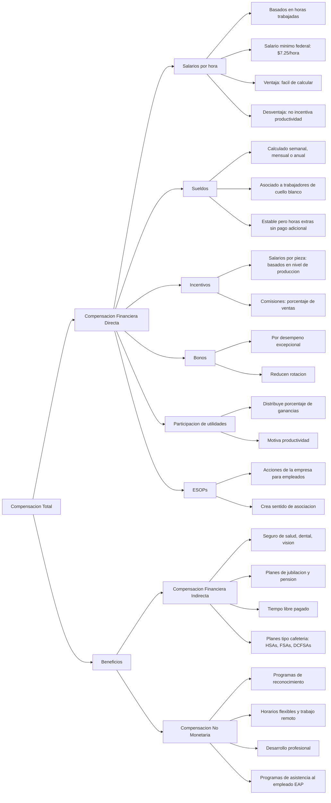
```mermaid
graph LR
    A[Compensacion Total] --> B[Compensacion Financiera Directa]
    A --> C[Beneficios]
    
    B --> B1[Salarios por hora]
    B --> B2[Sueldos]
    B --> B3[Incentivos]
    B --> B4[Bonos]
    B --> B5[Participacion de utilidades]
    B --> B6[ESOPs]
    
    B1 --> B1a[Basados en horas trabajadas]
    B1 --> B1b[Salario minimo federal: $7.25/hora]
    B1 --> B1c[Ventaja: facil de calcular]
    B1 --> B1d[Desventaja: no incentiva productividad]
    
    B3 --> B3a[Salarios por pieza: basados en nivel de produccion]
    B3 --> B3b[Comisiones: porcentaje de ventas]
    
    B2 --> B2a[Calculado semanal, mensual o anual]
    B2 --> B2b[Asociado a trabajadores de cuello blanco]
    B2 --> B2c[Estable pero horas extras sin pago adicional]
    
    B4 --> B4a[Por desempeno excepcional]
    B4 --> B4b[Reducen rotacion]
    
    B5 --> B5a[Distribuye porcentaje de ganancias]
    B5 --> B5b[Motiva productividad]
    
    B6 --> B6a[Acciones de la empresa para empleados]
    B6 --> B6b[Crea sentido de asociacion]
    
    C --> C1[Compensacion Financiera Indirecta]
    C --> C2[Compensacion No Monetaria]
    
    C1 --> C1a[Seguro de salud, dental, vision]
    C1 --> C1b[Planes de jubilacion y pension]
    C1 --> C1c[Tiempo libre pagado]
    C1 --> C1d[Planes tipo cafeteria: HSAs, FSAs, DCFSAs]
    
    C2 --> C2a[Programas de reconocimiento]
    C2 --> C2b[Horarios flexibles y trabajo remoto]
    C2 --> C2c[Desarrollo profesional]
    C2 --> C2d[Programas de asistencia al empleado EAP]
```

### Preguntas y Respuestas de Repaso

**1. ¿Qué son los beneficios (benefits) en el contexto de la compensación?**
Los beneficios son la parte de la compensación proporcionada a los empleados que no es parte del salario. Incluye compensación financiera indirecta (planes de jubilación, seguros, días pagados) y beneficios no monetarios (reconocimiento, horarios flexibles, desarrollo profesional).

**2. ¿Qué es la compensación financiera indirecta o beneficios marginales (fringe benefits)?**
Es la compensación no monetaria que tiene valor financiero, como licencia por enfermedad, pago de vacaciones, planes de pensiones y seguro de salud.

**3. ¿Qué requisito tienen las empresas con 50 o más empleados de tiempo completo respecto al seguro de salud?**
Están obligadas a ofrecer cobertura de seguro de salud asequible a los empleados de tiempo completo que cumplan ciertos estándares.

**4. ¿Qué beneficios ofrece Starbucks a sus empleados?**
Starbucks ofrece seguro de salud a empleados de tiempo parcial elegibles, planes de jubilación, tiempo libre pagado, licencia parental, asistencia educativa y beneficios para viajeros.

**5. ¿Qué son los planes de beneficios tipo cafetería (cafeteria benefit plans)?**
Son planes que permiten a los empleados seleccionar los beneficios específicos que se ajustan a sus necesidades sobre una base antes de impuestos, resultando en que los empleados pagan menos impuestos.

**6. ¿Qué ejemplos de beneficios flexibles se mencionan?**
Cuentas de ahorro de salud (HSAs), cuentas de gastos flexibles para cuidado de dependientes (DCFSAs) y cuentas de gastos flexibles (FSAs).

**7. ¿Qué es la compensación no monetaria (non-monetary compensation)?**
También llamada beneficios blandos o ventajas (soft benefits o perks), incluye beneficios no financieros como programas de reconocimiento, horarios flexibles, trabajo remoto, desarrollo profesional, comida gratis o salas de recreación.

**8. ¿Qué es un programa de asistencia al empleado (EAP)?**
Es un beneficio blando que ayuda a los empleados con problemas personales que podrían perjudicar su desempeño laboral, ofreciendo servicios como tratamiento para drogas y alcohol, manejo de estrés, asesoramiento financiero y familiar.

**9. ¿Qué porcentaje de trabajadores civiles tienen acceso a programas EAP según la Bureau of Labor Statistics?**
Más de la mitad de todos los trabajadores civiles tienen acceso a programas EAP.

**10. ¿Cómo ayudan los EAP a las empresas?**
Ayudan a reducir los costos asociados con la baja productividad, el ausentismo y otros problemas laborales al ayudar a los empleados a lidiar con problemas personales que contribuyen a estos problemas.

<h1 id="317813" style="color:#E65100;">
  <a href="#Chapter_10._Managing_Human_Resources" style="color:inherit; text-decoration:none;">
    LO 10-7 MANAGING UNIONIZED EMPLOYEES
  </a>
</h1>

Evaluate some of the issues associated with unionized employees, including collective bargaining and dispute resolution.

Los empleados que están descontentos con sus condiciones de trabajo o compensación tienen que negociar con la gerencia para lograr cambios. Tratar con la gerencia de forma individual no siempre es efectivo, por lo que los empleados pueden organizarse en sindicatos laborales (labor unions) para tratar con los empleadores y lograr mejores pagos, horas y condiciones de trabajo. Los empleados organizados están respaldados por el poder de un grupo grande que puede contratar especialistas para representar a todo el sindicato en sus tratos con la gerencia. Los trabajadores sindicalizados ganan significativamente más que los empleados no sindicalizados. Estados Unidos tiene aproximadamente el 10.1 por ciento de los trabajadores asalariados que son miembros de sindicatos. En promedio, las ganancias semanales totales medianas de los trabajadores sindicalizados de tiempo completo son aproximadamente $200 más que sus contrapartes no sindicalizadas.

Sin embargo, el crecimiento de los sindicatos se ha desacelerado en los últimos años, y las perspectivas de crecimiento no se ven bien. Una razón es que la mayoría de los trabajadores de cuello azul (blue-collar workers), los miembros tradicionales de los sindicatos, ya han sido organizados. Las fábricas se han vuelto más automatizadas y necesitan menos trabajadores de cuello azul. Estados Unidos se ha desplazado de una economía manufacturera a una economía de servicios, reduciendo aún más la demanda de trabajadores de cuello azul. Además, en respuesta a la competencia extranjera, las empresas estadounidenses están buscando formas de volverse más productivas y eficientes en costos. Los programas de enriquecimiento laboral y la gestión participativa han desdibujado la línea entre la gerencia y los trabajadores. Debido a que la opinión de los trabajadores sobre cómo se gestionan las plantas está aumentando, su necesidad de protección sindical está disminuyendo. Muchos trabajadores no ven los beneficios de la membresía sindical si no tienen quejas o agravios contra sus empleadores.

No obstante, los sindicatos laborales han tenido éxito en organizar trabajadores de cuello azul en manufactura, gobierno y atención médica, así como porcentajes más pequeños de empleados en otras industrias. En consecuencia, aspectos significativos de la gestión de recursos humanos, particularmente la compensación, están dictados en gran medida por contratos sindicales en muchas empresas. Por lo tanto, examinaremos brevemente la negociación colectiva y la resolución de disputas en esta sección.

### Collective Bargaining

La negociación colectiva (collective bargaining) es el proceso de negociación a través del cual la gerencia y los sindicatos llegan a un acuerdo sobre compensación, horas de trabajo y condiciones laborales para la unidad de negociación (bargaining unit). El objetivo de la negociación es llegar a un acuerdo sobre un contrato laboral (labor contract), el documento formal y escrito que detalla la relación entre el sindicato y la gerencia por un período específico de tiempo, generalmente dos o tres años. Por ejemplo, GitLab, una empresa de software de gestión de proyectos, firmó un acuerdo de negociación colectiva de 11 meses con empleados sindicalizados que detallaba planes de indemnización y recontratación para empleados que fueron despedidos. Según el sindicato, fue el primer acuerdo de negociación colectiva firmado por ingenieros de software en la industria tecnológica.

**FIGURA 10.1 - El Proceso de Negociación Colectiva**

**FIGURA 10.1** El Proceso de Negociación Colectiva

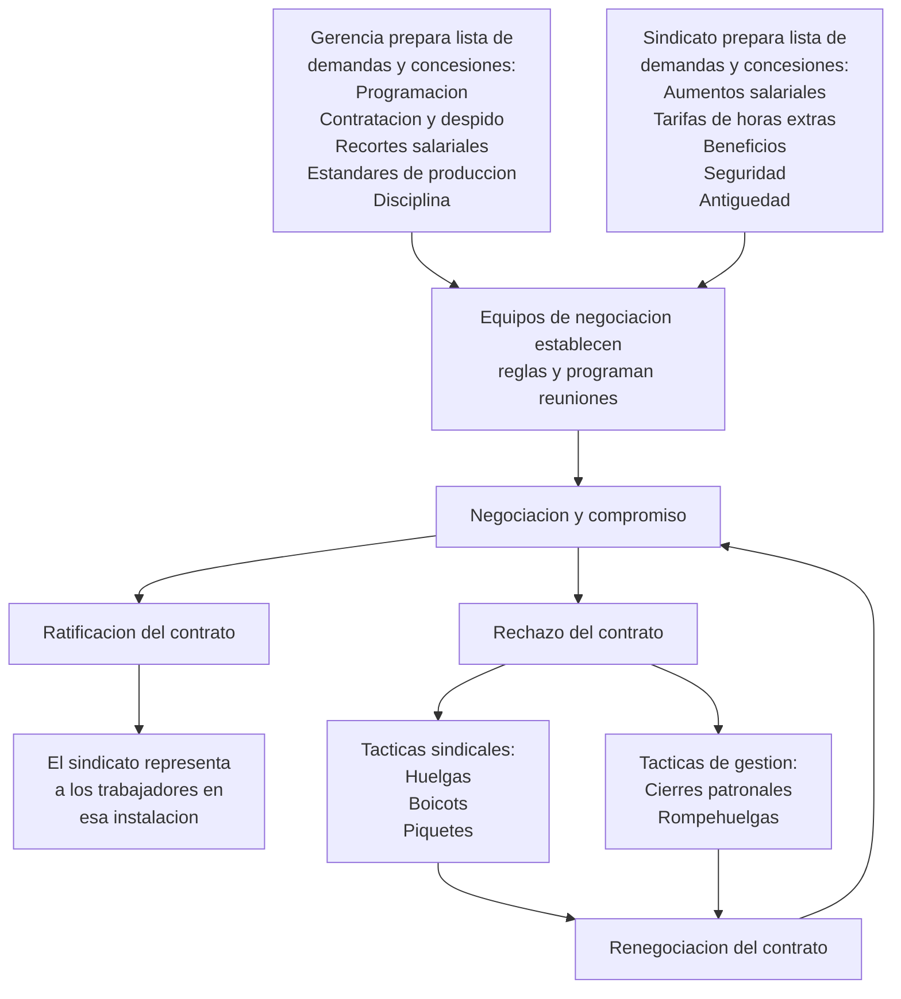
```mermaid
graph TD
    A[Gerencia prepara lista de
demandas y concesiones:
Programacion
Contratacion y despido
Recortes salariales
Estandares de produccion
Disciplina] --> C[Equipos de negociacion establecen
reglas y programan reuniones]
    B[Sindicato prepara lista de
demandas y concesiones:
Aumentos salariales
Tarifas de horas extras
Beneficios
Seguridad
Antiguedad] --> C
    
    C --> D[Negociacion y compromiso]
    
    D --> E[Ratificacion del contrato]
    
    D --> F[Rechazo del contrato]
    E --> G[El sindicato representa
a los trabajadores en
esa instalacion]
    
    H --> D
    
    F --> I[Tacticas sindicales:
Huelgas
Boicots
Piquetes] --> H
    
    F --> J[Tacticas de gestion:
Cierres patronales
Rompehuelgas]
    J --> H[Renegociacion del contrato]
```

En la negociación colectiva, cada lado intenta negociar un acuerdo que cumpla con sus demandas; el compromiso es frecuentemente necesario. La gerencia intenta negociar un contrato laboral que le permita a la empresa mantener el control sobre cosas como horarios de trabajo, contratación y despido de trabajadores, estándares de producción, procedimientos, transferencias y separaciones, el ámbito de gestión en cada departamento y la disciplina. Los sindicatos tienden a centrarse en temas del contrato como niveles salariales, mejores tasas de pago por horas extras, días festivos, turnos indeseables, programación de aumentos salariales y beneficios. Estos temas se detallarán en el contrato laboral, que los miembros del sindicato votarán para aceptar (y cumplir) o rechazar.

Muchos contratos laborales contienen una cláusula de ajuste por costo de vida (COLA clause), que requiere aumentos salariales automáticos durante períodos de inflación para proteger el ingreso "real" de los empleados. Durante tiempos económicos difíciles, los sindicatos pueden verse obligados a aceptar concesiones (givebacks), que son concesiones salariales y de beneficios hechas a los empleadores para permitirles seguir siendo competitivos o, en algunos casos, para sobrevivir y continuar proporcionando empleos para los trabajadores sindicalizados.

### Resolving Disputes

A veces, la gerencia y el sindicato simplemente no pueden ponerse de acuerdo sobre un contrato. La mayoría de las disputas laborales se manejan a través de la negociación colectiva o a través de procedimientos de quejas (grievance procedures). Sin embargo, cuando estos procesos fallan, cualquiera de las partes puede recurrir a medidas más drásticas para lograr sus objetivos.

#### Labor Tactics (Tácticas Sindicales)

**Piquetes (Picketing)** es una protesta pública contra las prácticas de gestión y implica que los miembros del sindicato marchen (a menudo ondeando carteles y pancartas anti-gerencia) en la planta o lugar de trabajo del empleador. Los trabajadores en piquete esperan que sus carteles generen simpatía por sus demandas por parte del público y de otros sindicatos. El piquete puede ocurrir como una protesta o en conjunto con una huelga.

**Huelgas (Strikes o employee walkouts)** son una de las armas más efectivas que tiene el trabajo. Al hacer huelga, un sindicato dificulta, en el mejor de los casos, o imposibilita, en el peor, la realización de las operaciones normales de un negocio. Las huelgas reciben amplia publicidad, pero siguen siendo un arma de último recurso. Sin embargo, en casos extremos, los trabajadores pueden organizar una huelga con la ayuda de sindicatos y coaliciones. Los empleados de McDonald's en St. Louis se declararon en huelga en 2020 en medio de la pandemia de COVID-19 por condiciones de trabajo inseguras, horas recortadas y recortes salariales. Si bien generalmente es cierto que la mera amenaza de una huelga es suficiente para hacer que la gerencia retroceda, hay momentos en que los temas se debaten acaloradamente y las agencias reguladoras se involucran.

**Boicot (Boycott)** es un intento de evitar que las personas compren el producto de una empresa. En un boicot, se pide a los miembros del sindicato que no hagan negocios con la organización boicoteada. Algunos sindicatos pueden incluso imponer multas a los miembros que ignoran el boicot. Para obtener más apoyo para sus objetivos, un sindicato involucrado en un boicot también puede pedir al público (a través de piquetes y publicidad) que no compre los productos de la empresa en huelga.

#### Management Tactics (Tácticas de Gestión)

La versión de gestión de una huelga es el **cierre patronal (lockout)** . La gerencia realmente cierra el lugar de trabajo para que los empleados no puedan ir a trabajar. Los cierres patronales se utilizan, como regla general, solo cuando una huelga sindical ha cerrado parcialmente una planta y parece más económico cerrar la planta por completo. Después de un cierre patronal de 10 meses, los miembros del sindicato pudieron regresar al trabajo en la refinería de ExxonMobil en Beaumont después de aceptar un nuevo contrato. Exxon excluyó a los trabajadores en medio de una disputa salarial y utilizó trabajadores temporales para operar la refinería.

**Rompehuelgas (Strikebreakers)** , a veces llamados "esquiroles" (scabs) por los miembros del sindicato en huelga, son personas contratadas por la gerencia para reemplazar a los empleados en huelga. Los gerentes contratan rompehuelgas para continuar las operaciones y reducir las pérdidas asociadas con las huelgas, y para mostrarle al sindicato que no se someterán a sus demandas. El rompehuelgas es generalmente una medida de último recurso para la gerencia porque causa un gran daño a la relación entre la gerencia y el trabajo.

#### Outside Resolution (Resolución Externa)

La gerencia y los miembros del sindicato normalmente alcanzan decisiones mutuamente aceptables sin asistencia externa. Sin embargo, a veces, incluso después de largas negociaciones, huelgas, cierres patronales y otras tácticas, la gerencia y el trabajo aún no pueden resolver una disputa contractual. En tales casos, tienen tres opciones: conciliación, mediación y arbitraje.

**Conciliación (Conciliation)** introduce a un tercero neutral para mantener a trabajo y gerencia hablando. El conciliador no tiene poder formal sobre los representantes sindicales ni sobre la gerencia. El objetivo del conciliador es hacer que ambas partes se centren en los problemas y evitar que las negociaciones se rompan.

**Mediación (Mediation)** , al igual que la conciliación, implica la introducción de un tercero neutral, pero el papel del mediador es sugerir o proponer una solución al problema.

**Arbitraje (Arbitration)** , se introduce a un tercero neutral para resolver la disputa, pero la solución del árbitro es legalmente vinculante y ejecutable. Generalmente, el arbitraje tiene lugar de forma voluntaria (gerencia y trabajo deben aceptarlo), y generalmente dividen el costo (honorarios y gastos del árbitro) entre ellos. Ocasionalmente, la gerencia o el trabajo se someten a arbitraje obligatorio (compulsory arbitration), en el que una parte externa (generalmente el gobierno federal) solicita el arbitraje como un medio para eliminar una huelga prolongada que amenaza con interrumpir la economía.

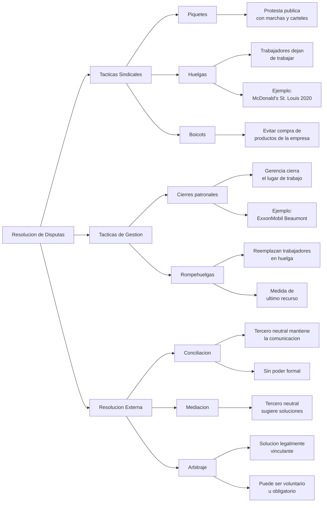
```mermaid
graph LR
    A[Resolucion de Disputas] --> B[Tacticas Sindicales]
    A --> C[Tacticas de Gestion]
    A --> D[Resolucion Externa]
    
    B --> B1[Piquetes]
    B --> B2[Huelgas]
    B --> B3[Boicots]
    
    B1 --> B1a["Protesta publica<br>con marchas y carteles"]
    B2 --> B2a["Trabajadores dejan<br>de trabajar"]
    B2 --> B2b["Ejemplo:<br>McDonald's St. Louis 2020"]
    B3 --> B3a["Evitar compra de<br>productos de la empresa"]
    
    C --> C1[Cierres patronales]
    C --> C2[Rompehuelgas]
    
    C1 --> C1a["Gerencia cierra<br>el lugar de trabajo"]
    C1 --> C1b["Ejemplo:<br>ExxonMobil Beaumont"]
    C2 --> C2a["Reemplazan trabajadores<br>en huelga"]
    C2 --> C2b["Medida de<br>ultimo recurso"]
    
    D --> D1[Conciliacion]
    D --> D2[Mediacion]
    D --> D3[Arbitraje]
    
    D1 --> D1a["Tercero neutral mantiene<br>la comunicacion"]
    D1 --> D1b["Sin poder formal"]
    D2 --> D2a["Tercero neutral<br>sugiere soluciones"]
    D3 --> D3a["Solucion legalmente<br>vinculante"]
    D3 --> D3b["Puede ser voluntario<br>u obligatorio"]
```

### Preguntas y Respuestas de Repaso

**1. ¿Por qué los empleados se organizan en sindicatos laborales?**
Los empleados se organizan en sindicatos porque tratar con la gerencia de forma individual no siempre es efectivo. Los sindicatos les permiten negociar colectivamente para lograr mejores pagos, horas y condiciones de trabajo, respaldados por el poder de un grupo grande que puede contratar especialistas para representarlos.

**2. ¿Qué porcentaje de trabajadores asalariados en EE.UU. son miembros de sindicatos y cuál es la diferencia salarial promedio?**
Aproximadamente el 10.1 por ciento de los trabajadores asalariados son miembros de sindicatos. En promedio, los trabajadores sindicalizados ganan aproximadamente $200 más por semana que sus contrapartes no sindicalizadas.

**3. ¿Por qué ha disminuido el crecimiento de los sindicatos?**
Las razones incluyen: la mayoría de los trabajadores de cuello azul ya están organizados, las fábricas se han automatizado reduciendo la necesidad de trabajadores de cuello azul, el cambio de una economía manufacturera a una de servicios, y los programas de enriquecimiento laboral y gestión participativa han reducido la necesidad de protección sindical.

**4. ¿Qué es la negociación colectiva (collective bargaining)?**
Es el proceso de negociación a través del cual la gerencia y los sindicatos llegan a un acuerdo sobre compensación, horas de trabajo y condiciones laborales para la unidad de negociación, resultando en un contrato laboral formal por un período específico (generalmente dos o tres años).

**5. ¿Qué es una cláusula COLA en un contrato laboral?**
COLA significa "Cost of Living Adjustment". Es una cláusula de ajuste por costo de vida que requiere aumentos salariales automáticos durante períodos de inflación para proteger el ingreso "real" de los empleados.

**6. ¿Qué son las concesiones (givebacks) en la negociación colectiva?**
Son concesiones salariales y de beneficios que los sindicatos pueden verse obligados a aceptar durante tiempos económicos difíciles para permitir que los empleadores sigan siendo competitivos o sobrevivan y continúen proporcionando empleos.

**7. ¿Cuáles son las principales tácticas sindicales en una disputa laboral?**
Las principales tácticas sindicales son: piquetes (protesta pública con marchas y carteles), huelgas (trabajadores dejan de trabajar) y boicots (evitar la compra de productos de la empresa).

**8. ¿Cuáles son las principales tácticas de gestión en una disputa laboral?**
Las principales tácticas de gestión son: cierres patronales (lockouts - la gerencia cierra el lugar de trabajo) y rompehuelgas (strikebreakers - contratar reemplazos para trabajadores en huelga).

**9. ¿Cuál es la diferencia entre conciliación, mediación y arbitraje?**
- Conciliación: un tercero neutral mantiene a las partes comunicándose, sin poder formal.
- Mediación: un tercero neutral sugiere o propone soluciones al problema.
- Arbitraje: un tercero neutral impone una solución que es legalmente vinculante y ejecutable.

**10. ¿Qué es el arbitraje obligatorio (compulsory arbitration)?**
Es cuando una parte externa (generalmente el gobierno federal) solicita el arbitraje como un medio para eliminar una huelga prolongada que amenaza con interrumpir la economía. La solución del árbitro es vinculante.

<h1 id="937727" style="color:#E65100;">
  <a href="#Chapter_10._Managing_Human_Resources" style="color:inherit; text-decoration:none;">
    LO 10-8 THE IMPORTANCE OF WORKFORCE DIVERSITY, EQUITY, AND INCLUSION
  </a>
</h1>

Describe the importance of diversity, equity, and inclusion in the workforce.

Clientes, empleados, proveedores (todos los participantes en el mundo de los negocios) vienen en diferentes edades, géneros, razas, etnias, nacionalidades y habilidades, una verdad que la sociedad ha etiquetado como **diversidad**. Entender esta diversidad significa reconocer y aceptar diferencias, así como valorar las perspectivas únicas que tales diferencias pueden traer al lugar de trabajo.

Ya no es suficiente, sin embargo, que las organizaciones tengan un equipo de talento diverso. Los individuos deben tener igual acceso a oportunidades y sentir un sentido de pertenencia, independientemente de sus diferencias. **Equidad (equity)** se refiere a proporcionar igualdad de oportunidades y trato justo para todos los empleados. Muchos individuos no han recibido igualdad de educación, empleo y oportunidades de avance debido a factores como raza, género, religión, orientación sexual, etnicidad, nacionalidad, estatus socioeconómico, lenguaje, habilidades, edad o creencia política. Las empresas pueden proporcionar oportunidades especiales para estos individuos para mejorar su posición en la sociedad. **Inclusión (inclusion)** es el grado en que los individuos diversos son valorados y bienvenidos por la organización. Los empleadores deben abrazar la diversidad, ofrecer igualdad de oportunidades y celebrar las diferencias de los empleados.

### The Characteristics of Diversity

Cuando los gerentes hablan de fuerzas laborales diversas, típicamente se refieren a diferencias en género, habilidad, edad y raza. Si bien estas son características importantes de la diversidad, otras también son importantes. Podemos dividir estas diferencias en **características primarias** y **secundarias** de la diversidad.

En la parte inferior de la Figura 10.2, edad, género, raza, etnicidad, orientación sexual y habilidades representan características primarias de la diversidad. En la parte superior de la Figura 10.2 se encuentran las características secundarias de la diversidad: educación, experiencia laboral, ingresos, estado civil, estado parental, experiencia militar, creencias religiosas, ubicación geográfica. Adquirimos, cambiamos y descartamos estas características a medida que progresamos a lo largo de nuestras vidas.

**FIGURA 10.2 - Characteristics of Diversity**

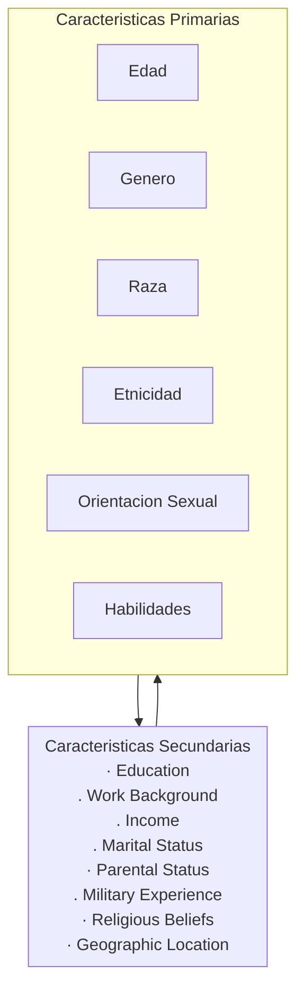
```mermaid
graph TD
    subgraph A[Caracteristicas Secundarias
    · Education
. Work Background
. Income
. Marital Status
· Parental Status
. Military Experience
· Religious Beliefs
· Geographic Location
    ]

    end
    B --> A
    subgraph B[Caracteristicas Primarias]
        direction LR
        B1[Edad]
        B2[Genero]
        B3[Raza]
        C1[Etnicidad]
        C2[Orientacion Sexual]
        C3[Habilidades]
    end
    
    A --> B
```

Definir las características de la diversidad como primarias o secundarias mejora nuestra comprensión, pero debemos recordar que cada persona está definida por la interrelación de todas las características. Al tratar con diversidad, equidad e inclusión en el lugar de trabajo, los gerentes deben considerar a la persona completa, no una o unas pocas de las diferencias de una persona.

### Why Are Diversity, Equity, and Inclusion Important?

La fuerza laboral de EE.UU. es cada vez más diversa. Una vez dominada por hombres blancos, la fuerza laboral de hoy incluye significativamente más mujeres, negros, hispanos y otros grupos históricamente subrepresentados, así como empleados con discapacidades y trabajadores mayores. La Oficina del Censo predice que para 2044, los grupos raciales y étnicos subrepresentados serán la mayoría en los Estados Unidos. Por primera vez, más de la mitad de la población menor de 16 años se identifica como una minoría racial o étnica. Estos grupos han enfrentado tradicionalmente discriminación y mayores tasas de desempleo y se les han negado oportunidades para asumir roles de liderazgo en la América corporativa. En consecuencia, cada vez más empresas están tratando de mejorar los programas de gestión de recursos humanos para reclutar, desarrollar y retener empleados más diversos para servir mejor a sus diversos clientes.

Algunas empresas están fomentando un entorno de trabajo más inclusivo al proporcionar programas especiales como grupos de afinidad patrocinados, programas de mentoría y oportunidades especiales de desarrollo profesional. La startup de Silicon Valley Social Capital y su CEO Chamath Palihapitiya se han enfocado en invertir y nutrir más startups en algunas de las industrias más controvertidas como educación y atención médica porque son importantes y típicamente están en desventaja por el riesgo percibido. Su programa, Capital-as-a-Service (CAAS), automatiza las decisiones tempranas de inversión y así elimina el sesgo contra startups no convencionales. CAAS recibió 30,000 solicitudes de startups e invirtió en 30, con la mitad de los CEOs financiados siendo no blancos y el 40 por ciento mujeres.

**TABLA 10.5 - Top 10 Companies for Diversity**

1. Accenture
2. Mastercard
3. Abbott
4. Toyota Motor North America
5. Eli Lilly and Company
6. The Hershey Company
7. Comcast NBCUniversal
8. TIAA
9. Humana
10. Medtronic

### The Benefits of Diversity, Equity, and Inclusion

Hay una serie de beneficios al fomentar y valorar la diversidad, equidad e inclusión en la fuerza laboral, incluyendo los siguientes:

1. Uso más productivo de los recursos humanos de una empresa.
2. Reducción del conflicto entre empleados de diferentes etnias, razas, religiones y orientaciones sexuales a medida que aprenden a respetar las diferencias de los demás.
3. Relaciones de trabajo más productivas entre empleados diversos a medida que aprenden más sobre los demás y se aceptan mutuamente.
4. Mayor compromiso y compartir de los objetivos organizacionales entre empleados diversos en todos los niveles organizacionales.
5. Mayor innovación y creatividad a medida que los empleados diversos aportan perspectivas nuevas y únicas a las tareas de toma de decisiones y resolución de problemas.
6. Mayor capacidad para servir las necesidades de una base de clientes cada vez más diversa.
7. Mayor inclusión, que reconoce las contribuciones, presencia y perspectivas de diferentes grupos, integrándolos en el entorno laboral.

Las empresas que no valoran a sus empleados diversos ofreciendo igualdad de oportunidades y creando un entorno inclusivo son propensas a experimentar mayores conflictos, así como prejuicios y discriminación. Entre empleados individuales, por ejemplo, insultos y gestos raciales, comentarios sexuales y otros comportamientos por parte de compañeros de trabajo dañan a los individuos hacia quienes se dirige tal comportamiento. Este comportamiento nunca debe ser tolerado. Los destinatarios de tal comportamiento pueden sentirse heridos, deprimidos o incluso amenazados y pueden experimentar una baja autoestima, todo lo cual daña su productividad y moral. En tales casos, los empleados que han enfrentado prejuicios y discriminación pueden simplemente dejar la empresa, llevando a la pérdida de tiempo, dinero y otros recursos gastados en contratarlos y capacitarlos. Cuando la discriminación proviene de un supervisor, los empleados también pueden temer por sus trabajos. Una atmósfera discriminatoria no solo puede dañar la productividad y aumentar la rotación, sino que también puede someter a una empresa a costosas demandas y publicidad negativa. No practicar la inclusión y proporcionar igualdad de oportunidades a todos los empleados es siempre inaceptable.

### Affirmative Action

Muchas empresas se esfuerzan por mejorar su entorno laboral a través de programas de **acción afirmativa (affirmative action)** , planes legalmente mandatados que intentan aumentar las oportunidades laborales para grupos subrepresentados analizando el grupo actual de trabajadores, identificando áreas donde ciertos grupos están subrepresentados, y estableciendo metas específicas de contratación y promoción, junto con fechas objetivo para cumplir esas metas, para resolver la discrepancia. La acción afirmativa comenzó en 1965 cuando Lyndon B. Johnson emitió la primera de una serie de directivas presidenciales. Fue diseñada para compensar la discriminación pasada y presente, superar los prejuicios en el lugar de trabajo y proporcionar igualdad de oportunidades de empleo para negros y blancos. Desde entonces, los grupos históricamente subrepresentados han logrado avances sólidos. California aprobó un proyecto de ley que requiere que las empresas públicas en el estado tengan al menos una mujer en la junta directiva.

Los críticos de la acción afirmativa argumentan que limita su capacidad para contratar a los mejores empleados, independientemente de su origen o identidad. Adicionalmente, los opositores sugieren que la acción afirmativa da trato preferencial a ciertos grupos. Sin embargo, otros argumentan que esta queja podría tener sus raíces en el racismo o prejuicio en lugar de quejas legítimas por parte de los grupos mayoritarios. Debido a la complejidad y sensibilidad de estos temas, la acción afirmativa se ha convertido en un tema políticamente divisivo. Los disturbios sociales recientes han puesto más énfasis en crear planes y compromisos para contratar y apoyar a grupos subrepresentados. Los gerentes deben asegurarse de que no haya discriminación en ninguna de las operaciones de la empresa. Esto incluye promociones y posiciones de alta dirección.

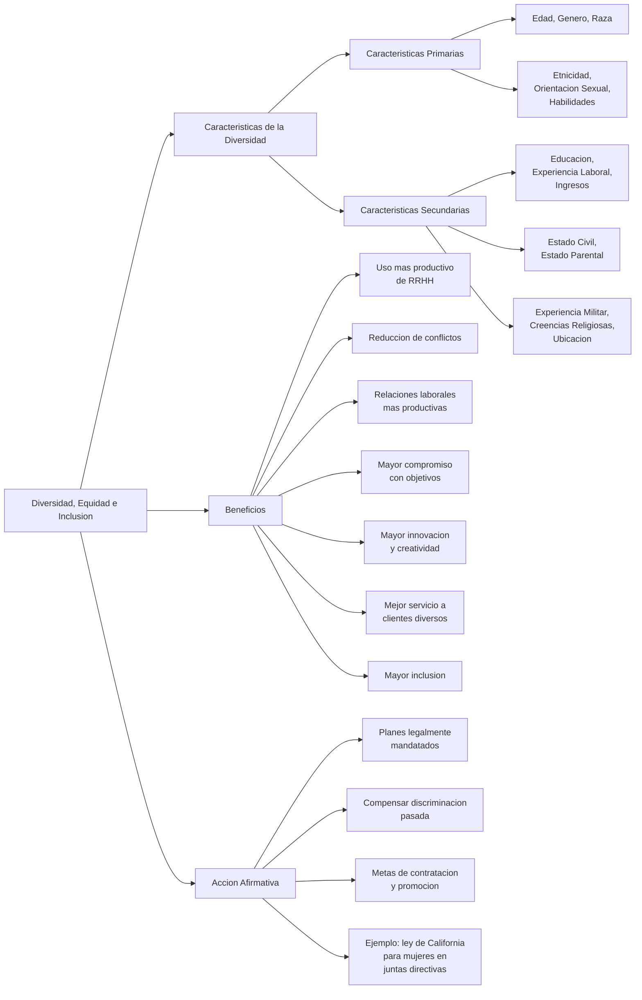
```mermaid
graph LR
    A[Diversidad, Equidad e Inclusion] --> B[Caracteristicas de la Diversidad]
    A --> C[Beneficios]
    A --> D[Accion Afirmativa]
    
    B --> B1[Caracteristicas Primarias]
    B --> B2[Caracteristicas Secundarias]
    
    B1 --> B1a["Edad, Genero, Raza"]
    B1 --> B1b["Etnicidad,<br>Orientacion Sexual,<br>Habilidades"]
    
    B2 --> B2a["Educacion,<br>Experiencia Laboral,<br>Ingresos"]
    B2 --> B2b["Estado Civil,<br>Estado Parental"]
    B2 --> B2c["Experiencia Militar,<br>Creencias Religiosas,<br>Ubicacion"]
    
    C --> C1["Uso mas productivo<br>de RRHH"]
    C --> C2["Reduccion de conflictos"]
    C --> C3["Relaciones laborales<br>mas productivas"]
    C --> C4["Mayor compromiso<br>con objetivos"]
    C --> C5["Mayor innovacion<br>y creatividad"]
    C --> C6["Mejor servicio a<br>clientes diversos"]
    C --> C7["Mayor inclusion"]
    
    D --> D1["Planes legalmente<br>mandatados"]
    D --> D2["Compensar discriminacion<br>pasada"]
    D --> D3["Metas de contratacion<br>y promocion"]
    D --> D4["Ejemplo: ley de California<br>para mujeres en<br>juntas directivas"]
```

### Preguntas y Respuestas de Repaso

**1. ¿Qué significan diversidad, equidad e inclusión en el contexto laboral?**
- **Diversidad**: reconocer y aceptar diferencias en edad, género, raza, etnia, nacionalidad y habilidades, valorando las perspectivas únicas que aportan.
- **Equidad**: proporcionar igualdad de oportunidades y trato justo para todos los empleados.
- **Inclusión**: el grado en que los individuos diversos son valorados y bienvenidos por la organización.

**2. ¿Cuáles son las características primarias y secundarias de la diversidad?**
- **Primarias**: edad, género, raza, etnicidad, orientación sexual y habilidades.
- **Secundarias**: educación, experiencia laboral, ingresos, estado civil, estado parental, experiencia militar, creencias religiosas, ubicación geográfica.

**3. ¿Por qué es importante la diversidad en la fuerza laboral actual?**
Porque la fuerza laboral de EE.UU. es cada vez más diversa. Para 2044, los grupos raciales y étnicos subrepresentados serán la mayoría. Las empresas necesitan diversidad para servir mejor a sus diversos clientes y mejorar sus programas de RRHH para reclutar, desarrollar y retener talento diverso.

**4. Mencione tres beneficios de fomentar la diversidad, equidad e inclusión.**
Tres beneficios son: (1) uso más productivo de los recursos humanos, (2) reducción del conflicto entre empleados de diferentes orígenes, (3) mayor innovación y creatividad al aportar perspectivas únicas a la toma de decisiones.

**5. ¿Qué es la acción afirmativa (affirmative action)?**
Son planes legalmente mandatados que intentan aumentar las oportunidades laborales para grupos subrepresentados, analizando el grupo actual de trabajadores, identificando áreas de subrepresentación y estableciendo metas específicas de contratación y promoción con fechas objetivo.

**6. ¿Cuándo comenzó la acción afirmativa y quién la inició?**
Comenzó en 1965 cuando Lyndon B. Johnson emitió la primera de una serie de directivas presidenciales.

**7. ¿Qué ejemplo de legislación sobre diversidad se menciona en el texto?**
California aprobó un proyecto de ley que requiere que las empresas públicas en el estado tengan al menos una mujer en la junta directiva.

**8. ¿Qué consecuencias puede enfrentar una empresa que no valora la diversidad?**
Puede experimentar mayores conflictos, prejuicios y discriminación, pérdida de empleados por rotación, costosas demandas y publicidad negativa.

**9. ¿Qué programa implementó Social Capital para eliminar el sesgo en inversiones?**
Su programa Capital-as-a-Service (CAAS), que automatiza las decisiones tempranas de inversión y elimina el sesgo contra startups no convencionales.

**10. ¿Cuáles son las empresas líderes en diversidad según la Tabla 10.5?**
Las principales incluyen Accenture, Mastercard, AbbVie, Toyota Motor North America, Eli Lilly and Company, The Hershey Company, Comcast NBCUniversal, Humana y Medtronic.

## ESTEE LAUDER MAKES OVER DIVERSITY AND INCLUSION

Estee Lauder, una de las compañías más grandes de la industria cosmética, anunció planes extensivos para abrazar la diversidad y la inclusión después de enfrentar reacciones adversas. Estee Lauder, que posee más de 25 marcas de belleza de prestigio, tiene una influencia significativa en la industria de la belleza. La compañía tiene más de 60,000 empleados en todo el mundo.

Para fomentar un entorno más diverso e inclusivo, Estee Lauder se comprometió a contratar más empleados negros, duplicar el reclutamiento diverso, garantizar el acceso equitativo a la capacitación de liderazgo, requerir conjuntos más diversos de candidatos para puestos de nivel ejecutivo y director, y comprar más productos de empresas propiedad de negros. Dentro de un año de sus compromisos, la compañía aumentó la contratación de candidatos negros en un 18.8 por ciento en los Estados Unidos. Estee Lauder estableció planes para aumentar el reclutamiento diverso y garantizar el acceso equitativo a la capacitación de liderazgo. La compañía aumentó la capacitación sobre sesgos inconscientes en los Estados Unidos para alcanzar al 94 por ciento de los empleados corporativos, al 100 por ciento de los empleados de la cadena de suministro y al 90 por ciento de los empleados de puntos de venta.

El colorismo (colorism) se puede ver en términos como "aclaramiento", "blanqueamiento" y "abrillantamiento", que son términos comunes en cosméticos y cuidado de la piel. Su uso implica que la piel más clara es preferida y, por lo tanto, más hermosa. Estee Lauder dijo que evaluaría sus líneas de cuidado de la piel y maquillaje para determinar su sensibilidad cultural y referencias al aclaramiento y abrillantamiento de la piel. Además, la compañía dijo que ampliaría las gamas de tonos para una variedad de productos para acomodar más tonos de piel. Por ejemplo, MAC Cosmetics aumentó su gama para incluir más de 200 tonos.

Una nueva división, el Centro de Excelencia en Equidad y Participación (Equity and Engagement Center of Excellence), fue lanzada para supervisar y gestionar el éxito de sus compromisos. El Centro organiza sesiones de escucha para empleados para fomentar la inclusión. La creación de esta división significó la dedicación de Estee Lauder para impulsar un cambio duradero no solo en la compañía sino en toda la industria de la belleza.

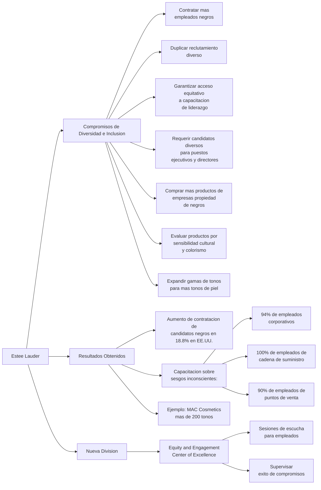
```mermaid
graph LR
    A[Estee Lauder] --> B[Compromisos de Diversidad e Inclusion]
    A --> C[Resultados Obtenidos]
    A --> D[Nueva Division]
    
    B --> B1["Contratar mas <br>empleados negros"]
    B --> B2["Duplicar reclutamiento<br> diverso"]
    B --> B3["Garantizar acceso equitativo<br>a capacitacion<br> de liderazgo"]
    B --> B4["Requerir candidatos diversos<br>para puestos<br> ejecutivos y directores"]
    B --> B5["Comprar mas productos de<br>empresas propiedad<br> de negros"]
    B --> B6["Evaluar productos por<br>sensibilidad cultural<br> y colorismo"]
    B --> B7["Expandir gamas de tonos<br>para mas tonos de piel"]
    
    C --> C1["Aumento de contratacion de<br>candidatos negros en 18.8% en EE.UU."]
    C --> C2["Capacitacion sobre<br>sesgos inconscientes:"]
    C2 --> C2a["94% de empleados<br> corporativos"]
    C2 --> C2b["100% de empleados de<br>cadena de suministro"]
    C2 --> C2c["90% de empleados de<br>puntos de venta"]
    C --> C3["Ejemplo: MAC Cosmetics<br>mas de 200 tonos"]
    
    D --> D1["Equity and Engagement<br>Center of Excellence"]
    D1 --> D2["Sesiones de escucha<br>para empleados"]
    D1 --> D3["Supervisar<br> exito de compromisos"]
```

### Preguntas de Pensamiento Crítico y Respuestas

**1. ¿Por qué es importante la diversidad en la fuerza laboral?**

La diversidad en la fuerza laboral es importante porque:
- Permite un uso más productivo de los recursos humanos de una empresa.
- Reduce el conflicto entre empleados de diferentes orígenes al aprender a respetar las diferencias de los demás.
- Crea relaciones de trabajo más productivas entre empleados diversos.
- Aumenta el compromiso con los objetivos organizacionales.
- Genera mayor innovación y creatividad al aportar perspectivas únicas a la toma de decisiones.
- Mejora la capacidad para servir las necesidades de una base de clientes cada vez más diversa.
- Fomenta la inclusión, reconociendo las contribuciones, presencia y perspectivas de diferentes grupos.

En el caso específico de Estee Lauder, una empresa de cosméticos que vende a personas de todos los tonos de piel, tener una fuerza laboral diversa es fundamental para comprender y atender adecuadamente a su base de clientes diversa, evitando prácticas como el colorismo que pueden alienar a consumidores potenciales.

**2. ¿Cómo está mejorando Estee Lauder sus esfuerzos de diversidad e inclusión?**

Estee Lauder está mejorando sus esfuerzos de diversidad e inclusión de las siguientes maneras:

1. **Contratación y reclutamiento:** Se comprometió a contratar más empleados negros, duplicar el reclutamiento diverso y requerir conjuntos más diversos de candidatos para puestos de nivel ejecutivo y director.

2. **Capacitación:** Aumentó la capacitación sobre sesgos inconscientes alcanzando al 94% de empleados corporativos, 100% de empleados de cadena de suministro y 90% de empleados de puntos de venta.

3. **Evaluación de productos:** Se comprometió a evaluar sus líneas de cuidado de la piel y maquillaje para determinar su sensibilidad cultural y eliminar referencias al aclaramiento y abrillantamiento de la piel.

4. **Expansión de productos:** Amplió las gamas de tonos para acomodar más tonos de piel (ej. MAC Cosmetics aumentó a más de 200 tonos).

5. **Nueva división:** Creó el Equity and Engagement Center of Excellence para supervisar y gestionar el éxito de sus compromisos, incluyendo sesiones de escucha para empleados.

6. **Abastecimiento:** Se comprometió a comprar más productos de empresas propiedad de negros.

**3. ¿Cómo apoya la diversidad la expansión de las gamas de tonos de sus productos?**

La expansión de las gamas de tonos de productos apoya la diversidad de las siguientes maneras:

1. **Reconoce la diversidad de tonos de piel:** Al ofrecer más de 200 tonos (como hizo MAC Cosmetics), la empresa reconoce que los consumidores tienen una amplia variedad de tonos de piel que merecen ser representados y atendidos.

2. **Combate el colorismo:** Los términos como "aclaramiento", "blanqueamiento" y "abrillantamiento" implican que la piel más clara es preferida. Al expandir las gamas de tonos, la empresa envía el mensaje de que todos los tonos de piel son valorados y hermosos, no solo los más claros.

3. **Inclusión de consumidores antes excluidos:** Históricamente, las personas con tonos de piel más oscuros tenían dificultades para encontrar productos de maquillaje que coincidieran con su tono. Expandir las gamas de tonos hace que estos consumidores se sientan vistos, valorados e incluidos.

4. **Alineación con valores de diversidad:** La expansión de tonos es una manifestación tangible del compromiso de la empresa con la diversidad, demostrando que no solo habla de inclusión sino que la implementa en sus productos.

5. **Respuesta a una base de clientes diversa:** A medida que la población se vuelve más diversa, tener productos que atiendan a todos los tonos de piel es una buena estrategia comercial que también promueve la equidad y la inclusión.

### EMPLOYEE RELATIONSHIPS AND SEXUAL HARASSMENT

El acoso sexual en el lugar de trabajo se ha convertido en uno de los mayores desafíos éticos y legales que enfrentan las corporaciones. La Comisión de Igualdad de Oportunidades en el Empleo de EE.UU. (EEOC) define el acoso sexual como cualquier tipo de acoso basado en el sexo de una persona. Puede incluir avances sexuales no deseados, solicitudes de favores sexuales y otra conducta verbal o física, pero no tiene que ser de naturaleza sexual. Por ejemplo, el acoso sexual incluye comentarios ofensivos sobre el sexo de una persona.

El acoso sexual es un término utilizado para describir comportamientos no deseados en cualquier lugar, desde comentarios sugerentes hasta agresión sexual. En los últimos años, muchos ejecutivos de alto perfil han sido expulsados de sus empresas debido a reclamos de acoso sexual por parte de empleados. Las corporaciones han desarrollado capacitación y programas para abordar este problema.

#### Tipos de Acoso Sexual

**1. Acoso "Quid Pro Quo" (esto por eso)**

Un tipo de acoso sexual es el acoso "quid pro quo", que se traduce como "algo por algo". Leslie Moonves, un notable ejecutivo de televisión de CBS, fue obligado a renunciar después de que más de dos docenas de mujeres hicieran reclamos de acoso sexual. Moonves fue acusado de cancelar un programa de televisión después de que una de sus colegas rechazara sus avances. Con el acoso quid pro quo, los empleados se ven forzados a situaciones en las que no se sienten cómodos como resultado del miedo a ser despedidos o ser pasados por alto para promociones. CBS y Moonves llegaron a un acuerdo con la oficina del fiscal general de Nueva York para pagar $30.5 millones, parte de los cuales se destinarán a programas de acoso y agresión sexual.

**2. Entorno Laboral Hostil**

Otro tipo de acoso sexual en el lugar de trabajo se conoce como entorno laboral hostil. En esta situación, los empleados se encuentran en posiciones incómodas donde el comportamiento inapropiado es generalizado y pueden ocurrir bromas no deseadas o tocamientos. Del Taco, una cadena de comida rápida, pagó $1.25 millones después de que se presentara una demanda por acoso sexual contra la empresa. Se dijo que Del Taco tenía un entorno laboral hostil donde los empleados a nivel de supervisión a menudo hacían comentarios inapropiados y tocaban a otros empleados de manera inapropiada. Se hicieron quejas al departamento de recursos humanos y a su línea directa gratuita antes de que se presentara la demanda, pero no se tomó ninguna acción.

#### El Rol de la EEOC

Una forma en que los empleados que experimentan acoso sexual pueden obtener ayuda es a través de la EEOC. La EEOC es la agencia que administra y hace cumplir las leyes de derechos civiles para la discriminación en el lugar de trabajo. La EEOC reportó un aumento del 50 por ciento en demandas por acoso sexual desde 2017. La EEOC pudo recuperar casi $70 millones a través de litigios en casos de acoso sexual. Un estudio encontró que el 81 por ciento de las mujeres y el 43 por ciento de los hombres han experimentado acoso sexual. Las mujeres a menudo son percibidas como de mayor riesgo para el acoso sexual, pero los hombres no son inmunes al acoso sexual. Alrededor del 17 por ciento de los reclamos de acoso sexual presentados ante la EEOC son hechos por hombres. El acoso de hombre a hombre y la intimidación basada en el sexo son tipos comunes de acoso que enfrentan los hombres. Los hombres son típicamente menos propensos a reportar el acoso sexual en el lugar de trabajo. Algunas razones comunes son que los hombres temen ser objeto de burlas o creen que los hombres no pueden ser acosados sexualmente por mujeres.

#### El Movimiento #MeToo

El término #MeToo fue acuñado en 2006 pero no ganó atención generalizada hasta 2017 cuando el hashtag #MeToo se volvió viral en las redes sociales. En los últimos varios años, el acoso sexual se ha convertido en un problema nacional señalado por la era #MeToo. Se ha ejercido presión sobre las empresas para que creen políticas que protejan y ayuden a sus empleados. La era #MeToo fue alimentada por las acusaciones de abuso y acoso sexual contra Harvey Weinstein, un reconocido productor de cine de Hollywood. Muchas actrices de alto perfil han presentado acusaciones de abuso y acoso. Google y Facebook fueron presionados para cambiar sus políticas sobre el acoso sexual. Anteriormente, los empleados de Google y Facebook requerían que sus empleados resolvieran reclamos de acoso sexual a través de arbitraje privado. Ambas empresas cambiaron sus políticas para permitir que los empleados persigan reclamos de acoso en los tribunales.

#### Capacitación y Prevención

A medida que aumentan las preocupaciones sobre el acoso sexual, las corporaciones están respondiendo implementando programas de capacitación para prevenir este comportamiento. Los empleados son capacitados sobre qué acciones pueden constituir acoso sexual y qué palabras y frases pueden considerarse acoso. California implementó una ley que requiere que los empleadores proporcionen capacitación sobre acoso sexual a sus empleados al menos cada dos años. La capacitación está diseñada para ayudar a educar a los empleados sobre qué comportamiento se considera inaceptable, al mismo tiempo que proporciona información sobre políticas y cómo los empleados que experimentan acoso sexual pueden recibir ayuda.

#### Publicidad Controversial

El movimiento #MeToo es generalmente un tema sensible para la mayoría de las empresas. Sin embargo, algunas empresas han intentado abordar las preocupaciones sobre el acoso sexual públicamente. Gillette lanzó un anuncio controvertido criticando a los hombres y desafiándolos a exhibir un mejor comportamiento. El anuncio mostraba a varios hombres que acosaban sexualmente a mujeres y niños pequeños que acosaban a otros niños pequeños. Algunas empresas han creado anuncios controvertidos para mostrar que sus valores están alineados con los de sus clientes. El anuncio se volvió controvertido en relación con el papel de una empresa en el cambio de actitudes y valores culturales. Empresas como Gillette están tratando de demostrar que el acoso sexual es un problema social que no debe ser tolerado.

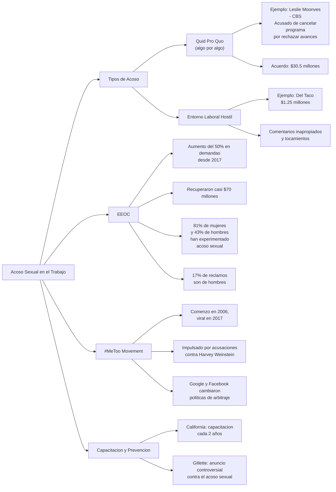
```mermaid
graph LR
    A[Acoso Sexual en el Trabajo] --> B[Tipos de Acoso]
    A --> C[EEOC]
    A --> D[#MeToo Movement]
    A --> E[Capacitacion y Prevencion]
    
    B --> B1["Quid Pro Quo<br>(algo por algo)"]
    B --> B2["Entorno Laboral Hostil"]
    
    B1 --> B1a["Ejemplo: Leslie Moonves<br> - CBS<br>Acusado de cancelar<br> programa<br>por rechazar avances"]
    B1 --> B1b["Acuerdo: $30.5 millones"]
    
    B2 --> B2a["Ejemplo: Del Taco<br>$1.25 millones"]
    B2 --> B2b["Comentarios inapropiados<br>y tocamientos"]
    
    C --> C1["Aumento del 50% en demandas<br>desde 2017"]
    C --> C2["Recuperaron casi $70 millones"]
    C --> C3["81% de mujeres<br> y 43% de hombres<br>han experimentado<br> acoso sexual"]
    C --> C4["17% de reclamos<br> son de hombres"]
    
    D --> D1["Comenzo en 2006,<br> viral en 2017"]
    D --> D2["Impulsado por acusaciones<br>contra Harvey Weinstein"]
    D --> D3["Google y Facebook cambiaron<br>politicas de arbitraje"]
    
    E --> E1["California: capacitacion<br>cada 2 años"]
    E --> E2["Gillette: anuncio controversial<br>contra el acoso sexual"]
```

### Preguntas y Respuestas de Repaso

**1. ¿Cómo define la EEOC el acoso sexual?**
La EEOC define el acoso sexual como cualquier tipo de acoso basado en el sexo de una persona. Puede incluir avances sexuales no deseados, solicitudes de favores sexuales y otra conducta verbal o física, pero no tiene que ser de naturaleza sexual. Por ejemplo, incluye comentarios ofensivos sobre el sexo de una persona.

**2. ¿Qué es el acoso sexual "quid pro quo"?**
Es un tipo de acoso que se traduce como "algo por algo". Los empleados se ven forzados a situaciones incómodas por miedo a ser despedidos o ser pasados por alto para promociones. El ejemplo dado es Leslie Moonves de CBS, acusado de cancelar un programa de televisión después de que una colega rechazara sus avances.

**3. ¿Qué es un entorno laboral hostil?**
Es un tipo de acoso sexual donde los empleados se encuentran en posiciones incómodas con comportamiento inapropiado generalizado, como bromas no deseadas o tocamientos. El ejemplo dado es Del Taco, que pagó $1.25 millones por un entorno donde supervisores hacían comentarios y tocamientos inapropiados.

**4. ¿Qué porcentaje de mujeres y hombres han experimentado acoso sexual según el estudio?**
El 81 por ciento de las mujeres y el 43 por ciento de los hombres han experimentado acoso sexual.

**5. ¿Qué porcentaje de reclamos de acoso sexual ante la EEOC son hechos por hombres?**
Alrededor del 17 por ciento de los reclamos de acoso sexual presentados ante la EEOC son hechos por hombres.

**6. ¿Por qué los hombres son menos propensos a reportar el acoso sexual?**
Porque temen ser objeto de burlas o creen que los hombres no pueden ser acosados sexualmente por mujeres.

**7. ¿Qué es el movimiento #MeToo y cuándo ganó atención generalizada?**
El término #MeToo fue acuñado en 2006 pero no ganó atención generalizada hasta 2017 cuando el hashtag #MeToo se volvió viral en las redes sociales, impulsado por las acusaciones contra Harvey Weinstein.

**8. ¿Qué cambios hicieron Google y Facebook en sus políticas de acoso sexual?**
Ambas empresas cambiaron sus políticas para permitir que los empleados persigan reclamos de acoso en los tribunales, en lugar de requerir arbitraje privado.

**9. ¿Qué requisito de capacitación implementó California?**
California implementó una ley que requiere que los empleadores proporcionen capacitación sobre acoso sexual a sus empleados al menos cada dos años.

**10. ¿Qué hizo Gillette en relación con el acoso sexual?**
Gillette lanzó un anuncio controvertido criticando a los hombres y desafiándolos a exhibir un mejor comportamiento, mostrando a hombres acosando sexualmente a mujeres y niños acosando a otros niños.

## TRENDS IN MANAGEMENT OF THE WORKFORCE

Los avances en la tecnología, los efectos económicos a largo plazo de la pandemia de COVID-19 y muchos otros factores han influido en el empleo. Los beneficios para empleados, especialmente la atención médica, siguen siendo un tema significativo y controvertido. La naturaleza del lugar de trabajo también está cambiando. Los micronegocios (micronewrens), pequeños negocios con no más de cinco empleados, están creciendo rápidamente. La economía de trabajos por encargo (gig economy), donde los individuos pasan de un proyecto a otro, también está creciendo rápidamente. La economía colaborativa (sharing economy) y la economía de trabajos por encargo están proporcionando oportunidades para que los contratistas independientes administren sus negocios y contraten su tiempo y recursos como mejor les parezca. El surgimiento de Uber, Airbnb y Lyft ilustra esta nueva forma de empleo. El espacio también es cada vez más compartido entre empleados y pequeñas empresas, una tendencia llamada coworking. Empresas como WeWork e Industrious Office han capitalizado las oportunidades de coworking al ofrecer espacios de trabajo flexibles y ágiles para empresas que van desde trabajadores independientes hasta empresas Fortune 500.

Este nuevo mercado laboral ha sido apoyado por teléfonos inteligentes, tabletas, software de videoconferencias y otras tecnologías. Sin embargo, un desafío importante con el uso creciente de teléfonos inteligentes y tabletas es la difuminación de la línea entre el tiempo de ocio y el tiempo de trabajo, yendo algunos empleadores a llamar a los empleados después del horario laboral. La difuminación entre el tiempo personal y el laboral también se puede atribuir al aumento del trabajo remoto y al trabajo híbrido. Es evidente que muchas empresas están luchando por encontrar el equilibrio entre políticas formales e informales. Las empresas quieren motivar a los empleados con opciones de horarios flexibles, pero también quieren mantener cierto grado de control. Por ejemplo, el programa "Flex with Purpose" de KPMG comunica que los empleados necesitan una buena razón para trabajar de forma remota, lo que significa que los empleados no tienen el control total. Las empresas ofrecen diversos grados de flexibilidad, en parte debido a la preocupación de los gerentes de alto nivel de que los empleados puedan aprovecharse de tener menos supervisión. Otras empresas, como Spotify, dan a los empleados más poder. Claramente, la tecnología está cambiando la dinámica del lugar de trabajo de manera tanto positiva como negativa.

Es importante que los gerentes de recursos humanos estén al tanto de los problemas legales relacionados con los derechos de los trabajadores. Criterios estrictos, como tener responsabilidades de gestión, tener títulos avanzados o ganar más de $455 a la semana, determinan si un empleado está exento del pago de horas extras. Curiosamente, los empleados que se "quejan" de sus empleadores en Facebook pueden recibir algún tipo de protección legal. Bajo la Ley Nacional de Relaciones Laborales de 1935, ciertos empleados del sector privado pueden quejarse sobre las condiciones de trabajo y el salario, lo que parece aplicarse también a los sitios de redes sociales. Las amenazas, por otro lado, no están protegidas. Sin embargo, incluso entonces, los tribunales a veces difieren de los empleadores en cuanto a lo que constituye una amenaza.

Muchas empresas eliminaron puestos de trabajo durante la pandemia de COVID-19, ya sea temporal o permanentemente, pero también se crearon nuevos empleos durante este tiempo, especialmente en las áreas de atención médica y tecnología. Las empresas no solo deben conocer las leyes laborales relevantes, sino también comprender cómo los beneficios, la moral de los empleados y la confianza pueden contribuir a la productividad general. Muchas de las empresas más exitosas han descubierto formas de equilibrar los costos con el bienestar de sus empleados. Según el Barómetro de Confianza de Edelman, los trabajadores confían en sus empleadores por encima de todas las demás instituciones, incluidas las empresas, las organizaciones no gubernamentales, el gobierno y los medios de comunicación. Esta tendencia es importante porque las empresas están bajo más presión que nunca para liderar en temas sociales. Los empleadores deben cultivar esta confianza para construir relaciones duraderas con sus empleados.

### Tendencias Clave

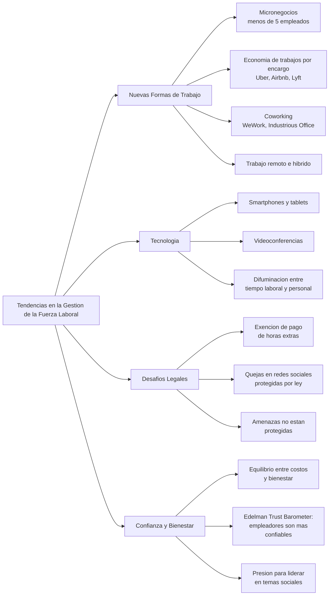
```mermaid
graph LR
    A[Tendencias en la Gestion de la Fuerza Laboral] --> B[Nuevas Formas de Trabajo]
    A --> C[Tecnologia]
    A --> D[Desafios Legales]
    A --> E[Confianza y Bienestar]
    
    B --> B1[Micronegocios<br>menos de 5 empleados]
    B --> B2[Economia de trabajos por encargo<br>Uber, Airbnb, Lyft]
    B --> B3[Coworking<br>WeWork, Industrious Office]
    B --> B4[Trabajo remoto e hibrido]
    
    C --> C1[Smartphones y tablets]
    C --> C2[Videoconferencias]
    C --> C3["Difuminacion entre<br>tiempo laboral y personal"]
    
    D --> D1[Exencion de pago<br> de horas extras]
    D --> D2["Quejas en redes sociales<br>protegidas por ley"]
    D --> D3[Amenazas no estan<br> protegidas]
    
    E --> E1[Equilibrio entre costos<br> y bienestar]
    E --> E2["Edelman Trust Barometer:<br>empleadores son mas<br> confiables"]
    E --> E3[Presion para liderar<br> en temas sociales]
```

### Construyendo tus Habilidades Blandas para tu Currículum

Este capítulo discutió la función de recursos humanos en una organización. Los representantes de RRHH son a menudo los que primero revisan los currículos de los empleados potenciales. Considera tu currículo. Si tienes uno, verifica que hayas documentado tus habilidades blandas (soft skills) en tu currículo, tales como comunicación, liderazgo, trabajo en equipo, autogestión, pensamiento crítico y habilidades interpersonales. Si aún no tienes un currículo, visita el centro de carrera de tu escuela para obtener recursos.

### ¿Quieres una Carrera en Recursos Humanos?

Gestionar recursos humanos es una faceta desafiante y creativa de un negocio. Es el departamento que maneja el reclutamiento, la contratación, la capacitación y el despido de empleados. Debido a la diligencia y el detalle requeridos en la contratación y la sensibilidad requerida en el despido, los gerentes de recursos humanos tienen un amplio conjunto de habilidades. Por lo tanto, los recursos humanos son vitales para el funcionamiento general del negocio porque, sin el personal adecuado, una empresa no podrá llevar a cabo sus planes de manera efectiva. Como en el baloncesto, un equipo es tan fuerte como sus jugadores individuales, y esos jugadores deben poder trabajar juntos para potenciar las fortalezas y minimizar las debilidades. Además, un buen gerente de recursos humanos puede anticipar las necesidades y cambios futuros en el negocio, contratando en línea con la dinámica del mercado y la organización.

Una vez que una buena fuerza laboral está en su lugar, los gerentes de recursos humanos deben asegurarse de que los empleados estén debidamente capacitados y orientados, y que comprendan claramente algunos elementos de lo que la organización espera. Contratar nuevas personas es costoso, requiere mucho tiempo y es turbulento; por lo tanto, es imperativo que todos los empleados sean cuidadosamente seleccionados, capacitados y motivados para que permanezcan comprometidos y leales a la empresa. Esta no es una tarea fácil, pero es una de las responsabilidades del gerente de RRHH. Incluso con referencias, un currículo, verificaciones de antecedentes y una entrevista, puede ser difícil saber cómo encajará una persona en la organización; por lo tanto, el gerente de RRHH necesita tener habilidades para poder anticipar cómo cada individuo "encajará".

Los trabajos de RRHH incluyen gerentes de compensación, relaciones laborales, beneficios, capacitación, ética y cumplimiento. Todas las tareas asociadas con la interfaz de contratación, desarrollo y mantenimiento de la motivación de los empleados entran en juego en la gestión de recursos humanos. Los trabajos son diversos y los salarios dependerán de las responsabilidades, la educación y la experiencia.

La diversidad, la equidad y la inclusión son consideraciones para un gerente de RRHH. Una fuerza laboral diversa ayuda a aportar una variedad de puntos de vista y mejora la calidad y creatividad de la toma de decisiones organizacionales. La diversidad es un activo y puede ayudar a una empresa a evitar puntos ciegos o la armonía en el pensamiento, el antecedentes y la perspectiva, que sofoca las buenas decisiones del equipo. Sin embargo, una fuerza laboral diversa puede presentar algunos desafíos de gestión. La gestión de recursos humanos es a menudo responsable de gestionar la capacitación y el cumplimiento de la diversidad para asegurar que los empleados no violen la cultura ética de la organización o infrinjan la ley. Diferentes personas tienen diferentes metas, motivaciones y formas de pensar sobre los problemas que están influenciadas por su cultura, religión y las personas más cercanas a ellos. Ninguna forma de pensar es más correcta o incorrecta que otras, y todas son valiosas. El trabajo de un gerente de recursos humanos puede volverse muy complicado, sin embargo, debido a la diversidad. Para ser bueno en recursos humanos, debes ser consciente del valor de las diferencias, esforzarte por ser culturalmente sensible e idealmente tener un fuerte entendimiento y apreciación de diferentes culturas y religiones. La capacidad de los gerentes de recursos humanos para gestionar la diversidad y esas diferencias afectará su éxito profesional general.

### Preguntas y Respuestas de Repaso

**1. ¿Qué son los micronegocios (micronewrens)?**
Son pequeños negocios con no más de cinco empleados que están creciendo rápidamente.

**2. ¿Qué es la economía de trabajos por encargo (gig economy)?**
Es un mercado laboral donde los individuos pasan de un proyecto a otro, moviéndose entre diferentes trabajos temporales en lugar de tener un empleo fijo.

**3. ¿Qué empresas ejemplifican la economía colaborativa según el texto?**
Uber, Airbnb y Lyft ilustran esta nueva forma de empleo.

**4. ¿Qué es el coworking?**
Es una tendencia donde el espacio de trabajo es compartido entre empleados y pequeñas empresas. Empresas como WeWork e Industrious Office ofrecen espacios de trabajo flexibles y ágiles.

**5. ¿Cuál es un desafío importante del uso creciente de teléfonos inteligentes y tabletas en el trabajo?**
La difuminación entre el tiempo de ocio y el tiempo de trabajo, con algunos empleadores llamando a los empleados después del horario laboral.

**6. ¿Qué criterios determinan si un empleado está exento del pago de horas extras?**
Criterios como tener responsabilidades de gestión, tener títulos avanzados o ganar más de $455 a la semana.

**7. ¿Qué protección legal tienen los empleados que se quejan en redes sociales?**
Bajo la Ley Nacional de Relaciones Laborales de 1935, ciertos empleados del sector privado pueden quejarse sobre las condiciones de trabajo y el salario en redes sociales. Las amenazas no están protegidas.

**8. ¿Qué revela el Barómetro de Confianza de Edelman?**
Que los trabajadores confían en sus empleadores por encima de todas las demás instituciones, incluyendo empresas, organizaciones no gubernamentales, gobierno y medios de comunicación.

**9. ¿Qué habilidades blandas (soft skills) deben incluirse en un currículum según el texto?**
Comunicación, liderazgo, trabajo en equipo, autogestión, pensamiento crítico y habilidades interpersonales.

**10. ¿Por qué es importante la diversidad en la fuerza laboral según la sección de carrera en RRHH?**
Porque ayuda a aportar una variedad de puntos de vista, mejora la calidad y creatividad de la toma de decisiones, ayuda a evitar puntos ciegos y la armonía en el pensamiento que sofoca las buenas decisiones del equipo.

## ORDER UP: RESTAURANTS TURN TO ROBOTS

Ante la escasez de mano de obra posterior a la pandemia, muchos restaurantes recurrieron a la robótica y la automatización. Los robots se pueden encontrar en las cocinas de restaurantes de comida rápida y comedores informales como Jack in the Box, Panera, Denny's y Chili's. McDonald's, una de las cadenas de comida rápida más grandes del mundo, creó una tienda automatizada justo fuera de Fort Worth, Texas, impulsada por quioscos, una aplicación, cintas transportadoras automáticas y otras tecnologías.

Confiar en los robots puede ser atractivo para los operadores de restaurantes, ya que les permite compensar los aumentos salariales y la inflación mientras superan la escasez de mano de obra. Además, con la precisión y consistencia de los robots y máquinas automatizadas, los restaurantes pueden mejorar la precisión de la cocción y potencialmente reducir las enfermedades transmitidas por alimentos debido a una cocción incorrecta. Los robots pueden resultar en ahorros de mano de obra ya que se necesitan menos empleados. Según la Federación Internacional de Robótica, se espera que las ventas mundiales de robots crezcan un 10 por ciento en 2023 hasta un récord de $17 mil millones.

McDonald's y Taco Bell han invertido en restaurantes prioritarios para dispositivos móviles que están optimizados para pedidos móviles y recogida de entregas. Los clientes evitan el carril tradicional de autoservicio y reciben sus pedidos a través de un sistema de cinta transportadora. Después de una prueba exitosa en 10 restaurantes, Chili's, un comedor informal y parrilla de bar Tex-Mex, expandió su asociación con Bear Robotics. Ahora, más de 60 restaurantes cuentan con Rita the Robot, que acompaña a los invitados a sus mesas, entrega comida, invita a los invitados a unirse a My Chili's Rewards y canta una canción de cumpleaños a los invitados.

En muchos sentidos, los robots y las máquinas son más confiables que los humanos porque no llaman para reportarse enfermos ni solicitan aumentos de sueldo, pero sí se descomponen y requieren mantenimiento. Los restaurantes necesitarán desarrollar relaciones cercanas con su empresa de robots para un servicio rápido, que incluirá reparaciones in situ y soluciones remotas. Los consumidores también han expresado preocupaciones sobre la calidad del servicio al cliente ofrecido por los robots en comparación con los humanos. Además, la eliminación de empleos es una preocupación importante para los trabajadores.

La automatización sin duda eliminará muchos empleos, pero también generará demanda de ingenieros en automatización, especialistas en TI y trabajadores que tengan conocimientos tecnológicos y puedan interactuar con los robots. Ya sea que los clientes y empleados adopten los robots o no, está claro que hay muchas oportunidades en el frente de la casa y en la parte trasera para herramientas de automatización y robótica en la industria de restaurantes.

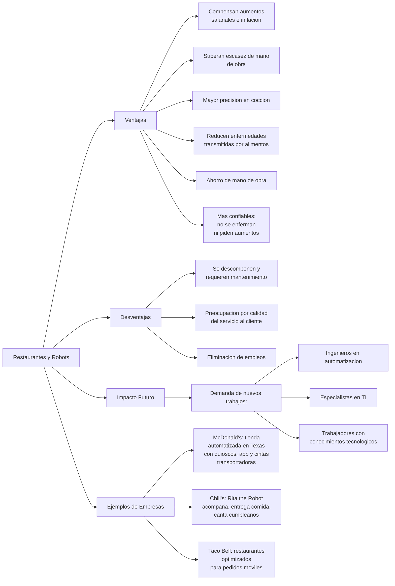
```mermaid
graph LR
    A[Restaurantes y Robots] --> B[Ventajas]
    A --> C[Desventajas]
    A --> D[Impacto Futuro]
    A --> E[Ejemplos de Empresas]
    
    B --> B1["Compensan aumentos<br> salariales e inflacion"]
    B --> B2["Superan escasez de mano<br> de obra"]
    B --> B3["Mayor precision en coccion"]
    B --> B4["Reducen enfermedades<br> transmitidas por alimentos"]
    B --> B5["Ahorro de mano de obra"]
    B --> B6["Mas confiables:<br>no se enferman<br> ni piden aumentos"]
    
    C --> C1["Se descomponen y<br>requieren mantenimiento"]
    C --> C2["Preocupacion por calidad<br>del servicio al cliente"]
    C --> C3["Eliminacion de empleos"]
    
    D --> D1["Demanda de nuevos trabajos:"]
    D1 --> D1a["Ingenieros en automatizacion"]
    D1 --> D1b["Especialistas en TI"]
    D1 --> D1c["Trabajadores con<br>conocimientos tecnologicos"]
    
    E --> E1["McDonald's: tienda<br> automatizada en Texas<br>con quioscos, app y cintas<br> transportadoras"]
    E --> E2["Chili's: Rita the Robot<br>acompaña, entrega comida,<br> canta cumpleanos"]
    E --> E3["Taco Bell: restaurantes<br> optimizados<br>para pedidos moviles"]
```

### Preguntas de Pensamiento Crítico y Respuestas

**1. ¿Cuáles son los pros y los contras de usar robots en lugar de (o en conjunto con) trabajadores humanos?**

| Pros (Ventajas) | Contras (Desventajas) |
|:----------------|:----------------------|
| Compensan aumentos salariales e inflación | Los robots se descomponen y requieren mantenimiento |
| Superan la escasez de mano de obra | Necesitan reparaciones in situ y soluciones remotas |
| Mayor precisión y consistencia en la cocción | Preocupación de clientes sobre calidad del servicio |
| Reducen enfermedades transmitidas por alimentos | Eliminación de empleos para trabajadores humanos |
| Ahorro de mano de obra (menos empleados necesarios) | |
| No llaman enfermos ni piden aumentos de sueldo | |

**2. ¿Qué pueden hacer los restaurantes para tranquilizar a los clientes que están preocupados por los robots y la automatización?**

Los restaurantes pueden tomar las siguientes medidas para tranquilizar a los clientes:

1. **Mantener personal humano clave:** Asegurar que haya empleados humanos disponibles para interacciones que requieren calidez, empatía o resolución de problemas complejos.

2. **Capacitación y supervisión:** Entrenar al personal para supervisar el funcionamiento de los robots y intervenir cuando sea necesario para garantizar un servicio de calidad.

3. **Comunicación transparente:** Explicar a los clientes cómo los robots mejoran la precisión, consistencia y seguridad alimentaria, lo que beneficia su experiencia.

4. **Servicio híbrido:** Ofrecer un modelo combinado donde los robots manejen tareas repetitivas (como transportar alimentos o dar indicaciones) mientras los humanos manejan la atención personalizada.

5. **Demostraciones y pruebas:** Permitir que los clientes vean cómo funcionan los robots en un entorno controlado para familiarizarse con la tecnología.

6. **Canales de retroalimentación:** Crear mecanismos para que los clientes expresen sus inquietudes y sugerencias sobre la experiencia con robots.

**3. En su opinión, ¿son los robots una amenaza para el futuro del trabajo? ¿Por qué sí o por qué no?**

**(Respuesta basada en opinión fundamentada en el texto)**

Los robots **no son necesariamente una amenaza para el futuro del trabajo, sino más bien un transformador del mismo**. Las razones son:

**Por qué NO son solo una amenaza:**

1. **Creación de nuevos empleos:** La automatización genera demanda de nuevos roles como ingenieros en automatización, especialistas en TI y trabajadores con conocimientos tecnológicos que puedan interactuar con robots.

2. **Cambio, no eliminación total:** Si bien algunos empleos serán eliminados, surgirán otros que requieren habilidades diferentes y más especializadas.

3. **Eficiencia y seguridad:** Los robots pueden asumir tareas repetitivas, peligrosas o que requieren alta precisión, liberando a los humanos para trabajos más creativos, estratégicos y de interacción personal.

4. **Complemento, no reemplazo:** Como señala el texto, la automatización funciona mejor en conjunción con humanos, no como un reemplazo completo.

**Por qué es un desafío a considerar:**

1. **Desplazamiento laboral:** Los trabajadores con habilidades fácilmente automatizables (como tareas repetitivas en cocina) pueden perder sus empleos.

2. **Brecha de habilidades:** Se necesitará recapacitación y educación para que los trabajadores actuales puedan acceder a los nuevos puestos creados.

**Conclusión:** Los robots representan una **transformación**, no una eliminación del trabajo. El desafío para la sociedad y las empresas será garantizar que los trabajadores tengan acceso a la capacitación necesaria para desarrollar las habilidades tecnológicas que serán demandadas en el futuro. Los robots no son una amenaza si se gestiona adecuadamente la transición y se invierte en el desarrollo de la fuerza laboral.
