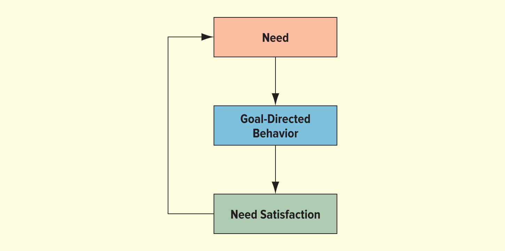
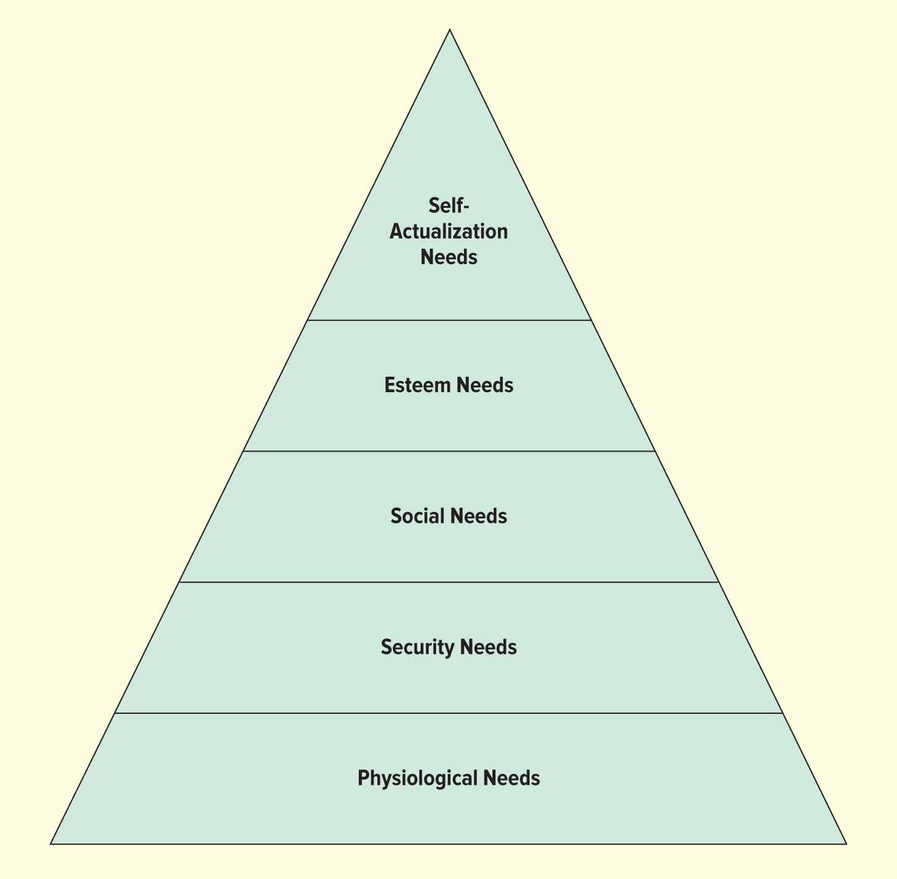
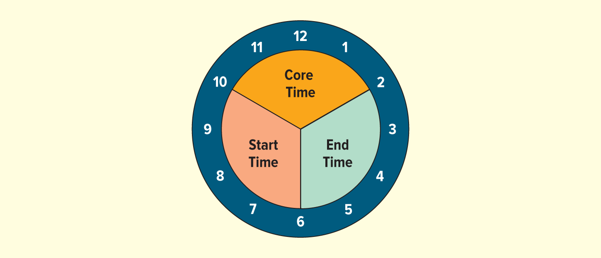

<h1 id="Chapter_9._Motivating_the_Workforce" style="color:#42A5F5;">Indice</h1>

##### [Capitulo LO 9-1 Nature of Human Relations](#525206)

##### [Capitulo LO 9-2 Historical Perspectives on Employee Motivation](#234297)

##### [Capitulo LO 9-3 Theories of Employee Motivation ](#238415)

##### [Capitulo LO 9-4 McGregor's Theory X and Theory Y (Teorías X e Y de McGregor)](#563614)

##### [Capitulo LO 9-5 Estrategias para Motivar a los Empleados](#496454)

<h1 id="525206" style="color:#E65100;">
  <a href="#Chapter_9._Motivating_the_Workforce" style="color:inherit; text-decoration:none;">
    LO 9-1 Naturaleza de las Relaciones Humanas    
  </a>
</h1>

###  Explicar por qué es importante el estudio de las relaciones humanas

Las **relaciones humanas** se enfocan en comprender cómo interactúan las personas dentro de una organización, especialmente en el trabajo. Incluyen la motivación, el comportamiento individual y grupal, y las relaciones entre empleados.

## Importancia de las relaciones humanas

### 1. Ayudan a motivar a los empleados
La motivación es el motor que impulsa a una persona a actuar. Cuando los empleados están motivados, trabajan mejor, cumplen objetivos y contribuyen al éxito de la empresa.

- **Motivación**: impulso interno que dirige el comportamiento hacia metas.
- **Meta (goal)**: satisfacción de una necesidad.
- **Necesidad (need)**: diferencia entre el estado actual y el deseado.

### 2. Mejoran la productividad y eficiencia
Las empresas utilizan las relaciones humanas para lograr que los empleados trabajen de manera más eficiente y efectiva. Empleados motivados producen más y con mejor calidad.

### 3. Aumentan la moral y el compromiso
La **moral** se refiere a la actitud de los empleados hacia su trabajo, compañeros y empresa.

- Alta moral → mayor productividad y lealtad  
- Baja moral → ausentismo y rotación de empleados  

El **compromiso (engagement)** significa que el empleado está emocionalmente involucrado en su trabajo y cumple con sus responsabilidades.

### 4. Fomentan la lealtad y el respeto
Cuando los empleados son tratados con profesionalismo e integridad, desarrollan confianza, respeto y lealtad hacia la organización.

### 5. Ayudan a entender el comportamiento humano
Las relaciones humanas explican por qué las personas actúan de cierta manera en el trabajo, ya sea para rendir más o evitar tareas.

### 6. Promueven un ambiente laboral positivo
Las empresas buscan mejorar el ambiente laboral para aumentar la creatividad, la colaboración y la satisfacción de los empleados.

### 7. Apoyan la diversidad en el trabajo
Las organizaciones actuales tienen empleados diversos. Las relaciones humanas ayudan a gestionar diferentes culturas, ideas y perspectivas de manera efectiva.

### 8. Permiten alcanzar objetivos organizacionales
Motivar correctamente a los empleados ayuda a cumplir metas realistas y mejorar el desempeño general de la empresa.

⚠️ Nota: Una mala motivación (como presión excesiva o metas irreales) puede llevar a comportamientos poco éticos.

## Proceso de motivación

1. **Necesidad** → surge un deseo o carencia  
2. **Comportamiento dirigido a la meta** → acciones para lograrla  
3. **Satisfacción de la necesidad** → se alcanza el objetivo  

## Conclusión
El estudio de las relaciones humanas es fundamental porque permite entender, motivar y gestionar a las personas dentro de una organización, lo que mejora la productividad, el ambiente laboral y el éxito empresarial.

### FIGURE 9.1 The Motivation Process

</img>

### La Gran Renuncia (Great Resignation)
Cuando la **motivación** y la **moral** son bajas, los empleados tienen mayor probabilidad de renunciar.  
Un ejemplo claro es la *Gran Renuncia* (2021 en EE. UU.), donde muchos trabajadores dejaron sus empleos debido a:

- Bajos salarios  
- Falta de oportunidades de crecimiento  
- Falta de respeto en el trabajo  
- Problemas de cuidado infantil  
- Falta de horarios flexibles  
- Agotamiento (burnout) y falta de satisfacción  

👉 Esto demuestra que las relaciones humanas son clave para retener talento.

---

### Tipos de recompensas

#### 1. Recompensas intrínsecas
Son las que vienen del interior de la persona (satisfacción personal).

Ejemplos:
- Disfrutar aprender algo nuevo  
- Sentir que tu trabajo tiene propósito  
- Lograr metas personales  

✔️ Motivan porque generan satisfacción interna.

---

#### 2. Recompensas extrínsecas
Son las que provienen de factores externos.

Ejemplos:
- Salario  
- Bonos  
- Reconocimiento  
- Calificaciones (en clases)  

✔️ Motivan porque ofrecen beneficios tangibles.

---

### Importancia de ambas recompensas
Tanto las recompensas intrínsecas como extrínsecas:

- Aumentan la motivación  
- Mejoran el desempeño  
- Ayudan a alcanzar objetivos organizacionales  

---

### Factores que mejoran la moral
La **moral alta** es clave para el éxito organizacional. Se puede mejorar mediante:

- Respeto  
- Participación de los empleados  
- Reconocimiento  
- Buen salario  
- Oportunidades de ascenso  
- Ambiente laboral agradable  
- Cultura organizacional positiva  

✔️ Resultado: empleados más comprometidos y productivos  

---

### Importancia del ambiente laboral
Un ambiente ético y positivo:

- Aumenta la satisfacción laboral  
- Mejora la lealtad del empleado  
- Reduce la rotación (turnover)  

Las empresas que alinean los valores de los empleados con los de la organización suelen tener mayor éxito.

---

### Estrategias para motivar y retener empleados
Muchas empresas ofrecen beneficios adicionales para mejorar la calidad de vida:

- Guarderías en el trabajo  
- Servicios personales (ej: lavandería, reparación)  
- Beneficios para parejas  
- Sabáticos pagados  
- Descuentos y reembolsos educativos  
- Oportunidades internacionales  

✔️ Objetivo: aumentar la satisfacción, motivación y permanencia del empleado

---

## Conclusión
La motivación y la moral son esenciales en las relaciones humanas.  
Cuando los empleados se sienten valorados, respetados y recompensados (tanto interna como externamente), es más probable que permanezcan en la empresa y contribuyan a su éxito.

## Tabla 9.1: Cómo retener buenos empleados

Para mantener empleados motivados y comprometidos, las empresas deben aplicar las siguientes estrategias:

1. **Ofrecer oportunidades de capacitación continua**  
   Permite que los empleados desarrollen nuevas habilidades y crezcan profesionalmente.

2. **Crear una cultura organizacional positiva**  
   Un ambiente saludable mejora la satisfacción y el compromiso laboral.

3. **Apoyar la comunicación abierta**  
   Facilita el intercambio de ideas y fortalece las relaciones dentro de la empresa.

4. **Combinar salario, beneficios y reconocimiento**  
   Un buen equilibrio entre recompensas económicas y reconocimiento motiva a los empleados.

5. **Fomentar referencias y reclutamiento interno**  
   Promover talento interno y recomendaciones mejora la retención y el ambiente laboral.

6. **Entrenar, dar retroalimentación y ofrecer mentoría**  
   Ayuda a los empleados a mejorar su desempeño y sentirse apoyados.

7. **Brindar oportunidades de crecimiento**  
   Los empleados permanecen más tiempo cuando ven posibilidades de avanzar.

8. **Apoyar el equilibrio entre trabajo y vida personal**  
   Reduce el estrés y mejora el bienestar general.

9. **Fomentar confianza, respeto y seguridad en la dirección**  
   La confianza en los líderes aumenta la lealtad y el compromiso.

---

## 💡 Dato importante (Did You Know?)
El **ausentismo laboral** cuesta a los empleadores en Estados Unidos aproximadamente **$225.8 mil millones al año** en pérdidas de productividad.

---

## 🧾 Conclusión
Retener empleados no depende solo del salario, sino de crear un ambiente donde las personas se sientan valoradas, escuchadas y con oportunidades de crecimiento. Esto reduce el ausentismo, mejora la productividad y fortalece la organización.

# Newell Turns Over a New Leaf 

Newell Brands, la empresa de productos de consumo detrás de marcas como Paper Mate, Sharpie, Rubbermaid y Yankee Candle, tenía un ambiente laboral tóxico hasta que Ravi Saligram asumió como CEO, presidente y miembro de la junta directiva. Cuando Saligram, quien anteriormente fue CEO de OfficeMax y Ritchie Bros. Auctioneers Inc., llegó a la empresa, impactó a los 30,000 empleados con una presentación que incluía el mensaje: “no assholes”. Este mensaje simple reflejaba uno de los principios clave de su filosofía de liderazgo.

En ese momento, la empresa atravesaba una reestructuración (no era la primera) y llevaba años con ventas en declive. Además, había adquirido muchas marcas que no encajaban bien con la compañía. Como resultado, muchos gerentes fueron despedidos o renunciaron. Según Saligram, la empresa sufría por la baja moral, conflictos entre ejecutivos y miedo a represalias. Los empleados temían ser castigados si cometían errores o expresaban sus opiniones.

Convencido de que el valor para los accionistas depende del valor para los empleados, Saligram decidió enfocarse en mejorar las relaciones humanas. Durante sus primeros tres meses, observó la empresa, visitó operaciones globales y conversó con empleados y gerentes. También revisó evaluaciones anónimas de empleados en sitios como Glassdoor. Notó que los empleados actuaban con una mentalidad de supervivencia. Por ello, buscó darles mayor libertad y seguridad, implementó una política de puertas abiertas y fomentó la comunicación honesta para reconstruir la confianza y mejorar la moral.

Su enfoque fue puesto a prueba cuando propuso cambios en la estructura de la empresa. Algunos líderes temían que los cambios centralizaran demasiado el poder, por lo que Saligram decidió comprometerse y adoptar un sistema híbrido que distribuía la autoridad. Bajo su liderazgo, la empresa logró reducir deudas, aumentar ventas y mejorar la moral. Además, incrementó la diversidad en los niveles altos, con más mujeres liderando unidades de negocio y programas para promover la inclusión.

También realizó encuestas para evaluar la percepción de los empleados sobre inclusión y equidad salarial, y creó grupos de apoyo para diferentes comunidades (mujeres, afroamericanos, asiáticos, veteranos y LGBTQ+). Su objetivo es que todos los empleados se sientan incluidos y puedan ser auténticos en el trabajo. Por su liderazgo, fue reconocido como uno de los CEOs más admirados.

---

# Respuestas

## 1. ¿Qué pasos tomó Saligram para conocer la cultura organizacional?

- Observó la empresa durante sus primeros tres meses  
- Visitó operaciones globales  
- Habló con empleados y gerentes  
- Revisó opiniones anónimas en línea  
- Analizó el comportamiento de los empleados (mentalidad de supervivencia)  

---

## 2. ¿Por qué la moral era baja? ¿Cuáles son las consecuencias?

### Causas:
- Reestructuraciones constantes  
- Ventas en declive  
- Adquisiciones inadecuadas  
- Despidos y renuncias  
- Conflictos entre ejecutivos  
- Cultura de miedo y castigo  

### Consecuencias:
- Baja productividad  
- Falta de motivación  
- Poca innovación  
- Alta rotación  
- Mal ambiente laboral  

---

## 3. ¿Por qué el cambio cultural toma tiempo?

- La cultura está profundamente arraigada  
- Es una empresa grande con muchos empleados  
- Existe resistencia al cambio  
- Se necesita reconstruir la confianza  
- Requiere cambios en liderazgo, sistemas y valores  

---

## Conclusión
El caso demuestra que mejorar la cultura organizacional y las relaciones humanas puede transformar una empresa, pero requiere tiempo, liderazgo y compromiso.

<h1 id="234297" style="color:#E65100;">
  <a href="#Chapter_9._Motivating_the_Workforce" style="color:inherit; text-decoration:none;">
    LO 9-2 Historical Perspectives on Employee Motivation
  </a>
</h1>

### Resumir los primeros estudios sobre la motivación de los empleados

Durante el siglo XX, investigadores realizaron numerosos estudios para entender cómo **motivar a los empleados** y mejorar la productividad.  
A partir de estos estudios surgieron teorías que han sido aplicadas con distintos niveles de éxito en las organizaciones.

Dos enfoques clave que sentaron las bases del estudio de la motivación son:

---

### 1. Teoría clásica de la motivación

La **teoría clásica** se enfoca principalmente en los aspectos económicos del trabajo.

#### Ideas principales:
- Los trabajadores están motivados principalmente por el **dinero**  
- El trabajo es visto como algo que las personas hacen solo por necesidad  
- Se cree que los empleados necesitan **supervisión estricta**  
- La productividad aumenta si se ofrecen **incentivos económicos**  

#### Limitaciones:
- Ignora factores humanos como emociones, satisfacción y relaciones sociales  
- Considera a los empleados como máquinas, no como personas  

---

### 2. Estudios de Hawthorne

Los **estudios de Hawthorne** fueron realizados para analizar cómo diferentes factores afectan la productividad.

#### Hallazgos principales:
- La productividad aumenta cuando los empleados reciben **atención**  
- Los factores sociales y psicológicos son muy importantes  
- Las personas trabajan mejor cuando se sienten **valoradas y parte de un grupo**  

👉 Este fenómeno se conoce como el **“efecto Hawthorne”**  

---

### Importancia de estos estudios

Ambos enfoques ayudaron a entender que:

- La motivación no depende solo del dinero  
- Los factores sociales y emocionales influyen en el desempeño  
- El trato hacia los empleados afecta directamente la productividad  

---

### Conclusión

Estos estudios sentaron las bases de las relaciones humanas modernas, mostrando que para motivar a los empleados no basta con incentivos económicos, sino que también es necesario considerar sus necesidades sociales y emocionales.

### Classical Theory of Motivation

El nacimiento del estudio de las relaciones humanas se remonta a los estudios de **tiempo y movimiento** realizados a principios del siglo XX por **Frederick W. Taylor** y **Frank y Lillian Gilbreth**. Estos estudios analizaban cómo los trabajadores realizaban tareas específicas con el fin de **mejorar la productividad**. Sus hallazgos llevaron a aplicar **principios científicos a la gestión**.

Según la **teoría clásica de la motivación**, el dinero es el **único motivador** para los trabajadores. Taylor sugería que los empleados que recibían más pago producirían más, beneficiando tanto a la empresa como a los trabajadores. Para mejorar la productividad, Taylor proponía:

- Dividir cada trabajo en **tareas especializadas** (especialización)  
- Determinar la **mejor forma de realizar cada tarea**  
- Especificar el **resultado esperado** de cada tarea  
- Vincular el **pago directamente al desempeño** mediante incentivos  

Taylor desarrolló el **sistema de pago por pieza**, donde los empleados recibían un monto por cada unidad producida; quienes superaban su cuota recibían un pago mayor por todas las unidades.  

Hoy, muchas empresas aún aplican estos principios mediante **incentivos financieros individuales o por equipo**, incluyendo a nivel ejecutivo. Por ejemplo, Boeing implementa incentivos de ventas para equipos dedicados a distintos productos. Sin embargo, el tema de la **compensación ejecutiva** sigue siendo controversial, con algunos CEOs recibiendo paquetes multimillonarios, como Robert Scaringe de Rivian Automotive, con más de $2 mil millones.

Aunque Taylor creía que un **pago satisfactorio y seguridad laboral** motivaban a los empleados, estudios posteriores demostraron que **otros factores sociales y psicológicos** también son importantes.

---

### The Hawthorne Studies

**Elton Mayo** y un equipo de investigadores de la Universidad de Harvard analizaron qué **condiciones físicas** en el lugar de trabajo —como luz y ruido— estimulaban la mayor productividad. Estudiaron a trabajadores en la **Hawthorne Works Plant** de Western Electric, midiendo su productividad bajo diferentes condiciones físicas.

Lo que descubrieron fue **sorprendente**: la productividad aumentaba **independientemente de las condiciones físicas**. Este fenómeno se llamó **efecto Hawthorne**. Al preguntar a los empleados sobre su comportamiento, respondieron que se sentían satisfechos porque:

- Sus compañeros de trabajo eran **amigables**  
- Sus supervisores **les pedían cooperación y atención**  

Es decir, respondían a la **atención recibida**, no a los cambios físicos. Concluyeron que **factores sociales y psicológicos** afectan significativamente la **productividad y la moral**.  

Ejemplo moderno: **USAA**, empresa de servicios financieros, fomenta la motivación porque sirve a familias militares y veteranos, lo que da a los empleados un **sentido de propósito**.

---

### Conclusión

Los experimentos de Hawthorne marcaron el inicio de la **preocupación por las relaciones humanas en el trabajo**. Demostraron que **los factores humanos influyen en el comportamiento de los empleados** y que los gerentes que comprenden las **necesidades, creencias y expectativas** de las personas tienen mayor éxito motivando a su personal.

<h1 id="238415" style="color:#E65100;">
  <a href="#Chapter_9._Motivating_the_Workforce" style="color:inherit; text-decoration:none;">
    LO 9-3 Theories of Employee Motivation 
  </a>
</h1>

### Comparar y contrastar las teorías de relaciones humanas de Abraham Maslow y Frederick Herzberg

La investigación de Taylor, Mayo y otros ha llevado al desarrollo de diversas teorías que intentan describir **qué motiva a los empleados a desempeñarse**. La implementación exitosa de estas teorías varía según la empresa, su gestión y sus empleados. Además, lo que funcionaba en el pasado puede no ser efectivo hoy, por lo que los buenos gerentes deben **adaptar sus ideas** a grupos de empleados cada vez más diversos y cambiantes.

---

### Maslow's Hierarchy of Needs (Jerarquía de Necesidades de Maslow)

El psicólogo **Abraham Maslow** propuso que las personas tienen **cinco necesidades básicas**:  

1. **Fisiológicas**  
2. **Seguridad**  
3. **Sociales**  
4. **Estima**  
5. **Autorrealización**  

Maslow organiza estas necesidades en un **orden jerárquico**, en el que las personas intentan satisfacer primero las necesidades más básicas antes de atender las de niveles superiores.

### Jerarquía de Necesidades de Maslow

</img>

#### 1. Necesidades fisiológicas
- Son las más básicas: agua, comida, refugio y ropa  
- Los individuos concentran sus esfuerzos en satisfacer estas necesidades antes de pasar a otros niveles  

#### 2. Necesidades de seguridad
- Protección frente a daños físicos y económicos  
- Incluyen mantener la seguridad en el trabajo, usar equipo de protección y asegurar ingresos  

#### 3. Necesidades sociales
- Amor, compañerismo y amistad  
- Implican la aceptación por parte de otros  
- Se satisfacen a través de amistades, grupos, voluntariado, eventos sociales  

#### 4. Necesidades de estima
- Respeto propio y de otros (también conocido como seguridad psicológica)  
- La competencia y los logros incrementan la productividad  
- Se logran mediante **recompensas y participación organizacional**  

#### 5. Autorrealización
- Ser lo mejor que uno puede ser  
- Maximizar el potencial personal y profesional  
- Ejemplos: un escritor reconocido internacionalmente, un actor que gana un Oscar  

### Principales enseñanzas de Maslow
- Las necesidades básicas deben satisfacerse antes que las necesidades superiores  
- Si una necesidad de bajo nivel se reactiva, la persona intentará satisfacerla antes que las de nivel superior  
- Los empleados estarán motivados solo si sus necesidades fisiológicas, de seguridad y sociales están satisfechas

---

### Herzberg's Two-Factor Theory (Teoría de los Dos Factores de Herzberg)

En la década de 1950, el psicólogo **Frederick Herzberg** propuso una teoría de motivación que se centra en **el trabajo y el entorno laboral**. Herzberg estudió diversos factores relacionados con el trabajo y su relación con la motivación, concluyendo que se pueden dividir en **factores de higiene** y **factores motivacionales**.

---

### Factores de Higiene
- Políticas de la empresa  
- Supervisión  
- Condiciones laborales  
- Relaciones con compañeros, supervisores y subordinados  
- Salario  
- Seguridad  

**Características:**  
- Relacionados con el entorno laboral, no con el contenido del trabajo  
- No necesariamente motivan a los empleados, pero su **ausencia puede generar insatisfacción y alta rotación**  
- Incluyen seguridad y comodidad  

Ejemplo: salarios adecuados, políticas justas y seguridad laboral ayudan a satisfacer necesidades fisiológicas y de seguridad según Maslow, pero **no motivan por sí solos a mejorar el rendimiento**.  

---

### Factores Motivacionales
- Logro  
- Reconocimiento  
- El trabajo mismo  
- Responsabilidad  
- Avance profesional  
- Crecimiento personal  

**Características:**  
- Relacionados con el contenido del trabajo  
- Su presencia **motiva a los empleados a sobresalir**, aunque su ausencia no necesariamente genera insatisfacción  
- Proporcionar responsabilidad, participación y oportunidades de avance aumenta la productividad y calidad  

Ejemplo: hoteles y empresas de servicios adoptan procesos centrados en empleados para motivarlos y generar clientes felices. Beneficios como horarios flexibles, trabajo desde casa, oficinas amigables para mascotas y celebraciones aumentan la motivación.  

---

### Relación con Maslow
- Los factores motivacionales de Herzberg son similares a las necesidades de **estima y autorrealización** de Maslow  
- Las necesidades de bajo nivel (fisiológicas y de seguridad) suelen estar satisfechas mediante leyes de salario mínimo y estándares de seguridad  
- Para mejorar la productividad, los gerentes deben enfocarse en **satisfacer necesidades de nivel superior** mediante reconocimiento, logros y oportunidades de crecimiento

<h1 id="563614" style="color:#E65100;">
  <a href="#Chapter_9._Motivating_the_Workforce" style="color:inherit; text-decoration:none;">
    LO 9-4 McGregor's Theory X and Theory Y (Teorías X e Y de McGregor)
  </a>
</h1>

En *The Human Side of Enterprise*, **Douglas McGregor** relacionó las ideas de Maslow sobre las necesidades personales con la gestión empresarial. McGregor contrastó dos enfoques de administración:  

- **Teoría X:** enfoque tradicional y autocrático  
- **Teoría Y:** enfoque humanista y participativo  

---

### Teoría X
Los gerentes que adoptan la **Teoría X** asumen que los trabajadores **no disfrutan del trabajo y deben ser obligados a cumplir con sus tareas**. Creen que:  
1. La persona promedio evita el trabajo siempre que puede.  
2. La mayoría de los trabajadores debe ser **coaccionada, controlada o amenazada** para lograr los objetivos de la organización.  
3. Prefieren ser dirigidos, evitan responsabilidades, tienen poca ambición y buscan seguridad.  

**Estilo de gestión Teoría X:**  
- Control estricto y supervisión constante  
- Motivación basada en el miedo  
- Toma de decisiones autocrática  
- Ignora necesidades sociales, de estima y autorrealización  

Ejemplo: empresas que vigilan constantemente el uso de computadoras de los empleados.

---

### Teoría Y
Los gerentes que adoptan la **Teoría Y** asumen que los trabajadores **disfrutan del trabajo y buscan responsabilidades** si las condiciones son adecuadas. Suposiciones principales:  
1. El esfuerzo físico y mental en el trabajo es tan natural como jugar o descansar.  
2. Las personas ejercen autodirección y autocontrol para alcanzar objetivos comprometidos.  
3. Se comprometen con objetivos que les proporcionan **recompensas personales**.  
4. Buscan y aceptan la responsabilidad.  
5. La imaginación, el ingenio y la creatividad ayudan a resolver problemas organizacionales, aunque muchas empresas no aprovechan estas capacidades.  
6. Las organizaciones no utilizan plenamente el potencial intelectual de los trabajadores.  

**Estilo de gestión Teoría Y:**  
- Menor control y supervisión  
- No utiliza el miedo como motivador principal  
- Toma de decisiones democrática con participación de los empleados  
- Satisface necesidades de alto nivel según Maslow además de necesidades fisiológicas y de seguridad  

Ejemplo: empresas como **Zappos, Netflix, 3M, Vaive Corporation y Autodesk** confían en la creatividad y responsabilidad de sus empleados.

---

### Comparación rápida

| Característica | Teoría X | Teoría Y |
|----------------|----------|----------|
| Visión del trabajo | Trabajo es un castigo | Trabajo es natural y gratificante |
| Control y supervisión | Estricto y constante | Menor, fomenta autonomía |
| Motivación | Miedo, amenazas | Recompensas, autorrealización |
| Participación en decisiones | Limitada | Alta |
| Enfoque en necesidades | Solo fisiológicas y de seguridad | Todas las necesidades según Maslow |

### Theory Z (Teoría Z)

**Theory Z** es una filosofía de gestión que enfatiza la **participación de los empleados en todos los aspectos de la toma de decisiones de la empresa**. Fue descrita por **William Ouchi** en su libro *Theory Z: How American Business Can Meet the Japanese Challenge*.  

- Combina elementos del enfoque japonés de gestión, como **confianza e intimidad**, adaptados para Estados Unidos.  
- En una organización Theory Z, **gerentes y empleados comparten responsabilidades**, el estilo de gestión es **participativo** y el empleo suele ser **a largo plazo o de por vida**.  
- Fomenta un **sentimiento de pertenencia y propiedad organizacional**, lo cual produce efectos positivos en actitudes y comportamientos de los empleados.

---

### Comparación de las Teorías X, Y y Z

| Característica | Theory X | Theory Y | Theory Z |
|----------------|----------|----------|----------|
| País de uso típico | China | Estados Unidos | Japón |
| Descripción del trabajo | Control estricto | Suposición de que los trabajadores buscan responsabilidad | Participación de empleados en todas las decisiones |
| Control | Estricto | Menos supervisión | Relajado pero con expectativas claras |
| Bienestar del trabajador | Preocupación limitada | Atiende necesidades más altas según Maslow | Compromiso con la vida total del empleado |
| Responsabilidad | Limitada | Auto-dirección y compromiso con objetivos | Compartida y colaborativa |
| Estilo gerencial | Autoritario | Democrático | Participativo, basado en confianza e intimidad |

### Equity Theory (Teoría de la Equidad)

**Equity Theory** establece que **la disposición de una persona a contribuir a una organización depende de su percepción de la equidad o justicia de las recompensas** que recibirá a cambio.  

- En una situación justa, los trabajadores reciben **recompensas proporcionales a su contribución** a la organización.  
- La equidad es subjetiva: los empleados desarrollan **ratios personales de aporte-recompensa** comparando su tiempo, esfuerzo, habilidades y experiencia (inputs) con las recompensas recibidas, como salario, beneficios, reconocimiento y promociones (outputs).  
- Los empleados comparan su ratio con el de un "otro de comparación", que puede ser un compañero de trabajo, un amigo en otra organización o un promedio de varios empleados.  

**Ejemplo:**
- Una persona con educación secundaria que gana $35,000 al año comparándose con un compañero con educación universitaria que gana $50,000 puede sentirse tratada equitativamente si percibe que su aporte es proporcional.  
- Si la persona siente que su ratio es menor, puede sentirse injustamente tratada y buscar un cambio, ya sea solicitando un aumento o buscando otro empleo.

**Importancia práctica:**
- La teoría puede explicar el descontento con los salarios de los CEOs. Por ejemplo, cuando los empleados reciben aumentos menores al 10% mientras los ejecutivos reciben incrementos del 20%, surge la percepción de inequidad.  
- Sentimientos de inequidad pueden motivar comportamientos poco éticos, como robo o fraude, para "restaurar" la equidad percibida.  

**Recomendaciones para la gestión:**
- Distribuir recompensas **basadas en el desempeño**.  
- Asegurarse de que los empleados comprendan claramente **los criterios para salarios y beneficios**.

### Expectancy Theory (Teoría de la Expectativa)

El psicólogo **Victor Vroom** describió la **Teoría de la Expectativa**, que establece que la motivación depende no solo de cuánto desea una persona algo, sino también de **la percepción que tiene sobre la probabilidad de conseguirlo**.  

- Si una persona desea algo y es optimista respecto a lograrlo, estará fuertemente motivada.  
  **Ejemplo:** Un empleado que quiere un ascenso puede tomar clases nocturnas para mejorar sus habilidades y sentirse confiado de estar calificado, aumentando su motivación para lograr el ascenso.  
- Si una persona no cree que logrará lo que quiere, es probable que no se esfuerce, aunque realmente lo desee.

---

### Goal-Setting Theory (Teoría de Establecimiento de Metas)

La **Teoría de Establecimiento de Metas** se enfoca en cómo **fijar metas influye en el desempeño**.  

- Las metas funcionan como motivadores, enfocando los esfuerzos de los empleados hacia resultados específicos.  
- Establecer metas puede mejorar el desempeño porque ayuda a los empleados a:  
  - Dirigir esfuerzos y atención hacia los resultados deseados.  
  - Movilizar esfuerzos y desarrollar patrones de comportamiento consistentes.  
  - Crear estrategias para alcanzar los objetivos.  

**Herramientas modernas:**  
- Software colaborativo como **Microsoft Viva Goals** ayuda a alinear y monitorear el progreso de los empleados hacia los objetivos.  

**Management by Objectives (MBO):**  
- Introducido por **Peter Drucker**, implica desarrollar metas que tanto gerentes como empleados comprendan y acepten.  
- Al vincular los objetivos personales con los organizacionales, los empleados suelen sentirse más comprometidos con alcanzar los objetivos de la empresa.

## Inside Google's High-Performance Work Culture

Google es el motor de búsqueda número uno, con un impresionante 90 % de la participación global en búsquedas móviles, web y en aplicaciones. Procesa más de 5.5 mil millones de búsquedas al día. Además de su buscador, Google ofrece productos como análisis web, publicidad digital y publicación de libros electrónicos. Para mantener su liderazgo, Google necesita motivar a sus empleados para innovar continuamente.

Para crear una cultura de alto rendimiento, Google invierte en sus empleados. Su sede corporativa en Mountain View, California, conocida como **Googleplex**, incluye gimnasios, piscinas, bolera, cancha de voleibol al aire libre y cápsulas de descanso de alta tecnología. Hay zonas de trabajo colaborativo y micrococinas en el campus, además de un programa de mentoría entre empleados (**Googler-to-Googler**). La empresa busca que su cultura organizacional sea **divertida e innovadora**.

Con el aumento del trabajo remoto debido a la pandemia de COVID-19, Google implementó modelos híbridos y otorgó a sus empleados $1,000 para equipar oficinas en casa. Aun así, su cultura corporativa sigue promoviendo la colaboración presencial.

Google también se enfoca en construir **equipos efectivos**. Garantiza que los empleados se sientan **psicológicamente seguros**, es decir, libres de contribuir a reuniones sin miedo a rechazo, vergüenza o castigo. Esto satisface las necesidades de **estima** en la jerarquía de Maslow. Además, estudia a los líderes más efectivos y descubrió que los mejores empoderan a sus equipos en lugar de microgestionar.

La estructura de Google es **descentralizada**, delegando la toma de decisiones lo más abajo posible. Esto mejora la creatividad, la capacidad de respuesta y permite a los empleados tomar decisiones. Por ejemplo, los empleados pueden usar un 20 % de su tiempo en proyectos personales, lo que ha dado lugar a productos como Gmail, AdSense y Google News. También ofrece el **Google.org Fellowship**, permitiendo a empleados trabajar a tiempo completo para organizaciones sin fines de lucro hasta seis meses, combinando impacto social y desarrollo profesional.

---

### Preguntas de Pensamiento Crítico

**1. ¿De qué maneras Google empodera a sus empleados?**  
- Les permite dedicar un 20 % de su tiempo a proyectos personales.  
- Fomenta la toma de decisiones descentralizada.  
- Proporciona recursos y espacios para el desarrollo personal y profesional (ej. Googleplex, capacitación entre pares).  
- Brinda oportunidades de trabajo pro bono con Google.org Fellowship.  

**2. Describe el enfoque de Google para construir equipos efectivos.**  
- Garantiza seguridad psicológica para fomentar participación sin miedo.  
- Selecciona líderes que empoderan a los empleados y no microgestionan.  
- Promueve la colaboración y el respeto mutuo entre miembros del equipo.  
- Analiza datos para optimizar dinámicas de equipo y mejorar la productividad.  

**3. ¿Los gerentes de Google parecen adoptar un enfoque de la Teoría X o Teoría Y? Explica.**  
- Adoptan **Teoría Y**, ya que confían en que los empleados quieren trabajar y asumir responsabilidad.  
- Fomentan la creatividad, la auto-dirección y la participación democrática en la toma de decisiones.  
- Abordan tanto las necesidades básicas como las de nivel superior (estima y autorrealización) de Maslow.

<h1 id="496454" style="color:#E65100;">
  <a href="#Chapter_9._Motivating_the_Workforce" style="color:inherit; text-decoration:none;">
    LO 9-5 Estrategias para Motivar a los Empleados
  </a>
</h1>

Basándose en diversas teorías sobre la motivación, las empresas han desarrollado varias estrategias para motivar a sus empleados y aumentar la moral y productividad. Algunas de estas técnicas incluyen:

1. **Modificación de comportamiento (Behavior Modification):**  
   Recompensa los comportamientos deseados y desalienta los indeseados mediante incentivos, reconocimiento o consecuencias.

2. **Diseño del trabajo (Job Design):**  
   Estructura los puestos para que sean significativos, variados y permitan desarrollar habilidades, autonomía y responsabilidad.

3. **Programas de participación de los empleados (Employee Involvement Programs):**  
   Involucra a los empleados en la toma de decisiones, generando compromiso y sentido de propiedad sobre su trabajo.

4. **Equipos de trabajo (Work Teams):**  
   Fomenta la colaboración, la comunicación y la responsabilidad compartida, aumentando la motivación y productividad colectiva.

## Modificación de Comportamiento (Behavior Modification)

**Definición:**  
La **modificación de comportamiento** es una estrategia de gestión que busca **cambiar la conducta de los empleados** mediante la relación entre sus acciones y las **consecuencias** de estas, aplicando recompensas o castigos para fomentar comportamientos deseados y reducir los indeseados.  

**Explicación detallada:**  
Esta técnica se basa en la **teoría del refuerzo** desarrollada por el psicólogo B. F. Skinner, que establece que:  
- **Comportamientos recompensados** tienden a repetirse porque generan motivación positiva.  
- **Comportamientos castigados** tienden a disminuir o eliminarse.  

Por ejemplo:  
- Si un empleado recibe un **bono por ventas que superen $2,000**, se siente motivado a alcanzar o superar esa meta regularmente.  
- Si un empleado **es penalizado por llegar tarde**, hará un esfuerzo consciente para mejorar su puntualidad.  

**Ventajas y consideraciones:**  
- Recompensar **refuerza el comportamiento positivo** y aumenta la satisfacción laboral.  
- Castigar puede **modificar rápidamente un comportamiento**, pero puede generar descontento, miedo o alta rotación de personal.  
- La estrategia más efectiva combina **refuerzos positivos** para promover hábitos deseables y, si es necesario, consecuencias leves para conductas no aceptables.  

**Resumen:**  
La modificación de comportamiento ayuda a los gerentes a **alinear la conducta de los empleados con los objetivos organizacionales**, promoviendo productividad y motivación mediante incentivos bien diseñados.

## Diseño de Trabajo (Job Design)

**Definición:**  
El **diseño de trabajo** se refiere a la forma en que se estructuran los puestos y tareas de los empleados para **maximizar la motivación, satisfacción y productividad**. Según Frederick Herzberg, el **contenido del trabajo** en sí mismo puede ser un factor motivador si se diseña correctamente.

---

### Rotación de Puestos (Job Rotation)

**Definición:**  
La **rotación de puestos** permite a los empleados moverse entre diferentes trabajos o áreas dentro de la organización para **reducir el aburrimiento y el estancamiento** que a veces produce la especialización.  

**Beneficios:**  
1. Exposición a diferentes áreas del negocio  
2. Desarrollo y capacitación de empleados  
3. Fomento del aprendizaje continuo  
4. Preparación para roles de mayor responsabilidad  
5. Aceleración del desarrollo profesional  
6. Adquisición de nuevas habilidades técnicas y blandas  
7. Aumento de la productividad general  
8. Mejora en la atracción y retención de talento  

**Consideraciones:**  
- No elimina completamente el aburrimiento, ya que los empleados pueden aburrirse de todos los puestos en el ciclo.  
- Es útil para **capacitación integral** y para preparar a los empleados para roles que requieren conocimiento de varias áreas.  
- Empresas como Edelman ofrecen programas de rotación de 12 meses con rotaciones trimestrales entre diferentes funciones.

---

### Ampliación de Puestos (Job Enlargement)

**Definición:**  
La **ampliación de puestos** agrega más tareas a un mismo trabajo, aumentando la **variedad y responsabilidad** de la posición, lo que ayuda a reducir el aburrimiento y aumentar la satisfacción.  

**Ventajas:**  
- Los empleados encuentran más sentido y satisfacción al tener más tareas que realizar  
- Fomenta la motivación intrínseca y el sentido de logro  
- Mejora la productividad y el compromiso laboral  

**Ejemplos de empresas:**  
- Toyota, Maytag e Intel han implementado estrategias de ampliación de puestos para **motivar y retener talento**.  

**Comparación con Rotación de Puestos:**  
- Mientras que la rotación expone a los empleados a **diferentes roles**, la ampliación aumenta **la variedad dentro del mismo rol**, logrando en muchos casos un **mayor aumento de satisfacción laboral**.

### Enriquecimiento de Puestos (Job Enrichment)

**Definición:**  
El **enriquecimiento de puestos** consiste en incorporar factores motivacionales al trabajo, tales como **oportunidades de logro, reconocimiento, responsabilidad y desarrollo profesional**. A diferencia de la ampliación de puestos, que solo aumenta la cantidad de tareas, el enriquecimiento otorga a los empleados **mayor control y autoridad** sobre su trabajo, promoviendo un sentido de responsabilidad y ofreciendo oportunidades de crecimiento.

**Ejemplos de aplicación:**  
- Hyatt Hotels Corporation  
- Clif Bar  

**Beneficios:**  
- Mayor motivación intrínseca  
- Sentido de logro y responsabilidad  
- Oportunidades de desarrollo profesional  
- Mejora en la calidad de vida laboral  

**Consideraciones:**  
- Requiere **planificación cuidadosa y ejecución** para evitar sobrecarga de trabajo o estrés.

---

### Estrategias de Horario Flexible y Modalidades de Trabajo (Flexible Scheduling Strategies and Working Arrangements)

**Definición:**  
Las **estrategias de horario flexible** y las **modalidades de trabajo alternativas** permiten a los empleados mayor control sobre **cuándo y dónde trabajan**, adaptándose a las necesidades personales y familiares, al tiempo que mejoran la motivación y satisfacción laboral.

**Tipos principales:**
1. **Flextime (horario flexible):** Los empleados eligen su hora de inicio y fin, respetando un período central obligatorio.  
   - Beneficios: mayor equilibrio trabajo-familia, retención de talento, reducción del tráfico y mejor utilización de recursos.
2. **Semana comprimida:** Trabajar 40 horas en menos de cinco días (por ejemplo, 4 días de 10 horas).  
   - Beneficios: fin de semana más largo, reducción de costos operativos.
3. **Job sharing (compartir puesto):** Dos personas comparten un mismo puesto en diferentes horarios.  
   - Beneficios: flexibilidad personal y uso óptimo de habilidades de ambos empleados.
4. **Trabajo remoto / híbrido:** Los empleados trabajan desde casa o combinan trabajo en oficina y remoto.  
   - Beneficios: aumento de productividad, ahorro de tiempo en desplazamientos, reducción de costos de oficina.  
   - Consideraciones: coordinación de equipos, seguridad informática, posible impacto en desarrollo profesional si no se gestiona bien.
5. **Trabajo asincrónico:** Los empleados establecen sus propios horarios y trabajan de manera independiente, sin requerir que todos estén disponibles al mismo tiempo.  
   - Beneficios: máxima flexibilidad, mayor autonomía.  
   - Desafíos: coordinación de equipos, posible retraso en la comunicación y toma de decisiones.

**Impacto general:**  
- Mayor satisfacción laboral  
- Reducción del agotamiento y estrés  
- Mejora en productividad y retención de empleados  
- Aumento de compromiso y motivación  

**Ejemplos de empresas:**  
- Dell: más de la mitad de sus empleados aprovechan horarios flexibles  
- Johnson & Johnson: ofrece flextime, semana comprimida, trabajo remoto y job sharing  
- Chevron y Lockheed Martin: usan esquemas 9/80 (trabajo 80 horas en 9 días)  
- Kaiser Permanente y VMWare: líderes en flextime en sectores salud y TI

**Conclusión:**  
Las estrategias de **horario flexible y modalidades de trabajo alternativas** permiten adaptar el entorno laboral a las necesidades del empleado, fomentando la motivación, satisfacción y productividad.

### FIGURE 9.3 Flextime, Showing Core and Flexible Hours

</img>

## Importancia de las Estrategias Motivacionales

La motivación no es simplemente una herramienta para aumentar la lealtad de los empleados o la productividad; es un **proceso integral** que influye en todas las relaciones dentro de una organización y afecta múltiples áreas, incluyendo:

- **Salario y compensaciones**  
- **Promociones y crecimiento profesional**  
- **Diseño de puestos**  
- **Oportunidades de capacitación**  
- **Relaciones jerárquicas y de supervisión**  

Los empleados se sienten motivados no solo por incentivos económicos, sino también por la calidad de las relaciones con sus supervisores, la naturaleza de sus trabajos y las características de la organización en general.  

El entorno económico también puede afectar la motivación:  
- **En tiempos de recesión o crecimiento lento**, la moral puede disminuir debido a recortes de personal o estancamiento en ventas. Las empresas deben esforzarse más para retener y motivar a sus empleados.  
- **En tiempos de bonanza**, los empleados pueden ser más exigentes y buscar nuevas oportunidades; ofrecer recompensas o incentivos adicionales puede ser necesario para mantenerlos motivados.  

Para fomentar la motivación de manera efectiva, los gerentes deben ser:  
- **Honestos**  
- **Apoyadores y empáticos**  
- **Accesibles y justos**  
- **Abiertos a la comunicación y al feedback**  

**Conclusión:**  
Motivar a los empleados es fundamental para incrementar la **satisfacción laboral**, la **productividad** y la **competitividad** de la organización en el mercado global.

## Empresas con Excelentes Estrategias Motivacionales

A continuación se muestran algunas empresas reconocidas por sus estrategias motivacionales innovadoras y los beneficios que ofrecen a sus empleados:

| Empresa | Estrategias Motivacionales |
|---------|---------------------------|
| **3M** | Da a los empleados el 15% de su tiempo para trabajar en proyectos propios. |
| **Google** | Beneficios incluyen masaje cada dos semanas, almuerzos gourmet gratuitos, reembolso de matrícula, cancha de voleibol y tiempo para trabajar en proyectos personales. |
| **Dropbox** | Fomenta la fijación de metas frecuentes y revisiones de objetivos, promueve una actitud de trabajo en equipo, ofrece trabajo remoto y da mayor control sobre horarios. |
| **Patagonia** | Ofrece áreas para yoga y aeróbicos, guardería interna, comida orgánica en la cafetería y oportunidades de surf durante el día. |
| **The Container Store** | Más de 260 horas de capacitación para empleados y celebra el "We Love Our Employees Day". |
| **Southwest Airlines** | Permite a los empleados interactuar con los pasajeros según lo consideren adecuado, ofrece vuelos gratuitos o con descuento y organiza el programa "Adopt-a-Pilot" para conectar pilotos con estudiantes. |
| **Nike** | Crea un ambiente laboral rápido e innovador, donde se fomenta el debate de ideas entre empleados. |
| **Apple** | Ofrece descuentos en productos, asistencia educativa, centros de fitness y permite a los empleados aportar ideas para mejorar la empresa. |
| **Hilton Hotels & Resorts** | Ofrece descuentos para amigos y familiares, promueve aprendizaje continuo a través de su marco de desarrollo de liderazgo y celebra los logros mediante programas de reconocimiento. |
| **Zappos** | Crea un ambiente laboral divertido y dinámico, empoderando a los empleados para dedicar el tiempo necesario en la atención al cliente. |

# Desarrollando tus Habilidades Blandas Manteniéndote Motivado

Los empleados motivados suelen ser empleados felices. La motivación es un factor clave tanto para el éxito personal como para el desempeño laboral. Comprender qué impulsa tu motivación, ya sea **intrínseca** (satisfacción personal) o **extrínseca** (recompensas o reconocimiento externo), puede ayudarte a mantenerte enfocado y superar los obstáculos.  

## Reflexión Personal sobre la Motivación

- **Motivación Intrínseca**: Impulsada por la satisfacción personal, el interés o el disfrute al realizar una tarea.  
- **Motivación Extrínseca**: Impulsada por recompensas externas como calificaciones, dinero, reconocimiento o elogios.  

**Ejemplo:** Puedes sentirte intrínsecamente motivado cuando disfrutas resolver un problema difícil, pero extrínsecamente motivado cuando buscas una buena calificación o un premio.  

## Obstáculos Comunes y Estrategias para Superarlos

1. **Distracciones del celular**  
   - **Solución:** Usar el modo “No molestar” o aplicaciones que limiten redes sociales durante los períodos de estudio o trabajo.  

2. **Procrastinación**  
   - **Solución:** Dividir las tareas en pasos más pequeños y establecer plazos para cada uno para mantener el ritmo.  

3. **Falta de objetivos claros**  
   - **Solución:** Escribir metas específicas y hacer seguimiento de tu progreso para mantenerte enfocado y motivado.  

## Ejercicio en Equipo

- **Objetivo:** Diseñar un paquete de compensación ideal que motive a los empleados y cumpla con los objetivos de la empresa.  
- **Consideraciones:**  
  - **Motivación intrínseca:** Oportunidades de logro, reconocimiento, crecimiento personal y tareas desafiantes.  
  - **Motivación extrínseca:** Salario competitivo, bonos, beneficios y programas de reconocimiento.  
  - **Estrategias de horarios flexibles:** Horarios flexibles, trabajo remoto, semanas comprimidas o compartición de trabajo para mejorar el equilibrio entre vida laboral y personal.  

**Entrega:** Presenta el paquete de compensación de tu equipo, explicando cómo los motivadores intrínsecos, extrínsecos y los horarios flexibles impulsarán la participación y el desempeño de los empleados.  

> Este ejercicio ayuda a practicar **pensamiento crítico, colaboración y habilidades de comunicación**, habilidades blandas esenciales tanto en la educación como en el lugar de trabajo.

# ¿Serías Bueno Motivando a una Fuerza Laboral?

Si eres bueno mediando y resolviendo conflictos, y tienes un buen entendimiento de las teorías de motivación y relaciones humanas, entonces podrías ser un buen líder, gerente de recursos humanos o experto en capacitación.  

La mayoría de las organizaciones, especialmente al crecer, necesitan implementar **programas de relaciones humanas**. Estos son necesarios para:

- Enseñar a los empleados sobre sensibilidad hacia otras culturas, religiones y creencias.  
- Enseñar a la fuerza laboral sobre la organización y cómo encajan en el panorama general.  
- Hacer que los empleados comprendan que sus contribuciones ayudan al funcionamiento eficiente de la empresa.  

Para mantenerse motivados, la mayoría de los empleados necesita sentir que **lo que hacen cada día aporta algo valioso a la empresa**. Compartir información y permitir la participación en la toma de decisiones también ayuda a que los empleados se sientan valorados y necesarios dentro de la organización.

## Incentivos y Motivación Cultural

Existen muchas formas en que los empleadores pueden recompensar y motivar a los empleados, pero deben tener cuidado al elegir los incentivos. Diferentes culturas valoran distintos tipos de incentivos:

- **Trabajadores japoneses:** Prefieren incentivos grupales; un bono en efectivo individual puede no ser efectivo.  
- **Trabajadores estadounidenses:** Tienden a ser más individualistas; un aumento de sueldo y elogios públicos pueden ser motivadores efectivos.  

Además, los incentivos deben adaptarse a la experiencia y etapa de la vida de cada empleado:

- **Empleados jóvenes:** Motivados por bonos, aumentos y beneficios.  
- **Empleados experimentados:** Motivados por reconocimiento, oportunidades de influencia y formación avanzada.

## Importancia del Entorno Laboral

Otro factor importante para la motivación es **disfrutar del lugar de trabajo y de las oportunidades de carrera**. Los trabajadores que se sienten satisfechos con su entorno laboral tienden a estar más motivados y comprometidos.

## Mejores Lugares para Negocios y Carreras en EE. UU.

Según Forbes, estos son algunos de los mejores lugares para hacer negocios y comenzar carreras:

| Rango | Ciudad | Área Metropolitana | Crecimiento Laboral | Población |
|-------|-------|-----------------|------------------|-----------|
| 1 | Seattle, WA | Seattle, WA | 39 | 3,048,100 |
| 2 | Dallas, TX | Dallas, TX | 16 | 5,007,200 |
| 3 | Raleigh, NC | Raleigh, NC | 22 | 1,362,500 |
| 4 | Denver, CO | Denver, CO | 32 | 2,932,400 |
| 5 | Portland, OR | Portland, OR | 45 | 2,478,800 |
| 6 | Provo, UT | Provo, UT | 5 | 633,800 |
| 7 | Charlotte, NC | Charlotte, NC | 1 | 2,569,200 |
| 8 | Austin, TX | Austin, TX | 7 | 2,168,300 |
| 9 | Olympia, WA | Olympia, WA | 8 | 286,400 |
| 10 | Des Moines, IA | Des Moines, IA | 20 | 655,400 |

> Fuente: *The Best Places for Business and Careers*, Forbes, [www.forbes.com/best-places-for-business/](https://www.forbes.com/best-places-for-business/) (acceso: 10 de febrero de 2023)

