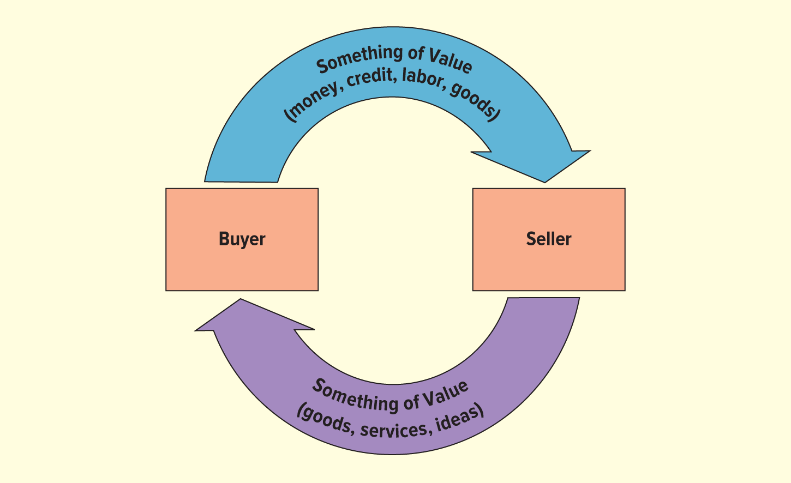
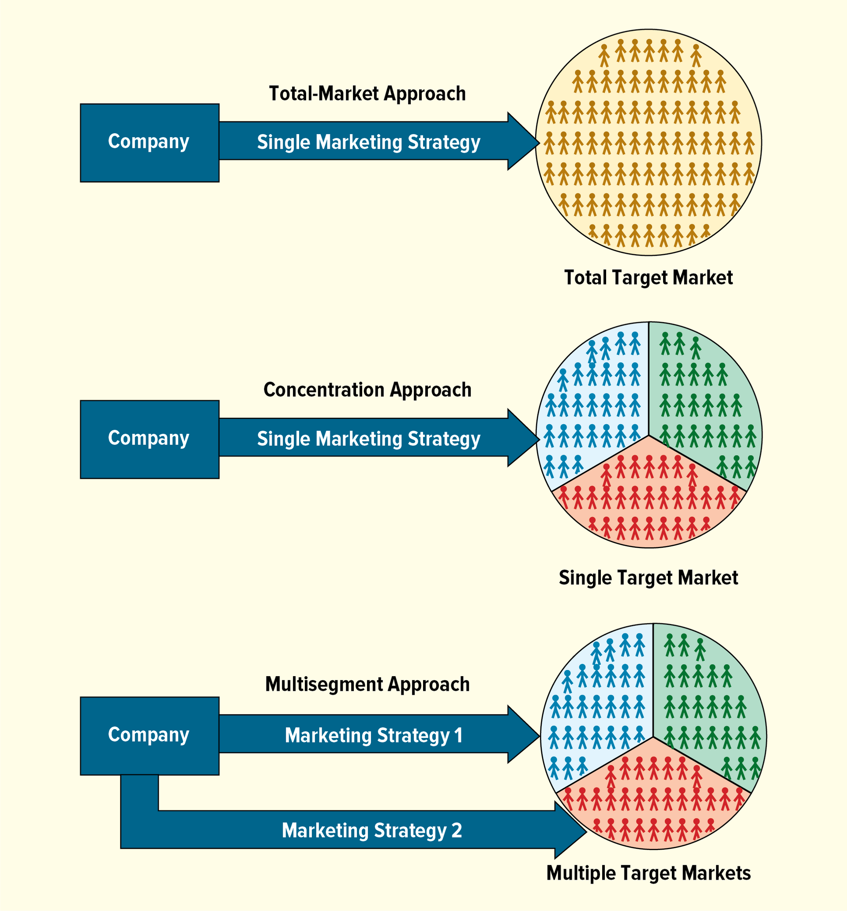
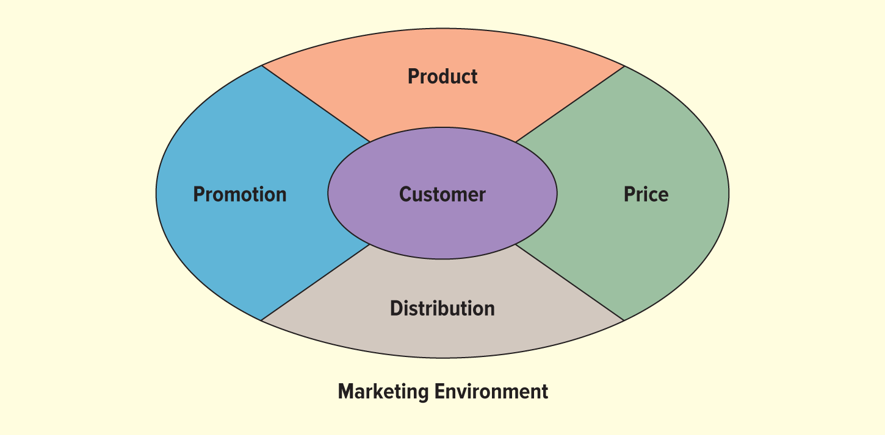
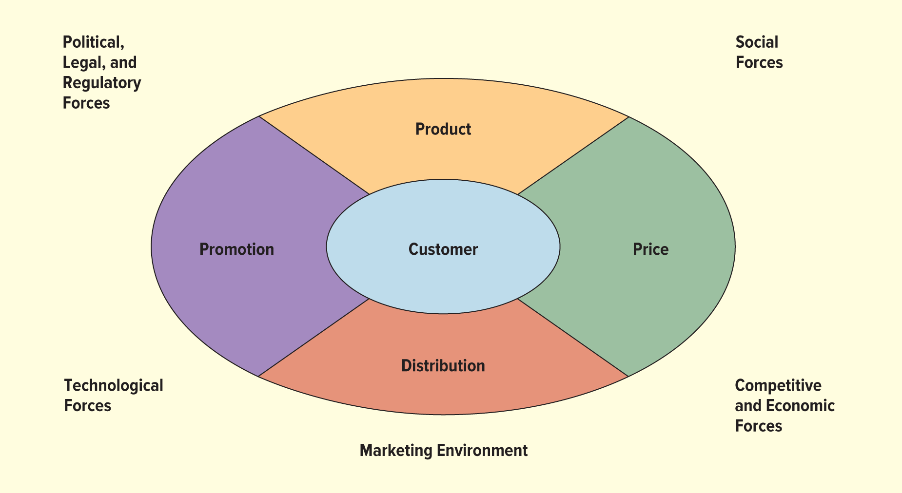

<h1 id="Chapter_11._Customer-Driven_Marketing" style="color:#42A5F5;">Indice</h1>

##### [Capitulo LO 11-1 NATURALEZA DEL MARKETING](#857664)

##### [Capitulo LO 11-2 LA RELACIÓN DE INTERCAMBIO](#233595)

##### [Capitulo LO 11-3 FUNCIONES DEL MARKETING](#430129)

##### [Capitulo LO 11-4 EL CONCEPTO DE MARKETING](#204994)

##### [Capitulo LO 11-5 DESARROLLO DE UNA ESTRATEGIA DE MARKETING](#819632)

##### [Capitulo LO 11-6 INVESTIGACIÓN DE MERCADOS Y SISTEMAS DE INFORMACIÓN](#695434)

##### [Capitulo LO 11-7 EL ENTORNO DE MARKETING](#553439)

<h1 id="857664" style="color:#E65100;">
  <a href="#Chapter_11._Customer-Driven_Marketing" style="color:inherit; text-decoration:none;">
    LO 11-1 NATURALEZA DEL MARKETING
  </a>
</h1>

## Definición de marketing

El marketing es un conjunto de actividades diseñadas para facilitar las transacciones mediante la creación, distribución, fijación de precios y promoción de productos (bienes, servicios e ideas).

También se define como un enfoque sistemático para satisfacer las necesidades y los deseos de los clientes.

## Importancia del marketing

Una parte vital de cualquier negocio son las actividades de marketing. Estas actividades crean valor al permitir que individuos y organizaciones obtengan lo que necesitan y desean. Un negocio no puede lograr sus objetivos a menos que proporcione algo que los clientes valoren.

Sin embargo, no es suficiente con crear un producto innovador que satisfaga las necesidades de muchos usuarios en el volátil mercado global actual. Los productos deben estar disponibles de manera conveniente, tener precios competitivos y ser promocionados de forma única.

### Ejemplo: Netflix

Netflix ofrece un producto de alta calidad que satisface las necesidades de muchas personas. Pero cuando la empresa restringió el uso compartido de cuentas e introdujo restricciones de ubicación en países seleccionados, algunos usuarios cancelaron sus cuentas porque sintieron que el servicio ya no era conveniente.

## El marketing dentro de la empresa

El marketing es una parte importante de la estrategia general de una empresa. Las otras áreas funcionales del negocio (como operaciones, finanzas y todas las áreas de la gestión) deben coordinarse con las decisiones de marketing.

El marketing tiene la función importante de proporcionar los ingresos necesarios para mantener una empresa. Solo creando relaciones de confianza y efectivas con los clientes puede una empresa tener éxito a largo plazo.

## Desafíos del marketing

Las empresas intentan responder a los deseos y necesidades de los consumidores, así como anticipar los cambios en el entorno. Desafortunadamente, es difícil entender y predecir lo que los consumidores quieren porque:

- Los motivos de compra a menudo no son claros.
- Pocos principios pueden aplicarse de manera consistente.
- Los mercados tienden a fragmentarse, y cada segmento desea productos personalizados, nuevo valor o un mejor servicio.

## Lo que NO es el marketing

Es importante señalar lo que **no** es el marketing:

- **No** es manipular a los clientes para que compren productos que no desean.
- **No** es solo publicidad y ventas.

El marketing es un enfoque sistemático para satisfacer a los consumidores, enfocándose en muchas actividades (planificación, fijación de precios, promoción y distribución) que facilitan los intercambios.

## Valor del marketing

Desafortunadamente, los medios de comunicación y las películas a veces retratan el marketing como algo poco ético o que no agrega valor a los negocios. En este capítulo, señalamos que el marketing es esencial y proporciona importantes beneficios al hacer que los productos estén disponibles para los consumidores.

<h1 id="233595" style="color:#E65100;">
  <a href="#Chapter_11._Customer-Driven_Marketing" style="color:inherit; text-decoration:none;">
    LO 11-2 LA RELACIÓN DE INTERCAMBIO
  </a>
</h1>

## Definición del proceso de intercambio

El intercambio es el acto de dar una cosa (dinero, crédito, trabajo o bienes) a cambio de otra cosa (bienes, servicios o ideas). Es el corazón de todos los negocios.

</img>

## Condiciones para que ocurra un intercambio

Para que un intercambio ocurra, se requieren ciertas condiciones:

- Los compradores y vendedores deben poder comunicarse sobre "algo de valor" disponible para cada uno.
- Cada participante debe estar dispuesto a renunciar a "algo de valor" para recibir el "algo" que posee la otra parte.

## El intercambio voluntario

Las empresas intercambian sus bienes, servicios o ideas por dinero o crédito proporcionado por los clientes en una **relación de intercambio voluntario**.

El comprador debe sentirse bien acerca de la compra; de lo contrario, el intercambio no continuará. Por ejemplo:

- Si tu servicio de telefonía celular funciona en todas partes, probablemente te sentirás bien usando sus servicios.
- Pero si tienes muchas llamadas cortadas, probablemente usarás otro servicio de telefonía la próxima vez.

## ¿Qué motiva el intercambio?

Tú estás dispuesto a intercambiar tu "algo de valor" (tu dinero o crédito) por refrescos, boletos de fútbol o zapatos nuevos porque consideras que esos productos son más valiosos o más importantes que mantener tu efectivo o tu potencial de crédito.

## Más allá del producto tangible

Cuando piensas en productos de marketing, puedes pensar en cosas tangibles: autos, teléfonos inteligentes o palos de golf, por ejemplo.

Sin embargo, lo que los consumidores realmente quieren es una forma de hacer un trabajo, resolver un problema u obtener algo de disfrute:

- Puedes comprar una aspiradora Shark no porque quieras una aspiradora, sino porque quieres alfombras limpias.
- Starbucks sirve bebidas de café a un precio premium, proporcionando conveniencia, calidad y un ambiente acogedor. La empresa afirma que no está en el "negocio del café sirviendo a personas", sino en el "negocio de las personas sirviendo café".

## El valor intangible

Por lo tanto, el producto tangible en sí mismo puede no ser tan importante como la imagen o los beneficios asociados con el producto. Ese "algo de valor" intangible puede ser:

- La capacidad obtenida al usar un producto.
- La imagen evocada por el producto.
- Incluso el nombre de la marca.

### Ejemplos de nombres de marca fáciles de recordar

- Pringles (papas fritas)
- Tide (detergente)
- Ford F-150 (camioneta)

### Bonus adicional

La etiqueta o el nombre de la marca, como "The Pink Stuff" (pasta de limpieza multiusos), puede ofrecer la ventaja adicional de ser un tema de conversación en un entorno social.

<h1 id="430129" style="color:#E65100;">
  <a href="#Chapter_11._Customer-Driven_Marketing" style="color:inherit; text-decoration:none;">
    LO 11-3 FUNCIONES DEL MARKETING
  </a>
</h1>

## Definición de las funciones del marketing

El marketing se enfoca en un complejo conjunto de actividades que deben realizarse para lograr objetivos y generar intercambios. Estas actividades incluyen: compra, venta, transporte, almacenamiento, clasificación (grading), financiamiento, investigación de mercados y análisis de datos, y asunción de riesgos.

## Compra

Toda persona que compra productos (consumidores, tiendas, negocios, gobierno) decide si comprar y qué comprar. Un mercadólogo debe entender las necesidades y deseos de los compradores para determinar qué productos poner a disposición.

## Venta

El proceso de intercambio se facilita a través de la venta. Los mercadólogos suelen ver la venta como una actividad persuasiva que se logra mediante la promoción (publicidad, venta personal, promoción de ventas, publicidad no pagada —publicity— y empaque).

## Transporte

El transporte es el proceso de mover productos del vendedor al comprador. Los mercadólogos se enfocan en los costos y servicios de transporte.

## Almacenamiento

Al igual que el transporte, el almacenamiento es parte de la distribución física de los productos e incluye el depósito de mercancías en almacenes. Los almacenes conservan algunos productos durante largos períodos para crear **utilidad de tiempo**. La utilidad de tiempo tiene que ver con poder satisfacer la demanda de manera oportuna.

Esto se aplica especialmente a productos estacionales como el jugo de naranja. Las naranjas frescas solo están disponibles durante unos meses al año, pero los consumidores demandan jugo durante todo el año. Los vendedores deben organizar el almacenamiento en frío del concentrado de jugo de naranja para mantener un suministro constante todo el tiempo.

Por lo general, es imposible almacenar servicios porque implican una actuación en vivo (performance).

## Clasificación (Grading)

La clasificación se refiere a estandarizar productos dividiéndolos en subgrupos y mostrándolos y etiquetándolos para que los consumidores comprendan claramente su naturaleza y calidad.

Muchos productos, como carne, acero y frutas, se clasifican según un conjunto de estándares que a menudo establece el gobierno estatal o federal. Incluso servicios como un lavado de autos tienen diferentes niveles de servicio.

## Financiamiento

Para muchos productos, especialmente artículos grandes como automóviles, refrigeradores y casas nuevas, el mercadólogo arregla crédito para facilitar la compra. Los servicios de "Compre ahora, pague después" (BNPL por sus siglas en inglés) como Afterpay, Klarna y Affirm han sido cada vez más populares.

## Investigación de mercados y análisis de datos

A través de la investigación, los mercadólogos determinan la necesidad de nuevos bienes y servicios. Al recopilar información regularmente, los mercadólogos pueden detectar nuevas tendencias y cambios en los gustos de los consumidores. El análisis de datos (data analytics) se utiliza ampliamente para comprender a los consumidores.

## Asunción de riesgos

El riesgo es la posibilidad de pérdida asociada con las decisiones de marketing. Desarrollar un nuevo producto crea una posibilidad de pérdida si a los consumidores no les gusta lo suficiente como para comprarlo. Gastar dinero para contratar una fuerza de ventas o para realizar investigaciones de mercado también implica riesgo. La implicación del riesgo es que la mayoría de las decisiones de marketing resultan en éxito o fracaso.

## Creación de valor con el marketing

El valor es un elemento importante para gestionar relaciones a largo plazo con los clientes e implementar el concepto de marketing.

### Fórmula del valor para el cliente

**Valor para el cliente = Beneficios del cliente − Costos del cliente**

### Beneficios del cliente

Los beneficios del cliente incluyen cualquier cosa que un comprador recibe en un intercambio.

#### Ejemplo: Hoteles y moteles

Básicamente, los hoteles y moteles proporcionan una habitación con cama y baño, pero cada empresa ofrece un nivel diferente de servicio, comodidades y ambiente para satisfacer a sus huéspedes:

- **Motel 6** ofrece los servicios mínimos necesarios para mantener un alojamiento nocturno de calidad, eficiente y de bajo precio.
- **Ritz-Carlton** proporciona todos los servicios imaginables que un huésped podría desear y se esfuerza por garantizar que todos los servicios sean de la más alta calidad.
- **Airbnb** distingue a los anfitriones que van más allá como "Superhosts".

Los clientes juzgan qué tipo de alojamiento les ofrece el mejor valor según los beneficios que desean y su disposición y capacidad para pagar los costos asociados con esos beneficios.

### Costos del cliente

Los costos del cliente incluyen cualquier cosa que un comprador debe renunciar para obtener los beneficios que el producto proporciona.

- **Costo monetario obvio:** El precio del producto.
- **Costos no monetarios:** Pueden ser igualmente importantes en la determinación del valor por parte del cliente.

#### Costos no monetarios importantes

1. **Tiempo y esfuerzo** que los clientes gastan para encontrar y comprar los productos deseados. Para reducir tiempo y esfuerzo, una empresa puede aumentar la disponibilidad del producto, haciéndolo más conveniente para los compradores.

2. **Riesgo** – Puede reducirse ofreciendo garantías gratuitas o pagadas.

### Ejemplos de reducción de riesgos

- **Vistaprint** utiliza una garantía para reducir el riesgo involucrado en pedir mercancía de sus catálogos.
- Muchos minoristas en línea como **Nordstrom** y **Sephora** ofrecen envíos de devolución gratuitos.
- Empresas que ofrecen garantías gratuitas de por vida: **Zippo**, **Craftsman** y **JanSport**.

<h1 id="204994" style="color:#E65100;">
  <a href="#Chapter_11._Customer-Driven_Marketing" style="color:inherit; text-decoration:none;">
    LO 11-4 EL CONCEPTO DE MARKETING
  </a>
</h1>

## Definición del concepto de marketing

El **concepto de marketing** es una filosofía básica que guía todas las actividades de marketing. Se define como la idea de que una organización debe tratar de satisfacer las necesidades de los clientes a través de un conjunto coordinado de actividades que también le permitan alcanzar sus propias metas.

## Explicación del concepto de marketing y sus implicaciones para desarrollar estrategias de marketing

Según el concepto de marketing, un negocio debe descubrir qué desean los consumidores y luego desarrollar el bien, servicio o idea que satisfaga sus necesidades o deseos. El negocio debe entonces hacer llegar el producto al cliente. Además, debe alterar, adaptar y desarrollar productos continuamente para mantener el ritmo de las cambiantes necesidades y deseos de los consumidores.

Por ejemplo, Kraft se ha enfocado en reducir lentamente el contenido de sal y azúcar en sus productos desde la década de 1980, a medida que los consumidores se han vuelto cada vez más conscientes del consumo de sal y azúcar y de la nutrición. Para seguir siendo competitivas, las empresas deben estar preparadas para añadir o adaptar sus líneas de productos para satisfacer los deseos de los clientes ante nuevos cambios en los hábitos. Como se ve en el anuncio publicitario, para atraer al creciente mercado de la salud y el bienestar, Oscar Mayer introdujo una línea de tablas de carne y queso naturales que se anuncian como sin ingredientes artificiales, sin conservantes artificiales, y sin nitratos o nitritos añadidos. Cada negocio debe determinar cómo implementar mejor el concepto de marketing, dados sus propios objetivos y recursos.

## El equilibrio entre la satisfacción del cliente y los objetivos de la empresa

Aunque la satisfacción del cliente es la meta del concepto de marketing, un negocio también debe lograr sus propios objetivos, tales como aumentar la productividad, reducir costos o alcanzar un porcentaje de un mercado específico. Si no lo hace, no sobrevivirá. Por ejemplo, Lenovo podría vender computadoras por $50 y dar a los clientes una garantía de por vida, lo que sería genial para los clientes pero no tan bueno para Lenovo. Obviamente, la empresa debe lograr un equilibrio entre alcanzar sus objetivos organizacionales y satisfacer a los clientes.

## Cómo implementar el concepto de marketing

Para implementar el concepto de marketing, una empresa debe tener buena información sobre lo que los consumidores quieren, adoptar una orientación al consumidor, y coordinar sus esfuerzos en toda la organización; de lo contrario, puede terminar con bienes, servicios e ideas que los consumidores no quieren o necesitan.

Implementar exitosamente el concepto de marketing requiere que un negocio vea la percepción del valor por parte del cliente como la medida última del desempeño laboral, y la mejora del valor, y la velocidad a la que se realiza, como la medida del éxito.

## El rol de todos los empleados

Todos en la organización que interactúan con los clientes (todos los empleados de contacto con el cliente) deben saber qué quieren los clientes. No solo están vendiendo bienes y servicios, sino también ideas, beneficios, filosofías y experiencias.

## El mito de la mejor ratonera

Alguien dijo una vez que si construyes una mejor ratonera, el mundo hará una fila hasta tu puerta. Supongamos que construyes una mejor ratonera. ¿Qué pasará? En realidad, los consumidores probablemente no harán fila a tu puerta porque el mercado es muy competitivo. Se necesita un esfuerzo coordinado de todos los involucrados con la ratonera para vender el producto. Tu empresa debe llegar a los clientes y decirles acerca de tu ratonera, especialmente cómo tu ratonera funciona mejor que las ofrecidas por los competidores. Si no haces que los beneficios de tu producto sean ampliamente conocidos, en la mayoría de los casos no será exitoso.

## El ejemplo de Apple

Una razón por la que Apple es tan exitosa es debido a sus tiendas. Las más de 500 tiendas minoristas nacionales e internacionales de Apple comercializan computadoras y productos electrónicos de una manera única, diferente a cualquier otro fabricante de computadoras o establecimiento minorista. Las tiendas exclusivas, ubicadas en distritos comerciales de alto nivel, muestran los productos de Apple en espacios modernos y amplios para alentar a los consumidores a probar cosas nuevas, como hacer una película en una computadora. Así que para algunas empresas, como Apple, es necesario crear tiendas para vender tu producto a los consumidores. También podrías encontrar tiendas que estén dispuestas a vender tu producto a los consumidores por ti.

## Conclusión

En cualquier situación, debes implementar el concepto de marketing creando un producto con beneficios satisfactorios y haciéndolo disponible y visible.

## 1. Orientación a la producción (Production Orientation)

### Definición

La orientación a la producción es una filosofía empresarial que se enfoca en la eficiencia de la producción y la amplia disponibilidad de los productos, bajo el supuesto de que los consumidores favorecerán aquellos productos que sean ampliamente accesibles y de bajo costo.

### Desarrollo histórico

Durante la segunda mitad del siglo XIX, la Revolución Industrial estaba bien avanzada en los Estados Unidos. Nuevas tecnologías, como la electricidad, los ferrocarriles, los motores de combustión interna y las técnicas de producción masiva, hicieron posible fabricar bienes con una eficiencia cada vez mayor. Junto con nuevas ideas de gestión y formas de usar el trabajo, los productos fluían hacia el mercado, donde la demanda de productos manufacturados era fuerte. Ward pudo desarrollar ventas por catálogo con productos entregados por ferrocarril.

## 2. Orientación a las ventas (Sales Orientation)

### Definición

La orientación a las ventas es una filosofía empresarial que considera que las ventas (especialmente la venta personal y la publicidad) son el medio principal para aumentar las ganancias, bajo el supuesto de que los consumidores no comprarán suficientes productos a menos que sean agresivamente persuadidos.

### Desarrollo histórico

A principios del siglo XX, la oferta alcanzó y luego superó a la demanda debido a los avances en tecnología y transporte. Durante la primera mitad del siglo XX, los empresarios veían las ventas como el medio principal para aumentar las ganancias, en lo que se ha conocido como una **orientación a las ventas**. Quienes adoptaron esta perspectiva creían que las actividades de marketing más importantes eran la venta personal y la publicidad. Hoy en día, algunas personas todavía equiparan incorrectamente el marketing con una orientación a las ventas.

## 3. Orientación al mercado (Market Orientation)

### Definición

La orientación al mercado es una filosofía empresarial que requiere que las organizaciones recopilen información sobre las necesidades de los clientes, compartan esa información en toda la empresa y la utilicen para ayudar a construir relaciones a largo plazo con los clientes. Implica ser receptivo a las necesidades y deseos de los clientes, que están en constante cambio.

### Desarrollo histórico

Para la década de 1950, algunos empresarios comenzaron a reconocer que ni siquiera la producción eficiente y la promoción extensiva garantizaban las ventas. Estos negocios, y muchos otros desde entonces, descubrieron que primero debían determinar qué querían los clientes y luego producirlo. Algunas empresas siempre han adoptado este enfoque. Los gerentes de General Electric sugirieron por primera vez que el concepto de marketing era una filosofía empresarial de toda la compañía. A medida que más organizaciones se dieron cuenta de la importancia de satisfacer las necesidades de los clientes, los negocios estadounidenses entraron en la **era del marketing**, una era de orientación al mercado.

### Características de la orientación al mercado

La orientación al mercado está vinculada a la innovación de nuevos productos mediante el desarrollo de un enfoque estratégico para explorar y desarrollar nuevos productos que sirvan a los mercados objetivo.

#### Ejemplo: Fenty Beauty

Fenty Beauty ha tenido un gran éxito en servir a su mercado objetivo al enfocarse en la inclusividad en sus productos, atendiendo una amplia gama de tonos y tipos de piel, de una manera que relativamente pocas empresas de cosméticos hicieron en el pasado.

### Cooperación interna

Los altos ejecutivos, los gerentes de marketing, los gerentes no comerciales (los de producción, finanzas, recursos humanos, etc.) y los clientes se vuelven mutuamente dependientes y cooperan para desarrollar y ejecutar una orientación al mercado. Los gerentes no comerciales deben comunicarse con los gerentes de marketing para compartir información importante para entender al cliente.

#### Ejemplo: Wrigley's (más de 130 años de historia)

En 1891, el chicle se regalaba para promover la venta de polvo de hornear (el producto original de la compañía). El chicle se lanzó como su propio producto en 1893. Después de cuatro generaciones de directores ejecutivos de la familia Wrigley, la compañía continúa reinventándose y enfocándose en los consumidores. Eventualmente, la familia tomó la decisión de vender la compañía a Mars. Wrigley ahora funciona como una subsidiaria independiente de Mars. El acuerdo combinó marcas populares como los chicles Wrigley's y Life Savers con los M&M's, Snickers y Skittles de Mars para formar la compañía de confitería más grande del mundo. Sus productos continúan evolucionando y satisfaciendo a los clientes.

### Desafíos actuales

Tratar de saber lo que los consumidores quieren, que ya es difícil de por sí, se complica aún más por la velocidad a la que pueden cambiar las tendencias, las modas y los gustos. Las empresas deben poder responder rápidamente a las tendencias cambiantes y las necesidades de los clientes.

#### Ejemplo: Chipotle Mexican Grill

Cuando una marca o un producto se vuelve viral de la noche a la mañana en plataformas de redes sociales, los gerentes deben comunicarse rápidamente para ejecutar la orientación al mercado. Para Chipotle Mexican Grill, una quesadilla fuera del menú compartida por un influencer en TikTok causó problemas en la cadena de suministro del restaurante y desafíos para los empleados. Los gerentes de Chipotle decidieron que el mejor curso de acción era introducir oficialmente el artículo del menú, pero tomó varios meses implementar el plan, dejando a muchos preguntándose si la empresa se perdió el hype creado por sus clientes.

## Importancia de las relaciones a largo plazo con los clientes

Las empresas de hoy quieren satisfacer a los clientes y construir relaciones significativas y a largo plazo con ellos. Es más eficiente y menos costoso para una empresa retener a los clientes existentes e incluso aumentar la cantidad de negocio que cada cliente proporciona a la organización, que encontrar nuevos clientes.

### Costo de adquisición de clientes (Customer Acquisition Cost)

El **costo de adquisición de clientes** se refiere al costo asociado con atraer nuevos clientes para que compren un producto. Se calcula dividiendo el costo total de ventas y marketing por el número de nuevos clientes adquiridos.

### Construcción de relaciones

El éxito de la mayoría de las empresas depende de aumentar la cantidad de negocios repetidos. Por lo tanto, la construcción de relaciones entre la empresa y el cliente es clave. Muchas empresas están aprendiendo a utilizar tecnologías asociadas con la **gestión de relaciones con los clientes (CRM)** para ayudar a construir relaciones y aumentar los negocios con los clientes existentes. Se proyecta que el mercado de software de gestión de relaciones con los clientes alcance los **$114 mil millones para 2030**.

## Customer Relationship Management (CRM)

Aunque podría ser fácil descartar la gestión de relaciones con los clientes (CRM) como algo que consume tiempo y es costoso, este error podría destruir una empresa. El CRM es importante en una orientación al mercado porque puede resultar en clientes leales y rentables. Sin clientes leales, las empresas no sobrevivirían. Por lo tanto, lograr el potencial de ganancia total de cada relación con el cliente debería ser el objetivo de toda estrategia de marketing.

### Cómo obtener ganancias a través de las relaciones

En el nivel más básico, se pueden obtener ganancias a través de las relaciones mediante:

1. **Adquirir** nuevos clientes
2. **Mejorar la rentabilidad** de los clientes existentes
3. **Extender la duración** de las relaciones con los clientes

### Valor de por vida del cliente (Customer Lifetime Value)

La rentabilidad de los clientes leales a lo largo de su relación con la empresa (su **valor de por vida del cliente**) no debe subestimarse.

#### Ejemplo: Peloton

Peloton declaró que no le importaba si perdía dinero en su equipo porque genera otros flujos de ingresos saludables, como su negocio de suscripción. En cambio, la empresa se enfoca en la relación entre el valor de por vida del cliente y los costos de adquisición de clientes.

## La comunicación en las relaciones con los clientes

La comunicación sigue siendo un elemento importante de cualquier estrategia para desarrollar y gestionar relaciones a largo plazo con los clientes. Al proporcionar múltiples puntos de interacción con los clientes (sitios web, teléfono, redes sociales, correo electrónico y contacto personal), las empresas pueden personalizar las relaciones con los clientes.

### Ejemplo: Amazon

Al igual que muchos minoristas en línea, Amazon almacena y analiza los datos de compra en un intento por comprender los intereses de cada cliente. Esta información ayuda al minorista en línea a mejorar su capacidad para satisfacer a cada cliente y, por lo tanto, aumentar las ventas de libros, música, películas y otros productos a cada cliente.

### Enfoque individualizado

La capacidad de identificar a los clientes individuales permite a los mercadólogos cambiar su enfoque: de apuntar a grupos de clientes similares a aumentar su participación en las compras de un cliente individual.

## Conclusión final

Independientemente del medio a través del cual ocurra la comunicación, los clientes deberían ser, en última instancia, los impulsores de la estrategia de marketing porque ellos saben lo que quieren. Los sistemas de gestión de relaciones con los clientes deben asegurar que los mercadólogos escuchen a los clientes para poder responder a sus necesidades e inquietudes y construir relaciones a largo plazo.

# EMPRENDEDORA DE FITNESS MIRROR REFLEXIONA SOBRE LA VENTA DE $500 MILLONES

Cuando se crea un nuevo producto, existen muchos factores que determinan si tendrá éxito o fracasará. Gran parte del éxito de una empresa se basa en las cuatro dimensiones de la mezcla de marketing (producto, precio, distribución y promoción) y en la comprensión del concepto de marketing.

Para Brynn Putnam, la creadora de Mirror, un producto de ejercicio en casa, todo pareció alinearse en el momento adecuado.

Putnam tuvo la idea de un espejo de fitness mucho antes del cierre de los gimnasios durante la pandemia. Cansada de sacrificar calidad por conveniencia, creó un producto llamado Mirror que permite a los usuarios transmitir clases de ejercicio en un espejo reflectante, una forma innovadora de entrenar desde casa. Mirror ocupa poco espacio y ofrece más de 50 tipos de ejercicios con clases en vivo y miles de opciones bajo demanda de entre 5 y 60 minutos mediante una suscripción mensual. La adopción del producto aumentó durante la pandemia de COVID-19, cuando las personas buscaban soluciones para hacer ejercicio en casa.

Putnam creó un producto innovador, pero fue Lululemon Athletica quien invirtió fuertemente en la promoción. Putnam vendió Mirror a esta empresa de ropa deportiva de alta gama por $500 millones. Lululemon impulsó la promoción colocando el producto en varias de sus tiendas físicas, permitiendo que los clientes lo probaran. Los consumidores podían reservar una demostración y experimentar un entrenamiento. Este elemento de prueba le dio ventaja frente a productos similares más baratos.

Más tarde, Lululemon cambió el nombre del producto a Lululemon Studio Mirror. También reemplazó la suscripción original con su propio programa, Lululemon Studio, que incluye las funciones originales y clases de estudios como Pure Barre y Yoga Six. Además, redujo el precio a $795. La membresía también ofrece beneficios adicionales como descuentos en clases, acceso a entrenamientos presenciales y promociones en tiendas. Esto permitió escalar el producto, uno de los mayores retos en la industria del fitness.

---

## Preguntas de Pensamiento Crítico

### 1. ¿Qué necesidad satisface un fitness mirror?

Un fitness mirror satisface la necesidad de **hacer ejercicio de forma conveniente y de alta calidad desde casa**. Permite a las personas entrenar sin ir al gimnasio, ahorrando tiempo y ofreciendo flexibilidad. También responde a la necesidad de **privacidad**, **comodidad** y **personalización** en las rutinas de ejercicio.

---

### 2. Discute las ventajas y desventajas de cambiar el nombre a Lululemon Studio Mirror.

**Ventajas:**
- Mayor reconocimiento de marca gracias a Lululemon.
- Incremento en la confianza del consumidor.
- Acceso a una base de clientes ya establecida.
- Integración con más servicios de fitness.
- Mejor promoción y distribución en tiendas físicas.

**Desventajas:**
- Pérdida de la identidad original de Mirror.
- Puede limitar su atractivo a clientes de Lululemon.
- Posible confusión durante el cambio de marca.
- Aún puede percibirse como un producto costoso.

---

### 3. ¿Quién es el público objetivo del Lululemon Studio Mirror?

El público objetivo incluye:
- **Personas interesadas en la salud y el bienestar**.
- **Profesionales ocupados** que prefieren entrenar en casa.
- **Consumidores con ingresos medios-altos**.
- **Clientes de Lululemon**.
- **Personas familiarizadas con la tecnología**.
- **Usuarios que buscan comodidad y variedad** en sus entrenamientos.

<h1 id="819632" style="color:#E65100;">
  <a href="#Chapter_11._Customer-Driven_Marketing" style="color:inherit; text-decoration:none;">
    LO 11-5 DESARROLLO DE UNA ESTRATEGIA DE MARKETING
  </a>
</h1>

## Definición de estrategia de marketing

Para implementar el concepto de marketing y la gestión de relaciones con los clientes, una empresa necesita desarrollar y mantener una **estrategia de marketing**. Una estrategia de marketing es un plan de acción para desarrollar, fijar precios, distribuir y promover productos que satisfagan las necesidades de clientes específicos.

## Selección de un mercado objetivo

Para implementar el concepto de marketing y la gestión de relaciones con los clientes, una empresa necesita desarrollar y mantener una estrategia de marketing, que es un plan de acción para desarrollar, fijar precios, distribuir y promover productos que satisfagan las necesidades de clientes específicos. Esta definición tiene dos componentes principales: seleccionar un mercado objetivo y desarrollar una mezcla de marketing apropiada para satisfacer ese mercado objetivo.

¿Qué es exactamente un mercado? Un mercado es un grupo de personas que tienen una necesidad, poder de compra, y el deseo y la autoridad para gastar dinero en bienes, servicios e ideas. Un mercado objetivo es un grupo más específico de clientes en cuyas necesidades y deseos una empresa enfoca sus esfuerzos de marketing. Los mercados objetivo pueden dividirse en dos categorías: mercados empresariales y mercados de consumidores.

El marketing business-to-business (B2B) implica comercializar productos a clientes que utilizarán el producto para reventa, para uso directo en sus operaciones diarias, o para uso directo en la fabricación de otros productos. John Deere, por ejemplo, vende equipos de movimiento de tierra a empresas de construcción y tractores a agricultores. La mayoría de las personas, sin embargo, tienden a pensar en el marketing business-to-consumer (B2C), que es la comercialización directamente al consumidor final. A veces, los productos son utilizados por ambos tipos de mercado. Por ejemplo, Glo Skin Beauty vende sus cosméticos y productos para el cuidado de la piel tanto al por mayor a salones y spas, como directamente a los consumidores a través de su sitio web.

Los gerentes de marketing pueden definir un mercado objetivo como un número relativamente pequeño de personas dentro de un mercado más grande, o pueden definirlo como el mercado total. Rolls-Royce, por ejemplo, enfoca sus productos a un mercado muy exclusivo y de altos ingresos: personas que desean lo último en prestigio en un automóvil. Por otro lado, Ford Motor Company fabrica una variedad de vehículos, incluyendo Lincolns y camionetas Ford, para atraer a diferentes gustos, necesidades y deseos.

Algunas empresas utilizan un enfoque de mercado total, en el que tratan de atraer a todos los consumidores y asumen que todos los compradores tienen necesidades y deseos similares. Los vendedores de sal, azúcar y productos agrícolas utilizan un enfoque de mercado total porque todos son consumidores potenciales de estos productos. Este enfoque también se conoce como marketing masivo. La mayoría de las empresas, sin embargo, utilizan segmentación de mercado y dividen el mercado total en grupos de personas.

Un segmento de mercado es una colección de individuos, grupos u organizaciones que comparten una o más características y, por lo tanto, tienen necesidades y deseos de productos relativamente similares. Por ejemplo, las mujeres son un gran segmento de mercado. A nivel del hogar, la segmentación puede identificar los atributos sociales de cada mujer, su cultura y su etapa en la vida para determinar preferencias y necesidades.

Otro segmento de mercado en el que muchos mercadólogos se están enfocando es la creciente población asiática en los Estados Unidos, con una población de más de 20 millones y un poder de compra de más de $1.2 billones. Hay más de 60 millones de hispanos en los Estados Unidos con un poder de compra de más de $1.7 billones. Las organizaciones que deseen anunciarse a estos grupos deben demostrar una comprensión del segmento del mercado o correr el riesgo de alienarlos. Las empresas esperan crear relaciones con los consumidores hispanos para ganar su lealtad. Uno de los desafíos para los mercadólogos en el futuro será abordar efectivamente un Estados Unidos cada vez más multicultural. En las próximas décadas, se espera que el poder adquisitivo de los estadounidenses asiáticos, negros e hispanos crezca a pasos agigantados. Las empresas tendrán que aprender cómo llegar efectivamente a estos segmentos en crecimiento.

Las empresas utilizan la segmentación de mercado para enfocar sus esfuerzos y recursos en mercados objetivo específicos, de modo que puedan desarrollar una estrategia de marketing productiva. Dos enfoques comunes para segmentar mercados son el enfoque de concentración y el enfoque multisegmento.

## FIGURE 11.2 Target Market Strategies

</img>

# TABLA 11.1 Poder de Compra en Estados Unidos por Raza/Etnicidad

| Grupo Racial/Étnico | Participación en la Población de EE.UU. | Participación en el Poder de Compra | Poder de Compra | Aumento Porcentual en el Poder de Compra* |
|---------------------|------------------------------------------|----------------------------------------|-----------------|---------------------------------------------|
| Blancos (White)     | 76.20%                                   | 81.7%                                  | $13.2 billones  | 39.50%                                      |
| Negros (Black)      | 13.40%                                   | 8.9%                                   | $1.4 billones   | 48.10%                                      |
| Asiáticos (Asian)   | 6.30%                                    | 7.1%                                   | $1.2 billones   | 89.50%                                      |
| Hispanos (Hispanic) | 18.60%                                   | 10.7%                                  | $1.7 billones   | 69.10%                                      |
| Nativos Americanos (American Indian) | 1.30%                   | 0.8%                                   | $126.8 mil millones | 51.80%                                  |
| Multirraciales (Multiracial) | 2.80%                            | 1.6%                                   | $253.9 mil millones | 73.60%                                  |

> *Aumento porcentual en el poder de compra entre 2010 y 2019.

**Fuente:** Catalyst, "Buying Power: Quick Take," April 27, 2020, www.catalyst.org/research/buying-power/ (consultado el 17 de febrero de 2023).

## ENFOQUES DE SEGMENTACIÓN DE MERCADO

### Enfoque de concentración

En el **enfoque de concentración**, una empresa desarrolla una sola estrategia de marketing para un único segmento de mercado. Este enfoque permite a la empresa especializarse, enfocando todos sus esfuerzos en un solo segmento de mercado. Porsche, por ejemplo, dirige todos sus esfuerzos de marketing hacia individuos de altos ingresos que desean vehículos de alto rendimiento. Una empresa puede generar un gran volumen de ventas al penetrar profundamente en un solo segmento de mercado. El enfoque de concentración puede ser especialmente efectivo cuando una empresa puede identificar y desarrollar productos para un segmento ignorado por otras empresas de la industria.

### Enfoque multisegmento

En el **enfoque multisegmento**, el mercadólogo dirige sus esfuerzos de marketing hacia dos o más segmentos, desarrollando una estrategia de marketing para cada uno. Muchas empresas utilizan un enfoque multisegmento que incluye diferentes mensajes publicitarios para diferentes segmentos. Las empresas también desarrollan variaciones de productos para atraer a diferentes segmentos de mercado. El Servicio Postal de los Estados Unidos, por ejemplo, ofrece sellos personalizados, mientras que Mars Inc. vende M&M's personalizados. Muchas otras empresas también intentan utilizar el enfoque multisegmento para la segmentación de mercado, como el fabricante de bicicletas Raleigh, que ha diseñado estrategias de marketing separadas para corredores, turistas y ciclistas casuales.

### Nicho de marketing

El **nicho de marketing** es un enfoque en un segmento de mercado estrecho, donde los esfuerzos se dirigen a un grupo pequeño y bien definido que tiene un conjunto único y específico de necesidades. Por ejemplo, Myabetic produce estuches y bolsas elegantes y de alta calidad que fueron diseñados específicamente para personas con diabetes que llevan suministros médicos como almohadillas de alcohol, insulina, medidores de glucosa en sangre, tiras reactivas y más. Los segmentos de nicho suelen ser muy pequeños en comparación con el mercado total del producto. Freshpet fabrica alimento gourmet totalmente natural para mascotas que imita el tipo de alimento que les gusta a los humanos. Esta empresa está dirigida a un nicho creciente de dueños de mascotas que quieren la mejor comida para sus mascotas.

### Requisitos para una segmentación exitosa

Para que una empresa utilice con éxito un enfoque de concentración o multisegmento para la segmentación de mercado, deben cumplirse varios requisitos:

1. Las necesidades de los consumidores para el producto deben ser **heterogéneas** (diversas).
2. Los segmentos deben ser **identificables y divisibles**.
3. El mercado total debe dividirse de una manera que permita comparar el potencial de ventas, el costo y las ganancias estimadas de los segmentos.
4. Al menos un segmento debe tener suficiente **potencial de ganancia** para justificar el desarrollo y mantenimiento de una estrategia de marketing especial.
5. La empresa debe poder **llegar** al segmento de mercado elegido con una estrategia de marketing particular.

### Bases para segmentar mercados

Las empresas segmentan los mercados sobre la base de varias variables. A continuación se presentan las principales categorías:

#### 1. Segmentación demográfica

La segmentación demográfica utiliza variables como:
- Edad
- Sexo
- Género
- Raza
- Etnicidad
- Ingresos
- Educación
- Ocupación
- Clase social
- Tamaño de la familia

Estas características suelen estar estrechamente relacionadas con las necesidades de productos y el comportamiento de compra de los clientes, y son fáciles de medir. Por ejemplo, las empresas de yogur a menudo segmentan por edad: yogur de alta proteína para adultos y yogur en tubos fáciles de exprimir para niños.

#### 2. Segmentación geográfica

La segmentación geográfica utiliza variables como:
- Clima
- Terreno
- Recursos naturales
- Densidad de población
- Valores subculturales

Estos factores influyen en las necesidades de los consumidores y en el uso de productos. El clima, por ejemplo, influye en las compras de ropa, automóviles, equipos de calefacción y aire acondicionado, y equipos para actividades recreativas.

#### 3. Segmentación psicográfica

La segmentación psicográfica utiliza variables como:
- Características de personalidad
- Motivos
- Estilos de vida

Los mercadólogos de refrescos, por ejemplo, proporcionan sus productos en varios tipos de envases, incluyendo botellas de dos litros y paquetes de latas, para satisfacer diferentes estilos de vida y motivos.

#### 4. Segmentación conductual (behaviorística)

La segmentación conductual utiliza alguna característica del comportamiento del consumidor hacia el producto. Estas características comúnmente involucran algún aspecto del uso del producto.

**Segmentación por beneficios:** Es un tipo de segmentación conductual. Por ejemplo, los productos alimenticios bajos en grasa y bajos en carbohidratos estarían dirigidos a aquellos que desean los beneficios de una dieta más saludable.

## DESARROLLO DE UNA MEZCLA DE MARKETING

### La mezcla de marketing (marketing mix)

El segundo paso para desarrollar una estrategia de marketing es crear y mantener una mezcla de marketing satisfactoria. La **mezcla de marketing** se refiere a cuatro actividades de marketing (producto, precio, distribución y promoción) que la empresa puede controlar para lograr objetivos específicos dentro de un entorno de marketing dinámico. El comprador o el mercado objetivo es el centro de todas las actividades de marketing.

Amazon es bien conocida por su implementación de la mezcla de marketing. La empresa se involucra regularmente en investigación y desarrollo para crear nuevos productos como su asistente digital Echo. Promociona sus productos a través de publicidad, redes sociales y eventos mediáticos. Generalmente, Amazon es conocida por crear productos asequibles.

</img>

### Producto

Un **producto** (ya sea un bien, un servicio, una idea o alguna combinación) es un conjunto complejo de atributos tangibles e intangibles que proporcionan satisfacción y beneficios.

#### Tipos de productos

- **Bien (good):** Es una entidad física que puedes tocar. Un Nissan Rogue, una Nerf Blaster y un cepillo de dientes son ejemplos de bienes.

- **Servicio (service):** Es la aplicación de esfuerzos humanos y mecánicos a personas u objetos para proporcionar beneficios intangibles a los clientes. Los viajes aéreos, la limpieza en seco, los cortes de cabello, el transporte compartido (ride sharing), la banca, los seguros, la atención médica y el cuidado infantil son ejemplos de servicios.

- **Idea (idea):** Incluye conceptos, consejos, imágenes y cuestiones. Por ejemplo, un abogado, por una tarifa, puede asesorarte sobre qué derechos tienes en caso de que el IRS decida auditar tu declaración de impuestos. Otros mercadólogos de ideas incluyen consejeros, partidos políticos, iglesias y escuelas.

#### Características del producto

Un producto tiene características emocionales y psicológicas, así como físicas, que incluyen todo lo que el comprador recibe de un intercambio. Esta definición incluye servicios de apoyo como instalación, garantías, información del producto y promesas de reparación. Los productos suelen tener atributos tanto favorables como desfavorables; por lo tanto, casi cada compra o intercambio implica compensaciones (trade-offs), ya que los consumidores intentan maximizar sus beneficios y satisfacción mientras minimizan los atributos desfavorables.

#### Importancia del producto

Los productos están entre los contactos más visibles de una empresa con los consumidores. Si no satisfacen las necesidades y expectativas del consumidor, las ventas serán difíciles y la vida útil del producto será breve. Los productos nuevos e innovadores pueden disruptir el mercado. Tesla es considerado por muchos como el líder en vehículos eléctricos, representando una amenaza significativa para fabricantes establecidos como GM y Ford. El producto es una variable importante (a menudo el enfoque central) de la mezcla de marketing; las otras variables (precio, promoción y distribución) deben coordinarse con las decisiones del producto.

> **¿Sabías que?** El IBM Simon, que fue considerado por algunos como el primer teléfono inteligente del mundo, se vendió por $1,099 en 1994. Eso sería alrededor de $2,200 hoy en día.

### Precio

Casi cualquier cosa puede tener un **precio**, que es un valor asignado a un objeto intercambiado entre un comprador y un vendedor. Aunque el vendedor generalmente establece el precio, este puede ser negociado entre el comprador y el vendedor. El comprador generalmente intercambia poder adquisitivo (ingresos, crédito, riqueza) por la satisfacción o utilidad asociada con un producto. Debido a que el precio financiero es la medida de valor comúnmente utilizada en un intercambio, este cuantifica el valor y es la base de la mayoría de las decisiones de marketing.

#### Funciones del precio

Los mercadólogos ven el precio como mucho más que una forma de medir el valor. Es un elemento clave de la mezcla de marketing porque se relaciona directamente con la generación de ingresos y ganancias.

#### Modelos de precios

Los servicios digitales como Disney+ y Spotify siguen un **modelo de precios por suscripción**. La fijación de precios por suscripción está ganando popularidad. La suscripción implica pagar una tarifa regular y hacer un compromiso con el bien o servicio.

#### Flexibilidad del precio

Los precios también pueden cambiarse rápidamente para estimular la demanda o responder a las acciones de los competidores. El aumento en el costo de productos básicos como el petróleo puede crear aumentos de precios o una caída en la demanda del consumidor por un producto. Cuando los precios de la gasolina suben, los consumidores compran automóviles más eficientes en combustible; cuando los precios bajan, los clientes regresan a vehículos más grandes.

### Distribución

La **distribución** (a veces denominada "plaza" porque ayuda a recordar la mezcla de marketing como las "4 Ps") consiste en hacer que los productos estén disponibles para los clientes en las cantidades deseadas. Por ejemplo, los consumidores pueden transmitir una película en línea o ir a la sala de cine.

#### Intermediarios

Los intermediarios (generalmente mayoristas y minoristas) realizan muchas de las actividades necesarias para mover los productos de manera eficiente desde los productores hasta los consumidores o compradores industriales. Estas actividades involucran transporte, almacenamiento, manejo de materiales y control de inventario, así como empaque y comunicación.

#### ¿Por qué no eliminar los intermediarios?

Los críticos que sugieren que eliminar a los mayoristas y otros intermediarios resultaría en precios más bajos para los consumidores no reconocen que eliminar intermediarios no eliminaría la necesidad de sus servicios. Otras instituciones tendrían que realizar esos servicios, y los consumidores todavía tendrían que pagar por ellos. Además, en ausencia de mayoristas, todos los productores tendrían que tratar directamente con minoristas o clientes, manteniendo registros voluminosos y contratando personas adicionales para tratar con los clientes.

### Gestión de la cadena de suministro (SCM)

La **gestión de la cadena de suministro (Supply Chain Management, SCM)** implica mantener un flujo de productos a través de logística, adquisiciones, gestión de inventario, subcontratación, enrutamiento y programación. Esto incluye la adquisición de recursos, inventario y las redes interconectadas que hacen que los productos estén disponibles para los clientes. La SCM requiere que los gerentes de marketing trabajen con otros gerentes en operaciones, logística y adquisiciones.

### Promoción

La **promoción** es una forma persuasiva de comunicación que intenta facilitar un intercambio de marketing influyendo en individuos, grupos u organizaciones para que acepten bienes, servicios o ideas. La promoción incluye publicidad, venta personal, relaciones públicas (publicity), promoción de ventas y marketing directo, temas que examinaremos más de cerca en el capítulo "Dimensiones de la Estrategia de Marketing".

#### Objetivo de la promoción

El objetivo de la promoción es comunicarse directa o indirectamente con individuos, grupos y organizaciones para facilitar intercambios. Cuando los mercadólogos utilizan la publicidad y otras formas de promoción, deben asignar efectivamente sus recursos promocionales y comprender las características del producto y del mercado objetivo para asegurar que estas actividades promocionales contribuyan a los objetivos de la empresa.

#### Ejemplo de promoción: Paddletek

El anuncio de Paddletek es un ejemplo de promoción. Esta campaña publicitaria incluyó anuncios impresos y videos destacando las paletas de pickleball de alta gama de la compañía. El objetivo de esta campaña era conectar con atletas que dedican largas horas de práctica. El anuncio decía: "TÚ NO TIENES LO QUE SE NECESITA. TÚ GANAS LO QUE SE NECESITA" ("YOU DON'T HAVE WHAT IT TAKES. YOU EARN WHAT IT TAKES").

#### Promoción en la era digital

La mayoría de las grandes empresas han establecido sitios web y perfiles en redes sociales para promocionarse a sí mismas y a sus productos. Por ejemplo, L'Oréal opera Makeup.com, un sitio web de belleza que discute marcas de belleza y comparte tutoriales de maquillaje utilizando productos de marcas de L'Oréal como Urban Decay, Maybelline y NYX.

#### Publicidad tradicional vs. digital

Si bien los medios publicitarios tradicionales como la televisión, la radio, los periódicos y las revistas siguen siendo importantes, la publicidad digital en sitios web y redes sociales está creciendo. Se estima que el **64 por ciento de los dólares publicitarios** se destinan a canales digitales.

#### Oportunidades en redes sociales

Además, los sitios de redes sociales ofrecen oportunidades publicitarias tanto para grandes como para pequeñas empresas. Las empresas pueden crear anuncios en todas las principales plataformas de redes sociales, desde TikTok y Twitter hasta Facebook e Instagram.

# LA BELLEZA DE LA ESTRATEGIA DE PRECIOS DE e.l.f.

Con sede en Oakland, California, e.l.f. Beauty Inc. es una empresa de cosméticos y cuidado de la piel. El acrónimo e.l.f. significa *eye, lip and face* (ojos, labios y rostro). Durante más de 18 años, la compañía se ha enfocado en ofrecer productos de alta calidad que son libres de crueldad animal, sin parabenos y veganos a precios bajos.

Ante el aumento de la inflación, e.l.f. subió algunos precios, pero mantuvo intactos sus productos más económicos. La empresa genera aproximadamente $400 millones en ingresos anuales y ha superado a Revlon Inc., que recientemente se declaró en bancarrota, como la cuarta marca más grande del mercado masivo de belleza en Estados Unidos.

La marca e.l.f. es sinónimo de accesibilidad. Sus productos se venden muy por debajo de los precios de tiendas por departamento o Sephora. Por ejemplo, su labial cuesta solo $3. Este enfoque atrae a nuevos compradores. La empresa externaliza su producción a China, lo que le permite obtener ganancias incluso con productos de bajo precio. Además, su operación flexible le permite adaptarse rápidamente a cambios en la oferta y la demanda. Muchos empleados trabajan en China y mantienen relaciones cercanas con proveedores, evitando contratos a largo plazo que limiten su flexibilidad.

Frente a la inflación, el CEO Tarang Amin decidió mantener los precios en aproximadamente un tercio de los productos, incluyendo labiales y máscaras de pestañas. Para equilibrar, la empresa introdujo productos más caros, como kits de maquillaje y cuidado de la piel. Aunque los precios han aumentado cerca de un 10% en promedio, e.l.f. mantiene su compromiso con una estrategia de precios dual.

El uso de precios bajos y números redondos hace que los consumidores noten más fácilmente los aumentos. Sin embargo, al mantener precios en muchos productos, la empresa reduce el riesgo de perder clientes leales.

Además, e.l.f. decidió comunicar sus aumentos de precios directamente a través de redes sociales, algo poco común en marcas de consumo, reforzando su compromiso con la transparencia y la confianza del cliente.

---

## Preguntas de Pensamiento Crítico

### 1. Describe el mercado objetivo de e.l.f.

El mercado objetivo de e.l.f. incluye:
- **Consumidores jóvenes** interesados en maquillaje y cuidado personal.
- **Personas con presupuesto limitado** que buscan productos accesibles.
- **Clientes conscientes de valores éticos**, como productos veganos y libres de crueldad animal.
- **Compradores masivos** que prefieren buena relación calidad-precio.
- **Usuarios principiantes** en maquillaje que buscan opciones económicas.

---

### 2. Describe la estrategia de precios de e.l.f. y cómo ha sido afectada por la inflación.

La estrategia de precios de e.l.f. se basa en:
- **Precios bajos y accesibles** para atraer a una gran cantidad de consumidores.
- Uso de **precios redondos** (como $3) para facilitar el recuerdo.
- **Estrategia dual**, donde mantiene productos baratos mientras introduce otros más caros.

Impacto de la inflación:
- Aumentó los precios en promedio cerca de un 10%.
- Mantuvo precios en productos clave para no perder clientes.
- Introdujo productos premium para compensar los costos.
- Comunicó los cambios de forma transparente para mantener la confianza.

---

### 3. ¿Por qué e.l.f. es más flexible que sus competidores?

e.l.f. es más flexible porque:
- **Externaliza su producción** a China, reduciendo costos.
- **Evita contratos a largo plazo**, lo que le permite cambiar de proveedor fácilmente.
- Tiene **relaciones cercanas con fabricantes**, facilitando ajustes rápidos.
- Puede **adaptarse rápidamente a cambios del mercado**, como variaciones en demanda o inflación.
- Su modelo operativo le permite reaccionar más rápido que empresas tradicionales más rígidas.

<h1 id="695434" style="color:#E65100;">
  <a href="#Chapter_11._Customer-Driven_Marketing" style="color:inherit; text-decoration:none;">
    LO 11-6 INVESTIGACIÓN DE MERCADOS Y SISTEMAS DE INFORMACIÓN
  </a>
</h1>

## Definición de investigación de mercados

Antes de que los mercadólogos puedan desarrollar una mezcla de marketing, deben recopilar información detallada y actualizada sobre las necesidades de los clientes. La **investigación de mercados** es un proceso sistemático y objetivo para obtener información sobre clientes potenciales que guíe las decisiones de marketing. Dicha información puede incluir datos sobre la edad, ingresos, etnicidad, género y nivel educativo de las personas en el mercado objetivo, sus preferencias por características de productos, sus actitudes hacia los productos de la competencia y la frecuencia con la que utilizan el producto.

Por ejemplo, la investigación de mercados ha revelado que los consumidores a menudo toman decisiones de compra en la tienda en **tres segundos o menos**. La investigación de mercados es vital porque el concepto de marketing no puede implementarse sin información sobre los clientes.

## Sistema de información de marketing

Un **sistema de información de marketing** es un marco para acceder a información sobre clientes desde fuentes tanto dentro como fuera de la organización.

### Fuentes internas

Dentro de la organización, hay un flujo continuo de información sobre precios, ventas y gastos.

### Fuentes externas

Fuera de la organización, los datos están fácilmente disponibles a través de informes privados o públicos, estadísticas del censo y muchas otras fuentes.

### Tecnología

La tecnología de redes informáticas proporciona un marco para que las empresas se conecten a bases de datos útiles y a clientes con información instantánea sobre la aceptación de productos, el rendimiento de ventas y el comportamiento de compra. Esta información es importante para la planificación y el desarrollo de estrategias de marketing.

## Tipos de datos

Dos tipos de datos están generalmente disponibles para los tomadores de decisiones:

### Datos primarios (Primary data)

Los **datos primarios** son observados, registrados o recopilados directamente de los encuestados. Si alguna vez has participado en una encuesta sobre un producto, completado una encuesta de consumidores de Nielsen, o incluso respondido a una encuesta de opinión política, proporcionaste al investigador datos primarios.

#### Métodos de recolección

- **Mystery shoppers (compradores secretos):** Muchas empresas utilizan "compradores secretos" para visitar sus establecimientos minoristas y reportar si las tiendas cumplían con los estándares de servicio de la empresa. Estos clientes encubiertos documentan sus observaciones sobre la apariencia de la tienda, la efectividad de los empleados y el trato al cliente. Proporcionan información valiosa que ayuda a las empresas a mejorar sus organizaciones y refinar sus estrategias de marketing.

- **Encuestas (surveys) y grupos focales (focus groups):** Las empresas también utilizan encuestas y grupos focales para evaluar la opinión de los clientes. Las debilidades de las encuestas incluyen la falta de respuesta y la capacidad de obtener una medida válida de actitudes y comportamiento. Aunque los grupos focales pueden ser más costosos que las encuestas, permiten a los mercadólogos comprender cómo se expresan los consumidores, así como observar sus patrones de comportamiento.

### Investigación etnográfica u observacional

Algunos métodos de investigación de mercados utilizan la observación pasiva del comportamiento del consumidor y técnicas de preguntas abiertas. Llamado **investigación etnográfica u observacional**, este enfoque puede ayudar a los mercadólogos a determinar lo que los consumidores realmente piensan sobre sus productos y cómo reaccionan ante ellos diferentes grupos étnicos o demográficos.

### Datos secundarios (Secondary data)

Los **datos secundarios** son recopilados dentro o fuera de la organización para algún propósito distinto a cambiar la situación actual. La gran mayoría de la investigación de mercados utiliza datos secundarios.

#### Fuentes comunes

Los mercadólogos típicamente utilizan información recopilada por la Oficina del Censo de EE.UU. y otras agencias gubernamentales, bases de datos creadas por empresas de investigación de mercados, así como informes de ventas y otros informes internos, para obtener información sobre los clientes.

#### Ejemplo: NASCAR

NASCAR ha perdido millones de espectadores en la última década. Además, la audiencia se está volviendo más adulta. Este hallazgo podría indicar la necesidad de investigación primaria adicional para determinar enfoques que aumenten la audiencia.

## Investigación de mercados en línea

La comercialización de productos y la recopilación de datos sobre el comportamiento de compra (información sobre lo que las personas realmente compran y cómo lo compran) representa la investigación de mercados del futuro. Las nuevas tecnologías de la información están cambiando la forma en que las empresas aprenden sobre sus clientes y comercializan sus productos.

### Investigación multimedia interactiva (virtual testing)

La **investigación multimedia interactiva**, o prueba virtual, combina vista, sonido y animación para facilitar la prueba de conceptos, así como características de empaque y diseño para productos de consumo.

### Acceso a bases de datos

El desarrollo evolutivo de las telecomunicaciones y las tecnologías informáticas está permitiendo a los investigadores de mercados un acceso rápido y fácil a un número creciente de servicios en línea y una vasta base de datos de encuestados potenciales.

### Uso de medios digitales y redes sociales

La investigación de mercados puede utilizar medios digitales y sitios de redes sociales para recopilar información útil para las decisiones de marketing. Las empresas pueden distribuir encuestas en línea, monitorear a los competidores, recopilar comentarios en tiempo real de los clientes y más.

#### Encuestas en línea

Las encuestas en línea pueden servir como una alternativa a las entrevistas por correo, teléfono o personales. Hay menos líneas fijas; de hecho, más de la mitad de los hogares tienen un teléfono celular pero no teléfonos de línea fija, y esta tendencia está aumentando.

#### Wi-Fi complementario

Cuando las empresas ofrecen Wi-Fi complementario a los huéspedes, a menudo recopilan datos de uso para obtener información sobre sus clientes y enviar comunicaciones personalizadas.

### Redes sociales

Las redes sociales son una excelente manera de obtener información de consumidores que están dispuestos a compartir sus experiencias sobre productos y empresas. De cierta manera, este proceso identifica a aquellos consumidores que desarrollan una identidad o pasión por ciertos productos, así como a aquellos consumidores que tienen inquietudes sobre la calidad o el rendimiento.

Las empresas también pueden alentar a los consumidores a unirse a una comunidad o grupo para que puedan compartir su opinión con el negocio. Un buen resultado del uso de redes sociales es la oportunidad de alcanzar nuevas voces y obtener perspectivas variadas sobre el proceso creativo de desarrollar nuevos productos y promociones. Hasta cierto punto, las redes sociales están democratizando el diseño al dar la bienvenida a los consumidores para que se unan al proceso de desarrollo de nuevos productos.

### Crowdsourcing: Ejemplo de LEGO

LEGO anima a los fans a enviar sus propias ideas para sets de LEGO en su plataforma de crowdsourcing LEGO Ideas. Otros fans pueden votar por las ideas, y suficientes votos hacen que la idea sea elegible para revisión y posible comercialización. Esto permite a LEGO solicitar ideas creativas de fans apasionados a bajo costo.

## Marketing analytics (Analítica de marketing)

Finalmente, la **analítica de marketing (marketing analytics)** utiliza datos que han sido recopilados para medir, interpretar y evaluar las decisiones de marketing. Esta área emergente utiliza software avanzado que puede rastrear, almacenar y analizar datos.

### Big data

La investigación de mercados ha avanzado con el **big data** y la analítica de datos. El big data involucra grandes conjuntos de datos que pueden proporcionar la oportunidad para un análisis avanzado que proporcione información para las decisiones de marketing.

### Inteligencia artificial (IA)

La **inteligencia artificial (IA)** se está utilizando para hacer predicciones sobre el comportamiento del consumidor y para responder a las solicitudes de los consumidores.

### Dashboards (Tableros de control)

Los **dashboards** son una herramienta de gestión de datos que proporciona información visual relacionada con ventas, inventario e información de productos, así como indicadores clave de rendimiento relacionados con resultados financieros. La capacidad de la analítica de marketing para aprovechar billones de gigabytes de datos proporciona hallazgos de investigación de marketing bajo demanda.

### Ejemplo: H&M

El minorista H&M ha estado utilizando big data junto con IA para determinar tendencias de moda y preferencias de los consumidores. Mediante el uso de análisis de big data, ha podido predecir lo que el mercado querrá en los meses futuros con anticipación. Además, H&M ha podido crear recomendaciones personalizadas para clientes individuales con productos seleccionados por algoritmos.

### Programas de lealtad (frecu-flyer, tarjetas de crédito)

Adicionalmente, los programas de viajero frecuente (frequent-flyer) y otros programas de lealtad permiten a las organizaciones rastrear información individual sobre los clientes, incluyendo preferencias y patrones de consumo. Las aerolíneas, hoteles y otros proveedores de servicios están cada vez más recopilando una mayor "participación del cliente" (share of customer) al vincular una tarjeta de crédito de la marca de la empresa para mejorar el valor general tanto para la empresa como para el cliente. Se ha demostrado que los esfuerzos de construcción de relaciones como los programas de viajero frecuente y tarjetas de crédito aumentan la lealtad y el valor del cliente.

## Tabla 11.2 Empresas con el Mejor Servicio al Cliente

| Rango | Marca (Brand)                  |
|-------|--------------------------------|
| 1     | USAA                           |
| 2     | Viking Cruises                 |
| 3     | Park Hyatt                     |
| 4     | Vanguard                       |
| 5     | Apple                          |
| 6     | Waldorf Astoria                |
| 7     | Gucci                          |
| 8     | Disney Parks & Resorts         |
| 9     | Universal Parks & Resorts      |
| 10    | Gate 1 Travel                  |

**Fuente:** "America's Best Customer Service," Newsweek, 2022. www.newsweek.com/americas-best-customer-service-2022 (consultado el 18 de febrero de 2023).

# COMPORTAMIENTO DE COMPRA

## Definición de comportamiento de compra

Llevar a cabo el concepto de marketing es imposible a menos que los mercadólogos sepan quién, dónde, cuándo y cómo compran los consumidores. Realizar investigación de mercados sobre los factores que influyen en el comportamiento de compra ayuda a los mercadólogos a desarrollar estrategias de marketing efectivas.

El **comportamiento de compra (buying behavior)** se refiere a los procesos de decisión y las acciones de las personas que compran y utilizan productos. Incluye tanto el comportamiento de los consumidores que compran productos para uso personal o doméstico, como el de las organizaciones que compran productos para uso empresarial.

## Importancia de analizar el comportamiento de compra

Los mercadólogos analizan el comportamiento de compra porque la estrategia de marketing de una empresa debe estar guiada por una comprensión de los compradores.

### Ejemplo: cambios en los hábitos de compra de los hombres

Los hábitos de compra de los hombres están cambiando. Antes solían ser más enfocados y rápidos. Hoy en día, tienden a comprar más ropa por impulso, buscan en sitios web ideas de estilo y prueban nuevas marcas. Como resultado, los minoristas han comenzado a expandir las áreas de hombres en sus tiendas.

## Variables psicológicas del comportamiento de compra

Los factores psicológicos incluyen los siguientes:

### Percepción (Perception)

La **percepción** es el proceso mediante el cual una persona selecciona, organiza e interpreta la información recibida a través de sus sentidos, como cuando experimenta un anuncio o toca un producto para comprenderlo mejor.

### Motivación (Motivation)

La **motivación** es un impulso interno que dirige el comportamiento de una persona hacia metas. El comportamiento de un cliente está influenciado por un conjunto de motivos, no por un solo motivo. Un comprador de una tableta, por ejemplo, puede estar motivado por la facilidad de uso, la capacidad de comunicarse con la oficina y el precio.

### Aprendizaje (Learning)

El **aprendizaje** produce cambios en el comportamiento de una persona basados en la información y la experiencia. Por ejemplo, una aplicación de teléfono inteligente que proporciona contenido de noticias o revistas digitales podría eliminar la necesidad de copias impresas.

- Si las acciones de una persona resultan en una **recompensa**, es probable que esa persona se comporte de la misma manera en situaciones similares.
- Si las acciones de una persona traen un **resultado negativo** (como sentirse mal después de comer en cierto restaurante), probablemente no repetirá esa acción.

### Actitud (Attitude)

La **actitud** es el conocimiento y los sentimientos positivos o negativos sobre algo. Por ejemplo, una persona que se preocupa profundamente por proteger el medio ambiente puede negarse a comprar productos que dañan la tierra y sus habitantes.

### Personalidad (Personality)

La **personalidad** se refiere a la organización de los rasgos de carácter, actitudes o hábitos distintivos de un individuo. Aunque la investigación de mercado sobre la relación entre la personalidad y el comportamiento de compra ha sido inconclusa, algunos mercadólogos creen que el tipo de automóvil o ropa que compra una persona refleja su personalidad.

## Variables sociales del comportamiento de compra

Los factores sociales incluyen roles sociales, grupos de referencia, clases sociales y cultura.

### Roles sociales (Social roles)

Los **roles sociales** son un conjunto de expectativas para individuos basadas en alguna posición que ocupan. Una persona puede tener muchos roles: padre, cuidador, cónyuge, estudiante y ejecutivo. Cada uno de estos roles puede influir en el comportamiento de compra.

#### Ejemplo: Un padre eligiendo un automóvil

Considere a un padre eligiendo un automóvil. Como padre o cuidador, esa persona podría preferir comprar un automóvil seguro y de bajo consumo de gasolina, como un Volvo.

- Los **compañeros de trabajo** con conciencia ambiental podrían alentar el uso del transporte público y Uber en lugar de comprar un automóvil.
- Los **hijos** pueden querer vehículos diferentes: uno podría querer un Ford Explorer para llevar en viajes de campamento, mientras que el otro podría preferir un automóvil elegante como un Ford Mustang.

Por lo tanto, al elegir qué automóvil comprar, el comportamiento de compra del padre puede verse afectado por las opiniones y experiencias de familiares y amigos, y por los roles sociales de esa persona.

### Grupos de referencia (Reference groups)

Los **grupos de referencia** incluyen familias, grupos profesionales, organizaciones cívicas y otros grupos con los que los compradores se identifican y cuyos valores o actitudes adoptan. Una persona puede usar un grupo de referencia como un punto de comparación o una fuente de información. Por ejemplo, una persona nueva en una comunidad puede pedir a otros miembros del grupo que le recomienden un médico de familia.

### Clases sociales (Social classes)

Las **clases sociales** son una división de la sociedad en categorías sociales jerárquicas basadas en el estatus económico (por ejemplo, clase baja, clase media y clase alta). Los criterios varían de una sociedad a otra. Las personas dentro de una clase social particular pueden desarrollar patrones comunes de comportamiento.

- Las personas con un **estatus socioeconómico más bajo** pueden comprar vehículos usados, enfocándose en el precio y la funcionalidad por encima del nombre de la marca y la apariencia.
- Aquellos con un **estatus socioeconómico más alto** pueden comprar vehículos de lujo como un símbolo de su clase social.

### Cultura (Culture)

La **cultura** es el patrón integrado y aceptado de comportamiento humano, que incluye pensamiento, habla, creencias, acciones y artefactos. La cultura influye en lo que las personas usan y comen, y dónde viven y viajan.

#### Ejemplo: Hispanos en Texas y Nuevo México

Muchos hispanos de Texas y Nuevo México compran masa harina, la harina de maíz utilizada para preparar tortillas frescas, que son básicas en la cocina del suroeste de EE.UU. y mexicana. Este producto alimenticio es parte de su cultura.

## Comprender el comportamiento de compra

Aunque los mercadólogos intentan comprender el comportamiento de compra, es extremadamente difícil explicar exactamente por qué un comprador adquiere un producto particular. Las herramientas y técnicas para analizar a los clientes no son exactas. Los mercadólogos pueden no ser capaces de determinar con precisión qué es altamente satisfactorio para los compradores, pero saben que tratar de entender las necesidades y deseos de los consumidores es la mejor manera de satisfacerlos.

### Ejemplo: Marriott International's Innovation Lab

El Laboratorio de Innovación de Marriott International, por ejemplo, prueba nuevos diseños de hoteles. El Wi-Fi, la iluminación y habitaciones más insonorizadas se encuentran entre las principales características que los viajeros desean. Otra tendencia es que los viajeros no están desempaquetando tanto sus maletas de viaje. Como resultado, Marriott ha comenzado a reducir el tamaño de los armarios y el número de perchas en las habitaciones.

# LUCID APUESTA POR EL LUJO CON VEHÍCULOS ELÉCTRICOS

Lucid Motors es parte de una nueva ola de startups de vehículos eléctricos (EV) que buscan competir con fabricantes tradicionales que están invirtiendo miles de millones en esta tecnología, además de Tesla, una empresa que continúa dominando el segmento de vehículos eléctricos de alto precio. Respaldada por el fondo soberano de Arabia Saudita, Lucid se enfoca en el mercado de lujo, con el objetivo de competir con Tesla y atraer a compradores de sedanes premium.

Lucid abrió un estudio en Beverly Hills, California, con un centro de servicio adjunto antes del lanzamiento del Lucid Air, un sedán de lujo de alto rendimiento. Para encontrar clientes, la empresa planeó abrir 20 centros minoristas en ubicaciones exclusivas, especialmente en California, que concentra aproximadamente la mitad de las ventas de vehículos eléctricos en Estados Unidos. Lucid superó este objetivo con más de 30 ubicaciones en Estados Unidos y Canadá.

En los centros minoristas de Lucid, los vehículos se exhiben junto con opciones de materiales y colores. Además, mediante realidad virtual (VR), los clientes pueden visualizar diferentes configuraciones del automóvil y experimentar distintos escenarios. Siguiendo el modelo de Tesla, Lucid vende directamente al consumidor, eliminando intermediarios.

Aunque la empresa tiene su sede en California, construyó su fábrica en Casa Grande, Arizona, debido a su cercanía con recursos clave, infraestructura de transporte y apoyo gubernamental. Lucid estima una producción inicial de 10,000 autos por año. Su público objetivo incluye personas con ingresos anuales de al menos $100,000. Muchos clientes ya poseen vehículos eléctricos, mientras que otros buscan una alternativa diferente. También apunta a nuevos compradores, considerando que el 98% del mercado aún utiliza autos de combustión interna.

---

## Preguntas de Pensamiento Crítico

### 1. ¿Quiénes son los competidores de Lucid?

Los principales competidores de Lucid incluyen:
- **Tesla**, especialmente en el segmento de vehículos eléctricos de lujo.
- **Fabricantes tradicionales** como BMW, Mercedes-Benz y Audi que están desarrollando vehículos eléctricos premium.
- Otras **startups de vehículos eléctricos** que buscan posicionarse en el mercado.

---

### 2. Describe la estrategia de distribución de Lucid. ¿En qué se diferencia de los concesionarios tradicionales?

La estrategia de distribución de Lucid se basa en:
- **Venta directa al consumidor**, sin intermediarios.
- Uso de **centros minoristas propios** en ubicaciones exclusivas.
- Experiencias innovadoras como **realidad virtual** para personalizar el vehículo.

Diferencias con concesionarios tradicionales:
- No hay vendedores externos ni negociaciones de precios.
- Mayor control de la experiencia del cliente.
- Enfoque en la experiencia y tecnología en lugar de solo la venta.
- Eliminación de intermediarios, lo que puede reducir costos y mejorar la relación directa con el cliente.

---

### 3. Describe el mercado objetivo de Lucid.

El mercado objetivo de Lucid incluye:
- **Consumidores de altos ingresos** (más de $100,000 al año).
- **Compradores de vehículos de lujo**.
- **Usuarios interesados en tecnología avanzada**.
- **Propietarios actuales de vehículos eléctricos** que buscan algo diferente.
- **Nuevos compradores de EV**, interesados en cambiar desde autos de combustión.
- Personas que valoran **rendimiento, innovación y exclusividad**.

<h1 id="553439" style="color:#E65100;">
  <a href="#Chapter_11._Customer-Driven_Marketing" style="color:inherit; text-decoration:none;">
    LO 11-7 EL ENTORNO DE MARKETING
  </a>
</h1>

## Definición del entorno de marketing

Una serie de fuerzas externas influyen directa o indirectamente en el desarrollo de las estrategias de marketing. Las siguientes fuerzas políticas, legales, regulatorias, sociales, competitivas, económicas y tecnológicas componen el **entorno de marketing (marketing environment)**.

## Fuerzas políticas, legales y regulatorias

Las **fuerzas políticas, legales y regulatorias** incluyen:

- Leyes y la interpretación de las leyes por parte de los reguladores
- Actividades de aplicación de la ley y regulatorias
- Cuerpos reguladores
- Legisladores y legislación
- Acciones políticas de grupos de interés

Por ejemplo, leyes específicas requieren que los anuncios sean veraces y que todos los reclamos de salud estén documentados.

## Fuerzas sociales

Las **fuerzas sociales** incluyen las opiniones y actitudes del público hacia temas como:

- Estándares de vida
- Ética
- Medio ambiente
- Estilos de vida
- Calidad de vida

Por ejemplo, las preocupaciones sociales han llevado a los mercadólogos a diseñar y comercializar juguetes más seguros para los niños.

## Fuerzas competitivas y económicas

Las **fuerzas competitivas y económicas** incluyen:

- Relaciones competitivas (como las de la industria tecnológica)
- Desempleo
- Poder adquisitivo
- Condiciones económicas generales (prosperidad, recesión, depresión, recuperación, escasez de productos e inflación)

## Fuerzas tecnológicas

Las **fuerzas tecnológicas** incluyen:

- Computadoras y otros avances tecnológicos que mejoran la distribución, la promoción y el desarrollo de nuevos productos

## Características del entorno de marketing

El marketing requiere creatividad y enfoque en el consumidor porque las fuerzas del entorno pueden cambiar rápida y dramáticamente. Los cambios pueden surgir de:

- Preocupaciones sociales
- Fuerzas económicas como aumentos de precios
- Escasez de productos
- Niveles cambiantes de demanda de productos básicos

### Ejemplo: Pandemia de COVID-19

La pandemia de COVID-19 cambió rápidamente el comportamiento de compra, ya que muchos estadounidenses fueron instados a quedarse en casa y muchos perdieron sus empleos. El gasto de los consumidores en artículos esenciales aumentó mientras que el gasto en categorías discrecionales disminuyó.

### Ejemplo: Cambio climático

Recientemente, el cambio climático y el impacto de las emisiones de carbono en nuestro medio ambiente se han convertido en preocupaciones sociales y están haciendo que las empresas reconsideren sus estrategias de marketing. Estos problemas ambientales han persuadido a los gobiernos a establecer límites más estrictos a las emisiones de gases de efecto invernadero.

#### Empresas sostenibles

Según Barron's, algunas de las empresas más sostenibles del mundo incluyen:

- Intel
- CBRE
- Best Buy
- Carrier
- Walmart

## Interconexión de las fuerzas ambientales

Debido a que estas fuerzas ambientales están interconectadas, los cambios en una pueden causar cambios en otras.

### Ejemplo: Bebidas azucaradas y comida rápida

Considere que debido a la evidencia que relaciona el consumo de bebidas azucaradas y comida rápida por parte de los niños con problemas de salud como obesidad, diabetes y osteoporosis, los mercadólogos de dichos productos han experimentado publicidad negativa y llamados a una legislación que regule la venta de bebidas azucaradas en las escuelas públicas.

## ¿Son totalmente incontrolables las fuerzas del entorno?

Aunque las fuerzas del entorno de marketing a veces se denominan "incontrolables" (uncontrollables), no lo son totalmente. Un gerente de marketing puede influir en algunas variables ambientales.

### Ejemplo: Cabildeo (lobbying)

Por ejemplo, las empresas pueden ejercer presión sobre los legisladores (lobbying) para disuadirlos de aprobar legislación desfavorable. Facebook gasta más que Google, Apple, Amazon y Microsoft en actividades de cabildeo.

## Figura 11.4 La mezcla de marketing y el entorno de marketing

La Figura 11.4 muestra las variables en el entorno de marketing que afectan la mezcla de marketing (producto, precio, promoción y distribución) y al comprador.

</img>

# IMPORTANCIA DEL MARKETING PARA LOS NEGOCIOS Y LA SOCIEDAD

## Importancia del marketing

Como ha mostrado este capítulo, el marketing es una función necesaria para alcanzar a los consumidores, establecer relaciones y generar ingresos. Aunque algunos críticos podrían ver el marketing como una forma de cambiar lo que los consumidores quieren, el marketing es esencial para comunicar el valor de los bienes y servicios.

### Para los consumidores

El marketing es necesario para asegurar que obtengan los productos que desean en los lugares correctos, en las cantidades adecuadas y a un precio razonable.

### Para las empresas

El marketing es necesario para formar relaciones valiosas con los clientes que aumenten la rentabilidad y el apoyo del cliente.

### Para organizaciones sin fines de lucro y gobiernos

No son solo las empresas con fines de lucro las que se involucran en actividades de marketing. Las organizaciones sin fines de lucro, las instituciones gubernamentales e incluso las personas deben comercializarse a sí mismas para difundir conciencia y lograr los resultados deseados.

#### Ejemplo: Leukemia and Lymphoma Society

La organización sin fines de lucro Leukemia and Lymphoma Society utiliza medios impresos, radio, digitales y otras formas de medios para comercializar sus eventos de carrera Team in Training, con el fin de reclutar participantes y solicitar apoyo.

### Conclusión

Sin marketing, sería casi imposible para las organizaciones conectarse con sus audiencias objetivo. El marketing es, por lo tanto, un contribuyente importante para el bienestar de los negocios y la sociedad.

---

## CONSTRUYENDO TUS HABILIDADES BLANDAS (SOFT SKILLS)

### Considerando tu marca personal

Este capítulo discutió algunos principios básicos del marketing que se enfocan en asegurar que los productos que los consumidores quieren comprar se proporcionen a un precio que estén dispuestos a pagar.

Considera la forma en que te comercializas a ti mismo ante posibles empleadores. ¿Cuál es tu "marca personal"? Trata de desarrollar una declaración breve que describa tu valor único y articule por qué contratarte sería una decisión positiva para los empleadores. Sé lo más específico posible y asegúrate de enfatizar las habilidades blandas (soft skills) que tienes. Busca ejemplos de declaraciones personales en línea para inspirarte.

---

## EJERCICIO EN EQUIPO (TEAM EXERCISE)

Formen grupos y asignen la responsabilidad de encontrar ejemplos de empresas que sobresalgan en una dimensión de la mezcla de marketing (precio, producto, promoción y distribución). Proporcionen varios ejemplos de empresas y productos, y defiendan por qué este sería un caso ejemplar. Presenten su investigación a la clase.

---

## ¿ESTÁS LISTO PARA UNA CARRERA EN MARKETING?

Probablemente no pensaste de niño lo genial que sería crecer y convertirte en mercadólogo. Esto se debe a que, a menudo, el marketing se asocia con trabajos de ventas. Sin embargo, las oportunidades en marketing, relaciones públicas, gestión de productos, publicidad, gestión de relaciones con los clientes y más, representan casi un tercio de todos los trabajos en el mundo empresarial actual.

### Habilidades necesarias

Para ingresar a cualquier trabajo en el campo del marketing, debes equilibrar:

- Conciencia de las necesidades del cliente
- Conocimiento empresarial
- Creatividad
- Capacidad para obtener información útil y tomar decisiones comerciales inteligentes

### Investigación de mercados (Marketing Research)

El marketing comienza con la comprensión del cliente. La investigación de mercados es un aspecto vital en la toma de decisiones de marketing y presenta muchas oportunidades laborales.

#### Actividades de investigación

- Pruebas de concepto (concept testing)
- Pruebas de producto (product testing)
- Pruebas de empaque (package testing)
- Investigación de mercado de prueba (test-market research)
- Investigación de nuevos productos (new-product research)

#### Salarios

Los salarios varían según la naturaleza y el nivel del puesto, así como el tipo, tamaño y ubicación de la empresa.

- **Analista de mercado (Market analyst):** Entre $44,000 y $81,000
- **Director de investigación de mercados (Market research director):** Salario medio de más de $123,000

### Marketing directo (Direct Marketing)

Una de las áreas más dinámicas en marketing es el marketing directo, donde un vendedor solicita una respuesta de un consumidor utilizando métodos de comunicación directa como teléfono, comunicación en línea, correo directo o catálogos.

#### Puestos en marketing directo

- Compradores (buyers)
- Gerentes de catálogo (catalog managers)
- Gerentes de investigación / listas de correo (research/mail-list managers)
- Gerentes de cumplimiento de pedidos (order fulfillment managers)

#### Habilidades requeridas

La mayoría de los puestos en marketing directo implican planificación y análisis de mercado. Algunos requieren el uso de bases de datos para clasificar y analizar información del cliente e historial de ventas.

### Marketing digital (Digital Marketing)

El uso de Internet para ventas minoristas está creciendo, e Internet continúa siendo muy útil para ventas business-to-business. El marketing digital ofrece muchas oportunidades profesionales, incluyendo la gestión de relaciones con los clientes (CRM).

#### Customer Relationship Management (CRM)

El CRM ayuda a las empresas a comercializar a los clientes a través de relaciones, manteniendo la lealtad del cliente. La tecnología de la información juega un papel importante en tales trabajos de marketing porque necesitas combinar habilidades técnicas y conocimiento de marketing para comunicarte efectivamente con los clientes.

#### Salario en CRM

- **Gerente de CRM (CRM manager):** Salario medio de aproximadamente $80,000
- **Profesionales experimentados:** Pueden ganar hasta $121,000

### Perspectivas generales

Un trabajo en cualquiera de estos campos de marketing requerirá un fuerte sentido de las tendencias actuales en negocios y marketing. El servicio al cliente es vital para muchos aspectos del marketing, por lo que la capacidad de trabajar con clientes y comunicar sus necesidades y deseos es importante.

El marketing está en todas partes, desde la tienda de la esquina u organización sin fines de lucro local hasta las corporaciones multinacionales más grandes, lo que lo convierte en una opción inteligente para una persona ambiciosa y creativa.

> **Nota:** Proporcionaremos oportunidades laborales adicionales en marketing en el capítulo "Dimensiones de la Estrategia de Marketing".

