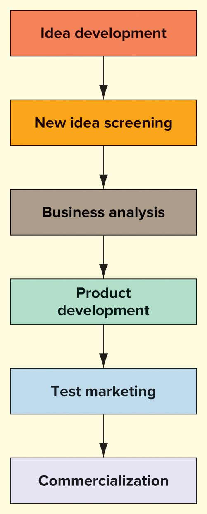
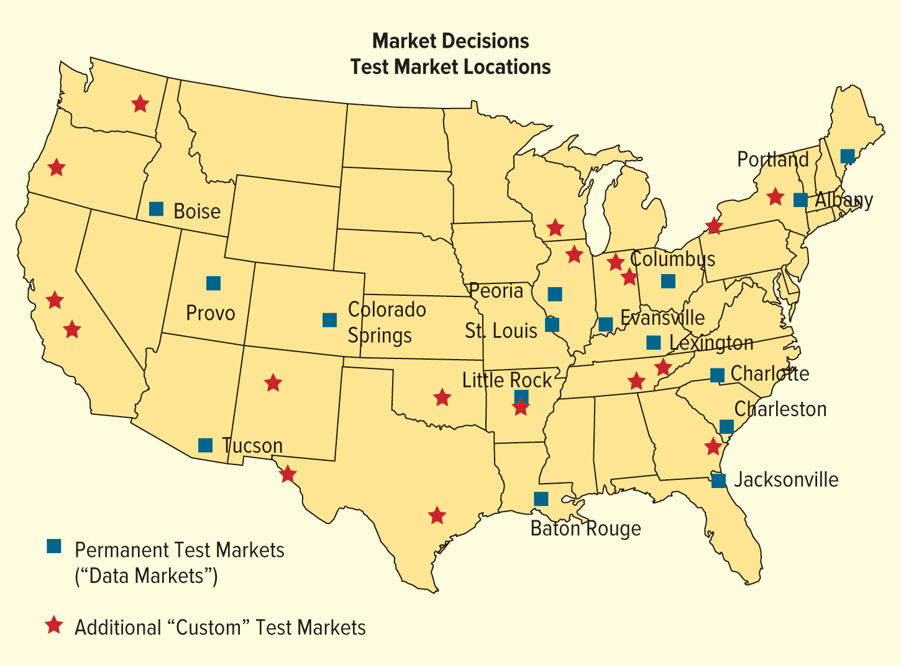
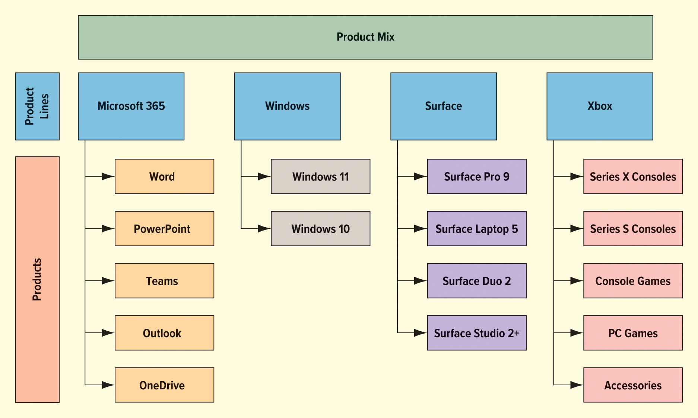
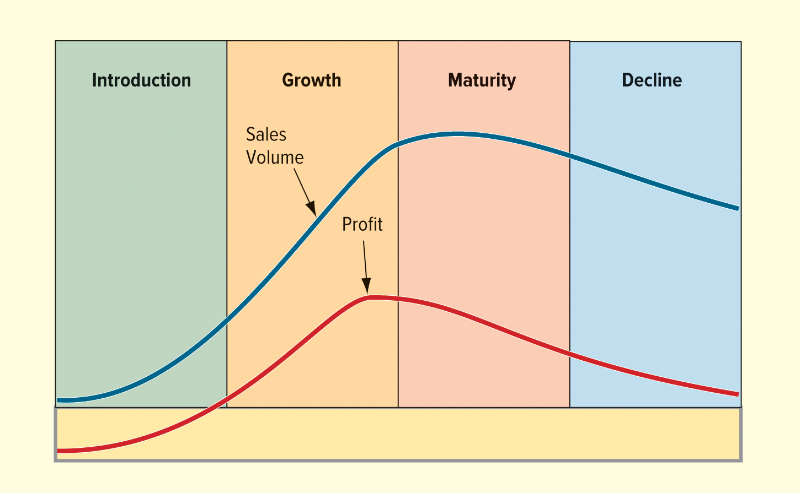
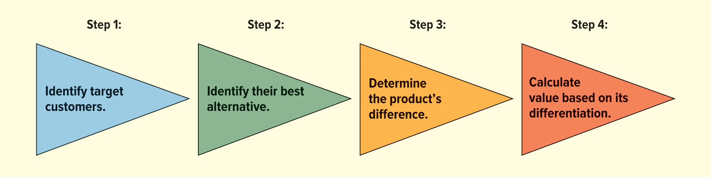
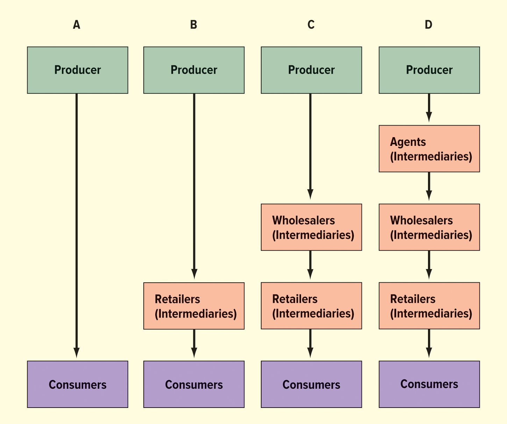
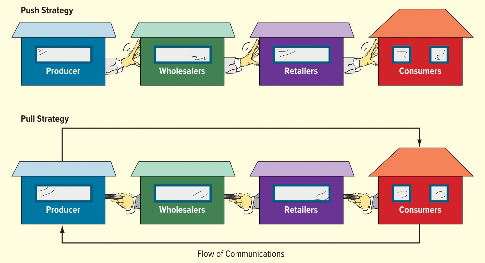

<h1 id="Chapter_12._Dimensions_of_Marketing_Strategy" style="color:#42A5F5;">Indice</h1>

##### [Capitulo LO 12-1 Estrategia de Producto](#259392)

##### [Capitulo LO 12-2 PRICING STRATEGY](#613101)

##### [Capitulo LO 12-3 ESTRATEGIA DE DISTRIBUCIÓN](#535825)

##### [Capitulo LO 12-4 ESTRATEGIA DE PROMOCIÓN (PROMOTION STRATEGY)](#298524)

# La Mezcla de Marketing (Marketing Mix)

La mezcla de marketing es la parte de la estrategia de marketing que implica decisiones relacionadas con variables controlables. Después de seleccionar un mercado meta, los especialistas en marketing deben desarrollar y gestionar las dimensiones de la mezcla de marketing para darle a su empresa una ventaja sobre los competidores.

> **Definición:**
> **Mezcla de Marketing (Marketing Mix):** Conjunto de herramientas tácticas controlables que una empresa combina para producir la respuesta deseada en su mercado meta. Tradicionalmente se compone de las 4P: Producto, Precio, Plaza (distribución) y Promoción.

Las empresas exitosas ofrecen al menos una dimensión de valor, usualmente asociada con un elemento de la mezcla de marketing, que supera a todos los competidores en el mercado para satisfacer las expectativas del cliente. Por ejemplo, Walmart es conocido por su sólida cadena de suministro (distribución) y sus precios bajos todos los días.

Sin embargo, esto no significa que una empresa pueda ignorar las otras dimensiones de la mezcla de marketing; debe mantener diferencias aceptables, y si es posible distinguibles, también en las otras dimensiones.

<h1 id="259392" style="color:#E65100;">
  <a href="#Chapter_12._Dimensions_of_Marketing_Strategy" style="color:inherit; text-decoration:none;">
    LO 12-1 Estrategia de Producto
  </a>
</h1>

Describir el papel del producto en la mezcla de marketing, incluyendo cómo se desarrollan, clasifican e identifican los productos.

Como se mencionó anteriormente, el término *producto* se refiere a bienes, servicios e ideas. Debido a que el producto es a menudo la dimensión más visible de la mezcla de marketing, gestionar las decisiones sobre el producto es crucial. En esta sección, consideraremos el desarrollo, clasificación, mezcla, ciclo de vida e identificación del producto.

> **Definición:**
> **Producto:** Cualquier bien, servicio o idea que se puede ofrecer a un mercado para satisfacer un deseo o necesidad. Incluye características como calidad, diseño, marca, empaque y servicio postventa.

---

## Desarrollo de Nuevos Productos

Cada año, se introducen miles de productos, pero pocos de ellos tienen éxito. Incluso las empresas establecidas lanzan productos que fracasan. Por ejemplo, Pepsi descontinuó su refresco de limón Sierra Mist después de 24 años debido a las bajas ventas. Fue reemplazado por un refresco llamado Starry.

La Figura 12.1 muestra los diferentes pasos en el proceso de desarrollo de productos. Antes de introducir un nuevo producto, una empresa debe seguir un proceso de múltiples pasos:

1.  **Desarrollo de ideas**
2.  **Evaluación (selección) de nuevas ideas**
3.  **Análisis de negocio**
4.  **Desarrollo del producto**
5.  **Prueba de mercado**
6.  **Comercialización**

Una empresa puede tomar un tiempo considerable para tener un producto listo para el mercado. Por ejemplo, la primera fotocopiadora tardó más de 20 años en desarrollarse. Además, a veces una idea o prototipo de producto puede ser archivado solo para ser retomado más tarde. El ex-CEO de Apple, Steve Jobs, admitió que el iPad en realidad surgió antes que el iPhone en el proceso de desarrollo del producto. Una vez que se dio cuenta de que el mecanismo de desplazamiento que estaba pensando usar podría utilizarse para desarrollar un teléfono, la idea del iPad fue puesta temporalmente en un estante.

---

**Figura 12.1 Proceso de Desarrollo de Producto**

</img>

### Desarrollo de Ideas

Las nuevas ideas pueden provenir de la investigación de mercados, ingenieros y fuentes externas como agencias de publicidad y consultores de gestión. Nike tiene una división separada, el Nike Sport Research Lab, donde científicos, atletas, ingenieros y diseñadores trabajan juntos para desarrollar la tecnología del futuro. Los equipos investigan ideas en biomecánica, percepción, rendimiento atlético y fisiología para crear productos únicos, relevantes e innovadores. Estos productos finales se prueban en cámaras ambientales con atletas reales para garantizar su funcionalidad y calidad antes de ser introducidos en el mercado.

Como dijimos en el capítulo "Marketing Orientado al Cliente", las ideas a veces también provienen de los clientes. Otras fuentes son la lluvia de ideas (brainstorming) y los incentivos o recompensas intraempresariales para buenas ideas. Las nuevas ideas incluso pueden crear una empresa. Cuando Jeff Bezos tuvo la idea de vender libros a través de internet en 1992, no tenía idea de que evolucionaría hasta convertirse en el minorista en línea más grande del mundo. Después de no convencer a su jefe del valor de su idea, Bezos se fue para fundar Amazon.

> **Definición:**
> **Desarrollo de Ideas:** Proceso de generación de conceptos para nuevos productos a partir de fuentes internas (I+D, empleados) y externas (clientes, agencias, competencia).

### Evaluación de Nuevas Ideas (New Idea Screening)

El siguiente paso en el desarrollo de un nuevo producto es la evaluación de ideas. En esta fase, un gerente de marketing debe analizar los recursos y objetivos de la organización y evaluar la capacidad de la empresa para producir y comercializar el producto. Los aspectos importantes a considerar en esta etapa son: los deseos del consumidor, la competencia, los cambios tecnológicos, las tendencias sociales y las consideraciones políticas, económicas y ambientales.

Hay dos razones por las que los nuevos productos tienen éxito:
1. Pueden satisfacer una necesidad o resolver un problema mejor que los productos ya disponibles.
2. Añaden variedad a la selección de productos actualmente en el mercado.

Reunir un equipo de personas con conocimientos (incluyendo diseñadores, ingenieros, especialistas en marketing y clientes) es una excelente manera de evaluar ideas. El uso de internet para fomentar la colaboración representa una oportunidad valiosa para que los especialistas en marketing evalúen ideas. La mayoría de las ideas de nuevos productos se rechazan durante la evaluación porque parecen inapropiadas o poco prácticas para la organización.

> **Definición:**
> **Evaluación de Ideas (Screening):** Fase en la que se filtran las ideas generadas para eliminar aquellas que no son viables o no se alinean con los objetivos y recursos de la empresa.

### Análisis de Negocio

El análisis de negocio es una evaluación básica de la compatibilidad de un producto en el mercado y su rentabilidad potencial. Tanto el tamaño del mercado como los productos de la competencia suelen estudiarse en este punto. La pregunta más importante se relaciona con la demanda del mercado: ¿Cómo afectará el producto a las ventas, los costos y las ganancias de la empresa?

> **Definición:**
> **Análisis de Negocio:** Evaluación de la viabilidad económica y comercial de un producto, incluyendo proyecciones de demanda, costos, competencia y rentabilidad.

### Desarrollo del Producto

Si un producto sobrevive a los tres primeros pasos, se desarrolla hasta convertirlo en un prototipo que debe revelar los atributos intangibles que posee según la percepción del consumidor. El desarrollo del producto suele ser costoso, y pocas ideas de producto llegan a esta etapa. Los costos de investigación y desarrollo de nuevos productos varían. Añadir un nuevo color a un artículo existente puede costar entre $100,000 y $200,000, pero lanzar un producto completamente nuevo puede costar millones de dólares.

Muchas empresas como Starbucks están intentando acelerar el proceso de desarrollo de productos y reducir costos con el prototipado rápido utilizando el diseño asistido por computadora (CAD) en 3D. Durante el desarrollo del producto, se deben desarrollar varios elementos de la mezcla de marketing para las pruebas. Los derechos de autor, el borrador del texto publicitario, el empaque, el etiquetado y las descripciones de un mercado meta se integran para desarrollar una estrategia general de marketing.

> **Definición:**
> **Desarrollo del Producto:** Creación de un prototipo funcional del producto, junto con los elementos iniciales de la mezcla de marketing, para probar su viabilidad técnica y de mercado.

### Prueba de Mercado

La prueba de mercado es un lanzamiento preliminar de prueba de un producto en áreas limitadas que representan el mercado potencial. Permite una prueba completa de la estrategia de marketing en un entorno natural, brindando a la organización la oportunidad de descubrir debilidades y eliminarlas antes de que el producto se lance por completo.

Por ejemplo, McDonald's probó por primera vez la hamburguesa vegetal McPlant en Suecia y Dinamarca porque Escandinavia es un mercado importante para productos de origen vegetal. Dado que la prueba de mercado requiere recursos y experiencia significativos, empresas de investigación de mercados como Nielsen pueden ayudar a las empresas a probar sus productos.

La Figura 12.2 muestra una muestra de ciudades de prueba de mercado que las empresas de investigación de mercados suelen utilizar para probar productos y predecir qué tan exitosos podrían ser a escala nacional.

> **Definición:**
> **Prueba de Mercado (Test Marketing):** Lanzamiento experimental de un producto en una región geográfica limitada para evaluar la respuesta del consumidor y la efectividad de la estrategia de marketing antes del lanzamiento nacional.

---

**Figura 12.2 Ciudades Comunes para Pruebas de Mercado**

</img>

### Comercialización

La comercialización es la introducción completa de una estrategia de marketing integral y el lanzamiento del producto para lograr el éxito comercial. Durante la comercialización, la empresa se prepara para la producción, distribución y promoción a gran escala.

En un ejemplo de un producto relativamente nuevo, AtmosGear, una startup francesa, introdujo los primeros patines en línea eléctricos del mundo. La empresa recolectó pedidos anticipados antes de comenzar la producción. Esta estrategia puede mejorar el flujo de efectivo y ayudar a las empresas a pronosticar la demanda.

> **Definición:**
> **Comercialización (Commercialization):** Etapa final del proceso de desarrollo de nuevos productos en la que se lanza el producto al mercado a gran escala, implementando la estrategia completa de producción, distribución, promoción y ventas.

> **📌 ¿SABÍAS QUE?**
> Cada año, se lanzan más de 20,000 nuevos productos de consumo. Las categorías principales de nuevos productos son bebidas, aperitivos (snacks) y salsas y condimentos.

## Clasificación de Productos

Los productos suelen clasificarse como **productos de consumo** o **productos industriales**. Esta distinción es fundamental para desarrollar estrategias de marketing adecuadas, ya que los comportamientos de compra, los canales de distribución y las tácticas promocionales difieren significativamente entre ambos tipos.

> **Definición:**
> **Productos de consumo:** Bienes destinados al uso en hogares o familias, para fines de la vida diaria, no para fines comerciales o industriales.
>
> **Productos industriales:** Bienes utilizados directa o indirectamente en las operaciones o procesos de fabricación de negocios u organizaciones.

---

### Productos de Consumo

Los productos de consumo se pueden clasificar en **tres categorías** sobre la base del comportamiento e intenciones de compra de los consumidores: productos de conveniencia, productos de comparación y productos de especialidad.

#### 1. Productos de Conveniencia (Convenience Products)

> **Definición:**
> **Productos de conveniencia:** Bienes que se compran con frecuencia, sin una búsqueda prolongada, a menudo para consumo inmediato. El consumidor acepta generalmente cualquier marca disponible.

**Características principales:**
- Compra frecuente y de bajo compromiso
- Poco tiempo de planificación
- Baja lealtad de marca
- Distribución masiva (tiendas de conveniencia, supermercados, gasolineras)

**Ejemplos:** Bebidas, chicles, gasolina, baterías.

#### 2. Productos de Comparación (Shopping Products)

> **Definición:**
> **Productos de comparación:** Bienes que el consumidor adquiere después de comparar productos competidores en términos de precio, características, calidad, estilo, servicio e imagen.

**Características principales:**
- Compra menos frecuente
- El consumidor "compara precios" (shops around)
- Mayor inversión de tiempo y esfuerzo
- Diferenciación por atributos tangibles e intangibles

**Ejemplos:** Computadoras, teléfonos inteligentes, ropa, artículos deportivos.

#### 3. Productos de Especialidad (Specialty Products)

> **Definición:**
> **Productos de especialidad:** Bienes que requieren una gran investigación y esfuerzo de compra. El consumidor sabe exactamente lo que quiere, busca activamente ese producto específico y no acepta sustitutos.

**Características principales:**
- Alta lealtad a una marca o producto específico
- El consumidor está dispuesto a recorrer distancias o esperar
- No se aceptan sustitutos bajo ninguna circunstancia
- Precio generalmente alto

**Ejemplos:** Motocicletas, ropa de diseñador, obras de arte, boletos para conciertos.

---

### Productos Industriales

Los productos industriales se utilizan directa o indirectamente en la operación o fabricación de otros productos. Su compra está vinculada a **objetivos organizacionales específicos** (reducción de costos, mejora de calidad, eficiencia productiva). Se clasifican en **siete categorías**:

#### 1. Materias Primas (Raw Materials)

> **Definición:**
> **Materias primas:** Productos naturales extraídos de la tierra, los océanos o residuos sólidos reciclados, sin procesamiento industrial significativo.

**Ejemplos:** Mineral de hierro, bauxita, madera, algodón, frutas y verduras.

#### 2. Equipo Principal (Major Equipment)

> **Definición:**
> **Equipo principal:** Bienes grandes y costosos utilizados directamente en la producción. Suelen tener una vida útil larga y requieren inversiones significativas.

**Ejemplos:** Excavadoras, máquinas estampadoras, equipos robóticos en líneas de ensamblaje automotriz.

#### 3. Equipo Accesorio (Accessory Equipment)

> **Definición:**
> **Equipo accesorio:** Bienes utilizados para fines de producción, oficina o gestión que generalmente no se convierten en parte del producto final.

**Ejemplos:** Computadoras, cámaras, herramientas manuales.

#### 4. Partes Componentes (Component Parts)

> **Definición:**
> **Partes componentes:** Productos terminados, listos para ser ensamblados en el producto final de la empresa. Son identificables dentro del producto terminado.

**Ejemplos:** Neumáticos, vidrio para ventanas, baterías, bujías (como partes de un automóvil).

#### 5. Materiales Procesados (Processed Materials)

> **Definición:**
> **Materiales procesados:** Insumos utilizados directamente en la producción o gestión, pero que no son fácilmente identificables como componentes separados en el producto final.

**Ejemplos:** Barniz (para un fabricante de muebles), lubricantes, productos químicos industriales.

#### 6. Insumos Operativos (Supplies)

> **Definición:**
> **Insumos operativos:** Materiales que hacen posible la producción, la gestión y otras operaciones, pero que no forman parte del producto terminado.

**Ejemplos:** Papel, lápices, pintura, suministros de limpieza.

#### 7. Servicios Empresariales (Business Services)

> **Definición:**
> **Servicios empresariales:** Servicios intangibles que apoyan las operaciones de una organización. Los compradores deciden si proporcionar estos servicios internamente o adquirirlos de un proveedor externo.

**Ejemplos:** Servicios financieros, legales, investigación de mercados, seguridad, limpieza, fumigación (exterminating).

---

### Tabla Resumen: Clasificación de Productos

| Categoría Principal | Subcategoría | Base de Clasificación | Ejemplos |
|---------------------|--------------|----------------------|----------|
| **Consumo** | Conveniencia | Compra frecuente, sin búsqueda | Bebidas, gasolina |
| | Comparación | Comparación de atributos | Smartphones, ropa |
| | Especialidad | Búsqueda intensa, sin sustitutos | Motos, arte |
| **Industrial** | Materias primas | Productos naturales sin procesar | Mineral, algodón |
| | Equipo principal | Bienes grandes y costosos | Robots industriales |
| | Equipo accesorio | Apoyo a producción/gestión | Computadoras |
| | Partes componentes | Ensamblaje directo | Neumáticos |
| | Materiales procesados | Uso en producción (no identificable) | Barniz |
| | Insumos operativos | Facilitan operaciones | Papel, limpiadores |
| | Servicios empresariales | Apoyo intangible | Seguridad, legal |

---

> **📌 ¿SABÍAS QUE?**
> Un mismo producto físico puede pertenecer a categorías diferentes según quién lo compre. Por ejemplo, una **batería** es un producto de conveniencia cuando la compra un consumidor para su linterna doméstica, pero es una **parte componente** cuando la compra un fabricante de automóviles para ensamblar en un vehículo nuevo.

---

### Preguntas de Repaso

1. ¿Cuál es la diferencia fundamental entre un producto de consumo y un producto industrial?

2. Un consumidor recorre tres tiendas diferentes para encontrar un modelo específico de zapatillas deportivas. ¿Qué tipo de producto de consumo es? ¿Por qué?

3. ¿En qué categoría de producto industrial se clasifica el software de contabilidad que compra una empresa? ¿Por qué?

4. Proporcione un ejemplo de un producto que pueda ser tanto de conveniencia (para un consumidor) como una parte componente (para un fabricante).

5. ¿Por qué los productos de especialidad no tienen sustitutos aceptables para el consumidor?

## Línea de Productos y Mezcla de Productos

Las relaciones entre productos dentro de una organización son de importancia clave.

> **Definición:**
> **Línea de productos (Product line):** Un grupo de productos estrechamente relacionados que se tratan como una unidad debido a que comparten una estrategia de marketing similar.

Microsoft, una empresa de tecnología, tiene cuatro líneas de productos principales para consumidores:

1. Microsoft 365
2. Windows
3. Surface
4. Xbox

Dentro de cada línea hay un grupo de productos relacionados. Por ejemplo, dentro de la línea de productos Microsoft 365 se incluyen Word, Excel, PowerPoint, Teams, Outlook y OneDrive.

> **Definición:**
> **Mezcla de productos (Product mix):** El conjunto total de todos los productos que ofrece una organización.

La Figura 12.3 muestra una muestra de la mezcla de productos de Microsoft.

### FIGURA 12.3 Una Muestra de la Mezcla de Productos de Microsoft

</img>

## Ciclo de Vida del Producto

Al igual que las personas, los productos nacen, crecen, maduran y eventualmente declinan. Algunos productos tienen vidas muy largas. Ivory Soap (1879), Coca-Cola (1886) y Baker's Chocolate (1780) son ejemplos de productos que han resistido la prueba del tiempo. En contraste, un nuevo chip de computadora generalmente queda obsoleto en un año debido a los avances tecnológicos y los rápidos cambios en la industria informática. Hay cuatro etapas en el ciclo de vida de un producto: introducción, crecimiento, madurez y declive.

> **Definición:**
> **Ciclo de vida del producto (Product life cycle):** Proceso que atraviesa un producto desde su lanzamiento al mercado hasta su retiro, compuesto por cuatro etapas: introducción, crecimiento, madurez y declive.

En la industria de las computadoras personales (PC), las computadoras de escritorio están en la etapa de declive, las computadoras portátiles personales han alcanzado la etapa de madurez, las tabletas han alcanzado recientemente la etapa de madurez a medida que las ventas globales se reducen, y las computadoras portátiles y PC de alto rendimiento están en la etapa de crecimiento del ciclo de vida del producto. Los fabricantes de estos productos están adoptando diferentes estrategias de publicidad y precios para mantener o aumentar la demanda de estos tipos de computadoras.

La etapa en la que se encuentra un producto ayuda a determinar la estrategia de marketing.

### FIGURA 12.4 El Ciclo de Vida de un Producto

</img>

### Etapa de Introducción (Introductory Stage)

> **Definición:**
> **Etapa de introducción:** Fase inicial del ciclo de vida donde la conciencia y aceptación del producto por parte del consumidor son limitadas, las ventas son cero y las ganancias son negativas debido a los gastos en investigación, desarrollo y marketing.

Por ejemplo, el mercado de gafas inteligentes de realidad aumentada (AR) está en la etapa de introducción. El concepto de gafas AR aún es nuevo para muchas personas, por lo que las empresas tendrán que educar a los consumidores, difundir conciencia y fomentar la prueba y adopción. Durante la etapa de introducción, los especialistas en marketing se enfocan en hacer que los consumidores conozcan el producto y sus beneficios. No es inusual que los productos tecnológicos atraviesen rápidemente el ciclo de vida a medida que aumenta la tasa de innovaciones tecnológicas. La categoría de productos de relojes inteligentes, por ejemplo, pasó rápidamente de la etapa de introducción a la etapa de crecimiento. Según una estimación, el mercado mundial de tecnología wearable podría alcanzar más de $185 mil millones para 2030. La innovación de este tipo es bienvenida por los consumidores y el público en general.

### Etapa de Crecimiento (Growth Stage)

> **Definición:**
> **Etapa de crecimiento:** Fase en la que las ventas aumentan rápidamente y las ganancias alcanzan su punto máximo, para luego comenzar a declinar debido a la entrada de nuevos competidores que reducen los precios y aumentan los gastos de marketing.

Las freidoras de aire (hornos de convección de mostrador) están creciendo rápidamente y son un buen ejemplo de un producto en la etapa de crecimiento. Durante la etapa de crecimiento, la empresa trata de fortalecer su posición en el mercado enfatizando los beneficios del producto e identificando segmentos de mercado que desean esos beneficios.

### Etapa de Madurez (Maturity Stage)

> **Definición:**
> **Etapa de madurez:** Fase en la que las ventas continúan aumentando al principio, luego la curva de ventas alcanza su punto máximo y comienza a declinar, mientras que las ganancias continúan disminuyendo. Se caracteriza por una competencia severa y grandes gastos.

En los Estados Unidos, los refrescos han llegado a la etapa de madurez. Por ejemplo, los refrescos más vendidos son Coca-Cola, Diet Coke, Pepsi, Mountain Dew, Dr Pepper, Sprite y Diet Pepsi. Esto representa un cambio hacia bebidas menos azucaradas, ya que los consumidores también han recurrido a aguas saborizadas, agua embotellada y té. El mercado de los refrescos es altamente competitivo, con muchos productos alternativos para los consumidores.

### Etapa de Declive (Decline Stage)

> **Definición:**
> **Etapa de declive:** Fase final en la que las ventas continúan cayendo rápidamente. Las ganancias también declinan y pueden incluso convertirse en pérdidas a medida que se reducen los precios y se realizan los gastos de marketing necesarios.

Durante la etapa de declive, las empresas pueden eliminar ciertos modelos o artículos. Para reducir gastos y exprimir las ganancias restantes, los gastos de marketing pueden reducirse, aunque tales reducciones aceleran la caída de las ventas. Finalmente, se deben hacer planes para eliminar gradualmente el producto e introducir otros nuevos que ocupen su lugar. Ejemplos de productos en la etapa de declive incluyen la televisión por cable, los reproductores de DVD, las cámaras de película y las máquinas de fax. La visualización de videos en streaming ha superado a la televisión por cable.

### Resurgimiento de Productos

Al mismo tiempo, debe señalarse que las etapas del producto no siempre van en una dirección. Algunos productos que han pasado a la etapa de madurez o a la etapa de declive pueden recuperarse mediante un rediseño o nuevos usos para el producto. Por ejemplo, United Record Pressing LLC está disfrutando del nuevo interés en los discos de vinilo. La empresa produce entre el 30 y el 40 por ciento de todos los discos de vinilo disponibles en las tiendas. Este nuevo interés en el vinilo señala un resurgimiento en las ventas de discos de vinilo a los consumidores y ha creado un modo de crecimiento para esta empresa de propiedad privada, así como un compromiso con la rica historia musical de la empresa, que se remonta a 1949.

### TABLA 12.1 Productos en Diferentes Etapas del Ciclo de Vida del Producto

| Introducción | Crecimiento | Madurez | Declive |
|--------------|-------------|---------|---------|
| Drone delivery | Impresoras 3D | Computadoras portátiles | Computadoras de escritorio |
| Smart home gyms | Televisores 4K | Parques temáticos de Disney | Teléfonos fijos |
| Automóviles de hidrógeno | Productos keto | Refrescos | Periódicos impresos |

## Identificación de Productos

El branding, el empaque y el etiquetado pueden utilizarse para identificar o distinguir un producto de otros. Como resultado, son actividades clave de marketing que ayudan a posicionar un producto adecuadamente para su mercado objetivo.

---

### Branding

> **Definición:**
> **Branding:** Proceso de nombrar e identificar productos.

> **Definición:**
> **Marca (Brand):** Nombre, término, símbolo, diseño o combinación de estos que identifica un producto y lo distingue de otros productos.

Considere que Google y Band-Aid son nombres de marca que se utilizan para identificar categorías de productos completas, al igual que Jell-O se ha convertido en sinónimo de gelatina y Kleenex de pañuelos de papel. Proteger el nombre de una marca es importante para mantener la identidad de la marca.

> **Definición:**
> **Nombre de marca (Brand name):** Parte de la marca que se puede pronunciar y consiste en letras, palabras y números. Ejemplo: WD-40 lubricante.

> **Definición:**
> **Imagen de marca (Brand mark):** Parte de la marca que es un diseño distintivo. Ejemplo: la estrella plateada en el capó de un Mercedes o los arcos dorados de McDonald's.

> **Definición:**
> **Marca registrada (Trademark):** Cualquier palabra, frase, símbolo, diseño o combinación de estos elementos que está registrada en la Oficina de Patentes y Marcas Registradas de EE. UU. y, por lo tanto, está legalmente protegida contra el uso por parte de cualquier otra empresa.

Una empresa puede tener muchas marcas registradas. Por ejemplo, Reebok tiene marcas registradas que incluyen logotipos, palabras y frases como PureMove, Flexweave y Life Is Not a Spectator Sport.

Las 10 marcas más valiosas del mundo se muestran en la Tabla 12.2.

#### TABLA 12.2 Las 10 Marcas Más Valiosas del Mundo

| Rango | Marca | Valor de Marca ($ mil millones) | Cambio (% respecto al año anterior) |
|-------|-------|--------------------------------|-------------------------------------|
| 1 | Apple | 241.2 | 17 |
| 2 | Google | 207.5 | 30 |
| 3 | Microsoft | 162.9 | 24 |
| 4 | Amazon | 135.4 | 40 |
| 5 | Facebook | 70.3 | -21 |
| 6 | Coca-Cola | 64.4 | 7 |
| 7 | Disney | 61.3 | 18 |
| 8 | Samsung | 50.4 | 20 |
| 9 | Louis Vuitton | 47.7 | 10 |
| 10 | McDonald's | 46.1 | -5 |

*Fuente: "The World's Most Valuable Brands," Forbes, www.forbes.com/the-worlds-most-valuable-brands/#184366eo119c (consultado el 23 de febrero de 2023).*

---

### Categorías de Marcas

Dos categorías principales de marcas son las **marcas de fabricante** y las **marcas de distribuidor privado**.

> **Definición:**
> **Marcas de fabricante (Manufacturer brands):** Marcas iniciadas y propiedad del fabricante para identificar productos desde el punto de producción hasta el punto de compra. Ejemplos: Kellogg's, Sony, Chevron.

> **Definición:**
> **Marcas de distribuidor privado (Private distributor brands):** Marcas propiedad y controladas por un mayorista o minorista, que pueden ser menos costosas que las marcas de fabricante. Ejemplos: Nice! (Walgreens), Pantry Essentials (Safeway), 365 Everyday Value (Whole Foods), Great Value (Walmart), Trader Joe's.

Los nombres de las marcas privadas generalmente no identifican a su fabricante. Si bien las marcas privadas fueron una vez consideradas más baratas y de mala calidad (como la comida para perros Ol'Roy de Walmart), muchas marcas privadas están mejorando en calidad e imagen y están compitiendo con las marcas nacionales. Incluso Amazon ha notado las lucrativas oportunidades de las marcas privadas. La firma desarrolló su propia marca privada de ropa y la marca Solimo de vitaminas. Hoy en día, hay marcas privadas en casi todas las categorías de alimentos y bebidas, y el mercado de alimentos y bebidas de marca privada está quitando participación de mercado a las marcas de fabricante. Las marcas de fabricante están luchando duramente contra las marcas de distribuidor privado para retener su participación en el mercado.

---

### Productos Genéricos

> **Definición:**
> **Productos genéricos (Generic products):** Productos sin nombre de marca. A menudo vienen en paquetes simples que llevan solo el nombre genérico del producto (mantequilla de maní, jugo de tomate, aspirina, comida para perros, etc.).

Atraen a consumidores que pueden estar dispuestos a arriesgar la calidad o consistencia del producto para obtener un precio más bajo. Las ventas de marcas genéricas han disminuido significativamente en los últimos años, aunque los productos farmacéuticos genéricos se compran comúnmente debido a sus precios más bajos.

---

### Enfoques para Múltiples Marcas

Las empresas utilizan dos enfoques básicos para el branding de múltiples productos:

#### Enfoque 1: Marca individual

> **Definición:**
> **Marca individual:** Estrategia en la que una empresa da a cada producto dentro de su mezcla de productos su propio nombre de marca.

Unilever vende muchos productos de consumo muy conocidos (Dove, Axe, Knorr, Hellman's, Dermalogica), cada uno con su propia marca. Esta política de branding asegura que el nombre de un producto no afecte los nombres de otros, y diferentes marcas pueden dirigirse a diferentes segmentos del mismo mercado, aumentando la participación de mercado de la empresa (su porcentaje de las ventas del mercado total para un producto).

#### Enfoque 2: Familia de marcas

> **Definición:**
> **Familia de marcas (Family of brands):** Estrategia en la que cada producto de la empresa lleva el mismo nombre o al menos parte del nombre.

Gillette, Sara Lee e IBM utilizan este enfoque.

Finalmente, los consumidores pueden reaccionar de manera diferente a las marcas nacionales frente a las marcas internacionales.

### Packaging

> **Definición:**
> **Empaque (Packaging):** Contenedor externo que contiene y describe el producto, e influye en las actitudes de los consumidores y sus decisiones de compra.

Las encuestas han mostrado que los consumidores están dispuestos a pagar más por ciertos atributos del empaque. Según una encuesta, casi un tercio de los consumidores globales prefieren empaques que sean biodegradables, sin plástico, reutilizables o de otro modo respetuosos con el medio ambiente. Una tendencia emergente es el uso de empaques inteligentes que pueden comunicar la frescura del producto, garantizar la autenticidad, proporcionar información a través de códigos QR, y más. Se estima que los ojos de los consumidores se detienen solo 2.5 segundos en cada producto en un viaje de compras promedio; por lo tanto, el empaque del producto debe diseñarse para atraer y mantener la atención de los consumidores.

Un empaque puede realizar varias funciones, incluyendo protección, economía, conveniencia y promoción. IKEA está constantemente tratando de investigar nuevas formas de empaque más eficiente para ahorrar en costos de envío. El empaque también puede utilizarse para apelar a las emociones. Por ejemplo, el empaque de comida para mascotas apela a las emociones de los dueños de mascotas con ilustraciones de animales corriendo felices, comiendo o luciendo serenos. Coca-Cola lanzó un diseño global para sus productos que presenta el rojo tradicional como color principal. La estrategia de "una marca" es crear una presencia global unificada para su refresco insignia. Por otro lado, las organizaciones también deben tener cuidado antes de cambiar los diseños de productos altamente populares.

---

### Labeling

> **Definición:**
> **Etiquetado (Labeling):** Presentación de información importante en el empaque, estrechamente asociada con el empaque.

El contenido de una etiqueta, a menudo requerido por ley, puede incluir ingredientes o contenido; información nutricional (calorías, grasas, etc.); instrucciones de cuidado; sugerencias de uso (como recetas); la dirección del fabricante, número de teléfono gratuito y sitio web; y otra información útil. Esta información puede tener un fuerte impacto en las ventas. Las etiquetas de muchos productos, particularmente alimentos y medicamentos, deben llevar advertencias, instrucciones, certificaciones o identificaciones del fabricante.

---

### Product Quality

> **Definición:**
> **Calidad (Quality):** Grado en que un bien, servicio o idea cumple con las demandas y requisitos de los clientes.

Los productos de calidad a menudo se consideran confiables, duraderos, fáciles de mantener, fáciles de usar, de buen valor o con un nombre de marca confiable.

> **Definición:**
> **Nivel de calidad (Level of quality):** Cantidad de calidad que posee un producto.

> **Definición:**
> **Consistencia de calidad (Consistency of quality):** Capacidad del producto para mantener el mismo nivel de calidad a lo largo del tiempo.

Los factores que hacen que un producto sea de alta calidad pueden variar. Un banco puede definir la calidad del servicio como emplear empleados amables y bien informados, pero los clientes del banco pueden estar más preocupados por el tiempo de espera, el acceso al cajero automático, la seguridad y la precisión de los estados de cuenta. De manera similar, un viajero de aerolínea considera la llegada a tiempo, la conexión a internet o TV a bordo, y la satisfacción con el proceso de emisión de boletos y embarque.

> **Definición:**
> **Calidad del servicio (Service quality):** Depende de las percepciones de los clientes sobre qué tan bien el servicio cumple o supera sus expectativas. La calidad del servicio es juzgada por los consumidores, no por los proveedores del servicio.

Por esta razón, es bastante común que las percepciones de calidad fluctúen de un año a otro. Muchas empresas tienen procesos de aseguramiento de la calidad para garantizar que sus bienes y servicios cumplan con sus estándares. Por ejemplo, la empresa de videojuegos Activision Blizzard emplea trabajadores de aseguramiento de la calidad y evaluadores de juegos para identificar errores funcionales y otros problemas.

El American Customer Satisfaction Index produce puntuaciones de satisfacción del cliente para 10 sectores económicos, 44 industrias y más de 300 empresas. Los últimos resultados muestran que la satisfacción general del cliente fue de 73.4 (sobre un posible 100), con aumentos en algunas industrias que equilibran las caídas en otras. Reynolds Kitchens utilizó un estudio en el hogar para informar su anuncio, que promueve que tres de cada cuatro prefieren Reynolds Kitchens Quick Cut Plastic Wrap sobre Glad Cling Wrap.

La Tabla 12.3 muestra las clasificaciones de satisfacción del cliente de algunas de las empresas de productos de cuidado personal y limpieza más populares.

#### TABLA 12.3 Productos de Cuidado Personal y Limpieza - Calificaciones de Satisfacción del Cliente

| Empresa | Puntuación |
|---------|-------------|
| Clorox | 83 |
| Procter & Gamble | 83 |
| Henkel | 80 |
| Colgate-Palmolive | 78 |
| Johnson & Johnson | 78 |
| Unilever | 77 |

*Fuente: American Customer Satisfaction Index, "Benchmarks by Company: Personal Care and Cleaning Products," www.theacsi.org/Industries/manufacturing/nondurable-products/ (consultado el 23 de febrero de 2023).*

---

#### Calidad de Servicios en Internet

La calidad de los servicios proporcionados por las empresas en internet puede ser evaluada por los consumidores en sitios como ConsumerReports.org y el Better Business Bureau.

El servicio de suscripción ofrecido por ConsumerReports.org proporciona a los consumidores una visión de las políticas comerciales, de seguridad y privacidad de los sitios de marketing digital, mientras que el Better Business Bureau está dedicado a promover la responsabilidad tanto en línea como en las tiendas.

A medida que los consumidores participan publicando reseñas de negocios y productos en internet en sitios como Yelp, el público a menudo puede obtener una idea mucho mejor de la calidad de ciertos bienes y servicios.

## MATTEL: JUGUETES CON SOLUCIONES A LA CONTAMINACIÓN POR PLÁSTICO

## Contexto

Mattel, Inc. es una empresa estadounidense de fabricación de juguetes conocida por marcas icónicas como Barbie, Hot Wheels y Fisher-Price. Ante la crisis de contaminación por plástico, muchas compañías están introduciendo materiales y productos más sostenibles. Mattel, Hasbro y Lego son algunos ejemplos de empresas de la industria global del juguete que están dejando de usar plástico derivado del petróleo e invirtiendo en materiales sostenibles, como plásticos de origen vegetal.

Según un estudio publicado en *Environment International*, el hogar promedio en Occidente compra más de 40 libras de juguetes de plástico por niño cada año. Aunque esto representa un problema ambiental importante, existen varios desafíos para los fabricantes al cambiar a materiales alternativos. Por ejemplo, es necesario modificar equipos y procesos de fabricación. En el caso de Lego, la empresa está comprometida a hacer que sus nuevos bloques sean compatibles con los productos antiguos, lo que añade mayor complejidad. Además, con la creciente demanda de plásticos sostenibles, algunos materiales reciclados son escasos.

El progreso de Mattel en la solución del problema del plástico ya se puede observar en más de 30 juguetes disponibles en el mercado. El Matchbox Tesla Roadster es carbono neutral y está hecho con un 99% de materiales reciclados, y una línea de muñecas Barbie está fabricada con un 90% de plástico recuperado del océano en México. Según Mattel, casi el 80% de los padres considera la sostenibilidad como un factor importante al comprar juguetes, por lo que este cambio no solo es lo correcto, sino también responde a la demanda del consumidor. Mattel afirma que para el año 2030 todos sus productos estarán hechos de materiales 100% reciclados, reciclables o de origen biológico.

Para reforzar su compromiso con la sostenibilidad, Mattel también recoge juguetes usados a través de su programa PlayBack. Los juguetes recuperados se descomponen en materiales reciclables que pueden reutilizarse en nuevos productos, mientras que los materiales no reciclables se transforman en otros plásticos o se convierten en energía. Los consumidores en Estados Unidos, Canadá, Francia, Alemania y el Reino Unido pueden solicitar una etiqueta de envío gratuita para devolver juguetes como muñecas Barbie, juguetes no electrónicos de Fisher-Price, Mega Bloks y carros Matchbox.

---

## Preguntas de pensamiento crítico y respuestas

### 1. ¿Por qué los fabricantes de juguetes están dejando de usar plástico a base de petróleo e invirtiendo en materiales sostenibles?

Los fabricantes están realizando este cambio debido a la creciente crisis de contaminación por plástico y su impacto negativo en el medio ambiente. Además, los consumidores están cada vez más conscientes y prefieren productos ecológicos. Esto impulsa a las empresas a adoptar materiales reciclados o de origen vegetal para reducir su impacto ambiental y mantenerse competitivas en el mercado.

---

### 2. ¿Por qué es importante para Lego que sus bloques sostenibles sean compatibles con sus productos anteriores?

Es importante porque los clientes ya poseen colecciones de bloques acumuladas durante años. Si los nuevos productos no fueran compatibles, los anteriores perderían utilidad. Mantener la compatibilidad garantiza la satisfacción del cliente y promueve la reutilización, lo que contribuye a la sostenibilidad.

---

### 3. ¿Cómo ha cambiado Mattel sus productos para hacerlos más sostenibles?

Mattel ha introducido juguetes fabricados con materiales reciclados y de origen biológico, como autos hechos con 99% de materiales reciclados y muñecas con plástico recuperado del océano. Además, se ha comprometido a que para 2030 todos sus productos sean 100% reciclados, reciclables o de origen biológico. También ha implementado el programa PlayBack para recolectar y reciclar juguetes usados.

<h1 id="613101" style="color:#E65100;">
  <a href="#Chapter_12._Dimensions_of_Marketing_Strategy" style="color:inherit; text-decoration:none;">
    LO 12-2 PRICING STRATEGY
  </a>
</h1>

Explicar la importancia del precio en la mezcla de marketing, incluyendo las diversas estrategias de fijación de precios que una empresa podría emplear.

---

### El Precio en la Mezcla de Marketing

Anteriormente, definimos el precio como el valor puesto en un objeto intercambiado entre un comprador y un vendedor.

> **Definición:**
> **Precio (Price):** Valor puesto en un objeto intercambiado entre un comprador y un vendedor.

El interés de los compradores en el precio surge de sus expectativas sobre la utilidad de un producto o la satisfacción que pueden derivar de él. Debido a que los compradores tienen recursos limitados, deben asignar esos recursos para obtener los productos que más desean. Deben decidir si los beneficios obtenidos en un intercambio valen el poder adquisitivo sacrificado. Casi cualquier cosa de valor puede ser evaluada por el precio.

Muchos factores pueden influir en la evaluación del valor, incluyendo restricciones de tiempo, niveles de precios, calidad percibida y motivaciones para utilizar la información disponible sobre los precios.

> **Definición:**
> **Valor (Value):** Beneficio obtenido en un intercambio en relación con el poder adquisitivo sacrificado.

La Figura 12.5 ilustra un método para calcular el valor de un producto.

#### FIGURA 12.5 Cálculo del Valor de un Producto

| Paso | Acción |
|------|--------|
| Paso 1 | Identificar los clientes objetivo. |
| Paso 2 | Identificar su mejor alternativa. |
| Paso 3 | Determinar la diferencia del producto. |
| Paso 4 | Calcular el valor basado en su diferenciación. |

</img>
---

### Comportamiento del Consumidor frente al Precio

Los consumidores varían en su respuesta al precio: algunos se centran únicamente en el precio más bajo, mientras que otros consideran la calidad o el prestigio asociado con un producto y su precio. Algunos tipos de consumidores están cada vez más "cambiando hacia arriba" (trading up) a productos con mayor conciencia de estatus, como automóviles, electrodomésticos, restaurantes e incluso comida para mascotas, pero siguen siendo sensibles al precio para otros productos como artículos de limpieza y comestibles.

Al fijar precios, los especialistas en marketing deben considerar no solo el costo de producir un bien o servicio, sino también el **valor percibido** de ese artículo en el mercado.

> **Definición:**
> **Valor percibido (Perceived value):** Valor que los consumidores asignan a un producto basado en sus percepciones de calidad, prestigio y beneficios, independientemente del costo real de producción.

El valor percibido de los productos ha beneficiado a especialistas en marketing como Starbucks, Sub-Zero, BMW y Petco, que pueden cobrar precios superiores por productos de alta calidad y prestigio, así como a Sam's Clubs y Costco, que ofrecen productos básicos para el hogar a precios bajos todos los días.

---

### Importancia del Precio en la Mezcla de Marketing

> **Definición:**
> **Precio en la mezcla de marketing:** Elemento clave porque se relaciona directamente con la generación de ingresos y ganancias.

En gran parte, la capacidad de fijar un precio depende de la **oferta y la demanda** de un producto. Para la mayoría de los productos, la cantidad demandada aumenta a medida que el precio disminuye, y a medida que el precio aumenta, la cantidad demandada disminuye.

> **Definición:**
> **Ley de la demanda:** Principio económico según el cual la cantidad demandada de un producto aumenta cuando el precio disminuye y disminuye cuando el precio aumenta.

Cambios en las necesidades de los compradores, variaciones en la efectividad de otras variables de la mezcla de marketing, la presencia de sustitutos y la competencia pueden influir en la demanda. Frente a la competencia de nuevas empresas de rasuradoras en línea como Harry's y Dollar Shave Club, Gillette vio caer significativamente su participación de mercado, lo que llevó a la empresa a reducir los precios.

---

### Flexibilidad del Precio

El precio es probablemente la variable **más flexible** en la mezcla de marketing. Aunque puede llevar años desarrollar un producto, establecer canales de distribución y diseñar e implementar la promoción, el precio de un producto puede fijarse y cambiarse en pocos minutos.

Bajo ciertas circunstancias, por supuesto, el precio puede no ser tan flexible, especialmente si las regulaciones gubernamentales impiden que los distribuidores controlen los precios.

Por supuesto, el precio también depende del **costo** de fabricar un bien o proporcionar un servicio o idea. Una empresa puede vender productos temporalmente por debajo del costo para igualar la competencia, generar flujo de efectivo o incluso aumentar la participación de mercado, pero a largo plazo, no puede sobrevivir vendiendo sus productos por debajo del costo.

## Objetivos de Precio (Pricing Objectives)

> **Definición:**
> **Objetivos de precio (Pricing objectives):** Especifican el rol del precio en la mezcla de marketing y la estrategia de una organización.

Generalmente están influenciados no solo por las decisiones de la mezcla de marketing, sino también por factores financieros, contables y de producción. Maximizar ganancias y ventas, aumentar la participación de mercado, mantener el status quo y la supervivencia son cuatro objetivos de precio comunes.

---

## Estrategias Específicas de Precio (Specific Pricing Strategies)

> **Definición:**
> **Estrategias de precio (Pricing strategies):** Proporcionan pautas para lograr los objetivos de precio de la empresa y la estrategia general de marketing. Especifican cómo se utilizará el precio como variable en la mezcla de marketing.

Las estrategias de precio significativas se relacionan con la fijación de precios de nuevos productos, el precio psicológico, el precio de referencia y los descuentos de precio.

---

### Precios para Nuevos Productos (Pricing New Products)

Establecer el precio para un nuevo producto es crítico: el precio correcto lleva a la rentabilidad; el precio incorrecto puede matar el producto. En general, hay dos estrategias básicas para establecer el precio base de un nuevo producto.

> **Definición:**
> **Precio desnatado (Price skimming):** Cobrar el precio más alto posible que los compradores que desean el producto estén dispuestos a pagar.

El precio desnatado se utiliza con artículos de lujo y a menudo se emplea para permitir que la empresa genere ingresos muy necesarios para ayudar a compensar los costos de investigación y desarrollo.

> **Definición:**
> **Precio de penetración (Penetration price):** Precio bajo diseñado para ayudar a que un producto entre al mercado y gane participación de mercado rápidamente.

Cuando Netflix entró al mercado, ofreció sus alquileres a precios mucho más bajos que las tiendas de alquiler promedio y no cobró multas por retraso. Netflix ganó rápidamente participación de mercado y eventualmente llevó a muchas tiendas de alquiler a la quiebra. El precio de penetración es menos flexible que el precio desnatado; es más difícil aumentar un precio de penetración que bajar un precio desnatado. El precio de penetración se utiliza más a menudo cuando los especialistas en marketing sospechan que los competidores entrarán al mercado poco después de que el producto haya sido introducido.

---

### Precio Psicológico (Psychological Pricing)

> **Definición:**
> **Precio psicológico (Psychological pricing):** Fomenta las compras basadas en respuestas emocionales en lugar de racionales al precio.

**Precio par/impar (Even/odd pricing):** La suposición detrás del precio par/impar es que la gente comprará más de un producto por $9.99 que por $10 porque parece una ganga con el precio impar.

**Precio simbólico/de prestigio (Symbolic/prestige pricing):** La suposición detrás del precio simbólico/de prestigio es que los precios altos connotan alta calidad. Así, los precios de ciertos perfumes y cosméticos se fijan artificialmente altos para dar la impresión de calidad superior. Algunos medicamentos de venta libre tienen precios altos porque los consumidores asocian el precio de un medicamento con su potencia.

---

### Precio de Referencia (Reference Pricing)

> **Definición:**
> **Precio de referencia (Reference pricing):** Tipo de precio psicológico en el que un artículo de menor precio se compara con una marca más cara, con la esperanza de que el consumidor utilice el precio más alto como precio de comparación.

La idea principal es hacer que el artículo parezca menos costoso en comparación con otras alternativas. Por ejemplo, Walmart podría colocar su marca Great Value junto a una marca de fabricante como Hefty o Heinz para que la marca Great Value parezca una mejor oferta.

---

### Descuentos de Precio (Price Discounting)

> **Definición:**
> **Descuentos (Discounts):** Reducciones temporales de precio empleadas a menudo para aumentar las ventas.

Aunque hay muchos tipos, los descuentos por cantidad, estacionales y promocionales se encuentran entre los más utilizados.

> **Definición:**
> **Descuentos por cantidad (Quantity discounts):** Reflejan las economías de comprar en grandes volúmenes.

> **Definición:**
> **Descuentos estacionales (Seasonal discounts):** Se ofrecen a compradores que adquieren bienes o servicios fuera de temporada para ayudar a equilibrar la capacidad de producción.

> **Definición:**
> **Descuentos promocionales (Promotional discounts):** Intentan mejorar las ventas mediante la publicidad de reducciones de precios en productos seleccionados para aumentar el interés del cliente.

A menudo, el precio promocional está orientado a aumentar las ganancias. Por ejemplo, la cadena de supermercados alemana Aldi está intentando competir contra Trader Joe's a medida que se expande en los Estados Unidos mediante la oferta de alimentos de alta gama y descuentos de precio. Aldi tiene alrededor de 2,100 tiendas en los Estados Unidos y planea abrir más.

## DR. MARTENS AUMENTA SUS PRECIOS

## Contexto

Dr. Martens, también conocida como Doc Martens, es una empresa británica de calzado. El Dr. Klaus Maertens y el Dr. Herbert Funk formaron una asociación en Alemania en la década de 1960 utilizando suministros militares antiguos para fabricar zapatos con una suela única con cámara de aire. Ambos promocionaron sus zapatos en revistas internacionales, lo que llamó la atención de la empresa Griggs en Inglaterra. Esta compañía adquirió una licencia exclusiva y añadió detalles icónicos como las costuras visibles y la lengüeta del talón. Los zapatos fueron comercializados bajo la marca Airwair con el lema “with bouncing soles” (con suelas que rebotan). Así nacieron las famosas botas 1460 Dr. Martens.

En sus primeros años, las botas eran usadas principalmente por trabajadores como carteros y obreros, con un precio de £2 (aproximadamente $3), dirigidas a la clase trabajadora. Rápidamente, fueron adoptadas por las escenas musicales ska y punk. Pete Townshend, de la banda The Who, fue uno de los primeros usuarios famosos, y en los años 70 se convirtieron en un símbolo de rebeldía y expresión personal dentro de culturas como el punk y el goth. En los años 80, la empresa notó que más mujeres comenzaban a usar las botas. Al mismo tiempo, músicos estadounidenses que visitaban el Reino Unido ayudaron a popularizar la marca en Estados Unidos.

Después de este auge, las botas perdieron popularidad y las ventas cayeron. La industria se redujo y los costos de producción en Inglaterra aumentaron. Para principios de los 2000, el precio había subido a alrededor de $87. La empresa cerró casi todas sus fábricas en el Reino Unido y trasladó su producción a Asia para reducir costos. A mediados de los 2000, la marca resurgió gracias a su adopción por diseñadores de alta moda.

Como resultado de estos cambios, la empresa ha modificado su estrategia de precios. Desde 2014, los precios han aumentado cerca de un 25%. Actualmente, Dr. Martens utiliza una estrategia de precios dual: vende su icónica bota 1460 por $230 en la línea “Made in England” y por $150 en la versión fabricada en China. Ambas versiones usan métodos de producción similares, con ligeras diferencias en materiales.

Hoy en día, los zapatos Dr. Martens son utilizados por celebridades y figuras públicas como Cardi B, el Dalai Lama y el Papa Juan Pablo II. La empresa ha pasado de ser una fábrica familiar a una marca internacional de moda propiedad de una firma de inversión. Gracias a los ajustes en su mezcla de marketing, ha logrado mantenerse relevante por más de 50 años.

---

## Preguntas de pensamiento crítico y respuestas

### 1. ¿Por qué los zapatos Dr. Martens se han vuelto más caros con el tiempo?

Los precios han aumentado debido a varios factores, como el incremento en los costos de producción, especialmente en el Reino Unido, cambios en la demanda del mercado y el posicionamiento de la marca como un producto de moda y no solo funcional. Además, la popularidad entre celebridades y su asociación con la alta moda han permitido que la empresa eleve sus precios.

---

### 2. ¿Por qué los zapatos Dr. Martens ya no se fabrican exclusivamente en el Reino Unido?

Debido al alto costo de producción en el Reino Unido, la empresa trasladó gran parte de su fabricación a Asia para reducir gastos y evitar la quiebra. Esto le permitió mantener precios competitivos y continuar operando de manera rentable.

---

### 3. Explica la estrategia actual de precios duales de Dr. Martens.

La empresa utiliza una estrategia de precios dual ofreciendo dos versiones del mismo producto: una más cara fabricada en Inglaterra ($230), que resalta la calidad y tradición, y otra más económica fabricada en China ($150), que es más accesible para un público más amplio. Esto le permite atender diferentes segmentos del mercado con distintas capacidades de pago.

<h1 id="535825" style="color:#E65100;">
  <a href="#Chapter_12._Dimensions_of_Marketing_Strategy" style="color:inherit; text-decoration:none;">
    LO 12-3 ESTRATEGIA DE DISTRIBUCIÓN
  </a>
</h1>

Identificar los factores que afectan las decisiones de distribución, como los canales de marketing y la intensidad de la cobertura de mercado.

---

En el capítulo "Gestión de Operaciones y Cadenas de Suministro", discutimos la gestión de la cadena de suministro que implica conectar e integrar a todos los miembros de la cadena de suministro. Mientras que la gestión de la cadena de suministro involucra operaciones, aprovisionamiento y logística, aquí analizamos más de cerca el papel de los canales de marketing y la gestión logística. Los consumidores aprendieron más sobre la importancia de la gestión de la cadena de suministro cuando aparecieron escaseces durante la pandemia de COVID-19.

Los mejores productos del mundo no tendrán éxito a menos que las empresas los pongan a disposición donde y cuando los clientes quieran comprarlos. En esta sección, exploraremos las dimensiones de la estrategia de distribución, incluyendo los canales a través de los cuales se distribuyen los productos, la intensidad de la cobertura de mercado y el manejo físico de los productos durante la distribución.

---

## Canales de Marketing (Marketing Channels)

> **Definición:**
> **Canal de marketing (Marketing channel) o canal de distribución (channel of distribution):** Grupo de organizaciones que mueve productos desde su productor hasta los clientes.

Los canales de marketing hacen que los productos estén disponibles para los compradores cuando y donde deseen comprarlos.

> **Definición:**
> **Intermediarios (Middlemen o intermediaries):** Organizaciones que cierran la brecha entre el fabricante de un producto y el consumidor final. Crean utilidad de tiempo, lugar y posesión.

Dos organizaciones intermediarias son los minoristas y los mayoristas.

---

### Minoristas (Retailers)

> **Definición:**
> **Minoristas (Retailers):** Compran productos de fabricantes (u otros intermediarios) y los venden a consumidores para uso doméstico y familiar, no para reventa ni para uso en la producción de otros productos.

Por ejemplo, Dick's Sporting Goods compra productos de Nike y otros fabricantes y los revende a los consumidores. Al reunir una variedad de productos de productores competidores, los minoristas crean utilidad. Los minoristas organizan el transporte de productos desde los productores hasta un establecimiento minorista conveniente (utilidad de lugar). Mantienen horarios de operación para sus tiendas minoristas para hacer que la mercancía esté disponible cuando los consumidores la desean (utilidad de tiempo). También asumen el riesgo de posesión de inventarios (utilidad de posesión).

#### TABLA 12.4 Minoristas de Mercancía General

| Tipo de Minorista | Ejemplos | Descripción |
|-------------------|----------|-------------|
| Tienda por departamentos | Nordstrom, Macy's, Neiman Marcus | Tiendas grandes de servicio completo organizadas por departamentos |
| Minorista por internet | Amazon, Alibaba | Comercializador directo que ofrece la mayoría de los productos a través de internet |
| Tienda de descuento | Big Lots, Bargain Hunt, Gabe's | Tienda de variedades que ofrece menos servicios que las tiendas por departamentos; el ambiente refleja precios de valor |
| Tienda de conveniencia | Circle K, 7-Eleven, Allsup's | Tiendas pequeñas de autoservicio que venden muchos artículos para consumo inmediato |
| Supermercado | Trader Joe's, Albertsons, Wegmans | Tiendas grandes que venden la mayoría de los alimentos y también artículos no alimentarios para uso familiar diario |
| Superstore | Target, Walmart, Meijer | Tiendas muy grandes que venden la mayoría de los productos alimentarios y no alimentarios que se compran rutinariamente |
| Hipermercado | Carrefour, Tesco Extra | Las tiendas minoristas más grandes que toman la base de la tienda de descuento y proporcionan aún más productos alimentarios y no alimentarios |
| Club de almacén | Costco, BJ's Wholesale Club, Sam's Club | Establecimientos grandes con membresía que ofrecen productos alimentarios y no alimentarios con grandes descuentos |
| Warehouse showroom | IKEA, Cost Plus | Instalaciones grandes con productos exhibidos que a menudo se recuperan de un almacén adyacente menos costoso |

---

### Impacto de Internet en el Comercio Minorista

El canal minorista, así como otros canales de marketing, ha cambiado significativamente debido a internet. Muchos minoristas tradicionales han desarrollado operaciones en línea debido a minoristas de internet como Amazon. La participación de Amazon en las ventas de comercio electrónico en Estados Unidos es más del 40 por ciento. Amazon está cambiando la naturaleza de la competencia en el entorno minorista. La empresa vende casi todos los artículos minoristas y está desafiando a todas las tiendas minoristas. Además, Amazon permite que otros minoristas utilicen su plataforma de comercio electrónico, almacenes y otros servicios. En muchos sentidos, Amazon ha redefinido el comercio minorista. La empresa incluso se expandió a tiendas físicas con Amazon Go, Amazon Fresh y Amazon Style. Los minoristas de mercancía general, especialmente las tiendas por departamentos, sienten la amenaza competitiva, con Macy's, Sears y otras cerrando tiendas. Los minoristas en línea representan una amenaza competitiva para los minoristas tradicionales, superando a los vendedores basados en tiendas en precios y opciones de muchos productos.

---

### Marketing Directo y Venta Directa

> **Definición:**
> **Marketing directo (Direct marketing):** Uso de medios no personales para comunicar sobre productos, información y la oportunidad de compra a través de medios como correo, teléfono o internet.

Por ejemplo, Duluth Trading tiene tiendas pero se especializa en marketing por catálogo, especialmente con productos como jeans, botas de trabajo y sombreros. Amazon, que es más o menos un catálogo en línea, es otro ejemplo de comercializador directo.

> **Definición:**
> **Venta directa (Direct selling):** Comercialización de productos a consumidores finales a través de presentaciones de ventas cara a cara en el hogar o en el lugar de trabajo.

Las tres principales empresas de venta directa a nivel mundial son Amway, Avon y Herbalife. La mayoría de las personas que se dedican a la venta directa trabajan a tiempo parcial porque les gusta el producto y a menudo venden a sus propias redes sociales. Este canal creció durante la pandemia de COVID-19, ya que se utilizaron las redes sociales para conexiones persona a persona y los productos se enviaron directamente desde el productor.

---

### Mayoristas (Wholesalers)

> **Definición:**
> **Mayoristas (Wholesalers):** Intermediarios que compran a productores o a otros mayoristas y venden a minoristas. Por lo general, no venden en cantidades significativas a consumidores finales.

#### TABLA 12.5 Principales Funciones de los Mayoristas

| Categoría | Funciones |
|-----------|-----------|
| Gestión logística | Gestión de inventarios, transporte, almacenamiento, manejo de materiales |
| Promoción | Venta personal, publicidad, promoción de ventas |
| Control de inventario y procesamiento de datos | Sistemas de información gerencial, control de inventario, monitoreo de transacciones, análisis de datos financieros y contables |
| Asunción de riesgos | Decisiones de inventario, deterioro de productos, control de robos |
| Financiamiento y presupuestación | Capital de inversión, gestión de crédito, gestión de flujo de efectivo y cuentas por cobrar |
| Investigación de mercados y sistemas de información | Realización de investigación de mercado primaria, análisis de big data, utilización de analítica de marketing |

Los mayoristas son extremadamente importantes debido a las actividades de marketing que realizan, particularmente para productos de consumo. Aunque es cierto que los mayoristas pueden ser eliminados, sus funciones deben ser transferidas a alguna otra entidad, como el productor, otro intermediario o incluso el cliente. Los mayoristas ayudan a los consumidores y minoristas comprando en grandes cantidades y luego vendiendo a minoristas en cantidades más pequeñas. Al almacenar una variedad de productos, los mayoristas hacen coincidir los productos con la demanda.

> **Definición:**
> **Mayorista mercantil (Merchant wholesaler):** Toma posesión de los bienes, asume riesgos y vende a otros mayoristas, clientes comerciales o minoristas. Ejemplo: Sysco.

Sysco es un mayorista de alimentos para la industria de servicios de alimentación. La empresa proporciona alimentos, productos de preparación y servicio a restaurantes, hospitales y otras instituciones que proporcionan comidas fuera del hogar.

> **Definición:**
> **Agentes (Agents):** Negocian ventas, no poseen productos y realizan un número limitado de funciones a cambio de una comisión.

## Canales para Productos de Consumo (Channels for Consumer Products)

Los canales de marketing típicos para productos de consumo se muestran en la Figura 12.6.

**Canal A:** El producto se mueve directamente del productor al consumidor. Los agricultores que venden sus frutas y verduras a consumidores en puestos junto a la carretera o en mercados de agricultores utilizan un canal de marketing directo del productor al consumidor. El canal de venta directa creció durante la pandemia pero se estabilizó como muchos negocios después de la pandemia.

**Canal B:** El producto va del productor al minorista y luego al consumidor. Este tipo de canal se utiliza para productos como libros de texto universitarios, automóviles y electrodomésticos.

**Canal C:** El producto es manejado por un mayorista y un minorista antes de llegar al consumidor. Los canales de marketing de productor a mayorista a minorista a consumidor distribuyen una amplia gama de productos que incluyen refrigeradores, televisores, refrescos, cigarrillos, relojes y productos de oficina.

**Canal D:** El producto va a un agente, un mayorista y un minorista antes de llegar al consumidor. Este canal largo de distribución es especialmente útil para productos de conveniencia. Los dulces y algunos productos agrícolas a menudo son vendidos por agentes que reúnen a compradores y vendedores.

> **Definición:**
> **Canal de distribución (Channel of distribution):** Ruta que sigue un producto desde el productor hasta el consumidor final, que puede incluir diferentes combinaciones de intermediarios como agentes, mayoristas y minoristas.

---

#### FIGURA 12.6 Canales de Marketing para Productos de Consumo

</img>

---

### Canales para Servicios

Los servicios generalmente se distribuyen a través de canales de marketing directos porque generalmente se producen y consumen simultáneamente. Por ejemplo, no puedes llevarte un corte de cabello a casa para usarlo más tarde. Muchos servicios requieren la presencia y participación del cliente: el paciente enfermo debe visitar al médico para recibir tratamiento; el niño debe estar en la guardería para recibir cuidado; el turista debe estar presente para hacer turismo y consumir servicios turísticos.

---

### Canales para Productos Industriales (Channels for Business Products)

En contraste con los bienes de consumo, más de la mitad de todos los productos industriales, especialmente equipos costosos o productos técnicamente complejos, se venden a través de canales de marketing de productor a consumidor.

> **Definición:**
> **Canales para productos industriales:** Rutas de distribución para bienes utilizados en operaciones comerciales, donde los compradores empresariales a menudo prefieren la comunicación directa con el productor para obtener asistencia técnica y garantías personales.

Los compradores empresariales prefieren comunicarse directamente con los productores de tales productos para obtener la asistencia técnica y las garantías personales que solo el productor puede ofrecer. Por esta razón, los compradores empresariales prefieren comprar computadoras centrales costosas y altamente complejas directamente de IBM, Unisys y otros productores de computadoras centrales. Otros productos industriales pueden distribuirse a través de canales que emplean intermediarios mayoristas como distribuidores industriales y/o agentes del fabricante.

---

### Gestión de la Cadena de Suministro (Supply Chain Management)

En un esfuerzo por mejorar las relaciones del canal de distribución entre fabricantes y otros intermediarios del canal, la gestión de la cadena de suministro crea alianzas entre los miembros del canal.

> **Definición:**
> **Gestión de la cadena de suministro (Supply chain management):** Conexión e integración de todas las partes o miembros del sistema de distribución para satisfacer a los clientes. Implica asociaciones a largo plazo entre los miembros del canal de marketing que trabajan juntos para reducir costos, desperdicios y movimientos innecesarios en todo el canal de marketing.

Implica asociaciones a largo plazo entre los miembros del canal de marketing que trabajan juntos para reducir costos, desperdicios y movimientos innecesarios en todo el canal de marketing con el fin de satisfacer a los clientes. Va más allá de los miembros tradicionales del canal (productores, mayoristas, minoristas, clientes) para incluir a todas las organizaciones involucradas en mover productos desde el productor hasta el cliente final.

En una encuesta a gerentes de negocios, una interrupción en la cadena de suministro fue vista como la crisis número uno que podría disminuir los ingresos. Este tipo de crisis se vio en acción durante la pandemia de COVID-19, cuando la cadena de suministro global se interrumpió como resultado del cierre de fábricas y órdenes de quedarse en casa. Esto destacó la necesidad de mapeo de la cadena de suministro y planificación de contingencia.

---

#### Posiciones en la Cadena de Suministro: Upstream y Downstream

> **Definición:**
> **Upstream (río arriba):** Posición en la cadena de suministro donde una empresa actúa como proveedor que envía sus bienes río abajo a mayoristas y minoristas.

> **Definición:**
> **Downstream (río abajo):** Posición en la cadena de suministro donde una empresa recibe bienes de proveedores que están más arriba en la cadena.

Los buenos gerentes son capaces de gestionar el inventario de manera efectiva y procurar sus bienes de fuentes sostenibles.

---

#### Enfoque Moderno de la Cadena de Suministro

El enfoque cambia de vender al siguiente nivel en el canal a vender productos a través del canal hasta un cliente final satisfecho. La información, que antes se proporcionaba de manera reservada y "según necesidad", ahora es abierta, honesta y continua. Quizás lo más importante es que los puntos de contacto en la relación se expanden de uno a uno a nivel de vendedor-comprador a múltiples interfaces en todos los niveles y en todas las áreas funcionales de las diversas organizaciones.

> **Definición:**
> **Analítica predictiva (Predictive analytics):** Herramienta utilizada para pronosticar y coordinar la integración de los miembros de la cadena de suministro.

Por ejemplo, Amazon obtuvo una patente para lo que llama "envío anticipatorio" (anticipatory shipping), en el que envía productos antes de recibir un pedido del cliente basándose en modelos predictivos relacionados con el historial de compras del cliente.

Las actividades de la cadena de suministro incluyen operaciones, aprovisionamiento y logística.

---

## Gestión de Logística (Logistics Management)

> **Definición:**
> **Gestión de logística (Logistics management):** Componente de la gestión de la cadena de suministro que implica planificar, implementar y controlar el flujo y almacenamiento de productos e información desde el punto de origen hasta el consumo.

La logística se refiere a más que simplemente el transporte físico de bienes y materiales. También existe la necesidad de compartir información de manera rápida y precisa.

---

### Transporte (Transportation)

> **Definición:**
> **Transporte (Transportation):** Envío de productos a los compradores, crea utilidad de tiempo y lugar para los productos, y por lo tanto es un elemento clave en el flujo de bienes y servicios desde el productor hasta el consumidor.

Los cinco modos principales de transporte utilizados para mover productos entre ciudades en los Estados Unidos son: ferrocarriles, vehículos motorizados, vías navegables interiores, tuberías y vías aéreas.

#### Ferrocarriles (Railroads)

> **Definición:**
> **Ferrocarriles (Railroads):** Método de transporte rentable para muchos productos.

Productos pesados, alimentos, materias primas y carbón son ejemplos de productos transportados por ferrocarril.

#### Camiones (Trucks)

> **Definición:**
> **Camiones (Trucks):** Tienen mayor flexibilidad que los ferrocarriles porque pueden llegar a más lugares.

Los camiones manejan carga rápida y económicamente, ofrecen servicio puerta a puerta y son más flexibles en sus requisitos de empaque que los barcos o aviones.

#### Transporte Aéreo (Air Transport)

> **Definición:**
> **Transporte aéreo (Air transport):** Ofrece velocidad y un alto grado de confiabilidad, pero es el medio de transporte más caro.

#### Transporte Marítimo (Ship Transport)

> **Definición:**
> **Transporte marítimo (Ship transport):** Es menos costoso y es la forma más lenta de transporte.

#### Tuberías (Pipelines)

> **Definición:**
> **Tuberías (Pipelines):** Se utilizan para transportar petróleo, gas natural, carbón semilíquido, astillas de madera y ciertos productos químicos.

Las tuberías tienen los costos más bajos para los productos que pueden transportarse mediante este método.

Muchos productos pueden moverse de manera más eficiente utilizando más de un modo de transporte.

---

### Factores para la Selección del Modo de Transporte

> **Definición:**
> **Factores de selección del transporte:** Incluyen costo, capacidad para manejar el producto, confiabilidad y disponibilidad.

Como se sugiere, seleccionar modos de transporte requiere compensaciones (trade-offs). Las características únicas del producto y los deseos del consumidor a menudo determinan el modo seleccionado.

---

### Almacenamiento (Warehousing)

> **Definición:**
> **Almacenamiento (Warehousing):** Diseño y operación de instalaciones para recibir, almacenar y enviar productos.

Una instalación de almacén recibe, identifica, clasifica y despacha mercancías al almacenamiento; las almacena; recupera, selecciona o recoge mercancías; ensambla el envío; y finalmente despacha el envío.

#### Almacenes Privados (Private Warehouses)

> **Definición:**
> **Almacén privado (Private warehouse):** Instalación propiedad y operada por la propia empresa para almacenar, manejar y mover sus propios productos.

Las empresas pueden querer poseer o arrendar un almacén privado cuando sus mercancías requieren manejo y almacenamiento especiales o cuando tienen grandes necesidades de almacenamiento en un área geográfica específica. Los almacenes privados son beneficiosos porque proporcionan a los clientes más control sobre sus mercancías. Sin embargo, los costos fijos para mantener estos almacenes pueden ser bastante altos.

#### Almacenes Públicos (Public Warehouses)

> **Definición:**
> **Almacén público (Public warehouse):** Instalación que almacena mercancías para más de una empresa, proporcionando servicios de almacenamiento y distribución relacionados bajo alquiler.

Si bien los almacenes públicos brindan a las empresas menos control sobre la distribución, a menudo son menos costosos que los almacenes privados y son útiles para la producción estacional o el almacenamiento de bajo volumen.

Por ejemplo, Next Level Resource Partners ofrece servicios de almacenamiento y cumplimiento que incluyen selección, embalaje y envío de productos para clientes como Pure Barre, Mineral Fusion y Flywheel. Independientemente de si se utiliza un almacén privado o público, el almacenamiento es importante porque hace que los productos estén disponibles para su envío para satisfacer la demanda en diferentes ubicaciones geográficas.

---

### Manejo de Materiales (Materials Handling)

> **Definición:**
> **Manejo de materiales (Materials handling):** Manipulación física y movimiento de productos en el almacenamiento y transporte.

Los procesos de manejo pueden variar significativamente debido a las características del producto. Los procedimientos eficientes de manejo de materiales aumentan la capacidad útil de un almacén y mejoran el servicio al cliente. Los sistemas de carga y movimiento bien coordinados aumentan la eficiencia y reducen los costos.

## Intensidad de la Cobertura de Mercado (Intensity of Market Coverage)

Una decisión importante de distribución es qué tan ampliamente distribuir un producto, es decir, cuántos y qué tipo de puntos de venta deberían venderlo. La intensidad de la cobertura de mercado depende del comportamiento del comprador, así como de la naturaleza del mercado objetivo y la competencia. Los mayoristas y minoristas proporcionan diversas intensidades de cobertura de mercado y deben ser seleccionados cuidadosamente para asegurar el éxito. La cobertura de mercado puede ser intensiva, selectiva o exclusiva.

> **Definición:**
> **Intensidad de cobertura de mercado (Intensity of market coverage):** Grado en que un producto se distribuye a través de los puntos de venta disponibles, pudiendo ser intensiva, selectiva o exclusiva.

---

### Distribución Intensiva (Intensive Distribution)

> **Definición:**
> **Distribución intensiva (Intensive distribution):** Hace que un producto esté disponible en tantos puntos de venta como sea posible.

Debido a que la disponibilidad es importante para los compradores de productos de conveniencia como pasta de dientes, yogur, dulces, bebidas y chicles, una ubicación cercana con un mínimo de tiempo dedicado a buscar y esperar en fila es lo más importante para el consumidor. Para saturar mercados intensivamente, los mayoristas y muchos minoristas variados intentan hacer que el producto esté disponible en cada ubicación donde un consumidor podría desear comprarlo.

Mars Wrigley ha adoptado una estrategia de distribución intensiva para sus dulces y chocolates. Sus marcas, incluyendo M&M's, Snickers, Orbit y Skittles, están disponibles en tiendas de comestibles, gasolineras, máquinas expendedoras, lugares de eventos y más en 180 países.

---

### Distribución Selectiva (Selective Distribution)

> **Definición:**
> **Distribución selectiva (Selective distribution):** Utiliza solo un pequeño número de todos los puntos de venta disponibles para exponer productos.

Se utiliza más a menudo para productos que los consumidores compran solo después de comparar precios, calidad y estilo. Muchos productos vendidos de manera selectiva requieren asistencia de vendedor, asesoramiento técnico, garantías o servicio de reparación para mantener la satisfacción del consumidor. Los productos típicos incluyen automóviles, electrodomésticos grandes, ropa y muebles.

Ralph Lauren es una marca que utiliza distribución selectiva.

---

### Distribución Exclusiva (Exclusive Distribution)

> **Definición:**
> **Distribución exclusiva (Exclusive distribution):** Existe cuando un fabricante otorga a un intermediario el derecho exclusivo de vender un producto en un territorio geográfico definido.

Tal exclusividad proporciona un incentivo para que un distribuidor maneje un producto que tiene un mercado limitado. La distribución exclusiva es lo opuesto a la distribución intensiva, ya que los productos se compran y consumen durante un largo período de tiempo, y se requiere servicio o información para desarrollar una relación de venta satisfactoria.

Los productos distribuidos de manera exclusiva incluyen instrumentos musicales de alta calidad, yates, aviones y artículos de cuero de alta moda. Por ejemplo, Singapore's Triple Pte es el distribuidor exclusivo de Under Armour en el Sudeste Asiático.

---

## Importancia de la Distribución en la Estrategia de Marketing

Las decisiones de distribución se encuentran entre las decisiones de la mezcla de marketing menos flexibles. Los productos pueden cambiarse con el tiempo, los precios pueden cambiarse rápidamente y la promoción generalmente se cambia regularmente. Pero las decisiones de distribución a menudo comprometen recursos y establecen relaciones contractuales que son lentas de cambiar.

Cuando una empresa intenta expandirse a nuevos mercados, puede requerir un cambio completo en la distribución. Además, si una empresa no gestiona su canal de marketing de la manera más eficiente y no proporciona el mejor servicio, entonces un nuevo competidor evolucionará para crear un sistema de distribución más efectivo.

El crecimiento del comercio minorista en línea está aumentando las expectativas de los consumidores de más opciones, entrega más rápida, actualizaciones del estado del pedido y devoluciones fáciles sin costo adicional. Amazon está transformando la cadena de suministro, y minoristas como Target están renovando sus sistemas de distribución para utilizar tecnología digital y desarrollar una red inteligente. Target introdujo tiendas renovadas como parte de su objetivo de crear una red inteligente donde sus tiendas, canales digitales y cadena de suministro trabajen juntos para apoyar al cliente.

<h1 id="298524" style="color:#E65100;">
  <a href="#Chapter_12._Dimensions_of_Marketing_Strategy" style="color:inherit; text-decoration:none;">
    LO 12-4 ESTRATEGIA DE PROMOCIÓN (PROMOTION STRATEGY)
  </a>
</h1>

Especificar las actividades involucradas en la promoción, así como las estrategias promocionales y el posicionamiento promocional.

---

### El Rol de la Promoción

> **Definición:**
> **Promoción (Promotion):** Comunicación con individuos, grupos y organizaciones para facilitar un intercambio directa o indirectamente.

La promoción fomenta los intercambios de marketing al intentar persuadir a individuos, grupos y organizaciones para que acepten bienes, servicios e ideas. La promoción se utiliza no solo para vender productos sino también para influir en opiniones y actitudes hacia una organización, persona o causa.

Por ejemplo, en anuncios recientes del Super Bowl, The Farmer's Dog utilizó narraciones emocionales para conectar con los dueños de perros, M&M's anunció el regreso de sus "dulces portavoces" después de una breve pausa, y GM y Netflix se unieron para promover vehículos eléctricos.

Independientemente del propósito, el objetivo principal de las empresas que emiten estos anuncios del Super Bowl es destacarse unas de otras y hacer que el espectador sienta algo.

---

### Elementos de la Promoción

> **Definición:**
> **Elementos promocionales:** Componentes que conforman la estrategia de promoción, incluyendo publicidad, venta personal, publicidad no pagada (publicity) y promoción de ventas.

La mayoría de las personas probablemente equiparan la promoción con la publicidad, pero también incluye:

- **Venta personal (Personal selling)**
- **Publicidad no pagada (Publicity)**
- **Promoción de ventas (Sales promotion)**

El rol que estos elementos juegan en una estrategia de marketing es extremadamente importante.

---

> **📌 NOTA:** Los textos completos sobre publicidad, venta personal, publicity y promoción de ventas se desarrollarán en secciones posteriores del capítulo.

## La Mezcla Promocional (The Promotion Mix)

> **Definición:**
> **Mezcla promocional (Promotion mix):** Conjunto de elementos que incluye publicidad, venta personal, publicidad no pagada (publicity) y promoción de ventas. Un programa de promoción sólido resulta de la selección y combinación cuidadosa de estos elementos.

> **Definición:**
> **Comunicaciones integradas de marketing (Integrated marketing communications - IMC):** Proceso de coordinar los elementos de la mezcla promocional y sincronizar la promoción como un esfuerzo unificado.

Al planificar actividades promocionales, un enfoque de comunicaciones integradas de marketing resulta en el mensaje deseado para los clientes. Diferentes elementos de la mezcla promocional se coordinan para desempeñar sus roles apropiados en la entrega del mensaje de manera consistente. La comunicación integrada crea una razón para la compra.

---

### Publicidad (Advertising)

> **Definición:**
> **Publicidad (Advertising):** Forma paga de comunicación no personal transmitida a través de un medio masivo, como comerciales de televisión, anuncios en revistas o anuncios en línea.

Las empresas farmacéuticas han utilizado durante mucho tiempo anuncios para promocionar medicamentos para condiciones de estilo de vida. Sin embargo, más recientemente han comenzado a lanzar anuncios promocionando medicamentos que salvan vidas, a menudo costosos, que recetan médicos especialistas. Los comerciales con celebridades, clientes o creaciones únicas sirven para captar la atención de los espectadores y despertar su interés en un producto. Por otro lado, existen desventajas al usar celebridades como endorsers cuando actúan de manera inapropiada. Nike ha terminado o suspendido contratos con endorsers famosos por acusaciones de violencia doméstica y acusaciones de dopaje.

#### Campaña Publicitaria (Advertising Campaign)

> **Definición:**
> **Campaña publicitaria (Advertising campaign):** Diseño de una serie de anuncios y su colocación en varios medios para llegar a una audiencia objetivo particular.

El contenido básico y la forma de una campaña publicitaria son función de varios factores. Las características, usos y beneficios de un producto afectan el contenido del mensaje de la campaña y de los anuncios individuales. Las características de las personas en la audiencia objetivo (género, edad, educación, raza, ingresos, ocupación, estilo de vida y otros atributos) influyen tanto en el contenido como en la forma.

Cuando Procter & Gamble promociona la pasta dental Crest para niños, la empresa enfatiza el cepillado diario y el control de caries, mientras que promociona el control de sarro y dientes más blancos cuando comercializa para adultos.

Para comunicarse efectivamente, los anunciantes utilizan palabras, símbolos e ilustraciones que sean significativos, familiares y atractivos para las personas en la audiencia objetivo. Las empresas a menudo utilizan celebridades o personajes/mascotas como portavoces para promocionar sus productos. En sus anuncios, Mars utiliza los queridos personajes de M&M's para promocionar el paquete de variedades Classic Mix de la empresa. El eslogan dice: "Por fin, todos tus M&M's favoritos juntos en una sola bolsa".

#### Plataforma Publicitaria (Advertising Platform)

> **Definición:**
> **Plataforma publicitaria (Advertising platform):** Fundamento sobre el cual se construyen los mensajes de la campaña.

Los objetivos y la plataforma de una campaña publicitaria también afectan el contenido y la forma de sus mensajes. Si los objetivos publicitarios de una empresa implican grandes aumentos en las ventas, el mensaje puede incluir lenguaje y símbolos contundentes y de alto impacto. Cuando los objetivos de la campaña apuntan a aumentar el conocimiento de la marca, el mensaje puede usar mucha repetición del nombre de la marca y palabras e ilustraciones asociadas con él.

Independientemente del mensaje o la plataforma, las afirmaciones del producto en los anuncios deben ser honestas y verdaderas. La Comisión Federal de Comercio (FTC) tiene supervisión y toma medidas para detener la publicidad engañosa.

#### Medios Publicitarios (Advertising Media)

> **Definición:**
> **Medios publicitarios (Advertising media):** Vehículos o formas de comunicación utilizados para llegar a una audiencia deseada.

**Medios impresos (Print media):** Incluyen periódicos, revistas, correo directo y vallas publicitarias.

**Medios electrónicos (Electronic media):** Incluyen televisión, radio, internet y publicidad móvil.

La elección del medio obviamente influye en el contenido y la forma del mensaje. Los displays exteriores efectivos y los anuncios cortos de radio requieren mensajes concisos y simples. Los anuncios en revistas y periódicos pueden incluir detalles considerables y explicaciones largas.

Debido a que varios tipos de medios ofrecen selectividad geográfica, se puede adaptar un mensaje preciso a una sección geográfica particular de la audiencia objetivo. Por ejemplo, una empresa que anuncia en Time podría decidir usar un mensaje en la región de Nueva Inglaterra y otro en el resto del país. Una empresa también puede elegir anunciarse solo en una región. Tal selectividad geográfica permite que una empresa use el mismo mensaje en diferentes regiones en diferentes momentos.

Por otro lado, algunas empresas están dispuestas a pagar cantidades extensas de dinero para llegar a audiencias nacionales. Los especialistas en marketing gastan entre $6 millones y $7 millones por un espacio publicitario de 30 segundos durante el Super Bowl debido a su alcance nacional y popularidad.

#### Publicidad en Línea (Online Advertising)

El uso de publicidad en línea está aumentando. Los anuncios en línea vienen en muchas formas, como listados de productos patrocinados, anuncios en motores de búsqueda, anuncios de banner, enlaces de afiliados, anuncios nativos, anuncios en redes sociales, anuncios de video, anuncios de correo electrónico y anuncios en juegos.

Una técnica es difuminar las líneas entre la publicidad televisiva y en línea. Los comerciales de TV pueden dirigir a los espectadores a un sitio web para obtener más información, donde cortos "advertainment" continúan el mensaje de marketing. Los especialistas en marketing también podrían usar internet para mostrar anuncios o videos que no fueron aceptados por la televisión convencional. Por ejemplo, un anuncio de Frida Mom, una empresa de productos para padres, que representaba la recuperación posparto fue bloqueado para ser transmitido durante los Oscar. El anuncio recibió millones de vistas en el canal de YouTube de la empresa.

#### Infomerciales (Infomercials)

> **Definición:**
> **Infomercial:** Bloques típicamente de 30 minutos de tiempo de radio o televisión que presentan a una celebridad o un presentador entusiasta hablando y demostrando un producto.

Under Armour se asoció con el famoso atleta olímpico Michael Phelps para crear un día en su vida llamado "The Water Diviner". La escritura, las imágenes y la iluminación hacen de esta una pieza convincente y ganaron su reconocimiento por Advertising Age como una de las 10 mejores asociaciones de contenido de marca. Como el atleta olímpico más condecorado en la historia, sigue habiendo una fascinación significativa por Michael Phelps, y Under Armour ha encontrado una forma innovadora de crear una asociación que mejora su marca. Por lo general, se proporcionan números de teléfono gratuitos y direcciones de sitios web para que los consumidores puedan comprar convenientemente el producto u obtener información adicional. Aunque muchos consumidores y empresas tienen sentimientos negativos sobre los infomerciales, aparentemente obtienen resultados.

---

### Venta Personal (Personal Selling)

> **Definición:**
> **Venta personal (Personal selling):** Comunicación directa y bidireccional con compradores y compradores potenciales.

Para muchos productos, especialmente grandes, costosos con usos especializados, como automóviles, electrodomésticos y casas, la interacción entre un vendedor y el cliente es probablemente la herramienta promocional más importante.

La venta personal es el más flexible de los métodos promocionales porque brinda a los especialistas en marketing la mayor oportunidad de comunicar información específica que podría desencadenar una compra. Solo la venta personal puede enfocarse en un prospecto e intentar persuadir a esa persona para que realice una compra. Aunque la venta personal tiene muchas ventajas, es una de las formas de promoción más costosas. Una llamada de ventas a un cliente industrial puede costar más de $400.

#### Categorías de Vendedores

Existen tres categorías distintas de vendedores:

> **Definición:**
> **Tomadores de pedidos (Order takers):** Ejemplos: dependientes de ventas minoristas y vendedores de ruta.

> **Definición:**
> **Vendedores creativos (Creative salespersons):** Ejemplos: vendedores de automóviles, muebles y seguros.

> **Definición:**
> **Vendedores de apoyo (Support salespersons):** Ejemplos: educadores de clientes y constructores de buena voluntad que generalmente no toman pedidos.

#### Proceso de Venta Personal

Para la mayoría de estos vendedores, la venta personal es un proceso de seis pasos:

1. **Prospección (Prospecting):** Identificar compradores potenciales del producto.
2. **Acercamiento (Approaching):** Usar una referencia o llamar a un cliente sin previo aviso para determinar el interés en el producto.
3. **Presentación (Presenting):** Obtener la atención del prospecto con una demostración del producto.
4. **Manejo de objeciones (Handling objections):** Contrarrestar las razones para no comprar el producto.
5. **Cierre (Closing):** Pedir al prospecto que compre el producto.
6. **Seguimiento (Following up):** Verificar la satisfacción del cliente con el producto comprado.

---

### Publicidad No Pagada (Publicity)

> **Definición:**
> **Publicidad no pagada (Publicity):** Comunicación no personal transmitida a través de los medios masivos pero no pagada directamente por la empresa.

Una empresa no paga el costo del medio por la publicidad no pagada y no se identifica como el originador del mensaje; en cambio, el mensaje se presenta en forma de noticia. Obviamente, una empresa puede beneficiarse de la publicidad no pagada al liberar a las fuentes de noticias mensajes dignos de mención sobre la empresa y su participación con el público. Muchas empresas tienen departamentos de relaciones públicas para tratar de obtener publicidad favorable y minimizar la publicidad negativa para la empresa. Algunas empresas, como Tesla, Zara y Costco, utilizan publicidad no pagada pero no pagan por publicidad.

#### Diferencias entre Publicidad y Publicidad No Pagada

Aunque la publicidad y la publicidad no pagada son llevadas por los medios masivos, difieren en varias formas importantes:

- Los mensajes publicitarios tienden a ser informativos, persuasivos o ambos; la publicidad no pagada es principalmente informativa.
- La publicidad a menudo está diseñada para tener un impacto inmediato o para proporcionar información específica para persuadir a una persona a actuar; la publicidad no pagada describe lo que una empresa está haciendo, qué productos está lanzando u otra información digna de mención, pero rara vez llama a la acción.
- Cuando se utiliza publicidad, la organización debe pagar por el tiempo en los medios y seleccionar los medios que mejor llegarán a las audiencias objetivo. Los medios masivos llevan voluntariamente la publicidad no pagada porque creen que tiene interés público general.
- La publicidad puede repetirse varias veces; la mayoría de la publicidad no pagada aparece en los medios masivos una vez y no se repite.

La publicidad, la venta personal y la promoción de ventas son especialmente útiles para influir en un intercambio directamente. La publicidad no pagada es extremadamente importante cuando la comunicación se centra en las actividades y productos de una empresa y se dirige a grupos de interés, inversores actuales y potenciales, agencias reguladoras y la sociedad en general.

#### Marketing de Influencers (Influencer Marketing)

A menudo, los especialistas en marketing intentan crear una tendencia o aceptación de un producto a través del marketing de influencers. Las empresas buscan creadores de tendencias en línea y hacen que "hablen bien" de una marca a sus seguidores en las redes sociales. La industria del marketing de influencers es una industria multimillonaria.

En un ejemplo, Gymshark, una empresa de ropa deportiva, patrocinó a varios influencers en TikTok, una aplicación de video de formato corto, para promocionar el desafío de fitness de 66 días de la empresa. Los creadores de videos populares ayudaron a Gymshark a llegar a una audiencia joven y aumentaron la participación en el desafío de fitness. El hashtag de la campaña fue visto más de 45 millones de veces.

> **Definición:**
> **Marketing de influencers (Influencer marketing):** Estrategia que se basa en que un miembro aceptado de un grupo social particular será más creíble que cualquier forma de comunicación paga.

El concepto funciona mejor como parte de un programa de comunicación de marketing integrado que también incluye publicidad tradicional, venta personal, promoción de ventas y publicidad no pagada.

#### Marketing Viral (Viral Marketing)

> **Definición:**
> **Marketing viral (Viral marketing):** Concepto de lograr que los usuarios de internet pasen anuncios y promociones a otros.

Por ejemplo, Canadian Tire, una empresa automotriz con sede en Toronto, subió dos anuncios de 60 segundos durante los Juegos Olímpicos de verano que atrajeron atención viral. En uno, un grupo de niños invita a un niño en silla de ruedas a jugar baloncesto. El video atrajo más de 200 millones de vistas y casi 4 millones de compartidos. La opinión positiva de Canadian Tire aumentó en un 13 por ciento.

---

### Promoción de Ventas (Sales Promotion)

> **Definición:**
> **Promoción de ventas (Sales promotion):** Implica incentivos directos que ofrecen valor agregado o algún otro incentivo para que los compradores realicen un intercambio.

Las promociones de ventas son generalmente más fáciles de medir y menos costosas que la publicidad.

#### Herramientas de Promoción de Ventas

Las principales herramientas de promoción de ventas son:

- Exhibidores en tiendas (store displays)
- Premios (premiums)
- Muestras y demostraciones (samples and demonstrations)
- Cupones (coupons)
- Concursos y sorteos (contests and sweepstakes)
- Reembolsos (refunds)
- Ferias comerciales (trade shows)

El recorte de cupones en particular se volvió común debido a la reciente recesión. Mientras que los cupones en la década pasada tradicionalmente tenían una tasa de canje bastante baja, con aproximadamente el 2 por ciento siendo canjeado, la Gran Recesión y el COVID-19 causaron un aumento en el uso de cupones.

#### Cupones Móviles (Mobile Coupons)

> **Definición:**
> **Cupones móviles (Mobile coupons):** Cupones enviados o descargados por consumidores a través de dispositivos móviles.

La tasa de canje de cupones móviles entregados a través de mensajes de texto es del 60 por ciento dentro de la semana siguiente a su recepción. Si bien los cupones pueden ser una herramienta valiosa en la promoción de ventas, no se puede confiar en que se sostengan por sí mismos, sino que deben ser parte de una mezcla promocional general.

La promoción de ventas estimula la compra del cliente y aumenta la efectividad del distribuidor en la venta de productos. Se utiliza para mejorar y complementar otras formas de promoción. El muestreo de un producto también puede alentar a los consumidores a comprar. Esta es la razón por la que muchas tiendas de comestibles proporcionan muestras gratuitas con la esperanza de influir en las decisiones de compra de los consumidores. En un año dado, casi tres cuartas partes de las empresas de productos de consumo pueden utilizar el muestreo.

## Estrategias de Promoción: Empujar o Jalar (Promotion Strategies: To Push or to Pull)

Al desarrollar una mezcla promocional, las organizaciones deben decidir si diseñan una mezcla que **empuja (push)** o **jala (pull)** el producto (Figura 12.7).

---

### Estrategia de Empuje (Push Strategy)

> **Definición:**
> **Estrategia de empuje (Push strategy):** Estrategia que intenta motivar a los intermediarios (mayoristas y minoristas) para que empujen el producto hacia sus clientes.

Cuando se utiliza una estrategia de empuje, la empresa intenta motivar a mayoristas y minoristas para que hagan que el producto esté disponible para sus clientes. El personal de ventas puede ser utilizado para persuadir a los intermediarios a ofrecer el producto, distribuir materiales promocionales y ofrecer incentivos promocionales especiales para aquellos que aceptan vender el producto.

Por ejemplo, los vendedores de empresas farmacéuticas a menudo comercializan nuevos productos a los médicos con la esperanza de que los médicos recomienden sus productos a sus clientes.

---

### Estrategia de Jalón (Pull Strategy)

> **Definición:**
> **Estrategia de jalón (Pull strategy):** Estrategia que utiliza la promoción para crear demanda del consumidor por un producto, de modo que los consumidores ejerzan presión sobre los miembros del canal de marketing para que lo hagan disponible.

Por ejemplo, Mountain Dew regularmente hace un lanzamiento limitado de su sabor Baja Blast cada pocos años para estimular la demanda. La empresa de refrescos trajo de vuelta el sabor favorito de los fanáticos por tiempo limitado solo después de que sus seguidores en Twitter promovieran el hashtag #bringbajablastback.

Muchas marcas como Parmer Water Company, Cinnabon y Campbell's han utilizado Twitter para alentar a los seguidores a exigir los productos de la marca en su tienda de comestibles local. Además, ofrecer muestras gratuitas antes del lanzamiento de un producto alienta a los consumidores a solicitar el producto a su minorista favorito.

---

### Combinación de Estrategias

> **Definición:**
> **Uso combinado:** Una empresa puede usar cualquiera de las dos estrategias, o puede usar una variación o combinación de ambas.

- El uso exclusivo de publicidad indica una **estrategia de jalón (pull strategy)**.
- La venta personal a los miembros del canal de marketing indica una **estrategia de empuje (push strategy)**.

La asignación de recursos promocionales a varios elementos de la mezcla de marketing probablemente determina qué estrategia utiliza un especialista en marketing.

---

#### FIGURA 12.7 Estrategias de Empuje y Jalón (Push and Pull Strategies)

</img>

## Objetivos de la Promoción (Objectives of Promotion)

La mezcla de marketing que utiliza una empresa depende de sus objetivos. Es importante reconocer que la promoción es solo un elemento de la estrategia de marketing y debe estar cuidadosamente vinculada a las metas de la empresa, sus objetivos generales de marketing y los otros elementos de la estrategia de marketing.

Las empresas utilizan la promoción por muchas razones, pero los objetivos típicos son:

> **Definición:**
> **Objetivos de la promoción:** Metas típicas que incluyen estimular la demanda, estabilizar las ventas, e informar, recordar y reforzar a los clientes.

---

### Estimular la Demanda (Stimulating Demand)

> **Definición:**
> **Estimular la demanda:** Aumentar la demanda de un producto, a menudo a través de publicidad, publicidad no pagada (publicity) y promoción de ventas.

Aumentar la demanda de un producto es probablemente el objetivo promocional más típico. Estimular la demanda es particularmente importante cuando una empresa utiliza una estrategia de jalón (pull strategy).

---

### Estabilizar las Ventas (Stabilizing Sales)

> **Definición:**
> **Estabilizar las ventas:** Mantener el status quo, es decir, el nivel actual de ventas del producto.

Otro objetivo de la promoción es estabilizar las ventas manteniendo el status quo. Durante períodos de ventas flojas o decrecientes, a veces se ofrecen a los clientes concursos, premios, vacaciones y otras promociones de ventas para mantener los objetivos de ventas.

La publicidad se utiliza a menudo para estabilizar las ventas haciendo que los clientes conozcan los períodos de uso lento. Por ejemplo, los fabricantes de automóviles a menudo proporcionan reembolsos, opciones gratuitas o tasas de interés más bajas que las del mercado para estabilizar las ventas y, por lo tanto, mantener las líneas de producción en movimiento durante las desaceleraciones temporales.

Un patrón de ventas estable permite a la empresa operar de manera eficiente manteniendo un nivel constante de producción y almacenamiento y utilizando todas sus funciones para estar lista cuando las ventas aumenten.

---

### Informar (Informing)

> **Definición:**
> **Informar:** Proporcionar a los compradores potenciales información sobre la organización y sus productos.

Un papel importante de cualquier programa promocional es informar a los compradores potenciales sobre la organización y sus productos. Una parte importante de la publicidad en los Estados Unidos, particularmente en los periódicos diarios, es informativa.

Proporcionar información sobre la disponibilidad, precio, tecnología y características de un producto es muy importante para alentar a un comprador a avanzar hacia una decisión de compra. Casi todas las formas de promoción implican un intento de ayudar a los consumidores a aprender más sobre un producto y una empresa.

Según Ad Age, los anunciantes más grandes del mundo incluyen Procter & Gamble, Amazon, L'Oreal, Samsung y Alibaba.

---

### Recordar (Reminding)

> **Definición:**
> **Recordar:** Hacer que los consumidores recuerden que una organización establecida todavía existe y vende ciertos productos que tienen usos y beneficios.

La promoción también se utiliza para recordar a los consumidores que una organización establecida todavía existe y vende ciertos productos que tienen usos y beneficios. A menudo, la publicidad recuerda a los clientes que pueden necesitar usar un producto con más frecuencia o en ciertas situaciones.

Pennzoil, por ejemplo, ha emitido comerciales de televisión recordando a los propietarios de automóviles que necesitan cambiar su aceite cada 3,000 millas para asegurar el rendimiento adecuado de sus automóviles.

---

### Reforzar (Reinforcing)

> **Definición:**
> **Reforzar:** Asegurar a los usuarios actuales del producto que han tomado la decisión correcta y decirles cómo obtener la mayor satisfacción del producto.

La promoción de refuerzo intenta asegurar a los usuarios actuales del producto que han tomado la decisión correcta y les dice cómo obtener la mayor satisfacción del producto.

Además, una empresa podría emitir declaraciones de publicidad no pagada a través de los medios de comunicación sobre un nuevo uso para un producto. Adicionalmente, las empresas pueden hacer que los vendedores se comuniquen con clientes actuales y potenciales sobre el uso y mantenimiento adecuados de un producto, todo con la esperanza de desarrollar un cliente recurrente.

---

## Posicionamiento Promocional (Promotional Positioning)

> **Definición:**
> **Posicionamiento promocional (Promotional positioning):** Uso de la promoción para crear y mantener una imagen de un producto en la mente de los compradores.

El posicionamiento promocional es un resultado natural de la segmentación del mercado. Tanto en el posicionamiento promocional como en la segmentación del mercado, la empresa apunta un producto o marca dado a una porción del mercado total.

Una estrategia promocional ayuda a diferenciar el producto y hace que atraiga a un segmento de mercado particular. Por ejemplo, para atraer a consumidores conscientes de la seguridad, Volvo promociona fuertemente la seguridad y la resistencia a choques de los automóviles Volvo en su publicidad.

La promoción puede utilizarse para cambiar o reforzar una imagen. La promoción efectiva influye en los clientes y los persuade a comprar.

## IMPORTANCIA DE LA ESTRATEGIA DE MARKETING

El marketing crea valor a través de la mezcla de marketing.

> **Definición:**
> **Valor para el cliente (Value for customers):** Recibir un producto en el cual el beneficio del producto supera el costo o precio pagado por él.

> **Definición:**
> **Valor para el comercializador (Value for marketers):** Los beneficios (generalmente monetarios) recibidos por la venta del producto superan los costos que requiere desarrollarlo y venderlo.

Esto requiere integrar cuidadosamente la mezcla de marketing en una estrategia de marketing efectiva. Un paso en falso podría significar una pérdida de ganancias, ya sea por una idea de producto fallida, escasez o exceso de oferta de un producto, una falla en promover efectivamente el producto, o precios demasiado altos o demasiado bajos. Y mientras que algunos de estos elementos de la mezcla de marketing pueden corregirse fácilmente, otros elementos de la mezcla de marketing, como la distribución, pueden ser más difíciles de adaptar.

---

### DESARROLLANDO TUS HABILIDADES BLANDAS (BUILDING YOUR SOFT SKILLS)

#### DESARROLLANDO TU MARCA PERSONAL (DEVELOPING YOUR PERSONAL BRAND)

En el ejercicio de Desarrollo de Habilidades Blandas del capítulo anterior, trabajaste en desarrollar una breve declaración que describe tu valor único y tu marca personal. Considera la declaración de marca personal que has desarrollado. ¿Cuáles son tres cosas concretas que puedes hacer para mejorar tu marca personal? Por ejemplo, si parte de tu valor único es que eres apasionado por tu campo, ¿cómo puedes demostrar esa pasión?

---

### Ventaja Competitiva a través de la Mezcla de Marketing

Por otro lado, las empresas que desarrollan una mezcla de marketing efectiva para satisfacer las necesidades del cliente obtendrán ventajas competitivas sobre aquellas que no lo hacen. A menudo, estas ventajas ocurren cuando la empresa sobresale en uno o más elementos de la mezcla de marketing.

Aldi tiene una reputación por precios bajos, mientras que Christian Louboutin es conocido por sus zapatos de lujo y alta calidad.

> **Definición:**
> **Ventaja competitiva (Competitive advantage):** Superioridad que una empresa obtiene al sobresalir en uno o más elementos de la mezcla de marketing en comparación con sus competidores.

Sin embargo, sobresalir en un elemento de la mezcla de marketing no significa que una empresa pueda descuidar los demás. El mejor producto no puede tener éxito si los consumidores no saben de él o si no pueden encontrarlo en las tiendas.

Además, las empresas deben monitorear constantemente el entorno del mercado para entender cómo está cambiando la demanda y si se necesitan adaptaciones en la mezcla de marketing. Por lo tanto, es esencial que cada elemento de la mezcla de marketing sea cuidadosamente evaluado y sincronizado con la estrategia de marketing. Solo entonces las empresas podrán lograr el concepto de marketing de proporcionar productos que satisfagan las necesidades de los clientes mientras permiten que la organización alcance sus metas.

---

### Ejercicio en Equipo (Team Exercise)

Formen grupos y busquen ejemplos de productos de conveniencia, productos de comparación, productos de especialidad y productos industriales. ¿Cómo se comercializan estos productos? Proporcionen ejemplos de cualquier anuncio que puedan encontrar para mostrar ejemplos de las estrategias promocionales para estos productos. Reporten sus hallazgos a la clase.

## ¿Una Carrera en Marketing es Adecuada para Ti? (Is a Career in Marketing Right for You?)

Muchos trabajos en marketing están estrechamente vinculados a las funciones de la mezcla de marketing: distribución, producto, promoción y precio. A menudo, los títulos de trabajo podrían ser gerente de ventas, gerente de distribución o cadena de suministro, ejecutivo de cuentas publicitarias o gerente de tienda.

---

### Gerente de Distribución (Distribution Manager)

> **Definición:**
> **Gerente de distribución (Distribution manager):** Profesional que organiza el transporte de bienes dentro de las empresas y a través de los canales de marketing.

El transporte puede ser costoso y el tiempo es siempre un factor importante, por lo que minimizar sus efectos es vital para el éxito de una empresa. Los gerentes de distribución deben elegir uno o una combinación de modos de transporte de una amplia gama de opciones, teniendo en cuenta las regulaciones locales, federales e internacionales para diferentes clasificaciones de carga; el peso, tamaño y fragilidad de los productos a enviar; los horarios; y las tasas de pérdida y daño.

Las empresas manufactureras son los mayores empleadores de gerentes de distribución.

---

### Gerente de Producto (Product Manager)

> **Definición:**
> **Gerente de producto (Product manager):** Profesional responsable del éxito o fracaso de una línea de productos.

Este rol requiere un conocimiento general de publicidad, modos de transporte, control de inventario, ventas y gestión de ventas, promoción, investigación de mercados, empaque y precios. Frecuentemente, varios años de experiencia en ventas y gestión de ventas son requisitos previos para tal posición, así como formación universitaria en administración de empresas.

Ser gerente de producto puede ser gratificante tanto financiera como psicológicamente.

---

### Carreras en Publicidad (Careers in Advertising)

Algunos de los roles más creativos en el mundo empresarial se encuentran en el área de la publicidad. La publicidad impregna nuestra vida diaria, ya que las empresas y otras organizaciones intentan captar nuestra atención y contarnos lo que tienen para ofrecer.

> **Definición:**
> **Profesionales de publicidad:** Redactores (copywriters), artistas y ejecutivos de cuentas en publicidad que deben tener creatividad, imaginación, talento artístico y experiencia en expresión y persuasión.

La publicidad es un área de negocio en la que una amplia variedad de formaciones académicas puede ser útil, desde títulos en publicidad misma, hasta títulos en periodismo o artes liberales.

#### Posiciones de Nivel de Entrada (Entry-Level Positions)

Los puestos comunes de nivel de entrada en una agencia de publicidad se encuentran en:
- **Departamento de tráfico (Traffic department)**
- **Servicio al cliente (Account service)** - coordinador de cuentas (account coordinator)
- **Departamento de medios (Media department)** - asistente de medios (media assistant)

Los trabajos en publicidad también están disponibles en muchas empresas manufactureras o minoristas, organizaciones sin fines de lucro, bancos, asociaciones profesionales, empresas de servicios públicos y otros ámbitos fuera de una agencia de publicidad.

---

### Carreras en el Comercio Minorista (Careers in Retailing)

Aunque una carrera en el comercio minorista puede comenzar en ventas, hay mucho más en el comercio minorista que simplemente vender.

> **Definición:**
> **Personal de gestión minorista:** Profesionales que ocupan puestos de gestión, enfocándose en seleccionar y ordenar mercancía, actividades promocionales, control de inventario, operaciones de crédito al cliente, contabilidad, personal y seguridad de la tienda.

Muchos ejemplos específicos de trabajos minoristas se pueden encontrar en grandes tiendas por departamentos:

#### Gerente de Sección (Section Manager)

> **Definición:**
> **Gerente de sección (Section manager):** Coordina inventario y promociones e interactúa con compradores, vendedores y consumidores.

#### Comprador (Buyer)

> **Definición:**
> **Comprador (Buyer):** Trabajo de ritmo rápido que a menudo implica muchos viajes y presión. Los compradores deben tener mente abierta y visión de futuro en su búsqueda de nuevos artículos potencialmente exitosos.

#### Gerente Regional (Regional Manager)

> **Definición:**
> **Gerente regional (Regional manager):** Coordina las actividades de varias tiendas minoristas dentro de un área geográfica específica, generalmente monitoreando y apoyando ventas, promociones y procedimientos generales.

La gestión minorista puede ser emocionante y desafiante. Se espera que el crecimiento en el comercio minorista acompañe al crecimiento de la población y es probable que cree oportunidades sustanciales en los próximos años.

---

### Desafíos Actuales en Marketing

Si bien una carrera en marketing puede ser muy gratificante, los especialistas en marketing de hoy coinciden en que el trabajo se está volviendo más difícil. Muchos ejecutivos de publicidad y marketing afirman que el trabajo se ha vuelto mucho más exigente en los últimos 10 años, considerando que su desafío número uno es equilibrar el trabajo y las obligaciones personales.

#### Otros desafíos incluyen:
- Mantenerse actualizado sobre tendencias o tecnologías de la industria
- Mantenerse motivado/inspirado en el trabajo
- Medir el éxito

Si estás a la altura del desafío, puedes encontrar que una carrera en marketing es la adecuada para ti para utilizar tu conocimiento empresarial mientras ejercitas también tu lado creativo.

