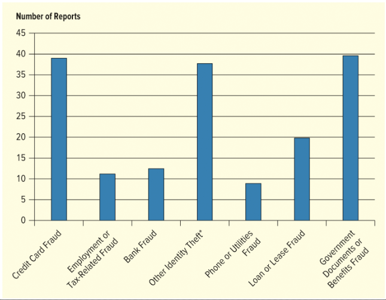

 
---
# **Question:** 1

## Question:
Carrying out the goals of business through the use of the Internet is generally known as:

## Options:
A. Digital marketing  
B. E-business  
C. Social networking  
D. Digital media  

## Correct Answer:
**B. E-business**

## Explanation:
E-business refers to using the Internet and digital technologies to perform business activities such as sales, customer service, communication, operations, and management. It is broader than digital marketing because it includes all online business functions, not only promotion.

 
---
# **Question:** 2

## Question:
Electronic media that function using digital codes via computers, smartphones, and other digital devices are called ______ media.

## Options:
A. Digital  
B. Mass  
C. Verbal  
D. Social  

## Correct Answer:
**A. Digital**

## Explanation:
Digital media refers to any type of media that is created, stored, and distributed using digital technology such as computers, smartphones, and the internet. It includes videos, websites, apps, social media content, and online platforms.

 
---
# **Question:** 3

## Question:
A company that uses the Internet and mobile and interactive channels to develop communication and exchanges with customers is engaged in ______ marketing.

## Options:
A. Mass  
B. Social  
C. Network  
D. Digital  

## Correct Answer:
**D. Digital**

## Explanation:
Digital marketing refers to the use of the Internet, mobile devices, social media, and other digital channels to communicate with customers, promote products, and build relationships. It focuses on interactive and online engagement rather than traditional offline methods.

 
---
# **Question:** 4

## Matching Question: Characteristics of Digital Marketing

### Correct Matches:

**Connectivity** → The ability for consumers to be connected with marketers along with other consumers.

**Control** → The customer's ability to regulate the information they view as well as the rate and exposure to that information.

**Accessibility** → The ability for marketers to obtain digital information.

**Interactivity** → The ability of customers to express their needs and wants directly to the firm in response to its marketing communications.

**Addressability** → The ability of the marketer to identify customers before they make a purchase.

 
---
# **Question:** 5

## Question:
The ability of the marketer to identify customers before they make a purchase is the definition of which characteristic of digital marketing?

## Options:
A. Control  
B. Accessibility  
C. Addressability  
D. Connectivity  

## Correct Answer:
**C. Addressability**

## Explanation:
Addressability in digital marketing refers to the ability of marketers to identify and reach specific individual customers or target audiences before they make a purchase, using data collected from digital platforms.

 
---
# **Question:** 6

## Question:
In what way does e-business differ from traditional business activities?

## Options:
A. E-business is only directed at business-to-business (B2B) sales.  
B. E-business goals are carried out through the use of the Internet.  
C. E-business does not need to engage in promotional activities.  
D. E-business is only directed at business-to-consumer (B2C) sales.  

## Correct Answer:
**B. E-business goals are carried out through the use of the Internet.**

## Explanation:
E-business refers to all business activities conducted using the Internet and digital technologies, including sales, operations, communication, and customer service. Unlike traditional business, it relies heavily on online systems to achieve business goals, not limited to specific markets like B2B or B2C.

 
---
# **Question:** 7

## Question:
The ability of customers to express their needs and wants directly to the firm in response to its marketing communication is the definition of which characteristic of digital marketing?

## Options:
A. Accessibility  
B. Interactivity  
C. Addressability  
D. Control  

## Correct Answer:
**B. Interactivity**

## Explanation:
Interactivity refers to the two-way communication between customers and businesses in digital marketing. It allows customers to respond directly to marketing messages, share feedback, ask questions, and engage with the company in real time.

 
---
# **Question:** 8

## Question:
Digital media is defined as:

## Options:
A. The ability for consumers to be connected with marketers along with other consumers  
B. Electronic media that function using digital codes  
C. The ability of customers to express their needs and wants directly to the firm in response to its marketing communications  
D. The carrying out of business goals through the use of the Internet  

## Correct Answer:
**B. Electronic media that function using digital codes**

## Explanation:
Digital media refers to any form of media that is created, stored, and distributed using digital technology such as computers, smartphones, and the internet. It includes content like videos, websites, social media posts, and online advertisements.

 
---
# **Question:** 9

## Question:
The ability for marketers to obtain digital information is the definition of which characteristic of digital marketing?

## Options:
A. Control  
B. Accessibility  
C. Connectivity  
D. Addressability  

## Correct Answer:
**B. Accessibility**

## Explanation:
Accessibility in digital marketing refers to the ability of marketers to access and obtain digital information from online sources, platforms, and customer data. This information helps businesses understand consumer behavior and improve marketing strategies.

 
---
# **Question:** 10

## Question:
Which three formats are examples of digital marketing? (Select all that apply)

## Options:
A. Social networks  
B. Banner ads  
C. Traditional newspaper advertising  
D. Printed magazine advertisements  
E. Digital outdoor marketing  

## Correct Answers:
**A. Social networks**  
**B. Banner ads**  
**E. Digital outdoor marketing**

## Explanation:
Digital marketing uses online and electronic channels to promote products or services. Social networks and banner ads are clearly digital formats, and digital outdoor marketing (such as digital billboards or screens) also uses electronic technology. Traditional newspaper and printed magazine ads are not digital because they use physical print media.

 
---
# **Question:** 11

## Question:
Because it is taking on department stores and big box stores, which online retailer has completely transformed the way many people shop?

## Options:
A. Amazon  
B. Apple  
C. eBay  
D. HSN (Home Shopping Network)  

## Correct Answer:
**A. Amazon**

## Explanation:
Amazon has transformed retail by offering a massive online marketplace, fast shipping, competitive pricing, and a wide range of products. It has significantly disrupted traditional department stores and big box retailers by changing how people browse, compare, and purchase goods online.

 
---
# **Question:** 12

## Question:
What are three characteristics of digital marketing? (Select all that apply)

## Options:
A. Addressability  
B. Functionality  
C. Convertibility  
D. Connectivity  
E. Control  
F. Susceptibility  

## Correct Answers:
**A. Addressability**  
**D. Connectivity**  
**E. Control**

## Explanation:
Digital marketing is defined by key characteristics that describe how it connects businesses and customers:

- **Addressability**: marketers can identify and target individual customers.  
- **Connectivity**: customers and marketers can interact and connect with each other.  
- **Control**: customers can control what information they see and how they engage with it.  

The other options are not standard recognized characteristics of digital marketing.

 
---
# **Question:** 13

## Question:
Select three ways in which digital marketing differs from conventional marketing techniques. (Select all that apply)

## Options:
A. Digital marketing is more expensive than conventional marketing.  
B. Digital marketing complicates the process of sharing information.  
C. Digital marketing allows for faster, more interactive communication.  
D. Digital marketing helps marketers identify new target markets more easily.  
E. Digital marketing provides a way for marketers to utilize new ways to communicate with customers.  

## Correct Answers:
**C. Digital marketing allows for faster, more interactive communication.**  
**D. Digital marketing helps marketers identify new target markets more easily.**  
**E. Digital marketing provides a way for marketers to utilize new ways to communicate with customers.**

## Explanation:
Digital marketing is generally faster, more interactive, and more flexible than traditional marketing. It also uses data and digital tools to help identify and reach new audiences. Additionally, it introduces new communication channels such as social media, email, and mobile apps, which are not available in conventional marketing.

Options A and B are incorrect because digital marketing is usually more cost-effective and simplifies (not complicates) communication.

 
---
# **Question:** 14

## Question:
An online retailer installs cookies on a user's computer so it can identify the user when he or she returns to the website. This exemplifies the ______ characteristic of digital marketing.

## Options:
A. Addressability  
B. Interactivity  
C. Accessibility  
D. Control  

## Correct Answer:
**A. Addressability**

## Explanation:
Addressability refers to the ability of marketers to identify and target individual users. Cookies allow websites to recognize returning users, track behavior, and personalize marketing, which is a clear example of addressability in digital marketing.

 
---
# **Question:** 15

## Question:
What are three things a digital marketer must do in order to remain competitive?

## Options:
A. Become a global company  
B. Increase mass customization  
C. Anticipate consumer preferences  
D. Continually upgrade products  
E. Tailor goods and services to consumer wants  

## Correct Answers:
**C. Anticipate consumer preferences**  
**D. Continually upgrade products**  
**E. Tailor goods and services to consumer wants**

## Explanation:
To remain competitive, digital marketers must constantly analyze customer data to anticipate what consumers want in the future. They also need to continuously improve and upgrade their products to meet changing demands. In addition, tailoring goods and services to consumer wants ensures personalization and better customer satisfaction, which is essential in digital markets.

---
# **Question:** 16

## Question:
An online retailer interacts with its customers through Facebook and Twitter by answering questions and posting updates. This exemplifies the ______ characteristic of digital marketing.

## Options:
A. Interactivity  
B. Accessibility  
C. Connectivity  
D. Control  

## Correct Answer:
**A. Interactivity**

## Explanation:
Interactivity refers to two-way communication between businesses and customers. When a company uses platforms like Facebook and Twitter to answer questions and respond to comments, it is engaging directly with customers in real time, which is a key feature of interactivity in digital marketing.

 
---
# **Question:** 17

## Question:
What are three benefits to businesses that use electronic order processing? (Select all that apply)

## Options:
A. It reduces inefficiencies.  
B. It increases redundancy.  
C. It increases the speed of communication.  
D. It increases processing time.  
E. It reduces costs.  

## Correct Answers:
**A. It reduces inefficiencies.**  
**C. It increases the speed of communication.**  
**E. It reduces costs.**

## Explanation:
Electronic order processing improves business operations by automating tasks and reducing manual work. This leads to fewer inefficiencies, faster communication between systems and customers, and lower operational costs. Options B and D are incorrect because electronic systems are designed to reduce redundancy and processing time, not increase them.

 
---
# **Question:** 18

## Question:
An online retailer uses web searches to learn about customer interests. This exemplifies the ______ characteristic of digital marketing.

## Options:
A. Interactivity  
B. Control  
C. Connectivity  
D. Accessibility  

## Correct Answer:
**D. Accessibility**

## Explanation:
Accessibility refers to the ability of marketers to obtain and gather digital information from online sources. When a retailer uses web searches to learn about customer interests, it is accessing available digital data to better understand consumer behavior.

 
---
# **Question:** 19

## Question:
Retailers that offer a seamless experience on their mobile, desktop, or traditional retail spaces are engaged in:

## Options:
A. Omni-channel retailing  
B. E-commerce  
C. Digital media  
D. Social media marketing  

## Correct Answer:
**A. Omni-channel retailing**

## Explanation:
Omni-channel retailing integrates multiple shopping channels—such as mobile apps, websites, and physical stores—so customers have a consistent and seamless experience regardless of how they shop. This approach connects all platforms into one unified customer journey.

 
---
# **Question:** 20

## Question:
How has digital media and the advent of online shopping affected the retail landscape?

## Options:
A. The use of digital communication has led to a decrease in the interactive communication needed to forge close customer relationships.  
B. Online shopping has prompted many stores to open additional outlets.  
C. Firms who use digital communication have less understanding of their customers' and suppliers' needs.  
D. Online shopping has led to the closing of many brick-and-mortar stores.  

## Correct Answer:
**D. Online shopping has led to the closing of many brick-and-mortar stores.**

## Explanation:
The growth of online shopping and digital media has significantly changed retail by reducing the need for physical store locations. Many traditional brick-and-mortar retailers have closed locations due to competition from e-commerce and changing consumer shopping habits.

 
---
# **Question:** 21

## Question:
On the first Tuesday of every month, So Sweet Bakery announces a new "deal of the day" on their Facebook page. Customers who mention the deal when they come into the Bakery receive 15% off their total order. Which aspect of digital media is So Sweet Bakery focusing on in this scenario?

## Options:
A. Production  
B. Place  
C. Promotion  
D. Product  

## Correct Answer:
**C. Promotion**

## Explanation:
Promotion refers to how a business communicates offers, deals, and messages to attract customers. In this case, the bakery is using Facebook to advertise a discount deal and encourage customers to visit and make purchases, which is a clear example of promotional activity.

 
---
# **Question:** 22

## Question:
Through ______ consumers can learn about everything they consume and use in their lives, ask questions, voice complaints, indicate preferences, and otherwise communicate about their needs and desires.

## Options:
A. Addressability  
B. Supply and demand  
C. Digital media  
D. The marketing mix  

## Correct Answer:
**C. Digital media**

## Explanation:
Digital media enables two-way communication between consumers and businesses. Through digital platforms such as social media, websites, and apps, consumers can ask questions, share feedback, express preferences, and interact directly with companies.

 
---
# **Question:** 23

## Question:
Which social media format is a hybrid of social networking and micro-blogging?

## Options:
A. LinkedIn  
B. Twitter  
C. Pinterest  
D. Snapchat  

## Correct Answer:
**B. Twitter**

## Explanation:
Twitter (now X) is considered a hybrid of social networking and micro-blogging because it allows users to share short, real-time posts while also connecting and interacting with others through follows, replies, and reposts.

 
---
# **Question:** 24

## Question:
What is one of the things a digital marketer should do with respect to product considerations?

## Options:
A. They need to stick to one product or idea rather than adapt to customer preferences.  
B. They must anticipate consumer needs and tailor goods to those needs.  
C. They should not enter the digital marketplace with fewer than 50 products.  
D. They should promote products that have the lowest shipping costs.  

## Correct Answer:
**B. They must anticipate consumer needs and tailor goods to those needs.**

## Explanation:
A key part of digital marketing is understanding customer behavior and preferences. Marketers should anticipate what consumers want and adjust or tailor products and services accordingly to better meet demand and improve customer satisfaction.

 
---
# **Question:** 25

## Question:
Which statement is an accurate depiction of consumer shopping habits?

## Options:
A. Convenience and constant availability are two major reasons consumers shop at stores.  
B. People spend less time shopping in brick-and-mortar stores because they have researched their items online first.  
C. Online retailers have done nothing to confront the issue of high shipping costs and delivery times.  
D. Online shopping has yet to be received favorably by the vast majority of consumers.  

## Correct Answer:
**B. People spend less time shopping in brick-and-mortar stores because they have researched their items online first.**

## Explanation:
Many consumers now use online research before making purchases. This means they arrive at physical stores already informed, which reduces the time spent shopping in-store. Digital tools and online reviews have significantly changed modern shopping behavior.

 
---
# **Question:** 26

## Question:
The largest percentage of Snapchat users are between the ages of:

## Options:
A. 12 and 22  
B. 40 and 54  
C. 18 and 34  
D. 24 and 44  

## Correct Answer:
**C. 18 and 34**

## Explanation:
Although Snapchat is often associated with teenagers, the largest user segment is actually young adults aged 18 to 34. This age group includes both college-aged users and young professionals, making it the biggest demographic on the platform.

---
# **Question:** 27

## Question:
Happy Pets operates both traditional stores and an online shopping site. The retailer offers the same product assortment at both channels so customers can research products online and buy them there or at its stores. It also offers in-store digital kiosks and an app that allows shoppers to order products and receive coupons. This effort to seamlessly integrate all of its retail spaces is an example of:

## Options:
A. Social media marketing  
B. Omni-channel retailing  
C. E-commerce  
D. Digital media  

## Correct Answer:
**B. Omni-channel retailing**

## Explanation:
Omni-channel retailing integrates multiple shopping channels (online, mobile, and physical stores) into one seamless customer experience. In this case, Happy Pets connects its website, app, and physical stores so customers can shop, research, and purchase across all platforms smoothly.

 
---
# **Question:** 28

## Question:
As a social media platform, YouTube makes it difficult for marketers to control messaging about their brand because:

## Options:
A. Like a wiki, users have the ability to change and edit any posted video  
B. Consumers rarely engage with brands through videos  
C. Most of the posted content comes from consumers and not the brand owner  
D. YouTube does not allow brand owners to post original content to the site  

## Correct Answer:
**C. Most of the posted content comes from consumers and not the brand owner**

## Explanation:
YouTube is a user-generated content platform, meaning much of the content is created and shared by consumers rather than brands. This makes it harder for marketers to fully control brand messaging, since users can post reviews, opinions, and reactions that influence public perception.

 
---
# **Question:** 29

## Question:
Increasing brand name awareness, connecting with customers, and taking advantage of social networks are ______ considerations in utilizing digital media.

## Options:
A. Distribution  
B. Pricing  
C. Addressability  
D. Promotion  

## Correct Answer:
**D. Promotion**

## Explanation:
Promotion involves activities that increase brand awareness, communicate with customers, and use media channels (including social networks) to market products or services. These goals are central to how businesses use digital media for promotional strategies.

 
---
# **Question:** 30

## Question:
In May 2020, Jimmy Fallon challenged Jennifer Lopez to take turns trying to mimic dances they saw on a popular social media platform. This platform is popular with dancing videos and challenges. Which social media platform does this refer to?

## Options:
A. Snapchat  
B. TikTok  
C. Twitter  
D. Facebook  

## Correct Answer:
**B. TikTok**

## Explanation:
TikTok is widely known for short-form videos, especially dance trends, challenges, comedy skits, and viral content. It became extremely popular during this period for exactly the type of dance challenges described in the question.

 
---
# **Question:** 31

## Question:
Which four characteristics describe Twitter as a social networking site? (Select all that apply)

## Options:
A. It doesn't provide enough contents for companies to send effective messages.  
B. It is being used by companies to build customer relationships.  
C. It is a hybrid of a social networking site and a micro-blogging site.  
D. It is considered a novelty and has had little effect on digital media.  
E. It allows posts with a limited number of characters.  
F. It asks users one simple question: "What's happening?"  

## Correct Answers:
**B. It is being used by companies to build customer relationships.**  
**C. It is a hybrid of a social networking site and a micro-blogging site.**  
**E. It allows posts with a limited number of characters.**  
**F. It asks users one simple question: "What's happening?"**

## Explanation:
Twitter is a micro-blogging and social networking platform that allows short posts (tweets), originally centered around the prompt “What’s happening?”. It is widely used by companies to engage with customers and build relationships through real-time communication. The character limit defines its micro-blogging nature, and it is not considered a novelty—it has had a major impact on digital media.

 
---
# **Question:** 32

## Question:
What are two reasons why companies use blogs? (Select all that apply)

## Options:
A. Review competitive products  
B. Build interest in a product  
C. Provide a purchase platform  
D. Answer consumer concerns  

## Correct Answers:
**B. Build interest in a product**  
**D. Answer consumer concerns**

## Explanation:
Companies use blogs as a content marketing tool to attract and engage customers. Blogs help generate interest in products by providing useful information and storytelling, and they also allow businesses to address customer questions and concerns. Blogs are not primarily used as direct purchasing platforms or for formal competitive product reviews.

 
---
# **Question:** 33

## Question:
What are three things a digital marketer must do in order to remain competitive? (Select all that apply)

## Options:
A. Continually upgrade products  
B. Increase mass customization  
C. Become a global company  
D. Anticipate consumer preferences  
E. Tailor goods and services to consumer wants  

## Correct Answers:
**A. Continually upgrade products**  
**D. Anticipate consumer preferences**  
**E. Tailor goods and services to consumer wants**

## Explanation:
To remain competitive, digital marketers must continuously improve their products, use data to anticipate what consumers will want in the future, and customize offerings to match customer needs. These actions help businesses stay relevant in fast-changing digital markets.

 
---
# **Question:** 34

## Question:
The Just Like Home Hotel Group developed an app that allows hotel guests to check in on their smartphones. The app also lets guests make a reservation at the hotel restaurant, check what time the pool opens, and book an appointment at the spa. Creating opportunities for guests to use their smartphones for these activities demonstrates the idea of:

## Options:
A. Mobile marketing  
B. Viral marketing  
C. Photo sharing  
D. A podcast  

## Correct Answer:
**A. Mobile marketing**

## Explanation:
Mobile marketing involves using smartphones and mobile apps to provide services, communicate with customers, and enhance the customer experience. In this case, the hotel’s app allows guests to check in, make reservations, and access services directly from their phones, which is a clear example of mobile marketing.

 
---
# **Question:** 35

## Question:
Marketers look at Snapchat as a way to reach:

## Options:
A. The pre-teen market  
B. A young, highly-engaged audience  
C. Mature, wealthy shoppers  
D. Suppliers and vendors  

## Correct Answer:
**B. A young, highly-engaged audience**

## Explanation:
Snapchat is primarily used by younger users, especially teens and young adults. Marketers value the platform because this audience is very active, frequently engages with content, and responds well to visual and interactive messaging.

 
---
# **Question:** 36

## Question:
Consumers who search YouTube for recommendations on beauty products will most likely receive information from a:

## Options:
A. Beauty products manufacturer  
B. Beauty products testing site  
C. Beauty vlogger  
D. Beauty supply distributor  

## Correct Answer:
**C. Beauty vlogger**

## Explanation:
On YouTube, product recommendations are most commonly provided by content creators such as beauty vloggers. These individuals create reviews, tutorials, and opinions based on personal experience, which strongly influences consumer purchasing decisions.

 
---
# **Question:** 37

## Question:
______ are considered an important feature of smartphones due to the convenience and cost savings they offer to consumers.

## Options:
A. Apps  
B. Emojis  
C. Pods  
D. Avatars  

## Correct Answer:
**A. Apps**

## Explanation:
Apps (applications) are one of the most important smartphone features because they allow users to perform a wide range of tasks such as shopping, banking, communication, entertainment, and navigation. They increase convenience and often reduce costs by replacing traditional services.

 
---
# **Question:** 38

## Question:
Which social media format is known for its meme culture and dancing videos?

## Options:
A. Twitter  
B. Facebook  
C. TikTok  
D. LinkedIn  

## Correct Answer:
**C. TikTok**

## Explanation:
TikTok is widely known for short-form videos featuring memes, dance challenges, music trends, comedy, and viral content. Its algorithm promotes highly engaging and entertaining videos, making it especially popular for dance and meme culture.

 
---
# **Question:** 39

## Question:
What is the largest analytics platform monitor currently in use?

## Options:
A. Apple Wallet  
B. Foursquare  
C. Open Web Analytics  
D. Google Analytics  

## Correct Answer:
**D. Google Analytics**

## Explanation:
Google Analytics is the most widely used web analytics platform in the world. It allows businesses to track website traffic, user behavior, conversions, and marketing performance, making it the dominant tool for digital analytics.

 
---
# **Question:** 40

## Question:
What is a blog?

## Options:
A. A podcast  
B. A consumer feedback forum  
C. A photo and video sharing site  
D. A web-based journal  

## Correct Answer:
**D. A web-based journal**

## Explanation:
A blog is a type of website or online platform where individuals or organizations regularly publish written content, articles, or posts. It functions like a web-based journal and can include opinions, information, or updates on various topics.

 
---
# **Question:** 41

## Question:
______ describes how marketers use digital media to find out the opinions or needs of a potential market.

## Options:
A. Benchmarking  
B. Crowdsourcing  
C. Interactivity  
D. Compressing  

## Correct Answer:
**B. Crowdsourcing**

## Explanation:
Crowdsourcing involves using digital platforms to gather ideas, feedback, opinions, or solutions from a large group of people, often potential or current customers. Marketers use it to understand market needs and improve products or services.

 
---
# **Question:** 42

## Question:
Digital marketing geared toward devices like smartphones is termed ______ marketing.

## Options:
A. Social  
B. Auto  
C. Mass  
D. Mobile  

## Correct Answer:
**D. Mobile**

## Explanation:
Mobile marketing refers to digital marketing strategies specifically designed for smartphones and other mobile devices. It includes apps, SMS marketing, mobile websites, and location-based promotions.

 
---
# **Question:** 43

## Question:
The FTC has different rules for online marketing than for any other form of communication or advertising.

## Answer:
**False**

## Explanation:
The Federal Trade Commission (FTC) applies the same basic truth-in-advertising principles to online marketing as it does to traditional advertising. This means digital ads must be honest, not misleading, and backed by evidence, just like print, TV, or radio advertising.

 
---
# **Question:** 44

## Question:
The largest percentage of Snapchat users are between the ages of:

## Options:
A. 18 and 34  
B. 40 and 54  
C. 12 and 22  
D. 24 and 44  

## Correct Answer:
**A. 18 and 34**

## Explanation:
The largest share of Snapchat users falls within the 18 to 34 age group, which includes both young adults and college-aged users. This demographic represents the platform’s biggest user segment overall.

 
---
# **Question:** 45

## Question:
What device, stored on a computer, allows website operators to track how often a user visits a site, what he or she looks at while there, and in what sequence?

## Options:
A. Cookie  
B. Wiki  
C. Widget  
D. QR code  

## Correct Answer:
**A. Cookie**

## Explanation:
A cookie is a small file stored on a user’s computer by a website. It helps track user activity such as visit frequency, browsing behavior, and preferences, allowing websites to personalize content and improve user experience.

 
---
# **Question:** 46

## Question:
In relation to the marketing environment, what are two important features of apps? (Select all that apply)

## Options:
A. Cost savings for users  
B. Easy for marketers to develop  
C. Convenient for users  
D. High profit for marketers  

## Correct Answers:
**A. Cost savings for users**  
**C. Convenient for users**

## Explanation:
Apps are valued in digital marketing because they make services more convenient for users by providing quick, easy access on mobile devices. They can also reduce costs for consumers by replacing or simplifying traditional services. However, apps are not necessarily easy to develop, and they do not automatically guarantee high profit for marketers.

 
---
# **Question:** 47

## Question:
Carli is an online influencer. She has 500,000 followers who view her Instagram fashion posts every day. Based on FTC guidelines, she is required to clearly disclose any connection she has with the brands she promotes. What aspect of Internet marketing does this relate to?

## Options:
A. Transparency  
B. Flexibility  
C. Identity  
D. Privacy  

## Correct Answer:
**A. Transparency**

## Explanation:
Transparency in internet marketing means clearly and honestly disclosing relationships between influencers and brands. The FTC requires influencers to reveal sponsorships or paid partnerships so consumers are not misled.

 
---
# **Question:** 48

## Question:
What are five of the seven reports found on the Google Analytics dashboard? (Select all that apply)

## Options:
A. Monetization  
B. Real time  
C. Behavior  
D. Bounce rate  
E. Acquisition  
F. Demographics  
G. Traffic  

## Correct Answers:
**A. Monetization**  
**B. Real time**  
**C. Behavior**  
**E. Acquisition**  
**F. Demographics**

## Explanation:
Google Analytics dashboards include several standard reports such as Real-time (live user activity), Acquisition (how users arrive), Behavior (what users do on a site), Demographics (user characteristics), and Monetization (revenue-related data). Bounce rate is a metric, not a report, and "Traffic" is not a formal report category.

 
---
# **Question:** 49

## Question:
Gerard received an unemployment check in the mail even though he had never filed for unemployment. When he called his state office of unemployment, they told him someone else had filed for benefits under his name and he would need to file a police report so he would have a record of this criminal behavior. This is an example of:

## Options:
A. A wiki  
B. Identity fraud  
C. Crowdsourcing  
D. An IP violation  

## Correct Answer:
**B. Identity fraud**

## Explanation:
Identity fraud occurs when someone illegally uses another person’s personal information (such as name or Social Security number) to commit fraud or obtain benefits. In this case, someone filed for unemployment using Gerard’s identity.

 
---
# **Question:** 50

## Question:
Which site is an example of a crowdsourcing community?

## Options:
A. Threadless  
B. Myspace  
C. Second Life  
D. Six Degrees  

## Correct Answer:
**A. Threadless**

## Explanation:
Threadless is a crowdsourcing community where users submit design ideas (such as T-shirts), and the community votes on them. The best designs are produced and sold. This is a clear example of crowdsourcing because it relies on contributions from a large group of people.

 
---
# **Question:** 51

## Question:
______ includes ideas and creative materials developed to solve problems, carry out applications, and educate and entertain others.

## Options:
A. Integrated marketing communications  
B. Mass media  
C. Intellectual property  
D. Publicity  

## Correct Answer:
**C. Intellectual property**

## Explanation:
Intellectual property refers to creations of the mind such as ideas, designs, written content, inventions, and creative works. These materials are developed for problem-solving, applications, education, and entertainment, and are legally protected.

 
---
# **Question:** 52

## Question:
To avoid deception, all online communication must comply with which three factors? (Select all that apply)

## Options:
A. Demonstrate repeatability  
B. Avoid FTC approval  
C. Substantiate any claims  
D. Tell the truth  
E. Not mislead consumers  

## Correct Answers:
**C. Substantiate any claims**  
**D. Tell the truth**  
**E. Not mislead consumers**

## Explanation:
The FTC requires that all advertising, including online communication, must be truthful, supported by evidence (substantiated), and not misleading to consumers. Businesses are responsible for ensuring their claims are accurate. The other options are not FTC compliance requirements.

 
---
# **Question:** 53

## Question:
Typically, traditional businesses accustomed to using print media will be able to transition to digital media with ease.

## Answer:
**False**

## Explanation:
Transitioning from print media to digital media is not always easy for traditional businesses. It often requires new skills, technologies, strategies, and a shift in how companies interact with customers and analyze data. Digital marketing is more interactive, data-driven, and fast-paced than traditional print advertising.

 
---
# **Question:** 54

## Question:
Cookies can be turned off so as to lessen the potential of invasion and revealing information to marketers.

## Answer:
**True**

## Explanation:
Cookies can be disabled or restricted in a user’s browser settings. Doing so can reduce tracking and limit the amount of personal browsing information shared with websites and marketers, helping improve user privacy.

 
---
# **Question:** 55

## Question:
According to the Federal Trade Commission, an online influencer must disclose if they receive compensation for any products they promote. This relates to ______ in online marketing.

## Options:
A. Flexibility  
B. Reliability  
C. Privacy  
D. Transparency  

## Correct Answer:
**D. Transparency**

## Explanation:
Transparency in online marketing means clearly disclosing any paid relationships, sponsorships, or incentives behind promotions. The FTC requires influencers to be honest with audiences so consumers understand when content is sponsored or influenced by compensation.

 
---
# **Question:** 56

## Question:
According to the figure, which of the following are the top three most common complaints of identity theft leading to fraud? (Select all that apply)

</img>

## Options:
A. Government benefits fraud  
B. Credit card fraud  
C. Employment fraud  
D. Utilities fraud  
E. Loan fraud  

## Correct Answers:
**A. Government benefits fraud**  
**B. Credit card fraud**  
**E. Loan fraud**

## Explanation:
According to the figure, the most common identity theft-related fraud complaints are government benefits fraud, credit card fraud, and loan fraud. These categories appear most frequently compared to employment and utilities fraud, which are less common in the reported data.

 
---
# **Question:** 57

## Question:
Which two scenarios are examples of intellectual property? (Select all that apply)

## Options:
A. Maren is a copywriter at the Wells Advertising Agency.  
B. Parker works for Patagonia and is responsible for designing outerwear.  
C. Karina is a popular songwriter and a song she wrote for Justin Timberlake is now playing on every radio station.  
D. Juanita wrote a novel that was published last year.  

## Correct Answers:
**C. Karina is a popular songwriter and a song she wrote for Justin Timberlake is now playing on every radio station.**  
**D. Juanita wrote a novel that was published last year.**

## Explanation:
Intellectual property refers to original creative works such as music, books, and other artistic or written content. Songs and novels are protected as intellectual property. While advertising and product design involve creative work, the question is focused on clearly defined creative works owned by the creator, such as songs and books.

 
---
# **Question:** 58

## Question:
Which statement is accurate regarding the adoption of digital media by businesses?

## Options:
A. Traditional business accustomed to print media have found the switch to digital media to be quite easy.  
B. Future career opportunities will no longer require an understanding of traditional media sources.  
C. Determining the mix of digital and traditional media is based solely on a company's product line.  
D. There is often a gap between technical knowledge in developing sites and digital marketing strategies.  

## Correct Answer:
**D. There is often a gap between technical knowledge in developing sites and digital marketing strategies.**

## Explanation:
Many businesses struggle because technical skills (like building websites) do not always align with marketing strategy skills (like targeting customers and creating campaigns). This gap makes it challenging to fully integrate digital media effectively.

 
---
# **Question:** 59

## Question:
Gerard received an unemployment check in the mail even though he had never filed for unemployment. When he called his state office of unemployment, they told him someone else had filed for benefits under his name and he would need to file a police report so he would have a record of this criminal behavior. This is an example of:

## Options:
A. An IP violation  
B. Identity fraud  
C. Crowdsourcing  
D. A wiki  

## Correct Answer:
**B. Identity fraud**

## Explanation:
Identity fraud occurs when someone illegally uses another person’s personal information to obtain money, benefits, or services. In this case, another person filed for unemployment benefits using Gerard’s identity.

 
---

