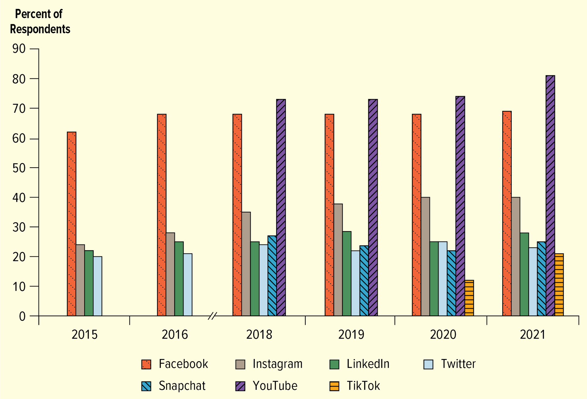
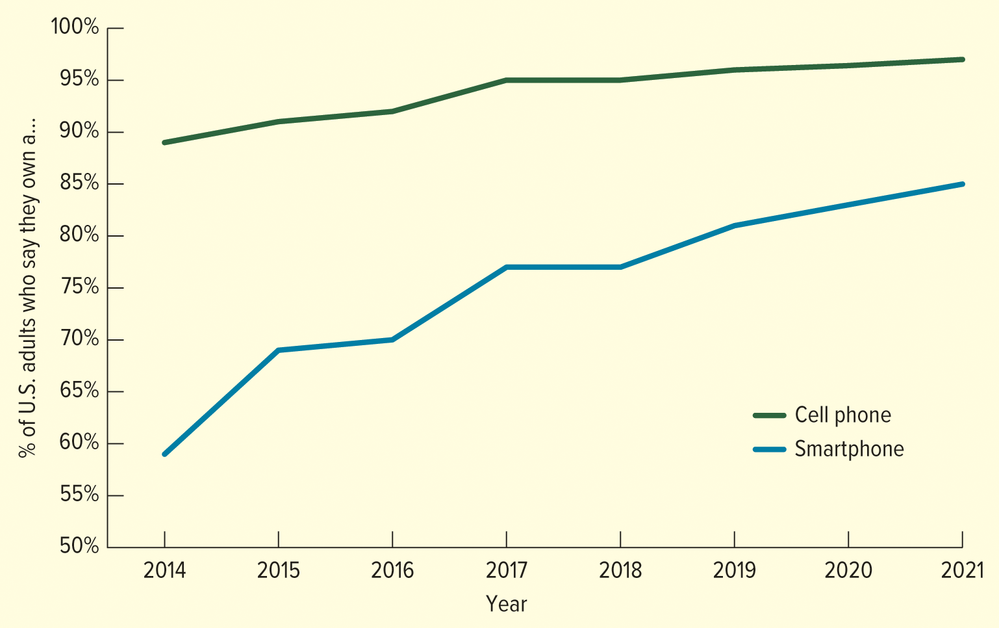
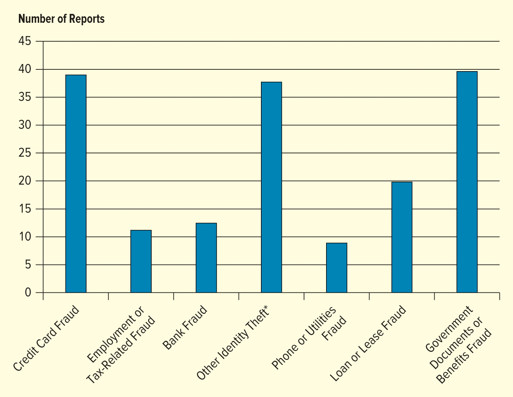

<h1 id="Chapter_13._Digital_Marketing_and_Social_Media" style="color:#42A5F5;">Indice</h1>

##### [Capitulo OA 13-1 CRECIMIENTO Y BENEFICIOS DE LA COMUNICACIÓN DIGITAL](#068819)

##### [Capitulo OA 13-2 USO DE LOS MEDIOS DIGITALES EN LOS NEGOCIOS](#458841)

##### [Capitulo OA 13-3 MEDIOS DIGITALES Y LA MEZCLA DE MARKETING](#392092)

##### [Capitulo OA 13-4 CANALES DE MARKETING DIGITAL](#719169)

##### [Capitulo OA 13-6 CUESTIONES ÉTICAS Y LEGALES EN EL MARKETING DIGITAL](#716733)

---

<h1 id="068819" style="color:#E65100;">
  <a href="#Chapter_13._Digital_Marketing_and_Social_Media" style="color:inherit; text-decoration:none;">
    OA 13-1 CRECIMIENTO Y BENEFICIOS DE LA COMUNICACIÓN DIGITAL
  </a>
</h1>

Reconocer el creciente valor de los medios digitales y el marketing digital en la planificación estratégica.

---

Comencemos con una comprensión clara de nuestro enfoque en este capítulo. Primero, podemos distinguir el **e-business** (negocio electrónico) del negocio tradicional señalando que realizar e-business significa llevar a cabo los objetivos del negocio mediante el uso de internet.

Los **medios digitales** son medios electrónicos que funcionan utilizando códigos digitales. Cuando nos referimos a medios digitales, hablamos de medios disponibles a través de computadoras y otros dispositivos digitales, incluyendo los móviles e inalámbricos como los teléfonos inteligentes.

El **marketing digital** utiliza todos los medios digitales, incluyendo internet y los canales móviles e interactivos, para desarrollar comunicación e intercambios con los clientes. El marketing digital es un término que usaremos a menudo porque nos interesan todos los tipos de comunicaciones digitales, independientemente del canal electrónico que transmita los datos. El marketing digital va más allá de internet e incluye teléfonos móviles, anuncios tipo banner, marketing digital exterior y redes sociales.

Internet ha creado enormes oportunidades para que las empresas forjen relaciones con consumidores y clientes empresariales, segmenten mercados con mayor precisión e incluso lleguen a mercados previamente inaccesibles, tanto a nivel local como mundial. Internet también facilita las transacciones comerciales, permitiendo que las empresas se conecten con fabricantes, mayoristas, minoristas, proveedores y empresas subcontratadas para servir a los clientes de manera más rápida y eficiente. Las oportunidades de telecomunicaciones creadas por internet han preparado el escenario para el desarrollo y crecimiento del marketing digital.

Los medios digitales también pueden mejorar la comunicación dentro de las empresas y entre ellas. En el futuro, las ganancias más significativas provendrán de mejoras en la productividad dentro de los negocios. El software de videoconferencias (Zoom), mensajería (Slack), colaboración en equipo (Microsoft Teams) y gestión de proyectos (Asana) son solo algunas de las herramientas que las empresas utilizan para comunicarse en línea.

La comunicación es una función empresarial clave, y mejorar la velocidad y claridad de la comunicación puede ayudar a las empresas a ahorrar tiempo y mejorar las habilidades de resolución de problemas de los empleados. Los medios digitales pueden ser una columna vertebral de la comunicación que ayuda a almacenar conocimiento, información y registros en sistemas de información gerencial, para que los compañeros de trabajo puedan acceder a ellos cuando se enfrenten a un problema por resolver. Por lo tanto, un sistema de información gerencial bien diseñado que utilice tecnología digital puede ayudar a reducir la confusión, mejorar la organización y la eficiencia, y facilitar comunicaciones claras.

Dado el papel crucial de la comunicación y la información en los negocios, el impacto a largo plazo de los medios digitales en el crecimiento económico es sustancial y crecerá inevitablemente con el tiempo.

La comunicación digital ofrece una dimensión completamente nueva para conectarse con otros. Algunas de las características que distinguen la comunicación digital de la tradicional son: **direccionabilidad, interactividad, accesibilidad, conectividad y control**. Estos términos se discuten en la siguiente tabla.

---

## Tabla 13.1 Características del Marketing Digital

| Característica | Definición | Ejemplo |
|----------------|------------|---------|
| **Direccionabilidad (Addressability)** | La capacidad del marketero para identificar a los clientes antes de que realicen una compra | Amazon instala cookies en la computadora de un usuario que le permiten identificarlo cuando regresa al sitio web. |
| **Interactividad (Interactivity)** | La capacidad de los clientes para expresar sus necesidades y deseos directamente a la empresa en respuesta a sus comunicaciones de marketing | Texas Instruments interactúa con sus clientes en su página de Facebook respondiendo inquietudes y publicando actualizaciones. |
| **Accesibilidad (Accessibility)** | La capacidad de los marketeros para obtener información digital | Google puede usar las búsquedas web realizadas a través de su motor de búsqueda para conocer los intereses de los clientes. |
| **Conectividad (Connectivity)** | La capacidad de los consumidores para estar conectados con los marketeros, así como con otros consumidores | El sitio web de Volition Beauty anima a los clientes a enviar sus ideas de productos de maquillaje y cuidado de la piel, que luego pueden ser votadas por otros usuarios para tener la oportunidad de ser creadas. |
| **Control (Control)** | La capacidad del cliente para regular la información que ve, así como la velocidad y exposición a esa información | Los consumidores usan Kayak para descubrir las mejores ofertas de viajes. |

<h1 id="458841" style="color:#E65100;">
  <a href="#Chapter_13._Digital_Marketing_and_Social_Media" style="color:inherit; text-decoration:none;">
    OA 13-2 USO DE LOS MEDIOS DIGITALES EN LOS NEGOCIOS
  </a>
</h1>

Distinguir entre medios pagados, medios propios y medios ganados.

El crecimiento fenomenal de los medios digitales ha proporcionado nuevas formas de realizar negocios. Gracias a la comunicación casi instantánea con grupos de consumidores definidos con precisión, las empresas pueden utilizar intercambios en tiempo real para crear y estimular la comunicación interactiva, forjar relaciones más cercanas y aprender con mayor precisión sobre las necesidades de los consumidores y proveedores. Considere cómo Amazon compite con grandes tiendas como Walmart y Home Depot. De hecho, los cierres de tiendas se duplicaron en los últimos años con el auge de las compras en línea. Es difícil recordar un mundo antes de Amazon porque ha transformado por completo la forma en que muchas personas compran.

Debido a que es rápida y económica, la comunicación digital está facilitando que las empresas realicen investigaciones de marketing, proporcionen y obtengan información sobre precios y productos, y anuncien, así como también cumplan sus objetivos comerciales vendiendo bienes y servicios en línea. Incluso el gobierno de Estados Unidos participa en actividades de marketing digital, comercializando desde bonos del Tesoro y otros instrumentos financieros hasta licencias de perforación petrolera y caballos salvajes. Procter & Gamble utiliza internet como un medio rápido y rentable para la investigación de marketing, evaluando la demanda de los consumidores de posibles nuevos productos invitando a consumidores en línea a probar prototipos de nuevos productos y proporcionar comentarios. Si un producto recibe críticas entusiastas de los evaluadores, la empresa podría decidir introducirlo. Muchas empresas recurren a compañías de software como Salesforce para la automatización del marketing digital y la analítica de marketing.

Nuevos negocios e incluso industrias están evolucionando que no existirían sin los medios digitales. Por ejemplo, los tokens no fungibles (NFT), que son archivos digitales únicos impulsados por la tecnología blockchain, se han vuelto populares en la comunidad del arte digital. Los NFT se han vendido por millones de dólares. El comercio minorista en línea, la transmisión de video, las redes sociales, las citas en línea, el almacenamiento en la nube, los motores de búsqueda y el metaverso no existirían sin los medios digitales. El metaverso, que se refiere a las redes digitales de mundos virtuales a los que se accede a través de cascos de realidad virtual y realidad aumentada, podría generar hasta 5 billones de dólares para 2030. Los marketeros pueden usar el metaverso para crear espacios digitales personalizados, ofrecer experiencias inmersivas al cliente, entregar coleccionables digitales (como NFT) y más. Curiosamente, menos de la mitad de los CEO creen que el metaverso es aplicable a su negocio, pero esto podría cambiar con el tiempo a medida que el metaverso se vuelva más común.

La realidad, sin embargo, es que los mercados de internet son más similares a los mercados tradicionales de lo que son diferentes. Por lo tanto, las estrategias exitosas de marketing digital, al igual que las estrategias comerciales tradicionales, se enfocan en crear productos que los clientes necesitan o desean, no simplemente en desarrollar un nombre de marca o reducir los costos asociados con las transacciones en línea. Si bien el marketing digital comparte algunas similitudes con las técnicas de marketing convencionales, destacan algunas diferencias valiosas. Primero, los medios digitales hacen que las comunicaciones con los clientes sean más rápidas e interactivas. Segundo, los medios digitales ayudan a las empresas a alcanzar nuevos mercados objetivo más fácilmente, de manera más asequible y rápida que nunca. Finalmente, los medios digitales ayudan a los marketeros a utilizar nuevos recursos para buscar y comunicarse con los clientes.

Se puede targeting y llegar a grandes mercados a través de tres tipos de medios: **medios pagados**, **medios propios** y **medios ganados**. Puede haber superposición entre estos tipos de medios. Las empresas deben decidir cómo utilizar los medios digitales en los negocios para alcanzar sus objetivos.

---

## Medios Pagados (Paid Media)

Las empresas a menudo pagan por medios publicados en línea. Los **medios pagados** se refieren al contenido promocional por el que una empresa paga. Esto incluye la publicidad tradicional como vallas publicitarias y anuncios en revistas, además de la publicidad en línea. Los medios pagados, a menudo etiquetados como contenido patrocinado, incluyen anuncios en motores de búsqueda, anuncios en redes sociales, publicaciones promocionadas, anuncios tipo banner en sitios web, artículos patrocinados, marketing de influencers, y más. Generalmente, la publicidad digital es más asequible que los canales de publicidad tradicionales y puede ofrecer a las empresas una mejor segmentación. En Facebook, que ha acumulado más de 10 millones de anunciantes, las empresas pueden pagar para promocionar publicaciones, crear anuncios atractivos, promover su página, y más.

Hay varias ventajas en los medios pagados. Primero, las empresas tienen más control sobre quién ve el contenido que con los medios propios y ganados. Los anunciantes tienen la capacidad de dirigir su comunicación a una audiencia específica con la publicidad digital. Segundo, las empresas tienen control completo sobre el mensaje. Una desventaja de los medios pagados es que a veces los consumidores no confían tanto en la publicidad como en los testimonios de amigos y familiares.

## Medios Propios (Owned Media)

Los **medios propios** son contenido que una empresa publica en canales controlados por la compañía, como un blog, sitio web, podcast, correo electrónico o red social. Por ejemplo, muchas empresas publican artículos en sus blogs destacando sus metas y logros. Al igual que los medios pagados, las empresas tienen un alto nivel de control sobre el mensaje que publican, pero es posible que el contenido no llegue a tantas personas como los medios pagados.

Las empresas pueden crear medios propios que generen defensores y entusiastas de los productos de una empresa. Por ejemplo, Penguin Teen, una editorial de libros para adolescentes y adultos jóvenes, utiliza TikTok para compartir adelantos de libros y noticias con sus fans más comprometidos. La marca ha acumulado millones de "me gusta" en sus videos, recompensando a sus fans más comprometidos con libros gratis. El marketing debe centrarse en la construcción de relaciones, y las redes sociales pueden influir en el comportamiento del consumidor y entregar valor a la empresa.

*Si alguna vez has publicado una reseña en línea o compartido tus pensamientos sobre un producto en redes sociales, has participado en la creación de contenido generado por el usuario.*

---

## Medios Ganados (Earned Media)

Finalmente, los **medios ganados** se refieren al contenido sobre un negocio o producto por el que la empresa no pagó. Los medios ganados pueden ser positivos o negativos. Esto se puede observar cuando los consumidores se comunican orgánicamente en línea sobre una marca, como creando una publicación en redes sociales, escribiendo una entrada de blog, subiendo una reseña en video, o de otra manera difundiendo información sobre una empresa o producto. Aunque los medios ganados no son tan controlables como los medios pagados y propios, si la comunicación es positiva, aumenta las ventas.

Muchos consumidores publican textos, videos, imágenes, audio y reseñas sobre empresas y productos. Estas publicaciones o interacciones de boca a boca digital se denominan **contenido generado por el usuario**. El contenido generado por el usuario puede ser pagado en lugar de ganado si el usuario recibe compensación por su contenido. Los sitios de calificación pueden ser útiles para recopilar información utilizada en la investigación de marketing y para monitorear la reputación de la empresa. Yelp es uno de los sitios de reseñas más completos sobre productos y negocios, con más de 244 millones de reseñas acumuladas. Si alguna vez has publicado una reseña en línea o compartido tus pensamientos sobre un producto en redes sociales o en un sitio de reseñas, has participado en compartir contenido generado por el usuario.

Una ventaja de los medios ganados es que son gratuitos para la empresa. Sin embargo, los marketeros tienen poco o ningún control sobre el mensaje. En cambio, los marketeros pueden intentar influir en la conversación interactuando públicamente con los consumidores y abordando problemas. Los administradores de redes sociales pueden estar preparados estableciendo un plan de gestión de crisis en redes sociales.

El **marketing viral** es una estrategia de marketing digital que utiliza un efecto de red para difundir un mensaje y crear conciencia de marca. El propósito de esta técnica es alentar al consumidor a compartir el mensaje con amigos, familiares, compañeros de trabajo y pares. El marketing viral puede utilizar una combinación de medios pagados, propios y ganados. Por ejemplo, el anuncio de una empresa (medio pagado), un video de YouTube (medio propio) o el video de reseña de un producto de un consumidor en TikTok (medio ganado) podrían volverse virales. Sin importar qué tipo de medio esté involucrado, el marketing viral depende en última instancia de que los consumidores difundan orgánicamente el mensaje para llegar a millones de personas. Las principales ventajas del marketing viral se relacionan con el potencial de llegar a una gran audiencia por menos dinero que solo con medios pagados; sin embargo, el marketing viral puede ser difícil de predecir y controlar, y el rumor puede ser de corta duración. En un ejemplo, cuando un video de TikTok de un hombre patinando hacia el trabajo mientras bebía jugo de arándano Ocean Spray atrajo millones de vistas, Ocean Spray capitalizó la atención transmitiendo un anuncio de televisión con TikTok y regalando al hombre una camioneta para que pudiera conducir al trabajo, extendiendo así la vida del momento de marketing viral.

La naturaleza dinámica del marketing digital puede cambiar rápidamente las oportunidades y crear desafíos. Por ejemplo, los asistentes digitales ahora funcionan como un administrador de información personal y se están utilizando para ayudar a profesionales en medicina, ingeniería y otras áreas de negocios. Los teléfonos inteligentes, las redes sociales, los drones y los automóviles sin conductor están dando forma a un nuevo entorno de marketing. Si bien el marketing digital tiene muchos beneficios, existen desafíos, especialmente en ceder privacidad para usar los medios digitales.

---

<h1 id="392092" style="color:#E65100;">
  <a href="#Chapter_13._Digital_Marketing_and_Social_Media" style="color:inherit; text-decoration:none;">
    OA 13-3 MEDIOS DIGITALES Y LA MEZCLA DE MARKETING
  </a>
</h1>

Mostrar cómo los medios digitales afectan la mezcla de marketing.

---

## Mezcla de Marketing (Marketing Mix)

La **mezcla de marketing** se refiere a la combinación de elementos controlables que una empresa utiliza para satisfacer las necesidades de su mercado objetivo y lograr sus objetivos comerciales. Estos elementos tradicionalmente incluyen las "Cuatro P": **Producto**, **Precio**, **Plaza (Distribución)** y **Promoción**.

Un aspecto del marketing que no ha cambiado con los medios digitales es la importancia de lograr la mezcla de marketing adecuada. El producto, la distribución, la promoción y el precio son tan importantes como siempre para las estrategias de marketing online exitosas. Más del 54 por ciento de la población mundial utiliza ahora internet. Esto significa que es esencial para las empresas, grandes y pequeñas, utilizar los medios digitales de manera efectiva, no solo para capturar o mantener participación de mercado, sino también para optimizar sus organizaciones y ofrecer a los clientes beneficios y conveniencia completamente nuevos. Veamos cómo las empresas están utilizando los medios digitales para crear estrategias de marketing efectivas en la web.

## Consideraciones sobre el Producto

**Definición de Producto:** En el contexto de la mezcla de marketing, el **producto** se refiere al bien, servicio o idea que una empresa ofrece a su mercado objetivo para satisfacer una necesidad o deseo. Incluye aspectos como la calidad, el diseño, las características, la marca, el empaque y los servicios complementarios.

Al igual que los marketeros tradicionales, los marketeros digitales deben anticipar las necesidades y preferencias de los consumidores, adaptar sus bienes y servicios para satisfacer estas necesidades y mejorarlos continuamente para seguir siendo competitivos. La conectividad creada por los medios digitales proporciona la oportunidad de agregar servicios y puede mejorar los beneficios del producto. Algunos productos, como los juegos en línea, las aplicaciones y los mundos virtuales, solo están disponibles a través de medios digitales. Las 2 millones de aplicaciones iOS disponibles en la App Store, por ejemplo, proporcionan ejemplos de productos que solo están disponibles en el mundo digital. Las empresas a menudo pueden ofrecer más artículos en línea de los que podrían ofrecer en una tienda minorista.

Los consumidores pueden acceder a información del producto desde cualquier lugar para tomar decisiones más informadas en el viaje de compra. Por ejemplo, la tecnología de escaneo de códigos de barras puede ayudar a los compradores a encontrar información del producto y comparar precios.

La capacidad de acceder a información de cualquier producto puede tener un gran impacto en la toma de decisiones del comprador. Sin embargo, con las grandes empresas lanzando ahora sus propias campañas de marketing extensas, y con la constante sofisticación de la tecnología digital, muchas empresas están encontrando necesario actualizar sus ofertas de productos para satisfacer las necesidades del consumidor. Por ejemplo, Volition, una empresa de cuidado de la piel y cosméticos, obtiene ideas de nuevos productos a través de sus clientes (crowdsourcing). Si una idea supera la evaluación del equipo de Volition, decenas de miles de personas en la comunidad de Volition votarán en línea si el producto debe producirse y luego recibirán un descuento si el producto es votado favorablemente. Utilizar su base de fans para nuevas ideas ha llevado a productos únicos e innovadores, y a medida que los consumidores comparten sus ideas de productos en sus redes sociales para obtener el apoyo de amigos y familiares, aumenta el conocimiento de esta comunidad de belleza. Internet proporciona un recurso importante para aprender más sobre los deseos y necesidades de los consumidores.

## Consideraciones sobre la Distribución

**Definición de Distribución (Plaza):** En el contexto de la mezcla de marketing, la **distribución** o **plaza** se refiere a las actividades que hacen que el producto esté disponible para los consumidores objetivo en la cantidad, el lugar y el momento adecuados. Incluye la gestión de canales, la logística, el almacenamiento, la gestión de inventarios y el transporte.

El internet es un canal de distribución para hacer que los productos estén disponibles en el momento adecuado, en el lugar adecuado y en las cantidades adecuadas. La capacidad de los marketeros para procesar pedidos electrónicamente y aumentar la velocidad de las comunicaciones a través de internet reduce ineficiencias, costos y redundancias, al mismo tiempo que aumenta la velocidad en todo el canal de marketing. Los tiempos y costos de envío se han convertido en una consideración importante para atraer clientes, lo que ha llevado a muchas empresas a ofrecer a los consumidores costos de envío bajos o entregas al día siguiente. Aunque los consumidores todavía acuden a las tiendas físicas para comprar artículos, tienden a pasar menos tiempo comprando porque ya han determinado lo que quieren en línea. Aproximadamente el 88 por ciento de los consumidores estadounidenses investigan zapatos, juguetes, ropa y otros artículos en internet antes de ir a la tienda. Las compras en línea también están aumentando significativamente, con 230 millones de consumidores estadounidenses encontrando y comprando artículos en línea. La conveniencia y la disponibilidad constante son dos razones principales por las que los consumidores prefieren comprar en línea.

Muchos minoristas en línea, como Birchbox, Everlane, Blue Nile y Warby Parker, han establecido una presencia en el ámbito tradicional de tiendas físicas para crear una presencia física y aumentar el conocimiento. A diferencia de la mayoría, las tiendas de Blue Nile, llamadas "Webroom", son solo salas de exhibición, lo que significa que los clientes pueden tocar y sentir los productos, pero todos los pedidos se realizan en línea, lo que ahorra a la empresa costos de distribución y costos inmobiliarios asociados con grandes escaparates. Esta tendencia es el resultado de una mayor competencia en línea, así como de una tendencia hacia la venta minorista omnicanal, donde los minoristas ofrecen una experiencia perfecta en dispositivos móviles, en computadoras de escritorio o en espacios comerciales tradicionales. Por ejemplo, muchos minoristas buscan ofrecer surtidos de productos y precios consistentes en todos los canales, así como agilizar el proceso de devolución. Un cliente puede investigar una compra en línea, comprar en la tienda, navegar por un catálogo digital en la tienda y luego usar un cupón de la aplicación del minorista al pagar. Walmart, por ejemplo, considera su vasta red de tiendas físicas como su ventaja competitiva sobre los minoristas en línea como Amazon. La empresa ha invertido millones en tecnología omnicanal. Muchos compradores utilizan múltiples canales mientras compran, lo que hace que una experiencia de compra perfecta sea una forma de diferenciar a un minorista de sus competidores.

## Consideraciones sobre la Promoción

**Definición de Promoción:** En el contexto de la mezcla de marketing, la **promoción** se refiere a las actividades que comunican las virtudes del producto y persuaden a los consumidores objetivo para que lo compren. Incluye la publicidad, las relaciones públicas, la venta personal, la promoción de ventas y el marketing directo.

Quizás una de las mejores formas en que las empresas pueden utilizar los medios digitales es con fines promocionales, ya sea para aumentar el conocimiento de la marca, conectarse con los consumidores o aprovechar las redes sociales (que se discuten más adelante) para formar relaciones y generar publicidad positiva o "boca a boca" sobre sus productos. Gracias a la promoción en línea, los consumidores pueden estar más informados que nunca, incluso leyendo contenido generado por los clientes antes de tomar decisiones de compra. Los patrones de consumo de los consumidores están cambiando radicalmente, y los marketeros deben adaptar sus esfuerzos promocionales para satisfacerlos.

Con el auge de los blogueros y las estrellas de las redes sociales como Jimmy Donaldson y Charli D'Amelio, las marcas están recurriendo a influencers para promocionar sus productos. Las marcas identifican a los influencers que se alinean con su imagen de marca y a menudo les pagan por un respaldo o les envían productos de cortesía a cambio de una reseña. Muchas empresas están viendo mayores compras de clientes a través del marketing de influencers que a través de canales tradicionales como el correo electrónico y el marketing en motores de búsqueda. Las marcas pueden contactar a los influencers directamente o utilizar plataformas pagadas como BrandBacker para identificar socios ideales y gestionar campañas.

La promoción digital, sin embargo, tiene sus desventajas. Por ejemplo, la seguridad de la marca es una preocupación creciente para los anunciantes en línea que desean más control sobre la ubicación de los anuncios. Las empresas no quieren que sus anuncios aparezcan junto a contenido cuestionable o controvertido. Algunas marcas se niegan a anunciarse en YouTube o Facebook por temor a aparecer junto a contenido cuestionable.

## Consideraciones sobre el Precio

**Definición de Precio:** En el contexto de la mezcla de marketing, el **precio** se refiere a la cantidad de dinero que los clientes deben pagar para obtener el producto. Es el único elemento de la mezcla de marketing que genera ingresos (los demás generan costos) y es el más flexible, ya que puede cambiarse rápidamente.

El precio es el elemento más flexible de la mezcla de marketing. El marketing digital puede mejorar el valor de los productos proporcionando beneficios adicionales como servicio, información y conveniencia. A través de los medios digitales, los descuentos y otras promociones pueden comunicarse rápidamente. A medida que los consumidores están mejor informados sobre sus opciones, la demanda de productos de bajo precio ha crecido, lo que ha llevado a la creación de sitios de ofertas donde los consumidores pueden comparar precios directamente. Expedia, por ejemplo, proporciona a los consumidores una gran cantidad de información de viajes sobre todo, desde vuelos hasta hoteles, que les permite comparar beneficios y precios. Muchos marketeros ofrecen incentivos de compra como cupones en línea o muestras gratuitas para generar demanda de los consumidores por sus productos. Para la empresa que quiere competir en precio, el marketing digital ofrece oportunidades ilimitadas.

# Shopify Busca la Dominación del Comercio Electrónico

## Contexto

Shopify es una empresa canadiense de comercio electrónico fundada después de que Tobias Lütke, Daniel Weinand y Scott Lake intentaran crear una tienda en línea de equipos para snowboard llamada Snowdevil en 2004. Al no estar satisfechos con las herramientas de comercio electrónico disponibles, Lütke desarrolló una mejor plataforma. En 2006, esa plataforma se convirtió en Shopify.

Desde su oferta pública inicial (IPO) en 2015, Shopify ha crecido rápidamente de 162,000 comerciantes a más de 1 millón en todo el mundo. Shopify tuvo éxito al ofrecer una plataforma todo en uno que ayuda a las empresas a crear, administrar y hacer crecer tiendas en línea. Incluye herramientas para diseño web, pagos, inventario, envíos, marketing y gestión de clientes.

Sus principales competidores son Amazon, WooCommerce, Wix, BigCommerce y Magento. A diferencia de Amazon, Shopify permite a las empresas crear y controlar sus propios sitios web con marca propia, en lugar de vender solo dentro de un marketplace.

---

## Preguntas de Pensamiento Crítico

### 1. ¿Qué es Shopify y cómo se diferencia de otras plataformas de comercio electrónico?

Shopify es una plataforma de comercio electrónico que permite a personas y empresas crear sus propias tiendas en línea y vender productos directamente a los clientes.

Se diferencia de muchas otras plataformas porque ofrece un sistema fácil de usar y todo en uno que incluye diseño web, procesamiento de pagos, herramientas de envío, funciones de marketing y manejo de inventario. A diferencia de Amazon, Shopify brinda a los vendedores control sobre su marca, sitio web y relación con los clientes.

---

### 2. ¿Por qué crees que Shopify es atractivo para los pequeños empresarios?

Shopify es atractivo para los pequeños empresarios porque simplifica el proceso de iniciar y administrar un negocio en línea. Los dueños no necesitan conocimientos avanzados de tecnología ni programación.

También ahorra tiempo y dinero al combinar muchas herramientas en una sola plataforma, como pagos, envíos, manejo de productos y marketing. Esto permite que los emprendedores se enfoquen más en hacer crecer su negocio y atender a los clientes.

---

### 3. ¿Cómo representa Shopify una amenaza competitiva para Amazon?

Shopify representa una amenaza competitiva para Amazon porque ayuda a las empresas a vender en línea sin depender del marketplace de Amazon. Los comerciantes pueden crear tiendas independientes y construir su propia base de clientes.

Shopify también lanzó la aplicación Shop App, que ayuda a los clientes a descubrir tiendas de Shopify, rastrear pedidos y realizar compras. Además, Shopify se asoció con Walmart, dando acceso a sus vendedores al marketplace de Walmart. Estas acciones aumentan el alcance de Shopify y lo convierten en un competidor más fuerte en el comercio electrónico.

<h1 id="719169" style="color:#E65100;">
  <a href="#Chapter_13._Digital_Marketing_and_Social_Media" style="color:inherit; text-decoration:none;">
    OA 13-4 CANALES DE MARKETING DIGITAL
  </a>
</h1>

Ilustrar cómo las empresas pueden utilizar varios canales de marketing digital.

---

El marketing digital ha generado oportunidades emocionantes para que las empresas interactúen con sus clientes a través de una variedad de canales. Tanto las empresas como los consumidores tienen un papel importante que desempeñar en los medios digitales. Los medios digitales tienden a ser más impulsados por el consumidor que los medios tradicionales. Los canales de marketing digital incluyen redes sociales, marketing de contenidos, dispositivos móviles y aplicaciones, correo electrónico, motores de búsqueda, y más.

Los marketeros necesitan analizar sus mercados objetivo y determinar el mejor enfoque de canal de marketing digital para apoyar los objetivos de marketing. Los medios digitales deben incluirse tanto en la estrategia corporativa como en la de marketing. Deben ser parte del plan de marketing de la empresa y de sus esfuerzos de implementación. La mayoría, si no todos, los canales de medios digitales pueden utilizarse para monitorear a los competidores del mercado objetivo y comprender el entorno social y económico en su conjunto.

---

## Redes Sociales (Social Networks)

**Definición de Redes Sociales:** Las **redes sociales** son plataformas en línea que permiten a los usuarios crear perfiles, compartir contenido, interactuar con otros usuarios y formar comunidades basadas en intereses comunes. Para el marketing digital, son canales que facilitan la comunicación bidireccional entre marcas y consumidores, así como entre los propios consumidores.

El aumento de las redes sociales en todo el mundo es exponencial. Se estima que los adultos de hoy pasan casi 2.5 horas al día en redes sociales. A medida que las redes sociales evolucionan, tanto los marketeros como los propietarios de los sitios de redes sociales están reconociendo las oportunidades que ofrecen tales redes: una afluencia de dólares publicitarios para los propietarios de los sitios y un gran alcance para el anunciante. La **Figura 13.1** muestra la popularidad de cada red social a lo largo de los años.

**Figura 13.1 Uso de Redes Sociales por Plataforma**

</img>

### Facebook

**Definición de Facebook como canal de marketing:** Facebook es una plataforma de red social que permite a las empresas crear perfiles comerciales (páginas), interactuar con los consumidores a través de publicaciones y mensajería, vender productos directamente mediante herramientas como Facebook Shops, y realizar publicidad segmentada para llegar a audiencias específicas basadas en datos demográficos, intereses y comportamientos.

Basado en usuarios activos mensuales, Facebook es el sitio de redes sociales más popular del mundo. Los usuarios de Facebook crean perfiles, que pueden hacer públicos o privados, y luego buscan en la red personas con las que conectarse. El gigante de las redes sociales ha superado los 2.8 mil millones de usuarios. Messenger, que tiene la capacidad de facilitar videollamadas grupales grandes, es una de las ventajas competitivas de Facebook. La empresa matriz de Facebook, Meta, ha adquirido varias empresas a medida que se expande a otros servicios, incluyendo Instagram, WhatsApp y Oculus.

Aunque la popularidad de Facebook ha disminuido en los últimos años, sigue siendo la red social más popular.

Por esta razón, muchos marketeros están recurriendo a Facebook para comercializar productos, interactuar con los consumidores y obtener publicidad gratuita. Los consumidores pueden seguir marcas o páginas que les interesen. Las empresas también pueden vender y promocionar productos en Facebook utilizando la herramienta Facebook Shops. Facebook, sin embargo, obtiene la mayor parte de sus ingresos de la publicidad. Las publicaciones promocionadas, una de las características que Facebook ofrece a las empresas, permite a las empresas desarrollar un anuncio rápidamente a partir de una publicación en sus cronologías, seleccionar las personas a las que les gustaría dirigir el anuncio y seleccionar el presupuesto que desean gastar. Las publicaciones promocionadas aparecen más arriba en el feed principal del mercado objetivo del anuncio.

Además, los sitios de redes sociales son útiles para el marketing relacional, o la creación de relaciones que benefician mutuamente al negocio y al cliente. Según Hubspot, el 71 por ciento de los consumidores es probable que realicen compras basándose en referencias de redes sociales. Como resultado, las empresas están dedicando más tiempo a la calidad de sus interacciones en Facebook. Ritz-Carlton, por ejemplo, dedica una cantidad significativa de tiempo a analizar sus conversaciones en redes sociales y a llegar a los no clientes. Las empresas están cambiando su énfasis de vender un producto o promover una marca a desarrollar relaciones beneficiosas en las que las marcas se utilizan para generar un resultado positivo para el consumidor.

### Instagram

**Definición de Instagram como canal de marketing:** Instagram es una plataforma de redes sociales centrada en contenido visual (fotos y videos) que permite a las empresas construir comunidades de marca, compartir contenido atractivo a través de publicaciones, "Stories" y "Reels", colaborar con influencers, y utilizar herramientas publicitarias para llegar a audiencias segmentadas, especialmente efectiva para marcas con un fuerte componente visual y audiencias más jóvenes.

Instagram es una red social móvil para compartir videos y fotos propiedad de Meta. Con más de 1.2 mil millones de usuarios, muchas empresas utilizan Instagram para construir comunidades y sugerir nuevos usos para sus productos. Además de crear un perfil comercial, publicar fotos y videos con subtítulos e interactuar con los consumidores, las empresas pueden crear contenido interactivo como "Stories" que desaparecen en 24 horas o videos cortos verticales llamados "Reels". Algunas de las cuentas corporativas de Instagram más seguidas incluyen Nike, National Geographic y la National Basketball Association.

### Twitter

**Definición de Twitter como canal de marketing:** Twitter es una plataforma de microblogging que permite a las empresas enviar mensajes cortos (tweets) de hasta 280 caracteres para comunicarse en tiempo real con sus seguidores, monitorear conversaciones sobre su marca, brindar servicio al cliente, compartir actualizaciones y generar engagement a través de contenido conciso y directo.

Twitter es un híbrido entre un sitio de redes sociales y un sitio de microblogging que hace a los usuarios una pregunta simple: "¿Qué está pasando?" Los miembros pueden publicar respuestas de hasta 280 caracteres, que luego están disponibles para que sus "seguidores" las lean. Suena bastante simple, pero el efecto de Twitter en los medios digitales ha sido inmenso. El sitio rápidamente pasó de ser una novedad a un elemento básico de las redes sociales, atrayendo a millones de visitantes cada mes. Alrededor del 82 por ciento accede al sitio desde sus dispositivos móviles.

Aunque 280 caracteres pueden no parecer suficientes para que las empresas envíen un mensaje efectivo, los mensajes en redes sociales más cortos parecen ser más efectivos. Se encuentra que los tweets de menos de 100 caracteres tienen una tasa de engagement un 17 por ciento más alta con los usuarios, y Facebook ha mostrado datos similares. Estos esfuerzos están teniendo un impacto; más de la mitad de los usuarios activos y mensuales de Twitter siguen a empresas o marcas.

Al igual que otras herramientas de redes sociales, Twitter también se utiliza para construir o, en algunos casos, reconstruir relaciones con los clientes. Las personas y organizaciones pueden verificar sus cuentas con Twitter Blue, un servicio de suscripción mensual paga que coloca una marca de verificación azul en el perfil del suscriptor y ofrece características adicionales. Aunque la verificación es un indicador de autoridad y confianza en Twitter, muchas marcas afirman que no pagarán por Twitter Blue. Aproximadamente el 70 por ciento de las empresas ignoran las quejas en Twitter. Este fracaso actúa como una oportunidad perdida para abordar las preocupaciones de los clientes y mantener relaciones sólidas.

### Snapchat

**Definición de Snapchat como canal de marketing:** Snapchat es una aplicación móvil que permite a las empresas llegar a audiencias jóvenes (principalmente menores de 34 años) a través de anuncios de video verticales que se pueden omitir, filtros personalizados (Lenses) y contenido efímero que desaparece después de 24 horas, siendo especialmente efectiva para campañas interactivas que utilizan realidad aumentada (AR).

Snapchat tiene más de 750 millones de usuarios activos mensuales. La aplicación móvil, lanzada en 2011, permite a los usuarios enviar mensajes y fotos y videos que desaparecen a amigos. La empresa matriz prefiere pensar en sí misma como una empresa de cámaras en lugar de una empresa de redes sociales. Los marketeros ven Snapchat como una oportunidad para llegar a su audiencia joven y altamente comprometida. Marcas como Taco Bell y Sour Patch Kids han adoptado Snapchat para interactuar con sus audiencias.

Snapchat, que presenta anuncios de video verticales que se pueden omitir y filtros fotográficos personalizados, es utilizado principalmente por usuarios menores de 34 años. De hecho, el 79 por ciento de los usuarios diarios tienen entre 18 y 34 años. Los Lenses patrocinados también permiten compras, llevando la realidad aumentada (AR) al siguiente nivel. Por ejemplo, L'Oreal fue una de las primeras marcas en invertir en AR con opción de compra en la plataforma, permitiendo a los usuarios probarse virtualmente labiales antes de comprar.

### YouTube

**Definición de YouTube como canal de marketing:** YouTube es una plataforma de intercambio de videos que permite a las empresas publicar contenido original (anuncios, tutoriales, demostraciones de productos, branding), llegar a una audiencia global masiva, mejorar la visibilidad en motores de búsqueda (ya que Google prioriza videos) y aprovechar el marketing de influencers a través de creadores de contenido (vloggers).

Comprado por Google por $1.65 mil millones, YouTube permite a los usuarios subir y compartir videos en todo el mundo. Los usuarios ven mil millones de horas de videos de YouTube cada día, lo que convierte a esta popular plataforma de video en una parte importante de la estrategia de marketing. Aunque las marcas utilizan la plataforma para lanzar contenido de video original, los consumidores las superan en número en la plataforma. Por ejemplo, las marcas de belleza en YouTube son superadas en número por los vloggers de belleza en las búsquedas de belleza por 14 a 1. Esto hace que sea un desafío para las marcas controlar el mensaje sobre sus productos en la plataforma. YouTube se utiliza a menudo como un motor de búsqueda para contenido de video, lo que permite a las marcas llegar a una gran audiencia y mejorar la visibilidad en las búsquedas.

### TikTok

**Definición de TikTok como canal de marketing:** TikTok es una plataforma de videos cortos (formato móvil vertical) que permite a las empresas llegar principalmente a audiencias jóvenes (Gen Z y millennials) a través de contenido creativo, auténtico y viral, participando en tendencias, desafíos, duetos y hashtags de marca, aprovechando la cultura de memes y la música para generar engagement masivo.

TikTok es una plataforma para compartir videos especializada en video móvil de formato corto. TikTok anima a los usuarios a partir del contenido de otros usuarios. Por ejemplo, un usuario puede crear un video usando el audio de otra persona o compartir un video en dueto, una función que muestra dos videos simultáneamente lado a lado. El audio es un componente importante de la aplicación TikTok, actuando como una plataforma de lanzamiento para artistas musicales. La popularidad de TikTok se ha disparado en los últimos años, con casi 2 mil millones de usuarios activos mensuales. La plataforma es particularmente popular entre la Generación Z y los millennials.

TikTok es conocida por su cultura de memes, videos de baile, desafíos y sketches cómicos. Al adoptar este estilo, las empresas pueden hacer visible su marca en la plataforma. Por ejemplo, Urban Decay Cosmetics desafió a sus fans a crear un video promocionando el fijador de maquillaje All Nighter de la compañía con el hashtag #allnighterlegend en el título. El video original de la compañía solo acumuló 65,000 vistas, pero los videos subidos por los usuarios al hashtag de la marca acumularon 38 millones de visitas.

### Pinterest

**Definición de Pinterest como canal de marketing:** Pinterest es una plataforma de marcadores visuales que actúa como un motor de descubrimiento y compras, permitiendo a las empresas mostrar productos a través de imágenes y videos que los usuarios guardan en "tableros", utilizando funciones como "Lens" (búsqueda visual) y "Try On" (prueba virtual con realidad aumentada) para replicar la experiencia de compra en tienda y llegar a consumidores con intereses específicos.

Pinterest es una plataforma de marcadores visuales con elementos de un motor de búsqueda y una red social. Los usuarios pueden compartir fotos e imágenes con otros usuarios, comunicándose principalmente a través de imágenes y videos que "pinnean" en sus tableros. Otros usuarios pueden pinchar estas imágenes en sus propios tableros, seguirse entre sí y hacer comentarios. Su función "Lens" permite a los usuarios tomar una foto de un objeto y encontrar una lista de pines con objetos de apariencia similar, consolidando aún más la plataforma como una herramienta de descubrimiento para compras. El sitio también tiene una función de comercio electrónico de realidad aumentada llamada "Try On" que permite a los usuarios hacer clic en un botón para probarse productos de belleza. Empresas de belleza como NYX Cosmetics y Urban Decay han recurrido a Pinterest para imitar la experiencia de compra en tienda. Debido a que los usuarios de Pinterest crean tableros relacionados con sus intereses, los marketeros también tienen la oportunidad de desarrollar mensajes de marketing que animen a los usuarios a comprar el producto o la marca que les interesa.

### LinkedIn

**Definición de LinkedIn como canal de marketing:** LinkedIn es una red social profesional orientada a negocios B2B (empresa a empresa) que permite a las empresas generar leads (clientes potenciales) calificados, reclutar talento, compartir contenido de liderazgo de pensamiento (artículos, webinars), construir credibilidad de marca y establecer conexiones con profesionales de la industria.

LinkedIn es el principal sitio de redes sociales para empresas y profesionales de negocios. Esta herramienta de networking permite a los usuarios publicar un perfil público, similar a un currículum; conectarse con colegas; encontrar ofertas de trabajo; y unirse a grupos privados. El ochenta por ciento de los marketeros B2B afirman que LinkedIn es un generador efectivo de leads comerciales. Esta plataforma también se puede utilizar para difundir el conocimiento de la marca y para la contratación corporativa. HubSpot, una plataforma de marketing y ventas entrantes con más de 880,000 seguidores, utiliza LinkedIn para difundir su contenido, promover seminarios web gratuitos y aumentar el conocimiento sobre el marketing entrante.

## Marketing de Contenidos (Content Marketing)

**Definición de Marketing de Contenidos:** El **marketing de contenidos** es una estrategia de marketing indirecto que implica la creación y distribución de contenido valioso, relevante y útil (como blogs, podcasts, e-books, videos) para atraer y retener a una audiencia claramente definida, con el objetivo final de impulsar una acción rentable del cliente, aumentar el conocimiento de marca, generar leads, construir autoridad y mejorar el posicionamiento en motores de búsqueda, sin promover directamente un producto.

El marketing de contenidos implica crear y distribuir contenido útil, como blogs y podcasts, para aumentar el conocimiento de la marca, la generación de leads y el engagement. En lugar de ser un promotor directo de un producto, el marketing de contenidos es un canal de marketing indirecto en el que las organizaciones proporcionan información útil o interesante a los consumidores. El marketing de contenidos puede aumentar el conocimiento de la marca, generar confianza y autoridad, atraer leads de ventas, mejorar la conversión y mejorar la clasificación en los motores de búsqueda (se discute más adelante en este capítulo).

**Blogs** (abreviatura de weblogs) son diarios basados en la web en los que los escritores pueden editorializar e interactuar con otros usuarios de internet. Se estima que hay más de 600 millones de blogs.

Hay muchos más blogs generados por consumidores que blogs corporativos, pero las empresas pueden usar blogs para generar entusiasmo por sus productos, crear relaciones con los consumidores y responder a sus inquietudes. Microsoft usa su blog para compartir noticias de productos, discutir tendencias de la industria, anunciar fusiones y adquisiciones, y compartir otros anuncios de la empresa. HubSpot construye su autoridad en la industria del marketing compartiendo consejos educativos y recursos para marketeros digitales. Airbnb, un mercado en línea para alojamiento a corto plazo, utiliza su blog para proporcionar consejos tanto a anfitriones como a huéspedes para mejorar la experiencia del huésped. En todos estos ejemplos, las empresas utilizan artículos para promover indirectamente su marca y sus productos.

**Podcasts** son programas de audio que se pueden descargar de internet a través de una suscripción que entrega automáticamente nuevo contenido a dispositivos de escucha o computadoras personales. Algunos programas incluyen un componente de video. Las aplicaciones de podcast populares incluyen Pocket Casts, Apple Podcasts, Google Podcasts y Overcast. Los podcasts pueden ser producidos por individuos, organizaciones o empresas de medios.

El podcasting ofrece el beneficio de la conveniencia, dando a los usuarios la capacidad de escuchar o ver contenido cuando y donde elijan. También afectan los hábitos de compra de los consumidores. Por ejemplo, escuchar podcasts de nutrición mientras se está en el supermercado aumenta la probabilidad de que los compradores compren artículos más saludables. Muchas empresas como GE, eBay y Basecamp utilizan podcasts para crear conciencia de marca, promover sus productos y fomentar la lealtad del cliente. Incluso las pequeñas empresas y emprendedores pueden beneficiarse del podcasting. En un ejemplo, Brandon Gaille, el CEO de RankIQ, una herramienta de investigación de palabras clave, presenta un podcast educativo llamado "The Blogging Millionaire" para compartir consejos de marketing con blogueros. El podcast construye la autoridad de Gaille en la industria de los blogs y promueve indirectamente su empresa, RankIQ.

Las empresas pueden utilizar podcasts de marca para promocionar sus productos y construir autoridad.

El marketing de contenidos puede superponerse con otros canales de marketing digital. Por ejemplo, una organización puede usar el correo electrónico para compartir su último episodio de podcast o las redes sociales para destacar una nueva publicación de blog. Las publicaciones de blog y los podcasts son solo dos ejemplos de marketing de contenidos. Otros ejemplos de marketing de contenidos incluyen e-books, libros blancos (whitepapers) e informes.

## Dispositivos Móviles y Aplicaciones (Mobile and Apps)

**Definición de Marketing Móvil:** El **marketing móvil** es el conjunto de estrategias y tácticas que utilizan dispositivos móviles (como smartphones y tablets) para comunicarse con los consumidores, entregar mensajes personalizados basados en ubicación, enviar promociones vía SMS o MMS, mostrar anuncios en aplicaciones y sitios web móviles, y facilitar transacciones a través de pagos móviles, con el objetivo de influir en el comportamiento de compra y mejorar la experiencia del cliente.

A medida que el marketing digital se vuelve cada vez más sofisticado, los consumidores están comenzando a utilizar dispositivos móviles como teléfonos inteligentes como un método de comunicación altamente funcional. El teléfono inteligente y la tableta han cambiado la forma en que los consumidores se comunican, acceden a información, consumen medios, realizan compras, se conectan con empresas y más. Otros usos de marketing de los teléfonos móviles incluyen enviar mensajes oportunos a los compradores relacionados con descuentos y oportunidades de compra. Por estas razones, el marketing móvil ha explotado en los últimos años: los teléfonos móviles se han convertido en una parte importante de nuestra vida cotidiana e incluso pueden afectar la forma en que compramos. Por ejemplo, se estima que los compradores que se distraen con sus teléfonos en la tienda aumentaron sus compras no planificadas en un 12 por ciento en comparación con aquellos que no lo hacen. Para no quedarse atrás, las marcas deben reconocer la importancia del marketing móvil.

Las ventas de comercio electrónico en teléfonos inteligentes también están creciendo rápidamente y representan aproximadamente la mitad de las ventas totales en línea. Esto hace que sea esencial que las empresas comprendan cómo utilizar las herramientas móviles para crear campañas efectivas.

</img>

**Figura 13.2 - Propiedad de Teléfonos Móviles**

Algunas de las herramientas de marketing móvil más comunes incluyen las siguientes:

- **Mensajes SMS:** Los mensajes SMS son mensajes de texto de 160 caracteres o menos. Los mensajes SMS han sido una forma efectiva de enviar cupones a clientes potenciales.
- **Mensajes multimedia:** Los mensajes multimedia llevan los mensajes SMS un paso más allá al permitir que las empresas envíen video, audio, fotos y otros tipos de medios a través de dispositivos móviles.
- **Anuncios móviles:** Los anuncios móviles son anuncios visuales que aparecen en dispositivos móviles. Las empresas pueden optar por anunciarse a través de motores de búsqueda, sitios web o incluso juegos a los que se accede en dispositivos móviles. Los dispositivos móviles representan más de la mitad del gasto publicitario digital.
- **Sitios web móviles:** Los sitios web móviles son sitios web diseñados para dispositivos móviles. Más del 50 por ciento del tráfico de sitios web de comercio electrónico ahora proviene de dispositivos móviles.
- **Marketing basado en ubicación:** El marketing basado en ubicación utiliza la ubicación del cliente para entregar un mensaje dirigido. Esto también se llama geolocalización (geotargeting). Por ejemplo, una persona que pasa cerca de una heladería que frecuenta podría recibir una notificación push cuando esté cerca de la tienda. Los resultados de búsqueda también se pueden geolocalizar para que una persona que busca gimnasios obtenga resultados cercanos a su ubicación actual.
- **Aplicaciones móviles:** Las aplicaciones móviles (conocidas como apps) son programas de software que se ejecutan en dispositivos móviles y brindan a los usuarios acceso a cierto contenido. Las empresas lanzan aplicaciones para ayudar a los consumidores a acceder a más información sobre su empresa o para proporcionar incentivos. Las aplicaciones se discuten en detalle en la siguiente sección.

Se estima que los estadounidenses pasan 5.4 horas al día en teléfonos inteligentes usando aplicaciones. La característica más importante de las aplicaciones es la conveniencia y el ahorro de costos que ofrecen al consumidor. Ciertas aplicaciones permiten a los consumidores escanear el código de barras de un producto y luego compararlo con los precios de productos idénticos en otras tiendas. Las aplicaciones móviles también permiten a los clientes descargar descuentos en la tienda. Se estima que el 85 por ciento de los adultos estadounidenses tienen teléfonos inteligentes, por lo que las empresas no pueden darse el lujo de perder la oportunidad de beneficiarse de estas nuevas tendencias. El anuncio de The Economist, una publicación de noticias mundiales y economía, presenta su aplicación, que proporciona a los suscriptores características adicionales como resúmenes matutinos para una experiencia personalizada, artículos de audio para escuchar sobre la marcha, marcadores para facilitar el acceso a artículos y más.

Para seguir siendo competitivas, las empresas utilizan el marketing móvil para ofrecer incentivos adicionales a los consumidores. Cuando Unilever se expandió al sudeste asiático, desarrolló una campaña móvil que ofrece recompensas a los consumidores a cambio de proporcionar a Unilever cierta información sobre ellos mismos, como hábitos de compra. Otra herramienta móvil que los marketeros han encontrado útil son los códigos QR. Si bien los códigos QR solían requerir aplicaciones de escaneo, las cámaras de los teléfonos inteligentes ahora tienen lectores de códigos QR incorporados. La aplicación de la cámara reconoce el código y abre un enlace, video o imagen en la pantalla del teléfono. Los marketeros están utilizando códigos QR para promocionar sus empresas y ofrecer descuentos a los consumidores.

Los pagos móviles también están ganando terreno, y empresas como Google están trabajando para capitalizar esta oportunidad. Google Wallet y Apple Pay son aplicaciones móviles que almacenan información de tarjetas de crédito en el teléfono inteligente. Los compradores pueden acercar su teléfono al punto de venta para que se registre la transacción. Square es una empresa lanzada por el cofundador de Twitter, Jack Dorsey. La empresa proporciona a las organizaciones dispositivos de deslizamiento para teléfonos inteligentes para tarjetas de crédito, así como tabletas que se pueden usar para registrar compras. Bitcoin es una moneda virtual peer-to-peer que se puede usar para realizar un pago a través de un teléfono inteligente. Las organizaciones más pequeñas han comenzado a aceptar Bitcoin en algunas de sus tiendas. El éxito de los pagos móviles en la revolución de la experiencia de compra dependerá en gran medida de que los minoristas adopten este sistema de pago, pero empresas como Starbucks ya están aprovechando la oportunidad.

## Correo Electrónico (Email)

**Definición de Email Marketing:** El **email marketing** es un canal de marketing digital a través del cual las organizaciones envían mensajes promocionales a clientes actuales y potenciales mediante correo electrónico, con el objetivo general de aumentar el conocimiento de la marca o producto, incrementar el engagement del cliente e impulsar las ventas, utilizando técnicas como la personalización, segmentación y automatización.

El email marketing es un canal de marketing digital a través del cual las organizaciones envían mensajes promocionales a clientes actuales y potenciales mediante correo electrónico. Las campañas de email pueden incluir lanzamientos de nuevos productos, contenido educativo, ofertas y promociones, invitaciones a eventos, y más. El objetivo del email marketing es generalmente aumentar el conocimiento de la marca o producto, incrementar el engagement del cliente e impulsar las ventas. Los creadores de software de email marketing popular incluyen Constant Contact, Mailchimp y Salesforce. La experiencia con estas herramientas puede ser beneficiosa para aquellos que buscan una carrera en marketing digital.

Los correos electrónicos enviados a los consumidores a menudo son personalizados y segmentados, a veces con el uso de inteligencia artificial y automatización. Esto puede incluir líneas de asunto, contenido y promociones personalizadas. Por ejemplo, muchos minoristas utilizan campañas de correo electrónico de bienvenida automatizadas para enviar un código de descuento único a los nuevos suscriptores. Los marketeros también pueden enviar contenido adaptado al historial de compras de un cliente. Dick's Sporting Goods, por ejemplo, podría enviar por correo electrónico una oferta de pelotas de béisbol a cualquier persona que haya comprado un bate de béisbol en los últimos 60 días. Enviar contenido segmentado y relevante es más probable que involucre a los clientes y aumente las ventas.

## Búsqueda (Search)

**Definición de Search Engine Marketing (SEM):** El **marketing en motores de búsqueda (SEM)** es un canal de marketing digital que implica aumentar la visibilidad de una organización en los resultados de los motores de búsqueda, incluyendo tanto publicidad pagada (como anuncios de pago por clic) como resultados orgánicos (no pagados).

**Definición de Search Engine Optimization (SEO):** La **optimización en motores de búsqueda (SEO)** es una estrategia de marketing digital para aumentar la visibilidad de una organización en los resultados de búsqueda de forma orgánica a través de la investigación de palabras clave, la creación de contenido, la optimización del sitio web y la construcción de enlaces (link building).

Los motores de búsqueda son poderosos canales de marketing digital. El **marketing en motores de búsqueda (SEM)** implica aumentar la visibilidad de una organización en los resultados de los motores de búsqueda. El SEM incluye tanto publicidad pagada como resultados orgánicos. La forma dominante de publicidad en motores de búsqueda son los anuncios de pago por clic (pay-per-click) que colocan un sitio web en la parte superior de los resultados de búsqueda. Las empresas pueden pujar por varias palabras clave a través de subastas de palabras clave. Por ejemplo, a través de Google Ads, los servicios de entrega de comidas Blue Apron o Home Chef podrían pujar por la frase "kits de entrega de comidas" para aumentar su visibilidad en los resultados de los motores de búsqueda. Según un estudio, más del 25 por ciento de las personas hacen clic en el primer resultado de búsqueda de Google que aparece.

Las organizaciones también pueden elevar su sitio web en los resultados de los motores de búsqueda de forma orgánica a través de la **optimización en motores de búsqueda (SEO)**. El SEO es una estrategia de marketing digital para aumentar la visibilidad de una organización en los resultados de búsqueda de forma orgánica a través de la investigación de palabras clave, la creación de contenido, la optimización del sitio web y la construcción de enlaces. Las empresas realizan investigación de palabras clave para determinar qué están buscando los consumidores y cuándo. Luego, la empresa puede crear contenido u optimizar el contenido existente basándose en esas frases de búsqueda para satisfacer las necesidades del consumidor. Por ejemplo, Betty Crocker, el fabricante de Bisquick, podría publicar una receta de panqueques de calabaza en octubre para aprovechar el aumento de búsquedas de recetas de calabaza en otoño. Las organizaciones también deben optimizar sus sitios web, asegurándose de que el texto esté correctamente estructurado y etiquetado con HTML. Por ejemplo, las imágenes deben incluir texto alternativo (alt text), un atributo HTML que describe una imagen para lectores de pantalla, haciendo que los sitios web sean más accesibles. Finalmente, la construcción de enlaces se refiere a adquirir backlinks de alta calidad de otros sitios web. Cuando muchos sitios web enlazan al sitio web de una organización, esto aumenta efectivamente la credibilidad y autoridad de la organización ante los ojos de los motores de búsqueda. El SEO es un proceso continuo porque los algoritmos de búsqueda, las búsquedas de los consumidores y el contenido en línea cambian con el tiempo.

# Meta Copia a la Competencia

## Contexto

Meta es la empresa matriz de Facebook, Instagram, Messenger y WhatsApp. Durante años ha sido una de las compañías más dominantes en redes sociales, pero recientemente ha enfrentado mayor competencia de plataformas como TikTok, Snapchat y Twitter.

Meta tiene la reputación de copiar funciones exitosas de otras aplicaciones para mantenerse competitiva. Por ejemplo, después del éxito de Snapchat, lanzó Instagram Stories, una función de fotos y videos que desaparecen después de 24 horas. Más tarde, al crecer TikTok, Meta lanzó Reels en Facebook e Instagram para competir con los videos cortos. También creó Meta Verified, similar al servicio de suscripción Twitter Blue.

Aunque muchos critican esta estrategia, Meta sigue siendo líder en redes sociales debido a su enorme base de usuarios, múltiples plataformas y constante adaptación al mercado digital.

---

## Preguntas de Pensamiento Crítico

### 1. ¿Cuáles son las ventajas y desventajas de copiar a la competencia?

Una ventaja de copiar a la competencia es que permite a una empresa responder rápidamente a nuevas tendencias y ofrecer funciones populares sin empezar desde cero. También puede ayudar a retener usuarios que de otra manera cambiarían a otra plataforma.

Una desventaja es que puede dañar la reputación de la empresa al parecer poco innovadora. Además, depender de copiar ideas puede limitar la creatividad y dificultar el desarrollo de productos verdaderamente originales.

---

### 2. ¿Por qué crees que Facebook sigue siendo la red social más grande?

Facebook sigue siendo la red social más grande porque fue una de las primeras plataformas globales en conectar personas a gran escala. Tiene miles de millones de usuarios y una fuerte presencia en muchos países.

También ofrece múltiples servicios dentro del ecosistema de Meta, como Messenger, Instagram y WhatsApp. Además, muchas empresas utilizan Facebook para publicidad, ventas y comunicación con clientes, lo que mantiene su relevancia.

---

### 3. ¿Por qué Meta está interesada en atraer usuarios jóvenes?

Meta está interesada en atraer usuarios jóvenes porque representan el futuro del mercado digital. Los jóvenes suelen adoptar nuevas tendencias primero y pueden convertirse en usuarios a largo plazo.

Además, los anunciantes valoran mucho al público joven porque influye en modas, tecnología y hábitos de consumo. Si Meta pierde a este grupo, podría perder crecimiento e ingresos publicitarios en el futuro.

# Tienes Correo: IA Generativa y Email Marketing

## Contexto

La inteligencia artificial (IA) permite que las computadoras realicen tareas similares a las humanas. En los últimos años, la atención se ha centrado en la IA generativa, una tecnología capaz de crear contenido nuevo como texto, imágenes, audio y videos.

Herramientas como ChatGPT y DALL-E están transformando la forma en que trabajan las empresas. Estas tecnologías pueden redactar textos, responder preguntas frecuentes, traducir documentos, automatizar tareas repetitivas y analizar datos de clientes.

En marketing, la IA generativa se está utilizando especialmente en email marketing. Empresas como Blueshift desarrollaron herramientas que crean asuntos de correo, mensajes personalizados y contenido adaptado según la ubicación, edad, intereses y comportamiento del consumidor. Esto permite campañas más efectivas y personalizadas a gran escala.

Sin embargo, también existen preocupaciones sobre errores, plagio, uso excesivo y la necesidad de utilizar la tecnología de manera ética y responsable.

---

## Preguntas de Pensamiento Crítico

### 1. ¿Qué es la IA generativa?

La IA generativa es un tipo de inteligencia artificial capaz de crear contenido nuevo como textos, imágenes, música, videos o respuestas automáticas a partir de datos y patrones aprendidos.

A diferencia de otras formas de IA que solo analizan información, la IA generativa produce material original que puede utilizarse en negocios, educación, entretenimiento y marketing.

---

### 2. ¿Cuáles son algunas ventajas y desventajas de usar IA generativa?

#### Ventajas:
- Ahorra tiempo al automatizar tareas repetitivas.
- Puede crear contenido rápidamente.
- Permite personalizar mensajes para diferentes clientes.
- Reduce costos operativos.
- Ayuda a analizar datos y mejorar decisiones.

#### Desventajas:
- Puede generar información incorrecta o incompleta.
- Existe riesgo de plagio accidental.
- Puede crear dependencia excesiva de la tecnología.
- Requiere supervisión humana.
- Puede generar preocupaciones éticas y de privacidad.

---

### 3. ¿Cómo es útil la IA generativa para el email marketing? ¿Qué otros canales de marketing pueden beneficiarse?

La IA generativa es útil para el email marketing porque puede crear líneas de asunto atractivas, mensajes personalizados y contenido adaptado a distintos públicos según intereses, edad o ubicación. Esto mejora la tasa de apertura y la interacción con los clientes.

Otros canales de marketing que pueden beneficiarse incluyen:

- **Redes sociales:** creación de publicaciones, anuncios y respuestas automáticas.  
- **Publicidad digital:** anuncios personalizados y segmentación inteligente.  
- **Aplicaciones móviles:** recomendaciones y mensajes dentro de la app.  
- **Sitios web:** chatbots y contenido dinámico.  
- **Marketing de contenido:** blogs, videos, descripciones de productos y campañas promocionales.

# OA 13-5 ANALÍTICA DE MARKETING DIGITAL

Explicar la importancia del monitoreo en línea y la analítica para el marketing digital.

---

**Definición de Analítica de Marketing Digital:** La **analítica de marketing digital** se refiere a la práctica de rastrear, monitorear y analizar cómo los consumidores interactúan con los medios digitales para descubrir conocimientos accionables que permitan maximizar recursos, minimizar costos y mejorar la efectividad de las estrategias de marketing.

La analítica de marketing digital se refiere a la práctica de rastrear, monitorear y analizar cómo los consumidores interactúan con los medios digitales para descubrir conocimientos accionables. Sin el monitoreo y la evaluación de los medios digitales, no será posible maximizar los recursos y minimizar los costos en el marketing digital. La fortaleza de la medición se relaciona con la capacidad de tener analítica y métricas en línea. La analítica de marketing digital implica actividades para rastrear, medir y evaluar las iniciativas de marketing digital de una empresa. Una ventaja de las evaluaciones de marketing digital es que existen métodos para capturar las métricas que indican los resultados de las estrategias. Por lo tanto, se puede comparar un nivel esperado de rendimiento contra el rendimiento real. Las métricas se desarrollan a partir de la escucha y el seguimiento. Por ejemplo, una empresa podría crear un hashtag y promoverlo. Las métricas pueden ser cuantitativas o cualitativas. Por ejemplo, la tasa de clics (CTR) determina el porcentaje de consumidores que hicieron clic en un enlace de un sitio como una medida cuantitativa. Además, una métrica cualitativa podría relacionar cómo se sienten los consumidores acerca de un producto.

Los **indicadores clave de rendimiento (KPIs)** deben integrarse al inicio de una estrategia de marketing digital que permita una medición y evaluación casi en tiempo real. Esto proporciona una base para realizar cambios iterativos en la implementación y la ejecución táctica. La analítica de marketing utiliza herramientas y métodos para medir e interpretar la efectividad de las actividades de marketing. Aplicar la analítica al rendimiento de las redes sociales puede ayudar a desarrollar campañas en redes sociales mejor segmentadas. Seleccionar métricas válidas requiere objetivos específicos que la estrategia de redes sociales debe obtener. Los objetivos cuantitativos podrían incluir el número de "me gusta" en una publicación de Instagram o la CTR de una publicación de Facebook.

Una evaluación integral del rendimiento requiere recopilar todas las métricas válidas y comprender cómo la estrategia cumple con los estándares de rendimiento o tiene un rendimiento inferior según las expectativas. Una forma de abordar esto es utilizar **Google Analytics**, la plataforma de analítica más grande que monitorea más de 30 millones de sitios web. El panel de Google Analytics se divide en informes separados: tiempo real, datos demográficos, engagement, adquisición, comportamiento, monetización y tecnología. La **Tabla 13.2** explica la función de cada sección. Usar esta herramienta permite identificar las fortalezas y debilidades de su sitio web y descubrir oportunidades de crecimiento. Por ejemplo, puede encontrar que el tráfico de búsqueda orgánica es muy alto pero que el tráfico de sus redes sociales es bastante bajo, o puede ver un aumento en el tráfico entre semana mientras que los fines de semana son lentos. Los KPI para su estrategia de redes sociales pueden incluir "me gusta", acciones, alcance, tasa de engagement, CTR y conversiones. En el panel de conversiones, los marketeros pueden establecer objetivos de conversión personalizados para ver el impacto que las redes sociales tienen en su negocio.

---

## Tabla 13.2 Informes de Google Analytics

| Informe | Descripción |
|---------|-------------|
| **Tiempo Real (Real time)** | Las actualizaciones de datos son en vivo para que pueda ver vistas de página, tráfico social principal, referencias principales, palabras clave principales, páginas activas principales y ubicaciones principales en tiempo real. |
| **Datos Demográficos (Demographics)** | Proporciona información sobre ubicación, género, intereses, edad, idioma y más. |
| **Engagement** | Cuánto tiempo pasan los usuarios en un sitio web o aplicación. |
| **Adquisición (Acquisition)** | El tráfico entrante se monitorea a través de informes de adquisición, lo que le permite comparar el tráfico de búsqueda, referencias, correo electrónico y redes sociales. |
| **Comportamiento (Behavior)** | Rastrea el flujo de comportamiento, la velocidad del sitio, la búsqueda en el sitio, eventos y más. |
| **Monetización (Monetization)** | Rastrea conversiones, incluyendo compras de comercio electrónico, compras dentro de aplicaciones y rendimiento de unidades de anuncios. |
| **Tecnología (Tech)** | Los sistemas operativos, plataformas y dispositivos, navegadores, resoluciones de pantalla y más se rastrean en el informe de tecnología. |

---

Al analizar datos ricos de tráfico del sitio, los marketeros pueden comprender mejor a sus clientes y medir la efectividad de sus esfuerzos de marketing. Por ejemplo, PBS utiliza Google Analytics para monitorear el rendimiento web de múltiples propiedades y rastrear eventos clave como registros de usuarios y vistas de video. Después de analizar las tendencias de los motores de búsqueda, PBS experimentó un 30 por ciento más de tráfico en el sitio en el primer año después de la implementación. Google Analytics es posiblemente la herramienta de análisis web más robusta disponible, y es gratuita para cualquier persona con una cuenta de Google. Una versión premium, Google Analytics 360, diseñada para ayudar a las empresas a llegar a clientes potenciales, está disponible para análisis aún más profundos. La herramienta identifica los hábitos de alguien desde la web y la televisión hasta los dispositivos móviles, compitiendo con empresas como Salesforce y Oracle.

Los sistemas de investigación de marketing e información pueden utilizar medios digitales y sitios de redes sociales para recopilar información útil sobre los consumidores y sus preferencias. Sitios como Twitter y Facebook pueden ser buenos sustitutos de los grupos focales. Las encuestas en línea pueden servir como una alternativa a las entrevistas por correo, teléfono o personales.

**Definición de Crowdsourcing:** El **crowdsourcing** describe cómo los marketeros utilizan los medios digitales para conocer las opiniones o necesidades de la multitud (o mercados potenciales), permitiendo a las empresas recopilar y utilizar las ideas de los consumidores de manera interactiva al crear nuevos productos.

El crowdsourcing describe cómo los marketeros utilizan los medios digitales para conocer las opiniones o necesidades de la multitud (o mercados potenciales). Comunidades de consumidores interesados se unen a sitios como Threadless, que diseña camisetas, o Crowdspring, que crea logotipos y diseños impresos y web. Estas empresas brindan a los consumidores interesados oportunidades para contribuir y dar retroalimentación sobre ideas de productos. El crowdsourcing permite a las empresas recopilar y utilizar las ideas de los consumidores de manera interactiva al crear nuevos productos.

La retroalimentación del consumidor es una parte importante de la ecuación de los medios digitales. Las calificaciones y reseñas se han vuelto excepcionalmente populares. Se estima que las reseñas en línea influyen en las decisiones de compra de aproximadamente el 97 por ciento de los consumidores estadounidenses. Minoristas como Amazon, Netflix y Priceline permiten a los consumidores publicar comentarios en sus sitios sobre los bienes y servicios que venden. Hoy en día, la mayoría de los compradores en línea buscan en internet calificaciones y reseñas antes de tomar decisiones de compra importantes.

Si bien el contenido generado por el consumidor sobre una empresa puede ser positivo o negativo, los foros de medios digitales permiten a las empresas monitorear de cerca lo que dicen sus clientes. En el caso de comentarios negativos, las empresas pueden comunicarse con los consumidores para abordar problemas o quejas mucho más fácilmente que a través de los canales de comunicación tradicionales. Las empresas pueden capturar inteligencia del cliente a través de redes sociales como Facebook en tiempo real utilizando herramientas avanzadas de escucha social para obtener conocimientos más profundos sobre los consumidores. Sin embargo, a pesar de la facilidad y la importancia obvia de la retroalimentación en línea, muchas empresas aún no aprovechan al máximo las herramientas digitales a su disposición.

<h1 id="716733" style="color:#E65100;">
  <a href="#Chapter_13._Digital_Marketing_and_Social_Media" style="color:inherit; text-decoration:none;">
    OA 13-6 CUESTIONES ÉTICAS Y LEGALES EN EL MARKETING DIGITAL
  </a>
</h1>

Identificar consideraciones éticas y legales en los medios digitales.

---

El crecimiento extraordinario de la tecnología de la información, internet y las redes sociales ha generado muchas cuestiones éticas y legales para los consumidores y las empresas. Estas cuestiones incluyen preocupaciones sobre la privacidad, el riesgo de robo de identidad y fraude en línea, y la necesidad de proteger la propiedad intelectual.

Las reglas de la FTC para el marketing en línea son las mismas que para cualquier otra forma de comunicación o publicidad. Estas reglas ayudan a mantener la credibilidad de internet como medio publicitario. Para evitar el engaño, toda comunicación en línea debe decir la verdad y no puede engañar a los consumidores. Además, todas las afirmaciones deben estar fundamentadas. Si una comunicación en línea es injusta y causa un daño que es sustancial y no razonablemente evitable, y que no es compensado por otros beneficios, se considera engañosa. La FTC identifica áreas de riesgo para la comunicación en línea y emite advertencias a los consumidores a medida que se reportan malas prácticas. Algunas de estas áreas incluyen testimonios y respaldos, garantías y garantías, productos gratuitos, y pedidos por correo y teléfono. La FTC periódicamente se une a otras agencias de aplicación de la ley para monitorear internet en busca de afirmaciones en línea potencialmente falsas o engañosas, incluyendo fraude, privacidad y problemas de propiedad intelectual. Estas cuestiones se discuten en esta sección, así como los pasos que individuos, empresas y el gobierno han tomado para abordarlas.

## Privacidad (Privacy)

Las empresas han rastreado durante mucho tiempo los hábitos de compra de los consumidores con poca controversia. Sin embargo, observar el contenido del carrito de compras de un consumidor o el proceso que sigue un consumidor al elegir una caja de cereales generalmente no resulta en la recopilación de datos de identificación personal específicos. Aunque el uso de tarjetas de crédito, tarjetas de compra y cupones obliga a los consumidores a renunciar a cierto grado de anonimato en el proceso de compra tradicional, aún pueden optar por permanecer anónimos pagando en efectivo. Comprar en internet, sin embargo, permite a las empresas rastrearlos a un nivel mucho más personal, desde el contenido de sus compras en línea hasta los sitios web que favorecen. La tecnología actual ha hecho posible que los marketeros acumulen grandes cantidades de información personal, a menudo sin el conocimiento de los consumidores, y que compartan y vendan esta información a terceros interesados. TikTok, que es propiedad de una empresa china, ha sido controvertido y, por razones de seguridad, ha sido prohibido en la mayoría de las computadoras de agencias gubernamentales y en muchas redes universitarias.

¿Cómo se recopila información personal en la web? Muchos sitios rastrean a los usuarios en línea almacenando una "cookie" (o una cadena de texto identificativa) en las computadoras de los usuarios. Las cookies permiten a los operadores de sitios web rastrear la frecuencia con la que un usuario visita el sitio, qué mira el usuario mientras está allí y en qué secuencia. También permiten a los visitantes del sitio personalizar servicios, como carritos de compras virtuales, así como el contenido particular que ven cuando se conectan a una página web. Los usuarios tienen la opción de desactivar las cookies en sus máquinas, pero, sin embargo, el potencial de uso indebido ha hecho que muchos consumidores se sientan incómodos con esta tecnología.

Según AARP, el robo de identidad le cuesta a los consumidores más de $52 mil millones cada año.

Si bien Estados Unidos no tiene una ley integral de protección de datos del consumidor, la Unión Europea aprobó el **Reglamento General de Protección de Datos (GDPR)**, que requiere que las empresas obtengan permiso de los consumidores para recopilar sus datos. La legislación se aplica a cualquier empresa que haga negocios con ciudadanos de la UE. Los votantes de cinco estados han aprobado leyes de protección de datos del consumidor que podrían acelerar la legislación federal. Si bien los consumidores pueden acoger con agrado tales protecciones adicionales, los anunciantes web, que utilizan la información del consumidor para dirigir mejor los anuncios a los consumidores en línea, lo ven como una amenaza. En respuesta a una posible legislación, muchos anunciantes web están intentando la autorregulación para mantenerse a la vanguardia. Por ejemplo, la Alianza de Publicidad Digital (DAA) adoptó pautas de privacidad para anunciantes en línea y creó un "marca de confianza" que los sitios web que se adhieren a sus pautas pueden mostrar. Sin embargo, debido a que es autorregulatorio, no todos los anunciantes digitales elegirán participar en sus programas.

## Transparencia (Transparency)

El marketing de influencers, como discutimos anteriormente como una forma de promoción, es relativamente nuevo en comparación con otras formas de publicidad, por lo que no debería sorprender que haya habido obstáculos para los primeros adoptantes. Debido a las preocupaciones sobre la publicidad deshonesta, la Comisión Federal de Comercio (FTC) exige que los influencers revelen claramente cualquier conexión que tengan con las marcas que promocionan. No hacer una revelación se considera publicidad engañosa. Se han presentado casos contra Warner Bros. Home Entertainment y Lord & Taylor, que pagaron a varios influencers para promocionar sus productos sin revelaciones. Según la FTC, cualquier nivel de compensación debe ser revelado, ya sea que una asociación sea pagada o que un influencer reciba estrictamente un producto gratis.

## Robo de Identidad y Fraude en Línea (Identity Theft and Online Fraud)

El **robo de identidad** ocurre cuando los delincuentes obtienen información personal que les permite hacerse pasar por otra persona para usar el crédito de esa persona y acceder a cuentas financieras y realizar compras. Esto requiere que las organizaciones implementen medidas de seguridad adicionales para prevenir el robo de bases de datos. Como se puede ver en la **Figura 13.3**, las quejas más comunes se relacionan con fraude de documentos o beneficios gubernamentales, fraude con tarjetas de crédito y fraude de préstamos o arrendamientos. Lamentablemente, los ciberdelincuentes han comenzado a atacar las identidades de los niños, ya que les ofrecen "una pizarra limpia" para cometer fraudes, como solicitar préstamos o tarjetas de crédito.

</img>

**Figura 13.3 - Principales Fuentes de Robo de Identidad**

El relativo anonimato y la velocidad de internet hacen posible el acceso tanto legal como ilegal a bases de datos que almacenan números de Seguro Social, números de licencias de conducir, fechas de nacimiento, apellidos de soltera de la madre y otra información que puede usarse para establecer una tarjeta de crédito o cuenta bancaria a nombre de otra persona con el fin de realizar transacciones fraudulentas. Una estafa creciente utilizada para iniciar el fraude de robo de identidad es la práctica del **phishing**, mediante la cual los estafadores falsifican un sitio web conocido y envían correos electrónicos dirigiendo a las víctimas a él. Allí, los visitantes encuentran instrucciones para revelar información sensible, como sus números de tarjeta de crédito. Las estafas de phishing han falsificado sitios web de PayPal y la Corporación Federal de Seguro de Depósitos.

Algunos problemas de robo de identidad se resuelven rápidamente, mientras que otros casos toman semanas y cientos de dólares antes de que se restablezcan los saldos bancarios y las calificaciones crediticias de una víctima. Para disuadir el robo de identidad, el Centro Nacional de Fraude quiere que las instituciones financieras implementen nuevas tecnologías como certificados digitales, firmas digitales y biométricos (el uso de huellas dactilares o escaneo de retina).

El **fraude en línea** incluye cualquier intento de engañar deliberadamente en línea. Muchos ciberdelincuentes utilizan el hacking para cometer fraude en línea. Los hackers irrumpen en sitios web y roban información personal de los usuarios. Home Depot, Target y JPMorgan son algunos casos notables en los que ciberdelincuentes hackearon los sistemas de estas empresas y robaron información. Sony experimentó un ataque devastador que cerró toda su red informática y resultó en el robo de 27 gigabytes de archivos.

Usar una contraseña diferente para cada sitio web que los usuarios visitan es otra forma importante de evitar ser víctima de fraude en línea. Las contraseñas deben ser lo suficientemente complejas como para que un ciberdelincuente no pueda adivinarlas fácilmente. Sin embargo, muchos consumidores no hacen esto debido a la molestia que implica recordar contraseñas complejas para múltiples sitios.

El fraude con tarjetas de crédito es un tipo importante de fraude que ocurre en línea. Algunas empresas, como Apple, están lanzando tarjetas de crédito con características de seguridad avanzadas, como códigos de seguridad dinámicos únicos de un solo uso que reemplazan el CVV estático de tres dígitos. En el caso de Apple, la empresa no almacena el historial de transacciones o hábitos de gasto del usuario, por lo que los datos no pueden ser compartidos o vendidos a terceros como lo hacen las compañías de tarjetas de crédito tradicionales. Los defensores de la privacidad aconsejan que la mejor manera de mantenerse fuera de problemas es evitar dar información personal, como números de Seguro Social o información de tarjetas de crédito, a menos que el sitio sea definitivamente legítimo.

## Robo de Propiedad Intelectual y Otras Actividades Ilegales (Intellectual Property Theft and Other Illegal Activities)

**Definición de Propiedad Intelectual:** La **propiedad intelectual** consiste en las ideas y materiales creativos desarrollados para resolver problemas, llevar a cabo aplicaciones, y educar y entretener a otros, incluyendo canciones, películas, libros, software y otros contenidos originales, generalmente protegidos por patentes, derechos de autor y marcas registradas.

Además de proteger la privacidad personal, los usuarios de internet y otros desean proteger sus derechos sobre la propiedad que puedan crear, incluyendo canciones, películas, libros y software. Dicha **propiedad intelectual** consiste en las ideas y materiales creativos desarrollados para resolver problemas, llevar a cabo aplicaciones, y educar y entretener a otros.

Aunque la propiedad intelectual está generalmente protegida por patentes y derechos de autor, las pérdidas por la copia ilegal de programas de computadora, música, películas y libros alcanzan miles de millones de dólares cada año solo en Estados Unidos. Esto se ha convertido en un problema particular con los sitios de medios digitales. YouTube a menudo se ha enfrentado a demandas por infracción de propiedad intelectual. Con millones de usuarios subiendo contenido a YouTube, puede ser difícil para Google monitorear y eliminar todos los videos que puedan contener materiales con derechos de autor.

El intercambio ilegal de contenido es otro problema importante de propiedad intelectual. Los consumidores racionalizan la piratería de software, videojuegos, películas y música por varias razones. Primero, muchos sienten que simplemente no tienen el dinero para pagar lo que quieren. Segundo, debido a que sus amigos participan en la piratería e intercambian contenido digital, algunos usuarios se sienten influenciados a participar en esta actividad. Otros disfrutan la emoción de salirse con la suya con un bajo riesgo de consecuencias. Y finalmente, algunas personas sienten que ser expertos en tecnología les permite aprovechar la oportunidad de piratear contenido.

El marketing ilícito en línea también se está convirtiendo en un problema serio para las fuerzas del orden en todo el mundo. La facilidad de internet y la dificultad para identificar a los perpetradores están llevando a los compradores de drogas a negociar con drogas ilegales a través de internet. Los sitios web que comercian con drogas ilegales parecen cada vez más legítimos, incluso empleando estrategias de marketing y servicio al cliente. Las ventas de productos falsificados son otro problema. Las imitaciones de productos populares incautadas por funcionarios federales anualmente están valoradas en más de $1 mil millones. Los productos falsificados, particularmente los provenientes del extranjero, están prosperando en internet porque pueden enviarse directamente a los clientes sin tener que ser examinados por funcionarios de aduanas cuando se envían a través de puertos. Algunas empresas, incluyendo UGG Boots, utilizan servicios en línea que permiten a los usuarios escribir la dirección para verificar si el minorista electrónico es un vendedor legítimo.

# Ejercicio en Equipo: Promoción de Marketing Digital para un Equipo Deportivo Local

## Contexto

Para este ejercicio, desarrollaremos una campaña de marketing digital para promover la venta de boletos, mercancía oficial y asistencia a los juegos de un equipo deportivo local. Como ejemplo, utilizaremos un equipo de fútbol local llamado **Miami United FC**. El objetivo es aumentar la interacción con los fanáticos actuales y atraer nuevos seguidores utilizando redes sociales y medios digitales.

---

# Plan de Promoción Digital

## Objetivos

- Incrementar la venta de boletos para la próxima temporada.
- Aumentar seguidores e interacción en redes sociales.
- Promover productos oficiales del equipo.
- Crear una comunidad sólida de fanáticos.

---

## Plataformas a Utilizar

### 1. Twitter / X

**Contenido:**
- Noticias rápidas del equipo.
- Anuncios de partidos y promociones.
- Resultados en vivo.
- Encuestas (“¿Quién será el MVP del próximo juego?”).
- Videos cortos de jugadas destacadas.

**Ejemplo:**
🎟️ ¡Boletos ya disponibles para la nueva temporada!  
Compra hoy y recibe 10% de descuento. #VamosMiamiUnited

---

### 2. Facebook

**Contenido:**
- Eventos oficiales para cada partido.
- Fotos del equipo y entrenamientos.
- Videos promocionales.
- Sorteos de entradas.
- Publicaciones familiares para atraer público local.

**Ejemplo:**
⚽ ¡La nueva temporada comienza pronto!  
Compra tus entradas ahora y acompaña al equipo desde el primer partido.

---

### 3. Instagram

**Contenido:**
- Reels con goles y mejores jugadas.
- Historias diarias.
- Fotos detrás de cámaras.
- Cuenta regresiva para los partidos.
- Promoción de uniformes y mercancía.

---

### 4. TikTok

**Contenido:**
- Challenges con fanáticos.
- Bailes del equipo.
- Videos divertidos con jugadores.
- Tendencias con música popular.

---

## Cómo Llevar Fans al Sitio Web

- Colocar enlaces directos en todas las redes sociales.
- Crear promociones exclusivas solo disponibles en la página web.
- Sorteos donde deben registrarse en el sitio.
- Publicidad pagada en Facebook e Instagram con botón “Buy Tickets”.
- Correos electrónicos con ofertas especiales.

---

## Cómo Motivar la Compra de Boletos y Mercancía

### Venta de Boletos

- Descuento por compra anticipada.
- Paquetes familiares.
- Promoción “Compra 3 y recibe 1 gratis”.
- Entradas VIP con acceso especial.

### Mercancía

- Lanzamiento de nuevos uniformes.
- Descuento si compras boleto + camiseta.
- Productos edición limitada.

### Asistencia a Juegos

- Ambiente familiar.
- Música en vivo antes del partido.
- Meet & Greet con jugadores.
- Premios en medio tiempo.

---

## Conclusión

El uso estratégico de redes sociales permite conectar con fanáticos actuales y atraer nuevos seguidores. Con contenido dinámico, promociones atractivas y enlaces directos al sitio web, el equipo puede aumentar ventas, asistencia y reconocimiento en la comunidad.

# EL IMPACTO DE LOS MEDIOS DIGITALES EN EL MARKETING

Para tener éxito en los negocios, necesitas saber mucho más que cómo usar un sitio de redes sociales para comunicarte con amigos. Desarrollar una comprensión estratégica de cómo el marketing digital puede hacer que los negocios sean más eficientes y productivos es cada vez más necesario. Si estás pensando en convertirte en emprendedor, el mundo digital puede abrir puertas a nuevos recursos y clientes. Los teléfonos inteligentes, la banda ancha móvil y las cámaras web son algunas de las herramientas que pueden aprovechar al máximo un mundo de negocios en línea, creando mayor eficiencia a menor costo. Por ejemplo, los propietarios de pequeñas empresas pueden crear una tienda en Shopify por solo $29 por mes. Depende de las empresas y emprendedores desarrollar estrategias que logren el éxito empresarial utilizando la tecnología, el software y las oportunidades de networking existentes y futuras.

Las empresas tradicionales acostumbradas a usar medios impresos pueden encontrar desafiante la transición a lo digital. Los nuevos medios pueden requerir empleados con nuevas habilidades o capacitación adicional para los empleados actuales. A menudo existe una brecha entre el conocimiento técnico de cómo desarrollar sitios y cómo desarrollar estrategias efectivas de marketing digital para mejorar el éxito empresarial. Determinar la combinación correcta de medios tradicionales y nuevos requiere una cuidadosa consideración; la mezcla variará dependiendo del negocio, su tamaño y su mercado objetivo. Las oportunidades profesionales futuras requerirán habilidades tanto en áreas de medios tradicionales como digitales para que los marketeros comprendan e implementen adecuadamente estrategias de marketing que ayuden a las empresas a lograr una ventaja competitiva.

---

## DESARROLLANDO TUS HABILIDADES BLANDAS (BUILDING YOUR SOFT SKILLS)

### REFLEJANDO TU MARCA PERSONAL

En los dos capítulos anteriores, los ejercicios de Desarrollo de Habilidades Blandas trabajaron en el desarrollo de tu declaración de marca personal. Este capítulo se centró en el marketing digital y las redes sociales. Considera tus perfiles en línea. ¿Reflejan la declaración de marca personal que creaste? ¿Por qué sí o por qué no? ¿Cuáles son tres cosas que puedes hacer para desarrollar tu marca personal en línea? Considera formas de establecer una presencia profesional en línea.

---

## ¿ESTÁS PREPARADO? // para convertirte en un marketero digital

El mundo de los negocios se ha vuelto cada vez más dependiente del marketing digital para mantener la comunicación con las partes interesadas. Llegar a los clientes es a menudo una preocupación principal, pero el marketing digital también puede utilizarse para comunicarse con proveedores, miembros de la comunidad interesados y grupos de interés especial sobre temas relacionados con la sostenibilidad, prácticas de seguridad y actividades filantrópicas. Existen muchos tipos de trabajos: directores de cuentas ejecutivas de redes sociales y directores de marketing para productos digitales, así como anunciantes digitales, marketeros en línea, marketeros digitales globales y gerentes de marca aparecen prominentemente en los sitios web de oportunidades profesionales.

Los emprendedores están aprovechando el bajo costo del marketing digital, construyendo una presencia en redes sociales para ayudar a comercializar sus productos. De hecho, algunas pequeñas empresas, como las de publicidad especializada, salud y belleza personal, y otros productos especializados, pueden utilizar el marketing digital como el canal principal para llegar a los consumidores.

Para utilizar el marketing digital, especialmente las redes sociales, se requiere más que habilidades de tecnología de la información relacionadas con la construcción de sitios web, gráficos, videos, podcasts, etc. Lo más importante es poder determinar cómo se pueden utilizar los medios digitales en la implementación de una estrategia de marketing. Todo marketing comienza con la identificación de un mercado objetivo y el desarrollo de una mezcla de marketing para satisfacer a los clientes. El marketing digital es solo otra forma de llegar a los clientes, proporcionar información y desarrollar relaciones. Por lo tanto, tu oportunidad para una carrera en este campo se basa en gran medida en comprender los mensajes, el nivel deseado de interactividad y conectividad que ayuda a lograr los objetivos de marketing.

La experiencia de muchas empresas y la investigación indican que el marketing digital es una forma poderosa de aumentar la exposición de la marca y generar tráfico. Además, con una variedad tan amplia de canales de marketing digital, desde publicidad y redes sociales hasta correo electrónico y búsqueda, existen muchas oportunidades profesionales y trayectorias profesionales para los marketeros digitales. Para prepararte para una carrera en marketing digital, aprende no solo los aspectos técnicos, sino también cómo se pueden utilizar los diversos canales de marketing digital para maximizar el rendimiento del marketing.

