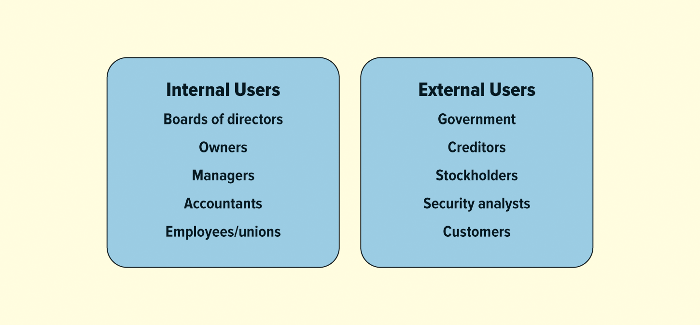
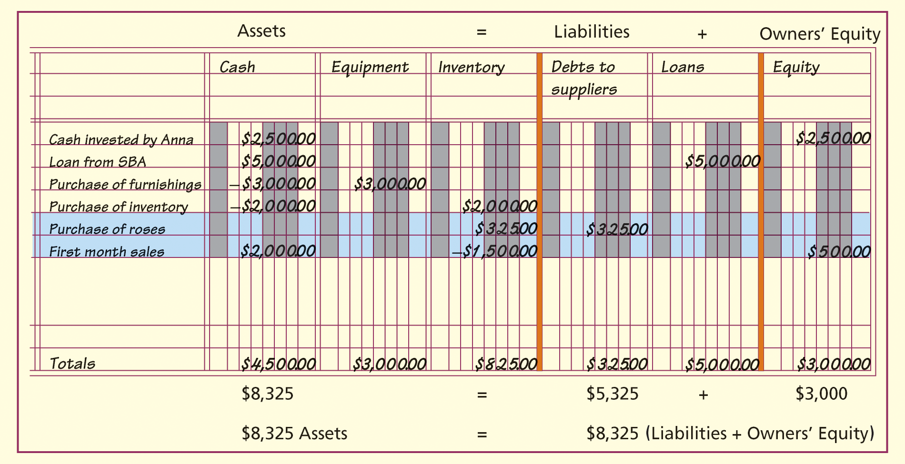
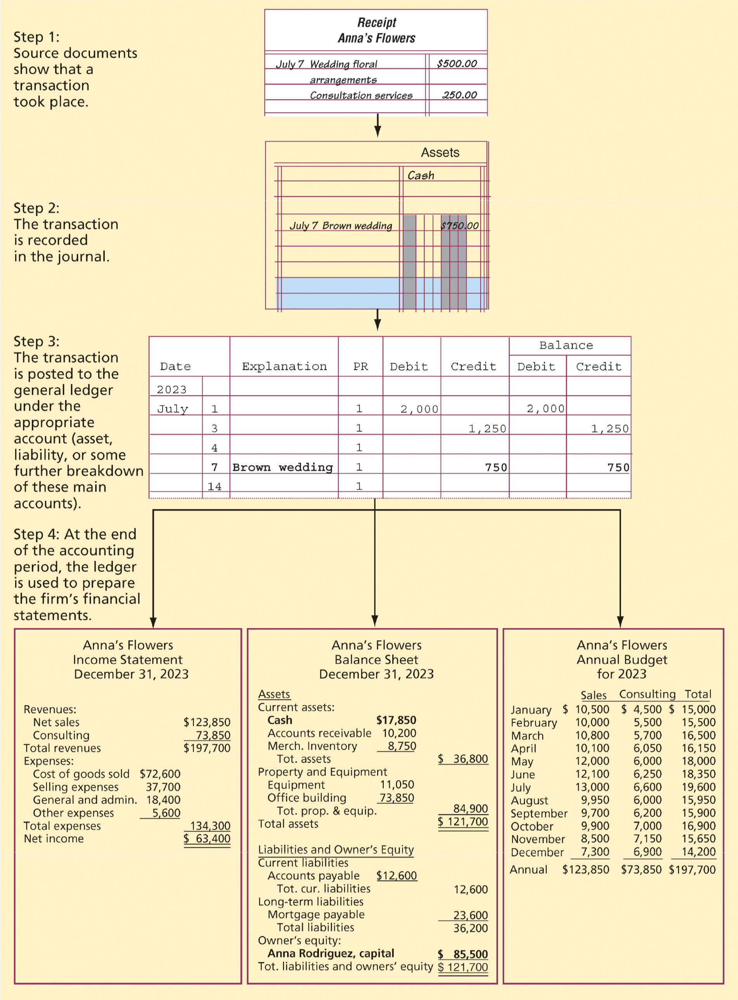

<h1 id="Chapter_14._accounting_and_financial_statements" style="color:#42A5F5;">Indice</h1>

##### [Capitulo OA 14-1 LA NATURALEZA DE LA CONTABILIDAD](#827711)

##### [Capitulo OA 14-2 EL PROCESO CONTABLE](#468101)

##### [Capitulo OA 14-3 ESTADOS FINANCIEROS](#389354)

##### [Capitulo LO 14-4 ANÁLISIS DE RAZONES: ANALIZANDO ESTADOS FINANCIEROS (RATIO ANALYSIS: ANALYZING FINANCIAL STATEMENTS)](#669065)

<h1 id="827711" style="color:#E65100;">
  <a href="#Chapter_14._accounting_and_financial_statements" style="color:inherit; text-decoration:none;">
    OA 14-1 LA NATURALEZA DE LA CONTABILIDAD
  </a>
</h1>

Describir los diferentes usos de la información contable.

---

**Definición de Contabilidad:** La **contabilidad** es el registro, la medición y la interpretación de la información financiera.

En términos simples, la contabilidad es el registro, la medición y la interpretación de la información financiera. Muchas personas e instituciones, tanto dentro como fuera de las empresas, utilizan herramientas contables para evaluar las operaciones organizacionales. El **Financial Accounting Standards Board (FASB)** ha estado estableciendo los principios y estándares de la contabilidad financiera y la presentación de informes en el sector privado desde 1973. Su misión es establecer y mejorar los estándares de contabilidad financiera y presentación de informes para la orientación y educación del público, incluyendo emisores, inversores, auditores y usuarios de información financiera. Sin embargo, los escándalos contables a principios del siglo pasado ocurrieron cuando muchas firmas de contabilidad y empresas no cumplieron con los **principios de contabilidad generalmente aceptados (GAAP)**. En consecuencia, el gobierno federal ha asumido un papel más importante en la creación de reglas, requisitos y políticas para las firmas de contabilidad y las empresas a través del **Consejo de Supervisión de Contabilidad de Empresas Públicas (PCAOB)** de la Comisión de Bolsa y Valores (SEC). Por ejemplo, el PCAOB tiene la capacidad de presentar una orden disciplinaria contra una firma o individuo que prohíbe temporal o permanentemente a esa firma o individuo ejercer la contabilidad. Para comprender mejor la importancia de la contabilidad, primero debemos entender quién prepara la información contable y cómo se utiliza.

---

## Contadores (Accountants)

Muchas de las funciones de la contabilidad son realizadas por contadores públicos o privados.

### Contadores Públicos (Public Accountants)

**Definición de CPA:** Un **contador público certificado (CPA)** es un individuo que ha sido certificado por el estado para proporcionar servicios de contabilidad que van desde la preparación de registros financieros y la presentación de declaraciones de impuestos hasta auditorías complejas de registros financieros corporativos. La certificación otorga a un contador público el derecho de expresar oficialmente una opinión imparcial sobre la precisión de los estados financieros del cliente.

Las personas y empresas pueden contratar a un contador público certificado (CPA), un individuo que ha sido certificado por el estado para proporcionar servicios de contabilidad que van desde la preparación de registros financieros y la presentación de declaraciones de impuestos hasta auditorías complejas de registros financieros corporativos. La certificación otorga a un contador público el derecho a expresar oficialmente una opinión imparcial sobre la precisión de los estados financieros del cliente. La mayoría de los contadores públicos son trabajadores autónomos o miembros de grandes firmas de contabilidad pública como Ernst & Young, KPMG, Deloitte y PricewaterhouseCoopers, conocidas en conjunto como "las Cuatro Grandes". Además, muchos CPA trabajan para una de las firmas de contabilidad de segundo nivel que son mucho más pequeñas que las Cuatro Grandes.

Las firmas de contabilidad requieren empleados dedicados que estén dispuestos a trabajar largas horas para hacer el trabajo. Vault.com clasifica firmas de contabilidad, bancos de inversión, firmas de abogados y otras empresas profesionales utilizando un sistema de clasificación ponderado basado en resultados de encuestas. La **Tabla 14.1** muestra las clasificaciones de auditoría y aseguramiento, contabilidad forense y contabilidad fiscal para las firmas de contabilidad más prestigiosas de Estados Unidos.

---

## Tabla 14.1 Firmas de Contabilidad Más Prestigiosas en Estados Unidos

| Clasificación General | Nombre de la Empresa | Prestigio General | Auditoría y Aseguramiento | Contabilidad Forense | Contabilidad Fiscal | Sede | Empleados |
|:---:|:---|:---:|:---:|:---:|:---:|:---|:---:|
| (1) | PwC (PricewaterhouseCoopers) LLP | 8.822 | (1) 8.836 | (1) 7.791 | (1) 8.733 | Nueva York | 72,129 |
| (2) | Deloitte | 8.731 | (2) 8.640 | (2) 7.667 | (2) 8.605 | Nueva York | 135,118 |
| (3) | Ernst & Young (EY) | 8.552 | (3) 8.542 | (3) 7.627 | (3) 8.546 | Nueva York | 48,300 |
| (4) | KPMG LLP | 7.805 | (4) 8.039 | (4) 7.277 | (4) 8.149 | Nueva York | 33,000 |
| (5) | Grant Thornton LLP | 6.922 | (5) 7.181 | (5) 6.110 | (5) 7.161 | Chicago | 8,730 |
| (6) | BDO USA LLP | 6.273 | (7) 6.756 | (6) 5.577 | (6) 6.829 | Chicago | 7,330 |
| (7) | RSM US | 6.113 | (6) 6.834 | (7) 5.474 | (7) 6.762 | Chicago | 10,882 |
| (8) | Baker Tilly US LLP | 5.291 | (10) 6.024 | (8) 5.062 | (8) 6.185 | Chicago | 3,900 |
| (9) | Crowe LLP | 5.182 | (8) 6.074 | (9) 4.856 | (9) 6.071 | Chicago | 4,267 |
| (10) | Moss Adams LLP | 4.717 | (9) 6.056 | (12) 4.548 | (10) 5.961 | Seattle | 3,400 |

---

Aunque siempre habrá empresas y administradores de dinero individuales que puedan ocultar con éxito prácticas contables ilegales o engañosas por un tiempo, eventualmente son expuestos. Después de los escándalos contables de Enron y Worldcom a principios de la década de 2000, el Congreso aprobó la **Ley Sarbanes-Oxley**, que exigía a las empresas ser más rigurosas en sus prácticas contables y de presentación de informes. Sarbanes-Oxley obligó a las firmas de contabilidad a separar sus negocios de consultoría y auditoría y castigó a los ejecutivos corporativos con posibles penas de prisión por declaraciones contables inexactas, engañosas o ilegales. Esto pareció reducir los errores contables entre las empresas no financieras, pero la caída de los precios de la vivienda expuso algunas de las prácticas cuestionables de bancos y empresas hipotecarias. Solo cinco años después de la aprobación de la Ley Sarbanes-Oxley, el mundo experimentó una crisis financiera que comenzó en 2008, parte de la cual se debió a la toma excesiva de riesgos y prácticas contables inapropiadas. Muchos bancos no lograron comprender el verdadero estado de su salud financiera. Los bancos también desarrollaron prácticas crediticias cuestionables e inversiones basadas en hipotecas de alto riesgo otorgadas a individuos con mal crédito. Cuando los precios de la vivienda cayeron y las personas descubrieron que debían más por sus hipotecas de lo que valían sus casas, comenzaron a incumplir. Para prevenir una depresión, el gobierno intervino y rescató a algunos de los bancos más grandes de Estados Unidos. El Congreso aprobó la **Ley Dodd-Frank** en 2010 para fortalecer la supervisión de las instituciones financieras. Esta ley encargó a la Junta de la Reserva Federal la implementación de la legislación. Esta legislación limita los tipos de activos que los bancos comerciales pueden comprar, la cantidad de capital que deben mantener y el uso de instrumentos derivados como opciones, futuros y productos de inversión estructurados. Los bancos estaban mucho mejor posicionados para resistir la pandemia de COVID-19 y tenían reservas adecuadas para manejar cualquier préstamo incobrable o incumplimiento crediticio. Afortunadamente, el gobierno federal ofreció garantías de préstamos a pequeñas empresas a través del sistema bancario.

**¿SABÍAS QUE?** Se estima que los costos del fraude corporativo ascienden a $5 billones anuales.

**Definición de Contabilidad Forense:** La **contabilidad forense** es la contabilidad apta para revisión legal, que implica analizar documentos financieros en busca de entradas fraudulentas o mala conducta financiera, funcionando tanto como detectives como contadores.

Un área en crecimiento para los contadores públicos es la contabilidad forense, que es la contabilidad apta para revisión legal. Implica analizar documentos financieros en busca de entradas fraudulentas o mala conducta financiera. Funcionando tanto como detectives como contadores, los contadores forenses se han utilizado desde la década de 1930. Muchas firmas de auditoría están expandiendo sus servicios forenses o de detección de fraudes. Además, muchos contadores forenses descubren evidencia de "libros cocinados" para agencias federales como la Oficina Federal de Investigación (FBI) o el Servicio de Impuestos Internos (IRS). La Asociación de Examinadores de Fraude Certificados, que certifica a profesionales contables como examinadores de fraude certificados (CFE), ha crecido a más de 85,000 miembros.

### Contadores Privados (Private Accountants)

**Definición de CMA:** Un **contador administrativo certificado (CMA)** es un contador privado que ha aprobado un riguroso examen del Instituto de Contadores Administrativos, lo que demuestra competencia en gestión financiera y contabilidad estratégica.

Las grandes corporaciones, agencias gubernamentales y otras organizaciones pueden emplear sus propios contadores privados para preparar y analizar sus estados financieros. Con títulos como contralor, contador fiscal o auditor interno, los contadores privados están profundamente involucrados en muchas de las decisiones financieras más importantes de las organizaciones para las que trabajan. Los contadores privados pueden ser CPA y pueden convertirse en contadores administrativos certificados (CMA) al aprobar un riguroso examen del Instituto de Contadores Administrativos.

## ¿Contabilidad o Teneduría de Libros? (Accounting or Bookkeeping?)

Los términos contabilidad y teneduría de libros a menudo se usan erróneamente como sinónimos. Mucho más limitada y mucho más mecánica que la contabilidad, la teneduría de libros se limita típicamente al registro rutinario y diario de las transacciones comerciales. Los tenedores de libros son responsables de obtener y registrar la información que los contadores requieren para analizar la posición financiera de una empresa. Generalmente requieren menos capacitación que los contadores. Los contadores, por otro lado, generalmente completan cursos más allá de sus títulos universitarios básicos de cuatro o cinco años en contabilidad. Esta capacitación adicional permite a los contadores no solo registrar información financiera, sino también comprender, interpretar e incluso desarrollar los sofisticados sistemas contables necesarios para clasificar y analizar información financiera compleja.

## Los Usos de la Información Contable (The Uses of Accounting Information)

Los contadores resumen la información de las transacciones comerciales de una empresa en varios estados financieros (que veremos en una sección posterior de este capítulo) para una variedad de partes interesadas, incluyendo gerentes, inversores, acreedores y agencias gubernamentales. Muchos fracasos empresariales pueden estar directamente vinculados a la ignorancia de la información "oculta" dentro de estos estados financieros. Del mismo modo, la mayoría de los éxitos empresariales se pueden atribuir a gerentes informados que entienden las consecuencias de sus decisiones. Si bien es deseable mantener e incluso aumentar las ganancias a corto plazo, la falta de planificación suficiente para el futuro puede llevar fácilmente a una empresa por lo demás exitosa a la insolvencia y a los tribunales de quiebra.

Básicamente, los gerentes y propietarios utilizan los estados financieros:
(1) para ayudar en la planificación y control internos y
(2) para fines externos como informar al Servicio de Impuestos Internos, accionistas, acreedores, clientes, empleados y otras partes interesadas.

**La Figura 14.1** muestra algunos de los usuarios de la información contable generada por las organizaciones y otras partes interesadas.

**[ FIGURA 14.1: Los Usuarios de la Información Contable]**

</img>

### Usos Internos (Internal Uses)

La **contabilidad gerencial (managerial accounting)** se refiere al uso interno de los estados contables por parte de los gerentes en la planificación y dirección de las actividades de la organización. Quizás la mayor preocupación de la gerencia es el **flujo de efectivo (cash flow)** , el movimiento de dinero a través de una organización a diario, semanal, mensual o anualmente. Obviamente, para que cualquier negocio tenga éxito, necesita generar suficiente efectivo para pagar sus cuentas a medida que vencen. Sin embargo, no es nada inusual que empresas altamente exitosas y de rápido crecimiento tengan dificultades para realizar pagos a empleados, proveedores y prestamistas debido a un flujo de efectivo inadecuado. Una razón común para la llamada crisis de efectivo, o escasez, es una mala planificación gerencial.

Los contadores gerenciales también ayudan a preparar el **presupuesto (budget)** de una organización, un plan financiero interno que pronostica gastos e ingresos durante un período de tiempo determinado. No es raro que una organización prepare presupuestos diarios, semanales, mensuales y anuales separados. Piense en un presupuesto como un mapa financiero, que muestra cómo la empresa espera pasar del Punto A al Punto B durante un período específico de tiempo. Si bien la mayoría de las empresas preparan presupuestos maestros para toda la empresa, muchas también preparan presupuestos para segmentos más pequeños de la organización, como divisiones, departamentos, líneas de productos o proyectos. Los presupuestos maestros "de arriba hacia abajo" comienzan en el nivel de alta gerencia y se filtran hasta el nivel de departamento individual, mientras que los presupuestos "de abajo hacia arriba" comienzan a nivel de departamento o proyecto y se combinan en la oficina del director ejecutivo. Generalmente, cuanto más grande y de más rápido crecimiento es una organización, mayor será la probabilidad de que construya su presupuesto maestro desde cero.

Independientemente del enfoque, el valor principal de un presupuesto radica en su desglose de entradas y salidas de efectivo. Los gastos operativos esperados (salidas de efectivo como salarios, costos de materiales e impuestos) y los ingresos operativos (entradas de efectivo en forma de pagos de clientes) durante un período de tiempo determinado se pronostican cuidadosamente y luego se comparan con los resultados reales. Las desviaciones entre ambos sirven como un "alambre de disparo" o "bucle de retroalimentación" para lanzar análisis financieros más detallados en un esfuerzo por identificar puntos problemáticos y oportunidades.

### Usos Externos (External Uses)

Los gerentes también utilizan los estados contables para informar el desempeño financiero del negocio a terceros. Dichos estados se utilizan para presentar declaraciones de impuestos sobre la renta, obtener crédito de prestamistas e informar los resultados a los accionistas de la empresa. Se convierten en la base de la información proporcionada en el **informe anual corporativo (annual report)** oficial, un resumen de la información financiera, los productos y los planes de crecimiento de la empresa para propietarios e inversores potenciales. Si bien se presenta con frecuencia entre cubiertas brillantes y satinadas, el componente más importante de un informe anual es la firma de un contador público certificado que atestigua que los estados financieros requeridos son un reflejo preciso de la condición financiera subyacente de la empresa. Los estados financieros que cumplen con estas condiciones se denominan **auditados (audited)** . Los principales usuarios externos de la información contable auditada son agencias gubernamentales, accionistas e inversores potenciales, prestamistas, proveedores y empleados.

Durante la crisis financiera global, se descubrió que Grecia había estado involucrada en prácticas contables engañosas utilizando técnicas financieras para ocultar cantidades masivas de deuda de sus balances públicos. Finalmente, los mercados descubrieron que el país podría no ser capaz de pagar a sus acreedores. La Unión Europea y el Fondo Monetario Internacional rescataron a Grecia con préstamos y alivio crediticio, pero vinculado a esto estaba el mensaje de "poner en orden sus finanzas".

Muchos estados tienen grandes déficits en sus fondos de pensiones, y algunos han estado tomando prestado de los fondos de pensiones para ayudar a equilibrar sus presupuestos, lo que solo agrava el problema. Para empeorar las cosas, la pandemia de COVID-19 en 2020 causó grandes dificultades financieras para los estados, ya que tuvieron que cubrir los beneficios de desempleo y combatir el virus con costos médicos inesperados. Estados como Nueva York, Illinois, Connecticut, Nueva Jersey y Luisiana fueron los más afectados debido a sus ciudades de alta densidad de población como Chicago y Nueva Orleans.

Los estados financieros evalúan el retorno de la inversión de los accionistas y la calidad general del equipo de gestión de la empresa. Como resultado, el mal desempeño, documentado en los estados financieros, a menudo resulta en cambios en la alta dirección. Los inversores potenciales estudian los estados financieros en el informe anual de una empresa para determinar si la empresa cumple con sus requisitos de inversión y si es probable que los rendimientos de una empresa determinada se comparen favorablemente con los de otras empresas similares.

**[JPMorgan Chase & Co. - Evaluar los estados financieros es un paso importante en el proceso de préstamo para bancos como JPMorgan Chase]**

</img>

Los bancos y otros prestamistas analizan los estados financieros para determinar la capacidad de una empresa para cumplir con las obligaciones de deuda actuales y futuras si se concede un préstamo o crédito. Para determinar esta capacidad, un prestamista a corto plazo examina el flujo de efectivo de una empresa para evaluar su capacidad de pagar un préstamo rápidamente con efectivo generado por las ventas. Un prestamista a largo plazo está más interesado en la rentabilidad de la empresa y su endeudamiento con otros prestamistas.

Los sindicatos y empleados utilizan los estados financieros para establecer expectativas razonables para solicitudes de salarios y otros beneficios. Así como es probable que las empresas que experimentan ganancias récord enfrenten una presión adicional para aumentar los salarios de los empleados, también es poco probable que los empleados otorguen concesiones salariales y de beneficios a los empleadores sin evidencia considerable de dificultades financieras.

# Las Big Four Bajo Gran Presión

## Contexto

Las llamadas **Big Four** son las cuatro firmas de contabilidad y auditoría más grandes del mundo: **Ernst & Young (EY), KPMG, Deloitte y PricewaterhouseCoopers (PwC)**. Estas empresas dominan el mercado global de auditoría y prestan servicios a muchas de las compañías más grandes del mundo.

Sin embargo, su poder e influencia han sido cuestionados por reguladores y críticos debido a varios escándalos corporativos relacionados con fraude financiero y malas auditorías. Entre los casos más conocidos están **Enron, WorldCom, Lehman Brothers, Wirecard y 1MDB**.

Una de las principales críticas es que estas firmas ofrecen tanto servicios de auditoría como de consultoría a los mismos clientes. Esto puede crear conflictos de interés, ya que una empresa podría no querer criticar o cuestionar demasiado a un cliente importante del que también recibe grandes ingresos por asesoría.

---

## Preguntas de Pensamiento Crítico

### 1. ¿Por qué se examina la dominación de las Big Four?

La dominación de las Big Four es examinada porque controlan más del 75% del mercado global de auditoría, especialmente entre grandes corporaciones. Esto limita la competencia y concentra demasiado poder en pocas empresas.

Además, cuando ocurren errores o fraudes en compañías auditadas por estas firmas, se cuestiona si existe suficiente supervisión y responsabilidad dentro de la industria.

---

### 2. ¿Por qué los críticos sugieren que existe un conflicto de interés?

Los críticos creen que existe un conflicto de interés porque las Big Four ganan dinero no solo auditando empresas, sino también ofreciendo consultoría, impuestos, asesoría legal y otros servicios.

Esto puede hacer que una firma sea menos estricta durante una auditoría para no perder un cliente rentable. En otras palabras, podrían priorizar ingresos sobre independencia profesional.

---

### 3. En tu opinión, ¿son suficientes las regulaciones contables actuales?

En mi opinión, las regulaciones actuales ayudan, pero no siempre son suficientes. Los repetidos escándalos financieros muestran que todavía existen debilidades en supervisión, independencia y transparencia.

Sería útil fortalecer controles, separar auditoría de consultoría en algunos casos, aumentar sanciones por negligencia y mejorar la protección a denunciantes internos (whistleblowers).

<h1 id="468101" style="color:#E65100;">
  <a href="#Chapter_14._accounting_and_financial_statements" style="color:inherit; text-decoration:none;">
    OA 14-2 EL PROCESO CONTABLE
  </a>
</h1>

Demostrar el proceso contable.

---

Muchos consideran la contabilidad como un lenguaje empresarial primario. Sin embargo, es de poca utilidad a menos que sepas "hablarlo". Afortunadamente, los fundamentos (la ecuación contable y el sistema de contabilidad por partida doble) no son difíciles de aprender. Estos dos conceptos sirven como punto de partida para todos los principios contables actualmente aceptados.

## La Ecuación Contable (The Accounting Equation)

Los contadores se ocupan de informar sobre los activos, pasivos y el patrimonio de los propietarios de una organización. Para ayudar a ilustrar estos conceptos, considere una florería hipotética llamada Flores de Anna, propiedad de Anna Rodríguez.

Los recursos económicos de una empresa, o los elementos de valor que posee, representan sus **activos (assets)** : efectivo, inventario, terreno, equipo, edificios y otras cosas tangibles e intangibles. Los activos de Flores de Anna incluyen mostradores, vitrinas refrigeradas, flores, decoraciones, jarrones, tarjetas y otros regalos, así como algo conocido como "buena voluntad (goodwill)", que en este caso es la reputación de Anna por preparar y entregar hermosos arreglos florales de manera oportuna.

Los **pasivos (liabilities)** , por otro lado, son las deudas que la empresa debe a otros. Entre los pasivos de Flores de Anna se encuentran un préstamo de la Administración de Pequeñas Empresas y el dinero adeudado a proveedores de flores y otros acreedores por artículos comprados.

La categoría de **patrimonio de los propietarios (owners' equity)** contiene todo el dinero que se ha contribuido a la empresa y que nunca tiene que ser devuelto. Los fondos pueden provenir de inversores que han dado dinero o activos a la empresa, o pueden provenir de operaciones rentables pasadas. En el caso de Flores de Anna, si Anna vendiera o liquidara su negocio, cualquier dinero que quede después de vender todos los activos de la tienda y pagar sus pasivos constituiría su patrimonio de propietaria.

La relación entre activos, pasivos y patrimonio de los propietarios es un concepto fundamental en contabilidad y se conoce como la **ecuación contable (accounting equation)** :

$$
\text{Activos} = \text{Pasivos} + \text{Patrimonio del Propietario}
$$

$$
\text{Assets} = \text{Liabilities} + \text{Owner's Equity}
$$

## Contabilidad por Partida Doble (Double-Entry Bookkeeping)

La **contabilidad por partida doble** es un sistema para registrar y clasificar las transacciones comerciales en cuentas separadas con el fin de mantener el equilibrio de la ecuación contable.

Volviendo a Flores de Anna, supongamos que Anna compra $325 dólares en rosas a crédito de Antique Rose Emporium para cumplir con un pedido de boda. Cuando registra esta transacción, registrará los $325 como un pasivo o una deuda con un proveedor. Al mismo tiempo, sin embargo, también registrará $325 dólares en rosas como un activo en una cuenta conocida como "inventario". Debido a que los activos y los pasivos están en diferentes lados de la ecuación contable, las cuentas de Anna aumentan en tamaño total (en $325) pero permanecen en equilibrio:

$$
\text{Activos} = \text{Pasivos} + \text{Patrimonio del propietario}
$$
$$
\text{Assets} = \text{Liabilities} + \text{Owners' Equity}
$$

$$
\$325 = \$325
$$

Por lo tanto, para mantener la ecuación contable en equilibrio, cada transacción comercial debe registrarse en dos cuentas separadas.

En el análisis final, todas las transacciones comerciales se clasifican como activos, pasivos o patrimonio del propietario. Sin embargo, la mayoría de las organizaciones desglosan aún más estas tres cuentas para proporcionar información más específica sobre una transacción. Por ejemplo, los activos pueden desglosarse en categorías específicas como efectivo, inventario y equipo, mientras que los pasivos pueden incluir préstamos bancarios, crédito de proveedores y otras deudas.

**La Figura 14.2** muestra cómo Anna utilizó el sistema de contabilidad por partida doble para registrar todas las transacciones que tuvieron lugar en su primer mes de negocio. Estas transacciones incluyen su inversión inicial de $2,500, el préstamo de la Administración de Pequeñas Empresas, las compras de equipo e inventario, y la compra de rosas a crédito. En su primer mes de negocio, Anna generó ingresos de $2,000 mediante la venta de $1,500 dólares en inventario. Por lo tanto, ella deduce, o (en notación contable apropiada para activos) **acredita**, $1,500 del inventario y agrega, o **debita**, $2,000 a la cuenta de efectivo. La diferencia entre la entrada de efectivo de Anna de $2,000 y su salida de $1,500 está representada por un abono al patrimonio del propietario porque es dinero que le pertenece a ella como propietaria de la floristería.

**[FIGURA 14.2: La Ecuación Contable y la Contabilidad por Partida Doble para Flores de Anna]**

</img>

## El Ciclo Contable (The Accounting Cycle)

En cualquier sistema contable, los datos financieros típicamente pasan por un procedimiento de cuatro pasos, a veces llamado **ciclo contable (accounting cycle)** . Los pasos incluyen examinar documentos fuente, registrar transacciones en un diario contable, registrar (postear) las transacciones y preparar los estados financieros. **La Figura 14.3** muestra cómo Anna trabaja a través de ellos. Tradicionalmente, todos estos pasos se realizaban usando papel, lápices y borradores (¡muchos borradores!), pero hoy en día, el proceso suele estar completamente computerizado.

**[FIGURA 14.3: El Proceso Contable para Flores de Anna]**

</img>

### Paso Uno: Examinar Documentos Fuente (Examine Source Documents)

Como todo buen gerente, Anna Rodríguez comienza el ciclo contable reuniendo y examinando **documentos fuente (source documents)** : cheques, recibos de tarjeta de crédito, comprobantes de venta y otras evidencias relacionadas sobre transacciones específicas.

### Paso Dos: Registrar Transacciones (Record Transactions)

A continuación, Anna registra cada transacción financiera en un **diario (journal)** , que es básicamente una lista ordenada por tiempo de las transacciones de cuentas. Si bien la mayoría de las empresas mantienen un diario general en el que se registran todas las transacciones, algunas clasifican las transacciones en diarios especializados para tipos específicos de cuentas de transacciones.

### Paso Tres: Postear (Registrar) Transacciones (Post Transactions)

Anna luego transfiere la información de su diario a un **libro mayor (ledger)** , un libro o programa de computadora con archivos separados para cada cuenta. Este proceso se conoce como **posteo (posting)** . Al final del período contable (generalmente anual, pero ocasionalmente trimestral o mensual), Anna prepara un **balance de comprobación (trial balance)** , un resumen de los saldos de todas las cuentas en el libro mayor general. Si, al totalizar, el balance de comprobación no equilibra (es decir, la ecuación contable no está en equilibrio), Anna o su contador deben buscar errores (típicamente un error en una o más de las entradas del libro mayor) y corregirlos. Si el balance de comprobación es correcto, el contador puede entonces comenzar a preparar los estados financieros.

### Paso Cuatro: Preparar Estados Financieros (Prepare Financial Statements)

La información del balance de comprobación también se utiliza para preparar los estados financieros de la empresa. En el caso de las corporaciones públicas y ciertas otras organizaciones, un CPA debe **atestiguar o certificar (attest)** que la organización siguió los principios de contabilidad generalmente aceptados (GAAP) al preparar los estados financieros. Cuando estos estados se han completado, los libros de la organización se "cierran" y el ciclo contable comienza de nuevo para el próximo período contable.

<h1 id="389354" style="color:#E65100;">
  <a href="#Chapter_14._accounting_and_financial_statements" style="color:inherit; text-decoration:none;">
    OA 14-3 ESTADOS FINANCIEROS
  </a>
</h1>

Examinar el estado de resultados, el balance general y el estado de flujos de efectivo.

---

El resultado final del proceso contable es una serie de **estados financieros (financial statements)** . El **estado de resultados (income statement)** , el **balance general (balance sheet)** y el **estado de flujos de efectivo (statement of cash flows)** son los ejemplos más conocidos de estados financieros. Se proporcionan a los accionistas e inversores potenciales en el informe anual de una empresa, así como a otros externos relevantes como acreedores, agencias gubernamentales y el Servicio de Impuestos Internos (IRS).

Es importante reconocer que no todos los estados financieros siguen exactamente el mismo formato. El hecho de que diferentes organizaciones generen ingresos de diferentes maneras sugiere que, cuando se trata de estados financieros, una talla definitivamente no sirve para todos. Las empresas manufactureras, los proveedores de servicios y las organizaciones sin fines de lucro utilizan cada uno un conjunto diferente de principios o reglas contables acordadas por la profesión contable pública. Como ya hemos mencionado, estos a veces se denominan **principios de contabilidad generalmente aceptados (GAAP)** . Cada país tiene un conjunto diferente de reglas que las empresas dentro de ese país deben utilizar para su proceso contable y sus estados financieros. Sin embargo, varios países han adoptado un conjunto estándar de principios contables conocidos como **Normas Internacionales de Información Financiera (NIIF o IFRS)** . Estados Unidos ha discutido la adopción de estas normas para crear un sistema de presentación de informes más estandarizado para los inversores globales. Además, como es el caso en muchas otras disciplinas, ciertos conceptos tienen más de un nombre. Por ejemplo, ventas e ingresos a menudo se intercambian, al igual que ganancias, ingresos y utilidades. La **Tabla 14.2** enumera algunos términos equivalentes comunes que deberían ayudarle a descifrar su significado en los estados contables.

---
**TABLA 14.2 — Términos equivalentes en contabilidad (Equivalent Terms in Accounting)**

| Término | Término equivalente |
|------|-------------------|
| Ingresos (Revenues) | Ventas (Sales) |
|  | Bienes o servicios vendidos (Goods or services sold) |
| Utilidad bruta (Gross profit) | Ingreso bruto (Gross income) |
|  | Ganancias brutas (Gross earnings) |
| Utilidad operativa (Operating income) | Utilidad operativa (Operating profit) |
|  | Ganancias antes de intereses e impuestos – EBIT (Earnings before interest and taxes) |
|  | Ingreso antes de intereses e impuestos – IBIT (Income before interest and taxes) |
| Utilidad antes de impuestos – UAI (Income before taxes, IBT) | Ganancias antes de impuestos – EBT (Earnings before taxes) |
|  | Utilidad antes de impuestos – PBT (Profit before taxes) |
| Utilidad neta (Net income, NI) | Ganancias después de impuestos – EAT (Earnings after taxes) |
|  | Utilidad después de impuestos – PAT (Profit after taxes) |
| Ingreso disponible para accionistas comunes (Income available to common stockholders) | Ganancias disponibles para accionistas comunes (Earnings available to common stockholders) |

---

## Fórmulas Matemáticas

**1. Ingresos (Revenues):**
$$ \text{Ingresos} = \text{Precio} \times \text{Cantidad vendida} $$
$$ \text{Revenues} = \text{Price} \times \text{Quantity Sold} $$

**2. Utilidad Bruta (Gross Profit):**
$$ \text{Utilidad Bruta} = \text{Ingresos} - \text{Costo de Bienes Vendidos} $$
$$ \text{Gross Profit} = \text{Revenues} - \text{Cost of Goods Sold (COGS)} $$

**3. Ingreso Operativo (Operating Income):**
$$ \text{Ingreso Operativo} = \text{Utilidad Bruta} - \text{Gastos Operativos} $$
$$ \text{Operating Income} = \text{Gross Profit} - \text{Operating Expenses} $$

**4. EBIT (Ganancias antes de intereses e impuestos):**
$$ \text{EBIT} = \text{Ingreso Operativo} = \text{Ingresos} - \text{COGS} - \text{Gastos Operativos} $$
$$ \text{EBIT} = \text{Operating Income} = \text{Revenues} - \text{COGS} - \text{Operating Expenses} $$

**5. Ingreso antes de Impuestos / EBT (Income Before Taxes / Earnings Before Taxes):**
$$ \text{IBT} = \text{EBIT} - \text{Gastos por Intereses} $$
$$ \text{EBT} = \text{EBIT} - \text{Interest Expenses} $$

**6. Ingreso Neto (Net Income):**
$$ \text{Ingreso Neto} = \text{IBT} - \text{Impuestos} $$
$$ \text{Net Income} = \text{EBT} - \text{Taxes} $$

**7. Ingreso disponible para accionistas comunes (Income Available to Common Stockholders):**
$$ \text{Ingreso disponible} = \text{Ingreso Neto} - \text{Dividendos Preferentes} $$
$$ \text{Income Available} = \text{Net Income} - \text{Preferred Dividends} $$

---

## Ratios o Índices Financieros

**Margen de Utilidad Bruta (Gross Profit Margin):**
$$ \text{Margen Bruto} = \frac{\text{Utilidad Bruta}}{\text{Ingresos}} \times 100\% $$
$$ \text{Gross Margin} = \frac{\text{Gross Profit}}{\text{Revenues}} \times 100\% $$

**Margen de Utilidad Neta (Net Profit Margin):**
$$ \text{Margen Neto} = \frac{\text{Ingreso Neto}}{\text{Ingresos}} \times 100\% $$
$$ \text{Net Margin} = \frac{\text{Net Income}}{\text{Revenues}} \times 100\% $$

## El Estado de Resultados (The Income Statement)

La pregunta "¿Cuál es el resultado final?" proviene del estado de resultados, donde el resultado final muestra la ganancia o pérdida general de la empresa después de impuestos. Por lo tanto, el **estado de resultados (income statement)** es un informe financiero que muestra la rentabilidad de una organización durante un período de tiempo, ya sea un mes, trimestre o año. Por su propio diseño, el estado de resultados ofrece una de las imágenes más claras posibles de los ingresos generales de la empresa y los costos incurridos para generar esos ingresos. Otros nombres para el estado de resultados incluyen **estado de ganancias y pérdidas (P&L statement)** o **estado de operaciones (operating statement)** .

La **Tabla 14.3** presenta un ejemplo de estado de resultados en forma de texto con explicaciones línea por línea, mientras que la **Tabla 14.4** presenta estados de resultados recientes de Johnson & Johnson (J&J). El estado de resultados indica la rentabilidad o ingreso de la empresa (el resultado final), que se obtiene restando los gastos de la empresa de sus ingresos.

---

## Tabla 14.3 Ejemplo de Estado de Resultados (Sample Income Statement)

| Partida | Valor | Explicación |
|:---|:---|:---|
| **Ingresos (Revenues / Sales)** | $___ | Monto total en dólares de productos vendidos (incluye ingresos de otros servicios comerciales como ingresos por alquiler-arrendamiento e ingresos por intereses). |
| **Menos: Costo de bienes vendidos (Cost of Goods Sold - COGS)** | ($___) | El costo de producir los bienes y servicios, incluyendo el costo de mano de obra y materias primas, así como otros gastos asociados con la producción. |
| **= Utilidad Bruta (Gross Profit)** | $___ | El ingreso disponible después de pagar todos los gastos de producción. |
| **Menos: Gastos de venta y administrativos (Selling and Administrative Expense)** | ($___) | El costo de promocionar, publicitar y vender productos, así como los costos generales de gestionar la empresa. Esto incluye el costo de la gerencia y el personal corporativo. Un gasto no monetario incluido en esta categoría es la **depreciación (depreciation)** , que aproxima la disminución en el valor de los activos de planta y equipo debido al uso a lo largo del tiempo. |
| **= Ingreso antes de intereses e impuestos (Income Before Interest and Taxes - EBIT)** | $___ | Esta línea representa todo el ingreso restante después de deducir los gastos operativos. A esto a veces se le llama **ingreso operativo (operating income)** porque representa todos los ingresos después de que se han contabilizado los gastos de operación. Ocasionalmente, se le conoce como **EBIT (earnings before interest and taxes)** . |
| **Menos: Gastos por intereses (Interest Expense)** | ($___) | El gasto por intereses surge como un costo de pedir dinero prestado. Este es un gasto financiero en lugar de un gasto operativo y se enumera por separado. Cubre el costo tanto del endeudamiento a corto plazo como a largo plazo. |
| **= Ingreso antes de impuestos (Income Before Taxes - EBT)** | $___ | La empresa pagará un impuesto sobre esta cantidad. Esto es lo que queda de los ingresos después de restar todos los costos operativos, costos de depreciación y costos de intereses. |
| **Menos: Impuestos (Taxes)** | ($___) | La tasa impositiva está especificada en el código fiscal federal. |
| **= Ingreso Neto (Net Income)** | $___ | Esta es la cantidad de ingreso que queda después de impuestos. La empresa puede decidir retener todo o una parte del ingreso para reinvertirlo en nuevos activos. Lo que decida no mantener generalmente se paga en dividendos a sus accionistas. |
| **Menos: Dividendos preferentes (Preferred Dividends)** | ($___) | Si la empresa tiene accionistas preferentes, ellos son los primeros en la fila para recibir dividendos. Esa es una razón por la que sus acciones se llaman "preferentes". |
| **= Ingreso para accionistas comunes (Income to Common Stockholders)** | $___ | Este es el ingreso que queda para los accionistas comunes. Si la empresa tiene un buen año, puede haber mucho ingreso disponible para dividendos. Si la empresa tiene un mal año, el ingreso podría ser negativo. Los accionistas comunes son los propietarios finales y los que asumen el riesgo. Tienen el potencial de rendimientos muy altos o muy bajos porque reciben lo que queda después de todos los demás gastos. |
| **Ganancias por acción (Earnings Per Share - EPS)** | $___ | Las ganancias por acción se calculan tomando el ingreso disponible para los accionistas comunes y dividiéndolo por el número de acciones comunes en circulación. Este es el ingreso generado por la empresa por cada acción común. |

---
## Fórmulas del Estado de Resultados

### Español

$$
\text{Utilidad Bruta} = \text{Ingresos} - \text{Costo de Bienes Vendidos (COGS)}
$$

$$
\text{EBIT} = \text{Utilidad Bruta} - \text{Gastos de Venta y Administrativos}
$$

$$
\text{EBT} = \text{EBIT} - \text{Gastos por Intereses}
$$

$$
\text{Ingreso Neto} = \text{EBT} - \text{Impuestos}
$$

$$
\text{Ingreso para Accionistas Comunes} = \text{Ingreso Neto} - \text{Dividendos Preferentes}
$$

$$
\text{Ganancias por Acción (EPS)} = \frac{\text{Ingreso para Accionistas Comunes}}{\text{Número de Acciones Comunes en Circulación}}
$$

---

### Inglés

$$
\text{Gross Profit} = \text{Revenues} - \text{Cost of Goods Sold (COGS)}
$$

$$
\text{EBIT} = \text{Gross Profit} - \text{Selling and Administrative Expenses}
$$

$$
\text{EBT} = \text{EBIT} - \text{Interest Expenses}
$$

$$
\text{Net Income} = \text{EBT} - \text{Taxes}
$$

$$
\text{Income to Common Stockholders} = \text{Net Income} - \text{Preferred Dividends}
$$

$$
\text{Earnings Per Share (EPS)} = \frac{\text{Income to Common Stockholders}}{\text{Number of Common Shares Outstanding}}
$$

---

## Tabla 14.4 Johnson & Johnson y Subsidiarias Estados de Ganancias Consolidados (en millones, excepto montos por acción)

### Español

| Partida | 2020 | 2021 | 2022 |
|:---|:---:|:---:|:---:|
| Ventas a clientes | $82,584 | $93,775 | $94,943 |
| Costo de productos vendidos | 28,427 | 29,855 | 31,089 |
| **Utilidad Bruta** | 54,157 | 63,920 | 63,854 |
| Gastos de venta, marketing y administrativos | 22,084 | 24,659 | 24,765 |
| Gastos de investigación y desarrollo | 12,159 | 14,714 | 14,603 |
| Investigación y desarrollo en proceso | 181 | 900 | 783 |
| Ingresos por intereses | (111) | (53) | (490) |
| Gastos por intereses, neto de porción capitalizada | 201 | 183 | 276 |
| Otros gastos (ingresos), neto | 2,899 | 489 | 1,871 |
| Reestructuración | 247 | 252 | 321 |
| **Ganancias antes de la provisión para impuestos sobre la renta** | 16,497 | 22,776 | 21,725 |
| Provisión para impuestos sobre la renta | 1,783 | 1,898 | 3,784 |
| **Ganancias Netas** | $14,714 | $20,878 | $17,941 |

| **Ganancias Netas por Acción** | 2020 | 2021 | 2022 |
|:---|:---:|:---:|:---:|
| Básicas | $5.59 | $6.83 | $7.93 |
| Diluidas | $5.51 | $6.73 | $7.81 |

| **Promedio de Acciones en Circulación** | 2020 | 2021 | 2022 |
|:---|:---:|:---:|:---:|
| Básicas | 2,632.8 | 2,625.2 | 2,632.1 |
| Diluidas | 2,670.7 | 2,663.9 | 2,674.0 |

---

### Inglés

## Table 14.4 Johnson & Johnson and Subsidiaries Consolidated Statements of Earnings (in millions, except per share amounts)

| Line Item | 2020 | 2021 | 2022 |
|:---|:---:|:---:|:---:|
| Sales to customers | $82,584 | $93,775 | $94,943 |
| Cost of products sold | 28,427 | 29,855 | 31,089 |
| **Gross Profit** | 54,157 | 63,920 | 63,854 |
| Selling, marketing, and administrative expenses | 22,084 | 24,659 | 24,765 |
| Research and development expense | 12,159 | 14,714 | 14,603 |
| In-process research and development | 181 | 900 | 783 |
| Interest income | (111) | (53) | (490) |
| Interest expense, net of portion capitalized | 201 | 183 | 276 |
| Other (income) expense, net | 2,899 | 489 | 1,871 |
| Restructuring | 247 | 252 | 321 |
| **Earnings before provision for taxes on income** | 16,497 | 22,776 | 21,725 |
| Provision for taxes on income | 1,783 | 1,898 | 3,784 |
| **Net Earnings** | $14,714 | $20,878 | $17,941 |

| **Net Earnings Per Share** | 2020 | 2021 | 2022 |
|:---|:---:|:---:|:---:|
| Basic | $5.59 | $6.83 | $7.93 |
| Diluted | $5.51 | $6.73 | $7.81 |

| **Average Shares Outstanding** | 2020 | 2021 | 2022 |
|:---|:---:|:---:|:---:|
| Basic | 2,632.8 | 2,625.2 | 2,632.1 |
| Diluted | 2,670.7 | 2,663.9 | 2,674.0 |
---
## Ingresos (Revenue)

**Ingresos (Revenue)** es la cantidad total de dinero recibido (o prometido) por la venta de bienes o servicios, así como de otras actividades comerciales como el alquiler de propiedades e inversiones. Las entidades sin fines de lucro típicamente obtienen ingresos a través de donaciones de individuos y/o subvenciones de gobiernos y fundaciones privadas.

Una de las controversias en contabilidad ha sido cuándo una empresa debe reconocer los ingresos. Por ejemplo, ¿debería una organización registrar ingresos durante un proyecto o después de que el proyecto se complete? Las diferencias en el reconocimiento de ingresos han llevado a que organizaciones similares registren resultados contables diferentes. La práctica generalmente aceptada es que las empresas deben registrar ingresos cuando "satisfacen una obligación de desempeño mediante la transferencia de un bien o servicio prometido a un cliente".

Para la mayoría de las empresas manufactureras y minoristas, el siguiente elemento principal incluido en el estado de resultados es el **costo de bienes vendidos (cost of goods sold)** , que es la cantidad de dinero que la empresa gastó (o prometió gastar) para comprar y/o producir los productos que vendió durante el período contable. Esta cifra puede calcularse de la siguiente manera:

**Fórmula:**
$$
\text{Costo de Bienes Vendidos} = \text{Inventario Inicial} + \text{Compras del Período} - \text{Inventario Final}
$$
$$
\text{Cost of Goods Sold} = \text{Beginning Inventory} + \text{Purchases} - \text{Ending Inventory}
$$

Digamos que Flores de Anna comenzó un período contable con un inventario de bienes por el que pagó $5,000. Durante el período, Anna compró otros $4,000 en bienes, lo que le dio a la tienda un inventario total disponible para la venta de $9,000. Si, al final del período contable, el inventario de Anna valía $5,500, el costo de los bienes vendidos durante el período habría sido de $3,500:

**Fórmula:**
$$
\text{Costo de Bienes Vendidos} = \text{Inventario Inicial} + \text{Compras del Período} - \text{Inventario Final}
$$
$$
\text{Cost of Goods Sold} = \text{Beginning Inventory} + \text{Purchases} - \text{Ending Inventory}
$$

**Cálculo:**
$$
\$3,500 = \$5,000 + \$4,000 - \$5,500 
$$

Si Anna tuvo ingresos totales de $10,000 durante el mismo período de tiempo, restando el costo de bienes vendidos (cost of goods sold) de $3,500 de los ingresos totales (revenues) de $10,000 se obtiene el ingreso bruto o utilidad bruta (gross profit) de la tienda (ingresos menos el costo de bienes vendidos requerido para generar los ingresos): $6,500.

**Fórmula:**
$$
\text{Utilidad Bruta} = \text{Ingresos} - \text{Costo de Bienes Vendidos}
$$
$$
\text{Gross Profit} = \text{Revenues} - \text{Cost of Goods Sold}
$$

**Cálculo:**
$$
\$6,500 = \$10,000 - \$3,500
$$

En el caso de J&J mostrado en la Tabla 14.4, la empresa utiliza la frase "costo de productos vendidos (cost of products sold)" en lugar de "costo de bienes vendidos (cost of goods sold)".

## Gastos (Expenses)

**Gastos (Expenses)** son los costos incurridos en las operaciones diarias de una organización. Tres cuentas de gastos comunes que se muestran en los estados de resultados son:

(1) gastos de venta, generales y administrativos (selling, general, and administrative expenses);
(2) gastos de investigación, desarrollo e ingeniería (research, development, and engineering expenses); y
(3) gastos por intereses (interest expenses) (recuerde que los costos directamente atribuibles a la venta de bienes o servicios se incluyen en el costo de bienes vendidos).

Los **gastos de venta (selling expenses)** incluyen publicidad y salarios de ventas. Los **gastos generales y administrativos (general and administrative expenses)** incluyen salarios de ejecutivos y su personal, así como los costos de poseer y mantener la oficina general. Los **costos de investigación y desarrollo (research and development costs)** incluyen personal científico, de ingeniería y marketing, así como los costos asociados con el equipo e información utilizados para diseñar y crear nuevos medicamentos. J&J gastó $14.6 mil millones en investigación y desarrollo. Los **gastos por intereses (interest expenses)** incluyen los costos directos de pedir dinero prestado. J&J en realidad tuvo más ingresos por intereses que gastos por intereses, lo cual es bastante inusual. Indica que tienen una gran cantidad de dinero invertido en valores que aparecerán en el balance general bajo efectivo y valores negociables.

El número y tipo de cuentas de gastos varían de una organización a otra. Incluida en la categoría de gastos generales y administrativos hay un tipo especial de gasto conocido como **depreciación (depreciation)** , el proceso de distribuir los costos de activos de larga duración, como edificios y equipos, a lo largo del número total de períodos contables en los que se espera que sean utilizados.

**Fórmula de la Depreciación Lineal:**
$$
\text{Depreciación Anual} = \frac{\text{Costo del Activo} - \text{Valor Residual}}{\text{Vida Útil en Años}}
$$
$$
\text{Annual Depreciation} = \frac{\text{Cost of Asset} - \text{Salvage Value}}{\text{Useful Life in Years}}
$$

Considere un fabricante que compra una máquina de $100,000 que se espera que dure aproximadamente 10 años. En lugar de mostrar un gasto de $100,000 en el primer año y ningún gasto por ese equipo durante los nueve años siguientes, al fabricante se le permite reportar gastos de depreciación de $10,000 por año en cada uno de los próximos 10 años porque eso refleja mejor el costo de la máquina en los años en que se utiliza.

**Fórmula:**
$$
\text{Depreciación Anual} = \frac{\$100,000}{10 \text{ años}} = \$10,000 \text{ por año}
$$
$$
\text{Annual Depreciation} = \frac{\$100,000}{10 \text{ years}} = \$10,000 \text{ per year}
$$

**Cálculo:**
$$
\$100,000 \div 10 = \$10,000
$$
$$
\$100,000 \div 10 = \$10,000
$$

Cada vez que esta depreciación se "cancela" como un gasto, el **valor en libros (book value)** de la máquina también se reduce en $10,000.

**Fórmula del Valor en Libros:**
$$
\text{Valor en Libros} = \text{Costo del Activo} - \text{Depreciación Acumulada}
$$
$$
\text{Book Value} = \text{Cost of Asset} - \text{Accumulated Depreciation}
$$

El hecho de que el equipo tenga un valor cero en el balance general de la empresa cuando está completamente depreciado (en este caso, después de 10 años) no significa necesariamente que ya no pueda ser utilizado o que sea económicamente sin valor. De hecho, en algunas industrias, las máquinas utilizadas todos los días han sido reportadas como sin valor contable alguno durante más de 30 años.

## Ingreso Neto (Net Income)

**Ingreso neto (net income)** o **ganancia neta (net earnings)** es la ganancia (o pérdida) total después de que todos los gastos, incluidos los impuestos, han sido deducidos de los ingresos. Generalmente, los contadores dividen las ganancias en secciones individuales, como ingreso operativo y ganancias antes de intereses e impuestos (EBIT). Como la mayoría de las empresas, J&J presenta no solo los resultados del año actual, sino también los estados de resultados de los dos años anteriores para permitir la comparación del rendimiento de un período a otro.

**Fórmula del Ingreso Neto:**
$$
\text{Ingreso Neto} = \text{Ingresos} - \text{Gastos Totales} - \text{Impuestos}
$$
$$
\text{Net Income} = \text{Revenues} - \text{Total Expenses} - \text{Taxes}
$$

O más detalladamente:
$$
\text{Ingreso Neto} = \text{EBIT} - \text{Gastos por Intereses} - \text{Impuestos}
$$
$$
\text{Net Income} = \text{EBIT} - \text{Interest Expenses} - \text{Taxes}
$$

El ingreso neto es muy sensible a la tasa impositiva corporativa. En 2017, el Congreso implementó la Ley de Recortes de Impuestos y Empleos (Tax Cut and Jobs Act), que entró en vigencia en 2018. Estados Unidos cambió a un sistema tributario territorial consistente con la mayoría de los países desarrollados, por lo que los ingresos se gravan en el país donde se generaron. Por ejemplo, los ingresos generados en Francia se gravan a la tasa impositiva francesa y no a la tasa estadounidense. La ley también redujo la tasa estatutaria sobre la renta corporativa del 35 por ciento al 21 por ciento, lo que la hizo más comparable a las tasas de la mayoría de los países desarrollados.

---

## Naturaleza Temporal de las Cuentas del Estado de Resultados (Temporary Nature of the Income Statement Accounts)

Las empresas registran sus actividades operativas en las cuentas de ingresos y gastos durante un período contable. La utilidad bruta, las ganancias antes de intereses e impuestos y el ingreso neto son los resultados de cálculos realizados a partir de las cuentas de ingresos y gastos; no son cuentas reales.

Al final de cada período contable, los montos en dólares de todas las cuentas de ingresos y gastos se trasladan a una cuenta llamada **"Ganancias Retenidas (Retained Earnings)"** , una de las cuentas de patrimonio del propietario. Los ingresos aumentan el patrimonio del propietario, mientras que los gastos lo disminuyen.

**Relación entre Ingreso Neto y Patrimonio:**
$$
\text{Ingreso Neto} = \text{Ingresos} - \text{Gastos}
$$
$$
\text{Net Income} = \text{Revenues} - \text{Expenses}
$$

$$
\text{Cambio en el Patrimonio} = \text{Ingreso Neto}
$$
$$
\text{Change in Equity} = \text{Net Income}
$$

El cambio resultante en la cuenta de patrimonio del propietario es exactamente igual al ingreso neto. Este traslado de valores de las cuentas de ingresos y gastos permite a la empresa comenzar el siguiente período contable con saldos cero en esas cuentas. Cero los saldos permite a una empresa contar cuánto ha vendido y cuántos gastos se han incurrido durante un período de tiempo.

**Ecuación Contable Básica:**
$$
\text{Activos} = \text{Pasivos} + \text{Patrimonio del Propietario}
$$
$$
\text{Assets} = \text{Liabilities} + \text{Owners' Equity}
$$

La ecuación contable no se equilibrará hasta que los saldos de las cuentas de ingresos y gastos se hayan trasladado o "cerrado" a la cuenta de patrimonio del propietario.

**Fórmula del Cierre de Cuentas:**
$$
\text{Patrimonio Final} = \text{Patrimonio Inicial} + \text{Ingresos} - \text{Gastos} - \text{Dividendos Pagados}
$$
$$
\text{Ending Equity} = \text{Beginning Equity} + \text{Revenues} - \text{Expenses} - \text{Dividends Paid}
$$

---

### Nota final sobre dividendos:

Las corporaciones pueden optar por realizar pagos en efectivo llamados **dividendos (dividends)** a los accionistas de sus ganancias netas. Cuando una corporación decide pagar dividendos, disminuye la cuenta de efectivo (en la categoría de activos del balance general) así como una cuenta de capital (en la categoría de patrimonio del propietario del balance general).

**Efecto de los Dividendos:**
$$
\text{Disminución de Activos} = \text{Dividendos Pagados}
$$
$$
\text{Decrease in Assets} = \text{Dividends Paid}
$$

$$
\text{Disminución del Patrimonio} = \text{Dividendos Pagados}
$$
$$
\text{Decrease in Equity} = \text{Dividends Paid}
$$

Durante cualquier período de tiempo, la cuenta de patrimonio del propietario puede cambiar debido a:
1. La venta de acciones (o contribuciones/retiros por parte de los propietarios)
2. El ingreso o pérdida neta
3. Los dividendos pagados

**Cambio total en el Patrimonio:**
$$
\Delta \text{Patrimonio} = \text{Venta de Acciones} + \text{Ingreso Neto} - \text{Dividendos Pagados}
$$
$$
\Delta \text{Equity} = \text{Stock Sales} + \text{Net Income} - \text{Dividends Paid}
$$

## El Balance General (The Balance Sheet)

El segundo estado financiero básico es el **balance general (balance sheet)** , que presenta una "instantánea" de la posición financiera de una organización en un momento dado. Como tal, el balance general indica lo que la organización posee o controla y las diversas fuentes de los fondos utilizados para pagar estos activos, como deuda bancaria o patrimonio del propietario.

El balance general toma su nombre de su dependencia de la **ecuación contable (accounting equation)** : Los activos deben ser iguales a los pasivos más el patrimonio del propietario.

**Ecuación Contable:**
$$
\text{Activos} = \text{Pasivos} + \text{Patrimonio del Propietario}
$$
$$
\text{Assets} = \text{Liabilities} + \text{Owners' Equity}
$$

A diferencia del estado de resultados, el balance general no representa el resultado de transacciones completadas durante un período contable específico. En cambio, el balance general es, por definición, una acumulación de todas las transacciones financieras realizadas por una organización desde su fundación. Siguiendo tradiciones establecidas, los elementos en el balance general se enumeran sobre la base de su costo original menos la depreciación acumulada, en lugar de sus valores presentes.

La **Tabla 14.5** proporciona un ejemplo de balance general en forma de texto con explicaciones línea por línea.

---

## Tabla 14.5 Ejemplo de Balance General (Sample Balance Sheet)

### ACTIVOS (ASSETS)

| Cuenta | Explicación |
|:---|:---|
| **Activos Corrientes (Current Assets)** | Activos que son efectivo o se espera que se conviertan en efectivo dentro de los próximos 12 meses. |
| - Efectivo (Cash) | Cuentas de efectivo o cheques. |
| - Valores negociables (Marketable Securities) | Inversiones a corto plazo en valores que pueden convertirse rápidamente en efectivo (activos líquidos). |
| - Cuentas por cobrar (Accounts Receivable) | Efectivo debido de clientes por pago de bienes recibidos. Estos surgen de ventas realizadas a crédito. |
| - Inventario (Inventory) | Bienes terminados listos para la venta, bienes en proceso de terminación o materias primas. |
| - Gastos pagados por adelantado (Prepaid Expenses) | Un gasto futuro que ya ha sido pagado, como primas de seguros o alquiler. |
| **Total activos corrientes (Total Current Assets)** | La suma de las cuentas anteriores. |
| **Activos Fijos (Fixed Assets)** | Activos de naturaleza a largo plazo con una vida útil mínima que excede un año. |
| - Inversiones (Investments) | Activos mantenidos como inversiones en lugar de activos poseídos para el proceso de producción. |
| - Propiedad, planta y equipo - bruto (Gross Property, Plant & Equipment) | Terrenos, edificios y otros activos fijos listados al costo original. |
| - Menos: Depreciación acumulada (Less: Accumulated Depreciation) | Deducciones de gastos acumuladas aplicadas a toda la planta y equipo durante su vida. |
| - Propiedad, planta y equipo - neto (Net Property, Plant & Equipment) | Propiedad, planta y equipo bruto menos la depreciación acumulada. |
| - Otros activos (Other Assets) | Cualquier otro activo a largo plazo que no encaja en las categorías anteriores. |
| **Total activos fijos (Total Fixed Assets)** | La suma de las cuentas anteriores. |
| **TOTAL ACTIVOS (TOTAL ASSETS)** | La suma de todos los valores de los activos. |

### PASIVOS Y PATRIMONIO DEL ACCIONISTA (LIABILITIES AND STOCKHOLDERS' EQUITY)

| Cuenta | Explicación |
|:---|:---|
| **Pasivos Corrientes (Current Liabilities)** | Deuda a corto plazo que se espera pagar dentro de los próximos 12 meses. |
| - Cuentas por pagar (Accounts Payable) | Dinero adeudado a proveedores por bienes ordenados. |
| - Sueldos por pagar (Wages Payable) | Dinero adeudado a empleados por horas trabajadas o salario. |
| - Impuestos por pagar (Taxes Payable) | Impuestos adeudados basados en estimaciones de ganancias del trimestre. |
| - Documentos por pagar (Notes Payable) | Préstamos a corto plazo de bancos u otros prestamistas. |
| - Otros pasivos corrientes (Other Current Liabilities) | Otras deudas a corto plazo que no encajan en las categorías anteriores. |
| **Total pasivos corrientes (Total Current Liabilities)** | La suma de las cuentas anteriores. |
| **Pasivos a Largo Plazo (Long-term Liabilities)** | Toda deuda a largo plazo que no será pagada en los próximos 12 meses. |
| - Deuda a largo plazo (Long-term Debt) | Préstamos de más de un año de bancos, fondos de pensiones, compañías de seguros u otros prestamistas. |
| - Impuestos sobre ingresos diferidos (Deferred Income Taxes) | Un pasivo adeudado al gobierno pero no vencido dentro de un año. |

---

## Tabla 14.6 Johnson & Johnson y Subsidiarias Balances Generales Consolidados (Consolidated Balance Sheets) (en millones)

### ACTIVOS (ASSETS)

| Partida (Español) | Partida (English) | 2021 | 2022 |
|:---|:---|:---:|:---:|
| **Activos Corrientes** | **Current Assets** | | |
| Efectivo y equivalentes de efectivo | Cash and Cash Equivalents | $14,127 | $14,487 |
| Valores negociables | Marketable Securities | 9,392 | 17,121 |
| Cuentas por cobrar comerciales, neto | Accounts Receivable Trade, Net | 16,160 | 15,283 |
| Inventarios | Inventories | 12,483 | 10,387 |
| Gastos pagados por adelantado y otras cuentas por cobrar | Prepaid Expenses and Other Receivables | 3,132 | 3,701 |
| **Total activos corrientes** | **Total Current Assets** | 55,294 | 60,979 |
| Propiedad, planta y equipo, neto | Property, Plant and Equipment, Net | 19,803 | 18,962 |
| Activos intangibles, neto | Intangible Assets, Net | 48,325 | 46,392 |
| Plusvalía | Goodwill | 45,231 | 35,246 |
| Impuestos diferidos sobre ingresos | Deferred Taxes on Income | 9,123 | 10,223 |
| Otros activos | Other Assets | 9,602 | 10,216 |
| **TOTAL ACTIVOS** | **TOTAL ASSETS** | $187,378 | $182,018 |

### PASIVOS Y PATRIMONIO DEL ACCIONISTA (LIABILITIES AND SHAREHOLDERS' EQUITY)

| Partida (Español) | Partida (English) | 2021 | 2022 |
|:---|:---|:---:|:---:|
| **Pasivos Corrientes** | **Current Liabilities** | | |
| Préstamos y documentos por pagar | Loans and Notes Payable | $12,771 | $3,766 |
| Cuentas por pagar | Accounts Payable | 11,703 | 11,055 |
| Pasivos acumulados | Accrued Liabilities | 11,456 | 13,612 |
| Rebajas, devoluciones y promociones acumuladas | Accrued Rebates, Returns and Promotions | 14,417 | 12,095 |
| Compensación acumulada y obligaciones relacionadas con empleados | Accrued Compensation and Employee-Related Obligations | 3,328 | 3,586 |
| Impuestos sobre ingresos acumulados | Accrued Taxes on Income | 2,127 | 1,112 |
| **Total pasivos corrientes** | **Total Current Liabilities** | 55,802 | 45,226 |
| Deuda a largo plazo | Long-term Debt | 26,888 | 29,985 |
| Impuestos diferidos sobre ingresos | Deferred Taxes on Income | 6,374 | 7,487 |
| Obligaciones relacionadas con empleados | Employee-Related Obligations | 6,767 | 8,898 |
| Impuestos a largo plazo por pagar | Long-term Taxes Payable | 430 | 5,713 |
| Otros pasivos | Other Liabilities | 10,437 | 10,686 |
| **Total pasivos** | **Total Liabilities** | 110,574 | 107,995 |

| **Patrimonio del Accionista (Shareholders' Equity)** | | 2021 | 2022 |
|:---|:---|:---:|:---:|
| Acciones comunes | Common Stock | 3,120 | 3,120 |
| Otros resultados integrales acumulados | Accumulated Other Comprehensive Income (Loss) | (12,967) | (13,058) |
| Ganancias retenidas | Retained Earnings | 128,345 | 123,060 |
| Acciones propias en tesorería (Less: Common Stock Held in Treasury) | | (41,694) | (39,099) |
| **Total patrimonio del accionista** | **Total Shareholders' Equity** | 118,498 | 113,122 |
| **TOTAL PASIVOS Y PATRIMONIO** | **TOTAL LIABILITIES AND SHAREHOLDERS' EQUITY** | $187,378 | $182,018 |

---

## Activos (Assets)

Todas las cuentas de activos se enumeran en orden descendente de **liquidez (liquidity)** , es decir, qué tan rápido cada uno podría convertirse en efectivo. Los **activos corrientes (current assets)** , también llamados activos a corto plazo, son aquellos que se utilizan o convierten en efectivo dentro del transcurso de un año calendario. El efectivo es seguido por inversiones temporales, cuentas por cobrar e inventario, en ese orden.

**Cuentas por cobrar (accounts receivable)** se refiere al dinero que la empresa debe recibir de sus clientes que han prometido pagar los productos en una fecha posterior. Las cuentas por cobrar generalmente incluyen una **provisión para cuentas incobrables (allowance for bad debts)** que la gerencia no espera cobrar.

**Fórmula de Cuentas por Cobrar Netas:**
$$
\text{Cuentas por Cobrar Netas} = \text{Cuentas por Cobrar} - \text{Provisión para Cuentas Incobrables}
$$
$$
\text{Net Receivables} = \text{Accounts Receivable} - \text{Allowance for Bad Debts}
$$

Los **activos a largo plazo o fijos (long-term or fixed assets)** representan un compromiso de fondos organizacionales de al menos un año. Los elementos clasificados como fijos incluyen inversiones a largo plazo, como plantas y equipos, y **activos intangibles (intangible assets)** , como la "plusvalía (goodwill)" o reputación corporativa, así como patentes (patents) y marcas comerciales (trademarks).

---

## Pasivos (Liabilities)

Como se ve en la ecuación contable, los activos totales deben ser financiados ya sea a través de préstamos (pasivos) o a través de inversiones de los propietarios (patrimonio del propietario).

**Relación Fundamental:**
$$
\text{Activos Totales} = \text{Pasivos Totales} + \text{Patrimonio Total}
$$
$$
\text{Total Assets} = \text{Total Liabilities} + \text{Total Equity}
$$

Los **pasivos corrientes (current liabilities)** incluyen las obligaciones financieras de una empresa con acreedores a corto plazo, que deben ser reembolsadas dentro de un año, mientras que los **pasivos a largo plazo (long-term liabilities)** tienen plazos de reembolso más largos.

**Cuentas por pagar (accounts payable)** representa los montos adeudados a proveedores por bienes y servicios comprados con crédito. Otros pasivos incluyen salarios ganados por empleados pero aún no pagados e impuestos adeudados al gobierno. Ocasionalmente, estas cuentas se consolidan en una cuenta de **gastos acumulados (accrued expenses)** , que representa todas las obligaciones financieras no pagadas incurridas por la organización.

---

## Patrimonio del Propietario (Owners' Equity)

El **patrimonio del propietario (owners' equity)** incluye las contribuciones de los propietarios a la organización junto con los ingresos ganados por la organización y retenidos para financiar el crecimiento y desarrollo continuo.

**Fórmula del Patrimonio del Propietario:**
$$
\text{Patrimonio del Propietario} = \text{Activos Totales} - \text{Pasivos Totales}
$$
$$
\text{Owners' Equity} = \text{Total Assets} - \text{Total Liabilities}
$$

Si la organización vendiera todos sus activos y pagara todos sus pasivos, los fondos restantes pertenecerían a los propietarios.

$$
\text{Valor de Liquidación para Propietarios} = \text{Activos} - \text{Pasivos}
$$
$$
\text{Liquidation Value to Owners} = \text{Assets} - \text{Liabilities}
$$

Las corporaciones venden **acciones (stock)** a inversores, quienes luego se convierten en propietarios de la empresa. Muchas corporaciones emiten dos, tres o incluso más clases diferentes de acciones comunes (common stock) y preferentes (preferred stock), cada una con diferentes pagos de dividendos y/o derechos de voto. Debido a que cada tipo de acción emitida representa un derecho diferente sobre la organización, cada una debe estar representada por una cuenta separada de patrimonio del propietario, llamada **capital contribuido (contributed capital)** .

## El Estado de Flujos de Efectivo (The Statement of Cash Flows)

El tercer estado financiero principal se llama **estado de flujos de efectivo (statement of cash flows)** , que explica cómo cambió el efectivo de la empresa desde el comienzo del período contable hasta el final. El efectivo, por supuesto, es un activo que se muestra en el balance general, que proporciona una instantánea de la posición financiera de la empresa en un momento determinado. Sin embargo, muchos inversores y otros usuarios de los estados financieros desean más información sobre el efectivo que entra y sale de la empresa de la que se proporciona en el balance general para comprender mejor la salud financiera de la empresa. El estado de flujos de efectivo toma el saldo de efectivo del balance general de un año y lo compara con el siguiente, proporcionando detalles sobre cómo la empresa utilizó el efectivo. La **Tabla 14.7** presenta el estado de flujos de efectivo de J&J.

---

## Tabla 14.7 Johnson & Johnson y Subsidiarias Estados de Flujos de Efectivo Consolidados (Consolidated Statements of Cash Flows) (en millones)

### Parte 1: Flujos de Efectivo de Actividades de Operación (Cash Flows from Operating Activities)

| Partida (Español) | Partida (English) | 2020 | 2021 | 2022 |
|:---|:---|:---:|:---:|:---:|
| **Ganancias netas** | **Net Earnings** | $14,714 | $20,878 | $17,941 |
| **Ajustes para conciliar las ganancias netas con los flujos de efectivo de actividades de operación:** | **Adjustments to reconcile net earnings to cash flows from operating activities:** | | | |
| Depreciación y amortización de propiedades e intangibles | Depreciation and Amortization of Property and Intangibles | 7,390 | 6,970 | 7,231 |
| Compensación basada en acciones | Stock-Based Compensation | 1,135 | 1,138 | 1,005 |
| Deterioros de activos | Asset Write-Downs | 98 | 1,216 | 233 |
| Reversión de contraprestación contingente | Contingent Consideration Reversal | — | (380) | — |
| Ganancia neta por venta de activos/negocios | Net Gain on Sale of Assets/Businesses | (617) | (1,663) | (1,148) |
| Provisión por impuestos diferidos | Deferred Tax Provision | (2,079) | (17) | (111) |
| Pérdidas crediticias y provisiones de cuentas por cobrar | Credit Losses and Accounts Receivable Allowances | (48) | (617) | (1,141) |
| **Cambios en activos y pasivos, neto de efectos de adquisiciones y desinversiones:** | **Changes in Assets and Liabilities, net of effects from acquisitions and divestitures:** | | | |
| (Aumento)/Disminución en cuentas por cobrar | (Increase)/Decrease in Accounts Receivable | (1,290) | (2,402) | (1,964) |
| Aumento en inventarios | Increase in Inventories | (2,527) | (1,248) | (1,061) |
| Aumento en cuentas por pagar y pasivos acumulados | Increase in Accounts Payable and Accrued Liabilities | 1,098 | 2,437 | 774 |
| Disminución/(Aumento) en otros activos corrientes y no corrientes | Decrease/(Increase) in Other Current and Noncurrent Assets | 687 | (1,979) | (265) |
| (Disminución)/Aumento en otros pasivos corrientes y no corrientes | (Decrease)/Increase in Other Current and Noncurrent Liabilities | (3,704) | 5,141 | (3,065) |
| **Flujos de efectivo netos de actividades de operación** | **Net Cash Flows from Operating Activities** | $23,536 | $23,410 | $21,194 |

### Parte 2: Flujos de Efectivo de Actividades de Inversión (Cash Flows from Investing Activities)

| Partida (Español) | Partida (English) | 2020 | 2021 | 2022 |
|:---|:---|:---:|:---:|:---:|
| Adiciones a propiedades, planta y equipo | Additions to Property, Plant, and Equipment | (3,347) | (3,652) | (4,009) |
| Productos de la disposición de activos/negocios, neto | Proceeds from the Disposal of Assets/Businesses, Net | 30 | 711 | 543 |
| Adquisiciones, neto de efectivo adquirido | Acquisitions, Net of Cash Acquired | (7,323) | (60) | (17,652) |
| Compras de inversiones | Purchases of Investments | (21,089) | (30,394) | (32,384) |
| Ventas de inversiones | Sales of Investments | 12,137 | 25,006 | 41,609 |
| Actividad neta de acuerdos de apoyo crediticio | Credit Support Agreements Activity, Net | (987) | 214 | 249 |
| Otros (principalmente licencias y hitos) | Other (Primarily Licenses and Milestones) | (521) | (508) | (229) |
| **Flujos de efectivo netos utilizados en actividades de inversión** | **Net Cash Used by Investing Activities** | ($20,825) | ($8,683) | ($12,371) |

### Parte 3: Flujos de Efectivo de Actividades de Financiamiento (Cash Flows from Financing Activities)

| Partida (Español) | Partida (English) | 2020 | 2021 | 2022 |
|:---|:---|:---:|:---:|:---:|
| Dividendos a accionistas | Dividends to Shareholders | ($10,481) | ($11,032) | ($11,682) |
| Recompra de acciones comunes | Repurchase of Common Stock | (3,221) | (3,456) | (6,035) |
| Productos de deuda a corto plazo | Proceeds from Short-Term Debt | 3,391 | 1,997 | 16,134 |
| Reembolso de deuda a corto plazo | Repayment of Short-Term Debt | (2,663) | (1,190) | (6,550) |
| Productos de deuda a largo plazo, neto de costos de emisión | Proceeds from Long-Term Debt, Net of Issuance Costs | 7,431 | — | 2 |
| Reembolso de deuda a largo plazo | Repayment of Long-Term Debt | (1,064) | (1,802) | (2,134) |
| Productos del ejercicio de opciones sobre acciones/retención de impuestos sobre acciones por premios, neto | Proceeds from Exercise of Stock Options/Employee Withholding Tax on Stock Awards, Net | 1,114 | 1,036 | 1,329 |
| Actividad neta de acuerdos de apoyo crediticio | Credit Support Agreements Activity, Net | (333) | 281 | (28) |
| Otros | Other | (294) | 114 | 93 |
| **Flujos de efectivo netos utilizados en actividades de financiamiento** | **Net Cash Used by Financing Activities** | ($6,120) | ($14,047) | ($8,871) |
| Efecto de cambios en tasas de cambio sobre efectivo y equivalentes de efectivo | Effect of Exchange Rate Changes on Cash and Cash Equivalents | 89 | (178) | (312) |
| **(Disminución)/Aumento en efectivo y equivalentes de efectivo** | **(Decrease)/Increase in Cash and Cash Equivalents** | ($3,320) | $502 | ($360) |
| Efectivo y equivalentes de efectivo, inicio del año | Cash and Cash Equivalents, Beginning of Year | 17,305 | 13,985 | 14,487 |
| **Efectivo y equivalentes de efectivo, fin del año** | **Cash and Cash Equivalents, End of Year** | $13,985 | $14,487 | $14,127 |

### Parte 4: Efectivo Pagado Durante el Año (Cash Paid During the Year)

| Partida (Español) | Partida (English) | 2020 | 2021 | 2022 |
|:---|:---|:---:|:---:|:---:|
| Intereses | Interest | $904 | $990 | $982 |
| Intereses, neto de monto capitalizado | Interest, Net of Amount Capitalized | 84 | 941 | 933 |
| Impuestos sobre ingresos | Income Taxes | 4,619 | 4,768 | 5,223 |

---

## Explicación del Estado de Flujos de Efectivo

El cambio en el efectivo se explica a través de detalles en tres categorías:
1. **Efectivo de (utilizado en) actividades de operación (cash from (used for) operating activities)**
2. **Efectivo de (utilizado en) actividades de financiamiento (cash from (used for) financing activities)**
3. **Efectivo de (utilizado en) actividades de inversión (cash from (used for) investing activities)**

### Flujos de Efectivo de Actividades de Operación (Cash from Operating Activities)

El **efectivo de actividades de operación (cash from operating activities)** se calcula combinando los cambios en las cuentas de ingresos, cuentas de gastos, cuentas de activos corrientes y cuentas de pasivos corrientes.

**Fórmula:**
$$
\text{Flujo de Efectivo Operativo} = \text{Ganancias Netas} + \text{Depreciación} + \text{Cambios en Activos y Pasivos Corrientes}
$$

$$
\text{Operating Cash Flow} = \text{Net Earnings} + \text{Depreciation} + \text{Changes in Current Assets and Liabilities}
$$

Esta categoría de flujos de efectivo incluye todas las cuentas en el balance general que se relacionan con el cálculo de ingresos y gastos para el período contable. Si esta cantidad es un número positivo, como lo es para J&J, entonces el negocio está generando efectivo adicional que puede usar para invertir en mayor capacidad a largo plazo o para pagar deudas como préstamos o bonos. Las actividades de operación generaron un flujo de efectivo positivo de $21,194 millones. La mayor parte del flujo de efectivo provino de ganancias netas de $17,941 millones.

### Flujos de Efectivo de Actividades de Inversión (Cash from Investing Activities)

El **efectivo de actividades de inversión (cash from investing activities)** se calcula a partir de los cambios en las cuentas de activos a largo plazo o fijos.

**Fórmula:**
$$
\text{Flujo de Efectivo de Inversión} = \text{Venta de Activos} - \text{Compra de Activos Fijos} - \text{Adquisiciones}
$$
$$
\text{Investing Cash Flow} = \text{Sale of Assets} - \text{Purchase of Fixed Assets} - \text{Acquisitions}
$$

El flujo de efectivo de actividades de inversión fue negativo en $12,371 millones. Si bien J&J vendió $41,609 millones en inversiones para generar efectivo, también compró $32,384 millones en inversiones. Cuando se combina con $17,652 millones en adquisiciones y $4,009 millones en adiciones a propiedades, planta y equipo, terminaron con un flujo de efectivo negativo de actividades de inversión.

### Flujos de Efectivo de Actividades de Financiamiento (Cash from Financing Activities)

El **efectivo de actividades de financiamiento (cash from financing activities)** se calcula a partir de los cambios en las cuentas de pasivos a largo plazo y las cuentas de capital contribuido en el patrimonio del propietario.

**Fórmula:**
$$
\text{Flujo de Efectivo de Financiamiento} = \text{Nuevas Deudas} - \text{Pago de Deudas} - \text{Dividendos} - \text{Recompra de Acciones}
$$
$$
\text{Financing Cash Flow} = \text{New Debt} - \text{Debt Repayment} - \text{Dividends} - \text{Share Repurchases}
$$

Si esta cantidad es negativa, la empresa probablemente está pagando deuda a largo plazo o devolviendo capital contribuido a los inversores. En el caso de J&J, pagó dividendos de $11,682 millones, compró $6,035 millones de sus propias acciones y reembolsó parte de la deuda a corto plazo. Estos tres pagos en efectivo fueron ligeramente compensados por la venta de $16,134 millones en nueva deuda a corto plazo. El resultado neto fue un flujo de efectivo negativo de $8,871 millones utilizado en actividades de financiamiento.

### Cambio Neto en Efectivo (Net Change in Cash)

**Fórmula del Cambio Neto en Efectivo:**
$$
\Delta \text{Efectivo} = \text{Flujo Operativo} + \text{Flujo de Inversión} + \text{Flujo de Financiamiento}
$$
$$
\Delta \text{Cash} = \text{Operating Cash Flow} + \text{Investing Cash Flow} + \text{Financing Cash Flow}
$$

Después de combinar las tres categorías de flujo de efectivo, J&J tuvo una ligera disminución en efectivo de $360 millones.

**Cálculo:**
$$
\$21,194 + (-\$12,371) + (-\$8,871) = -\$360
$$

Puede ver en la parte inferior del estado que el efectivo al final de 2021 era de $14,487 millones, y al final de 2022 era de $14,127 millones.

**Verificación:**
$$
\$14,487 - \$360 = \$14,127
$$

<h1 id="669065" style="color:#E65100;">
  <a href="#Chapter_14._accounting_and_financial_statements" style="color:inherit; text-decoration:none;">
    LO 14-4 ANÁLISIS DE RAZONES: ANALIZANDO ESTADOS FINANCIEROS (RATIO ANALYSIS: ANALYZING FINANCIAL STATEMENTS)
  </a>
</h1>

Analizar estados financieros, utilizando análisis de razones (ratio analysis), para evaluar el desempeño de una empresa.

---

El estado de resultados (income statement) muestra la ganancia o pérdida de una empresa, mientras que el balance general (balance sheet) detalla el valor de sus activos, pasivos y patrimonio del propietario. Juntos, los dos estados proporcionan los medios para responder dos preguntas críticas:
(1) ¿Cuánto ganó o perdió la empresa?
(2) ¿Cuánto vale actualmente la empresa basado en los valores históricos que se encuentran en el balance general?

El **análisis de razones (ratio analysis)** , cálculos que miden la salud financiera de una organización, enfoca la información compleja del estado de resultados y el balance general para que los gerentes, prestamistas, propietarios y otras partes interesadas puedan medir y comparar la productividad, rentabilidad y mezcla de financiamiento de la organización con otras entidades similares.

Como saben, una **razón (ratio)** es simplemente un número dividido por otro, y el resultado muestra la relación entre los dos números.

**Fórmula General de una Razón(General Formula of a Ratio):**
$$
\text{Razón} = \frac{\text{Número 1}}{\text{Número 2}}
$$
$$
\text{Ratio} = \frac{\text{Number 1}}{\text{Number 2}}
$$

Por ejemplo, medimos la eficiencia del combustible con millas por galón (miles per gallon). Así es como sabemos que 55 mpg en un Toyota Prius es mucho mejor que el automóvil promedio. Usamos razones en todos los deportes, como el promedio de carreras limpias (earned run average) y promedio de bateo (batting average) en béisbol, porcentaje de tiros de campo (field goal percentage) en baloncesto y porcentaje de pases completados (pass completion percentage) en fútbol americano. Pero para dar sentido a las razones, hay que saber qué se quiere medir.

Las **razones financieras (financial ratios)** se utilizan para sopesar y evaluar el desempeño de una empresa. Un valor absoluto como ganancias de $70,000 o cuentas por cobrar de $200,000 casi nunca proporciona tanta información útil como una razón bien construida. Si esos números son buenos o malos depende de su relación con otros números.

**Ejemplo de Comparación de Rentabilidad:**
$$
\text{Retorno sobre Ventas} = \frac{\text{Ganancias}}{\text{Ventas}} \times 100
$$
$$
\text{Return on Sales} = \frac{\text{Earnings}}{\text{Sales}} \times 100
$$

Si una empresa ganó $70,000 sobre $700,000 en ventas (un retorno del 10%), tal nivel de ganancias podría ser bastante satisfactorio.

**Cálculo:**
$$
\frac{\$70,000}{\$700,000} = 0.10 = 10\%
$$

Sin embargo, el presidente de una empresa que gana los mismos $70,000 sobre ventas de $7 millones (un retorno del 1%) probablemente debería comenzar a buscar otro trabajo.

**Cálculo:**
$$
\frac{\$70,000}{\$7,000,000} = 0.01 = 1\%
$$

Las razones por sí mismas no son muy útiles. Lo que importa es la relación de las razones calculadas con:
1. El desempeño del año anterior
2. La comparación con sus competidores
3. Los objetivos declarados de la empresa

**Fórmula para Comparación de Razones:**
$$
\text{Variación Anual} = \frac{\text{Razón Actual} - \text{Razón Anterior}}{\text{Razón Anterior}} \times 100
$$
$$
\text{Annual Variation} = \frac{\text{Current Ratio} - \text{Previous Ratio}}{\text{Previous Ratio}} \times 100
$$

Recuerde, si bien la rentabilidad (profitability), la utilización de activos (asset utilization), la liquidez (liquidity), las razones de deuda (debt ratios) y los datos por acción (per share data) que veremos aquí pueden ser muy útiles, nunca se verá el bosque mirando solo los árboles.

## Razones de Rentabilidad (Profitability Ratios)

Las **razones de rentabilidad (profitability ratios)** miden cuánto ingreso operativo (operating income) o ingreso neto (net income) puede generar una organización en relación con sus activos, patrimonio del propietario y ventas. El numerador (número superior) utilizado en estos ejemplos es siempre el ingreso neto después de impuestos (net income after taxes). Las razones de rentabilidad comunes incluyen el margen de ganancia (profit margin), el retorno sobre activos (return on assets) y el retorno sobre patrimonio (return on equity). Los siguientes ejemplos están basados en el estado de resultados y el balance general de 2022 para J&J, como se muestra en la Tabla 14.4 y la Tabla 14.6. Excepto donde se especifique, todos los datos están expresados en millones de dólares.

---

### 1. Margen de Ganancia (Profit Margin)

**Fórmula General (General Formula):**
$$
\text{Margen de Ganancia} = \frac{\text{Ingreso Neto}}{\text{Ventas}}
$$
$$
\text{Profit Margin} = \frac{\text{Net Income}}{\text{Sales}}
$$

El **margen de ganancia (profit margin)** , calculado dividiendo el ingreso neto por las ventas, muestra el porcentaje general de ganancias obtenidas por la empresa. Se basa únicamente en datos obtenidos del estado de resultados. Cuanto mayor sea el margen de ganancia, mejores serán los controles de costos dentro de la empresa y mayor será el retorno por cada dólar de ingreso.

**Cálculo para J&J (2022):**
$$
\text{Margen de Ganancia} = \frac{\$17,941}{\$94,943} = 18.90\%
$$
$$
\text{Profit Margin} = \frac{\$17,941}{\$94,943} = 18.90\%
$$

Por lo tanto, por cada $1 en ventas, J&J generó ganancias después de impuestos de más de 18 centavos.

---

### 2. Retorno sobre Activos (Return on Assets - ROA)

**Fórmula General (General Formula):**
$$
\text{Retorno sobre Activos} = \frac{\text{Ingreso Neto}}{\text{Activos Totales}}
$$
$$
\text{Return on Assets} = \frac{\text{Net Income}}{\text{Total Assets}}
$$

El **retorno sobre activos (return on assets)** , ingreso neto dividido por los activos, muestra cuánto ingreso produce la empresa por cada dólar invertido en activos. Una empresa con un bajo retorno sobre activos probablemente no esté utilizando sus activos de manera muy productiva, una falla gerencial clave. Para su cálculo, el retorno sobre activos requiere datos tanto del estado de resultados como del balance general.

**Cálculo para J&J (2022):**
$$
\text{Retorno sobre Activos} = \frac{\$17,941}{\$187,378} = 9.57\%
$$
$$
\text{Return on Assets} = \frac{\$17,941}{\$187,378} = 9.57\%
$$

En el caso de J&J, cada $1 de activos generó un retorno del 9.57%, o ganancias de 9.57 centavos por dólar.

---

### 3. Retorno sobre Patrimonio (Return on Equity - ROE)

**Fórmula General (General Formula):**
$$
\text{Retorno sobre Patrimonio} = \frac{\text{Ingreso Neto}}{\text{Patrimonio del Accionista}}
$$
$$
\text{Return on Equity} = \frac{\text{Net Income}}{\text{Shareholders' Equity}}
$$

El **retorno sobre patrimonio (return on equity)** , también llamado **retorno sobre inversión (return on investment - ROI)** , se calcula dividiendo el ingreso neto por el patrimonio del propietario, y muestra cuánto ingreso genera cada $1 que los propietarios han invertido en la empresa. Obviamente, un bajo retorno sobre patrimonio significa bajos retornos para los accionistas y puede indicar la necesidad de atención gerencial inmediata. Debido a que algunos activos pueden haber sido financiados con deuda no contribuida por los propietarios, el valor del patrimonio del propietario es generalmente considerablemente más bajo que el valor total de los activos de la empresa.

**Cálculo para J&J (2022):**
$$
\text{Retorno sobre Patrimonio} = \frac{\$17,941}{\$76,804} = 23.36\%
$$
$$
\text{Return on Equity} = \frac{\$17,941}{\$76,804} = 23.36\%
$$

Por cada dólar invertido por los accionistas de J&J, la empresa generó un retorno del 23.36%, o 23.36 centavos por dólar invertido.

---

## Resumen de Fórmulas (Summary of Formulas)

| Razón (Ratio) | Fórmula en Español | Fórmula en Inglés |
|:---|:---|:---|
| Margen de Ganancia (Profit Margin) | $\frac{\text{Ingreso Neto}}{\text{Ventas}}$ | $\frac{\text{Net Income}}{\text{Sales}}$ |
| Retorno sobre Activos (ROA) | $\frac{\text{Ingreso Neto}}{\text{Activos Totales}}$ | $\frac{\text{Net Income}}{\text{Total Assets}}$ |
| Retorno sobre Patrimonio (ROE) | $\frac{\text{Ingreso Neto}}{\text{Patrimonio del Accionista}}$ | $\frac{\text{Net Income}}{\text{Shareholders' Equity}}$ |

## Razones de Utilización de Activos (Asset Utilization Ratios)

Las **razones de utilización de activos (asset utilization ratios)** miden qué tan bien utiliza una empresa sus activos para generar cada $1 de ventas. Obviamente, las empresas que utilizan sus activos de manera más productiva tendrán retornos sobre activos más altos que sus competidores menos eficientes. De manera similar, los gerentes pueden utilizar las razones de utilización de activos para identificar áreas de ineficiencia en sus operaciones. Estas razones (rotación de cuentas por cobrar, rotación de inventario y rotación de activos totales) relacionan los activos del balance general con las ventas, que se encuentran en el estado de resultados.

---

### 1. Rotación de Cuentas por Cobrar (Receivables Turnover)

**Fórmula General (General Formula):**
$$
\text{Rotación de Cuentas por Cobrar} = \frac{\text{Ventas}}{\text{Cuentas por Cobrar}}
$$
$$
\text{Receivables Turnover} = \frac{\text{Sales}}{\text{Accounts Receivable}}
$$

La **rotación de cuentas por cobrar (receivables turnover)** , ventas divididas por cuentas por cobrar, indica cuántas veces una empresa cobra sus cuentas por cobrar en un año. También demuestra qué tan rápido una empresa puede cobrar los pagos de sus ventas a crédito. Obviamente, sin pagos no hay ganancias.

**Cálculo para J&J (2022):**
$$
\text{Rotación de Cuentas por Cobrar} = \frac{\$94,943}{\$16,160} = 5.88 \text{ veces por año}
$$
$$
\text{Receivables Turnover} = \frac{\$94,943}{\$16,160} = 5.88 \text{ times per year}
$$

J&J cobró sus cuentas por cobrar 5.88 veces por año, lo que se traduce en aproximadamente 61 días que las cuentas por cobrar están pendientes. Estas razones están basadas en un año de 360 días. Esto se debe muy probablemente a los términos comerciales que ofrece a sus clientes corporativos.

**Días de Ventas Pendientes (Days Sales Outstanding - DSO):**
$$
\text{Días de Cobro} = \frac{360}{\text{Rotación de Cuentas por Cobrar}} = \frac{360}{5.88} \approx 61 \text{ días}
$$
$$
\text{Collection Days} = \frac{360}{\text{Receivables Turnover}} = \frac{360}{5.88} \approx 61 \text{ days}
$$

---

### 2. Rotación de Inventario (Inventory Turnover)

**Fórmula General (General Formula):**
$$
\text{Rotación de Inventario} = \frac{\text{Ventas}}{\text{Inventario}}
$$
$$
\text{Inventory Turnover} = \frac{\text{Sales}}{\text{Inventory}}
$$

La **rotación de inventario (inventory turnover)** , ventas divididas por el inventario total, indica cuántas veces una empresa vende y reemplaza su inventario en el transcurso de un año. Una alta razón de rotación de inventario puede indicar una gran eficiencia, pero también puede sugerir la posibilidad de pérdida de ventas debido a niveles de stock insuficientes.

**Cálculo para J&J (2022):**
$$
\text{Rotación de Inventario} = \frac{\$94,943}{\$12,483} = 7.61 \text{ veces por año}
$$
$$
\text{Inventory Turnover} = \frac{\$94,943}{\$12,483} = 7.61 \text{ times per year}
$$

La rotación de inventario de J&J indica que reemplazó su inventario 7.61 veces el año pasado, o aproximadamente cada 47 días.

**Días de Inventario (Inventory Days):**
$$
\text{Días de Inventario} = \frac{360}{\text{Rotación de Inventario}} = \frac{360}{7.61} \approx 47 \text{ días}
$$
$$
\text{Inventory Days} = \frac{360}{\text{Inventory Turnover}} = \frac{360}{7.61} \approx 47 \text{ days}
$$

**Nota del Contador (Accountant's Note):**
Los contadores a menudo prefieren calcular la rotación de inventario utilizando el costo de bienes vendidos (cost of goods sold) en el numerador porque el inventario se registra en los libros al costo y también el costo de bienes vendidos está al costo.

**Fórmula Alternativa (Alternative Formula):**
$$
\text{Rotación de Inventario (COGS)} = \frac{\text{Costo de Bienes Vendidos}}{\text{Inventario}}
$$
$$
\text{Inventory Turnover (COGS)} = \frac{\text{Cost of Goods Sold}}{\text{Inventory}}
$$

Los analistas financieros prefieren las ventas en el numerador para medir la eficiencia del inventario en la producción de ingresos.

---

### 3. Rotación de Activos Totales (Total Asset Turnover)

**Fórmula General (General Formula):**
$$
\text{Rotación de Activos Totales} = \frac{\text{Ventas}}{\text{Activos Totales}}
$$
$$
\text{Total Asset Turnover} = \frac{\text{Sales}}{\text{Total Assets}}
$$

La **rotación de activos totales (total asset turnover)** , ventas divididas por activos totales, mide qué tan bien una organización utiliza todos sus activos en la creación de ventas. Indica si una empresa está utilizando sus activos de manera productiva.

**Cálculo para J&J (2022):**
$$
\text{Rotación de Activos Totales} = \frac{\$94,943}{\$187,378} = 0.51 \text{ veces por año}
$$
$$
\text{Total Asset Turnover} = \frac{\$94,943}{\$187,378} = 0.51 \text{ times per year}
$$

J&J generó $0.51 en ventas por cada $1 en activos corporativos totales.

---

## Resumen de Fórmulas (Summary of Formulas)

| Razón (Ratio) | Fórmula en Español | Fórmula en Inglés |
|:---|:---|:---|
| Rotación de Cuentas por Cobrar (Receivables Turnover) | $\frac{\text{Ventas}}{\text{Cuentas por Cobrar}}$ | $\frac{\text{Sales}}{\text{Accounts Receivable}}$ |
| Días de Ventas Pendientes (DSO) | $\frac{360}{\text{Rotación de Cuentas por Cobrar}}$ | $\frac{360}{\text{Receivables Turnover}}$ |
| Rotación de Inventario (Inventory Turnover) | $\frac{\text{Ventas}}{\text{Inventario}}$ | $\frac{\text{Sales}}{\text{Inventory}}$ |
| Días de Inventario (Inventory Days) | $\frac{360}{\text{Rotación de Inventario}}$ | $\frac{360}{\text{Inventory Turnover}}$ |
| Rotación de Activos Totales (Total Asset Turnover) | $\frac{\text{Ventas}}{\text{Activos Totales}}$ | $\frac{\text{Sales}}{\text{Total Assets}}$ |

## Razones de Liquidez (Liquidity Ratios)

Las **razones de liquidez (liquidity ratios)** comparan los activos corrientes (a corto plazo) con los pasivos corrientes para indicar la velocidad con la que una empresa puede convertir sus activos en efectivo para cumplir con sus deudas a medida que vencen. Altas razones de liquidez pueden satisfacer la necesidad de seguridad de un acreedor, pero razones demasiado altas pueden indicar que la organización no está utilizando sus activos corrientes de manera eficiente. Las razones de liquidez generalmente se examinan mejor junto con las razones de utilización de activos porque altas razones de rotación implican que el efectivo está fluyendo a través de una organización muy rápidamente, una situación que reduce drásticamente la necesidad del tipo de reservas medidas por las razones de liquidez.

---

### 1. Razón Corriente (Current Ratio)

**Fórmula General (General Formula):**
$$
\text{Razón Corriente} = \frac{\text{Activos Corrientes}}{\text{Pasivos Corrientes}}
$$
$$
\text{Current Ratio} = \frac{\text{Current Assets}}{\text{Current Liabilities}}
$$

La **razón corriente (current ratio)** se calcula dividiendo los activos corrientes por los pasivos corrientes.

**Cálculo para J&J (2022):**
$$
\text{Razón Corriente} = \frac{\$55,294}{\$55,802} = 0.99 \text{ veces}
$$
$$
\text{Current Ratio} = \frac{\$55,294}{\$55,802} = 0.99 \text{ times}
$$

La razón corriente de J&J indica que por cada $1 de pasivos corrientes, la empresa tenía $0.99 de activos corrientes disponibles. Esta es una razón corriente razonable debido a los más de $23 mil millones en efectivo y valores negociables disponibles, que son parte del total de activos corrientes.

---

### 2. Razón Rápida (Quick Ratio / Acid Test)

**Fórmula General (General Formula):**
$$
\text{Razón Rápida} = \frac{\text{Activos Corrientes} - \text{Inventario}}{\text{Pasivos Corrientes}}
$$
$$
\text{Quick Ratio} = \frac{\text{Current Assets} - \text{Inventory}}{\text{Current Liabilities}}
$$

La **razón rápida (quick ratio)** , también conocida como **prueba ácida (acid test)** , es una medida de liquidez mucho más estricta porque elimina el inventario, que es el activo corriente menos líquido. Mide qué tan bien una organización puede cumplir con sus obligaciones corrientes sin recurrir a la venta de su inventario.

**Cálculo para J&J (2022):**
$$
\text{Razón Rápida} = \frac{\$55,294 - \$12,483}{\$55,802} = \frac{\$42,811}{\$55,802} = 0.77 \text{ veces}
$$
$$
\text{Quick Ratio} = \frac{\$55,294 - \$12,483}{\$55,802} = \frac{\$42,811}{\$55,802} = 0.77 \text{ times}
$$

J&J es una de las pocas empresas estadounidenses calificadas AAA por Standard and Poor's debido a sus recursos financieros de alta calidad. No tendría ningún problema para cubrir sus pasivos corrientes.

---

## Resumen de Fórmulas (Summary of Formulas)

| Razón (Ratio) | Fórmula en Español | Fórmula en Inglés |
|:---|:---|:---|
| Razón Corriente (Current Ratio) | $\frac{\text{Activos Corrientes}}{\text{Pasivos Corrientes}}$ | $\frac{\text{Current Assets}}{\text{Current Liabilities}}$ |
| Razón Rápida / Prueba Ácida (Quick Ratio / Acid Test) | $\frac{\text{Activos Corrientes} - \text{Inventario}}{\text{Pasivos Corrientes}}$ | $\frac{\text{Current Assets} - \text{Inventory}}{\text{Current Liabilities}}$ |

---

## Nota sobre Liquidez (Liquidity Note)

Las razones de liquidez generalmente se examinan mejor junto con las razones de utilización de activos porque:

$$
\text{Alta Rotación de Activos} \rightarrow \text{Flujo de Efectivo Rápido} \rightarrow \text{Menor Necesidad de Reservas de Liquidez}
$$
$$
\text{High Asset Turnover} \rightarrow \text{Fast Cash Flow} \rightarrow \text{Lower Need for Liquidity Reserves}
$$

## Razones de Utilización de Deuda (Debt Utilization Ratios)

Las **razones de utilización de deuda (debt utilization ratios)** proporcionan información sobre cuánta deuda está utilizando una organización en relación con otras fuentes de capital, como el patrimonio del propietario. Debido a que el uso de deuda conlleva un cargo por intereses que debe pagarse regularmente independientemente de la rentabilidad, el financiamiento mediante deuda es mucho más riesgoso que el financiamiento mediante capital. Eventos negativos imprevistos como recesiones afectan a las empresas fuertemente endeudadas en mucha mayor medida que a aquellas financiadas exclusivamente con patrimonio del propietario. Debido a esto y otros factores, los gerentes de la mayoría de las empresas tienden a mantener los niveles de deuda a activos por debajo del 50 por ciento. Sin embargo, las empresas en industrias muy estables y/o reguladas, como las empresas de servicios públicos eléctricos, a menudo pueden mantener razones de deuda muy por encima del 50 por ciento sin efectos negativos.

---

### 1. Razón de Deuda a Activos Totales (Debt to Total Assets Ratio)

**Fórmula General (General Formula):**
$$
\text{Deuda a Activos Totales} = \frac{\text{Deuda Total}}{\text{Activos Totales}}
$$
$$
\text{Debt to Total Assets} = \frac{\text{Total Debt}}{\text{Total Assets}}
$$

La **razón de deuda a activos totales (debt to total assets ratio)** indica cuánto de la empresa está financiado por deuda y cuánto por patrimonio del propietario. Para encontrar el valor de la deuda total de J&J, debe sumar los pasivos corrientes a la deuda a largo plazo y otros pasivos, o simplemente restar el patrimonio del accionista de los activos totales.

**Fórmula Alternativa (Alternative Formula):**
$$
\text{Deuda Total} = \text{Activos Totales} - \text{Patrimonio del Accionista}
$$
$$
\text{Total Debt} = \text{Total Assets} - \text{Shareholders' Equity}
$$

**Cálculo para J&J (2022):**
$$
\text{Deuda Total} = \$187,378 - \$76,804 = \$110,574
$$
$$
\text{Total Debt} = \$187,378 - \$76,804 = \$110,574
$$

$$
\text{Deuda a Activos Totales} = \frac{\$110,574}{\$187,378} = 59\%
$$
$$
\text{Debt to Total Assets} = \frac{\$110,574}{\$187,378} = 59\%
$$

Por lo tanto, por cada $1 de activos totales de J&J, el 59% es financiado con deuda. El 41% restante es proporcionado por el patrimonio del propietario.

**Relación de Financiamiento:**
$$
\text{Porcentaje de Patrimonio} = 100\% - \text{Porcentaje de Deuda} = 100\% - 59\% = 41\%
$$
$$
\text{Equity Percentage} = 100\% - \text{Debt Percentage} = 100\% - 59\% = 41\%
$$

---

### 2. Razón de Vez que Ganan los Intereses (Times Interest Earned Ratio)

**Fórmula General (General Formula):**
$$
\text{Veces que Ganan los Intereses} = \frac{\text{Ingreso antes de Intereses e Impuestos (EBIT)}}{\text{Gastos por Intereses}}
$$
$$
\text{Times Interest Earned} = \frac{\text{Earnings Before Interest and Taxes (EBIT)}}{\text{Interest Expense}}
$$

La **razón de veces que ganan los intereses (times interest earned ratio)** , ingreso operativo dividido por gastos por intereses, es una medida del margen de seguridad que tiene una empresa con respecto a los pagos de intereses que debe hacer a sus acreedores. Una baja razón de veces que ganan los intereses indica que incluso una pequeña disminución en las ganancias podría llevar a la empresa a dificultades financieras.

**Cálculo para J&J (2022):**
Encontramos que el gasto por intereses (interest expense) en la parte inferior del estado de flujos de efectivo era de $982 millones.

$$
\text{Veces que Ganan los Intereses} = \frac{\$22,725}{\$982} = 21.12 \text{ veces}
$$
$$
\text{Times Interest Earned} = \frac{\$22,725}{\$982} = 21.12 \text{ times}
$$

Este es un número muy alto, que muestra que J&J no tendría ningún problema para pagar los intereses de su deuda. De hecho, los prestamistas estarían felices de prestar dinero a J&J.

---

## Resumen de Fórmulas (Summary of Formulas)

| Razón (Ratio) | Fórmula en Español | Fórmula en Inglés |
|:---|:---|:---|
| Deuda a Activos Totales (Debt to Total Assets) | $\frac{\text{Deuda Total}}{\text{Activos Totales}}$ | $\frac{\text{Total Debt}}{\text{Total Assets}}$ |
| Deuda Total (Total Debt) | $\text{Activos Totales} - \text{Patrimonio del Accionista}$ | $\text{Total Assets} - \text{Shareholders' Equity}$ |
| Veces que Ganan los Intereses (Times Interest Earned) | $\frac{\text{EBIT}}{\text{Gastos por Intereses}}$ | $\frac{\text{EBIT}}{\text{Interest Expense}}$ |

---

## Nota sobre Riesgo de Deuda (Debt Risk Note)

El uso de deuda conlleva un cargo por intereses que debe pagarse regularmente independientemente de la rentabilidad:

$$
\text{Riesgo de Deuda} \propto \frac{\text{Monto de Deuda}}{\text{Patrimonio}}
$$
$$
\text{Debt Risk} \propto \frac{\text{Debt Amount}}{\text{Equity}}
$$

- **Alta deuda** → Mayor riesgo en recesiones
- **Baja deuda** → Menor riesgo, pero menor apalancamiento (leverage)
- **Industrias estables (servicios públicos)** → Pueden tener >50% deuda sin efectos negativos

## Datos por Acción (Per Share Data)

Los inversores pueden utilizar los **datos por acción (per share data)** para comparar el desempeño de una empresa con otra sobre una base igual, o por acción. Generalmente, cuantas más acciones de stock emite una empresa, menos ingreso está disponible por cada acción.

---

### 1. Ganancias por Acción (Earnings Per Share - EPS)

**Fórmula General (General Formula):**
$$
\text{Ganancias por Acción (Básicas)} = \frac{\text{Ingreso Neto}}{\text{Número de Acciones en Circulación (Básicas)}}
$$
$$
\text{Basic Earnings Per Share} = \frac{\text{Net Income}}{\text{Number of Shares Outstanding (Basic)}}
$$

$$
\text{Ganancias por Acción (Diluidas)} = \frac{\text{Ingreso Neto}}{\text{Número de Acciones en Circulación (Diluidas)}}
$$
$$
\text{Diluted Earnings Per Share} = \frac{\text{Net Income}}{\text{Number of Shares Outstanding (Diluted)}}
$$

Las **ganancias por acción (earnings per share)** se calculan dividiendo el ingreso neto o ganancia por el número de acciones de stock en circulación. Esta razón es importante porque los cambios anuales en las ganancias por acción, en combinación con otros factores económicos generales, determinan el precio general de las acciones de una empresa. Cuando las ganancias aumentan, también aumenta el precio de las acciones de una empresa, y también aumenta la riqueza de sus accionistas.

**Cálculo para J&J (2022) - Ganancias por Acción Diluidas:**
$$
\text{Ganancias por Acción (Diluidas)} = \frac{\$17,941}{2,664} = \$6.73 \text{ por acción}
$$
$$
\text{Diluted Earnings Per Share} = \frac{\$17,941}{2,664} = \$6.73 \text{ per share}
$$

Podemos ver en el estado de resultados que las ganancias por acción de J&J subieron y bajaron entre 2020 y 2022. Esto se debe a que la pandemia de COVID-19 generó un aumento excepcional en las ventas en el año 2021, pero 2022 volvió a un año más normal.

**Nota sobre Acciones Diluidas (Note on Diluted Shares):**
Las ganancias por acción diluidas (diluted earnings per share) incluyen más acciones que el cálculo básico porque las acciones diluidas incluyen acciones potenciales que podrían emitirse debido al ejercicio de opciones sobre acciones (stock options) o la conversión de ciertos tipos de deuda en acciones comunes (common stock). Los inversores generalmente prestan más atención a las ganancias por acción diluidas que a las ganancias por acción básicas.

---

### 2. Dividendos por Acción (Dividends Per Share)

**Fórmula General (General Formula):**
$$
\text{Dividendos por Acción} = \frac{\text{Dividendos Pagados}}{\text{Número de Acciones en Circulación (Básicas)}}
$$
$$
\text{Dividends Per Share} = \frac{\text{Dividends Paid}}{\text{Number of Shares Outstanding (Basic)}}
$$

Los **dividendos por acción (dividends per share)** son pagados por la corporación a los accionistas por cada acción que poseen. El pago se realiza a partir de las ganancias después de impuestos de la corporación, pero es ingreso gravable para el accionista.

**El problema de la doble tributación (Double Taxation issue):**
$$
\text{Doble Tributación} = \text{Impuesto Corporativo} + \text{Impuesto Personal sobre Dividendos}
$$
$$
\text{Double Taxation} = \text{Corporate Tax} + \text{Personal Tax on Dividends}
$$

La corporación paga impuesto una vez sobre sus ganancias, y el accionista paga impuesto por segunda vez sobre los ingresos por dividendos.

**Cálculo para J&J (2022):**
J&J es una empresa grande y estable, y en 2022 pagó el 65% de sus ganancias en dividendos a sus accionistas.

$$
\text{Dividendos por Acción} = \frac{\$11,682}{2,625} = \$4.45 \text{ por acción}
$$
$$
\text{Dividends Per Share} = \frac{\$11,682}{2,625} = \$4.45 \text{ per share}
$$

---

### 3. Pago de Dividendos (Dividend Payout)

**Fórmula General (General Formula):**
$$
\text{Proporción de Pago de Dividendos} = \frac{\text{Dividendos por Acción}}{\text{Ganancias por Acción}} \times 100
$$
$$
\text{Dividend Payout Ratio} = \frac{\text{Dividends Per Share}}{\text{Earnings Per Share}} \times 100
$$

**Cálculo para J&J (2022):**
$$
\text{Proporción de Pago} = \frac{\$4.45}{\$6.73} \times 100 = 66.1\%
$$
$$
\text{Payout Ratio} = \frac{\$4.45}{\$6.73} \times 100 = 66.1\%
$$

---

## Nota Importante (Important Note)

**Diferencia entre acciones en el estado de resultados y el balance general (Difference between shares on income statement and balance sheet):**

- Las acciones listadas para el cálculo de ganancias por acción son el **promedio ponderado de acciones (weighted average shares)** durante el año.
- Las acciones en el balance general son aquellas en circulación al **final del año (year-end)** y no representan necesariamente las acciones sobre las cuales se pagaron realmente los dividendos.

J&J no muestra dividendos en el estado de resultados, por lo que debe buscar en el estado de flujos de efectivo (statement of cash flows) el total de dividendos pagados.

---

## Resumen de Fórmulas (Summary of Formulas)

| Razón (Ratio) | Fórmula en Español | Fórmula en Inglés |
|:---|:---|:---|
| EPS Básico (Basic EPS) | $\frac{\text{Ingreso Neto}}{\text{Acciones Básicas en Circulación}}$ | $\frac{\text{Net Income}}{\text{Basic Shares Outstanding}}$ |
| EPS Diluido (Diluted EPS) | $\frac{\text{Ingreso Neto}}{\text{Acciones Diluidas en Circulación}}$ | $\frac{\text{Net Income}}{\text{Diluted Shares Outstanding}}$ |
| Dividendos por Acción (Dividends Per Share) | $\frac{\text{Dividendos Pagados}}{\text{Acciones Básicas en Circulación}}$ | $\frac{\text{Dividends Paid}}{\text{Basic Shares Outstanding}}$ |
| Proporción de Pago (Payout Ratio) | $\frac{\text{Dividendos por Acción}}{\text{EPS}} \times 100$ | $\frac{\text{Dividends Per Share}}{\text{EPS}} \times 100$ |

## Análisis de la Industria (Industry Analysis)

Una cosa útil sobre las razones es que pueden usarse para comparar empresas en la misma industria. Mediante el uso de razones, el analista puede hacer juicios sobre qué empresa está utilizando sus activos de manera más eficiente. Se pueden usar razones para ver cuánto riesgo ha asumido cada empresa mediante su uso de deuda. El crecimiento en ventas y ganancias también es importante, y en algunas industrias hay algunas cosas que no necesariamente aparecen en los estados financieros.

Por ejemplo, en la industria farmacéutica (pharmaceutical industry), quizás una de las preguntas más importantes es "¿Qué hay en desarrollo? (What's in the pipeline?)". Con esto queremos decir qué medicamentos están en desarrollo y en qué etapa del proceso de pruebas se encuentran. Antes de que la Administración de Alimentos y Medicamentos de EE. UU. (FDA) permita que un medicamento se venda al público, las empresas farmacéuticas someten el medicamento a tres fases diferentes de prueba.

**Las Tres Fases de Prueba de Medicamentos (The Three Drug Testing Phases):**

| Fase (Phase) | Descripción (Description) |
|:---|:---|
| **Fase 1 (Phase 1)** | Comienza con una muestra pequeña para ver si hay efectos secundarios graves. |
| **Fase 2 (Phase 2)** | Inscribe más sujetos de prueba para obtener un tamaño de muestra más grande; el medicamento puede probarse con cantidades menores y mayores para ver si hay diferencia en la respuesta. |
| **Fase 3 (Phase 3)** | Se usa solo si la fase 2 mostró que el nuevo medicamento era efectivo en un tamaño de muestra modesto; usa un tamaño de muestra muy grande para recopilar una gran cantidad de resultados de prueba que puedan ser probados estadísticamente y usados para confirmar la eficacia del medicamento. |

Luego, la empresa presenta sus hallazgos a la FDA y un panel de expertos decide si el medicamento será aprobado.

---

### Comparación de Empresas Farmacéuticas (Comparison of Pharmaceutical Companies)

Comparemos las empresas farmacéuticas **Gilead**, **Johnson & Johnson (J&J)** y **Eli Lilly**:

- **Gilead** es una empresa conocida por encontrar una cura para la hepatitis y por combatir el VIH/SIDA.
- **Eli Lilly** fue famosa por su antidepresivo Prozac y su medicamento para la disfunción eréctil Cialis, pero su mayor generador de ingresos es la medicación para la diabetes. También trabaja en las áreas de Alzheimer y neurociencia.
- **J&J** tiene tres divisiones distintas:
  1. Productos farmacéuticos (pharmaceuticals)
  2. Tecnología médica (medtech) - dispositivos médicos
  3. Salud del consumidor (consumer health) - aunque la empresa ha dicho que dividirá salud del consumidor en su propia empresa.

Gilead y Lilly tienen aproximadamente el mismo tamaño, mientras que J&J es más de tres veces su tamaño. La diferencia es que Gilead y Lilly se centran en el desarrollo de medicamentos, mientras que J&J tiene divisiones diversificadas.

---

## Tabla 14.8 Análisis de la Industria: Comparación de Empresas Farmacéuticas (Industry Analysis Comparing Pharmaceutical Companies) - 2022

| Razón (Ratio) | Gilead | Johnson & Johnson | Eli Lilly |
|:---|:---:|:---:|:---:|
| Ventas (Sales) - en millones | $27,281 | $94,943 | $28,541 |
| **Razones de Rentabilidad (Profitability Ratios)** | | | |
| Margen de Ganancia (Profit Margin) | 16.83% | 18.90% | 21.88% |
| Retorno sobre Activos (Return on Assets) | 7.27% | 9.57% | 12.62% |
| Retorno sobre Patrimonio (Return on Equity) | 21.65% | 23.36% | 57.95% |
| **Razones de Utilización de Activos (Asset Utilization Ratios)** | | | |
| Rotación de Cuentas por Cobrar (Receivables Turnover) | 5.71x | 5.88x | 4.14x |
| Rotación de Inventario (Inventory Turnover) | 9.67x | 7.61x | 6.62x |
| Rotación de Activos Totales (Total Asset Turnover) | 0.43x | 0.51x | 0.58x |
| **Razones de Liquidez (Liquidity Ratios)** | | | |
| Razón Corriente (Current Ratio) | 1.36x | 0.99x | 1.05x |
| Razón Rápida (Quick Ratio) | 1.10x | 0.77x | 0.80x |
| **Razones de Deuda (Debt Ratios)** | | | |
| Deuda a Activos Totales (Debt to Total Assets) | 66.42% | 59.01% | 78.23% |
| Veces que Ganan los Intereses (Times Interest Earned) | 5.20x | 21.12x | 67.11x |
| **Datos por Acción (Per Share Data)** | | | |
| EPS Diluido (Diluted EPS) | $3.64 | $6.73 | $6.90 |
| Dividendos por Acción (Dividends Per Share) | $2.92 | $4.45 | $3.92 |

*Nota: "x" representa "veces" (times); por ejemplo, las cuentas por cobrar se rotaron 5.71 veces durante el año 2022.*
*Fuente: Datos calculados de presentaciones 10-K ante la SEC de 2022.*

---

### Análisis de las Razones (Ratio Analysis)

**Razones de Rentabilidad (Profitability Ratios):**
Eli Lilly es el líder en margen de ganancia, retorno sobre activos y retorno sobre patrimonio, mientras que Gilead y J&J no están tan separados.

**Razones de Utilización de Activos (Asset Utilization Ratios):**
- Gilead y J&J están cerca y hacen un mejor trabajo que Lilly en la gestión de sus cuentas por cobrar.
- Gilead gana en la competencia de rotación de inventario.

**Nota sobre Goodwill (Goodwill Note):**
La rotación de activos totales es difícil de medir solo con mirar las razones debido a la estructura de los activos. Cuando una empresa compra otra empresa, crea un elemento en su balance general llamado **"plusvalía (goodwill)"** , que es el monto que pagó por la empresa adquirida por encima del valor contable de la empresa.

**Fórmula del Goodwill:**
$$
\text{Goodwill} = \text{Precio de Compra} - \text{Valor Contable de la Empresa Adquirida}
$$
$$
\text{Goodwill} = \text{Purchase Price} - \text{Book Value of Acquired Company}
$$

**Ejemplo:**
La empresa A tiene activos totales por $200 millones, pero la empresa B está dispuesta a pagar $500 millones para adquirir la empresa A. Esa diferencia de $300 millones ahora va al balance de la empresa B como goodwill.

**Cálculo del Goodwill:**
$$
\text{Goodwill} = \$500 \text{ millones} - \$200 \text{ millones} = \$300 \text{ millones}
$$

$$
\text{Goodwill} = \$500 \text{ million} - \$200 \text{ million} = \$300 \text{ million}
$$

**Impacto del Goodwill en la Rotación de Activos Totales (Impact of Goodwill on Total Asset Turnover):**
J&J tiene $45.2 mil millones de goodwill en su balance general relacionados con empresas que ha comprado a lo largo de los años.

**Fórmula Ajustada (Adjusted Formula):**

$$
\text{Rotación de Activos Totales Ajustada} =
\frac{\text{Ventas}}{\text{Activos Totales} - \text{Goodwill}}
$$

$$
\text{Adjusted Total Asset Turnover} =
\frac{\text{Sales}}{\text{Total Assets} - \text{Goodwill}}
$$

Si se elimina el goodwill de los activos totales, la razón de rotación de activos de J&J pasa de 0.51 a 0.67.

---

### Razones de Liquidez (Liquidity Ratios)

Las razones corriente y rápida son todas satisfactorias. Para empresas grandes como estas con relaciones bancarias y líneas de crédito, estas razones de liquidez no son tan importantes como lo serían para pequeñas empresas.

---

### Razones de Deuda (Debt Ratios)

Una cosa que destaca es que todas estas empresas han utilizado una gran cantidad de deuda para financiar sus activos. En los últimos años, cuando las tasas de interés eran muy bajas según los estándares históricos, muchas empresas adquirieron deuda "barata" a menos del 3% de interés, y algunas usaron los fondos para recomprar acciones de la empresa, lo que redujo la cantidad de patrimonio.

**Ventajas de la Recompra de Acciones (Advantages of Stock Buybacks):**
1. Aumenta el retorno sobre patrimonio debido a una base más pequeña
2. Reduce el monto total de dividendos porque la empresa reduce el número total de acciones
3. Aumenta el crecimiento de las ganancias por acción

A pesar de que las razones de deuda a activos son altas, no podemos pasar por alto la capacidad de la empresa para pagar los intereses de su deuda. En todos los casos, el gasto por intereses está bien cubierto por las ganancias antes de intereses e impuestos.

**Nota sobre Eli Lilly (Note on Eli Lilly):**
El número que destaca es la razón de veces que ganan los intereses de Lilly del 67.11x, especialmente con una cantidad tan grande de deuda. Esta razón alta parece anormal en comparación con Gilead y J&J. Para entender completamente este número, habría que buscar en las notas a los estados financieros de Lilly. Lilly ha utilizado algunas estrategias de cobertura (hedging) sofisticadas para fijar el costo de sus pagos de intereses y ha podido compensar el costo de los intereses haciendo esto.

---

## Conclusión (Conclusion)

Las razones son solo el punto de partida en el análisis de una empresa. También hay que considerar:
- El modelo de negocio (business model)
- La gestión y el marketing (management and marketing)
- Las cadenas de suministro (supply chains)
- La logística (logistics)
- Todo lo demás en este libro que afecta el desempeño de una empresa

Las razones pueden ayudar a buscar problemas en las cadenas de suministro, logística, marketing y gestión.

---

## Resumen de Fórmulas Utilizadas (Summary of Formulas Used)

| Razón (Ratio) | Fórmula en Español | Fórmula en Inglés |
|:---|:---|:---|
| Goodwill (Goodwill) | Precio de Compra - Valor Contable | Purchase Price - Book Value |
| Rotación de Activos Totales Ajustada (Adjusted Total Asset Turnover) | $\frac{\text{Ventas}}{\text{Activos Totales} - \text{Goodwill}}$ | $\frac{\text{Sales}}{\text{Total Assets} - \text{Goodwill}}$ |

## IMPORTANCIA DE LA INTEGRIDAD EN LA CONTABILIDAD (IMPORTANCE OF INTEGRITY IN ACCOUNTING)

La crisis financiera y la recesión que le siguió proporcionaron otro ejemplo de falla en la presentación de informes contables. Muchas empresas intentaron explotar lagunas legales y manipular los procesos y estados contables. Los bancos y otras instituciones financieras a menudo mantenían activos fuera de sus libros mediante la manipulación de sus cuentas. Si los contadores, la SEC y los reguladores bancarios hubieran sido más cuidadosos, este tipo de transacciones habrían sido descubiertas y corregidas.

---

### Ejercicio en Equipo (Team Exercise)

Pueden visitar sitios web como Yahoo! Finance (http://finance.yahoo.com/), en el enlace "key statistics" (estadísticas clave) de la empresa, para encontrar muchas de sus razones financieras, como el retorno sobre activos (return on assets) y el retorno sobre patrimonio (return on equity). Pida a cada miembro de su equipo que busque una empresa diferente y explique por qué cree que hay diferencias en el análisis de razones para estas dos razones entre las empresas seleccionadas.

---

### DESARROLLANDO SUS HABILIDADES BLANDAS (BUILDING YOUR SOFT SKILLS)

#### PENSANDO SOBRE ÉTICA (THINKING ABOUT ETHICS)

Como empleado e incluso como estudiante, es posible que tenga que presentar informes de gastos para su reembolso. El fraude en informes de gastos puede ser costoso para las organizaciones cuando los empleados:
- Clasifican erróneamente los gastos
- Inflam las reclamaciones de gastos
- Falsifican reclamaciones
- Presentan reclamaciones duplicadas

Por ejemplo, es probable que un empleado que gasta artículos para uso personal esté cometiendo fraude.

**Preguntas de reflexión ética:**
1. Piense en su propia ética personal y explique cómo manejará los reembolsos de gastos.
2. ¿Qué pasa si un colega le sugiere que redondee sus gastos al dólar más cercano?
3. ¿Es esto fraudulento y/o poco ético?

---

### Importancia del Cumplimiento (Importance of Compliance)

Por otro lado, un fuerte cumplimiento de los principios contables crea confianza entre las partes interesadas (stakeholders). La contabilidad y la planificación financiera son importantes para todas las entidades organizacionales, incluso para las ciudades. Ciudades como Maricopa, Arizona, y Medford, Massachusetts, han recibido el Premio Distinguido de Presentación de Presupuesto (Distinguished Budget Presentation Award) de la Asociación de Oficiales de Finanzas Gubernamentales de Estados Unidos y Canadá (GFOA) por su presupuestación gubernamental.

**Beneficios de la integridad en contabilidad:**
- Crea confianza (trust)
- Permite comprender la posición financiera de una organización o entidad
- Facilita la toma de decisiones financieras que beneficiarán a la organización

---

### Principios Clave (Key Principles)

Es muy importante recordar que la **integridad en los procesos contables (integrity in accounting processes)** requiere:
1. Principios éticos (ethical principles)
2. Cumplimiento tanto del espíritu de la ley como de los estándares profesionales en la profesión contable

La mayoría de los estados requieren que los contadores que se preparan para tomar el examen de CPA tomen cursos de ética contable. La **transparencia (transparency)** y la **precisión (accuracy)** en la presentación de informes de ingresos, ganancias y activos desarrollan la confianza de los inversores y otras partes interesadas.

---

## ¿QUIERES SER CONTADOR? (DO YOU WANT TO BE AN ACCOUNTANT?)

### Características personales (Personal Characteristics)

¿Te gustan los números y las finanzas? ¿Eres detallista, perfeccionista y altamente responsable de tus decisiones? Si es así, la contabilidad puede ser un buen campo para ti.

### Oportunidades laborales (Job Opportunities)

Si estás interesado en la contabilidad, siempre hay oportunidades de trabajo disponibles sin importar el estado de la economía. La contabilidad es una de las opciones de trabajo más seguras en los negocios.

### Requisitos educativos (Educational Requirements)

Por supuesto, convertirse en contador no es fácil. Necesitarás al menos una licenciatura en contabilidad (bachelor's degree in accounting) para obtener un trabajo, y muchas posiciones requieren capacitación adicional. Muchos estados exigen cursos más allá de las 120 a 150 horas de crédito que los programas universitarios requieren para un título en contabilidad.

**Recomendación:**
Si realmente estás interesado en ingresar al campo de la contabilidad, probablemente querrás considerar:
1. Obtener una maestría en contabilidad (master's in accounting)
2. Tomar el examen de CPA

El campo de la contabilidad puede ser complicado, y la capacitación adicional proporcionada a través de un programa de maestría en contabilidad resultará invaluable cuando salgas a buscar un buen trabajo. La contabilidad es una disciplina volátil afectada por cambios en las iniciativas legislativas.

### Demanda y salario (Demand and Salary)

Con las políticas contables corporativas cambiando constantemente y volviéndose más complejas, se necesitan contadores para ayudar a mantener un negocio funcionando sin problemas y dentro de los límites de la ley.

**Salario medio (Median salary):** $71,550

Si continúas y obtienes tu maestría en contabilidad, espera ver un salario inicial aún más alto. Por supuesto, tus ganancias podrían ser más altas o más bajas que estos promedios, dependiendo de:
- Dónde trabajas
- Tu nivel de experiencia
- La empresa
- Tu posición particular

### Áreas de empleo (Employment Areas)

Se necesitan contadores en:
- El sector público y privado (public and private sectors)
- Empresas grandes y pequeñas (large and small firms)
- Organizaciones con y sin fines de lucro (for-profit and not-for-profit organizations)

### Responsabilidades (Responsibilities)

- **Contadores en empresas (Accountants in firms):** Generalmente están a cargo de preparar y presentar formularios de impuestos e informes financieros.
- **Contadores del sector público (Public-sector accountants):** Son responsables de verificar la veracidad de los registros corporativos y personales para preparar declaraciones de impuestos.

Básicamente, cualquier organización que tenga que lidiar con dinero y/o impuestos de una u otra manera necesitará un contador, ya sea para servicio interno o trabajo contractual ocasional.

### Crecimiento futuro (Future Growth)

Los requisitos de auditoría bajo la **Ley Sarbanes-Oxley (Sarbanes-Oxley Act)** y las reglas del **Consejo de Supervisión de Contabilidad de Empresas Públicas (PCAOB)** están creando más empleos y una mayor responsabilidad para mantener controles internos y ética contable.

**Conclusión:**
El hecho de que las reglas contables y las declaraciones de impuestos tiendan a ser complejas prácticamente garantiza que la demanda de contadores nunca disminuirá.

---

## Resumen de Conceptos Clave (Summary of Key Concepts)

| Concepto (Español) | Concepto (English) |
|:---|:---|
| Integridad en contabilidad | Integrity in accounting |
| Principios éticos | Ethical principles |
| Transparencia | Transparency |
| Precisión | Accuracy |
| Partes interesadas | Stakeholders |
| Fraude en informes de gastos | Expense report fraud |
| Cumplimiento | Compliance |
| Espíritu de la ley | Spirit of the law |
| Estándares profesionales | Professional standards |

# Cómo los Gigantes de la Contabilidad Influyen en las Reglas Fiscales

## Contexto

Grandes firmas contables como **PwC, Deloitte, EY y KPMG** han sido criticadas por aprovechar la llamada **“puerta giratoria”** entre el sector privado y el gobierno de Estados Unidos. Este término describe cuando profesionales trabajan temporalmente en agencias públicas, como el **Departamento del Tesoro**, y luego regresan al sector privado.

Según investigaciones periodísticas, algunos abogados fiscales trabajan en el gobierno ayudando a redactar reglas tributarias y luego regresan a sus firmas con mejores salarios o ascensos. Esto genera preocupaciones porque podrían influir en leyes que beneficien a sus antiguos o futuros empleadores y clientes.

El gobierno, por su parte, suele recurrir al sector privado porque necesita expertos que comprendan cómo las reglas fiscales afectan a las empresas en la práctica.

---

## Preguntas de Pensamiento Crítico

### 1. ¿Por qué las firmas contables podrían incentivar a sus mejores abogados a trabajar en el Tesoro?

Porque esos abogados pueden participar en la creación o modificación de reglas tributarias que favorezcan a la firma o a sus clientes. Tener personas con experiencia interna en el gobierno también les da ventaja estratégica y conocimiento regulatorio.

---

### 2. ¿Por qué un abogado aceptaría una reducción salarial para trabajar en el sector público?

Aunque el salario pueda ser menor temporalmente, trabajar en el gobierno ofrece prestigio, experiencia valiosa, contactos profesionales y mayor influencia. Después, muchos regresan al sector privado con mejores posiciones, ascensos y salarios más altos.

---

### 3. ¿Por qué el gobierno depende del sector privado para obtener experiencia especializada?

Porque muchas industrias son complejas y cambian rápidamente. El sector privado posee conocimiento técnico y práctico sobre impuestos, finanzas y operaciones empresariales. El gobierno utiliza esa experiencia para diseñar reglas más realistas y funcionales.