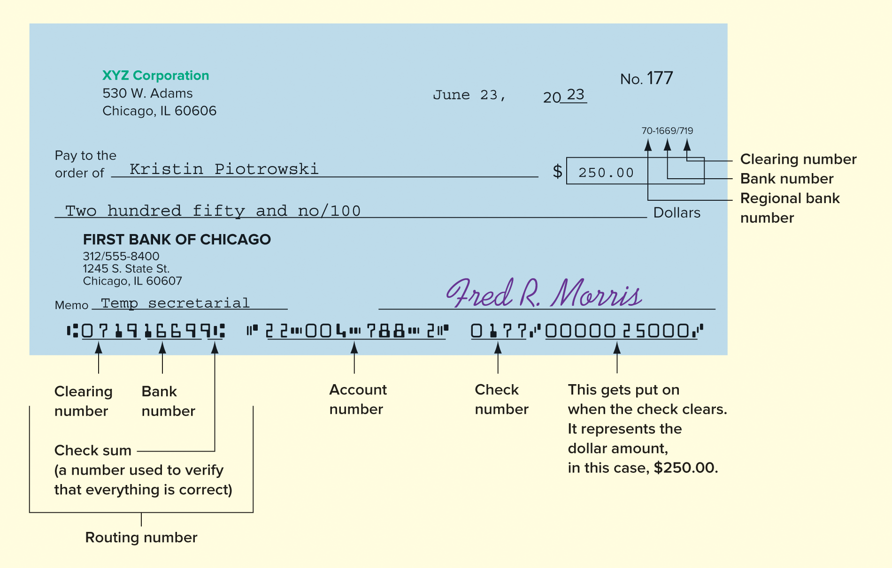
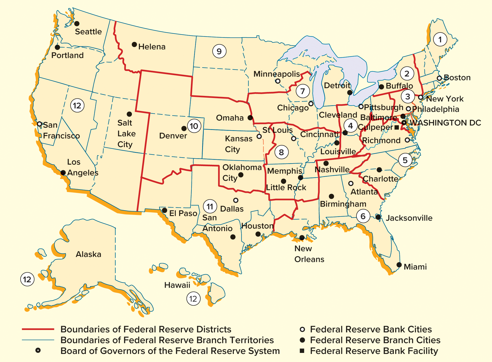
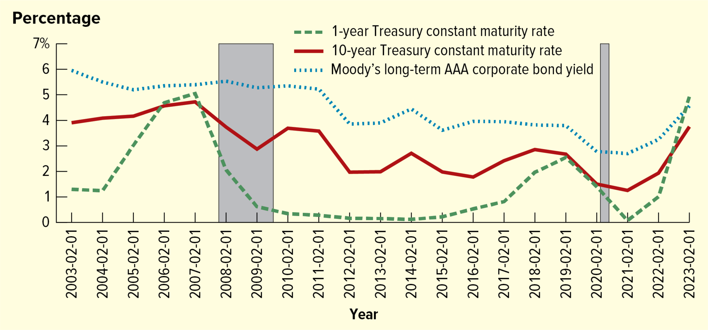
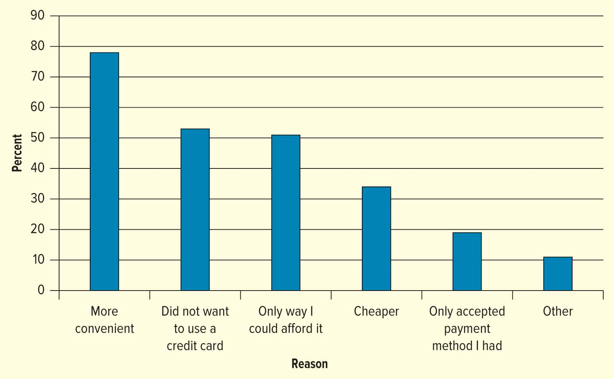
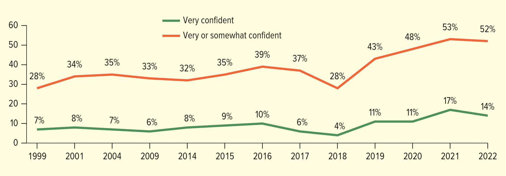
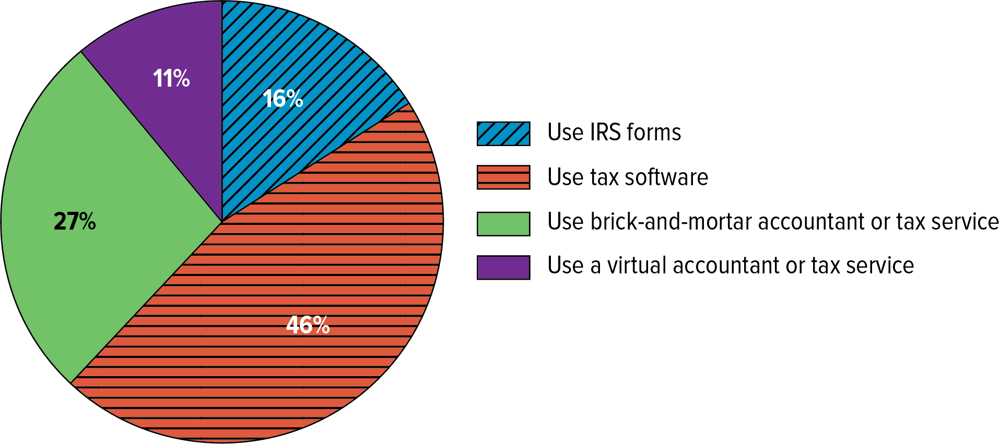

<h1 id="Chapter_15._Money_and_the_Financial_system" style="color:#42A5F5;">Indice</h1>

##### [Capitulo LO 15-1 MONEY IN THE FINANCIAL SYSTEM (DINERO EN EL SISTEMA FINANCIERO)](#700485)

##### [Capitulo LO 15-1: Describe various types of money. (Describir varios tipos de dinero.)](#153995)

##### [Capitulo LO 15-3 EL SISTEMA FINANCIERO ESTADOUNIDENSE (THE AMERICAN FINANCIAL SYSTEM)](#209848)

##### [Capitulo LO 15-4 Instituciones Bancarias (Banking Institutions)](#723838)

##### [Capitulo LO 15-5 Instituciones No Bancarias (Nonbanking Institutions)](#056436)

##### [Capitulo LO 15-6 Futuro de la Banca (Future of Banking)](#097041)

##### [Capitulo Apéndice (Appendix)](#918605)

##### [Capitulo EVALÚA TU SALUD FINANCIERA (EVALUATE YOUR FINANCIAL HEALTH)](#251734)

##### [Capitulo ESTABLECE METAS FINANCIERAS A CORTO Y LARGO PLAZO (SET SHORT-TERM AND LONG-TERM FINANCIAL GOALS)](#249136)

##### [Capitulo CREA Y ADHIÉRETE A UN PRESUPUESTO (CREATE AND ADHERE TO A BUDGET)](#361916)

##### [Capitulo ADMINISTRA LAS DEUDAS Y TARJETAS DE CRÉDITO SABIAMENTE (MANAGE DEBT AND CREDIT CARDS WISELY)](#005914)

##### [Capitulo DESARROLLA UN PLAN DE AHORRO E INVERSIÓN (DEVELOP A SAVINGS AND INVESTMENT PLAN)](#650675)

##### [Capitulo EVALÚA Y COMPRA SEGUROS (EVALUATE AND PURCHASE INSURANCE)](#504451)

##### [Capitulo DESARROLLA UN PLAN PATRIMONIAL (DEVELOP AN ESTATE PLAN)](#848503)

##### [Capitulo AJUSTA TU PLAN FINANCIERO A NUEVAS CIRCUNSTANCIAS (ADJUST YOUR FINANCIAL PLAN TO NEW CIRCUMSTANCES)](#394878)

---

<h1 id="700485" style="color:#E65100;">
  <a href="#Chapter_15._Money_and_the_Financial_system" style="color:inherit; text-decoration:none;">
    LO 15-1 MONEY IN THE FINANCIAL SYSTEM (DINERO EN EL SISTEMA FINANCIERO)
  </a>
</h1>

Define money, its functions, and its characteristics. (Definir el dinero, sus funciones y sus características.)

---

## Definición de Dinero (Definition of Money)

Estrictamente definido, el **dinero (money)** , o **moneda (currency)** , es cualquier cosa generalmente aceptada a cambio de bienes y servicios.

Materiales tan diversos como la sal, el ganado, los peces, las rocas, las conchas y la tela, así como metales preciosos como el oro, la plata y el cobre, han sido utilizados durante mucho tiempo por diversas culturas como dinero. La mayoría de estos materiales eran productos básicos de oferta limitada que tenían su propio valor para la sociedad (por ejemplo, la sal puede usarse como conservante y las conchas y metales como joyería). La oferta de estos productos básicos, por lo tanto, determinaba la oferta de "dinero" en esa sociedad.

---

## Evolución del Dinero (Evolution of Money)

El siguiente paso fue el desarrollo de los **"IOUs" (pagarés)** , o trozos de papel que podían intercambiarse por un suministro específico del producto básico subyacente.

**Fórmula del trueque (Barter Formula):**

$$
\text{Valor del Bien A} = \text{Valor del Bien B}
$$

$$
\text{Value of Good A} = \text{Value of Good B}
$$

Los **"billetes de oro" (gold notes)** , por ejemplo, podían intercambiarse por oro, y la oferta monetaria estaba vinculada a la cantidad de oro disponible.

---

## Dinero Fiduciario (Fiat Money)

Si bien el papel moneda se utilizó por primera vez en América del Norte en 1685 (e incluso antes en Europa), el concepto de **dinero fiduciario (fiat money)** (un papel moneda no fácilmente convertible en un metal precioso como el oro) no obtuvo una aceptación completa hasta la Gran Depresión de la década de 1930.

**Relación del dinero fiduciario (Fiat Money Relationship):**

$$
\text{Dinero Fiduciario} \neq \text{Respaldo en Metal Precioso}
$$

$$
\text{Fiat Money} \neq \text{Precious Metal Backing}
$$

Estados Unidos abandonó su estándar monetario respaldado por oro en gran medida en respuesta a la Gran Depresión y se convirtió a un sistema monetario fiduciario.

**Característica del papel moneda (Paper Money Characteristic):**

$$
\text{Papel Moneda} = \text{Nota o Promesa del Gobierno}
$$

$$
\text{Paper Money} = \text{Government Note or Promise}
$$

En Estados Unidos, el papel moneda es realmente una "nota" o promesa del gobierno, que vale el valor especificado en el billete.

---

## Resumen de Conceptos Clave (Summary of Key Concepts)

| Concepto (Español) | Concepto (English) | Característica |
|:---|:---|:---|
| Dinero | Money | Cualquier cosa aceptada a cambio de bienes y servicios |
| Moneda | Currency | Forma física del dinero (billetes y monedas) |
| Pagaré | IOU (I Owe You) | Documento que promete el pago de una deuda |
| Billete de oro | Gold Note | Papel intercambiable por oro |
| Dinero fiduciario | Fiat Money | Dinero sin respaldo en metales preciosos |
| Sistema fiduciario | Fiat Monetary System | Sistema monetario actual de EE.UU. |

---

## Nota Histórica (Historical Note)

**Materiales utilizados como dinero a través de la historia:**

| Material | Uso como dinero |
|:---|:---|
| Sal (Salt) | Conservante de alimentos |
| Ganado (Cattle) | Fuente de alimento y trabajo |
| Conchas (Shells) | Joyería y adorno |
| Metales preciosos (Precious Metals) | Joyería y acuñación de monedas |

## Funciones del Dinero (Functions of Money)

No importa lo que una sociedad en particular utilice como dinero, su propósito principal es permitir que una persona u organización intercambie dinero por un bien o un servicio. Estos deseos pueden ser por acciones de entretenimiento como financiar gastos de fiestas; acciones operativas, como pagar alquiler, servicios públicos o empleados; acciones de inversión, como comprar propiedades o equipos; o acciones de financiamiento, como iniciar o hacer crecer un negocio. El dinero cumple tres funciones importantes: como medio de intercambio, medida de valor y depósito de valor.

---

### Medio de Intercambio (Medium of Exchange)

Antes del dinero fiduciario, el intercambio de bienes y servicios se realizaba a través del **trueque (bartering)** : intercambiar un bien o servicio por otro de valor similar. Tenía que haber una forma más simple, y esa fue decidir un solo elemento (el dinero) que pueda ser libremente convertido en cualquier otro bien mediante acuerdo entre las partes.

**Fórmula del trueque (Barter Formula):**

$$
\text{Bien A} = \text{Bien B (de igual valor)}
$$

$$
\text{Good A} = \text{Good B (of equal value)}
$$

---

### Medida de Valor (Measure of Value)

Como **medida de valor (measure of value)** , el dinero sirve como un estándar común o vara de medir del valor de los bienes y servicios. Por ejemplo, $4 comprarán una docena de huevos grandes y $25,000 comprarán un buen automóvil en Estados Unidos. En Japón, donde la moneda es el yen, estas mismas transacciones costarían aproximadamente 550 yenes y 3.4 millones de yenes, respectivamente.

**Relación de valor (Value Relationship):**

$$
\text{Precio en País A} \times \text{Tasa de Cambio} = \text{Precio en País B}
$$

$$
\text{Price in Country A} \times \text{Exchange Rate} = \text{Price in Country B}
$$

Debido a que las tasas de cambio de monedas cambian diariamente, el valor del yen, el euro, el franco suizo y otras monedas extranjeras puede cambiar significativamente con el tiempo. El dinero es, entonces, un denominador común que permite a las personas comparar los diferentes bienes y servicios que pueden consumir con un nivel de ingreso particular. Mientras que un atleta estrella y un trabajador que gana el salario mínimo reciben salarios muy diferentes, cada uno utiliza el dinero como una medida del valor de sus ganancias y compras anuales.

---

### Depósito de Valor (Store of Value)

Como **depósito de valor (store of value)** , el dinero sirve como una forma de acumular riqueza (poder adquisitivo) hasta que se necesite. Por ejemplo, una persona que gana $1,000 por semana y quiere comprar una computadora de $500 podría ahorrar $50 por semana durante cada una de las próximas 10 semanas.

**Fórmula de ahorro (Savings Formula):**

$$
\text{Ahorro Semanal} = \frac{\text{Precio del Bien}}{\text{Número de Semanas}}
$$

$$
\text{Weekly Savings} = \frac{\text{Price of Good}}{\text{Number of Weeks}}
$$

$$
\text{Ahorro Semanal} = \frac{\$500}{10} = \$50
$$

$$
\text{Weekly Savings} = \frac{\$500}{10} = \$50
$$

---

### Inflación vs Deflación (Inflation vs Deflation)

Desafortunadamente, el valor del dinero almacenado depende directamente de la salud de la economía.

**Relaciones económicas (Economic Relationships):**

$$
\text{Inflación (Inflation)} \rightarrow \text{Aumento de Precios} \rightarrow \text{Disminución del Poder Adquisitivo}
$$

$$
\text{Inflation} \rightarrow \text{Price Increase} \rightarrow \text{Decrease in Purchasing Power}
$$

$$
\text{Deflación (Deflation)} \rightarrow \text{Caída de Precios} \rightarrow \text{Disminución de Salarios} + \text{Aumento de Cargas de Deuda}
$$

$$
\text{Deflation} \rightarrow \text{Falling Prices} \rightarrow \text{Wage Decrease} + \text{Increase in Debt Burdens}
$$

Si, debido a una inflación rápida (rapid inflation), todos los precios se duplican en un año, entonces el valor del poder adquisitivo del dinero se reduciría a la mitad.

**Efecto de la inflación al 100% (100% Inflation Effect):**

$$
\text{Nuevo Poder Adquisitivo} = \frac{\text{Poder Adquisitivo Original}}{2}
$$

$$
\text{New Purchasing Power} = \frac{\text{Original Purchasing Power}}{2}
$$

Por otro lado, la **deflación (deflation)** ocurre cuando los precios de los bienes caen. La deflación podría parecer algo bueno para los consumidores, pero en muchos aspectos puede ser tan problemática como la inflación. Los períodos de deflación importante a menudo conducen a disminuciones en los salarios y aumentos en las cargas de deuda. La deflación también tiende a ser un indicador de problemas en la economía. La deflación generalmente indica un crecimiento económico lento y una caída de los precios.

---

### Política Monetaria (Monetary Policy)

Dada la elección, los bancos centrales como la Reserva Federal (Federal Reserve) prefieren tener una pequeña cantidad de inflación del 2 al 3 por ciento que deflación.

**Meta de inflación (Inflation Target):**

$$
\text{Inflación Objetivo} = 2\% - 3\%
$$

$$
\text{Target Inflation} = 2\% - 3\%
$$

La inflación en Estados Unidos ha aumentado dramáticamente desde 2020. En 2022, alcanzó más del 6.5%, y la Reserva Federal aumentó las tasas de interés en un intento de devolver la tasa al 2%.

**Relación entre tasas de interés e inflación (Interest Rate and Inflation Relationship):**

$$
\text{Tasas de Interés} \uparrow \rightarrow \text{Inflación} \downarrow
$$

$$
\text{Interest Rates} \uparrow \rightarrow \text{Inflation} \downarrow
$$

La Fed continuará ajustando las tasas para controlar la inflación.

---

## Resumen de las Funciones del Dinero (Summary of the Functions of Money)

| Función (Español) | Function (English) | Descripción |
|:---|:---|:---|
| Medio de intercambio | Medium of Exchange | Permite intercambiar dinero por bienes y servicios |
| Medida de valor | Measure of Value | Sirve como estándar común para medir el valor |
| Depósito de valor | Store of Value | Permite acumular riqueza hasta que se necesite |

## Características del Dinero (Characteristics of Money)

Para ser utilizado como medio de intercambio, el dinero debe ser: **aceptable (acceptable)** , **divisible (divisible)** , **portátil (portable)** , **estable en valor (stable in value)** , **duradero (durable)** y **difícil de falsificar (difficult to counterfeit)** .

---

### Aceptabilidad (Acceptability)

Para ser efectivo, el dinero debe ser fácilmente aceptable para la compra de bienes y servicios y para el pago de deudas. La **aceptabilidad (acceptability)** es probablemente la característica más importante del dinero: si las personas no confían en el valor del dinero, las empresas no lo aceptarán como pago por bienes y servicios, y los consumidores tendrán que encontrar otra forma de pagar sus compras.

**Relación de aceptabilidad (Acceptability Relationship):**

$$
\text{Confianza en el Dinero} \rightarrow \text{Aceptabilidad} \rightarrow \text{Funcionamiento del Sistema Monetario}
$$

$$
\text{Trust in Money} \rightarrow \text{Acceptability} \rightarrow \text{Functioning of Monetary System}
$$

---

### Divisibilidad (Divisibilidad)

Dado el uso generalizado de cuartos de dólar (quarters), monedas de diez centavos (dimes), monedas de cinco centavos (nickels) y centavos (pennies) en Estados Unidos, no es sorprendente que el principio de **divisibilidad (divisibility)** sea importante. Con el trueque, la falta de divisibilidad a menudo hace imposibles intercambios por lo demás preferibles, como sería un intento de intercambiar un buey por una barra de pan.

**Ejemplo de falta de divisibilidad en el trueque (Example of lack of divisibility in barter):**

$$
\text{1 Buey (Steer)} \neq \text{1 Barra de Pan (Loaf of Bread)}
$$

Para que el dinero sirva efectivamente como medida de valor, todos los elementos deben ser valorados en unidades comparables:
- Monedas de diez centavos (dimes) para un chicle
- Cuartos de dólar (quarters) para máquinas lavadoras
- Dólares (o dólares y monedas) para todo lo demás

**Relación de divisibilidad (Divisibility Relationship):**

$$
\text{Dinero} = \text{Unidades Más Pequeñas} + \text{Unidades Más Grandes}
$$

$$
\text{Money} = \text{Smaller Units} + \text{Larger Units}
$$

---

### Portabilidad (Portability)

Claramente, para que el dinero funcione como medio de intercambio, debe ser fácilmente movible de un lugar a otro. Grandes rocas de colores podrían usarse como dinero, pero no podrías llevarlas en tu billetera. El papel moneda (paper currency) y las monedas de metal (metal coins), por otro lado, son capaces de transferir un vasto poder adquisitivo en pequeños paquetes fáciles de llevar (¡y de esconder!).

**Características de portabilidad (Portability Characteristics):**

$$
\text{Papel Moneda} + \text{Monedas} = \text{Alto Valor} + \text{Bajo Volumen} + \text{Fácil Transporte}
$$

$$
\text{Paper Currency} + \text{Coins} = \text{High Value} + \text{Low Volume} + \text{Easy Transport}
$$

El **dólar estadounidense (U.S. dollar)** es aceptado internacionalmente como la moneda de elección y se utiliza para transacciones en todo el mundo. Debido a que es la moneda internacional más utilizada, en realidad hay más moneda estadounidense en circulación fuera de Estados Unidos que dentro de sus fronteras. Algunos países, como Panamá, incluso utilizan el dólar estadounidense como su moneda.

---

### Estabilidad de Valor (Stability of Value)

Para que el dinero sea efectivo como depósito de valor, debe mantener su valor a lo largo del tiempo. La inflación y la deflación afectan esta característica.

**Relación de estabilidad (Stability Relationship):**

$$
\text{Baja Inflación} \rightarrow \text{Alta Estabilidad} \rightarrow \text{Confianza en el Dinero}
$$

$$
\text{Low Inflation} \rightarrow \text{High Stability} \rightarrow \text{Trust in Money}
$$

---

### Durabilidad (Durability)

El dinero debe ser lo suficientemente duradero para resistir el uso repetido a lo largo del tiempo. Las monedas y los billetes están diseñados para durar:

**Vida útil aproximada (Approximate useful life):**

| Denominación | Vida útil |
|:---|:---|
| Billetes de $1 (dólar) | Aproximadamente 6 años |
| Billetes de $100 | Aproximadamente 15 años |
| Monedas | Décadas o siglos |

---

### Dificultad de Falsificación (Difficulty to Counterfeit)

Para mantener la confianza en el sistema monetario, el dinero debe ser difícil de falsificar. Los gobiernos incorporan múltiples características de seguridad:

**Características de seguridad (Security features):**

$$
\text{Seguridad} = \text{Marcas de Agua} + \text{Hilos de Seguridad} + \text{Tinta que Cambia de Color} + \text{Microimpresión}
$$

$$
\text{Security} = \text{Watermarks} + \text{Security Threads} + \text{Color-Shifting Ink} + \text{Microprinting}
$$

---

## Resumen de las Características del Dinero (Summary of the Characteristics of Money)

| Característica (Español) | Characteristic (English) | Descripción |
|:---|:---|:---|
| Aceptabilidad | Acceptability | Debe ser aceptado por todos para bienes y servicios |
| Divisibilidad | Divisibility | Debe poder dividirse en unidades más pequeñas |
| Portabilidad | Portability | Debe ser fácil de transportar |
| Estabilidad de valor | Stability of Value | Debe mantener su valor a lo largo del tiempo |
| Durabilidad | Durability | Debe resistir el uso repetido |
| Difícil de falsificar | Difficult to Counterfeit | Debe ser seguro para evitar falsificaciones |

---

## Nota sobre monedas internacionales (Note on international currencies)

El euro, el yen y el dólar estadounidense son ejemplos de moneda (currency) utilizados en todo el mundo.

$$
\text{Dólar USA} + \text{Euro} + \text{Yen Japonés} = \text{Monedas de Reserva Internacionales}
$$

$$
\text{US Dollar} + \text{Euro} + \text{Japanese Yen} = \text{International Reserve Currencies}
$$

### Aceptabilidad (Acceptability)

Para ser efectivo, el dinero debe ser fácilmente aceptable para la compra de bienes y servicios y para el pago de deudas. La **aceptabilidad (acceptability)** es probablemente la característica más importante del dinero: si las personas no confían en el valor del dinero, las empresas no lo aceptarán como pago por bienes y servicios, y los consumidores tendrán que encontrar otra forma de pagar sus compras.

**Relación de aceptabilidad (Acceptability Relationship):**

$$
\text{Confianza en el Dinero} \rightarrow \text{Aceptabilidad} \rightarrow \text{Funcionamiento del Sistema Monetario}
$$

$$
\text{Trust in Money} \rightarrow \text{Acceptability} \rightarrow \text{Functioning of Monetary System}
$$

---

### Divisibilidad (Divisibility)

Dado el uso generalizado de cuartos de dólar (quarters), monedas de diez centavos (dimes), monedas de cinco centavos (nickels) y centavos (pennies) en Estados Unidos, no es sorprendente que el principio de **divisibilidad (divisibility)** sea importante. Con el trueque, la falta de divisibilidad a menudo hace imposibles intercambios por lo demás preferibles, como sería un intento de intercambiar un buey por una barra de pan.

**Ejemplo de falta de divisibilidad en el trueque (Example of lack of divisibility in barter):**

$$
\text{1 Buey (Steer)} \neq \text{1 Barra de Pan (Loaf of Bread)}
$$

Para que el dinero sirva efectivamente como medida de valor, todos los elementos deben ser valorados en unidades comparables:
- Monedas de diez centavos (dimes) para un chicle
- Cuartos de dólar (quarters) para máquinas lavadoras
- Dólares (o dólares y monedas) para todo lo demás

**Relación de divisibilidad (Divisibility Relationship):**

$$
\text{Dinero} = \text{Unidades Más Pequeñas} + \text{Unidades Más Grandes}
$$

$$
\text{Money} = \text{Smaller Units} + \text{Larger Units}
$$

---

### Portabilidad (Portability)

Claramente, para que el dinero funcione como medio de intercambio, debe ser fácilmente movible de un lugar a otro. Grandes rocas de colores podrían usarse como dinero, pero no podrías llevarlas en tu billetera. El papel moneda (paper currency) y las monedas de metal (metal coins), por otro lado, son capaces de transferir un vasto poder adquisitivo en pequeños paquetes fáciles de llevar (¡y de esconder!).

**Características de portabilidad (Portability Characteristics):**

$$
\text{Papel Moneda} + \text{Monedas} = \text{Alto Valor} + \text{Bajo Volumen} + \text{Fácil Transporte}
$$

$$
\text{Paper Currency} + \text{Coins} = \text{High Value} + \text{Low Volume} + \text{Easy Transport}
$$

El **dólar estadounidense (U.S. dollar)** es aceptado internacionalmente como la moneda de elección y se utiliza para transacciones en todo el mundo. Debido a que es la moneda internacional más utilizada, en realidad hay más moneda estadounidense en circulación fuera de Estados Unidos que dentro de sus fronteras. Algunos países, como Panamá, incluso utilizan el dólar estadounidense como su moneda.

---

### Estabilidad (Stability)

El dinero debe ser **estable (stable)** y mantener su valor nominal declarado. Un billete de $10 debería comprar la misma cantidad de bienes o servicios de un día a otro. El principio de **estabilidad (stability)** permite que las personas que desean posponer compras y ahorrar su dinero lo hagan sin temor a que pierda su valor.

**Relación de estabilidad (Stability Relationship):**

$$
\text{Inflación} \uparrow \rightarrow \text{Poder Adquisitivo} \downarrow
$$

$$
\text{Inflation} \uparrow \rightarrow \text{Purchasing Power} \downarrow
$$

En algunos países con inflación muy alta (very high inflation), las personas gastan su dinero lo más rápido que pueden para evitar que pierda aún más su valor. La inestabilidad destruye la confianza en el dinero de una nación y en su capacidad para almacenar valor y servir como un medio de intercambio efectivo. También tiene un impacto en otros países.

**Efecto de la inestabilidad (Effect of Instability):**

$$
\text{Inestabilidad} \rightarrow \text{Pérdida de Confianza} \rightarrow \text{Evitar el Papel Moneda} \rightarrow \text{Comprar Activos Reales}
$$

$$
\text{Instability} \rightarrow \text{Loss of Trust} \rightarrow \text{Avoid Paper Money} \rightarrow \text{Buy Real Assets}
$$

Ultimadamente, las personas enfrentadas a aumentos de precios en espiral evitan el papel moneda cada vez más sin valor a toda costa, almacenando todos sus ahorros en forma de **activos reales (real assets)** como oro y tierra.

#### Criptomonedas (Cryptocurrency)

Uno de los problemas con las **criptomonedas (cryptocurrency)** , discutido más adelante en este capítulo, es que carecen de un valor estable. La Comisión de Bolsa y Valores de EE.UU. (SEC) considera que las criptomonedas son valores (securities) porque no tienen un valor estable.

**Relación de volatilidad (Volatility Relationship):**

$$
\text{Bitcoin} \rightarrow \text{Valor Fluctuante} \rightarrow \text{No Califica como Dinero}
$$

$$
\text{Bitcoin} \rightarrow \text{Fluctuating Value} \rightarrow \text{Does Not Qualify as Money}
$$

El valor del bitcoin, por ejemplo, fluctúa dramáticamente. Claramente, esto es un activo especulativo (speculative asset) y no califica como un activo que cumpla con la definición de dinero.

---

### Durabilidad (Durability)

El dinero debe ser **duradero (durable)** . Los billetes nuevos de un dólar que intercambias por productos en el centro comercial circularán por toda la ciudad durante aproximadamente seis años antes de ser reemplazados (ver Tabla 15.1).

**Relación de durabilidad (Durability Relationship):**

$$
\text{Durabilidad} \rightarrow \text{Vida Útil Más Larga} \rightarrow \text{Menos Reemplazos}
$$

$$
\text{Durability} \rightarrow \text{Longer Useful Life} \rightarrow \text{Fewer Replacements}
$$

Si el valor de un billete viejo y descolorido disminuyera junto con el deterioro de su apariencia, los principios de estabilidad y aceptabilidad universal fallarían (¡pero, sin duda, menos billetes pasarían por la lavadora!).

Aunque las monedas de metal (metal coins), debido a su vida útil mucho más larga, parecerían ser una forma ideal de dinero, el papel moneda (paper currency) es mucho más portátil que el metal debido a su peso ligero. Hoy en día, las monedas se utilizan principalmente para proporcionar divisibilidad.

---

### Dificultad de Falsificación (Difficulty to Counterfeit)

Para mantener la confianza en el sistema monetario, el dinero debe ser **difícil de falsificar (difficult to counterfeit)** . Los gobiernos incorporan múltiples características de seguridad:

**Características de seguridad (Security features):**

$$
\text{Seguridad} = \text{Marcas de Agua} + \text{Hilos de Seguridad} + \text{Tinta que Cambia de Color} + \text{Microimpresión}
$$

$$
\text{Security} = \text{Watermarks} + \text{Security Threads} + \text{Color-Shifting Ink} + \text{Microprinting}
$$

---

### Tabla 15.1 Esperanza de Vida del Dinero (Life Expectancy of Money)

¿Cuánto dura el papel moneda estadounidense?

Cuando la moneda se deposita en un Banco de la Reserva Federal, la calidad de cada billete se evalúa mediante equipos de procesamiento sofisticados. Los billetes que cumplen con los estrictos criterios de calidad (es decir, que aún están en buenas condiciones) continúan circulando, mientras que aquellos que no los cumplen se retiran de la circulación y se destruyen. Este proceso determina la vida útil de un billete de la Reserva Federal.

La vida útil varía según la denominación. Un factor que influye en la vida útil de cada denominación es cómo el público utiliza la denominación. Por ejemplo, los billetes de $100 se utilizan a menudo como depósito de valor (store of value). Esto significa que pasan entre usuarios con menos frecuencia que las denominaciones más bajas que se utilizan más a menudo para transacciones, como los billetes de $5. Por lo tanto, los billetes de $100 típicamente duran más que los billetes de $5.

| Denominación | Vida Útil Estimada |
|:---|:---|
| $1 | 6.6 años |
| $5 | 4.7 años |
| $10 | 5.3 años |
| $20 | 7.8 años |
| $50 | 12.2 años |
| $100 | 22.9 años |

*Nota: Las vidas útiles estimadas son a partir de diciembre de 2018. Debido a que el billete de $2 no circula ampliamente, no publicamos su vida útil estimada.*

*Fuente: Junta de Gobernadores del Sistema de la Reserva Federal*

---

### Resumen de las Características del Dinero (Summary of the Characteristics of Money)

| Característica (Español) | Characteristic (English) | Descripción |
|:---|:---|:---|
| Aceptabilidad | Acceptability | Debe ser aceptado por todos para bienes y servicios |
| Divisibilidad | Divisibility | Debe poder dividirse en unidades más pequeñas |
| Portabilidad | Portability | Debe ser fácil de transportar |
| Estabilidad | Stability | Debe mantener su valor a lo largo del tiempo |
| Durabilidad | Durability | Debe resistir el uso repetido |
| Difícil de falsificar | Difficult to Counterfeit | Debe ser seguro para evitar falsificaciones |

---

### Nota sobre monedas internacionales (Note on international currencies)

El euro, el yen y el dólar estadounidense son ejemplos de moneda (currency) utilizados en todo el mundo.

$$
\text{Dólar USA} + \text{Euro} + \text{Yen Japonés} = \text{Monedas de Reserva Internacionales}
$$

$$
\text{US Dollar} + \text{Euro} + \text{Japanese Yen} = \text{International Reserve Currencies}
$$

### Dificultad de Falsificación (Difficulty to Counterfeit)

Finalmente, para mantenerse estable y gozar de aceptación universal, casi no hace falta decir que el dinero debe ser muy **difícil de falsificar (difficult to counterfeit)** , es decir, de duplicar ilegalmente. Cada país toma medidas para dificultar la falsificación. La mayoría utiliza dinero multicolor, y muchos utilizan papeles con marcas de agua especiales que son prácticamente imposibles de duplicar.

Sin embargo, cada vez es más fácil para los falsificadores imprimir dinero. Esta impresión ilegal de dinero es alimentada por cientos de personas que a menudo circulan solo pequeñas cantidades de billetes falsos. Incluso gobiernos rebeldes como Corea del Norte son conocidos por hacer moneda estadounidense falsa.

Para combatir el problema de la falsificación, el Departamento del Tesoro de EE.UU. rediseñó la moneda estadounidense, comenzando con:
- El billete de $20 en 2003
- El billete de $50 en 2004
- El billete de $10 en 2006
- El billete de $5 en 2008
- El billete de $100 en 2013

**Características de seguridad del dinero estadounidense (Security features of U.S. money):**

$$
\text{Seguridad} = \text{Colores Sutiles} + \text{Marca de Agua} + \text{Hilo de Seguridad} + \text{Tinta que Cambia de Color}
$$

$$
\text{Security} = \text{Subtle Colors} + \text{Watermark} + \text{Security Thread} + \text{Color-Shifting Ink}
$$

El dinero estadounidense incluye colores sutiles además del verde tradicional, así como características de seguridad mejoradas, como marca de agua, hilo de seguridad y tinta que cambia de color.

Muchos países están descontinuando los billetes de alta denominación que se utilizan en el comercio ilegal, como drogas o terrorismo. La idea es que es más difícil transportar o esconder billetes de €100 que billetes de €500.

Aunque la falsificación no es un problema tan grave con las monedas, las monedas de metal estadounidenses suelen valer más por el metal que por su valor nominal. Cuesta más fabricar monedas de lo que valen monetariamente.

---

### Tabla 15.2 Costos de Producción de Monedas de EE.UU. (Costs to Produce U.S. Coins)

| Año Fiscal | Penny (Centavo) | Nickel (Níquel) | Dime (Moneda de 10¢) | Quarter (Moneda de 25¢) | Total Profit from Coins (Millions) |
|:---|:---:|:---:|:---:|:---:|:---:|
| 2013 | $0.0183 | $0.0941 | $0.0456 | $0.0105 | $137.4 |
| 2014 | $0.0166 | $0.0809 | $0.0391 | $0.0895 | $289.1 |
| 2015 | $0.0143 | $0.0744 | $0.0354 | $0.0844 | $540.9 |
| 2016 | $0.0150 | $0.0632 | $0.0308 | $0.0763 | $578.7 |
| 2017 | $0.0182 | $0.0666 | $0.0333 | $0.0824 | $391.5 |
| 2018 | $0.0206 | $0.0753 | $0.0372 | $0.0888 | $321.1 |
| 2019 | $0.0199 | $0.0762 | $0.0373 | $0.0901 | $318.3 |
| 2020 | $0.0176 | $0.0742 | $0.0373 | $0.0862 | $549.9 |
| 2021 | $0.0181 | $0.0744 | $0.0386 | $0.0843 | $381.2 |
| 2022 | $0.0243 | $0.0917 | $0.0442 | $0.0975 | $310.2 |

**Nota sobre la producción de monedas (Note on coin production):**

Como indica la Tabla 15.2, cuesta más producir centavos (pennies) y monedas de cinco centavos (nickels) que su valor nominal. Sin embargo, lo que la Casa de la Moneda de EE.UU. (U.S. Mint) pierde en centavos y monedas de cinco centavos lo compensa con ganancias en monedas de diez centavos (dimes), veinticinco centavos (quarters) y medio dólar (half-dollars).

**Relación de costo de producción (Production cost relationship):**

$$
\text{Costo de Producción} > \text{Valor Facial} \rightarrow \text{Pérdida para la Casa de la Moneda}
$$

$$
\text{Production Cost} > \text{Face Value} \rightarrow \text{Loss for the Mint}
$$

$$
\text{Costo de Producción} < \text{Valor Facial} \rightarrow \text{Ganancia para la Casa de la Moneda}
$$

$$
\text{Production Cost} < \text{Face Value} \rightarrow \text{Profit for the Mint}
$$

El dólar estadounidense de $1 resultó ser tan impopular que la Casa de la Moneda de EE.UU. dejó de producirlo después de 2013. Las ganancias fluctúan con el tiempo debido a los costos crecientes y decrecientes del cobre, zinc y níquel, pero las monedas de diez centavos (dimes) y veinticinco centavos (quarters) siempre han sido rentables para la Casa de la Moneda de EE.UU.

---

### Resumen de Características de Seguridad (Summary of Security Features)

| Característica (Español) | Feature (English) | Descripción |
|:---|:---|:---|
| Colores sutiles | Subtle Colors | Colores adicionales además del verde tradicional |
| Marca de agua | Watermark | Imagen visible al trasluz |
| Hilo de seguridad | Security Thread | Banda incrustada en el papel |
| Tinta que cambia de color | Color-Shifting Ink | Tinta que cambia de color al inclinar el billete |

# ¿Real o Falso? Dentro de la Tecnología Antifalsificación

## Contexto

Cada año se reportan más de 55,000 casos de falsificación a la Comisión de Sentencias de Estados Unidos. Aunque muchas de estas pérdidas individuales son menores a \$5,000, falsificar dinero es un delito grave porque debilita la confianza en la moneda nacional.

Aunque los pagos electrónicos siguen creciendo, los billetes físicos continúan siendo esenciales porque son ampliamente aceptados, fáciles de transportar y útiles para transacciones diarias.

Actualmente existen más de \$70 millones en billetes falsos circulando en Estados Unidos, una cifra pequeña comparada con los más de \$2 billones en billetes auténticos en circulación.

Para combatir la falsificación, el gobierno utiliza nuevas tecnologías, aplicaciones móviles, inteligencia artificial y rediseños periódicos de los billetes.

---

## Preguntas y Respuestas

### 1. ¿Por qué los billetes de Estados Unidos son difíciles de falsificar?

Los billetes estadounidenses son difíciles de falsificar porque contienen avanzadas características de seguridad como tinta que cambia de color, números de serie únicos, marcas de agua, bandas de seguridad 3D y papel especial exclusivo.

Además, estos elementos requieren tecnología sofisticada para ser copiados con precisión.

---

### 2. ¿Cuáles son las ventajas potenciales de usar inteligencia artificial para detectar billetes falsos?

La inteligencia artificial puede detectar billetes falsos más rápido y con mayor precisión que los métodos tradicionales.

También puede analizar grandes cantidades de efectivo, reducir errores humanos y combinar el reconocimiento del billete con la verificación de autenticidad en un solo proceso.

---

### 3. ¿Por qué los billetes se rediseñan regularmente?

Los billetes se rediseñan regularmente para dificultar la falsificación y adaptarse a nuevas amenazas tecnológicas.

Cada rediseño permite agregar nuevas medidas de seguridad, proteger la moneda y mantener la confianza del público en el sistema financiero.

<h1 id="153995" style="color:#E65100;">
  <a href="#Chapter_15._Money_and_the_Financial_system" style="color:inherit; text-decoration:none;">
    LO 15-1: Describe various types of money. (Describir varios tipos de dinero.)
  </a>
</h1>

## Tipos de Dinero (Types of Money)

Si bien el papel moneda y las monedas son los tipos de dinero más visibles, el valor combinado de todos los billetes impresos y todas las monedas acuñadas es en realidad bastante insignificante en comparación con el valor del dinero mantenido en cuentas corrientes, cuentas de ahorro y otras formas monetarias.

---

### Cuentas Corrientes (Checking Accounts)

Probablemente tengas una **cuenta corriente (checking account)** (también llamada **depósito a la vista (demand deposit)** ), dinero almacenado en una cuenta en un banco u otra institución financiera que puede retirarse sin previo aviso. Una forma de retirar fondos de su cuenta es mediante la emisión de un **cheque (check)** , una orden escrita a un banco para pagar al individuo o negocio indicado la cantidad especificada en el cheque a partir del dinero ya depositado.

</img>

La **Figura 15.1** explica el significado de los números que se encuentran en un cheque típico estadounidense.

Como instrumentos legales, los cheques sirven como sustituto de la moneda y las monedas, y son preferidos para muchas transacciones debido a su menor riesgo de pérdida.

---

### Significado de los números en un cheque típico estadounidense

A continuación se explica el significado de **los números que aparecen en un cheque típico de Estados Unidos**, como el que se muestra en la imagen. La explicación sigue los **elementos estándar** y su **función dentro del sistema bancario**.

---

#### 1. Número del cheque (*Check number*)

**Ubicación:**
- Esquina superior derecha (ej. `No. 177`)
- Repetido en la línea inferior del cheque

**Significado:**
- Identifica de forma única cada cheque emitido.
- Se utiliza para control interno, conciliaciones bancarias y seguimiento de pagos.
- No determina el procesamiento bancario, pero ayuda a detectar errores o duplicados.

---

#### 2. Monto del cheque en números

**Ubicación:**
- Recuadro a la derecha, precedido por el símbolo `$`
- Ejemplo: `$250.00`

**Significado:**
- Es la cantidad exacta que el banco pagará.
- En los sistemas modernos, este monto suele ser el que se procesa de manera automática.

---

#### 3. Monto del cheque en palabras

**Ubicación:**
- Línea debajo del beneficiario  
- Ejemplo: *Two hundred fifty and no/100*

**Significado:**
- Sirve como verificación legal del monto.
- En caso de discrepancia, tradicionalmente prevalece el monto escrito con palabras.

---

#### 4. Número de ruta bancaria (*Routing number*)

**Ubicación:**
- Línea inferior del cheque (línea MICR)
- Generalmente consta de **9 dígitos**

**Significado:**
- Identifica al banco emisor dentro del sistema financiero estadounidense.
- Permite dirigir el cheque al banco correcto durante la compensación.

**Componentes:**
- Número de compensación (*clearing number*)
- Identificador del banco
- Dígito de control (*check digit*) para verificación

---

#### 5. Número de cuenta (*Account number*)

**Ubicación:**
- Línea MICR, después del routing number

**Significado:**
- Identifica la cuenta específica del cliente dentro del banco.
- Es único para cada cuenta bancaria.

---

#### 6. Número del cheque en la línea MICR

**Ubicación:**
- Parte final o intermedia de la línea inferior

**Significado:**
- Repite el número del cheque impreso en la parte superior.
- Permite asociar la transacción con un cheque específico.

---

#### 7. Línea MICR (*Magnetic Ink Character Recognition*)

**Descripción:**
- Fila de números y símbolos impresos en tinta magnética en la parte inferior del cheque.

**Contiene:**
1. Número de ruta bancaria  
2. Número de cuenta  
3. Número del cheque  
4. En algunos casos, el monto (se imprime al procesarse)

**Importancia:**
- Permite lectura y procesamiento automático por los bancos.
- Reduce errores humanos y acelera la compensación.

---

#### Resumen

| Elemento numérico | Función |
|------------------|--------|
| Número del cheque | Identificación del cheque |
| Monto en números | Cantidad a pagar |
| Monto en palabras | Verificación legal |
| Routing number | Identificación del banco |
| Número de cuenta | Identificación de la cuenta |
| Línea MICR | Procesamiento automático |

---

**Comparación de riesgos (Risk comparison):**

$$
\text{Billete de \$100 perdido} \rightarrow \text{Cualquiera puede gastarlo}
$$

$$
\text{Lost \$100 bill} \rightarrow \text{Anyone can spend it}
$$

$$
\text{Cheque en blanco perdido} \rightarrow \text{Riesgo bajo} + \text{Orden de suspensión de pago}
$$

$$
\text{Lost blank check} \rightarrow \text{Low risk} + \text{Stop-payment order}
$$

Si pierde un billete de $100, cualquiera que lo encuentre o lo robe puede gastarlo. Si pierde un cheque en blanco, sin embargo, el riesgo de pérdida catastrófica es bastante bajo. No solo su banco tiene una muestra de su firma en archivo para compararla con una firma sospechosa de ser falsificada, sino que puede hacer que el cheque sea inmediatamente sin valor mediante una orden de suspensión de pago (stop-payment order) en su banco.

Existen varios tipos de cuentas corrientes con diferentes características disponibles para diferentes niveles de tarifas mensuales o saldos mínimos específicos. Algunas cuentas corrientes ganan **intereses (interest)** (un pequeño porcentaje del monto depositado en la cuenta que el banco paga al depositante).

**Fórmula del interés (Interest formula):**

$$
\text{Interés} = \text{Principal} \times \text{Tasa de Interés} \times \text{Tiempo}
$$

$$
\text{Interest} = \text{Principal} \times \text{Interest Rate} \times \text{Time}
$$

Una de esas cuentas corrientes que devengan intereses es la cuenta **NOW (Negotiable Order of Withdrawal)** ofrecida por la mayoría de las instituciones financieras. La tasa de interés pagada en dichas cuentas varía con las tasas de interés disponibles en la economía, pero es típicamente bastante baja (más recientemente menos del 1%, pero en el pasado entre el 2% y el 5%).

---

### Cuentas de Ahorro (Savings Accounts)

Las **cuentas de ahorro (savings accounts)** (también conocidas como **depósitos a plazo (time deposits)** ) son cuentas con fondos que generalmente no pueden retirarse sin previo aviso y/o tienen límites en el número de retiros por período. Si bien rara vez se aplican, la "letra pequeña" que rige la mayoría de las cuentas de ahorro prohíbe los retiros sin aviso de dos o tres días.

**Características de la cuenta de ahorro (Savings account characteristics):**

$$
\text{Cuenta de Ahorro} \neq \text{Medio de Intercambio} \quad \text{(generalmente)}
$$

$$
\text{Savings Account} \neq \text{Medium of Exchange} \quad \text{(generally)}
$$

Las cuentas de ahorro no se utilizan generalmente para transacciones o como medio de intercambio, pero sus fondos pueden transferirse a una cuenta corriente o convertirse en efectivo.

---

### Cuentas del Mercado Monetario (Money Market Accounts)

Las **cuentas del mercado monetario (money market accounts)** son similares a las cuentas corrientes que devengan intereses, pero con más restricciones. Generalmente, a cambio de tasas de interés ligeramente más altas, el propietario de una cuenta del mercado monetario solo puede emitir un número limitado de cheques cada mes, y puede haber una restricción sobre el monto mínimo de cada cheque.

**Relación de compensación (Trade-off relationship):**

$$
\text{Tasa de Interés Más Alta} \leftrightarrow \text{Más Restricciones} + \text{Límite de Cheques}
$$

$$
\text{Higher Interest Rate} \leftrightarrow \text{More Restrictions} + \text{Check Limit}
$$

---

### Certificados de Depósito (Certificates of Deposit - CDs)

Los **certificados de depósito (CDs)** son cuentas de ahorro que garantizan a un depositante una tasa de interés fija durante un intervalo de tiempo especificado, siempre que los fondos no se retiren antes del final del intervalo (seis meses, un año o siete años, por ejemplo).

**Relación del CD (CD relationship):**

$$
\text{CD:} \quad \text{Tasa Fija} \times \text{Tiempo Especificado} = \text{Garantía de Interés}
$$

$$
\text{CD:} \quad \text{Fixed Rate} \times \text{Specific Time} = \text{Interest Guarantee}
$$

El dinero puede retirarse de estas cuentas prematuramente solo después de pagar una penalización sustancial. En general, cuanto más largo sea el plazo del CD, mayor será la tasa de interés que gana.

$$
\text{Plazo Más Largo} \rightarrow \text{Tasa de Interés Más Alta}
$$

$$
\text{Longer Term} \rightarrow \text{Higher Interest Rate}
$$

Como con todas las tasas de interés, la tasa ofrecida y fijada en el momento en que se abre la cuenta fluctúa según las condiciones económicas.

---

### Tarjetas de Crédito (Credit Cards)

Las **tarjetas de crédito (credit cards)** te permiten prometer pagar en una fecha posterior utilizando líneas de crédito preaprobadas otorgadas por un banco o compañía financiera. Son un sustituto popular de los pagos en efectivo debido a su conveniencia, fácil acceso al crédito y aceptación por parte de comerciantes de todo el mundo.

**Estructura de la tarjeta de crédito (Credit card structure):**

$$
\text{Tarjeta de Crédito} = \text{Conveniencia} + \text{Crédito Preaprobado} + \text{Aceptación Global}
$$

$$
\text{Credit Card} = \text{Convenience} + \text{Preapproved Credit} + \text{Global Acceptance}
$$

La institución que emite la tarjeta de crédito garantiza el pago de un cargo de crédito a los comerciantes y asume la responsabilidad de cobrar el dinero de los tarjetahabientes.

**Comisión del comerciante (Merchant fee):**

$$
\text{Tarifa de Transacción} = 2\% - 5\% \quad (\text{depende del tipo de tarjeta})
$$

$$
\text{Transaction Fee} = 2\% - 5\% \quad (\text{depending on card type})
$$

Las tarifas de American Express son generalmente más altas que las de Visa y Mastercard.

---

### Tarjetas de Recompensa (Rewards Credit Cards)

Un tipo de tarjeta de crédito es la **tarjeta de crédito de recompensas (rewards credit card)** . Las tarjetas de recompensa son tarjetas de crédito que otorgan un beneficio al usuario. Las recompensas incluyen devolución de efectivo (cash back), millas aéreas (airline miles) o puntos (points). Ejemplos incluyen la Wells Fargo Active Cash Card y la Chase Sapphire Preferred Card.

Las **tarjetas de crédito de marca compartida (co-branded credit cards)** , respaldadas por una institución financiera en asociación con una empresa u organización, también son comunes. Por ejemplo, las estaciones de servicio como Mobil y Shell tienen tarjetas de crédito con su marca para que cuando uses la tarjeta, ahorres cinco o seis centavos por galón. Otras, como las tarjetas de aerolíneas para American, Delta y United, te recompensan con millas que puedes usar para vuelos.

---

### Ley CARD de 2009 (Credit CARD Act of 2009)

La **Ley CARD (Card Accountability Responsibility and Disclosure) de 2009** fue aprobada para regular las prácticas de las compañías de tarjetas de crédito. La ley limitó la capacidad de los emisores de tarjetas para aumentar las tasas de interés, limitó el crédito a adultos jóvenes, dio a las personas más tiempo para pagar facturas e hizo más claras las fechas de vencimiento en los ciclos de facturación, junto con varias otras disposiciones.

**Disposiciones clave (Key provisions):**

$$
\text{Menores de 21 años} \rightarrow \text{Cofirmante Adulto} + \text{Prueba de Ingresos}
$$

$$
\text{Under 21} \rightarrow \text{Adult Co-signer} + \text{Proof of Income}
$$

Esta ley es importante para todas las empresas y tarjetahabientes. Las investigaciones indican que aproximadamente el 40 por ciento de los hogares de ingresos bajos y medios utilizan tarjetas de crédito para pagar necesidades básicas. Sin embargo, también hay buenas noticias. La deuda promedio de tarjetas de crédito para hogares de ingresos bajos y medios ha disminuido en los últimos años. Por otro lado, los estudios también muestran que los estudiantes universitarios tienden a carecer de la educación financiera necesaria para comprender las tarjetas de crédito y sus requisitos. Por lo tanto, los segmentos vulnerables de la población, como los estudiantes universitarios, deben tener cuidado con qué tarjetas de crédito elegir y con qué frecuencia las usan.

---

### Tarjetas de Débito (Debit Cards)

Una **tarjeta de débito (debit card)** se parece a una tarjeta de crédito pero funciona como un cheque. El uso de una tarjeta de débito resulta en un pago electrónico directo e inmediato desde la cuenta corriente del tarjetahabiente a un comerciante u otra parte.

**Relación de la tarjeta de débito (Debit card relationship):**

$$
\text{Tarjeta de Débito} = \text{Pago Electrónico Directo} - \text{Período de Gracia} - \text{Rastro en Papel}
$$

$$
\text{Debit Card} = \text{Direct Electronic Payment} - \text{Grace Period} - \text{Paper Trail}
$$

Si bien son convenientes de llevar y rentables para los bancos, carecen de características de crédito, no ofrecen "período de gracia" de compra y no proporcionan un "rastro en papel" físico. Las tarjetas de débito están ganando más aceptación entre los comerciantes, y a los consumidores les gustan las tarjetas de débito por la facilidad de obtener efectivo en un número creciente de cajeros automáticos (ATMs). Las instituciones financieras también quieren que los consumidores usen tarjetas de débito porque reducen el número de transacciones con cajeros y los costos de procesamiento de cheques.

Algunas cuentas de administración de efectivo en corredores minoristas como Merrill Lynch ofrecen tarjetas de débito diferidas (deferred debit cards). Estas actúan como una tarjeta de crédito pero debitan la cuenta de administración de efectivo una vez al mes. Durante ese tiempo, el efectivo gana un rendimiento del mercado monetario.

---

### Casi Dinero (Near Money)

Los **cheques de viajero (traveler's checks)** , **giros postales (money orders)** y **cheques de caja (cashier's checks)** son otras formas de "casi dinero (near money)". Aunque cada uno es ligeramente diferente de los demás, todos comparten una característica común: una institución financiera, banco, compañía de crédito o casa de cambio local los emite a cambio de efectivo y garantiza que el pagaré comprado será honrado y cambiado por efectivo cuando se presente a la institución que hace la garantía.

---

### Criptomoneda (Cryptocurrency)

Un tipo relativamente nuevo de sistema de pago llamado **criptomoneda (cryptocurrency)** se ha vuelto popular. La criptomoneda es un medio de intercambio digital (a menudo llamado tokens o monedas) que utiliza libros de contabilidad en línea seguros habilitados por la tecnología **blockchain**.

**Relación de blockchain (Blockchain relationship):**

$$
\text{Blockchain} = \text{Cadena de Computadoras} + \text{Sello de Tiempo} + \text{Verificación} + \text{Alta Seguridad}
$$

$$
\text{Blockchain} = \text{Chain of Computers} + \text{Time Stamp} + \text{Verification} + \text{High Security}
$$

**Limitaciones de la criptomoneda (Cryptocurrency limitations):**

$$
\text{Bitcoin} = \text{Precio Fluctuante} - \text{Valor Estable} - \text{Portabilidad}
$$

$$
\text{Bitcoin} = \text{Fluctuating Price} - \text{Stable Value} - \text{Portability}
$$

Las criptomonedas no son favorecidas por los gobiernos porque las transacciones son difíciles de rastrear, lo que las hace útiles para transacciones ilegales. Por ejemplo, los ciberdelincuentes que hackean sistemas informáticos con ransomware a menudo exigen el pago en criptomonedas porque la transferencia no puede ser rastreada.

---

### Fraude con Tarjetas de Crédito (Credit Card Fraud)

Más y más hackers informáticos han logrado robar información de tarjetas de crédito y débito y utilizar la información para compras por internet o incluso hacer una tarjeta exactamente igual a la robada.

**Relación de protección (Protection relationship):**

$$
\text{Tarjeta de Crédito} \rightarrow \text{Protección al Consumidor} + \text{Límite de Responsabilidad}
$$

$$
\text{Credit Card} \rightarrow \text{Consumer Protection} + \text{Liability Limit}
$$

$$
\text{Tarjeta de Débito} \rightarrow \text{Menor Protección} + \text{Riesgo de Pérdida Permanente}
$$

$$
\text{Debit Card} \rightarrow \text{Less Protection} + \text{Risk of Permanent Loss}
$$

Las pérdidas por robo de tarjetas de crédito ascienden a miles de millones, pero los consumidores generalmente no son responsables por las pérdidas. Sin embargo, los consumidores deben tener cuidado con las tarjetas de débito porque una vez que el dinero sale de la cuenta, el banco y las compañías de tarjetas de crédito no pueden recuperarlo. Las tarjetas de débito no tienen el mismo nivel de protección que las tarjetas de crédito.

<h1 id="209848" style="color:#E65100;">
  <a href="#Chapter_15._Money_and_the_Financial_system" style="color:inherit; text-decoration:none;">
    LO 15-3 EL SISTEMA FINANCIERO ESTADOUNIDENSE (THE AMERICAN FINANCIAL SYSTEM)
  </a>
</h1>

Specify how the Federal Reserve Board manages the money supply and regulates the American banking system. (Especificar cómo la Junta de la Reserva Federal gestiona la oferta monetaria y regula el sistema bancario estadounidense.)

---

El sistema financiero estadounidense impulsa nuestra economía al almacenar dinero, fomentar oportunidades de inversión y otorgar préstamos para nuevos negocios y expansión empresarial, así como para viviendas, automóviles y educación universitaria. Este sistema increíblemente complejo incluye instituciones bancarias, instituciones financieras no bancarias como compañías financieras, y sistemas que proporcionan la transferencia electrónica de fondos en todo el mundo.

**Relación de velocidad del dinero (Money velocity relationship):**

$$
\text{Velocidad del Dinero} = \frac{\text{PIB Nominal}}{\text{Oferta Monetaria}}
$$

$$
\text{Money Velocity} = \frac{\text{Nominal GDP}}{\text{Money Supply}}
$$

En los últimos 20 años, la tasa a la que el dinero gira (rate at which money turns over), o cambia de manos, ha aumentado exponencialmente. Diferentes culturas otorgan valores únicos al ahorro, gasto, préstamo e inversión.

**Factores que afectan el sistema monetario (Factors affecting the monetary system):**

$$
\text{Sistema Monetario Complejo} = \text{Aumento de la Tasa de Rotación} + \text{Aumento de Interacciones Internacionales}
$$

$$
\text{Complex Monetary System} = \text{Increased Turnover Rate} + \text{Increased International Interactions}
$$

La combinación de este aumento en la tasa de rotación y las crecientes interacciones con personas y organizaciones de otros países ha creado un sistema monetario complejo. Primero, necesitamos conocer al guardián de este sistema complejo.

---

## La Reserva Federal (The Federal Reserve)

La **Junta de la Reserva Federal (Federal Reserve Board)** es el organismo encargado de:
- Gestionar la oferta monetaria (manage the money supply)
- Regular el sistema bancario estadounidense (regulate the American banking system)
- Mantener la estabilidad financiera (maintain financial stability)

**Funciones clave de la Reserva Federal (Key functions of the Federal Reserve):**

$$
\text{Fed} = \text{Política Monetaria} + \text{Supervisión Bancaria} + \text{Estabilidad Financiera} + \text{Servicios Financieros}
$$

$$
\text{Fed} = \text{Monetary Policy} + \text{Bank Supervision} + \text{Financial Stability} + \text{Financial Services}
$$

## La Reserva Federal (The Federal Reserve System)

El guardián del sistema financiero estadounidense es la **Junta de la Reserva Federal (Federal Reserve Board)** , o "la Fed" (the Fed), como se le llama comúnmente, una agencia independiente del gobierno federal establecida en 1913 para regular la industria bancaria y financiera de la nación.

El **Presidente de la Junta de Gobernadores del sistema de la Reserva Federal (Chair of the Board of Governors)** es el oficial ejecutivo y sirve un mandato de cuatro años que comienza a mediados del mandato del presidente y termina a mediados del mandato del próximo presidente. Se cree que esto ayuda a la Fed a mantener su independencia de la presión política del presidente.

**FIGURA 15.2: Los 12 Distritos de la Reserva Federal**

</img>

El **Sistema de la Reserva Federal (Federal Reserve System)** está organizado en 12 regiones, cada una con un **Banco de la Reserva Federal (Federal Reserve Bank)** que sirve a su área definida (Figura 15.2). Todos los bancos de la Reserva Federal, excepto los de Boston y Filadelfia, tienen sucursales regionales. El Banco de la Reserva Federal de Cleveland, por ejemplo, es responsable de las oficinas sucursales en Pittsburgh y Cincinnati.

---

### Responsabilidades de la Reserva Federal (Federal Reserve Responsibilities)

La Junta de la Reserva Federal es el principal brazo de política económica de los Estados Unidos. Trabajando con el Congreso y el presidente, la Fed intenta crear un entorno económico positivo capaz de sostener:

- Baja inflación (low inflation)
- Altos niveles de empleo (high levels of employment)
- Un equilibrio en los pagos internacionales (balance in international payments)
- Crecimiento económico a largo plazo (long-term economic growth)

**Fórmula del objetivo de la Fed (Fed's goal formula):**

$$
\text{Entorno Económico Positivo} = \text{Baja Inflación} + \text{Alto Empleo} + \text{Equilibrio de Pagos} + \text{Crecimiento a Largo Plazo}
$$

$$
\text{Positive Economic Environment} = \text{Low Inflation} + \text{High Employment} + \text{Balance of Payments} + \text{Long-term Growth}
$$

---

### Cinco responsabilidades principales de la Junta de la Reserva Federal (Five major responsibilities of the Federal Reserve Board):

| # | Responsabilidad (Español) | Responsibility (English) |
|:---:|:---|:---|
| 1 | Conducir la política monetaria | Conduct monetary policy |
| 2 | Promover la estabilidad del sistema financiero | Promote financial system stability |
| 3 | Supervisar y regular las instituciones y actividades financieras | Supervise and regulate financial institutions and activities |
| 4 | Fomentar la seguridad y eficiencia del sistema de pagos y liquidaciones | Foster payment and settlement system safety and efficiency |
| 5 | Promover la protección del consumidor y el desarrollo comunitario | Promote consumer protection and community development |

---

### Independencia de la Fed (Fed's Independence)

**Estructura del mandato (Term structure):**

$$
\text{Mandato del Presidente de la Fed} = 4 \text{ años} \quad (\text{comienza a mediados del mandato presidencial})
$$

$$
\text{Fed Chair Term} = 4 \text{ years} \quad (\text{begins in the middle of the presidential term})
$$

Este desfase temporal ayuda a la Fed a mantener su independencia de la presión política del presidente.

### Política Monetaria (Monetary Policy)

La Fed controla la cantidad de dinero disponible en la economía a través de la **política monetaria (monetary policy)** . Sin esta intervención, la oferta y la demanda de dinero podrían no equilibrarse. Esto podría resultar en:

- **Inflación (inflation)** : aumento rápido de precios debido a demasiado dinero
- **Desinflación (disinflation)** : recesión económica y desaceleración del aumento de precios debido a muy poco crecimiento en la oferta monetaria
- **Deflación (deflation)** : en casos muy raros (como la depresión de la década de 1930), el poder adquisitivo real del dólar aumenta a medida que los precios disminuyen

**Relación de la oferta monetaria (Money supply relationship):**

$$
\text{Oferta Monetaria} \uparrow \rightarrow \text{Inflación} \uparrow \quad \text{(demasiado dinero)}
$$

$$
\text{Money Supply} \uparrow \rightarrow \text{Inflation} \uparrow \quad \text{(too much money)}
$$

$$
\text{Oferta Monetaria} \downarrow \rightarrow \text{Recesión} \quad \text{(muy poco crecimiento)}
$$

$$
\text{Money Supply} \downarrow \rightarrow \text{Recession} \quad \text{(too little growth)}
$$

Para controlar efectivamente la oferta de dinero en la economía, la Fed debe tener una buena idea de cuánto dinero está en circulación en un momento dado. Esto se ha vuelto cada vez más desafiante porque la naturaleza global de nuestra economía significa que más y más dólares estadounidenses circulan en el extranjero.

Utilizando varias medidas diferentes de la oferta monetaria, la Fed establece objetivos de crecimiento específicos que, presumiblemente, aseguran un equilibrio cercano entre la oferta y la demanda de dinero.

---

#### Herramientas de la Fed para Regular la Oferta Monetaria (Fed Tools for Regulating the Money Supply)

La Fed ajusta el crecimiento del dinero utilizando **cuatro herramientas básicas (four basic tools)** :

1. **Operaciones de mercado abierto (Open market operations)**
2. **Requisitos de reserva (Reserve requirements)**
3. **Tasa de descuento (Discount rate)**
4. **Controles de crédito (Credit controls)**

Generalmente hay un desfase de 6 a 18 meses antes de que el efecto de estos cambios se manifieste en la actividad económica.

---

##### Tabla 15.3 Herramientas de la Fed para Regular la Oferta Monetaria (Fed Tools for Regulating the Money Supply)

| Actividad (Activity) | Efecto Previsto sobre la Oferta Monetaria y la Economía (Intended Effect on the Money Supply and the Economy) |
|:---|:---|
| Comprar valores del gobierno (Buy government securities) | La oferta monetaria aumenta; la actividad económica aumenta. |
| Vender valores del gobierno (Sell government securities) | La oferta monetaria disminuye; la actividad económica se desacelera. |
| Aumentar la tasa de descuento (Raise discount rate) | Las tasas de interés aumentan; la oferta monetaria disminuye; la actividad económica se desacelera. |
| Disminuir la tasa de descuento (Lower discount rate) | Las tasas de interés disminuyen; la oferta monetaria aumenta; la actividad económica aumenta. |
| Aumentar los requisitos de reserva (Increase reserve requirements) | Los bancos otorgan menos préstamos; la oferta monetaria disminuye; la actividad económica se desacelera. |
| Disminuir los requisitos de reserva (Decrease reserve requirements) | Los bancos otorgan más préstamos; la oferta monetaria aumenta; la actividad económica aumenta. |
| Relajar los controles de crédito (Relax credit controls) | Más personas se animan a hacer compras importantes, aumentando la actividad económica. |
| Restringir los controles de crédito (Restrict credit controls) | Se desalienta a las personas a hacer compras importantes, disminuyendo la actividad económica. |

---

#### Operaciones de Mercado Abierto (Open Market Operations)

Las **operaciones de mercado abierto (open market operations)** se refieren a las decisiones de comprar o vender **bonos del Tesoro de EE.UU. (U.S. Treasury bills)** (deuda a corto plazo emitida por el gobierno de EE.UU.; también llamados T-bills) y otras inversiones en el mercado abierto. La compra o venta real de las inversiones es realizada por el Banco de la Reserva Federal de Nueva York. Esta herramienta monetaria, la más comúnmente empleada de todas las operaciones de la Fed, se realiza casi a diario en un esfuerzo por controlar la oferta monetaria.

**Efecto de la compra de valores (Effect of buying securities):**

$$
\text{Fed compra valores} \rightarrow \text{Transferencia de fondos} \rightarrow \text{Aumento de la oferta monetaria} \rightarrow \text{Crecimiento económico}
$$

$$
\text{Fed buys securities} \rightarrow \text{Funds transfer} \rightarrow \text{Money supply increases} \rightarrow \text{Economic growth}
$$

**Efecto de la venta de valores (Effect of selling securities):**

$$
\text{Fed vende valores} \rightarrow \text{Transferencia de fondos} \rightarrow \text{Disminución de la oferta monetaria} \rightarrow \text{Desaceleración económica}
$$

$$
\text{Fed sells securities} \rightarrow \text{Funds transfer} \rightarrow \text{Money supply decreases} \rightarrow \text{Economic slowdown}
$$

---

#### Requisitos de Reserva (Reserve Requirements)

El segundo gran instrumento de política monetaria es el **requisito de reserva (reserve requirement)** , el porcentaje de depósitos que las instituciones bancarias deben mantener en reserva ("en la bóveda", por así decirlo). Los fondos así mantenidos no están disponibles para préstamos a empresas y consumidores.

**Fórmula del requisito de reserva (Reserve requirement formula):**

$$
\text{Reservas Requeridas} = \text{Depósitos} \times \text{Porcentaje de Reserva}
$$

$$
\text{Required Reserves} = \text{Deposits} \times \text{Reserve Percentage}
$$

**Ejemplo (Example):**

$$
\text{Banco con \$10 millones en depósitos} \times 10\% = \$1 \text{ millón en reservas}
$$

$$
\text{Bank with \$10 million in deposits} \times 10\% = \$1 \text{ million in reserves}
$$

Si la Fed redujera el requisito de reserva al 5%:

$$
\$10 \text{ millones} \times 5\% = \$500,000 \text{ en reservas}
$$

$$
\$10 \text{ million} \times 5\% = \$500,000 \text{ in reserves}
$$

$$
\text{Diferencia disponible para préstamos} = \$1,000,000 - \$500,000 = \$500,000
$$

$$
\text{Difference available for loans} = \$1,000,000 - \$500,000 = \$500,000
$$

Debido a que el requisito de reserva tiene un efecto tan poderoso sobre la oferta monetaria, la Fed no lo cambia muy a menudo, confiando en cambio en las operaciones de mercado abierto la mayor parte del tiempo.

---

#### Tasa de Descuento (Discount Rate)

La tercera herramienta de política monetaria, la **tasa de descuento (discount rate)** , es la tasa de interés que la Fed cobra por prestar dinero a cualquier institución bancaria para cumplir con los requisitos de reserva. La Fed es el **prestamista de último recurso (lender of last resort)** para estos bancos.

**Relación de la tasa de descuento (Discount rate relationship):**

$$
\text{Tasa de Descuento} \downarrow \rightarrow \text{Más préstamos} \rightarrow \text{Aumento de la oferta monetaria}
$$

$$
\text{Discount Rate} \downarrow \rightarrow \text{More borrowing} \rightarrow \text{Money supply increases}
$$

$$
\text{Tasa de Descuento} \uparrow \rightarrow \text{Menos préstamos} \rightarrow \text{Disminución de la oferta monetaria}
$$

$$
\text{Discount Rate} \uparrow \rightarrow \text{Less borrowing} \rightarrow \text{Money supply decreases}
$$

---

#### Controles de Crédito (Credit Controls)

La herramienta final en el arsenal de la Fed son los **controles de crédito (credit controls)** : la autoridad para establecer y hacer cumplir las reglas de crédito para instituciones financieras y algunos inversores privados.

**Ejemplos de controles de crédito (Examples of credit controls):**

- Determinar el monto del pago inicial (down payment) para compras de automóviles
- Establecer los plazos de pago (payment periods)
- Fijar el requisito de margen (margin requirement) para la compra de acciones con crédito ("comprar al margen")

$$
\text{Requisito de Margen Actual} = 50\% \text{ del precio de las acciones compradas}
$$

$$
\text{Current Margin Requirement} = 50\% \text{ of the price of purchased stocks}
$$

---

#### Figura 15.3 Historia de las Tasas de Interés (History of Interest Rates)

**FIGURA 15.3: Historia de las Tasas de Interés - Bonos del Tesoro a 1 año, Bonos del Tesoro a 10 años y Bonos Corporativos a Largo Plazo**

</img>

**Conclusiones clave de la Figura 15.3 (Key takeaways from Figure 15.3):**

1. Las tasas a corto plazo (en verde) son más volátiles que las tasas a largo plazo y son casi siempre más bajas
2. Las tasas de bonos corporativos (en azul) son de mayor riesgo que los bonos del Tesoro de EE.UU., por lo que siempre tienen tasas de interés más altas para compensar el mayor riesgo

$$
\text{Tasa Corporativa} > \text{Tasa del Tesoro} \quad (\text{prima por riesgo})
$$

$$
\text{Corporate Rate} > \text{Treasury Rate} \quad (\text{risk premium})
$$

---

#### Resumen de la Relación entre Tasas de Interés e Inflación (Summary of Interest Rate and Inflation Relationship)

$$
\text{Inflación} \uparrow \rightarrow \text{Fed aumenta tasas} \rightarrow \text{Préstamos} \downarrow \rightarrow \text{Compra de bienes} \downarrow \rightarrow \text{Inflación} \downarrow
$$

$$
\text{Inflation} \uparrow \rightarrow \text{Fed raises rates} \rightarrow \text{Borrowing} \downarrow \rightarrow \text{Purchases} \downarrow \rightarrow \text{Inflation} \downarrow
$$

$$
\text{Economía lenta} \rightarrow \text{Fed disminuye tasas} \rightarrow \text{Préstamos} \uparrow \rightarrow \text{Compra de bienes} \uparrow \rightarrow \text{Economía} \uparrow
$$

$$
\text{Slow economy} \rightarrow \text{Fed lowers rates} \rightarrow \text{Borrowing} \uparrow \rightarrow \text{Purchases} \uparrow \rightarrow \text{Economy} \uparrow
$$

La Fed continuará ajustando las tasas de interés según sea necesario para controlar la inflación. El truco es reducir la tasa de inflación sin empujar la economía hacia una recesión. Esta es una cuerda floja muy difícil de caminar.

---

#### Tasas de Interés Negativas (Negative Interest Rates)

Aunque la Reserva Federal ha tenido la capacidad de usar **tasas de interés negativas (negative interest rates)** desde 2016, nunca ha utilizado esa opción para estimular la economía.

**Teoría de las tasas negativas (Theory of negative rates):**

$$
\text{Tasas Negativas} \rightarrow \text{Gasto} \uparrow + \text{Inversión} \uparrow + \text{Préstamos Bancarios} \uparrow
$$

$$
\text{Negative Rates} \rightarrow \text{Spending} \uparrow + \text{Investment} \uparrow + \text{Bank Lending} \uparrow
$$

Japón ha utilizado tasas de interés negativas durante muchos años, y durante la pandemia de COVID-19, el Banco Central Europeo utilizó tasas de interés negativas en un intento de estimular la economía. No hay evidencia de que las tasas de interés negativas tuvieran el impacto deseado en Europa.

### Funciones Reguladoras (Regulatory Functions)

La segunda responsabilidad principal de la Fed es regular las instituciones bancarias que son miembros del Sistema de la Reserva Federal. En consecuencia, la Fed establece y hace cumplir las reglas bancarias que afectan la política monetaria y el nivel general de competencia entre diferentes bancos. Determina qué actividades no bancarias, como servicios de corretaje, arrendamiento y seguros, son apropiadas para los bancos y cuáles deben prohibirse. La Fed también tiene la autoridad para aprobar o desaprobar fusiones entre bancos y la formación de sociedades de cartera bancarias (bank holding companies). En un esfuerzo por garantizar que se apliquen todas las reglas y que se sigan los procedimientos contables correctos en los bancos miembros, los examinadores bancarios (bank examiners) realizan inspecciones bancarias sorpresa cada año.

---

### Compensación de Cheques (Check Clearing)

La Reserva Federal proporciona procesamiento nacional de cheques a gran escala. Las divisiones de la Fed conocidas como **cámaras de compensación de cheques (check clearinghouses)** manejan casi todos los cheques girados contra un banco en una ciudad y presentados para depósito en un banco en otra ciudad. Cualquier institución bancaria puede presentar los cheques que ha recibido de otros en todo el país a su Banco de la Reserva Federal regional. La Fed pasa los cheques al Banco de la Reserva Federal regional apropiado, que luego envía los cheques al banco emisor para su pago.

**Proceso de compensación de cheques (Check clearing process):**

$$
\text{Cheque} \rightarrow \text{Banco Regional de la Fed} \rightarrow \text{Banco de la Fed correspondiente} \rightarrow \text{Banco Emisor} \rightarrow \text{Pago}
$$

$$
\text{Check} \rightarrow \text{Regional Fed Bank} \rightarrow \text{Corresponding Fed Bank} \rightarrow \text{Issuing Bank} \rightarrow \text{Payment}
$$

Con el avance de los sistemas de pago electrónicos y la aprobación de la **Ley de Compensación de Cheques para el Siglo XXI (Check Clearing for the 21st Century Act - Check 21 Act)** , los cheques ahora pueden procesarse en un día. La Ley Check 21 permite a los bancos compensar cheques electrónicamente presentando una imagen electrónica del cheque. Esto elimina los retrasos postales y el procesamiento de papel que consume mucho tiempo.

---

### Seguro de Depósitos (Depository Insurance)

La Fed también es responsable de supervisar los fondos de seguros federales que protegen los depósitos de las instituciones miembros. Estos fondos de seguros se discutirán con mayor detalle en la siguiente sección.

**[INSERTAR IMAGEN: La Fed puede aumentar o disminuir los montos mínimos de pago inicial y los períodos de pago para estimular o desalentar las compras a crédito de artículos de alto valor]**

---

#### Resumen de las Funciones Reguladoras (Summary of Regulatory Functions)

| Función (Español) | Function (English) | Descripción |
|:---|:---|:---|
| Regular bancos miembros | Regulate member banks | Establece y hace cumplir reglas bancarias |
| Aprobar fusiones | Approve mergers | Controla fusiones entre bancos |
| Formación de sociedades de cartera | Bank holding company formation | Autoriza la creación de sociedades de cartera |
| Inspecciones bancarias | Bank examinations | Realiza inspecciones sorpresa anuales |
| Compensación de cheques | Check clearing | Procesa cheques a nivel nacional |
| Seguro de depósitos | Depository insurance | Supervisa fondos de seguros federales |

<h1 id="723838" style="color:#E65100;">
  <a href="#Chapter_15._Money_and_the_Financial_system" style="color:inherit; text-decoration:none;">
    LO 15-4 Instituciones Bancarias (Banking Institutions)
  </a>
</h1>

Compare and contrast commercial banks, savings and loan associations, credit unions, and mutual savings banks. (Comparar y contrastar bancos comerciales, asociaciones de ahorro y préstamo, cooperativas de crédito y bancos de ahorro mutuo.)

---

## Instituciones Bancarias (Banking Institutions)

Las instituciones bancarias aceptan depósitos de dinero de consumidores individuales y empresas y otorgan préstamos a ellos. Algunas de las instituciones bancarias más importantes incluyen **bancos comerciales (commercial banks)** , **asociaciones de ahorro y préstamo (savings and loan associations)** , **cooperativas de crédito (credit unions)** y **bancos de ahorro mutuo (mutual savings banks)** . Históricamente, todas estas han sido instituciones separadas. Sin embargo, han surgido nuevas formas híbridas de instituciones bancarias que realizan dos o más de estas funciones en las últimas dos décadas. Todas tienen una cosa en común: son negocios cuyo objetivo es ganar dinero administrando, salvaguardando y prestando dinero a otros. Sus ingresos por ventas provienen de las tarifas e intereses que cobran por proporcionar estos servicios financieros.

---

### Bancos Comerciales (Commercial Banks)

Los bancos comerciales son las instituciones financieras más grandes y antiguas, y realizan una variedad de servicios financieros. Dependen principalmente de cuentas corrientes y de ahorro como su principal fuente de fondos y utilizan solo una parte de estos depósitos para otorgar préstamos a empresas e individuos. Debido a que es poco probable que todos los depositantes de un banco quieran retirar todos sus fondos al mismo tiempo, un banco puede prestar de manera segura un gran porcentaje de sus depósitos.

**Relación de préstamos bancarios (Bank lending relationship):**

$$
\text{Depósitos Totales} \times \text{Porcentaje Prestable} = \text{Préstamos Disponibles}
$$

$$
\text{Total Deposits} \times \text{Lendable Percentage} = \text{Available Loans}
$$

Hoy en día, los bancos son bastante diversificados y ofrecen una serie de servicios. Los bancos comerciales otorgan préstamos para prácticamente cualquier propósito legal concebible, desde vacaciones hasta automóviles, desde viviendas hasta educación universitaria.

**Servicios bancarios clave (Key banking services):**

$$
\text{Servicios Bancarios} = \text{Préstamos} + \text{Tarjetas de Crédito} + \text{CDs} + \text{Fideicomisos} + \text{Cajas de Seguridad}
$$

$$
\text{Banking Services} = \text{Loans} + \text{Credit Cards} + \text{CDs} + \text{Trusts} + \text{Safe Deposit Boxes}
$$

#### Ley de Modernización de Servicios Financieros (Financial Services Modernization Act - 1999)

En 1999, el Congreso aprobó la **Ley de Modernización de Servicios Financieros (Gramm-Leach-Bliley Bill)** . Esta ley derogó la **Ley Glass-Steagall (Glass Steagall Act)** , que fue promulgada en 1933 después del colapso del mercado de valores y prohibía a los bancos comerciales estar en el negocio de seguros y banca de inversión.

$$
\text{Gramm-Leach-Bliley} \rightarrow \text{Derogación de Glass-Steagall} \rightarrow \text{Bancos Comerciales} + \text{Seguros} + \text{Banca de Inversión}
$$

Esto coloca a los bancos comerciales estadounidenses en igualdad de condiciones competitivas con los bancos europeos y proporciona un campo de juego más nivelado para la competencia bancaria global.

#### Ley Dodd-Frank (Dodd-Frank Act - 2010)

La crisis financiera y la recesión económica que comenzó en 2007 expuso algunas actividades de alto riesgo en la industria bancaria que el Congreso quería reducir. El resultado fue la aprobación de la **Ley Dodd-Frank (Dodd-Frank Act)** .

**Cambios clave de Dodd-Frank (Key Dodd-Frank changes):**

1. Aumentó el capital requerido que los bancos debían mantener en su balance general
2. Limitó ciertos tipos de actividades comerciales de alto riesgo

---

### Asociaciones de Ahorro y Préstamo (Savings and Loan Associations - S&Ls)

Las **asociaciones de ahorro y préstamo (S&Ls)** , a menudo llamadas "thrifts", son instituciones financieras que principalmente ofrecen cuentas de ahorro y otorgan préstamos a largo plazo para **hipotecas residenciales (residential mortgages)** .

**Definición de hipoteca (Mortgage definition):**

$$
\text{Hipoteca} = \text{Préstamo para compra de bienes raíces} + \text{La propiedad como garantía (colateral)}
$$

$$
\text{Mortgage} = \text{Loan for real estate purchase} + \text{Property as collateral}
$$

**Características clave de S&Ls (Key S&L characteristics):**

- Enfoque principal en préstamos inmobiliarios
- Aceptan principalmente cuentas de ahorro
- Hoy compiten directamente con bancos comerciales
- Muchas de las S&Ls más grandes se han fusionado con bancos comerciales

---

### Cooperativas de Crédito (Credit Unions)

Una **cooperativa de crédito (credit union)** es una institución financiera propiedad y controlada por sus depositantes, quienes generalmente tienen un empleador, profesión, grupo comercial o religión en común.

**Características clave de las cooperativas de crédito (Key credit union characteristics):**

$$
\text{Cooperativa de Crédito} = \text{Propiedad de Depositantes} + \text{Vínculo Común} + \text{Sin Fines de Lucro}
$$

$$
\text{Credit Union} = \text{Depositor Ownership} + \text{Common Bond} + \text{Not-for-Profit}
$$

**Terminología de cooperativas de crédito (Credit union terminology):**

| Término Tradicional | Término en Cooperativa de Crédito |
|:---|:---|
| Cuenta de ahorros (Savings account) | Cuenta de participación (Share account) |
| Cuenta corriente (Checking account) | Cuenta de giro de participación (Share draft account) |

**Ventajas para los miembros (Member advantages):**

$$
\text{Mayores tasas de interés en cuentas} + \text{Tasas de préstamo más bajas} = \text{Participación en ganancias}
$$

$$
\text{Higher account interest rates} + \text{Lower loan rates} = \text{Profit sharing}
$$

---

### Bancos de Ahorro Mutuo (Mutual Savings Banks)

Los **bancos de ahorro mutuo (mutual savings banks)** son similares a las asociaciones de ahorro y préstamo, pero, al igual que las cooperativas de crédito, son propiedad de sus depositantes. Entre las instituciones financieras más antiguas de los Estados Unidos, fueron establecidos originalmente para proporcionar un lugar seguro para los ahorros de las clases trabajadoras.

**Características clave (Key characteristics):**

$$
\text{Banco de Ahorro Mutuo} = \text{Propiedad de Depositantes} + \text{Similar a S\&L} + \text{Común en Nueva Inglaterra}
$$

$$
\text{Mutual Savings Bank} = \text{Depositor Ownership} + \text{Similar to S\&L} + \text{Common in New England}
$$

---

### Seguro para Instituciones Bancarias (Insurance for Banking Institutions)

#### FDIC (Federal Deposit Insurance Corporation)

La **Corporación Federal de Seguro de Depósitos (FDIC)** , que asegura cuentas bancarias individuales, fue establecida en 1933 para ayudar a detener las quiebras bancarias en todo el país durante la Gran Depresión.

**Cobertura del seguro FDIC (FDIC insurance coverage):**

$$
\text{Límite de seguro FDIC} = \$250,000 \text{ por cuenta}
$$

$$
\text{FDIC Insurance Limit} = \$250,000 \text{ per account}
$$

**Evolución del límite de seguro (Insurance limit evolution):**

| Período | Límite de seguro |
|:---|:---|
| Antes de la crisis financiera | $100,000 |
| Crisis financiera (temporal) | $250,000 |
| Ley Dodd-Frank (2010) | $250,000 (permanente) |

#### FSLIC (Federal Savings and Loan Insurance Corporation)

La **Corporación Federal de Seguro de Asociaciones de Ahorro y Préstamo (FSLIC)** aseguraba depósitos de thrifts antes de su insolvencia y quiebra durante la crisis de S&L de la década de 1980. Ahora, las funciones de seguro una vez supervisadas por la FSLIC son manejadas directamente por la FDIC a través de su **Fondo de Seguro de Asociaciones de Ahorro (Savings Association Insurance Fund)** .

#### NCUA (National Credit Union Administration)

La **Administración Nacional de Cooperativas de Crédito (NCUA)** regula y otorga cartas constitutivas a las cooperativas de crédito y asegura sus depósitos a través de su **Fondo Nacional de Seguro de Cooperativas de Crédito (National Credit Union Insurance Fund)** .

---

### Corrida Bancaria (Bank Run)

Cuando el Congreso estableció originalmente estos fondos de seguro, se pretendía hacer que las personas se sintieran seguras acerca de sus ahorros y prevenir una **"corrida bancaria (run on the bank)"** , que ocurre cuando las personas retiran su dinero de un banco en masa debido al temor a una quiebra bancaria.

**Efecto de una corrida bancaria (Bank run effect):**

$$
\text{Temor a quiebra} \rightarrow \text{Retiros masivos} \rightarrow \text{Disminución de depósitos} \rightarrow \text{Aumento del riesgo de quiebra}
$$

$$
\text{Fear of failure} \rightarrow \text{Mass withdrawals} \rightarrow \text{Deposit decrease} \rightarrow \text{Increased failure risk}
$$

**Ejemplo reciente (Recent example - 2023):**

Noticias de posibles problemas en Signature Bank y Silicon Valley Bank causaron una corrida en ambos bancos en 2023.

$$
\text{Noticias negativas} \rightarrow \text{Corrida bancaria} \rightarrow \text{Problemas de adecuación de capital} \rightarrow \text{Intervención de reguladores}
$$

$$
\text{Negative news} \rightarrow \text{Bank run} \rightarrow \text{Capital adequacy problems} \rightarrow \text{Regulator intervention}
$$

El hecho de que un gran número de instituciones financieras importantes quebraran en las décadas de 1980 y 1990, así como durante la Gran Recesión, sin un solo pánico bancario importante, subraya la efectividad del sistema de seguro actual.

---

### Resumen de Instituciones Bancarias (Summary of Banking Institutions)

| Institución (Español) | Institution (English) | Propiedad | Enfoque Principal |
|:---|:---|:---|:---|
| Bancos Comerciales | Commercial Banks | Accionistas | Servicios financieros diversos |
| Asociaciones de Ahorro y Préstamo | Savings and Loan Associations | Accionistas | Hipotecas residenciales |
| Cooperativas de Crédito | Credit Unions | Depositantes | Préstamos al consumo |
| Bancos de Ahorro Mutuo | Mutual Savings Banks | Depositantes | Ahorros e hipotecas |

## Critical Thinking Questions

### Context

During the Great Depression of the 1930s, many banks failed and depositors lost their savings. To restore trust in the banking system, Congress created deposit insurance funds. Today, the FDIC protects deposits up to $250,000. 

In March 2023, Signature Bank and Silicon Valley Bank failed after customers quickly withdrew their money because of fears about the banks’ financial condition. These events created concern in the financial markets and reopened debate about bank regulation and deposit insurance.

---

### 1. Why did Congress establish insurance funds for bank deposits?

Congress established insurance funds to protect depositors from losing their money when banks fail. It was also intended to restore public confidence, prevent panic withdrawals, and stabilize the banking system after the Great Depression.

---

### 2. Describe the factors that contributed to these bank failures.

Several factors contributed to the failures:

- **Signature Bank:** Large involvement with cryptocurrency deposits, customer fear, and rapid withdrawals.
- **Silicon Valley Bank:** Concentration in technology and biotech clients, many uninsured deposits, weak risk management, and poor internal controls.
- **Both Banks:** Loss of confidence caused bank runs, where many depositors withdrew funds at the same time.

---

### 3. What are some pros and cons of the FDIC insuring all deposits?

#### Pros:
- Increases trust in banks  
- Prevents bank runs  
- Protects businesses and individuals with large balances  
- Supports financial stability  

#### Cons:
- Creates moral hazard, encouraging banks to take more risk  
- Could increase costs for banks or taxpayers  
- Reduces pressure on depositors to monitor bank safety  
- May reward poor management decisions  

---

### Conclusion

Deposit insurance helps maintain confidence in the banking system, but expanding coverage to all deposits remains controversial because it balances stability against risk-taking.

<h1 id="056436" style="color:#E65100;">
  <a href="#Chapter_15._Money_and_the_Financial_system" style="color:inherit; text-decoration:none;">
    LO 15-5 Instituciones No Bancarias (Nonbanking Institutions)
  </a>
</h1>

Distinguish among nonbanking institutions such as insurance companies, pension funds, mutual funds, and finance companies. (Distinguir entre instituciones no bancarias como compañías de seguros, fondos de pensiones, fondos mutuos y compañías financieras.)

---

## Instituciones No Bancarias (Nonbanking Institutions)

Las instituciones financieras no bancarias ofrecen algunos servicios financieros, como préstamos a corto plazo o productos de inversión, pero no aceptan depósitos. Estas incluyen compañías de seguros, fondos de pensiones, fondos mutuos, firmas de corretaje, empresas no financieras y compañías financieras.

La Tabla 15.4 enumera los activos de algunas empresas diversificadas de servicios financieros.

### Tabla 15.4 Principales Empresas Diversificadas de Servicios Financieros (Leading Diversified Financial Services Firms)

| Nombre de la Empresa | Símbolo Acción | Clasificación S&P | Activos 2020 (millones) | Activos 2021 (millones) | Activos 2022 (millones) |
|:---|:---:|:---|:---:|:---:|:---:|
| JPMorgan Chase | JPM | Diversified Bank | $3,384,757 | $3,743,367 | $3,665,743 |
| Bank of America | BAC | Diversified Bank | 2,819,627 | 3,169,495 | 3,050,706 |
| Citigroup Inc. | C | Diversified Bank | 2,260,090 | 2,291,413 | 2,416,676 |
| Charles Schwab Corp. | SCHW | Investment Banking & Brokerage | 549,009 | 667,270 | 551,772 |
| Capital One | COF | Consumer Finance | 421,602 | 432,381 | 445,249 |
| KKR & Co. Inc. | KKR | Asset Management & Custody Bank | 79,807 | 264,285 | 277,077 |
| American Express | AXP | Consumer Finance | 191,367 | 188,548 | 228,354 |
| BlackRock Group | BLK | Asset Management & Custody Bank | 176,982 | 152,648 | 117,628 |
| Ameriprise Financial | AMP | Asset Management & Custody Bank | 165,883 | 175,979 | 158,468 |
| Visa | V | Data Processing & Outsourced Services | 80,919 | 82,896 | 85,501 |
| Blackstone Group | BX | Asset Management & Custody Bank | 26,269 | 41,196 | 42,524 |
| Mastercard | MA | Data Processing & Outsourced Services | 33,584 | 37,669 | 38,724 |
| Marsh & McLennan | MMC | Insurance Brokers | 33,049 | 34,388 | 33,454 |
| Aon | AON | Insurance Brokers | 32,114 | 31,917 | 32,704 |

*Fuente: CFRA Stock Reports by S&P Global.*

---

### Empresas Diversificadas (Diversified Firms)

Existen muchas empresas no financieras que ayudan a financiar las compras de equipos costosos de sus clientes. Por ejemplo, Caterpillar (equipos de construcción), Boeing (aviones) y General Electric (motores a reacción) ayudan a sus clientes a financiar estas compras costosas a gran escala a través de sus subsidiarias financieras.

Las empresas automotrices como Ford también han tenido tradicionalmente subsidiarias de crédito para ayudar a los clientes a financiar sus automóviles. Harley-Davidson tiene una subsidiaria financiera para financiar la compra de sus motocicletas.

---

### Compañías de Seguros (Insurance Companies)

Las **compañías de seguros (insurance companies)** son negocios que protegen a sus clientes contra pérdidas financieras de ciertos riesgos específicos (por ejemplo, muerte, lesiones, discapacidad, accidentes, incendios, robos y desastres naturales) a cambio de una tarifa llamada **prima (premium)** .

**Relación del seguro (Insurance relationship):**

$$
\text{Prima} \rightarrow \text{Protección contra riesgos} \rightarrow \text{Indemnización por pérdida}
$$

$$
\text{Premium} \rightarrow \text{Risk protection} \rightarrow \text{Loss compensation}
$$

**Ejemplo:** GEICO es una de las aseguradoras de automóviles más grandes de EE.UU. GEICO ofrece seguros para propietarios de viviendas, automóviles, botes, motocicletas/ATV, inquilinos y casas móviles, así como muchos otros productos de seguros.

**Práctica de agrupación (Bundling):**

$$
\text{Combinar Seguros} \rightarrow \text{Ahorro en Primas}
$$

$$
\text{Bundling Insurance} \rightarrow \text{Premium Savings}
$$

Debido a que las primas de seguros fluyen regularmente hacia las compañías, pero las pérdidas importantes no pueden programarse con gran precisión, las compañías de seguros generalmente tienen grandes cantidades de fondos excedentes. Típicamente invierten estos fondos o realizan préstamos a largo plazo, particularmente a empresas en forma de préstamos inmobiliarios comerciales.

---

### Fondos de Pensiones (Pension Funds)

Los **fondos de pensiones (pension funds)** son grupos de inversión administrados, reservados por individuos, corporaciones, sindicatos y algunas organizaciones sin fines de lucro para proporcionar ingresos de jubilación a los miembros.

#### IRA (Individual Retirement Account)

Un tipo de fondo de pensiones es la **cuenta de jubilación individual (IRA)** , que es establecida por individuos para satisfacer sus necesidades personales de jubilación.

**Límites de contribución IRA (2023):**

$$
\text{Contribución anual} \leq \$6,000 \quad (\text{menores de 50})
$$

$$
\text{Annual contribution} \leq \$6,000 \quad (\text{under 50})
$$

$$
\text{Contribución anual} \leq \$7,000 \quad (\text{mayores de 50})
$$

$$
\text{Annual contribution} \leq \$7,000 \quad (\text{over 50})
$$

#### Roth IRA

En 1997, el Congreso revisó las leyes de IRA y creó la **Roth IRA**. A diferencia de una IRA tradicional, el dinero en una Roth IRA se considera una contribución después de impuestos (after-tax contribution).

**Comparación IRA Tradicional vs Roth IRA:**

| Característica | IRA Tradicional | Roth IRA |
|:---|:---|:---|
| Contribución | Antes de impuestos (before tax) | Después de impuestos (after tax) |
| Impuesto al retirar | Sí (pagas impuestos) | No (tax-free distribution) |
| Beneficio ideal | Para quienes esperan menor tasa impositiva en jubilación | Para jóvenes con tiempo para crecimiento compuesto |

#### Seguro Social (Social Security)

El **Seguro Social (Social Security)** , el fondo de pensiones más grande, es financiado públicamente. El gobierno federal recauda fondos del Seguro Social a través de impuestos de nómina pagados tanto por empleadores como por empleados.

$$
\text{Impuestos de Nómina} \rightarrow \text{Fondo del Seguro Social} \rightarrow \text{Pagos a Beneficiarios}
$$

$$
\text{Payroll Taxes} \rightarrow \text{Social Security Fund} \rightarrow \text{Payments to Beneficiaries}
$$

**Beneficiarios del Seguro Social (Social Security beneficiaries):**
- Los jubilados (the retired)
- Los discapacitados (the disabled)
- Los hijos pequeños de padres fallecidos (young children of deceased parents)

**Proyección de insolvencia (Insolvency projection):**

$$
\text{Proyección actual} \rightarrow \text{Seguro Social insolvente para 2032}
$$

$$
\text{Current projection} \rightarrow \text{Social Security insolvent by 2032}
$$

---

### Fondos Mutuos (Mutual Funds)

Un **fondo mutuo (mutual fund)** agrupa dólares de inversores individuales y los invierte en un gran número de valores bien diversificados.

**Estructura del fondo mutuo (Mutual fund structure):**

$$
\text{Fondo Mutuo} = \text{Grupo de Inversores} + \text{Diversificación} + \text{Administración Profesional}
$$

$$
\text{Mutual Fund} = \text{Investor Pool} + \text{Diversification} + \text{Professional Management}
$$

**Ventajas de los fondos mutuos (Mutual fund advantages):**

$$
\text{Diversificación} \rightarrow \text{Reducción de Riesgos} + \text{Administración Profesional} + \text{Gestión del Tiempo}
$$

#### Fondos del Mercado Monetario (Money Market Funds)

Un tipo especial de fondo mutuo llamado **fondo del mercado monetario (money market fund)** invierte específicamente en valores de deuda a corto plazo emitidos por gobiernos y grandes corporaciones.

**Diferencia clave (Key difference):**

| Característica | Money Market Fund | Money Market Account (Banco) |
|:---|:---|:---|
| Estructura | Grupo de fondos (pool of funds) | Cuenta corriente individual especializada |
| Tasa de interés | Generalmente más alta | Generalmente más baja |

---

### Fondos Cotizados en Bolsa (Exchange-Traded Funds - ETFs)

Los **fondos cotizados en bolsa (ETFs)** son similares a los fondos mutuos en que invierten en un grupo de activos. La diferencia es que los activos en el fondo duplican un índice del mercado de valores como el S&P 500, el Dow Jones Industrials o el Russell 2000.

**Relación de ETFs (ETF relationship):**

$$
\text{ETF} = \text{Índice de Mercado} + \text{Bajas Comisiones de Administración}
$$

$$
\text{ETF} = \text{Market Index} + \text{Low Management Fees}
$$

**Ventajas de los ETFs (ETF advantages):**
- Bajas comisiones de administración (low management fees)
- No son administrados activamente como los fondos mutuos (not actively managed)
- Pueden enfocarse en estrategias sofisticadas (opciones de compra cubiertas, contratos de futuros administrados)
- ETFs que apuestan por la caída de precios de acciones

---

### Firmas de Corretaje y Bancos de Inversión (Brokerage Firms and Investment Banks)

Las **firmas de corretaje (brokerage firms)** compran y venden acciones, bonos y otros valores para sus clientes y proporcionan otros servicios financieros.

**Servicios de firmas de corretaje grandes (Services of large brokerage firms):**

$$
\text{Corretaje Grande} = \text{Comercio de Valores} + \text{Cuentas de Interés} + \text{Cheques} + \text{Préstamos} + \text{Efectivo}
$$

#### Banca de Inversión (Investment Banking)

El **banquero de inversión (investment banker)** suscribe nuevas emisiones de valores para corporaciones, estados y municipios que necesitan recaudar dinero en los mercados de capitales.

**Mercados Primario vs Secundario (Primary vs Secondary Markets):**

$$
\text{Mercado Primario (Primary Market)} = \text{Primera venta de valores}
$$

$$
\text{Mercado Secundario (Secondary Market)} = \text{Comercio posterior por corredores}
$$

**Mecanismo de precios (Pricing mechanism):**

$$
\text{Precio de Venta (Asked Price)} > \text{Precio de Compra (Bid Price)} \rightarrow \text{Ganancia del Distribuidor}
$$

---

### Compañías Financieras (Finance Companies)

Las **compañías financieras (finance companies)** son negocios que ofrecen préstamos a corto plazo a tasas de interés sustancialmente más altas que los bancos.

**Tipos de compañías financieras (Types of finance companies):**

| Tipo | Préstamos a | Colateral requerido |
|:---|:---|:---|
| Comerciales (Commercial) | Empresas | Equipo, inventario, cuentas por cobrar |
| Consumo (Consumer) | Individuos | Colateral personal |

**Relación de tasas de interés (Interest rate relationship):**

$$
\text{Tasa Financiera} > \text{Tasa Bancaria} \quad (\text{prestamista de último recurso})
$$

---

### Banca Electrónica (Electronic Banking)

Desde el advenimiento de la era de la computadora, una amplia gama de innovaciones tecnológicas ha hecho posible mover dinero electrónicamente en todo el mundo. La **transferencia electrónica de fondos (EFT)** es cualquier movimiento de fondos mediante un terminal electrónico, teléfono, computadora o cinta magnética.

$$
\text{EFT} \rightarrow \text{Sustraer de una cuenta} + \text{Agregar a otra cuenta}
$$

#### Cajeros Automáticos (Automated Teller Machines - ATMs)

**Estadísticas de uso de ATM (Tabla 15.5):**

1. Los usuarios de ATM gastan 20-25% más solo en tiendas de conveniencia.
2. El ATM promedio se usa 300 veces por mes.
3. 60% de estadounidenses de 25-34 años, y 51% de 35-49 años, retiran $40.00 8-10 veces por mes.
4. Más de 10 mil millones de transacciones se realizan en ATMs en EE.UU. cada año.
5. El ATM promedio de tienda de conveniencia 24 horas realiza aproximadamente 3,000 transacciones por mes.

*Fuente: National Cash Systems, "ATM Statistics"*

#### Cámaras de Compensación Automatizadas (Automated Clearinghouses - ACHs)

Las **cámaras de compensación automatizadas (ACHs)** permiten que pagos como depósitos o retiros se realicen en y desde una cuenta bancaria mediante cinta magnética computarizada.

**Uso de depósito directo por país (Direct deposit usage by country):**

$$
\text{EE.UU.} \approx 50\% \quad \text{Japón} \approx 100\% \quad \text{Europa} > 90\%
$$

**Ahorros por depósito directo (Direct deposit savings):**

$$
\text{Ahorro por cheque} = \$1.25 \quad \text{Productividad anual potencial} = \$3 - \$5 \text{ mil millones}
$$

#### Banca en Línea (Online Banking)

Muchas actividades bancarias ahora se realizan en computadoras en casa o en el trabajo, o mediante dispositivos inalámbricos como teléfonos celulares y tabletas.

**Preferencia de banca en línea (Online banking preference):**

$$
62\% \text{ de adultos prefieren banca en línea (método más popular en EE.UU.)}
$$

<h1 id="097041" style="color:#E65100;">
  <a href="#Chapter_15._Money_and_the_Financial_system" style="color:inherit; text-decoration:none;">
    LO 15-6 Futuro de la Banca (Future of Banking)
  </a>
</h1>

Analyze the challenges ahead for the banking industry. (Analizar los desafíos futuros para la industria bancaria.)

---

## Futuro de la Banca (Future of Banking)

Los rápidos avances e innovaciones en tecnología están desafiando a la industria bancaria y requiriendo que cambie. Por ejemplo, las herramientas de pago persona a persona (P2P) como PayPal y Venmo han creado competencia para los bancos. Para competir con las aplicaciones P2P de terceros, Early Warning Services, una institución financiera propiedad de siete grandes bancos, introdujo Zelle. Dieciocho bancos en Estados Unidos, incluyendo Chase y Bank of America, han integrado Zelle en sus aplicaciones para facilitar las transferencias de efectivo a los clientes.

La Tabla 15.6 compara estas populares herramientas de pago P2P. Además, la tecnología de cajeros automáticos está cambiando rápidamente, con máquinas que ahora dispensan más que solo efectivo. Los servicios financieros en línea, la tecnología de ATM y la presentación de facturas son solo algunas de las áreas donde la tecnología que cambia rápidamente está causando que la industria bancaria también cambie.

### Tabla 15.6 Comparación de Principales Herramientas de Pago P2P (Comparison of Leading P2P Payment Tools)

| Característica | Venmo | Zelle | PayPal |
|:---|:---|:---|:---|
| Mejor para (Best for) | Uso personal | Uso personal | Uso personal y comercial |
| Métodos de pago/transferencia | Fondos Venmo, crédito, débito y transferencias bancarias | Transferencias entre cuentas bancarias o de cooperativas de crédito vinculadas | Fondos PayPal, crédito, tarjeta de débito y transferencias bancarias |
| Disponibilidad (Availability) | EE.UU. | EE.UU. | Mundial |
| Tarifas y tiempos de transferencia | Gratis para transferencias estándar (1-3 días hábiles); 1.75% para transferencias instantáneas (30 minutos) | Gratis (en minutos) | Gratis para transferencias estándar (1-3 días hábiles); 1.75% para transferencias instantáneas (30 minutos) |
| Tarifa por envío con tarjeta de crédito | N/A | N/A | 2.9% + $0.30 por transacción |
| Límites de transacción | $299.99 semanal para usuarios no verificados; $60,000 semanal para usuarios verificados | $4,000 pago único para usuarios no registrados; usuarios registrados pueden enviar cantidad ilimitada (transacciones individuales limitadas a $60,000) | N/A |
| Tarifas de retiro en ATM | N/A | Varía según el banco; $500 para cuentas de bancos que no participan en Zelle | Retiros gratis en red MoneyPass; $2.50 por retiros fuera de red |
| Ventajas (Advantages) | Transferencias rápidas, ampliamente utilizado, compatible con muchos bancos y cooperativas de crédito | Tarjeta de débito gratuita, ampliamente utilizado, compatible con muchos bancos y cooperativas de crédito | Puede enviar dinero internacionalmente, altos límites de transacción, tarjeta de débito gratuita |
| Desventajas (Disadvantages) | No se puede pagar a otros con tarjeta de crédito, no se puede enviar dinero a cuentas bancarias internacionales, tarifa por transferencias instantáneas | No se puede pagar a otros con tarjeta de crédito, no se puede enviar dinero a cuentas bancarias internacionales | Tarifa en pagos P2P con tarjeta de crédito, tarifa por transferencias instantáneas |

---

## La Respuesta de la Fed a las Crisis (The Fed Response to Crisis)

Durante el período de la crisis financiera que comenzó en 2007 y nuevamente con la crisis provocada por la pandemia de COVID-19 en 2020, la Reserva Federal tomó medidas sin precedentes.

**Acciones de la Fed durante las crisis (Fed actions during crises):**

$$
\text{Acciones de la Fed} = \text{Comprar activos problemáticos} + \text{Prestar a no bancos} + \text{Crear mercados} + \text{Pagar intereses sobre reservas} + \text{Mantener tasas bajas}
$$

**Medidas específicas (Specific measures):**

1. Comprar activos problemáticos de los bancos (Buying troubled assets from banks)
2. Prestar dinero a no bancos como bancos de inversión y corredores (Lending to nonbanks)
3. Crear mercados en papel comercial y otros valores (Making markets in commercial paper)
4. Pagar intereses sobre las reservas que los bancos mantienen en la Fed (Paying interest on reserves)
5. Mantener las tasas de interés bajas para estimular la economía (Keeping interest rates low)

**Spread bancario (Bank spread):**

$$
\text{Ganancia del Banco} = \text{Tasa de Préstamo} - \text{Tasa de Captación}
$$

$$
\text{Bank Profit} = \text{Lending Rate} - \text{Borrowing Rate}
$$

### Programa de Compra de Activos (Asset Purchase Program)

Para mantener las tasas de interés bajas y estimular la economía, la Fed compró miles de millones de dólares en hipotecas y otros activos financieros mensualmente.

**Crecimiento del balance de la Fed (Fed balance sheet growth):**

$$
\text{Valor máximo de valores en balance} = \$4.5 \text{ billones (mitad de 2017)}
$$

### Ley Dodd-Frank (Dodd-Frank Act)

En reacción a la crisis financiera y la severa recesión, el Congreso aprobó la **Ley de Reforma y Protección al Consumidor de Wall Street Dodd-Frank (Dodd-Frank Wall Street Reform and Consumer Protection Act)** .

**Objetivo de la ley (Law's objective):**

$$
\text{Dodd-Frank} \rightarrow \text{Eliminar la capacidad de los bancos de crear futuras crisis financieras}
$$

---

## Banca en la Sombra (Shadow Banking)

En términos generales, la **banca en la sombra (shadow banking)** se refiere a empresas que realizan funciones bancarias de algún tipo que no están reguladas por los reguladores bancarios.

**Cita de James Dimon, CEO de JPMorgan Chase (Quote from James Dimon, CEO and Chair of JPMorgan Chase):**

"Muchas de estas instituciones son inteligentes y sofisticadas y se beneficiarán a medida que los bancos se retiren de ciertos productos y servicios. Los competidores financieros no bancarios analizarán cada producto que fijamos en precio, y si pueden hacerlo más barato con su conjunto de proveedores de capital, lo harán. No hay nada inherentemente malo en esto; es un estado natural de las cosas y, en algunos casos, puede beneficiar a los clientes que obtienen un mejor precio. Pero los reguladores deben, y lo harán, analizar cómo todas las empresas financieras (incluyendo los competidores no bancarios) necesitan ser reguladas y evaluarán qué es mejor hacer por los bancos frente a los no bancos y viceversa."

### Ejemplos de Banca en la Sombra (Examples of Shadow Banking)

| Ejemplo | Descripción |
|:---|:---|
| Prosper | Plataforma que conecta inversores y prestatarios con préstamos entre $2,000 y $35,000 |
| GoFundMe | Ayuda a personas a mejorar sus habilidades de vida, recaudar dinero para problemas de salud, etc. |
| Kickstarter | Financia proyectos creativos en arte, cine, juegos, música, publicación, etc. |

---

## DESARROLLANDO TUS HABILIDADES BLANDAS (BUILDING YOUR SOFT SKILLS)

### MANEJANDO CONFLICTOS (HANDLING CONFLICT)

El presidente de la Junta de la Reserva Federal presenta la política monetaria de la Fed al Senado de EE.UU. y a la Cámara de Representantes varias veces al año. A menudo hay tensión en los intercambios entre el presidente y la Cámara.

**Pregunta de reflexión (Reflection question):**

¿Cuáles son tres de las habilidades blandas (soft skills) que un presidente necesita para manejar un ambiente hostil? ¿Cuáles de estas habilidades serían útiles para usted en su profesión deseada, y por qué?

---

## ¿ESTÁS LISTO? para una Carrera en Finanzas (ARE YOU READY for a Career in Finance?)

### Prácticas Profesionales (Internships)

Una excelente manera de ver si sobresaldrías en una carrera en finanzas es obtener experiencia en la industria. Las pasantías, ya sean pagadas o no pagadas, no solo te ayudan a descubrir lo que realmente quieres hacer después de graduarte, sino que también son una excelente manera de:

- Construir tu currículum (build up your resume)
- Poner en práctica tu aprendizaje (put your learning to use)
- Comenzar a generar conexiones en el campo (start generating connections)

**Ejemplo de pasantía (Internship example):**

La Oficina del Fiscal de Distrito del Condado de Delaware en Pennsylvania acepta estudiantes de negocios de la Universidad de Villanova para una pasantía de seis meses. El estudiante trabaja en la división de delitos económicos, analizando documentos de personas bajo investigación por delitos financieros que van desde fraude hasta lavado de dinero.

**Resultados del programa (Program results):**

$$
\text{Ahorro anual para el condado} = \$20,000 \text{ en honorarios de consultoría y contabilidad}
$$

**Testimonio de un estudiante (Student testimonial):**

Un estudiante que completó el programa pasó sus seis meses investigando un caso en el que el dueño de una empresa de tratamiento de aguas residuales había malversado un total de $1 millón durante nueve años. El estudiante notó que la experiencia le ayudó a comprender cómo diferentes empresas manejan sus estados financieros, así como cómo la contabilidad puede aplicarse en la ciencia forense y la aplicación de la ley.

### Cómo encontrar oportunidades (How to find opportunities):

1. Habla con tu asesor académico y tus profesores
2. Revisa los sitios web de empresas donde te gustaría trabajar
3. Busca en oficinas de gobierno municipal, estatal o federal

### Oportunidades de empleo (Employment opportunities):

Cuando te gradúes, los bancos comerciales y otras instituciones financieras ofrecen importantes oportunidades de empleo.

<h1 id="918605" style="color:#E65100;">
  <a href="#Chapter_15._Money_and_the_Financial_system" style="color:inherit; text-decoration:none;">
    Apéndice (Appendix)
  </a>
</h1>

### Educación Financiera (Financial Literacy)

La **educación financiera (financial literacy)** es una habilidad importante para tener en la vida y en muchas carreras. Considera tu educación financiera. ¿Cómo administras tu dinero? ¿Tienes actualmente un presupuesto? ¿Por qué sí o por qué no? ¿Entiendes los entresijos de cualquier deuda de tarjeta de crédito o préstamos estudiantiles que puedas tener? Este capítulo explora la educación financiera y la planificación financiera personal para ayudarte a alcanzar tus metas financieras y mejorar tu comprensión de las finanzas personales.

---

### Planificación Financiera Personal (Personal Financial Planning)

La **planificación financiera personal (personal financial planning)** es el proceso de administrar tus finanzas para que puedas alcanzar tus metas financieras. Al anticipar necesidades y deseos futuros, puedes tomar medidas apropiadas para prepararte para ellos. Tus necesidades y deseos sin duda cambiarán con el tiempo a medida que entres en diversas circunstancias de la vida. Aunque la planificación financiera no se trata completamente de la administración del dinero, una gran parte de este proceso se relaciona con decisiones relacionadas con gastos, inversiones y crédito.

Aunque cada persona tiene necesidades únicas, todos pueden beneficiarse de la planificación financiera. Incluso si todo el plan financiero no se implementa de una vez, el proceso en sí te ayudará a enfocarte en lo que es importante. Con un poco de previsión y acción, es posible que puedas lograr metas que antes pensabas que eran inalcanzables.

---

### Pasos para un Plan Financiero Efectivo (Steps for an Effective Financial Plan)

Los pasos en el desarrollo e implementación de un plan financiero efectivo son:

1. **Evaluar tu salud financiera (Evaluate your financial health)**
2. **Establecer metas financieras a corto y largo plazo (Set short-term and long-term financial goals)**
3. **Crear y adherirse a un presupuesto (Create and adhere to a budget)**
4. **Administrar sabiamente las deudas y tarjetas de crédito (Manage debt and credit cards wisely)**
5. **Desarrollar un plan de ahorro e inversión (Develop a savings and investment plan)**
6. **Evaluar y comprar seguros (Evaluate and purchase insurance)**
7. **Desarrollar un plan patrimonial (Develop an estate plan)**
8. **Ajustar tu plan financiero a nuevas circunstancias (Adjust your financial plan to new circumstances)**

---

### Resumen de los Pasos (Summary of Steps)

| Paso | Acción | Propósito |
|:---|:---|:---|
| 1 | Evaluar salud financiera | Conocer tu situación actual |
| 2 | Establecer metas | Definir objetivos claros |
| 3 | Crear presupuesto | Controlar ingresos y gastos |
| 4 | Administrar deudas | Evitar problemas financieros |
| 5 | Plan de ahorro e inversión | Hacer crecer tu patrimonio |
| 6 | Evaluar seguros | Protegerte contra riesgos |
| 7 | Plan patrimonial | Preparar tu legado |
| 8 | Ajustar el plan | Adaptarte a cambios |

<h1 id="251734" style="color:#E65100;">
  <a href="#Chapter_15._Money_and_the_Financial_system" style="color:inherit; text-decoration:none;">
    EVALÚA TU SALUD FINANCIERA (EVALUATE YOUR FINANCIAL HEALTH)
  </a>
</h1>

Así como las empresas utilizan informes financieros para rastrear su desempeño, una buena planificación financiera personal requiere que las personas realicen un seguimiento de sus ingresos y gastos y de su condición financiera general. Las herramientas de gestión de finanzas personales como Quicken y Mint están fácilmente disponibles, pero todo lo que realmente se necesita es una hoja de cálculo simple como Google Sheets. Este apéndice incluye algunas hojas de trabajo simples que se pueden reproducir para proporcionar un punto de partida para la planificación financiera personal.

Los sitios web integrales de planificación financiera también están disponibles en internet. Por ejemplo, MSN Money, NerdWallet y MarketWatch proporcionan información y herramientas para simplificar este proceso.

Si bien es posible rastrear todo tipo de información a lo largo del tiempo, los dos elementos más críticos de tus finanzas son tu **patrimonio neto personal (personal net worth)** y tu **flujo de efectivo personal (personal cash flow)** . La información necesaria para estas dos medidas a menudo es requerida por las instituciones crediticias en las solicitudes de préstamo, por lo que mantenerla actualizada puede ahorrarte tiempo y esfuerzo más adelante.

---

### El Balance General Personal (The Personal Balance Sheet)

Para las empresas, el **patrimonio neto (net worth)** generalmente se define como **activos menos pasivos (assets minus liabilities)** , y esto no es diferente para los individuos.

$$
\text{Patrimonio Neto Personal} = \text{Activos Totales} - \text{Pasivos Totales}
$$

$$
\text{Personal Net Worth} = \text{Total Assets} - \text{Total Liabilities}
$$

El **patrimonio neto personal (personal net worth)** es simplemente el valor total de todos los activos personales menos el valor total de las deudas o pasivos no pagados. Aunque una empresa no podría sobrevivir con un patrimonio neto negativo porque técnicamente sería insolvente, muchos estudiantes tienen patrimonio neto negativo.

**Nota para estudiantes (Note for students):**

Como estudiante, es posible que aún no ganes lo suficiente como para haber acumulado activos significativos, como una casa o una cartera de acciones, pero es probable que hayas incurrido en varias formas de deuda, incluidos préstamos estudiantiles, préstamos para automóviles y deudas de tarjetas de crédito.

$$
\text{Patrimonio Neto Negativo} \neq \text{Malas Perspectivas Financieras Futuras (necesariamente)}
$$

La inversión actual en tu "capital humano" (educación) generalmente se considera que tiene un retorno en forma de mejores oportunidades laborales y mayor potencial de ingresos de por vida.

---

### Tabla B.1 Patrimonio Neto Personal (Personal Net Worth)

**TABLA B.1 — Patrimonio personal (Personal Net Worth)**

| Activos (Assets) | $ | Pasivos (Liabilities) | $ |
|------------------|---|----------------------|---|
| Cuentas corrientes (Checking accounts) | _____ | Saldos de tarjetas de crédito (Credit card balances – list) | _____ |
| Cuentas de ahorro (Savings accounts) | _____ | 1. ____________________ | _____ |
| Cuentas del mercado monetario (Money market accounts) | _____ | 2. ____________________ | _____ |
| Otras inversiones a corto plazo (Other short-term investment) | _____ | 3. ____________________ | _____ |
|  |  | Préstamos personales (Personal loans) | _____ |
| Valor de mercado de inversiones: acciones, bonos, fondos mutuos (Market value of investments: stocks, bonds, mutual funds) | _____ | Préstamos estudiantiles (Student loans) | _____ |
| Valor de fondos de jubilación (Value of retirement funds) | _____ | Préstamos de automóviles (Car loans) | _____ |
| Plan de ahorro para estudios universitarios (College savings plan) | _____ | Saldo de hipoteca de vivienda (Home mortgage balance) | _____ |
| Otros planes de ahorro (Other savings plans) | _____ | Préstamos sobre plusvalía de vivienda (Home equity loans) | _____ |
| Valor de mercado de bienes raíces (Market value of real estate) | _____ | Otros préstamos inmobiliarios (Other real estate loans) | _____ |
| Automóviles (Cars) | _____ | Pensión alimenticia/manutención adeudada (Alimony/child support owed) | _____ |
| Muebles del hogar (Home furnishings) | _____ | Impuestos adeudados no retenidos (Taxes owed – above withholding) | _____ |
| Joyas/arte/coleccionables (Jewelry/art/collectibles) | _____ | Otros préstamos de inversión (Other investment loans) | _____ |
| Ropa/bienes personales (Clothing/personal assets) | _____ | Otras deudas/pasivos (Other liabilities/debts) | _____ |
| Otros activos (Other assets) | _____ |  |  |
| **TOTAL DE ACTIVOS (Total Assets)** | _____ | **TOTAL DE PASIVOS (Total Liabilities)** | _____ |

$$
\text{PATRIMONIO NETO PERSONAL} = \text{TOTAL ACTIVOS} - \text{TOTAL PASIVOS} = \$\,\underline{\hspace{10cm}}
$$

---

### El Estado de Flujo de Efectivo (The Cash Flow Statement)

Las empresas pronostican y rastrean sus entradas y salidas regulares de efectivo con un presupuesto de efectivo y resumen los flujos de efectivo anuales en el estado de flujos de efectivo. De manera similar, las personas deben tener una comprensión clara de su flujo de efectivo al presupuestar sus gastos y verificar regularmente que se están adhiriendo a su presupuesto.

**¿Qué es el flujo de efectivo? (What is cash flow?)**

Cada vez que recibes efectivo o pagas efectivo (incluyendo pagos con cheques), la cantidad de dólares que se mueve de una persona a otra es un **flujo de efectivo (cash flow)** .

**Flujos de efectivo comunes para estudiantes (Common cash flows for students):**

| Entradas de efectivo (Cash Inflows) | Salidas de efectivo (Cash Outflows) |
|:---|:---|
| Préstamos estudiantiles (Student loans) | Alquiler (Rent) |
| Becas (Grants) | Comida (Food) |
| Ingresos de trabajos de medio tiempo (Part-time job income) | Gasolina (Gas) |
| | Pagos de automóvil (Car payments) |
| | Libros (Books) |
| | Matrícula (Tuition) |
| | Gastos de cuidado personal (Personal care expenses) |

---

### Tabla B.2 Flujo de Efectivo Personal (Personal Cash Flow)

| Entradas de efectivo (Cash Inflows) | Mensual (Monthly) | Anual (Annual) |
|-----------------------------------|------------------|---------------|
| Ingresos por salario/sueldo bruto (Salary/wage income – gross) | $ _____ | $ _____ |
| Ingresos por intereses/dividendos (Interest/dividend income) | _____ | _____ |
| Ingresos por alquiler netos de gastos (Rental income – after expenses) | _____ | _____ |
| Ganancias de capital (Capital gains) | _____ | _____ |
| Otros ingresos, como autoempleo (Other income, such as self-employment) | _____ | _____ |
| **Ingreso total (Total income)** | _____ | _____ |

---

| Salidas de efectivo (Cash Outflows) | Mensual (Monthly) | Anual (Annual) |
|-----------------------------------|-------------------|---------------|
| Alimentos/comestibles (Groceries) | $ _____ | $ _____ |
| Vivienda: hipoteca o renta (Housing – mortgage or rent) | _____ | _____ |
| Reparaciones/gastos del hogar (House repairs/expenses) | _____ | _____ |
| Impuestos sobre la propiedad (Property taxes) | _____ | _____ |
| Servicios públicos: agua, electricidad y gas (Utilities: water, electric, and gas) | _____ | _____ |
| Servicios de streaming/cable/teléfono/internet (Streaming/cable/phone/satellite/internet) | _____ | _____ |
| Pagos de préstamo de automóvil (Car loan payments) | _____ | _____ |
| Mantenimiento de automóvil/gasolina (Car maintenance/gas) | _____ | _____ |
| Pagos de tarjetas de crédito (Credit card payments) | _____ | _____ |
| Otros pagos de préstamos (Other loan payments) | _____ | _____ |
| Impuestos sobre ingresos y nómina (Income and payroll taxes) | _____ | _____ |
| Otros impuestos (Other taxes) | _____ | _____ |
| Seguros: vida, salud, auto, discapacidad, etc. (Insurance: life, health, auto, disability, and more) | _____ | _____ |
| Ropa, regalos y otros bienes de consumo (Clothing, gifts, and other consumables) | _____ | _____ |
| Gastos de cuidado infantil (Child care expenses) | _____ | _____ |
| Membresía de gimnasio (Gym membership) | _____ | _____ |
| Gastos médicos no asegurados (Uninsured medical expenses) | _____ | _____ |
| Educación (Education) | _____ | _____ |
| Vacaciones (Vacations) | _____ | _____ |
| Entretenimiento (Entertainment) | _____ | _____ |
| Pensión alimenticia/manutención (Alimony/child support) | _____ | _____ |
| Donaciones caritativas (Charitable contributions) | _____ | _____ |
| Aportaciones obligatorias a pensión (Required pension contributions) | _____ | _____ |
| Otros pagos/gastos (Other payments/expenses) | _____ | _____ |
| **Gastos totales (Total expenses)** | _____ | _____ |

---

**FLUJO DE EFECTIVO PERSONAL NETO  
(Net Personal Cash Flow)**  
Ingreso total − Gastos totales = $ _____

$$
\text{FLUJO DE EFECTIVO NETO PERSONAL} = \text{TOTAL INGRESOS} - \text{TOTAL GASTOS} = \text{\$\_\_\_\_\_\_\_\_\_}
$$

---

### Nota sobre Compras a Crédito (Note on Credit Purchases)

Debido a que las compras a crédito no requieren pago de efectivo de inmediato, tu estado de flujo de efectivo no debe reflejar el valor de la compra como una salida hasta que pagues la factura.

**Ejemplo: Compra de una computadora portátil a crédito (Example: Laptop purchase on credit)**

$$
\text{Compra de \$500} \rightarrow \text{Aumenta Activos en \$500} + \text{Aumenta Pasivos en \$500}
$$

**Consecuencias de pagar solo el mínimo (Consequences of paying only minimum balances):**

Si compras a crédito (incluyendo servicios de financiamiento "compre ahora, pague después" como Affirm o Klarna) y solo pagas los saldos mínimos, estarás viviendo por encima de tus medios y tu balance general se pondrá cada vez más "al revés".

**Problema adicional (Additional problem):**

Cuando usas crédito para comprar activos que pierden valor, el pasivo puede seguir existiendo mucho después de que el activo que compraste ya no tenga valor.

---

### Pérdida de Efectivo (Cash Leakage)

Muchas personas se sorprenden al descubrir que están gastando más de lo que ganan (usando demasiado crédito) o que tienen una "pérdida de efectivo (cash leakage)" significativa: esos pequeños gastos que se acumulan sin que siquiera los noten.

**Ejemplos de pérdida de efectivo (Examples of cash leakage):**

- Estacionamiento (Parking)
- Entradas a bares y clubes (Admission to bars and clubs)
- Almuerzo en el campus (Lunch on campus)
- Café (Coffee)
- Aperitivos de máquinas expendedoras (Vending machine snacks)

$$
\text{Pequeñas pérdidas} \rightarrow \text{Ahorros significativos} \rightarrow \text{Metas de ahorro a largo plazo}
$$

<h1 id="249136" style="color:#E65100;">
  <a href="#Chapter_15._Money_and_the_Financial_system" style="color:inherit; text-decoration:none;">
    ESTABLECE METAS FINANCIERAS A CORTO Y LARGO PLAZO (SET SHORT-TERM AND LONG-TERM FINANCIAL GOALS)
  </a>
</h1>

Así como una empresa desarrolla su visión y plan estratégico, las personas deben tener un conjunto claro de **metas financieras (financial goals)** . Este componente de tu plan financiero es la hoja de ruta que te llevará a lograr tus metas financieras a corto y largo plazo.

---

### Metas a Corto Plazo (Short-term goals)

Las **metas a corto plazo (short-term goals)** son aquellas que se pueden lograr en dos años o menos. Pueden incluir el ahorro para objetivos particulares a corto plazo, como:

- Un automóvil nuevo (a new car)
- Un pago inicial para una vivienda (a down payment for a home)
- Unas vacaciones (a vacation)
- Otras compras importantes de consumo (other major consumer purchases)

Para muchas personas, las metas financieras a corto plazo deben incluir:

$$
\text{Metas a Corto Plazo} = \text{Reducir patrones de gasto} + \text{Disminuir crédito pendiente}
$$

$$
\text{Short-term Goals} = \text{Reduce spending patterns} + \text{Reduce outstanding credit}
$$

---

### Metas a Largo Plazo (Long-term goals)

Las **metas a largo plazo (long-term goals)** son aquellas que requieren un tiempo sustancial para lograrlas.

**Objetivos comunes a largo plazo (Common long-term objectives):**

| Objetivo (Goal) | Descripción (Description) |
|:---|:---|
| Planificación de jubilación (Retirement planning) | Casi todos deberían incluir esto como objetivo a largo plazo |
| Ahorro para la universidad (College savings) | Para quienes tienen o anticipan tener hijos |
| Protección financiera de seres queridos (Protection of loved ones) | Contra riesgos de muerte inesperada, enfermedad o discapacidad |
| Seguro adecuado (Adequate insurance) | Para proteger a cónyuge o dependientes |
| Plan patrimonial (Estate plan) | Para garantizar la distribución de bienes |

---

### Resumen de Metas Financieras (Summary of Financial Goals)

| Tipo de Meta (Type of Goal) | Plazo (Timeframe) | Ejemplos (Examples) |
|:---|:---|:---|
| Corto plazo (Short-term) | 2 años o menos (2 years or less) | Automóvil, pago inicial, vacaciones, reducir deuda |
| Largo plazo (Long-term) | Más de 2 años (More than 2 years) | Jubilación, educación universitaria, seguros, plan patrimonial |

<h1 id="361916" style="color:#E65100;">
  <a href="#Chapter_15._Money_and_the_Financial_system" style="color:inherit; text-decoration:none;">
    CREA Y ADHIÉRETE A UN PRESUPUESTO (CREATE AND ADHERE TO A BUDGET)
  </a>
</h1>

Mientras que la tabla de flujo de efectivo que completaste en la sección anterior te dice lo que estás haciendo con tu dinero actualmente, un **presupuesto (budget)** muestra lo que planeas hacer con él en el futuro. Un presupuesto puede ser para cualquier período de tiempo, pero es común presupuestar en intervalos mensuales y/o anuales. Puedes crear tu propio presupuesto en una hoja de cálculo simple, o puedes encontrar una variedad de aplicaciones y herramientas de presupuesto gratuitas o de bajo costo, incluyendo Mint, SoFi Relay y Simplifi.

---

### Desarrollo de un Presupuesto (Developing a Budget)

Puedes usar la hoja de trabajo de flujo de efectivo completada anteriormente para crear un presupuesto. Comienza con la cantidad de ingresos que tienes para el mes.

**Pasos para crear un presupuesto (Steps to create a budget):**

1. **Ingresa tus gastos no discrecionales (nondiscretionary expenditures)** : facturas que debes pagar, como matrícula (tuition), alquiler (rent) y servicios públicos (utilities)
2. **Determina la cantidad restante (Determine the leftover amount)**
3. **Lista tus gastos discrecionales (discretionary expenditures)** en orden de importancia (entretenimiento, vacaciones, etc.)
4. **Trabaja en tu lista discrecional** hasta que tu flujo de efectivo disponible restante sea cero

$$
\text{Presupuesto} = \text{Ingresos} - \text{Gastos No Discrecionales} - \text{Gastos Discrecionales} = 0
$$

$$
\text{Budget} = \text{Income} - \text{Nondiscretionary Expenses} - \text{Discretionary Expenses} = 0
$$

---

### Ahorro (Savings)

Un componente importante de tu presupuesto es la cantidad que destinas al **ahorro (savings)** .

**Importancia del ahorro (Importance of saving):**

$$
\text{Alta prioridad al ahorro} + \text{No usar crédito para gastar más de los ingresos} = \text{Acumulación de riqueza} \rightarrow \text{Metas financieras alcanzadas}
$$

$$
\text{High priority on saving} + \text{No credit spending beyond income} = \text{Wealth accumulation} \rightarrow \text{Financial goals achieved}
$$

No puedes alcanzar tus metas financieras a menos que tu proceso de presupuesto otorgue una alta prioridad al ahorro y la inversión.

---

### Seguimiento del Éxito del Presupuesto (Tracking Your Budgeting Success)

Las empresas identifican regularmente las partidas presupuestarias y rastrean su **variación (variance)** de los pronósticos presupuestarios. Las personas que siguen una estrategia similar en sus finanzas personales también están mejor preparadas para alcanzar sus metas financieras.

**Regla de ajuste presupuestario (Budget adjustment rule):**

$$
\text{Si los gastos presupuestados son sistemáticamente diferentes a los estimados} \rightarrow \text{Revisar la estimación o reducir el gasto}
$$

---

### Estrategia para Adherirse al Presupuesto (Strategy to Adhere to the Budget)

Si tienes dificultades para adherirte a un presupuesto, una estrategia que funciona bastante bien es limitarte a los **pagos en efectivo (cash payments)** .

**Estrategia de efectivo (Cash strategy):**

| Paso | Acción |
|:---|:---|
| 1 | Al comienzo de la semana, retira una cantidad que cubra tus gastos semanales presupuestados |
| 2 | Deja tus tarjetas de débito y crédito en casa |
| 3 | Resiste la tentación de pagar con billetera digital (Apple Pay, etc.) |
| 4 | Cuando el efectivo se acabe, no gastes más |

**Resultado esperado (Expected outcome):**

$$
\text{Semanas de práctica} \rightarrow \text{Reducción de la pérdida de efectivo (cash leakage)}
$$

> Nota: Esto es más fácil de decir que de hacer, pero después de un par de semanas, aprenderás a reducir la pérdida de efectivo que ocurre inevitablemente sin una gestión cuidadosa del efectivo.

<h1 id="005914" style="color:#E65100;">
  <a href="#Chapter_15._Money_and_the_Financial_system" style="color:inherit; text-decoration:none;">
    ADMINISTRA LAS DEUDAS Y TARJETAS DE CRÉDITO SABIAMENTE (MANAGE DEBT AND CREDIT CARDS WISELY)
  </a>
</h1>

Una de las piedras angulares de tu plan financiero debe ser mantener el uso del crédito al mínimo y trabajar para reducir la deuda pendiente. El uso del crédito para compras de consumo y vivienda está bien arraigado en nuestra cultura y, sin duda, ha impulsado nuestra economía y ha permitido a los estadounidenses mejorar su nivel de vida en comparación con generaciones anteriores. Sin embargo, el abuso del crédito es un problema grave en este país.

---

### Pros y Contras del Uso del Crédito (Pros and Cons of Credit Usage)

Para considerar los pros y los contras del uso del crédito, compara los siguientes dos escenarios.

#### Escenario 1: Joel (Inversión inteligente)

Joel toma una hipoteca de tasa fija del 8% para comprar una casa en la que vivir mientras es estudiante universitario.

$$
\text{Pago de hipoteca} \approx \text{Costo de alquiler mensual}
$$

Su casa se aprecia un 20% en valor durante los cuatro años que está en la universidad.

**Ejemplo numérico (Numerical example):**

| Concepto | Valor |
|:---|:---|
| Precio inicial de la vivienda | $100,000 |
| Pago inicial (5%) | $5,000 |
| Valor después de 4 años (20% apreciación) | $120,000 |
| Comisión al agente inmobiliario (6%) | $7,200 |
| Ganancia neta | $12,800 |
| **Retorno sobre la inversión** | **>250% en 4 años** |

$$
\text{Regla de oro} = \text{Pedir prestado para comprar activos que se aprecian más que el costo de la deuda}
$$

#### Escenario 2: Nicole (Deuda costosa)

Nicole usa su tarjeta de crédito para pagar algunos de sus gastos universitarios. En lugar de pagar el saldo cada mes, Nicole hace solo el pago mínimo e incurre en costos de interés del 16%.

**Ejemplo de deuda de tarjeta de crédito (Credit card debt example):**

| Concepto | Valor |
|:---|:---|
| Deuda original | $1,000 |
| Pago mínimo mensual | $15 |
| Tiempo para pagar | 166 meses (casi 14 años) |
| Interés total pagado | >$1,400 |

$$
\text{Interés pagado} > \text{Original} \quad (140\%)
$$

---

### ¿Cuándo es buena estrategia pedir prestado? (When is borrowing a good financial strategy?)

**Regla general (Rule of thumb):**

$$
\text{Pedir prestado solo cuando:} \quad \text{Activos se aprecian} \quad \text{O} \quad \text{Costo de financiamiento} < \text{Rendimiento del efectivo}
$$

Esto generalmente limitará tu préstamo a:
- Compra de viviendas (home purchases)
- Inversiones (investments)

---

### Crédito vs Débito (Credit versus Debit)

| Característica | Tarjeta de Débito (Debit Card) | Tarjeta de Crédito (Credit Card) |
|:---|:---|:---|
| Fuente de fondos | Cuenta corriente (checking account) | Línea de crédito preaprobada |
| Construye historial crediticio | No | Sí |
| Disputa de pagos | Difícil | Se puede disputar |
| Responsabilidad por pérdida/robo | Depende del tiempo de reporte | Máximo $50 |

**Responsabilidad por fraude en tarjeta de débito (Debit card fraud liability):**

| Tiempo de reporte | Pérdida máxima |
|:---|:---|
| Dentro de 2 días hábiles | $50 |
| Después de 60 días calendario | Todo el dinero de la cuenta |

---

### Tarjetas de Crédito (Credit Cards)

Las tarjetas de crédito deben usarse solo como una herramienta de gestión de flujo de efectivo. Si pagas tu saldo cada mes:

- Evitas cargos financieros (financing charges)
- Tienes comprobante de gastos (proof of expenditures)
- Puedes igualar mejor tus entradas y salidas de efectivo

#### Aspectos importantes de las tarjetas de crédito (Important aspects of credit cards):

| Aspecto | Descripción |
|:---|:---|
| Cargos financieros (Finance charges) | Tasas introductorias bajas con límite de tiempo (6 meses o menos) |
| Cuota anual (Annual fee) | Puede ser de $25 a $500; mejor elegir sin cuota anual |
| Línea de crédito (Credit line) | Comienza pequeña, aumenta con pagos puntuales |
| Período de gracia (Grace period) | Generalmente 25 días |
| Multas y penalidades (Fees and penalties) | Por pagos atrasados y exceder el límite |
| Retiros en ATM (ATM withdrawals) | Conveniente pero con posibles costos ocultos |
| Beneficios (Perks) | "Cash back", seguro de viaje; solo valen la pena si pagas saldo cada mes |

---

### Compra Ahora, Paga Después (Buy Now, Pay Later - BNPL)

Los servicios BNPL como Affirm y Klarna permiten a los compradores financiar compras mediante pequeños pagos sin intereses a lo largo del tiempo.

**Figura B.1 Principales razones por las que las personas usan servicios BNPL (Top Reasons People Use BNPL Services)**

</img>

**Advertencia (Warning):**

$$
\text{Usuarios BNPL} \rightarrow \text{Más probabilidad de dificultades financieras (según CFPB)}
$$

---

### Préstamos Estudiantiles (Student Loans)

**Estadísticas de deuda estudiantil (Student loan statistics):**

| Tipo de título | Deuda promedio |
|:---|:---|
| Licenciatura (Bachelor's degree) | $28,400 |
| Posgrado (Graduate degree) | $71,000 |

#### Préstamos Federales vs Privados (Federal vs Private Loans)

| Tipo | Ventajas |
|:---|:---|
| Préstamos federales (Federal loans) | Menos riesgosos, menos costosos |
| Préstamos privados (Private loans) | Basados en informe de crédito |

#### Planes de Pago (Repayment Plans)

| Plan | Características |
|:---|:---|
| Pago estándar (Standard repayment) | Misma suma cada mes, se paga más rápido, menos intereses |
| Pago basado en ingresos (Income-driven repayment) | Porcentaje de ingresos, requiere verificación anual, altos intereses |

#### Programas de Condonación (Forgiveness Programs)

- **Servicio Público (Public Service Loan Forgiveness)** : Condonación después de 10 años de pagos para trabajadores en gobierno, organizaciones sin fines de lucro
- Otros programas para maestros, personal militar, profesionales médicos

**Recursos útiles (Useful resources):**

| Recurso | URL |
|:---|:---|
| FAFSA | www.studentaid.gov |
| Informe de crédito gratuito | www.annualcreditreport.com |
| Planes de pago | studentaid.gov/manage-loans/repayment/plans |

## Preguntas de Pensamiento Crítico

### Contexto

Las tarjetas de crédito son herramientas financieras que permiten a los consumidores comprar bienes o servicios hoy y pagarlos más tarde. Funcionan como una línea de crédito otorgada por un banco o empresa financiera. Compañías como American Express (AmEx), Chase, Citi, Bank of America y Capital One compiten en este mercado ofreciendo beneficios, recompensas y diferentes niveles de exclusividad.

Durante la pandemia de COVID-19, el gasto en viajes y restaurantes disminuyó drásticamente, lo que afectó a empresas como AmEx. Para adaptarse, la compañía cambió su estrategia: rediseñó su tarjeta Platinum, aumentó sus tarifas y comenzó a enfocarse en clientes más jóvenes.

---

### 1. ¿Qué son las tarjetas de crédito?

Las tarjetas de crédito son instrumentos de pago que permiten a los usuarios pedir dinero prestado a un banco o empresa financiera para realizar compras.

Características principales:
- Permiten pagar a futuro en lugar de usar efectivo inmediato  
- Tienen un límite de crédito establecido  
- Pueden generar intereses si no se paga el total a tiempo  
- Son aceptadas ampliamente en comercios físicos y en línea  
- Suelen ofrecer recompensas como puntos, millas o cashback  

---

### 2. ¿Por qué fue arriesgado dirigirse a hogares millennial y Gen Z?

Dirigirse a millennials y la Generación Z fue arriesgado para American Express porque:

- Generalmente tienen **ingresos más bajos** que generaciones mayores  
- Son más vulnerables a cambios económicos o pérdida de empleo  
- Existe mayor riesgo de que reduzcan su consumo o no paguen sus deudas  
- Aún están construyendo historial crediticio  

Sin embargo, también se considera que estos grupos son más **responsables con el manejo de deuda**, lo que reduce parcialmente el riesgo.

---

### 3. ¿Cómo se ha convertido AmEx en un símbolo de estatus?

American Express se ha convertido en un símbolo de estatus debido a:

- Su enfoque en clientes de **alto poder adquisitivo**  
- Tarjetas premium como la Platinum y la Centurion (Black Card), asociadas al lujo  
- Altas tarifas anuales que refuerzan la exclusividad  
- Beneficios premium como viajes, acceso VIP y servicios de conserjería  
- Su posicionamiento como marca de estilo de vida, no solo financiera  
- Menciones en la cultura pop y en la música de artistas famosos  

---

### Conclusión

American Express ha logrado combinar servicios financieros con una imagen de lujo y exclusividad, convirtiendo sus tarjetas en símbolos de estatus social además de herramientas de pago.

<h1 id="650675" style="color:#E65100;">
  <a href="#Chapter_15._Money_and_the_Financial_system" style="color:inherit; text-decoration:none;">
    DESARROLLA UN PLAN DE AHORRO E INVERSIÓN (DEVELOP A SAVINGS AND INVESTMENT PLAN)
  </a>
</h1>

El siguiente paso para lograr tus metas financieras es decidir un plan de ahorro. Una recomendación común de los planificadores financieros es "pagarse a uno mismo primero (pay yourself first)". Esto significa que comienzas el mes apartando una cantidad de dinero para tus ahorros e inversiones, en lugar de esperar hasta el final del mes y ver qué queda para ahorrar o invertir. El presupuesto es extremadamente importante para decidir una cantidad razonable en dólares para aplicar a este componente de tu plan financiero.

---

### Entendiendo el Poder de los Retornos Compuestos (Understanding the Power of Compounded Returns)

Si eres un estudiante universitario que vive con un presupuesto pequeño, deberías poder usar esta experiencia para ayudar a iniciar un programa de ahorro viable después de la graduación. Si mantienes tus gastos de vida bajos después de conseguir tu primer trabajo, deberías poder apartar dinero para ahorros y jubilación.

**Fórmula del interés compuesto (Compound interest formula):**

$$
A = P \left(1 + \frac{r}{n}\right)^{nt}
$$

$$
A = \text{Monto final} \quad P = \text{Principal inicial} \quad r = \text{Tasa de interés} \quad n = \text{Número de veces por año} \quad t = \text{Número de años}
$$

**Ejemplos de ahorro para jubilación (Retirement savings examples):**

| Contribución anual | Años | Tasa de retorno | Resultado a los 67 años |
|:---|:---:|:---:|:---:|
| $2,000 | 45 (desde los 22) | 6% | $425,487 |
| $5,000 | 45 (desde los 22) | 6% | ~$1,000,000 |
| $5,000 | 35 (desde los 32) | 6% | ~$500,000 |

$$
\text{Regla clave: Cuanto antes empieces, mejor será tu situación financiera}
$$

---

### La Relación entre la Elección de Inversión y las Metas de Ahorro (The Link between Investment Choice and Savings Goals)

Una vez que hayas decidido cuánto puedes ahorrar, tu elección de inversión debe estar guiada por tus metas financieras y el riesgo y retorno de la inversión.

#### Tipos de Riesgo (Types of Risk)

| Tipo de Riesgo | Pregunta Clave |
|:---|:---|
| Riesgo de liquidez (Liquidity risk) | ¿Qué tan fácil/costoso es convertir la inversión en efectivo sin pérdida de valor? |
| Riesgo de incumplimiento (Default risk) | ¿Qué tan probable es que recibas los flujos de efectivo prometidos? |
| Riesgo de inflación (Inflation risk) | ¿La inflación erosionará el valor de los flujos de efectivo futuros? |
| Riesgo de precio (Price risk) | ¿Cuánto puede fluctuar tu inversión en valor a corto y largo plazo? |

$$
\text{Mayor riesgo} \rightarrow \text{Mayor retorno potencial}
$$

**Ejemplo histórico (Historical example - inversión de $1 en 1926):**

| Tipo de inversión | Valor actual |
|:---|:---|
| Letras del Tesoro (Treasury bills) | ~$20 |
| S&P 500 (con dividendos reinvertidos) | >$30,000 |

---

### Inversión a Corto Plazo vs Largo Plazo (Short-Term versus Long-Term Investment)

**Principio clave (Key principle):**

$$
\text{Horizonte de inversión corto} \rightarrow \text{Inversión de bajo riesgo (ej. CD bancario)}
$$

$$
\text{Horizonte de inversión largo} \rightarrow \text{Mayor riesgo para mayor retorno (ej. acciones)}
$$

**Retornos promedio recientes (Recent average returns):**

| Tipo de inversión | Retorno promedio |
|:---|:---|
| S&P 500 (acciones) | ~16% |
| Bonos corporativos a largo plazo | ~9% |

---

### Opciones de Inversión (Investment Choices)

#### Cuentas de Ahorro y Certificados de Depósito (Savings Accounts and CDs)

| Característica | Cuenta de Ahorro | Certificado de Depósito (CD) |
|:---|:---|:---|
| Riesgo | Muy bajo (FDIC-insured) | Muy bajo (FDIC-insured) |
| Retorno | Bajo (apenas sigue a la inflación) | Ligeramente más alto que ahorro |
| Liquidez | Alta | Baja (penalización por retiro anticipado) |

#### Bonos (Bonds)

**Tipos de bonos (Types of bonds):**

| Tipo | Emisor | Características |
|:---|:---|:---|
| Bonos corporativos (Corporate bonds) | Corporaciones | Pagos regulares de interés, riesgo de incumplimiento |
| Bonos municipales (Municipal bonds) | Gobiernos locales | Financian proyectos públicos (carreteras, aeropuertos, puentes) |

#### Acciones (Stocks)

Una **acción (stock)** representa una participación proporcional en la propiedad de un negocio.

$$
\text{Acción} = \text{Propiedad} + \text{Dividendos} + \text{Apreciación de capital}
$$

**Ventaja de las acciones a largo plazo (Long-term stock advantage):**

Para períodos largos (más de 20 años), las acciones tienden a superar a otras opciones de inversión.

**Advertencia sobre el day trading (Day trading warning):**

Plataformas como Robinhood y Webull ofrecen comisiones cero, pero pueden tener tarifas ocultas. El day trading puede ser una forma de juego adictiva. Existen simuladores del mercado de valores para practicar sin usar dinero real.

#### Fondos Mutuos (Mutual Funds)

Para el inversionista novato con una pequeña cantidad de dinero para invertir, la mejor opción son los **fondos mutuos (mutual funds)** .

$$
\text{Fondo Mutuo} = \text{Grupo de inversores} + \text{Administración profesional} + \text{Diversificación}
$$

**Características de los fondos mutuos (Mutual fund characteristics):**

| Característica | Descripción |
|:---|:---|
| Tipo de inversión | Bonos, acciones, bienes raíces, etc. |
| Estilo de gestión | Activa vs pasiva (active vs passive) |
| Estructura de tarifas | Varía según el fondo |

#### Compra de una Vivienda (Purchase of a Home)

Para muchas personas, una de las mejores inversiones es la compra de una vivienda.

**Ventajas de ser propietario (Advantages of homeownership):**

| Ventaja | Descripción |
|:---|:---|
| Apalancamiento | Pequeño pago inicial puede generar gran retorno |
| Beneficios fiscales | Deducción de intereses hipotecarios |
| Exención de ganancias de capital | Alivio fiscal en el momento de la venta |
| Ahorro de alquiler | No pagas alquiler mientras vives allí |

**Relaciones de capacidad de pago (Repayment ability ratios):**

| Ratio | Límite típico |
|:---|:---|
| Pago hipotecario / Ingreso bruto mensual | <28% |
| Pagos de crédito totales / Ingreso bruto mensual | <36% |

#### Tabla B.3 Cálculo de Pagos Mensuales de Hipoteca (Calculating Monthly Mortgage Payments - préstamo a 30 años, solo capital e intereses)

| Tasa de Interés | $100,000 | $150,000 | $200,000 |
|:---:|:---:|:---:|:---:|
| 4.0% | $477 | $716 | $955 |
| 5.0% | $537 | $805 | $1,074 |
| 6.0% | $600 | $899 | $1,199 |
| 7.0% | $665 | $998 | $1,331 |
| 8.0% | $734 | $1,101 | $1,468 |
| 9.0% | $805 | $1,207 | $1,609 |

---

### Planificación para una Jubilación Cómoda (Planning for a Comfortable Retirement)

Aunque pueda parecer demasiado pronto para empezar a pensar en la jubilación cuando aún estás en la universidad, este es en realidad el mejor momento para hacerlo.

#### Factores a considerar (Factors to consider):

1. **Contribuciones antes de impuestos (Pre-tax contributions)**: Diferir el pago de impuestos hasta la jubilación
2. **Ganancias con impuestos diferidos (Tax-deferred earnings)**: Sin impuestos estatales/federales sobre las ganancias
3. **Penalización por retiro anticipado (Early withdrawal penalty)**: 10% antes de los 59.5 años

#### Planes de Jubilación del Empleador (Employer Retirement Plans)

| Tipo de Plan | Descripción |
|:---|:---|
| Beneficio definido (Defined benefit) | Promete un beneficio específico en la jubilación (ej. 60% del salario final) |
| Contribución definida (Defined contribution) | Promete poner cierta cantidad de dinero en el plan cada período |

**Reglas simples para planes del empleador (Simple rules for employer plans):**

1. Si tu empleador ofrece un plan de jubilación, deberías participar
2. Si el empleador iguala tus contribuciones, contribuye lo necesario para obtener la máxima igualación
3. Si puedes seleccionar tu asignación de inversión, no seas demasiado conservador si faltan muchos años para la jubilación

#### Cuentas de Jubilación Individuales (Individual Retirement Accounts - IRAs)

#### Tabla B.4 Comparación de Opciones de Cuentas de Jubilación Individual (Comparing Individual Retirement Account Options)

| Característica | Roth IRA | Traditional IRA |
|:---|:---|:---|
| Límite de contribución (menores de 50) | $6,500 | $6,500 |
| Límite de contribución (50 y mayores) | $7,500 | $7,500 |
| Contribuciones deducibles del ingreso actual | No | Sí |
| Impuesto sobre ganancias anuales de inversión | No | No |
| Impuesto adeudado al retirar en jubilación | No | Sí |
| Penalización del 10% por retiro antes de los 59 | Sí | Sí |
| Retiros sin impuestos permitidos para compradores de vivienda por primera vez | Sí | No |

#### Seguro Social (Social Security)

El **Seguro Social (Social Security)** es un plan de pensiones público patrocinado por el gobierno federal y pagado por impuestos de nómina divididos equitativamente entre empleadores y empleados.

**Problema demográfico (Demographic problem):**

| Año | Trabajadores por cada jubilado |
|:---|:---|
| Inicio del Seguro Social | 17 trabajadores |
| Proyección 2050 | 2 trabajadores |

**Posibles soluciones (Possible solutions):**

- Aumentar gradualmente la edad de jubilación
- Aumentar los impuestos de nómina
- Limitar los beneficios pagaderos a individuos más ricos

#### Figura B.2 Confianza de los Trabajadores en que el Seguro Social Continuará Proporcionando Beneficios (Worker Confidence That Social Security Will Continue to Provide Benefits)

**FIGURA B.2**

</img>

<h1 id="504451" style="color:#E65100;">
  <a href="#Chapter_15._Money_and_the_Financial_system" style="color:inherit; text-decoration:none;">
    EVALÚA Y COMPRA SEGUROS (EVALUATE AND PURCHASE INSURANCE)
  </a>
</h1>

El siguiente paso en la planificación financiera personal es la evaluación y compra de seguros. Las **pólizas de seguro (insurance policies)** son contratos entre tú y una compañía de seguros mediante los cuales el asegurador promete pagarte dinero en caso de que ocurra un evento particular. El seguro es importante, no solo para proteger tus propios activos de reclamaciones, sino también para proteger a tus seres queridos y dependientes.

---

### Seguro de Automóvil (Automobile Insurance)

En la mayoría de los estados, los conductores están obligados por ley a tener una cantidad mínima de **seguro de responsabilidad civil de automóvil (auto liability insurance)** .

**Cobertura básica (Basic coverage):**

$$
\text{Seguro de Responsabilidad Civil} \rightarrow \text{Pago de reclamaciones por lesiones o daños a la propiedad}
$$

**Cobertura adicional (Additional coverage):**

- **Seguro de daños físicos al automóvil (Auto physical damage insurance)** : Cubre daños a tu propio vehículo
  - *Requerido por prestamistas si tienes un préstamo de automóvil*

**Deducible (Deductible):**

El **deducible (deductible)** es una cantidad que debes pagar antes de que la compañía de seguros pague.

**Ejemplo (Example):**

| Concepto | Valor |
|:---|:---|
| Costo de reparación | $750 |
| Deducible de la póliza | $250 |
| Pago del seguro | $500 |

$$
\text{Pago del Seguro} = \text{Costo de Reparación} - \text{Deducible}
$$

$$
\text{Insurance Payout} = \text{Repair Cost} - \text{Deductible}
$$

---

### Seguro para Propietarios/Inquilinos (Homeowners/Renters Insurance)

#### Seguro para Propietarios (Homeowners Insurance)

El **seguro para propietarios (homeowners insurance)** proporciona cobertura por responsabilidad civil y daños a la propiedad en tu hogar.

**Coberturas (Coverages):**

| Situación | Cobertura |
|:---|:---|
| Alguien se resbala y cae en tus escalones | Paga la reclamación o te defiende |
| Incendio daña tu casa y propiedad | Paga por propiedad perdida y costos de reparación |

**Recomendación (Recommendation):**

$$
\text{Seguro de costo de reemplazo} > \text{Seguro de valor depreciado}
$$

Paga extra por el **seguro de costo de reemplazo (replacement cost insurance)** . De lo contrario, la compañía de seguros solo está obligada a pagarte el valor depreciado.

#### Seguro para Inquilinos (Renters Insurance)

El **seguro para inquilinos (renters insurance)** es similar al de propietarios, pero:

- Cubre responsabilidad civil en tu propiedad (ej. si tu perro muerde a alguien)
- Cubre daños a tu propiedad personal
- Es muy económico y vale la pena (el seguro del propietario no te pagará nada)

---

### Seguro de Vida (Life Insurance)

El propósito principal del **seguro de vida (life insurance)** es proporcionar protección para otros. Paga un beneficio a tu **beneficiario designado (designated beneficiary)** en caso de que mueras durante el período de cobertura.

**Factores que afectan las primas (Factors affecting premiums):**

| Factor | Descripción |
|:---|:---|
| Monto nominal (Face amount) | Cantidad de cobertura |
| Edad y salud (Age and health) | Personas jóvenes = primas más bajas |
| Hábitos (Habits) | Fumador vs no fumador |
| Tipo de póliza (Type of policy) | Solo muerte vs componente de inversión |

#### Seguro Temporal (Term Insurance)

El **seguro temporal (term insurance)** es el tipo más simple:

- Generalmente por un año
- Paga solo el monto nominal de la póliza si mueres durante el año
- Económico para personas de 20-30 años
- Se vuelve más caro a edades avanzadas

#### Seguro Permanente (Permanent Insurance)

El **seguro permanente (permanent insurance)** está diseñado para proporcionar protección durante toda la vida:

- Las primas incluyen un componente de inversión
- En los primeros años, pagas más que el costo real de la protección de muerte
- La aseguradora invierte el costo extra para cubrir el riesgo de muerte cuando seas mayor

---

### Seguro de Salud (Health Insurance)

El **seguro de salud (health insurance)** paga el costo de los gastos médicos cubiertos durante el período de la póliza (generalmente seis meses o un año).

**Términos clave (Key terms):**

| Término | Definición |
|:---|:---|
| Coaseguro (Coinsurance) | Porcentaje de cada dólar de gastos que debes pagar de tu bolsillo |
| Deducible (Deductible) | Cantidad que debes pagar en su totalidad antes de que el seguro pague |

**Consejo de planificación financiera (Financial planning advice):**

$$
\text{Asegurar} = \text{Gastos médicos grandes inesperados}
$$

$$
\text{No asegurar} = \text{Chequeos de rutina, vacunas, medicamentos recetados (gastos presupuestables)}
$$

#### Tipos de Planes de Salud (Types of Health Insurance Plans)

| Tipo | Características |
|:---|:---|
| Pago por servicio (Fee-for-service) | El seguro paga los costos médicos cubiertos, sujeto a deducible y coaseguro |
| Atención administrada (Managed care) - HMO | El médico determina la atención, limitado en elección de médico |
| Atención administrada (Managed care) - PPO | Similar a HMO, con más flexibilidad |
| Plan de salud con deducible alto (HDHP) | Deducibles más altos, primas mensuales más bajas |

#### Cuentas de Ahorro para la Salud (Health Savings Accounts - HSAs)

Los **HSAs** se combinan a menudo con HDHPs y permiten a los empleados:

$$
\text{Dólares antes de impuestos} \rightarrow \text{Cuenta de ahorro especial} \rightarrow \text{Uso libre de impuestos para gastos médicos elegibles}
$$

---

### Seguro por Discapacidad (Disability Insurance)

El **seguro por discapacidad (disability insurance)** es uno de los tipos de seguro más pasados por alto. Paga ingresos de reemplazo en caso de que quedes discapacitado según la definición de tu póliza.

**Estadística clave (Key statistic):**

$$
\text{1 de cada 3 personas} \rightarrow \text{Discapacitadas por 3 meses o más durante su vida}
$$

**Recomendación (Recommendation):**

El seguro por discapacidad debe ser un componente del plan financiero para cualquier persona sin suficientes recursos financieros para soportar un período de pérdida de ingresos.

---

### Resumen de Tipos de Seguro (Summary of Insurance Types)

| Tipo de Seguro | Propósito Principal | Característica Clave |
|:---|:---|:---|
| Automóvil (Auto) | Protección por accidentes | Requerido por ley en la mayoría de estados |
| Propietarios/Inquilinos (Home/Renters) | Protección de vivienda y pertenencias | Reemplazo vs valor depreciado |
| Vida (Life) | Protección para seres queridos | Temporal (económico) vs Permanente (con inversión) |
| Salud (Health) | Gastos médicos | Deducibles y coaseguro |
| Discapacidad (Disability) | Reemplazo de ingresos | 1 de cada 3 personas lo necesitará |

<h1 id="848503" style="color:#E65100;">
  <a href="#Chapter_15._Money_and_the_Financial_system" style="color:inherit; text-decoration:none;">
    DESARROLLA UN PLAN PATRIMONIAL (DEVELOP AN ESTATE PLAN)
  </a>
</h1>

Al igual que con la planificación de la jubilación, es difícil pensar en la **planificación patrimonial (estate planning)** cuando eres joven. De hecho, probablemente no necesites pensar mucho en ello todavía. Si no tienes dependientes, hay poca razón para hacerlo. Sin embargo, si estás casado o tienes otros dependientes, debes incluir esto como una parte necesaria de tu plan financiero.

---

### Componentes Esenciales de un Plan Patrimonial (Essential Components of an Estate Plan)

Los componentes esenciales de un plan patrimonial son:

1. **Tu testamento (Your will)** , incluyendo un plan para la tutela de tus hijos
2. **Minimización de impuestos sobre el patrimonio (Minimization of taxes on your estate)**
3. **Protección de los activos del patrimonio (Protection of estate assets)**

$$
\text{Plan Patrimonial} = \text{Testamento} + \text{Minimización de Impuestos} + \text{Protección de Activos}
$$

> La planificación patrimonial es un tema complicado lleno de problemas legales. Como tal, el diseño e implementación adecuados de un plan patrimonial requiere la asistencia de un profesional calificado.

---

### La Importancia de Tener un Testamento (The Importance of Having a Will)

Existen varias circunstancias que hacen necesario tener un **testamento (will)** :

**¿Necesitas un testamento? (Do you need a will?)**

| Circunstancia | ¿Necesitas testamento? |
|:---|:---|
| Tienes cónyuge y/o hijos dependientes | Sí |
| Tienes activos sustanciales | Sí |
| Tienes activos específicos para dejar a ciertas personas | Sí |
| Eres soltero sin activos u obligaciones (como muchos estudiantes) | Probablemente no (todavía) |

**Beneficios de tener un testamento válido (Benefits of having a valid will):**

- Hace que la liquidación del patrimonio sea más simple para tu cónyuge
- Especifica quién tomará la tutela de tus hijos si quedan sin padres
- Puedes incluir un **testamento vital (living will)** con instrucciones sobre soporte vital
- Puedes asignar pertenencias específicas (ej. tu iPad a tu compañero de cuarto)

> Sin estas disposiciones, se sabe que familiares y amigos toman lo que quieren sin considerar tus deseos específicos.

---

### Evitando Impuestos Patrimoniales (Avoiding Estate Taxes)

Como estudiantes, probablemente pasarán muchos años antes de que hayas acumulado un patrimonio lo suficientemente grande como para preocuparte por los impuestos patrimoniales.

**Impuesto patrimonial actual (Current estate tax):**

| Concepto | Valor |
|:---|:---|
| Umbral de exclusión federal | $11.7 millones |
| Tasa máxima del impuesto | 40% de los activos al momento del fallecimiento |

$$
\text{Solo patrimonios} > \$11.7 \text{ millones} \rightarrow \text{Deben impuesto patrimonial federal}
$$

**Nota importante (Important note):**

- Esta es un área de la ley que cambia frecuentemente
- La planificación del impuesto patrimonial debe asumir el peor escenario posible
- Mucha de la planificación patrimonial es realmente planificación de **evasión fiscal (tax-avoidance planning)** (legal)
- Los profesionales pueden ayudar a establecer **acuerdos de fideicomiso (trust arrangements)** para que todo o parte de tu patrimonio pase a tus herederos sin incurrir en impuestos

---

### Resumen del Plan Patrimonial (Estate Plan Summary)

| Componente | Propósito |
|:---|:---|
| Testamento (Will) | Especificar deseos y tutela de hijos |
| Minimización de impuestos (Tax minimization) | Reducir carga fiscal del patrimonio |
| Protección de activos (Asset protection) | Preservar patrimonio para herederos |
| Testamento vital (Living will) | Instrucciones sobre soporte vital |
| Fideicomisos (Trusts) | Pasar activos sin impuestos |

<h1 id="394878" style="color:#E65100;">
  <a href="#Chapter_15._Money_and_the_Financial_system" style="color:inherit; text-decoration:none;">
    AJUSTA TU PLAN FINANCIERO A NUEVAS CIRCUNSTANCIAS (ADJUST YOUR FINANCIAL PLAN TO NEW CIRCUMSTANCES)
  </a>
</h1>

Finalmente, para asegurar el éxito de tu plan financiero general, es vital que lo evalúes periódicamente y lo ajustes para acomodar cambios en tu vida, como el matrimonio, los hijos, o la adición o eliminación de un segundo ingreso de tu cónyuge.

---

### Cuándo Ajustar tu Plan (When to Adjust Your Plan)

**Eventos de vida que requieren ajustes (Life events that require adjustments):**

| Evento | Acción necesaria |
|:---|:---|
| Matrimonio (Marriage) | Revisar metas, seguros, impuestos |
| Hijos (Children) | Agregar seguros de vida, educación |
| Cambio en ingresos del cónyuge | Ajustar presupuesto y ahorros |
| Cambio en metas financieras | Revisar inversiones y plazos |

---

### Preparación de Impuestos (Tax Preparation)

Puede que estés preparando declaraciones de impuestos sobre la renta ahora, pero a medida que tus ingresos aumenten, es posible que tengas que tomar una decisión sobre la asistencia profesional.

#### Figura B.3 ¿Cómo Presentan sus Impuestos los Estadounidenses? (How Do Americans File Their Taxes?)

| Método de presentación | Porcentaje |
|:---|:---|
| Usan formularios del IRS (Use IRS forms) | 11% |
| Usan software de impuestos (Use tax software) | 46% |
| Usan contador o servicio de impuestos físico (Use brick-and-mortar accountant or tax service) | 27% |
| Usan contador o servicio de impuestos virtual (Use a virtual accountant or tax service) | 16% |

**FIGURA B.3: Gráfico circular con los porcentajes**

</img>

**Fuente:** Robert Farrington, "How Much Americans Pay to File Their Taxes," The College Investor, February 15, 2021

---

### Claves para el Éxito (Keys to Success)

$$
\text{Plan Financiero Exitoso} = \text{Evaluación Periódica} + \text{Ajustes Oportunos} + \text{Adaptación a Cambios}
$$

**Ejemplos de ajustes necesarios (Examples of necessary adjustments):**

- Deseo de comprar una casa (Desire to own a home)
- Realizar una compra grande (Make a large purchase)
- Jubilarse a una edad temprana (Retire at an early age)

> Cualesquiera que sean tus metas, la información y las hojas de trabajo proporcionadas aquí te ayudarán con tu planificación financiera personal.